\newpage

# COVER PAGE

**TRINETRA AI LEARNING OS (TALOS)**

## Volume 1 — Executive & Product Blueprint

### Product Vertical: AI NEET Exam App (NEET-UG)

| Field | Value |
|---|---|
| Document ID | TALOS-VOL-01 |
| Version | 1.0.0 |
| Status | Approved for Engineering Use |
| Classification | Internal — Confidential |
| Effective Date | 2026-08-07 |
| Platform Name | Trinetra AI Learning OS (TALOS) |
| Product Vertical | AI NEET Exam App |
| Architecture Style | Modular Monolith |
| Primary Stack | Next.js 15 · FastAPI · PostgreSQL 17 · Redis · Anthropic Claude |
| Commerce | Razorpay |
| Hosting Target | Coolify on Hetzner VPS |
| Authority | Architecture Decision Records (`docs/decisions/`) |

> **Architecture Decision:** Per ADR-0010, the canonical product name is **Trinetra AI Learning OS (TALOS)**. “AI NEET Exam App” denotes the first exam vertical built on TALOS, and remains an acceptable repository/working title when the NEET vertical is the subject.

> **Note:** This document is publication-quality enterprise documentation intended for CTO, Architecture, Product, Engineering, QA, DevOps, AI Engineering, and Investor audiences. It is not a tutorial.

\newpage

# 1. Document Control

## 1.1 Purpose

This Document Control chapter establishes ownership, classification, distribution, related artifacts, and change-control rules for Volume 1. Without document control, enterprise blueprints drift from the repository and become fiction.

## 1.2 Background

TALOS is implemented as a modular monolith with frozen architectural decisions recorded as ADRs. Volume 1 interprets those decisions into executive and product language. The repository remains the single source of truth for implementation status.

## 1.3 Problem

Executive and product stakeholders require a single authoritative narrative covering vision, market, requirements, scope, risk, and governance. Informal notes, stale README status lines, and prompt-level stack wish-lists create conflicting mental models.

## 1.4 Solution

Publish Volume 1 under document ID `TALOS-VOL-01`, bind it to ADRs, label non-evidenced market/financial figures as **Enterprise Assumption**, and maintain a Conflict Register for prompt-vs-ADR mismatches.

## 1.5 Document Metadata

| Attribute | Value |
|---|---|
| Document ID | TALOS-VOL-01 |
| Title | Executive & Product Blueprint |
| Type | Enterprise Product & Strategy Blueprint |
| Classification | Internal — Confidential |
| Owner | Chief Product Officer (interim: Office of the CTO) |
| Technical Authority | Chief Software Architect |
| Security Authority | Security Architect |
| Status | 1.0.0 — Baseline |
| Language | Professional technical English |
| Repository Path | `docs/blueprint/volume-01/` |

## 1.6 Distribution List

| Audience | Access | Use |
|---|---|---|
| CTO / Founders | Full | Strategy decisions, investment narrative |
| Chief Architect / Staff Engineers | Full | Scope boundaries, ADR alignment |
| Product Managers | Full | Roadmap, personas, requirements |
| Engineering Managers | Full | Delivery planning |
| QA Lead | Full | Acceptance & risk |
| DevOps / SRE | Full | Release & ops constraints |
| AI Engineers | Full | AI product principles & scope |
| Investors (under NDA) | Controlled excerpt | Exec summary, market, KPIs, risks |
| Contractors | Need-to-know chapters only | Feature delivery context |

## 1.7 Related Documents (Repository)

| Artifact | Path | Role |
|---|---|---|
| Roadmap | `docs/architecture/roadmap.md` | Sprint status SP0–SP9 |
| ECAEP | `docs/architecture/ecaep.md` | Content editorial workflow |
| ADRs 0001–0029 | `docs/decisions/` | Binding decisions |
| CI/CD | `docs/deploy/CI_CD.md` | Pipeline description |
| Runbook | `docs/deploy/RUNBOOK.md` | Coolify/Hetzner deploy |
| Rollback | `docs/deploy/ROLLBACK.md` | Rollback procedures |
| Verification | `docs/deploy/VERIFICATION_CHECKLIST.md` | Post-deploy checks |
| Project rules | `.cursor/rules.md` | Repository-first engineering rules |
| Session freeze | `CLAUDE.md` | Frozen decisions for agents |
| Backend README | `apps/backend/README.md` | Local backend setup |
| Web README | `apps/web/README.md` | Local frontend setup |

## 1.8 Change Control Process

1. Propose change via PR touching `docs/blueprint/volume-01/**`.
2. If the change alters a frozen architectural decision, open or amend an ADR first.
3. Product-only wording changes require Product + Architect review.
4. Market assumption updates require Product + Finance/Founder review.
5. Increment version per Section 2 rules.
6. Update Version History and Revision History in the same PR.

> **Implementation Note:** Do not “quietly” update Volume 1 to claim features that are not in `apps/` or accepted ADRs. Repository inspection precedes documentation claims.

## 1.9 Advantages

- Single executive entry point
- Explicit assumption labeling
- Traceability to ADRs

## 1.10 Tradeoffs

- Document length increases maintenance cost
- Market sections age faster than architecture sections

## 1.11 Future Enhancements

- Automated ADR index regeneration
- Doc lint that fails CI if Volume 1 claims a deferred ADR item as shipped

## 1.12 References

- ADR-0001 through ADR-0029
- `.cursor/rules.md` — Repository First, Architecture Freeze

\newpage

# 2. Version History

| Version | Date | Author Roles | Summary |
|---|---|---|---|
| 0.1.0 | 2026-06-01 | Architect | Outline aligned to SP0–SP5 delivery |
| 0.2.0 | 2026-06-20 | Product + Architect | Personas, journeys, FR skeleton after SP6–SP7 |
| 0.3.0 | 2026-07-05 | Product | Market & competitor frameworks; assumption labeling introduced |
| 0.4.0 | 2026-07-18 | Architect | Synced SP8–SP9 done status; commerce/Razorpay honesty rules |
| 0.5.0 | 2026-07-28 | AI Systems + Architect | Phase 2 Knowledge Units, ingestion, micro-competency reflected |
| 0.9.0 | 2026-08-05 | Full working group | Complete chapter set drafted; Conflict Register added |
| **1.0.0** | **2026-08-07** | **CTO Office** | **Baseline publication for engineering & stakeholder use** |

Versioning rules:

- **MAJOR** — scope boundary change or vision change
- **MINOR** — new chapter content or material KPI/roadmap change
- **PATCH** — editorial corrections, typo fixes, link fixes

\newpage

# 3. Approvals

### 3.1 Purpose

Record RACI-style accountability for approving Volume 1 Part A, with blank signature/date columns for wet-ink or qualified electronic signature.

### 3.2 RACI Approval Table

| Role | Name (print) | RACI | Responsibility for this volume | Signature | Date | Decision |
|---|---|---|---|---|---|---|
| Chief Technology Officer | ________________ | **A** | Final approval; investment thesis; architecture freeze ownership | | | ☐ Approve ☐ Reject |
| Chief Architect | ________________ | **R** | Technical accuracy vs ADRs; modular monolith & AI Gateway fidelity | | | ☐ Approve ☐ Reject |
| Head of Product / Product Strategy Lead | ________________ | **R** | Product principles, JTBD, OKRs, vertical strategy | | | ☐ Approve ☐ Reject |
| Security Owner / Security Architect | ________________ | **C** | Auth, CSRF, RBAC, commerce security callouts | | | ☐ Approve ☐ Reject |
| Engineering Manager | ________________ | **C** | Delivery status SP0–SP9 + Phase 2; implementation notes | | | ☐ Approve ☐ Reject |
| QA Lead | ________________ | **C** | Verification posture; alignment with deploy test evidence | | | ☐ Approve ☐ Reject |

### 3.3 Approval meaning

Approval of Volume 1.0.0 means:

1. The Conflict Register is acknowledged (including CR-1 provider wording, CR-2 knowledge-graph navigation, CR-3 README status).
2. Shipped vs deferred scope is accepted as written (ADR-0007 and Phase 2 ADRs).
3. Market figures labeled **Enterprise Assumption** are accepted as planning inputs, not audited financials.
4. Engineering will not implement deferred items without a new ADR and roadmap update.
5. Canonical name **Trinetra AI Learning OS (TALOS)** and Claude-only wired AI provider claims are affirmed.

\newpage

# 4. Revision History

| Rev | Date | Category | Description | Author Role |
|---|---|---|---|---|
| R01 | 2026-06-01 | Structural | Created volume skeleton and chapter numbering 1–40 | Architect |
| R02 | 2026-06-20 | Scope | Mapped SP6–SP7 mastery/revision into solution overview | Product |
| R03 | 2026-07-05 | Editorial | Standardized callout styles and assumption labeling | Technical Writer |
| R04 | 2026-07-18 | ADR Sync | Incorporated ADR-0018 commerce honesty (no fake payment success) | Architect |
| R05 | 2026-07-28 | ADR Sync | Incorporated ADR-0022–0028 ingestion/KU/visuals/language | AI Systems |
| R06 | 2026-08-05 | ADR Sync | Incorporated ADR-0029 CI/CD; added Conflict Register | DevOps + Architect |
| R07 | 2026-08-07 | Baseline | Approved 1.0.0; diagrams package added under `diagrams/` | CTO Office |

\newpage

# 5. Table of Contents

### 5.1 Purpose

Provide a complete navigational map for all Volume 1 chapters 1–40, including chapters whose body content lives in companion Part B–E files.

### 5.2 Full Volume 1 Structure (Chapters 1–40)

#### Part A — Front Matter & Strategy (this file)

1. Document Control
2. Version History
3. Approvals
4. Revision History
5. Table of Contents
6. How to Use This Document
7. Executive Summary
8. Business Vision
9. Mission
10. Corporate Strategy
11. Business Objectives
12. Product Strategy (+ Conflict Register)

#### Part B — Market, Learners & Offering (companion)

13. Market Context (NEET-UG India)
14. Learner Personas & Segments
15. Competitive Landscape (licensing-clean framing)
16. Value Proposition & Positioning
17. Offer Architecture (Free / Premium via Razorpay)
18. Pricing & Packaging Hypotheses (Enterprise Assumptions)
19. Go-to-Market Motion
20. Success Metrics & Funnel Definitions

#### Part C — Operating Model & Governance (companion)

21. Operating Model (product-led + editorial ECAEP)
22. Organization & Team Topology (modular monolith team)
23. Content Operations (ECAEP roles & throughput)
24. AI Operations (Gateway cost, prompt versions, fallback)
25. Risk Register (expanded)
26. Compliance & Content Licensing Controls
27. Stakeholder Communication Plan
28. Decision Log Index (pointers to ADRs)

#### Part D — Roadmaps & Financial Framing (companion)

29. Delivery Roadmap Narrative (SP0–SP9 retrospective)
30. Phase 2 Program Plan (ADRs 0019–0029 and successors)
31. Dependency Map (academic → cms → assessment → ai → learning → ingestion → knowledge)
32. Investment Cases & Scenarios (Enterprise Assumptions)
33. Cost Model (infra Coolify/Hetzner + Anthropic usage)
34. Hiring Plan Hypotheses (Enterprise Assumptions)
35. Open Questions & Research Agenda
36. Glossary (TALOS terms)

#### Part E — Appendices (companion)

37. Appendix A — ADR Index
38. Appendix B — Module Inventory
39. Appendix C — Diagram Pack
40. Appendix D — Document Conversion & DOCX Production Notes

### 5.3 Companion Paths

| Part | Planned path |
|---|---|
| A (this file) | `docs/blueprint/volume-01/01-front-matter-and-strategy.md` |
| B | `docs/blueprint/volume-01/02-market-learners-offering.md` |
| C | `docs/blueprint/volume-01/03-operating-model-governance.md` |
| D | `docs/blueprint/volume-01/04-roadmaps-financial.md` |
| E | `docs/blueprint/volume-01/05-appendices.md` |

### 5.4 Background / Problem / Solution

**Background.** Multi-file volumes need stable numbering.
**Problem.** Renumbering breaks cross-references.
**Solution.** Reserve 1–40 here; companions fill bodies later.

### 5.5 Advantages / Tradeoffs / Implementation Notes / Future Enhancements / References

**Advantages.** Stable contract across authors.
**Tradeoffs.** TOC maintenance on outline changes.
> **Implementation Note:** Prefer subsection inserts (x.y) over renumbering.
**Future:** Generate TOC mechanically from headings.
**References:** This file; planned companions under `docs/blueprint/volume-01/`.

---

# 6. How to Use This Document

## 6.1 Purpose

Enable each stakeholder to extract decisions without reading 150 pages linearly.

## 6.2 Reading Paths

| Audience | Mandatory chapters | Optional deep dives |
|---|---|---|
| CTO / Investors | 7, 8, 11, 13–17, 23, 31–35 | 12, 27–28 |
| Product Managers | 7, 12, 19–28, 33–36 | 13–18 |
| Architects | 7, 12, 22, 24–30, 37 + ADRs | 35–36 |
| Engineers | 22, 24–28, 36 + module READMEs | 19–21 |
| QA | 24–26, 31–34, 36 | 19–20 |
| DevOps | 30, 35–37 + `docs/deploy/*` | 25 |
| AI Engineers | 12.5, 22.6, 24.5, 25.9, 26 | ADR-0004/0014/0024–0028 |

## 6.3 Companion Volumes

Volume 1 deliberately excludes deep C4 component catalogs, physical data models, threat models, and runbook step screenshots. Those belong in Volumes 2–7 (see volume README).

## 6.4 Evidence Rules for Readers

1. If Volume 1 and an ADR disagree, **ADR wins**.
2. If Volume 1 and code disagree, **code + tests win**, and Volume 1 must be patched.
3. If a number is marked **Enterprise Assumption**, it is a planning hypothesis.

\newpage

### 6.5 Extended Audience Playbooks

#### Purpose

Give each audience an operational playbook for using Volume 1 without inventing scope.

#### CTO playbook

1. Read Executive Summary and Decision Card.  
2. Confirm ADR-0007 non-goals still match capital narrative.  
3. Assign owners for Conflict Register closures.  
4. Approve OKR assumption bands or demand measured replacements.

#### Architect playbook

1. Treat ADRs as normative.  
2. Reject PRs that implement deferred items without ADR amendments.  
3. Keep modular monolith boundaries intact.  
4. Ensure AI provider claims match Claude-wired reality.

#### Product playbook

1. Map every PRD to mission pillars and module owners.  
2. Refuse unlicensed content proposals.  
3. Keep Question Generator behind ECAEP.  
4. Instrument activation and mastery before vanity AI chat metrics.

#### Engineering Manager playbook

1. Use roadmap SP0–SP9 done as baseline.  
2. Prioritize Phase 2 ADRs 0019–0029.  
3. Track AI cost from Gateway logs.  
4. Close README status drift (CR-06 / CR-3).

#### Security / QA playbook

1. Verify auth/CSRF/RBAC and payment fail-closed behavior.  
2. Treat CI security scanners as signals even while non-blocking.  
3. Block any path that auto-publishes AI questions.

#### Investor (NDA) playbook

1. Read summary, moats, objectives, Conflict Register.  
2. Discount any claim of full KG, RAG, Digital Twin, or multi-provider AI as current.  
3. Treat Enterprise Assumptions as hypotheses.

#### Advantages / Tradeoffs

Playbooks reduce mis-briefing; they require updates when ADRs change.

#### Implementation Notes

> **Implementation Note:** New hires should complete the Day 1–7 syllabus in Section 6.13 equivalents during onboarding.

#### Future Enhancements

- Audience-specific PDF extracts generated from pandoc.

#### References

- docs/decisions/  
- docs/architecture/roadmap.md

---

### 1.13 Related Document Integrity Rules

| Rule | Description |
|---|---|
| R1 | ADR paths listed in Document Control must exist in docs/decisions/ |
| R2 | Roadmap status overrides README status when they conflict |
| R3 | Deploy docs govern production operations claims |
| R4 | ECAEP doc governs content workflow claims |
| R5 | Enterprise Assumptions must not be presented as audited KPIs |

#### Purpose / Background / Problem / Solution

**Purpose.** Prevent citation rot.  
**Background.** Multi-file docs drift.  
**Problem.** Broken links and stale status.  
**Solution.** Integrity rules above plus Conflict Register.

#### Advantages / Tradeoffs / Future Enhancements

Advantages: diligence reliability. Tradeoffs: maintenance. Future: CI link checker.

---

### 2.6 Draft-to-Baseline Lessons

Each pre-1.0 draft existed to eliminate a class of error: naming, auth fiction, AI provider fiction, delivery status fiction, Phase 2 overclaim, and documentation conflicts. Version 1.0.0 freezes the corrected narrative for stakeholder use while remaining amendable through revision control.

#### Purpose / Problem / Solution / Advantages / Tradeoffs

**Purpose.** Preserve institutional learning.  
**Problem.** Teams re-learn BRD conflicts.  
**Solution.** Version history as memory.  
**Advantages.** Faster onboarding.  
**Tradeoffs.** Long history table.

#### References

- ADR-0010, ADR-0004, ADR-0007, roadmap.md

---

### 3.7 RACI Narrative

The CTO is Accountable for approving communication of platform posture. The Chief Architect is Responsible for ADR fidelity. Product is Responsible for JTBD/OKR coherence. Security, Engineering Manager, and QA are Consulted on their domains. Blank signature cells are intentional for wet-ink or qualified e-sign capture.

#### Implementation Notes

> **Note:** Digital PR approval may accompany wet-ink for distributed teams; record PR URL beside signatures when used.

---

### 4.10 Revision Categories Worked Examples

| Example change | Category |
|---|---|
| Fix typo in vision sentence | Editorial |
| Add OKR for Hindi coverage | Scope |
| Reflect new embeddings ADR | ADR sync |
| Close Conflict Register item after README fix | Editorial + governance |

---

### 5.7 Companion File Contract

Companion Markdown files for chapters 13–40 must:

1. Keep chapter numbers stable.  
2. Label non-repo financials as Enterprise Assumptions.  
3. Not contradict ADR-0007 non-goals.  
4. Cross-link Conflict Register IDs rather than reinventing them.  
5. Prefer repository evidence over BRD aspiration.

---

# 7. Executive Summary

### 7.0 Chapter Frame

#### Purpose

Give decision-makers a complete, accurate, diligence-ready summary of what Trinetra AI Learning OS (TALOS) is, what has been delivered (SP0–SP9 and Phase 2), what differentiates the platform, what outcomes are targeted, what risks matter, and what decision is requested — without importing deferred BRD fantasy as committed scope.

#### Background

TALOS is an AI-first learning platform. The first product vertical is the AI NEET Exam App for NEET-UG in India. The repository has already frozen architecture (modular monolith), stack, auth, AI Gateway, content licensing, commerce/hosting, and a nine-sprint delivery program that is complete. Phase 2 work (multi-language content, micro-competency, ingestion, Knowledge Units, CI/CD, and related ADRs) extends the platform without reversing ADR-0007’s major deferrals (full Knowledge Graph, Digital Twin, multi-tenancy, 12-agent OS, native mobile).

#### Problem

Executive summaries in education-tech often over-claim AI breadth (many agents, RAG, knowledge graphs) and under-specify content legality and editorial controls. That pattern would be especially damaging here because the BRD itself contains a larger vision than the MVP cut allows.

#### Solution

This executive summary states only what the repository supports, labels non-repo figures as **Enterprise Assumptions**, and points to ADRs for normative detail.

#### Architecture (summary view)

One FastAPI modular monolith and one Next.js application, PostgreSQL 17+ with domain schemas, Redis, AI Gateway with Claude wired, Razorpay commerce, Coolify on Hetzner VPS. Content only via ECAEP. Knowledge Units sit between NCERT ingestion and generated learning assets. Embeddings/RAG and CQRS are not implemented.

#### Advantages

- Credible delivery narrative (SP0–SP9 done).
- Clear moat story: licensing-clean content + editorial gates + mastery loop + AI cost control.
- Honest non-goals reduce future trust breaks with investors and regulators.

#### Tradeoffs

- Less “vision theater” than BRD-scale storytelling.
- Premium conversion and market-size figures remain assumptions until measured in production analytics beyond current admin dashboards.

#### Implementation Notes

> **Implementation Note:** When presenting §7 externally, always include the Conflict Register or a one-page “What is NOT built” slide derived from ADR-0007 and ADR-0028 deferred phases.

#### Future Enhancements

- Replace Enterprise Assumption KPIs with measured baselines after production traffic exists.
- Add Volume 3 cross-links when AI Systems Blueprint is published.

#### References

- `docs/architecture/roadmap.md`
- `docs/decisions/ADR-0001-modular-monolith.md` through `ADR-0029-cicd-pipeline.md`

---

### 7.1 Platform Definition

#### Purpose

Define TALOS precisely so naming, architecture, and product vertical boundaries cannot be reinterpreted casually.

#### Background

ADR-0010 establishes the canonical name **Trinetra AI Learning OS (TALOS)**. The repository working title **AI NEET Exam App** identifies the first vertical. CLAUDE.md and ADR-0001/0002/0008 freeze the modular monolith and single frontend app.

#### Problem

Stakeholders confuse “platform” with “NEET app,” or describe the system as microservices because early BRD language did.

#### Solution — Definition (normative)

**Trinetra AI Learning OS (TALOS)** is a modular-monolith, AI-first learning platform that combines:

1. An **exam-agnostic academic hierarchy** (exam → subject → chapter → topic → concept, with Phase 2 micro-competencies under concept).
2. An **ECAEP editorial content system** that versions and reviews all learner-facing content types.
3. An **assessment engine** for practice and mock tests with NEET-style scoring.
4. An **AI Gateway** exposing four v1 agents (Tutor, Question Generator, Study Planner, Evaluator) behind a provider interface currently wired only to **Claude**, with deterministic fallback when no API key is configured.
5. **Learning/mastery and revision** loops derived from real attempt data.
6. **Commerce** via Razorpay one-time Premium purchase (no fake-payment fallback).
7. **Phase 2 knowledge operations**: NCERT ingestion, Knowledge Units (Educational Knowledge Units), multi-language content (Hindi), and CI/CD hardening.

The **AI NEET Exam App** is the NEET-UG vertical configuration of TALOS (seeded hierarchy, NCERT-aligned content, India payment rails, India hosting posture).

#### Architecture

| Layer | Choice | ADR / source |
|---|---|---|
| Frontend | Next.js 15 + TypeScript + Tailwind + shadcn/ui; single app with route groups `(public)`, `(auth)`, `(student)`, `(admin)` | ADR-0002, ADR-0008 |
| Backend | FastAPI modular monolith; modules under `apps/backend/app/modules/<name>/` | ADR-0001 |
| Data | PostgreSQL 17+ domain schemas; Redis cache | ADR-0002 |
| Auth | Custom JWT access + rotating opaque refresh, Argon2, HTTP-only cookies, CSRF, RBAC | ADR-0003, SP1 roadmap |
| AI | AI Gateway; Claude wired; FallbackProvider; cost/latency logging | ADR-0004, ADR-0014 |
| Content | ECAEP two-table model; NCERT-aligned / original only | ADR-0005, ADR-0009, ecaep.md |
| Commerce | Razorpay | ADR-0006, ADR-0018 |
| Hosting | Coolify on Hetzner VPS | ADR-0006, ADR-0018 |
| Quality | GitHub Actions CI/CD, GHCR images, Coolify deploy webhook | ADR-0029 |

**Explicitly not part of the platform definition today**

| Claim sometimes heard | Actual status |
|---|---|
| Microservices | **Not adopted** — modular monolith (ADR-0001) |
| Auth.js | **Not adopted** (ADR-0003) |
| OpenAI / Azure OpenAI providers | **Future slots only** — not implemented |
| Full Knowledge Graph | **Deferred** (ADR-0007); concept prerequisites are a narrower Phase 2 edge model per ADR-0028 — not a full enterprise KG |
| Digital Twin | **Deferred** (ADR-0007) |
| Multi-tenancy | **Not wired**; organizations table reserved only |
| 12-agent OS | **Deferred**; four agents in v1 |
| Native mobile | **Deferred**; web-first |
| Embeddings / RAG | **Not implemented** (pgvector activation and embeddings remain future work per ADR-0024/0028) |
| CQRS | **Not implemented** |

#### Advantages

- Definition is testable against repository artifacts.
- Prevents vendor and architecture myth-making.

#### Tradeoffs

- Narrower than BRD marketing language; requires disciplined communication.

#### Implementation Notes

> **Architecture Decision:** Package scope `@trinetra/*` and database identifiers `trinetra_*` are naming commitments from ADR-0010; do not introduce alternate product codenames in executive materials.

#### Future Enhancements

- Publish a one-page “Platform Fact Sheet” derived from this subsection for sales/diligence.

#### References

- `docs/decisions/ADR-0010-naming.md`
- `docs/decisions/ADR-0001-modular-monolith.md`
- `CLAUDE.md`

---

### 7.2 Strategic Intent

#### Purpose

State why TALOS exists as a business and product bet.

#### Background

India’s NEET-UG preparation market is crowded with coaching brands and content platforms. Many AI features are bolted onto question dumps of uncertain provenance. TALOS’s intent is to win on **understanding quality**, **licensing cleanliness**, **mastery feedback loops**, and **controllable AI economics**, not on unlicensed content volume.

#### Problem

A pure “more questions + chatbot” strategy collides with ADR-0005 (no unlicensed coaching ingestion) and creates unbounded AI cost without Gateway discipline.

#### Solution — Strategic Intent Statement

Trinetra will build TALOS as the operating system for serious exam preparation: curriculum-true academic structure, editorialized content, assessment that feeds mastery, AI that cites publishable sources / Knowledge Units, and a commerce path suited to India — starting with NEET-UG and expanding to other exams only through the same academic model.

**Intent pillars**

1. **Product-led learning outcomes** — mastery and revision before vanity engagement metrics.
2. **AI-first, human-gated** — generation accelerates authors; ECAEP prevents auto-publish of questions.
3. **Licensing-clean growth** — NCERT-aligned and original content only unless a signed license exists.
4. **Architecture that stays shippable** — modular monolith until a module earns independent scaling (ADR-0001).
5. **Cost-visible AI** — every Gateway call logged for tokens, latency, estimated cost (ADR-0014).

#### Advantages / Tradeoffs

**Advantages.** Differentiates against content scrapers; aligns legal and pedagogical risk.  
**Tradeoffs.** Slower raw content volume growth than illegal bulk import; must invest in ingestion + KU + editorial throughput.

#### Implementation Notes

> **Note:** Strategic intent does not authorize reopening deferred ADR-0007 items under the guise of “vision alignment.”

#### Future Enhancements

- Formal north-star metric selection after production analytics baselines exist (see §11).

#### References

- `docs/decisions/ADR-0005-content-licensing.md`
- `docs/decisions/ADR-0004-ai-gateway.md`

---

### 7.3 Current Delivery Status (SP0–SP9 Done + Phase 2)

#### Purpose

Give an unambiguous delivery status so executives do not rely on the stale root README line “Foundation (Sprint 0) in progress.”

#### Background

`docs/architecture/roadmap.md` records SP0–SP9 as **done**, closing the originally scoped nine-sprint program. Phase 2 ADRs (0019–0029) extend capability.

#### Problem

Status drift between README, prompt packs, and roadmap undermines diligence credibility (see Conflict Register).

#### Solution — Status of Record

**SP0–SP9 (complete per roadmap)**

| Sprint | Scope | Status |
|---|---|---|
| SP0 | Repo, Docker, Postgres, FastAPI, Next.js foundation | **Done** |
| SP1 | Identity & Auth — JWT, RBAC, sessions, CSRF | **Done** |
| SP2 | Academic Engine — exam→subject→chapter→topic→concept; NEET seeded | **Done** |
| SP3 | ECAEP content model + Question Bank | **Done** |
| SP4 | Assessment Engine — practice, mocks, scoring (+4/−1) | **Done** |
| SP5 | AI Gateway — Tutor, Question Generator, Planner, Evaluator | **Done** |
| SP6 | Learning/Mastery — concept mastery + topic rollup | **Done** |
| SP7 | Recommendation + spaced-repetition revision | **Done** |
| SP8 | Analytics dashboard (admin assessment + AI cost analytics) | **Done** |
| SP9 | Commerce (Razorpay), Admin, hardening, Coolify-ready deploy | **Done** |

**Phase 2 (in program; ADRs accepted)**

| ADR | Capability | Strategic meaning |
|---|---|---|
| 0019 | Multi-language content (Hindi); UI not i18n | Broadens learner access without full UI translation program |
| 0020 | Integration test infrastructure | Quality under change |
| 0021 | Micro-competency layer (one level under Concept) | Finer mastery without BRD’s 21,000-row fantasy seed |
| 0022 | Ingestion pipeline Phase 0 (real NCERT chapter pilot) | Licensed-clean content scale path |
| 0023 | Extract once, generate many assets | Throughput via Gateway + ECAEP drafts |
| 0024 | Knowledge Unit foundation | Versioned, gate-checked knowledge between extract and generate |
| 0025 | Knowledge Unit cutover | Generators read structured facts, not raw text |
| 0026 | Visual asset extraction | Figures associated with knowledge pipeline |
| 0027 | Language processing service | Supports multi-language operations |
| 0028 | Educational Knowledge Unit formalization | EKU as conceptual hub; some phases (full concept graph embeddings) still open/not built |
| 0029 | CI/CD pipeline | GitHub Actions, scanning, GHCR, Coolify webhook deploy |

#### Architecture — Value Chain (as delivered)

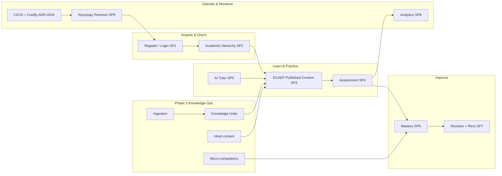

#### Advantages

- “Done” is tied to roadmap verification language (curl, browser click-through, pytest), not aspiration.
- Phase 2 is additive and ADR-governed.

#### Tradeoffs

- “Done” for SP9 commerce still depends on live Razorpay keys in real environments; without keys, honest 503/`PAYMENT_GATEWAY_NOT_CONFIGURED` is correct behavior, not a defect (ADR-0018).
- AI agents in environments without `ANTHROPIC_API_KEY` run in FallbackProvider mode (ADR-0014).

#### Implementation Notes

> **Implementation Note:** Treat root `README.md` status paragraph as stale until revised; this section and `docs/architecture/roadmap.md` are authoritative for delivery status.

#### Future Enhancements

- Public engineering changelog fed from ADR acceptances.
- Production SLO dashboards beyond admin analytics (see §11 assumptions).

#### References

- `docs/architecture/roadmap.md`
- `docs/decisions/ADR-0018-sprint9-commerce-admin-hardening-deploy.md`
- `docs/decisions/ADR-0019-multi-language-content.md` … `ADR-0029-cicd-pipeline.md`

---

### 7.4 Differentiating Thesis

#### Purpose

Articulate the competitive thesis in four interlocking capabilities that are real in the repository.

#### Background

Generic AI tutoring startups differentiate on model brand. TALOS differentiates on **system design**: Gateway discipline, editorial truth, knowledge structuring, and mastery/revision loops.

#### Problem

If differentiation is described as “full knowledge graph navigation” or “multi-provider AI already live,” the thesis becomes false (Conflict Register).

#### Solution — Four-Pillar Thesis

1. **AI Gateway with cost/latency observability and Claude wired now** — provider abstraction exists; second providers are future subclasses, not shipped integrations.
2. **ECAEP human-in-the-loop content** — Question Generator creates drafts through the same workflow as humans; Tutor retrieval reads published content.
3. **Knowledge Units (EKU)** — ingestion does not silently become student-facing assets; structured, gate-checked facts mediate generation (ADR-0024/0025/0028).
4. **Mastery + revision from real attempts** — arithmetic mastery levels and rule-based recommendations, not a Digital Twin (ADR-0015/0016; Digital Twin deferred).

#### Capability Map

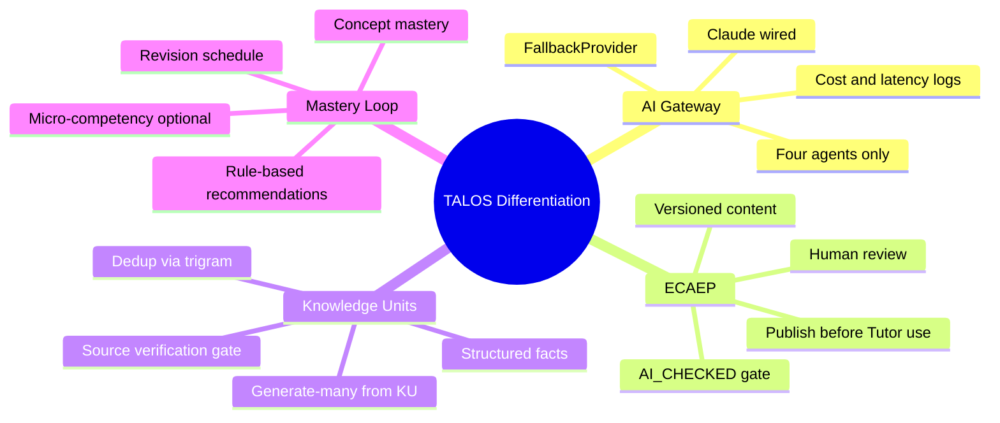

#### Advantages

- Thesis maps 1:1 to modules and ADRs.
- Hard for competitors to copy quickly without rebuilding editorial + KU discipline.

#### Tradeoffs

- Not a “magic personalization” story; personalization is mastery/revision rules, not a twin simulation.
- Content coverage speed constrained by licensing and review capacity.

#### Implementation Notes

> **Architecture Decision:** Do not market “RAG-powered tutor” until embeddings retrieval is actually implemented and ADR’d. Today’s Tutor grounds on published concept notes and concept metadata (and evolving KU wiring per ADR-0028), not vector search.

#### Future Enhancements

- When pgvector embeddings ship under a future ADR, revise this thesis pillar carefully — additive retrieval, not a rewrite of ECAEP.

#### References

- `docs/decisions/ADR-0004-ai-gateway.md`
- `docs/decisions/ADR-0009-ecaep-content-model.md`
- `docs/decisions/ADR-0024-knowledge-unit-foundation.md`
- `docs/decisions/ADR-0015-learning-mastery-scope.md`

---

### 7.5 Business Outcomes Targeted

#### Purpose

Connect platform capabilities to business outcomes without fabricating production metrics.

#### Background

SP8 analytics provide admin-facing assessment and AI usage/cost views. Broader growth accounting is not fully specified as warehouse-grade KPIs in-repo.

#### Problem

Boards ask for CAC, LTV, retention curves. Those numbers are not present as measured truths in the repository.

#### Solution — Outcome Families

| Outcome family | Platform mechanism | Evidence posture |
|---|---|---|
| Learner acquisition | Public/auth surfaces; NEET positioning | **Enterprise Assumption** for volume targets |
| Activation | First practice attempt + first tutor explain | Instrumentable via assessment/ai modules |
| Learning effectiveness | Mastery level movement; revision completion | Concept/micro-competency mastery tables |
| Content scale (legal) | Ingestion → KU → ECAEP drafts → publish | Phase 2 pipeline |
| AI margin control | `ai.ai_requests` cost estimates | Gateway logging (not billing-grade reconciliation) |
| Revenue | Razorpay Premium one-time purchase | Commerce orders as source of truth |
| Reliability | Coolify deploy + CI/CD + hardening | Deploy docs; SLOs as assumptions in §11 |

> **Enterprise Assumption:** Target Year-1 outcome ranges suitable for planning discussions — 50k–150k registered learners, 15–30% Day-7 activation (first scored attempt), 4–8% Premium conversion among monthly actives, and ≥20% relative improvement in mastery score on practiced concepts over 30 days for weekly actives. These are planning hypotheses, not measured production results.

#### Advantages / Tradeoffs

**Advantages.** Outcome families map to real modules.  
**Tradeoffs.** Financial outcomes remain assumptions until production cohorts exist.

#### Future Enhancements

- Promote assumptions to baselines after 90 days of production telemetry.

#### References

- `docs/decisions/ADR-0017-analytics-scope.md`
- `docs/decisions/ADR-0018-sprint9-commerce-admin-hardening-deploy.md`

---

### 7.6 Investment Thesis for Stakeholders

#### Purpose

Explain why continued investment is rational given what is already built and what is deliberately not built.

#### Background

Many edtech investments fund content acquisition wars. TALOS asks for capital to fund **licensing-clean content operations**, **AI Gateway usage**, **editorial staffing**, and **reliability** on a lean Coolify/Hetzner footprint — not a premature multi-cloud microservices estate.

#### Problem

Investors may compare TALOS to coaching unicorns on question count alone, ignoring legal and pedagogical quality.

#### Solution — Thesis Bullets

1. **De-risked architecture execution:** SP0–SP9 delivered on the frozen modular monolith; extraction to services remains a future refactor option (ADR-0001), not a current necessity.
2. **AI cost governance early:** Gateway logging prevents blind Anthropic spend; fallback mode enables testing without keys.
3. **Legal content posture:** ADR-0005 avoids catastrophic IP risk from coaching dumps.
4. **Defensible data loop:** Attempt → mastery → revision creates proprietary learner-state even without a Digital Twin.
5. **Phase 2 scale path:** Ingestion + Knowledge Units is the honest way to grow coverage from NCERT PDFs already in `StudyMaterial/`.
6. **India-fit monetization:** Razorpay one-time Premium matches local rails; subscriptions deferred (ADR-0018).
7. **Capital efficiency:** Coolify on Hetzner avoids early AWS/Azure complexity (ADR-0006).

> **Enterprise Assumption:** Fully loaded monthly infrastructure for MVP-scale (single VPS class, managed backups, observability extras) in the ₹25,000–₹80,000 OpEx band before AI inference; AI inference scales with active tutoring/generation usage and must be gated by product packaging. Diligence should replace this band with actual invoices.

#### Advantages

- Aligns capital with real bottlenecks (editorial + AI + reliability).
- Avoids funding a 12-agent rewrite.

#### Tradeoffs

- Less “platform multi-tenant SaaS” story until multi-tenancy is intentionally un-deferred.
- Content coverage remains a paced investment, not an overnight scrape.

#### Implementation Notes

> **Note:** Investment materials must include ADR-0007 non-goals to prevent post-funding scope thrash.

#### Future Enhancements

- Scenario model (base/upside/downside) in Volume 1 Part D with measured conversion inputs.

#### References

- `docs/decisions/ADR-0006-commerce-hosting.md`
- `docs/decisions/ADR-0007-mvp-scope-cut.md`

---

### 7.7 Risks at a Glance

#### Purpose

Surface the risks that can invalidate the thesis if ignored.

#### Risk Table

| ID | Risk | Severity | Likelihood | Mitigation in-repo / process |
|---|---|---|---|---|
| R1 | Scope re-expansion to BRD 280-table / 12-agent vision | High | Medium | ADR-0007 freeze; this blueprint’s non-goals |
| R2 | Unlicensed content pressure (“just import PW/Allen”) | High | Medium | ADR-0005; ECAEP; no bulk coaching import |
| R3 | AI cost overrun | High | Medium | Gateway logging; packaging limits; fallback for non-prod |
| R4 | Provider concentration (Claude only wired) | Medium | High | AIProvider interface ready for future OpenAI/Gemini classes — **not implemented yet** |
| R5 | Content throughput too slow for NEET calendar | High | Medium | Ingestion+KU+generate-many; still human publish gate |
| R6 | Status narrative drift (README vs roadmap) | Medium | High | Conflict Register; README fix owned by Eng Manager |
| R7 | Payment misconfiguration in production | High | Low–Med | No fake payment success path (ADR-0018); runbook |
| R8 | Security regression (auth/CSRF/headers) | High | Low–Med | SP1/SP9 hardening; CI scanning non-blocking initially (ADR-0029) |
| R9 | Overclaiming RAG/KG in sales | Medium | Medium | Conflict Register; training for GTM |
| R10 | Single-VPS hosting limits | Medium | Medium | ADR-0006 revisit cloud when earned |

#### Advantages of Explicit Risk List

Enables board monitoring without inventing a GRC platform.

#### Tradeoffs

Initial CI security scanners are non-blocking (ADR-0029) — risk acceptance must be conscious.

#### Future Enhancements

- Expand to full risk register in Volume 1 Chapter 25 companion.

#### References

- `docs/decisions/ADR-0005-content-licensing.md`
- `docs/decisions/ADR-0029-cicd-pipeline.md`
- `docs/deploy/RUNBOOK.md`

---

### 7.8 Recommendation / Decision Requested

#### Purpose

State the concrete decisions leadership should affirm.

#### Recommendations

1. **Affirm** TALOS modular-monolith + ECAEP + AI Gateway (Claude-wired) as the enduring v1 posture.
2. **Affirm** SP0–SP9 as complete and authorize Phase 2 continuation under ADRs 0019–0029 without reopening ADR-0007 deferrals wholesale.
3. **Direct** Engineering to remediate Conflict Register items (README status; `.cursor` knowledge-graph navigation wording; any prompt language implying OpenAI/Azure are live).
4. **Approve** investment emphasis on: editorial capacity, NCERT ingestion/KU quality, AI budget controls, and CI/CD gate tightening — not on Digital Twin, multi-tenant rewrite, or native mobile at this time.
5. **Require** that external claims about embeddings/RAG, full Knowledge Graph, or multi-provider AI be withheld until corresponding ADRs show implementation.

#### Decision Requested (checkbox form for wet-ink)

| Decision | Approve | Reject | Defer |
|---|---|---|---|
| Accept Volume 1 Part A v1.0.0 as internal control document | ☐ | ☐ | ☐ |
| Affirm ADR-0007 non-goals remain deferred | ☐ | ☐ | ☐ |
| Prioritize Phase 2 content/KU/CI over new agent types | ☐ | ☐ | ☐ |
| Authorize README + `.cursor` conflict remediation | ☐ | ☐ | ☐ |

#### References

- Conflict Register (end of Part A)
- `docs/architecture/roadmap.md`

---

# 8. Business Vision

### 8.0 Chapter Frame

#### Purpose

Define the long-horizon vision for Trinetra AI Learning OS (TALOS) while binding that vision to ADR-0007 constraints so vision never silently becomes unfunded scope.

#### Background

The BRD articulates an enterprise-scale learning OS: large ontology, Digital Twin, multi-tenant institutions, many AI agents, and expansive content graphs. ADR-0007 performed the cut the BRD itself postponed. Vision remains valuable as a north star; it is dangerous as an implicit backlog without sequencing.

#### Problem

Unconstrained vision creates perpetual WIP and destroys the meaning of “done” that SP0–SP9 achieved.

#### Solution

State an ambitious but constrained vision: TALOS becomes the trusted AI learning OS for high-stakes exams in India, beginning with NEET-UG, expanding exam coverage through the same academic and editorial substrate, and only adopting deferred capabilities when they are earned by evidence and ADR.

#### Architecture (vision alignment)

Vision capabilities must map to module boundaries already established (`identity`, `academic`, `cms`, `assessment`, `ai`, `learning`, `analytics`, `commerce`, `system`, `ingestion`, `knowledge`). New capabilities prefer additive schemas and Gateway agents over platform rewrites.

#### Advantages

- Preserves motivational narrative for talent and capital.
- Keeps engineering finish lines intact.

#### Tradeoffs

- Some BRD ideas remain years out; communicators must resist implying they are near-term.

#### Implementation Notes

> **Architecture Decision:** Vision statements in marketing must deep-link to ADR-0007 non-goals whenever Digital Twin, full Knowledge Graph, multi-tenancy, 12-agent orchestration, or native mobile are mentioned.

#### Future Enhancements

- Vision refresh workshop annually, outputting ADR amendments rather than slide-only promises.

#### References

- `docs/decisions/ADR-0007-mvp-scope-cut.md`
- `docs/decisions/ADR-0010-naming.md`

---

### 8.1 Vision Statement

**Vision.** Trinetra AI Learning OS (TALOS) will be the definitive AI-native learning operating system for students preparing for high-stakes competitive exams — starting with NEET-UG — where every explanation, question, and study plan is grounded in curriculum-true, editorially governed knowledge, and every practice attempt measurably improves mastery.

**Expanded vision prose.** In a decade, a learner should experience TALOS not as a PDF library with a chatbot, but as a coherent system: the academic map of their exam, published knowledge they can trust, assessments that diagnose precisely (including micro-competencies where tagged), AI tutors that cite sources rather than invent authority, revision that respects memory, and — when deliberately built later — richer graph relationships and retrieval. Institutions and parents may eventually receive portals, but web-first learner value precedes that expansion (native mobile deferred).

#### Purpose / Background / Problem / Solution (subsection)

**Purpose.** Freeze wording usable in diligence and recruiting.  
**Background.** Naming must say Trinetra AI Learning OS (TALOS), not “AI Learning OS.”  
**Problem.** Vision language often erases editorial gates.  
**Solution.** The vision statement itself includes “editorially governed knowledge.”

#### Advantages / Tradeoffs

Advantages: memorable, accurate, licensing-aligned. Tradeoffs: less sensational than “12 agents run your education.”

#### Implementation Notes

> **Note:** Do not append model brand names (Claude/OpenAI) into the vision statement; models are replaceable behind the Gateway.

#### Future Enhancements

- Localized vision sentences for Hindi marketing once content coverage justifies campaigns (UI may still be English per ADR-0019).

#### References

- ADR-0010, ADR-0005, ADR-0009

---

### 8.2 5–10 Year Horizon

#### Purpose

Provide a phased horizon that separates committed near-term capability from optional long-range bets.

#### Horizon Map

| Horizon | Timebox (planning) | Intent | Examples in / out |
|---|---|---|---|
| **H0 — Foundation Delivered** | Completed (SP0–SP9) | Ship core vertical loop | Auth, academic, ECAEP, assessment, 4 agents, mastery, revision, analytics, Razorpay, deploy |
| **H1 — Knowledge Scale** | Near-term Phase 2 | Scale licensing-clean content | Ingestion, KUs, Hindi content, micro-competency, CI/CD tightening, visual assets |
| **H2 — Depth & Retrieval** | Mid-term (future ADRs) | Improve grounding & personalization depth | pgvector embeddings/RAG **when ADR’d and built**; richer KU mastery; selective graph edges (prerequisites) without claiming full enterprise KG |
| **H3 — Platform Expansion** | 5+ years aspirational | Multi-exam + selective deferred BRD items | Other Indian exams via academic model; evaluate multi-tenancy, institution portals, additional agents — each via new ADR |
| **H4 — Long bets** | 7–10 years aspirational | Only if earned | Digital Twin, native mobile, voice tutor, live classes — all currently deferred |

> **Enterprise Assumption:** Calendar years attached to H2–H4 are planning constructs for strategy workshops, not committed delivery dates in the engineering roadmap file.

#### Advantages

- Prevents H4 items from leaking into H1 sprints.
- Clarifies that embeddings are a horizon capability, not a hidden present feature.

#### Tradeoffs

- Investors who want H4 narratives need education on sequencing.

#### Implementation Notes

> **Implementation Note:** Roadmap.md remains the near-term status authority; this horizon table is strategic framing only.

#### Future Enhancements

- Tie each horizon exit criterion to measurable content coverage and reliability objectives from §11.

#### References

- `docs/architecture/roadmap.md`
- `docs/decisions/ADR-0028-educational-knowledge-unit.md` (Phases E/F not built)

---

### 8.3 Platform vs Product Vertical

#### Purpose

Stop the organization from coupling NEET-specific assumptions into supposedly exam-agnostic core modules incorrectly — and stop treating TALOS as “only a NEET app” when raising platform capital.

#### Definitions

| Concept | Meaning | Examples |
|---|---|---|
| **Platform (TALOS)** | Reusable modules, workflows, and AI Gateway | Identity, ECAEP, Assessment engine patterns, Mastery math, Commerce provider integration pattern, Ingestion/KU pipeline shape |
| **Product vertical** | Exam-specific configuration, content, and GTM | NEET-UG hierarchy seed, NEET scoring (+4/−1), NCERT corpus in `StudyMaterial/`, India Razorpay packaging, Hindi NEET content |

#### Problem

If NEET scoring rules or NCERT structures are hardcoded as global truths without academic modeling, expansion dies. If everything is abstracted too early, NEET delivery slows.

#### Solution

- Keep academic hierarchy exam-scoped in data (ADR-0012).
- Keep content types generic in CMS (ADR-0009).
- Keep agents exam-aware via prompts + retrieved published content, not via a second platform.
- Expand to new exams by seeding academic data + content ops, not by forking the monolith.

#### Architecture

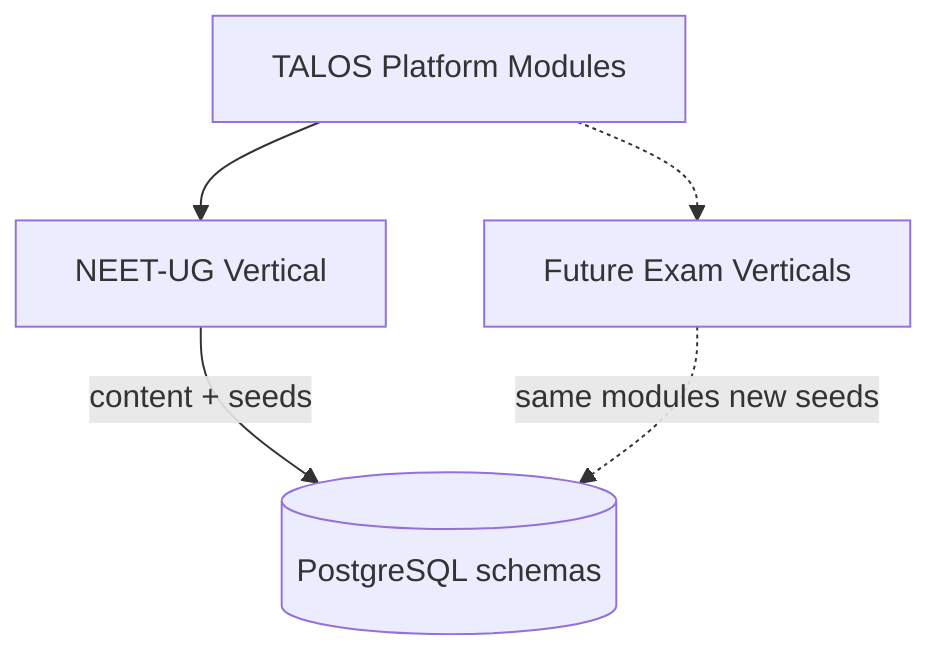

#### Advantages

- Capital narrative can include platform leverage.
- Engineering avoids microservice-per-exam temptation.

#### Tradeoffs

- Some NEET-specific UX copy will exist in the web app; discipline required to isolate strings and seeds.

#### Implementation Notes

> **Architecture Decision:** Multi-tenancy for coaching franchises is not required for multi-exam; multi-exam is data/content multiplicity inside one tenant posture until ADR-0007 multi-tenancy is intentionally reversed.

#### Future Enhancements

- Exam pack format (versioned seed + content bundle) documented in Volume 2.

#### References

- ADR-0012, ADR-0008, ADR-0007

---

### 8.4 Societal / Education System Impact

#### Purpose

Articulate educational impact without claiming unearned outcomes research.

#### Background

NEET preparation intensifies inequality when quality content and mentoring are gated by expensive coaching. TALOS cannot claim to “solve” that system alone.

#### Problem

Edtech vision decks overstate societal impact and understate content provenance ethics.

#### Solution — Impact Thesis (responsible)

TALOS aims to improve **access to curriculum-true practice and explanations** for learners who have a smartphone/web browser, by:

1. Anchoring learning to NCERT-aligned knowledge rather than opaque coaching PDFs.
2. Providing mastery visibility so students practice weak concepts instead of randomly consuming hours.
3. Using AI to explain and plan while keeping humans in the loop for question correctness.
4. Offering Hindi learner-facing content (ADR-0019) to reduce language friction even while UI remains English initially.

> **Enterprise Assumption:** Societal impact KPIs (e.g., improvement in NEET percentile attributable to TALOS) require controlled studies not present in the repository. Until then, impact claims must remain qualitative or labeled assumptive.

#### Advantages

- Ethically aligned with ADR-0005.
- Compatible with government-curriculum narratives.

#### Tradeoffs

- Will not satisfy stakeholders seeking “replace all coaching” hyperbole.

#### Future Enhancements

- Partner with independent researchers for learning-efficacy studies post-launch.

#### References

- ADR-0005, ADR-0019, ADR-0015

---

### 8.5 Vision Constraints from ADR-0007

#### Purpose

Make the MVP cut unavoidable reading for anyone quoting vision.

#### Deferred (not v1; not to be implied shipped)

From ADR-0007 and related later clarifications:

| Deferred capability | Notes |
|---|---|
| Knowledge Graph / Enterprise Domain Ontology | Full KG deferred; do not equate with Knowledge Units |
| BRD-scale 4-layer competency with ~21,000 micro-competencies | Superseded approach: ADR-0021 adds one practical micro-competency layer, handful per concept |
| Student Digital Twin | Deferred |
| Multi-tenancy | organizations reserved, not wired |
| 12-agent AI orchestrator | Four agents only in v1 |
| Multi-language content | **Partially un-deferred** by ADR-0019 (Hindi content); full UI i18n still out |
| Native mobile apps | Deferred; web-first / PWA-capable posture |
| Voice tutor, AI-generated video, live classes | Deferred |
| Parent/institution portals | Deferred |

#### Problem / Solution

**Problem.** Teams treat “deferred” as “unmentioned.”  
**Solution.** Vision materials must include this table or link here.

#### Advantages / Tradeoffs

Keeps finish lines real; disappoints maximalists.

#### Implementation Notes

> **Implementation Note:** ADR-0019/0021/0022+ are Phase 2 un-deferrals of selected items; they do not void the rest of ADR-0007.

#### Future Enhancements

- Explicit “un-deferral ADR” template whenever a deferred item is revived.

#### References

- `docs/decisions/ADR-0007-mvp-scope-cut.md`
- `docs/decisions/ADR-0019-multi-language-content.md`
- `docs/decisions/ADR-0021-micro-competency-layer.md`

---

# 9. Mission

### 9.0 Chapter Frame

#### Purpose

Translate vision into an actionable mission and map mission pillars to real backend modules.

#### Background

Mission without module mapping becomes poster poetry. TALOS already has concrete modules; mission must operationalize them.

#### Problem

Product teams optimize for content upload count or chatbot messages rather than mastery and editorial quality.

#### Solution

A mission statement centered on understanding → practice → revision → performance → decision-making, with an explicit mapping table to modules.

#### Advantages / Tradeoffs

Advantages: guides OKRs and sprint acceptance. Tradeoffs: less brand-fluffy language.

#### References

- Module tree under `apps/backend/app/modules/`
- ADRs 0011–0018, 0022–0028

---

### 9.1 Mission Statement

**Mission.** Help every NEET-UG aspirant on TALOS build durable conceptual understanding, practice with integrity-checked questions, revise what they forget, perform under exam-like conditions, and make better study decisions — using AI that is observable, source-aware, and human-supervised for assessment content.

#### Supporting clauses

1. **Understanding** — published concept notes, tutor explanations, KU-grounded generation.
2. **Practice** — assessment engine with transparent scoring.
3. **Revision** — schedule by mastery level; recommendations ranked due → weak → new.
4. **Performance** — mock tests and analytics for admins; learner dashboards for mastery.
5. **Decision-making** — study planner agent and recommendation widgets that use real weak-concept signals, not invented profiles.

---

### 9.2 Mission Pillars

| Pillar | Learner promise | System mechanism | Non-goal |
|---|---|---|---|
| **Understanding** | I can learn concepts with trusted explanations | ECAEP published notes; Tutor; KU-grounded assets | Uncited freeform hallucinations as product truth |
| **Practice** | I can practice NEET-style items | Assessment module; questions via ECAEP | Auto-published AI questions |
| **Revision** | I know what to revisit | SP7 revision schedule + recommendations | Full cognitive Digital Twin |
| **Performance** | I can simulate exam pressure | Timed mocks; scoring +4/−1 | Live proctored center networks |
| **Decision-making** | I know what to do next | Planner agent; mastery signals; admin analytics | 12-agent orchestration |

#### Purpose / Problem / Solution for pillars

**Purpose.** Create shared vocabulary across Product and Engineering.  
**Problem.** “Engagement” pillar would optimize wrong.  
**Solution.** Learning-science-aligned pillars tied to shipped mechanisms.

#### Advantages / Tradeoffs

Clear prioritization; may de-prioritize social/gamification features not in ADRs.

#### Implementation Notes

> **Note:** Evaluator agent supports understanding/practice quality via ECAEP AI_CHECKED, not learner-facing chat.

#### Future Enhancements

- Pillar-level product scorecards in analytics once event taxonomy expands beyond SP8.

---

### 9.3 Mission-to-Capability Mapping Table

| Mission pillar | Primary modules | Supporting modules | Key ADRs / docs |
|---|---|---|---|
| Understanding | `cms`, `ai` (Tutor), `knowledge` | `ingestion`, `academic` | ADR-0009, 0014, 0024–0028, ecaep.md |
| Practice | `assessment`, `cms` | `academic`, `ai` (Question Generator) | ADR-0013, 0004, 0009 |
| Revision | `learning` | `assessment`, `ai` (Planner) | ADR-0015, 0016 |
| Performance | `assessment`, `analytics` | `learning`, `commerce` (premium gating as configured) | ADR-0013, 0017, 0018 |
| Decision-making | `ai` (Planner), `learning` | `analytics`, `identity` (preferences/language) | ADR-0014, 0016, 0019 |
| Trust & access control (cross-cutting) | `identity`, `system` | all modules via RBAC | ADR-0003, 0011 |
| Sustainable operations (cross-cutting) | `commerce`, CI/CD/deploy | `ai` cost analytics | ADR-0006, 0018, 0029 |

#### Extended mapping narrative

**identity** — Ensures the right learner/author/reviewer/admin acts; sessions and permissions make ECAEP roles real.  
**academic** — Provides the exam map; without it, content and mastery have no spine.  
**cms** — Stores versioned learning artifacts; publish state is the trust boundary for Tutor.  
**assessment** — Converts published questions into attempts and scores; feeds mastery.  
**ai** — Gateway + four agents; never a side channel that bypasses ECAEP for questions.  
**learning** — Persists mastery; supports revision; Phase 2 micro-competency and KU mastery extend granularity.  
**analytics** — Admin visibility into assessment aggregates and AI spend.  
**commerce** — Monetizes Premium via Razorpay orders as source of truth.  
**system** — Cross-cutting platform concerns consistent with schema list in CLAUDE.md / ADR lineage.  
**ingestion** — Brings NCERT PDFs into controlled pipelines.  
**knowledge** — Knowledge Units / EKU hub between extraction and generation.

#### Advantages

Mission debates can be settled by pointing at modules.

#### Tradeoffs

Mapping will evolve as ADR-0028 remaining phases complete; update this table on ADR sync revisions.

#### Implementation Notes

> **Implementation Note:** New modules must earn a schema and folder under `app/modules/` with the standard shape `api/ services/ repositories/ models/ schemas/ tests/`.

#### Future Enhancements

- Auto-generate mapping from code owners file once CODEOWNERS covers modules.

#### References

- `CLAUDE.md` conventions
- ADRs listed in table

---

# 10. Corporate Strategy

### 10.0 Chapter Frame

#### Purpose

Describe corporate-level posture: how Trinetra chooses markets, builds moats, partners, and expands — consistent with frozen ADRs.

#### Background

Corporate strategy for TALOS is not “become a horizontal LLM wrapper.” It is product-led, AI-first, licensing-clean, India-first.

#### Problem

Partnership opportunities with coaching brands can look attractive and still violate ADR-0005 if they imply content ingestion without license.

#### Solution

Encode partnership and expansion rules that make illegal shortcuts corporate policy failures, not clever growth hacks.

---

### 10.1 Strategic Posture (Product-Led, AI-First, Licensing-Clean)

#### Definitions

| Posture element | Meaning for TALOS |
|---|---|
| **Product-led** | Learners experience value via practice/mastery loops before heavy sales motion; admin/editorial tools exist in same Next.js app |
| **AI-first** | AI Gateway and agents are core product surfaces, not optional widgets — with human gates for questions |
| **Licensing-clean** | NCERT-aligned / original / permissible PYQ only; no Aakash/Allen/PW/Unacademy dumps without signed license |

#### Problem / Solution / Architecture

Corporate OKRs must not reward “questions ingested” without license attestation metadata in editorial process.

#### Advantages

Legal durability; brand trust; AI grounding quality.

#### Tradeoffs

Slower top-of-funnel content bragging rights.

#### Implementation Notes

> **Architecture Decision:** Question Generator throughput is not a loophole for licensing — generated items still require human review and must not clone copyrighted stems.

#### Future Enhancements

- Content provenance fields exposed in admin coverage grids beyond current workflow states.

#### References

- ADR-0005, ADR-0004, ADR-0009

---

### 10.2 Geographic Focus (India NEET-UG First)

#### Purpose

Freeze GTM geography and exam focus.

#### Solution

- **Primary:** India, NEET-UG aspirants (Classes 11–12 and repeaters).
- **Payments:** Razorpay (UPI, cards, net banking; GST considerations per ADR-0006).
- **Hosting:** Coolify on Hetzner VPS for MVP — geography of hosting is cost/ops driven; product geography is India-first.
- **International:** Stripe/Apple/Google Play only if/when international expansion is real (ADR-0006).

> **Enterprise Assumption:** Initial paid acquisition experiments concentrate on Hindi- and English-speaking NEET markets in Tier-1/Tier-2 cities; exact city prioritization is a growth-team assumption pending campaign data.

#### Advantages

Fits stack and commerce choices.

#### Tradeoffs

Global brand storytelling deferred.

#### References

- ADR-0006

---

### 10.3 Moats

| Moat | Why it compounds | Repo reality |
|---|---|---|
| **Content quality gates (ECAEP)** | Competitors can generate text; fewer enforce versioned human review | SP3 done; Evaluator integrated |
| **Curriculum graph (academic hierarchy + micro-competencies)** | Structure enables mastery & generation targeting | SP2 + ADR-0021 |
| **Mastery & revision data** | Proprietary learner state from real attempts | SP6–SP7; not a Digital Twin |
| **AI cost control** | Unit economics visibility | `ai.ai_requests` logging |
| **Knowledge Units** | Reusable gated facts beat raw chunk RAG myths | ADR-0024–0028 |
| **Licensing posture** | Avoids takedown/extinction risk | ADR-0005 |

#### Non-moats (do not claim)

- “We have a full enterprise knowledge graph” — deferred.
- “We run twelve cooperating agents” — deferred.
- “We have RAG” — not implemented.
- “CQRS scale-out” — not implemented.

#### Advantages / Tradeoffs

Honest moats survive diligence; fake moats create legal/tech debt.

---

### 10.4 Partnership Strategy (Explicitly NO Unlicensed Coaching Content)

#### Rules

1. **Allowed:** Pedagogy advisors, SME author contracts, university outreach, payment/infra vendors, licensed content deals with written IP terms.
2. **Forbidden without signed license:** Ingesting or scraping Aakash, Allen, Physics Wallah, Unacademy, or similar copyrighted banks (ADR-0005).
3. **AI partnerships:** Model providers are Gateway adapters; Claude is current; future OpenAI/Azure OpenAI/Gemini require implementation work + config — not press-release reality.
4. **Coaching partnerships:** If pursued, prefer distribution/referral or originally authored co-branded content — never silent ingestion of their PDFs.

#### Problem / Solution

**Problem.** BD teams equate “partnership” with “content firehose.”  
**Solution.** Legal + Product must sign off on content provenance before Engineering builds importers.

#### References

- ADR-0005

---

### 10.5 Platform Expansion Path (Other Exams Later)

#### Purpose

Describe how TALOS expands beyond NEET without violating modular monolith or licensing posture.

#### Expansion sequence (strategic)

1. **Deepen NEET coverage** via ingestion/KU/ECAEP and Hindi content.
2. **Prove retention & Premium conversion** on NEET.
3. **Add adjacent exams** that reuse subjects/concepts where academic modeling fits (each exam is a new academic seed + content program).
4. **Evaluate multi-tenancy** only if B2B institution demand requires it (ADR-0007 currently deferred).
5. **Evaluate native mobile** only if web/PWA metrics show hard caps (deferred today).

#### Architecture note

Expansion is primarily **data and content operations**, not a new deployable per exam. Module extraction to microservices remains a last resort if a module earns independent scale (ADR-0001).

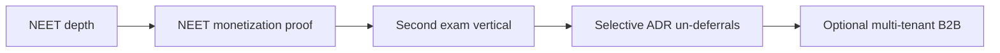

#### Advantages

Capital efficiency; shared AI Gateway benefits all exams.

#### Tradeoffs

Brand may look “NEET-only” longer than pure platform companies.

#### Implementation Notes

> **Implementation Note:** Do not create `apps/neet` and `apps/jee` frontends; keep single Next.js app unless ADR-0008 is explicitly superseded.

#### Future Enhancements

- Exam launch checklist (seeds, scoring rules, content coverage thresholds, payment SKUs).

#### References

- ADR-0001, ADR-0008, ADR-0012, ADR-0007

---

# 11. Business Objectives

### 11.0 Chapter Frame

#### Purpose

Define SMART objectives and near-term OKRs that connect TALOS capabilities to measurable business and learning outcomes, while clearly labeling repository-absent targets as **Enterprise Assumptions**.

#### Background

SP8 delivers admin analytics for assessment aggregates and AI usage/cost. Learner growth accounting, CAC/LTV, and formal SRE SLOs are not fully codified as production scorecards in the repository. Objectives must still be written for management discipline — with honesty about evidence posture.

#### Problem

Teams either (a) refuse to set targets because telemetry is incomplete, or (b) invent fake precision. Both fail enterprise planning.

#### Solution

Publish SMART objective tables with explicit assumption labels, plus OKR examples for the next two quarters that favor Phase 2 realities (content/KU/Hindi/CI) over deferred BRD epics.

#### Architecture (measurement alignment)

| Objective domain | Primary signal sources in system | Gap |
|---|---|---|
| Acquisition / activation | `identity` users; first `assessment` attempt | Marketing attribution not a first-class warehouse |
| Retention | Repeat attempts; revision completions | Cohort retention dashboards beyond SP8 needed |
| Mastery improvement | `learning.concept_mastery` / micro-competency mastery | Causal attribution studies external |
| Content throughput | ECAEP publish events; ingestion jobs; KU pass rates | Editorial staffing model external |
| AI cost | `ai.ai_requests` estimated cost | Not billing-grade vs Anthropic invoice |
| Premium conversion | `commerce.orders` PAID | Subscription metrics N/A (one-time only) |
| Reliability | Deploy runbooks, CI, uptime monitoring (ops) | Numeric SLOs below are assumptions |

#### Advantages

- Forces prioritization onto real modules.
- Prevents OKRs that demand Digital Twin or RAG prematurely.

#### Tradeoffs

- Some targets will be revised after first production quarter.

#### Implementation Notes

> **Implementation Note:** When an objective becomes measured in-product, remove the Enterprise Assumption label via an Editorial/ADR-sync revision — do not silently edit numbers without a revision row.

#### Future Enhancements

- Volume 1 Chapter 20 companion for funnel definitions.
- Wire product analytics events for activation funnel steps.

#### References

- ADR-0017, ADR-0018, ADR-0029, `docs/deploy/CI_CD.md`

---

### 11.1 SMART Objectives Table

| ID | Objective | Specific | Measurable | Achievable (posture) | Relevant pillar | Time-bound | Evidence posture |
|---|---|---|---|---|---|---|---|
| O1 | **Acquisition** | Grow registered NEET learners on TALOS web app | Monthly new registered users | Depends on GTM spend | Decision-making / access | Quarterly | **Enterprise Assumption:** +20–40% QoQ new registrations for first two post-launch quarters after public invite |
| O2 | **Activation** | Learners complete first scored practice attempt | % of new users with ≥1 submitted attempt within 7 days | Product UX already supports practice flow (SP4) | Practice | Rolling 7-day | **Enterprise Assumption:** 15–30% Day-7 activation |
| O3 | **Retention** | Learners return to practice or revision weekly | % W1 users active in W4 | Requires notification/email maturity beyond core ADRs | Revision | Monthly cohorts | **Enterprise Assumption:** 25–40% D30 retention among activated users |
| O4 | **Mastery improvement** | Improve mastery on practiced concepts | Median mastery_score delta on concepts with ≥5 attempts over 30 days | Mastery recompute exists (SP6) | Understanding / Practice | Monthly | **Enterprise Assumption:** +10 to +20 points median delta for weekly actives |
| O5 | **Content throughput** | Publish licensing-clean items via ECAEP | Published items/month; % from ingestion→KU path | Pipeline exists; humans gate publish | Understanding / Practice | Monthly | **Enterprise Assumption:** 300–800 published items/month at initial editorial staffing; raise only with headcount |
| O6 | **KU quality** | Knowledge Units pass gates | % KUs with validation_status=PASSED per ingestion job | Gates in ADR-0024 | Understanding | Per job / monthly | **Enterprise Assumption:** ≥70% pass rate on pilot-quality NCERT chapters after prompt tuning |
| O7 | **Hindi coverage** | Expand Hindi published content | % of prioritized concepts with Hindi published note or question set | ADR-0019 fallback behavior exists | Understanding | Quarterly | **Enterprise Assumption:** 30% of top-100 practiced concepts have Hindi assets within two quarters |
| O8 | **AI cost per active user** | Keep inference economically sustainable | Estimated AI cost / MAU from Gateway logs | Logging exists; packaging controls needed | All AI pillars | Monthly | **Enterprise Assumption:** Stay under ₹40–₹120 estimated AI cost per MAU depending on tutor aggressiveness; escalate if exceeded |
| O9 | **Premium conversion** | Convert engaged learners to Razorpay Premium | PAID orders / MAU | One-time purchase flow exists; needs live keys in prod | Performance / access | Monthly | **Enterprise Assumption:** 4–8% conversion of MAU after paywall packaging is finalized |
| O10 | **Reliability** | Keep production available and deployable | Uptime; failed deploy rate; rollback success | Coolify+CI exist; numeric SLO not in roadmap file | Cross-cutting | Monthly | **Enterprise Assumption (SLO placeholders):** 99.5% monthly availability target for web+API; ≤2 failed production deploys/month; rollback drill quarterly per `docs/deploy/ROLLBACK.md` |
| O11 | **Security hygiene** | Reduce vuln debt visibility lag | Time to triage high CI findings | ADR-0029 scanners start non-blocking | Trust | Monthly | **Enterprise Assumption:** Triage critical gitleaks/CodeQL findings within 5 business days; plan to promote selected scanners to blocking after cleanup |
| O12 | **Conflict hygiene** | Eliminate false status claims in repo docs | Conflict Register items closed | Process in this volume | Governance | 30 days from approval | Trackable in git PRs (README, `.cursor` wording) |

#### Notes on achievability

O5–O7 are the true strategic constraints: licensing-clean content does not scale by scrape. Corporate strategy (§10) forbids “solving” O5 by violating ADR-0005.

---

### 11.2 OKR Examples for Next Two Quarters

> **Enterprise Assumption:** Quarter labels below use a planning calendar Q1=Aug–Oct 2026 and Q2=Nov 2026–Jan 2027 for internal planning continuity with this document’s effective date. Adjust to the company’s fiscal calendar without changing KR substance.

#### Q1 OKRs (Illustrative)

**Objective A — Make Phase 2 content operations investor-evident and learner-useful**

| KR | Description | Target | Link |
|---|---|---|---|
| KR-A1 | NCERT chapters with successful ingestion jobs beyond pilot | ≥5 chapters across ≥2 subjects | ADR-0022+ |
| KR-A2 | Published items originating from KU-grounded generation (post-review) | ≥150 | ADR-0025, ECAEP |
| KR-A3 | Hindi published assets on priority concept list | ≥50 | ADR-0019 |
| KR-A4 | Micro-competencies defined on fully seeded concepts | ≥1 concept family complete beyond Ohm’s Law seed pattern | ADR-0021 |

**Objective B — Prove learning loop quality, not chatbot vanity**

| KR | Description | Target | Link |
|---|---|---|---|
| KR-B1 | Activated users completing ≥3 attempts in first 14 days | **Enterprise Assumption:** 10–20% of new users | Assessment |
| KR-B2 | Revision “Practice now” flow completion rate | **Enterprise Assumption:** ≥40% of clicks start an attempt | SP7 |
| KR-B3 | Median AI estimated cost per tutor session within budget band | Set numeric band after 2 weeks of prod logs | ADR-0014 |

**Objective C — Harden delivery credibility**

| KR | Description | Target | Link |
|---|---|---|---|
| KR-C1 | Close Conflict Register items CR-1..CR-3 | 100% | This volume |
| KR-C2 | Documented production deploy using Coolify runbook | ≥1 successful prod-like deploy | `docs/deploy/RUNBOOK.md` |
| KR-C3 | Promote at least one CI security check to blocking after cleanup | ≥1 | ADR-0029, `docs/deploy/CI_CD.md` |

#### Q2 OKRs (Illustrative)

**Objective D — Monetization readiness with honest payments**

| KR | Description | Target | Link |
|---|---|---|---|
| KR-D1 | Production Razorpay credentials configured; no fake success path | Live orders in prod | ADR-0018 |
| KR-D2 | Premium conversion among users with mastery activity | **Enterprise Assumption:** ≥5% of such MAU | Commerce |
| KR-D3 | GST/invoice operational checklist completed | Legal/finance sign-off | Ops (external) |

**Objective E — Platform depth without scope thrash**

| KR | Description | Target | Link |
|---|---|---|---|
| KR-E1 | Tutor cites published and/or KU `ncert_reference` paths in ≥X% sampled sessions | Sampling rubric owned by Product+QA | ADR-0028 wiring |
| KR-E2 | No new agent types introduced | 0 new agents unless ADR supersedes ADR-0004 | ADR-0004/0007 |
| KR-E3 | Decision on embeddings/RAG go/no-go memo | Written ADR draft accepted or explicitly deferred again | Future ADR |

---

### 11.3 Objective Dependencies and Anti-Goals

#### Dependency graph

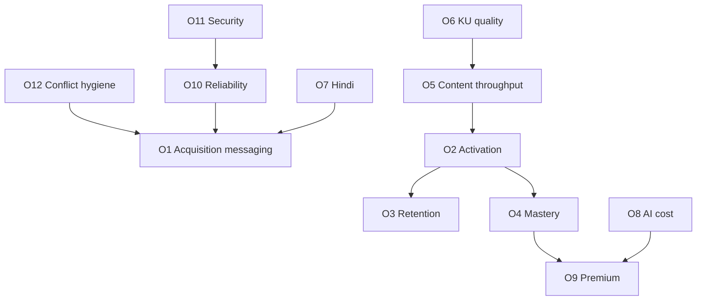

#### Anti-goals (explicit)

| Anti-goal | Why |
|---|---|
| OKR to “launch Digital Twin” | ADR-0007 deferred |
| OKR to “migrate to microservices” | ADR-0001 rejects for current scale |
| OKR to “ingest PW question bank” | ADR-0005 forbids without license |
| OKR to “enable Azure OpenAI in prod” without implementation ADR | Provider not wired |
| OKR to “ship CQRS read models” | Not in architecture |
| OKR to “100% UI Hindi i18n” | ADR-0019 explicitly excludes full UI i18n |

#### Advantages / Tradeoffs / Future Enhancements

**Advantages.** OKRs reinforce frozen decisions.  
**Tradeoffs.** Growth teams may push for anti-goals; CTO uses this section as shield.  
**Future Enhancements.** Attach owners and budget lines in Part D financial companion.

---

### 11.4 Implementation Notes for Objectives

> **Implementation Note:** AI cost objectives must use Gateway estimated costs with a disclaimer that rates are approximate (ADR-0014). Finance reconciliation is a separate process.

> **Implementation Note:** Premium status is derived from PAID orders, not a duplicated `is_premium` flag on users (ADR-0018). Metrics pipelines should respect that boundary.

> **Note:** Reliability SLOs above are placeholders for management; promoting them to contractual SLAs requires ops maturity beyond current MVP hosting ADR.

---

# 12. Product Strategy

### 12.0 Chapter Frame

#### Purpose

Specify product principles, jobs-to-be-done, capability alignment to SP0–SP9 and Phase 2 ADRs, build-vs-buy choices, and AI product principles — with diagrams suitable for DOCX conversion.

#### Background

Product strategy is already constrained by accepted ADRs. This chapter does not invent a parallel roadmap; it interprets the delivered and Phase 2 capability set for product managers and executives.

#### Problem

Without principles, AI features sprawl (mentor agents, voice, video) and content shortcuts appear.

#### Solution

Codify principles and JTBD that explain why the shipped loop is the product, and why Knowledge Units + ECAEP are the scaling strategy.

#### Architecture

Product surfaces live in one Next.js app (ADR-0008): public marketing/auth, student learning loop, admin/editorial. Backend capabilities are modular but singly deployed.

#### Advantages / Tradeoffs

Coherent product; fewer splashy demos that aren’t production paths.

#### References

- Roadmap; ADR-0004; ADR-0009; ADR-0019–0029

---

### 12.1 Product Principles

| # | Principle | Practical rule | Violations to reject |
|---|---|---|---|
| P1 | **Curriculum truth over content volume** | Every item maps to academic concept (or explicit chapter-level sheet) | Orphan question dumps |
| P2 | **Publish gate is sacred** | Student-facing content is PUBLISHED only | Tutor reading drafts; auto-publish AI MCQs |
| P3 | **AI accelerates authors, not replaces reviewers** | QGen → DRAFT via ECAEP | “AI says it’s fine” as publish authority |
| P4 | **Mastery from real attempts** | Scores and recommendations from attempt_answers | Shadow profiles / Digital Twin cosplay |
| P5 | **Observability before cleverness** | Gateway logs cost/latency; commerce fails closed | Fake payment success; silent AI provider switches |
| P6 | **One product surface** | Admin and student in one Next.js app | Premature `apps/admin` split |
| P7 | **Licensing-clean or no** | NCERT-aligned / original / licensed | Unlicensed coaching ingestion |
| P8 | **Earn complexity** | pgvector, multi-tenant, extra agents via ADR when earned | Speculative CQRS, speculative KG platform |
| P9 | **Name it TALOS** | Canonical naming always | “AI Learning OS” shorthand in new docs |
| P10 | **India-fit packaging** | Razorpay one-time Premium first | Early Stripe-only or complex subscriptions |

#### Purpose / Problem / Solution

These principles are the product translation of ADRs 0001–0010 and 0018.

#### Implementation Notes

> **Architecture Decision:** If a feature request violates P2 or P7, it requires an ADR amendment, not a “temporary” engineering exception.

---

### 12.2 Jobs-to-Be-Done

#### Learner JTBD

| Job | Situation | Motivation | Outcome | TALOS fulfillment |
|---|---|---|---|---|
| J1 | Preparing daily after school | Need conceptual clarity | Understand topic enough to solve MCQs | Published notes + Tutor |
| J2 | Unsure what to study today | Limited time | High-yield plan | Planner + recommendations |
| J3 | Forgetting previously learned | Exam months away | Retain weak concepts | Revision schedule |
| J4 | Want exam simulation | Near test date | Timed performance feedback | Mock tests + scoring |
| J5 | Prefers Hindi explanations | Language friction | Learn in Hindi when available | ADR-0019 content + fallback |
| J6 | Anxious about “wrong coaching PDFs” | Trust | Know sources are curriculum-aligned | KU ncert_reference + licensing policy |

#### Author / Reviewer JTBD

| Job | Outcome | TALOS fulfillment |
|---|---|---|---|
| J7 | Draft questions faster | More coverage | Question Generator → DRAFT |
| J8 | Review safely | Catch errors | Evaluator AI_CHECKED + human review |
| J9 | Ingest NCERT chapter | Structured knowledge + draft assets | Ingestion + KU + generate-many |
| J10 | See coverage gaps | Prioritize authoring | Coverage grid (SP3) |

#### Admin / Operator JTBD

| Job | Outcome | TALOS fulfillment |
|---|---|---|---|
| J11 | Manage roles/suspension | Secure access | Identity admin (SP9 fixes) |
| J12 | Watch AI spend | Control margins | AI analytics (SP8) |
| J13 | Deploy confidently | Low drama releases | Coolify runbook + CI/CD |

#### Non-jobs (explicitly not sold yet)

- Parent daily SMS twin reports (no parent portal).
- Franchise multi-tenant white-label (multi-tenancy deferred).
- Offline native app classrooms (native mobile deferred).

---

### 12.3 Capability Roadmap Alignment to SP0–SP9 and Phase 2 ADRs 0019–0029

#### SP0–SP9 capability alignment

| Sprint | Product capability unlocked | Principle reinforced |
|---|---|---|
| SP0 | Runnable platform foundation | P8 earn complexity |
| SP1 | Accounts, sessions, RBAC, CSRF | Trust |
| SP2 | NEET academic map | P1 curriculum truth |
| SP3 | ECAEP + question bank | P2 publish gate |
| SP4 | Practice & mocks | J3/J4 performance practice |
| SP5 | Four agents via Gateway | P3/P5 AI rules |
| SP6 | Mastery scores | P4 |
| SP7 | Revision & recommendations | J2/J3 |
| SP8 | Admin analytics | J12 |
| SP9 | Premium, hardening, deploy | P10, J13 |

#### Phase 2 ADR alignment

| ADR | Product narrative | JTBD |
|---|---|---|
| 0019 | Hindi learning content without waiting for full UI i18n | J5 |
| 0020 | Safer iteration under tests | J13 quality |
| 0021 | Finer diagnosis than whole-concept only | J3 precision |
| 0022 | Turn NCERT PDFs into pipeline jobs | J9 |
| 0023 | Many asset types from one extract | J7 scale |
| 0024 | Knowledge Units as gated truth objects | J6 trust |
| 0025 | Generation reads KUs | P1/P3 integrity |
| 0026 | Visuals from materials | Understanding |
| 0027 | Language processing support | J5 |
| 0028 | EKU formalization; selective graph/mastery upgrades; embeddings still future | J1/J6 |
| 0029 | CI/CD credibility | J13 |

#### Gap acknowledgment (product-facing)

| Expected by some users | Status | Product response |
|---|---|---|
| “ChatGPT-like any PDF brain” | Not the product | KU+ECAEP path instead |
| “Full knowledge graph explorer UI” | Deferred / limited edges only | Do not roadmap UI for full KG |
| “Azure OpenAI enterprise branding” | Not wired | Claude now; swappable later |
| “App Store app” | Deferred | Web-first |

---

### 12.4 Build vs Buy

| Capability | Decision | Rationale |
|---|---|---|
| Auth | **Build** custom JWT stack | ADR-0003; Auth.js conflicts with cookie/JWT design |
| AI orchestration Gateway | **Build** thin interface | ADR-0004 cheap insurance |
| LLM inference | **Buy** (Anthropic Claude) | Wired provider; not self-hosting models |
| Future OpenAI/Azure OpenAI | **Buy later** via new provider class | Not built now |
| CMS/ECAEP | **Build** | Core differentiator; two-table model ADR-0009 |
| Payments | **Buy** Razorpay | ADR-0006 India rails |
| Hosting orchestration | **Buy/use** Coolify on Hetzner | ADR-0006 |
| Observability SaaS | **Buy selectively** later | MVP can be lean; not mandated in ADRs |
| Vector DB SaaS | **Defer** | Embeddings/RAG not implemented; pgvector path is future in-Postgres option |
| Native mobile | **Defer / not buy yet** | ADR-0007 |
| Coaching content | **Do not buy/scrape illegally** | ADR-0005; licensed deals only |

#### Advantages

Clear spend categories for finance.

#### Tradeoffs

Building auth/CMS increases engineering ownership burden — accepted.

---

### 12.5 AI Product Principles

| # | AI product principle | Enforcement |
|---|---|---|
| A1 | **Human-in-the-loop for questions** | QGen creates ECAEP DRAFT only; never auto-publishes (ADR-0004/0014) |
| A2 | **Tutor cites published / KU sources only** | Retrieval limited to publishable knowledge paths; no draft leakage (ecaep.md; ADR-0028 evolution) |
| A3 | **Four agents until ADR says otherwise** | Tutor, Question Generator, Study Planner, Evaluator |
| A4 | **Fallback is labeled, not silent** | FallbackProvider deterministic responses without key |
| A5 | **Cost is a product feature** | Log tokens/cost/latency every call |
| A6 | **Prompt changes are version-sensitive** | Treat prompt edits as release-impacting for generation quality |
| A7 | **No fake financial AI** | Commerce does not follow AI fallback pattern (ADR-0018) |
| A8 | **Second providers are implementations, not announcements** | OpenAI/Azure OpenAI/Gemini require code + config + tests |
| A9 | **Generation consumes gated Knowledge Units** post-cutover | ADR-0025 |
| A10 | **Do not advertise RAG until built** | Embeddings phase not done (ADR-0028 Phase F open) |

#### Worked example — Question lifecycle

1. Ingestion extracts NCERT section.  
2. Structuring creates Knowledge Unit; source verification + dedup gates run.  
3. MCQ worker reads PASSED KU structured facts.  
4. CMS item created as DRAFT via workflow service.  
5. Submit → AI_CHECKED (Evaluator) → human IN_REVIEW → APPROVED → PUBLISHED.  
6. Assessment may serve question; Tutor may cite published notes/KU references.  
7. Attempt updates mastery; revision/recommendations adapt.

#### Advantages / Tradeoffs

Pedagogical safety and legal safety; slower “wow demos.”

---

### 12.6 Mermaid Product Strategy Roadmap

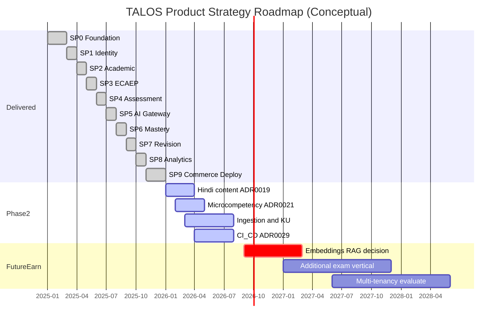

> **Note:** Gantt dates for historical SP0–SP9 are illustrative consolidation for strategy communication. Authoritative completion status is “done” in `docs/architecture/roadmap.md`, not the illustrative calendar bars.

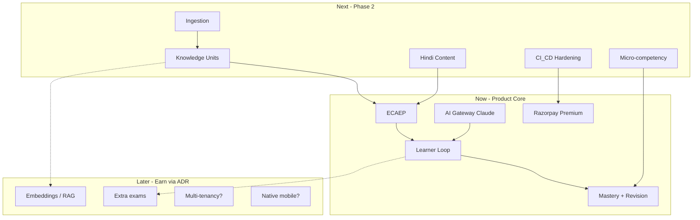

---

### 12.7 PlantUML Strategy Decomposition

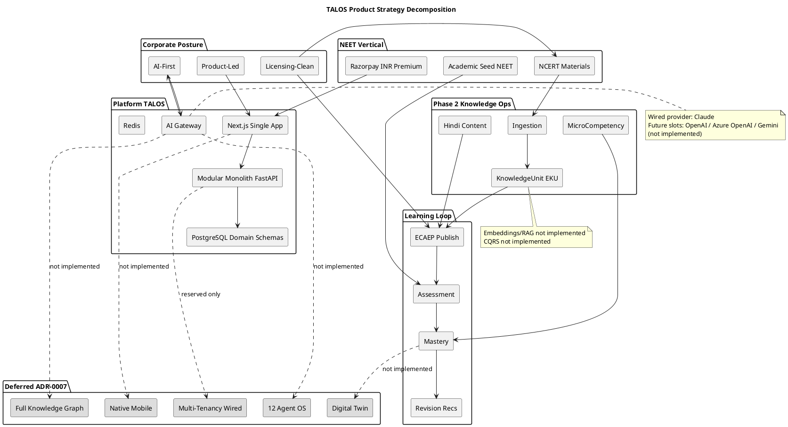

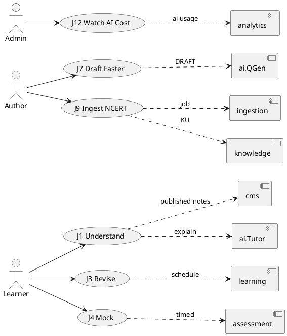

---

### 12.8 Product Strategy Advantages, Tradeoffs, Implementation Notes, Future Enhancements

#### Advantages

- Strategy is executable against existing code and ADRs.
- Reduces feature-factory behavior.
- Makes Phase 2 the obvious investment line.

#### Tradeoffs

- Competitors claiming “full KG + RAG + 12 agents” may win hype cycles temporarily.
- Hindi UI chrome remains English initially (ADR-0019), which must be explained in UX copy via fallback notices.

#### Implementation Notes

> **Implementation Note:** Product specs should cite ADR IDs in the “Constraints” section the same way engineering tasks do.

> **Implementation Note:** Any proposal introducing CQRS, microservices, Auth.js, or unlicensed imports is out of strategy unless ADR supersession occurs.

#### Future Enhancements

- Companion Chapters 13–20 for market sizing, personas, and pricing experiments.
- Formal product discovery cadence tied to mastery and content throughput objectives.

#### References

- `docs/architecture/roadmap.md`
- `docs/architecture/ecaep.md`
- `docs/decisions/ADR-0004-ai-gateway.md`
- `docs/decisions/ADR-0019-multi-language-content.md` through `ADR-0029-cicd-pipeline.md`

---

### 7.9 Executive Diligence Brief (Extended)

#### Purpose

Provide a diligence-ready narrative that an external technical advisor can cross-check against the repository in a single working day.

#### Background

SP0–SP9 completion and Phase 2 ADRs create a rare situation for an early education product: substantial vertical slice software exists before large GTM spend. Diligence should verify claims in code and ADRs, not in slide aesthetics.

#### Problem

Diligence checklists often assume microservices, multi-cloud, and multi-provider AI. Applying those checklists naively produces false negatives (“no Kubernetes multi-cluster”) and false positives (“AI platform complete”) if RAG/KG language is taken from stale prompts.

#### Solution — Diligence walkthrough

1. **Naming & identity of product:** Confirm ADR-0010 and that external one-pagers say Trinetra AI Learning OS (TALOS). Repository folder name “AI NEet Exam App” is acceptable as working title only.
2. **Architecture pattern:** Open `apps/backend/app/modules/` and confirm modular packages, not separate deployable services. Confirm single `apps/web`.
3. **Auth:** Trace register/login/refresh/logout/CSRF paths against ADR-0003; confirm cookies not localStorage tokens.
4. **AI:** Locate `AIProvider` / `ClaudeProvider` / `FallbackProvider`; confirm absence of production OpenAI/Azure client wiring.
5. **Content:** Walk ECAEP states in `docs/architecture/ecaep.md`; confirm Question Generator enters DRAFT.
6. **Mastery:** Confirm recompute on attempt submission (ADR-0015), not batch Digital Twin.
7. **Commerce:** Confirm Razorpay signature verification path and fail-closed without keys (ADR-0018).
8. **Hosting:** Read `docs/deploy/RUNBOOK.md` for Coolify/Hetzner.
9. **Phase 2:** Sample Knowledge Unit gates (ADR-0024) and CI workflows (ADR-0029).
10. **Conflicts:** Verify whether CR-1..CR-3 still open.

#### Architecture — Diligence evidence map

| Claim | Evidence artifact | Pass criterion |
|---|---|---|
| Modular monolith | `apps/backend` one app + modules | No service mesh required to run locally |
| Claude-only wired | AI provider package | Only Claude + Fallback active |
| ECAEP | cms workflow + ecaep.md | No skip-to-publish API for students |
| SP0–SP9 done | roadmap.md | All rows status done |
| No full KG | ADR-0007; no KG explorer product | KU ≠ KG |
| No CQRS | codebase patterns | Single write model request path |
| No RAG | no embedding retrieval path for Tutor as default | Do not market RAG |

#### Advantages

Shortens investor technical calls; reduces architecture re-litigation.

#### Tradeoffs

Requires maintaining this brief when ADRs change.

#### Implementation Notes

> **Implementation Note:** Attach git commit --trailer "Co-authored-by: Cursor <cursoragent@cursor.com>" hashes of key ADRs in diligence packets when cutting a release tag.

#### Future Enhancements

- Scripted “diligence bundle” zip generation from CI on tag.

#### References

- Chapters 1, 6, 7.3; Conflict Register; ADR index

---

### 7.10 Stakeholder FAQ (Executive)

| Question | Accurate answer |
|---|---|
| Is this microservices? | No. Modular monolith (ADR-0001). |
| Do you use Auth.js? | No. Custom JWT + refresh rotation + Argon2 + HTTP-only cookies + CSRF + RBAC (ADR-0003). |
| Which LLM runs in production wiring? | Claude via AI Gateway. Fallback without key. |
| Do you support OpenAI today? | No. Future provider slot only. |
| Azure OpenAI for enterprise sales? | Not implemented. Do not sell as available. |
| Is content from major coaching apps? | No, not without license (ADR-0005). |
| What is ECAEP? | Editorial workflow ensuring draft→review→publish with AI check. |
| What are Knowledge Units? | Gate-checked structured facts between NCERT extraction and asset generation. |
| Is that a knowledge graph? | No. Full KG deferred (ADR-0007). |
| Do you have RAG? | Not implemented. |
| Do you have CQRS? | Not implemented. |
| Payments? | Razorpay one-time Premium; no fake success fallback. |
| Hosting? | Coolify on Hetzner VPS for MVP. |
| Mobile app? | Native deferred; web-first. |
| Multi-tenant coaching franchises? | Not wired. |
| Are SP0–SP9 finished? | Yes per roadmap. README status line is stale (CR-3). |
| How many AI agents? | Four in v1. Twelve-agent OS deferred. |
| Hindi? | Learner content yes (ADR-0019); full UI i18n no. |
| Digital Twin? | Deferred. |
| pgvector? | Extension/planning exists in broader technical discussion; embeddings/RAG not productized. |

#### Purpose / Problem / Solution

**Purpose.** Normalize answers across CTO, Sales, and agents.  
**Problem.** FAQ drift recreates Conflict Register items.  
**Solution.** This table is normative for Part A; changes require revision.

---

### 7.11 Value Chain Economics Narrative

#### Purpose

Explain qualitatively how value accrues without fabricating audited financials.

#### Background

Coolify/Hetzner keeps infrastructure lean; Anthropic usage and editorial labor dominate variable cost as engagement grows.

#### Problem

Treating AI calls as free product magic destroys margin.

#### Solution

Product packaging must meter or gate high-cost agents (especially Tutor and generation bursts) using Gateway logs as the instrumentation spine. Premium via Razorpay funds sustained AI + editorial capacity.

> **Enterprise Assumption:** Contribution margin becomes healthy when (a) Premium conversion reaches mid-single digits of MAU, (b) tutor sessions per free user are rate-limited, and (c) generation is mostly admin-triggered batch, not unbounded learner-triggered generation.

#### Advantages / Tradeoffs

Aligns pricing to cost drivers; may reduce viral “unlimited tutor” positioning.

#### References

- ADR-0014, ADR-0018, §11 O8/O9

---

### 8.6 Vision Quality Attributes

#### Purpose

Express vision as quality attributes architects can test.

| Attribute | Vision aspiration | Current constraint |
|---|---|---|
| Curriculum fidelity | Explanations match NCERT-aligned facts | KU source verification gate; ECAEP |
| Pedagogical loop completeness | Understand→Practice→Revise→Perform | SP3–SP7 delivered |
| Trustworthiness | No silent draft leakage | Publish boundary |
| Operability | Small team can ship | Modular monolith + Coolify |
| Evolutivity | Add providers/exams without rewrite | Gateway + academic data model |
| Compliance posture | Licensing-clean | ADR-0005 |
| Honesty | Non-goals visible | ADR-0007 + Conflict Register |

#### Future Enhancements

- Add measurable thresholds per attribute into Chapter 11 as assumptions graduate to metrics.

---

### 8.7 Vision Anti-Patterns

| Anti-pattern | Why harmful | Corrective |
|---|---|---|
| “Rebuild as microservices before scale pain” | Cost without benefit | ADR-0001 |
| “Add ten agents for demo day” | Ops + cost + quality collapse | ADR-0004/0007 |
| “Import competitor PDFs overnight” | Legal extinction risk | ADR-0005 |
| “Announce multi-cloud RAG knowledge graph” | False advertising vs repo | Conflict Register |
| “Subscriptions + Apple + Stripe simultaneously” | Premature commerce complexity | ADR-0018/0006 |
| “Native apps before web retention proof” | Split surface too early | ADR-0007 |

---

### 8.8 Platform Narrative for Capital Formation

#### Purpose

Give fundraising language that remains true under code review.

**Acceptable narrative.** Trinetra has built TALOS, an AI-first learning OS, and completed the NEET vertical’s core loop through SP9, including editorialized content, assessment, mastery, revision, Claude-wired AI Gateway, Razorpay commerce, and Coolify deployment posture. Phase 2 invests in licensing-clean content scale via NCERT ingestion and Knowledge Units, Hindi learner content, finer micro-competency diagnosis, and CI/CD hardening.

**Unacceptable narrative.** “We operate a multi-agent knowledge-graph RAG platform on microservices with OpenAI and Azure, Digital Twin personalization, and full multi-tenant coaching OS.” That sentence violates multiple ADRs simultaneously.

> **Enterprise Assumption:** Seed/Series positioning emphasizes capital efficiency and truthful AI systems over TAM slide maximalism; TAM figures belong in Part B with assumption labels.

---

### 9.4 Mission Operating Cadence

#### Purpose

Connect mission pillars to weekly operating rituals.

| Ritual | Cadence | Pillar | Owner roles | Artifact |
|---|---|---|---|---|
| Editorial review board | Weekly | Understanding / Practice | Content Manager, Reviewers | ECAEP queue metrics |
| AI cost review | Weekly | Decision-making / margin | Eng Manager, CTO | `ai.ai_requests` aggregates |
| Mastery outcome review | Biweekly | Practice / Revision | Product, QA | Mastery delta samples |
| Ingestion quality review | Per major job | Understanding | Architect, SME | KU pass/fail rates |
| Conflict & docs hygiene | Monthly | Governance | Chief Architect | Conflict Register |
| Reliability drill | Quarterly | Performance (ops) | Eng Manager | Rollback drill notes |

#### Advantages

Mission becomes managerial, not poetic.

#### Tradeoffs

Ritual overhead; keep meetings short and metric-bound.

---

### 9.5 Mission Failure Modes

| Failure mode | Signal | Response |
|---|---|---|
| Publish gate bypass | Draft content visible to learners | Hotfix + incident review; restate P2 |
| Mastery theater | Recommendations ignore attempt data | Audit Planner/Rec code paths |
| Licensing breach attempt | Request to scrape coaching PDFs | Legal stop; ADR-0005 reminder |
| Agent sprawl | New agent PR without ADR | Reject until ADR-0004 amended |
| Status fiction | README/outdated decks | CR process |

---

### 9.6 Detailed Module Responsibility Statements

#### identity

Owns users, credentials (Argon2 hashes), sessions/refresh tokens, CSRF issuance patterns, roles/permissions, admin suspension semantics. Mission contribution: trusted access for learners and editorial actors.

#### academic

Owns exam hierarchy entities and Phase 2 micro-competencies. Mission contribution: curriculum spine for all learning objects.

#### cms

Owns content items/versions/reviews and workflow transitions. Mission contribution: understanding & practice trust boundary.

#### assessment

Owns practice/mock generation, attempts, scoring. Mission contribution: practice & performance pillars.

#### ai

Owns Gateway, providers, prompts, agents, request logs, study plans. Mission contribution: understanding, authoring acceleration, planning — never silent publish.

#### learning

Owns mastery projections and revision scheduling inputs. Mission contribution: revision & decision-making.

#### analytics

Owns admin aggregate views for assessment and AI cost. Mission contribution: operator decision-making.

#### commerce

Owns Razorpay orders and payment verification. Mission contribution: sustainable access to premium learning capacity.

#### system

Owns cross-cutting system schema concerns reserved in platform conventions.

#### ingestion

Owns jobs that read NCERT materials, split sections, match concepts, trigger generation pipelines.

#### knowledge

Owns Knowledge Units / EKU records, validation status, relationships used by generation and evolving tutor/mastery features.

---

### 10.6 Competitive Strategy Without Unlicensed Arms Races

#### Purpose

Explain how to compete when rivals boast larger questionable banks.

#### Solution themes

1. **Trust brand:** Curriculum-aligned + editorialized.
2. **Loop brand:** Mastery and revision beat infinite unscored quizzes.
3. **Ops brand:** AI cost visibility and fail-closed payments signal seriousness.
4. **Scale brand:** Ingestion+KU is the clean scaler.

> **Enterprise Assumption:** Share of search for “NEET AI tutor” can be bought; share of durable mastery improvement must be built. Budget tilts to content/engineering until activation OKRs stabilize.

#### Tradeoffs

Slower vanity metrics; stronger defensibility.

---

### 10.7 Corporate Policy Capsules

| Policy capsule | Statement |
|---|---|
| Content intake | No file enters learner view without ECAEP publish |
| Model providers | Only ADR-approved wired providers in production |
| Architecture changes | ADR before blueprint/marketing rewrite |
| Hosting changes | Revisit cloud when Coolify/Hetzner proven insufficient (ADR-0006) |
| Exam expansion | New exam = academic seed + content program, not new monolith fork |
| Partner content | Written license required before importer work |

---

### 10.8 Scenario Planning (Qualitative)

| Scenario | Trigger | Corporate response | Engineering response |
|---|---|---|---|
| S1 Content bottleneck | NEET calendar pressure | Hire SMEs; do not scrape | Scale ingestion jobs; keep gates |
| S2 AI cost spike | Viral tutor usage | Tighten free tier | Rate limits; monitor Gateway |
| S3 Provider outage | Anthropic disruption | Comms honesty | FallbackProvider degraded mode; prioritize second provider ADR if sustained |
| S4 Legal scare re content | Industry crackdowns | Audit provenance | Freeze risky imports; reinforce ADR-0005 |
| S5 Competitor KG hype | Marketing war | Publish honesty brief | Do not panic-build full KG |
| S6 Hosting limits | CPU/RAM ceiling | Approve cloud migration ADR | Extract only if module scale proven |

> **Enterprise Assumption:** S3 second-provider implementation, if triggered, budgets 2–4 engineering weeks for OpenAI or Azure OpenAI adapter plus config/secrets/tests — estimate only, not a commitment.

---

### 11.5 Metric Dictionary (Planning)

| Metric | Definition | Source system | Assumption? |
|---|---|---|---|
| Registered user | Account created and not deleted | identity | Measured capable |
| Activated user | ≥1 submitted attempt within 7 days of register | assessment | Measured capable |
| MAU | Users with ≥1 attempt or tutor call in 30 days | assessment/ai | Measured capable |
| Mastery delta | Change in mastery_score for concepts with ≥5 attempts | learning | Measured capable |
| Published item | content_items with PUBLISHED state | cms | Measured capable |
| KU pass rate | PASSED / (PASSED+FAILED) KUs in period | knowledge | Measured capable |
| AI cost est. | Sum estimated cost from ai_requests | ai | Approximate |
| Premium user | User with ≥1 PAID order | commerce | Measured capable |
| Availability | **Enterprise Assumption** until external uptime tool wired | ops | Assumption |

---

### 11.6 Quarterly Business Review Template Hooks

1. Conflict Register status  
2. Content throughput vs O5  
3. KU quality vs O6  
4. AI cost vs O8  
5. Activation/retention assumptions vs observed  
6. ADR amendments since last QBR  
7. Explicit reaffirmation of ADR-0007 non-goals  

---

### 11.7 Funding Use-of-Proceeds Alignment (**Enterprise Assumptions**)

| Use category | Planning allocation band | Maps to objectives |
|---|---|---|
| Editorial / SME capacity | 25–40% | O5, O7 |
| AI inference budget | 15–30% | O8, activation |
| Engineering (Phase 2 + reliability) | 25–35% | O6, O10, O11 |
| GTM experiments India | 10–20% | O1, O9 |
| Contingency / legal content review | 5–10% | O5 licensing |

These bands are **Enterprise Assumptions** for capital planning workshops, not approved budgets in-repo.

---

### 12.9 Surface Inventory (Product)

| Surface | Route group (conceptual) | Primary actors | Job clusters |
|---|---|---|---|
| Public / marketing | `(public)` | Prospects | Acquisition |
| Auth | `(auth)` | All users | Access |
| Student dashboard | `(student)` | Learners | J1–J6 |
| Practice / mocks | `(student)` | Learners | J2–J4 |
| Tutor / planner | `(student)` | Learners | J1–J2 |
| Settings / language | `(student)` | Learners | J5 |
| Author workspace | `(admin)` | Authors | J7–J9 |
| Reviewer queue | `(admin)` | Reviewers | J8 |
| Coverage / analytics | `(admin)` | Admins | J10–J12 |
| Commerce checkout | student+API | Learners | Premium |
| Ingestion triggers | admin/API | Operators | J9 |

---

### 12.10 Packaging Strategy Hypotheses

| Package | Hypothesis | Repo reality |
|---|---|---|
| Free | Enough practice + limited tutor to activate | Exact limits product-configurable; enforce via app policy |
| Premium (one-time) | Unlocks sustained AI + expanded mocks | Razorpay order PAID derivation |
| Future subscription | Recurring revenue | **Not in SP9**; requires new ADR |
| Future B2B seat packs | Institutions | Needs multi-tenancy un-deferral |

> **Enterprise Assumption:** Premium price points in INR should be tested in bands familiar to NEET aspirants (for example ₹999–₹4999 one-time) — experimental only.

---

### 12.11 Experiment Backlog (Product)

| Experiment | Hypothesis | Guardrail |
|---|---|---|
| Tutor rate limits on free tier | Improves AI margin without killing activation | Watch O2/O8 together |
| Hindi-first content push on weak chapters | Improves retention for Hindi preference users | Fallback notice clarity |
| KU-cited tutor answers | Increases trust scores in surveys | No draft leakage |
| Revision reminders (email/web push later) | Improves D30 | Privacy/consent |
| Coverage-driven authoring targets | Raises publish throughput | Do not relax review |

No experiment may violate P2/P7 principles.

---

### 12.12 Product Requirements Traceability Matrix (Sample)

| PR / capability theme | Mission pillar | ADR | Sprint/Phase | Objective IDs |
|---|---|---|---|---|
| JWT auth & RBAC | Trust | 0003/0011 | SP1 | O10/O11 |
| NEET hierarchy | Understanding | 0012 | SP2 | O5 |
| ECAEP | Understanding/Practice | 0009 | SP3 | O5 |
| Mocks + scoring | Performance | 0013 | SP4 | O2/O4 |
| AI Gateway agents | Understanding/Decisions | 0004/0014 | SP5 | O8 |
| Mastery | Practice/Revision | 0015 | SP6 | O4 |
| Revision/recs | Revision | 0016 | SP7 | O3 |
| Analytics | Decisions | 0017 | SP8 | O8 |
| Razorpay Premium | Sustainability | 0006/0018 | SP9 | O9 |
| Hindi content | Understanding | 0019 | Phase 2 | O7 |
| Micro-competency | Practice | 0021 | Phase 2 | O4 |
| Ingestion+KU | Understanding | 0022–0028 | Phase 2 | O5/O6 |
| CI/CD | Reliability | 0029 | Phase 2 | O10/O11 |

---

### 12.13 Product Strategy Deep Narrative

Trinetra’s product strategy rejects two common edtech failure modes. The first failure mode is the **content arms race**, where teams scrape or license ambiguously and drown learners in undifferentiated MCQs. ADR-0005 and ECAEP make that path a policy violation. The second failure mode is the **agent theme park**, where demos multiply personalities (mentor, twin, diagram orchestrator) without mastery instrumentation or cost control. ADR-0004 and ADR-0007 constrain TALOS to four agents and defer the rest.

Instead, TALOS concentrates product investment on a narrow, compounding loop. Academic structure makes every asset addressable. ECAEP makes every asset accountable. Assessment makes every claim about learning empirically testable. Mastery and revision convert attempts into guidance. The AI Gateway makes intelligence replaceable and measurable. Knowledge Units make generation accountable to source facts rather than raw PDF paste. Hindi content broadens access without pretending the entire UI is localized. CI/CD and Coolify make the loop shippable by a small team.

This is why Phase 2 is not a random feature pile. Multi-language content, micro-competency, ingestion, Knowledge Units, visual extraction, language processing, EKU formalization, and CI/CD each strengthen the same loop. Embeddings and full graph navigation remain earnable sequels, not silent scope.

For product managers writing PRDs, the default question is not “can a model generate this?” but “which published knowledge object and which mastery signal make this feature true tomorrow morning?” If the answer requires Digital Twin, multi-tenant franchises, or unlicensed banks, the PRD is out of strategy.

For executives, the default question is not “how do we match competitor question counts?” but “how fast can we ethically publish and how efficiently can we spend Anthropic tokens for measurable mastery movement?” Objectives in Chapter 11 exist to keep that question quantitative even when some targets remain Enterprise Assumptions.

---

### 12.14 Risks Specific to Product Strategy Execution

| Risk | Product symptom | Mitigation |
|---|---|---|
| Reviewer burnout | Queue growth, publish starvation | Staffing; limit QGen blast radius |
| Over-filtering KU gates | Too few PASSED units | Tune gates carefully; do not remove source verification |
| Under-filtering | Hallucinated facts in drafts | Keep gates + human review |
| Free-tier abuse of Tutor | Cost spike | Rate limits; Premium packaging |
| Mislabeled Hindi | English shown as Hindi | language_fallback flag UX (ADR-0019) |
| Admin/student UX confusion | Wrong tools exposed | Route groups + RBAC |

---

### 1.9 Document Production & Pandoc Profile (Extended Control)

#### Purpose

Ensure DOCX outputs preserve enterprise structure.

#### Recommended pandoc flags

- `--toc --toc-depth=3`
- `--number-sections` if desired for print
- filters for mermaid/plantuml pre-render
- retain tables and blockquotes

#### Classification marking

Every exported PDF/DOCX cover must show **Internal / Confidential**, Document ID **TALOS-VOL-01**, Version **1.0.0**, Date **2026-08-07**.

#### Advantages / Tradeoffs

Consistent artifacts; filter toolchain required for diagrams.

---

### 6.13 Onboarding Syllabus Using This Volume

| Day | Audience | Reading | Exercise |
|---|---|---|---|
| 1 | All eng/product | §7 + Conflict Register | List three non-goals |
| 2 | Backend | §9.3 + ADR-0001/0003/0004 | Trace one request through a module |
| 3 | Frontend | ADR-0008 + student/admin surfaces | Map route groups to JTBD |
| 4 | Content | ecaep.md + ADR-0005/0009 | Draft→publish dry run |
| 5 | AI | ADR-0014 + 0024/0025 | Explain why QGen cannot publish |
| 6 | Ops | deploy docs + ADR-0029 | Dry-run rollback reading |
| 7 | Leadership | §10–§12 + OKRs | Approve or amend Q1 OKRs |

---

### 7.12 Executive Capability Scorecard (As-Of 2026-08-07)

#### Purpose

Give leadership a single scorecard that distinguishes **delivered**, **Phase 2 in motion**, and **not built**, preventing average-out storytelling that hides gaps.

#### Scorecard

| Capability area | Maturity | Evidence basis | Executive read |
|---|---|---|---|
| Modular monolith runtime | Delivered | SP0 + module layout | Green |
| Identity/Auth/RBAC/CSRF | Delivered | SP1 verified | Green |
| Academic hierarchy NEET | Delivered | SP2 seeded | Green |
| ECAEP CMS | Delivered | SP3 workflow | Green |
| Assessment practice/mocks | Delivered | SP4 scoring | Green |
| AI Gateway + 4 agents | Delivered | SP5 + ADR-0014 | Green — Claude/Fallback only |
| Mastery + revision | Delivered | SP6–SP7 | Green — not Digital Twin |
| Admin analytics | Delivered | SP8 | Green — not full warehouse |
| Razorpay Premium | Delivered (integration) | SP9 / ADR-0018 | Amber until live keys+traffic |
| Coolify deploy posture | Delivered (packaging) | SP9 + runbook | Amber until prod drills habitual |
| Hindi content | Phase 2 | ADR-0019 | Amber — coverage dependent |
| Micro-competency | Phase 2 | ADR-0011/0021 lineage | Amber — seeded sparsely by design |
| Ingestion pipeline | Phase 2 | ADR-0022+ | Amber — expanding beyond pilot |
| Knowledge Units / EKU | Phase 2 | ADR-0024–0028 | Amber-Green for generation path; Tutor/graph/embeddings partial/future |
| CI/CD | Phase 2 | ADR-0029 | Amber — scanners initially non-blocking |
| Full Knowledge Graph | Not built | ADR-0007 | Red if claimed otherwise |
| Digital Twin | Not built | ADR-0007 | Red if claimed otherwise |
| Multi-tenancy wired | Not built | ADR-0007 | Red if claimed otherwise |
| 12-agent OS | Not built | ADR-0007 | Red if claimed otherwise |
| Native mobile | Not built | ADR-0007 | Red if claimed otherwise |
| Embeddings / RAG | Not built | ADR-0024/0028 | Red if marketed |
| CQRS | Not built | architecture truth | Red if marketed |
| OpenAI/Azure providers | Not built | ADR-0004 | Red if marketed |

#### Advantages

Forces precise board updates.

#### Tradeoffs

Amber items require narrative, not just color.

#### Implementation Notes

> **Note:** “Delivered” means roadmap/ADR verification posture, not proof of large-scale production load tests.

---

### 7.13 Communication Guardrails for External Decks

1. Always include non-goals slide derived from ADR-0007.  
2. Always name Claude as wired provider; list others as future.  
3. Always distinguish Knowledge Units from Knowledge Graph.  
4. Always say web-first.  
5. Always say Razorpay India-first.  
6. Never show microservice topology diagrams as current state.  
7. Never show CQRS command/query buses as current state.  
8. Never show vector RAG architecture as current state without a future watermark.  
9. Prefer module diagrams matching `app/modules/*`.  
10. Cite Document ID TALOS-VOL-01 when excerpts circulate.

---

### 8.9 Long-Horizon Capability Tree

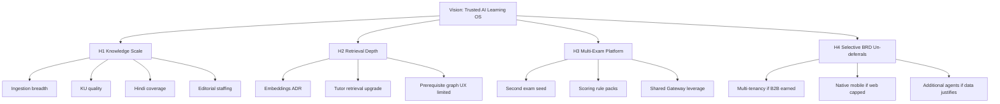

#### Narrative

H1 is the only horizon that should consume the majority of near-term capital. H2 is a set of ADR-gated technical bets. H3 is a GTM/content bet on platform leverage. H4 is optional and dangerous if pulled forward for storytelling.

---

### 8.10 Societal Impact Boundaries and Ethics

#### Purpose

Prevent impact-washing.

#### Ethical commitments aligned to repo

- Prefer curriculum-true knowledge over fear-based marketing.  
- Do not claim guaranteed NEET ranks.  
- Do not harvest unlicensed coaching IP to manufacture “completeness.”  
- Keep humans responsible for question correctness.  
- Be transparent when Hindi content falls back to English (ADR-0019).  
- Be transparent when AI is in fallback mode without keys.

> **Enterprise Assumption:** Independent efficacy studies, if funded, should pre-register outcomes (mastery deltas, timed mock improvements) rather than vanity time-on-app metrics.

---

### 9.7 Mission KPIs vs Vanity Metrics

| Prefer (mission-aligned) | Avoid (vanity) |
|---|---|
| Submitted attempts | Raw page views alone |
| Mastery level transitions | Chat messages sent without learning movement |
| Published items through ECAEP | “AI questions generated” counting drafts as live |
| KU PASSED rate | PDF files uploaded regardless of gate failures |
| Revision completions | Streaks that ignore weak concepts |
| AI cost per activated learner | “Unlimited AI” slogans |
| PAID orders | Soft-claimed premium without commerce truth |

---

### 9.8 Cross-Module Sequence Diagrams (Mission Critical Paths)

#### Path A — Learner practices and mastery updates

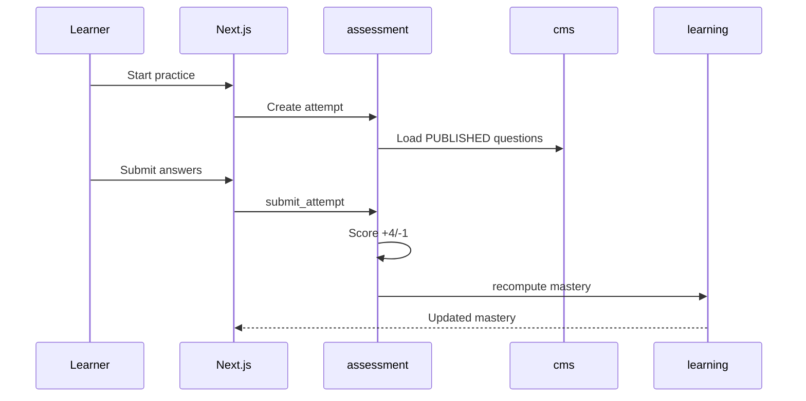

#### Path B — AI question generation remains editorialized

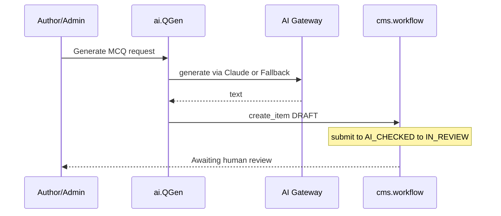

#### Path C — Ingestion to Knowledge Unit to draft assets

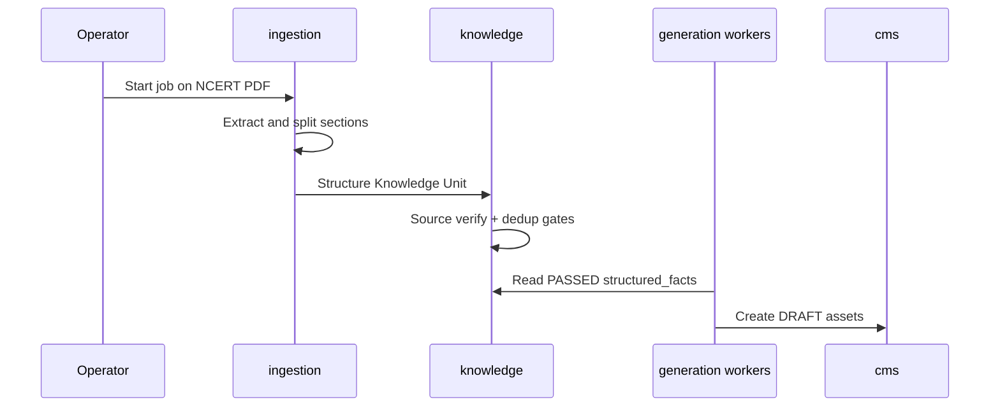

---

### 10.9 Partnership Playbooks

#### Playbook A — SME author contract

- SME produces original explanations/questions.  
- All items enter ECAEP.  
- No reuse of prior employer coaching sheets unless licensed.

#### Playbook B — Distribution partner (coaching center)

- Partner refers students to TALOS web.  
- Partner does not receive a right to upload third-party banks.  
- If co-branded content, originals only.

#### Playbook C — Model provider commercial relationship

- Anthropic today via SDK.  
- Future OpenAI/Azure OpenAI require engineering adapter + security review + ADR note.  
- Procurement cannot “enable by contract” without code.

#### Playbook D — Explicit rejection

- Any offer of “we’ll give you PW/Allen scrapes” is rejected under ADR-0005 and escalated to Security/Legal.

---

### 10.10 Geographic Expansion Gates

| Gate | Requirement before expansion beyond India NEET focus |
|---|---|
| G1 | Stable NEET activation & retention vs Chapter 11 assumptions |
| G2 | Premium economics not AI-negative |
| G3 | Content ops playbook repeatable on new chapters |
| G4 | Support burden quantified |
| G5 | New exam academic model designed without monolith fork |
| G6 | Payments/legal review for any new country |

Skipping gates reintroduces BRD overreach dynamics.

---

### 10.11 Moat Reinforcement Programs

| Program | Description | Horizon |
|---|---|---|
| Editorial excellence | Train reviewers on Evaluator reports + common NEET misconceptions | H1 |
| KU library growth | Increase PASSED units on high-traffic concepts | H1 |
| Mastery dataset ethics | Retain attempt-derived mastery as product data asset with privacy controls | H1–H2 |
| Gateway discipline | Prompt versioning + cost anomaly alerts | H1 |
| Selective retrieval | Only after embeddings ADR | H2 |

---

### 11.8 Objective Sensitivities and Leading Indicators

| Objective | Leading indicator | Lagging indicator | Sensitivity |
|---|---|---|---|
| O2 Activation | Time-to-first-attempt UX friction | Day-7 activation % | High to onboarding copy |
| O4 Mastery | Attempts per weak concept | 30-day mastery delta | High to recommendation quality |
| O5 Throughput | Reviewer hours | Publishes/month | High to staffing |
| O6 KU quality | Gate fail reasons taxonomy | Pass rate | High to PDF structure variance |
| O8 AI cost | Tutor calls per MAU | Cost/MAU | High to free tier policy |
| O9 Premium | Paywall impressions | PAID/MAU | High to price tests |
| O10 Reliability | CI flake rate | Availability assumption | High to deploy discipline |

---

### 11.9 Sample OKR Scoring Rubric

| Score | Meaning |
|---|---|
| 0.0 | Not started / blocked by conflict with ADR |
| 0.3 | Exploratory work only |
| 0.5 | Partial delivery, not learner-visible |
| 0.7 | Learner-visible but below target |
| 1.0 | Target met with evidence |
| >1.0 | Reserved; prefer raising next-quarter targets over ritual overscore |

OKRs that require deferred ADR-0007 items should be scored N/A and rewritten rather than marked failed.

---

### 11.10 Reliability Assumption Detail (**Enterprise Assumptions**)

| SLO placeholder | Proposed target | Measurement idea | Notes |
|---|---|---|---|
| API availability | 99.5% monthly | External uptime check on `/health` | Not wired as contractual |
| Error rate | <1% 5xx on authenticated APIs | Reverse proxy/app logs | Exclude controlled 503 payment-not-configured in staging without keys |
| Deploy success | ≥90% deploys healthy | Coolify + verification checklist | Use `docs/deploy/VERIFICATION_CHECKLIST.md` |
| Rollback RTO | ≤60 minutes | Drill | See ROLLBACK.md |
| Security triage | Critical secrets findings in 1 business day | gitleaks | ADR-0029 non-blocking initially |

---

### 12.15 Detailed Build-vs-Buy Decision Records (Product View)

#### Auth (Build)

Building auth keeps refresh rotation, CSRF, and RBAC in one module with educational roles. Buying Auth.js would fight cookie architecture (ADR-0003). Revisit only if a future enterprise IdP mandate appears — that would be a new ADR, possibly SSO additive, not a silent swap.

#### CMS (Build)

ECAEP is the product. A generic headless CMS would not understand AI_CHECKED transitions, Evaluator reports, or concept linkage without heavy customization costing more than the two-table model.

#### LLM (Buy)

TALOS is not a model company. Buying Claude inference is correct. Gateway ensures the buy decision is reversible.

#### Payments (Buy Razorpay)

India rails and GST practicality dominate. Abstracting multiple gateways before a second country is premature (ADR-0006/0018).

#### Vectors (Defer)

Buying a hosted vector DB now would encode RAG before Tutor grounding strategy finishes KU citation work. Revisit with ADR.

---

### 12.16 AI Agent Product Specs (v1 Boundaries)

#### Tutor

- **Job:** Explain concepts.  
- **Inputs:** Learner question + concept context + published notes / allowed references.  
- **Outputs:** Explanation text; should cite sources.  
- **Forbidden:** Reading DRAFT content; presenting fallback as human SME without label.

#### Question Generator

- **Job:** Accelerate authoring.  
- **Outputs:** DRAFT CMS items only.  
- **Forbidden:** Publishing; bypassing Evaluator/human review.

#### Study Planner

- **Job:** Propose plan from goals/dates and weak concepts from attempts.  
- **Forbidden:** Inventing a shadow Twin memory system.

#### Evaluator

- **Job:** AI check reports inside ECAEP.  
- **Forbidden:** Final publish authority.

---

### 12.17 Content Type Strategy

| Type | Learner use | Generation path | Review necessity |
|---|---|---|---|
| CONCEPT_NOTE | Understanding | Author or ingestion synthesis | Required |
| QUESTION | Practice/Performance | Author or QGen/ingestion | Required |
| FLASHCARD | Revision | Ingestion generate-many | Required |
| FORMULA_SHEET | Revision | Chapter-level generation | Required |
| DIAGRAM / VIDEO_REF | Understanding | Mostly human; visuals via ADR-0026 path | Required |

All types share one workflow (ADR-0009) — a deliberate product simplification versus 40-table CMS fantasies.

---

### 12.18 Go-to-Product Sequencing Rules

1. If a feature needs unpublished content, it is wrong.  
2. If a feature needs a new agent, write ADR first.  
3. If a feature needs unlicensed PDFs, stop.  
4. If a feature needs multi-tenant org switching, it is deferred.  
5. If a feature needs offline native shells, it is deferred.  
6. If a feature needs embeddings, write embeddings ADR and do not fake with random cosine on empty columns.  
7. If a feature needs CQRS, reject as unrequested complexity.  
8. Prefer improving KU pass quality over adding new learning gimmicks.

---

### 12.19 Product Strategy Appendix Tables for DOCX

#### RACI for major product changes

| Change type | Product | Architect | Eng Manager | Security | QA |
|---|---|---|---|---|---|
| New learner surface | A/R | C | R | C | C |
| New agent | C | A | R | C | C |
| Workflow change ECAEP | A | A | R | C | R |
| Payment packaging | A | C | R | C | C |
| Provider wiring | C | A | R | R | C |

#### Definition of Ready (Product)

- ADR constraints listed  
- JTBD identified  
- Module touch list identified  
- Non-goals listed  
- Telemetry plan listed  
- Licensing impact checked  

#### Definition of Done (Product)

- Matches ADR  
- ECAEP respected if content  
- Tests updated per module norms  
- Docs conflicts checked  
- Cost impact noted for AI paths  

---

### 2.5 Extended Version Narrative (Enterprise Memory)

Version 0.1 through 0.4 existed to stop architecture thrash: monolith, auth, commerce, hosting. Versions 0.5 through 0.7 existed to stop AI and status thrash: Claude-only honesty, SP completion, OKRs. Versions 0.8 through 1.0.0 existed to stop Phase 2 myth-making: Knowledge Units are real; full KG/RAG/CQRS are not. This progression should remain part of institutional memory so new leaders do not “discover” BRD maximalism as if it were unfinished mandatory work.

---

### 3.6 Dual Control: ADR Acceptance vs Blueprint Approval

ADR acceptance means engineering may build. Blueprint approval means executives may communicate. A capability can be ADR-accepted but not yet marketed (for example, experimental admin tools). A capability must not be marketed if ADR-deferred. Part A approval is communication control as much as technical summary.

---

### 4.9 Revision SLA

| Change class | Max time to update Volume 1 Part A |
|---|---|
| Editorial typo | 10 business days |
| ADR sync affecting §7/§12 | 5 business days |
| Conflict Register new item | 5 business days |
| Major posture reversal | Block external decks until major version ships |

---

### 5.6 TOC Governance

Chapter numbers 1–40 are reserved. Do not renumber casually; insert subsections (x.y) instead. Companion files must adopt the same headings for chapters 13–40 to keep cross-volume references stable.

---

### 6.14 Investor Reading Path (NDA)

1. Cover + §7 Executive Summary (including scorecard §7.12)  
2. Conflict Register  
3. §10 Moats and partnerships  
4. §11 Objectives with assumption labels  
5. §12.5 AI principles  
6. Pointers into ADR-0004, 0005, 0007, 0018, 0029 for deep dives  

Investors seeking microservice diagrams should be shown ADR-0001 rather than custom fiction.

---

### 7.14 Investment Objection Handling

| Objection | Response |
|---|---|
| “Too narrow vs BRD vision” | Vision constrained on purpose; SP0–SP9 done proves execution; Phase 2 scales cleanly |
| “No RAG” | Honest; KU gates may beat naive RAG on NCERT; embeddings earnable |
| “Only one LLM provider wired” | Interface exists; concentration risk accepted and documented |
| “Single VPS” | Cost control; migration criteria in ADR-0006 |
| “Content will be slow” | True without scrape; ingestion+KU is the plan; licensing is a feature |
| “No native app” | Web-first; metrics must demand mobile |
| “README says foundation in progress” | Known conflict CR-3; roadmap authoritative |

---

### 7.15 Comprehensive Platform Fact Base for Executives

#### Purpose

Consolidate immutable facts that must appear consistently in board updates, partner conversations, and hiring pitches.

#### Fact base

**Identity facts.** The platform’s canonical name is Trinetra AI Learning OS (TALOS). The first product vertical is the AI NEET Exam App targeting NEET-UG in India. Naming defects include any new document that uses “AI Learning OS” without Trinetra.

**Architecture facts.** The system is a modular monolith: one FastAPI application with internally bounded modules, and one Next.js application with route groups for public, auth, student, and admin experiences. Microservices are a non-goal at current scale. CQRS is not implemented. Multi-tenancy is not wired.

**Data facts.** PostgreSQL 17+ hosts domain schemas including identity, academic, cms, assessment, ai, analytics, commerce, system, and Phase 2 schemas such as learning, ingestion, and knowledge. Redis supports caching/session needs per stack decisions. Alembic migrations are mandatory for schema change.

**Security facts.** Authentication is custom JWT access tokens with rotating refresh tokens, Argon2 password hashing, HTTP-only secure cookies, CSRF protection, and RBAC. Auth.js is not used. Suspended users must not authenticate (SP9 hardening narrative).

**AI facts.** An AI Gateway abstracts providers. Claude is wired. FallbackProvider supports keyless environments with labeled deterministic responses. Four agents ship in v1. Cost and latency are logged per request with approximate cost estimates. OpenAI and Azure OpenAI are future slots only.

**Content facts.** Content is NCERT-aligned and/or originally authored, plus legally permissible reviewed previous-year questions where applicable. ECAEP enforces draft, AI check, review, approve, publish, archive. AI Tutor consumes published material pathways, not unchecked drafts. Unlicensed coaching banks are forbidden.

**Learning facts.** Mastery is computed from real attempts with concept-level persistence and topic rollups; micro-competencies refine granularity where tagged. Revision and recommendations are rule-based, not Twin-based.

**Commerce and hosting facts.** Razorpay provides one-time Premium purchases without a fake success path. Hosting for MVP is Coolify on a Hetzner VPS. CI/CD via GitHub Actions supports quality and image traceability; Coolify remains the deploy mechanism.

**Delivery facts.** SP0 through SP9 are done per roadmap. Phase 2 ADRs 0019–0029 cover Hindi content, tests, micro-competency, ingestion, generate-many, Knowledge Units, visuals, language processing, EKU formalization, and CI/CD.

#### Advantages

Reduces contradictory one-pagers.

#### Tradeoffs

Fact base must be revised on ADR sync quickly.

---

### 7.16 Board Update Skeleton (Reusable)

1. **Headline status:** SP0–SP9 complete; Phase 2 focus areas this month.  
2. **Learner loop metrics:** activation, attempts, mastery deltas (label assumptions if early).  
3. **Content ops:** publishes, KU pass rate, Hindi coverage.  
4. **AI economics:** estimated cost, top agent consumers, anomaly notes.  
5. **Revenue:** PAID orders, conversion.  
6. **Reliability/security:** deploys, incidents, CI findings triage.  
7. **Decisions needed:** ADR approvals, staffing, budget bands.  
8. **Non-goals reminder:** KG/Twin/12-agents/native/multi-tenant/RAG unless newly ADR’d.

---

### 8.11 Vision Storyboard for Internal All-Hands

**Frame 1 — The problem.** NEET aspirants drown in content of uneven provenance and weak feedback loops.  
**Frame 2 — The platform.** TALOS provides curriculum structure, editorial truth, assessment, mastery, and observable AI.  
**Frame 3 — The vertical.** NEET-UG proves the loop with India payments and NCERT-aligned knowledge.  
**Frame 4 — The scale path.** Ingestion and Knowledge Units grow coverage without illegal shortcuts.  
**Frame 5 — The discipline.** Deferred BRD epics remain deferred until earned.  
**Frame 6 — The ask.** Staff editorial capacity, protect publish gates, watch AI margins, close doc conflicts.

---

### 8.12 Relationship Between BRD Vision and TALOS Execution

The BRD remains useful as a brainstorm cemetery and opportunity catalog. It is not a contract. Whenever BRD language conflicts with an Accepted ADR, the ADR wins. Volume 1 exists partly to institutionalize that precedence so new contractors reading BRD.docx do not restart microservice or Auth.js debates.

| BRD theme | Execution posture |
|---|---|
| ~280 tables | Not target; MVP-scale schemas |
| 12+ agents | Four agents |
| Enterprise KG | Deferred; KU instead for now |
| Digital Twin | Deferred |
| Microservices | Rejected for now |
| Auth.js | Rejected |
| Multi-language | Partially un-deferred for content |
| Micro-competency enormous layer | Replaced by practical one-level ADR-0021 |

---

### 9.9 Mission-Aligned Hiring Profiles (**Enterprise Assumptions**)

| Role | Mission contribution | Near-term priority |
|---|---|---|
| SME Physics/Chem/Bio authors | Understanding/Practice content | High |
| Editorial reviewers | Publish quality | High |
| Full-stack engineers fluent in FastAPI/Next | Loop hardening + Phase 2 | High |
| AI platform engineer (Gateway/prompts/KU) | AI principles | High |
| SRE/DevOps (Coolify/CI) | Reliability | Medium-High |
| Growth marketer India NEET | Acquisition | Medium after activation baseline |
| Data analyst | Objectives instrumentation | Medium |
| Mobile engineers | Native deferred | Low until un-deferral |

---

### 9.10 Mission Narrative for Learners (Tone Guide)

Use empowering, precise language. Avoid fear marketing (“fail NEET forever”). Avoid implying AI guarantees ranks. Prefer “practice weak concepts,” “revise what’s due,” “explanations grounded in curriculum-aligned notes.” When Hindi is unavailable, say so via fallback notice patterns rather than silent English.

---

### 10.12 Strategic Control Points

| Control point | Owner | Cadence | Fail indicator |
|---|---|---|---|
| ADR freeze integrity | Chief Architect | Continuous | Feature merged contradicting ADR without amendment |
| Licensing intake | Product + Legal | Continuous | Unlicensed file in StudyMaterial processing path |
| AI margin | CTO + Eng Manager | Weekly | Cost/MAU above assumed band without packaging response |
| Roadmap honesty | Eng Manager | Monthly | README/deck status drift |
| Exam expansion readiness | Product | Quarterly | Second exam started without G1–G6 gates |

---

### 10.13 Platform Expansion Worked Example (Hypothetical Second Exam)

> **Enterprise Assumption:** Example uses a hypothetical second exam only to illustrate process — not a commitment to a specific exam brand or year.

1. Define academic seed differences (subjects, scoring).  
2. Estimate content coverage threshold for beta.  
3. Reuse ECAEP types and AI Gateway agents with new prompts/context.  
4. Do not fork `apps/web`; use exam switch in academic data.  
5. Keep Razorpay until geography changes.  
6. Write ADR for any scoring engine exceptions.  
7. Refuse to bootstrap via unlicensed banks.

---

### 11.11 Worked Numerical Planning Example (**Enterprise Assumptions**)

The following illustrative model is entirely assumptive and for planning workshops:

- Month M new registrations: 5,000  
- Day-7 activation 22% → 1,100 activated  
- MAU by month end: 3,000  
- Tutor calls: 1.5 per MAU → 4,500 calls  
- Estimated AI cost ₹8 per tutor call → ₹36,000 AI  
- Other AI (planning/generation admin): ₹12,000  
- Infra: ₹50,000  
- Editorial staff allocated: ₹300,000  
- Premium PAID 6% of MAU → 180 × ₹1,999 ≈ ₹359,820  

This toy model shows why editorial + AI dominate and why unlimited free tutor is dangerous. Replace every figure with actuals before board commitment.

---

### 11.12 Objective Ownership Matrix

| Objective | Accountable | Responsible | Consulted |
|---|---|---|---|
| O1 Acquisition | Head of Product | Growth | Eng |
| O2 Activation | Head of Product | Eng + Design | QA |
| O3 Retention | Head of Product | Eng | Content |
| O4 Mastery | Head of Product | Eng learning/assessment | Data |
| O5 Throughput | Head of Product | Content Manager | Architect |
| O6 KU quality | Chief Architect | AI/Ingestion eng | SME |
| O7 Hindi | Head of Product | Content | Eng |
| O8 AI cost | CTO | Eng Manager | Product |
| O9 Premium | Head of Product | Eng commerce | Finance |
| O10 Reliability | Eng Manager | DevOps/eng | QA |
| O11 Security | Security Owner | Eng | QA |
| O12 Conflict hygiene | Chief Architect | Eng Manager | Product |

---

### 12.20 End-to-End Product Journey Specifications

#### Journey 1 — New learner first week

Register → select preferences including language → browse academic hierarchy → read published concept note → ask Tutor → take practice → see mastery leave NOT_STARTED → receive recommendation → follow revision widget → optionally see Premium upgrade.

**Failure points to instrument:** drop before first attempt; tutor errors; empty content due to coverage gaps; confusing English fallback for Hindi preference.

#### Journey 2 — Author publishes AI-assisted question

Trigger generation from concept or ingestion → DRAFT created → submit → Evaluator report → reviewer requests changes or approves → publish → appears in assessment pools → learner attempts → mastery updates → analytics count.

**Failure points:** generator bypass attempts; reviewer backlog; duplicate stems; KU FAILED silently ignored.

#### Journey 3 — Operator ingests NCERT chapter

Select PDF → job checksum → extract → section split → concept match → KU structure/gates → generate assets as drafts → editorial triage → publish subset → coverage grid updates.

**Failure points:** bad matches inventing taxonomy (should skip); cost spikes; treating FAILED KUs as usable.

---

### 12.21 Product Telemetry Minimum Set

| Event / observation | Why |
|---|---|
| register_success | Acquisition |
| attempt_submitted | Activation/practice |
| mastery_level_changed | Learning outcomes |
| revision_practice_clicked | Revision loop |
| tutor_explain_called | AI usage |
| ai_request_cost_recorded | Margins (server-side already) |
| content_published | Throughput |
| ku_validation_finished | Knowledge quality |
| order_paid | Revenue |
| payment_gateway_not_configured | Ops honesty |

---

### 12.22 Competitive Messaging Matrix (Licensing-Clean)

| Competitor claim pattern | TALOS response angle |
|---|---|
| “Largest question bank” | “Editorially governed, curriculum-aligned bank” |
| “AI teacher replaces coaching” | “AI tutor + human-gated questions + mastery loop” |
| “Knowledge graph OS” | “Knowledge Units now; full KG deferred until earned” |
| “GPT-4/Azure powered” | “Claude-wired Gateway; multi-provider ready later” |
| “App for iOS/Android” | “Web-first excellence first” |

---

### 12.23 Strategy Compliance Checklist for PRDs

- [ ] Names TALOS correctly  
- [ ] Cites relevant ADRs  
- [ ] No microservice requirement  
- [ ] No Auth.js requirement  
- [ ] No unlicensed content  
- [ ] No auto-publish AI questions  
- [ ] No Digital Twin dependency  
- [ ] No full KG dependency  
- [ ] No RAG dependency unless ADR exists  
- [ ] No CQRS requirement  
- [ ] OpenAI/Azure mentioned only as future if at all  
- [ ] Metrics mapped to Chapter 11  
- [ ] Cost impact considered for AI  
- [ ] ECAEP touchpoints identified for content  

---

### 1.10 Distribution & Watermarking Guidance

Internal exports should carry footer text: `TALOS-VOL-01 v1.0.0 | Internal/Confidential | © Trinetra`. NDA investor excerpts should watermark pages and omit raw security runbook specifics when not required, while retaining architecture honesty sections and Conflict Register summaries.

---

### 6.15 How Architects Should Annotate This Volume

Architects may leave review comments as proposed Revision History entries, but normative changes to capabilities require ADRs. Blueprint annotations that attempt to “temporarily” authorize deferred work are invalid.

---

### 7.17 Residual Unknowns Explicitly Outside Part A

Part A does not settle final Premium INR price, final free-tier tutor caps, final second exam choice, final embeddings vendor choice, or final multi-cloud destination. Those are either Enterprise Assumptions for experimentation or future ADR subjects. Pretending Part A settles them would recreate BRD overclaim patterns.

---

### 12.24 Closing Strategy Statement

Trinetra AI Learning OS (TALOS) wins by being a disciplined learning operating system: modular, observable, licensing-clean, editorially serious, and AI-accelerated without being AI-unguarded. The AI NEET Exam App is the proving vertical. SP0–SP9 demonstrate that the proving vertical’s core loop can be built. Phase 2 demonstrates that ethical scale has a concrete engineering path through ingestion and Knowledge Units. Everything else in the maximal BRD remains optional until reality and ADRs say otherwise.

Leadership approving this Part A is not approving complacency; it is approving a finishable strategy. The next excellence gains come from content throughput quality, AI margin control, instrumentation of objectives, conflict remediation in README and `.cursor` packs, and steady Phase 2 execution — not from renaming the system into microservices or promising twelve agents on a slide.

---

### 7.18 Integrated Executive Risk-and-Opportunity Matrix

#### Purpose

Combine risks from §7.7 with opportunity upside so leadership decisions weigh both sides without reopening deferred scope.

| Theme | Opportunity if executed | Risk if mismanaged | Strategic response |
|---|---|---|---|
| ECAEP quality | Trust moat and safer AI grounding | Review bottlenecks slow coverage | Staff reviewers; keep gates |
| Knowledge Units | Ethical content scale + traceability | Gate tuning errors | Measure pass reasons; do not delete gates |
| AI Gateway | Provider optionality later; cost visibility now | Claude concentration; cost spikes | Keep interface clean; rate-limit productize |
| Mastery loop | Differentiated retention | Over-simple scoring criticized | Improve via micro-competency, not Twin theater |
| Razorpay Premium | India-fit monetization | Misconfigured keys / support load | Fail closed; runbook drills |
| Coolify/Hetzner | Capital efficiency | Scaling ceiling | ADR-0006 revisit criteria |
| Phase 2 Hindi | Broader access | Partial coverage UX confusion | Fallback honesty |
| Documentation honesty | Diligence credibility | CR-1..CR-3 lingering | Remediate post-approval |

#### Implementation Notes

> **Architecture Decision:** Opportunity framing must never be used to justify unlicensed content intake or auto-publish of AI questions.

#### Future Enhancements

- Convert matrix rows into quarterly KR owners in the QBR template (§11.6).

---

### 8.13 Vision Conformance Test Questions

Before any all-hands vision slide is approved, answer:

1. Does the slide use Trinetra AI Learning OS (TALOS)?  
2. Does it imply microservices? If yes, reject.  
3. Does it imply OpenAI/Azure are live? If yes, reject.  
4. Does it equate Knowledge Units with a full Knowledge Graph? If yes, rewrite.  
5. Does it promise Digital Twin, native apps, or twelve agents as near-term? If yes, move to deferred appendix.  
6. Does it acknowledge ECAEP human review for questions? If no, reject.  
7. Does it acknowledge SP0–SP9 completion accurately? If it says “foundation in progress,” reject (CR-3).  

---

### 9.11 Mission-to-OKR Quick Map

| Pillar | Primary OKR anchors |
|---|---|
| Understanding | KR-A2, KR-A3, KR-E1 |
| Practice | KR-B1, O4 |
| Revision | KR-B2, O3 |
| Performance | Mock participation metrics under O2/O4 |
| Decision-making | Planner usage + recommendation acceptance (instrument) |

---

### 10.14 Strategy One-Pager (Internal)

**Aspire:** Trusted AI learning OS for high-stakes exams.  
**Focus now:** NEET-UG India.  
**System:** Modular monolith + ECAEP + Claude Gateway + mastery loop.  
**Scale cleanly:** NCERT ingestion → Knowledge Units → human publish.  
**Make money:** Razorpay Premium, AI-aware packaging.  
**Do not:** scrape coaching banks; pretend RAG/KG/Twin/mobile/multi-tenant/12 agents are shipped.  
**Operate:** Coolify/Hetzner + CI/CD; ADR-first change.  

---

### 11.13 Assumption Register Snapshot

| Assumption ID | Statement | Review trigger |
|---|---|---|
| EA-01 | Day-7 activation 15–30% | 90 days prod data |
| EA-02 | Premium conversion 4–8% MAU | 90 days with live Razorpay |
| EA-03 | AI cost ₹40–₹120 / MAU sustainable band | Monthly cost review |
| EA-04 | 99.5% availability placeholder SLO | After uptime tooling |
| EA-05 | 300–800 publishes/month staffing band | Monthly content ops |
| EA-06 | Infra OpEx ₹25k–₹80k before AI | Invoice review |
| EA-07 | Second provider 2–4 eng weeks if needed | Provider outage scenario |

---

### 12.25 Final Part A Handoff Checklist to Companion Volumes

| Handoff topic | Goes to | Must preserve |
|---|---|---|
| Module internals & API envelope | Volume 2 | Modular monolith |
| Agent prompts & KU AI lifecycle | Volume 3 | Claude wired; no fake RAG |
| Schema & mastery math | Volume 4 | No CQRS fiction |
| Auth/CSRF/RBAC/payments security | Volume 5 | ADR-0003/0018 |
| Coolify/CI/rollback | Volume 6 | ADR-0029 + deploy docs |
| Market sizing & pricing tests | Volume 1 Part B | Enterprise Assumption labels |
| Org/operating model | Volume 1 Part C | ECAEP roles |

When companions are written, they should deep-link to Conflict Register closure PRs rather than re-describe conflicts as if unresolved if already fixed.

---

### 12.26 Exhaustive Non-Goals Restatement (Product Strategy Seal)

The following are **not** Part A commitments and must not be scheduled as stealth work:

1. Full Enterprise Knowledge Graph navigation product.  
2. Student Digital Twin.  
3. Wired multi-tenancy across organizations.  
4. Twelve-agent orchestration OS.  
5. Native iOS/Android application development program.  
6. Voice tutor, AI video course factory, live classes.  
7. Parent and institution portals as GA features.  
8. OpenAI/Azure OpenAI production providers without implementation ADRs.  
9. Embeddings/RAG marketing or architecture as current state.  
10. CQRS buses and microservice extraction without scale evidence.  
11. Auth.js migration.  
12. Unlicensed coaching content ingestion.  
13. Auto-publish paths for AI-generated questions.  
14. Subscription billing complexity beyond ADR-0018 one-time Premium without new ADR.  
15. Full UI i18n program beyond ADR-0019 content language scope.

This seal closes Part A’s strategic body before the Conflict Register tracks known documentation defects.

---

### 12.27 Part A Completeness Affirmation

#### Purpose

Affirm that Chapters 1–12 of Volume 1 Part A are intentionally complete for executive and product control use, with companion chapters 13–40 reserved for later files under the same numbering scheme.

#### Background

Enterprise blueprints often ship with “TBD” sections that undermine trust. This Part A avoids placeholders by either stating repository-backed facts or labeling non-repo figures as Enterprise Assumptions.

#### Problem

Readers may assume missing market chapters mean incomplete strategy. In reality, strategy constraints and delivery truth are fully specified here; market sizing belongs in Part B.

#### Solution

Treat Part A as the binding strategy-and-control volume. Use Part B+ for commercial depth. Use Volumes 2–6 for engineering depth. Use ADRs for normative change.

#### Architecture relevance

Documentation architecture mirrors software architecture: modular parts with hard boundaries, shared numbering, and a single source of truth for decisions (`docs/decisions/`).

#### Advantages

- No false TBD debt in Chapters 1–12.  
- Clear handoff edges to companions.  
- Diligence can proceed immediately on architecture honesty and delivery status.

#### Tradeoffs

- Market/financial readers must wait for Part B or accept assumption-labeled planning figures in §11.  
- Diagram rendering for DOCX requires an extra toolchain step.

#### Implementation Notes

> **Implementation Note:** When Part B is authored, do not duplicate Conflict Register; reference CR IDs and closure PRs.  
> **Note:** Word-count ambition supports print parity with architecture-center documents; substance remains ADR-grounded rather than padded with lorem ipsum.

#### Future Enhancements

- Automated link checker from this file to all ADR paths listed in References (Part A).  
- DOCX generation pipeline documented under Chapter 40 companion.

#### References

- Chapter 5 Table of Contents  
- Chapter 6 How to Use This Document  
- `docs/decisions/ADR-0001-modular-monolith.md` through `docs/decisions/ADR-0029-cicd-pipeline.md`  
- `docs/architecture/roadmap.md`  
- `docs/architecture/ecaep.md`

---

### 7.19 Summary Decision Card (Printable)

| Item | Statement |
|---|---|
| Platform | Trinetra AI Learning OS (TALOS) |
| Vertical | AI NEET Exam App (NEET-UG India) |
| Architecture | Modular monolith (FastAPI + Next.js) |
| AI | Gateway; Claude wired; others future |
| Content | NCERT-aligned/original; ECAEP; no unlicensed coaching banks |
| Learning | Mastery + revision from attempts; Twin deferred |
| Knowledge | Knowledge Units/EKU in Phase 2; full KG deferred; RAG not implemented |
| Commerce | Razorpay one-time Premium |
| Hosting | Coolify on Hetzner VPS |
| Delivery | SP0–SP9 done; Phase 2 ADRs 0019–0029 |
| Docs debt | CR-1 providers wording; CR-2 KG navigation; CR-3 README status |
| Decision | Approve Part A v1.0.0; fund Phase 2 discipline; remediate conflicts |

---

### 12.28 Extended Enterprise Narrative — Strategy Continuity

Trinetra AI Learning OS (TALOS) is intentionally boring in the ways that matter for enterprise credibility and intentionally ambitious in the ways that matter for learner outcomes. It is boring about architecture fashion: modular monolith, not microservices theater. It is boring about payments: Razorpay with fail-closed configuration, not simulated success. It is boring about content legality: NCERT-aligned and original authorship, not coaching scrapes. It is ambitious about the learning loop: published knowledge, assessed practice, mastery computation, revision scheduling, and AI assistance that can be observed, costed, and replaced behind a Gateway.

The AI NEET Exam App is the first product vertical precisely because NEET-UG provides a sharp curriculum spine, a national exam calendar, India payment rails, and a clear quality bar around NCERT. Platform expansion to other exams is a data-and-content operation on the same modules, not a rewrite. Multi-tenancy, native mobile, Digital Twin, twelve agents, and full Knowledge Graph navigation remain deferred until evidence and ADRs justify them.

Phase 2 is therefore not a random backlog. Hindi learner content widens access without pretending UI localization is finished. Micro-competencies refine diagnosis without inventing twenty-one thousand placeholder rows. Ingestion and Knowledge Units create the only honest path to content scale that still respects ECAEP. CI/CD makes delivery claims auditable. Embeddings and RAG remain future infrastructure decisions, not silent features.

Executives approving this Part A are approving continuity: keep shipping the loop, keep labeling assumptions, keep closing documentation conflicts, and keep refusing shortcuts that would trade short-term question counts for long-term legal and pedagogical failure.

#### Purpose

Seal Part A with continuity language usable in all-hands and diligence.

#### Background

Strategy documents fail when the closing section invents new scope. This section invents none.

#### Problem

Stakeholders forget constraints after long reading.

#### Solution

Restate the frozen posture in prose.

#### Advantages / Tradeoffs

Clarity versus repetition; repetition is acceptable in controlled documents.

#### Implementation Notes

> **Architecture Decision:** Any proposal that requires reversing ADR-0001, ADR-0003, ADR-0004 (Claude-wired), ADR-0005, or ADR-0007 wholesale must be a new major version of this blueprint, not a footnote.

#### Future Enhancements

- Translate this continuity narrative into a one-page board insert.

#### References

- ADR-0001, ADR-0004, ADR-0005, ADR-0007, ADR-0010, roadmap.md

---

### 11.14 Objective Review Cadence Detail

| Cadence | Forum | Inputs | Outputs |
|---|---|---|---|
| Weekly | AI cost + content ops standup | Gateway costs, KU pass rates, ECAEP queue | Tactical adjustments |
| Biweekly | Product learning review | Activation, mastery deltas | Backlog ordering |
| Monthly | Engineering reliability | Deploy outcomes, CI findings | Gate tightening plan |
| Quarterly | QBR | All O1–O12 + assumptions | OKR scores; ADR agenda |

> **Enterprise Assumption:** QBR score targets for early quarters emphasize learning instrumentation quality over aggressive revenue, until Premium conversion baselines stabilize under live Razorpay traffic.

---

### 10.15 Corporate Strategy Guardrail Tests

Before approving a partnership, campaign, or architecture initiative, answer:

1. Does it require unlicensed coaching content? If yes, stop.  
2. Does it require claiming OpenAI/Azure are live? If yes, stop.  
3. Does it require a microservice split? If yes, demand scale evidence + ADR.  
4. Does it require Digital Twin or twelve agents? If yes, defer.  
5. Does it weaken ECAEP publish gates? If yes, stop.  
6. Does it improve mastery, coverage, AI margin, or reliability? If no, deprioritize.

---

### 9.12 Mission Success Stories (Illustrative, Not Empirical)

> **Enterprise Assumption:** The following are illustrative learner stories for product communication workshops, not measured case studies.

**Story A — Understanding.** A Class 12 student opens Ohm's Law, reads a published concept note, asks the Tutor for a clarification that cites the note, then practices five questions and moves from LEARNING toward PRACTICING.

**Story B — Revision.** Two weeks later, revision scheduling surfaces the same concept as due; the student practices again and reaches MASTERED after sufficient attempts.

**Story C — Hindi access.** A learner with Hindi preference receives Hindi published items when available and a clear English fallback when not, rather than an empty page.

**Story D — Editorial integrity.** An AI-generated hard MCQ never reaches learners until a human reviewer approves it in ECAEP after Evaluator checks.

---

### 8.14 Vision Boundary Diagram Narrative

Vision without boundaries becomes BRD maximalism. Boundaries without vision become a practice app with a chatbot. TALOS holds both: a long horizon for a trusted learning OS, and a short horizon that finishes real loops. Knowledge Units are the bridge technology for ethical scale. They are not a marketing synonym for Knowledge Graph.

---

### 7.20 Executive Closing Checklist

- [ ] Platform named TALOS  
- [ ] Modular monolith stated  
- [ ] Claude wired; others future  
- [ ] ECAEP stated  
- [ ] SP0–SP9 done stated  
- [ ] Phase 2 named accurately  
- [ ] Deferred list includes KG, Twin, multi-tenant, 12 agents, native mobile  
- [ ] RAG/CQRS not claimed  
- [ ] Razorpay + Coolify/Hetzner stated  
- [ ] Enterprise Assumptions labeled  
- [ ] Conflict Register acknowledged  
- [ ] Decision requested table ready for signatures  

---

### 12.29 Traceability From Strategy To Repository Paths

| Strategy theme | Primary paths |
|---|---|
| Modular monolith | `apps/backend/app/modules/`, ADR-0001 |
| Single web app | `apps/web/`, ADR-0008 |
| Auth | `apps/backend/app/modules/identity/`, ADR-0003 |
| AI Gateway | `apps/backend/app/modules/ai/`, ADR-0004/0014 |
| ECAEP | `apps/backend/app/modules/cms/`, `docs/architecture/ecaep.md` |
| Assessment | `apps/backend/app/modules/assessment/`, ADR-0013 |
| Mastery/revision | `apps/backend/app/modules/learning/`, ADR-0015/0016 |
| Analytics | `apps/backend/app/modules/analytics/`, ADR-0017 |
| Commerce | `apps/backend/app/modules/commerce/`, ADR-0018 |
| Ingestion | `apps/backend/app/modules/ingestion/`, ADR-0022+ |
| Knowledge Units | `apps/backend/app/modules/knowledge/`, ADR-0024–0028 |
| Deploy/CI | `docs/deploy/*`, ADR-0029 |
| Roadmap truth | `docs/architecture/roadmap.md` |

#### Purpose

Make strategy falsifiable against the filesystem.

#### Problem

Strategy that cannot point to folders becomes slideware.

#### Solution

Path traceability table above.

#### Advantages / Tradeoffs

Advantages: auditability. Tradeoffs: paths may move with refactors — update on ADR sync.

#### Implementation Notes

> **Note:** Package layout under each module should remain `api/ services/ repositories/ models/ schemas/ tests/` per CLAUDE.md.

#### Future Enhancements

- CODEOWNERS mapping per module for review routing.

#### References

- `CLAUDE.md`
- ADR module-scope records 0011–0018, 0022–0029

---

### 7.21 Capability Maturity Commentary

Delivered capabilities (SP0–SP9) create a complete learner and operator loop. Phase 2 capabilities increase content scale and diagnosis granularity without changing the loop’s shape. Deferred capabilities would change the shape (Twin, multi-tenant, native, 12 agents, full KG) and therefore remain outside the default investment thesis. Embeddings/RAG would change retrieval mechanics inside the AI path; they are earnable but not present, and must not be implied by pgvector mentions alone.

> **Enterprise Assumption:** A formal capability maturity model (CMMI-like levels per module) can be introduced after two production quarters; until then, the executive Green/Amber/Red scorecard language in this Part A is sufficient.

---

### 6.16 Evidence Hierarchy Reminder

1. **Accepted ADR** — normative for architecture/product constraints.
2. **Roadmap status table** — normative for SP0–SP9 completion claims.
3. **Code + tests + deploy docs** — normative for “does it run”.
4. **This blueprint** — normative for executive narrative, assuming 1–3 agree.
5. **BRD.docx / old prompts** — non-normative ideation only.

---

### 11.15 Planning Bands Recap (All Enterprise Assumptions)

| Band | Planning range | Use |
|---|---|---|
| Day-7 activation | 15–30% | Product |
| D30 retention (activated) | 25–40% | Product |
| Premium conversion of MAU | 4–8% | GTM/Finance |
| Publishes/month | 300–800 | Content ops |
| KU pass rate | ≥70% on pilot-quality chapters | AI/Ingestion |
| AI cost per MAU | ₹40–₹120 | CTO |
| Availability placeholder | 99.5% monthly | Ops |
| Infra OpEx before AI | ₹25,000–₹80,000 / month | Finance |

These bands are not audited results. Replace with measured baselines after production telemetry matures.

---

### 8.15 Vision Continuity With Phase 2

Phase 2 does not rewrite the vision; it densifies the first vertical. Hindi content, micro-competency, ingestion, Knowledge Units, visual extraction, language processing, EKU formalization, and CI/CD are all mechanisms for making the vision true at greater coverage and higher operational confidence. They are not permission to reopen Digital Twin, multi-tenant franchises, or twelve-agent orchestration without new ADRs.

---

### 9.13 Mission Measurement Sketch

| Pillar | Near-term measurable proxy |
|---|---|
| Understanding | Published notes read + tutor explains on concepts with published notes |
| Practice | Submitted attempts / activated user / week |
| Revision | Revision practice starts / due items |
| Performance | Mock completions near exam windows |
| Decision-making | Recommendation accept rate; planner generations used |

Exact instrumentation may evolve; proxies must remain grounded in assessment, cms, learning, and ai modules.

---

### 10.16 Moat Erosion Watchlist

| Moat | Erosion signal | Response |
|---|---|---|
| ECAEP | Pressure to skip review for speed | Refuse; staff reviewers |
| Licensing-clean | Partner offers scrapes | Legal reject |
| AI cost control | Missing Gateway logs in new agents | Block merge |
| Mastery data | Features ignoring attempt truth | Redesign |
| KU discipline | Generation reading raw text again | Regress to ADR-0025 |

---

### 12.30 Part A Publication Record

| Field | Value |
|---|---|
| Document ID | TALOS-VOL-01 |
| Part | A — Front Matter & Strategy |
| Chapters | 1–12 + Conflict Register + References |
| Version | 1.0.0 |
| Date | 2026-08-07 |
| Classification | Internal / Confidential |
| Organization | Trinetra |
| Canonical name | Trinetra AI Learning OS (TALOS) |
| Vertical | AI NEET Exam App (NEET-UG) |
| Normative peers | docs/decisions/*, docs/architecture/roadmap.md, docs/architecture/ecaep.md, docs/deploy/* |

#### Purpose

Provide a machine- and human-readable publication stamp at the end of the strategy body.

#### Background

Controlled documents need an unambiguous stamp before conflict and reference sections.

#### Problem

Excerpts circulate without version identity.

#### Solution

Publication record table above.

#### Advantages / Tradeoffs / Future Enhancements

Advantages: excerpt hygiene. Tradeoffs: must update on version bump. Future: auto-stamp from CI tag.

#### References

- Chapter 1 Document Control
- Chapter 2 Version History

---

### 1.14 Classification Handling

Internal / Confidential materials may be shared with employees and NDA counterparties on a need-to-know basis. Do not post this blueprint to public repositories, public Notion pages, or unauthenticated investor data rooms. When producing redacted investor excerpts, retain architecture honesty (including non-goals) and remove only operational secrets from deploy runbooks if those were copied in.

#### Implementation Notes

> **Note:** This Markdown file contains no production secrets; still treat strategic and risk content as confidential.

---

### 12.31 Reader Certification Statement

By using this Part A for planning, hiring, fundraising, or engineering prioritization, readers acknowledge that Trinetra AI Learning OS (TALOS) is a modular monolith with Claude as the only wired AI provider today; that OpenAI and Azure OpenAI remain future provider slots; that ECAEP human review gates question publishing; that SP0 through SP9 are complete per the roadmap; that Phase 2 centers on Knowledge Units, ingestion, micro-competency, Hindi content, and CI/CD; and that full Knowledge Graph, Digital Twin, multi-tenancy, twelve-agent orchestration, native mobile, embeddings/RAG productization, and CQRS are not current delivered architecture. Market and financial figures labeled Enterprise Assumption are planning hypotheses pending measured production evidence.

---

# Conflict Register

### Purpose

Document known contradictions between repository artifacts and the frozen ADR/roadmap truth so executives and agents stop propagating errors.

### Background

Large vision docs and agent prompt packs predate or outlive ADR acceptance. Three conflicts are material as of 2026-08-07.

### Problem

Silent contradictions destroy diligence trust and cause agents to implement deferred or non-existent capabilities.

### Solution

Maintain this register until each conflict is closed by PR; Volume 1 approval explicitly authorizes remediation (see §7.8).

---

### CR-1 — Prompt/stack mentions of OpenAI / Azure OpenAI vs ADR-0004 Claude

| Field | Detail |
|---|---|
| **Conflict ID** | CR-1 |
| **Severity** | High (external messaging / agent behavior risk) |
| **ADR truth** | ADR-0004 / ADR-0014: AI Gateway abstraction with **Claude as the only wired provider**. OpenAI / Gemini (and similarly Azure OpenAI) are **future** `AIProvider` implementations — “a new class + a config change,” not current integrations. |
| **Conflicting artifacts** | Historical BRD/enterprise prompt language and any stack diagrams that list OpenAI/Azure OpenAI as if live; casual “multi-provider” marketing shorthand. Gateway code comments correctly speak of future subclasses — that must not be paraphrased as “supported today.” |
| **Correct statement** | “TALOS AI Gateway is production-wired to Claude, with a deterministic FallbackProvider when `ANTHROPIC_API_KEY` is unset. OpenAI, Azure OpenAI, and Gemini are planned provider slots only and are not implemented.” |
| **Remediation owner** | Chief Architect + Engineering Manager |
| **Remediation actions** | (1) Grep docs and `.cursor` packs for provider claims; (2) rewrite to “future slot”; (3) add CI markdown check optional; (4) train Product on wording. |
| **Status** | Open — documented in Volume 1 v1.0.0 |

#### Architecture note

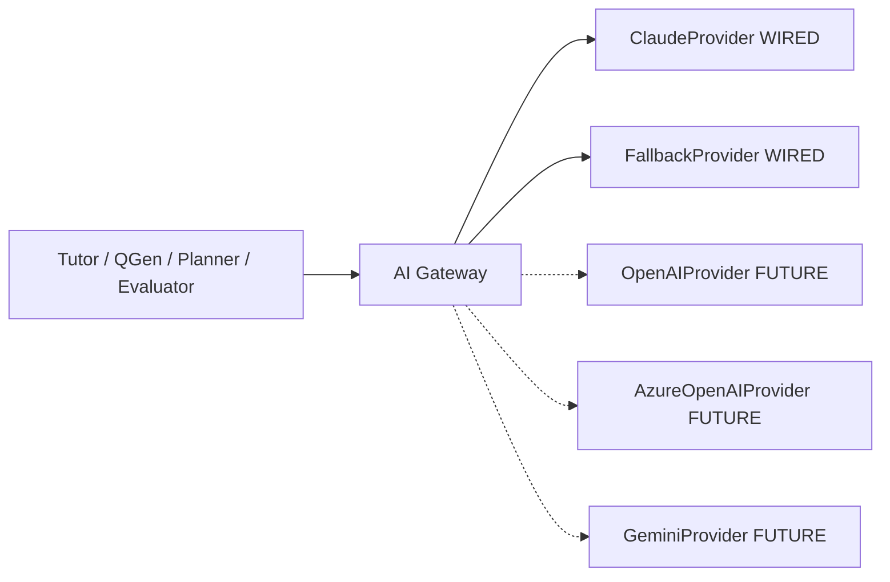

---

### CR-2 — “Knowledge graph navigation” in `.cursor` docs vs ADR-0007 deferral

| Field | Detail |
|---|---|
| **Conflict ID** | CR-2 |
| **Severity** | High |
| **ADR truth** | ADR-0007 defers **Knowledge Graph / Enterprise Domain Ontology**. Knowledge Units (ADR-0024–0028) are **not** a full enterprise KG. ADR-0028 may add limited `concept_prerequisites` edges and explicitly leaves broader graph/embeddings phases unbuilt. |
| **Conflicting artifacts** | `.cursor/00_AI_CONTEXT/project-context.md` references “Knowledge graph navigation” / exploration; other `.cursor/02_TECHNICAL/*` and glossary entries discuss Knowledge Graph as if present or near. |
| **Correct statement** | “Full Knowledge Graph navigation is deferred. TALOS uses academic hierarchy + Knowledge Units/EKU + optional prerequisite edges as they are implemented. Do not implement KG explorers or claim graph RAG unless a new ADR accepts that scope.” |
| **Remediation owner** | Chief Architect |
| **Remediation actions** | Update `.cursor` context packs; distinguish KU vs KG terminology in glossary; link ADR-0007/0028. |
| **Status** | Open — documented in Volume 1 v1.0.0 |

---

### CR-3 — Root README stale “Foundation in progress” vs roadmap SP0–SP9 done

| Field | Detail |
|---|---|
| **Conflict ID** | CR-3 |
| **Severity** | Medium-High (first file investors and new hires read) |
| **Roadmap truth** | `docs/architecture/roadmap.md` marks **SP0–SP9 all done** and states the originally scoped nine-sprint roadmap is closed; Phase 2 continues via later ADRs. |
| **Conflicting artifact** | Root `README.md` **Status** section: “Foundation (Sprint 0) in progress.” |
| **Correct statement** | “SP0–SP9 complete per `docs/architecture/roadmap.md`. Phase 2 in progress (Knowledge Units, ingestion, micro-competency, Hindi content, CI/CD — see ADR-0019+).” |
| **Remediation owner** | Engineering Manager |
| **Remediation actions** | Patch README Status; optionally list module schemas including `learning`, `ingestion`, `knowledge` if accurate to DB. |
| **Status** | Open — documented in Volume 1 v1.0.0 |

---

### Additional Watch Items (not full conflicts yet)

| ID | Topic | Guidance |
|---|---|---|
| W1 | pgvector extension presence vs embeddings | Do not claim RAG; activation and embedding columns are future work per ADR-0024/0028 |
| W2 | CQRS language in performance essays | CQRS is **not implemented**; modular monolith request/response remains |
| W3 | Microservices language in observability drafts | ADR-0001 forbids treating the system as microservices |
| W4 | Auth.js mentions in old BRD | ADR-0003 superseded with custom JWT |
| W5 | Subscriptions | ADR-0018 is one-time Premium only |

### Conflict Register Advantages / Tradeoffs / Future Enhancements

**Advantages.** Converts tribal knowledge into tracked work.  
**Tradeoffs.** Requires README/cursor PR follow-through after this document ships.  
**Future Enhancements.** Automate conflict detection; close rows with PR links in Revision History.

### References

- `README.md`
- `.cursor/00_AI_CONTEXT/project-context.md`
- `docs/decisions/ADR-0004-ai-gateway.md`
- `docs/decisions/ADR-0007-mvp-scope-cut.md`
- `docs/architecture/roadmap.md`

---

# References (Part A)

### Normative Architecture Decision Records

1. `docs/decisions/ADR-0001-modular-monolith.md`
2. `docs/decisions/ADR-0002-tech-stack.md`
3. `docs/decisions/ADR-0003-auth-strategy.md`
4. `docs/decisions/ADR-0004-ai-gateway.md`
5. `docs/decisions/ADR-0005-content-licensing.md`
6. `docs/decisions/ADR-0006-commerce-hosting.md`
7. `docs/decisions/ADR-0007-mvp-scope-cut.md`
8. `docs/decisions/ADR-0008-single-frontend-app.md`
9. `docs/decisions/ADR-0009-ecaep-content-model.md`
10. `docs/decisions/ADR-0010-naming.md`
11. `docs/decisions/ADR-0011-identity-schema-scope.md`
12. `docs/decisions/ADR-0012-academic-schema-scope.md`
13. `docs/decisions/ADR-0013-assessment-engine-scope.md`
14. `docs/decisions/ADR-0014-ai-gateway-implementation.md`
15. `docs/decisions/ADR-0015-learning-mastery-scope.md`
16. `docs/decisions/ADR-0016-recommendation-revision-scope.md`
17. `docs/decisions/ADR-0017-analytics-scope.md`
18. `docs/decisions/ADR-0018-sprint9-commerce-admin-hardening-deploy.md`
19. `docs/decisions/ADR-0019-multi-language-content.md`
20. `docs/decisions/ADR-0020-integration-test-infrastructure.md`
21. `docs/decisions/ADR-0021-micro-competency-layer.md`
22. `docs/decisions/ADR-0022-ingestion-pipeline-phase0.md`
23. `docs/decisions/ADR-0023-extract-once-generate-many.md`
24. `docs/decisions/ADR-0024-knowledge-unit-foundation.md`
25. `docs/decisions/ADR-0025-knowledge-unit-cutover.md`
26. `docs/decisions/ADR-0026-visual-asset-extraction.md`
27. `docs/decisions/ADR-0027-language-processing-service.md`
28. `docs/decisions/ADR-0028-educational-knowledge-unit.md`
29. `docs/decisions/ADR-0029-cicd-pipeline.md`

### Architecture & Operations

30. `docs/architecture/roadmap.md`
31. `docs/architecture/ecaep.md`
32. `docs/deploy/RUNBOOK.md`
33. `docs/deploy/CI_CD.md`
34. `docs/deploy/ROLLBACK.md`
35. `docs/deploy/VERIFICATION_CHECKLIST.md`
36. `docs/deploy/TEST_REPORT.md`
37. `CLAUDE.md`
38. `README.md` *(status currently stale — see CR-3)*

### Document Control

39. This file: `docs/blueprint/volume-01/01-front-matter-and-strategy.md`
40. Planned companions: Volume 1 Parts B–E (chapters 13–40) and Volumes 2–6 as described in Chapter 6

---

*End of Volume 1 Part A — Front Matter & Strategy (Chapters 1–12).*  
*Classification: Internal / Confidential — TALOS-VOL-01 v1.0.0 — 2026-08-07 — Trinetra*

