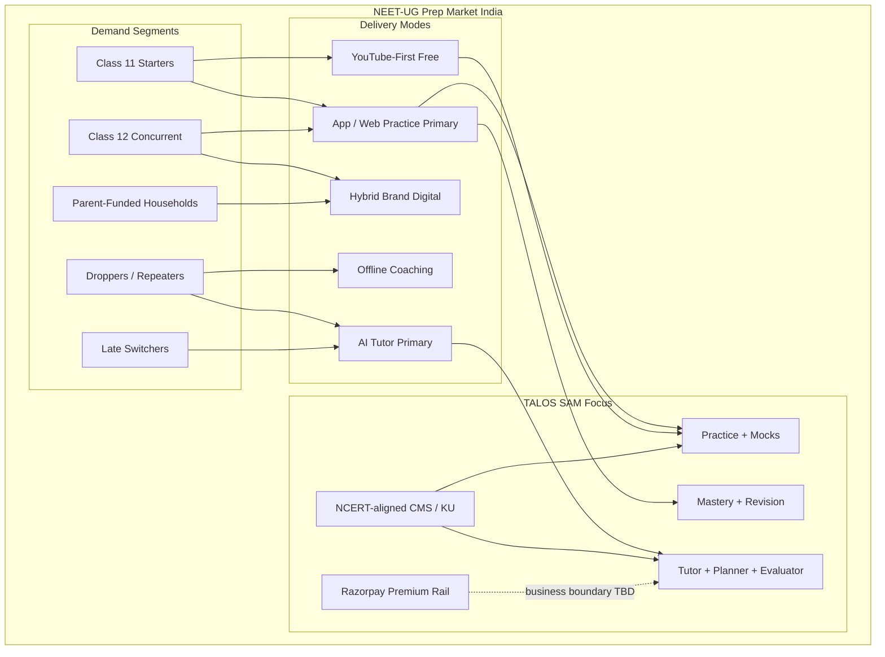
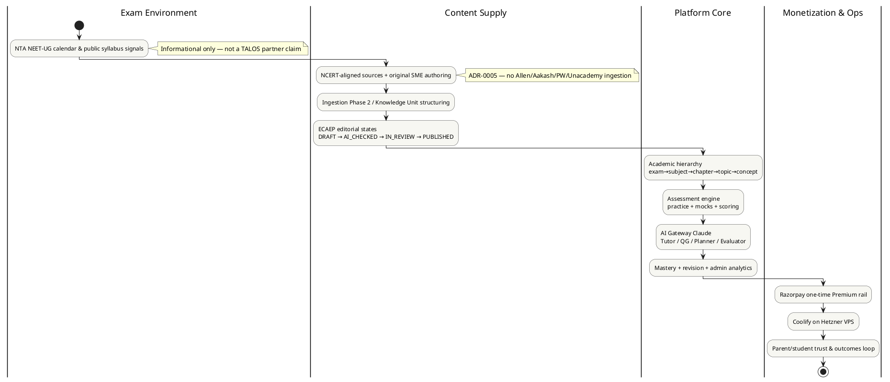
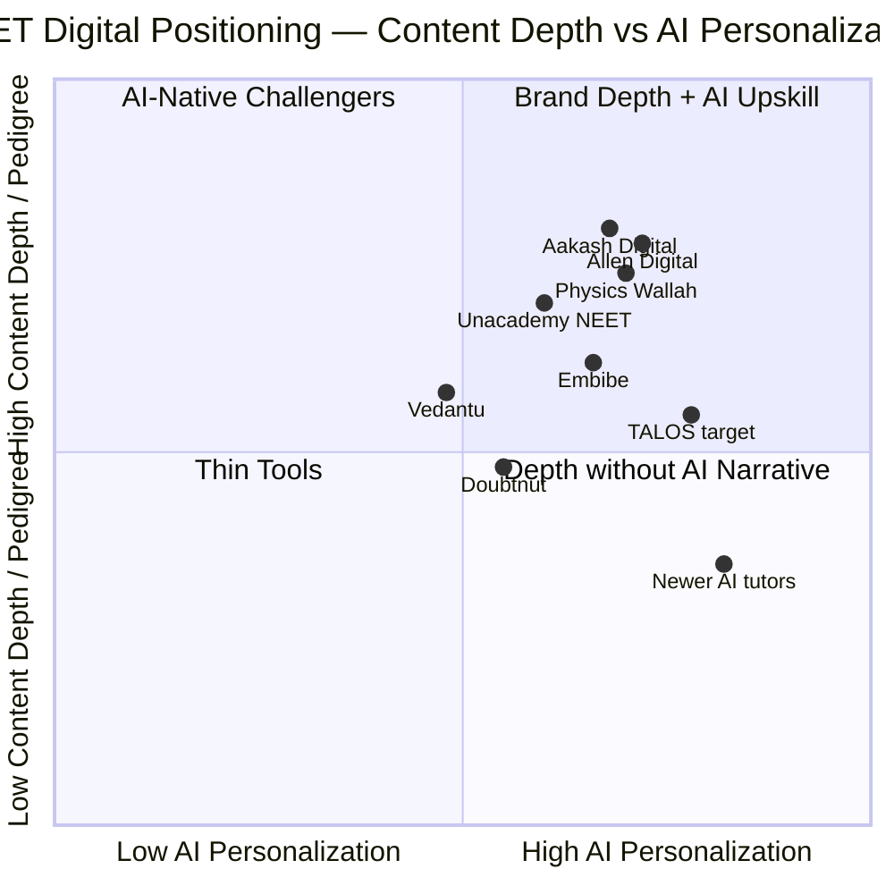
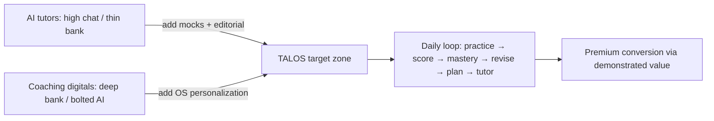
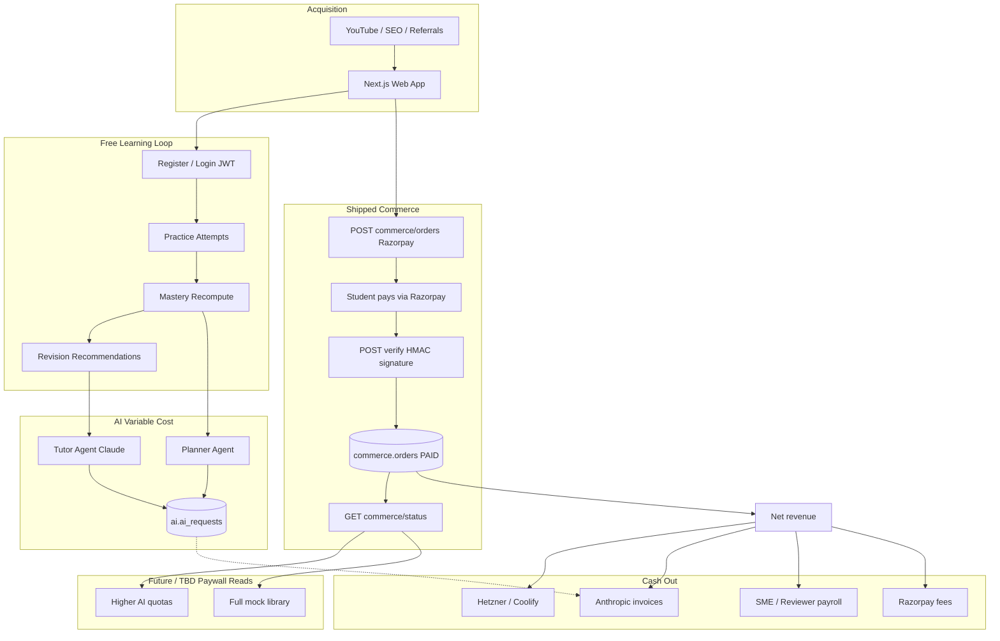
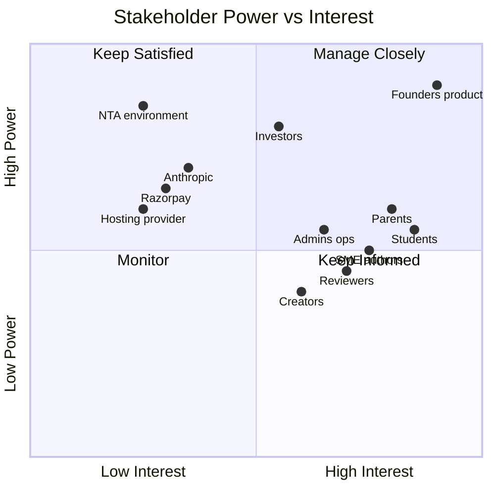
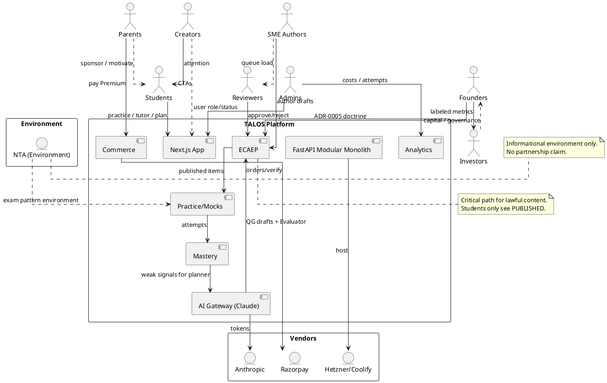

# Volume 1 — Part B: Market, Industry, Competitors, SWOT, Business Model & Stakeholders

**Product:** Trinetra AI Learning OS (TALOS)  
**First vertical:** NEET-UG (India) / AI NEET Exam App  
**Document class:** Enterprise blueprint — Market & Business (complete, not a summary)  
**Audience:** founders, product leadership, investors, content/ops leads, engineering leads  
**Related ADRs:** ADR-0004, ADR-0005, ADR-0006, ADR-0007, ADR-0009, ADR-0010, ADR-0014–0018, ADR-0022–0028  
**Status labels:**
- **Shipped** — implemented (SP0–SP9 and/or Phase 2 ingestion/KU as noted)
- **Enterprise Assumption** — market sizing, pricing benchmarks, share estimates, or competitive metrics not evidenced in this repository
- **Backlog / Deferred** — cut by ADR-0007 or not yet productized

> **Accuracy notice.** This document does **not** claim OpenAI, Azure OpenAI, or vector RAG as currently implemented. TALOS AI is Claude behind an `AIProvider` gateway (ADR-0004 / ADR-0014). Ingestion dedup uses Postgres `pg_trgm`, not a vector store (ADR-0022). Content is NCERT-aligned and originally authored only (ADR-0005). Commerce is a one-time Razorpay Premium purchase rail with no subscription product yet (ADR-0018). No feature paywall was enforced in SP9—boundaries remain a business decision.

---

# 13. Market Analysis

## 13.0 Chapter framing

### Purpose
Establish a decision-grade view of the Indian NEET-UG preparation market so TALOS can prioritize product bets, pricing experiments, channel investments, and content velocity without confusing **platform capability** with **coaching franchise scale**.

### Background
NEET-UG is India’s single largest undergraduate medical entrance pathway. The prep market mixes offline coaching empires, hybrid digital arms of the same brands, YouTube-native and app-native challengers, and AI-first tutors that arrived after generative models became consumer-visible. TALOS enters as an **AI-first learning OS** with NEET as the first vertical—not as a digitized city coaching brand.

### Problem
Most edtech narratives either inflate TAM with “all Indian K–12 online learning,” or under-specify that NEET demand is concentrated, seasonal, and content-IP-constrained. Without disciplined segmentation, teams overbuild live-class features or scrape competitor banks—both incompatible with TALOS frozen decisions.

### Solution
Segment by buyer, intensity, delivery mode, and content pedigree; size TAM/SAM/SOM only with labeled assumptions; map channels that move NEET students; keep NTA context informational rather than as a partnership claim.

### Advantages
- Aligns GTM with shipped capabilities: practice, mocks, Tutor, Planner, Evaluator, mastery, revision, analytics, Razorpay Premium rail, admin, ingestion/KU Phase 2.
- Protects against illegal content shortcuts (ADR-0005).
- Forces honesty about scale disadvantages vs Allen/Aakash/PW while clarifying AI + editorial workflow as the wedge.

### Tradeoffs
- NCERT-aligned / original-only content grows slower than banks that reuse coaching PDFs.
- One-time Premium (today) is simpler than subscriptions but weaker for LTV modeling until subscriptions are productized.
- Market numbers below are not from a purchased research report inside this repo.

### Implementation
Product and content OKRs should reference 13.2–13.6 when choosing syllabus coverage order, freemium boundaries, and YouTube vs paid spend. Finance should treat 13.4–13.5 as planning inputs requiring refresh before fundraising decks.

### Future
Refresh annually after each NEET cycle; add verticals (JEE, boards) only after NEET retention and content coverage prove the OS thesis.

### References
ADR-0005, ADR-0006, ADR-0007, ADR-0010, ADR-0018; `docs/architecture/roadmap.md`; NTA public notifications (external; informational).

---

## 13.1 NEET-UG market structure (India)

### Purpose
Describe how value, attention, and money flow around NEET-UG preparation.

### Background
NEET-UG is conducted under the National Testing Agency (NTA) framework for admission to MBBS/BDS and related undergraduate medical seats. The **exam** is a public instrument; the **prep industry** is a private ecosystem of coaching, books, apps, YouTube channels, test series, and AI tutors.

### Problem
Treating “NEET market” as one homogeneous pool leads to false comparisons—e.g., matching Allen’s classroom footprint with TALOS’s modular monolith web app.

### Solution — structural layers

| Layer | What it is | Who captures value | TALOS relevance |
|---|---|---|---|
| **Seat / exam layer** | NTA exam, counselling, seat matrix | Government / institutions | Environment only—not a customer |
| **Offline coaching layer** | Multi-year classroom programs, hostels, city brands | Allen, Aakash, local academies | Competitor for time and trust; not our delivery model |
| **Hybrid / digital brand layer** | Recorded + live + app + test series under big brands | Allen Digital, Aakash Digital, PW, Unacademy | Direct competitive set for digital spend |
| **Long-form free attention layer** | YouTube lectures, Telegram notes, Instagram reels | Creators + platforms | Primary acquisition channel assumption |
| **Assessment / analytics layer** | Mocks, rank predictors, adaptive practice | Embibe-class products, coaching test series | Core shipped TALOS surface |
| **AI tutor layer** | Chat explanations, doubt solving, plan generation | Newer AI apps + features inside big apps | TALOS primary differentiation bet |
| **Content IP layer** | Question banks, notes, video IP | Coaching houses, publishers, NCERT | ADR-0005 constraint + differentiator |

### Demand cohorts (qualitative)

1. **Class 11 starters** — 2-year runway; high lifetime content need; sensitive to “complete syllabus” claims.  
2. **Class 12 concurrent** — boards + NEET dual load; needs planning and efficient practice.  
3. **Droppers / repeaters** — high intensity, mock-heavy, rank-obsessed; pay for perceived edge.  
4. **Late switchers** — short runway; need triage (weak concepts) more than full video libraries.  
5. **Parent-funded buyers** — economic decision often made by parents; trust, safety, progress visibility matter.  
6. **Teacher / SME / content workers** — not end consumers, but supply-side stakeholders for ECAEP.

### Geographic and socio-economic structure (**Enterprise Assumption**)
- Demand density is highest in traditional coaching belts and metro/tier-1 cities, but smartphone-first learning has expanded tier-2/3 participation.  
- Price sensitivity rises sharply outside premium classroom packages; digital products compete from free YouTube to high five-figure / six-figure classroom SKUs.  
- English + Hindi medium dynamics matter for national scale; TALOS multi-language content remains backlog per ADR-0007 / ADR-0019 trajectory—not claimed as fully shipped student UX here.

### Household decision reality
NEET prep is often a **household project**: student labor, parent capital, sibling precedent, and coaching brand folklore. Digital tools enter as supplements first, replacements second. Multi-homing is normal—a student may watch PW, sit a local test series, and still need a mastery OS.

### Market structure implications for TALOS
- We are **not** competing on hostel + classroom + brand city presence.  
- We **are** competing on practice fidelity, mock realism, AI help that cites publishable content, mastery/revision loops, and clean editorial provenance.  
- Big coaching digitals win on content volume and brand; AI-native players win on UX novelty but often weaken on syllabus depth and exam-faithful assessment. TALOS aims at the intersection: **exam-faithful assessment OS + AI agents + NCERT-safe content factory**.

### Advantages
Clear competitor taxonomy (Chapter 15) and honest positioning vs franchise scale.

### Tradeoffs
Harder to sell “everything like Allen” in one sentence; must sell “learning OS for NEET” instead.

### Implementation
Keep academic hierarchy exam→subject→chapter→topic→concept (shipped SP2) as the spine of GTM messaging—students already think in chapters.

### Future
If boards or JEE verticals open, reuse the OS; do not redefine NEET market structure as generic K–12.

### References
NTA exam pattern public materials; ADR-0012; roadmap SP2–SP4.

---

## 13.2 Demand drivers

### Purpose
List forces that increase or decrease willingness to pay for NEET digital prep.

### Background
NEET prep demand is not purely “love of biology.” It is a high-stakes tournament market: scarce medical seats, social prestige, parent investment cycles, and fear of wasting a year.

### Problem
Feature roadmaps that ignore demand drivers ship nice AI demos that students abandon during mock season.

### Solution — driver catalog

| Driver | Direction | Mechanism | Product implication (TALOS) |
|---|---|---|---|
| Seat scarcity and career prestige | Up | Tournament pressure | Mock scoring fidelity (+4/−1), analytics honesty |
| Rising Class 11/12 digitization | Up digital share | Smartphone + cheap data | Web-first / PWA path (native apps deferred) |
| Coaching fee inflation offline | Up digital substitution | Parents seek cheaper alternatives | Clear freemium→Premium story |
| YouTube as default tutor | Up acquisition, down WTP for video | Free lectures normalize “learning free” | Monetize practice/AI/plans more than video libraries |
| Exam pattern stability (MCQ, PCB) | Up product reusability | Content compounds year to year | Invest in ECAEP + KU pipeline |
| Pattern / syllabus tweaks | Up content rewrite cost | Chapters added/removed | Versioned content + KU gates |
| AI expectation after ChatGPT era | Up AI feature demand | Students expect doubt chat | Tutor/Planner shipped; cite published content only |
| Trust crises in edtech brands | Up scrutiny | Refunds, brand failures | Conservative commerce (no fake payments), clear licensing |
| Parent anxiety / progress visibility | Up dashboard demand | “Is my child studying?” | Mastery + revision widgets shipped; parent portal deferred |
| Mentorship / peer culture | Up retention offline | Batches, hostels | Community not MVP; do not fake it |

### Seasonal demand shape (**Enterprise Assumption**)
- Interest and mock consumption rise through the academic year and spike pre-exam.  
- Post-result months shift to counselling content and next-cohort acquisition.  
- Droppers create a secondary peak after results.

### Prioritization heuristic
Score initiatives as `(DemandDriverFit × DifferentiatorFit × Feasibility) / EthicsRisk`. Under that rule: NCERT KU ingestion and mock polish score high; unlimited Tutor without caps scores poorly; scrape rival PDFs scores zero (forbidden); live class MVP and Digital Twin defer per ADR-0007.

### Advantages
Explains why assessment + mastery + revision are not optional “nice analytics.”

### Tradeoffs
Seasonality stresses infra and LLM cost simultaneously if Premium includes unbounded Tutor.

### Implementation
Capacity planning for Coolify/Hetzner and Anthropic token budgets should assume pre-exam spikes (**Enterprise Assumption** on magnitude).

### Future
Add driver tracking (search trends, app installs) once growth analytics mature beyond admin analytics.

### References
ADR-0013; ADR-0015; ADR-0016; ADR-0017.

---

## 13.3 Digital adoption curves

### Purpose
Describe how NEET learners move from offline-only → hybrid → digital-primary → AI-assisted.

### Background
Indian exam prep digitized in waves: recorded video (2015–2019), COVID acceleration (2020–2021), hybrid normalization (2022–2024), generative AI overlays (2023+).

### Problem
Assuming the entire market is “AI-ready” overstates near-term conversion; assuming nobody will pay for AI understates the wedge for late switchers and droppers.

### Solution — adoption stages

```text
Stage A  Offline classroom primary
    → Stage B  Classroom + YouTube + PDFs
    → Stage C  App/test-series primary, occasional classroom
    → Stage D  Adaptive practice + analytics primary
    → Stage E  AI tutor + planner inside daily loop
```

| Stage | Student behavior | What they pay for | TALOS fit |
|---|---|---|---|
| A | Physical batch | Fees, materials | Weak direct; brand education needed |
| B | Free video + local tuition | Selective test series | Strong acquisition via free practice |
| C | App daily | Subscription / one-time packs | Core SAM |
| D | Weak-area drills | Premium analytics / mocks | Shipped mastery/revision/mocks |
| E | Chat + plan + evaluate loop | AI-inclusive Premium | Shipped four agents |

### Adoption frictions
- **Trust:** “Will AI hallucinate NEET facts?” → Tutor must ground in published CMS content; Evaluator gates AI-authored drafts.  
- **Habit:** Students live in YouTube/WhatsApp → deep links and fast practice start matter more than portal complexity.  
- **Device:** Low-end Android browsers → Next.js web performance discipline.  
- **Language:** Hindi-first users may bounce from English-only UX (**Enterprise Assumption** on bounce magnitude; multi-language backlog).

### Onboarding implications by mental model

| Incoming mental model | First promise | First action | Avoid |
|---|---|---|---|
| YouTube learner | “Turn watching into scored practice” | Concept practice | Long AI essay |
| ChatGPT curious | “Tutor grounded in published NEET notes” | Ask Tutor on a studied concept | Unbounded free chat |
| Dropper | “Find weak concepts; schedule revision” | Mock or weak-concept drill | Class 11 tourist tour |
| Parent-created account | “Progress you can verify” | Mastery overview | Hype rank predictor |

### Advantages
Prevents over-building live class infrastructure for an AI-OS thesis.

### Tradeoffs
Slower brand recognition than YouTube teaching celebrities.

### Implementation
Ship “Practice now” from recommendations (SP7 flow) as the habit loop; measure activation as first scored attempt, not first registration.

### Future
PWA install prompts; later native apps only if web retention plateaus (ADR-0007).

### References
ADR-0007, ADR-0008, roadmap SP4–SP7.

---

## 13.4 TAM / SAM / SOM (assumptions labeled)

### Purpose
Provide planning ranges for strategy discussions—not audited market research.

### Background
No purchased TAM model lives in this repository. Figures below are **Enterprise Assumptions** for internal planning and must be labeled as such in any external deck.

### Problem
Unlabeled TAM figures become fake precision in investor conversations.

### Solution — definitional funnel

| Tier | Definition (TALOS-specific) | Assumption notes |
|---|---|---|
| **TAM** | Annual spend on NEET-UG preparation in India across offline + digital + books + test series | Entire prep economy, not “edtech only” |
| **SAM** | Digital / hybrid digital spend addressable by a web/app AI-practice platform (excludes pure hostel+classroom SKUs student will not replace) | Includes PW/Unacademy/Allen Digital/Aakash Digital-like budgets |
| **SOM** | Realistic 3–5 year capture for TALOS given NCERT-original content constraint, web-first delivery, India hosting, one vertical | Function of content coverage × retention × Premium conversion |

### Illustrative planning model (**Enterprise Assumption** — not repo fact)

> The following numbers are **illustrative planning assumptions** for strategy workshops. They are **not** measured in TALOS telemetry and **not** cited from an in-repo research file. Replace before fundraising.

| Metric | Low case | Base case | High case | Unit |
|---|---|---|---|---|
| NEET-interested learner universe (annual, multi-year funnel) | 2.5M | 3.5M | 5.0M | learners |
| Avg annual prep spend (blended offline+digital) | ₹25,000 | ₹45,000 | ₹80,000 | INR / learner / year |
| Implied TAM (learners × spend) | ₹62,500 Cr | ₹157,500 Cr | ₹400,000 Cr | INR / year |
| Digital-addressable share of spend | 15% | 25% | 40% | % |
| Implied SAM | ₹9,375 Cr | ₹39,375 Cr | ₹160,000 Cr | INR / year |
| TALOS 5-year SOM share of SAM | 0.05% | 0.20% | 0.50% | % |
| Implied SOM | ₹4.7 Cr | ₹78.8 Cr | ₹800 Cr | INR / year |

**Interpretation:** Use **base case** for product planning; never present high case without content-coverage proof. Offline classroom fees inflate TAM; TALOS should not claim it will absorb hostel economics.

### Alternate bottom-up SOM sketch (**Enterprise Assumption**)

| Funnel step | Base assumption | Notes |
|---|---|---|
| Year-3 registered users | 150,000 | Web + SEO + YouTube |
| MAU / registered | 35% | Seasonal |
| Premium conversion of MAU | 8% | One-time Premium today |
| Avg Premium price | ₹2,999 | Placeholder until priced |
| Year-3 Premium buyers | ~4,200 | 150k × 35% × 8% |
| Year-3 Premium revenue | ~₹1.26 Cr | Before GST/fees |
| Plus future subscriptions / packs | upside | Not shipped as product |

### Assumptions governance
1. Any external TAM/SAM/SOM figure must carry **Enterprise Assumption** or cite a dated research source outside this repo.  
2. SOM updates require coverage % and Premium conversion inputs.  
3. High-case TAM forbidden in student-facing marketing.  
4. Finance owns the assumptions register; Product owns funnel definitions.

### Advantages
Forces conversation about content coverage as the real SOM throttle (ADR-0005 consequence).

### Tradeoffs
Bottom-up and top-down will disagree; that disagreement is useful.

### Implementation
Finance maintains an assumptions register; engineering exposes funnel events when growth analytics mature.

### Future
Recompute SOM after: (1) Premium paywall boundaries decided, (2) syllabus coverage %, (3) real Razorpay conversion data.

### References
ADR-0005; ADR-0018; Section 17.4.

---

## 13.5 Pricing landscape assumptions

### Purpose
Locate TALOS Premium relative to market offers—without inventing competitors’ confidential ARPU.

### Background
NEET digital pricing spans free YouTube, low-rupee short packs, mid four-figure annual app subscriptions, and very high classroom programs (**Enterprise Assumption** ranges for orientation).

### Problem
Shipping Razorpay without a pricing thesis risks either (a) Premium priced like a toy or (b) priced like Allen without Allen’s content depth.

### Solution — landscape bands (**Enterprise Assumption**)

| Band | Typical offer | Price band (INR, indicative) | What buyer expects |
|---|---|---|---|
| Free attention | YouTube + PDFs | ₹0 | Lectures, motivation |
| Lite digital | Practice app freemium | ₹0–₹1,499 | Limited mocks / locked analytics |
| Mid digital | Full year app / test series | ₹3,000–₹15,000 | Coverage + mocks + doubt |
| Premium digital hybrid | Live + recorded brand programs | ₹15,000–₹60,000 | Teachers + schedule + community |
| Offline flagship | Classroom multi-year | ₹80,000–₹2,50,000+ | Brand, peers, discipline |

### TALOS pricing posture (product facts + assumptions)
- **Shipped:** one-time Razorpay Premium purchase rail; premium status = existence of PAID order (ADR-0018).  
- **Shipped gap:** no feature paywall enforced in SP9—boundaries are a business decision still to finalize.  
- **Assumption:** initial Premium targets **mid digital band** value narrative (AI + mocks + mastery) at a **lite-to-mid** price to learn willingness to pay.  
- **Not shipped:** subscriptions, dunning, plan upgrades (explicitly out of ADR-0018).

### Pricing hypotheses (**Enterprise Assumption**)

| SKU hypothesis | Price band INR | Positioning | Dependency |
|---|---|---|---|
| Premium one-time (MVP) | 1,999–4,999 | Mid-lite digital | Paywall definition |
| Premium Annual | 2,999–7,999 / year | Standard digital | Subscription engineering |
| Premium Monthly | 299–799 / month | Low commitment | Dunning/churn ops |
| AI Boost pack | 199–999 | Meter refill | Token metering product |
| Mock Pack | 499–1,999 | Dropper seasonal | Content depth |

### Advantages
Honest commerce rail (no fake payment success) builds trust before aggressive monetization.

### Tradeoffs
One-time purchase complicates recurring revenue storytelling until subscription phase.

### Implementation
When paywalling: prefer gating incremental AI tokens / advanced mocks / export—not gating basic practice that feeds mastery data quality.

### Future
ADR-0006 already contemplates Razorpay subscriptions when productized; model in Chapter 17.

### References
ADR-0006, ADR-0018; Section 17.2–17.5.

---

## 13.6 Channel landscape (YouTube, coaching, app stores, schools)

### Purpose
Identify where NEET students actually discover tools.

### Background
Acquisition is attention-arbitrage: coaching brands buy trust with decades of results marketing; YouTube creators buy trust with pedagogy personality; app stores buy distribution with ranking; schools are slower B2B motions.

### Problem
Building only product surfaces without channel strategy yields an excellent empty classroom.

### Solution — channel matrix

| Channel | Role | Cost shape | Fit for TALOS today | Risk |
|---|---|---|---|---|
| **YouTube** | Top-of-funnel teaching + SEO adjacent | Creator time / ads | High — explain concepts, CTA to practice on TALOS | Audience expects free continuation |
| **SEO / content site** | Chapter pages, PYQ explainers | Content labor | High — aligns with NCERT-original notes | Slow burn |
| **Coaching partnerships** | Batch distribution | BD + revenue share | Medium later — not MVP multi-tenant | IP and brand conflicts |
| **App stores** | Install distribution | ASO + UA | Low near-term — web-first (ADR-0007) | Native scope creep |
| **Schools / junior colleges** | B2B seats | Sales cycle | Low for MVP | Procurement; multi-tenancy deferred |
| **Telegram / WhatsApp** | Viral notes and doubt groups | Community ops | Medium — careful IP hygiene | Copyrighted PDF sharing culture |
| **Parent influencers** | Trust transfer | Campaigns | Medium | Overpromise backlash |
| **Performance ads** | Retargeting | CAC in INR | Medium once conversion measured | Premature before coverage |

### Channel economics sketches (**Enterprise Assumption**)

| Channel | Leading indicator | Lagging indicator | Budget rule |
|---|---|---|---|
| YouTube | CTR to practice deep link | Day-7 activated users | Pay for activated, not views |
| SEO | Indexed chapter pages | Organic signups with attempt | Invest continuously in notes |
| Paid UA | CPC | Premium CAC | Cap until conversion known |
| Coaching BD | Meetings | Seat pilots | After tenancy design only |
| Telegram | Group joins | Often IP-risk growth | Avoid piracy-dependent growth |

### Channel principles for ADR-0005
- Never grow by circulating Allen/Aakash/PW PDFs.  
- YouTube scripts should teach from NCERT-aligned explanations and TALOS-authored examples.  
- Community mods must remove copyrighted coaching material dumps.

### Advantages
Channels reinforce content legality story—rare among growth-hacked edtech.

### Tradeoffs
Slower virality than “full chapter PDF” Telegram culture.

### Implementation
Pair every YouTube video with a deep link into concept practice on TALOS (assessment generation already supports concept-scoped practice).

### Future
School pilots only after `organizations` multi-tenancy is intentionally designed (reserved table, not wired—ADR-0007).

### References
ADR-0005, ADR-0007, ADR-0008.

---

## 13.7 Regulatory / exam authority context (NTA) — informational

### Purpose
Clarify what NTA is to TALOS: **environment**, not customer, partner, or endorser.

### Background
NTA conducts NEET-UG and publishes information bulletins, syllabi references, and results processes. Coaching and edtech firms orbit that calendar.

### Problem
Product marketing sometimes implies official affiliation. That is legally and ethically dangerous.

### Solution — informational boundaries

| Topic | Guidance for TALOS |
|---|---|
| Syllabus alignment | Align academic hierarchy and content to publicly described NEET/NCERT-relevant scope |
| Exam pattern | Practice/mocks use publicly known marking ideas (e.g., +4/−1 style scoring as implemented in assessment) |
| Endorsement | **Never** claim NTA/MoE endorsement |
| Personal data | Treat student data under applicable Indian IT / DPDP-era expectations as product matures |
| Accessibility of PYQs | Use previous-year questions only where legally permissible and reviewed (ADR-0005) |
| Fairness / AI | AI generations are drafts under ECAEP—not auto-published answer keys pretending to be official |

> **Informational only.** This section is not legal advice. NTA policies and Indian edtech regulations evolve. Engage counsel for public claims, trademarks, and PYQ redistribution.

### Advantages
Keeps trust with parents and payment reviewers.

### Tradeoffs
Cannot market “official NEET partner” shortcuts.

### Implementation
UI copy review checklist: no crest misuse, no “NTA approved” badges, no fake rank predictors presented as official ranks.

### Future
If institutional partnerships emerge, treat them as separate contracts—not as NTA adjacency.

### References
ADR-0005; public NTA bulletins (external).

---

## 13.8 Mermaid market segmentation diagram

### Purpose
Visualize buyer segments vs product surfaces.

### Background
Segmentation must be memorable for GTM and content ops weekly planning.

### Problem
Slideware segmentation without a durable diagram drifts.

### Solution



### Advantages
Makes explicit that offline coaching is adjacent, not the primary SAM.

### Tradeoffs
Simplifies multi-homing (students use many modes at once).

### Implementation
Use in onboarding for new PMs/content leads.

### Future
Add JEE/boards nodes only when vertical expansion is real.

### References
Sections 13.1–13.6; Chapter 15 positioning map.

---
# 14. Industry Analysis

## 14.0 Chapter framing

### Purpose
Analyze industry attractiveness and disruption using strategy tools adapted to NEET edtech—not generic SaaS.

### Background
NEET prep is a **content + pedagogy + assessment + brand trust** industry undergoing **AI cost-structure shock**.

### Problem
Classic Porter analysis that ignores content IP and exam calendar produces wrong “software margins” conclusions.

### Solution
Adapt Five Forces, map the value chain, name AI disruption vectors honestly, and list industry risks including model cost inflation and IP enforcement.

### Advantages
Clarifies why content licensing is strategy, not only legal.

### Tradeoffs
High substitute pressure caps early pricing power.

### Implementation
Quarterly re-score forces after NEET results and after major competitor launches.

### Future
If multi-vertical, re-run forces per exam vertical.

### References
ADR-0004, ADR-0005, ADR-0014; Chapters 13 and 15.

---

## 14.1 Porter's Five Forces adapted to edtech NEET

### Purpose
Estimate structural profit pressure on a digital NEET OS.

### Background
Porter’s forces must be reinterpreted: “suppliers” include LLM vendors and SMEs; “buyers” are students/parents with high willingness to multi-home; “substitutes” include free YouTube.

### Problem
Underestimating rivalry from brand coaching digitals leads to naive AI-only positioning.

### Solution

| Force | Intensity (**Enterprise Assumption**) | NEET-edtech specifics | TALOS implication |
|---|---|---|---|
| **Rivalry among existing competitors** | High | Allen Digital, Aakash Digital, PW, Unacademy, Vedantu, Doubtnut, Embibe, AI upstarts | Differentiate on provenance + OS loop, not video hours |
| **Threat of new entrants** | Medium–High | AI wrappers are easy to launch; trust and content depth are hard | ECAEP + KU + mastery data as moat materials |
| **Bargaining power of buyers** | High | Low switching costs across apps; free substitutes | Activation and habit loops; fair Premium |
| **Bargaining power of suppliers** | Medium–High | Anthropic (LLM), SMEs/authors, cloud/VPS, Razorpay, NCERT as normative syllabus source | Gateway abstraction; original content payroll; Hetzner cost control |
| **Threat of substitutes** | High | YouTube, Telegram PDFs, peer notes, offline tuition | Be the system of record for practice/mastery |

### Detailed force notes

**Rivalry:** Big brands compete on teacher celebrity, result ads, and massive banks. AI startups compete on chat UX. TALOS rivalry strategy is **not** celebrity acquisition in v1; it is **measurable mastery + clean content factory**.

**New entrants:** A weekend GPT wrapper can demo doubt-solving. It cannot legally ingest Allen sheets or instantly build ECAEP audit trails. Raise barriers via workflow + data + trust.

**Buyers:** Parents compare “result %” marketing. Until TALOS has outcomes data, sell **transparent practice analytics** and content honesty rather than miracle ranks.

**Suppliers:** LLM price/token changes hit AI-heavy UX. ADR-0004 cost tracking is a strategic instrument, not only observability. SME labor is the binding constraint under ADR-0005.

**LLM supplier power levers:** model quality gaps, rate limits, price per token, ToS constraints, outage risk. Mitigation: AI Gateway abstraction; cost logs; quotas; second provider only when wired—not marketed early.

**SME supplier power levers:** scarce NEET-skilled writers who will work under original-content rules; switching to coaching jobs; burnout from review queues. Mitigation: tooling (KU, QG assist), fair pay, WIP limits, public pride in provenance.

**Substitutes:** Free content wins attention; paid products must win **commitment devices** (plans, revision due dates, mock discipline).

### Advantages
Clarifies why content licensing is strategy, not only legal.

### Tradeoffs
High substitute pressure caps pricing power early.

### Implementation
Quarterly supplier review in ops meeting; quarterly force re-score after NEET results.

### Future
If licensing a publisher bank, that licensor becomes a new high-power supplier—ADR required.

### References
ADR-0004, ADR-0005, ADR-0014.

---

## 14.2 Value chain of exam prep

### Purpose
Show where margin and differentiation accrue.

### Background
Exam prep value chain differs from pure software: pedagogy and item quality dominate.

### Problem
Engineering-centric orgs optimize infra while leaving the item bank thin—fatal in NEET.

### Solution — chain stages

1. **Syllabus interpretation** — map exam → subjects → chapters → topics → concepts (TALOS shipped academic engine).  
2. **Source knowledge acquisition** — NCERT + original authoring + lawful PYQ (ADR-0005); Phase 2 ingestion from NCERT PDFs.  
3. **Knowledge structuring** — Knowledge Units, gates, structured facts (Phase 2 ADRs).  
4. **Asset generation** — notes, MCQs, flashcards, formula sheets (human + AI QG drafts).  
5. **Editorial control** — ECAEP submit → AI check → review → publish.  
6. **Assembly into assessments** — practice and mocks (SP4).  
7. **Delivery and tutoring** — attempts, Tutor, Planner.  
8. **Measurement** — scoring, mastery, revision, analytics.  
9. **Monetization** — Razorpay Premium.  
10. **Trust and outcomes marketing** — largely future; depends on longitudinal data.

| Stage | Cost driver | Differentiation potential | TALOS status |
|---|---|---|---|
| Syllabus map | SME + eng | Medium | Shipped |
| Source acquisition | Labor / licensing | High if lawful | ADR-0005 + ingestion Phase 2 |
| Structuring | Eng + SME | High | KU foundation / cutover path |
| Asset generation | AI tokens + SME | High | QG + workers; human review |
| Editorial | Reviewer labor | Very high | ECAEP shipped |
| Assessment assembly | Eng + content tags | High | Practice/mocks shipped |
| Tutoring / planning | LLM + grounding | High | Tutor/Planner shipped |
| Measurement | Eng | High | Mastery/revision/analytics |
| Monetization | Payment ops | Medium | One-time Premium rail |
| Outcomes brand | Time | Very high | Not yet a claim |

### Control points and SLAs (**Enterprise Assumption** on targets)

| Stage | Control point | Suggested focus | Metric |
|---|---|---|---|
| Ingestion | Job success / checksum skip | Pilot turnaround | Jobs completed |
| KU structuring | Gate pass rate | Track fail reasons weekly | % gate pass |
| Authoring | Draft quality checklist | Style guide adherence | Rework rate |
| AI check | Evaluator completion | Minutes not days | Time in AI_CHECKED |
| Human review | Queue WIP limit | Age of IN_REVIEW | Queue age |
| Publish | Coverage impact | Each publish maps to concept cell | Coverage grid delta |
| Tutoring | Grounding complaints | Review weekly | Incident count |

### Advantages
Explains investment priority: editorial throughput ≥ model demos.

### Tradeoffs
Slower top-of-funnel “10× question bank” claims.

### Implementation
Content ops KPIs: published items / week, review SLA, coverage grid completeness (SP3 coverage grid).

### Future
Extract-once-generate-many (ADR-0023) scales asset fan-out without re-extracting NCERT.

### References
`docs/architecture/ecaep.md`; ADR-0009; ADR-0022–0028.

---

## 14.3 Technology disruption (AI tutoring, generative MCQ, adaptive practice)

### Purpose
Separate real disruption from slideware.

### Background
Generative AI reduces marginal cost of **draft** explanations and **draft** MCQs. It does not remove the need for exam-faithful review.

### Problem
Competitors (and internal enthusiasts) may push auto-publish pipelines that create factual and legal risk.

### Solution — disruption vectors vs TALOS response

| Disruption | What changed | Naive response | TALOS response (actual architecture) |
|---|---|---|---|
| AI tutoring chat | Students expect instant doubt help | Unbounded chatbot | Tutor agent via Claude gateway; published-content orientation |
| Generative MCQ | Banks can expand faster | Auto-publish to students | Question Generator → ECAEP DRAFT → human review |
| Adaptive practice | Personalization expected | Black-box ML ranking | Rule-based recommendations + mastery levels (ADR-0016) |
| Study planning | Calendar automation | Generic to-do lists | Planner uses real weak concepts from attempts |
| Evaluation of content | QA bottleneck | Skip review | Evaluator agent inside editorial flow |
| Ingestion at scale | PDF → assets | Vector RAG everything | Born-digital extract, `pg_trgm` dedup; no vector RAG claimed now |
| Knowledge representation | Raw chunk brittle | Embeddings-only | Knowledge Unit structured facts path |

### Callout

> **Not currently implemented as product facts:** OpenAI/Azure OpenAI providers, embedding vector RAG retrieval stacks, SM-2 ML recommenders, Digital Twin, 12-agent orchestrator. Gateway can add providers later; that is not the same as shipped.

### Disruption counter-scenarios
| Rival move | Market perception risk | TALOS counter |
|---|---|---|
| Auto-publish AI bank | “They’re faster” | Emphasize review; quality over dump size |
| Vector RAG marketing | “They’re more advanced” | Explain KU + published grounding; add vectors only if earned |
| Celebrity teacher AI clone | “Real teacher voice” | Partner creators lawfully for acquisition; do not fake |
| Free unlimited tutor | “We’re generous” | Show sustainability; meter honestly |

### Advantages
Disruption adopted without discarding editorial truth.

### Tradeoffs
Higher unit cost per published item than unreviewed generation farms.

### Implementation
Keep `ai.ai_requests` cost logs as early warning for token inflation (ADR-0014/0017).

### Future
Second provider behind gateway if Claude price/performance warrants; pgvector only when earned (ADR-0022 escape hatch).

### References
ADR-0004, ADR-0007, ADR-0014, ADR-0022, ADR-0024.

---

## 14.4 Industry risks (regulation, content IP, model cost inflation)

### Purpose
Enumerate risks that can erase edtech margin or shut products down.

### Background
Edtech failures in India have included trust collapses, aggressive sales, and IP-gray content practices. AI adds new cost and hallucination risks.

### Problem
Teams track uptime but not IP or token burn as existential risks.

### Solution — risk register (industry-level)

| Risk | Likelihood (**Enterprise Assumption**) | Impact | Industry pattern | TALOS mitigation |
|---|---|---|---|---|
| Content copyright enforcement | Medium | Existential | Coaching PDF scrapers | ADR-0005 hard ban; original/NCERT path |
| AI hallucination in explanations | High without grounding | High reputational | Uncited chat tutors | Published-content grounding + Evaluator |
| Model cost inflation | Medium | High on AI-heavy SKUs | Token prices / usage spikes | Gateway metering; freemium AI caps later |
| Exam pattern / syllabus change | Medium | Medium–High rework | Periodic NTA updates | Versioned CMS + KU |
| Payment / consumer protection issues | Medium | High | Refund disputes | Honest Razorpay integration; no fake success |
| Data protection (DPDP-era) | Rising | High | Student minors data | Minimize data; future compliance program |
| Brand trust contagion | Medium | Medium | Sector scandals | Conservative claims; no fake ranks |
| Platform dependency (YouTube algo) | High | Medium acquisition | Algorithm shifts | SEO + product-led loops |
| Hosting single-VPS limits | Medium as scale grows | Medium | Coolify/Hetzner MVP | ADR-0006 revisit cloud when earned |
| Offline coaching price wars digital | High | Medium pricing power | Discount seasons | Differentiate OS value not video dumping |
| Pirate content culture temptation | High culturally | Existential if internalized | Telegram banks | Zero-tolerance culture + audits |

### Advantages
Risk-aware GTM avoids illegal growth hacks.

### Tradeoffs
Some viral channels are intentionally unused.

### Implementation
Add IP audit to content onboarding; add token budget alarms to ops runbooks.

### Future
Formal security/privacy program beyond SP9 headers/rate limits as user counts grow.

### References
ADR-0005, ADR-0006, ADR-0018, `docs/deploy/RUNBOOK.md`.

---

## 14.5 PlantUML industry value chain

### Purpose
Provide an engineering- and ops-readable value chain diagram.

### Background
Mermaid covers market segmentation; PlantUML captures industrial stage dependencies.

### Problem
Without a shared picture, content and AI teams optimize locally.

### Solution



### Advantages
Connects legal constraint to revenue stage visually.

### Tradeoffs
Omits competitor chains for clarity.

### Implementation
Reuse in onboarding decks; keep ADR references in notes.

### Future
Extend with subscription billing stage when productized.

### References
Chapters 14.2–14.4; ADR-0005; ADR-0018.

---

# 15. Competitor Analysis

## 15.0 Chapter framing

### Purpose
Produce an honest, enterprise-depth competitive picture for TALOS without inventing market-share decimals or claiming features we do not ship.

### Background
The NEET digital competitive set mixes legacy coaching brands, YouTube-native giants, doubt apps, adaptive platforms, and post-LLM AI tutors. TALOS is an AI-first learning OS with NCERT-aligned / original content (ADR-0005) and a shipped modular monolith spanning identity through commerce plus Phase 2 ingestion/KU.

### Problem
Competitive decks often (a) invent share numbers, (b) equate brand awareness with product quality, or (c) imply TALOS already matches Allen’s content volume. All three destroy strategy quality.

### Solution
Taxonomize competitors, compare features on dimensions that matter to our architecture, map positioning, war-game responses, list unfair advantages and vulnerabilities, and restate why scraping competitor PDFs is forbidden.

### Advantages
Keeps GTM and content ops aligned to lawful differentiation.

### Tradeoffs
We will look “smaller” on content volume metrics for a long time—that is accepted.

### Implementation
Update this chapter after major competitor launches and after each NEET cycle.

### Future
Add quantitative share only when purchased research or first-party surveys exist.

### References
ADR-0005, ADR-0007, ADR-0010; Chapters 13–14.

---

## 15.1 Competitor taxonomy

### Purpose
Group rivals by business DNA so feature checklists are not apples-to-oranges.

### Background
A classroom franchise with an app is not the same species as a doubt-solving camera app or an AI chat wrapper.

### Problem
Treating all logos as equal “NEET apps” produces useless matrices.

### Solution — taxonomy

| Taxonomy class | Examples | Primary moat historically | Primary vulnerability | TALOS relationship |
|---|---|---|---|---|
| **A. Legacy coaching digital arms** | Allen Digital, Aakash Digital | Brand, teachers, offline funnel, proprietary sheets | Cost structure; digital UX debt; IP silo | Compete for digital wallet; do not copy content |
| **B. YouTube-native scale platforms** | Physics Wallah (PW) | Affordable brand, creator trust, massive reach | Breadth vs depth quality variance; platform complexity | Compete on practice OS + AI loop; respect IP |
| **C. Marketplace / platform coaching** | Unacademy NEET | Educator marketplace, live classes | Unit economics of live; educator churn | Different model; live classes deferred for us |
| **D. Conglomerate / ecosystem remnants** | BYJU’S / Aakash ecosystem dynamics | Distribution + capital historically | Trust & restructuring overhang (**Enterprise Assumption** on magnitude) | Trust-sensitive parents may seek cleaner alternatives |
| **E. Historical adaptive / school graph players** | Toppr (historical reference) | Adaptive narrative, school coverage | Consolidation / brand sunset lessons | Study post-mortems; do not romanticize |
| **F. Analytics / personalization specialists** | Embibe | Assessment analytics, personalization story | Content + brand distribution | Closest conceptual cousin on analytics; we ship simpler live aggregates first |
| **G. Doubt / visual solve apps** | Doubtnut | Instant doubt UX, vernacular reach | Depth of long-horizon mastery OS | Tutor overlaps; we emphasize grounded CMS + mastery |
| **H. Live tutoring brands** | Vedantu | Live pedagogy | Live cost; scheduling friction | Live not in TALOS MVP |
| **I. Newer AI tutors** | Various 2023–2026 AI NEET/JEE chat apps | Speed to demo AI | Hallucination, thin banks, unclear IP | Direct narrative competitors; beat on ECAEP + assessment fidelity |

### Competitor capsules (enterprise depth, qualitative)

#### Allen Digital
Allen’s identity is Kota-scale classroom excellence digitized. Strengths: brand recall among serious aspirants, structured modules, test series culture, parent trust in “results machinery.” Weaknesses for digital-native challengers: mobility of content UX, AI personalization narrative, and price accessibility. **Do not invent Allen’s digital MAU or share here.** TALOS posture: respect assessment seriousness; never claim classroom parity; win on always-on OS loops and lawful content.

#### Aakash Digital / BYJU’S–Aakash ecosystem remnants
Aakash carries deep NEET brand equity from long classroom heritage; digital packaging and parent-company turbulence have shaped recent perception (**Enterprise Assumption**: trust sensitivity varies by city and cohort). Strengths: syllabus completeness brand. Weaknesses: ecosystem complexity and trust recovery costs. TALOS posture: “clean, focused NEET learning OS” rather than anti-brand attacks.

#### Physics Wallah (PW)
PW rewrote affordability expectations and YouTube-first acquisition. Strengths: reach, community, aggressive digital product expansion, price disruption. Weaknesses: as product surface area grows, consistency and personalization quality become hard; proprietary content remains legally closed to us. TALOS posture: do not race PW on video library size; race on mastery instrumentation and AI agents tied to publishable items.

#### Unacademy NEET
Marketplace + live class DNA. Strengths: educator variety, live energy, platform habits. Weaknesses: live is expensive; asynchronous OS learners may churn from schedule friction. TALOS posture: asynchronous practice/AI plan first; live explicitly deferred (ADR-0007).

#### Toppr (historical)
Cautionary adaptive-history reference: adaptive narratives and broad exam coverage do not guarantee durable independent brand outcomes when capital and consolidation waves hit. TALOS lesson: ship thinner scope that works (ADR-0007) rather than ontology maximalism before students arrive.

#### Embibe
Mindshare around personalization and assessment analytics. Strengths: data-science storytelling, diagnostic framing. Weaknesses: consumer brand vs coaching giants; complexity can outrun student understanding. TALOS posture: start with honest mastery arithmetic and admin analytics; deepen adaptivity when earned.

#### Doubtnut
Strength in instant doubt resolution UX and vernacular accessibility. Weaknesses: translating doubts into longitudinal mastery and mock readiness. TALOS posture: Tutor helps, but recommendations/revision close the loop.

#### Vedantu
Live tutoring specialist energy. Strengths: human teacher presence. Weaknesses for our thesis: live does not match modular monolith MVP economics. TALOS posture: non-compete on live; compete on self-serve OS.

#### Newer AI tutors
Flood of chat wrappers. Strengths: marketing clarity (“ChatGPT for NEET”). Weaknesses: uncited answers, weak mock engines, muddy content provenance, possible IP shortcuts. TALOS posture: **structural** human review for generated MCQs; Claude-only gateway today; no vector-RAG cosplay claims.

### Extended taxonomy notes
**Multi-homing reality.** Students rarely use one product. TALOS should aim to become the **system of record for attempts and mastery**, not the only tab open.  
**Parent vs student buyers.** Classes A–D often sell to parents; G–I often delight students first. TALOS must eventually speak both languages.  
**Content pedigree as class splitter.** The deepest strategic split is not “has AI?” but “what is the legal and editorial origin of the item bank?”

### Advantages
Taxonomy prevents wrong feature races (e.g., building live classes to “beat Unacademy”).

### Tradeoffs
Fewer press-friendly “we vs them” charts with fake percentages.

### Implementation
Sales/marketing forbidden claims list: official partnerships, competitor PDF libraries, OpenAI-powered (unless/until true), guaranteed ranks.

### Future
Reclassify if a competitor genuinely open-sources or licenses content (unlikely).

### References
ADR-0005; ADR-0007; Section 15.6.

---

## 15.2 Feature comparison matrix (auth, practice, mocks, AI tutor, content pedigree, analytics, pricing model)

### Purpose
Compare what matters for an AI learning OS—not vanity feature counts.

### Background
TALOS shipped SP0–SP9 plus Phase 2 ingestion/KU work. Competitors’ exact private roadmaps are unknown; matrix uses **publicly typical capabilities** labeled where assumed.

### Problem
Binary checkmarks hide quality differences (e.g., “has AI” ≠ grounded Tutor + Evaluator in ECAEP).

### Solution

**Legend:** `S` = strong/typical, `P` = partial/uneven, `N` = weak/absent/typical gap, `T` = TALOS shipped today, `B` = TALOS backlog/deferred, `U` = unknown / do not assert.

| Dimension | TALOS | Allen Digital | Aakash Digital | PW | Unacademy NEET | Embibe | Doubtnut | Vedantu | Newer AI tutors |
|---|---|---|---|---|---|---|---|---|---|
| Auth (account, sessions) | T custom JWT cookies | S | S | S | S | S | S | S | P |
| Practice engine | T | S | S | S | S | S | P | P | P |
| Full-length mocks + exam-like scoring | T (+4/−1 style) | S | S | S | S | S | N/P | P | P |
| AI Tutor | T Claude gateway | P/S evolving | P/S evolving | P/S evolving | P | P | P (doubt) | P | S chat |
| AI Study Planner | T | P | P | P | P | P | N | P | P |
| AI Question Generator with human review gate | T via ECAEP | U | U | U | U | U | N | U | N/P often unreviewed |
| AI Evaluator in editorial flow | T | U | U | U | U | U | N | U | N |
| Content pedigree (NCERT-aligned / original commitment) | T ADR-0005 | Proprietary coaching IP | Proprietary | Proprietary | Proprietary / educator IP | Mixed/U | Mixed/U | Mixed | Often unclear |
| Mastery model | T concept stored + topic rollup | P/S | P/S | P/S | P | S narrative | N | P | P |
| Spaced revision | T fixed-interval by mastery | P | P | P | P | P/S | N | P | P |
| Student analytics depth | P (student mastery UI) + admin platform analytics T | S | S | S | S | S | P | P | P |
| Admin CMS / editorial workflow | T ECAEP | Internal | Internal | Internal | Internal | Internal | Limited | Internal | Often thin |
| Ingestion / knowledge structuring | T Phase 2 KU path | Internal tooling U | U | U | U | U | U | U | Rarely rigorous |
| Payments | T Razorpay one-time Premium rail | S | S | S | S | S | S | S | P |
| Subscription billing productized | B (future assumption) | S typical | S typical | S typical | S typical | S typical | P | S | P |
| Live classes | B deferred | S/P | S/P | S | S | P | N | S | N |
| Native mobile apps | B deferred (web-first) | S | S | S | S | S | S | S | P |
| Vector RAG claimed in TALOS | **Not implemented** | U | U | U | U | U | U | U | Often marketed |
| OpenAI/Azure OpenAI in TALOS | **Not implemented** | U | U | U | U | U | U | U | Common |

### Qualitative reading
- TALOS wins structurally on **editorial AI loop** (QG + Evaluator + ECAEP) and **explicit lawful content policy**.  
- TALOS loses today on **brand, content volume, live, native apps, marketplace teachers**.  
- “AI tutor” checkmarks among competitors are not equivalent to TALOS’s four-agent gateway with cost logs.

### Advantages
Stops engineering from building live class MVP to chase Unacademy checkmarks.

### Tradeoffs
Matrix will be attacked for lacking numeric share—by design.

### Implementation
Product reviews must cite this matrix when prioritizing Phase 2 vs vanity AI. Date-stamp revisions; treat cells as snapshot judgments.

### Future
Add columns for retention proxies once first-party data exists.

### References
Roadmap SP1–SP9; ADR-0014–0018; ADR-0022–0028.

---

## 15.3 Positioning map (content depth vs AI personalization) Mermaid

### Purpose
Show strategic space visually.

### Background
Two axes dominate buyer perception in 2026 NEET digital: **perceived content depth/brand pedigree** and **perceived AI personalization**.

### Problem
Without a map, teams oscillate between “more videos” and “more GPT.”

### Solution



> **Enterprise Assumption:** Coordinates are illustrative strategic placements for workshop use, **not** measured market-share or audited feature scores. TALOS “target” reflects intent: raise content depth via ECAEP/KU/NCERT pipeline while keeping AI personalization high through Tutor/Planner/mastery/revision—not a claim that content depth already equals Allen.



### Narrative position
- **Upper quadrants:** coaching digitals—depth and brand, AI bolted on unevenly.  
- **Right-lower:** AI tutors—chat wow, syllabus thin.  
- **TALOS vector:** move **up** (content coverage and pedigree) while staying **right** (AI OS loops), without illegal content shortcuts.

### Advantages
Explains dual investment: content factory AND agents.

### Tradeoffs
Map compresses multi-dimensional reality (price, live, vernacular).

### Implementation
Use in quarterly strategy reviews; update TALOS y-position as coverage grid fills.

### Future
Third axis later: price accessibility.

### References
Section 15.2; ADR-0005.

---

## 15.4 Competitive response scenarios

### Purpose
War-game how majors and AI upstarts may react as TALOS gains users.

### Background
Incumbents can outspend on ads and teachers; upstarts can out-hype on AI. TALOS must pre-commit to responses that preserve ADR-0005.

### Problem
Reactive roadmaps create scope thrash (live classes this month, RAG next month, native apps next).

### Solution — scenarios

| Scenario | Trigger | Likely competitor move | Bad TALOS reaction | Good TALOS reaction |
|---|---|---|---|---|
| **S1 Price dump** | PW-like discount season | Heavy discounting on annual packs | Race to ₹99 forever | Hold value metric (mastery outcomes); timed entry pricing experiments labeled as such |
| **S2 AI feature splash** | Incumbent launches “GPT tutor” | Marketing blitz | Panic-add OpenAI + vector DB | Improve grounding and Planner quality on Claude gateway; measure hallucination incidents |
| **S3 Content FUD** | Rivals question our bank size | “Incomplete syllabus” attacks | Scrape PDFs to fill gaps | Publish coverage grid honesty; accelerate KU→ECAEP throughput |
| **S4 Talent poach** | SME bidding war | Hire our reviewers | Overpay chaotically | Career path for authors/reviewers; tooling that multiplies SME output |
| **S5 Platform bundling** | YouTube/app super-bundle | Attention monopolies | Buy ineffective ads early | Product-led loops + SEO chapter pages |
| **S6 Legal gray lure** | Pirate Telegram growth | “Everyone uses those PDFs” | Ingest competitor sheets | Enforce ADR-0005; ban channels that require piracy |
| **S7 Outcomes arms race** | Rank claim ads | Unverifiable result marketing | Fake testimonials | Publish methodology for practice analytics; avoid guaranteed ranks |
| **S8 Live class pressure** | Unacademy/Vedantu narrative | “No teachers = incomplete” | Build live MVP prematurely | Double down on Planner + Tutor + mocks; partner carefully later |
| **S9 Infra scale dig** | Downtime during mock season | Public shaming | Silent fail | Load tests; Coolify playbooks; rate limits already started |
| **S10 Acquisition rumor** | Conglomerate consolidation | Fear/uncertainty | Distracted strategy | Stay modular monolith execution focused |
| **S11 Vernacular surge** | Hindi-first rival UX wins tier-2 | Localization marketing | Half-baked i18n crash project | Sequence language expansion per ADR-0019 trajectory with quality bars |
| **S12 Free AI unlimited** | Rival offers “unlimited tutor” | Loss-leader tokens | Match unlimited blindly | Metered AI in Premium design; show cost analytics internally |

### Playbooks (selected)

**S3 Content FUD:** Weekly internal metric—percent of concepts with at least N published questions; marketing only claims what coverage grid shows; AI QG increases drafts; reviewers remain bottleneck KPI.

**S2 AI splash:** Do not rewrite architecture for press. Ship prompt/version improvements, citation strictness, Evaluator tightness, cost dashboards. If a second provider is truly needed, add `AIProvider` implementation—do not market OpenAI before it exists.

**S6 Legal gray:** Zero-tolerance. Documented in hiring and vendor contracts. Existential, not aesthetic.

**S9 Infra dig:** Pre-exam load test; Redis rate limits already on auth routes; expand defensive posture to assessment submit/AI endpoints as usage grows.

### Advantages
Pre-commits culture to lawful competition.

### Tradeoffs
Some growth channels remain unused.

### Implementation
Scenario owners: Product (S2/S8/S12), Content (S3/S6/S11), Ops (S9), Founders (S1/S7/S10).

### Future
Add quantitative triggers when telemetry matures.

### References
ADR-0005; ADR-0007; Chapter 16 TOWS.

---

## 15.5 Our unfair advantages and vulnerabilities

### Purpose
State asymmetries without mythmaking.

### Background
“Unfair advantage” means something hard to copy quickly **even with money**—not a slogan.

### Problem
Teams either despair against Allen brand or hallucinate moats (“we have AI”).

### Solution

#### Advantages (grounded)

| Advantage | Why hard to copy quickly | Evidence in TALOS |
|---|---|---|
| **Lawful content doctrine baked into architecture** | Competitors optimized around proprietary banks | ADR-0005; no scrape pipeline |
| **ECAEP as productized workflow** | Many apps treat CMS as CRUD | SP3 + Evaluator |
| **Four-agent gateway with cost telemetry** | Bolt-on chat lacks planner/evaluator/QG discipline | ADR-0004/0014; SP5/SP8 |
| **Assessment→mastery→revision closed loop** | Doubt apps lack longitudinal OS | SP4–SP7 |
| **Modular monolith speed** | Microservices fashion slows early iteration | ADR-0001/0002 |
| **Honest commerce rail** | Fake-payment cultures create later nightmares | ADR-0018 |
| **Phase 2 KU direction** | Moves from raw PDF text to structured knowledge gates | ADR-0022–0028 |
| **Scope cut discipline** | Prevents BRD 280-table drowning | ADR-0007 |
| **Single frontend for student + admin** | No separate admin SPA tax | ADR-0008 |
| **India-first payments + hosting pragmatism** | Low burn while learning PMF | ADR-0006 |

#### Vulnerabilities (grounded)

| Vulnerability | Why it hurts | Mitigation |
|---|---|---|
| **Content volume lag** | Students equate bank size with legitimacy | Coverage grid; QG+review throughput; NCERT ingestion |
| **Brand nascent** | Parents buy familiar names | Outcomes transparency; YouTube pedagogy; avoid hype lies |
| **Web-first vs native habit** | Competitors own Play Store defaults | PWA quality; later native if earned |
| **No live community** | Loneliness vs batches | Future community carefully; not fake forums |
| **Single LLM vendor wired** | Anthropic dependency | Gateway abstraction ready; second provider when needed—not pretend OpenAI already live |
| **One-time Premium only** | Weaker LTV vs subscriptions | Future subscription assumptions (Ch. 17) |
| **Paywall boundaries undecided** | Monetization ambiguity | Business decision on free vs premium surfaces |
| **Single-VPS MVP hosting** | Scale/perf risk | ADR-0006 revisit criteria |
| **Admin analytics ≠ consumer BI** | Parents want child reports | Teacher/parent portals deferred—communicate honestly |
| **AI fallback mode if misconfigured** | Poor UX if empty API key in prod | Runbooks; key configuration discipline |
| **Rule-based recommendation ceiling** | Power users may want deeper adaptivity | Evolve only with data; do not fake ML |
| **SME bottleneck burnout** | Reviewers gate quality | Tooling, staffing, SLAs |

### Advantages of stating vulnerabilities
Investors and new leads trust the plan more.

### Tradeoffs
Cannot claim “complete NEET replacement of Kota” today.

### Implementation
Board/strategy updates must include vulnerability deltas, not only feature launches.

### Future
Convert brand vulnerability into case studies once cohorts finish a NEET cycle on TALOS.

### References
ADR-0001, 0005, 0006, 0007, 0018.

---

## 15.6 Why we will NOT scrape/ingest competitor PDFs (ADR-0005)

### Purpose
Make the legal-ethical-strategic prohibition operationally unmistakable.

### Background
Telegram, drive links, and “mega PDF” culture distribute copyrighted coaching material. Many startups quietly ingest it to fake coverage. ADR-0005 forbids this for Aakash, Allen, Physics Wallah, Unacademy, and similar closed material without signed license.

### Problem
Scraping looks like a growth shortcut and is actually an existential liability: injunctions, payment-rail risk, brand destruction, SME demoralization, poisoned generation loops.

### Solution — prohibition stack

1. **Policy:** Content from NCERT-derived original wording, in-house authoring, public scientific facts, official syllabus structure, PYQs only where legally permissible and reviewed.  
2. **Architecture:** No bulk-import pipeline for third-party coaching banks in v1; ingestion pilots target NCERT born-digital PDFs (ADR-0022).  
3. **Workflow:** Even AI-generated MCQs enter ECAEP as drafts—never a side door for pirated stems.  
4. **Culture:** Growth proposals that require competitor PDFs are rejected at intake.  
5. **Differentiation:** Lawful scarcity becomes the brand—“we built the bank” vs “we mirrored Kota sheets.”  
6. **Vendor control:** Freelancers delivering “ready question dumps” must provide provenance; unexplained dumps are rejected.  
7. **Student upload future:** If UGC ever appears, copyrighted coaching PDFs are disallowed inputs.

### Worked example (decision test)

| Proposal | Allowed? | Why |
|---|---|---|
| Ingest NCERT Class 12 Physics chapter PDF from `StudyMaterial/` | Yes, with pipeline controls | NCERT-aligned path; Phase 2 design |
| OCR an Allen module PDF bought by an employee | **No** | ADR-0005 explicit |
| Generate MCQs with QG from published KU facts, then review | Yes | ECAEP path |
| Import a Telegram “NEET 10k PW questions” pack | **No** | Competitor/unknown copyrighted material |
| License a publisher bank with signed contract + new ADR | Only if counsel + ADR amend | Process, not side door |

> **Non-negotiable.** If a vendor, intern, or partner suggests “just OCR Allen modules,” the answer is no. This is not a temporary MVP compromise; it is a frozen decision with legal and strategic teeth.

### Advantages
Sleep-at-night compliance; SME pride; unique positioning vs gray-market apps.

### Tradeoffs
Slower coverage; more payroll for authors/reviewers; harder early “50,000 questions” marketing.

### Implementation
Content ops checklists include provenance fields; ingestion allowlists; periodic audits of `StudyMaterial/` and CMS.

### Future
Signed licensing deals could reopen specific corpora—only with counsel and a new ADR amending 0005’s operational scope. Until then: zero.

### References
ADR-0005; ADR-0022; `docs/architecture/ecaep.md`; Section 14.4.

---
# 16. SWOT Analysis

## 16.0 Chapter framing

### Purpose
Integrate internal/external analysis into actionable strategies (SWOT → implications → TOWS).

### Background
SWOT without implications is poster art. TALOS needs actionable matrices tied to ADRs and shipped reality.

### Problem
Generic strengths like “AI” hide the real strength (gateway + ECAEP) and generic weaknesses like “competition” hide the binding constraint (lawful content velocity).

### Solution
Full SWOT, implications matrix, TOWS strategies mapped to owners.

### Advantages
Connects Chapters 13–15 to execution.

### Tradeoffs
Snapshots decay; revisit each quarter.

### Implementation
Strategy review ritual uses TOWS table as agenda.

### Future
Attach KPI targets to each TOWS theme after Premium paywall decisions.

### References
Chapters 13–15, 17–18.

---

## 16.1 Strengths

| ID | Strength | Notes |
|---|---|---|
| S1 | Modular monolith execution speed | FastAPI + Next.js single product surface |
| S2 | Custom JWT auth and RBAC foundation | SP1 shipped; admin role/status management |
| S3 | Academic hierarchy fidelity | exam→…→concept spine |
| S4 | ECAEP editorial state machine | Real review/publish audit trail |
| S5 | Assessment practice + mocks | Timed attempts, scoring model |
| S6 | Four AI agents behind Claude gateway | Tutor, QG, Planner, Evaluator + cost logs |
| S7 | Mastery + revision loop | Concept mastery persisted; rule-based recommendations |
| S8 | Admin analytics | Assessment + AI cost aggregates |
| S9 | Honest Razorpay Premium rail | No fake payment success path |
| S10 | ADR-0005 lawful content doctrine | Strategic + legal clarity |
| S11 | Phase 2 ingestion / KU trajectory | Path to scale content factory |
| S12 | Scope cut discipline (ADR-0007) | Avoids BRD fantasy scope |
| S13 | India-first pragmatic infra | Coolify/Hetzner + Razorpay |
| S14 | Traceable AI content direction | Knowledge Unit gates vs raw forever chunks |

---

## 16.2 Weaknesses

| ID | Weakness | Notes |
|---|---|---|
| W1 | Brand awareness near zero vs majors | Expected at stage |
| W2 | Content volume and syllabus completeness | Binding constraint from ADR-0005 |
| W3 | No live classes / community | Deferred |
| W4 | Web-first, no native apps | Deferred |
| W5 | Multi-language student UX incomplete vs need | Backlog trajectory |
| W6 | Paywall boundaries undecided | Premium rail without package design |
| W7 | One-time purchase only | Weaker SaaS narrative |
| W8 | Personalization is rule-based not ML | Deliberate simplicity |
| W9 | Single wired LLM provider | Claude only today |
| W10 | Hosting MVP scale limits | Hetzner/Coolify single-VPS model |
| W11 | Parent/teacher portals absent | Deferred |
| W12 | Outcomes proof not yet longitudinal | Need cohort cycles |
| W13 | Limited growth analytics / CRM | Beyond admin aggregates |
| W14 | SME hiring brand weaker than Kota institutes | Recruiting friction |

---

## 16.3 Opportunities

| ID | Opportunity | Notes |
|---|---|---|
| O1 | AI expectation wave among students | Tutor/Planner timing |
| O2 | Offline fee inflation → digital substitution | Pricing wedge |
| O3 | Trust gaps in conglomerate edtech narratives | Clean-brand opening (**Enterprise Assumption**) |
| O4 | NCERT-centric exam reality | Aligns with our doctrine |
| O5 | YouTube → practice funnel | Channel fit |
| O6 | Dropper segment intensity | Mock + revision heavy use |
| O7 | Future subscription SKUs on Razorpay | ADR-0006 capability foresight |
| O8 | KU extract-once-generate-many leverage | Content fan-out |
| O9 | School/college pilots later | After tenancy design |
| O10 | Adjacent verticals (JEE/boards) on same OS | After NEET proof |
| O11 | Parent anxiety for progress visibility | Future portal monetization |
| O12 | Creator partnerships with NCERT-safe scripts | Acquisition without IP theft |

---

## 16.4 Threats

| ID | Threat | Notes |
|---|---|---|
| T1 | Incumbent AI feature blitz + ads | Attention war |
| T2 | Free YouTube substitute power | Willingness to pay |
| T3 | LLM price/token inflation | Margin risk |
| T4 | Copyright enforcement climate | Hits gray rivals; we must stay clean |
| T5 | Syllabus/pattern changes | Rework cost |
| T6 | Pirate content culture normalizing IP cheating | Temptation internally |
| T7 | Payment / data regulation tightening | Compliance cost |
| T8 | Mock-season downtime reputational risk | Ops |
| T9 | Hallucination incident goes viral | Trust |
| T10 | Capital-rich copycats of “AI OS” narrative | Differentiation race |
| T11 | Payment chargebacks / UPI dispute spikes | Commerce ops |
| T12 | SME exodus to higher-paying coaching | Content velocity drop |

---

## 16.5 Actionable implications matrix

| SWOT element | Implication for product | Implication for content | Implication for GTM | Implication for finance/ops |
|---|---|---|---|---|
| S4–S7 | Keep OS loop polished before new agents | Feed published items Tutor can cite | Demo mastery journey, not chat toys | Meter AI costs |
| S10 / W2 | Never trade speed for scrape | Hire/train SMEs; KU pipeline | Market provenance | Budget SME labor as COGS |
| W6–W7 | Define freemium boundaries | Free items still need quality | Price experiments | Model subscription future |
| O1 / T9 | Grounding > flashy prompts | Evaluator strictness | Educate on cited help | Incident response |
| O5 / T2 | Fast practice CTA from content | Chapter pages | YouTube CTAs | CAC discipline |
| T3 / S6 | AI caps in Premium design | Prefer generate-many from KU | Do not promise unlimited forever blindly | Token budgets |
| T8 / W10 | Perf and rate limits | — | Status page honesty | Load tests, scaling criteria |
| O10 / W2 | Resist vertical sprawl | Finish NEET coverage | Message focus | Capital efficiency |
| O6 / S5 | Mock quality and cadence features | Dropper-focused packs | Segment messaging | Seasonal capacity |
| W11 / O11 | Do not fake parent app | — | Email progress experiments later | Scope control |
| T12 / S11 | Better author tooling | Reduce reviewer toil | Employer brand for SMEs | Compensate fairly |
| S9 / T11 | Keep verify signatures strict | — | Clear refund policy when monetizing | Razorpay ops runbooks |

---

## 16.6 TOWS strategies

### Purpose
Cross external and internal factors into strategies.

### Solution — TOWS table

|  | **Opportunities (O)** | **Threats (T)** |
|---|---|---|
| **Strengths (S)** | **SO — Attack** | **ST — Defend** |
| | **SO1** Use four agents + mastery loop to win AI-expectation students (O1) with demos rooted in real attempts. | **ST1** Against incumbent AI blitz (T1), publish architecture honesty: ECAEP gates vs unreviewed chat. |
| | **SO2** Convert offline fee anger (O2) into mid-price Premium once paywall defined. | **ST2** Against hallucination virality (T9), tighten Tutor grounding + Evaluator; incident runbook. |
| | **SO3** Exploit NCERT-centric reality (O4) with ingestion/KU (S11) as factory story. | **ST3** Against token inflation (T3), use cost analytics (S8) to shape AI quotas. |
| | **SO4** YouTube funnel (O5) into concept practice (S5). | **ST4** Against downtime (T8), harden Coolify deploy artifacts and rate limits. |
| | **SO5** Target droppers (O6) with mocks + revision (S5/S7). | **ST5** Against chargebacks (T11), preserve signature verify discipline (S9). |
| **Weaknesses (W)** | **WO — Build** | **WT — Avoid / Contain** |
| | **WO1** Close W2 content lag via O8 KU generate-many + SME hiring. | **WT1** Never “fix” W2 via T6 pirate culture—contain by ADR-0005 enforcement. |
| | **WO2** Resolve W6/W7 using O7 subscription future—design packages. | **WT2** Avoid live-class build (W3) as panicked response to Unacademy narrative. |
| | **WO3** Address W1 brand via O3 trust gap—clean messaging. | **WT3** Avoid multi-vertical expansion (O10 temptation) until W2/W12 improve. |
| | **WO4** Improve W8 personalization gradually using richer mastery data—not instant ML science project. | **WT4** Contain W10 scale risk before marketing spikes that create T8. |
| | **WO5** Use O12 creator partnerships to mitigate W1/W14 without IP theft. | **WT5** Contain T12 SME exodus with tooling + career paths. |

### Strategy narratives (selected)

**SO1 — “OS not chatbot” GTM:** Every acquisition campaign lands on a scored practice attempt within minutes; Tutor is second click, not first empty chat.

**WO1 — Content velocity program:** Staff authors/reviewers; QG draft SLAs; KU cutover so generation reads structured facts; coverage grid as company heartbeat metric.

**ST2 — Trust operations:** Log Tutor failures; forbid marketing claims of perfect accuracy.

**WT1 — IP firewall:** Hiring, vendor, and intern onboarding include ADR-0005; provenance checks.

**SO5 — Dropper wedge:** Messaging emphasizes mock discipline, weak-concept triage, revision due dates—not “2-year classroom replacement.”

**WO2 — Commerce maturity:** Keep one-time Premium as the shipped truth; design subscription packages on paper; implement only when paywall boundaries and retention justify dunning complexity.

### TOWS → 90-day theme mapping (**Enterprise Assumption** on sequencing)

| Theme | TOWS IDs | Primary owner | Success signal |
|---|---|---|---|
| Coverage heartbeat | WO1, SO3 | Content lead | Concepts-with-N-questions trend up |
| Activation OS | SO1, SO4 | Product | Time-to-first-scored-attempt down |
| Trust and AI safety | ST1, ST2 | AI + Content | Grounding incidents reviewed weekly |
| Monetization clarity | SO2, WO2 | Founders + Product | Written freemium boundary decision |
| Ops readiness | ST4, WT4 | Eng/Ops | Load test before campaigns |
| IP hygiene | WT1 | Content + Founders | Zero tolerance exceptions |

### Strength exploitation / weakness remediation cards

| Strength | 30-day exploit | Anti-pattern |
|---|---|---|
| S4 ECAEP | Publish coverage grid internally weekly | Bypass states “just this once” |
| S6 Agents | Improve Tutor citations on top concepts | Add eight new agents |
| S7 Mastery/Revision | Onboarding lands on weak-concept CTA | Hide mastery behind Premium early |
| S9 Honest commerce | Write public payment/trust FAQ | Add demo-mode fake paid |
| S10 ADR-0005 | Creator policy one-pager | Growth experiment with rival PDFs |
| S11 KU | Cutover plan communication | Parallel undocumented pipelines |

| Weakness | 90-day remediation | Resource |
|---|---|---|
| W2 Coverage | KU + SME surge on high-weight chapters | Content budget |
| W6 Paywall ambiguity | Decision workshop → written boundary | Founders + Product |
| W7 One-time only | Subscription design doc (build later) | Product + Eng estimate |
| W1 Brand | YouTube series tied to practice links | Creator time |
| W10 Scale | Load test mocks; scaling checklist | Ops |

### Advantages
TOWS converts SWOT into backlog themes.

### Tradeoffs
Still requires prioritization—table is not a schedule.

### Implementation
Map SO/WO/ST/WT IDs into roadmap epics quarterly.

### Future
Score each strategy with leading indicators (coverage %, Premium conversion, AI cost/user).

### References
Chapter 17 business model; Chapter 18 RACI.

---

# 17. Business Model

## 17.0 Chapter framing

### Purpose
Describe how TALOS creates, delivers, and captures value—distinguishing **shipped commerce mechanics** from **future subscription assumptions**.

### Background
ADR-0006 selects Razorpay and Coolify/Hetzner. ADR-0018 ships a one-time Premium purchase rail with no fake-payment fallback and explicitly does **not** paywall features in that sprint. Monetization packaging remains a business decision on top of working rails.

### Problem
Conflating “Razorpay integrated” with “business model proven” leads to false investor confidence and unclear freemium design.

### Solution
Full Business Model Canvas, revenue/cost/unit economics with labeled assumptions, freemium boundary recommendations, and revenue-flow diagram.

### Advantages
Keeps finance, product, and content aligned on what money actually buys.

### Tradeoffs
One-time Premium simplifies MVP but weakens classical SaaS cohort charts until subscriptions exist.

### Implementation
Use this chapter when setting Premium price, AI quotas, and SME hiring plans.

### Future
Amend with real Razorpay metrics after live keys and paywall decisions.

### References
ADR-0006, ADR-0018, ADR-0004/0014, ADR-0005.

---

## 17.1 Business Model Canvas (full table)

### Purpose
Single-page enterprise canvas adapted to TALOS.

### Background
Standard Osterwalder blocks, filled with product-true statements and labeled assumptions.

### Problem
Generic edtech canvases list “students + teachers + schools” without MVP constraints.

### Solution

| Block | TALOS content |
|---|---|
| **Customer Segments** | Primary: NEET-UG aspirants (Class 11/12, droppers). Economic buyers: parents in many households. Supply-side users: SME authors, reviewers, admins. Not MVP: schools as tenants, NTA as customer. |
| **Value Propositions** | AI-first learning OS for NEET: practice and mocks with exam-like scoring; Tutor/Planner/Evaluator agents; mastery and revision loops; NCERT-aligned / original content with editorial provenance; admin analytics; honest payments. Explicitly not: Kota classroom replacement, live batch community, official NTA affiliation. |
| **Channels** | Product web app (Next.js); YouTube/SEO (**Enterprise Assumption** primary acquisition); organic referrals; later schools/partners after tenancy. App stores deferred. |
| **Customer Relationships** | Self-serve asynchronous OS; AI Tutor assistance; dashboard recommendations; human support processes still lightweight at MVP; no parent portal yet. |
| **Revenue Streams** | **Today (shipped):** one-time Razorpay Premium purchase (status = PAID order exists). **Not shipped:** subscriptions, packs, institutional seats. **Enterprise Assumption future:** subscriptions, AI meter packs, mock packs, institutional licenses. |
| **Key Resources** | Published content items and KUs; academic hierarchy data; attempt/mastery data; AI Gateway + prompts; engineering codebase; SME/reviewer talent; Anthropic API access; Hetzner/Coolify deployment; Razorpay merchant account. |
| **Key Activities** | ECAEP publishing; ingestion/KU structuring; assessment delivery; AI agent operations; mastery recompute; analytics; payment verification; reliability/security hardening; coverage expansion. |
| **Key Partnerships** | Anthropic (LLM); Razorpay (payments); Hetzner/Coolify hosting; NCERT as normative syllabus/source context (not a commercial partnership claim); future licensed publishers only via signed deals; creator partners for acquisition (NCERT-safe). |
| **Cost Structure** | Engineering salaries; SME/author/reviewer labor; Anthropic tokens; VPS/infra; Razorpay fees; content tooling; compliance/legal; marketing experiments. See 17.3. |

### Canvas narrative
TALOS is a **product-led, content-constrained, AI-assisted assessment OS**. The scarce resource is lawful published content and reviewer time; the scalable resource is software loops; the volatile resource is LLM tokens.

### Advantages
Makes SME labor a first-class cost, not an afterthought beneath “AI magic.”

### Tradeoffs
Less glamorous than marketplace take-rate stories.

### Implementation
Print/canvas workshop annually; update revenue block when subscriptions ship.

### Future
Add segment-specific value props for droppers vs Class 11 when messaging splits.

### References
Chapters 13 and 15; ADR-0007 scope cut.

---

## 17.2 Revenue: one-time Razorpay Premium today (ADR-0018) + future subscription assumptions

### Purpose
Separate shipped revenue mechanics from planned monetization.

### Background
Sprint 9 implemented orders, HMAC signature verification, premium status derived from PAID orders, and honest failure when keys are missing. Recurring billing complexity was explicitly excluded.

### Problem
Teams may assume paywalls and subscriptions already exist because “commerce is done.”

### Solution

#### A. Shipped revenue mechanism

| Element | Status | Detail |
|---|---|---|
| Payment provider | Shipped design | Razorpay SDK direct (ADR-0006/0018) |
| Product type | Shipped | One-time Premium purchase |
| Entitlement model | Shipped | `commerce.orders` PAID row ⇒ premium; no duplicated `is_premium` on users |
| Paywalled features | **Not decided in SP9** | Rail exists; package design pending |
| Fake success path | Explicitly rejected | `PAYMENT_GATEWAY_NOT_CONFIGURED` without keys |
| Subscriptions | Not shipped | Future |

#### B. Future subscription assumptions (**Enterprise Assumption**)

| Assumption | Rationale | Risk if wrong |
|---|---|---|
| Razorpay subscriptions can be added without gateway abstraction rewrite | ADR-0006 anticipated subscriptions | Underestimated dunning/support load |
| Students prefer annual during Class 12 | Seasonality | Monthly churn higher than model |
| AI usage needs metering inside Premium | Token inflation | Margin collapse on power users |
| One-time Premium remains as legacy SKU | Grandfathering | Support complexity |
| GST invoicing required for parent trust | India norms | Ops overhead |

#### C. Entitlement source-of-truth policy
**Commerce module remains source of truth.** Caches allowed only with invalidation on verify; never identity-table duplication. Cross-module reads via service/API, not joined writes from CMS into identity.

#### D. Revenue recognition notes (informational)
One-time digital purchases and subscriptions have different recognition and refund profiles. Engage finance counsel when amounts matter; do not improvise accounting from this blueprint.

### Advantages
Clear “what is real today” vs “what we might sell.”

### Tradeoffs
Investor SaaS metrics incomplete until subscriptions/paywalls exist.

### Implementation
Decision record needed: which features require PAID status. Candidates: advanced mocks, Tutor daily quota, Planner horizon, export—not basic practice that feeds mastery learning.

### Future
Implement subscription only after freemium boundaries and support processes exist.

### References
ADR-0018; Section 17.5.

---

## 17.3 Cost structure (infra Hetzner/Coolify, LLM tokens Anthropic, content SME labor, engineering)

### Purpose
Enumerate major cost buckets for planning.

### Background
MVP hosting choice optimizes for low fixed infra cost. AI and content labor dominate variable/semi-variable costs as usage grows.

### Problem
Engineering-led orgs undercount SME labor; growth-led orgs undercount token burn.

### Solution — cost buckets

| Bucket | Nature | Drivers | TALOS notes |
|---|---|---|---|
| **Engineering** | Fixed/semi-fixed | Headcount, tools | Modular monolith keeps ops surface smaller |
| **SME author labor** | Semi-variable | Items authored | Binding constraint under ADR-0005 |
| **Reviewer / approver labor** | Semi-variable | Submissions | ECAEP quality gate |
| **Anthropic LLM tokens** | Variable | Tutor/Planner/QG/Evaluator calls | Tracked in `ai.ai_requests` estimates |
| **Infra (Hetzner VPS + Coolify)** | Fixed step-function | CPU/RAM/disk, backups | ADR-0006 MVP; scale when earned |
| **Postgres/Redis ops** | Inside infra mostly | Storage, connections | Compose prod artifacts exist |
| **Razorpay fees** | Variable % / transfer | GMV | India payment economics |
| **Marketing / creators** | Discretionary | CAC experiments | After activation works |
| **Legal / compliance** | Semi-fixed | IP, privacy, consumer | ADR-0005 reduces IP blowup risk |
| **Support** | Variable with users | Tickets | Grows with paywall |

### Illustrative monthly cost model at early scale (**Enterprise Assumption**)

| Bucket | Low | Base | High | Notes |
|---|---|---|---|---|
| Eng (fully loaded) | ₹4.0L | ₹8.0L | ₹15.0L | Stage dependent |
| Content SMEs + reviewers | ₹1.5L | ₹4.0L | ₹10.0L | Coverage push |
| Anthropic tokens | ₹10k | ₹75k | ₹4.0L | Usage and model mix |
| Hetzner/Coolify/etc. | ₹5k | ₹15k | ₹60k | Before multi-node |
| Razorpay fees | variable | variable | variable | % of GMV |
| Marketing | ₹0 | ₹50k | ₹3.0L | Only after retention |
| Legal/misc | ₹10k | ₹40k | ₹1.0L | — |

> Figures are **Enterprise Assumptions** for sensitivity analysis, not actual payroll in this repository.

### Cost strategy principles
1. Keep infra boring and cheap until product proves retention.  
2. Spend preferentially on SME/reviewer throughput—the constraint that unlocks SOM.  
3. Treat LLM spend as productized COGS with quotas, not infinite free snack.  
4. Delay paid UA until activation and coverage justify CAC.  
5. Never “save” content cost by scraping (false economy; legal COGS infinite).

### AI COGS playbook
1. Weekly: review cost by `agent_type`.  
2. If Tutor dominates: tighten prompts, prefer published notes, lower max tokens where safe.  
3. If QG dominates: throttle generation to reviewer capacity (WIP).  
4. If Evaluator dominates: sampling policy decision.  
5. Before marketing “unlimited”: simulate cost at 10× DAU.

| Agent | COGS character | Control |
|---|---|---|
| Tutor | User-driven variable | Quotas |
| Planner | Burst on regen | Rate limit regens |
| QG | Internal generation | WIP throttle |
| Evaluator | Editorial volume | Sampling policy |

### Advantages
Matches architecture economics (monolith + VPS + metered AI).

### Tradeoffs
Content-heavy COGS looks worse than pure SaaS on paper—and more honest.

### Implementation
Monthly review: AI cost analytics (shipped admin) + coverage output + infra invoices.

### Future
When multi-node cloud becomes necessary, revisit ADR-0006 with traffic evidence. Reconcile AI estimates vs Anthropic invoices monthly.

### References
ADR-0006; ADR-0014; ADR-0017; ADR-0005.

---

## 17.4 Unit economics assumptions

### Purpose
Provide a working unit economics sketch with explicit assumptions.

### Background
Without paywall boundaries and live payment data, unit economics are planning tools only.

### Problem
Unlabeled LTV/CAC slides become fiction.

### Solution

#### Definitions
- **Activated user:** registered user with at least one scored practice/mock attempt.  
- **Premium user:** user with ≥1 PAID Razorpay order (shipped definition).  
- **CAC:** sales and marketing cost / new Premium users in period (**Enterprise Assumption** until measured).  
- **COGS per active:** infra allocation + AI tokens + payment fees (+ content amortization policy).  

#### Illustrative unit model (**Enterprise Assumption**)

| Metric | Formula / assumption | Base planning value |
|---|---|---|
| Premium price | One-time | ₹2,999 |
| Razorpay + GST drag (simplified net) | fees + friction | Net ~₹2,600 to firm (**assumption**) |
| AI COGS / Premium user / year | metered Tutor/Planner | ₹400 |
| Infra alloc / Premium user / year | low at early scale | ₹100 |
| Content amortization / Premium user / year | SME cost / Premium users | ₹800 |
| Contribution after variable digests | — | ~₹1,300 |
| CAC blended | YouTube + light ads | ₹900 |
| Implied contribution after CAC | — | ~₹400 |
| Payback | one-time SKU | immediate-ish if CAC < net, but no recurring LTV |

**Interpretation:** One-time SKUs make classical LTV multiples awkward. Either (a) price higher, (b) add subscriptions, or (c) accept that content investment is platform CapEx-like paid back across years of users.

#### Sensitivity (**Enterprise Assumption**)

| Lever | Worsens economics if… | Improves if… |
|---|---|---|
| Unlimited Tutor | Power users burn tokens | Daily caps / Boost packs |
| Low coverage | Conversion fails; CAC wasted | Coverage heartbeat |
| High paid UA early | CAC explodes | Product-led + SEO |
| Reviewer understaffing | QG drafts pile up | Staff to WIP limits |
| Free Premium forever | No revenue | Clear boundaries |

#### Content COGS amortization thinking (**Enterprise Assumption** / accounting must validate)
Treat evergreen published items as assets with amortization over an exam cycle horizon for **internal decision dashboards**, even if statutory accounting differs. Decision dashboards should show: SME spend, items published, active learners touched, Premium contribution.

> All unit economics numbers in this section are **Enterprise Assumptions**. Replace with Razorpay exports + `ai.ai_requests` actuals + payroll allocations before board-level commitments.

### Advantages
Forces AI metering conversation before viral “unlimited” marketing.

### Tradeoffs
Cannot yet produce audited cohort LTV.

### Implementation
Instrumentation checklist: signup→attempt→premium events; AI cost per user; coverage.

### Future
Build cohort notebook once subscriptions exist.

### References
Section 13.4 SOM; ADR-0018.

---

## 17.5 Freemium vs premium boundaries

### Purpose
Recommend a boundary philosophy consistent with shipped systems and ADR-0018’s open paywall decision.

### Background
SP9 deliberately avoided silently paywalling features. That was correct engineering hygiene; product must still choose.

### Problem
If everything is free forever, token and SME costs have no revenue counterweight. If too much is gated, mastery data and habit loops never form.

### Solution — recommended boundary principles

| Principle | Rationale |
|---|---|
| **Free the habit loop** | Registration, limited practice, mastery visibility, basic recommendations should remain reachable |
| **Gate the scarce AI** | Tutor/Planner consumption is variable COGS |
| **Gate the prestige mocks** | Full NEET-length mocks and deep review can be Premium |
| **Never gate editorial integrity** | Paying users do not skip ECAEP for “instant AI questions” in the student bank |
| **Admin tools stay role-gated not payment-gated** | CMS/analytics use RBAC permissions |
| **Honesty in marketing** | State limits clearly; no dark patterns |

### Proposed boundary matrix (recommendation, not yet shipped law)

| Surface | Free | Premium (one-time today) | Notes |
|---|---|---|---|
| Register / login | Yes | — | Auth shipped |
| Concept notes (published) | Yes / partial | Full library | Depends on coverage strategy |
| Practice (short) | Limited attempts/day | Higher limits | Feeds mastery |
| Full mocks | 0–1 sample | Full access | Dropper value |
| Mastery dashboard | Yes | Yes + history exports later | Keep free for habit |
| Revision due list | Yes | Yes | Habit |
| Tutor | N prompts/day | Higher quota | Meter |
| Planner | Basic weekly | Full plan regen | Meter |
| Recommendations | Yes | Yes | Core loop |
| AI QG | Admin only | Admin only | Not a student pay feature |
| Evaluator | Editorial only | Editorial only | Not student SKU |
| Admin analytics | Permissioned | Permissioned | Not Premium |
| Commerce status | — | PAID order | Shipped |

### Pricing experiment protocol
1. Written hypothesis.  
2. Fixed experiment window.  
3. Grandfather rules stated.  
4. Measure activation, conversion, refunds, AI COGS.  
5. End with decision note.  
6. No geo-price discrimination experiments that look like scams.

### Advantages
Preserves learning data density while creating willingness-to-pay moments.

### Tradeoffs
Limits must be enforced in product code—work still to do.

### Implementation
When enforcing, derive Premium from commerce status endpoint already shipped; avoid duplicating flags on users.

### Future
Map the same matrix onto subscription tiers later without rewriting entitlement source of truth.

### References
ADR-0018; ADR-0015–0017; Section 17.2.

---

## 17.6 Mermaid revenue flow

### Purpose
Show money and entitlement flow end-to-end.

### Background
Commerce module owns orders; identity owns users; premium is derived.

### Problem
Ambiguity about where paywalls should read state.

### Solution



### Advantages
Clarifies that Premium gates should read commerce status, not invent parallel flags.

### Tradeoffs
Diagram omits GST invoicing detail.

### Implementation
Engineering entitlement checks call commerce status; finance reconciles Razorpay settlements vs `orders`.

### Future
Add subscription invoice objects when productized.

### References
ADR-0018; `commerce` module behavior described therein.

---

# 18. Stakeholder Analysis

## 18.0 Chapter framing

### Purpose
Identify who can affect or is affected by TALOS, and how to engage them.

### Background
NEET products fail socially when they delight only engineering or only marketers. Stakeholders include supply-side SMEs and environmental actors like NTA (not customers).

### Problem
Treating NTA as a partner or ignoring reviewer burnout both kill the system—differently.

### Solution
Stakeholder map, power/interest grid, engagement strategies, RACI for major decisions, PlantUML relationship diagram.

### Advantages
Makes ADR-0005 and ECAEP human, not only technical.

### Tradeoffs
Engagement plans require real calendar time.

### Implementation
Use RACI in product forums; revisit grid each major release.

### Future
Add school administrators when B2B tenancy becomes real.

### References
ECAEP roles; ADR-0005; ADR-0010.

---

## 18.1 Stakeholder map (students, parents, SMEs/authors, reviewers, admins, investors, NTA-as-environment, hosting)

### Purpose
Enumerate stakeholders with interests and success metrics.

### Background
TALOS roles already distinguish authors, reviewers, approvers, admins in ECAEP; identity RBAC gates admin analytics and user management.

### Problem
“Users” is not a stakeholder analysis.

### Solution

| Stakeholder | Type | Primary interest | Success metric (examples) | Tension |
|---|---|---|---|---|
| **Students** | Beneficiary / user | Rank readiness, clarity, speed | Attempts, mastery gains, mock scores | Want unlimited AI and complete bank now |
| **Parents** | Economic buyer | Trust, progress, fair price | Willingness to pay; perceived progress | Want portals and guarantees we may not ship yet |
| **SME authors** | Supply-side | Fair pay, good tools, pride in originality | Published items / week; revision cycles | Speed vs craft |
| **Reviewers / approvers** | Supply-side quality | Clear standards, sane WIP | Review SLA; defect escapes | Bottleneck stress |
| **Admins / ops** | Internal operators | Stability, permissions, analytics | Uptime; abuse control; AI cost | Under-tooled early |
| **Engineering** | Internal builders | Clean architecture, ADRs | Cycle time; incident rate | Scope pressure |
| **Product / founders** | Governance | PMF, ethics, runway | Retention; revenue; coverage | Hype vs truth |
| **Investors** | Capital (if/when) | Growth with defensible doctrine | Unit economics trajectory | May push gray content shortcuts—must refuse |
| **NTA** | Environment | Conduct exam; public info | N/A as customer | Mis-marketing risk if we imply affiliation |
| **Hosting / Coolify-Hetzner ops** | Vendor infrastructure | Stable tenants, paid invoices | Uptime | Single-VPS limits |
| **Anthropic** | Model vendor | Successful API usage within ToS | Latency/cost | Price changes |
| **Razorpay** | Payments vendor | Compliant merchants | Settlement success | Misconfiguration risk |
| **Creators / YouTube partners** | Channel partners | Audience fit, fair terms | Qualified signups | May want banned PDFs in community—police it |
| **Competitors** | Rival actors | Share of attention | — | Scenario planning Ch. 15 |
| **Society / aspirant fairness** | Normative | Reduce predatory practices | Trust | Against fake rank guarantees |

### Stakeholder personas (compressed)

**Ananya, Class 12 student:** Needs efficient weak-area practice between school and sleep; abandons apps with cluttered live-class upsells.

**Ramesh, parent:** Pays; fears wasting money after edtech headlines; asks “is this enough for NEET?”—needs honest coverage communication.

**Dr. Meela, part-time SME:** Writes NCERT-aligned notes nights/weekends; refuses to rubber-stamp AI nonsense; needs Evaluator to help, not replace her.

**Kabir, reviewer:** Clears IN_REVIEW queue; quality collapses if QG spam exceeds hours.

**Ops admin:** Watches AI cost spikes and suspended users; needs analytics.view and users.manage tools already seeded.

### Advantages
Surfaces supply-side stakeholders as first-class—critical under ADR-0005.

### Tradeoffs
More owners to schedule.

### Implementation
Include SME/reviewer reps in content councils.

### Future
Add counselling-phase content stakeholders post-exam if product expands.

### References
`docs/architecture/ecaep.md` roles.

---

## 18.2 Power/interest grid

### Purpose
Prioritize engagement energy.

### Background
Mendelow-style grids prevent treating all stakeholders equally.

### Problem
High-interest low-power SMEs get ignored until they quit; high-power low-interest vendors get ignored until invoices fail.

### Solution



> **Enterprise Assumption:** Positions are facilitation aids, not sociological measurements.

### Grid interpretation

| Quadrant | Stakeholders | Engagement posture |
|---|---|---|
| **Manage closely** | Founders/product, students, parents, SMEs/reviewers, admins | Weekly rituals; roadmap transparency |
| **Keep satisfied** | Investors (if any), critical vendors with power | Clear reporting; no surprises on IP/risk |
| **Keep informed** | Creators, wider aspirant community | Content and release notes |
| **Monitor** | NTA-as-environment, broad public | Compliance watch; no fake partnership pursuit |

### Special note on NTA
High power as exam authority environment, low interest in any single edtech app. Engage by **compliance and humility**, not BD fantasies.

### Advantages
Protects reviewer attention as strategic.

### Tradeoffs
Investors may demand more power than grid suggests—governance must still defend ADR-0005.

### Implementation
Re-plot after fundraising or school pilots.

### Future
School principals enter “keep satisfied” when B2B exists.

### References
Section 18.3.

---

## 18.3 Engagement strategies

### Purpose
Translate grid into concrete practices.

### Background
Engagement fails when it is only marketing email.

### Problem
SMEs receive tasks but not voice; students receive features but not trust narratives; vendors receive silence until outage.

### Solution

| Stakeholder | Engagement strategy | Cadence | Owner | Do / Don’t |
|---|---|---|---|---|
| Students | In-product education; changelog; feedback on Tutor quality | Continuous + release | Product | Do: honest limits. Don’t: guaranteed ranks |
| Parents | Clear pricing pages; coverage honesty; safety messaging | Pre-pay moments | Founders/Marketing | Do: explain NCERT doctrine. Don’t: fake endorsements |
| SME authors | Editorial council; tooling roadmap; attribution pride | Biweekly | Content lead | Do: pay for quality. Don’t: treat as AI babysitters only |
| Reviewers | WIP limits; SLA dashboards; escalate AI spam | Weekly | Content lead | Do: protect queue. Don’t: unlimited QG firehose |
| Admins | Runbooks; analytics; permission hygiene | Weekly ops | Eng/Ops | Do: rehearse incident. Don’t: share prod keys in chat |
| Investors | Metrics: coverage, activation, AI COGS, revenue | Monthly | Founders | Do: label assumptions. Don’t: promise scrape-based growth |
| NTA (env) | Follow public bulletins; legal review of claims | Per cycle | Founders/Legal | Do: informational alignment. Don’t: claim partnership |
| Anthropic | Track model changes; ToS; cost | Ongoing | Eng AI | Do: gateway flexibility. Don’t: single-prompt bus factor |
| Razorpay | Settlement monitoring; webhook/verify discipline | Ongoing | Eng commerce | Do: real keys in prod. Don’t: fake success paths |
| Hosting | Backups, upgrades, capacity | Ongoing | Ops | Do: scale criteria. Don’t: ignore vertical limits forever |
| Creators | Briefs with ADR-0005 rules; affiliate experiments later | Campaign | Marketing | Do: NCERT-safe scripts. Don’t: attach pirated PDFs |

### Engagement rituals (recommended)

1. **Coverage Heartbeat (weekly):** students’ pain ↔ SME output.  
2. **AI Cost Clinic (weekly):** admin AI analytics review.  
3. **Trust Review (biweekly):** marketing claims checklist.  
4. **Incident GameDay (monthly):** auth/payment/AI outage tabletop.  
5. **NEET Calendar Sync (per bulletin):** syllabus/pattern deltas.

### Playbooks (compressed)

**Student trust:** First Tutor answer discloses published-notes grounding; first mock explains +4/−1; coverage gaps stated honestly; outages communicated; Premium unlocks stated only once defined.

**Parent trust:** Coverage transparency; human review for question bank; Razorpay honesty; “different product class than Kota empire,” not mudslinging.

**SME/reviewer care:** Queue age as early warning; throttle QG; quarantine items without provenance; WIP limits and fair pay.

**Investor communication:** Label TAM assumptions; moat = ECAEP + lawful content + OS loop; hard no on IP-gray growth; Claude gateway truth; subscriptions future not present.

**Vendor escalation:** Anthropic yellow=latency/cost spike, red=outage/ToS; Razorpay red=verify failures freeze entitlements; Hosting red=downtime → scale and communicate.

### Advantages
Operationalizes stakeholder map.

### Tradeoffs
Rituals consume calendar—keep them short.

### Implementation
Tie rituals to existing analytics rather than new bureaucracy where possible.

### Future
Student advisory panel once user base supports it.

### References
ADR-0017 analytics; deploy runbooks.

---

## 18.4 RACI for major product decisions

### Purpose
Clarify decision rights to prevent ADR drift and silent paywalling.

### Background
Frozen decisions live in `docs/decisions/`. Day-to-day choices still need RACI.

### Problem
Without RACI, engineering “just ships” monetization gates or marketers promise OpenAI features.

### Solution — RACI matrix

**Legend:** R = Responsible, A = Accountable, C = Consulted, I = Informed

| Decision | Founders | Product | Eng | Content Lead | Reviewers/SMEs | Ops | Investors |
|---|---|---|---|---|---|---|---|
| Amend ADR-0005 / license third-party bank | A | C | C | R | C | I | I |
| Freemium vs Premium boundaries | A | R | C | C | I | C | I |
| Premium price point | A | R | I | C | I | I | C |
| Introduce subscriptions | A | R | R | C | I | C | C |
| Add second LLM provider | A | C | R | C | I | C | I |
| Claim vector RAG / OpenAI in marketing | A | R | C | I | I | I | I |
| Auto-publish AI questions (forbidden default) | A | C | R enforce | R | C | I | I |
| Syllabus coverage prioritization | C | C | I | A/R | C | I | I |
| NEET vertical vs expand JEE | A | R | C | C | C | I | C |
| Live classes experiment | A | R | C | C | I | C | C |
| Native mobile apps | A | R | R | I | I | C | C |
| Multi-tenancy / schools | A | R | R | C | I | C | C |
| Production deploy / keys | C | I | R | I | I | A | I |
| Public rank/result guarantees | A | R | I | C | I | I | I |
| Data retention / privacy posture | A | C | R | I | I | C | I |
| Ingestion source allowlist | A | C | C | R | C | I | I |
| AI daily quotas | A | R | R | C | I | C | I |
| Fundraising narrative on TAM | A | C | I | I | I | I | C |

### Decision rules (normative)

1. **No silent ADR violations.** If code needs to violate a frozen decision, write a new ADR first.  
2. **Marketing cannot invent providers.** If OpenAI is not wired, copy cannot say it is.  
3. **Content lead owns provenance.** Engineering will not hardcode scrape importers.  
4. **Accountable founders on ethics cliffs.** IP, fake results, fake payments.  

### Advantages
Reduces cross-team collision.

### Tradeoffs
Can feel heavy for tiny teams—collapse roles but keep Accountable clear.

### Implementation
Attach RACI IDs to ADR templates and epic briefs.

### Future
Expand rows for school contracts when relevant.

### References
`docs/decisions/`; Chapter 15.6.

---

## 18.5 PlantUML stakeholder relationships

### Purpose
Show relational structure among stakeholders and system.

### Background
Power/interest is a prioritization lens; relationships show flows of value, content, money, and constraint.

### Problem
Orgs forget reviewers sit on the critical path between AI generation and students.

### Solution



### Advantages
Makes money, content, and AI vendor flows visible together.

### Tradeoffs
Omits every internal engineering team swimlane for clarity.

### Implementation
Use in onboarding; pair with RACI when disputes arise.

### Future
Add school node when tenancy ships.

### References
Sections 18.1–18.4; ADR-0005; ADR-0018.

---

# Document close — Part B integration notes

## Cross-chapter synthesis

| Theme | Market (13) | Industry (14) | Competitors (15) | SWOT (16) | Business (17) | Stakeholders (18) |
|---|---|---|---|---|---|---|
| Lawful content | Channel hygiene | IP risk | ADR-0005 vs proprietary banks | W2/S10/WT1 | SME COGS | SME/reviewer RACI |
| AI OS loop | Demand for AI help | Disruption vectors | Vs chat wrappers | SO1/ST2 | Token metering | Anthropic engagement |
| Assessment fidelity | Tournament demand | Value chain stage | Vs doubt-only apps | S5/SO5 | Mock gating | Student success metrics |
| Monetization | Pricing landscape | Buyer power | Vs subscription norms | W6/W7/WO2 | Premium rail + future subs | Parents as buyers |
| Scope discipline | SAM focus digital OS | Avoid live vanity | Vs Unacademy live | WT2/WT3 | Freemium principles | Founders accountable |

## Shipped capability checklist (for readers skimming)

- Identity/auth JWT, RBAC, admin user management  
- Academic hierarchy for NEET  
- ECAEP CMS + question bank workflow  
- Practice and mocks with scoring  
- AI Gateway: Tutor, Question Generator, Study Planner, Evaluator (Claude; fallback without key)  
- Mastery + revision recommendations  
- Admin analytics (assessment + AI cost)  
- Razorpay one-time Premium rail (honest no-key behavior)  
- Hardening: auth rate limits, security headers  
- Deploy artifacts for Coolify/Hetzner  
- Phase 2 ingestion / Knowledge Unit direction (NCERT-oriented; not vector RAG; not OpenAI)

## Explicit non-claims

- Not OpenAI / Azure OpenAI powered (today)  
- Not vector RAG implemented (today)  
- Not multi-tenant schools product  
- Not live classes / Digital Twin / 12-agent OS  
- Not NTA-affiliated  
- Not a scrape of Allen/Aakash/PW/Unacademy banks  
- Market shares and TAM figures herein are **Enterprise Assumptions** unless replaced with research

## Integrated scenario workbook (**Enterprise Assumption**)

| Scenario | Narrative | Primary TOWS |
|---|---|---|
| Alpha — Coverage compounds | Content velocity works; Premium launches; AI quotas hold | SO1 SO4 WO1 |
| Beta — AI hype trap | Oversell Tutor; token burn; grounding incidents | ST2 ST3 |
| Gamma — Incumbent pressure | Major brand AI ads; CAC rises | SO1 WT2 |
| Delta — Temptation | Telegram bank import proposed | WT1 |
| Epsilon — Scale bruise | Mock season outage | ST4 WT4 |

Rehearse Delta and Epsilon explicitly—they are culture-defining.

## Maintenance

| Trigger | Update sections |
|---|---|
| NEET bulletin / syllabus change | 13.7, 14.4, content prioritization |
| New competitor AI launch | 15.2–15.4 |
| Premium paywall decision | 17.2, 17.5, 17.6 |
| Subscriptions shipped | 17 entire; 13.5 |
| Second LLM provider wired | 14.3, 15.2, non-claims |
| Fundraising | 13.4 assumptions refresh; investor engagement |

## Glossary

| Term | Meaning in this blueprint |
|---|---|
| TALOS | Trinetra AI Learning OS |
| NEET-UG | Undergraduate medical entrance exam context |
| ECAEP | Editorial content workflow (draft→…→published) |
| KU | Knowledge Unit (Phase 2 structured knowledge) |
| Premium | Entitlement derived from PAID Razorpay order |
| Enterprise Assumption | Figure/claim not evidenced in-repo |
| Shipped | Implemented in current product trajectory described by ADRs/roadmap |
| Gateway | `AIProvider` abstraction; Claude wired |
| Coverage grid | Concept×content completeness view from CMS era |
| Multi-homing | Students using multiple apps/channels simultaneously |
| SOM | Share/slice of market used for planning, assumption-heavy |

## References (Part B master list)

1. ADR-0001 Modular monolith  
2. ADR-0002 Tech stack  
3. ADR-0003 Auth strategy  
4. ADR-0004 AI Gateway  
5. ADR-0005 Content licensing (NCERT-aligned / original only)  
6. ADR-0006 Commerce and hosting  
7. ADR-0007 MVP scope cut  
8. ADR-0008 Single frontend  
9. ADR-0009 ECAEP content model  
10. ADR-0010 Naming — Trinetra AI Learning OS (TALOS)  
11. ADR-0014 AI Gateway implementation  
12. ADR-0015 Learning/mastery scope  
13. ADR-0016 Recommendation + revision scope  
14. ADR-0017 Analytics scope  
15. ADR-0018 Commerce, admin, hardening, deploy  
16. ADR-0022–0028 Ingestion and Knowledge Unit Phase 2 series  
17. `docs/architecture/roadmap.md`  
18. `docs/architecture/ecaep.md`  
19. `docs/deploy/RUNBOOK.md`  
20. External informational: NTA NEET public bulletins (not reproduced here)


---

# Appendix A — Extended operating narratives (enterprise depth)

This appendix does not renumber Chapters 13–18. It deepens decision logic already framed there so leadership can operate without inventing parallel strategy docs. All market figures remain **Enterprise Assumption** unless stated as shipped product fact.

## A.1 Market operating model (extends Chapter 13)

### A.1.1 Segment prioritization scorecard

| Segment | Content need | AI need | WTP (**Enterprise Assumption**) | Fit to shipped OS | Priority year-1 |
|---|---|---|---|---|---|
| Class 11 starters | Very high | Medium | Medium | High if coverage grows | Medium |
| Class 12 concurrent | High | High (planner) | Medium–High | High | High |
| Droppers | High mocks | High triage | High | Very high | **Highest** |
| Late switchers | Focused triage | Very high | Medium | High | High |
| Parent-only buyers | Progress proof | Low direct | Medium | Medium until portal | Support via student UX |

**Rule:** Do not open JEE/boards while dropper + Class 12 loops are under-served on coverage.

### A.1.2 Activation definition (product-standard)

| Funnel stage | Definition | Why it matters |
|---|---|---|
| Registered | Account created | Vanity if no attempt |
| Activated | At least one scored practice or mock attempt | True product use |
| Habituated | Attempts in at least 3 of last 7 active study days (**Enterprise Assumption** threshold) | Retention proxy |
| Premium | PAID Razorpay order exists | Shipped entitlement |
| Advocating | Refers peer or posts score honestly | Growth quality |

Marketing must report **Activated**, not only Registered.

### A.1.3 Coverage as market strategy

Under ADR-0005, coverage is not a content ops side quest—it is the SOM throttle. Publish a weekly internal coverage heartbeat:

1. Concepts with zero published questions
2. Concepts with 1–4 questions
3. Concepts with at least 5 questions
4. Chapters below threshold for mock generation quality
5. Reviewer queue age

GTM claims may only reference rows that meet the agreed threshold. This is how TALOS avoids both scrape temptation and empty marketing.

### A.1.4 Channel system of record

| Event | Capture | Owner |
|---|---|---|
| YouTube CTA click | UTM to signup | Growth |
| First practice start | Product analytics (future growth stack) | Product |
| First scored attempt | Assessment events | Eng |
| Premium checkout start | Commerce order CREATED | Eng |
| Premium PAID | Commerce verify | Eng |
| Tutor prompt | `ai.ai_requests` | Eng AI |

Until a dedicated growth warehouse exists, use admin analytics plus commerce tables plus manual channel logs. Do not invent vanity dashboards that ignore attempts.

### A.1.5 Pricing landscape decision tree

```text
IF coverage_grid_ready_for_promised_SKU == false
  THEN do not raise Premium price; accelerate content
ELSE IF AI_COGS_per_active trending above plan
  THEN introduce Tutor quotas before price cuts
ELSE IF conversion_of_activated < target (Enterprise Assumption)
  THEN test value messaging and free mock sample, not scrape
ELSE IF retention_after_premium strong
  THEN design subscription SKU on paper → ADR → build
```

### A.1.6 NTA-environment checklist for releases

- No NTA logo or crest
- No official or approved-by-NTA language
- Syllabus references cite public materials carefully
- PYQ usage reviewed for legal posture
- Rank predictors (if any future) labeled unofficial

### A.1.7 Household journey detail

NEET purchase decisions often move through awareness (YouTube or WhatsApp), trial (free practice), habit test (two school weeks), parent pitch (mastery or mock screenshot), payment (UPI via Razorpay), and justification loop (weekly proof). Freemium design should preserve a parent-showable mastery snapshot even when AI quotas are gated.

### A.1.8 Regional posture (**Enterprise Assumption**)

Demand density differs across coaching belts, metros, and tier-2/3 smartphone learners. TALOS web-first posture favors national reach without city centers, but vernacular friction remains real. Language expansion follows ADR-0019 trajectory with quality bars—not a panicked half-translation.

## A.2 Industry operating model (extends Chapter 14)

### A.2.1 Force monitoring cadence

| Force | Leading indicator | Review |
|---|---|---|
| Rivalry | Major AI feature launches | Monthly |
| New entrants | New AI NEET app noise | Monthly |
| Buyer power | Refund or chargeback anecdotes; price sensitivity | Quarterly |
| Supplier power | Anthropic pricing; SME wage pressure | Quarterly |
| Substitutes | YouTube NEET attention proxies (**Enterprise Assumption**) | Quarterly |

### A.2.2 Value chain bottleneck math (**Enterprise Assumption**)

Suppose Question Generator can draft 200 MCQs per week but reviewers can clear 60 per week. Published throughput is 60—not 200. Any dashboard celebrating AI generated without human published is lying to the company. WIP policy: generation backlog may not exceed a multiple of reviewer weekly capacity.

### A.2.3 Disruption adoption checklist

Before adopting a hyped technique (embeddings, second model, auto-publish):

1. What ADR does it change?
2. What student-visible quality metric improves?
3. What new failure mode appears (hallucination, IP, cost)?
4. Can we ship a thin slice without renaming the product story?
5. Are we claiming it in marketing before it is true?

Vector RAG and OpenAI remain **not shipped**. They may become future adapters; they are not present facts.

### A.2.4 Risk ownership

IP risk and hallucination risk are reputation-existential. Token inflation is margin-existential. Single-VPS limits are seasonal-existential. Owners: Content and Founders for IP; AI and Product for hallucination; Finance and AI for tokens; Ops for infra.

### A.2.5 Control-point SLA starter set (**Enterprise Assumption**)

| Control point | Starter focus |
|---|---|
| Ingestion jobs | Pilot files complete without silent skip bugs |
| KU gates | Fail reasons reviewed weekly |
| IN_REVIEW age | Keep queue age visible; throttle QG if rising |
| Tutor grounding incidents | 100 percent weekly review of reported issues |
| AI cost by agent | Alert when Tutor share spikes abnormally |

## A.3 Competitor operating model (extends Chapter 15)

### A.3.1 Approved competitive narrative (short form)

TALOS is building a lawful, AI-assisted learning OS for NEET practice and mastery. We do not claim to be Allen. We do not claim unlimited auto-generated banks. We do claim editorial workflow, assessment fidelity, and agents that respect publish gates.

### A.3.2 Tear-down ethics

Competitive teardowns use only publicly accessible surfaces and fair-use judgment. No shared logins, no scraping private banks, no redistributing rival PDFs internally for research. Research notes stay in a controlled folder with provenance.

### A.3.3 Response card library

**When a rival launches GPT tutor:** Acknowledge that AI help matters; privately run grounding eval on our Tutor; do not announce OpenAI.

**When a rival dumps tens of thousands of questions overnight:** Ask whether items are reviewed; publish our coverage honesty; accelerate KU to ECAEP, not Telegram imports.

**When parents ask why not PW:** Multi-homing is fine; TALOS aims to be the mastery and mock discipline layer; price and trust clarity; no mudslinging.

**When growth proposes pirate PDF pack:** Escalate to founders; document refusal; if repeated, personnel process.

### A.3.4 Feature matrix maintenance

Date-stamp each matrix revision. Cells marked U stay U until hands-on evidence exists. Never fill U with hope.

### A.3.5 Positioning vector reminder

TALOS moves up on content depth through NCERT-aligned authorship and KU factories, and stays right on AI personalization through Tutor, Planner, mastery, and revision—without illegal shortcuts that falsely inflate the y-axis.

## A.4 SWOT execution calendar (extends Chapter 16)

### Quarterly ritual

1. Re-score S/W/O/T rows that changed.
2. Pick at most three TOWS themes for the quarter.
3. Assign owners and KPIs.
4. Explicitly list anti-patterns (live class panic, scrape, unlimited AI).
5. Review Delta and Epsilon scenario readiness.

### Example quarter pack (illustrative)

| Theme | KPI | Owner |
|---|---|---|
| WO1 Coverage | Concepts reaching at least 5 questions | Content |
| SO1 Activation | Median time-to-first-scored-attempt | Product |
| ST3 Token control | AI cost per DAU alert threshold | Eng AI + Finance |

### Anti-pattern register

| Anti-pattern | Why it appears | Hard stop |
|---|---|---|
| Scrape to fix W2 | Coverage panic | ADR-0005 |
| Live MVP to answer Unacademy | Narrative panic | ADR-0007 |
| Unlimited Tutor ads | Growth panic | COGS math |
| OpenAI in copy | Competitor splash panic | Stack truth |
| Guaranteed ranks | Parent pressure | Ethics + RACI |

## A.5 Business model runbooks (extends Chapter 17)

### A.5.1 Go-live commerce checklist

- Razorpay keys set in prod
- No fake success path present (ADR-0018)
- Verify signature unit tests green
- Freemium boundary decision written
- Premium price published
- Refund policy drafted
- Support contact path exists
- Entitlement reads commerce status only

### A.5.2 Paywall enforcement design notes

When implementing gates:

1. Server-side enforcement mandatory; client checks are UX only.
2. Free practice must remain sufficient to produce mastery signal.
3. Tutor and Planner quotas decrement on successful gateway calls, not on page views.
4. Admin and CMS routes remain permission-gated, never payment-gated.
5. Soft-limit messaging should explain upgrade value without dark patterns.

### A.5.3 Subscription future design constraints (**Enterprise Assumption**)

When subscriptions arrive:

- Keep PAID one-time users grandfathered with written rules.
- Prefer annual SKU for Class 12; monthly for explorers.
- Meter AI inside all paid tiers.
- Do not build a second entitlement database.
- Dunning and failed-payment UX need support staffing before launch.

### A.5.4 Unit economics review agenda

Monthly forty-five minutes:

1. GMV and PAID count (Razorpay and orders)
2. AI cost by agent
3. SME and reviewer spend vs publishes
4. Infra invoice
5. CAC experiments if any
6. Coverage heartbeat
7. Decisions on price, quota, hiring

### A.5.5 Content amortization for decisions (**Enterprise Assumption**)

For internal decision dashboards, treat evergreen published items as multi-period assets across an exam cycle even if statutory accounting differs. This prevents underinvestment in the real moat.

## A.6 Stakeholder operating system (extends Chapter 18)

### A.6.1 Meeting map

| Meeting | Attendees | Output |
|---|---|---|
| Coverage Heartbeat | Content, Product, Founder | Priority chapter list |
| AI Cost Clinic | Eng AI, Finance, Product | Quota and prompt actions |
| Trust Review | Founders, Marketing, Content | Claim approvals or rejections |
| Incident GameDay | Ops, Eng, Founders | Updated runbooks |
| Editorial Council | SMEs, Reviewers, Content lead | Style and provenance decisions |

### A.6.2 RACI escalation examples

- Marketer drafts Powered by OpenAI: Product R fixes copy; Founders A reject; Eng C confirms stack.
- Growth wants Allen PDF ingest: Content R refuses; Founders A uphold ADR-0005; Eng I ensures no importer merged.
- Ops wants hand-edit prod schema: Eng R refuses; Ops must use Alembic path.

### A.6.3 Investor FAQ (truthful)

**What is shipped?** SP0–SP9 learning OS plus Phase 2 ingestion and KU direction.  
**Who is the AI provider?** Anthropic Claude via gateway.  
**Do you use RAG?** Not as a shipped vector RAG system.  
**How do you get content?** NCERT-aligned and original via ECAEP; no rival coaching scrapes.  
**How do you make money today?** One-time Razorpay Premium rail; paywall packaging to be decided.  
**What is the biggest risk?** Lawful coverage velocity and trust—not missing a twelfth agent.

### A.6.4 Parent and student message architecture

| Audience | Primary message | Proof artifact |
|---|---|---|
| Student | Practice, see weak concepts, revise on time | Mastery + revision cards |
| Parent | Honest progress and lawful content | Coverage honesty + commerce trust |
| SME | Your authorship is the product | Provenance + tooling |
| Investor | OS moat with labeled assumptions | Coverage, activation, AI COGS |

## A.7 Twelve-month planning sketch (**Enterprise Assumption**)

| Quarter | Product focus | Content focus | GTM focus | Commerce focus |
|---|---|---|---|---|
| Q1 | Activation polish; Tutor grounding | High-weight chapter surge | YouTube to practice CTAs | Define freemium boundary |
| Q2 | Mock cadence; revision UX | KU cutover leverage | SEO chapter pages | Launch Premium price and gates |
| Q3 | Perf for mock season | Dropper packs | Parent trust pages | Measure conversion and COGS |
| Q4 | Subscription design decision | Fill remaining gaps | Case studies if earned | Keep or iterate SKUs |

This sketch is not a commitment; it is a planning scaffold subordinate to coverage reality and ADR discipline.

## A.8 Decision log template (copy per major choice)

| Field | Entry |
|---|---|
| Date | |
| Decision | |
| Related ADR | |
| Options considered | |
| Chosen option | |
| Enterprise Assumptions used | |
| Owner (A) | |
| Revisit trigger | |
| Explicit non-claims | |

## A.9 Scenario rehearsal scripts

### Delta — Temptation (IP)

Facilitator proposes importing a Telegram NEET pack to hit a coverage OKR. Expected outcome: refusal citing ADR-0005; written incident note; no silent exception.

### Epsilon — Scale bruise

Simulate mock-season 5xx errors. Expected outcome: status communication draft, rate-limit review, vertical scale checklist, postmortem owner assigned within twenty-four hours.

### Beta — AI hype trap

Marketing drafts unlimited Tutor for launch week. Expected outcome: quota design forced before campaign; AI Cost Clinic numbers attached.

## A.10 Closing affirmation

Trinetra AI Learning OS (TALOS) will compete in the NEET-UG digital market as a trustworthy learning OS, not as a pirate content aggregator and not as a live-class clone. Chapters 13–18 and this appendix exist so that growth pressure, AI hype, and incumbent marketing cannot casually overwrite frozen decisions—especially ADR-0005 (content licensing), ADR-0004 and ADR-0014 (Claude gateway), and ADR-0018 (honest Razorpay Premium).

*End of Appendix A.*

---

# Appendix B — Worked examples and claim hygiene

## B.1 Worked example: dropper weekly loop on TALOS

A dropper targeting the next NEET cycle logs in on Monday, opens recommendations, sees two concepts due for revision and one weak concept, starts concept-scoped practice from the dashboard CTA, submits a scored attempt, watches mastery recompute, asks Tutor a clarifying question grounded in published notes, and regenerates a Planner week only if the weak-concept list changed materially. On weekend they attempt a timed mock using +4/-1 scoring. This loop uses shipped SP4-SP7 surfaces and does not require live classes, native apps, or vector RAG.

## B.2 Worked example: content item from NCERT PDF to student

Ops triggers ingestion for an allowlisted NCERT chapter PDF. The pipeline extracts text, structures Knowledge Unit candidates, and generation workers propose MCQ or note drafts. Drafts enter ECAEP as DRAFT, pass AI Evaluator check, enter human IN_REVIEW, and only PUBLISHED items become visible to Tutor retrieval and assessment assembly. At no point is an Allen or PW PDF an input. This is ADR-0005 plus Phase 2 architecture in narrative form.

## B.3 Worked example: Premium purchase without fake success

Student opens checkout. If Razorpay keys are missing, order creation returns PAYMENT_GATEWAY_NOT_CONFIGURED and UI shows an honest notice. If keys exist, order is created, student pays, verify endpoint checks HMAC signature, order becomes PAID, and GET commerce/status reports premium. No identity.is_premium column is written. Future paywalls read this status.

## B.4 Claim hygiene table for external decks

| Claim type | Allowed if | Forbidden if |
|---|---|---|
| TAM/SAM/SOM | Labeled Enterprise Assumption or cited research | Presented as measured TALOS fact |
| Competitor share | Cited source or omitted | Invented percentages |
| AI provider | Claude / Anthropic via gateway | OpenAI or Azure OpenAI as current |
| Retrieval | Published CMS / KU grounding | Vector RAG as shipped |
| Content | NCERT-aligned / original / ECAEP | Built from rival coaching PDFs |
| Commerce | One-time Razorpay Premium rail | Subscriptions as already shipped |
| NTA | Informational alignment | Partnership or endorsement |
| Outcomes | Methodology for practice analytics | Guaranteed NEET ranks |

## B.5 Purpose pattern reminder

Major sections in Chapters 13-18 follow Purpose, Background, Problem, Solution, Advantages, Tradeoffs, Implementation, Future, and References so maintainers can update one concern without rewriting the entire volume. Appendix A and Appendix B are operational deepenings, not replacements for those chapters.

## B.6 Final non-claims (repeat for scanners)

TALOS today is not an OpenAI product, not an Azure OpenAI product, not a vector-RAG product, not a live-class marketplace, not a multi-tenant school SIS, not an NTA partner, and not a scraper of Allen, Aakash, Physics Wallah, or Unacademy materials. It is Trinetra AI Learning OS with NEET-UG as first vertical, Claude behind an AI Gateway, ECAEP-governed content, assessment-mastery-revision loops, admin analytics, Razorpay one-time Premium plumbing, Coolify/Hetzner deploy posture, and Phase 2 ingestion/KU work aimed at lawful scale.

## B.7 Document control

| Field | Value |
|---|---|
| Document | Volume 1 Part B — Market and Business |
| Product name | Trinetra AI Learning OS (TALOS) |
| Vertical | NEET-UG first |
| Classification | Enterprise blueprint |
| Assumption policy | Market sizing and competitor share figures labeled Enterprise Assumption unless evidenced in-repo |
| Review cadence | After each NEET cycle and after major commerce or AI provider changes |
| Related roadmap | SP0 through SP9 done; Phase 2 ingestion and Knowledge Unit series in progress per ADRs |
| Canonical naming | Always Trinetra AI Learning OS (TALOS), never AI Learning OS alone (ADR-0010) |

Maintainers should prefer amending this file with dated subsections over creating conflicting slide-only strategies. When an ADR changes a frozen decision referenced here, update the affected chapter in the same pull request whenever practical.

*End of Appendix B.*


---

*End of Volume 1 — Part B: Market, Industry, Competitors, SWOT, Business Model & Stakeholders.*
