# Volume 1 — Part C: Product Design

| Field | Value |
|---|---|
| Document ID | TALOS-VOL-01-PART-C |
| Part | C — Product Design (Chapters 19–23, complete) |
| Parent volume | TALOS-VOL-01 — Executive & Product Blueprint |
| Platform name | Trinetra AI Learning OS (TALOS) |
| Product vertical | AI NEET Exam App (NEET-UG) |
| Version | 1.0.0 |
| Status | Approved for Engineering Use |
| Classification | Internal — Confidential |
| Effective date | 2026-08-07 |
| Repository path | `docs/blueprint/volume-01/03-product-design.md` |
| Authority | Architecture Decision Records (`docs/decisions/`) |
| Related ADRs | ADR-0001, ADR-0003, ADR-0004, ADR-0007, ADR-0008, ADR-0009, ADR-0010, ADR-0011, ADR-0013, ADR-0015, ADR-0016, ADR-0021, ADR-0023, ADR-0024, ADR-0028 |
| Related architecture | `docs/architecture/ecaep.md`, `docs/architecture/roadmap.md` |
| Frontend evidence | `apps/web/src/app/**` |
| Backend evidence | `apps/backend/app/modules/**`, `apps/backend/app/modules/identity/seed.py` |
| Audience | CTO, Chief Architect, Product, Engineering Managers, QA, AI Engineering, Content Ops |
| Language | Professional technical English (UTF-8) |

> **Canonical naming (ADR-0010).** The platform name is **Trinetra AI Learning OS (TALOS)**. “AI NEET Exam App” denotes the first exam vertical. This Part C document uses both deliberately: platform capabilities are attributed to TALOS; NEET-specific learner journeys are attributed to the vertical.

> **Document composition.** This file is the complete Part C deliverable: product surface map plus Chapters 19–23 (Personas, Journey, Problem, Solution, Value Proposition).

---

## Assumption Labels Legend

Every claim in Part C is tagged so readers can separate shipped code from planning language. Labels appear inline as bracketed tokens.

| Label | Meaning | How to treat it |
|---|---|---|
| **[SHIPPED]** | Implemented in `apps/` and covered by accepted ADRs and/or tests. Safe to plan UX, QA, and ops against. | Treat as current product truth. |
| **[IN SCOPE MVP]** | Explicitly inside the MVP delivery boundary (ADR-0007 and roadmap SP0–SP9). May be partially or fully shipped; if status is ambiguous, cross-check the route table and ADR. | Prioritize delivery and acceptance criteria. |
| **[ASSUMPTION]** | Product or operational inference that is not itself an ADR decision, or a UX convention that is not yet promoted to an ADR. Must not silently override ADRs. | Challengeable; escalate to Product + Architect before treating as freeze. |
| **[FUTURE]** | Acknowledged backlog beyond current MVP cut. Documented so teams do not accidentally half-build it. | Do not schedule into MVP sprints without a new ADR. |
| **[OUT OF SCOPE MVP]** | Explicitly excluded from MVP (often by ADR-0007). Mentioned only to prevent scope creep. | Reject feature requests that pull this into MVP without ADR amendment. |

**Conflict rule.** If prose in this document conflicts with an Accepted ADR or with repository evidence under `apps/`, the ADR and repository win. Update this document via PR; do not “paper over” gaps by claiming deferred work as shipped.

**Labeling examples:** concept mastery persistence is **[SHIPPED]** (ADR-0015); micro-competency as a first-class syllabus layer is **[FUTURE]** / Phase 2 (ADR-0021); Knowledge Graph, Digital Twin, native mobile, and multi-tenant institute portals are **[OUT OF SCOPE MVP]** / **[FUTURE]** — never shipped claims.

---

## Product Surface Map (Repository-Grounded)

Inventory of real product surfaces referenced by personas. Routes: `apps/web/src/app/**`. Modules: `apps/backend/app/modules/**`. Domain rules: ADRs and `docs/architecture/ecaep.md`.

### Auth and public surfaces **[SHIPPED]**

| Route | Surface | Primary actors | Notes |
|---|---|---|---|
| `/` | Public marketing / entry | Anonymous | `(public)/page.tsx` |
| `/login` | Sign-in | Anonymous → authenticated | JWT access + rotating refresh; HTTP-only cookies (ADR-0003) |
| `/register` | Self-registration | Prospective student | Default role **STUDENT** on register |
| `/verify-email` | Email verification | Registered user | Gate before full activation **[ASSUMPTION]** on product UX copy; identity flow shipped |
| `/forgot-password` | Password recovery request | Anonymous | |
| `/reset-password` | Password reset completion | Anonymous with token | |

### Student surfaces **[SHIPPED]** / **[IN SCOPE MVP]**

| Route | Surface | Learning job |
|---|---|---|
| `/student/dashboard` | Learner home | Mastery overview, recommendations entry, session orientation |
| `/student/subjects` | Subject list | Enter NEET academic tree |
| `/student/subjects/[subjectId]` | Subject detail | Chapters under subject |
| `/student/chapters/[chapterId]` | Chapter detail | Topics under chapter |
| `/student/topics/[topicId]` | Topic detail | Concepts + topic mastery rollup (computed on read) |
| `/student/concepts/[conceptId]` | Concept detail | Notes, practice entry, concept mastery |
| `/student/practice` | Practice generation / start | Untimed PRACTICE assessments |
| `/student/mock-tests` | Mock generation / start | Timed MOCK with NEET marking |
| `/student/attempts` | Attempt history | List prior attempts |
| `/student/attempts/[attemptId]` | Attempt review | Score, answers, post-submit state |
| `/student/study-plan` | Study plan | Planner agent outputs / plan surface |
| `/student/flashcards` | Flashcard practice | PUBLISHED FLASHCARD content |
| `/student/questions` | Question browser | Published question discovery |
| `/student/questions/[id]` | Question detail | Single-item review |
| `/student/settings` | Account settings | Preferences, security-adjacent controls |
| `/student/profile` | Profile | Identity profile fields |

### Admin surfaces **[SHIPPED]**

Admin UX is a route group inside the **same** Next.js app (ADR-0008). There is no separate admin SPA.

| Route | Surface | Ops job |
|---|---|---|
| `/admin` | Admin home | Ops dashboard entry |
| `/admin/content` | Content inventory | ECAEP item list / editorial queue |
| `/admin/content/new` | Create content | Start CONCEPT_NOTE / QUESTION / FLASHCARD / … draft |
| `/admin/content/[itemId]` | Content detail | Versioning, review decisions, publish/archive |
| `/admin/coverage` | Coverage grid | Syllabus × content completeness signal |
| `/admin/knowledge-units` | Knowledge Unit list | Gate-checked structured facts |
| `/admin/knowledge-units/[unitId]` | Knowledge Unit detail | Inspect structured_facts, validation status |
| `/admin/ingestion` | Ingestion jobs | PDF / source ingestion pipeline |
| `/admin/ingestion/[jobId]` | Ingestion job detail | Section extraction progress / errors |
| `/admin/visual-assets` | Visual asset review | Approve/reject detected diagrams/images |
| `/admin/ai-review` | AI review queue | Evaluator reports on submitted content |
| `/admin/search` | Search console | Admin search / reindex controls |
| `/admin/analytics` | Analytics | Platform aggregates (ADR-0017 scope) |
| `/admin/users` | Users & roles | Accounts, roles, permissions |
| `/admin/audit-logs` | Audit logs | Privileged action trail |

**Admin UX gate **[SHIPPED]** / **[ASSUMPTION]** on role elevation policy.**  
`apps/web/src/app/admin/layout.tsx` admits only `SUPER_ADMIN`, `ADMIN`, and `CONTENT_MANAGER` into the admin portal UI. Every admin API still enforces `require_permission` server-side. The seeded **TEACHER** role holds authoring permissions (`content.create`, `content.edit_own_draft`, `content.submit_for_review`, plus question create/read) but is **not** in the admin UX gate. Product implication: SME authors who need the `/admin/content*` screens today must be elevated to **CONTENT_MANAGER** (or ADMIN/SUPER_ADMIN), or a future ADR must extend the UX gate / provide a dedicated author shell. This elevation practice is an **[ASSUMPTION]** about operating the MVP, not a silent claim that TEACHER equals CONTENT_MANAGER.

### Backend modules **[SHIPPED]** (ADR-0001)

| Module | Responsibility |
|---|---|
| `identity` | Users, JWT auth, RBAC |
| `academic` | Exam → Subject → Chapter → Topic → Concept |
| `cms` | ECAEP items, versions, reviews, search |
| `assessment` | PRACTICE + MOCK, attempts, scoring |
| `ai` | AI Gateway + v1 agents (Claude wired) |
| `learning` | Concept mastery, `next_review_at`, recommendations |
| `analytics` | Admin aggregates |
| `commerce` | Razorpay / Premium entitlements |
| `system` | Admin dashboard, audit-log APIs |
| `ingestion` | Source PDF / job pipeline |
| `knowledge` | Knowledge Units, structured facts, gates |

Schemas follow domain boundaries; Alembic-only migrations; API envelope `{ success, data, meta, errors, traceId, timestamp }`.

### Domain rules referenced by personas

**Academic hierarchy **[SHIPPED]**:** `Exam (NEET-UG) → Subject → Chapter → Topic → Concept`. Concept prerequisites add learning-order edges without an enterprise Knowledge Graph (**[OUT OF SCOPE MVP]**). Micro-competency under Concept is **[FUTURE]** / Phase 2 (ADR-0021)—not required in MVP navigation.

**Assessment **[SHIPPED]** (ADR-0013):** **PRACTICE** (`/student/practice`, untimed, no negative marking) and **MOCK** (`/student/mock-tests`, timed, NEET **+4 / −1**). Both generated on demand from `PUBLISHED` questions for concept/chapter/subject (or full-syllabus for mocks). No separate test-definition CRUD that bypasses ECAEP. Adaptive / scheduled packs deferred.

**AI agents v1 **[SHIPPED]** / **[IN SCOPE MVP]**:** Tutor, Question Generator, Study Planner, Evaluator only. Tutor/Planner consume `ai.use` (STUDENT). Evaluator feeds `/admin/ai-review` and ECAEP AI check. Claude is the only wired provider via AI Gateway. Mentor, Digital Twin, Diagram Agent, and 12-agent orchestrator are **not** v1.

**ECAEP **[SHIPPED]**:** `DRAFT → AI_CHECKED → IN_REVIEW → APPROVED → PUBLISHED → ARCHIVED`, with `IN_REVIEW → CHANGES_REQUESTED → DRAFT`. Types: `CONCEPT_NOTE`, `QUESTION`, `FLASHCARD`, `DIAGRAM`, `VIDEO_REF`, `FORMULA_SHEET`. Tutor retrieval reads only `PUBLISHED`. No skip-review CRUD for student-facing bank items.

**Mastery & recommendations **[SHIPPED]** (ADR-0015/0016):** Concept mastery persisted in `learning.concept_mastery`; topic mastery rollup computed on read; recompute synchronous on attempt submit; `next_review_at` drives revision; recommendation order **due → weak → new**. Arithmetic mastery—not a Digital Twin (**[OUT OF SCOPE MVP]**).

**Knowledge Units **[SHIPPED]** foundation (ADR-0023/0024/0028):** Versioned structured facts with mechanical gate checks; generation discipline targets **PASSED** KUs (extract-once-generate-many). Full RAG/embeddings product is not a shipped claim.

**RBAC seed **[SHIPPED]**:** `SUPER_ADMIN` (bypass; immutable editor), `ADMIN` (ops: users, analytics, audit, force-edit, search admin), `CONTENT_MANAGER` (editorial + KU/visual), `TEACHER` (create/submit; `reports.view` reserved; **not** admin UX gate), `STUDENT` (`questions.read`, `ai.use`), `SUPPORT` (`reports.view`).

**Explicit non-claims:** Knowledge Graph, Digital Twin, native mobile, multi-tenancy / institute portals are **[OUT OF SCOPE MVP]** / **[FUTURE]** (ADR-0007).

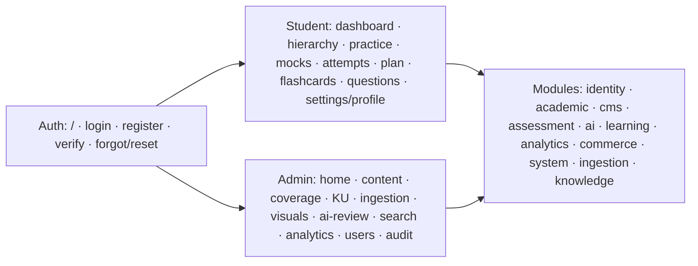

---

# 19. User Personas

## 19.1 Purpose

Chapter 19 defines human archetypes that drive requirements, IA, RBAC, content ops staffing, and acceptance metrics for TALOS / AI NEET Exam App. Personas are implementation-ready: each maps to **real routes**, **seeded roles/permissions**, and **measurable success criteria**—not marketing mood boards.

## 19.2 Background

TALOS is a modular monolith with a **single Next.js frontend** (ADR-0008) hosting learner and operator routes. NEET-first academic tree; content only via ECAEP; attempts recompute mastery; four v1 AI agents; six seeded roles. Personas must distinguish: (1) learners in `/student/**`; (2) operators in `/admin/**` under the UX role gate; (3) sponsors who pay without portals; (4) future institute roles kept **[OUT OF SCOPE MVP]** so `tenant_id` is not invented mid-flight. Collapsing these into one “user” causes admin chrome in student UX and weak permission checks on editorial APIs.

## 19.3 Problem

Without disciplined personas, teams chase BRD fantasies (Knowledge Graph, Digital Twin, institute LMS, native apps) and under-build the Class 12 loop: **dashboard → due revision → practice → mock → attempt review → Tutor → return**. Underspecified Author/Reviewer roles collapse bank quality; conflating Admin with Content Manager weakens security; invisible parent sponsors surface later as unexplained churn.

## 19.4 Solution — Persona Set Overview

Eight personas are normative for Volume 1 Part C:

| ID | Persona | MVP posture | Primary habitat |
|---|---|---|---|
| P-01 | Aarav — Class 12 first-attempt aspirant | **[IN SCOPE MVP]** | `/student/**` |
| P-02 | Meera — Dropper / repeater | **[IN SCOPE MVP]** | `/student/**` |
| P-03 | Kabir — Class 11 early starter | **[IN SCOPE MVP]** | `/student/**` |
| P-04 | Sunita — Parent sponsor | **[IN SCOPE MVP]** influence / **[OUT OF SCOPE MVP]** portal | Indirect via student surfaces + commerce |
| P-05 | Dr. Iyer — SME Content Author | **[IN SCOPE MVP]** ops | `/admin/content*` (via elevation **[ASSUMPTION]**) |
| P-06 | Nadia — Content Reviewer / Approver | **[IN SCOPE MVP]** ops | `/admin/content*`, `/admin/ai-review`, `/admin/coverage` |
| P-07 | Rohan — Platform Admin / Super Admin | **[IN SCOPE MVP]** ops | Full `/admin/**` |
| P-08 | Priya — Institute coordinator | **[OUT OF SCOPE MVP]** / **[FUTURE]** | Not built |

### 19.4.1 Persona landscape diagram

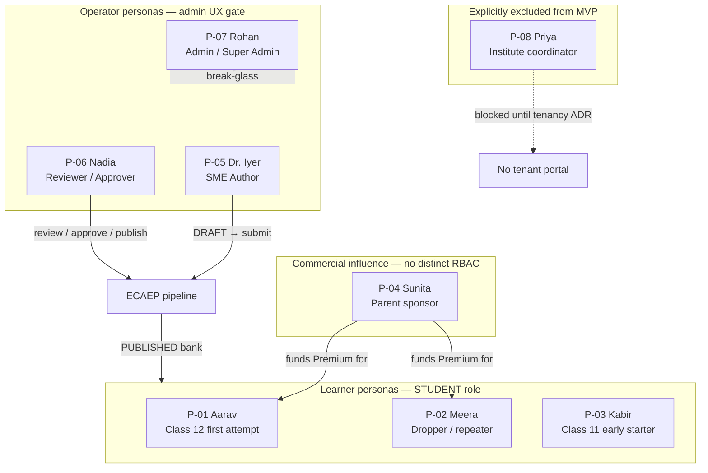

### 19.4.2 Admin UX gate vs seeded TEACHER role **[ASSUMPTION]**

| Role | Seeded content perms | In `ADMIN_ROLES` UX gate? | Practical MVP operating model |
|---|---|---|---|
| `CONTENT_MANAGER` | Create through archive (+ KU/visual) | Yes | Preferred role for authors who need `/admin` UI |
| `ADMIN` / `SUPER_ADMIN` | Broad / bypass | Yes | Ops + break-glass |
| `TEACHER` | create / edit_own_draft / submit_for_review (+ questions.create) | **No** | API-capable author without admin shell unless elevated |

**Normative note for this blueprint:** When staffing SME authors against the current UI, elevate trusted authors to `CONTENT_MANAGER` rather than pretending `TEACHER` has an author workspace. A future ADR may introduce a teacher/author shell or add `TEACHER` to the gate with a reduced nav. Until then, elevation is the supported path. `TEACHER.reports.view` must **not** be reinterpreted as `analytics.view` (admin analytics).

---

## 19.5 Persona Catalog (Detailed)

### Persona P-01 — Aarav Sharma, Class 12 NEET Aspirant (First Attempt)

**Status:** **[IN SCOPE MVP]** — primary acquisition and delivery persona (P0).

#### Demographics

| Attribute | Detail |
|---|---|
| Age | 17 |
| Education stage | Class 12, CBSE/State board dual load + NEET |
| Geography | Tier-1 / Tier-2 India urban or semi-urban |
| Household | Middle-income; education is the largest discretionary spend after housing |
| Attempt posture | First NEET-UG attempt in the upcoming cycle |
| Language | Comfortable in English UI; may think in Hindi/regional language while studying Biology NCERT |
| Device mix | Android phone primary; Windows/Chromebook secondary for longer mocks |

#### Psychographics

Aarav is outcome-obsessed and time-poor. He distrusts “finish the entire internet” advice and responds to systems that tell him the **next concrete action**. He oscillates between confidence after a good Physics numerical streak and anxiety after a Biology factual miss. He will abandon products that feel like content dumps without a revision loop. He cares about NCERT alignment more than brand prestige once he has been burned by unlicensed PDF spam in Telegram groups.

#### Day-in-the-life (school day)

06:30 — Flashcards on phone (`/student/flashcards`). School occupies the day.  
16:00 — `/student/dashboard`; clears **due** items first (due → weak → new).  
16:45 — Weak concept at `/student/concepts/[conceptId]`; reads PUBLISHED note; starts concept-scoped `/student/practice`.  
18:00 — Submits; reviews `/student/attempts/[attemptId]`; asks **Tutor** for grounded explanation.  
20:30 — Twice weekly timed `/student/mock-tests` under +4/−1.  
22:00 — `/student/study-plan` for tomorrow; sleep.

#### Tech fluency

High mobile-web fluency. Expects instant feedback and clear timers. Rejects admin-like chrome and “knowledge graph” configuration. Will follow WhatsApp deep links from parents.

#### Quote

> “Tell me what to revise today, not what exists in the universe.”

#### Goals

Raise Physics numerical accuracy and finish Biology NCERT without panic; improve mock percentile under +4/−1; move weak concepts into `PRACTICING`/`MASTERED` (three-attempt floor before MASTERED — ADR-0015); sustain a daily loop instead of binge-and-crash.

#### Pains

Forgets weak topics after school-exam weeks; YouTube stimulation without retention; “syllabus unfinished” anxiety without a trusted coverage signal; −1 shock on guessed mocks; distrust of leak-like content (ADR-0005).

#### Jobs-to-be-done

| Job | System surface |
|---|---|
| Know what to do today | `/student/dashboard`, recommendations (due → weak → new) |
| Repair one concept quickly | `/student/concepts/[conceptId]`, `/student/practice` |
| Simulate exam pressure | `/student/mock-tests`, `/student/attempts/[attemptId]` |
| Remember formulas / facts | `/student/flashcards` |
| Get an explanation without leaving the loop | Tutor agent (`ai.use`) |
| See whether the plan is realistic | `/student/study-plan` |

#### Success metrics (product)

| Metric | Definition |
|---|---|
| Weekly Learning Loops Completed (persona contribution) | Practice/mock submit → mastery recompute → recommendation open |
| Due clearance rate | Due concepts cleared within 48 hours of `next_review_at` |
| Mock completion rate | Started mocks submitted before abandon |
| Mastery band movement | Share of attempted concepts leaving `LEARNING` |
| D7 retention | Returns in 7-day window after activation |

#### RBAC / permissions

| Item | Value |
|---|---|
| Role | `STUDENT` (default on `/register`) |
| Permissions | `questions.read`, `ai.use` |
| Admin portal | Denied by UX gate and by missing admin permissions |
| CMS write | None |

#### Feature priorities mapped to real screens

**P0:** `/student/dashboard` (due→weak→new), `/student/practice` + `/student/concepts/[conceptId]`, `/student/mock-tests` + `/student/attempts/[attemptId]`, Tutor via AI Gateway. **P1:** `/student/study-plan`, `/student/flashcards`. **P2:** `/student/profile`, `/student/settings`.

---

### Persona P-02 — Meera Nair, Dropper / Repeater

**Status:** **[IN SCOPE MVP]** — P0 learner persona with distinct psychology from first-timers.

#### Demographics

| Attribute | Detail |
|---|---|
| Age | 18–20 |
| Education stage | Post-Class 12 dedicated repeater year |
| Geography | Often relocated to a coaching city or studying from home with full-day schedule |
| Prior outcome | Missed target percentile/rank previous cycle |
| Financial posture | Family has already spent heavily; ROI scrutiny is higher |
| Device mix | Phone + laptop; longer sitting hours than Class 12 peers |

#### Psychographics

Meera is strategic, slightly cynical, and allergic to “start from page one of NCERT again.” She needs **selective gap closure**, exam stamina, and honest weakness detection. Shame and identity stress are real: products that infantilize her or hide prior-year failure modes lose trust. She will exploit practice mode to avoid negative marking if mocks feel punitive without insight—so attempt review quality matters as much as the score.

#### Day-in-the-life

Morning self-study, then TALOS. Twice-weekly full or part-syllabus `/student/mock-tests` with sacred +4/−1 marking. Midday attempt autopsy on `/student/attempts/[attemptId]` (careless vs knowledge gap). Afternoon dashboard weak list — skips MASTERED concepts. Tutor only for stubborn misses. Sunday: reshape `/student/study-plan` after the mock.

#### Tech fluency

High. Benchmarks against last year’s tools. Verifies mastery reflects real attempts, not vanity self-reports. Sensitive to timer honesty and scoring correctness.

#### Quote

> “Don’t make me relearn what I already own. Show me the leaks.”

#### Goals

Close selective weak concepts without syllabus theater; build three-hour stamina and marking discipline; trend mock scores upward; avoid shame-inducing empty dashboards.

#### Pains

Platforms that restart her at Class 11 defaults; diagnostics that cannot separate careless errors from concept holes; parents asking for “% completed” instead of mastery quality; fear of hallucinated Tutor answers beyond the authored bank.

#### Jobs-to-be-done

| Job | System surface |
|---|---|
| Diagnose leaks | `/student/mock-tests`, `/student/attempts`, mastery on topics/concepts |
| Drill only weak/due | `/student/dashboard` recommendations |
| Deep repair | `/student/concepts/[conceptId]`, Tutor |
| Plan remaining months | `/student/study-plan` |
| Track trajectory | `/student/attempts`, dashboard subject rollups |

#### Success metrics

| Metric | Definition |
|---|---|
| Weak-concept conversion | Weak → higher mastery band over 14 days |
| Mock score trend | Rolling average on MOCK attempts |
| Guessing penalty awareness | Reduction in wrong answers under −1 vs early baseline **[ASSUMPTION]** analytics interpretation |
| Overdue revision backlog | Count of `next_review_at` past due |

#### RBAC / permissions

Same as P-01: `STUDENT` with `questions.read`, `ai.use`. No admin access. Commerce entitlement may differ if Premium SKUs gate some assessment volume **[IN SCOPE MVP]** via `commerce` module.

#### Feature priorities mapped to real screens

**P0:** `/student/dashboard` (weak-first), `/student/mock-tests`, `/student/attempts/**`, `/student/topics/[topicId]` rollups. **P1:** `/student/study-plan`, `/student/questions`. **P2:** `/student/settings`.

---

### Persona P-03 — Kabir Joshi, Class 11 Early Starter

**Status:** **[IN SCOPE MVP]** — P1 learner persona (important for LTV; must not warp UX toward only Class 12 intensity).

#### Demographics

| Attribute | Detail |
|---|---|
| Age | 15–16 |
| Education stage | Class 11; NEET intention declared early |
| Geography | Often smaller city with fewer offline mentors |
| Parental involvement | High; schedule still school-primary |
| Attempt posture | 18–24 months runway |
| Device mix | Shared family laptop + personal phone |

#### Psychographics

Kabir is curious but overwhelm-prone. Class 12-oriented banks feel like a firehose. He needs chapter-scoped practice, gentle planner defaults, and early wins on foundational concepts. Gamified noise fails if it distracts from NCERT. He benefits from flashcards and short PRACTICE sets more than frequent full mocks.

#### Day-in-the-life

Shorter NEET block (45–75 minutes). Path: `/student/subjects` → chapter → topic → concept. Practice stays chapter/topic scoped; mocks are occasional but still correctly scored. Flashcards before sleep. Study plan favors consistency over weekend heroics.

#### Tech fluency

Medium-high. Needs clear empty states and hierarchy breadcrumbs. Must never need to understand ECAEP or Knowledge Units.

#### Quote

> “I have time — don’t burn me out pretending the exam is tomorrow.”

#### Goals

Build Class 11 foundations with visible mastery; stay consistent without burnout; enter Class 12 with fewer Physics/Chemistry holes; keep parents calm via simple dashboard progress.

#### Pains

Full-syllabus mocks too early; hierarchy mismatch vs coaching PDF names; social fear of falling behind Class 12 batches; shared-device login/verify friction.

#### Jobs-to-be-done

| Job | System surface |
|---|---|
| Browse hierarchy safely | `/student/subjects` … `/student/concepts/[conceptId]` |
| Short practice | `/student/practice` |
| Memory maintenance | `/student/flashcards` |
| Light planning | `/student/study-plan` |
| Occasional simulation | `/student/mock-tests` |

#### Success metrics

| Metric | Definition |
|---|---|
| Consistency | Weeks with ≥3 learning loops |
| Early mastery | Class 11 concept MASTERED count |
| Scoped practice ratio | Practice attempts with chapter/topic scope vs full-syllabus |
| Activation depth | Reached concept page within first session |

#### RBAC / permissions

`STUDENT`; identical permission codes to P-01/P-02. Differentiation is UX defaults and content difficulty distribution, not a separate role. **[ASSUMPTION]**: product may later add onboarding flags for “Class 11 track” without new RBAC.

#### Feature priorities mapped to real screens

**P0:** `/student/subjects`…`/student/concepts/[conceptId]`, `/student/practice`, `/student/flashcards`. **P1:** `/student/study-plan`, calm `/student/dashboard`. **P2:** occasional `/student/mock-tests`, `/student/profile`.

---

### Persona P-04 — Sunita Sharma, Parent Sponsor

**Status:** Influence **[IN SCOPE MVP]** via student-visible progress and commerce; dedicated parent portal **[OUT OF SCOPE MVP]** (ADR-0007).

#### Demographics

| Attribute | Detail |
|---|---|
| Age | 40–50 |
| Relation | Parent/guardian funding Aarav or Meera |
| Occupation | Salaried professional / small business |
| Geography | Same household as learner |
| Payment instrument | UPI / cards via Razorpay checkout |
| Language | Prefers simple Hindi/English progress explanations |

#### Psychographics

Sunita buys outcomes and safety, not features. She fears scammy content, unmarked coaching piracy, and “hours watched” vanity metrics. She wants to know: Is my child practicing? Are mocks happening? Is the material legitimate? She will not learn ECAEP states, but she will ask her child to show the dashboard on Sundays.

#### Day-in-the-life

No parent account in MVP. Sunday: reviews `/student/dashboard` and `/student/attempts` over the child’s shoulder. Assists Razorpay/UPI when Premium is needed. Escalates login/payment breaks via SUPPORT (read-oriented; playbooks are **[ASSUMPTION]**).

#### Tech fluency

Medium. Comfortable with UPI and WhatsApp. Needs large, obvious progress cues when viewing the student dashboard.

#### Quote

> “I don’t need another login. I need to know the money is buying real practice — and safe content.”

#### Goals

Verify studying (attempts, mocks, revision); avoid pirated-material risk; complete Premium with clear payment errors; keep the child off empty content scrolling.

#### Pains

Opaque “hours watched” metrics elsewhere; rank-prediction nonsense; no parent portal (must use the child’s screen); unclear commerce states after Razorpay redirects.

#### Jobs-to-be-done

| Job | System surface |
|---|---|
| Inspect progress with child | `/student/dashboard`, `/student/attempts` |
| Fund Premium | Commerce / Razorpay (student session) |
| Trust content provenance | Brand + ADR-0005 policy reflected in product—not a parent screen |
| Recover access issues | `/login`, `/forgot-password`, SUPPORT process |

#### Success metrics

| Metric | Definition |
|---|---|
| Checkout completion | Razorpay verify → PAID entitlement |
| Sponsorship continuity | Renewal / continued funding **[ASSUMPTION]** commercial metric |
| Trust proxies | Low chargebacks; low “is this pirated?” complaints |
| Shared-session progress views | Qualitative research / support notes |

#### RBAC / permissions

No distinct `PARENT` role in MVP seed. Sunita is not a first-class identity. She must not be given `users.manage` or admin analytics. Any future parent portal requires an ADR and is **[FUTURE]**.

#### Feature priorities mapped to real screens

**P0:** over-the-shoulder `/student/dashboard` + `/student/attempts`; Razorpay Premium from student session. **P1:** `/student/profile`. **P2:** `/forgot-password`, `/reset-password`. **Non-goal:** parent portal / multi-child views (**[OUT OF SCOPE MVP]**).

---

### Persona P-05 — Dr. Lakshmi Iyer, SME Content Author

**Status:** **[IN SCOPE MVP]** internal P0. Operational role mapping interacts with the admin UX gate **[ASSUMPTION]**.

#### Demographics

| Attribute | Detail |
|---|---|
| Age | 32–55 |
| Background | Subject matter expert (Biology/Physics/Chemistry), ex-faculty or medical/academic professional |
| Employment | Contracted or employed content author for TALOS |
| Geography | Remote-friendly; India-based |
| Work rhythm | Batch authoring sessions; async review cycles |

#### Psychographics

Dr. Iyer values scientific accuracy, NCERT alignment, and clean editorial feedback. She is wary of AI drafts that sound fluent but invent mechanisms. She wants a fast DRAFT → submit path, clear CHANGES_REQUESTED comments, and minimal platform chrome unrelated to content. She understands concepts and questions; she should not need to understand Coolify.

#### Day-in-the-life

Logs into admin as elevated `CONTENT_MANAGER` **[ASSUMPTION]**. Uses `/admin/coverage` to pick thin QUESTION cells; authors at `/admin/content/new`; grounds facts in `/admin/knowledge-units/[unitId]` and ingestion context; submits into ECAEP; revises `CHANGES_REQUESTED` on `/admin/content/[itemId]`.

#### Tech fluency

Medium for enterprise tools; high for subject tools. Needs excellent forms, version history, and readable AI check reports. Will not debug Docker.

#### Quote

> “AI can draft. I will not publish a clever lie.”

#### Goals

Author accurate CONCEPT_NOTE / QUESTION / FLASHCARD items quickly; minimize rework from unclear reviews; keep the bank NCERT-aligned and license-clean; use Knowledge Units as grounding, not bureaucracy.

#### Pains

Vague “fix this” reviews; hallucinated AI stems/options; TEACHER blocked from `/admin` UX gate; coverage pressure without enough PASSED KUs upstream.

#### Jobs-to-be-done

| Job | System surface |
|---|---|
| Create drafts | `/admin/content/new` |
| Edit & version | `/admin/content/[itemId]` |
| Consult KU facts | `/admin/knowledge-units`, `/admin/knowledge-units/[unitId]` |
| Use ingestion context | `/admin/ingestion`, `/admin/ingestion/[jobId]` |
| Find syllabus holes | `/admin/coverage` |
| Submit for AI + human review | ECAEP transitions on content detail |

#### Success metrics

| Metric | Definition |
|---|---|
| Draft → submit cycle time | Median hours |
| Acceptance rate | Share of submissions approved without CHANGES_REQUESTED |
| Rework depth | Mean review rounds per item |
| Coverage contribution | New PUBLISHED items on previously empty concept cells |

#### RBAC / permissions

| Mode | Role | Permissions used |
|---|---|---|
| Seed-pure TEACHER | `TEACHER` | `questions.read/create`, `content.create`, `content.edit_own_draft`, `content.submit_for_review`, `reports.view` (reserved) |
| MVP UI-practical author **[ASSUMPTION]** | `CONTENT_MANAGER` | Above plus `content.review/approve/publish/archive`, `knowledge.manage`, `visual_assets.review` |

Authors should still follow SoD where possible: the same human should not rubber-stamp their own work end-to-end without a second reviewer when staffing allows. **[ASSUMPTION]** operational policy.

#### Feature priorities mapped to real screens

**P0:** `/admin/content`, `/admin/content/new`, `/admin/content/[itemId]` (submit/revise), `/admin/coverage`. **P1:** `/admin/knowledge-units/**`, `/admin/ingestion/**`. **P2:** `/admin/visual-assets`. **Non-goal:** other-learner admin analytics via TEACHER.

---

### Persona P-06 — Nadia Rahman, Content Reviewer / Approver

**Status:** **[IN SCOPE MVP]** internal P0. Typically `CONTENT_MANAGER` (approve/publish) or ADMIN for escalation.

#### Demographics

| Attribute | Detail |
|---|---|
| Age | 28–45 |
| Background | Senior SME / editorial lead; may be ex-author promoted to quality gate |
| Employment | Core content ops |
| Work rhythm | Queue-driven SLA days; bursty near syllabus releases |

#### Psychographics

Nadia’s identity is quality ownership. She treats PUBLISHED as a contract with students and parents. She uses AI Evaluator reports as assistants, not authorities. She cares about gate discipline on Knowledge Units and will block generation that skips PASSED status when policy says so. She watches defect escape rate like an SRE watches error budgets.

#### Day-in-the-life

Works `/admin/ai-review` and `IN_REVIEW` queues; decides on `/admin/content/[itemId]` against KU facts and NCERT; publishes APPROVED batches; uses `/admin/coverage` to rebalance authors when mock pools are thin; spot-checks `/admin/visual-assets`; hunts duplicates via `/admin/search`.

#### Tech fluency

High editorial-tool fluency. Comfortable with queues, states, and audit trails.

#### Quote

> “If it is wrong in PUBLISHED, we didn’t miss a typo — we missed a duty.”

#### Goals

Protect bank quality and NCERT alignment; enforce ECAEP with no skip-to-publish; keep review SLAs compatible with author throughput; ensure mocks have enough PUBLISHED depth.

#### Pains

Fluent-but-wrong AI drafts; incomplete KU grounding; authors arguing in chat instead of version comments; pressure to publish for coverage optics.

#### Jobs-to-be-done

| Job | System surface |
|---|---|
| Review queue | `/admin/content`, `/admin/ai-review` |
| Decide approve / changes | `/admin/content/[itemId]` |
| Publish / archive | Content detail |
| Coverage governance | `/admin/coverage` |
| Visual QA | `/admin/visual-assets` |
| Duplicate hunt | `/admin/search` |

#### Success metrics

| Metric | Definition |
|---|---|
| Defect escape rate | Post-publish corrections / publishes |
| Review SLA | Time in `IN_REVIEW` |
| CHANGES_REQUESTED specificity | Qualitative audit of comment usefulness |
| Publish correctness | Zero student-visible DRAFT leakage |

#### RBAC / permissions

Primary: `CONTENT_MANAGER` with `content.review`, `content.approve`, `content.publish`, `content.archive`, `knowledge.manage`, `visual_assets.review`, question read/create/update as seeded.  
Escalation: `ADMIN` / `SUPER_ADMIN` for `content.force_edit_published` break-glass.

#### Feature priorities mapped to real screens

**P0:** `/admin/content/[itemId]`, `/admin/ai-review`, publish controls, `/admin/coverage`. **P1:** `/admin/knowledge-units/**`, `/admin/visual-assets`. **P2:** `/admin/search`.

---

### Persona P-07 — Rohan Desai, Platform Admin / Super Admin

**Status:** **[IN SCOPE MVP]** internal P0 for security, identity, analytics, and break-glass ops.

#### Demographics

| Attribute | Detail |
|---|---|
| Age | 27–40 |
| Background | Founding engineer / ops lead / IT admin hybrid in early team |
| Employment | Core platform team |
| On-call posture | Owns Coolify/Hetzner incidents with DevOps; owns identity incidents alone |

#### Psychographics

Rohan optimizes for least privilege, auditability, and reversible actions. He treats `SUPER_ADMIN` as break-glass, not a daily driver, when staffing allows. He cares that suspended users cannot authenticate, that Razorpay verify cannot be spoofed, that ingestion cannot become an arbitrary file oracle, and that analytics do not leak into student roles. He resists building institute tenancy “just for one pilot school.”

#### Day-in-the-life

Starts at `/admin`; manages grants/suspensions on `/admin/users` (including author elevation to CONTENT_MANAGER); verifies `/admin/audit-logs` after privileged changes; triages `/admin/ingestion` and stuck KUs; reads `/admin/analytics` (PRACTICE vs MOCK, AI cost proxies); rare `force_edit_published` with audit. Identity/CSRF/RBAC incidents outrank content polish.

#### Tech fluency

Very high. Reads ADRs; comfortable with API envelopes, permission codes, and CI. Expects search reindex to remain ADMIN-scoped per seed.

#### Quote

> “If it isn’t audited, it didn’t happen — and if TEACHER can see admin analytics, we shipped a bug.”

#### Goals

Secure auth/RBAC/suspensions/CSRF; assign roles without mutating SUPER_ADMIN maps; ship actionable analytics (ADR-0017); keep multi-tenancy and second frontends out of the codebase.

#### Pains

TEACHER vs CONTENT_MANAGER vs SUPPORT confusion; AI cost spikes from abusive `ai.use`; silent ingestion/KU failures; pressure for institute features without ADR.

#### Jobs-to-be-done

| Job | System surface |
|---|---|
| Manage users/roles | `/admin/users` |
| Inspect audit trail | `/admin/audit-logs` |
| Read analytics | `/admin/analytics` |
| Oversee ingestion/KU | `/admin/ingestion/**`, `/admin/knowledge-units/**` |
| Search ops | `/admin/search` |
| Break-glass content | `/admin/content/[itemId]` with force permission |

#### Success metrics

| Metric | Definition |
|---|---|
| Critical auth regressions | Count of Sev-1 identity bugs |
| Suspended-user effectiveness | Suspended cannot obtain sessions |
| Privileged action audit coverage | Mutating admin actions present in audit log |
| Time-to-revoke | Minutes to suspend compromised account |

#### RBAC / permissions

| Role | Permissions (seed summary) |
|---|---|
| `ADMIN` | questions.*, users.manage, reports.view, analytics.view, full content.* including force_edit_published, knowledge.manage, visual_assets.review, search.admin, audit.view |
| `SUPER_ADMIN` | Bypass fine-grained checks; permission editor immutable |

Rohan uses ADMIN daily; SUPER_ADMIN for recovery. He does not grant students `analytics.view`.

#### Feature priorities mapped to real screens

**P0:** `/admin`, `/admin/users`, `/admin/audit-logs`, `/admin/analytics`. **P1:** `/admin/ingestion/**`, `/admin/search`, `/admin/knowledge-units/**`. **P2:** `/admin/coverage`, `/admin/ai-review`.

---

### Persona P-08 — Priya Menon, Future Institute Coordinator

**Status:** **[OUT OF SCOPE MVP]** / **[FUTURE]** — documented to prevent accidental half-building of tenancy.

#### Demographics

| Attribute | Detail |
|---|---|
| Age | 30–50 |
| Role title | Academic coordinator / center head at a coaching institute or school NEET cell |
| Org size | 50–2000 aspirants across batches |
| Geography | Coaching hubs (Kota, Hyderabad, Delhi-NCR, etc.) or school chains |
| Buying center | Institute procurement + teachers |

#### Psychographics

Priya wants cohort dashboards, seat licenses, teacher assignments, and white-label reporting. These desires map to **multi-tenancy**, organization-scoped RBAC, and reporting products that TALOS has explicitly deferred. Capturing her requirements is useful for Phase 2 sequencing; implementing a thin slice now would violate ADR-0007 and corrupt the modular monolith with fake `tenant_id` columns.

#### Day-in-the-life (future vision — not productized)

Would assign teachers to batches, monitor section completion, export parent CSVs, and manage seats. None of these screens exist in MVP.

#### Tech fluency

Medium; accustomed to LMS portals. Expects org switchers—must not be prototyped inside student settings.

#### Quote

> “Give me my batch’s weak chapters — not a consumer app I can’t administer.”

#### Goals (future)

Org-scoped users; cohort analytics (not personal student dashboards); teacher workspace that is not SUPER_ADMIN; seat licensing beyond individual Razorpay Premium.

#### Pains (if wrongly pulled into MVP)

`organization_id` bolted onto random tables; `TEACHER.reports.view` overloaded into admin analytics; batch switchers confusing Aarav.

#### Jobs-to-be-done (deferred)

| Job | MVP treatment |
|---|---|
| Institute roster / seats | **[OUT OF SCOPE MVP]** — manual ADMIN user create is ops stopgap, not product |
| Cohort reports | **[FUTURE]** — do not overload `/admin/analytics` |
| Assign TEACHER to students | **[FUTURE]** — tenancy ADR required |
| White-label | **[OUT OF SCOPE MVP]** |

#### Success metrics

Not measured in MVP. Revisit only after a tenancy ADR wires `organizations` deliberately.

#### RBAC / permissions

No institute-admin role in seed. Do not invent `INSTITUTE_ADMIN` without ADR. `TEACHER` is an individual permission bundle, not a tenant role.

#### Feature priorities mapped to real screens

| Priority | Feature | Screen |
|---|---|---|
| None in MVP | Institute portal | Does not exist |
| Explicit block | Multi-tenant admin / native campus apps | **[OUT OF SCOPE MVP]** |
| Safe adjacent | Teachers elevated to CONTENT_MANAGER for authoring | `/admin/content*` under current gate |

---

## 19.6 Permission Matrix (Seeded Reality)

The following matrix is normative for persona → capability mapping. It reflects `apps/backend/app/modules/identity/seed.py` plus the admin UX gate in `apps/web/src/app/admin/layout.tsx`.

### 19.6.1 Role × capability matrix

| Capability | SUPER_ADMIN | ADMIN | CONTENT_MANAGER | TEACHER | STUDENT | SUPPORT |
|---|:---:|:---:|:---:|:---:|:---:|:---:|
| Admin UX gate (`/admin/**` shell) | Yes | Yes | Yes | **No** | No | No |
| Permission check bypass | Yes | No | No | No | No | No |
| `users.manage` | Yes* | Yes | No | No | No | No |
| `analytics.view` | Yes* | Yes | No | No | No | No |
| `audit.view` | Yes* | Yes | No | No | No | No |
| `search.admin` | Yes* | Yes | No | No | No | No |
| `content.create` / `edit_own_draft` / `submit_for_review` | Yes* | Yes | Yes | Yes | No | No |
| `content.review` / `approve` / `publish` / `archive` | Yes* | Yes | Yes | No | No | No |
| `content.force_edit_published` | Yes* | Yes | No | No | No | No |
| `knowledge.manage` | Yes* | Yes | Yes | No | No | No |
| `visual_assets.review` | Yes* | Yes | Yes | No | No | No |
| `questions.read` | Yes* | Yes | Yes | Yes | Yes | No |
| `questions.create` | Yes* | Yes | Yes | Yes | No | No |
| `questions.update` / `delete` | Yes* | Yes | update only / no delete† | No | No | No |
| `ai.use` | Yes* | No‡ | No‡ | No‡ | Yes | No |
| `reports.view` | Yes* | Yes | No | Yes | No | Yes |
| Student learning surfaces | Yes (not primary) | Rare | Rare | Rare | **Primary** | No |

\* SUPER_ADMIN bypasses checks; seed also attaches the full permission catalog.  
† Per seed: CONTENT_MANAGER has `questions.update` but not `questions.delete`.  
‡ `ai.use` is seeded to STUDENT (and SUPER_ADMIN via full catalog). Operator use of student Tutor is not the primary design.

### 19.6.2 Persona × role mapping table

| Persona | Primary role | Notes |
|---|---|---|
| P-01 Aarav | STUDENT | Self-register default |
| P-02 Meera | STUDENT | Same role; different UX emphasis |
| P-03 Kabir | STUDENT | Same role; hierarchy-first UX |
| P-04 Sunita | None | No parent role; commerce via student |
| P-05 Dr. Iyer | TEACHER seed / CONTENT_MANAGER in UI **[ASSUMPTION]** | Elevation required for `/admin` shell today |
| P-06 Nadia | CONTENT_MANAGER | Approver path; ADMIN for force-edit escalation |
| P-07 Rohan | ADMIN or SUPER_ADMIN | Prefer ADMIN daily |
| P-08 Priya | N/A | **[OUT OF SCOPE MVP]** |

### 19.6.3 Persona × screen priority (summary)

Learners (P-01/P-02/P-03): P0 on `/student/dashboard`, hierarchy, `/student/practice`, `/student/attempts/**`; mocks P0 for P-01/P-02 and P2 for P-03; flashcards P0 for P-03 / P1 for P-01; study-plan P1 across learners. Parent (P-04): over-the-shoulder P0 on dashboard/attempts only (no independent authz). Author (P-05): P0 content + coverage; P1 KU/ingestion. Reviewer (P-06): P0 content detail, ai-review, coverage, publish; P1 KU/visuals. Admin (P-07): P0 users, audit-logs, analytics, admin home; P1 ingestion/search/KU. Institute (P-08): no MVP screens.

### 19.6.4 Permission matrix diagram

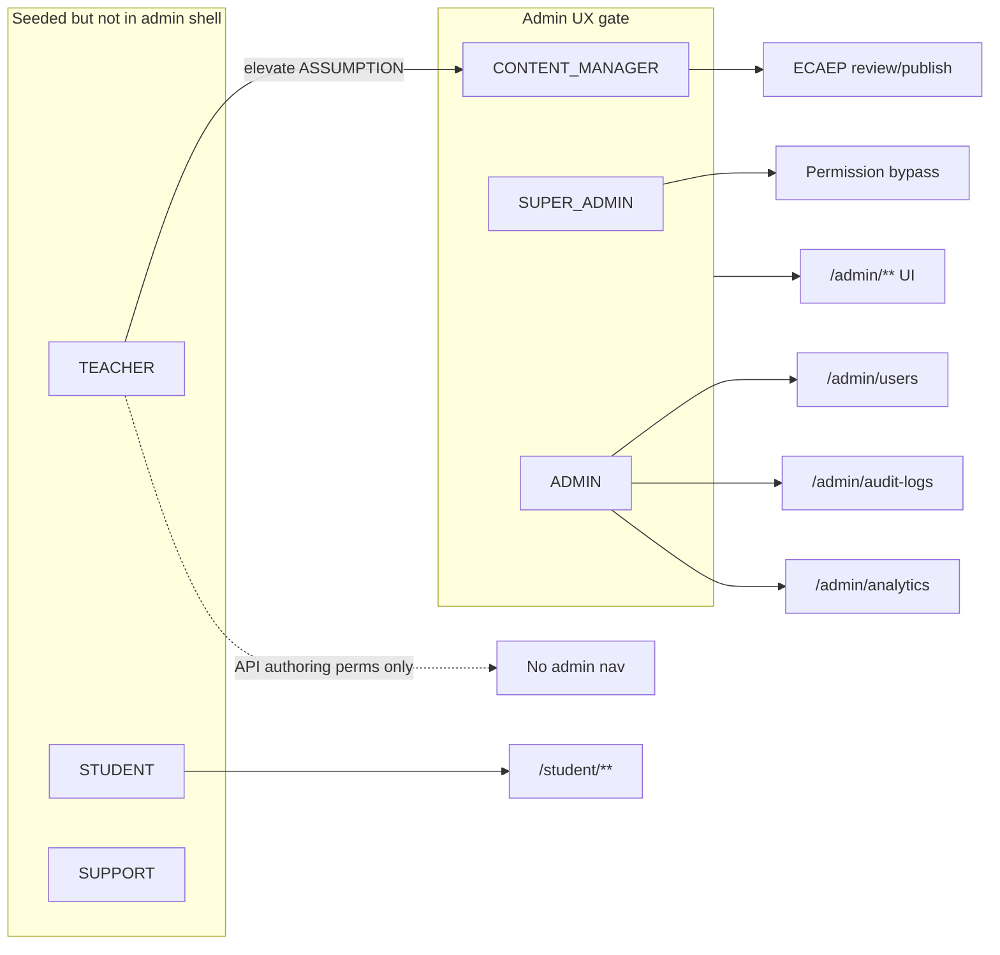

---

## 19.7 Cross-Persona Learning & Content Loop

Personas are coupled through one closed loop. This loop is the product spine; personas exist to keep each stage staffed and prioritized.

```mermaid
sequenceDiagram
  participant Author as P-05 Author
  participant Reviewer as P-06 Reviewer
  participant CMS as cms + knowledge
  participant Student as P-01/02/03
  participant Assess as assessment
  participant Learn as learning
  participant AI as ai agents

  Author->>CMS: DRAFT content / KU-grounded facts
  Author->>CMS: submit → AI_CHECKED
  Reviewer->>CMS: IN_REVIEW → APPROVED → PUBLISHED
  Student->>Assess: PRACTICE or MOCK from PUBLISHED pool
  Assess->>Learn: submit → mastery recompute + next_review_at
  Learn->>Student: recommendations due → weak → new
  Student->>AI: Tutor on misses; Planner on /student/study-plan
  Note over Reviewer,CMS: Evaluator assists AI_CHECKED / ai-review queue
```

**Implications:** thin author/reviewer throughput shrinks mock pools (ADR-0013); weak mastery/recommendations churn P-02 despite content volume; role mis-assignment surfaces as RBAC bugs; partial P-08 builds create tenancy debt.

---

## 19.8 Persona Priority Matrix (Acquisition vs Delivery)

| Persona | Acquisition priority | Delivery priority | Rationale |
|---|---|---|---|
| P-01 Aarav | P0 | P0 | Core NEET vertical user |
| P-02 Meera | P0 | P0 | High willingness to pay; ruthless UX bar |
| P-03 Kabir | P1 | P1 | LTV / early funnel; protect from Class 12-only defaults |
| P-04 Sunita | P1 | P1 (via student UX + commerce) | Pays; no portal |
| P-05 Dr. Iyer | Internal P0 | P0 | Without authors, bank dies |
| P-06 Nadia | Internal P0 | P0 | Without reviewers, PUBLISHED trust dies |
| P-07 Rohan | Internal P0 | P0 | Without admin, security/ops die |
| P-08 Priya | Future | None in MVP | Tenancy deferred |

---

## 19.9 Advantages

Route-true and RBAC-true personas prevent drift from `apps/web` and TEACHER/analytics conflation; the Author vs Reviewer split preserves SoD language; P-08 acts as a tenancy firewall; the parent influence persona covers commerce without inventing an unbuilt portal.

## 19.10 Tradeoffs

Parent and institute needs wait (support tickets will ask). Elevating authors to CONTENT_MANAGER **[ASSUMPTION]** widens publish power if SoD staffing is thin. Three learner personas share one RBAC role—differentiation is UX/content policy. Route renames must update this chapter in the same PR.

## 19.11 Future Enhancements **[FUTURE]**

Dedicated `TEACHER` author shell (ADR + UX gate change); Class 11 onboarding track flag (still STUDENT); parent digest without full portal (privacy review); institute coordinator only after tenancy ADR; micro-competency messaging when ADR-0021 Phase 2 ships—still not a Digital Twin.

## 19.12 References

ADR-0001, ADR-0003, ADR-0004/0014, ADR-0005, ADR-0007, ADR-0008, ADR-0009 / `docs/architecture/ecaep.md`, ADR-0010, ADR-0011, ADR-0013, ADR-0015, ADR-0016, ADR-0017, ADR-0021, ADR-0023, ADR-0024/0028; `apps/backend/app/modules/identity/seed.py`; `apps/web/src/app/admin/layout.tsx`; `apps/web/src/app/student/**`; `apps/web/src/app/(auth)/**`.

---

## Appendix 19-A — Persona One-Line Roster

| ID | One-line |
|---|---|
| P-01 | First-attempt Class 12 aspirant living in due→weak→new daily loops. |
| P-02 | Repeater optimizing selective weakness and mock stamina under +4/−1. |
| P-03 | Class 11 early starter needing hierarchy-scoped practice without burnout. |
| P-04 | Paying parent who inspects student progress and funds Razorpay Premium. |
| P-05 | SME author shipping ECAEP drafts grounded in PASSED Knowledge Units. |
| P-06 | Reviewer/approver defending PUBLISHED quality and coverage honesty. |
| P-07 | Platform admin owning RBAC, audit, analytics, and break-glass. |
| P-08 | Future institute coordinator blocked until tenancy is a real ADR. |

## Appendix 19-B — Anti-Persona Guardrails

| Anti-persona | Why rejected |
|---|---|
| “Knowledge Graph Analyst” | Enterprise KG **[OUT OF SCOPE MVP]** |
| “Digital Twin Coach” | Digital Twin **[OUT OF SCOPE MVP]** |
| “Native App Power User” | Native mobile **[OUT OF SCOPE MVP]** |
| “Tenant Superuser for 40 campuses” | Multi-tenancy **[OUT OF SCOPE MVP]** |
| “Author who bypasses ECAEP” | Violates ADR-0009 / content licensing posture |
| “Student admin hybrid” | Violates RBAC and admin UX gate |

## Appendix 19-C — Traceability Checklist for New Features

Before accepting a feature into MVP: (1) primary persona among P-01–P-07; (2) real host route named; (3) permission code or student-auth only; (4) depends on PUBLISHED / PASSED KU / shipped mastery as needed; (5) no silent tenancy/KG/Digital Twin/native scope; (6) if authors need UI, confirm admin UX gate or document elevation **[ASSUMPTION]**.

---

*End of Part 1 (Volume 1 Part C). Continue with Chapters 20–23 in the subsequent Part C file. This file intentionally stops after Chapter 19 and its persona appendices.*

# 20. Customer Journey

| Field | Value |
|---|---|
| Document ID | TALOS-VOL-01-PART-C |
| Document section | Chapter 20 — Customer Journey |
| Parent volume | TALOS-VOL-01 — Executive & Product Blueprint |
| Platform name | Trinetra AI Learning OS (TALOS) |
| Product vertical | AI NEET Exam App (NEET-UG) |
| Version | 1.0.0 |
| Status | Approved for Engineering Use |
| Classification | Internal — Confidential |
| Effective date | 2026-08-07 |
| Repository path | `docs/blueprint/volume-01/03-product-design.md` |
| Continues from | `docs/blueprint/volume-01/03-product-design.md` (surface map + Chapter 19 Personas) |
| Authority | Architecture Decision Records (`docs/decisions/`) |
| Related ADRs | ADR-0003, ADR-0006, ADR-0007, ADR-0008, ADR-0009, ADR-0013, ADR-0014, ADR-0015, ADR-0016, ADR-0018, ADR-0023, ADR-0024, ADR-0025, ADR-0028 |
| Related architecture | `docs/architecture/ecaep.md`, `docs/architecture/roadmap.md` |
| Diagram companions | `diagrams/student-journey.mmd`, `diagrams/ecaep-state.mmd`, `diagrams/learning-loop.mmd` |
| Audience | CTO, Chief Architect, Product, Engineering Managers, QA, AI Engineering, Content Ops, Support |
| Language | Professional technical English (UTF-8) |

> **Canonical naming (ADR-0010).** The platform name is **Trinetra AI Learning OS (TALOS)**. “AI NEET Exam App” denotes the first exam vertical.

> **Conflict rule.** If prose conflicts with an Accepted ADR or with repository evidence under `apps/`, the ADR and repository win. Labels: **[SHIPPED]**, **[IN SCOPE MVP]**, **[ASSUMPTION]**, **[FUTURE]**, **[OUT OF SCOPE MVP]** — same legend as the Assumption Labels section.

> **Explicit non-claims.** Knowledge Graph, Digital Twin, native mobile applications, and multi-tenant institute portals are **[OUT OF SCOPE MVP]** / **[FUTURE]** and are never described as shipped capabilities in this chapter.

---

## 20.0 Purpose and reading guide

Chapter 20 specifies the end-to-end journeys that convert anonymous attention into a retained NEET learner, and that convert licensed NCERT-aligned source material into a trustworthy `PUBLISHED` bank. Every stage names a real Next.js route under `apps/web/src/app/**`, a real backend module under `apps/backend/app/modules/**`, and an observable metric. The chapter is normative for activation engineering, content-ops staffing, Support playbooks, and acceptance tests: if a journey step cannot be demonstrated on a named surface, it is not yet product truth.

Journey design for TALOS is deliberately loop-shaped rather than funnel-only. Acquisition stages (Discover → Register → Activate) feed a learning loop (Practice → Mock → Tutor → Revise) that can run for weeks on free entitlements before a Premium conversion event. Retention is not a separate “loyalty product”; it is the quality of recommendations (`due → weak → new`) and the honesty of failure states (payment, suspension, coverage gaps, Knowledge Unit gates, AI provider outages). Parent sponsors (persona P-04) influence commerce without a parent portal **[OUT OF SCOPE MVP]**. Institute cohort journeys (persona P-08) are excluded so `tenant_id` is not invented mid-flight **[OUT OF SCOPE MVP]**.

---

## 20.1 Discovery → Register → Activate → Practice → Mock → Tutor → Revise → Convert Premium → Retain

This section narrates each stage with routes, modules, emotional posture, and exit criteria. Personas referenced (P-01 Aarav, P-02 Meera, P-03 Kabir, P-04 Sunita) are defined in Chapter 19.

### 20.1.1 Discovery

**Stage intent.** Convert anonymous curiosity into a registration intent without overselling enterprise BRD fantasies.

**Primary surface **[SHIPPED]**:** `/` (`(public)/page.tsx`). Secondary discovery channels (SEO landing variants, paid ads, WhatsApp referral links) are **[ASSUMPTION]** marketing overlays that should still terminate on `/` or `/register`.

**System touchpoints.** Public marketing content in the Next.js app; no authenticated API calls required. Brand and vertical naming must stay consistent with ADR-0010: Trinetra AI Learning OS (TALOS) as platform, AI NEET Exam App as the NEET-UG product.

**Narrative.** Aarav (P-01) or a parent searching for “NEET practice with NCERT grounding” lands on `/`. The first viewport must communicate one composition: brand, one headline about mastery-driven NEET practice, one supporting sentence about PUBLISHED / reviewed content and AI Tutor bounded by authored bank, and a clear CTA to `/register` (and secondary CTA to `/login`). Discovery must not promise Knowledge Graph diagnostics, Digital Twin coaching, native apps, or institute dashboards. Those promises create support debt and architectural pressure against ADR-0007.

**Exit criteria.** User navigates to `/register` or `/login`. Metric: visit → register click-through.

**Emotion.** Curious, skeptical of coaching-platform marketing noise.

**Opportunity.** Differentiate on honesty: reviewed content workflow, concept mastery (not vanity hours), NEET-realistic mocks with **+4 / −1**, Tutor grounded in `PUBLISHED` / PASSED Knowledge Units.

### 20.1.2 Register

**Stage intent.** Create an identity with default **STUDENT** role and JWT session cookies without Auth.js (ADR-0003).

**Primary surfaces **[SHIPPED]**:** `/register` → success path toward `/verify-email` and/or `/login`. Password recovery siblings: `/forgot-password`, `/reset-password`.

**Modules.** `identity` — registration, Argon2 hashing, access + rotating refresh tokens in HTTP-only cookies, rate limiting on `/auth/register` **[SHIPPED]** (ADR-0018 hardening).

**Narrative.** The prospective student submits email and password on `/register`. On success, the account exists with role **STUDENT** and permissions including `questions.read` and `ai.use`. No admin chrome is exposed. Self-service must never allow role self-elevation or self-reactivation after suspension (ADR-0018). Kabir (P-03) may register early in Class 11; Meera (P-02) may register after a prior-year attempt with higher mock expectations—the registration form itself does not branch by persona; personalization begins after activation via mastery and recommendations.

**Exit criteria.** User record created; credentials usable for login (subject to email verification UX policy). Metric: register success rate; abandonment on validation errors.

**Emotion.** Hopeful, impatient with friction.

**Opportunity.** Minimal fields; clear password rules; no coaching-center CRM questionnaire. Email verification reliability is an activation gate **[ASSUMPTION]** on product copy strictness even though the verify route is **[SHIPPED]**.

### 20.1.3 Activate (email verify + first curriculum orientation)

**Stage intent.** Move from “account exists” to “student can see the NEET academic tree and understand where to start.”

**Primary surfaces **[SHIPPED]**:** `/verify-email`; then `/login`; then `/student/dashboard`; then hierarchy entry at `/student/subjects` → `/student/subjects/[subjectId]` → `/student/chapters/[chapterId]` → `/student/topics/[topicId]` → `/student/concepts/[conceptId]`.

**Modules.** `identity` (verification + auth), `academic` (Exam → Subject → Chapter → Topic → Concept), `learning` (empty or seed mastery state; recommendations may surface `new_concept` when no history exists).

**Narrative.** After verify/login, the student lands on `/student/dashboard`. Activation is complete only when they open at least one subject and one concept—proving the seeded NEET-UG tree is visible and navigable. Topic mastery rollups compute on read; concept mastery rows appear after attempts. Empty recommendation states for brand-new accounts should prefer honest “start with a chapter” guidance over fake progress **[ASSUMPTION]** on UX copy. Profile/settings (`/student/profile`, `/student/settings`) are available but are not activation-critical.

**Exit criteria.** First curriculum view (subject or concept opened). Metric: time-to-first-curriculum-view; verify completion rate.

**Emotion.** Oriented if the tree is clear; overwhelmed if Class 12 depth hits Class 11 starters without chapter scoping.

**Opportunity.** Chapter-scoped practice CTAs for P-03; dashboard “start here” for P-01; avoid requiring ECAEP or Knowledge Unit literacy from learners.

### 20.1.4 Practice

**Stage intent.** Generate an untimed **PRACTICE** assessment from `PUBLISHED` questions, start an attempt, answer, submit, and receive score + mastery update.

**Primary surfaces **[SHIPPED]**:** `/student/practice` (generate/start); `/student/attempts/[attemptId]` (in-progress / review); optional entry from `/student/concepts/[conceptId]` or hierarchy; history at `/student/attempts`; discovery of bank items at `/student/questions` and `/student/questions/[id]`.

**Modules.** `assessment` (generate PRACTICE, start attempt, submit, score), `cms` (question pool filtered to `PUBLISHED`), `learning` (synchronous mastery recompute + `next_review_at`), `academic` (scope resolution).

**Domain rules **[SHIPPED]** (ADR-0013):** PRACTICE defaults to ~10 questions, untimed (`duration_minutes = null`), marks +1 correct, **no negative marking**. Generation is on-demand for concept/chapter/subject scope—not a separate test-definition CRUD that bypasses ECAEP. Adaptive packs are deferred.

**Narrative.** From dashboard recommendations or a concept page, the student opens `/student/practice`, chooses scope, and generates a PRACTICE set. The API selects `PUBLISHED` questions only. An attempt starts (`IN_PROGRESS`), answers are recorded, submit scores the attempt, and `learning` persists concept mastery (`LEARNING` / `PRACTICING` / `MASTERED` bands per ADR-0015) and schedules `next_review_at`. Topic mastery is recomputed on subsequent topic page reads, not as a separately persisted twin of concept rows. Flashcards at `/student/flashcards` are a parallel light practice surface over `PUBLISHED` FLASHCARD items—not a substitute for MCQ PRACTICE.

**Exit criteria.** First PRACTICE attempt submitted. Metric: generate → start → submit conversion; time-to-first-submit.

**Emotion.** Engaged when generation is fast and explanations exist; frustrated if scope has no published questions (see §20.6.3).

**Opportunity.** Tight empty-state messaging linked to coverage honesty; post-submit deep-link to concept note and optional Tutor.

### 20.1.5 Mock

**Stage intent.** Deliver exam-realistic timed **MOCK** assessments with NEET marking **+4 / −1**, including full-syllabus 180-minute sittings when the bank allows.

**Primary surfaces **[SHIPPED]**:** `/student/mock-tests`; attempt runtime/review at `/student/attempts/[attemptId]`; history at `/student/attempts`.

**Modules.** `assessment` (`generate_mock`, `generate_full_mock`), `cms` (published pool), `learning` (mastery recompute on submit), `academic` (subject quotas for full mock).

**Domain rules **[SHIPPED]** (ADR-0013):** Scoped mocks use marks 4 / negative 1; duration scales with question count (pace ~1 minute/question, minimum 10). Full NEET-pattern mock: up to per-subject question quotas, fixed **180 minutes**, with a per-subject coverage report so the UI can show honest shrinkage when a subject’s published pool is thin—not a silent fake full paper. If zero published questions exist anywhere, generation fails with `NO_QUESTIONS_AVAILABLE` (422).

**Narrative.** Meera (P-02) treats mocks as sacred twice-weekly events. She starts from `/student/mock-tests`, reviews coverage honesty if a full mock is undersupplied in Biology, sits the timer, submits, and performs attempt autopsy on `/student/attempts/[attemptId]`—separating careless errors from concept holes. Aarav uses shorter scoped mocks earlier; Kabir should be steered toward chapter practice before frequent full mocks **[ASSUMPTION]** on planner defaults.

**Exit criteria.** Mock attempt completed (submitted or timer-enforced). Metric: mock completion rate; score trend; coverage-report acknowledgment when degraded.

**Emotion.** Stressed, performance-focused; trust collapses if marking or timer is dishonest.

**Opportunity.** Post-mock recommendation refresh emphasizing newly weak concepts; study-plan reshape on `/student/study-plan`.

### 20.1.6 Tutor

**Stage intent.** Provide AI Tutor explanations bounded by authored knowledge—not unbounded chat that invents NEET facts.

**Primary surfaces **[SHIPPED]** / **[IN SCOPE MVP]**:** Tutor invocation from learner AI surfaces tied to concepts/questions/attempts (student AI use requires `ai.use`); concept context at `/student/concepts/[conceptId]`; question detail at `/student/questions/[id]`; attempt review at `/student/attempts/[attemptId]`. Study Planner sibling surface: `/student/study-plan`.

**Modules.** `ai` (AI Gateway, Tutor agent, Claude as sole wired provider; FallbackProvider when no API key), `cms` (Tutor retrieval reads **`PUBLISHED` only**), `knowledge` (PASSED Knowledge Units as grounding per ADR-0023/0025/0028), `learning` (weak areas may inform prompts).

**Narrative.** After a miss on attempt review, the student asks Tutor why option B is wrong. The gateway generates via Claude when configured; when `ANTHROPIC_API_KEY` is absent, FallbackProvider returns a clearly labeled deterministic placeholder—not a hallucinated scientific explanation presented as truth (ADR-0014). Tutor must not read `DRAFT` / `IN_REVIEW` content. This is not a Mentor agent, Digital Twin, or 12-agent orchestrator **[OUT OF SCOPE MVP]**.

**Exit criteria.** Tutor response received (live or labeled fallback). Metric: Tutor session starts after miss; helpfulness proxy (re-practice of same concept within 48h **[ASSUMPTION]**).

**Emotion.** Relieved when grounded; distrustful if fluent but wrong.

**Opportunity.** Cite concept notes / KU-grounded facts in UX; escalate content defects to ops via Support rather than letting students “fix” the bank.

### 20.1.7 Revise

**Stage intent.** Clear due revisions and attack weak concepts before chasing novelty—recommendation order is normative: **due → weak → new** (ADR-0016).

**Primary surfaces **[SHIPPED]**:** `/student/dashboard` (recommendations entry); due revision API-backed lists; concept pages `/student/concepts/[conceptId]`; PRACTICE regeneration; `/student/flashcards`; `/student/study-plan` for planner-shaped schedules.

**Modules.** `learning` (`next_review_at`, `get_due_for_revision`, `get_recommendations`, concept mastery persistence), `assessment` (practice loops), `academic` (navigation), `ai` (Study Planner).

**Domain rules **[SHIPPED]**:** Concept mastery is persisted in `learning.concept_mastery`. Topic mastery is a read-time rollup. Review intervals by band include LEARNING ≈ 1 day, PRACTICING ≈ 3 days, MASTERED ≈ 7 days (implementation constants in mastery service). MASTERED requires the three-attempt floor rule per ADR-0015. Recommendations fill slots: overdue first, then `PRACTICING` weak concepts, then new concepts with no mastery row.

**Narrative.** Morning session: dashboard shows three due concepts. Student clears them via short PRACTICE or flashcards, watches `next_review_at` move outward, then optionally opens a weak Physics numerical. Novelty (`new_concept`) only appears after due/weak slots are filled or exhausted. This arithmetic mastery loop is the retention engine—not a Digital Twin simulation.

**Exit criteria.** Due item opened and acted on (practice/flashcard/tutor+practice). Metric: due clearance within 48 hours; overdue backlog size.

**Emotion.** In control when the list is short and truthful; anxious when backlog snowballs after mock week.

**Opportunity.** Sunday parent over-the-shoulder review (P-04) uses the same dashboard—no separate parent metrics product in MVP.

### 20.1.8 Convert Premium

**Stage intent.** Complete an honest Razorpay one-time Premium purchase that marks `commerce.orders` as `PAID` only after signature verification—never via a fake success path.

**Primary surfaces **[SHIPPED]**:** Commerce APIs (`POST /api/v1/commerce/orders`, `POST /api/v1/commerce/orders/{id}/verify`, `GET /api/v1/commerce/status`) invoked from student session UX **[ASSUMPTION]** on exact checkout chrome placement (settings/dashboard upgrade CTA). Parent P-04 may operate UPI on the student’s device; there is no parent commerce portal **[OUT OF SCOPE MVP]**.

**Modules.** `commerce` (orders CREATED/PAID/FAILED, Razorpay order create, HMAC-SHA256 signature verify), `identity` (authenticated student only).

**Domain rules **[SHIPPED]** (ADR-0006 / ADR-0018):** Fixed-price Premium (implementation: ₹499.00). One-time purchase; no subscriptions/dunning in MVP. Premium status = existence of a `PAID` order for `user_id` (derived; not a duplicated `is_premium` column on users). If Razorpay keys are missing, order creation returns **503** `PAYMENT_GATEWAY_NOT_CONFIGURED`—**no fake PAID**. Invalid signatures mark order `FAILED` and return 400 `INVALID_SIGNATURE`. Gateway API failures can yield 502 with order `FAILED`.

**Product gating note.** ADR-0018 explicitly ships the payment rail without baking a silent paywall matrix. Which learner features become Premium-gated is a business decision **[ASSUMPTION]** / **[IN SCOPE MVP]** product configuration—not a claim that practice/mocks are currently hard-gated in code. Journey design still includes Convert as a stage because the rail, status endpoint, and honest failure UX are shipped and parent-funded conversion is a core commercial path.

**Narrative.** After value is proven (practice loop + mock realism), the student or parent initiates checkout. Razorpay collects payment; the client posts `razorpay_payment_id` + `razorpay_signature` to verify; only then does `GET /commerce/status` report `is_premium: true`. If keys are unset in an environment, the UI must show an actionable “payment isn’t configured” state—not a demo unlock.

**Exit criteria.** Order status `PAID` after verified signature. Metric: checkout start → PAID rate; verify failure rate; 503 rate in misconfigured envs (ops metric).

**Emotion.** Cautious with money; intolerant of ambiguous “are we Premium?” states.

**Opportunity.** Receipt clarity; Support playbook for FAILED vs CREATED; never imply Premium after client-only success without server verify.

### 20.1.9 Retain

**Stage intent.** Produce D1/D7/D30 return visits driven by due revision and mock cadence—not notifications spam or gamification theatre.

**Primary surfaces **[SHIPPED]**:** `/student/dashboard`, `/student/study-plan`, `/student/practice`, `/student/mock-tests`, `/student/flashcards`, hierarchy, attempts history.

**Modules.** `learning` (recommendations quality), `assessment` (habit loops), `ai` (planner), `analytics` (ops aggregates—not student vanity hours), `commerce` (Premium status stability).

**Narrative.** Retention is the same loop as §20.1.4–20.1.7 with increasing mock frequency for P-01/P-02 and foundation emphasis for P-03. Push notification platforms, native mobile retain hooks, and multi-child parent digests are **[FUTURE]** / **[OUT OF SCOPE MVP]**. Email lifecycle campaigns are **[ASSUMPTION]** marketing ops outside the modular monolith core.

**Exit criteria.** Return visit with at least one learning action (open due item, start practice/mock, flashcard session, or planner open). Metrics: D1/D7 retention; weekly learning loops completed (submit → mastery recompute → recommendation open); mock cadence adherence.

**Emotion.** Habitual when recommendations feel fair; churn risk when coverage gaps block mocks or Tutor falls back too often in production.

**Opportunity.** Treat content coverage and KU PASSED rates as retention infrastructure, not only editorial KPIs.

### 20.1.10 Stage summary chain

```
Discover (/) → Register (/register) → Activate (/verify-email → /student/dashboard → /student/subjects→…→concepts)
  → Practice (/student/practice → /student/attempts/[id])
  → Mock (/student/mock-tests → attempts)
  → Tutor (ai.use + PUBLISHED/PASSED grounding)
  → Revise (dashboard due→weak→new + next_review_at)
  → Convert Premium (commerce Razorpay verify → PAID)
  → Retain (loop re-entry)
```

Cross-cutting: identity session cookies on all authenticated stages; suspended users fail at login (§20.6.2); content ops journey in §20.4 feeds the published bank that makes Practice/Mock/Tutor possible.

---

## 20.2 Journey map tables

### 20.2.1 Student journey map (detailed)

| Stage | User actions | Touchpoints (routes / APIs / modules) | Emotion | Opportunity | Primary metrics |
|---|---|---|---|---|---|
| Discover | Lands on marketing entry; evaluates trust vs coaching ads | `/` public page; brand/value CTA | Curious, skeptical | Honest NEET + mastery positioning; no KG/Twin/native claims | Visit→register CTR; bounce rate |
| Register | Creates STUDENT account; handles validation errors | `/register`; `identity` register; rate limit | Hopeful, impatient | Minimal fields; Argon2 + cookie session clarity | Register success; validation fail rate |
| Verify | Completes email verification | `/verify-email`; identity mail token flow | Impatient | Reliable delivery; clear resend **[ASSUMPTION]** UX | Verify completion %; time-to-verify |
| Activate | Logs in; opens dashboard; browses subjects→concepts | `/login`; `/student/dashboard`; `/student/subjects` … `/student/concepts/[conceptId]`; `academic`, `learning` | Oriented or overwhelmed | First-run chapter CTA; empty-state honesty | Time-to-first-curriculum-view; first concept open |
| Practice | Generates PRACTICE; answers; submits | `/student/practice`; `/student/attempts/[attemptId]`; `assessment`, `cms`, `learning` | Engaged | Fast generation; clear +1/no-negative scoring | First attempt start; submit success; gen latency |
| Feedback / autopsy | Reviews score, wrong items, concept links | `/student/attempts/[attemptId]`; `/student/questions/[id]`; concept pages | Charged, reflective | Careless vs knowledge-gap framing **[ASSUMPTION]** copy | Post-submit concept opens; re-practice rate |
| Mock | Starts timed MOCK / full 180-min mock; finishes under +4/−1 | `/student/mock-tests`; attempts; `assessment.generate_mock` / `generate_full_mock` | Stressed | Coverage report honesty; timer integrity | Mock completion; score trend; coverage ack |
| Tutor | Asks explanation on miss / concept doubt | Tutor via `ai` + `ai.use`; PUBLISHED cms; PASSED KU | Relieved if grounded | Source-bound answers; labeled fallback | Tutor starts after miss; fallback ratio (prod) |
| Revise | Clears due; drills weak; then new | `/student/dashboard` recommendations; flashcards; practice; `learning` | In control | Enforce due→weak→new; surface `next_review_at` | Due clearance ≤48h; overdue backlog |
| Study plan | Adjusts plan after mocks / weekly review | `/student/study-plan`; Study Planner agent | Deliberate | Planner uses mastery signals, not vanity | Plan open D7; plan→practice conversion |
| Convert Premium | Pays via Razorpay; waits for server verify | Commerce order/create/verify/status; student session; parent assists on device | Cautious | 503 honesty; signature verify; no fake PAID | CREATED→PAID; verify fail; 503 misconfig |
| Retain | Returns D1/D7; repeats loop | Dashboard + practice/mock/revise loop | Habitual | Recommendation quality; coverage depth | D1/D7 retention; weekly loops |

### 20.2.2 Module × stage responsibility matrix

| Stage | identity | academic | cms | assessment | ai | learning | commerce | ingestion | knowledge |
|---|---|---|---|---|---|---|---|---|---|
| Discover | — | — | — | — | — | — | — | — | — |
| Register / Verify | Primary | — | — | — | — | — | — | — | — |
| Activate | Auth | Primary tree | PUBLISHED notes visible | — | — | Recs seed | — | — | — |
| Practice | Auth | Scope | PUBLISHED questions | Primary | Optional explain | Mastery write | — | — | Optional ground |
| Mock | Auth | Subjects/quota | PUBLISHED pool | Primary | Optional | Mastery write | — | — | — |
| Tutor | Auth + `ai.use` | Concept ctx | PUBLISHED only | Attempt ctx | Primary | Weak signals | — | — | PASSED KU |
| Revise | Auth | Nav | Flashcards/notes | Practice regen | Planner | Primary | — | — | — |
| Convert | Auth | — | — | — | — | — | Primary | — | — |
| Retain | Auth | Tree | Bank depth | Loops | Planner/Tutor | Recs | Status | Ops indirect | Ops indirect |

### 20.2.3 Persona emphasis on the same spine

| Persona | Stages weighted | Notes |
|---|---|---|
| P-01 Aarav | Activate → Practice → Mock → Revise → Retain | Daily loop; mocks ramp mid-year |
| P-02 Meera | Mock → Feedback → Revise → Tutor → Retain | Selective weakness; +4/−1 sacred |
| P-03 Kabir | Activate → Practice → Flashcards → Revise | Defer full mocks; chapter scope |
| P-04 Sunita | Discover influence → Convert → Retain inspection | Over-shoulder dashboard/attempts; Razorpay assist; no portal |

### 20.2.4 Funnel metrics (activation) vs loop metrics (learning)

| Class | Metric | Definition |
|---|---|---|
| Funnel | Visit→Register | `/` sessions that hit `/register` submit success |
| Funnel | Register→Verified | Accounts completing `/verify-email` |
| Funnel | Verified→Activated | Verified users with ≥1 curriculum route view |
| Funnel | Activated→First Practice Submit | Activated users with ≥1 PRACTICE submit |
| Loop | Learning Loop Completed | Practice/mock submit → mastery recompute → recommendation open within session or next session |
| Loop | Due Clearance Rate | Share of due concepts acted on within 48h of `next_review_at` |
| Loop | Mock Completion Rate | Started MOCK attempts reaching submitted terminal state |
| Commercial | PAID Conversion | Users with ≥1 `PAID` order / activated users (windowed) |
| Quality | PUBLISHED depth | Questions per concept/subject available to generators |
| Trust | Fallback ratio | Tutor/planner responses with `is_fallback=true` in production (should be ~0) |

---

## 20.3 Mermaid journey flowchart

### 20.3.1 End-to-end student journey flowchart

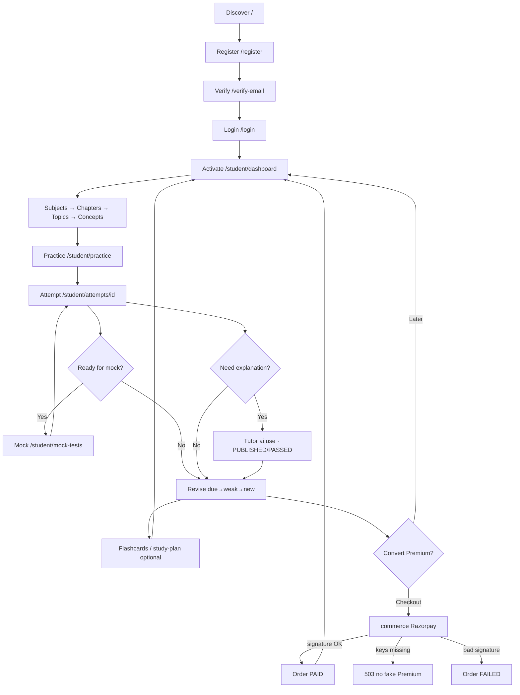

### 20.3.2 Learner lifecycle state diagram

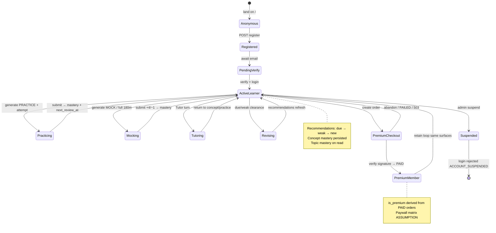

### 20.3.3 Learning loop detail (companion to `diagrams/learning-loop.mmd`)

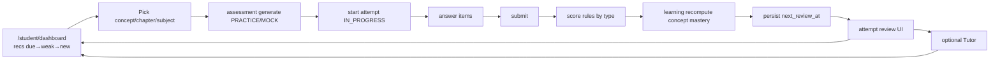

---

## 20.4 Admin / content journey

Content operations are a first-class customer journey for TALOS because learner Practice/Mock/Tutor quality is gated by editorial throughput. Operators work inside the **same** Next.js app under `/admin/**` (ADR-0008). Admin UX gate admits `SUPER_ADMIN`, `ADMIN`, and `CONTENT_MANAGER` **[SHIPPED]**; SME **TEACHER** authors need elevation to use `/admin/content*` today **[ASSUMPTION]** (see Part 1).

### 20.4.1 Narrative: ingest PDF → sections → KU → generate assets → ECAEP review → publish

**1. Ingest PDF **[SHIPPED]**.** An elevated operator opens `/admin/ingestion`, creates a job, uploads an NCERT-aligned (or originally authored licensed) PDF. Job detail lives at `/admin/ingestion/[jobId]`. Module: `ingestion`. Exit: sections extracted; failures visible on job detail—not silent success.

**2. Sections & visuals **[SHIPPED]**.** Extraction yields structured sections; detected diagrams/images appear for human decision on `/admin/visual-assets`. Visual approve/reject prevents junk assets from becoming student-facing diagrams without review.

**3. Knowledge Units **[SHIPPED]** foundation (ADR-0023/0024/0028).** Sections structure into Knowledge Units listed at `/admin/knowledge-units` and inspected at `/admin/knowledge-units/[unitId]`. Mechanical gates set `PASSED` or `FAILED`. Generation discipline targets **PASSED** units (extract-once-generate-many). A `FAILED` unit must not be treated as grounding truth for Question Generator / notes pipelines (ADR-0025 cutover rules). This is structured educational knowledge—not an enterprise Knowledge Graph **[OUT OF SCOPE MVP]**.

**4. Generate assets **[SHIPPED]** / **[IN SCOPE MVP]**.** From PASSED KUs and authoring tools, the system/authors produce draft `CONCEPT_NOTE`, `QUESTION`, `FLASHCARD`, `DIAGRAM`, `VIDEO_REF`, `FORMULA_SHEET` items. Authors use `/admin/content/new` and edit on `/admin/content/[itemId]`. Question Generator and Evaluator agents run through `ai` module; Claude wired; fallback labeled when unconfigured.

**5. ECAEP review **[SHIPPED]** (`docs/architecture/ecaep.md`, ADR-0009).** Workflow states:

`DRAFT → AI_CHECKED → IN_REVIEW → APPROVED → PUBLISHED → ARCHIVED`

with `IN_REVIEW → CHANGES_REQUESTED → DRAFT` (revise), and `PUBLISHED → DRAFT` on edit (new version; prior remains live until new publish). AI check reports feed `/admin/ai-review`. Human reviewer/approver decisions record on content versions. Break-glass `force_edit_published` is admin-only and auditable.

**6. Publish & cover **[SHIPPED]**.** Approver publishes; items become eligible for student PRACTICE/MOCK pools and Tutor retrieval. Coverage grid `/admin/coverage` shows syllabus × content completeness so Nadia (P-06) can rebalance authors. Search console `/admin/search` supports duplicate hunts. Analytics `/admin/analytics` observes PRACTICE vs MOCK and AI cost proxies. Users `/admin/users` and audit `/admin/audit-logs` support Rohan (P-07) when accounts or privileges change.

**7. Archive **[SHIPPED]**.** Defective or superseded published items move to `ARCHIVED` and leave student pools.

### 20.4.2 ECAEP state diagram

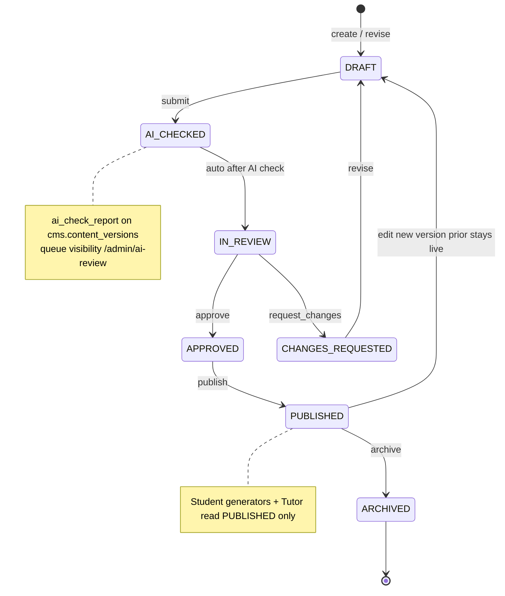

### 20.4.3 Ops journey mermaid

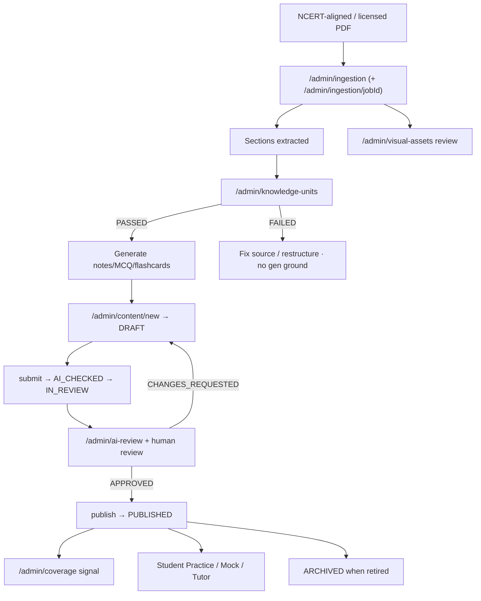

### 20.4.4 Ops journey map table

| Stage | Actor (persona) | Surfaces | Modules | Actions | Emotion / risk | Exit criteria | Metrics |
|---|---|---|---|---|---|---|---|
| Ingest | P-07 / elevated CM | `/admin/ingestion`, `/admin/ingestion/[jobId]` | `ingestion` | Upload PDF; monitor job | Anxiety on parse fail | Sections extracted or failed visibly | Job success %; time-to-sections |
| Visual triage | P-06 / CM | `/admin/visual-assets` | `ingestion` / assets | Approve/reject visuals | Quality ownership | Pending queue cleared | Approve/reject SLA |
| KU structure | System + P-05/P-06 | `/admin/knowledge-units`, `/[unitId]` | `knowledge`, `ai` | Gate check PASSED/FAILED | Distrust of fluent AI structure | Unit PASSED or FAILED with reason | PASSED rate; FAILED reopen time |
| Author drafts | P-05 (elevated) | `/admin/content`, `/new`, `/[itemId]` | `cms`, `ai`, `knowledge` | Create DRAFT grounded in PASSED KU | Focused SME flow | Draft ready to submit | Drafts/author/week |
| AI check | System + P-06 | `/admin/ai-review` | `ai`, `cms` | Evaluator/AI check report | Skeptical of AI authority | State `AI_CHECKED` → `IN_REVIEW` | AI check latency; false-pass escapes |
| Human review | P-06 | `/admin/content/[itemId]` | `cms` | Approve or CHANGES_REQUESTED | Duty-bound | `APPROVED` or back to DRAFT | Review SLA; CHANGES specificity |
| Publish | P-06 / CM | content detail | `cms` | Publish | Contract with students | `PUBLISHED` live | Publish volume; defect escape |
| Coverage steer | P-06 | `/admin/coverage`, `/admin/search` | `cms`, `academic` | Rebalance thin cells | Anticipatory | Thin mock pools reduced | Empty concept cells; questions/subject |
| Archive / break-glass | P-07 | content detail; audit | `cms`, `system` | Archive; rare force-edit | Caution | `ARCHIVED` or audited force-edit | Force-edit count; audit completeness |
| User safety | P-07 | `/admin/users`, `/admin/audit-logs` | `identity`, `system` | Suspend/activate; role grants | Incident calm | Suspended cannot login | Time-to-revoke |

### 20.4.5 SoD and elevation notes

Separation of duties language: authors submit; reviewers approve/publish. MVP staffing may combine roles in one `CONTENT_MANAGER` human—that is an operating **[ASSUMPTION]**, not a collapse of permission codes. `TEACHER` retains create/submit permissions but remains outside admin UX gate until an ADR extends the shell. Analytics and audit stay off student roles.

---

## 20.5 PlantUML sequence for student practice attempt lifecycle

### 20.5.1 PRACTICE lifecycle (dashboard → generate → attempt → mastery → optional Tutor)

Scoring note: PRACTICE uses **+1 / 0 negative**, untimed. Mastery recompute is synchronous on submit (ADR-0015). Recommendations on the next dashboard fetch follow **due → weak → new**.

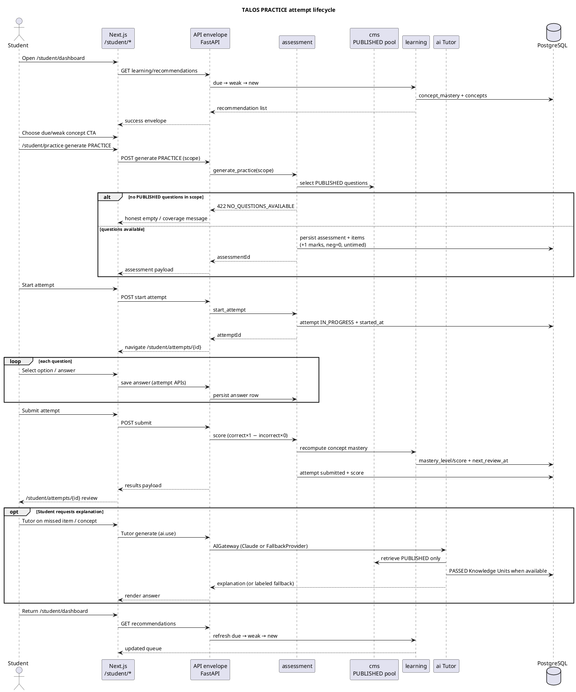

### 20.5.2 MOCK delta sequence (+4 / −1, full 180 minutes)

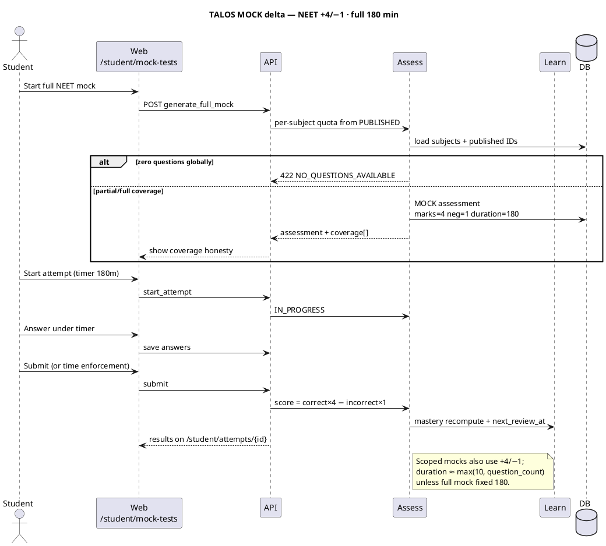

### 20.5.3 Sequence acceptance checkpoints

| Checkpoint | Expected evidence |
|---|---|
| Recommendations precede practice | Dashboard fetch returns reason codes `due_for_revision` / `weak_concept` / `new_concept` |
| PRACTICE pool purity | Only `PUBLISHED` questions selected |
| PRACTICE scoring | No negative marks applied |
| MOCK scoring | +4 / −1; full mock duration 180 |
| Mastery write path | Concept row updated before results response returns |
| `next_review_at` | Non-null for levels that schedule reviews |
| Tutor optional | Failure of Tutor must not roll back score/mastery |
| Topic mastery | Visible on `/student/topics/[topicId]` via on-read rollup |

---

## 20.6 Failure journeys

Failure journeys are product features. TALOS prefers explicit degradation over silent success—especially in commerce, auth suspension, coverage, Knowledge Unit gates, and AI provider paths.

### 20.6.1 Payment fail honest (503 / no fake Premium) with Razorpay signature verify

**Trigger A — gateway not configured **[SHIPPED]**.** `RAZORPAY_KEY_ID` / `RAZORPAY_KEY_SECRET` missing. `CommerceService.create_order` raises `PAYMENT_GATEWAY_NOT_CONFIGURED` with **HTTP 503**. No order is marked `PAID`. UI must show an actionable configuration/support message, not a demo Premium unlock. This deliberately diverges from AI FallbackProvider philosophy (ADR-0018): payments must never learn a fake-success path.

**Trigger B — Razorpay API error **[SHIPPED]**.** Order may be set `FAILED`; client sees **502** `PAYMENT_GATEWAY_ERROR`.

**Trigger C — signature invalid **[SHIPPED]**.** Client posts `razorpay_payment_id` + `razorpay_signature` to verify. `verify_payment_signature` computes HMAC-SHA256 over `{order_id}|{payment_id}` and `hmac.compare_digest` against the secret. On mismatch: order `FAILED`, **400** `INVALID_SIGNATURE`. Premium status remains false.

**Trigger D — success path **[SHIPPED]**.** Valid signature → `PAID`; `GET /commerce/status` → `is_premium: true`.

**Surfaces.** Student checkout UX (session); Support uses `/admin/users` + order investigation via APIs/audit as available; parent assists on-device without a parent portal.

**UX requirements.** Distinguish CREATED (abandoned), FAILED (verify/gateway), PAID (entitled), and 503 (not configured). Never show Premium badges from client-only Razorpay success callbacks without server verify.

**Metrics.** 503 rate by environment; verify failure rate; time-to-PAID; Support tickets tagged `commerce`.

### 20.6.2 Suspended user

**Trigger **[SHIPPED]**.** Admin sets status suspended via `/admin/users` (PATCH / bulk suspend). `AuthService.authenticate` rejects non-`active` status with `ACCOUNT_SUSPENDED` before password verification success path issues tokens. `get_current_user` also enforces active status on subsequent requests. Self-service `/users/me` cannot reactivate.

**Learner UX.** `/login` shows a clear account-suspended message—not a generic invalid-password hint that encourages brute force. Suspended users must not access `/student/**` or `/admin/**`.

**Ops UX.** Rohan confirms action in `/admin/audit-logs`; Support playbooks **[ASSUMPTION]** define appeal/reactivation policy.

**Metrics.** Time-to-revoke; suspended login attempt count; false-suspend incidents.

### 20.6.3 Content gaps (no PUBLISHED questions for scope)

**Trigger **[SHIPPED]**.** PRACTICE/MOCK generation finds zero published questions for the requested scope (or globally for full mock). Assessment returns **422** `NO_QUESTIONS_AVAILABLE` (full mock) or equivalent generation failure for empty scoped pools.

**Learner UX.** `/student/practice` and `/student/mock-tests` must render an honest empty state: explain that content is still under editorial publish, offer navigation to a different chapter/subject with coverage, optional flashcards/notes if those exist, and must **not** create a fake scored attempt. Full mock coverage arrays should be shown when the paper is partially thin so students know which subjects are under-represented.

**Ops UX.** Nadia uses `/admin/coverage` and `/admin/content` to prioritize QUESTION publishes; authors ground in PASSED KUs; ECAEP must still pass—coverage pressure never justifies skip-review publish.

**Metrics.** 422 generation rate by scope; empty concept cells; student abandon after empty state; publish throughput on thin subjects.

### 20.6.4 KU gate FAILED

**Trigger **[SHIPPED]**.** Knowledge Unit fails mechanical validation → `validation_status=FAILED` (ADR-0024). Cutover rules (ADR-0025) exclude FAILED units from generation grounding; Tutor/notes pipelines prefer PASSED units.

**Ops UX.** `/admin/knowledge-units/[unitId]` shows failure; operator fixes source section / restructures; does not hand-wave FAILED into PUBLISHED questions. Generation that would proceed with zero PASSED units must degrade honestly (skip or fail the asset), not invent facts.

**Learner UX.** Indirect: fewer or no new drafts until PASSED; existing `PUBLISHED` content remains. Students should never see raw FAILED KU payloads.

**Metrics.** PASSED rate; FAILED age; blocked generation events; defect escapes traced to skipped gates (target: zero).

### 20.6.5 AI provider failure

**Trigger classes.**

1. **No API key / FallbackProvider **[SHIPPED]** (ADR-0014).** Gateway returns deterministic labeled placeholder (`is_fallback=true`). Agents still run end-to-end for integration continuity in dev.
2. **Upstream provider error / timeout **[ASSUMPTION]** on exact production incident UX.** Gateway should fail soft for the AI turn without corrupting assessment scores or mastery writes already committed.
3. **Evaluator/AI check unavailable during ECAEP submit **[ASSUMPTION]** on retry policy details.** Editorial queue must not auto-publish; human path remains authoritative.

**Learner UX.** Tutor/Planner responses visibly indicate fallback/degraded mode when applicable; never present fallback text as NCERT truth. Practice/mock submit paths remain usable offline from AI.

**Ops UX.** `/admin/ai-review` may stall; Nadia continues human review; Rohan watches AI cost/error proxies on `/admin/analytics`.

**Metrics.** Fallback ratio in production (~0 target); Tutor error rate; ECAEP AI-check latency; assessment submit success unrelated to AI uptime.

### 20.6.6 Failure journey summary table

| Failure | Honest system behavior | Student / admin surfaces | Must not happen | Metric |
|---|---|---|---|---|
| Razorpay keys missing | 503 `PAYMENT_GATEWAY_NOT_CONFIGURED` | Student checkout; ops env config | Fake PAID / demo Premium | 503 count |
| Invalid payment signature | 400 `INVALID_SIGNATURE`; order FAILED | Checkout verify | Entitlement without verify | Verify fail % |
| Razorpay API error | 502; order FAILED possible | Checkout | Silent CREATED-as-paid | Gateway error % |
| Suspended user | `ACCOUNT_SUSPENDED` at login | `/login`; `/admin/users` | Token issue to suspended | Suspended login attempts |
| No PUBLISHED questions | 422 / graceful gen fail + coverage report | `/student/practice`, `/mock-tests`; `/admin/coverage` | Empty success attempt | Gen-fail by scope |
| KU FAILED | Block grounding; fix-forward | `/admin/knowledge-units/[unitId]` | Gen from FAILED as truth | FAILED backlog age |
| AI key missing | Labeled FallbackProvider | Tutor/planner/evaluator paths | Unlabeled fake science | Fallback ratio |
| AI upstream fail | Soft-fail AI turn **[ASSUMPTION]** UX | Tutor; ai-review | Roll back mastery/score | AI error vs submit OK |

### 20.6.7 Cross-cutting non-goals in failure design

Do not “solve” these failures by introducing multi-tenant failover portals, native offline app packs, Knowledge Graph repair wizards, or Digital Twin recovery coaches in MVP. The correct mitigations are: configure Razorpay, unsuspend or support-appeal, publish through ECAEP, fix KU gates, and restore Anthropic configuration—executed on the surfaces already listed.

---

## 20.7 Design implications for engineering and ops

1. **Activation is curriculum-visible, not profile-complete.** Success is first subject/concept open plus first PRACTICE submit—not avatar uploads.
2. **Assessment honesty is retention.** PRACTICE and MOCK scoring rules diverge (+1/0 vs +4/−1; untimed vs timed/180). Tests and UX copy must not conflate them.
3. **Mastery is concept-persisted, topic-on-read.** Recommendation engineering depends on `next_review_at` and due→weak→new; do not invent a twin model.
4. **Commerce is fail-closed.** AI may fallback; payments must not.
5. **Content ops latency is a student-facing SLO.** Empty banks surface as 422 journeys; staff `/admin/coverage` as a product reliability function.
6. **Admin UX gate ≠ permission model.** Elevation ASSUMPTION for authors must stay explicit until an ADR changes the shell.
7. **Parent and institute journeys stay constrained.** Over-shoulder + Razorpay assist only; no parent portal; no tenant portals.

---

## 20.8 References

| Reference | Use in Chapter 20 |
|---|---|
| ADR-0003 | JWT cookies, register/login session |
| ADR-0006 / ADR-0018 | Razorpay Premium, 503 no-fake-pay, signature verify, suspend login fix |
| ADR-0007 | MVP exclusions (KG, Twin, native, multi-tenancy) |
| ADR-0008 | Single Next.js app; `/admin` + `/student` |
| ADR-0009 / `docs/architecture/ecaep.md` | ECAEP states and publish rules |
| ADR-0013 | PRACTICE vs MOCK generation and marking |
| ADR-0014 | AI Gateway + FallbackProvider |
| ADR-0015 / ADR-0016 | Mastery recompute; `next_review_at`; due→weak→new |
| ADR-0023 / 0024 / 0025 / 0028 | Knowledge Units, gates, PASSED grounding |
| `diagrams/student-journey.mmd` | Companion flowchart |
| `diagrams/ecaep-state.mmd` | Companion ECAEP state machine |
| `apps/web/src/app/**` | Route evidence |
| `apps/backend/app/modules/**` | Module evidence |
| Volume 1 Chapter 19 | Personas consuming these journeys |

---

*End of Chapter 20 — Customer Journey (Volume 1 Part C). 
# 21. Problem Statement

> **Document continuity.** This file continues Volume 1 Part C for **Trinetra AI Learning OS (TALOS)** after Chapter 19 (Personas) and Chapter 20 (Customer Journey). Claims use the Part C label legend: **[SHIPPED]**, **[IN SCOPE MVP]**, **[ASSUMPTION]**, **[FUTURE]**, **[OUT OF SCOPE MVP]**. Conflict order: running code under `apps/` → accepted ADRs → deploy docs → this narrative.

## Canonical problem paragraph

NEET preparation fails students when effort scales without a trustworthy learning state: aspirants grind volume, coaching PDFs, and chatbots, yet cannot answer three operational questions with confidence—*what should I revise tonight, why was I wrong, and is my score trend real?* Content operations fail platforms when quality, licensing (ADR-0005), and throughput are treated as afterthoughts: AI drafts ship without editorial gates, diagrams rot in folders, and search cannot find the single approved item. Platforms fail themselves when they buy short-term demo magic—vendor-locked LLM calls, fake payment success paths, microservice sprawl before product-market fit—and then cannot operate, audit, or afford the system they promised. **Trinetra AI Learning OS (TALOS)** exists to close that triangle: a governed learning loop on a modular monolith, where published content and PASSED Knowledge Units feed practice and mocks, mastery and revision are derived from real attempts, four AI agents assist inside an AI Gateway, and commerce and identity remain fail-closed. Everything that looks like a “bigger problem” but is not load-bearing for that loop—enterprise Knowledge Graph, Digital Twin, twelve agents, native apps, multi-tenancy, perfect SM-2, parent portals, live classes—is deferred by ADR-0007 and must not be smuggled into MVP claims.

## Five Whys

### Five Whys — student outcomes

1. **Why do ranks stagnate despite hard work?** Because practice is high-volume but untargeted relative to concept weaknesses and due revision.
2. **Why is practice untargeted?** Because progress signals are coarse (hours, questions attempted, streak badges) rather than concept mastery derived from scored answers.
3. **Why are progress signals coarse?** Because most systems do not persist a first-class learning state keyed to syllabus concepts and recomputed from attempt answers.
4. **Why don’t they persist that state?** Because question banks and chat wrappers optimize distribution and engagement, not durable mastery telemetry with revision scheduling.
5. **Why does TALOS exist at this hinge?** To make concept mastery and due→weak→new recommendations first-class **[SHIPPED]** (ADR-0015, ADR-0016), bind practice/mocks to `PUBLISHED` items **[SHIPPED]** (ADR-0013, ADR-0009), and ground Tutor explanations in editorial/KU trust envelopes **[SHIPPED]** / **[IN SCOPE MVP]** (ADR-0004, ADR-0024–0028)—without claiming deferred BRD megascope as present.

### Five Whys — content truth

1. **Why do AI learning apps lose parental and student trust?** Because fluent wrong answers ship into the learner library.
2. **Why do wrong answers ship?** Because generation is coupled to visibility—drafts become “content” without a hard publish privilege.
3. **Why is generation coupled to visibility?** Because products skip an editorial state machine and treat CRUD as the content path.
4. **Why is that fatal for NEET?** Because factual errors and licensing violations are not UX bugs; they are academic and legal liabilities measured in years and litigation risk.
5. **Why Knowledge Units and ECAEP together?** Because extract-once-generate-many needs a gate-checked substrate (PASSED KUs) **[SHIPPED]** foundation, and student-visible items still require human ECAEP authority (`DRAFT → … → PUBLISHED`) **[SHIPPED]** (ADR-0009, ADR-0023)—raw PDF text and unsupervised LLM output are not authorities.

### Five Whys — platform operability

1. **Why do early AI products implode operationally?** Because cost, auth, payments, and deploy topology are improvised after the demo.
2. **Why improvised?** Because teams optimize for “agent count” and chart theater instead of one operable deployable with module boundaries.
3. **Why does that matter now?** Because Coolify/Hetzner MVP hosting and Razorpay one-time commerce **[SHIPPED]** / **[IN SCOPE MVP]** require honest failure modes, not microservice ceremony.
4. **Why resist microservices and twelve agents?** Because one team cannot afford distributed failure domains and agent orchestration debt before retention is proven (ADR-0001, ADR-0004, ADR-0007).
5. **Why an AI Gateway with a single wired provider?** Because vendor lock-in and cost surprise are prevented by interface + metering now (~cheap insurance), while Claude remains the only wired implementation **[SHIPPED]** (ADR-0004).

---

### 21.1 Student problems (volume without mastery, weak revision, low-quality explanations, opaque progress)

Student problems are not “lack of content.” India’s aspirants already drown in content. The failure mode is **effort without a closed loop**: attempt → scored truth → concept state → next action → grounded help → return. TALOS frames four interlocking student problems; each expands into scenarios grounded in shipped surfaces (`/student/dashboard`, hierarchy routes, `/student/practice`, `/student/mock-tests`, `/student/attempts/[attemptId]`, `/student/study-plan`, Tutor flows).

#### 21.1.1 Volume without mastery

**Problem statement.** Completing hundreds of questions feels productive and photographs well for parents, yet does not identify which ~50 concepts require deliberate practice this week. Volume metrics become vanity when they are not bound to concept-level correctness floors.

**What “wrong solutions” look like in the market.** Random PDF packs; Telegram dumps; untimed quiz apps that celebrate streaks; coaching apps that report “questions solved” without a persisted mastery model; generic LLM chats that never score answers against a bank.

**TALOS contrast **[SHIPPED]**.** Concept mastery lives in `learning.concept_mastery` and recomputes synchronously on attempt submit (ADR-0015). Levels are arithmetic functions of attempts and correctness: `NOT_STARTED` → `LEARNING` (<3 attempts) → `PRACTICING` / `MASTERED` (≥3 attempts, score threshold). Dashboard overview exposes concepts attempted vs mastered—not only raw volume. Practice generation is scopeable to CONCEPT so recommendations can force targeted work.

**Scenario A — “I did 400 questions this week.”**  
Aarav (P-01) completes mixed chapter packs from three sources. Attempt volume is high; syllabus coverage is thin; zero due revisions completed. In a naive product he sees a green streak. In TALOS terms, many concepts remain `LEARNING` because the three-attempt floor prevents one lucky quiz from flipping `MASTERED`. The intervention is not more volume: dashboard recommendations prioritize `due_for_revision` and `weak_concept` before `new_concept`, and **Practice now** starts CONCEPT-scoped PRACTICE from the weak item.

**Scenario B — “I finished the chapter PDF, so I’m done.”**  
Kabir (P-03) confuses consumption with competence. Concept notes and flashcards help orientation **[SHIPPED]** surfaces, but mastery only moves when scored `attempt_answers` exist. Product honesty requires that reading PUBLISHED notes does not mint mastery rows—an explicit non-feature that prevents opaque progress theater.

#### 21.1.2 Weak revision systems

**Problem statement.** Students forget on NEET-relevant timescales. Notebooks, chat history, and “mark for review” checkboxes do not schedule retrieval practice by concept state. Without `next_review_at`, revision collapses into anxiety-driven random revisit or total neglect of Class 11 carry-forward.

**TALOS contrast **[SHIPPED]** (ADR-0016).** Fixed intervals keyed on `mastery_level`: LEARNING → +1 day, PRACTICING → +3 days, MASTERED → +7 days; NOT_STARTED has no schedule. Recommendations fill a short list in strict order: due → weak → new (curriculum `display_order`). Dashboard widgets only—no dedicated revision micro-app, no push/SMS reminders in MVP (**[OUT OF SCOPE MVP]** / **[FUTURE]**).

**Scenario C — “I revise whatever I feel scared about.”**  
Meera (P-02) re-reads Organic mechanisms she already scores well on, while due PRACTICING concepts in Electrostatics silently age. TALOS surfaces overdue items first. The product still requires student discipline; it does not pretend a Digital Twin will coerce behavior (**[OUT OF SCOPE MVP]**).

**Scenario D — “Spaced repetition apps don’t know my NEET tree.”**  
Generic flashcard SRS tools optimize card ease factors (true SM-2) but lack Exam→Subject→Chapter→Topic→Concept structure and MOCK transfer. TALOS deliberately ships simpler intervals **[SHIPPED]** and defers SM-2 perfection (**[FUTURE]**) so revision remains explainable and tied to assessment truth.

#### 21.1.3 Low-quality / low-trust explanations

**Problem statement.** When students miss a question, they need a correction path that stays on syllabus facts. Generic chatbot explanations are fluent, citation-free, and occasionally wrong at the mechanism level—especially dangerous in Physics and Physical Chemistry. “AI tutor” without retrieval constraints is a trust liability, not a feature.

**TALOS contrast **[SHIPPED]** / **[IN SCOPE MVP]**.** Tutor is one of four v1 agents behind the AI Gateway (ADR-0004). Learner-facing assistance is expected to ground on PUBLISHED library material and PASSED Knowledge Units as the trust substrate (ADR-0024–0028); FAILED KUs and unpublished drafts must not become silent authorities. Question Generator never auto-publishes—drafts enter ECAEP. Full RAG/embeddings productization remains **[FUTURE]**; do not claim vector retrieval as the MVP Tutor story beyond what code and ADRs evidence.

**Scenario E — “The AI explained the wrong Faraday direction.”**  
A chat wrapper invents a confident mnemonic. In TALOS, the failure to investigate is whether retrieval included non-PASSED units or unpublished drafts. Ops response is editorial: fix KU / note, re-review, republish—not “prompt harder” as the only control.

**Scenario F — “Explanation was correct but useless for NEET timing.”**  
Students also suffer verbose lectures. Study Planner and attempt review UX must prefer actionable next practice over essay dumps **[ASSUMPTION]** on UX copy quality; Planner remains plan-shaped output from target score + exam date, not a substitute teacher (**[SHIPPED]** agent scope).

#### 21.1.4 Opaque progress and exam-simulation gaps

**Problem statement.** “Time spent,” video completion, and untimed accuracy inflate confidence. Parents ask for % completed; coaching brands sell rank predictors; students never practice +4/−1 psychology until the real exam. Opaque progress is both a UX and ethics problem.

**TALOS contrast **[SHIPPED]**.** PRACTICE is untimed with no negative marking (learning mode). MOCK is timed with NEET +4/−1 (transfer mode) (ADR-0013). Attempt history and review at `/student/attempts` and `/student/attempts/[attemptId]` expose scored outcomes. Topic rollups are computed on read from concept rows. Analytics for operators live under `/admin/analytics` (ADR-0017 scope)—not a student-facing fantasy rank oracle.

**Scenario G — “Mock score oscillates wildly.”**  
Meera guesses under time; Chemistry accuracy looks fine in untimed PRACTICE but collapses under −1. TALOS framing: PRACTICE teaches; MOCK transfers. Review must show incorrect_count impact on score formula. Follow-up recommendations push weak concepts rather than another full-syllabus mock immediately **[ASSUMPTION]** on coaching pedagogy; the mechanism (weak_concept ranking) is **[SHIPPED]**.

**Scenario H — “Parent sees hours, not mastery.”**  
Sunita (P-04) has no parent portal (**[OUT OF SCOPE MVP]**). Over-the-shoulder dashboard and attempts are the MVP trust surfaces. If the UI foregrounds vanity volume over mastery overview, the product recreates the market’s opacity problem even with correct backend tables—an acceptance concern for Product, not an excuse to build a portal early.

#### 21.1.5 Student problem → shipped intervention map

| Student failure | Observable signal | Primary intervention surfaces | Owning modules |
|---|---|---|---|
| Volume without mastery | High attempts, low `MASTERED` count | `/student/dashboard`, CONCEPT PRACTICE | `learning`, `assessment`, `academic` |
| Weak revision | Overdue `next_review_at`, ignored | Dashboard due list → Practice now | `learning`, `assessment` |
| Bad explanations | Distrust after Tutor/chat | Tutor + PUBLISHED/KU grounding; report via ops | `ai`, `knowledge`, `cms` |
| Opaque progress | Streak/hours theater | Mastery overview, attempt review | `learning`, `assessment` |
| Exam psychology gap | Untimed-only prep | `/student/mock-tests`, timed +4/−1 | `assessment` |
| “What next?” paralysis | Empty plan / random browsing | Recommendations + `/student/study-plan` | `learning`, `ai`, `academic` |

---

### 21.2 Content ops problems (quality, licensing ADR-0005, throughput, visuals, search)

Content operations are the supply chain for the learning loop. If the supply chain lies, student features amplify the lie at machine speed.

#### 21.2.1 Quality variance and missing publish authority

**Problem.** AI draft quality varies by concept difficulty, prompt drift, and author fatigue. Without ECAEP, “generate 200 MCQs overnight” becomes a brand-death event. Without AI-assisted review queues, human reviewers drown and then rubber-stamp.

**TALOS contrast **[SHIPPED]**.** Polymorphic content items/versions under cms; states `DRAFT → AI_CHECKED → IN_REVIEW → APPROVED → PUBLISHED → ARCHIVED` with `CHANGES_REQUESTED` loops (`docs/architecture/ecaep.md`, ADR-0009). Evaluator feeds `/admin/ai-review`. Permissions separate create/submit from approve/publish. No skip-review CRUD for student-facing bank items.

**Scenario I — “We published 200 AI MCQs overnight.”**  
Leadership celebrates coverage. Nadia (P-06) finds ambiguous stems and two factual errors in Botany. Counter-requirement: QG writes drafts only; publish remains a human privilege. Coverage grid (`/admin/coverage`) must not treat DRAFT as student-ready.

#### 21.2.2 Licensing landmines (ADR-0005)

**Problem.** Coaching-PDF culture normalizes illegal bulk ingestion. Aakash/Allen/PW/Unacademy dumps look like a shortcut to bank size and a lawsuit. NCERT-aligned and original authorship is slower and morally clearer.

**TALOS contrast **[SHIPPED]** policy / process.** Phase 1 content from NCERT-derived original wording, in-house authorship, public scientific facts, official syllabus structure, and previous-year questions only where legally permissible and reviewed. Explicit non-ingestion of copyrighted coaching corpora without signed license (ADR-0005). Ingestion pipeline exists to accelerate licensed/original sources—not to launder piracy.

**Scenario J — “Someone dropped a PW PDF into ingestion.”**  
Ops must fail closed socially and technically: reject the source, document the incident in audit-minded practice **[ASSUMPTION]** on incident SOP detail, and refuse to treat extracted text as publishable. Throughput pain is accepted; legal exposure is not.

#### 21.2.3 Throughput without silent falsehood

**Problem.** Hand-authoring every MCQ from zero cannot fill NEET breadth before cohort launch. Pure AI generation without intermediate representation cannot scale truth. Teams oscillate between “too slow” and “too fake.”

**TALOS contrast **[SHIPPED]** foundation.** Ingestion jobs (`/admin/ingestion`), Knowledge Units with structured facts and mechanical gates (`/admin/knowledge-units`), extract-once-generate-many discipline (ADR-0023), and ECAEP for human authority. Generation should prefer PASSED KUs; FAILED units retain validation_detail and skip trusted generation paths.

**Scenario K — “Ingestion succeeded but students see nothing.”**  
Job completes; drafts sit in `DRAFT`/`IN_REVIEW`; or KUs are `FAILED`. Students correctly see empty PRACTICE scopes rather than fabricated items **[SHIPPED]** honest-empty posture. Admin KPIs and coverage must make the bottleneck visible—reviewer queue depth is a product metric, not a shame metric.

#### 21.2.4 Visuals and search as first-class ops problems

**Problem.** Diagram-heavy chapters (morphology, ray optics, organic mechanisms) look broken when images are missing, unlicensed, or unreviewed. Search failure wastes reviewer time and duplicates items.

**TALOS contrast **[SHIPPED]**.** `/admin/visual-assets` for detected visual review (ADR-0026 lineage); `/admin/search` for admin search/reindex controls; coverage grid for syllabus×content holes. These are not “nice admin extras”; they are throughput and quality controls.

**Scenario L — “Cladogram missing; students invent the tree.”**  
Visual pending review blocks a trustworthy DIAGRAM item. Counter: pending visuals KPI on admin home + reviewer pass on `/admin/visual-assets` before publish pressure.

**Scenario M — “Duplicate MCQ with different wording.”**  
Without search, reviewers approve near-duplicates; mock pools skew. `/admin/search` is the operational hunting ground; dedup gates on KUs address structured-fact collision upstream **[SHIPPED]** / **[IN SCOPE MVP]** per knowledge ADRs.

#### 21.2.5 Content ops problem summary table

| Ops failure | Risk | Primary surfaces | Modules |
|---|---|---|---|
| Quality escape | Rank harm, churn, reputation | `/admin/content*`, `/admin/ai-review` | `cms`, `ai` |
| Licensing breach | Legal, ethical | Ingestion intake policy + human process | `ingestion`, policy ADR-0005 |
| Throughput stall | Empty student scopes | `/admin/coverage`, ingestion, KU gates | `ingestion`, `knowledge`, `cms` |
| Visual debt | Broken comprehension | `/admin/visual-assets` | `ingestion` / visual pipeline, `cms` |
| Findability failure | Duplicates, slow review | `/admin/search` | `cms`, `system` |
| Audit absence | Unaccountable publish | `/admin/audit-logs`, version history | `system`, `cms` |

---

### 21.3 Platform problems (vendor lock-in, cost, trust, fake commerce, microservice temptation)

Platform problems destroy products that already have decent pedagogy ideas. TALOS treats them as first-class product risks, not “infra later.”

#### 21.3.1 Vendor lock-in and cost surprise

**Problem.** Scattering Anthropic SDK calls across routers makes provider swaps archaeological and prevents unified metering. A viral week without gateway cost controls becomes a finance incident.

**TALOS contrast **[SHIPPED]**.** AI Gateway abstraction with Claude as the only wired provider (ADR-0004). Agents call the gateway; cost tracking and prompt versioning belong at the gateway boundary. Fallback/error paths must surface retryable failures rather than pseudo-success explanations.

**Scenario N — “Provider outage on exam week.”**  
If SDK calls are scattered, Tutor, QG, Planner, and Evaluator fail inconsistently. Gateway centralization makes failure handling and logging coherent. Product shows honest errors; practice/mocks that do not require live LLM remain usable **[ASSUMPTION]** on degradation UX copy—assessment core must not hard-depend on Tutor availability.

#### 21.3.2 Trust: auth, RBAC, audit

**Problem.** Naive JWT-in-localStorage, missing CSRF posture on cookie clients, and role soup (“everyone is admin”) destroy trust faster than wrong MCQs. Suspended users who still call APIs are a security defect.

**TALOS contrast **[SHIPPED]**.** Custom JWT access + rotating refresh in HTTP-only cookies; Argon2 password hashing (ADR-0003); RBAC with seeded roles including SUPER_ADMIN break-glass; admin UX gate for SUPER_ADMIN/ADMIN/CONTENT_MANAGER; server-side `require_permission` on APIs; audit logs at `/admin/audit-logs`; users management at `/admin/users`.

**Scenario O — “Someone grants themselves publish rights.”**  
Counter: immutable privilege patterns for SUPER_ADMIN editor constraints as seeded; audit entries on sensitive actions; publish permissions not default on STUDENT. TEACHER≠admin UX gate remains an operating **[ASSUMPTION]** elevation practice for SME authors needing `/admin/content*`.

#### 21.3.3 Fake commerce

**Problem.** Demo modes that mark Premium active without payment verification train engineers and salespeople to lie. Entitlements that unlock on client assertion are fraud.

**TALOS contrast **[SHIPPED]** / **[IN SCOPE MVP]**.** Razorpay orders with verify-payment signature / HMAC posture; entitlement only after successful verification (ADR-0006 commerce decision; SP9 hardening narrative). One-time purchase framing for MVP; subscriptions remain **[FUTURE]** even if Razorpay supports them commercially. Fail closed when verification fails.

**Scenario P — “Premium unlock without pay.”**  
Any path that sets entitlement on order-create alone is a P0 defect. Checkout UX may be awkward; honesty is non-negotiable.

#### 21.3.4 Microservice temptation and BRD gravity

**Problem.** BRD-scale vision (~280 tables, 12 agents, institute tenancy) tempts teams to split deployables early. Microservice overhead (discovery, distributed transactions, versioned contracts between identity and assessment) has no payoff for one team on one VPS.

**TALOS contrast **[SHIPPED]**.** Modular monolith: one FastAPI app, one Next.js app (ADR-0001, ADR-0008). Module packages preserve extraction seams without network hops. Coolify on Hetzner is the MVP hosting target (ADR-0006). CI/CD and deploy docs exist (ADR-0029 lineage); first live remote use may still be a dry-run caution per Volume 1 honesty notes **[ASSUMPTION]** on execution evidence.

**Scenario Q — “Let’s extract Assessment as its own service before launch.”**  
Reject unless an ADR revisits ADR-0001 with scaling evidence. Latency bugs inside one process are cheaper than partial outages across five.

#### 21.3.5 Platform problem summary

| Platform failure | Symptom | TALOS control |
|---|---|---|
| Vendor lock-in | Provider SDK sprawl | AI Gateway interface |
| Cost surprise | Unmetered tokens | Gateway metering / rate limits |
| Auth distrust | XSS-token theft, CSRF gaps | HTTP-only cookies, CSRF-aware client |
| Privilege chaos | Accidental publish | RBAC + admin UX gate + audit |
| Fake commerce | Entitlement without pay | Razorpay verify fail-closed |
| Microservice sprawl | Ops paralysis | Modular monolith freeze |
| Scope fraud | Selling KG/Twin now | ADR-0007 non-goals |

---

### 21.4 Problem framing (Jobs / JTBD) for student, author, reviewer, admin, parent

Jobs-to-be-done framing converts complaints into hireable jobs. Personas (Chapter 19) supply archetypes; this section states the job stories that Chapter 22’s solution must serve—and that deferred non-goals must not pretend to serve.

#### 21.4.1 Job stories

**Student (P-01 / P-02 / P-03).**  
When I am preparing for NEET under time pressure, I need a system that tells me what to practice and revise next based on my concept mastery and due schedule, so I can improve score efficiently without trusting random PDFs or ungrounded chat.

Secondary student jobs: simulate exam marking psychology; understand why an answer is wrong; keep a weekly plan aligned to exam date and target score; browse subjects when orientation matters more than optimization (especially Class 11).

**Author (P-05).**  
When I must fill syllabus coverage with defensible items, I need AI-accelerated drafting grounded in licensed/original sources and Knowledge Units, so I can produce volume without becoming the sole bottleneck—and without being forced to auto-publish.

**Reviewer (P-06).**  
When AI and humans submit drafts, I need Evaluator signals, KU facts, coverage context, and a real state machine, so I can approve only what I would defend to a parent—and request changes without losing version history.

**Admin (P-07).**  
When the platform is live with real money and real content, I need RBAC, audit, analytics aggregates, search/reindex, and honest commerce controls, so I can operate break-glass safely without turning every SME into SUPER_ADMIN.

**Parent (P-04).**  
When I fund preparation and fear wasted years, I need credible progress I can see on my child’s screen and payments that either succeed or fail honestly, so I can trust the product without requiring a separate parent portal in MVP.

#### 21.4.2 JTBD force diagram

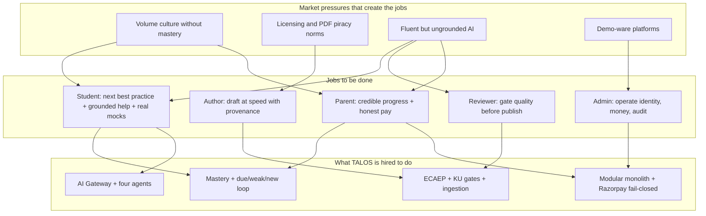

#### 21.4.3 Job → outcome → evidence

| Actor | Job | Successful outcome | Evidence in product |
|---|---|---|---|
| Student | Decide next work | Due/weak/new list actionable | `/student/dashboard` recommendations **[SHIPPED]** |
| Student | Learn from misses | Grounded explanation + targeted retry | Attempt review + Tutor **[SHIPPED]** |
| Student | Transfer to exam | Timed +4/−1 mock completed | `/student/mock-tests` **[SHIPPED]** |
| Author | Fill holes | DRAFT items from KU/ingestion | `/admin/coverage`, content new **[SHIPPED]** |
| Reviewer | Prevent escape | Only PUBLISHED reaches students | ECAEP transitions **[SHIPPED]** |
| Admin | Keep system honest | Permissions, audit, verify pay | `/admin/users`, audit, commerce **[SHIPPED]** |
| Parent | Trust spend | Sees mastery/attempts; pay verifies | Over-shoulder student UX; Razorpay **[SHIPPED]** / portal **[OUT OF SCOPE MVP]** |

#### 21.4.4 Anti-jobs (do not hire TALOS for these in MVP)

- Replace classroom teachers or full coaching ecosystems.
- Provide institute multi-tenant LMS administration (P-08).
- Host a parent multi-child control center.
- Deliver enterprise Knowledge Graph reasoning demos as if they power daily practice.
- Run live classes or voice tutors.
- Guarantee rank prediction.

These anti-jobs are emotionally popular and strategically corrosive if sold early.

---

### 21.5 Non-goals that look like problems but are deferred

The BRD and investor conversations constantly reframe deferred capabilities as urgent “problems.” ADR-0007 performed the cut. This section is the product firewall: **acknowledge the pain, refuse the premature build, name the ADR.**

| Apparent problem | Why it feels urgent | Why deferred in MVP | Binding authority | What we ship instead |
|---|---|---|---|---|
| Full **Knowledge Graph** / enterprise ontology | “Personalization needs graph traversal” | Not load-bearing for practice→mastery loop; enormous modeling cost | ADR-0007 | Concept hierarchy + prerequisites edges; KU hub (ADR-0028) |
| **Student Digital Twin** | “Holistic learner model” | Speculative entity; mastery tables already capture assessed state | ADR-0007 | `concept_mastery` + recommendations |
| **Native mobile apps** | Store presence, push UX | Web-first validation; dual native cost before retention | ADR-0007 | Responsive Next.js web **[SHIPPED]**; PWA-capable posture **[ASSUMPTION]** on packaging |
| **Multi-tenancy** / institute portals | B2B sales stories | `organizations` reserved; `tenant_id` not threaded | ADR-0007, CLAUDE.md freeze | Single-tenant MVP ops; P-08 out of scope |
| **12-agent orchestrator** (Mentor, Diagram Agent, …) | Pitch differentiation | Four agents cover explain/draft/plan/evaluate | ADR-0004, ADR-0007 | Tutor, QG, Planner, Evaluator only |
| **Micro-competency** layer (~21k nodes) | Fine-grained pedagogy | Concept mastery is the v1 grain | ADR-0007, ADR-0021 Phase 2 | Concept → mastery score model |
| **SM-2 perfection** (ease factors, item history) | SRS purists | Complexity vs explainability; needs retention proof | ADR-0016 | Fixed intervals by mastery_level |
| **Push / SMS / email reminders** for revision | Habit formation | Ops/cost/privacy; dashboard-first | ADR-0016 backlog notes | Dashboard due widgets; email used for identity flows (verify/reset) via mail stack |
| **Parent portal** | Sponsor UX | No PARENT role; identity complexity | ADR-0007 | Over-shoulder student dashboard/attempts |
| **Adaptive engine** (IRT/ML item selection) | “True adaptive testing” | On-demand published-pool generation suffices | ADR-0013 deferrals | Scope-based PRACTICE/MOCK generation |
| **Live classes** / cohort video | Coaching parity | Different product; ops heavy | ADR-0007 | Asynchronous learning loop only |
| **Vector RAG as default Tutor** | AI fashion | Embeddings not yet justified as product truth | ADR-0028 honesty / FUTURE | KU + PUBLISHED grounding path; pgvector readiness ≠ shipped RAG product |
| **Subscriptions billing** | SaaS familiarity | MVP one-time Razorpay path first | ADR-0006 / commerce freeze | One-time Premium purchase **[IN SCOPE MVP]** / **[SHIPPED]** path |
| **Multi-exam packaging** beyond NEET vertical | Platform story | NEET-UG first vertical | Product freeze | Exam-agnostic core, NEET seed |

**Non-goal workshop rule **[ASSUMPTION]** facilitation practice.** For each BRD-featured ask: (1) Does it unblock first paid cohort outcomes? (2) Is it in ADR-0007 deferred set? (3) Can GTM demo it without shipping? If (3) is yes and (1) is no, it is a integrity hazard—fence it.

---

## Module ownership of the problem space

Problems are meaningless without engineering owners. The following RACI-style ownership binds Chapters 21–22 to repository modules. R = Responsible (builds/fixes), A = Accountable (ADR/module steward), C = Consulted, I = Informed.

| Problem theme | Primary module(s) | R | A | C | I | Student/Admin screens |
|---|---|---|---|---|---|---|
| Auth / session / RBAC trust | `identity` | Identity eng | Architect | Security | Support | `/login`, `/register`, `/admin/users` |
| Syllabus navigation gaps | `academic` | Academic eng | Architect | Product | Authors | `/student/subjects` … `/concepts/[id]` |
| Editorial quality & publish | `cms` | CMS eng | Content lead | Reviewers | Students | `/admin/content*`, student library reads |
| Licensing intake & PDF pipeline | `ingestion` | Ingestion eng | Content lead | Legal **[ASSUMPTION]** | Admins | `/admin/ingestion*` |
| Structured fact gates | `knowledge` | Knowledge eng | Architect | Authors | AI eng | `/admin/knowledge-units*` |
| Practice/mock honesty | `assessment` | Assessment eng | Architect | Product | Students | `/student/practice`, `/mock-tests`, `/attempts*` |
| Mastery & revision | `learning` | Learning eng | Architect | Product | Parents (indirect) | `/student/dashboard` |
| Agent assistance & cost | `ai` | AI eng | Architect | Content | Finance | Tutor/Planner UX; `/admin/ai-review` |
| Ops aggregates | `analytics` | Analytics eng | Architect | Admin | Leadership | `/admin/analytics` |
| Payments integrity | `commerce` | Commerce eng | Architect | Finance | Students/Parents | Checkout / Premium entitlement surfaces |
| Audit & admin home | `system` | Platform eng | Architect | Admin | Security | `/admin`, `/admin/audit-logs` |
| Search findability | `cms` (+ system tools) | CMS eng | Architect | Reviewers | Authors | `/admin/search` |
| Visual review | ingestion/visual + `cms` | Ingestion eng | Content lead | Reviewers | Authors | `/admin/visual-assets` |

RACI labels for cross-team consults are **[ASSUMPTION]** organizational conventions; module boundaries and routes are **[SHIPPED]**.

### Problem → outcome tree

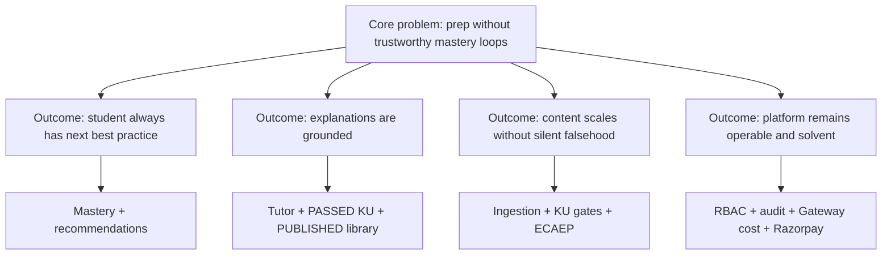

## 21.6 Solution link

Chapter 21 delimits the pain. Chapter 22 states the solution thesis and capability/C4 architecture that respond to these problems without absorbing deferred non-goals. Value messaging continues in Chapter 23 (not in this file). Functional requirements and scope catalogs continue in Part D (Chapters 24–30).

---

# 22. Solution Overview

## 22.1 Solution thesis

**TALOS delivers a governed learning loop for the NEET vertical:** licensing-clean sources and originally authored material enter through ingestion and Knowledge Unit gates; human ECAEP authority publishes learner-visible items; students practice and mock from the `PUBLISHED` pool; attempt submission recomputes concept mastery and revision dates; recommendations and the Study Planner shape what to do next; Tutor explanations assist inside an AI Gateway trust envelope; operators manage coverage, visuals, search, users, analytics, and audit from the same Next.js app; Razorpay commerce remains fail-closed—all as one modular monolith on PostgreSQL and Redis, with Claude as the only wired model provider.

Falsifiable MVP claims (product integrity tests):

1. Cohorts with published content can move concepts out of `NOT_STARTED` via real attempts—not dashboard cosmetics.
2. Question Generator cannot become a silent publisher; reviewer queues are visible.
3. Tutor pathways do not treat FAILED KUs / unpublished drafts as authorities when cutover rules apply.
4. Payment verification failures never grant Premium.
5. GTM and Volume narrative never sell Knowledge Graph, Digital Twin, twelve agents, native apps, or multi-tenancy as shipped.

**Thesis corollary — what we refuse.** We refuse content CRUD that skips ECAEP; refuse mastery claims not derived from attempts; refuse scattered provider SDKs; refuse microservice splits without ADR; refuse parent/institute portals as MVP distractions; refuse “AI OS” branding that implies unbuilt orchestrators. Naming remains **Trinetra AI Learning OS (TALOS)** (ADR-0010), with “AI NEET Exam App” as the first vertical label.

---

## 22.2 Capability architecture aligned to modules (mapped to real screens)

Capabilities are organizational nouns; modules are code nouns; screens are evidence. This map is the executive decoder ring from problem → solution surface.

| Capability | Module | PostgreSQL schema (domain) | Real screens / routes | Problem themes addressed |
|---|---|---|---|---|
| Authenticate & authorize | `identity` | `identity` | `/login`, `/register`, `/verify-email`, `/forgot-password`, `/reset-password`, `/student/settings`, `/student/profile`, `/admin/users` | Trust, suspended-user control, RBAC |
| Navigate NEET curriculum | `academic` | `academic` | `/student/subjects`, `/student/subjects/[subjectId]`, `/student/chapters/[chapterId]`, `/student/topics/[topicId]`, `/student/concepts/[conceptId]` | Orientation, new_concept ordering |
| Author & publish learning objects | `cms` | `cms` | `/admin/content`, `/admin/content/new`, `/admin/content/[itemId]`; student `/student/questions`, `/student/flashcards`, concept notes on concept pages | Quality, ECAEP, bank purity |
| Assess (PRACTICE / MOCK) | `assessment` | `assessment` | `/student/practice`, `/student/mock-tests`, `/student/attempts`, `/student/attempts/[attemptId]` | Volume→signal, exam psychology |
| AI assist (4 agents) | `ai` | `ai` | Tutor on attempt/concept flows; `/student/study-plan`; `/admin/ai-review`; QG from author tooling | Explanations, draft throughput, plan |
| Mastery, revision, recommendations | `learning` | `learning` | `/student/dashboard` (overview, due/weak/new, Practice now) | Volume without mastery, weak revision, opaque progress |
| Operator insights | `analytics` | `analytics` | `/admin/analytics`, aggregates on `/admin` | Ops visibility (not student rank oracle) |
| Monetize honestly | `commerce` | `commerce` | Premium/checkout surfaces in web app (student session) | Fake commerce, parent payment trust |
| Operate & audit | `system` | `system` | `/admin`, `/admin/audit-logs`, search admin affordances | Privilege chaos, operability |
| Ingest sources | `ingestion` | `ingestion` | `/admin/ingestion`, `/admin/ingestion/[jobId]`; feeds visuals pipeline | Throughput, licensing intake discipline |
| Gate structured knowledge | `knowledge` | `knowledge` | `/admin/knowledge-units`, `/admin/knowledge-units/[unitId]` | Grounding substrate, anti-hallucination ops |
| Coverage & visuals & search (cross-cutting UX) | `cms` + `ingestion` + `knowledge` + `system` | multi | `/admin/coverage`, `/admin/visual-assets`, `/admin/search` | Holes, diagrams, duplicates |

### 22.2.1 Capability graph (module-aligned)

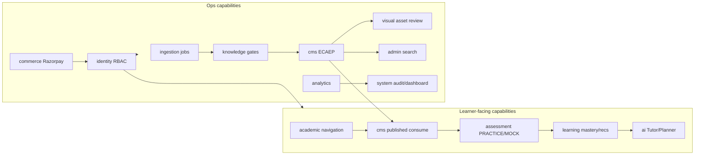

### 22.2.2 Screen-level learning loop (solution behavior)

1. Authenticate (`identity`) → land on `/student/dashboard`.
2. Read recommendations (`learning`): due → weak → new.
3. Navigate hierarchy if browsing (`academic`) to a concept page.
4. Consume PUBLISHED notes/flashcards/questions (`cms`).
5. Generate PRACTICE or MOCK (`assessment`) from published pool only.
6. Submit attempt → score → recompute mastery + `next_review_at` (`assessment` → `learning`).
7. Optionally request Tutor explanation (`ai`) against trust envelope.
8. Optionally regenerate study plan (`ai`) when goals change.
9. Weekend/transfer: MOCK with +4/−1; review attempt breakdown.
10. Ops continuously refill library via ingestion → KU → ECAEP → publish; monitor `/admin/coverage`.

This loop is the solution’s spine. Features that do not strengthen a node on this spine are suspect for MVP scheduling.

### 22.2.3 Agent-to-capability binding

| Agent | Capability contribution | Writes student-visible bank content? | Human gate |
|---|---|---|---|
| Tutor | Explanation assistance | No (ephemeral) | Grounding constraints |
| Question Generator | Draft throughput | Only as DRAFT items | ECAEP mandatory |
| Study Planner | Plan shaping | Plan records, not syllabus facts | User accepts/regenerates |
| Evaluator | Reviewer assistance | No direct publish | Reviewer decides |

### 22.2.4 Cross-cutting platform qualities (solution non-functionals in brief)

| Quality | Approach in TALOS |
|---|---|
| Security | Argon2, HTTP-only JWT cookies, RBAC, CSRF-aware web client |
| Auditability | Audit logs; content versions; reviews; KU validation_detail |
| Cost control | AI Gateway metering; rate limits via Redis as used |
| Deployability | Docker Compose; Coolify/Hetzner target; deploy runbooks |
| Evolves without rewrite | Modular monolith boundaries; `AIProvider` interface |
| Honest emptiness | Errors when no PUBLISHED questions in scope—no fabricated banks |
| API consistency | Envelope `{ success, data, meta, errors, traceId, timestamp }` |

---

## 22.3 C4 Context

Level 1 context shows people and external systems that interact with TALOS. Parent is an influence actor without a distinct MVP account. Email/Mailpit represents the identity mail path (verification and password reset); Mailpit is the local/dev capture stand-in, production mail is the configured provider **[ASSUMPTION]** on exact production MTA brand. Anthropic and Razorpay are the only mandatory commercial externals for the AI and payments stories.

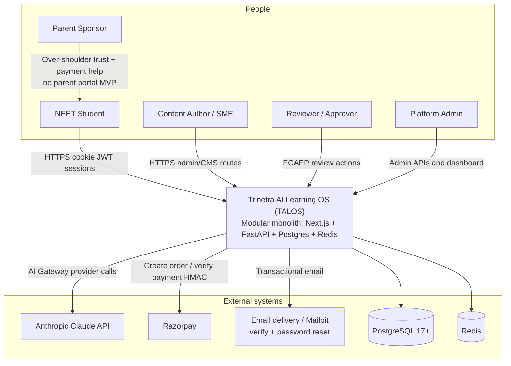

**Context notes (normative).**

- **Student** practices, mocks, views mastery, uses Tutor/Planner—primary revenue and outcome actor.
- **Author / Reviewer** are often elevated to CONTENT_MANAGER for `/admin/**` UX **[ASSUMPTION]** operating practice; APIs still permission-checked.
- **Admin** includes ADMIN and SUPER_ADMIN break-glass patterns.
- **Parent** does not call TALOS as a first-class principal in MVP; dashed relationship prevents false portal claims.
- **Anthropic** is the only wired LLM provider behind the Gateway; additional providers are future classes, not context peers today.
- **Razorpay** is India-first one-time commerce for MVP; subscription productization is **[FUTURE]**.
- **PostgreSQL / Redis** appear at context level because operational ownership (backups, memory, failover) is enterprise-visible even though they deploy beside the app; finer deployment nesting appears in §22.4.
- NCERT-aligned source material is a content policy input via authors/ingestion, not a live HTTP dependency—policy ADR-0005 remains human-enforced at intake.

---

## 22.4 C4 Container

Level 2 containers describe the runnable pieces operators deploy and the externals they call. Coolify/Hetzner hosts the compose boundary in the target topology; local dev mirrors web/api/postgres/redis/mailpit.

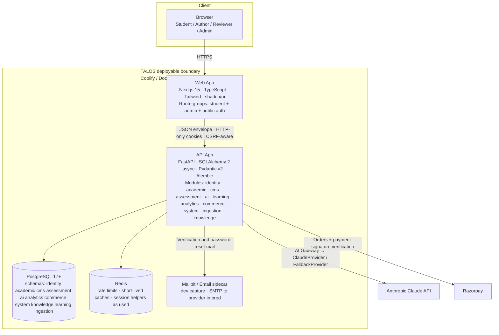

**Container responsibilities.**

| Container | Responsibility | Non-responsibility |
|---|---|---|
| **Web (Next.js)** | UI for public auth, student learning loop, admin ops; cookie session client | Business invariants, scoring, publish authority |
| **API (FastAPI modular monolith)** | All domain modules, RBAC, ECAEP transitions, mastery recompute, Gateway, Razorpay verify | Long-term analytics warehouse **[FUTURE]**; microservice mesh |
| **PostgreSQL** | System of record across domain schemas; Alembic migrations only | Client-side offline store |
| **Redis** | Rate limits / ephemeral helpers as modules use | Durable mastery source of truth (Postgres owns mastery) |
| **Mailpit / Email** | Deliver or capture identity mail | Marketing automation platform |
| **Anthropic** | Model inference for agents via Gateway | Content publish authority |
| **Razorpay** | Payment rails | Entitlement logic (API decides after verify) |

**Container interaction example — practice submit (solution-critical path).** Browser → Web attempt UI → API `submit` with JWT cookie → optional Redis rate limit → Postgres load attempt/answers/rules → score → update aggregates → `MasteryService` recompute → set `next_review_at` → success envelope → Web renders score breakdown. Analytics aggregates may be read later on `/admin/analytics`; they are not required to complete the student submit path.

**Deploy topology note.** Named volumes for postgres/redis data and ingestion/visual asset files sit beside containers in compose (**[SHIPPED]** / documented deploy posture). GHCR/git SHA image traceability and Coolify git-pull deploy are operational concerns documented under deploy ADRs/docs; treat first production wiring as verification-gated **[ASSUMPTION]** until evidenced in your environment.

**Accuracy boundary for readers.** Sections 22.1–22.4 describe the solution shape that exists to answer Chapter 21. End-to-end learning-loop narratives, trust-loop diagrams, solution principles decision tests, and value proposition messaging continue in §22.5+ and Chapter 23 (not included in this file). Engineering deep dives belong in Volume 2; content SOPs in Volume 3; AI workbook in Volume 4.

---

*End of file: Chapter 21 complete; Chapter 22 through §22.4. Do not treat deferred ADR-0007 items as delivered. Repository and ADRs win on conflict.*

## 22.5 End-to-end learning loop diagram

Section 22.4 established the container topology (Next.js web, FastAPI modular monolith, PostgreSQL, Redis, Claude via AI Gateway, Razorpay). This section closes the product thesis: TALOS is valuable only when those containers execute a **governed learning loop** that a student can feel as “what should I do next?” and that operators can defend as “why did this item reach a learner?”

The loop is **[SHIPPED]** end-to-end for the NEET vertical. It does not require a Knowledge Graph, Digital Twin, push-notification fabric, or ML recommender **[OUT OF SCOPE MVP]** / **[FUTURE]**. It requires published questions, persisted concept mastery, fixed revision intervals, and rule-based recommendations (ADR-0013, ADR-0015, ADR-0016).

### 22.5.1 Closed-loop Mermaid (normative)

```mermaid
flowchart TD
  A[Student opens /student/dashboard] --> B{Recommendation ranking}
  B -->|due_for_revision| C[CONCEPT PRACTICE CTA]
  B -->|weak_concept| C
  B -->|new_concept| D[Syllabus-ordered concept]
  D --> C
  C --> E[POST practice assessment<br/>scope_type=CONCEPT]
  E --> F[/student/attempts/id<br/>answer + submit]
  F --> G[AssessmentService score]
  G --> H{Assessment type}
  H -->|PRACTICE| I[Score: +correct, neg marks = 0]
  H -->|MOCK| J[Score: +4 / −1, timed]
  I --> K[Persist attempt_answers]
  J --> K
  K --> L[MasteryService recompute<br/>concept_mastery]
  L --> M[Set mastery_level + next_review_at]
  M --> N[Refresh recommendations<br/>due → weak → new]
  N --> O[Optional Tutor explain<br/>PUBLISHED / PASSED KU only]
  O --> A
  M --> P[Optional /student/study-plan regenerate]
  P --> A
  M --> Q[Optional /student/flashcards]
  Q --> A
  G --> R[/admin/analytics aggregates<br/>ops visibility]
```

Companion asset: `docs/blueprint/volume-01/diagrams/learning-loop.mmd` (same semantics; prefer this section when assembling Part C).

### 22.5.2 Mastery levels and revision intervals **[SHIPPED]**

Concept mastery is arithmetic from real `attempt_answers`, recomputed synchronously on submit (ADR-0015). Topic/subject rollups are computed on read for display; they are not a second persisted twin.

| `mastery_level` | Entry condition | Meaning for the learner | `next_review_at` interval (ADR-0016) |
|---|---|---|---|
| `NOT_STARTED` | No `concept_mastery` row, or `attempts_count == 0` | Never practiced in TALOS | No schedule (nothing to revise) |
| `LEARNING` | `attempts_count < 3` | Early signal only; lucky/unlucky guesses must not crown mastery | **1 day** |
| `PRACTICING` | `attempts_count ≥ 3` and score &lt; 80% | Attempt floor met; not yet reliable | **3 days** |
| `MASTERED` | `attempts_count ≥ 3` and score ≥ 80% | Sustained correctness at concept grain | **7 days** |

Score formula: `mastery_score = round(100 * correct_count / attempts_count)`. Levels are a pure function of `(attempts_count, correct_count)`—not an AI agent, not decay curves, not SM-2 ease factors **[FUTURE]**.

**Product rule.** Dashboard and GTM copy must never equate “questions attempted” with mastery. Volume is input; level transitions are outcome.

### 22.5.3 Recommendation ranking — due → weak → new **[SHIPPED]**

`GET /api/v1/learning/recommendations` fills a fixed-size list (default 5) in strict priority (ADR-0016):

1. **`due_for_revision`** — `next_review_at <= now()`, most overdue first.
2. **`weak_concept`** — `mastery_level = PRACTICING`, lowest score first.
3. **`new_concept`** — no mastery row, ordered by subject → chapter → topic → concept `display_order`.

Dashboard cards expose each item with a **Practice now** action that generates a CONCEPT-scoped PRACTICE assessment and opens `/student/attempts/[attemptId]`. There is no separate `/student/revision` page in MVP—the dashboard is the revision surface. No email/SMS/push when items become due **[FUTURE]** notification channel.

### 22.5.4 Surface binding of the loop

| Loop step | Student / admin surface | Module |
|---|---|---|
| Orient + pick next work | `/student/dashboard` | learning |
| Browse hierarchy | `/student/subjects` → chapters → topics → concepts | academic |
| Consume approved material | concept notes, `/student/questions`, `/student/flashcards` | cms |
| PRACTICE | `/student/practice` | assessment |
| MOCK (+4/−1, timed) | `/student/mock-tests` | assessment |
| Attempt + review | `/student/attempts`, `/student/attempts/[attemptId]` | assessment + learning |
| Grounded help | Tutor explain on attempt/concept | ai (+ knowledge/cms grounding) |
| Weekly shaping | `/student/study-plan` | ai |
| Coverage honesty | `/admin/coverage` | cms / academic ops |
| Trust substrate | `/admin/knowledge-units`, `/admin/ingestion` | knowledge, ingestion |
| Editorial publish | `/admin/content*`, `/admin/ai-review` | cms, ai |

### 22.5.5 Worked example — Ananya closes one loop **[SHIPPED]** mechanisms only

**Student:** Ananya (Class 12 first-attempt persona) is weak on “Electrostatics — Gauss’s law applications.”

1. Dashboard recommendation reason=`weak_concept`, concept = Gauss applications.
2. She clicks **Practice now** → `POST /assessments/practice` with `scope_type=CONCEPT`.
3. AssessmentService samples up to the default PRACTICE size (~10) from `PUBLISHED` questions for that concept. If the pool is empty, the API returns an honest error envelope—no fabricated items.
4. Attempt UI at `/student/attempts/{id}` captures answers; she submits.
5. PRACTICE score applies no negative marking.
6. MasteryService recomputes: suppose `attempts_count` becomes 4 and accuracy 50% → `PRACTICING`, `next_review_at = now + 3 days`.
7. Recommendation list reshuffles; the concept may remain as weak until due, or surface as due after the interval.
8. On a miss, she opens Tutor explain; TutorService reads **PASSED** Knowledge Units / `PUBLISHED` notes for the concept—not raw PDF text as authority under KU cutover rules.
9. Three days later the concept appears in the due queue; she practices again; accuracy 85% with attempts ≥ 3 → `MASTERED`, `next_review_at = now + 7 days`.
10. Weekend MOCK from `/student/mock-tests` includes electrostatics items under NEET **+4 / −1**; transfer is validated against topic breakdown, which feeds the weak queue again if needed.

No Digital Twin, no KG traversal, no adaptive pack scheduler—only shipped mechanisms.

### 22.5.6 PRACTICE vs MOCK in the loop **[SHIPPED]**

| Dimension | PRACTICE | MOCK |
|---|---|---|
| Route | `/student/practice` | `/student/mock-tests` |
| Timing | Untimed | Timed (full mock design target 180 minutes when FULL scope) |
| Marking | No negative marking | NEET **+4 / −1** |
| Pedagogical job | Learn and diagnose | Transfer under pressure |
| Pool | `PUBLISHED` questions for scope | Same honesty rule; size follows pool reality |
| Aftercare | Mastery + recommendations | Score + topic breakdown → weak/due push |

Calling every short quiz a “NEET mock” is a messaging violation. Exam realism is reserved for MOCK.

### 22.5.7 Failure-aware loop behaviors

| Failure | Loop behavior |
|---|---|
| Zero published questions for scope | Honest empty / AppError; no synthetic bank |
| LLM timeout on Tutor | Error envelope; no pseudo-explanation success |
| Student suspended mid-loop | Subsequent authenticated calls blocked; admin activate restores |
| Partial attempt abandon | No mastery recompute until submit; history remains truthful |
| Thin catalog for FULL mock | Shorter mock than marketing ideal; coverage work is the fix, not padding |

---

## 22.6 How Knowledge Units + ECAEP + Tutor form the trust loop

The learning loop in §22.5 is worthless if the corpus is untrusted. TALOS therefore runs a second loop—the **trust loop**—that decides what may ever enter student-facing retrieval and assessment pools. Three artifacts bind it: **Knowledge Units (KUs)**, **ECAEP**, and **Tutor** (with Question Generator feeding drafts only).

### 22.6.1 Trust-loop Mermaid

```mermaid
flowchart LR
  SRC[Licensed / NCERT-aligned source<br/>ADR-0005] --> ING[/admin/ingestion job]
  ING --> SEC[Sections matched to concepts]
  SEC --> KU[Knowledge Units<br/>structured_facts]
  KU --> GATES{Mechanical gates}
  GATES -->|PASSED| GEN[Asset generation<br/>MCQ / note / flashcard drafts]
  GATES -->|FAILED| FAIL[Retain KU + validation_detail<br/>skip trusted generation]
  GEN --> DRAFT[cms content DRAFT]
  DRAFT --> ECAEP[ECAEP workflow]
  ECAEP --> PUB[PUBLISHED]
  PUB --> POOL[Practice / Mock pool]
  PUB --> TUTOR[Tutor retrieval]
  KU -->|PASSED facts| TUTOR
  TUTOR --> STU[Student explanation UX]
  POOL --> ATT[Attempts → mastery]
  FAIL -.->|ops inspect| ADMIN[/admin/knowledge-units]
  ECAEP --> AIR[/admin/ai-review Evaluator]
  AIR --> ECAEP
```

PlantUML companion (ops sequence view):

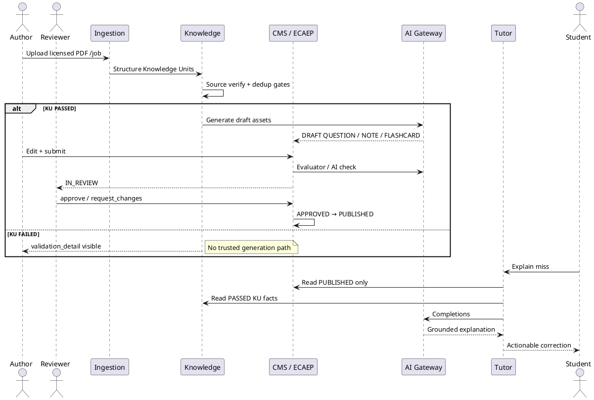

### 22.6.2 ECAEP states (normative) **[SHIPPED]**

From `docs/architecture/ecaep.md` / ADR-0009:

`DRAFT → AI_CHECKED → IN_REVIEW → APPROVED → PUBLISHED → ARCHIVED`, with `IN_REVIEW → CHANGES_REQUESTED → DRAFT`. Published edit opens a new version; prior published version stays live until the new one publishes. Types: `CONCEPT_NOTE`, `QUESTION`, `FLASHCARD`, `DIAGRAM`, `VIDEO_REF`, `FORMULA_SHEET`.

**Hard rule:** There is no student-facing CRUD path that skips review. Question Generator never auto-publishes.

### 22.6.3 Trust-loop rules (decision-grade)

| # | Rule | Enforcement surface |
|---|---|---|
| T1 | Learner assessment pools include only `PUBLISHED` questions | `published_question_ids_for_scope` / assessment generation |
| T2 | Tutor retrieval reads `PUBLISHED` content; under KU cutover, does not treat raw PDF text as authoritative when PASSED KUs apply | TutorService + KnowledgeService |
| T3 | Generation for trusted assets prefers **PASSED** KUs (extract-once-generate-many, ADR-0023/0024/0028) | ingestion → knowledge → cms drafts |
| T4 | `FAILED` KUs remain inspectable with `validation_detail`; they do not silently become student truth | `/admin/knowledge-units/[unitId]` |
| T5 | Evaluator assists reviewers; humans decide approve/publish | `/admin/ai-review`, ECAEP permissions |
| T6 | Licensing freeze (ADR-0005): no Aakash/Allen/PW/Unacademy ingestion without explicit license | Ops policy + author training |
| T7 | Visual assets require review before they are trusted UI | `/admin/visual-assets` |
| T8 | Audit trail on sensitive editorial and admin actions | `/admin/audit-logs`, `content_reviews` |

### 22.6.4 Worked example — Plant Kingdom trust path

**Author:** Dr. Mehta ingests a licensed chapter PDF on Plant Kingdom at `/admin/ingestion`.

1. Extraction yields sections; matching binds them to Botany concepts in the academic hierarchy.
2. Structuring creates Knowledge Units with `structured_facts`.
3. One speculative fact fails source verification → KU `FAILED` with `validation_detail`. Others `PASSED`.
4. Generation workers create draft MCQs/flashcards/notes only on the PASSED path.
5. A cladogram image lands in `/admin/visual-assets` for review.
6. Author edits ambiguous stems; submit → `AI_CHECKED` → `IN_REVIEW`.
7. Reviewer requests changes on one item; approves others → `APPROVED` → `PUBLISHED`.
8. `/admin/coverage` cell for that chapter improves.
9. Students can generate PRACTICE for those concepts; Tutor can ground on new PASSED KUs.

Until step 7 publishes, the learning loop correctly shows thin or empty pools—**honest emptiness beats fake fullness**.

### 22.6.5 Why Tutor sits inside the trust loop

Tutor is not a general chat product. Its job is to convert a miss into a next correct attempt under syllabus constraints. If Tutor cites unpublished drafts or FAILED KUs, the trust loop collapses even when ECAEP is perfect for the bank. Therefore Tutor is a **consumer of publish authority**, not a bypass around it. Embeddings/RAG productization remains **[FUTURE]**; current grounding is structured KU facts + published library pathways (ADR-0028 discloses remaining gaps honestly—do not market “full RAG”).

---

## 22.7 Solution principles

Principles below are binding for engineering PRs, content ops SOPs, and GTM copy. Each principle includes a **decision test**. Failing a test means reject the change or relabel the claim.

### 22.7.1 Principle catalog

| ID | Principle | Status | Decision test |
|---|---|---|---|
| SP-01 | **Human-in-loop Question Generator** — AI drafts; humans publish | **[SHIPPED]** | Can an agent auto-publish questions? If yes → reject. |
| SP-02 | **Published-only / PASSED-KU retrieval** for learner-facing AI and banks | **[SHIPPED]** | Can a student see or be tutored from non-`PUBLISHED` / non-PASSED authority? If yes → reject. |
| SP-03 | **No fake payments** — entitlements only after Razorpay signature verify | **[SHIPPED]** | Can Premium activate without verified payment? If yes → reject. |
| SP-04 | **Mastery from attempts** — arithmetic on `attempt_answers` | **[SHIPPED]** | Is a progress claim not derived from mastery/attempts? Relabel or reject. |
| SP-05 | **Honest empty states** — thin catalogs fail closed | **[SHIPPED]** | On zero published questions, do we fabricate? If yes → reject. |
| SP-06 | **AI Gateway abstraction** — Claude wired now; no scattered SDKs | **[SHIPPED]** | New agent call bypasses Gateway? If yes → reject. |
| SP-07 | **Modular monolith** — one FastAPI, one Next.js | **[SHIPPED]** ADR-0001/0008 | Does the change introduce a microservice or second admin SPA? If yes → require new ADR. |
| SP-08 | **Licensing freeze** — NCERT-aligned + originally authored; no unlicensed competitor corpus | **[SHIPPED]** policy ADR-0005 | Does intake include Allen/Aakash/PW/Unacademy without license? If yes → reject. |
| SP-09 | **RBAC + audit** — permissions server-side; break-glass explicit | **[SHIPPED]** | Can publish/suspend/force-edit occur without permission + audit path? If yes → reject. |
| SP-10 | **Don’t sell deferred BRD** — KG, Digital Twin, 12 agents, native, multi-tenancy are not MVP | **[OUT OF SCOPE MVP]** / **[FUTURE]** | Does copy claim them shipped? If yes → reject. |

### 22.7.2 Principles as PlantUML component constraints

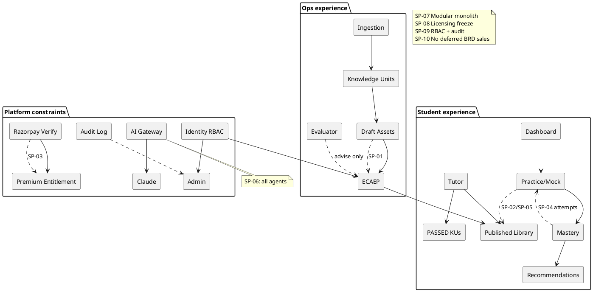

### 22.7.3 Mapping principles to code / doc touchpoints

| Principle | Touchpoint |
|---|---|
| SP-01 Human-in-loop QG | `ai` generate-question endpoints + cms workflow states |
| SP-02 Published-only | assessment published-pool queries; Tutor retrieval filters |
| SP-03 No fake payments | `verify_payment_signature` / commerce verify route |
| SP-04 Mastery from attempts | `AssessmentService.submit_attempt` → `MasteryService` |
| SP-05 Honest empty | AppError / empty UX when pool empty |
| SP-06 Gateway | `AIGateway` / provider interface (ADR-0004/0014) |
| SP-07 Monolith | module layout under `apps/backend/app/modules/*` |
| SP-08 Licensing | ADR-0005 + author intake checklist |
| SP-09 RBAC | `require_permission`, identity seed, admin UX gate |
| SP-10 Scope honesty | ADR-0007; GTM review checklist in Chapter 23 |

### 22.7.4 Agent responsibility matrix (v1 only) **[SHIPPED]** / **[IN SCOPE MVP]**

Four agents only. Mentor, Digital Twin, Diagram Agent, and 12-agent orchestrator are **not** v1 (ADR-0004, ADR-0007).

| Agent | Primary job | Writes student-visible bank content? | Human gate? | Primary surfaces |
|---|---|---|---|---|
| **Tutor** | Explain concepts/questions; correct misconceptions | No (ephemeral explanation) | Grounding constraints (PUBLISHED / PASSED KU) | Attempt review, concept help |
| **Question Generator** | Draft MCQs and related items | Only as **DRAFT** | ECAEP mandatory before publish | Author tools → `/admin/content*` |
| **Study Planner** | Plan from target score + exam date | Plan records, not syllabus facts | User accepts/regenerates | `/student/study-plan` |
| **Evaluator** | Quality review assistance / AI check signals | No direct publish | Reviewer decides | `/admin/ai-review`, ECAEP AI_CHECKED |

```mermaid
flowchart LR
  U[Student] --> T[Tutor]
  U --> SP[Study Planner]
  A[Author] --> QG[Question Generator]
  QG --> ECAEP[ECAEP states]
  ECAEP --> EV[Evaluator signals]
  EV --> H[Human reviewer]
  H --> Pub[PUBLISHED]
  T --> GW[AI Gateway]
  SP --> GW
  QG --> GW
  EV --> GW
  GW --> Claude[Claude provider]
  Pub --> Pool[Practice/Mock pool]
  Pub --> T
```

### 22.7.5 Advantages, tradeoffs, and future fence

**Advantages.** Cohesive loop already coded across student and admin route groups; trust and learning share one monolith; falsifiable mastery; honest commerce and empty states protect brand under thin catalogs.

**Tradeoffs.** Coverage limits “product magic”; fixed 1/3/7 intervals are simpler than SM-2; Tutor grounding maturity tracks KU/publish depth; TEACHER seed vs admin UX gate requires elevation **[ASSUMPTION]** for SME portal access today.

**Future (do not imply shipped):** embeddings retrieval ADR; true SM-2; micro-competency layer (ADR-0021 Phase 2); multi-exam packaging; notification channel; parent portal; institute tenancy; native apps; Knowledge Graph; Digital Twin.

### 22.7.6 Solution overview references

- ADRs: 0001, 0003, 0004, 0005, 0006, 0007, 0008, 0009, 0010, 0013, 0014, 0015, 0016, 0023–0028
- Architecture: `docs/architecture/ecaep.md`, `docs/architecture/roadmap.md`
- Diagrams: `diagrams/learning-loop.mmd`, `c4-context.mmd`, `c4-container.mmd`, `ecaep-state.mmd`

---

# 23. Value Proposition

## 23.1 Value prop canvas

Chapter 22 defines what TALOS *is*. Chapter 23 defines why each audience should care—and what we are forbidden to claim. Value propositions are evidence-backed: every gain maps to a shipped surface, module, or ADR. Where pricing SKU boundaries may still evolve, statements stay principle-based **[ASSUMPTION]** on exact commercial packaging.

### 23.1.1 Student canvas (full)

**Customer profile — jobs**

| Job type | Jobs |
|---|---|
| Functional | Cover NEET syllabus with deliberate practice; simulate exam pressure; correct misconceptions quickly; revise without a personal tutor’s spreadsheet |
| Emotional | Reduce panic via visibility; feel that effort compounds; trust the app will not gaslight progress |
| Social | Show parents credible evidence of work; hold own with peers who use big coaching brands |

**Pains:** wasted hours; rank anxiety; conflicting materials; shame after bad mocks; suspicion of pirated PDFs; dual load of Class 12 boards + NEET; thin long-tail concepts.

**Gains sought:** clear next action; mastery levels that mean something (attempt floor); stabler mock performance; explanations tied to real knowledge units/notes; PRACTICE vs MOCK honesty.

**Value map — pain relievers [SHIPPED]**

- Concept mastery persistence + dashboard overview
- due → weak → new ranking
- PRACTICE (neg=0) vs MOCK (+4/−1) separation
- ECAEP + KU gates behind the library
- Honest empty scopes when coverage is thin

**Value map — gain creators [SHIPPED]**

- One-click Practice now from dashboard recommendations
- Attempt review with score and breakdown
- Study Planner on `/student/study-plan`
- Flashcards for rote fragments
- Tutor grounded explanations under trust rules
- Score/attempt history for selective repeaters

**Products & services:** full student route set; four AI agents; admin-operated content factory feeding the student library; Razorpay Premium when unlock is required.

### 23.1.2 Parent canvas (influence buyer; no parent login in MVP)

| Element | Content |
|---|---|
| Jobs | Fund preparation wisely; see whether practice becomes competence; avoid shady payments and pirated content |
| Pains | Opaque coaching dashboards; fear of AI nonsense; UPI/payment anxiety; “is this Allen PDF?” |
| Gains | Visible mastery bars and mock trends on the student’s account; human-approved content posture; payments that succeed or fail honestly |
| Relievers | Student-visible progress; ECAEP narrative in plain language (“humans approve before students see”); commerce verify |
| Non-offer | Dedicated parent portal, digests, or `PARENT` role — **[FUTURE]** / **[OUT OF SCOPE MVP]** |

### 23.1.3 Content ops canvas (author + reviewer)

| Jobs | Pains | Gains / creators |
|---|---|---|
| Fill coverage cells | Manual MCQ burnout | QG draft acceleration into DRAFT |
| Keep quality | Silent hallucinations | Gates + ECAEP + Evaluator assist |
| Prove provenance | “Where did this come from?” | Ingestion job + KU + versions |
| Manage visuals | Lost diagrams | `/admin/visual-assets` |
| Defend publish | Pressure to ship overnight banks | Permissions + AI review queue + audit |

### 23.1.4 Platform admin canvas (brief)

Jobs: keep RBAC correct, costs visible, fraud suspended, search/index healthy, deploy path operable. Gains: `/admin` KPIs, `/admin/analytics`, `/admin/audit-logs`, `/admin/users`, Gateway metering. Pain avoided: microservice sprawl and fake “green” payment states.

---

## 23.2 Messaging pillars

### Pillar 1 — Mastery over volume
**Claim:** We measure learning at concept grain from real answers.  
**Support:** ADR-0015; `/student/dashboard`; mastery bars; attempt floor.  
**Anti-claim:** We do not sell “questions attempted” as mastery.

### Pillar 2 — Exam-real assessment
**Claim:** Learning mode and exam mode are different.  
**Support:** PRACTICE neg=0; MOCK +4/−1; timed mocks; `/student/mock-tests`.  
**Anti-claim:** We do not call every quiz a “NEET mock.”

### Pillar 3 — Grounded AI assistance
**Claim:** AI helps inside a trust envelope.  
**Support:** AI Gateway; Tutor grounding; human QG; Evaluator.  
**Anti-claim:** We do not offer an unsupervised AI teacher or auto-publish.

### Pillar 4 — Editorial integrity
**Claim:** Publish is a privilege, not a skippable button.  
**Support:** ECAEP states; permissions; `/admin/ai-review`; audit.  
**Anti-claim:** We do not CRUD-publish past review; we do not ingest unlicensed competitor corpora.

### Pillar 5 — Operable learning OS
**Claim:** This is runnable software, not a demo notebook.  
**Support:** RBAC, ingestion, coverage, analytics, Razorpay, Coolify deploy docs, modular monolith.  
**Anti-claim:** We do not pretend institute multi-tenant ERP, native apps, Knowledge Graph, or Digital Twin are included.

### Forbidden messaging (enforce in PR + GTM review)

| Forbidden phrase / implication | Why |
|---|---|
| “Enterprise Knowledge Graph shipped” | ADR-0007 deferred; KUs ≠ KG |
| “Student Digital Twin” | Not built |
| “12 AI agents” / “AI OS orchestrator live” | Four agents only |
| “Fully autonomous AI teacher” | Violates SP-01/SP-02 |
| “Native iOS/Android app” | Web-first MVP |
| “Multi-tenant institute portal” | Tenancy not wired |
| “Guaranteed rank / percentile” | Unprovable; compliance risk |
| “Contains Allen/Aakash/PW material” | Licensing freeze |
| “Payment successful” without verify | Commerce integrity |
| “Full NEET mock” when pool is thin without disclosure | Honesty / SP-05 |

---

## 23.3 Proof points from shipped capabilities

| Claim | Proof surface / module | ADR / doc |
|---|---|---|
| Full auth hardening (JWT cookies, refresh, Argon2) | `/login`, `/register`, identity module | ADR-0003, ADR-0011 |
| Single frontend for student + admin | `apps/web` route groups | ADR-0008 |
| Editorial workflow with real states | `/admin/content*`, cms module | ADR-0009, ecaep.md |
| Four agents via Gateway | ai module; Tutor/QG/Planner/Evaluator | ADR-0004, ADR-0014 |
| PRACTICE + MOCK generation from published pool | `/student/practice`, `/student/mock-tests`, assessment | ADR-0013 |
| NEET marking on mocks | MOCK +4/−1 | ADR-0013 |
| Concept mastery + revision intervals | learning module; dashboard | ADR-0015, ADR-0016 |
| Recommendations due→weak→new | dashboard Practice now | ADR-0016 |
| KU foundation + gates | `/admin/knowledge-units`, knowledge module | ADR-0023–0028 |
| Ingestion pipeline | `/admin/ingestion` | ADR-0022+ |
| Visual asset review | `/admin/visual-assets` | ADR-0026 |
| Honest payments | commerce verify | ADR-0006, ADR-0018 |
| Live admin aggregates | `/admin/analytics` | ADR-0017 |
| Auditability | `/admin/audit-logs` | system module |
| Licensing posture | ops + author process | ADR-0005 |
| Scope discipline (what we cut) | investor/GTM fence | ADR-0007 |
| Naming consistency | external communications | ADR-0010 |

**Proof pack checklist for demos:** dashboard with revision + recommendations; attempt page with score badge; admin home KPIs; ECAEP state diagram; KU PASSED/FAILED example; ADR index; Razorpay verify evidence; RBAC permission list.

---

## 23.4 Investor narrative vs student narrative vs parent narrative

### Investor narrative (≈2 minutes)

Trinetra AI Learning OS (TALOS) is building **trusted AI learning infrastructure**, with NEET as the proving vertical. The BRD describes an enormous end-state—graphs, twins, twelve agents, institute tenancy. We deliberately freeze a modular monolith MVP that proves the money-and-trust loop: students practice published questions, mastery updates, revision schedules, grounded tutoring, and ops can ingest → gate → review → publish at scale. Revenue via Razorpay; model access via an AI Gateway with Claude first. The moat is not “we called an LLM.” The moat is **editorial + knowledge gating + mastery telemetry** in one operable product. Phase 2 earns the right to micro-competencies and richer personalization after retention is real. Deferred megascope is a feature of judgment, not a gap in ambition.

### Student narrative (hero-adjacent; not final UI copy)

Know what to revise tonight. Practice concepts until they stick. Take mocks with real NEET marking. Ask a Tutor that stays on syllabus knowledge. Track mastery that does not lie.

### Parent narrative

You can see whether practice is turning into mastery. Content is reviewed before it reaches your child. Payment either works for real or fails honestly. No science-fiction features required to justify the fee.

### Author / reviewer narrative

Upload licensed sources, structure knowledge, generate drafts, and ship through a real editorial workflow. AI speeds drafting; you keep accountability. Reviewers treat Evaluator output as a junior red pen—helpful, not sovereign.

### Narrative fit matrix

| Audience | Primary pillar | Must hear | Must never hear |
|---|---|---|---|
| Student | Mastery + exam-real | due→weak→new; PRACTICE vs MOCK | Guaranteed rank; Digital Twin |
| Parent | Editorial integrity + honest commerce | Humans approve; visible progress | Parent app “included” |
| Investor | Operable OS + scope discipline | Shipped loop + ADR cuts | 280-table fantasy as MVP |
| Author | Editorial integrity + KU | Draft acceleration; publish authority | Auto-publish AI banks |
| Institute coordinator | N/A in MVP | “Not yet; consumer + ops first” | Multi-tenant sold as live |

---

## 23.5 Competitive differentiation summary table

| Dimension | Typical coaching app | Marketplace test series | Generic GPT wrapper | TALOS |
|---|---|---|---|---|
| NEET-native hierarchy | Strong | Medium | Weak | Strong **[SHIPPED]** |
| Concept mastery store | Rare | Rare | No | Yes **[SHIPPED]** |
| Rule-based revision intervals | Sometimes | Rare | No | Yes 1/3/7 **[SHIPPED]** |
| Human editorial workflow | Varies | Varies | No | ECAEP **[SHIPPED]** |
| KU intermediate representation | No | No | No | Yes **[SHIPPED]** foundation |
| On-demand assessment from published pool | Sometimes | Authored packs | No | Yes **[SHIPPED]** |
| AI Gateway / provider abstraction | Rare | Rare | N/A | Yes **[SHIPPED]** |
| Honest gap behavior | Often poor | Pack-based | N/A | Explicit errors **[SHIPPED]** |
| Four governed agents | Pitch / chat | Rare | Chat only | Tutor, QG, Planner, Evaluator **[SHIPPED]** |
| **Knowledge Graph / ontology** | Pitch | Pitch | Pitch | **Does NOT ship** **[OUT OF SCOPE MVP]** |
| **Student Digital Twin** | Pitch | Pitch | Pitch | **Does NOT ship** **[OUT OF SCOPE MVP]** |
| **Native mobile apps** | Often yes | Sometimes | No | **Does NOT ship** (web-first) **[FUTURE]** |
| **Multi-tenancy / institute portals** | Often yes | Sometimes | No | **Does NOT ship** (org table reserved only) **[OUT OF SCOPE MVP]** |
| **12-agent orchestrator** | Pitch | Pitch | Pitch | **Does NOT ship** (4 agents only) |

### Positioning essays (short)

- **Versus question banks:** banks distribute items; TALOS runs a loop that remembers competence and schedules return.
- **Versus coaching ecosystems:** TALOS does not replace teachers/peers in MVP; it replaces the dishonest digital layer (ungrounded AI + untracked practice). Institute replacement is **[FUTURE]**.
- **Versus generic LLM apps:** conversation without attempts is entertainment; attempts without grounding are cruelty; TALOS binds both on an editorial corpus.
- **Versus AI edtech pitch decks:** decks claim graphs and twins; TALOS claims KUs, ECAEP, mastery tables, four agents—and can show the routes. Differentiation is **demoable truth**.

---

## 23.6 Objection handling

| Objection | Reply |
|---|---|
| “Show me your knowledge graph.” | We ship Knowledge Units with mechanical gates; full KG is Phase 2 / ADR-0007. |
| “Do you have a parent app?” | Parents use visible student progress; dedicated portal is deferred. |
| “Is it multi-tenant for my coaching center?” | Not in MVP; consumer learners + internal ops first. |
| “Is the AI automatic for questions?” | Drafts yes; publish never without humans (ECAEP). |
| “Why is my full mock short?” | Mock size follows the published pool—coverage is the work, not padding. |
| “Native app?” | Web-first MVP; native is future. |
| “Will this guarantee my rank?” | No product can; we guarantee a truthful practice/mastery loop. |
| “Is content from big coaching PDFs?” | No—NCERT-aligned and originally authored under licensing freeze. |
| “Why only four agents?” | Load-bearing for the loop; twelve-agent orchestrator deferred on purpose. |
| “Where is the Digital Twin?” | Mastery is arithmetic from attempts—not a twin. Twin is explicitly cut. |

---

## 23.7 Value metrics

Metrics below are product-truthful. Prefer these in investor updates and ops reviews over vanity chat counts.

| Metric | Definition | Why it matters |
|---|---|---|
| Activation to first PRACTICE | Register/verify → first submitted PRACTICE | Proves loop entry |
| Concepts leaving `NOT_STARTED` | Count of concepts with attempts &gt; 0 | Real engagement |
| `MASTERED` concepts / week | Level transitions to MASTERED | Outcome over volume |
| Due revision completion rate | Due items practiced within window | Habit health |
| Recommendation acceptance | Practice now clicks / impressions **[ASSUMPTION]** eventing detail | Ranking usefulness |
| MOCK submit rate | Started mocks that submit | Exam-mode seriousness |
| Tutor helpfulness proxy | Post-Tutor retry accuracy lift **[ASSUMPTION]** analytics interpretation | Grounding quality |
| Publish throughput | Items reaching PUBLISHED / week | Content factory health |
| Median time-in-review | IN_REVIEW duration | Ops bottleneck |
| KU PASSED rate | PASSED / (PASSED+FAILED) | Structuring quality |
| Coverage cell fill | Published depth vs syllabus cells | Mock realism ceiling |
| Payment verify success | Verified / initiated checkouts | Commerce integrity |
| AI Gateway cost / active learner | Metered spend | Solvency |
| Consistency | Weeks with ≥3 learning loops closed | Retention spine |

**North star metric (Part C close):**  
**Weekly learning loops closed per active student** — a loop closed means: recommendation or intentional practice → submitted attempt → mastery recompute → student returns to a due/weak/new next action within the week. Secondary north-star for ops: **PUBLISHED questions per priority coverage cell**. Vanity north-stars (raw chat messages, raw questions generated as drafts) are explicitly demoted.

---

## 23.8 One-page pitch

**Trinetra AI Learning OS (TALOS) — AI NEET Exam App**

TALOS is an AI-first learning platform that helps NEET aspirants improve through a closed loop of **published practice**, **concept mastery**, **scheduled revision**, and **grounded tutoring**, operated by a **human-controlled content system**.

- Students practice on `/student/practice` and mock on `/student/mock-tests` with real NEET **+4 / −1** marking.
- Every submitted attempt updates `concept_mastery` (`NOT_STARTED` → `LEARNING` → `PRACTICING` → `MASTERED`) and sets revision for **1 / 3 / 7** days.
- The dashboard ranks work **due → weak → new** so “what should I do tonight?” is answered by data, not vibes.
- Content enters via licensed ingestion and Knowledge Units, then ECAEP (`DRAFT` … `PUBLISHED`); Tutor and the question pool never outrank publish authority.
- Four agents (Tutor, Question Generator, Study Planner, Evaluator) run through an AI Gateway (Claude wired).
- Architecture: modular monolith (FastAPI + Next.js), PostgreSQL, Redis, Razorpay, RBAC, audit.
- Intentionally **not** in MVP: Knowledge Graph, Digital Twin, native apps, multi-tenancy, 12-agent orchestrator.

**Ask (internal):** ship coverage + retention on the loop we already built; do not reopen ADR freezes for pitch-deck features.

---

## 23.9 Battlecards (field use)

### vs Generic GPT study chat
| | Them | TALOS |
|---|---|---|
| Strength | Fluent answers anytime | Assessed learning + editorial corpus |
| Attack | “Ungrounded fluency harms NEET” | Show Tutor grounding + ECAEP |
| Landmine | Hallucinated mechanisms | Keep FAILED KUs out of Tutor |

### vs Pure question bank / test series
| | Them | TALOS |
|---|---|---|
| Strength | Large static packs | On-demand PRACTICE/MOCK + mastery memory |
| Attack | “Packs don’t remember you” | Show due→weak→new |
| Landmine | Thin published pool | Never fabricate; sell coverage roadmap |

### vs Big coaching digital add-ons
| | Them | TALOS |
|---|---|---|
| Strength | Brand, teachers, peers | Trustworthy AI + mastery OS wedge |
| Attack | “Don’t replace coaching; replace dishonest AI layers” | Parent trust narrative |
| Landmine | Selling institute OS today | Tenancy is deferred—say so |

### vs “AI edtech” deck with KG/Twin
| | Them | TALOS |
|---|---|---|
| Strength | Vision theater | Demoable routes + ADRs |
| Attack | “Show the graph in production” | Show KU PASSED/FAILED + mastery tables |
| Landmine | Sliding into their vocabulary | Use TALOS names; never claim KG/Twin shipped |

---

## 23.10 Pricing value story **[ASSUMPTION]** on SKU edges

Bind price to access that exists: full practice/mock generation on the published catalog; Tutor + Planner under fair rate limits; continuity of mastery/revision data; Premium entitlements only after verified payment. Do **not** bind price to deferred features (KG, twin, native exclusives, institute seats).

---

## 23.11 Part C quality checklist

Use before merging Part C assemblies or externalizing excerpts:

- [ ] Every persona (Ch. 19) maps to real routes in `apps/web`
- [ ] Every journey stage (Ch. 20) names touchpoints that exist
- [ ] Problem section (Ch. 21) includes deferred non-goals
- [ ] Solution diagrams include web, API, PostgreSQL, Redis, email, Anthropic, Razorpay
- [ ] Learning loop states mastery levels + 1/3/7 intervals + due→weak→new
- [ ] Trust loop states KU + ECAEP + Tutor rules
- [ ] Solution principles include decision tests SP-01…SP-10
- [ ] Value props include investor / student / parent / author variants
- [ ] Competitive table includes explicit **does-not-ship** rows (KG, Twin, native, multi-tenancy)
- [ ] Claims labeled `[SHIPPED]` / `[ASSUMPTION]` / `[FUTURE]` / `[OUT OF SCOPE MVP]` as needed
- [ ] No KG / Twin / native / multi-tenant / 12-agent / auto-publish / fake-payment claims
- [ ] Naming is **Trinetra AI Learning OS (TALOS)** (ADR-0010)
- [ ] Conflict order honored: `apps/` → ADRs → deploy docs → this narrative

---

## 23.12 ADR traceability (Chapters 22–23)

| Topic | ADR(s) |
|---|---|
| Modular monolith / stack | ADR-0001, ADR-0002 |
| Auth / identity | ADR-0003, ADR-0011 |
| AI Gateway + agents | ADR-0004, ADR-0014 |
| Licensing | ADR-0005 |
| Commerce / hosting | ADR-0006, ADR-0018 |
| MVP cuts | ADR-0007 |
| Single frontend | ADR-0008 |
| ECAEP | ADR-0009 |
| Naming | ADR-0010 |
| Assessment PRACTICE/MOCK | ADR-0013 |
| Mastery | ADR-0015 |
| Recommendations / revision | ADR-0016 |
| Analytics scope | ADR-0017 |
| Micro-competency fence | ADR-0021 |
| Ingestion / KU / EKU | ADR-0022–0028 |
| CI/CD | ADR-0029 |

---

## 23.13 Glossary (Part C close)

| Term | Definition |
|---|---|
| TALOS | Trinetra AI Learning OS — platform name (ADR-0010) |
| AI NEET Exam App | First exam vertical on TALOS |
| ECAEP | Editorial content workflow; publish authority state machine |
| Knowledge Unit (KU) | Versioned structured facts with mechanical gates; substrate for trusted generation |
| PASSED / FAILED | KU gate outcomes; FAILED retains validation_detail |
| PRACTICE | Untimed assessment; no negative marking |
| MOCK | Timed assessment; NEET +4 / −1 |
| mastery_level | `NOT_STARTED` / `LEARNING` / `PRACTICING` / `MASTERED` |
| next_review_at | Revision timestamp from fixed intervals 1/3/7 days |
| due → weak → new | Recommendation priority order |
| AI Gateway | Provider-abstracted LLM access; Claude wired |
| Envelope response | `{ success, data, meta, errors, traceId, timestamp }` |
| Coverage | Admin grid of published depth vs syllabus cells |
| Grounding | Constraining model outputs to trusted substrates |
| Admin UX gate | Next.js admin layout role allow-list (SUPER_ADMIN / ADMIN / CONTENT_MANAGER) |
| Force edit published | Break-glass permissioned hot fix |
| Coolify | MVP hosting orchestrator on Hetzner |

---

## 23.14 Non-claims register

| Non-claim | Status |
|---|---|
| Knowledge Graph shipped | FORBIDDEN in MVP messaging |
| Digital Twin shipped | FORBIDDEN |
| Native iOS/Android shipped | FORBIDDEN |
| Multi-tenancy / institute portal shipped | FORBIDDEN |
| 12-agent orchestrator shipped | FORBIDDEN |
| Micro-competency layer shipped as MVP hierarchy | FORBIDDEN (Phase 2 / ADR-0021) |
| Auto-publish AI questions | FORBIDDEN |
| Fake payment success | FORBIDDEN |
| Fabricated mock/practice items when pool empty | FORBIDDEN |
| Guaranteed NEET rank/percentile | FORBIDDEN |
| Unlicensed competitor PDF corpus | FORBIDDEN |
| Parent portal included | FORBIDDEN (influence via student UX only) |
| Full embeddings/RAG product complete | FORBIDDEN as unqualified shipped claim |

---

## 23.15 Value proposition references

- Chapters 7, 15, 19–22 (personas, journey, problem, solution)
- ADR-0010 for external naming
- ADR-0007 for scope fence
- Proof table in §23.3; battlecards in §23.9

---

## Part C closing statement

Part C of Volume 1 has moved from **who the product is for** (personas), through **how they move** (journeys), **what hurts** (problem framing), **what we built** (solution overview and principles), to **why it matters and what we refuse to pretend** (value proposition). Trinetra AI Learning OS (TALOS), in its AI NEET Exam App vertical, stands on a single operable promise: a governed learning loop—published practice, concept mastery, due→weak→new revision, and grounded AI—fed by Knowledge Units and ECAEP, secured by RBAC and honest commerce, and constrained by ADRs that keep Knowledge Graph theater, Digital Twins, native-app fantasies, and multi-tenant ERP out of the MVP storyline. Engineering, content ops, product, and GTM should treat Chapters 19–23 as the shared script: ship coverage and retention on what is real; label assumptions; defer the rest with pride. Continue with Part D (Chapters 24–30) for functional requirements, NFRs, business rules, and formal scope boundaries that freeze this narrative into acceptance criteria.

*End of Volume 1 Part C — Product Design (Chapters 19–23).*