# Volume 1 Part D — Requirements, Business Rules, Scope, Assumptions, and Constraints

**Document ID:** TALOS-VOL-01-D  
**Parent volume:** TALOS-VOL-01 — Executive & Product Blueprint  
**Canonical platform name:** Trinetra AI Learning OS (TALOS)  
**Product vertical:** AI NEET Exam App (NEET-UG)  
**Version:** 1.0.0  
**Classification:** Internal — Confidential  
**Date:** 2026-08-07  
**Authority:** Architecture Decision Records under `docs/decisions/` are binding. This Part D interprets requirements for product, engineering, QA, and governance; it does not silently override ADRs.

---

## Document control

| Field | Value |
|---|---|
| File path | `docs/blueprint/volume-01/04-requirements-and-scope.md` |
| Chapters | 24–30 |
| Audience | CTO, architects, product managers, engineering leads, QA, DevOps/SRE, AI engineers, compliance reviewers, investors |
| Evidence basis | Repository ADRs (ADR-0001–ADR-0029), `docs/architecture/roadmap.md`, `docs/architecture/ecaep.md`, `docs/deploy/*`, `apps/backend`, `apps/web` |
| Unmeasured claims | Labeled **Enterprise Assumption** |

### Revision history

| Version | Date | Author | Summary |
|---|---|---|---|
| 1.0.0 | 2026-08-07 | TALOS Architecture Office | Initial complete Part D from frozen ADRs and shipped SP0–SP9 + Phase 2 |

### Related documents

| Document | Role |
|---|---|
| `docs/blueprint/volume-01/README.md` | Volume layout and conflict register |
| `docs/architecture/roadmap.md` | Sprint status SP0–SP9 |
| `docs/architecture/ecaep.md` | Content editorial workflow |
| `docs/decisions/ADR-0001` … `ADR-0029` | Frozen decisions |
| `docs/deploy/RUNBOOK.md` | Operability |

---

## How to read this Part

1. **Functional Requirements (Ch. 24)** define *what* the system must do, organized by domain, each with a stable FR-ID, MoSCoW priority, acceptance criteria, ADR/sprint source, and status (`Shipped` / `Partial` / `Planned`).
2. **Non-Functional Requirements (Ch. 25)** define quality attributes; latency and SLO numbers that have not been load-tested in this repository are explicitly marked assumptions.
3. **Business Rules (Ch. 26)** are invariant policies enforced in code or process; they include state machines for ECAEP and commerce orders.
4. **Product Scope (Ch. 27)** inventories what is in the current production target.
5. **Out of Scope (Ch. 28)** lists deferred items with value-vs-cost rationale (primarily ADR-0007 and later deferrals).
6. **Assumptions (Ch. 29)** and **Constraints (Ch. 30)** bound planning.

### Status legend

| Status | Meaning |
|---|---|
| **Shipped** | Implemented, verified per roadmap/ADR acceptance evidence (unit tests, integration tests, curl, and/or browser click-through as cited in ADRs) |
| **Partial** | Core path exists; named gaps remain (documented in ADR self-reviews or roadmap notes) |
| **Planned** | Accepted direction exists in an ADR or roadmap backlog; not yet production-complete |

### MoSCoW legend

| Priority | Meaning for TALOS |
|---|---|
| **Must** | Required for production target / ADR freeze |
| **Should** | Strongly expected in current production target; gap is a known defect or near-term follow-up |
| **Could** | Valuable; may ship when capacity allows without blocking MVP validation |
| **Won't** | Explicitly out of current target (see Ch. 28) |

### Cross-cutting technical invariants (apply to all FRs)

These are not duplicated on every FR but are mandatory for every API-facing capability:

1. **API envelope.** Every HTTP API response uses `{ success, data, meta, errors, traceId, timestamp }` via `app/shared/responses.py` (`envelope()`).
2. **Auth cookies.** Access JWT (~15 minutes) plus rotating opaque refresh tokens in HTTP-only cookies; CSRF double-submit on state-changing routes (`verify_csrf`).
3. **RBAC.** Permission codes gate privileged routes; `SUPER_ADMIN` bypasses permission checks entirely; suspended (`status` not `active`) users cannot authenticate.
4. **Soft delete & audit columns.** Tables follow `id UUID`, `created_at`/`updated_at`, `created_by`/`updated_by`, `deleted_at`, `version` where the shared model pattern applies.
5. **PostgreSQL schemas.** Domain data lives in `identity`, `academic`, `cms`, `assessment`, `ai`, `analytics` (empty reserved), `commerce`, `system`, `learning`, `ingestion`, `knowledge`.
6. **No silent payment success.** Commerce never fabricates PAID without HMAC verification (ADR-0018).
7. **ECAEP gate.** Student-visible learning content of CMS types must pass editorial publish; QG never auto-publishes.

---

## 24. Functional Requirements

This chapter is the authoritative functional requirements catalog for TALOS / AI NEET Exam App as evidenced by the repository. Requirements are grouped by domain. Each requirement has a stable identifier of the form `FR-<DOMAIN>-<NNN>`.

### 24.0 Requirements overview by domain

| Section | Domain | FR-ID prefix | Primary module | Primary UI surfaces |
|---|---|---|---|---|
| 24.1 | Identity & Auth | FR-ID-* | `identity` | `/(auth)/*`, `/admin/users` |
| 24.2 | Academic hierarchy | FR-AC-* | `academic` | `/student/subjects/**` |
| 24.3 | CMS / ECAEP | FR-CMS-* | `cms` | `/admin/content/**`, `/admin/coverage` |
| 24.4 | Assessment | FR-AS-* | `assessment` | `/student/practice`, `/student/mock-tests`, `/student/attempts/**` |
| 24.5 | AI agents | FR-AI-* | `ai` | `/student/study-plan`, explain flows, admin QG |
| 24.6 | Learning / mastery / revision / recommendations | FR-LRN-* | `learning` | `/student/dashboard`, concept/topic pages |
| 24.7 | Analytics (admin) | FR-AN-* | `analytics` | `/admin/analytics` |
| 24.8 | Commerce | FR-COM-* | `commerce` | Premium status / checkout surfaces |
| 24.9 | System / audit / admin users | FR-SYS-* | `system`, `identity` | `/admin`, `/admin/audit-logs`, `/admin/users` |
| 24.10 | Ingestion pipeline | FR-ING-* | `ingestion` | `/admin/ingestion/**`, `/admin/visual-assets` |
| 24.11 | Knowledge Units | FR-KU-* | `knowledge` | `/admin/knowledge-units/**` |
| 24.12 | Search | FR-SRCH-* | `cms` (search) | `/admin/search` |
| 24.13 | Student learning UX | FR-UX-* | `learning`, `cms`, `ai` | bookmarks, notes, flashcards, explain |

### 24.0.1 Sprint → capability mapping (production target)

| Sprint | Status (roadmap) | Capability cluster |
|---|---|---|
| SP0 | Done | Foundation: Docker, Postgres, Redis, FastAPI, Next.js |
| SP1 | Done | Identity, JWT, RBAC, CSRF, sessions |
| SP2 | Done | Exam→Subject→Chapter→Topic→Concept (+ later micro-competencies) |
| SP3 | Done | ECAEP content model + question bank |
| SP4 | Done | Practice + mock assessment, +4/−1 scoring |
| SP5 | Done | AI Gateway + Tutor, QG, Planner, Evaluator |
| SP6 | Done | Concept mastery + topic rollup |
| SP7 | Done | Revision schedule + rule-based recommendations |
| SP8 | Done | Admin analytics (live aggregation) |
| SP9 | Done | Razorpay commerce, admin user mgmt, rate limits, security headers, Coolify artifacts |
| Phase 2 | Partial/Shipped per ADR | Hindi content (ADR-0019), micro-competencies (ADR-0021), ingestion (ADR-0022+), KU lifecycle (ADR-0024–0028), CI/CD (ADR-0029), integration tests (ADR-0020) |

### 24.1 Identity & Auth

Identity is the security boundary for the modular monolith. Auth is custom JWT owned by FastAPI (ADR-0003), not Auth.js. Schema consolidation is per ADR-0011.

#### FR-ID-001 — User self-registration

**Description.** A prospective student SHALL be able to register with email, password, and profile fields required by `identity.users`, receiving the default STUDENT role.

**Actors.** Anonymous visitor → Student

**Priority (MoSCoW).** Must

**Acceptance criteria.**

1. POST registration creates a user row with hashed password (Argon2).
2. Default role assignment is STUDENT.
3. Duplicate email is rejected with a structured envelope error.
4. Rate limiting applies to `/auth/register` (SP9).

**Source.** ADR-0003, ADR-0011, SP1, ADR-0018

**Status.** Shipped

---

#### FR-ID-002 — Login with access JWT and refresh cookie

**Description.** An active user SHALL authenticate with email/password and receive a short-lived JWT access token (~15 minutes) plus an opaque rotating refresh token in an HTTP-only cookie.

**Actors.** Student, Teacher, Content Manager, Admin, Super Admin, Support

**Priority (MoSCoW).** Must

**Acceptance criteria.**

1. Successful login sets Secure, HTTP-only, SameSite cookies as configured; tokens are never written to localStorage by the official web client.
2. Access token lifetime is on the order of 10–15 minutes per ADR-0003.
3. Login writes `identity.login_history`.
4. Rate limiting applies to `/auth/login`.

**Source.** ADR-0003, SP1, ADR-0018

**Status.** Shipped

---

#### FR-ID-003 — Refresh token rotation

**Description.** The system SHALL rotate the refresh token on every successful refresh and persist a hashed refresh token at rest, revocable on logout.

**Actors.** Authenticated user

**Priority (MoSCoW).** Must

**Acceptance criteria.**

1. POST `/auth/refresh` issues a new refresh token and invalidates/rotates the prior one.
2. Refresh tokens are stored hashed, not plaintext.
3. Refresh token metadata may include device label, IP, user agent, last-used (session-as-refresh-token model, ADR-0011).
4. Rate limiting applies to `/auth/refresh`.

**Source.** ADR-0003, ADR-0011, SP1

**Status.** Shipped

---

#### FR-ID-004 — Logout and session revocation

**Description.** An authenticated user SHALL be able to logout, revoking the current refresh session so subsequent refresh attempts fail.

**Actors.** Authenticated user

**Priority (MoSCoW).** Must

**Acceptance criteria.**

1. Logout clears auth cookies on the client path and revokes server-side refresh token.
2. Subsequent refresh with the old token fails with envelope error.

**Source.** ADR-0003, SP1

**Status.** Shipped

---

#### FR-ID-005 — CSRF double-submit protection

**Description.** State-changing authenticated requests SHALL require CSRF verification using the double-submit cookie pattern (`verify_csrf` dependency).

**Actors.** Authenticated user; web client

**Priority (MoSCoW).** Must

**Acceptance criteria.**

1. Mutating routes that declare `Depends(verify_csrf)` reject missing/mismatched CSRF tokens.
2. Safe methods (GET) are not CSRF-gated.

**Source.** SP1; identity dependencies

**Status.** Shipped

---

#### FR-ID-006 — RBAC permission enforcement

**Description.** Privileged API routes SHALL require named permission codes (e.g., `users.manage`, `content.publish`, `analytics.view`) via `require_permission`.

**Actors.** All authenticated roles

**Priority (MoSCoW).** Must

**Acceptance criteria.**

1. A caller lacking the required permission receives a structured 403 envelope error.
2. Permission codes are seeded as listed in `identity/seed.py`.
3. Role–permission mappings are editable for non–SUPER_ADMIN roles by authorized admins.

**Source.** ADR-0011, SP1; `identity/seed.py`

**Status.** Shipped

---

#### FR-ID-007 — SUPER_ADMIN permission bypass

**Description.** A user with role SUPER_ADMIN SHALL bypass fine-grained permission checks. SUPER_ADMIN role permissions SHALL NOT be editable via the role permission editor.

**Actors.** Super Admin

**Priority (MoSCoW).** Must

**Acceptance criteria.**

1. Permission middleware treats SUPER_ADMIN as full access.
2. Attempting to PATCH SUPER_ADMIN permissions returns ROLE_IMMUTABLE (or equivalent) error.

**Source.** SP1; roles_router immutability; seed description

**Status.** Shipped

---

#### FR-ID-008 — Suspended user login denial

**Description.** Users whose `status` is not `active` SHALL NOT obtain new credentials on login; the system SHALL reject with ACCOUNT_SUSPENDED (or equivalent) before password verification completes the auth path.

**Actors.** Suspended user; Admin (setter)

**Priority (MoSCoW).** Must

**Acceptance criteria.**

1. Login for non-active status fails with ACCOUNT_SUSPENDED.
2. Fix covers the SP9-found gap where suspended users could still log in and only fail later on `get_current_user`.
3. Admin can set status via AdminUserUpdateRequest on PATCH `/users/{id}` with `users.manage`.

**Source.** ADR-0018

**Status.** Shipped

---

#### FR-ID-009 — Brute-force lockout awareness

**Description.** Authentication SHALL honor `locked_until` (brute-force lockout) in addition to status checks.

**Actors.** Attacker / locked user

**Priority (MoSCoW).** Must

**Acceptance criteria.**

1. When `locked_until` is in the future, login is rejected.
2. Check is co-located with status check in authenticate path.

**Source.** ADR-0018; SP1 AuthService

**Status.** Shipped

---

#### FR-ID-010 — Current user profile read/update

**Description.** An authenticated user SHALL read and update their own profile fields via `/users/me` without the ability to escalate roles or reactivate a suspended account through the self-service schema.

**Actors.** Authenticated user

**Priority (MoSCoW).** Must

**Acceptance criteria.**

1. GET `/users/me` returns profile including roles and preferred_language (ADR-0019).
2. PATCH `/users/me` uses the narrow self-service schema (not AdminUserUpdateRequest).
3. CSRF applies to PATCH.

**Source.** ADR-0011, ADR-0018, ADR-0019

**Status.** Shipped

---

#### FR-ID-011 — Admin user listing and detail

**Description.** An administrator with `users.manage` SHALL list users (paginated) and retrieve a user by id.

**Actors.** Admin, Super Admin

**Priority (MoSCoW).** Must

**Acceptance criteria.**

1. GET `/users` returns envelope with meta total/limit/offset.
2. Unauthorized callers are denied.

**Source.** SP1; ADR-0018

**Status.** Shipped

---

#### FR-ID-012 — Admin role and status management

**Description.** An administrator with `users.manage` SHALL update another user's status and role_codes via AdminUserUpdateRequest; RoleRepository.replace_roles performs full diff-and-sync.

**Actors.** Admin, Super Admin

**Priority (MoSCoW).** Must

**Acceptance criteria.**

1. UI `/admin/users` exposes role multi-select and status toggle.
2. Self-service path cannot grant roles.
3. replace_roles adds missing and removes extra roles atomically in one call.

**Source.** ADR-0018

**Status.** Shipped

---

#### FR-ID-013 — Role and permission catalog management

**Description.** Authorized admins SHALL list roles, list all permission codes, create/patch roles, and replace a role's permissions (except SUPER_ADMIN).

**Actors.** Admin, Super Admin

**Priority (MoSCoW).** Must

**Acceptance criteria.**

1. GET permissions returns catalog for Admin Portal Module 9 checklist UI.
2. Audit log records role.update_permissions actions where wired.

**Source.** SP1; Admin Portal extensions; roles_router

**Status.** Shipped

---

#### FR-ID-014 — Password hashing with Argon2

**Description.** Passwords SHALL be hashed with Argon2; plaintext passwords SHALL never be stored.

**Actors.** System

**Priority (MoSCoW).** Must

**Acceptance criteria.**

1. Registration and password change store Argon2 hashes only.
2. Verification uses constant-time compare against Argon2 hash.

**Source.** ADR-0003

**Status.** Shipped

---

#### FR-ID-015 — Email verification and password reset token fields

**Description.** The identity schema SHALL support email verification and password reset via hashed single-use tokens and expiry columns on `identity.users` (no separate token tables).

**Actors.** Student; System

**Priority (MoSCoW).** Should

**Acceptance criteria.**

1. UI routes exist for verify-email, forgot-password, reset-password.
2. Tokens are stored hashed with expiry.
3. Outbound email delivery may be limited in local/dev environments (see ASSUM-ID).

**Source.** ADR-0011; SP1 UI routes

**Status.** Partial

---

#### FR-ID-016 — Preferred language preference

**Description.** A user SHALL set `preferred_language` (e.g., `en`, `hi`) used as the default content language filter; UI chrome remains English (ADR-0019).

**Actors.** Student

**Priority (MoSCoW).** Must

**Acceptance criteria.**

1. preferred_language is returned on UserResponse and editable in Settings.
2. Changing preference affects default CMS published content language filter.

**Source.** ADR-0019

**Status.** Shipped

---

#### FR-ID-017 — API response envelope consistency for identity errors

**Description.** All identity API failures SHALL return the standard envelope with success=false, errors[], and traceId.

**Actors.** All clients

**Priority (MoSCoW).** Must

**Acceptance criteria.**

1. Clients can correlate failures using traceId.
2. Error codes such as ACCOUNT_SUSPENDED, ROLE_IMMUTABLE appear in errors.

**Source.** Shared responses; CLAUDE.md conventions

**Status.** Shipped

---

#### FR-ID-018 — Seeded roles and permissions baseline

**Description.** On environment bootstrap, seed_identity SHALL ensure roles SUPER_ADMIN, ADMIN, CONTENT_MANAGER, TEACHER, STUDENT, SUPPORT and the permission catalog exist idempotently.

**Actors.** System / DevOps

**Priority (MoSCoW).** Must

**Acceptance criteria.**

1. Re-running seed does not duplicate roles/permissions.
2. Integration tests seed once per session (ADR-0020).

**Source.** ADR-0011, ADR-0020; seed.py

**Status.** Shipped

---

#### 24.1.A Identity domain notes

**Deferred identity tables (ADR-0011):** `devices`, `password_history`, `preferences`, `addresses` are not requirements of the current production target. Session listing uses refresh token metadata.

**Auth.js prohibition (ADR-0003):** Introducing Auth.js as a second session authority is out of scope and would conflict with backend-issued JWT + rotating refresh design.

### 24.2 Academic hierarchy

Academic Engine models NEET curriculum as Exam → Subject → Chapter → Topic → Concept (ADR-0012), with an optional Micro-Competency layer under Concept (ADR-0021). Hierarchy names remain English-only (ADR-0019).

#### FR-AC-001 — Five-level hierarchy persistence

**Description.** The system SHALL persist `academic.exams`, `subjects`, `chapters`, `topics`, `concepts` with display ordering and soft-delete/audit conventions.

**Actors.** System; Content Manager; Admin

**Priority (MoSCoW).** Must

**Acceptance criteria.**

1. NEET exam seed includes 4 subjects and chapters per SP2 roadmap evidence.
2. Concept carries free-text `ncert_reference`.
3. No separate Unit or Subtopic tables in v1.

**Source.** ADR-0012, SP2

**Status.** Shipped

---

#### FR-AC-002 — Student browse subjects

**Description.** A student SHALL browse subjects and drill into chapters, topics, and concepts via student UI routes.

**Actors.** Student

**Priority (MoSCoW).** Must

**Acceptance criteria.**

1. Routes `/student/subjects`, `/student/subjects/[subjectId]`, `/student/chapters/[chapterId]`, `/student/topics/[topicId]`, `/student/concepts/[conceptId]` exist and load hierarchy data.
2. Unauthorized anonymous access is redirected/denied per app auth gates.

**Source.** SP2; web App Router pages

**Status.** Shipped

---

#### FR-AC-003 — Seeded NEET curriculum completeness for pilot chapter

**Description.** The system SHALL seed at least one fully fleshed chapter per subject for verification (roadmap: Current Electricity / Ohm's Law lineage used across CMS, Hindi, ingestion pilots).

**Actors.** System

**Priority (MoSCoW).** Must

**Acceptance criteria.**

1. Pilot chapter includes topics and concepts used by ECAEP and ingestion ground truth.
2. Seed is idempotent for integration tests.

**Source.** SP2; ADR-0009/0019/0022 precedents

**Status.** Shipped

---

#### FR-AC-004 — Micro-competency authoring under concept

**Description.** Authorized authors SHALL create a small set of micro-competencies (code, name, display_order) under a concept; QUESTIONS may optionally tag exactly one micro_competency_id.

**Actors.** Content Manager, Teacher (content.create), Admin

**Priority (MoSCoW).** Should

**Acceptance criteria.**

1. Nullable micro_competency_id on content items; existing questions remain valid untagged.
2. Admin content form shows optional micro-competency dropdown when concept has any.
3. Seed includes 2–4 micro-competencies for Ohm's Law pilot.

**Source.** ADR-0021

**Status.** Shipped

---

#### FR-AC-005 — Concept prerequisites edges (schema)

**Description.** The system SHALL provide `academic.concept_prerequisites` as a directed edge table (concept requires prerequisite_concept) for future Concept Graph consumption.

**Actors.** Admin / Content Manager (authoring TBD)

**Priority (MoSCoW).** Could

**Acceptance criteria.**

1. Table exists with unique (concept_id, prerequisite_concept_id).
2. No cycle detection required until real edges are authored (ADR-0028).
3. Phase E authoring/consumption remains blocked pending ADR follow-up.

**Source.** ADR-0028

**Status.** Partial

---

#### FR-AC-006 — Academic hierarchy English-only labels

**Description.** Subject/Chapter/Topic/Concept name fields SHALL remain single-language English strings; translation of hierarchy labels is out of scope for ADR-0019.

**Actors.** All users

**Priority (MoSCoW).** Must

**Acceptance criteria.**

1. No translations table for hierarchy names in current target.
2. Hindi applies to CMS content bodies, not breadcrumb curriculum names.

**Source.** ADR-0019

**Status.** Shipped

---

#### FR-AC-007 — Read APIs for hierarchy navigation

**Description.** Authenticated students SHALL retrieve hierarchy nodes needed for navigation and mastery rollups without requiring content-author permissions.

**Actors.** Student

**Priority (MoSCoW).** Must

**Acceptance criteria.**

1. Hierarchy GETs succeed for STUDENT role.
2. Responses use the standard envelope.

**Source.** SP2

**Status.** Shipped

---

#### FR-AC-008 — Display order curriculum sequencing

**Description.** Recommendations for new concepts SHALL follow curriculum display_order (subject→chapter→topic→concept) when ranking new_concept recommendations.

**Actors.** Student; System

**Priority (MoSCoW).** Must

**Acceptance criteria.**

1. display_order fields exist and seed sets them.
2. SP7 recommendation engine uses curriculum order for new concepts.

**Source.** ADR-0016, ADR-0012

**Status.** Shipped

---
### 24.3 CMS / ECAEP

ECAEP (Editorial Content Authoring & Editorial Platform) is the only path for student-visible CMS content. Content types: CONCEPT_NOTE, QUESTION, FLASHCARD, DIAGRAM, VIDEO_REF, FORMULA_SHEET (ADR-0009). Two-table polymorphic model: `cms.content_items` + `cms.content_versions` + `cms.content_reviews`.

#### FR-CMS-001 — Create content draft

**Description.** An author with `content.create` SHALL create a content item of a supported type with a type-specific JSONB body, language, concept association (nullable for chapter-scoped formula sheets), and initial DRAFT version.

**Actors.** Teacher, Content Manager, Admin, Super Admin

**Priority (MoSCoW).** Must

**Acceptance criteria.**

1. Create returns item+version identifiers in envelope data.
2. Unsupported content_type is rejected.
3. Language dropdown supports en/hi for human authoring (ADR-0019).

**Source.** ADR-0009, ADR-0019, SP3

**Status.** Shipped

---

#### FR-CMS-002 — Edit own draft / changes-requested

**Description.** An author with `content.edit_own_draft` SHALL edit their draft or changes-requested version body and metadata without publishing.

**Actors.** Author

**Priority (MoSCoW).** Must

**Acceptance criteria.**

1. Edits create or update version state without making content student-visible.
2. Permission boundaries prevent unrelated users from editing others' drafts (except break-glass).

**Source.** ADR-0009, ecaep.md

**Status.** Shipped

---

#### FR-CMS-003 — Submit for AI check and review

**Description.** An author with `content.submit_for_review` SHALL submit a draft, transitioning DRAFT → AI_CHECKED → IN_REVIEW (AI check auto-advances).

**Actors.** Author

**Priority (MoSCoW).** Must

**Acceptance criteria.**

1. Evaluator agent populates ai_check_report (ADR-0014 replaces stub).
2. Item becomes visible to reviewers with content.review.

**Source.** ADR-0009, ADR-0014, SP3/SP5

**Status.** Shipped

---

#### FR-CMS-004 — Review decision

**Description.** A reviewer with `content.review` SHALL approve or request changes with a comment recorded in `cms.content_reviews`.

**Actors.** Content Manager, Admin

**Priority (MoSCoW).** Must

**Acceptance criteria.**

1. Approve moves to APPROVED (or equivalent next state per workflow).
2. request_changes moves to CHANGES_REQUESTED; author can revise to DRAFT.
3. Audit trail retains reviewer_id, decision, comment, reviewed_at.

**Source.** ADR-0009, ecaep.md

**Status.** Shipped

---

#### FR-CMS-005 — Approve and publish gates

**Description.** Approvers with `content.approve` and publishers with `content.publish` SHALL advance APPROVED → PUBLISHED; only PUBLISHED content is student-visible for that item.

**Actors.** Content Manager, Admin

**Priority (MoSCoW).** Must

**Acceptance criteria.**

1. Students cannot read non-PUBLISHED items via published endpoints.
2. AI Tutor retrieval only reads PUBLISHED content (ecaep.md definition of done).

**Source.** ADR-0009; ecaep.md

**Status.** Shipped

---

#### FR-CMS-006 — Archive published content

**Description.** A user with `content.archive` SHALL archive PUBLISHED content to ARCHIVED, removing it from student published surfaces.

**Actors.** Content Manager, Admin

**Priority (MoSCoW).** Must

**Acceptance criteria.**

1. ARCHIVED items do not appear in student published lists.
2. Historical versions remain for audit.

**Source.** ADR-0009

**Status.** Shipped

---

#### FR-CMS-007 — Force-edit published (break-glass)

**Description.** An admin with `content.force_edit_published` SHALL hot-fix published content when operationally required, bypassing the normal review pipeline, with auditability.

**Actors.** Admin, Super Admin

**Priority (MoSCoW).** Should

**Acceptance criteria.**

1. Permission is seeded and granted to ADMIN/SUPER_ADMIN.
2. Use is exceptional; normal path remains ECAEP.

**Source.** ecaep.md; seed permissions

**Status.** Shipped

---

#### FR-CMS-008 — Content type body schemas

**Description.** Each content_type SHALL validate against its Pydantic body schema (concept note, question MCQ fields, flashcard front/back, diagram image_url, video_ref, formula sheet).

**Actors.** Author; System

**Priority (MoSCoW).** Must

**Acceptance criteria.**

1. Invalid bodies are rejected at API boundary.
2. QUESTION body includes explanation and optional pyq_year field (population of PYQ years deferred without dataset — ADR-0023).

**Source.** ADR-0009, ADR-0023

**Status.** Shipped

---

#### FR-CMS-009 — Coverage grid

**Description.** Admins SHALL view a coverage grid showing content coverage across the academic hierarchy to guide authoring priorities.

**Actors.** Admin, Content Manager

**Priority (MoSCoW).** Must

**Acceptance criteria.**

1. UI `/admin/coverage` is available.
2. Grid reflects published vs missing coverage for seeded curriculum.

**Source.** SP3 roadmap; ADR-0009 consequences

**Status.** Shipped

---

#### FR-CMS-010 — Language-aware published content fetch

**Description.** GET published content for a concept SHALL accept optional language query param; when omitted, default to caller's preferred_language; if no content exists in requested language, fall back to English with language_fallback=true.

**Actors.** Student

**Priority (MoSCoW).** Must

**Acceptance criteria.**

1. Hindi content for seeded Ohm's Law concept is available when preferred_language=hi.
2. Fallback notice is representable to the UI.
3. UI remains English.

**Source.** ADR-0019

**Status.** Shipped

---

#### FR-CMS-011 — Version history

**Description.** The system SHALL retain content_versions with version_no, body, workflow_state, ai_check_report, change_summary, authored_by/at.

**Actors.** Author, Reviewer, Auditor

**Priority (MoSCoW).** Must

**Acceptance criteria.**

1. Publishing a new edit creates a new version; prior published remains live until new publish per ecaep.md.
2. Reviews attach to versions.

**Source.** ADR-0009, ecaep.md

**Status.** Shipped

---

#### FR-CMS-012 — Admin content list and detail UI

**Description.** Authorized users SHALL manage content via `/admin/content`, `/admin/content/new`, `/admin/content/[itemId]`.

**Actors.** Content roles

**Priority (MoSCoW).** Must

**Acceptance criteria.**

1. Create, open, and advance workflow from UI verified in SP3 click-through.
2. CSRF on mutations.

**Source.** SP3

**Status.** Shipped

---

#### FR-CMS-013 — Content–Knowledge Unit traceability

**Description.** Ingestion-generated content versions SHALL link to contributing Knowledge Units via `knowledge_unit_id` and/or `cms.content_version_knowledge_units` join table.

**Actors.** System; Admin

**Priority (MoSCoW).** Must

**Acceptance criteria.**

1. MCQ/Flashcard 1:1 linkage and Note/Sheet N:1 join table behave per ADR-0025.
2. Pre-ingestion seeded questions may lack KU links (no backfill).

**Source.** ADR-0025, ADR-0028

**Status.** Shipped

---

#### FR-CMS-014 — Licensing-safe authoring only

**Description.** Authors SHALL NOT ingest or publish unlicensed coaching-institute material (Aakash/Allen/PW/Unacademy etc.) without signed license; platform policy is NCERT-aligned + original (ADR-0005).

**Actors.** Author; Admin; Legal

**Priority (MoSCoW).** Must

**Acceptance criteria.**

1. No bulk third-party question-bank import feature in v1.
2. Ingestion pilot limited to NCERT PDFs in StudyMaterial.

**Source.** ADR-0005, ADR-0022

**Status.** Shipped

---

#### FR-CMS-015 — AI review console

**Description.** Admins SHALL access `/admin/ai-review` to inspect AI check / evaluator outcomes in the editorial loop.

**Actors.** Admin, Content Manager

**Priority (MoSCoW).** Should

**Acceptance criteria.**

1. Page exists in web app.
2. Surfaces ai_check_report information for in-review items.

**Source.** SP5/Admin Portal

**Status.** Shipped

---

#### 24.3.A ECAEP workflow (normative summary)

```
DRAFT --submit--> AI_CHECKED --(auto)--> IN_REVIEW
IN_REVIEW --approve--> APPROVED --publish--> PUBLISHED
IN_REVIEW --request_changes--> CHANGES_REQUESTED --revise--> DRAFT
PUBLISHED --edit--> DRAFT (new version; old stays live until published)
PUBLISHED --archive--> ARCHIVED
```

Full state machine diagrams appear in Chapter 26.

### 24.4 Assessment

Assessments are generated on demand from PUBLISHED questions (ADR-0013). Types: PRACTICE (untimed, no negative marking) and MOCK (timed, NEET +4/−1).

#### FR-AS-001 — Generate practice assessment

**Description.** A student SHALL create a PRACTICE assessment scoped to concept/chapter/subject from currently PUBLISHED questions.

**Actors.** Student

**Priority (MoSCoW).** Must

**Acceptance criteria.**

1. POST `/api/v1/assessments/practice` succeeds when published pool non-empty.
2. Practice is untimed and does not apply −1 negative marking.
3. Empty pool returns a clear envelope error (not a fake quiz).

**Source.** ADR-0013, SP4

**Status.** Shipped

---

#### FR-AS-002 — Generate mock assessment

**Description.** A student SHALL create a MOCK assessment (timed, NEET marking +4/−1) scoped to concept/chapter/subject or full syllabus from PUBLISHED questions.

**Actors.** Student

**Priority (MoSCoW).** Must

**Acceptance criteria.**

1. POST `/api/v1/assessments/mock` creates timed attempt.
2. Scoring uses +4 correct, −1 incorrect, 0 unanswered (NEET-style).
3. Mock size equals available published pool for scope (not forced 180 if bank smaller).

**Source.** ADR-0013, SP4

**Status.** Shipped

---

#### FR-AS-003 — Start and submit attempt

**Description.** A student SHALL start an attempt, answer questions, and submit; server scores and persists attempt_answers with is_correct.

**Actors.** Student

**Priority (MoSCoW).** Must

**Acceptance criteria.**

1. UI flows on `/student/practice`, `/student/mock-tests`, `/student/attempts/**` work end-to-end.
2. Submit triggers mastery recompute hooks (SP6+).

**Source.** SP4, ADR-0015

**Status.** Shipped

---

#### FR-AS-004 — Client timer with submit-on-expiry for mocks

**Description.** Mock UI SHALL auto-submit on timer expiry; for v1 the server trusts submitted_at (server-side hard enforcement deferred).

**Actors.** Student; System

**Priority (MoSCoW).** Should

**Acceptance criteria.**

1. Client timer behavior verified in SP4 browser click-through.
2. Known limitation documented in ADR-0013 for competitive contexts.

**Source.** ADR-0013

**Status.** Partial

---

#### FR-AS-005 — Published-only question selection

**Description.** Assessment generation SHALL never select non-PUBLISHED questions, preserving ECAEP as sole editorial truth.

**Actors.** System

**Priority (MoSCoW).** Must

**Acceptance criteria.**

1. Draft/in-review questions never appear in student assessments.
2. QG drafts require human publish before they can enter pools.

**Source.** ADR-0013, ADR-0004

**Status.** Shipped

---

#### FR-AS-006 — Attempt history

**Description.** A student SHALL list past attempts and open attempt detail for review.

**Actors.** Student

**Priority (MoSCoW).** Must

**Acceptance criteria.**

1. `/student/attempts` and `/student/attempts/[attemptId]` render results.
2. Scores and per-question correctness visible after submit.

**Source.** SP4

**Status.** Shipped

---

#### FR-AS-007 — Practice-now from recommendations

**Description.** Dashboard recommendation/revision cards SHALL generate a CONCEPT-scoped practice assessment and navigate into the attempt (reuse SP4 flow).

**Actors.** Student

**Priority (MoSCoW).** Must

**Acceptance criteria.**

1. Practice now button completes generate→start→navigate path (SP7 verification).

**Source.** ADR-0016, SP7

**Status.** Shipped

---

#### FR-AS-008 — No separate assessment authoring CMS

**Description.** The product SHALL NOT provide a separate CRUD authoring lifecycle for assessment definitions (Create→Publish→Assign); assessments are selection sets over published questions.

**Actors.** Product / Engineering

**Priority (MoSCoW).** Must

**Acceptance criteria.**

1. No assessment-definition ECAEP parallel exists.
2. Deferred adaptive/weekly/daily types remain out of scope until prerequisites exist.

**Source.** ADR-0013

**Status.** Shipped

---
### 24.5 AI agents

AI Gateway abstraction with Claude as the only wired provider; FallbackProvider when ANTHROPIC_API_KEY is empty (ADR-0004, ADR-0014). Four v1 agents: Tutor, Question Generator, Study Planner, Evaluator. Cost/latency logged to `ai.ai_requests`.

#### FR-AI-001 — AI Gateway provider abstraction

**Description.** All model calls SHALL go through AIProvider.generate(...); ClaudeProvider when key present; FallbackProvider deterministic labeled responses when key empty.

**Actors.** System; all agents

**Priority (MoSCoW).** Must

**Acceptance criteria.**

1. Adding a second provider is a new class + config, not architecture rewrite.
2. Fallback responses are clearly labeled as non-live.

**Source.** ADR-0004, ADR-0014

**Status.** Shipped

---

#### FR-AI-002 — Request cost and latency logging

**Description.** Every gateway call SHALL write `ai.ai_requests` with agent type, model, token counts, estimated cost, latency, success/failure.

**Actors.** System; Admin (analytics consumer)

**Priority (MoSCoW).** Must

**Acceptance criteria.**

1. Estimated cost uses hardcoded per-token rates (not billing-grade).
2. Analytics SP8 aggregates these rows.

**Source.** ADR-0004, ADR-0014, ADR-0017

**Status.** Shipped

---

#### FR-AI-003 — Tutor explain concept

**Description.** A student with `ai.use` SHALL request Tutor explanations grounded in concept summary, ncert_reference, and PUBLISHED CONCEPT_NOTE content; Phase B also cites PASSED Knowledge Units when available (ADR-0028).

**Actors.** Student

**Priority (MoSCoW).** Must

**Acceptance criteria.**

1. Tutor does not surface DRAFT content.
2. Works in fallback mode without API key.
3. KU citation path Partial/Shipped per ADR-0028 phase status in codebase.

**Source.** ADR-0004, ADR-0014, ADR-0028, ecaep.md

**Status.** Partial

---

#### FR-AI-004 — Tutor / explain question

**Description.** A student SHALL request an explanation for a specific question via AI explain endpoints used by student question UX.

**Actors.** Student

**Priority (MoSCoW).** Must

**Acceptance criteria.**

1. Explain path covered by ai tests (`test_explain_question.py`).
2. Requires authentication and ai.use.

**Source.** SP5; learning UX

**Status.** Shipped

---

#### FR-AI-005 — Question Generator creates DRAFT only

**Description.** Question Generator SHALL create DRAFT content items via ContentWorkflowService.create_item and SHALL NEVER auto-publish.

**Actors.** Admin / Content roles with ai.use + content permissions

**Priority (MoSCoW).** Must

**Acceptance criteria.**

1. Generated items enter ECAEP at DRAFT.
2. Human review/publish required before student visibility.
3. QG remains English-only for generation in ADR-0019 scope.

**Source.** ADR-0004, ADR-0014, ADR-0019

**Status.** Shipped

---

#### FR-AI-006 — Study Planner from real weakness signal

**Description.** Study Planner SHALL produce daily/weekly plans from target score + exam date using real weak concepts from attempt_answers (is_correct=false), not invented memory tables.

**Actors.** Student

**Priority (MoSCoW).** Must

**Acceptance criteria.**

1. `/student/study-plan` UI exists.
2. No separate Digital Twin / AI memory table (ADR-0007).

**Source.** ADR-0004, ADR-0014

**Status.** Shipped

---

#### FR-AI-007 — Evaluator in ECAEP AI check

**Description.** Evaluator SHALL power run_ai_check with real agent output shape replacing the SP3 stub, without changing ECAEP external workflow.

**Actors.** System; Reviewer

**Priority (MoSCoW).** Must

**Acceptance criteria.**

1. ai_check_report populated on submit path.
2. Fallback mode still returns usable report structure.

**Source.** ADR-0014

**Status.** Shipped

---

#### FR-AI-008 — Agent permission gate

**Description.** Student AI features SHALL require `ai.use` permission (seeded to STUDENT).

**Actors.** Student

**Priority (MoSCoW).** Must

**Acceptance criteria.**

1. Users without ai.use cannot invoke agent endpoints.

**Source.** seed.py; SP5

**Status.** Shipped

---

#### FR-AI-009 — No twelve-agent orchestrator

**Description.** The system SHALL NOT implement Mentor, Diagram Agent, Digital Twin agent, or 12-agent orchestrator in the current production target.

**Actors.** Product

**Priority (MoSCoW).** Won't (current target)

**Acceptance criteria.**

1. Only four agents exist as services.
2. See Chapter 28.

**Source.** ADR-0004, ADR-0007

**Status.** Shipped

---
### 24.6 Learning / mastery / revision / recommendations

Learning schema holds concept mastery (persisted), micro-competency mastery, knowledge_unit_mastery, and revision timestamps. Topic mastery is computed on read (ADR-0015, ADR-0021, ADR-0028).

#### FR-LRN-001 — Concept mastery persistence

**Description.** On attempt submission, the system SHALL recompute learning.concept_mastery for touched concepts as full re-aggregation from attempt_answers.

**Actors.** Student; System

**Priority (MoSCoW).** Must

**Acceptance criteria.**

1. mastery_score = round(100 * correct_count / attempts_count).
2. Levels: NOT_STARTED, LEARNING (<3 attempts), MASTERED (>=80), else PRACTICING.
3. Idempotent recompute from source of truth.

**Source.** ADR-0015, SP6

**Status.** Shipped

---

#### FR-LRN-002 — Topic mastery rollup on read

**Description.** GET topic mastery SHALL average stored concept rows under the topic; no separate topic mastery table.

**Actors.** Student

**Priority (MoSCoW).** Must

**Acceptance criteria.**

1. Topic endpoint returns average + per-concept breakdown.
2. Dashboard subject rollups extend the same idea for display.

**Source.** ADR-0015

**Status.** Shipped

---

#### FR-LRN-003 — Mastery overview API

**Description.** Student SHALL retrieve mastery overview (per-subject totals/attempted/mastered/average) for dashboard.

**Actors.** Student

**Priority (MoSCoW).** Must

**Acceptance criteria.**

1. GET `/api/v1/learning/mastery/overview` (or equivalent path) authorized for current user only.
2. No admin cross-student mastery in SP6 scope.

**Source.** ADR-0015

**Status.** Shipped

---

#### FR-LRN-004 — Micro-competency mastery

**Description.** When questions are tagged with micro_competency_id, submission SHALL recompute micro_competency_mastery; concept mastery averages micro scores when any exist, else falls back to concept-level aggregate.

**Actors.** Student; System

**Priority (MoSCoW).** Should

**Acceptance criteria.**

1. Untagged concepts unchanged from ADR-0015 behavior.
2. Concept detail UI shows per-micro breakdown when data exists.

**Source.** ADR-0021

**Status.** Shipped

---

#### FR-LRN-005 — Knowledge unit mastery (questions)

**Description.** Answering a QUESTION SHALL update learning.knowledge_unit_mastery for contributing units via content_version_knowledge_units (ADR-0028 Phase D).

**Actors.** Student; System

**Priority (MoSCoW).** Should

**Acceptance criteria.**

1. Shape mirrors ConceptMastery.
2. Applies to questions only; notes/sheets out of scope for attempts.

**Source.** ADR-0028

**Status.** Partial

---

#### FR-LRN-006 — Fixed-interval revision schedule

**Description.** next_review_at SHALL be set from mastery_level: LEARNING 1d, PRACTICING 3d, MASTERED 7d, NOT_STARTED none — not SM-2.

**Actors.** Student; System

**Priority (MoSCoW).** Must

**Acceptance criteria.**

1. Updated on mastery recompute.
2. GET revision due returns overdue concepts capped (e.g., 10).

**Source.** ADR-0016, SP7

**Status.** Shipped

---

#### FR-LRN-007 — Rule-based recommendations

**Description.** GET recommendations SHALL return up to 5 items ranked: due_for_revision → weak_concept → new_concept, each tagged with reason.

**Actors.** Student

**Priority (MoSCoW).** Must

**Acceptance criteria.**

1. No ML/collaborative filtering.
2. Dashboard widgets only; no dedicated `/student/revision` page required.

**Source.** ADR-0016

**Status.** Shipped

---

#### FR-LRN-008 — No outbound revision reminders

**Description.** The system SHALL NOT send email/SMS/push when items become due in the current target.

**Actors.** Product

**Priority (MoSCoW).** Won't (current target)

**Acceptance criteria.**

1. No notification channel wired; ADR-0016 explicit.

**Source.** ADR-0016

**Status.** Shipped

---

#### FR-LRN-009 — Student dashboard mastery widgets

**Description.** Dashboard SHALL show mastery overview plus revision and recommendation cards with Practice now actions.

**Actors.** Student

**Priority (MoSCoW).** Must

**Acceptance criteria.**

1. `/student/dashboard` verified SP6/SP7 click-through.

**Source.** SP6, SP7

**Status.** Shipped

---
### 24.7 Analytics (admin)

Analytics module performs live aggregation; `analytics` schema remains empty reserved (ADR-0017). Gated by `analytics.view`.

#### FR-AN-001 — Assessment analytics overview

**Description.** Admin with analytics.view SHALL see total submitted attempts, breakdown by PRACTICE vs MOCK, overall average score %, 14-day daily trend, and 10 weakest concepts platform-wide.

**Actors.** Admin, Super Admin

**Priority (MoSCoW).** Must

**Acceptance criteria.**

1. Computed live from assessment tables; no new analytics tables.
2. UI `/admin/analytics`.
3. STUDENT cannot access.

**Source.** ADR-0017, SP8

**Status.** Shipped

---

#### FR-AN-002 — AI usage analytics

**Description.** Admin SHALL see total AI requests, estimated cost, fallback rate, and per-agent_type breakdown (count, cost, avg latency, success rate).

**Actors.** Admin, Super Admin

**Priority (MoSCoW).** Must

**Acceptance criteria.**

1. Aggregates `ai.ai_requests` only.
2. Permission boundary verified in SP8 curl tests.

**Source.** ADR-0017, SP8

**Status.** Shipped

---

#### FR-AN-003 — No CSV export / custom date ranges

**Description.** Current target SHALL NOT include CSV export or arbitrary reporting windows (fixed 14-day trend).

**Actors.** Product

**Priority (MoSCoW).** Won't (current target)

**Acceptance criteria.**

1. Documented as BRD backlog in ADR-0017.

**Source.** ADR-0017

**Status.** Shipped

---

#### FR-AN-004 — Teacher reports.view unused for admin analytics

**Description.** TEACHER `reports.view` SHALL remain a distinct future per-student reporting permission and SHALL NOT unlock admin analytics.view endpoints.

**Actors.** Teacher; Admin

**Priority (MoSCoW).** Must

**Acceptance criteria.**

1. analytics.view required for `/admin/analytics` data APIs.

**Source.** ADR-0017

**Status.** Shipped

---
### 24.8 Commerce

One-time Razorpay Premium purchase; premium = existence of PAID order; no fake success; 503/error without live keys (ADR-0006, ADR-0018).

#### FR-COM-001 — Create Razorpay order

**Description.** An authenticated user SHALL create a commerce order that calls real Razorpay orders.create when keys configured; otherwise receive PAYMENT_GATEWAY_NOT_CONFIGURED without creating a paid entitlement.

**Actors.** Student

**Priority (MoSCoW).** Must

**Acceptance criteria.**

1. POST `/api/v1/commerce/orders` uses RazorpayProvider SDK wrapper.
2. Without keys: clear error, no PAID row, frontend honest notice.
3. Order status starts CREATED.

**Source.** ADR-0018

**Status.** Shipped

---

#### FR-COM-002 — HMAC payment verification

**Description.** Verify endpoint SHALL validate Razorpay signature via HMAC-SHA256 pure function and mark order PAID only on success.

**Actors.** Student; System

**Priority (MoSCoW).** Must

**Acceptance criteria.**

1. verify_payment_signature unit-tested with fixture secret.
2. Invalid signature does not mark PAID.
3. Stores razorpay_payment_id and signature fields.

**Source.** ADR-0018

**Status.** Shipped

---

#### FR-COM-003 — Premium status derived from PAID orders

**Description.** GET `/api/v1/commerce/status` SHALL report premium true iff a PAID order exists for the user; no duplicated is_premium flag on identity.users.

**Actors.** Student; System

**Priority (MoSCoW).** Must

**Acceptance criteria.**

1. Commerce module does not write identity tables.
2. Status recomputed live.

**Source.** ADR-0018

**Status.** Shipped

---

#### FR-COM-004 — One-time purchase only

**Description.** Current target SHALL support one-time Premium purchase only — no subscriptions, dunning, or plan upgrades.

**Actors.** Product

**Priority (MoSCoW).** Must

**Acceptance criteria.**

1. No recurring billing entities in schema.

**Source.** ADR-0018, ADR-0006

**Status.** Shipped

---

#### FR-COM-005 — No paywall binding in SP9

**Description.** SP9 SHALL ship payment rail without silently paywalling features; free vs premium product packaging is a subsequent business decision.

**Actors.** Product

**Priority (MoSCoW).** Should

**Acceptance criteria.**

1. Entitlement status available for future gates.
2. No accidental feature lock without explicit product decision.

**Source.** ADR-0018

**Status.** Shipped

---

#### FR-COM-006 — Order states

**Description.** Orders SHALL use status values CREATED / PAID / FAILED as source of truth for payment lifecycle.

**Actors.** System

**Priority (MoSCoW).** Must

**Acceptance criteria.**

1. State transitions reflected after create/verify failure paths.

**Source.** ADR-0018

**Status.** Shipped

---
### 24.9 System / audit / admin users

Cross-cutting system concerns: audit logs, admin dashboard, health, hardening middleware, deploy operability.

#### FR-SYS-001 — Audit log recording

**Description.** Significant admin actions (e.g., role permission updates, user admin changes where wired) SHALL write `system.audit_logs` queryable by users with `audit.view`.

**Actors.** Admin; Super Admin

**Priority (MoSCoW).** Must

**Acceptance criteria.**

1. UI `/admin/audit-logs` exists.
2. Permission audit.view seeded to ADMIN/SUPER_ADMIN.

**Source.** ADR-0011; Admin Portal

**Status.** Shipped

---

#### FR-SYS-002 — Admin home dashboard

**Description.** Admins SHALL access `/admin` operational home aggregating entry points to content, users, analytics, ingestion, knowledge units.

**Actors.** Admin

**Priority (MoSCoW).** Should

**Acceptance criteria.**

1. Page exists and links to major admin modules.

**Source.** Admin Portal

**Status.** Shipped

---

#### FR-SYS-003 — Health and readiness endpoints

**Description.** Deployed backend SHALL expose `/health` and `/ready` for Coolify/load balancer probes as documented in runbook.

**Actors.** DevOps

**Priority (MoSCoW).** Must

**Acceptance criteria.**

1. Runbook defines post-deploy verification using these endpoints.

**Source.** ADR-0018; docs/deploy/RUNBOOK.md

**Status.** Shipped

---

#### FR-SYS-004 — Rate limiting on auth routes

**Description.** Fixed-window Redis rate limiting SHALL protect `/auth/login`, `/auth/register`, `/auth/refresh` keyed by client IP + path.

**Actors.** System; Attacker

**Priority (MoSCoW).** Must

**Acceptance criteria.**

1. Implemented without slowapi dependency (INCR+EXPIRE pattern).
2. Excess requests receive rate-limit error responses.

**Source.** ADR-0018

**Status.** Shipped

---

#### FR-SYS-005 — Security headers middleware

**Description.** Every response SHALL include X-Content-Type-Options: nosniff, X-Frame-Options: DENY, Referrer-Policy: strict-origin-when-cross-origin, and Permissions-Policy disabling camera/mic/geolocation.

**Actors.** System

**Priority (MoSCoW).** Must

**Acceptance criteria.**

1. Plain ASGI middleware (not BaseHTTPMiddleware) for asyncpg loop safety (ADR-0020).

**Source.** ADR-0018, ADR-0020

**Status.** Shipped

---

#### FR-SYS-006 — Request context / traceId propagation

**Description.** RequestContextMiddleware SHALL associate a traceId available to the response envelope for correlation.

**Actors.** System; Support

**Priority (MoSCoW).** Must

**Acceptance criteria.**

1. Envelope always includes traceId field (nullable only if middleware not engaged — production path sets it).

**Source.** Shared middleware; responses.py

**Status.** Shipped

---

#### FR-SYS-007 — Production compose and non-root container

**Description.** Repository SHALL provide docker-compose.prod.yml without bind mounts/reload, restart policies, env-only secrets, and backend Dockerfile running as non-root.

**Actors.** DevOps

**Priority (MoSCoW).** Must

**Acceptance criteria.**

1. Artifacts under infrastructure/docker per ADR-0018.
2. Actual VPS deploy may be pending environment (runbook honesty).

**Source.** ADR-0018, ADR-0006

**Status.** Shipped

---

#### FR-SYS-008 — CI/CD pipeline

**Description.** GitHub Actions SHALL lint/test/scan per ADR-0029 without redesigning business logic.

**Actors.** Engineering

**Priority (MoSCoW).** Should

**Acceptance criteria.**

1. Workflows exist under .github/workflows.
2. Ruff config documents FastAPI/SQLAlchemy ignores.

**Source.** ADR-0029

**Status.** Shipped

---
### 24.10 Ingestion pipeline

On-demand NCERT PDF ingestion: extract → section split → concept match → structure Knowledge Units → generate many assets as DRAFT via ECAEP (ADR-0022–0027). No OCR watcher in current target.

#### FR-ING-001 — Create and run ingestion job

**Description.** Authorized admin SHALL trigger an ingestion job for a StudyMaterial PDF; job records sha256 checksum and is no-op if unchanged file reprocessed.

**Actors.** Admin

**Priority (MoSCoW).** Must

**Acceptance criteria.**

1. ingestion schema job row created.
2. UI `/admin/ingestion` and detail `/admin/ingestion/[jobId]`.

**Source.** ADR-0022

**Status.** Shipped

---

#### FR-ING-002 — PDF text extraction with PyMuPDF

**Description.** Pipeline SHALL extract born-digital PDF text page-by-page without OCR for the pilot path.

**Actors.** System

**Priority (MoSCoW).** Must

**Acceptance criteria.**

1. Pilot file Current Electricity chapter processable.
2. OCR deferred until scanned material appears.

**Source.** ADR-0022

**Status.** Shipped

---

#### FR-ING-003 — Section splitting by NCERT headings

**Description.** Pipeline SHALL split sections using NCERT heading regex (e.g., `N.M  HEADING`).

**Actors.** System

**Priority (MoSCoW).** Must

**Acceptance criteria.**

1. Sections stored as ingestion_sections with raw_text normalized (ADR-0027).

**Source.** ADR-0022, ADR-0027

**Status.** Shipped

---

#### FR-ING-004 — Concept matching without silent taxonomy invention

**Description.** Sections SHALL match existing seeded concepts by name; unmatched sections recorded/skipped for generation rather than inventing new concepts silently.

**Actors.** System

**Priority (MoSCoW).** Must

**Acceptance criteria.**

1. No automatic creation of academic.concepts in Phase 0 pipeline.

**Source.** ADR-0022

**Status.** Shipped

---

#### FR-ING-005 — Extract once, generate many assets

**Description.** For PASSED Knowledge Units, pipeline SHALL generate MCQs (easy+hard), flashcards, concept notes (per concept), and formula/revision sheet (per chapter) as DRAFT CMS items.

**Actors.** System; Reviewer

**Priority (MoSCoW).** Must

**Acceptance criteria.**

1. All outputs enter ECAEP DRAFT.
2. Dedup via pg_trgm similarity threshold (~0.6) drops near-duplicate stems.
3. Skipped generation counted when no PASSED KU (ADR-0025).

**Source.** ADR-0023, ADR-0025

**Status.** Shipped

---

#### FR-ING-006 — Language detection for ingested text

**Description.** LanguageService SHALL mechanically detect en/hi/mixed via Devanagari vs Latin ratios and pass language into create_item instead of hardcoding en.

**Actors.** System

**Priority (MoSCoW).** Should

**Acceptance criteria.**

1. normalize_unicode on store; clean_text at structuring use-time.
2. No ML language ID dependency.

**Source.** ADR-0027

**Status.** Shipped

---

#### FR-ING-007 — Visual asset detection

**Description.** Pipeline SHALL detect/store visual_assets (bounding boxes, rendered crops metadata) in ingestion.visual_assets and expose admin review UI.

**Actors.** Admin

**Priority (MoSCoW).** Should

**Acceptance criteria.**

1. `/admin/visual-assets` page exists.
2. visual_assets.review permission gates approve/reject.
3. knowledge_unit_id population Partial per ADR-0026/0028.

**Source.** ADR-0026, ADR-0028

**Status.** Partial

---

#### FR-ING-008 — Licensing boundary for StudyMaterial

**Description.** Ingestion SHALL target licensed/safe NCERT materials in StudyMaterial; shall not provide importers for copyrighted coaching PDFs.

**Actors.** Admin; Legal

**Priority (MoSCoW).** Must

**Acceptance criteria.**

1. ADR-0005 policy enforced by product scope, not a open crawl importer.

**Source.** ADR-0005, ADR-0022

**Status.** Shipped

---

#### FR-ING-009 — Job listing and observability counters

**Description.** Admins SHALL list jobs with counters for created/rejected KUs, dedup drops, generation skips.

**Actors.** Admin

**Priority (MoSCoW).** Must

**Acceptance criteria.**

1. Job detail shows stage outcomes for auditability.

**Source.** ADR-0022, ADR-0024, ADR-0025

**Status.** Shipped

---
### 24.11 Knowledge Units

Educational Knowledge Unit (EKU) is the conceptual name for `knowledge.knowledge_units` (ADR-0028). Units are versioned, gate-checked, and are the sole grounding input for ingestion generation after cutover (ADR-0024/0025).

#### FR-KU-001 — Structure section into Knowledge Unit

**Description.** After concept match, structuring stage SHALL produce KnowledgeUnit with structured_facts JSONB, summary, content_hash, validation_status, optional ncert_reference.

**Actors.** System

**Priority (MoSCoW).** Must

**Acceptance criteria.**

1. AI structuring call logged via gateway.
2. FAILED units retained, not counted as created.

**Source.** ADR-0024, ADR-0028

**Status.** Shipped

---

#### FR-KU-002 — Source verification gate

**Description.** Each structured fact SHALL pass mechanical keyword/span overlap against section raw text before PASSED status.

**Actors.** System

**Priority (MoSCoW).** Must

**Acceptance criteria.**

1. Failures set validation_status=FAILED.
2. Gate is mechanical, not model self-assertion.

**Source.** ADR-0024; grounding_check

**Status.** Shipped

---

#### FR-KU-003 — Duplicate KU detection

**Description.** New units SHALL be compared with pg_trgm similarity against existing units for the same concept; duplicates fail validation.

**Actors.** System

**Priority (MoSCoW).** Must

**Acceptance criteria.**

1. Same-concept scope only.

**Source.** ADR-0024

**Status.** Shipped

---

#### FR-KU-004 — Generation consumes PASSED units only

**Description.** MCQ/Flashcard/Note/Sheet workers SHALL read structured_facts from PASSED units and SHALL NOT fall back to raw_text.

**Actors.** System

**Priority (MoSCoW).** Must

**Acceptance criteria.**

1. Missing PASSED unit skips generation and increments skip counter.

**Source.** ADR-0025

**Status.** Shipped

---

#### FR-KU-005 — Admin Knowledge Unit browser

**Description.** Users with knowledge.manage SHALL list and open Knowledge Units at `/admin/knowledge-units` and detail pages.

**Actors.** Admin, Content Manager

**Priority (MoSCoW).** Must

**Acceptance criteria.**

1. UI routes exist.
2. Shows validation status and facts.

**Source.** ADR-0024+; Admin Portal

**Status.** Shipped

---

#### FR-KU-006 — No speculative embedding column

**Description.** Current target SHALL NOT add a placeholder embedding/vector column until pgvector is intentionally enabled (M3 future).

**Actors.** Architecture

**Priority (MoSCoW).** Must

**Acceptance criteria.**

1. No fake vector column in knowledge_units today (ADR-0024).

**Source.** ADR-0024, ADR-0028 Phase F deferred

**Status.** Shipped

---

#### FR-KU-007 — Supersession linkage

**Description.** KnowledgeUnit SHALL support superseded_by self-FK for version lineage when facts are regenerated.

**Actors.** System

**Priority (MoSCoW).** Should

**Acceptance criteria.**

1. Column exists per ADR-0024 field list.

**Source.** ADR-0024

**Status.** Shipped

---

#### FR-KU-008 — Tutor reads PASSED KU (phase)

**Description.** TutorService SHALL prefer citing PASSED Knowledge Units for a concept when Phase B wiring is present, alongside published notes.

**Actors.** Student; System

**Priority (MoSCoW).** Should

**Acceptance criteria.**

1. Never cites FAILED units.
2. Status Partial until fully verified in all environments.

**Source.** ADR-0028 Phase B

**Status.** Partial

---
### 24.12 Search

Admin search console and reindexing capabilities gated by `search.admin`. Student search may be limited relative to admin console.

#### FR-SRCH-001 — Admin search console

**Description.** Users with search.admin SHALL use `/admin/search` to query content/operations search and trigger reindexing as implemented by cms search_service.

**Actors.** Admin

**Priority (MoSCoW).** Should

**Acceptance criteria.**

1. Router search_router exposes admin operations.
2. Unauthorized users denied.

**Source.** Admin Portal; cms search module

**Status.** Shipped

---

#### FR-SRCH-002 — Trigram similarity utilities

**Description.** Platform SHALL use Postgres pg_trgm for dedup/similarity in ingestion and KU duplicate detection (not semantic RAG).

**Actors.** System

**Priority (MoSCoW).** Must

**Acceptance criteria.**

1. pg_trgm available since foundation migrations.
2. Not a substitute for embeddings/RAG (out of scope).

**Source.** ADR-0001 era enablement; ADR-0022/0024

**Status.** Shipped

---

#### FR-SRCH-003 — No vector RAG retrieval in current target

**Description.** Student Tutor SHALL NOT depend on pgvector ANN retrieval; grounding is structured KU + published CMS content.

**Actors.** System

**Priority (MoSCoW).** Must

**Acceptance criteria.**

1. Embeddings reserved/future per ADR-0024/0028.

**Source.** ADR-0024, ADR-0028

**Status.** Shipped

---
### 24.13 Student learning UX (bookmarks, notes, flashcards, explain)

Student-facing learning interactions beyond assessments: question bank browsing, bookmarks, notes, flashcards, and AI explain.

#### FR-UX-001 — Browse published questions

**Description.** A student SHALL browse published questions at `/student/questions` and open `/student/questions/[id]` for detail.

**Actors.** Student

**Priority (MoSCoW).** Must

**Acceptance criteria.**

1. Only published content visible.
2. Language preference influences content where applicable.

**Source.** SP3/SP4 student UX

**Status.** Shipped

---

#### FR-UX-002 — Bookmark questions

**Description.** A student SHALL bookmark/unbookmark questions; bookmarks persist in learning.question_bookmarks.

**Actors.** Student

**Priority (MoSCoW).** Must

**Acceptance criteria.**

1. API via question_interaction_router.
2. Bookmarks are per-user.

**Source.** learning module models

**Status.** Shipped

---

#### FR-UX-003 — Personal question notes

**Description.** A student SHALL create/update personal notes on questions stored in learning.question_notes.

**Actors.** Student

**Priority (MoSCoW).** Must

**Acceptance criteria.**

1. Notes private to the user.
2. CSRF on mutations.

**Source.** learning module

**Status.** Shipped

---

#### FR-UX-004 — Flashcard study surface

**Description.** A student SHALL study published FLASHCARD content via `/student/flashcards`.

**Actors.** Student

**Priority (MoSCoW).** Must

**Acceptance criteria.**

1. Only PUBLISHED flashcards shown.
2. Ingestion-generated flashcards appear after human publish.

**Source.** ADR-0009, ADR-0023; web page

**Status.** Shipped

---

#### FR-UX-005 — Explain this question

**Description.** From question detail, a student SHALL invoke AI explain to receive a tutoring explanation.

**Actors.** Student

**Priority (MoSCoW).** Must

**Acceptance criteria.**

1. Requires ai.use.
2. Fallback mode still returns a labeled explanation.

**Source.** SP5; FR-AI-004

**Status.** Shipped

---

#### FR-UX-006 — Profile and settings pages

**Description.** Student SHALL access `/student/profile` and `/student/settings` including preferred_language editing.

**Actors.** Student

**Priority (MoSCoW).** Must

**Acceptance criteria.**

1. Settings no longer a dead placeholder for language (ADR-0019).

**Source.** ADR-0019

**Status.** Shipped

---

#### FR-UX-007 — Concept page mastery + content

**Description.** Concept page SHALL show mastery card, optional micro-competency breakdown, and published learning content for the concept.

**Actors.** Student

**Priority (MoSCoW).** Must

**Acceptance criteria.**

1. `/student/concepts/[conceptId]` integrates academic + learning + cms reads.

**Source.** SP6, ADR-0021, ADR-0019

**Status.** Shipped

---

#### FR-UX-008 — English UI chrome

**Description.** All navigation labels, buttons, and system chrome SHALL remain English even when content language is Hindi.

**Actors.** Student

**Priority (MoSCoW).** Must

**Acceptance criteria.**

1. No UI i18n framework required in current target.

**Source.** ADR-0019

**Status.** Shipped

---

#### FR-UX-009 — Content report (student feedback)

**Description.** Where implemented, students MAY report content issues via cms content_report model for editorial follow-up.

**Actors.** Student; Content Manager

**Priority (MoSCoW).** Could

**Acceptance criteria.**

1. Model exists under cms; operational process may be lightweight.

**Source.** cms/models/content_report.py

**Status.** Partial

---
### 24.14 Requirements traceability matrix (FR → Module → UI route → ADR)

The following matrix is the primary RTM for Part D. It is not exhaustive of every FR row above; it covers the load-bearing production capabilities. Full FR list in §§24.1–24.13 remains authoritative for acceptance criteria.

| FR-ID | Capability (short) | Module | Primary UI route(s) | ADR / Sprint | Status |
|---|---|---|---|---|---|
| FR-ID-001 | Register | identity | `/(auth)/register` | ADR-0003, SP1 | Shipped |
| FR-ID-002 | Login JWT+refresh | identity | `/(auth)/login` | ADR-0003, SP1 | Shipped |
| FR-ID-003 | Refresh rotation | identity | (client silent refresh) | ADR-0003 | Shipped |
| FR-ID-004 | Logout revoke | identity | logout control | ADR-0003 | Shipped |
| FR-ID-005 | CSRF double-submit | identity | all mutating pages | SP1 | Shipped |
| FR-ID-006 | RBAC permissions | identity | admin gated pages | ADR-0011 | Shipped |
| FR-ID-007 | SUPER_ADMIN bypass | identity | `/admin/**` | SP1 | Shipped |
| FR-ID-008 | Suspended denial | identity | login + `/admin/users` | ADR-0018 | Shipped |
| FR-ID-012 | Admin roles/status | identity | `/admin/users` | ADR-0018 | Shipped |
| FR-ID-016 | preferred_language | identity | `/student/settings` | ADR-0019 | Shipped |
| FR-AC-001 | Hierarchy 5-level | academic | `/student/subjects/**` | ADR-0012, SP2 | Shipped |
| FR-AC-004 | Micro-competencies | academic | admin content form; concept page | ADR-0021 | Shipped |
| FR-AC-005 | Prerequisites edges | academic | (admin TBD) | ADR-0028 | Partial |
| FR-CMS-001 | Create draft | cms | `/admin/content/new` | ADR-0009, SP3 | Shipped |
| FR-CMS-003 | Submit+AI check | cms | `/admin/content/[itemId]` | ADR-0009, ADR-0014 | Shipped |
| FR-CMS-005 | Publish | cms | `/admin/content/[itemId]` | ADR-0009 | Shipped |
| FR-CMS-009 | Coverage grid | cms | `/admin/coverage` | SP3 | Shipped |
| FR-CMS-010 | Language fallback | cms | concept content views | ADR-0019 | Shipped |
| FR-CMS-013 | KU traceability | cms/knowledge | `/admin/knowledge-units` | ADR-0025 | Shipped |
| FR-AS-001 | Practice generate | assessment | `/student/practice` | ADR-0013, SP4 | Shipped |
| FR-AS-002 | Mock +4/−1 | assessment | `/student/mock-tests` | ADR-0013, SP4 | Shipped |
| FR-AS-006 | Attempt history | assessment | `/student/attempts/**` | SP4 | Shipped |
| FR-AI-001 | Gateway+fallback | ai | (all AI UX) | ADR-0014 | Shipped |
| FR-AI-003 | Tutor grounded | ai | concept / explain | ADR-0014, ADR-0028 | Partial |
| FR-AI-005 | QG draft-only | ai/cms | admin generate | ADR-0004 | Shipped |
| FR-AI-006 | Study planner | ai | `/student/study-plan` | ADR-0014 | Shipped |
| FR-LRN-001 | Concept mastery | learning | dashboard, concept | ADR-0015, SP6 | Shipped |
| FR-LRN-006 | Revision schedule | learning | `/student/dashboard` | ADR-0016, SP7 | Shipped |
| FR-LRN-007 | Recommendations | learning | `/student/dashboard` | ADR-0016, SP7 | Shipped |
| FR-AN-001 | Assessment analytics | analytics | `/admin/analytics` | ADR-0017, SP8 | Shipped |
| FR-AN-002 | AI cost analytics | analytics | `/admin/analytics` | ADR-0017, SP8 | Shipped |
| FR-COM-001 | Create order | commerce | checkout/premium UI | ADR-0018 | Shipped |
| FR-COM-002 | HMAC verify | commerce | verify callback | ADR-0018 | Shipped |
| FR-COM-003 | Premium=PAID | commerce | status endpoint | ADR-0018 | Shipped |
| FR-SYS-001 | Audit logs | system | `/admin/audit-logs` | ADR-0011 | Shipped |
| FR-SYS-004 | Auth rate limit | system/identity | auth routes | ADR-0018 | Shipped |
| FR-SYS-005 | Security headers | system | all responses | ADR-0018 | Shipped |
| FR-SYS-008 | CI/CD | repo | GitHub Actions | ADR-0029 | Shipped |
| FR-ING-001 | Ingestion jobs | ingestion | `/admin/ingestion/**` | ADR-0022 | Shipped |
| FR-ING-005 | Generate many DRAFT | ingestion/cms | after job + ECAEP | ADR-0023 | Shipped |
| FR-ING-006 | LanguageService | ingestion | pipeline | ADR-0027 | Shipped |
| FR-ING-007 | Visual assets | ingestion | `/admin/visual-assets` | ADR-0026 | Partial |
| FR-KU-002 | Source verification | knowledge | grounding | ADR-0024 | Shipped |
| FR-KU-004 | PASSED-only gen | knowledge/ingestion | pipeline | ADR-0025 | Shipped |
| FR-KU-005 | KU admin UI | knowledge | `/admin/knowledge-units/**` | ADR-0024+ | Shipped |
| FR-SRCH-001 | Search console | cms | `/admin/search` | Admin Portal | Shipped |
| FR-UX-002 | Bookmarks | learning | question pages | learning module | Shipped |
| FR-UX-003 | Notes | learning | question pages | learning module | Shipped |
| FR-UX-004 | Flashcards | cms/learning | `/student/flashcards` | ADR-0023 | Shipped |
| FR-UX-005 | Explain question | ai | question detail | SP5 | Shipped |

#### 24.14.1 Traceability — schema map

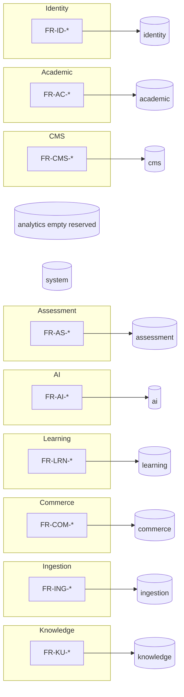

#### 24.14.2 FR count summary

| Domain | Count (this catalog) | Dominant status |
|---|---|---|
| Identity & Auth | 18 | Shipped |
| Academic | 8 | Shipped / Partial |
| CMS / ECAEP | 15 | Shipped |
| Assessment | 8 | Shipped / Partial |
| AI agents | 9 | Shipped / Partial |
| Learning | 9 | Shipped / Partial |
| Analytics | 4 | Shipped |
| Commerce | 6 | Shipped |
| System | 8 | Shipped |
| Ingestion | 9 | Shipped / Partial |
| Knowledge Units | 8 | Shipped / Partial |
| Search | 3 | Shipped |
| Student UX | 9 | Shipped / Partial |
| **Total** | **114** | |

## 25. Non-functional Requirements

NFR identifiers use `NFR-<AREA>-<NNN>`. Latency budgets and availability SLOs that have not been load-tested against production-like traffic in this repository are labeled **Enterprise Assumption**. They guide capacity planning; they are not certified measurements.

### 25.0 NFR quality model mapping

| ISO/IEC 25010-ish concern | TALOS NFR sections | Primary evidence in repo |
|---|---|---|
| Performance efficiency | 25.1 | Manual curl timings in sprint notes; no formal k6 suite yet |
| Compatibility / scalability | 25.2 | Modular monolith + single VPS compose |
| Reliability | 25.3 | Health/ready probes; Coolify restart policies |
| Security | 25.4 | JWT/CSRF/RBAC/rate limits/headers; ADR-0003/0018 |
| Privacy protection | 25.5 | Cookie auth; DPDP posture as assumption |
| Accessibility | 25.6 | WCAG orientation; shadcn/ui baseline |
| Maintainability | 25.8 | Module shape; Alembic; ADRs |
| Operability | 25.7, 25.10 | traceId envelope; docs/deploy/* |

### 25.1 Performance / latency budgets

#### NFR-PERF-001 — Interactive read API latency budget

**Description.** Authenticated read APIs for hierarchy navigation, mastery overview, published content lists, and attempt history SHOULD complete quickly enough for student UX under MVP concurrency.

**Measurement / verification.** Synthetic curl/browser checks during sprint verification; future k6/Locust suites.

**Priority (MoSCoW).** Should

**Source.** Enterprise capacity planning; SP1–SP8 verification practice

**Status.** Partial

**Enterprise Assumption.** p95 ≤ 300 ms for simple reads on CX22-class VPS with warm Postgres, excluding AI generation calls. Not load-tested in-repo.

---

#### NFR-PERF-002 — Auth endpoint latency under rate limit

**Description.** Login/register/refresh SHOULD remain usable for legitimate users while rate limiting rejects abusive bursts.

**Measurement / verification.** Redis fixed-window counters; observe 429/error rates in logs.

**Priority (MoSCoW).** Must

**Source.** ADR-0018

**Status.** Shipped

**Enterprise Assumption.** Rate-limit window sizing is operationally tunable; exact numeric thresholds are environment config, not a frozen ADR constant.

---

#### NFR-PERF-003 — Assessment submit + mastery recompute budget

**Description.** Attempt submission including scoring and synchronous mastery recompute SHOULD complete within an interactive wait bound for typical mock sizes at current content volumes.

**Measurement / verification.** SP6 design note: recompute bounded by question count in the attempt.

**Priority (MoSCoW).** Should

**Source.** ADR-0015

**Status.** Shipped

**Enterprise Assumption.** p95 ≤ 1.5 s for ≤50-question attempts on MVP hardware. Unmeasured formally.

---

#### NFR-PERF-004 — AI generation latency exemption

**Description.** AI Gateway calls (Tutor, QG, Planner, Evaluator, ingestion structuring/generation) are exempt from interactive read budgets; UX MUST show pending/fallback states.

**Measurement / verification.** ai.ai_requests.latency_ms aggregated in admin analytics.

**Priority (MoSCoW).** Must

**Source.** ADR-0014, ADR-0017

**Status.** Shipped

---

#### NFR-PERF-005 — Ingestion job batch latency

**Description.** Ingestion of one NCERT chapter is a batch job; completion time is dominated by multiple AI calls per section and is not an interactive SLA.

**Measurement / verification.** Job detail timestamps and counters in admin ingestion UI.

**Priority (MoSCoW).** Should

**Source.** ADR-0022–0025

**Status.** Shipped

**Enterprise Assumption.** Pilot chapter expected on the order of minutes when live Claude keys are configured; fallback mode is faster but not production-quality content.

---

#### NFR-PERF-006 — Analytics live aggregation cost

**Description.** Admin analytics overview MUST remain acceptable at MVP data volumes using live SQL aggregation without materialized rollups.

**Measurement / verification.** Page load of `/admin/analytics`; query plans if degraded.

**Priority (MoSCoW).** Should

**Source.** ADR-0017

**Status.** Shipped

**Enterprise Assumption.** If scans become slow at scale, then (and only then) populate reserved analytics schema with rollups.

---

#### NFR-PERF-007 — Frontend first-contentful experience

**Description.** Next.js App Router student pages SHOULD deliver usable first paint on broadband mobile without requiring AI calls for shell chrome.

**Measurement / verification.** Lighthouse/Web Vitals in future release engineering; currently browser click-through verification.

**Priority (MoSCoW).** Should

**Source.** ADR-0002, ADR-0008

**Status.** Partial

**Enterprise Assumption.** LCP ≤ 2.5 s on mid-tier Android for dashboard shell is an aspiration, not measured in CI.

---

### 25.2 Scalability

#### NFR-SCALE-001 — Vertical scale on single VPS first

**Description.** MVP scalability strategy is vertical scaling of a single Hetzner VPS running Postgres, Redis, API, and web via Coolify — not horizontal microservice fan-out.

**Measurement / verification.** Infrastructure compose topology; ADR-0006.

**Priority (MoSCoW).** Must

**Source.** ADR-0001, ADR-0006

**Status.** Shipped

**Enterprise Assumption.** CX22 (2 vCPU / 4GB) is the documented minimum starting point in RUNBOOK.md.

---

#### NFR-SCALE-002 — Modular monolith extraction readiness

**Description.** Module boundaries (api/services/repositories/models) MUST remain hard enough that a future extraction of a hot module is a refactor, not a rewrite.

**Measurement / verification.** Architecture review / dependency direction checks in code review.

**Priority (MoSCoW).** Must

**Source.** ADR-0001

**Status.** Shipped

---

#### NFR-SCALE-003 — Stateless app containers

**Description.** API and web containers SHOULD be replaceable; durable state lives in Postgres (and Redis for ephemeral rate limits/sessions support).

**Measurement / verification.** Prod compose has no bind-mounted writable app state for business data.

**Priority (MoSCoW).** Must

**Source.** ADR-0018

**Status.** Shipped

---

#### NFR-SCALE-004 — Content volume growth bound

**Description.** System MUST remain correct as ECAEP content grows; assessment pool size tracks published questions. Editorial capacity — not software — is the limiting factor for syllabus coverage (ADR-0005).

**Measurement / verification.** Coverage grid; published question counts.

**Priority (MoSCoW).** Must

**Source.** ADR-0005, ADR-0013

**Status.** Shipped

---

#### NFR-SCALE-005 — Defer premature distributed patterns

**Description.** CQRS, event-sourced buses, and per-domain microservices MUST NOT be introduced for scale theater before a concrete bottleneck is measured.

**Measurement / verification.** Architecture freeze / ADR process.

**Priority (MoSCoW).** Must

**Source.** ADR-0001, ADR-0007

**Status.** Shipped

---

### 25.3 Availability / SLOs

#### NFR-AVL-001 — MVP availability target

**Description.** Production MVP SHOULD target high business-hours availability for student practice; maintenance windows are acceptable for a single-VPS topology.

**Measurement / verification.** Uptime monitoring to be attached post first real Coolify deploy.

**Priority (MoSCoW).** Should

**Source.** ADR-0006; docs/deploy

**Status.** Planned

**Enterprise Assumption.** 99.0% monthly availability excluding planned maintenance is the planning target until multi-node HA is justified.

---

#### NFR-AVL-002 — Health and readiness probes

**Description.** Orchestrator MUST be able to distinguish liveness (`/health`) from readiness (`/ready`, including DB connectivity expectations as implemented).

**Measurement / verification.** RUNBOOK post-deploy checklist.

**Priority (MoSCoW).** Must

**Source.** ADR-0018; RUNBOOK.md

**Status.** Shipped

---

#### NFR-AVL-003 — Restart policy

**Description.** Prod compose services MUST use `restart: unless-stopped` (or equivalent Coolify restart behavior).

**Measurement / verification.** docker-compose.prod.yml review.

**Priority (MoSCoW).** Must

**Source.** ADR-0018

**Status.** Shipped

---

#### NFR-AVL-004 — Graceful degradation for AI

**Description.** When Anthropic is unavailable or key missing, AI features MUST degrade to FallbackProvider rather than taking down the whole API process.

**Measurement / verification.** Agent tests in fallback mode; ai analytics fallback rate.

**Priority (MoSCoW).** Must

**Source.** ADR-0014

**Status.** Shipped

---

#### NFR-AVL-005 — Honest degradation for payments

**Description.** When Razorpay keys are missing, commerce MUST fail closed (no order / no fake PAID), while non-commerce features remain available.

**Measurement / verification.** PAYMENT_GATEWAY_NOT_CONFIGURED path tests.

**Priority (MoSCoW).** Must

**Source.** ADR-0018

**Status.** Shipped

---

#### NFR-AVL-006 — Backup and restore posture

**Description.** Operators SHOULD maintain Postgres backups before risky migrations; restore drills are operational process.

**Measurement / verification.** docs/deploy/ROLLBACK.md guidance.

**Priority (MoSCoW).** Should

**Source.** docs/deploy/ROLLBACK.md

**Status.** Partial

**Enterprise Assumption.** Managed backup frequency (e.g., daily) is an ops assumption until a provider policy is contracted.

---

### 25.4 Security (OWASP orientation, Zero Trust principles in a modular monolith)

TALOS applies Zero Trust *principles* inside one deployable: never trust the client, authenticate every request, authorize every sensitive action, minimize token lifetime, and assume breach isolation via module boundaries and least-privilege DB roles where configured. This is not a claim of a full Zero Trust network product.

#### NFR-SEC-001 — OWASP A01 Broken Access Control

**Description.** Every privileged route MUST enforce permission checks (or SUPER_ADMIN bypass). Students MUST NOT access admin analytics, ingestion, or user management APIs.

**Measurement / verification.** Integration tests and SP8 permission boundary curl checks; continue expanding ADR-0020 coverage.

**Priority (MoSCoW).** Must

**Source.** ADR-0011, ADR-0017, ADR-0020

**Status.** Shipped

---

#### NFR-SEC-002 — OWASP A02 Cryptographic failures

**Description.** Passwords MUST be Argon2-hashed; refresh tokens hashed at rest; TLS termination expected at Coolify/Traefik edge in production.

**Measurement / verification.** Code review of AuthService; prod env requires HTTPS.

**Priority (MoSCoW).** Must

**Source.** ADR-0003, ADR-0006

**Status.** Shipped

**Enterprise Assumption.** Edge TLS is operational; app cookies assume Secure in production configuration.

---

#### NFR-SEC-003 — OWASP A03 Injection

**Description.** ORM parameterization via SQLAlchemy MUST be the default data access path; raw SQL requires review.

**Measurement / verification.** Code conventions; Ruff/CI.

**Priority (MoSCoW).** Must

**Source.** ADR-0002

**Status.** Shipped

---

#### NFR-SEC-004 — CSRF on cookie session mutations

**Description.** Browser clients using cookie auth MUST send CSRF double-submit tokens on mutating requests.

**Measurement / verification.** verify_csrf dependency on routers.

**Priority (MoSCoW).** Must

**Source.** SP1

**Status.** Shipped

---

#### NFR-SEC-005 — Security headers

**Description.** Responses MUST include nosniff, DENY framing, strict-origin-when-cross-origin referrer policy, and restrictive Permissions-Policy.

**Measurement / verification.** Middleware unit/integration coverage; manual header inspection.

**Priority (MoSCoW).** Must

**Source.** ADR-0018, ADR-0020

**Status.** Shipped

---

#### NFR-SEC-006 — Auth rate limiting

**Description.** Login/register/refresh MUST be rate-limited via Redis fixed windows keyed by IP+path.

**Measurement / verification.** Burst tests; 429 responses.

**Priority (MoSCoW).** Must

**Source.** ADR-0018

**Status.** Shipped

---

#### NFR-SEC-007 — Suspended and locked accounts

**Description.** Non-active status and locked_until MUST block authentication issuance.

**Measurement / verification.** Regression tests for ACCOUNT_SUSPENDED; ADR-0018 bugfix.

**Priority (MoSCoW).** Must

**Source.** ADR-0018

**Status.** Shipped

---

#### NFR-SEC-008 — Secrets management

**Description.** Production MUST supply secrets via environment (Coolify), never bake production credentials into images or commit `.env` secrets.

**Measurement / verification.** `.env.production.example` vs real Coolify panel; git hygiene.

**Priority (MoSCoW).** Must

**Source.** ADR-0018; RUNBOOK

**Status.** Shipped

---

#### NFR-SEC-009 — Payment signature integrity

**Description.** Order PAID transition MUST require HMAC verification with server-side secret; no client-asserted success.

**Measurement / verification.** Unit tests for verify_payment_signature.

**Priority (MoSCoW).** Must

**Source.** ADR-0018

**Status.** Shipped

---

#### NFR-SEC-010 — Non-root containers

**Description.** Backend production image MUST run as non-root user.

**Measurement / verification.** Dockerfile USER directive review.

**Priority (MoSCoW).** Must

**Source.** ADR-0018

**Status.** Shipped

---

#### NFR-SEC-011 — Dependency scanning in CI

**Description.** CI SHOULD run dependency review / CodeQL workflows as introduced under `.github/workflows`.

**Measurement / verification.** GitHub Actions results.

**Priority (MoSCoW).** Should

**Source.** ADR-0029; .github/workflows

**Status.** Shipped

---

#### NFR-SEC-012 — SUPER_ADMIN immutability

**Description.** SUPER_ADMIN permission set MUST NOT be editable through the role editor API.

**Measurement / verification.** ROLE_IMMUTABLE error path.

**Priority (MoSCoW).** Must

**Source.** roles_router

**Status.** Shipped

---

### 25.5 Privacy / data protection (India DPDP Act awareness)

TALOS processes personal data of students (identity, learning activity, payment references). Full legal certification is outside engineering ADRs; the following NFRs define the engineering compliance *posture*.

#### NFR-PRIV-001 — Data minimization in identity schema

**Description.** Identity stores profile fields needed for learning UX; deferred tables (addresses, etc.) MUST NOT be created until a feature requires them.

**Measurement / verification.** ADR-0011 schema inventory.

**Priority (MoSCoW).** Must

**Source.** ADR-0011

**Status.** Shipped

---

#### NFR-PRIV-002 — Purpose limitation for AI logs

**Description.** ai.ai_requests logs operational metrics (tokens, cost, latency, agent type). Prompts/PII retention policy SHOULD be reviewed before long-term production retention.

**Measurement / verification.** Table columns review; ops retention job (future).

**Priority (MoSCoW).** Should

**Source.** ADR-0014

**Status.** Partial

**Enterprise Assumption.** DPDP-aligned retention schedules are an Enterprise Assumption pending counsel review.

---

#### NFR-PRIV-003 — Cookie-based session storage

**Description.** Auth tokens MUST NOT be stored in localStorage by the official web app; HTTP-only cookies reduce XSS token theft surface.

**Measurement / verification.** Frontend auth client review.

**Priority (MoSCoW).** Must

**Source.** ADR-0003

**Status.** Shipped

---

#### NFR-PRIV-004 — Admin access auditing

**Description.** Privileged admin mutations SHOULD be attributable via system.audit_logs.

**Measurement / verification.** `/admin/audit-logs` and audit.view permission.

**Priority (MoSCoW).** Must

**Source.** ADR-0011; Admin Portal

**Status.** Shipped

---

#### NFR-PRIV-005 — Payment data minimization

**Description.** Commerce stores Razorpay order/payment identifiers and signature material needed for verification — not full card PANs (cards handled by Razorpay).

**Measurement / verification.** commerce.orders column review.

**Priority (MoSCoW).** Must

**Source.** ADR-0006, ADR-0018

**Status.** Shipped

---

#### NFR-PRIV-006 — DPDP rights request process

**Description.** Organization SHOULD maintain a process for access/erasure requests affecting identity and learning data.

**Measurement / verification.** Runbook/process docs (governance volume).

**Priority (MoSCoW).** Should

**Source.** Enterprise compliance posture

**Status.** Planned

**Enterprise Assumption.** Engineering soft-delete supports erasure workflows but is not automatic legal deletion.

---

### 25.6 Accessibility (WCAG orientation)

#### NFR-A11Y-001 — WCAG 2.2 Level AA orientation

**Description.** Student-facing UI SHOULD pursue WCAG 2.2 AA for core flows (login, practice, dashboard) using semantic HTML and shadcn/ui accessible primitives.

**Measurement / verification.** Manual keyboard navigation; future axe CI.

**Priority (MoSCoW).** Should

**Source.** ADR-0002 frontend stack

**Status.** Partial

**Enterprise Assumption.** Formal audit not completed in-repo; orientation is the requirement, not a certification claim.

---

#### NFR-A11Y-002 — Keyboard operable primary flows

**Description.** Login, registration, and attempt answering SHOULD be operable via keyboard.

**Measurement / verification.** Manual QA checklist.

**Priority (MoSCoW).** Should

**Source.** Product UX standard

**Status.** Partial

---

#### NFR-A11Y-003 — Language of UI vs content

**Description.** UI chrome remains English; when Hindi content is shown, page language handling SHOULD not mis-declare Hindi UI strings that do not exist.

**Measurement / verification.** ADR-0019 UX notes / fallback banner.

**Priority (MoSCoW).** Must

**Source.** ADR-0019

**Status.** Shipped

---

#### NFR-A11Y-004 — Motion and timing

**Description.** Mock timers MUST expose remaining time clearly; avoid seizure-inducing animation patterns in marketing or app chrome.

**Measurement / verification.** UI review.

**Priority (MoSCoW).** Should

**Source.** SP4 UX

**Status.** Partial

---

### 25.7 Observability (traceId envelope)

#### NFR-OBS-001 — Uniform response envelope

**Description.** All API responses MUST include success, data, meta, errors, traceId, timestamp.

**Measurement / verification.** envelope() in shared/responses.py; client typing.

**Priority (MoSCoW).** Must

**Source.** CLAUDE.md; responses.py

**Status.** Shipped

---

#### NFR-OBS-002 — traceId correlation

**Description.** Support and developers MUST be able to correlate a user-visible failure to server logs using traceId from the envelope.

**Measurement / verification.** RequestContextMiddleware + structured logging fields.

**Priority (MoSCoW).** Must

**Source.** SP0/SP1 middleware

**Status.** Shipped

---

#### NFR-OBS-003 — AI request telemetry

**Description.** Each AI call MUST log agent, model, tokens, estimated cost, latency, success to ai.ai_requests.

**Measurement / verification.** Admin AI analytics; SQL checks.

**Priority (MoSCoW).** Must

**Source.** ADR-0014, ADR-0017

**Status.** Shipped

---

#### NFR-OBS-004 — Ingestion job counters

**Description.** Ingestion jobs MUST expose counters for KU created/rejected, dedup drops, generation skips.

**Measurement / verification.** Admin job detail UI.

**Priority (MoSCoW).** Must

**Source.** ADR-0024, ADR-0025

**Status.** Shipped

---

#### NFR-OBS-005 — Audit trail for admin mutations

**Description.** Security-sensitive admin actions SHOULD write audit log rows.

**Measurement / verification.** audit.view UI.

**Priority (MoSCoW).** Must

**Source.** system audit service

**Status.** Shipped

---

#### NFR-OBS-006 — No full distributed tracing mandate yet

**Description.** OpenTelemetry mesh across microservices is out of scope while architecture remains a modular monolith; traceId + structured logs are the MVP standard.

**Measurement / verification.** Architecture decision.

**Priority (MoSCoW).** Must

**Source.** ADR-0001

**Status.** Shipped

---

### 25.8 Maintainability / Clean Architecture

#### NFR-MAINT-001 — Module internal shape

**Description.** Backend modules MUST follow api/services/repositories/models/schemas/tests structure consistent with identity as template.

**Measurement / verification.** Directory review for each module under apps/backend/app/modules.

**Priority (MoSCoW).** Must

**Source.** CLAUDE.md; ADR-0001

**Status.** Shipped

---

#### NFR-MAINT-002 — Alembic-only schema change

**Description.** Schema changes MUST ship as Alembic migrations; no hand-editing deployed schemas.

**Measurement / verification.** Migration files in repo; deploy runbook step.

**Priority (MoSCoW).** Must

**Source.** CLAUDE.md

**Status.** Shipped

---

#### NFR-MAINT-003 — ADR discipline

**Description.** Frozen decisions MUST be recorded as ADRs; agents and engineers MUST NOT re-litigate without a new ADR.

**Measurement / verification.** docs/decisions presence; conflict register in Volume 1 README.

**Priority (MoSCoW).** Must

**Source.** ADR-0001–0029; Volume README

**Status.** Shipped

---

#### NFR-MAINT-004 — Integration test infrastructure

**Description.** Backend MUST provide trinetra_test_db + SAVEPOINT isolation per ADR-0020 for regression-prone flows.

**Measurement / verification.** pytest suite green against test DB.

**Priority (MoSCoW).** Must

**Source.** ADR-0020

**Status.** Shipped

---

#### NFR-MAINT-005 — CI lint/test gates

**Description.** PRs SHOULD pass Ruff/tests configured in ADR-0029 workflows.

**Measurement / verification.** GitHub Actions.

**Priority (MoSCoW).** Should

**Source.** ADR-0029

**Status.** Shipped

---

#### NFR-MAINT-006 — Single frontend app

**Description.** Admin and student UX MUST live in one Next.js app (ADR-0008), not a separate admin SPA deployable.

**Measurement / verification.** apps/web route tree.

**Priority (MoSCoW).** Must

**Source.** ADR-0008

**Status.** Shipped

---

#### NFR-MAINT-007 — Pydantic body schemas for CMS types

**Description.** New content types MUST add a Pydantic JSONB body schema rather than a new table family (ADR-0009).

**Measurement / verification.** cms schemas review.

**Priority (MoSCoW).** Must

**Source.** ADR-0009

**Status.** Shipped

---

### 25.9 AI safety / grounding / cost controls

#### NFR-AI-001 — Grounding via ECAEP + Knowledge Units

**Description.** Student-visible generated learning assets MUST originate from ECAEP publish gates; ingestion generation MUST consume PASSED Knowledge Units, not raw unchecked PDF text after cutover.

**Measurement / verification.** ADR-0025 behavior; Tutor published-only reads.

**Priority (MoSCoW).** Must

**Source.** ADR-0009, ADR-0024, ADR-0025, ecaep.md

**Status.** Shipped

---

#### NFR-AI-002 — Mechanical source verification

**Description.** KU structured_facts MUST pass grounding_check overlap against source text before PASSED.

**Measurement / verification.** knowledge tests test_grounding_check.

**Priority (MoSCoW).** Must

**Source.** ADR-0024

**Status.** Shipped

---

#### NFR-AI-003 — QG never auto-publishes

**Description.** Question Generator MUST create DRAFT items only.

**Measurement / verification.** Service path through ContentWorkflowService.create_item.

**Priority (MoSCoW).** Must

**Source.** ADR-0004, ADR-0014

**Status.** Shipped

---

#### NFR-AI-004 — Cost visibility

**Description.** Estimated AI cost MUST be queryable by admins; rates are approximate.

**Measurement / verification.** analytics AI panel.

**Priority (MoSCoW).** Must

**Source.** ADR-0014, ADR-0017

**Status.** Shipped

---

#### NFR-AI-005 — Fallback labeling

**Description.** FallbackProvider outputs MUST be clearly labeled so operators/students do not mistake them for live model answers in verification contexts.

**Measurement / verification.** Fallback string conventions in provider.

**Priority (MoSCoW).** Must

**Source.** ADR-0014

**Status.** Shipped

---

#### NFR-AI-006 — No hallucinated PYQ years

**Description.** Ingestion/QG MUST NOT invent previous-year exam attributions without a grounded dataset.

**Measurement / verification.** ADR-0023 explicit deferral.

**Priority (MoSCoW).** Must

**Source.** ADR-0023

**Status.** Shipped

---

#### NFR-AI-007 — Provider abstraction anti-lock-in

**Description.** Claude is the only wired provider; interface MUST allow adding OpenAI/Gemini later without redesign.

**Measurement / verification.** AIProvider ABC review.

**Priority (MoSCoW).** Must

**Source.** ADR-0004

**Status.** Shipped

---

#### NFR-AI-008 — Hindi AI generation caution

**Description.** AI QG remains English-only until live-key verification of Hindi quality is possible; Hindi content is human-authored through ECAEP in ADR-0019.

**Measurement / verification.** QG language behavior; admin language dropdown for humans.

**Priority (MoSCoW).** Must

**Source.** ADR-0019

**Status.** Shipped

---

### 25.10 Operability (Coolify, runbooks under docs/deploy/)

Operability artifacts exist even when a live VPS has not been exercised from the authoring environment. RUNBOOK.md states this honesty explicitly.

#### NFR-OPS-001 — Deploy runbook completeness

**Description.** Repository MUST contain RUNBOOK with prerequisites, Coolify steps, env vars, Alembic migration step, and post-deploy health checks.

**Measurement / verification.** docs/deploy/RUNBOOK.md present and reviewed.

**Priority (MoSCoW).** Must

**Source.** ADR-0018, ADR-0006

**Status.** Shipped

---

#### NFR-OPS-002 — Rollback guidance

**Description.** Operators SHOULD follow docs/deploy/ROLLBACK.md for failed releases.

**Measurement / verification.** Document presence.

**Priority (MoSCoW).** Should

**Source.** docs/deploy/ROLLBACK.md

**Status.** Shipped

---

#### NFR-OPS-003 — Verification checklist

**Description.** Release verification SHOULD use docs/deploy/VERIFICATION_CHECKLIST.md and TEST_REPORT patterns.

**Measurement / verification.** Checklist execution records.

**Priority (MoSCoW).** Should

**Source.** docs/deploy/*

**Status.** Shipped

---

#### NFR-OPS-004 — CI/CD documentation

**Description.** docs/deploy/CI_CD.md and ADR-0029 MUST describe pipeline expectations.

**Measurement / verification.** Doc + workflow alignment.

**Priority (MoSCoW).** Must

**Source.** ADR-0029

**Status.** Shipped

---

#### NFR-OPS-005 — Prod compose parity

**Description.** docker-compose.prod.yml MUST omit dev bind mounts and baked credentials.

**Measurement / verification.** Compose file review.

**Priority (MoSCoW).** Must

**Source.** ADR-0018

**Status.** Shipped

---

#### NFR-OPS-006 — Test database bootstrap docs

**Description.** database/setup.md (or equivalent) MUST document trinetra_test_db creation for integration tests.

**Measurement / verification.** ADR-0020 consequences section.

**Priority (MoSCoW).** Must

**Source.** ADR-0020

**Status.** Shipped

---

#### NFR-OPS-007 — Single-VPS operational simplicity

**Description.** Operational complexity MUST remain compatible with a small team running Coolify; introducing Kubernetes is out of MVP ops scope.

**Measurement / verification.** Hosting ADR.

**Priority (MoSCoW).** Must

**Source.** ADR-0006

**Status.** Shipped

---

### 25.11 NFR traceability matrix (summary)

| NFR ID | Category | Priority | Status | Primary ADR/Doc |
|---|---|---|---|---|
| NFR-PERF-001..007 | Performance | Should/Must | Partial/Shipped | ADR-0015/0014; assumptions |
| NFR-SCALE-001..005 | Scalability | Must | Shipped | ADR-0001/0006 |
| NFR-AVL-001..006 | Availability | Should/Must | Mixed | RUNBOOK; ADR-0014/0018 |
| NFR-SEC-001..012 | Security | Must/Should | Shipped | ADR-0003/0018/0020/0029 |
| NFR-PRIV-001..006 | Privacy | Must/Should | Mixed | ADR-0011; DPDP posture |
| NFR-A11Y-001..004 | Accessibility | Should/Must | Partial | ADR-0019; WCAG orientation |
| NFR-OBS-001..006 | Observability | Must | Shipped | envelope; ai_requests |
| NFR-MAINT-001..007 | Maintainability | Must/Should | Shipped | CLAUDE.md; ADR-0020/0029 |
| NFR-AI-001..008 | AI safety | Must | Shipped | ADR-0004/0014/0024/0025 |
| NFR-OPS-001..007 | Operability | Must/Should | Shipped | docs/deploy/* |
## 26. Business Rules

Business rules (BR-IDs) are normative policies. When code and this catalog disagree, fix the defect or amend via ADR — do not silently diverge.

### 26.1 Business rules catalog

#### BR-ID-001 — Argon2 password hashing

**Rule.** User passwords must be hashed with Argon2 before persistence; plaintext passwords must never be stored or logged.

**Rationale.** Industry baseline and ADR-0003 frozen auth strategy.

**Enforcement.** AuthService hashing on register/password change; verification on login.

**Exceptions.** None.

**Source.** ADR-0003

---

#### BR-ID-002 — Access token short lifetime

**Rule.** JWT access tokens are short-lived (~10–15 minutes).

**Rationale.** Limits replay window if an access token is exfiltrated.

**Enforcement.** Token issuance configuration in identity module.

**Exceptions.** None.

**Source.** ADR-0003

---

#### BR-ID-003 — Refresh token rotation

**Rule.** Each successful refresh rotates the opaque refresh token; prior token becomes invalid; tokens stored hashed at rest.

**Rationale.** Detects reuse and reduces long-lived bearer risk.

**Enforcement.** Refresh endpoint + refresh_tokens repository.

**Exceptions.** None.

**Source.** ADR-0003, ADR-0011

---

#### BR-ID-004 — HTTP-only cookie transport

**Rule.** Official clients store auth tokens in HTTP-only Secure SameSite cookies, not localStorage.

**Rationale.** Mitigates XSS token theft.

**Enforcement.** Auth API Set-Cookie + web auth client.

**Exceptions.** None.

**Source.** ADR-0003

---

#### BR-ID-005 — CSRF double-submit on mutations

**Rule.** Cookie-authenticated state-changing requests require CSRF validation.

**Rationale.** Mitigates cross-site request forgery against cookie sessions.

**Enforcement.** verify_csrf dependency.

**Exceptions.** None.

**Source.** SP1

---

#### BR-ID-006 — RBAC permission checks

**Rule.** Privileged operations require named permission codes unless caller is SUPER_ADMIN.

**Rationale.** Least privilege for admin/content operations.

**Enforcement.** require_permission dependency; seed catalog.

**Exceptions.** None.

**Source.** ADR-0011; seed.py

---

#### BR-ID-007 — SUPER_ADMIN bypass and immutability

**Rule.** SUPER_ADMIN bypasses permission checks; its permission mapping cannot be edited via API.

**Rationale.** Break-glass role must remain fully privileged and non-self-damaging.

**Enforcement.** Authz middleware + ROLE_IMMUTABLE on permission PATCH.

**Exceptions.** None.

**Source.** roles_router; seed

---

#### BR-ID-008 — Suspended users cannot login

**Rule.** If user.status is not active, authenticate must fail with ACCOUNT_SUSPENDED (checked with lockout).

**Rationale.** Admin suspension must be immediately effective at credential issuance.

**Enforcement.** AuthService.authenticate per ADR-0018 fix.

**Exceptions.** None.

**Source.** ADR-0018

---

#### BR-ID-009 — ECAEP before student-visible publish

**Rule.** CMS learning content types become student-visible only after PUBLISHED workflow state (or equivalent published current version).

**Rationale.** Quality, licensing, and pedagogical review gate.

**Enforcement.** ContentWorkflowService transitions; published read APIs filter status.

**Exceptions.** None.

**Source.** ADR-0009; ecaep.md

---

#### BR-ID-010 — Question Generator never auto-publishes

**Rule.** QG outputs must be DRAFT content items entering the same human review pipeline.

**Rationale.** Prevents unchecked model errors from reaching students.

**Enforcement.** QG calls create_item only; no publish call in agent.

**Exceptions.** None.

**Source.** ADR-0004, ADR-0014

---

#### BR-ID-011 — Tutor reads PUBLISHED / PASSED KU only

**Rule.** Tutor grounding inputs are published CMS notes/questions as applicable and PASSED Knowledge Units — never DRAFT CMS or FAILED KUs.

**Rationale.** Hallucination and unreviewed content control.

**Enforcement.** TutorService retrieval filters; KU validation_status.

**Exceptions.** None.

**Source.** ecaep.md; ADR-0024/0025/0028

---

#### BR-ID-012 — NEET-style mock scoring

**Rule.** MOCK assessments score +4 for correct, −1 for incorrect, 0 for unanswered. PRACTICE does not apply negative marking.

**Rationale.** Aligns with NEET UG marking scheme for mocks; practice is formative.

**Enforcement.** AssessmentService scoring on submit.

**Exceptions.** None.

**Source.** ADR-0013, SP4

---

#### BR-ID-013 — Assessments use published questions only

**Rule.** Generated PRACTICE/MOCK selections may only include PUBLISHED questions.

**Rationale.** Editorial truth remains ECAEP.

**Enforcement.** Assessment generation queries.

**Exceptions.** None.

**Source.** ADR-0013

---

#### BR-ID-014 — Premium entitlement equals PAID order

**Rule.** A user is premium iff at least one commerce.orders row exists with status PAID for that user_id. No duplicated is_premium flag on users.

**Rationale.** Single source of truth; clean module write boundaries.

**Enforcement.** GET commerce/status computation.

**Exceptions.** None.

**Source.** ADR-0018

---

#### BR-ID-015 — No fake payment success

**Rule.** Absence of Razorpay keys must not create PAID orders or simulate checkout success.

**Rationale.** Financial flows must not train a fake-success path into the codebase.

**Enforcement.** Order create guard returning PAYMENT_GATEWAY_NOT_CONFIGURED.

**Exceptions.** None.

**Source.** ADR-0018

---

#### BR-ID-016 — HMAC verification required for PAID

**Rule.** Order status becomes PAID only after verify_payment_signature succeeds.

**Rationale.** Prevents client-side spoofing of payment completion.

**Enforcement.** Verify endpoint + pure HMAC function.

**Exceptions.** None.

**Source.** ADR-0018

---

#### BR-ID-017 — Soft delete convention

**Rule.** Domain rows use deleted_at soft delete where the shared pattern applies; hard deletes are exceptional.

**Rationale.** Auditability and recovery.

**Enforcement.** Repository queries filter deleted_at unless explicitly including deleted.

**Exceptions.** None.

**Source.** CLAUDE.md table pattern

---

#### BR-ID-018 — Optimistic versioning

**Rule.** Entities carrying version INT participate in optimistic concurrency where implemented.

**Rationale.** Prevents silent overwrites.

**Enforcement.** Model mixin / update paths.

**Exceptions.** None.

**Source.** CLAUDE.md

---

#### BR-ID-019 — Licensing — no unlicensed coaching material

**Rule.** Do not ingest or publish Aakash/Allen/PW/Unacademy or other copyrighted coaching material without signed license. NCERT-aligned original wording, in-house authorship, and permitted PYQ use only.

**Rationale.** Legal exposure control.

**Enforcement.** Product scope; ingestion limited to StudyMaterial NCERT PDFs; no coaching bank importer.

**Exceptions.** None.

**Source.** ADR-0005, ADR-0022

---

#### BR-ID-020 — Content language vs UI language

**Rule.** Content items may be en/hi; UI chrome remains English; hierarchy names remain English; missing translations fall back to English with language_fallback flag.

**Rationale.** Delivers Hindi learning value without full UI i18n cost.

**Enforcement.** CMS published endpoints + Settings preferred_language.

**Exceptions.** None.

**Source.** ADR-0019

---

#### BR-ID-021 — Mastery level thresholds

**Rule.** NOT_STARTED if attempts_count==0; LEARNING if attempts_count<3; MASTERED if score>=80; else PRACTICING.

**Rationale.** Prevents single-guess mastery flips.

**Enforcement.** MasteryService pure functions.

**Exceptions.** None.

**Source.** ADR-0015

---

#### BR-ID-022 — Revision intervals by mastery level

**Rule.** LEARNING→1 day; PRACTICING→3 days; MASTERED→7 days; NOT_STARTED→no schedule.

**Rationale.** Simple spaced resurfacing without SM-2 complexity.

**Enforcement.** next_review_at on recompute.

**Exceptions.** None.

**Source.** ADR-0016

---

#### BR-ID-023 — Recommendation ranking order

**Rule.** due_for_revision, then weak_concept, then new_concept in curriculum order; default cap 5.

**Rationale.** Deterministic, explainable recommendations.

**Enforcement.** get_recommendations service.

**Exceptions.** None.

**Source.** ADR-0016

---

#### BR-ID-024 — No KU, no ingestion generation

**Rule.** After ADR-0025 cutover, if a section lacks a PASSED Knowledge Unit, generators skip that section/concept/chapter asset rather than reading raw_text.

**Rationale.** Enforces AI Content Lifecycle grounding.

**Enforcement.** ingestion_pipeline_service skip counters.

**Exceptions.** None.

**Source.** ADR-0025

---

#### BR-ID-025 — Idempotent ingestion by checksum

**Rule.** Re-running ingestion on an unchanged file (same sha256) is a no-op.

**Rationale.** Prevents duplicate DRAFT floods.

**Enforcement.** IngestionJob checksum check.

**Exceptions.** None.

**Source.** ADR-0022

---

#### BR-ID-026 — Dedup threshold for generated stems

**Rule.** Generated question stems exceeding trigram similarity threshold (~0.6) against existing published stems for the same concept are dropped.

**Rationale.** Reduces near-duplicate questions.

**Enforcement.** ingestion_repository similarity query.

**Exceptions.** None.

**Source.** ADR-0022

---

#### BR-ID-027 — One-time commerce only in current target

**Rule.** No subscriptions/recurring billing objects in current production target.

**Rationale.** Avoids dunning complexity before packaging decisions.

**Enforcement.** Schema and API surface limited to one-time orders.

**Exceptions.** None.

**Source.** ADR-0018

---

#### BR-ID-028 — Analytics schema remains empty until needed

**Rule.** Admin analytics must aggregate live; do not invent rollup tables before scale pain.

**Rationale.** Avoid duplicate truth.

**Enforcement.** analytics module has no models.

**Exceptions.** None.

**Source.** ADR-0017

---

#### BR-ID-029 — Canonical product naming

**Rule.** Product references must use Trinetra AI Learning OS (TALOS); NEET is the first vertical. 'AI Learning OS' alone is a naming defect.

**Rationale.** Brand consistency (ADR-0010).

**Enforcement.** Docs/code review.

**Exceptions.** None.

**Source.** ADR-0010

---

#### BR-ID-030 — Integration tests use dedicated DB + SAVEPOINT

**Rule.** Automated integration tests run against trinetra_test_db with SAVEPOINT isolation; never target the shared dev database.

**Rationale.** Prevents data leakage and false confidence.

**Enforcement.** conftest.py env override + transaction pattern.

**Exceptions.** None.

**Source.** ADR-0020

---

### 26.2 ECAEP state machine (Mermaid)

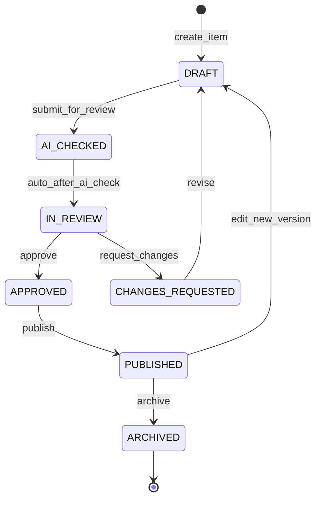

Notes:

- AI_CHECKED is typically transient; Evaluator report is stored on the version.
- Editing PUBLISHED creates a new DRAFT version; prior published version remains live until the new version is published (`docs/architecture/ecaep.md`).
- `force_edit_published` is a break-glass permission, not a separate happy-path state.

### 26.3 ECAEP state machine (PlantUML)

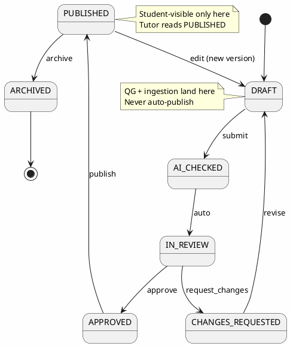

### 26.4 Commerce order payment state machine (Mermaid)

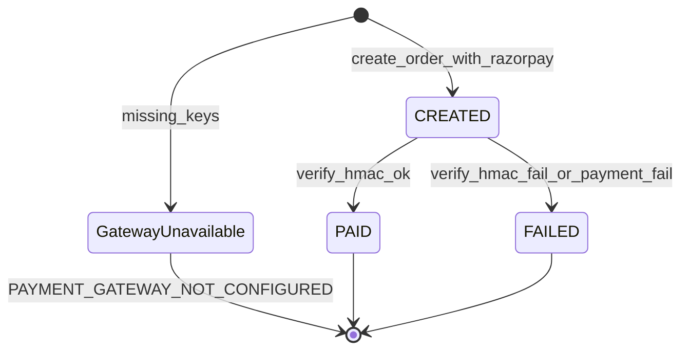

### 26.5 Commerce order payment state machine (PlantUML)

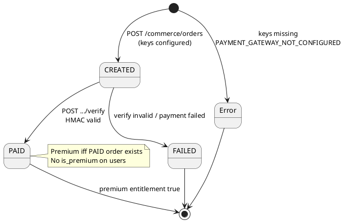

### 26.6 Mastery level state machine (Mermaid)

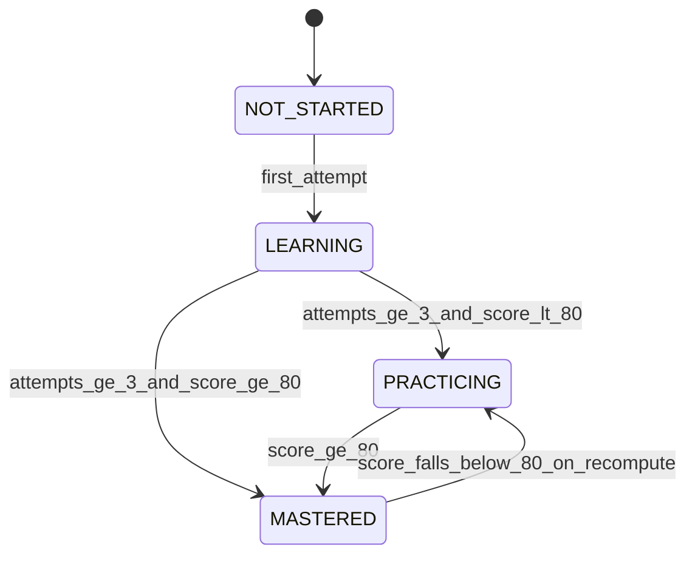

### 26.7 Knowledge Unit validation (Mermaid)

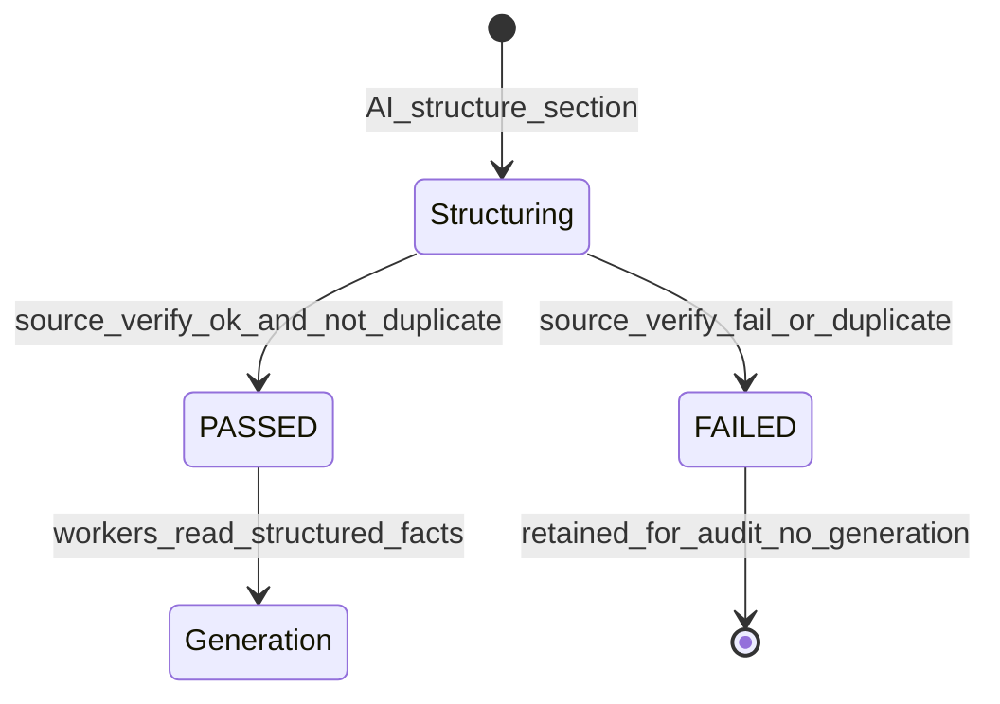

### 26.8 Business rules → FR/NFR traceability

| BR-ID | Related FR-IDs | Related NFR-IDs |
|---|---|---|
| BR-ID-001..005 | FR-ID-002..005,014 | NFR-SEC-002,004 |
| BR-ID-006..008 | FR-ID-006..008,012 | NFR-SEC-001,007,012 |
| BR-ID-009..011 | FR-CMS-*, FR-AI-003/005, FR-KU-* | NFR-AI-001..003 |
| BR-ID-012..013 | FR-AS-* | NFR-PERF-003 |
| BR-ID-014..016 | FR-COM-* | NFR-SEC-009; NFR-AVL-005 |
| BR-ID-017..018 | (cross-cutting) | NFR-MAINT-002 |
| BR-ID-019 | FR-CMS-014, FR-ING-008 | NFR-PRIV / legal |
| BR-ID-020 | FR-ID-016, FR-CMS-010, FR-UX-008 | NFR-A11Y-003 |
| BR-ID-021..023 | FR-LRN-* | — |
| BR-ID-024..026 | FR-ING-*, FR-KU-* | NFR-AI-001,002 |
| BR-ID-027..028 | FR-COM-004, FR-AN-* | NFR-SCALE-005 |
| BR-ID-029 | (naming) | — |
| BR-ID-030 | (QA) | NFR-MAINT-004 |
## 27. Product Scope

### 27.1 Scope statement

**In scope for the current production target** is the union of:

1. **SP0–SP9** as marked **done** in `docs/architecture/roadmap.md`, and  
2. **Phase 2 shipped ADR slices** that have been accepted and implemented: multi-language content Hindi (ADR-0019), integration test infrastructure (ADR-0020), micro-competency layer (ADR-0021), ingestion pipeline Phase 0 + generate-many (ADR-0022/0023), Knowledge Unit foundation and cutover (ADR-0024/0025), visual assets (ADR-0026), LanguageService (ADR-0027), Educational Knowledge Unit formalization phases that are implemented per ADR-0028 self-review, and CI/CD (ADR-0029).

This is the finish line for “AI-first NEET platform with real students” validation on a Coolify/Hetzner MVP — not the BRD’s 280-table enterprise vision.

### 27.2 Capability inventory table

| Capability | Domain | Status | Primary evidence |
|---|---|---|---|
| Dockerized FastAPI + Next.js foundation | Platform | Shipped | SP0 |
| Postgres 17+ schemas reserved/used | Data | Shipped | migrations; CLAUDE.md |
| Redis connected | Platform | Shipped | rate limits; SP0 |
| Register/login/refresh/logout | Identity | Shipped | SP1 |
| CSRF double-submit | Identity | Shipped | SP1 |
| RBAC + SUPER_ADMIN | Identity | Shipped | seed.py |
| Suspended login denial | Identity | Shipped | ADR-0018 |
| Admin user role/status UI | Identity | Shipped | `/admin/users` |
| NEET academic hierarchy | Academic | Shipped | SP2 |
| Micro-competencies under concept | Academic | Shipped | ADR-0021 |
| Concept prerequisites table | Academic | Partial | ADR-0028 Phase E blocked |
| ECAEP workflow end-to-end | CMS | Shipped | SP3 |
| Six content types | CMS | Shipped | ADR-0009 |
| Coverage grid | CMS | Shipped | `/admin/coverage` |
| Hindi content + EN fallback | CMS/Identity | Shipped | ADR-0019 |
| Practice assessments | Assessment | Shipped | SP4 |
| Mock +4/−1 scoring | Assessment | Shipped | SP4 |
| AI Gateway + Claude/Fallback | AI | Shipped | ADR-0014 |
| Tutor / QG / Planner / Evaluator | AI | Shipped | SP5 |
| Concept + topic mastery | Learning | Shipped | SP6 |
| Micro-competency mastery | Learning | Shipped | ADR-0021 |
| KU mastery | Learning | Partial | ADR-0028 Phase D |
| Revision due + recommendations | Learning | Shipped | SP7 |
| Admin assessment + AI analytics | Analytics | Shipped | SP8 (schema empty) |
| Razorpay one-time + HMAC | Commerce | Shipped | ADR-0018 |
| Premium status API | Commerce | Shipped | ADR-0018 |
| Rate limits + security headers | System | Shipped | ADR-0018 |
| Audit logs UI | System | Shipped | `/admin/audit-logs` |
| Coolify prod compose + runbook | Ops | Shipped | docs/deploy |
| CI/CD GitHub Actions | Ops | Shipped | ADR-0029 |
| NCERT PDF ingestion pilot | Ingestion | Shipped | ADR-0022+ |
| Visual assets admin | Ingestion | Partial | ADR-0026 |
| Knowledge Units + gates | Knowledge | Shipped | ADR-0024/0025 |
| Admin search console | Search | Shipped | `/admin/search` |
| Bookmarks / notes / flashcards / explain | Student UX | Shipped | learning + web routes |
| Integration tests SAVEPOINT | QA | Shipped | ADR-0020 |
| Organizations table reserved | Tenancy | Reserved only | ADR-0007 — not wired |

### 27.3 Module boundary diagram (PlantUML)

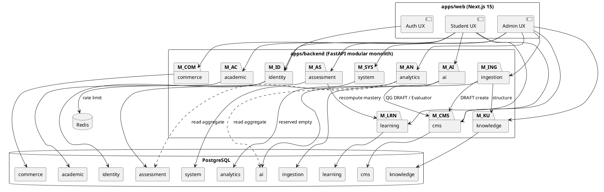

### 27.4 Module boundary diagram (Mermaid)

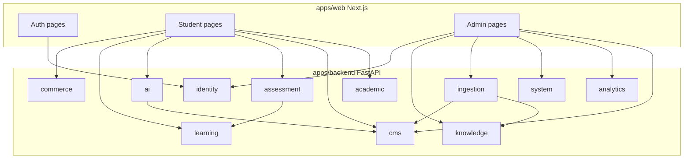

### 27.5 API envelope (normative)

```json
{
  "success": true,
  "data": {},
  "meta": {},
  "errors": [],
  "traceId": "uuid-or-request-id",
  "timestamp": "2026-08-07T00:00:00+00:00"
}
```

Implemented by `app/shared/responses.py` `envelope()`.

### 27.6 PostgreSQL schema inventory (in-scope)

| Schema | Role in production target | Notes |
|---|---|---|
| identity | Users, roles, permissions, refresh tokens, login history | ADR-0011 |
| academic | Exam…concept, micro_competencies, concept_prerequisites | ADR-0012/0021/0028 |
| cms | content_items/versions/reviews, KU join, reports | ADR-0009/0025 |
| assessment | assessments, attempts, attempt_answers | ADR-0013 |
| ai | ai_requests, study plans as implemented | ADR-0014 |
| analytics | **Empty reserved** | ADR-0017 |
| commerce | orders | ADR-0018 |
| system | audit_logs | ADR-0011 |
| learning | concept/micro/KU mastery, bookmarks, notes | ADR-0015+ |
| ingestion | jobs, sections, visual_assets | ADR-0022/0026 |
| knowledge | knowledge_units | ADR-0024 |

### 27.7 UI route inventory (in-scope)

**Public/Auth:** `/`, `/login`, `/register`, `/forgot-password`, `/reset-password`, `/verify-email`  

**Student:** `/student/dashboard`, `/student/subjects/**`, `/student/chapters/[chapterId]`, `/student/topics/[topicId]`, `/student/concepts/[conceptId]`, `/student/practice`, `/student/mock-tests`, `/student/attempts/**`, `/student/study-plan`, `/student/questions/**`, `/student/flashcards`, `/student/profile`, `/student/settings`  

**Admin:** `/admin`, `/admin/users`, `/admin/content/**`, `/admin/coverage`, `/admin/analytics`, `/admin/audit-logs`, `/admin/search`, `/admin/ai-review`, `/admin/ingestion/**`, `/admin/knowledge-units/**`, `/admin/visual-assets`

### 27.8 Roles in scope

| Role | Intent |
|---|---|
| SUPER_ADMIN | Full bypass |
| ADMIN | Operational administration |
| CONTENT_MANAGER | Editorial leadership |
| TEACHER | Create/submit content; reports.view reserved |
| STUDENT | Default learner |
| SUPPORT | Read-oriented support |

## 28. Out of Scope

### 28.1 Explicit out-of-scope register

Items below are **not** part of the current production target. Many remain desirable Phase 2/3 backlog. Inclusion requires a new or amended ADR plus capacity.

| OOS-ID | Item | Source | Value if built | Cost / why deferred |
|---|---|---|---|---|
| OOS-001 | Enterprise Knowledge Graph / Domain Ontology | ADR-0007 | High long-term personalization value | Very high modeling + tooling cost before product-market fit; not load-bearing for MVP validation |
| OOS-002 | Full 4-layer competency model (~21k micro-competencies) | ADR-0007; ADR-0021 scopes one thin layer instead | Fine-grained pedagogy | Authoring impossibility at MVP; ADR-0021 ships handful-per-concept instead |
| OOS-003 | Student Digital Twin | ADR-0007 | Deep longitudinal learner model | Requires KG + rich telemetry + research investment disproportionate to MVP |
| OOS-004 | Multi-tenancy wiring (tenant_id everywhere) | ADR-0007; organizations table reserved only | B2B institutes later | Cross-cutting cost now with zero current tenants |
| OOS-005 | 12-agent AI orchestrator (Mentor, Diagram Agent, etc.) | ADR-0004, ADR-0007 | Broader AI OS narrative | Four agents suffice for Tutor/QG/Plan/Evaluate loop; orchestration complexity unjustified |
| OOS-006 | Full UI internationalization | ADR-0019 explicitly excludes | Broader accessibility/market | Translation-key system across all chrome; Hindi content delivers primary learning value cheaper |
| OOS-007 | Native mobile apps (iOS/Android) | ADR-0007 | Distribution | Web-first/PWA-capable path; dual native stacks multiply cost |
| OOS-008 | Voice tutor | ADR-0007 | Engagement | ASR/TTS pipeline + UX; not needed to validate core learning loop |
| OOS-009 | AI-generated video | ADR-0007 | Media richness | Generation + storage + moderation cost extreme vs notes/questions |
| OOS-010 | Live classes | ADR-0007 | Coaching substitute features | Realtime infra + ops; different product |
| OOS-011 | Parent / institution portals | ADR-0007 | B2B/B2F oversight | Needs tenancy + reporting product; TEACHER reports.view intentionally unused |
| OOS-012 | Embeddings / RAG with pgvector | ADR-0024/0028 Phase F deferred; extension reserved conceptually | Semantic retrieval at scale | pg_trgm + KU grounding adequate now; vector ops need extension+ops maturity |
| OOS-013 | 24/7 OCR file watcher over StudyMaterial | ADR-0022 deferral | Unattended ingestion | Pilot PDFs are born-digital; watcher before quality proof is waste |
| OOS-014 | DOCX/PPTX/ZIP/RAR ingestion | ADR-0022 | Broader corpus | PDF pilot first; format explosion before loop works |
| OOS-015 | CQRS / event sourcing | Not implemented; architecture freeze | Extreme write-scale patterns | No evidenced bottleneck; complexity tax |
| OOS-016 | Microservices split | ADR-0001 forbids for current scale | Independent deploy scaling | One team/one deploy; network overhead without payoff |
| OOS-017 | Auth.js as auth system | ADR-0003 | Ecosystem convenience | Conflicts with backend-issued JWT + rotating refresh design |
| OOS-018 | Fake payment sandbox success path in app code | ADR-0018 deliberate break from AI fallback pattern | Dev convenience | Trains dangerous fake-success into financial flow |
| OOS-019 | Stripe / Apple / Google Play billing | ADR-0006 | International expansion | India-first Razorpay sufficient until expansion is real |
| OOS-020 | Subscriptions / dunning / plan upgrades | ADR-0018 | Recurring revenue mechanics | One-time Premium rail first; packaging undecided |
| OOS-021 | Paywalling features silently in SP9 | ADR-0018 | Monetization | Business packaging decision deferred; rail shipped honestly |
| OOS-022 | Adaptive tests / weekly-daily scheduled tests | ADR-0013 deferrals | Personalization of assessment | Needs richer scheduling product; mocks/practice first |
| OOS-023 | Server-side hard time-limit enforcement | ADR-0013 | Anti-cheat for competitive exams | Client timer sufficient for formative MVP; revisit if graded stakes rise |
| OOS-024 | SM-2 / ML recommendations / push reminders | ADR-0016 | Optimal spacing | Fixed intervals + dashboard cards validate behavior cheaper |
| OOS-025 | Analytics CSV export / arbitrary date ranges | ADR-0017 | BI comfort | Live overview enough; BI tool territory later |
| OOS-026 | Materialized analytics schema population | ADR-0017 | Scale | Empty reserved until live aggregates hurt |
| OOS-027 | Mind maps / concept maps as generated DIAGRAM images | ADR-0023 | Visual learning | DIAGRAM requires image_url; text pipeline cannot honestly fill it |
| OOS-028 | PYQ year fabrication / mapping without dataset | ADR-0023 | Exam authenticity marketing | Would violate no-hallucinated-info bar |
| OOS-029 | Standalone Explanation entity | ADR-0028 deferred | Queryable explanations corpus | No second consumer; question body + KU summary suffice |
| OOS-030 | devices / password_history / preferences / addresses tables | ADR-0011 deferred | Account sophistication | Not load-bearing; additive later |
| OOS-031 | Unit / Subtopic academic layers | ADR-0012 deferred | Curriculum org fidelity | Five levels enough; additive migration later |
| OOS-032 | Separate admin frontend application | ADR-0008 | Team separation | One Next.js app reduces deploy/auth duplication |
| OOS-033 | AWS/Azure/GCP as primary MVP hosting | ADR-0006 | Cloud pedigree | Coolify+Hetzner lowest cost until scale forces move |
| OOS-034 | Payment gateway abstraction layer | ADR-0006 | Multi-PSP | Yagni until second gateway is real |
| OOS-035 | Concept Graph authoring UX (Phase E) | ADR-0028 open question | Prerequisite guidance | Blocked on who authors edges; table may exist without productization |

### 28.2 Out-of-scope principles

1. **Finish line over vision inflation** — ADR-0007 exists so MVP can end.
2. **No placeholder columns for unearned capabilities** — e.g., no fake embedding column (ADR-0024).
3. **No fake success in money paths** — even if AI fallback is allowed (ADR-0018).
4. **Additive reopenings only** — Unit/Subtopic/devices/pgvector are migrations when earned, not redesigns.
5. **Naming freeze** — do not reintroduce Auth.js, microservices, or 'AI Learning OS' branding as current scope.

### 28.3 Relationship to BRD

BRD.docx remains a **backlog/vision** artifact (~enterprise scale). Part D scope is the phased plan + accepted Phase 2 ADRs. When BRD and ADRs conflict, ADRs win (Volume 1 README conflict register).

### 28.4 Mermaid — in-scope vs out-of-scope map

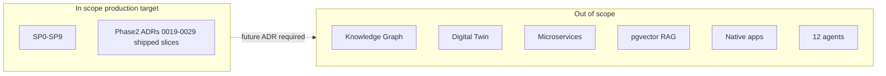
## 29. Assumptions

Assumptions are numbered `ASSUM-ID-###`. They are believed true for planning; each lists impact if false and how to validate.

#### ASSUM-ID-001 — Market — NEET-UG primary

**Statement.** The first revenue-relevant vertical is NEET-UG aspirants in India preparing with NCERT-aligned materials.

**Impact if wrong.** Curriculum model and content ops misaligned to actual buyers.

**Validation approach.** Enrollment interviews; early cohort analytics.

---

#### ASSUM-ID-002 — Market — web-first acceptable

**Statement.** Students will use a responsive web app (PWA-capable) without a native app at MVP.

**Impact if wrong.** Acquisition suffers on mobile; need native sooner.

**Validation approach.** Device mix analytics post-launch.

---

#### ASSUM-ID-003 — Users — Hindi content demand

**Statement.** A meaningful segment prefers Hindi explanations/questions while accepting English UI chrome.

**Impact if wrong.** Hindi authoring investment underused; or conversely UI i18n becomes urgent.

**Validation approach.** preferred_language distribution; content engagement by language.

---

#### ASSUM-ID-004 — Users — self-serve learners

**Statement.** MVP users are individual students, not institute-managed cohorts requiring tenancy.

**Impact if wrong.** B2B features forced early (OOS-004).

**Validation approach.** Sales pipeline monitoring.

---

#### ASSUM-ID-005 — Infra — single VPS sufficiency

**Statement.** Early traffic fits one Hetzner VPS running Postgres+Redis+API+Web.

**Impact if wrong.** Need read replicas/split hosts earlier than planned.

**Validation approach.** CPU/RAM/IO monitoring after Coolify deploy.

---

#### ASSUM-ID-006 — Infra — Coolify + Traefik adequacy

**Statement.** Coolify can provide TLS termination and deploy orchestration for MVP without in-repo Nginx configs.

**Impact if wrong.** Custom ingress work required.

**Validation approach.** First production deploy dry-run per RUNBOOK.

---

#### ASSUM-ID-007 — AI — Anthropic Claude availability

**Statement.** Claude API remains available and affordable for Tutor/QG/Planner/Evaluator + ingestion structuring.

**Impact if wrong.** Must switch providers via AIProvider; cost spikes.

**Validation approach.** ai.ai_requests cost dashboards; vendor status.

---

#### ASSUM-ID-008 — AI — fallback acceptable for non-prod verification

**Statement.** FallbackProvider is sufficient for automated/manual verification when keys absent; production teaching requires live keys.

**Impact if wrong.** Teams mistake fallback quality for production quality.

**Validation approach.** Operational checklist requiring live key in prod.

---

#### ASSUM-ID-009 — Content — SME / editorial capacity

**Statement.** Human reviewers exist to run ECAEP at a rate that covers pilot chapters, and can expand coverage over time.

**Impact if wrong.** Empty assessment pools; poor syllabus coverage.

**Validation approach.** Coverage grid trend; reviewer throughput metrics.

---

#### ASSUM-ID-010 — Content — NCERT PDF quality

**Statement.** StudyMaterial NEET NCERT PDFs remain born-digital extractable via PyMuPDF for the pilot set.

**Impact if wrong.** OCR program pulled into critical path.

**Validation approach.** Spot-check extraction quality per new book.

---

#### ASSUM-ID-011 — Legal — NCERT-aligned original wording posture

**Statement.** Original explanations grounded in NCERT topics plus permitted facts are acceptable under counsel guidance; coaching scrapes are not.

**Impact if wrong.** Takedown or injunction risk.

**Validation approach.** Periodic counsel review; licensing checklist.

---

#### ASSUM-ID-012 — Legal — Razorpay merchant account

**Statement.** Organization can obtain live/test Razorpay keys for real checkout verification.

**Impact if wrong.** Commerce remains 503 in production.

**Validation approach.** Merchant onboarding checklist.

---

#### ASSUM-ID-013 — Legal — DPDP operationalization

**Statement.** Organization will adopt privacy policies and rights-request processes aligned to DPDP Act expectations for an edtech MVP.

**Impact if wrong.** Compliance gap vs public claims.

**Validation approach.** Governance Volume / counsel.

---

#### ASSUM-ID-014 — Exam pattern stability

**Statement.** NEET marking (+4/−1) and MCQ-centric practice remain stable enough that scoring rules need not change weekly.

**Impact if wrong.** Scoring engine changes; student trust issues.

**Validation approach.** Monitor NTA notifications each cycle.

---

#### ASSUM-ID-015 — Exam — syllabus mapping via five levels

**Statement.** Exam→Subject→Chapter→Topic→Concept is sufficient granularity for MVP pedagogy with optional micro-competencies.

**Impact if wrong.** Need Unit/Subtopic sooner.

**Validation approach.** Author feedback; coverage usability.

---

#### ASSUM-ID-016 — Security — cookie SameSite strategy sufficient with CSRF

**Statement.** Double-submit CSRF + SameSite cookies adequately protect MVP browser clients.

**Impact if wrong.** Additional origin controls needed.

**Validation approach.** Security review / pen test later.

---

#### ASSUM-ID-017 — QA — integration DB available in CI

**Statement.** CI can provision or reach trinetra_test_db (or equivalent service container) to run ADR-0020 tests.

**Impact if wrong.** CI limited to unit tests only.

**Validation approach.** ADR-0029 workflow evolution.

---

#### ASSUM-ID-018 — Commerce — packaging undecided

**Statement.** Shipping the payment rail without feature paywalls is acceptable until product defines Premium benefits.

**Impact if wrong.** Revenue delay; or accidental free forever expectations.

**Validation approach.** Product decision workshop post-SP9.

---

#### ASSUM-ID-019 — Analytics — live SQL remains cheap

**Statement.** MVP attempt and ai_requests volumes allow live aggregation without rollups.

**Impact if wrong.** Admin dashboard latency regressions.

**Validation approach.** Slow-query monitoring.

---

#### ASSUM-ID-020 — Organizational — small team owns monolith

**Statement.** A single engineering team can own the modular monolith without needing service ownership boundaries.

**Impact if wrong.** Coordination pain pushes premature split.

**Validation approach.** Team topology review quarterly.

---

#### ASSUM-ID-021 — Naming — TALOS brand persistence

**Statement.** Trinetra AI Learning OS (TALOS) remains the external/internal canonical name.

**Impact if wrong.** Brand confusion with BRD 'AI Learning OS' phrasing.

**Validation approach.** Editorial lint in docs.

---

#### ASSUM-ID-022 — Students accept English UI with Hindi content

**Statement.** Fallback banner and English chrome do not block Hindi-preferring students from learning value.

**Impact if wrong.** Churn; demand for UI i18n.

**Validation approach.** Usability tests with Hindi-preferring cohort.

---

#### ASSUM-ID-023 — Mock pool size honesty

**Statement.** Stakeholders accept that early mocks are as large as the published bank, not always 180 questions.

**Impact if wrong.** Perceived product bug reports.

**Validation approach.** Coverage communication in UX copy.

---

#### ASSUM-ID-024 — Estimated AI costs vs invoices

**Statement.** Hardcoded token rates are good enough for ops visibility, not finance reconciliation.

**Impact if wrong.** Finance misunderstands dashboards as invoices.

**Validation approach.** Label UI as estimated; reconcile in finance tools.

---

#### ASSUM-ID-025 — No outbound email provider in MVP core

**Statement.** Verification/reset flows may be limited until an email provider is configured; core learning loop still testable.

**Impact if wrong.** Onboarding friction in production.

**Validation approach.** Provider selection (ASSUM follow-up).

---

### 29.1 Assumptions traceability to risk themes

| Theme | ASSUM-IDs |
|---|---|
| Market fit | 001–004, 022–023 |
| Infrastructure | 005–006, 017 |
| AI vendor | 007–008, 024 |
| Content/legal | 009–013, 019 |
| Exam rules | 014–015 |
| Security/privacy | 013, 016 |
| Org/process | 018, 020–021, 025 |
## 30. Constraints

Constraints (`CONSTR-ID-###`) are binding limits. Unlike assumptions, constraints are chosen or externally imposed rules that planning must respect unless an ADR explicitly changes them.

### 30.1 Technical constraints

#### CONSTR-ID-001 — Technical — Modular monolith

**Constraint.** One FastAPI deployable; domain modules are internal packages with hard boundaries, not separately deployable microservices.

**Origin.** ADR-0001

**Flexibility.** Revisit only via new ADR if a module truly requires independent scale the monolith cannot provide.

---

#### CONSTR-ID-002 — Technical — Core stack freeze

**Constraint.** Frontend Next.js 15 + TypeScript + Tailwind + shadcn/ui; backend FastAPI + SQLAlchemy 2.x async + Alembic + Pydantic v2; PostgreSQL 17+; Redis.

**Origin.** ADR-0002

**Flexibility.** Additional datastore technologies require a new ADR (e.g., true graph DB, pgvector enablement).

---

#### CONSTR-ID-003 — Technical — Custom JWT authentication

**Constraint.** Auth.js is forbidden as session authority. Argon2 password hashing, short-lived JWT access (~10-15 minutes), rotating opaque refresh tokens in HTTP-only cookies, CSRF double-submit on mutations.

**Origin.** ADR-0003

**Flexibility.** None without a superseding ADR.

---

#### CONSTR-ID-004 — Technical — AI Gateway with Claude-only wire-up

**Constraint.** All model invocations go through AIProvider; only ClaudeProvider and FallbackProvider are wired in the current target.

**Origin.** ADR-0004, ADR-0014

**Flexibility.** Additional providers may be added as new classes behind the same interface.

---

#### CONSTR-ID-005 — Technical — Four v1 agents maximum

**Constraint.** Only Tutor, Question Generator, Study Planner, and Evaluator are in scope. Mentor, Diagram Agent, Digital Twin agent, and twelve-agent orchestration are excluded.

**Origin.** ADR-0004, ADR-0007

**Flexibility.** New agents require ADR acceptance and capacity.

---

#### CONSTR-ID-006 — Technical — Uniform API envelope

**Constraint.** Every API response uses shape { success, data, meta, errors, traceId, timestamp } via shared envelope().

**Origin.** CLAUDE.md; apps/backend/app/shared/responses.py

**Flexibility.** None.

---

#### CONSTR-ID-007 — Technical — PostgreSQL schema-per-domain

**Constraint.** Domain data lives in identity, academic, cms, assessment, ai, analytics (empty reserved), commerce, system, learning, ingestion, knowledge.

**Origin.** CLAUDE.md; ADR-0015/0017/0022/0024 extensions

**Flexibility.** New schemas require migration plus written rationale.

---

#### CONSTR-ID-008 — Technical — Standard table pattern

**Constraint.** Tables follow id UUID PK, created_at/updated_at, created_by/updated_by, deleted_at soft delete, version INT where the shared pattern applies.

**Origin.** CLAUDE.md

**Flexibility.** Documented exceptions only (e.g., pure join tables).

---

#### CONSTR-ID-009 — Technical — ECAEP two-table CMS

**Constraint.** Content uses polymorphic content_items + content_versions (+ reviews). Content types limited to CONCEPT_NOTE, QUESTION, FLASHCARD, DIAGRAM, VIDEO_REF, FORMULA_SHEET unless extended via Pydantic body schema.

**Origin.** ADR-0009

**Flexibility.** Seventh type is a schema addition, not a forty-table CMS redesign.

---

#### CONSTR-ID-010 — Technical — Single frontend application

**Constraint.** Student and admin experiences ship in one Next.js app (ADR-0008).

**Origin.** ADR-0008

**Flexibility.** None without ADR.

---

#### CONSTR-ID-011 — Technical — Integration test database isolation

**Constraint.** Integration tests use dedicated trinetra_test_db with SAVEPOINT-based per-test isolation; they must not target the shared development database.

**Origin.** ADR-0020

**Flexibility.** CI must provide an equivalent Postgres database.

---

#### CONSTR-ID-012 — Technical — Knowledge Unit grounding after cutover

**Constraint.** Ingestion generation workers consume PASSED KnowledgeUnit.structured_facts only; raw_text fallback is forbidden.

**Origin.** ADR-0025

**Flexibility.** None.

---

#### CONSTR-ID-013 — Technical — Alembic-only DDL

**Constraint.** Deployed schema changes happen only through Alembic migrations.

**Origin.** CLAUDE.md

**Flexibility.** Emergency hotfixes still must be captured as migrations afterward.

---

#### CONSTR-ID-014 — Technical — Module internal shape

**Constraint.** Backend modules follow api/services/repositories/models/schemas/tests patterned on identity.

**Origin.** CLAUDE.md; ADR-0001

**Flexibility.** Analytics may omit models when purely aggregative (ADR-0017).

---

#### CONSTR-ID-015 — Technical — No speculative embedding column

**Constraint.** Do not add placeholder vector/embedding columns until pgvector is intentionally enabled.

**Origin.** ADR-0024, ADR-0028 Phase F

**Flexibility.** Enable via dedicated ADR when RAG is earned.

---

### 30.2 Legal and licensing constraints

#### CONSTR-ID-016 — Legal — Content licensing boundary

**Constraint.** Phase 1 content is NCERT-aligned original wording, in-house authorship, publicly available scientific facts, official syllabus structure, and previous-year questions only where legally permissible. Unlicensed Aakash/Allen/PW/Unacademy (or similar) material must not be ingested or published.

**Origin.** ADR-0005

**Flexibility.** Signed license plus explicit product decision required to expand sources.

---

#### CONSTR-ID-017 — Legal — Payment path honesty

**Constraint.** Application code must not implement a fake payment success path. Without Razorpay keys, order creation fails closed.

**Origin.** ADR-0018

**Flexibility.** Use Razorpay test-mode keys for realistic checkout tests.

---

#### CONSTR-ID-018 — Legal — Privacy engineering baseline

**Constraint.** Personal data processing must support access-control, minimization, and auditability consistent with an India DPDP-aware posture, even before formal certification.

**Origin.** NFR-PRIV; enterprise compliance

**Flexibility.** Counsel may tighten retention and rights workflows.

---

#### CONSTR-ID-019 — Legal — No fabricated exam attribution

**Constraint.** Systems must not invent PYQ years or exam paper attributions without grounded source datasets.

**Origin.** ADR-0023

**Flexibility.** Import a real PYQ corpus under licensing review before enabling mapping features.

---

### 30.3 Budget and operations constraints

#### CONSTR-ID-020 — Ops — Single VPS MVP hosting

**Constraint.** MVP hosting is Coolify on a Hetzner VPS (documented minimum CX22-class). Kubernetes is out of MVP ops scope.

**Origin.** ADR-0006; docs/deploy/RUNBOOK.md

**Flexibility.** Revisit AWS/Azure/GCP when single-VPS genuinely cannot scale.

---

#### CONSTR-ID-021 — Ops — India-first payments

**Constraint.** Razorpay is the payment provider; Stripe/Apple/Google Play are out until international expansion is real.

**Origin.** ADR-0006

**Flexibility.** Second gateway only when expansion is concrete; then consider abstraction.

---

#### CONSTR-ID-022 — Ops — One-time commerce only

**Constraint.** Current target supports one-time Premium purchase only; subscriptions/dunning are excluded.

**Origin.** ADR-0018

**Flexibility.** Future subscription ADR required.

---

#### CONSTR-ID-023 — Ops — Runbook honesty

**Constraint.** Deploy docs may describe correct procedures without claiming a live VPS was exercised from the authoring environment.

**Origin.** ADR-0018; RUNBOOK disclaimer

**Flexibility.** First real deploy is an operational milestone, not a code milestone alone.

---

#### CONSTR-ID-024 — Ops — Secrets via environment

**Constraint.** Production secrets come from Coolify/environment panels; images must not bake production credentials.

**Origin.** ADR-0018

**Flexibility.** None.

---

#### CONSTR-ID-025 — Ops — Non-root containers

**Constraint.** Backend production container runs as non-root.

**Origin.** ADR-0018

**Flexibility.** None.

---

### 30.4 Organizational constraints

#### CONSTR-ID-026 — Organizational — Small-team ownership

**Constraint.** Architecture assumes one product/engineering team can own the modular monolith end-to-end.

**Origin.** ADR-0001 rationale

**Flexibility.** Team topology changes may motivate module extraction ADRs later.

---

#### CONSTR-ID-027 — Organizational — Editorial bottleneck accepted

**Constraint.** Syllabus coverage growth is gated by human ECAEP throughput (and reviewed AI drafts), not by an unlicensed bulk import.

**Origin.** ADR-0005 consequences

**Flexibility.** Hire/process scale; not a silent pipeline around review.

---

#### CONSTR-ID-028 — Organizational — Naming freeze

**Constraint.** Canonical name is Trinetra AI Learning OS (TALOS); NEET is the first vertical. Repository/db identifiers use trinetra_*.

**Origin.** ADR-0010

**Flexibility.** None; branding changes need executive + ADR process.

---

#### CONSTR-ID-029 — Organizational — Single admin surface

**Constraint.** No separate admin frontend hiring/deploy track in MVP.

**Origin.** ADR-0008

**Flexibility.** None without ADR.

---

### 30.5 Regulatory and exam constraints

#### CONSTR-ID-030 — Regulatory — NEET scoring semantics for mocks

**Constraint.** Mock scoring implements +4 / -1 / 0 unanswered NEET-style rules. Practice remains formative without negative marking.

**Origin.** ADR-0013; NTA pattern assumption

**Flexibility.** If NTA changes marking, scoring ADR amendment required.

---

#### CONSTR-ID-031 — Regulatory — Not an official exam platform

**Constraint.** TALOS is a learning/practice platform, not an NTA delivery system; anti-cheat server timers are not MVP-hard requirements.

**Origin.** ADR-0013 deferral notes

**Flexibility.** Raise enforcement if offering graded competitive stakes.

---

#### CONSTR-ID-032 — Regulatory — Accessibility orientation

**Constraint.** Pursue WCAG 2.2 AA orientation for core student flows; do not claim formal certification without audit.

**Origin.** NFR-A11Y

**Flexibility.** Formal audit can raise the bar to certified conformance.

---

### 30.6 Architecture freeze / ADR freeze principles

The following principles are treated as constraints for agents and engineers working in this repository (see CLAUDE.md, Volume 1 README conflict register, and accepted ADRs):

#### CONSTR-ID-033 — Freeze — Do not re-litigate accepted ADRs

**Constraint.** Accepted ADRs in docs/decisions/ are binding. Conflicting prompt text, BRD excerpts, or informal docs yield to ADRs unless a new ADR is accepted.

**Origin.** Volume 1 README; CLAUDE.md frozen decisions

**Flexibility.** Supersede via new ADR with status Accepted.

---

#### CONSTR-ID-034 — Freeze — No microservices by stealth

**Constraint.** Do not introduce service discovery, inter-service RPC meshes, or split deployables under the guise of cleanup.

**Origin.** ADR-0001

**Flexibility.** Explicit extraction ADR only.

---

#### CONSTR-ID-035 — Freeze — No Auth.js reintroduction

**Constraint.** Do not add Auth.js as a parallel session issuer.

**Origin.** ADR-0003

**Flexibility.** Superseding auth ADR only.

---

#### CONSTR-ID-036 — Freeze — No scope revival of ADR-0007 cuts without Phase decision

**Constraint.** Knowledge Graph, Digital Twin, multi-tenancy wiring, twelve agents, native apps, voice tutor, live classes, parent portals remain out until explicitly scheduled.

**Origin.** ADR-0007

**Flexibility.** Phase 2+ ADR per item (as done for Hindi, micro-competencies, ingestion, KU).

---

#### CONSTR-ID-037 — Freeze — Prefer mechanical gates over model self-assertion

**Constraint.** Quality gates that decide PASSED/FAILED for Knowledge Units must include mechanical checks (source overlap, dedup), not only LLM self-scores.

**Origin.** ADR-0024 grounding philosophy

**Flexibility.** Additional gates may be added; mechanical baseline remains.

---

#### CONSTR-ID-038 — Freeze — Honest degraded modes

**Constraint.** AI may fall back with labels; payments must not. Analytics may be live-aggregated; do not fake dashboards.

**Origin.** ADR-0014 vs ADR-0018 contrast

**Flexibility.** None.

---

#### CONSTR-ID-039 — Freeze — Multi-language means content, not chrome

**Constraint.** Do not expand ADR-0019 into full UI i18n without a dedicated ADR.

**Origin.** ADR-0019

**Flexibility.** UI i18n ADR if product prioritizes it.

---

#### CONSTR-ID-040 — Freeze — organizations reserved, tenant_id not threaded

**Constraint.** Multi-tenancy remains an unwired reservation.

**Origin.** ADR-0007; CLAUDE.md

**Flexibility.** Tenancy ADR before threading tenant_id.

---

### 30.7 Constraints summary matrix

| Group | CONSTR-ID range | Binding artifacts |
|---|---|---|
| Technical | 001–015 | ADR-0001–0004, 0008–0009, 0014, 0020, 0025; CLAUDE.md |
| Legal/licensing | 016–019 | ADR-0005, 0018, 0023 |
| Budget/ops | 020–025 | ADR-0006, 0018; docs/deploy |
| Organizational | 026–029 | ADR-0001, 0005, 0008, 0010 |
| Regulatory/exam | 030–032 | ADR-0013; NFR-A11Y |
| Architecture freeze | 033–040 | ADR set + Volume README conflict register |

### 30.8 Constraint interaction diagram (Mermaid)

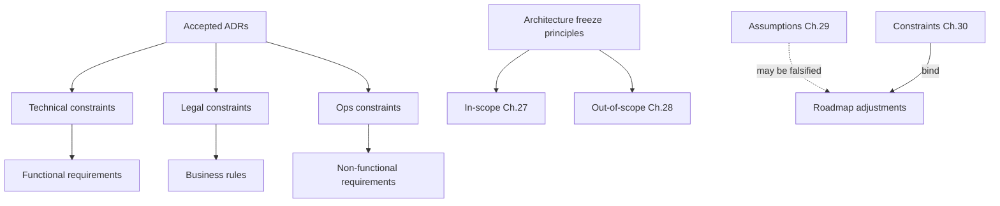

---

## Part D closing statement

Chapters 24–30 define what TALOS / AI NEET Exam App **must do**, **how well**, **under which rules**, **within which scope**, **given which assumptions**, and **inside which constraints**. They are grounded in repository ADRs and shipped sprint evidence. Where measurement does not yet exist, Enterprise Assumptions are labeled rather than implied. Implementation changes that would violate this Part D require either a defect fix toward the rule or an accepted ADR that updates the rule.

## Annex D-A — Detailed FR verification crosswalk (SP0–SP9)

This annex maps sprint verification evidence claimed in `docs/architecture/roadmap.md` to requirement clusters. It is used by QA for release readiness and by auditors for traceability completeness.

### D-A.1 Foundation and identity

| Verification theme | Roadmap claim | FR / NFR / BR anchors | Suggested automated regression |
|---|---|---|---|
| Apps boot against real Postgres/Redis | SP0 done | NFR-OPS-005, NFR-AVL-002 | Compose smoke; /health /ready |
| Register/login/refresh/logout/CSRF/permissions | SP1 done | FR-ID-001–007, BR-ID-001–006 | ADR-0020 auth integration tests |
| Suspended user cannot login | SP9 fix | FR-ID-008, BR-ID-008, NFR-SEC-007 | Dedicated auth status test |

### D-A.2 Academic and CMS

| Verification theme | Roadmap claim | Anchors | Suggested regression |
|---|---|---|---|
| NEET hierarchy seeded | SP2 done | FR-AC-001–003 | seed_academic idempotency |
| ECAEP draft→publish→archive | SP3 done | FR-CMS-001–006, BR-ID-009 | Workflow transition tests |
| Coverage grid live | SP3 done | FR-CMS-009 | Admin page smoke |

### D-A.3 Assessment and learning

| Verification theme | Roadmap claim | Anchors | Suggested regression |
|---|---|---|---|
| Practice + mock +4/−1 | SP4 done | FR-AS-001–002, BR-ID-012 | Scoring unit + submit integration |
| Mastery recompute on submit | SP6 done | FR-LRN-001–003, BR-ID-021 | Mastery recompute tests |
| Revision + recommendations + Practice now | SP7 done | FR-LRN-006–007, FR-AS-007 | Recommendation ordering tests |

### D-A.4 AI, analytics, commerce, hardening

| Verification theme | Roadmap claim | Anchors | Suggested regression |
|---|---|---|---|
| Four agents + fallback | SP5 done | FR-AI-001–007, NFR-AI-005 | Agent service tests without key |
| Admin analytics permission boundary | SP8 done | FR-AN-001–002, NFR-SEC-001 | 403 for student token |
| Razorpay real order + HMAC; 503 without keys | SP9 done | FR-COM-001–003, BR-ID-014–016 | verify_payment_signature unit tests |
| Rate limit + security headers | SP9 done | FR-SYS-004–005, NFR-SEC-005–006 | Middleware header assertions |

### D-A.5 Phase 2 annex

| ADR | Theme | FR anchors | Notes |
|---|---|---|---|
| ADR-0019 | Hindi content | FR-CMS-010, FR-ID-016, FR-UX-008 | UI English constraint |
| ADR-0020 | Integration tests | BR-ID-030, NFR-MAINT-004 | trinetra_test_db |
| ADR-0021 | Micro-competencies | FR-AC-004, FR-LRN-004 | Optional tagging |
| ADR-0022–0027 | Ingestion + language + visuals | FR-ING-*, FR-KU-* | Pilot chapter path |
| ADR-0024–0028 | Knowledge Units / EKU | FR-KU-*, BR-ID-011/024 | Phase E/F still limited |
| ADR-0029 | CI/CD | FR-SYS-008, NFR-MAINT-005 | Workflows under .github |


## Annex D-B — Data classification and retention orientation

| Data class | Examples | Schemas/tables | Retention orientation (Enterprise Assumption) | Access |
|---|---|---|---|---|
| Account credentials | password hash, refresh token hashes | identity.users, refresh_tokens | Retain while account active; rotate/revoke on logout | identity services only |
| Profile | name, phone, preferred_language | identity.users | Account lifetime | self + users.manage |
| Learning telemetry | attempts, mastery | assessment.*, learning.* | Long-lived for pedagogy; export/erase process TBD | self; analytics.view aggregates |
| Content corpus | notes, questions | cms.* | Business content asset; versions retained for audit | content.* permissions |
| AI ops telemetry | tokens, cost, latency | ai.ai_requests | Ops retention window TBD | analytics.view |
| Payment references | razorpay ids, signatures | commerce.orders | Financial retention norms TBD with counsel | self status; admin ops |
| Audit | admin actions | system.audit_logs | Security retention longer than routine logs | audit.view |
| Ingestion raw | section text, visuals | ingestion.* | Source audit/citation | knowledge.manage / visual_assets.review |

This table is an engineering orientation, not a legal schedule. DPDP-aligned schedules are ASSUM/NFR items pending counsel.


## Annex D-C — Permission catalog (normative seed)

Seeded permissions from `apps/backend/app/modules/identity/seed.py` (authoritative at generation time of this document):

| Permission code | Description | Typical roles |
|---|---|---|
| questions.read | View questions | STUDENT, TEACHER, CONTENT_MANAGER, ADMIN, SUPER_ADMIN |
| questions.create | Create questions | TEACHER, CONTENT_MANAGER, ADMIN, SUPER_ADMIN |
| questions.update | Edit questions | CONTENT_MANAGER, ADMIN, SUPER_ADMIN |
| questions.delete | Delete questions | ADMIN, SUPER_ADMIN |
| users.manage | Manage users/roles | ADMIN, SUPER_ADMIN |
| reports.view | Student/performance reports | TEACHER, SUPPORT, ADMIN, SUPER_ADMIN |
| analytics.view | Analytics dashboards | ADMIN, SUPER_ADMIN |
| ai.use | Use AI agents | STUDENT, SUPER_ADMIN (and others if granted) |
| content.create | Create content drafts | TEACHER, CONTENT_MANAGER, ADMIN, SUPER_ADMIN |
| content.edit_own_draft | Edit own drafts | TEACHER, CONTENT_MANAGER, ADMIN, SUPER_ADMIN |
| content.submit_for_review | Submit for review | TEACHER, CONTENT_MANAGER, ADMIN, SUPER_ADMIN |
| content.review | Review submitted content | CONTENT_MANAGER, ADMIN, SUPER_ADMIN |
| content.approve | Approve content | CONTENT_MANAGER, ADMIN, SUPER_ADMIN |
| content.publish | Publish content | CONTENT_MANAGER, ADMIN, SUPER_ADMIN |
| content.archive | Archive content | CONTENT_MANAGER, ADMIN, SUPER_ADMIN |
| content.force_edit_published | Break-glass publish edit | ADMIN, SUPER_ADMIN |
| knowledge.manage | Manage Knowledge Units | CONTENT_MANAGER, ADMIN, SUPER_ADMIN |
| visual_assets.review | Approve/reject visuals | CONTENT_MANAGER, ADMIN, SUPER_ADMIN |
| search.admin | Search console / reindex | ADMIN, SUPER_ADMIN |
| audit.view | View audit log | ADMIN, SUPER_ADMIN |

SUPER_ADMIN bypasses checks regardless of the mapping list.


## Annex D-D — Glossary of requirement identifiers

| Prefix | Meaning |
|---|---|
| FR-ID- | Functional requirement — Identity |
| FR-AC- | Functional requirement — Academic |
| FR-CMS- | Functional requirement — CMS/ECAEP |
| FR-AS- | Functional requirement — Assessment |
| FR-AI- | Functional requirement — AI agents |
| FR-LRN- | Functional requirement — Learning/mastery/revision |
| FR-AN- | Functional requirement — Analytics |
| FR-COM- | Functional requirement — Commerce |
| FR-SYS- | Functional requirement — System/admin/ops |
| FR-ING- | Functional requirement — Ingestion |
| FR-KU- | Functional requirement — Knowledge Units |
| FR-SRCH- | Functional requirement — Search |
| FR-UX- | Functional requirement — Student learning UX |
| NFR-PERF- | Non-functional — Performance |
| NFR-SCALE- | Non-functional — Scalability |
| NFR-AVL- | Non-functional — Availability |
| NFR-SEC- | Non-functional — Security |
| NFR-PRIV- | Non-functional — Privacy |
| NFR-A11Y- | Non-functional — Accessibility |
| NFR-OBS- | Non-functional — Observability |
| NFR-MAINT- | Non-functional — Maintainability |
| NFR-AI- | Non-functional — AI safety/cost |
| NFR-OPS- | Non-functional — Operability |
| BR-ID- | Business rule |
| OOS- | Out-of-scope item |
| ASSUM-ID- | Assumption |
| CONSTR-ID- | Constraint |


## Annex D-E — End-to-end scenario traceability

### Scenario S1 — Student practices Ohm's Law in Hindi preference

1. Student sets preferred_language=hi (FR-ID-016, BR-ID-020).
2. Opens concept page (FR-AC-002, FR-UX-007).
3. Reads published CONCEPT_NOTE with language fallback rules (FR-CMS-010).
4. Starts CONCEPT-scoped practice (FR-AS-001, BR-ID-013).
5. Submits answers; mastery recomputes (FR-LRN-001, BR-ID-021).
6. Dashboard shows revision/recommendation cards (FR-LRN-006/007).
7. Invokes explain on a question (FR-UX-005, FR-AI-004) using published/PASSED grounding (BR-ID-011).

### Scenario S2 — Author publishes AI-generated MCQ from ingestion

1. Admin triggers ingestion job on NCERT PDF (FR-ING-001, BR-ID-025).
2. Pipeline extracts, splits, matches concepts (FR-ING-002–004).
3. Knowledge structuring gates facts (FR-KU-001–003, BR-ID-037 via CONSTR).
4. Generation creates DRAFT QUESTION/FLASHCARD/NOTE/SHEET (FR-ING-005, BR-ID-024).
5. Reviewer runs ECAEP approve/publish (FR-CMS-003–005, BR-ID-009).
6. Student assessments may now select the question (FR-AS-005).

### Scenario S3 — Premium purchase attempt without keys

1. Student calls create order (FR-COM-001).
2. System returns PAYMENT_GATEWAY_NOT_CONFIGURED; no PAID row (BR-ID-015, NFR-AVL-005).
3. Frontend shows honest unavailable state (ADR-0018).
4. Non-commerce learning features remain available.

### Scenario S4 — Admin suspends abuser

1. Admin sets status suspended on /admin/users (FR-ID-012).
2. Suspended user login fails ACCOUNT_SUSPENDED (FR-ID-008, BR-ID-008).
3. Audit log records privileged action when wired (FR-SYS-001).

### Scenario S5 — Mock test NEET marking

1. Student generates mock (FR-AS-002).
2. Answers mix of correct/incorrect/blank.
3. Score applies +4/−1/0 (BR-ID-012).
4. Attempt appears in history (FR-AS-006); analytics totals update for admins (FR-AN-001).


## Annex D-F — Operability crosswalk to docs/deploy

| Deploy document | NFR / FR anchors | Operator actions |
|---|---|---|
| `docs/deploy/RUNBOOK.md` | NFR-OPS-001, NFR-AVL-002, FR-SYS-003, FR-SYS-007 | Provision VPS, install Coolify, set env, migrate, verify /health /ready |
| `docs/deploy/ROLLBACK.md` | NFR-OPS-002, NFR-AVL-006 | Revert release; restore DB if needed |
| `docs/deploy/VERIFICATION_CHECKLIST.md` | NFR-OPS-003; Annex D-A | Execute smoke across auth, ECAEP, assessment, AI fallback, commerce guard |
| `docs/deploy/CI_CD.md` | NFR-OPS-004, FR-SYS-008, ADR-0029 | Interpret pipeline failures; do not skip gates casually |
| `docs/deploy/TEST_REPORT.md` | QA evidence pattern | Record results against FR acceptance criteria |

### D-F.1 Required production secrets (orientation)

Operators must supply real values for JWT secrets, database URLs, Redis URLs, and optionally ANTHROPIC_API_KEY and RAZORPAY_KEY_ID/SECRET. Missing AI key degrades AI; missing Razorpay keys disable purchase without faking success. Cookie Secure flags and public URLs must match the HTTPS edge provided by Coolify/Traefik.

### D-F.2 Migration discipline at deploy

Alembic upgrade head is mandatory after schema-changing releases (CONSTR-ID-013). Hand SQL on production is a process violation even if urgently tempting. Integration test DB migrations follow the same Alembic history (ADR-0020).


## Annex D-G — Security control mapping (OWASP Top 10 orientation)

| OWASP theme | TALOS controls | Requirement IDs |
|---|---|---|
| Broken access control | RBAC permissions; SUPER_ADMIN bypass explicit; admin route gates | NFR-SEC-001, FR-ID-006/007, FR-AN-004 |
| Cryptographic failures | Argon2; hashed refresh; TLS at edge | NFR-SEC-002, BR-ID-001/003 |
| Injection | SQLAlchemy parameterized ORM | NFR-SEC-003 |
| Insecure design | ECAEP gates; no fake payments; KU mechanical gates | BR-ID-009/015/024, NFR-AI-002 |
| Security misconfiguration | Security headers; non-root; no baked prod secrets | NFR-SEC-005/008/010 |
| Vulnerable components | CI dependency review / CodeQL workflows | NFR-SEC-011, ADR-0029 |
| Auth failures | Short JWT, rotation, lockout, suspended denial, rate limits | FR-ID-002/003/008/009, NFR-SEC-006/007 |
| Integrity failures | HMAC payment verify; CSRF | BR-ID-005/016, NFR-SEC-004/009 |
| Logging/monitoring failures | traceId envelope; audit logs; ai_requests | NFR-OBS-001–005 |
| SSRF (orientation) | Limited outbound: Anthropic, Razorpay; no open URL fetchers in student paths | Architecture review practice |


## Annex D-H — Content type body expectations

| content_type | Body intent | Student visibility rule | Typical producers |
|---|---|---|---|
| CONCEPT_NOTE | Structured explanation sections/summary | PUBLISHED only | Human authors; ingestion per concept |
| QUESTION | MCQ stem, options, correct key, explanation, difficulty, optional micro_competency_id, optional pyq_year | PUBLISHED only | Human; QG DRAFT; ingestion MCQ |
| FLASHCARD | front/back | PUBLISHED only | Human; ingestion |
| DIAGRAM | image_url required | PUBLISHED only | Human/asset pipeline; not text-only ingestion |
| VIDEO_REF | reference metadata to external/hosted video | PUBLISHED only | Human |
| FORMULA_SHEET | formulas list; may be chapter-scoped with null concept_id | PUBLISHED only | Human; ingestion revision sheet |

All pass through ECAEP. DIAGRAM cannot be honestly auto-generated by the text-only ingestion path (OOS-027).


## Annex D-I — Mastery and recommendation algorithms (normative summary)

### Mastery score

```
mastery_score = round(100 * correct_count / attempts_count)  # attempts_count > 0
```

### Mastery level

```
if attempts_count == 0: NOT_STARTED
elif attempts_count < 3: LEARNING
elif mastery_score >= 80: MASTERED
else: PRACTICING
```

### Revision interval

| Level | next_review_at offset |
|---|---|
| LEARNING | +1 day |
| PRACTICING | +3 days |
| MASTERED | +7 days |
| NOT_STARTED | none |

### Recommendation fill order

1. due_for_revision (`next_review_at <= now`), most overdue first  
2. weak_concept (`PRACTICING`), lowest score first  
3. new_concept (no mastery row), curriculum display_order  

Default list size: 5. Revision due list cap: 10.

These are business rules BR-ID-021–023 and FRs FR-LRN-001/006/007.


## Annex D-J — PlantUML deployment view (MVP)

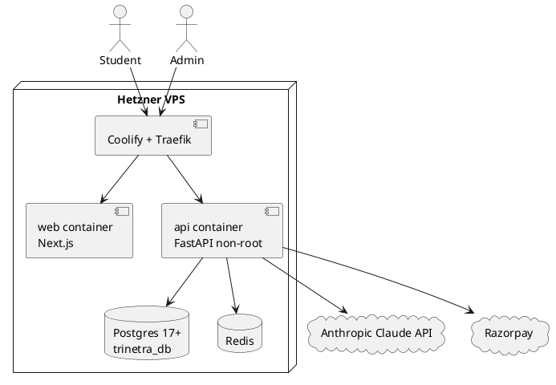

Constraints: CONSTR-ID-020–025; NFR-SCALE-001; ADR-0006.


## Annex D-K — Requirements quality checklist (for future change control)

When adding a new FR/NFR/BR:

1. **Identifier stability** — never reuse IDs; obsolete with status Retired if needed.
2. **ADR citation** — every Must requirement cites an ADR, sprint, or CLAUDE.md invariant.
3. **Acceptance criteria testability** — prefer given/when/then that QA can automate or click-through.
4. **MoSCoW honesty** — Won't items belong in Chapter 28, not as Must FRs.
5. **Status accuracy** — Shipped requires repository evidence; Partial needs named gap; Planned needs ADR/roadmap hook.
6. **Envelope & auth invariants** — API FRs inherit cross-cutting invariants in Chapter 24 intro; do not re-specify unless specializing.
7. **No silent BRD inflation** — if BRD asks for 280 tables, map to OOS or a new ADR, do not quietly add Must FRs.
8. **Enterprise Assumptions labeled** — unmeasured SLOs cannot be stated as certified.
9. **Update RTM** — Chapter 24.14 and Annex D-A when adding load-bearing capabilities.
10. **Update state machines** — Chapter 26 if workflow states change.


## Annex D-L — Sample error envelope (normative example)

```json
{
  "success": false,
  "data": null,
  "meta": {},
  "errors": [
    {
      "code": "ACCOUNT_SUSPENDED",
      "message": "Account is suspended"
    }
  ],
  "traceId": "9f3c2e1a-b7d4-4c0f-9a11-55aa77bb00cc",
  "timestamp": "2026-08-07T02:30:00+00:00"
}
```

Related: FR-ID-008, FR-ID-017, NFR-OBS-001, BR-ID-008.

Additional illustrative codes used across the system include `PAYMENT_GATEWAY_NOT_CONFIGURED`, `ROLE_IMMUTABLE`, permission denied equivalents, and validation errors from Pydantic bodies. Clients must branch on `errors[].code` rather than free-text matching alone.


## Annex D-M — Domain narrative elaborations

### D-M — Identity

Identity is the root of Zero Trust principles inside the monolith. Every subsequent module that mutates state depends on get_current_user and, where needed, require_permission and verify_csrf. The consolidation choices in ADR-0011 (profile fields on users, refresh token as session, login_history retained, devices deferred) keep the hot path join-light. The SP9 suspension bug fix is emblematic of requirement discipline: status checks must occur at authentication time, not only on later dependency injection. Rate limiting on login/register/refresh acknowledges credential stuffing as a first-class risk even before a WAF exists. SUPER_ADMIN immutability prevents an admin UI footgun from locking the break-glass role out of itself. These rules are not optional polish; they are CONSTR and BR items.


### D-M — Academic and CMS

Academic hierarchy is intentionally shallower than the BRD seven-plus-level fantasy. Five levels plus optional micro-competencies deliver addressable pedagogy without authoring paralysis. CMS ECAEP is the ethical and quality center of the product: without it, AI generation would be an unbounded hallucination faucet into student feeds. The six content types cover the learning objects NEET students actually use daily. Hindi content support proves Phase 2 can expand ADR-0007 cuts carefully—content only, UI English, hierarchy English, fallback explicit. Coverage grid turns empty mock pools into a visible content operations signal rather than an engineering mystery.


### D-M — Assessment and Learning

Assessment generation on demand avoids a second authoring bureaucracy. NEET +4/−1 on mocks creates authentic pressure; practice without negative marking creates safe reps. Mastery arithmetic is deliberately simple and reconstructable from attempt_answers, enabling trust and repair. Revision intervals are not SM-2, and the document says so—preventing future readers from assuming a spaced-repetition research stack that does not exist. Recommendations are explainable: due, weak, new. That explainability is a product requirement as much as an algorithm choice.


### D-M — AI, Knowledge, Ingestion

The AI Gateway exists so Claude is a detail, not an architecture. Fallback keeps CI and sandbox verification alive; payment code deliberately refuses the same pattern. Knowledge Units insert a durable, gate-checked semantic layer between PDF extraction and asset generation—the AI Content Lifecycle’s non-negotiable. Mechanical grounding_check is the difference between “the model said so” and “the fact overlaps the source.” Ingestion’s checksum idempotency and trigram dedup are business rules against DRAFT spam. LanguageService prevents silent English assumptions when Hindi PDFs appear. Visual assets acknowledge that NEET is not text-only, without pretending a full document-intelligence platform was built.


### D-M — Commerce, Analytics, Ops

Commerce is a rail, not a silent paywall. Premium equals PAID order existence—derived, not duplicated. Analytics refuses early materialization. Ops docs refuse to pretend a VPS was deployed when it was not. CI/CD introduces honesty about lint debt rather than fake green. Together these choices define an enterprise posture: ambitious in product, conservative in self-deception.


## Annex D-N — Compact FR index

| FR-ID | Title keyword | Priority | Status |
|---|---|---|---|
| FR-ID-001 | Register | Must | Shipped |
| FR-ID-002 | Login | Must | Shipped |
| FR-ID-003 | Refresh rotation | Must | Shipped |
| FR-ID-004 | Logout | Must | Shipped |
| FR-ID-005 | CSRF | Must | Shipped |
| FR-ID-006 | RBAC | Must | Shipped |
| FR-ID-007 | SUPER_ADMIN | Must | Shipped |
| FR-ID-008 | Suspended denial | Must | Shipped |
| FR-ID-009 | Lockout | Must | Shipped |
| FR-ID-010 | Profile me | Must | Shipped |
| FR-ID-011 | Admin user list | Must | Shipped |
| FR-ID-012 | Admin role/status | Must | Shipped |
| FR-ID-013 | Role catalog | Must | Shipped |
| FR-ID-014 | Argon2 | Must | Shipped |
| FR-ID-015 | Email/reset tokens | Should | Partial |
| FR-ID-016 | preferred_language | Must | Shipped |
| FR-ID-017 | Envelope errors | Must | Shipped |
| FR-ID-018 | Seed roles | Must | Shipped |
| FR-AC-001 | Five-level hierarchy | Must | Shipped |
| FR-AC-002 | Student browse | Must | Shipped |
| FR-AC-003 | Pilot seed | Must | Shipped |
| FR-AC-004 | Micro-competencies | Should | Shipped |
| FR-AC-005 | Prerequisites | Could | Partial |
| FR-AC-006 | English hierarchy | Must | Shipped |
| FR-AC-007 | Hierarchy read APIs | Must | Shipped |
| FR-AC-008 | Display order | Must | Shipped |
| FR-CMS-001 | Create draft | Must | Shipped |
| FR-CMS-002 | Edit draft | Must | Shipped |
| FR-CMS-003 | Submit/AI check | Must | Shipped |
| FR-CMS-004 | Review | Must | Shipped |
| FR-CMS-005 | Publish | Must | Shipped |
| FR-CMS-006 | Archive | Must | Shipped |
| FR-CMS-007 | Force edit | Should | Shipped |
| FR-CMS-008 | Body schemas | Must | Shipped |
| FR-CMS-009 | Coverage | Must | Shipped |
| FR-CMS-010 | Language fallback | Must | Shipped |
| FR-CMS-011 | Versions | Must | Shipped |
| FR-CMS-012 | Admin content UI | Must | Shipped |
| FR-CMS-013 | KU traceability | Must | Shipped |
| FR-CMS-014 | Licensing-safe | Must | Shipped |
| FR-CMS-015 | AI review console | Should | Shipped |
| FR-AS-001 | Practice | Must | Shipped |
| FR-AS-002 | Mock scoring | Must | Shipped |
| FR-AS-003 | Attempt submit | Must | Shipped |
| FR-AS-004 | Client timer | Should | Partial |
| FR-AS-005 | Published-only pool | Must | Shipped |
| FR-AS-006 | Attempt history | Must | Shipped |
| FR-AS-007 | Practice now | Must | Shipped |
| FR-AS-008 | No assessment CMS | Must | Shipped |
| FR-AI-001 | Gateway | Must | Shipped |
| FR-AI-002 | Cost logging | Must | Shipped |
| FR-AI-003 | Tutor concept | Must | Partial |
| FR-AI-004 | Explain question | Must | Shipped |
| FR-AI-005 | QG draft-only | Must | Shipped |
| FR-AI-006 | Planner | Must | Shipped |
| FR-AI-007 | Evaluator | Must | Shipped |
| FR-AI-008 | ai.use gate | Must | Shipped |
| FR-AI-009 | No 12 agents | Won't | Shipped |
| FR-LRN-001 | Concept mastery | Must | Shipped |
| FR-LRN-002 | Topic rollup | Must | Shipped |
| FR-LRN-003 | Overview API | Must | Shipped |
| FR-LRN-004 | Micro mastery | Should | Shipped |
| FR-LRN-005 | KU mastery | Should | Partial |
| FR-LRN-006 | Revision schedule | Must | Shipped |
| FR-LRN-007 | Recommendations | Must | Shipped |
| FR-LRN-008 | No reminders | Won't | Shipped |
| FR-LRN-009 | Dashboard widgets | Must | Shipped |
| FR-AN-001 | Assessment analytics | Must | Shipped |
| FR-AN-002 | AI analytics | Must | Shipped |
| FR-AN-003 | No CSV | Won't | Shipped |
| FR-AN-004 | reports.view unused | Must | Shipped |
| FR-COM-001 | Create order | Must | Shipped |
| FR-COM-002 | HMAC verify | Must | Shipped |
| FR-COM-003 | Premium status | Must | Shipped |
| FR-COM-004 | One-time only | Must | Shipped |
| FR-COM-005 | No silent paywall | Should | Shipped |
| FR-COM-006 | Order states | Must | Shipped |
| FR-SYS-001 | Audit logs | Must | Shipped |
| FR-SYS-002 | Admin home | Should | Shipped |
| FR-SYS-003 | Health/ready | Must | Shipped |
| FR-SYS-004 | Rate limit | Must | Shipped |
| FR-SYS-005 | Security headers | Must | Shipped |
| FR-SYS-006 | traceId | Must | Shipped |
| FR-SYS-007 | Prod compose | Must | Shipped |
| FR-SYS-008 | CI/CD | Should | Shipped |
| FR-ING-001 | Ingestion jobs | Must | Shipped |
| FR-ING-002 | PDF extract | Must | Shipped |
| FR-ING-003 | Section split | Must | Shipped |
| FR-ING-004 | Concept match | Must | Shipped |
| FR-ING-005 | Generate many | Must | Shipped |
| FR-ING-006 | Language detect | Should | Shipped |
| FR-ING-007 | Visual assets | Should | Partial |
| FR-ING-008 | Licensing boundary | Must | Shipped |
| FR-ING-009 | Job counters | Must | Shipped |
| FR-KU-001 | Structure KU | Must | Shipped |
| FR-KU-002 | Source verify | Must | Shipped |
| FR-KU-003 | Dedup KU | Must | Shipped |
| FR-KU-004 | PASSED-only gen | Must | Shipped |
| FR-KU-005 | KU admin UI | Must | Shipped |
| FR-KU-006 | No embedding col | Must | Shipped |
| FR-KU-007 | Supersession | Should | Shipped |
| FR-KU-008 | Tutor KU cite | Should | Partial |
| FR-SRCH-001 | Search console | Should | Shipped |
| FR-SRCH-002 | pg_trgm | Must | Shipped |
| FR-SRCH-003 | No RAG yet | Must | Shipped |
| FR-UX-001 | Browse questions | Must | Shipped |
| FR-UX-002 | Bookmarks | Must | Shipped |
| FR-UX-003 | Notes | Must | Shipped |
| FR-UX-004 | Flashcards | Must | Shipped |
| FR-UX-005 | Explain | Must | Shipped |
| FR-UX-006 | Profile/settings | Must | Shipped |
| FR-UX-007 | Concept page | Must | Shipped |
| FR-UX-008 | English UI | Must | Shipped |
| FR-UX-009 | Content report | Could | Partial |


## Annex D-O — Document approval block

| Role | Name | Signature | Date |
|---|---|---|---|
| Product Owner | _TBD_ | | |
| Engineering Lead | _TBD_ | | |
| Architecture Authority | _TBD_ | | |
| QA Lead | _TBD_ | | |
| Security Reviewer | _TBD_ | | |

**Approval meaning.** Signatories affirm that Chapters 24–30 accurately reflect the frozen ADRs and shipped production target for TALOS / AI NEET Exam App as of the document date, and that Enterprise Assumptions are understood as unlabeled-measurement items rather than contractual SLOs.

---

*End of Volume 1 Part D — `docs/blueprint/volume-01/04-requirements-and-scope.md`*


## Annex D-P — Non-functional requirements compact index

| NFR-ID | Title keyword | Priority | Status |
|---|---|---|---|
| NFR-PERF-001 | Read API latency | Should | Partial |
| NFR-PERF-002 | Auth under rate limit | Must | Shipped |
| NFR-PERF-003 | Submit+mastery budget | Should | Shipped |
| NFR-PERF-004 | AI latency exemption | Must | Shipped |
| NFR-PERF-005 | Ingestion batch | Should | Shipped |
| NFR-PERF-006 | Analytics live cost | Should | Shipped |
| NFR-PERF-007 | Frontend FCP | Should | Partial |
| NFR-SCALE-001 | Single VPS first | Must | Shipped |
| NFR-SCALE-002 | Extraction readiness | Must | Shipped |
| NFR-SCALE-003 | Stateless containers | Must | Shipped |
| NFR-SCALE-004 | Content growth bound | Must | Shipped |
| NFR-SCALE-005 | No distributed theater | Must | Shipped |
| NFR-AVL-001 | MVP availability | Should | Planned |
| NFR-AVL-002 | Health/ready | Must | Shipped |
| NFR-AVL-003 | Restart policy | Must | Shipped |
| NFR-AVL-004 | AI degrade | Must | Shipped |
| NFR-AVL-005 | Payment fail-closed | Must | Shipped |
| NFR-AVL-006 | Backup posture | Should | Partial |
| NFR-SEC-001 | Access control | Must | Shipped |
| NFR-SEC-002 | Crypto | Must | Shipped |
| NFR-SEC-003 | Injection | Must | Shipped |
| NFR-SEC-004 | CSRF | Must | Shipped |
| NFR-SEC-005 | Headers | Must | Shipped |
| NFR-SEC-006 | Rate limit | Must | Shipped |
| NFR-SEC-007 | Suspended/locked | Must | Shipped |
| NFR-SEC-008 | Secrets | Must | Shipped |
| NFR-SEC-009 | Payment HMAC | Must | Shipped |
| NFR-SEC-010 | Non-root | Must | Shipped |
| NFR-SEC-011 | Dep scanning | Should | Shipped |
| NFR-SEC-012 | SUPER_ADMIN immutable | Must | Shipped |
| NFR-PRIV-001 | Minimization | Must | Shipped |
| NFR-PRIV-002 | AI log purpose | Should | Partial |
| NFR-PRIV-003 | HTTP-only cookies | Must | Shipped |
| NFR-PRIV-004 | Admin audit | Must | Shipped |
| NFR-PRIV-005 | Payment minimization | Must | Shipped |
| NFR-PRIV-006 | DPDP process | Should | Planned |
| NFR-A11Y-001 | WCAG orientation | Should | Partial |
| NFR-A11Y-002 | Keyboard | Should | Partial |
| NFR-A11Y-003 | Lang content vs UI | Must | Shipped |
| NFR-A11Y-004 | Motion/timing | Should | Partial |
| NFR-OBS-001 | Envelope | Must | Shipped |
| NFR-OBS-002 | traceId | Must | Shipped |
| NFR-OBS-003 | AI telemetry | Must | Shipped |
| NFR-OBS-004 | Ingestion counters | Must | Shipped |
| NFR-OBS-005 | Audit trail | Must | Shipped |
| NFR-OBS-006 | No OTel mesh mandate | Must | Shipped |
| NFR-MAINT-001 | Module shape | Must | Shipped |
| NFR-MAINT-002 | Alembic only | Must | Shipped |
| NFR-MAINT-003 | ADR discipline | Must | Shipped |
| NFR-MAINT-004 | Integration tests | Must | Shipped |
| NFR-MAINT-005 | CI gates | Should | Shipped |
| NFR-MAINT-006 | Single frontend | Must | Shipped |
| NFR-MAINT-007 | Pydantic CMS bodies | Must | Shipped |
| NFR-AI-001 | Grounding | Must | Shipped |
| NFR-AI-002 | Mechanical verify | Must | Shipped |
| NFR-AI-003 | QG no autopublish | Must | Shipped |
| NFR-AI-004 | Cost visibility | Must | Shipped |
| NFR-AI-005 | Fallback labels | Must | Shipped |
| NFR-AI-006 | No fake PYQ | Must | Shipped |
| NFR-AI-007 | Provider abstraction | Must | Shipped |
| NFR-AI-008 | Hindi AI caution | Must | Shipped |
| NFR-OPS-001 | Runbook | Must | Shipped |
| NFR-OPS-002 | Rollback | Should | Shipped |
| NFR-OPS-003 | Verification checklist | Should | Shipped |
| NFR-OPS-004 | CI/CD docs | Must | Shipped |
| NFR-OPS-005 | Prod compose | Must | Shipped |
| NFR-OPS-006 | Test DB docs | Must | Shipped |
| NFR-OPS-007 | Ops simplicity | Must | Shipped |

## Annex D-Q — Business rules compact index

| BR-ID | Title keyword |
|---|---|
| BR-ID-001 | Argon2 |
| BR-ID-002 | Access TTL |
| BR-ID-003 | Refresh rotation |
| BR-ID-004 | HTTP-only cookies |
| BR-ID-005 | CSRF |
| BR-ID-006 | RBAC |
| BR-ID-007 | SUPER_ADMIN |
| BR-ID-008 | Suspended denial |
| BR-ID-009 | ECAEP publish gate |
| BR-ID-010 | QG no autopublish |
| BR-ID-011 | Tutor PUBLISHED/PASSED |
| BR-ID-012 | NEET scoring |
| BR-ID-013 | Published questions only |
| BR-ID-014 | Premium equals PAID |
| BR-ID-015 | No fake payment |
| BR-ID-016 | HMAC required |
| BR-ID-017 | Soft delete |
| BR-ID-018 | Versioning |
| BR-ID-019 | Licensing |
| BR-ID-020 | Language rules |
| BR-ID-021 | Mastery thresholds |
| BR-ID-022 | Revision intervals |
| BR-ID-023 | Recommendation order |
| BR-ID-024 | No KU no generation |
| BR-ID-025 | Checksum idempotency |
| BR-ID-026 | Stem dedup |
| BR-ID-027 | One-time commerce |
| BR-ID-028 | Analytics empty schema |
| BR-ID-029 | Naming TALOS |
| BR-ID-030 | Test DB SAVEPOINT |

## Annex D-R — Interface contracts summary for QA

### Auth cookies (conceptual)

| Cookie purpose | Attributes (prod orientation) | Notes |
|---|---|---|
| Access JWT | HTTP-only, Secure, SameSite as configured | Short TTL approximately 15 minutes |
| Refresh opaque | HTTP-only, Secure, SameSite as configured | Rotated on every refresh |
| CSRF | Readable by JavaScript for double-submit | Required on mutating requests |

### Commerce endpoints

| Method | Path | Success condition |
|---|---|---|
| POST | /api/v1/commerce/orders | Razorpay order created, or clear not-configured error with no PAID row |
| POST | /api/v1/commerce/orders/{id}/verify | HMAC valid transitions order to PAID |
| GET | /api/v1/commerce/status | premium boolean derived from PAID order existence |

### Learning endpoints (orientation)

| Method | Path | Notes |
|---|---|---|
| GET | /api/v1/learning/mastery/concepts/{id} | Per ADR-0015 |
| GET | /api/v1/learning/mastery/topics/{id} | Topic rollup computed on read |
| GET | /api/v1/learning/mastery/overview | Student dashboard aggregate |
| GET | /api/v1/learning/revision/due | Most overdue first, capped |
| GET | /api/v1/learning/recommendations | Ranked due, weak, new; default five items |

Exact path mounts should be confirmed against the running OpenAPI schema if prefixes differ slightly; behavioral contracts above are ADR-normative.

## Annex D-S — Risk of requirement drift (controls)

Requirement drift occurs when code evolves without updating ADRs or this Part D. Controls that reduce drift:

1. Pull request templates ask for ADR references when behavior changes.
2. CODEOWNERS coverage for `docs/decisions/` and `docs/blueprint/`.
3. CI must not casually skip quality gates introduced in ADR-0029.
4. Release checklists re-validate Annex D-A and scenarios S1 through S5.
5. The Volume 1 README conflict register resolves prompt-versus-ADR disputes.
6. CLAUDE.md restates frozen decisions at the start of engineering sessions.
7. Integration tests lock auth, scoring, payment guard rails, and workflow edges.
8. BRD lines remain backlog until an ADR explicitly accepts them into scope.
9. MoSCoW Won't items stay in Chapter 28 rather than being reintroduced as Must FRs without debate.
10. Partial statuses must name the remaining gap so Partial does not silently mean Done.

## Annex D-T — Stakeholder views of Part D

| Stakeholder | Primary chapters | Use |
|---|---|---|
| CTO | 27, 28, 30 | Scope freeze and architecture constraints |
| Product Manager | 24, 27, 28, 29 | Prioritization, MoSCoW, assumptions |
| Engineering Lead | 24, 25, 26, 30 | Build and test against stable IDs |
| QA Lead | 24 acceptance criteria, Annex D-A/E/N | Test design and evidence |
| DevOps / SRE | 25.10, 30.3, Annex D-F | Deploy and operate |
| AI Engineer | 24.5, 24.10, 24.11, 25.9, AI business rules | Grounding and cost controls |
| Security Reviewer | 25.4, 25.5, Annex D-G | Control mapping |
| Investor / Advisor | 27, 28, 29 | What is real versus deferred |

## Annex D-U — Sprint evidence to requirement density

The originally scoped nine sprints close a coherent vertical slice: foundation, identity, curriculum, editorial content, assessment, AI assistance, mastery, revision, analytics, and commerce/hardening. Phase 2 ADRs then add language, tests, finer pedagogy, ingestion, knowledge units, and CI without reopening microservices or Auth.js. The density of Must requirements in Identity, CMS, Assessment, and Commerce reflects where defects are most expensive: credential issuance, student-visible content, scoring fairness, and money. Partial requirements cluster where ADR phases intentionally split work (Tutor KU citation, visual asset linkage, concept prerequisites authoring, email delivery). Planned NFRs cluster where production traffic has not yet been observed (availability SLO certification, formal accessibility audit, DPDP process operationalization).

## Annex D-V — Consistency checks performed while authoring Part D

1. API envelope fields match `app/shared/responses.py`.
2. Auth model matches ADR-0003 and SP9 suspension fix in ADR-0018.
3. Postgres schema list includes learning, ingestion, and knowledge additions beyond the earliest ADR-0001 list.
4. ECAEP content types match `docs/architecture/ecaep.md`.
5. Scoring rules match ADR-0013.
6. Razorpay fail-closed behavior matches ADR-0018.
7. Hindi-versus-UI rules match ADR-0019.
8. Integration test infrastructure matches ADR-0020.
9. Out-of-scope list is centered on ADR-0007 plus later explicit deferrals.
10. UI routes cited exist under `apps/web/src/app/`.
11. Permission codes cited exist in `identity/seed.py`.
12. Module folders cited exist under `apps/backend/app/modules/`.

## Annex D-W — Change request template (requirements)

```text
CR-ID:
Title:
Requester:
Date:
Type: FR | NFR | BR | Scope | Assumption | Constraint
MoSCoW proposed:
Related ADR (existing or new draft):
Modules affected:
UI routes affected:
Acceptance criteria:
Why not already covered by ADR-0007 out-of-scope:
Migration / data impact:
Security / privacy impact:
AI grounding impact:
Rollback plan:
```

Use this template before expanding production target scope. If the change conflicts with an Accepted ADR, the ADR update is the first deliverable, not the last.

## Annex D-X — Long-form rationale for selected freezes

### Why modular monolith remains a constraint

At the team size and traffic expectations of an MVP NEET learning product, the operational tax of microservices (deployment matrices, distributed failure modes, duplicate authz, network latency between what could be in-process calls) exceeds the benefit. Module packages already preserve future extraction seams. Therefore CONSTR-ID-001 is not a temporary preference; it is the architecture that makes SP0 through SP9 shippable by one team.

### Why payments refuse AI-style fallback

FallbackProvider for AI is safe because outputs are clearly labeled and non-financial. A fake PAID transition would create entitlement confusion, corrupt commerce analytics, and teach future contributors that success can be stubbed in money paths. ADR-0018’s fail-closed rule is therefore both a business rule and a cultural constraint.

### Why ECAEP sits in front of every student-visible asset

Without a publish gate, ingestion and QG would optimize for volume over trust. NEET students make high-stakes decisions from explanations and MCQs; unreviewed model text is an unacceptable default. Knowledge Units strengthen that gate by ensuring generation inputs themselves were mechanically checked against source text.

### Why Hindi content without UI i18n is the correct Phase 2 cut

The learning object is the explanation and the question, not the word “Dashboard” on a button. ADR-0019 captures that economic truth. Full UI i18n remains valuable later; it is not what “multi-language content” required to become real.

## Annex D-Y — Production target definition of done (requirements view)

The current production target is considered requirements-complete for MVP validation when all of the following are true:

1. Every Must FR in Identity, CMS publish path, Assessment scoring, Commerce fail-closed behavior, and Security hardening is Shipped with automated or recorded manual evidence.
2. Every Must BR in Chapter 26 is enforced in code or explicitly operationalized.
3. No Must NFR marked Shipped relies on an unlabeled fantasy measurement; Partial and Planned items remain labeled.
4. Out-of-scope items in Chapter 28 have not been partially implemented under other names (especially Auth.js, fake payments, microservices, and unlicensed corpus importers).
5. Coolify deploy artifacts and runbooks exist even if the first live VPS cutover remains an operations milestone.
6. Integration tests against trinetra_test_db cover at least auth boundaries, payment signature verification, and one ECAEP transition path, with coverage expanding thereafter.
7. Knowledge Unit cutover remains honored: generation does not silently revert to raw text.
8. Hindi content path works for the seeded concept with English fallback signaling.
9. Product naming in release notes uses Trinetra AI Learning OS (TALOS).
10. Any new scope beyond this Part D has an Accepted ADR and updated RTM rows.

This definition of done is a requirements governance artifact. It complements but does not replace the deploy verification checklist in docs/deploy/.

## Annex D-Z — Reader navigation map

| If you need... | Go to... |
|---|---|
| What the system must do by domain | Chapter 24 |
| Latency, security, privacy, AI safety, ops quality | Chapter 25 |
| Invariant policies and state machines | Chapter 26 |
| What is included now | Chapter 27 |
| What is explicitly deferred and why | Chapter 28 |
| Planning beliefs that might be wrong | Chapter 29 |
| Hard limits and architecture freeze | Chapter 30 |
| Sprint verification mapping | Annex D-A |
| Scenario traces | Annex D-E |
| Compact FR/NFR/BR indexes | Annex D-N, D-P, D-Q |
| Permission catalog | Annex D-C |
| OWASP control map | Annex D-G |

---

# Enterprise Deep Dive — Chapters 24–30 Expansion

> **Repository truth:** Claude via AI Gateway (not OpenAI); modular monolith; Razorpay; ECAEP; KU shipped; RAG/embeddings/CQRS/KG **not** shipped. Unmeasured targets labeled **Enterprise Assumption**.

---

## 24.15 Full FR Catalog Tables with Acceptance Criteria (Compact Form)

The narrative FR entries in §§24.1–24.13 remain authoritative. This section restates **every FR-ID** in compact tables for QA import, each with MoSCoW, status, and one-line acceptance gist. Use these tables for traceability audits; use narrative sections for full multi-criteria acceptance.

### 24.15.1 Identity & Auth (FR-ID-*)

| FR-ID | MoSCoW | Status | Acceptance gist (must all pass in narrative AC) | UI / API surface |
|---|---|---|---|---|
| FR-ID-001 | Must | Shipped | Register creates Argon2 user + STUDENT; duplicate email envelope error; rate limited | `/(auth)/register` |
| FR-ID-002 | Must | Shipped | Login sets HTTP-only cookies; ~15m access JWT; login_history written | `/(auth)/login` |
| FR-ID-003 | Must | Shipped | Refresh rotates opaque token; hashed at rest; rate limited | `/auth/refresh` |
| FR-ID-004 | Must | Shipped | Logout revokes refresh; old refresh fails | logout control |
| FR-ID-005 | Must | Shipped | CSRF double-submit on mutating routes | all mutating pages |
| FR-ID-006 | Must | Shipped | Permission codes gate privileged routes | `/admin/**` |
| FR-ID-007 | Must | Shipped | SUPER_ADMIN bypasses permission checks | `/admin/**` |
| FR-ID-008 | Must | Shipped | Suspended users cannot authenticate | login + `/admin/users` |
| FR-ID-009 | Should | Shipped | Brute-force / lockout awareness per identity design | auth routes |
| FR-ID-010 | Must | Shipped | Self profile read/update within schema rules | `/student/settings` |
| FR-ID-011 | Must | Shipped | Admin list/detail users with permission | `/admin/users` |
| FR-ID-012 | Must | Shipped | Admin role/status management; audit-friendly | `/admin/users` |
| FR-ID-013 | Should | Shipped | Role/permission catalog manageable by privileged roles | admin identity APIs |
| FR-ID-014 | Must | Shipped | Passwords hashed with Argon2 only | register/password flows |
| FR-ID-015 | Could | Partial | Email verify / reset token fields exist; full mailer UX may lag | identity fields |
| FR-ID-016 | Must | Shipped | `preferred_language` stored; content fetch respects ADR-0019 | settings |
| FR-ID-017 | Must | Shipped | Identity errors use envelope `{success,data,meta,errors,traceId,timestamp}` | all identity APIs |
| FR-ID-018 | Must | Shipped | Seeded roles/permissions baseline from seed.py | boot/seed |

### 24.15.2 Academic (FR-AC-*)

| FR-ID | MoSCoW | Status | Acceptance gist | UI |
|---|---|---|---|---|
| FR-AC-001 | Must | Shipped | Exam→Subject→Chapter→Topic→Concept persisted | `/student/subjects/**` |
| FR-AC-002 | Must | Shipped | Students browse hierarchy for NEET | subjects UI |
| FR-AC-003 | Must | Shipped | Pilot chapter seed complete/idempotent | seed_academic |
| FR-AC-004 | Should | Shipped | Micro-competencies under concept (ADR-0021) | admin + concept |
| FR-AC-005 | Could | Partial | Prerequisite edges schema; admin UX may lag | academic |
| FR-AC-006 | Must | Shipped | Hierarchy labels English-only | all academic UI |
| FR-AC-007 | Must | Shipped | Read APIs for navigation | student browse |
| FR-AC-008 | Should | Shipped | Display order sequencing honored | browse order |

### 24.15.3 CMS / ECAEP (FR-CMS-*)

| FR-ID | MoSCoW | Status | Acceptance gist | UI |
|---|---|---|---|---|
| FR-CMS-001 | Must | Shipped | Create DRAFT content | `/admin/content/new` |
| FR-CMS-002 | Must | Shipped | Edit own draft / changes-requested | content detail |
| FR-CMS-003 | Must | Shipped | Submit triggers AI check path | content detail |
| FR-CMS-004 | Must | Shipped | Review decision transitions legal states only | content detail |
| FR-CMS-005 | Must | Shipped | Approve/publish gates; no skip | content detail |
| FR-CMS-006 | Must | Shipped | Archive published | content detail |
| FR-CMS-007 | Should | Shipped | Force-edit published break-glass + permission | content detail |
| FR-CMS-008 | Must | Shipped | Body schemas per content type | forms |
| FR-CMS-009 | Must | Shipped | Coverage grid live | `/admin/coverage` |
| FR-CMS-010 | Must | Shipped | Language-aware published fetch + fallback | student content |
| FR-CMS-011 | Should | Shipped | Version history retained | admin |
| FR-CMS-012 | Must | Shipped | Admin list/detail UI | `/admin/content/**` |
| FR-CMS-013 | Should | Shipped | Content↔KU traceability | KU admin |
| FR-CMS-014 | Must | Shipped | Licensing-safe authoring only (ADR-0005) | all authoring |
| FR-CMS-015 | Should | Shipped | AI review console surfaces evaluator output | admin |

### 24.15.4 Assessment (FR-AS-*)

| FR-ID | MoSCoW | Status | Acceptance gist | UI |
|---|---|---|---|---|
| FR-AS-001 | Must | Shipped | Generate practice from published questions | `/student/practice` |
| FR-AS-002 | Must | Shipped | Mock generation with +4/−1 scoring model | `/student/mock-tests` |
| FR-AS-003 | Must | Shipped | Start/submit attempt persists answers/scores | attempts |
| FR-AS-004 | Must | Shipped | Client timer; submit-on-expiry for mocks | mock UI |
| FR-AS-005 | Must | Shipped | Published-only question selection | generate APIs |
| FR-AS-006 | Must | Shipped | Attempt history visible to student | `/student/attempts/**` |
| FR-AS-007 | Should | Shipped | Practice-now from recommendations | dashboard CTA |
| FR-AS-008 | Must | Shipped | No separate assessment authoring CMS | architecture |

### 24.15.5 AI agents (FR-AI-*)

| FR-ID | MoSCoW | Status | Acceptance gist | UI |
|---|---|---|---|---|
| FR-AI-001 | Must | Shipped | Gateway provider abstraction; Claude wired | all AI |
| FR-AI-002 | Must | Shipped | Cost/latency logged per request | admin analytics |
| FR-AI-003 | Must | Partial | Tutor explain concept; KU grounding path per ADR-0028 gaps | concept/explain |
| FR-AI-004 | Must | Shipped | Explain question path | question detail |
| FR-AI-005 | Must | Shipped | QG creates DRAFT only — never auto-publish | admin generate |
| FR-AI-006 | Must | Shipped | Planner uses real weakness signals | `/student/study-plan` |
| FR-AI-007 | Must | Shipped | Evaluator used in ECAEP AI check | submit-for-review |
| FR-AI-008 | Must | Shipped | `ai.use` permission gate | AI routes |
| FR-AI-009 | Must | Shipped | No 12-agent orchestrator | ADR-0004/0007 |

### 24.15.6 Learning (FR-LRN-*)

| FR-ID | MoSCoW | Status | Acceptance gist | UI |
|---|---|---|---|---|
| FR-LRN-001 | Must | Shipped | Concept mastery persistence on submit | dashboard/concept |
| FR-LRN-002 | Must | Shipped | Topic mastery rollup on read | dashboard |
| FR-LRN-003 | Must | Shipped | Mastery overview API | dashboard |
| FR-LRN-004 | Should | Shipped | Micro-competency mastery when tagged | concept |
| FR-LRN-005 | Should | Partial | KU mastery for questions path | learning/KU |
| FR-LRN-006 | Must | Shipped | Fixed-interval revision schedule | dashboard |
| FR-LRN-007 | Must | Shipped | Rule-based recommendations due→weak→new | dashboard |
| FR-LRN-008 | Must | Shipped | No outbound revision reminders (email/SMS) | — |
| FR-LRN-009 | Should | Shipped | Dashboard mastery widgets | `/student/dashboard` |

### 24.15.7 Analytics / Commerce / System / Ingestion / KU / Search / UX

| FR-ID | MoSCoW | Status | Acceptance gist | UI |
|---|---|---|---|---|
| FR-AN-001 | Must | Shipped | Assessment analytics overview permissioned | `/admin/analytics` |
| FR-AN-002 | Must | Shipped | AI usage/cost analytics | `/admin/analytics` |
| FR-AN-003 | Won't/Now | Shipped-as-gap | No CSV export / custom ranges in current target | analytics |
| FR-AN-004 | Should | Shipped | Teacher `reports.view` not confused with admin analytics | RBAC |
| FR-COM-001 | Must | Shipped | Create Razorpay order when keys present | checkout |
| FR-COM-002 | Must | Shipped | HMAC verification before PAID | verify |
| FR-COM-003 | Must | Shipped | Premium ≡ PAID order exists | status |
| FR-COM-004 | Must | Shipped | One-time purchase only (no sub SKU) | commerce |
| FR-COM-005 | Should | Shipped | Paywall binding configurable / SP9 honesty | product config |
| FR-COM-006 | Must | Shipped | Order state machine enforced | commerce |
| FR-SYS-001 | Must | Shipped | Audit log recording for admin actions | `/admin/audit-logs` |
| FR-SYS-002 | Should | Shipped | Admin home dashboard | `/admin` |
| FR-SYS-003 | Must | Shipped | `/health` `/ready` | ops |
| FR-SYS-004 | Must | Shipped | Auth route rate limits | auth |
| FR-SYS-005 | Must | Shipped | Security headers middleware | all HTTP |
| FR-SYS-006 | Must | Shipped | traceId propagation in envelope | all APIs |
| FR-SYS-007 | Must | Shipped | Prod compose non-root containers | deploy |
| FR-SYS-008 | Must | Shipped | CI/CD workflows (ADR-0029) | GitHub Actions |
| FR-ING-001 | Must | Shipped | Create/run ingestion job | `/admin/ingestion/**` |
| FR-ING-002 | Must | Shipped | PDF text extract PyMuPDF | pipeline |
| FR-ING-003 | Must | Shipped | Section split by NCERT headings | pipeline |
| FR-ING-004 | Must | Shipped | Concept match without silent taxonomy invention | pipeline |
| FR-ING-005 | Must | Shipped | Extract once, generate many DRAFT assets | pipeline+ECAEP |
| FR-ING-006 | Must | Shipped | Language detection | pipeline |
| FR-ING-007 | Should | Partial | Visual asset detection + review | `/admin/visual-assets` |
| FR-ING-008 | Must | Shipped | StudyMaterial licensing boundary | ingestion |
| FR-ING-009 | Should | Shipped | Job listing + counters | ingestion admin |
| FR-KU-001 | Must | Shipped | Structure section → KU | knowledge |
| FR-KU-002 | Must | Shipped | Source verification gate | grounding |
| FR-KU-003 | Should | Shipped | Duplicate KU detection | knowledge |
| FR-KU-004 | Must | Shipped | Generation consumes PASSED only | pipeline |
| FR-KU-005 | Must | Shipped | Admin KU browser | `/admin/knowledge-units/**` |
| FR-KU-006 | Must | Shipped | No speculative embedding column | schema |
| FR-KU-007 | Should | Shipped | Supersession linkage | knowledge |
| FR-KU-008 | Should | Partial | Tutor reads PASSED KU (phase) | tutor |
| FR-SRCH-001 | Should | Shipped | Admin search console | `/admin/search` |
| FR-SRCH-002 | Should | Shipped | Trigram similarity utilities | search |
| FR-SRCH-003 | Must | Shipped | No vector RAG in current target | architecture |
| FR-UX-001 | Must | Shipped | Browse published questions | question UX |
| FR-UX-002 | Should | Shipped | Bookmark questions | question UX |
| FR-UX-003 | Should | Shipped | Personal notes | question UX |
| FR-UX-004 | Should | Shipped | Flashcards | `/student/flashcards` |
| FR-UX-005 | Must | Shipped | Explain this question | question detail |
| FR-UX-006 | Must | Shipped | Profile/settings pages | settings |
| FR-UX-007 | Must | Shipped | Concept page mastery + content | concept page |
| FR-UX-008 | Must | Shipped | English UI chrome | all UI |
| FR-UX-009 | Could | Shipped | Content report feedback | report control |

---

## 24.16 Complete FR → UI → ADR Traceability Matrix

Extends §24.14 to cover the full FR catalog in audit form.

| FR-ID | Module | Primary UI | ADR / Sprint | NFR/BR links |
|---|---|---|---|---|
| FR-ID-001…018 | identity | `/(auth)/*`, `/admin/users`, settings | ADR-0003, 0011, 0018, 0019; SP1/SP9 | NFR-SEC-*; BR-ID-001–008 |
| FR-AC-001…008 | academic | `/student/subjects/**` | ADR-0012, 0021, 0028; SP2 | BR hierarchy rules |
| FR-CMS-001…015 | cms | `/admin/content/**`, coverage | ADR-0005, 0009, 0014, 0019, 0025; SP3 | BR-ID-009; ECAEP SM |
| FR-AS-001…008 | assessment | practice, mocks, attempts | ADR-0013; SP4 | BR scoring +4/−1 |
| FR-AI-001…009 | ai | study-plan, explain, admin QG | ADR-0004, 0014, 0028; SP5 | NFR-AI-*; BR draft-only |
| FR-LRN-001…009 | learning | dashboard, concept | ADR-0015, 0016, 0021; SP6–7 | BR mastery/recommend |
| FR-AN-001…004 | analytics | `/admin/analytics` | ADR-0017; SP8 | NFR-SEC permission |
| FR-COM-001…006 | commerce | premium/checkout | ADR-0018; SP9 | BR-ID-014–016 |
| FR-SYS-001…008 | system | admin, health, CI | ADR-0011, 0018, 0029 | NFR-OPS/SEC |
| FR-ING-001…009 | ingestion | `/admin/ingestion/**`, visuals | ADR-0022–0027 | BR licensing |
| FR-KU-001…008 | knowledge | `/admin/knowledge-units/**` | ADR-0024–0028 | BR-ID-011/024 |
| FR-SRCH-001…003 | cms/search | `/admin/search` | Admin portal ADRs | FR-SRCH-003 forbids RAG |
| FR-UX-001…009 | learning/cms/ai | student learning UX | SP4–7, ADR-0019/0023 | UI English constraint |

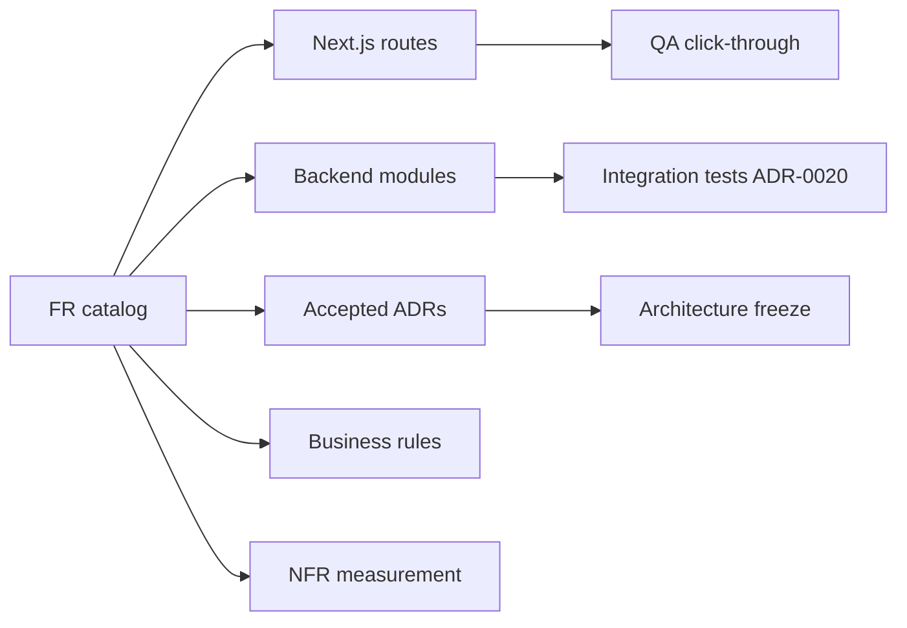

---

## 25.12 NFR Measurement Methods Catalog

Each NFR class below defines **metric**, **method**, **tooling**, **cadence**, and **Enterprise Assumption** where load tests are not yet repository-evidenced.

### 25.12.1 Performance (NFR-PERF-*)

| Metric | Method | Tooling | Cadence | Assumption label |
|---|---|---|---|---|
| API p95 latency (non-AI) | Synthetic probe against staging/prod | k6/hey or pytest timings | Weekly post-deploy | Numeric budgets **Enterprise Assumption** until load test ADR evidence |
| API p95 latency (AI Tutor) | Gateway log percentiles from `ai.ai_requests` | SQL on ai schema + admin analytics | Daily in ops | Model latency external |
| TTFB web | Lighthouse CI on critical routes | GitHub Action optional | Per release | — |
| Practice generate time | Integration timer | pytest | On PR for assessment | — |

**Method note:** Never cite a latency SLO as “met” without a named run artifact. Prefer “instrumented” vs “load-tested.”

### 25.12.2 Scalability (NFR-SCALE-*)

| Metric | Method | Tooling | Cadence |
|---|---|---|---|
| Concurrent WAU headroom | Vertical scale experiment on VPS | Coolify metrics / node stats | Before paid campaigns |
| DB connection saturation | Postgres stats | `pg_stat_activity` | Weekly |
| Redis pressure | Memory/eviction stats | Redis INFO | Weekly |
| Alembic migration duration | Timed migrate on staging clone | Alembic | Each migration |

**Forbidden shortcut:** Claiming horizontal microservice scale. Scale story is vertical monolith + Postgres/Redis tuning (ADR-0001/0006).

### 25.12.3 Availability (NFR-AVL-*)

| Metric | Method | Tooling | Cadence |
|---|---|---|---|
| `/health` success | External uptime check | Uptime robot / Coolify | Continuous when prod live |
| `/ready` dependency readiness | Ready fails if DB/Redis down | App endpoints | Continuous |
| Deploy success rate | Checklist completion | `docs/deploy` | Per deploy |
| Rollback drill | Game day | RUNBOOK | Quarterly |

### 25.12.4 Security (NFR-SEC-*)

| Metric | Method | Tooling | Cadence |
|---|---|---|---|
| CSRF coverage | Route audit + tests | pytest; manual | Each auth/commerce change |
| Cookie flags | Browser/devtools inspection | Manual + e2e | Each auth change |
| Suspended login denial | Integration test | ADR-0020 suite | CI |
| HMAC verify | Unit tests for signatures | pytest | CI |
| Secret leakage | gitleaks/Trivy/npm audit | GitHub workflows | Per PR |
| Rate limit efficacy | Burst scripts on `/auth/login` | custom | Pre-prod |

### 25.12.5 Privacy (NFR-PRIV-*)

| Metric | Method | Tooling | Cadence |
|---|---|---|---|
| PII minimization review | Design review checklist | ADR/privacy notes | Quarterly |
| Admin export control | Permission tests | RBAC tests | Per change |
| Retention policy readiness | Gap register vs DPDP | Counsel + Product | Quarterly |

Legal interpretation remains counsel-owned; engineering measures access control and minimization.

### 25.12.6 Accessibility (NFR-A11Y-*)

| Metric | Method | Tooling | Cadence |
|---|---|---|---|
| Critical path keyboard | Manual QA script | Browser | Per UX release |
| Contrast on learning UI | axe/Lighthouse | CI optional | Per UX release |
| Labeling on practice forms | Review | Story/PR checklist | Per form change |

Targets are WCAG orientation, not certification claim.

### 25.12.7 Observability (NFR-OBS-*)

| Metric | Method | Tooling | Cadence |
|---|---|---|---|
| Envelope `traceId` present | Contract tests | pytest | CI |
| AI cost visibility | Admin analytics panels | `/admin/analytics` | Daily ops |
| Audit log completeness | Sample admin actions | `/admin/audit-logs` | Weekly |

### 25.12.8 Maintainability (NFR-MAINT-*)

| Metric | Method | Tooling | Cadence |
|---|---|---|---|
| Module boundary violations | PR review against ADR-0001 | CODEOWNERS/review | Per PR |
| Test suite green | CI | GitHub Actions | Per PR |
| Prompt file review | Diff requires Content/Eng | CODEOWNERS | Per prompt PR |

### 25.12.9 AI safety/cost (NFR-AI-*)

| Metric | Method | Tooling | Cadence |
|---|---|---|---|
| Cost / WAU | SQL on `ai.ai_requests` | analytics | Daily |
| Fallback activation | Log/alert when FallbackProvider serves | ops | Continuous |
| Grounding sample audit | Human sample of Tutor/KU outputs | Content | Weekly |
| Draft-only QG | Attempt publish without review must fail | workflow tests | CI |
| Agent count == 4 | Architecture test / grep agents | review | Monthly |

### 25.12.10 Operability (NFR-OPS-*)

| Metric | Method | Tooling | Cadence |
|---|---|---|---|
| Coolify dry-run complete | Checklist signed | `docs/deploy` | Until RISK-020 closed, every attempt |
| Image env correctness | Smoke `NEXT_PUBLIC_API_URL` | VERIFICATION_CHECKLIST | Per deploy |
| Volume backup verify | Restore drill | ops | Quarterly |
| Non-root container | Image config audit | compose/Dockerfile | Per release |

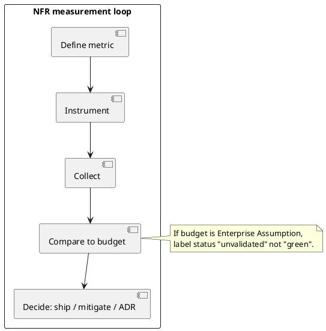

---

## 26.9 Business Rule Decision Tables

### 26.9.1 ECAEP transition decision table

| Current state | Event | Actor permission | Guard | Next state | Else |
|---|---|---|---|---|---|
| DRAFT | submit | content.submit_for_review | body schema valid | AI_CHECKED path → IN_REVIEW | stay DRAFT + errors |
| IN_REVIEW | approve | content.approve | — | APPROVED | stay / changes-requested |
| APPROVED | publish | content.publish | — | PUBLISHED | stay |
| PUBLISHED | archive | content.archive | — | ARCHIVED | stay |
| PUBLISHED | force_edit | content.force_edit_published | break-glass | editable path per rules | deny |
| ANY | auto_publish_from_QG | system | — | **Forbidden** | remain DRAFT |

### 26.9.2 Commerce payment decision table

| Condition | Result | Envelope / UX |
|---|---|---|---|
| Razorpay keys missing | No order / 503 honesty | Fail closed |
| Order create OK | PENDING order | Client checkout |
| Signature valid | PAID | Premium true |
| Signature invalid | Reject | No entitlement |
| Replay old signature | Reject | No entitlement |
| Subscription SKU requested | Out of scope | Requires ADR |

### 26.9.3 AI agent invocation decision table

| Agent | Permission | Grounding expectation | Output persistence | Publish? |
|---|---|---|---|---|---|
| Tutor | ai.use | Prefer PASSED KU when path complete | logs in ai_requests | N/A |
| QG | content/ai perms | From PASSED KU when generating from KU | DRAFT cms item | No |
| Planner | ai.use | Uses mastery/weakness | plan payload | N/A |
| Evaluator | system/content path | Rubric on submission | AI check result | No |

### 26.9.4 Mastery update decision table

| Event | Concept mastery | Topic rollup | Recommendations |
|---|---|---|---|
| Practice submit graded | Recompute | On read/recompute path | May change weak set |
| Mock submit | Recompute per rules | Same | Same |
| Browse only | No write | No | No |
| Admin edits question | No student mastery wipe | — | — |

### 26.9.5 Licensing decision table (ingestion)

| Source type | License evidence | Allow ingestion? | Allow publish to students? |
|---|---|---|---|---|
| NCERT-aligned original | Author attestation | Yes | After ECAEP |
| Licensed third party | Written license | Yes | After ECAEP |
| Aakash/Allen/PW/Unacademy scrape | None | **No** | **No** |
| Random Telegram PDF pack | Unknown | **No** | **No** |
| Student-uploaded pirated pack | Unknown | **No** | **No** |

### 26.9.6 Decision table — “Is RAG in scope?”

| Question | Answer | ADR |
|---|---|---|
| Vector embeddings column? | No | FR-KU-006 / deferrals |
| Retrieval-augmented Tutor via vector DB? | Not shipped | ADR future |
| Structured KU facts + grounding check? | Yes (shipped path) | ADR-0024+ |
| CQRS/event sourced read models? | No | Architecture freeze |
| Knowledge graph product UX? | No | Deferred |

---

## 27.x Scope Rationale Essay — Why This Production Target Exists

### 27.x.1 Essay: The learning loop is the product

TALOS’s production target is not a catalog of BRD fantasies (280 tables, 12 agents, full KG). It is the **smallest closed loop** that can prove mastery-visible NEET practice under governance: identity → academic browse → published content → practice/mock → mastery → recommendation/revision → metered Claude tutoring → Razorpay Premium honesty → admin analytics/ops. Each shipped sprint SP0–SP9 exists because removing it breaks either trust, measurement, or operability.

### 27.x.2 Essay: Why ECAEP is in scope though “slow”

Market competitors can dump MCQs faster. They also dump liability and distrust. ECAEP is in scope because the brand thesis is **trust-and-mastery**. Without it, FR-AI-005’s draft-only rule is theater. Content velocity must come from KU reuse and SME staffing, not from deleting states.

### 27.x.3 Essay: Why KU is in scope but embeddings are not

Knowledge Units industrialise “extract once, generate many” with source verification. Embeddings/RAG optimize a different problem (soft retrieval) and invite false “AI brain” narratives before grounding UX is finished. Scope includes KU; scope excludes pretending vectors shipped.

### 27.x.4 Essay: Why one Next.js app includes admin

ADR-0008 rejects a second admin SPA. Admin routes under the same Next.js app reduce SSO/cookie drift and keep the modular monolith honest. Scope therefore includes `/admin/**` in the web app, not a separate frontend program.

### 27.x.5 Scope inventory cross-check table

| In-scope cluster | Why economically | Why technically frozen |
|---|---|---|
| Custom JWT auth | Control cookies/CSRF | ADR-0003 |
| Modular monolith | Speed + coherence | ADR-0001 |
| Four agents | Quality management | ADR-0004 |
| Razorpay one-time | India payments + honesty | ADR-0018 |
| Coolify/Hetzner | MVP hosting | ADR-0006 |
| Hindi content | Cluster B demand | ADR-0019 |
| Ingestion+KU | Coverage industrialisation | ADR-0022–0028 |

---

## 28.x Out-of-Scope Rationale Essays

### 28.x.1 Essay: Native apps deferred

Native apps multiply release trains, push-notification scope, and store review risk. Web-responsive delivery validates the loop first (ADR-0007). Out-of-scope is not “never”; it is “not before retention economics clear.”

### 28.x.2 Essay: Live classes out

Live classes are a different company shape (instructors, CDN, schedules, refunds). Including them would destroy SOM focus and SME editorial capacity. Companion positioning is the strategic alternative.

### 28.x.3 Essay: Multi-tenancy out

`organizations` table may be reserved, but `tenant_id` must not thread APIs. Institute sales narratives that require tenancy need an ADR and schema program; sneaking it in breaks identity and commerce assumptions.

### 28.x.4 Essay: Auto-publish AI out

Auto-publish maximizes demo wow and maximizes RISK-012. It is structurally out because it violates ECAEP and FR-AI-005.

### 28.x.5 Essay: OpenAI-as-primary out (unless adapter)

Hard-wiring OpenAI SDKs into agents would lie relative to repository truth and bypass Gateway discipline. A future second **adapter** behind the Gateway can exist without renaming the product an “OpenAI app.”

### 28.x.6 Essay: RAG/KG/CQRS out

These patterns are absent from shipped architecture. Documenting them as FUTURE prevents blueprint readers from filing bugs against nonexistent services. Value/cost: high complexity, unclear gain before KU grounding completes.

### 28.x.7 OOS decision matrix

| OOS item | Value if done early | Cost/risk if done early | Revisit trigger |
|---|---|---|---|
| Native apps | Distribution | Split eng capacity | D30 retention + WAU threshold |
| Live class | ARPU | Company reshape | Strategic pivot ADR |
| Subscriptions | LTV | Billing ops + ADR | PX experiments + ops readiness |
| Embeddings/RAG | Fancy Tutor | Ops + false confidence | KU Tutor path complete + eval harness |
| KG UX | Differentiation narrative | Speculative schema | Prerequisites + pedagogy research |
| Microservices | Illusory scale | Freeze violation | Never for MVP vanity |
| Auth.js | Familiarity | Dual auth mess | Never while ADR-0003 stands |
| Coaching PDF ingest | Coverage speed | Existential IP risk | Only with explicit license |

---

## 29.x Assumption Invalidation Tests

Each assumption has a **test**, **evidence**, **owner**, and **action if falsified**. This converts Chapter 29 from static list to operable science.

| ASSUM theme | Invalidation test | Evidence artifact | Owner | If falsified |
|---|---|---|---|---|
| Self-paced digital SOM exists | Pilot: organic signups achieve D7 practice above floor | Funnel dashboard | Product | Pivot messaging or freeze GTM |
| Parents pay one-time Premium after freemium proof | PX cohort PAID rate ≥ floor | commerce.orders | Product | Adjust freemium or consider sub ADR |
| Claude cost manageable under meters | Cost/WAU ≤ budget for 4 weeks | ai.ai_requests | Eng | Tighten meters; second adapter plan |
| ECAEP throughput feasible | IN_REVIEW p90 ≤ target with staffed SMEs | Queue metrics | Content | Pause QG; hire/review tooling |
| NCERT-aligned corpus sufficient for trust | Parent interviews / ticket codes | Research notes | Product | Strengthen citations; messaging |
| Web-only acceptable vs native | Mobile web retention ≈ peer web products | Analytics | Product | Native ADR when data demands |
| Fail-closed payments increase trust | Support qualitative + conversion | Tickets + PAID rate | Product | Improve status UX (not fake success) |
| Rule-based recommendations “good enough” | CTR diversity + qualitative | learning metrics | Eng/Product | Tune rules; still no fake ML |
| Coolify path viable | Signed dry-run | deploy checklist | Ops | Fix blockers before claiming prod |
| Hindi content without UI i18n acceptable | Ticket rate on language confusion | Support | Product | UI i18n ADR if systemic |
| No RAG required for Tutor usefulness | Blind sample ratings with KU path | Content audit | AI Eng | Only then consider retrieval ADR |
| Single VPS suffices initially | Error rate under load probe | ops metrics | Ops | Vertical scale; still no microservices |

### 29.x.1 Invalidation test protocol

1. Write the assumption ID and numeric floor **before** the pilot week.  
2. Collect evidence in git-friendly form (dashboard export, test log, checklist).  
3. In weekly forum, mark assumption **holds / weak / falsified**.  
4. Falsified assumptions generate either a product change or an ADR — not silent slide edits.

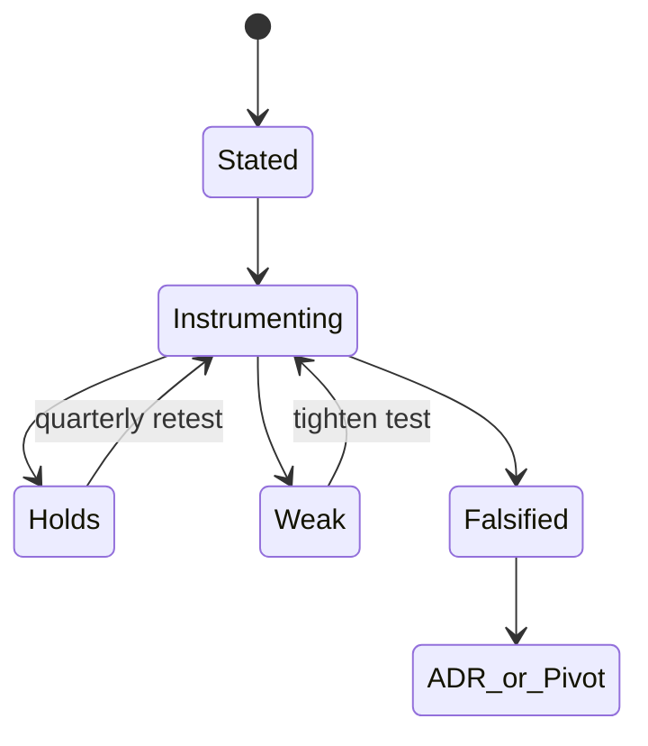

---

## 30.x Constraint Matrices (Expanded)

### 30.x.1 Constraint × FR impact matrix

| Constraint | Blocks these FR changes | Allows |
|---|---|---|
| Modular monolith | New deployable services as default | New modules under `app/modules/*` |
| Custom JWT | Auth.js migration PRs | Cookie/CSRF hardening |
| Claude Gateway | Hard-coded OpenAI agents | New provider **adapter** |
| ECAEP | Auto-publish features | Better review UX |
| ADR-0005 IP | Coaching scrape ingestion | Licensed/original sources |
| Razorpay one-time | Silent subscription billing | PX within one-time + future ADR |
| No embeddings column | Vector schema PRs | KU structured fields |
| English UI | Full i18n chrome | Hindi content |
| Alembic-only | Hand prod DDL | Migrations |
| No tenant_id | Multi-tenant filters | Reserved organizations table only |

### 30.x.2 Constraint × NFR conflict matrix

| If we push NFR… | Constraint tension | Resolution |
|---|---|---|
| Extreme AI p95 | Model provider limits | Meter + UX honesty; not fake local LLM claims |
| Horizontal scale | Monolith freeze | Vertical + DB tuning first |
| Perfect offline | Web-first | Out of scope offline mode |
| Instant content velocity | ECAEP | KU reuse + SME capacity |
| Multi-region active-active | Single VPS MVP | Future ops ADR |

### 30.x.3 Constraint flexibility classes

| Class | Meaning | Example |
|---|---|---|
| Hard freeze | Needs ADR + CTO/Architect | Microservices, Auth.js, auto-publish |
| Soft freeze | Product+Architect | Paywall thresholds, meters |
| Config | Eng with Product inform | Rate limit numbers |
| Experimental | Time-boxed PX | Price points one-time |

### 30.x.4 Constraint traceability to ADRs

| CONSTR group | ADR anchors | Test of adherence |
|---|---|---|
| Technical | 0001–0004, 0008–0009, 0014 | Module review + agent count |
| Legal/IP | 0005, 0018, 0023 | Ingestion license checklist |
| Budget/ops | 0006, 0018; deploy docs | Cost/WAU + dry-run |
| Org/naming | 0008, 0010 | Single web app; TALOS name |
| Exam/regulatory | 0013; DPDP lens | Scoring tests; privacy reviews |
| Freeze extras | 0007 deferrals | OOS list stable |

---

## 24.17 FR Verification Methods Matrix

| Domain | Unit tests | Integration (ADR-0020) | Browser click-through | Admin analytics corroboration |
|---|---|---|---|---|
| Identity | hash/JWT/CSRF | register/login/refresh/logout | auth pages | — |
| Academic | hierarchy queries | seed idempotency | browse subjects | — |
| CMS | transitions | submit/review/publish | content UI | coverage |
| Assessment | +4/−1 scoring | generate/submit | practice/mock | assessment analytics |
| AI | gateway mocks | agent without key / fallback | explain/plan | AI cost panels |
| Learning | mastery recompute | submit→mastery | dashboard | — |
| Commerce | HMAC vectors | order+verify | checkout | — |
| Ingestion/KU | structure/ground | job run on fixture PDF | admin ingestion/KU | counters |

---

## 25.13 NFR-to-Risk Bridge

| NFR class | Primary RISK-IDs | Measurement feeds mitigation? |
|---|---|---|
| PERF/AI latency | 010, 011 | Yes — meters/fallback |
| SEC | 015–019 | Yes — tests/scanning |
| OPS | 020–024, 038 | Yes — dry-runs |
| AI safety | 012–014, 037 | Yes — audits/queues |
| PRIV | 025 | Yes — gap register |
| MAINT | 028, 032–035 | Yes — reviews |

---

## 26.10 BR Conflict Resolution

When two business rules appear to conflict, apply:

1. **Safety/IP/payment integrity** over convenience.  
2. **Accepted ADR** over blueprint narrative.  
3. **Fail closed** over fail open for commerce and auth.  
4. **Human publish** over AI speed.  
5. File ADR if product seeks permanent exception.

Example: Growth wants to skip IN_REVIEW for “trusted SME.” Rule: still no skip unless ADR changes ECAEP; use staffing, not gate deletion.

---

## 27–30 Synthesis — Requirements Governance Loop

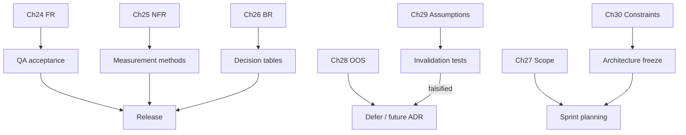

Part D remains the requirements spine for TALOS / AI NEET Exam App: full FR tables with acceptance gists, NFR measurement methods that refuse unearned green status, BR decision tables that encode ECAEP/commerce/AI/licensing, scope and out-of-scope essays that explain the wedge, assumption invalidation tests that make planning falsifiable, and constraint matrices that tie freezes to ADRs and FR impact.
