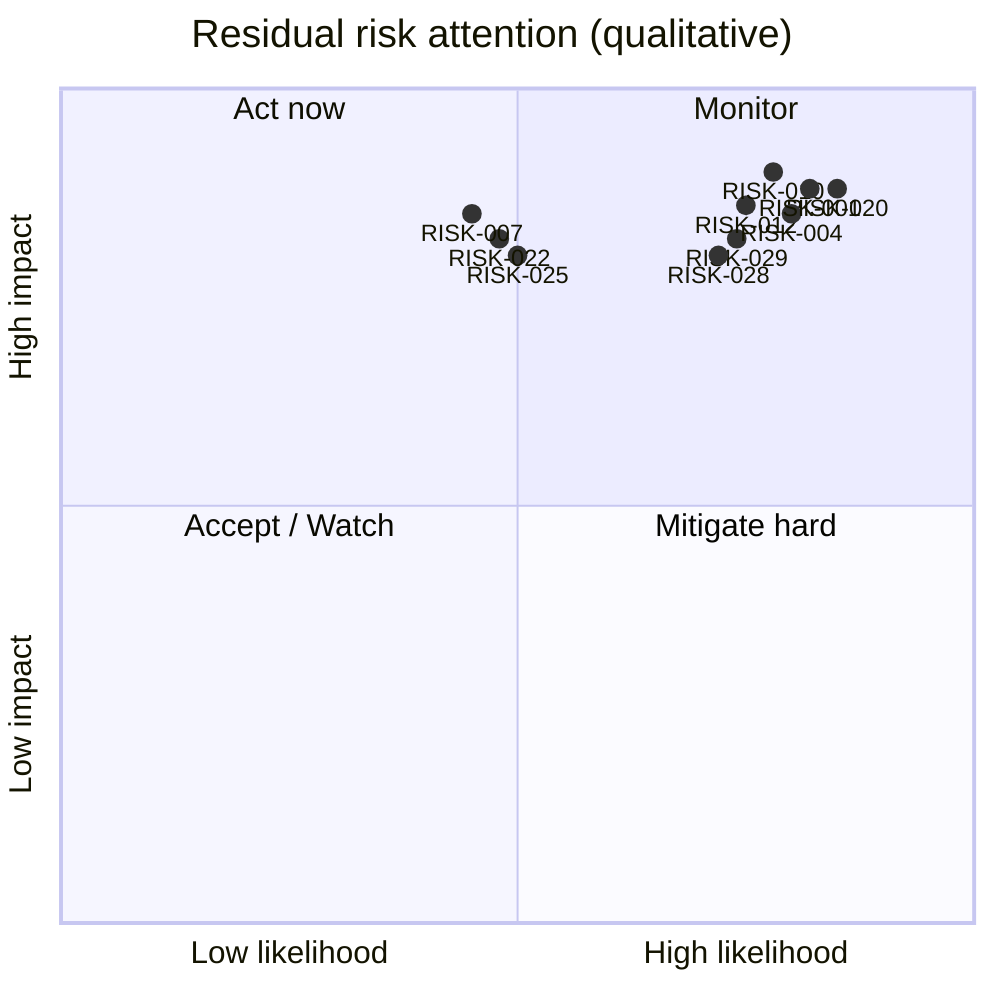
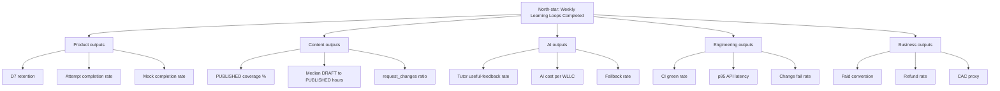
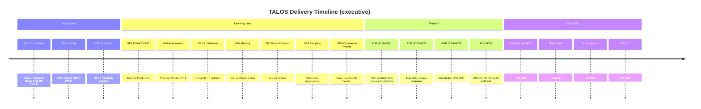
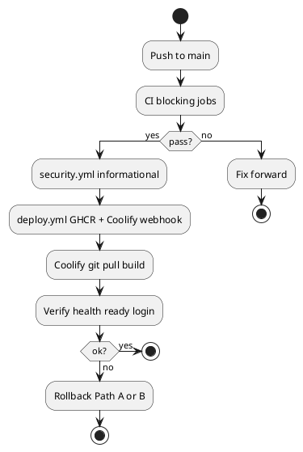

---

title: "TALOS Volume 1 — Part 5: Risk, Metrics, Governance and Appendices"

subtitle: "Chapters 31–40"

product: "Trinetra AI Learning OS (TALOS)"

---


# Part 5 — Risk, Metrics, Governance and Closing Matter


Chapters 31–40 close Volume 1 of the Trinetra AI Learning OS (TALOS) Executive and Product Blueprint. They convert earlier product and architecture narrative into operable risk, KPI, success, roadmap, release, and governance controls, then provide appendices, glossary, and references grounded in the real repository. Companion diagrams live under `docs/blueprint/volume-01/diagrams/`.

# 31. Risks

This chapter is the Volume 1 **risk register** for Trinetra AI Learning OS (TALOS). It is written for executives, product, engineering, content, security, and ops — not as a vague SWOT slide. Each row uses a stable **RISK-ID**, a **category**, a concrete **description**, qualitative **likelihood** and **impact** (L/M/H), a numeric **score** (1–9), an **owner**, and a **status**. Categories used: product, market, content IP, AI cost/quality, security, ops/deploy, regulatory, team, architecture freeze violations. Scores are Likelihood × Impact with L=1, M=2, H=3. They are comparable within TALOS, not calibrated probabilities. The register deliberately includes risks that are already Mitigated — institutional memory matters when regressions recur (e.g., suspended user login). Honesty constraints from deploy docs carry into risk: CI/CD and Coolify are real artifacts, but production execution may still be pending a git remote — that fact is RISK-020, not a footnote.

## 31.0 Scoring method and review cadence

Critical (9): weekly owner update; High (6–8): biweekly; Medium (3–5): monthly; Low (1–2): quarterly or on trigger. Any architecture freeze violation at M/H impact escalates to Product Owner within 48 hours of discovery. Risk reviews consume leading indicators from Chapter 32 and KPIs from Chapter 33 — they are not theatrical risk theater disconnected from metrics. When a risk is retired, mark status Retired and keep the RISK-ID permanently reserved.

## 31.1 Master risk register

| RISK-ID | Category | Description | Likelihood | Impact | Score | Owner | Status |
|---|---|---|---|---|---|---|---|
| RISK-001 | product | Students churn before mastery loop proves value — practice → score → mastery → recommend is correct but sparse content makes the first session feel empty. | H | H | 9 (Critical) | Product Owner | Open |
| RISK-002 | product | Mock-test UX diverges from real NEET timing/psychology; students distrust scores as exam proxies. | M | H | 6 (High) | Product Owner | Monitoring |
| RISK-003 | product | Recommendation ranking (due → weak → new) feels repetitive without enough tagged micro-competencies. | M | M | 4 (Medium) | Engineering | Open |
| RISK-004 | market | Coaching-platform incumbents (brand + distribution) outspend TALOS on acquisition before product-market fit. | H | H | 9 (Critical) | Product Owner | Open |
| RISK-005 | market | NEET pattern/notification changes by NTA reduce perceived relevance of current syllabus seeding. | L | H | 3 (Low) | Product Owner | Watch |
| RISK-006 | market | Price sensitivity for one-time Razorpay SKU vs free YouTube/Telegram content packs. | H | M | 6 (High) | Product Owner | Open |
| RISK-007 | content IP | Inadvertent ingestion of Aakash/Allen/PW/Unacademy material violates ADR-0005 licensing freeze. | M | H | 6 (High) | Content SME | Mitigated |
| RISK-008 | content IP | NCERT citation drift — KnowledgeUnit.ncert_reference denormalized incorrectly after restructure. | M | M | 4 (Medium) | Engineering | Open |
| RISK-009 | content IP | Visual assets extracted from study PDFs include third-party watermarks or copyrighted figures. | M | H | 6 (High) | Content SME | Open |
| RISK-010 | AI cost/quality | Claude API spend spikes under Tutor + generation without per-user/day budgets. | H | H | 9 (Critical) | Engineering | Open |
| RISK-011 | AI cost/quality | FallbackProvider masks outages in staging; production ships with missing ANTHROPIC key unnoticed. | M | H | 6 (High) | Ops Owner | Mitigated |
| RISK-012 | AI cost/quality | Hallucinated MCQ explanations pass AI_CHECKED but fail human review at scale, backlog grows. | H | H | 9 (Critical) | Content SME | Open |
| RISK-013 | AI cost/quality | Prompt drift — unreviewed edits to apps/backend/app/modules/*/prompts change pedagogy silently. | M | H | 6 (High) | Engineering | Open |
| RISK-014 | AI cost/quality | Grounding check false negatives allow ungrounded structured_facts into PASSED KnowledgeUnits. | M | H | 6 (High) | Engineering | Open |
| RISK-015 | security | Refresh-token theft via XSS if any future change stores tokens outside HTTP-only cookies. | L | H | 3 (Low) | Security | Mitigated |
| RISK-016 | security | CSRF bypass on state-changing routes if SameSite/cookie flags regress. | M | H | 6 (High) | Security | Monitoring |
| RISK-017 | security | Suspended users regain access if admin status checks regress (fixed once in SP9; can recur). | M | H | 6 (High) | Engineering | Mitigated |
| RISK-018 | security | Razorpay HMAC verification skipped or weakened introduces fake entitlements. | L | H | 3 (Low) | Engineering | Mitigated |
| RISK-019 | security | Secrets committed to git or leaked via Actions logs (gitleaks currently non-blocking). | M | H | 6 (High) | Ops Owner | Open |
| RISK-020 | ops/deploy | No Git remote yet — CI/CD and Coolify paths are documented but unexercised in production. | H | H | 9 (Critical) | Ops Owner | Open |
| RISK-021 | ops/deploy | First Coolify deploy fails TLS/DNS; team lacks dry-run discipline from RUNBOOK.md. | M | H | 6 (High) | Ops Owner | Open |
| RISK-022 | ops/deploy | Alembic migration applied forward; bad app code rolled back leaving schema/app mismatch. | M | H | 6 (High) | Engineering | Open |
| RISK-023 | ops/deploy | Named volume loss (manual docker volume rm) destroys study_material_data / visual_assets_data. | L | H | 3 (Low) | Ops Owner | Watch |
| RISK-024 | ops/deploy | Trivy/CodeQL/npm audit left non-blocking; known CVEs accumulate past triage window. | M | M | 4 (Medium) | Security | Open |
| RISK-025 | regulatory | India DPDP obligations for student PII (email, auth logs) under-specified in ops runbooks. | M | H | 6 (High) | Product Owner | Open |
| RISK-026 | regulatory | Payment data handling assumptions wrong if Razorpay integration expands beyond one-time SKU. | L | H | 3 (Low) | Engineering | Watch |
| RISK-027 | regulatory | Claims of 'guaranteed NEET rank' in marketing create unfair-trade / advertising risk. | M | H | 6 (High) | Product Owner | Open |
| RISK-028 | team | Single-threaded knowledge of modular monolith boundaries; bus factor on identity/AI gateway. | H | H | 9 (Critical) | Engineering | Open |
| RISK-029 | team | Content SME capacity insufficient to clear ECAEP IN_REVIEW queue as generation scales. | H | H | 9 (Critical) | Content SME | Open |
| RISK-030 | team | Architecture freeze fatigue — pressure to 'just add microservices' or Auth.js mid-flight. | M | M | 4 (Medium) | Product Owner | Monitoring |
| RISK-031 | architecture freeze violations | Silent introduction of second frontend app or admin SPA contrary to ADR-0008. | L | H | 3 (Low) | Engineering | Mitigated |
| RISK-032 | architecture freeze violations | Cross-module ORM joins / shared tables bypassing repository boundaries (ADR-0001). | M | H | 6 (High) | Engineering | Open |
| RISK-033 | architecture freeze violations | Hand-edited production schema instead of Alembic (CLAUDE.md / ADR convention). | L | H | 3 (Low) | Ops Owner | Mitigated |
| RISK-034 | architecture freeze violations | New AI agent beyond Tutor/QG/Planner/Evaluator without ADR (violates ADR-0004/0007). | M | M | 4 (Medium) | Product Owner | Watch |
| RISK-035 | architecture freeze violations | tenant_id threaded through APIs before multi-tenancy ADR (explicitly forbidden for MVP). | L | M | 2 (Low) | Engineering | Mitigated |
| RISK-036 | product | Hindi content (ADR-0019) partial coverage confuses bilingual students when UI remains English-only. | M | M | 4 (Medium) | Product Owner | Open |
| RISK-037 | AI cost/quality | Ingestion 'extract once generate many' produces low-diversity MCQs for a chapter. | M | M | 4 (Medium) | Engineering | Open |
| RISK-038 | ops/deploy | NEXT_PUBLIC_API_URL baked wrong into web image; cookies/API host mismatch in prod. | M | H | 6 (High) | Ops Owner | Open |
| RISK-039 | content IP | force_edit_published overused, weakening ECAEP audit trail trust. | L | M | 2 (Low) | Content SME | Watch |
| RISK-040 | market | Phase 2 Knowledge Unit mastery not yet visible enough in student UI to differentiate vs generic quiz apps. | H | M | 6 (High) | Product Owner | Open |

### 31.1 Per-risk detection pointers (unique)

The master register above is authoritative for scores and owners. Category intro paragraphs and identical “Detection” boilerplate previously repeated under every RISK-ID have been removed. Use this table for **risk-specific** leading indicators; Chapter 32 holds mitigation/contingency plans.

| RISK-ID | Specific leading indicator | Primary control artifact |
|---|---|---|
| RISK-001 | D1 activation: practice started + mastery row written within 24h of register | Student funnel; pilot-chapter coverage |
| RISK-002 | Mock completion rate; post-mock score-trust survey item | Mock timer UX; +4/−1 tests (ADR-0013) |
| RISK-003 | Recommendation click-through diversity (unique concepts/week) | Micro-competency tagging (ADR-0021) |
| RISK-004 | Organic vs paid mix; CAC vs 30-day retained WAU | ECAEP+KU positioning; no coaching parity chase |
| RISK-005 | NTA notification watchlog entries | Syllabus SOP; academic seed via Alembic |
| RISK-006 | Checkout start→PAID conversion; refund/chargeback rate | Freemium value; honest 503 without Razorpay keys |
| RISK-007 | Ingestion source license checklist failures | ADR-0005; StudyMaterial licensing gate |
| RISK-008 | KU `ncert_reference` mismatch audits | Grounding check; structure_section validation |
| RISK-009 | `visual_assets.review` reject rate for watermark/third-party | Visual asset review UI (ADR-0026) |
| RISK-010 | AI cost / WAU; p95 tokens/request by agent | Gateway logs; admin AI analytics; budgets |
| RISK-011 | Staging/prod “FallbackProvider active” when key expected | Deploy secrets checklist; RUNBOOK |
| RISK-012 | ECAEP AI_CHECKED→IN_REVIEW reject rate; reviewer hours/item | Evaluator prompts; human approve/publish |
| RISK-013 | Unreviewed prompt-file diffs in PRs | Prompt files as production code; CODEOWNERS |
| RISK-014 | Grounding false-negative sample audits | Source verification gate (ADR-0024) |
| RISK-015 | CSP/XSS findings; token storage audits | HTTP-only cookies only (ADR-0003) |
| RISK-016 | CSRF middleware regression tests | `verify_csrf` on mutating routes |
| RISK-017 | Suspended-user login integration test | SP9 status check; auth tests |
| RISK-018 | `verify_payment_signature` unit tests; no PAID without HMAC | ADR-0018 commerce |
| RISK-019 | gitleaks/Trivy findings aging past SLA | Make secret scan blocking when ready |
| RISK-020 | First successful Coolify dry-run checklist signed | `docs/deploy/*`; git remote |
| RISK-021 | TLS/DNS dry-run failures | RUNBOOK DNS/TLS section |
| RISK-022 | Migration+app version skew incidents | Alembic-only; rollback SOP |
| RISK-023 | Volume backup verification | Docker volume backup policy |
| RISK-024 | Open CVE age beyond triage window | Dependency review workflow |
| RISK-025 | DPDP gap-register open items | Privacy program; counsel |
| RISK-026 | Commerce SKU expansion without ADR | ADR-0018 freeze until new ADR |
| RISK-027 | Marketing claim review rejects | No guaranteed-rank claims |
| RISK-028 | Bus-factor map; docs coverage on identity/AI gateway | Module template; pairing |
| RISK-029 | IN_REVIEW queue age p50/p90 | SME capacity plan; ECAEP UX |
| RISK-030 | ADR exception request volume | Freeze RACI; Product Owner |
| RISK-031 | Second frontend app proposals in PRs | ADR-0008; CODEOWNERS |
| RISK-032 | Cross-module join code-review findings | Repository boundaries (ADR-0001) |
| RISK-033 | Manual schema change incidents | Alembic-only policy |
| RISK-034 | Agent count >4 proposals | ADR-0004 / ADR-0007 |
| RISK-035 | `tenant_id` column/API proposals | Multi-tenancy deferral |
| RISK-036 | Hindi content coverage % vs English; support tickets | ADR-0019; UI remains English |
| RISK-037 | MCQ diversity metrics per chapter post-ingestion | Prompt + review sampling |
| RISK-038 | `NEXT_PUBLIC_API_URL` mismatch smoke | Image build-args checklist |
| RISK-039 | `force_edit_published` usage count | Audit log; break-glass policy |
| RISK-040 | Student UI surfaces showing KU mastery | Close ADR-0028 UX gaps without embeddings |

## 31.2 Portfolio view

Critical cluster today: product activation (RISK-001), market distribution (RISK-004), AI cost and quality (RISK-010/012), unexercised deploy path (RISK-020), and team/content capacity (RISK-028/029). Security has strong mitigations from SP1/SP9 but must not become complacent — CSRF and secret scanning remain active concerns. Architecture freeze violations score lower on likelihood because culture and ADRs exist, yet impact remains high if they land. Content IP risks are existential for brand trust; ADR-0005 is both ethics and strategy.

## 31.3 Risk interactions

RISK-001 amplifies RISK-004: poor activation makes paid acquisition wasteful. RISK-012 amplifies RISK-029: bad AI drafts consume scarce reviewer hours. RISK-020 blocks empirical validation of RISK-021/022/038. RISK-010 and WLLC efficiency KPIs are coupled. RISK-040 depends on closing ADR-0028 disclosed gaps without leaping into FUTURE embeddings.

**Register maintenance note.** Owners update status and score rationale in the same weekly product forum that reviews WLLC. Do not maintain a parallel secret spreadsheet that diverges from this RISK-ID set; export from git if executives need slides. New risks get the next RISK-ID and must name a category from the closed list unless Product Owner expands the taxonomy via blueprint amendment. Linked ADRs and module paths should appear in mitigation notes when controls are code-backed.

# 32. Mitigation

This chapter converts the highest-scoring and strategically important risks into actionable mitigation plans. Each plan has four fields: **mitigation** (reduce likelihood/impact now), **contingency** (what we do if the risk materializes), **residual risk** (what remains after mitigation), and **leading indicators** (what we watch before the lagging metric breaks). Mitigations must respect the architecture freeze: no microservices, no Auth.js, no second admin app, no auto-publish of AI content, no unlicensed coaching material.

## 32.1 Top-risk mitigation plans

### RISK-001 — product

**Risk restatement.** Students churn before mastery loop proves value — practice → score → mastery → recommend is correct but sparse content makes the first session feel empty. Score 9 (Critical); owner Product Owner.

- **Mitigation:** Seed one chapter completely (Ohm's Law precedent) per subject before broad marketing; instrument time-to-first-correct and second-session return.

- **Contingency:** If D7 retention < threshold, pause paid acquisition and run content blitz on top-20 weak concepts from analytics.

- **Residual risk:** Some students still bounce when syllabus coverage is uneven across Physics/Chem/Bio.

- **Leading indicators:** D1→D7 return rate; practice starts per new user; empty-state impressions on concept pages.

**Control mapping.** Prefer controls already in-repo: ECAEP (`docs/architecture/ecaep.md`), AI Gateway + FallbackProvider (ADR-0004/0014), Razorpay HMAC (ADR-0018), Coolify rollback (`docs/deploy/ROLLBACK.md`), integration tests (ADR-0020), grounding check (knowledge module), rate limits and security headers (SP9). New controls require an ADR if they change frozen architecture, auth, content licensing, or deploy topology.

### RISK-004 — market

**Risk restatement.** Coaching-platform incumbents (brand + distribution) outspend TALOS on acquisition before product-market fit. Score 9 (Critical); owner Product Owner.

- **Mitigation:** Compete on AI-grounded mastery loop + NCERT fidelity, not ad share; partner with individual teachers for distribution.

- **Contingency:** Narrow to one board city / cohort for density; delay national brand spend.

- **Residual risk:** Brand awareness remains lower than coaching apps for 12–18 months.

- **Leading indicators:** Organic signup share; teacher-referred cohorts; CAC vs LTV once SKU converts.

**Control mapping.** Prefer controls already in-repo: ECAEP (`docs/architecture/ecaep.md`), AI Gateway + FallbackProvider (ADR-0004/0014), Razorpay HMAC (ADR-0018), Coolify rollback (`docs/deploy/ROLLBACK.md`), integration tests (ADR-0020), grounding check (knowledge module), rate limits and security headers (SP9). New controls require an ADR if they change frozen architecture, auth, content licensing, or deploy topology.

### RISK-010 — AI cost/quality

**Risk restatement.** Claude API spend spikes under Tutor + generation without per-user/day budgets. Score 9 (Critical); owner Engineering.

- **Mitigation:** Per-route rate limits; log cost/latency in AI module analytics; prefer cached published notes before Tutor calls; budget alerts.

- **Contingency:** Force FallbackProvider for non-critical paths; disable generation workers temporarily.

- **Residual risk:** Tutor quality drops in fallback; generation backlog grows.

- **Leading indicators:** Daily AI spend; p95 Tutor latency; fallback invocation rate; tokens per successful explain.

**Control mapping.** Prefer controls already in-repo: ECAEP (`docs/architecture/ecaep.md`), AI Gateway + FallbackProvider (ADR-0004/0014), Razorpay HMAC (ADR-0018), Coolify rollback (`docs/deploy/ROLLBACK.md`), integration tests (ADR-0020), grounding check (knowledge module), rate limits and security headers (SP9). New controls require an ADR if they change frozen architecture, auth, content licensing, or deploy topology.

### RISK-012 — AI cost/quality

**Risk restatement.** Hallucinated MCQ explanations pass AI_CHECKED but fail human review at scale, backlog grows. Score 9 (Critical); owner Content SME.

- **Mitigation:** ECAEP never auto-publishes; Evaluator agent + human reviewer; grounding check on KU structured_facts.

- **Contingency:** Throttle generation; raise reviewer headcount; quarantine batches with high request_changes rate.

- **Residual risk:** Human review remains the bottleneck; some subtle errors still publish.

- **Leading indicators:** IN_REVIEW queue age; request_changes ratio; post-publish content_report count.

**Control mapping.** Prefer controls already in-repo: ECAEP (`docs/architecture/ecaep.md`), AI Gateway + FallbackProvider (ADR-0004/0014), Razorpay HMAC (ADR-0018), Coolify rollback (`docs/deploy/ROLLBACK.md`), integration tests (ADR-0020), grounding check (knowledge module), rate limits and security headers (SP9). New controls require an ADR if they change frozen architecture, auth, content licensing, or deploy topology.

### RISK-020 — ops/deploy

**Risk restatement.** No Git remote yet — CI/CD and Coolify paths are documented but unexercised in production. Score 9 (Critical); owner Ops Owner.

- **Mitigation:** Treat first GitHub push + Coolify deploy as dry run per CI_CD.md and RUNBOOK.md; complete VERIFICATION_CHECKLIST.

- **Contingency:** Manual Coolify redeploy from last known-good commit; keep GHCR tags for reference.

- **Residual risk:** Until first successful prod deploy, release risk stays theoretical-high.

- **Leading indicators:** Remote configured; first green deploy.yml; /health /ready green; login round-trip.

**Control mapping.** Prefer controls already in-repo: ECAEP (`docs/architecture/ecaep.md`), AI Gateway + FallbackProvider (ADR-0004/0014), Razorpay HMAC (ADR-0018), Coolify rollback (`docs/deploy/ROLLBACK.md`), integration tests (ADR-0020), grounding check (knowledge module), rate limits and security headers (SP9). New controls require an ADR if they change frozen architecture, auth, content licensing, or deploy topology.

### RISK-028 — team

**Risk restatement.** Single-threaded knowledge of modular monolith boundaries; bus factor on identity/AI gateway. Score 9 (Critical); owner Engineering.

- **Mitigation:** Document module templates from identity/; pair on AI gateway and auth; keep ADRs as onboarding.

- **Contingency:** Freeze non-critical features if key owner unavailable; hire contractor with modular-monolith experience.

- **Residual risk:** Deep auth/cookie edge cases still concentrated.

- **Leading indicators:** PRs touching >1 module with second reviewer; runbook drill completion.

**Control mapping.** Prefer controls already in-repo: ECAEP (`docs/architecture/ecaep.md`), AI Gateway + FallbackProvider (ADR-0004/0014), Razorpay HMAC (ADR-0018), Coolify rollback (`docs/deploy/ROLLBACK.md`), integration tests (ADR-0020), grounding check (knowledge module), rate limits and security headers (SP9). New controls require an ADR if they change frozen architecture, auth, content licensing, or deploy topology.

### RISK-029 — team

**Risk restatement.** Content SME capacity insufficient to clear ECAEP IN_REVIEW queue as generation scales. Score 9 (Critical); owner Content SME.

- **Mitigation:** Extract-once-generate-many with human review SLA; micro-competency tagging optional; prioritize PUBLISHED coverage grid gaps.

- **Contingency:** Pause AI generation; authors write CONCEPT_NOTE only for top traffic concepts.

- **Residual risk:** Coverage remains sparse outside seeded chapters.

- **Leading indicators:** Reviewer hours/week; median time DRAFT→PUBLISHED; coverage % by subject.

**Control mapping.** Prefer controls already in-repo: ECAEP (`docs/architecture/ecaep.md`), AI Gateway + FallbackProvider (ADR-0004/0014), Razorpay HMAC (ADR-0018), Coolify rollback (`docs/deploy/ROLLBACK.md`), integration tests (ADR-0020), grounding check (knowledge module), rate limits and security headers (SP9). New controls require an ADR if they change frozen architecture, auth, content licensing, or deploy topology.

### RISK-007 — content IP

**Risk restatement.** Inadvertent ingestion of Aakash/Allen/PW/Unacademy material violates ADR-0005 licensing freeze. Score 6 (High); owner Content SME.

- **Mitigation:** ADR-0005 checklist in ingestion job intake; reject known coaching watermarks; legal review for external PDFs.

- **Contingency:** Quarantine job; delete derived content_versions; audit trail in system.audit_logs.

- **Residual risk:** Borderline 'notes' PDFs still require human judgment.

- **Leading indicators:** Ingestion jobs rejected for license; spot-check sample of PUBLISHED sources monthly.

**Control mapping.** Prefer controls already in-repo: ECAEP (`docs/architecture/ecaep.md`), AI Gateway + FallbackProvider (ADR-0004/0014), Razorpay HMAC (ADR-0018), Coolify rollback (`docs/deploy/ROLLBACK.md`), integration tests (ADR-0020), grounding check (knowledge module), rate limits and security headers (SP9). New controls require an ADR if they change frozen architecture, auth, content licensing, or deploy topology.

### RISK-022 — ops/deploy

**Risk restatement.** Alembic migration applied forward; bad app code rolled back leaving schema/app mismatch. Score 6 (High); owner Engineering.

- **Mitigation:** Additive-only migrations by convention; expand/contract pattern; never auto-downgrade in CI.

- **Contingency:** Manual alembic downgrade with explicit review; or forward-fix migration.

- **Residual risk:** Rare destructive migration still needs human courage and backups.

- **Leading indicators:** Migration PRs with expand/contract notes; backup timestamp before prod migrate.

**Control mapping.** Prefer controls already in-repo: ECAEP (`docs/architecture/ecaep.md`), AI Gateway + FallbackProvider (ADR-0004/0014), Razorpay HMAC (ADR-0018), Coolify rollback (`docs/deploy/ROLLBACK.md`), integration tests (ADR-0020), grounding check (knowledge module), rate limits and security headers (SP9). New controls require an ADR if they change frozen architecture, auth, content licensing, or deploy topology.

### RISK-025 — regulatory

**Risk restatement.** India DPDP obligations for student PII (email, auth logs) under-specified in ops runbooks. Score 6 (High); owner Product Owner.

- **Mitigation:** Minimize PII; document retention for auth/audit; cookie/consent copy; access control on admin exports.

- **Contingency:** Legal counsel review before scaling user base; data subject request runbook.

- **Residual risk:** Full DPDP program still out of band for MVP ops maturity.

- **Leading indicators:** Open DPDP checklist items; time-to-fulfill access/delete request (tabletop).

**Control mapping.** Prefer controls already in-repo: ECAEP (`docs/architecture/ecaep.md`), AI Gateway + FallbackProvider (ADR-0004/0014), Razorpay HMAC (ADR-0018), Coolify rollback (`docs/deploy/ROLLBACK.md`), integration tests (ADR-0020), grounding check (knowledge module), rate limits and security headers (SP9). New controls require an ADR if they change frozen architecture, auth, content licensing, or deploy topology.

### RISK-016 — security

**Risk restatement.** CSRF bypass on state-changing routes if SameSite/cookie flags regress. Score 6 (High); owner Security.

- **Mitigation:** CSRF token middleware + SameSite cookies; regression tests on state-changing routes.

- **Contingency:** Disable vulnerable routes; rotate secrets; force re-login.

- **Residual risk:** New cross-origin admin tooling could reintroduce risk.

- **Leading indicators:** CSRF failure rate; security.yml findings; penetration test notes.

**Control mapping.** Prefer controls already in-repo: ECAEP (`docs/architecture/ecaep.md`), AI Gateway + FallbackProvider (ADR-0004/0014), Razorpay HMAC (ADR-0018), Coolify rollback (`docs/deploy/ROLLBACK.md`), integration tests (ADR-0020), grounding check (knowledge module), rate limits and security headers (SP9). New controls require an ADR if they change frozen architecture, auth, content licensing, or deploy topology.

### RISK-040 — market

**Risk restatement.** Phase 2 Knowledge Unit mastery not yet visible enough in student UI to differentiate vs generic quiz apps. Score 6 (High); owner Product Owner.

- **Mitigation:** Surface knowledge_unit_mastery and micro-competency breakdown on concept pages (ADR-0021/0028).

- **Contingency:** Marketing focuses on mastery clarity vs question count.

- **Residual risk:** Differentiation still incomplete until Tutor reads KUs (gap disclosed in ADR-0028).

- **Leading indicators:** KU-linked attempts %; concept pages showing micro breakdown; qualitative interviews.

**Control mapping.** Prefer controls already in-repo: ECAEP (`docs/architecture/ecaep.md`), AI Gateway + FallbackProvider (ADR-0004/0014), Razorpay HMAC (ADR-0018), Coolify rollback (`docs/deploy/ROLLBACK.md`), integration tests (ADR-0020), grounding check (knowledge module), rate limits and security headers (SP9). New controls require an ADR if they change frozen architecture, auth, content licensing, or deploy topology.

## 32.2 Cross-cutting mitigation themes

**Content before channels.** Acquisition spend without PUBLISHED coverage is the fastest way to burn RISK-001 and RISK-004 simultaneously. **Humans in the loop.** AI generation is a draft factory, not a publish button — this is both a quality and an IP control. **Dry-run ops.** CI/CD and Coolify are complete as code/docs but unproven on a live remote; RISK-020 dominates until the first verified deploy. **Additive schema.** Migration discipline is the primary control for RISK-022; expand/contract beats clever downgrades. **Prompt change control.** Treat prompt files like production code: PR, review, and note expected cost/quality impact (Chapter 37).

## 32.3 Risk heatmap (categorical)

```mermaid
heatmap
  title TALOS Risk Heatmap by Category (max score in category)
  axis x Likelihood --> L M H
  axis y Category
```

> Note: Mermaid `heatmap` support varies by renderer. Use the categorical matrix below as the normative view; the fenced block is illustrative for toolchains that support it.

| Category | L×L | L×M | L×H | M×L | M×M | M×H | H×L | H×M | H×H |
|---|---|---|---|---|---|---|---|---|---|
| product | | | | | RISK-003,036 | RISK-002 | | RISK-040 | RISK-001 |
| market | | | RISK-005 | | | RISK-006 | | | RISK-004 |
| content IP | | RISK-039 | | | RISK-008 | RISK-007,009 | | | |
| AI cost/quality | | | | | RISK-037 | RISK-011,013,014 | | | RISK-010,012 |
| security | | | RISK-015,018 | | | RISK-016,017,019 | | | |
| ops/deploy | | | RISK-023 | | RISK-024 | RISK-021,022,038 | | | RISK-020 |
| regulatory | | | RISK-026 | | | RISK-025,027 | | | |
| team | | | | | RISK-030 | | | | RISK-028,029 |
| architecture freeze violations | | RISK-035 | RISK-031,033 | | RISK-034 | RISK-032 | | | |



Heatmap usage: at each risk review, move RISK-IDs between cells when likelihood/impact assessments change — never edit scores silently in the register without a note in the assumption log (Appendix I). QuadrantChart positions are qualitative aids for executive attention, not precise probabilities.

# 33. KPIs

TALOS measures success as a tree: one **north-star** outcome, supported by **input** KPIs (levers the team controls) and **output** KPIs (results that prove the lever worked). Vanity metrics (raw page views, total AI tokens alone) are reported only as cost/ops diagnostics, never as product success. Where a warehouse is not yet built, **data source** points at the modular monolith module and primary tables — live aggregation as in ADR-0017, not a parallel analytics DB.

## 33.1 North-star

**North-star KPI — Weekly Learning Loops Completed (WLLC):** count of distinct users who, in a rolling 7-day window, complete at least one scored attempt that triggers mastery recompute and who subsequently open a recommendation or revision item. This encodes the closed loop in `diagrams/learning-loop.mmd`: practice → score → mastery → recommend/revise. WLLC is preferred over raw GMV or raw question count because commerce without learning is a content shop, and questions without mastery recompute are a quiz toy.

## 33.2 KPI tree



## 33.3 Product KPIs

| KPI | Definition | Formula | Cadence | Data source |
|---|---|---|---|---|
| WLLC | Users completing loop in 7d | COUNT DISTINCT user_id meeting loop criteria | Weekly | `assessment` attempts + `learning` mastery + recommendation/revision events |
| D1 / D7 retention | Users returning after signup | users_active_on_day_n / users_signed_up | Weekly | `identity.users` + attempt activity |
| Attempt completion rate | Started attempts that submit | submitted / started | Weekly | `assessment` attempt tables |
| Mean score (practice) | Avg % on practice | mean(score/max) | Weekly | assessment scoring |
| Mock completion rate | Mocks submitted before timeout abandon | completed_mocks / started_mocks | Weekly | assessment mocks |
| Mastery uplift (proxy) | Δ mastery_score over 14d for active users | mean(score_t14 - score_t0) | Biweekly | `learning.concept_mastery` / micro / KU mastery |
| Recommendation CTR | Click-through on due/weak/new | clicks / impressions | Weekly | learning recommendation surfaces |
| Time-to-first-attempt | Minutes from register to first submit | median(timestamp_submit - created_at) | Weekly | identity + assessment |

Product KPIs intentionally ignore marketing site bounce until a separate growth surface exists; the Next.js app is the product. Mastery uplift is a **proxy**, not a causal claim of NEET rank improvement — see Chapter 34 academic efficacy language.

## 33.4 Content KPIs

| KPI | Definition | Formula | Cadence | Data source |
|---|---|---|---|---|
| PUBLISHED coverage % | Concepts with ≥1 PUBLISHED CONCEPT_NOTE or QUESTION set | concepts_with_published / concepts_in_scope | Weekly | `cms.content_items` + `academic.concepts` + coverage grid |
| Queue age | Median hours in IN_REVIEW | median(now - entered_in_review) | Daily | `cms.content_versions.workflow_state` |
| DRAFT→PUBLISHED lead time | Median hours end-to-end | median(published_at - created_at) | Weekly | content_versions + reviews |
| request_changes ratio | Reviews asking changes | request_changes / decisions | Weekly | `cms.content_reviews` |
| AI-origin share | Versions from ingestion/generation | ai_drafted / all_new_versions | Weekly | CMS + ingestion job linkage |
| KU pass rate | KnowledgeUnits reaching PASSED | passed / structured | Weekly | `knowledge.knowledge_units` |
| License reject rate | Ingestion rejected for IP | rejected_license / jobs | Monthly | `ingestion` jobs + audit |
| Micro-competency tag rate | Questions with micro_competency_id | tagged_questions / questions | Monthly | `cms.content_items` |

Content KPIs enforce ECAEP: speed metrics must never incentivize skipping IN_REVIEW. If lead time improves while request_changes and content_report rise, quality is degrading — treat as a paired metric.

## 33.5 AI KPIs

| KPI | Definition | Formula | Cadence | Data source |
|---|---|---|---|---|
| AI cost per day | Provider spend proxy | sum(cost_units) | Daily | `ai` usage/cost analytics (SP8) |
| AI cost per WLLC | Efficiency | week_cost / WLLC | Weekly | ai analytics + product WLLC |
| Tutor p95 latency | Explain endpoint | p95(duration_ms) | Daily | AI gateway logs |
| Fallback rate | FallbackProvider share | fallback_calls / all_calls | Daily | AI gateway |
| Evaluator catch rate | AI check flags later confirmed by human | confirmed_flags / ai_flags | Monthly | `ai_check_report` + reviews |
| Grounding failure rate | KU structuring fails grounding | failed_ground / attempts | Weekly | knowledge grounding_check |
| Tokens per explain | Usage intensity | tokens / explain_calls | Daily | AI gateway |
| Generation accept ratio | Generated drafts that reach PUBLISHED | published_from_gen / generated | Monthly | ingestion/CMS |

Claude is the only wired provider (ADR-0004); cost KPIs assume Anthropic pricing dimensions as logged by the gateway. FallbackProvider success is availability, not quality — a high fallback rate is an ops incident even if HTTP 200s continue.

## 33.6 Engineering KPIs

| KPI | Definition | Formula | Cadence | Data source |
|---|---|---|---|---|
| CI green rate | main pipeline success | green / runs | Weekly | `.github/workflows/ci.yml` |
| Change fail rate | Deploys needing rollback | rollbacks / deploys | Monthly | deploy.yml + Coolify history |
| MTTR | Time to restore | median(recover - detect) | Monthly | incident notes |
| p95 API latency | Envelope endpoints | p95(latency) | Daily | API metrics / gateway logs |
| Test coverage (backend) | pytest-cov | cov % | Per CI | ADR-0020 CI job |
| Lint debt | Non-blocking ASYNC / format debt | count findings | Weekly | CI informational jobs |
| Security debt age | Open CVEs/secrets >30d | count | Weekly | security.yml + TEST_REPORT.md |
| Migration safety | Prod migrates with backup note | checklist compliance % | Per release | RUNBOOK / release notes |

Engineering KPIs respect ADR-0029: security scans start informational; the KPI is time-to-baseline-harden, not fake zero findings on day one.

## 33.7 Business KPIs

| KPI | Definition | Formula | Cadence | Data source |
|---|---|---|---|---|
| Paid conversion | Free→paid | payers / signup_cohort | Weekly | `commerce` + identity |
| Successful payment rate | HMAC-verified captures | verified / orders_created | Weekly | commerce / Razorpay |
| Refund / chargeback rate | Reversals | refunds / successful_payments | Monthly | Razorpay dashboard + commerce |
| Revenue | Recognized one-time | sum(amount) | Weekly | commerce |
| CAC proxy | Spend / new payers | ad_spend / new_payers | Monthly | manual finance + commerce |
| Support load | Tickets / WAU | tickets / WAU | Weekly | support tool |
| Entitlement misuse | Access without pay | gated_403 / gated_attempts | Weekly | commerce entitlements + assessment |

Commerce is one-time Razorpay purchase in SP9/ADR-0018 — **subscriptions are FUTURE** and must not appear as committed Volume 1 KPIs. Never invent a fake-payment success path; honest 503 without live keys is the correct degraded mode.

## 33.8 Input vs output notes

**Inputs (examples):** reviewer hours, PUBLISHED notes created, prompt revisions shipped, CI flaky tests fixed, ingestion jobs completed for licensed PDFs. **Outputs (examples):** WLLC, D7 retention, mastery uplift proxy, paid conversion, change fail rate. Teams may only 'own' inputs; outputs are shared. Gaming an input (e.g., publishing low-quality notes to raise coverage %) is a governance violation under Chapter 37.

## 33.9 Instrumentation principles

Prefer live aggregation from OLTP tables for MVP analytics (ADR-0017) over a premature warehouse. Every new KPI must declare: owner, decision it informs, and the counterfactual (what you would do if it moves 20% against you). traceId from `apps/backend/app/shared/responses.py` and middleware must be retained in logs to debug KPI anomalies that are actually incident symptoms. Do not A/B test exam-scoring rules casually; NEET +4/−1 is a product invariant for mocks unless an ADR changes it. Student-facing dashboards show learning metrics; cost and security metrics stay admin-only.

## 33.10 Anti-metrics

Explicitly **not** north-star candidates: total registered users without activity; total AI tokens; total questions generated; number of microservices; number of ADRs. These can rise while WLLC falls. Leadership review decks must pair any growth metric with a retention or loop metric.

# 34. Success Metrics

Success metrics answer four different questions: Did we launch safely? Did Phase 2 (ADRs 0019–0029) actually land? Are students learning in ways we can defensibly proxy? Are we fit to operate? They complement KPIs (Chapter 33) by setting **threshold-based** outcomes and a Definition of Done for this Volume 1 strategy document itself.

## 34.1 Launch success

| Gate | Threshold | Evidence |
|---|---|---|
| Deploy path real | Git remote configured; first `deploy.yml` + Coolify webhook succeeds | Actions run + Coolify deploy log |
| Health | `/health` and `/ready` green on prod domain | VERIFICATION_CHECKLIST.md |
| Auth round-trip | Register/login/refresh/logout/CSRF in prod | Checklist + traceId sample |
| Commerce honest mode | With keys: order+HMAC; without keys: 503 not fake success | ADR-0018 behavior |
| Security baseline | gitleaks/CodeQL/pip-audit/npm audit triage started | docs/deploy/TEST_REPORT.md |
| Content floor | At least one fully seeded chapter path practice→mastery→revise | SP2–SP7 verification precedent |
| No freeze break | No second app, no Auth.js, no unlicensed content | ADR audit |

Launch success is **operational**, not marketing. A loud launch with red /ready is a failure even if signups spike.

## 34.2 Phase 2 success (ADRs 0019–0029)

| ADR cluster | Success looks like | Not success |
|---|---|---|
| 0019 Multi-language | Hindi content bodies serve with language fallback; UI remains English | Full UI i18n sneak-in |
| 0020 Integration tests | `trinetra_test_db`, transactional tests in CI | Tests only against dev DB |
| 0021 Micro-competencies | Optional tags; mastery rollup with fallback | Fabricating ~21k rows |
| 0022–0027 Ingestion | One real chapter pipeline; visuals; LanguageService | Unlicensed PDF bulk dump |
| 0024–0028 Knowledge Units | EKU hub; generation reads structured_facts; KU mastery table | Parallel 'EKU' table rewrite |
| 0028 deferred | Concept graph edges limited; embeddings **not** built | Silent RAG platform |
| 0029 CI/CD | Workflows valid; deploy webhook optional no-op if unset | Claiming prod CI proof without remote |

Phase 2 success is measured against the ADRs' own acceptance criteria and self-reviews — especially ADR-0028's honesty about Tutor-not-yet-on-KU and embeddings deferred.

## 34.3 Academic efficacy proxies

TALOS does **not** claim causal NEET rank improvement in Volume 1. We track proxies that are necessary but not sufficient for academic efficacy. **Assumptions (explicit):** (1) Higher concept/micro/KU mastery_score correlates with fewer careless errors on similar items; (2) spaced revision completion correlates with longer retention than massed practice; (3) grounded Tutor explanations reduce repeated wrong answers on the same concept within 7 days. **Proxy metrics:** mastery uplift (14-day), repeat-error rate on same concept, revision-due completion rate, fraction of attempts on weak vs random concepts. **Assumed effect sizes for planning (not commitments):** +0.05 to +0.15 mean mastery_score over 14 days for users with ≥20 scored answers; 10–20% relative reduction in repeat errors when Tutor used after a wrong answer — revisit after first cohort analysis. Any public marketing claim stronger than these proxies requires Product Owner + Content SME approval and a methods note.

## 34.4 Operational success

| Area | Success | Signal |
|---|---|---|
| Reliability | Change fail rate < agreed threshold after first 10 deploys | Rollback rarity |
| Performance | p95 API within budget on CX22-class VPS | latency KPI |
| Cost | AI cost per WLLC stable or falling | ai analytics |
| Security | Blocking gates enabled after baseline triage | ADR-0029 follow-through |
| Content ops | IN_REVIEW median age under SLA | CMS KPIs |
| Docs | Runbooks match reality after first deploy | RUNBOOK amendments |

## 34.5 Definition of Done — Volume 1 strategy complete

Volume 1 strategy is **complete** when all of the following are true:

1. Chapters 1–40 exist as enterprise narrative in `VOLUME_01_EXECUTIVE_PRODUCT_BLUEPRINT.md` (or assembled equivalently) with no TBD stubs for committed scope.
2. Diagram assets in `diagrams/` render and match ADR/code names.
3. Risk register RISK-001+ is populated with owners and statuses.
4. KPI tree names north-star WLLC and module/table sources where known.
5. Roadmap clearly separates Delivered (SP0–SP9), Phase 2 (0019–0029), and FUTURE (embeddings/RAG, multi-exam, subscriptions, full KG).
6. Release strategy cites `docs/deploy/CI_CD.md`, `ROLLBACK.md`, `RUNBOOK.md`, ADR-0029 without inventing a different deploy topology.
7. Governance defines architecture freeze, ADR process, RACI, ECAEP, prompt change control, and blueprint doc governance.
8. Appendices A–J and Glossary (≥50 terms) and References use real repo paths and real external standards (no fake URLs).
9. Accuracy notes list known conflicts (e.g., Tutor vs KU gap in ADR-0028; CI not yet executed without remote).
10. Product Owner accepts this volume as the executive baseline for Volume 2+ work.

Completing Volume 1 documentation is **not** the same as production launch success (34.1). Both matter; neither substitutes for the other.

# 35. Roadmap

This roadmap is the executive narrative of what the repository already delivered, what Phase 2 ADRs added, and what remains explicitly FUTURE. It aligns to `docs/architecture/roadmap.md` and ADRs 0001–0029. It does not reopen ADR-0007 cuts.

## 35.1 Delivered SP0–SP9 (detailed narrative)

### SP0 — Foundation

Repository layout, Dockerized PostgreSQL and Redis, FastAPI app skeleton, Next.js 15 app, shared response envelope, middleware for traceId, Alembic baseline, and local developer paths. Verified against real Postgres (roadmap notes Postgres 18 in verification) + Redis with both apps running. Established PostgreSQL schema namespaces and module template expectations under `apps/backend/app/modules/`.

### SP1 — Identity

Custom JWT access + rotating refresh tokens, Argon2 password hashing, HTTP-only cookies, CSRF, RBAC roles/permissions, register/login/refresh/logout. Not Auth.js (ADR-0003). Admin-capable role assignment foundations used later in SP9. Verified via curl and browser click-through.

### SP2 — Academic Engine

Five-level hierarchy: Exam → Subject → Chapter → Topic → Concept (ADR-0012), not the BRD's deeper sprawl. NEET seeded with 4 subjects, 30 chapters, and fully fleshed examples (Ohm's Law path used repeatedly in later ADRs).

### SP3 — CMS + Question Bank (ECAEP)

Two-table content model + reviews (ADR-0009): content_items, content_versions, content_reviews. Workflow draft→submit→AI_CHECKED→IN_REVIEW→APPROVED→PUBLISHED→ARCHIVED with request_changes loop. Coverage grid live; AI Tutor reads PUBLISHED only.

### SP4 — Assessment Engine

On-demand practice and mock generation (ADR-0013), timed attempts, NEET-like +4/−1 scoring. Attempts feed learning — assessment is not a separate authored CMS tree of 'exam papers' for MVP.

### SP5 — AI Gateway + four agents

Provider abstraction, Claude wired, FallbackProvider when no API key, cost/latency logging. Agents: Tutor, Question Generator, Study Planner, Evaluator — only these four (ADR-0004/0014).

### SP6 — Learning / Mastery

Concept-level mastery persisted; topic rollup computed; recompute on attempt submission (ADR-0015). Dashboard, topic list, concept page verified end-to-end.

### SP7 — Recommendation + Revision

Rule-based ranking due → weak → new; fixed-interval revision by mastery_level (ADR-0016). Dashboard widgets including practice-now generate→start→navigate flow.

### SP8 — Analytics

Admin-only live aggregates for assessments and AI usage/cost; no new analytics schema (ADR-0017). Permission boundaries verified.

### SP9 — Commerce, Admin, Hardening, Deploy

Razorpay one-time purchase with HMAC verification; honest 503 without keys; admin role/status (including suspended login fix); rate limits; security headers; Coolify-ready compose; Dockerfiles; runbook (ADR-0018/0006). Closes original SP0–SP9 roadmap.

## 35.2 Phase 2 delivered / partial (ADRs 0019–0029)

| ADR | Title (short) | State |
|---|---|---|
| 0019 | Multi-language content (Hindi bodies, not UI) | Delivered per ADR |
| 0020 | Integration test infrastructure | Delivered; used by CI |
| 0021 | Micro-competency layer (one level) | Delivered; optional tagging |
| 0022 | Ingestion pipeline Phase 0 | Delivered for scoped chapter |
| 0023 | Extract once, generate many | Delivered scoped asset types |
| 0024 | Knowledge Unit foundation | Delivered |
| 0025 | Knowledge Unit cutover | Delivered for generation path |
| 0026 | Visual asset extraction | Schema + services; some wiring gaps disclosed |
| 0027 | LanguageService | Delivered mechanical NLP helpers |
| 0028 | EKU formalization | Phases A–D done; E graph partial; F embeddings **not** built; Tutor-on-KU gap disclosed |
| 0029 | CI/CD pipeline | Workflows in repo; **not executed** until git remote exists |

Phase 2 is not a blank check to build the BRD's 280-table vision. Each ADR states cuts and non-goals; Volume 1 treats those as binding.

## 35.3 Forward roadmap — NOW / NEXT / LATER

### NOW

First production dry-run: configure git remote, secrets, Coolify, `NEXT_PUBLIC_API_URL`; execute VERIFICATION_CHECKLIST; triage security.yml baselines to decide which gates become blocking. Content coverage expansion under ADR-0005; clear ECAEP queues; increase micro-competency tags on high-traffic concepts. Close disclosed gaps that are already in-scope: e.g., populate VisualAsset.knowledge_unit_id where ADR-0028 describes service wiring; improve student visibility of KU/micro mastery.

### NEXT

Wire AI Tutor retrieval toward KnowledgeUnit structured facts (ADR-0028 gap) behind evaluation harness. Harden CI informational jobs to blocking after triage; consider ruff format adoption as explicit decision. Expand ingestion to more licensed chapters; strengthen grounding check metrics. DPDP-oriented retention/ops checklist completion (Chapter 32 RISK-025).

### LATER (FUTURE — not committed)

**Embeddings / RAG** (ADR-0028 Phase F) — vector index, retrieval-augmented tutoring. Requires dedicated ADR and cost model. **Multi-exam** beyond NEET — academic hierarchy can extend by data, but product packaging, content ops, and marketing are new scope. **Subscriptions** — commerce today is one-time Razorpay; recurring billing is a new ADR (payment webhooks, entitlement periods, dunning). **Full knowledge graph** — enterprise ontology / 12-agent OS / Digital Twin remain ADR-0007 backlog. **Native mobile apps**, voice tutor, live classes, parent/institution portals — deferred. These FUTURE items may appear on diagrams only with clear FUTURE labels.

## 35.4 Mermaid roadmap timeline



## 35.5 Dependencies and critical path

**Critical path to student value:** Identity → Academic concepts → PUBLISHED questions/notes → Assessment attempts → Mastery recompute → Recommendation/Revision. AI Tutor is high value but not on the critical path to first scored attempt; FallbackProvider proves the path without keys. **Critical path to revenue:** Identity → Commerce entitlements → gated assessment/content access → Razorpay verify — requires live keys and legal/compliance comfort. **Critical path to safe scale:** Git remote → CI green → Coolify deploy → verification → security gate hardening → content reviewer capacity. **Dependency graph (modules):** identity and academic undergird cms; cms+knowledge feed assessment/ai; assessment feeds learning; system observes; commerce gates. See `diagrams/module-dependencies.puml`.

Blocking external dependencies: Anthropic API availability/pricing; Razorpay account; Hetzner VPS + domain DNS; GitHub for Actions; licensed source PDFs for ingestion. Internal blockers: reviewer hours (RISK-029), freeze violations (RISK-031–035), unexercised deploy (RISK-020).

**Addendum — SP0.** Foundation also fixed naming (`trinetra_*` DB roles) and rejected polyrepo sprawl. Verification culture (curl + browser click-through + pytest) is part of the Definition of Done for sprints, not optional polish.

**Addendum — SP1.** Session revocation and permission checks are the backbone of admin analytics and CMS roles. Verification culture (curl + browser click-through + pytest) is part of the Definition of Done for sprints, not optional polish.

**Addendum — SP2.** Hierarchy depth freeze prevents a rewrite when micro-competencies arrive as one optional child level. Verification culture (curl + browser click-through + pytest) is part of the Definition of Done for sprints, not optional polish.

**Addendum — SP3.** ECAEP is the only write-path for learner-visible content — no CRUD escape hatch. Verification culture (curl + browser click-through + pytest) is part of the Definition of Done for sprints, not optional polish.

**Addendum — SP4.** Generated assessments keep CMS as source of truth for items, not duplicate banks. Verification culture (curl + browser click-through + pytest) is part of the Definition of Done for sprints, not optional polish.

**Addendum — SP5.** Gateway cost logging anticipates RISK-010 before product scale. Verification culture (curl + browser click-through + pytest) is part of the Definition of Done for sprints, not optional polish.

**Addendum — SP6.** Mastery derived from real attempts avoids self-reported progress theater. Verification culture (curl + browser click-through + pytest) is part of the Definition of Done for sprints, not optional polish.

**Addendum — SP7.** Rule-based reco defers ML ranking until data exists — intentional. Verification culture (curl + browser click-through + pytest) is part of the Definition of Done for sprints, not optional polish.

**Addendum — SP8.** Admin-only analytics reduces premature student comparison features. Verification culture (curl + browser click-through + pytest) is part of the Definition of Done for sprints, not optional polish.

**Addendum — SP9.** Deploy docs are first-class deliverables, not afterthought wiki pages. Verification culture (curl + browser click-through + pytest) is part of the Definition of Done for sprints, not optional polish.

# 36. Release Strategy

Release strategy for TALOS follows ADR-0029 and the deploy documentation set under `docs/deploy/`. Nothing in those docs claims a completed production cutover until a git remote and Coolify instance exist — Volume 1 preserves that honesty.

## 36.1 Environment strategy

| Environment | Purpose | Data | Deploy |
|---|---|---|---|
| Local docker | Dev | Disposable / seeds | docker compose |
| CI ephemeral | PR/main checks | `trinetra_test_db` containers | GitHub Actions services |
| Production | Students/authors | Real PII + content | Coolify on Hetzner per RUNBOOK.md |

Staging may be added later as a Coolify resource; it is not required to claim SP9 complete. If added, it must use separate secrets, DB, and Razorpay test keys.

## 36.2 CI/CD (ADR-0029 / docs/deploy/CI_CD.md)

**ci.yml** (blocking): backend ruff (curated), pytest with Postgres 17 + Redis 7 + alembic upgrade head, frontend eslint+tsc, vitest, docker build (Trivy informational nuances per doc). **security.yml** (informational initially): CodeQL, gitleaks, pip-audit, npm audit — tighten after baseline triage documented in TEST_REPORT.md. **deploy.yml**: build/push GHCR images for backend/web; call Coolify deploy webhook; supports `workflow_dispatch` with `ref` for rollback rebuilds. **dependabot.yml**: weekly pip/npm/actions/docker base updates. Coolify continues to **pull git and build its own images**; GHCR is for traceability, CVE history, and rollback reference — not the Coolify runtime pull source.

## 36.3 Coolify webhook deploy

Secret `COOLIFY_DEPLOY_WEBHOOK_URL` optional — deploy step warns and no-ops if unset. `COOLIFY_API_TOKEN` only if webhook requires auth. Variable `NEXT_PUBLIC_API_URL` must be set before first real web image build (baked at build time). Compose path: `infrastructure/docker/docker-compose.prod.yml` as in RUNBOOK.md.

## 36.4 Rollback (docs/deploy/ROLLBACK.md)

**Path A:** Redeploy last known-good ref via Actions workflow_dispatch or Coolify UI — application only, not DB. **Path B:** `git revert` bad commit and push — CI + deploy restore state; prefer over force-push. **DB:** never auto-rollback; `alembic downgrade` is manual, rare, reviewed; migrations additive-only by convention. **Volumes:** postgres_data, redis_data, study_material_data, visual_assets_data persist across redeploys. Verify with /health, /ready, login round-trip, and VERIFICATION_CHECKLIST.md.

## 36.5 Feature readiness

A feature is release-ready when: module tests pass; permissions enforced; envelope errors sane; no architecture-freeze breach; feature flag or entitlement decisions documented; admin/analytics impact noted; prompts versioned if AI-touching; content dependencies PUBLISHED if student-visible. AI features must degrade via FallbackProvider rather than 500 loops.

## 36.6 Content release vs code release

**Code release:** git → CI → Coolify; rollback via Path A/B. **Content release:** ECAEP publish action moves workflow_state to PUBLISHED; can proceed without code deploy; rollback is archive or publish a corrected version — not Coolify redeploy. Never couple 'hotfix code' with 'bulk publish' in the same change window without dual approval (Eng + Content). Ingestion jobs that generate drafts still require human ECAEP completion before learners see content.

## 36.7 Hotfix policy

Hotfix = production defect with active user harm (auth break, payment verify break, data leak, scoring wrong sign). Steps: acknowledge incident; patch on branch; expedited review (still two-person if possible); CI must pass blocking jobs — skipping hooks requires Product Owner explicit written exception; deploy; verify; postmortem within 72h; ADR if freeze pressure appeared. No hotfix may introduce a new AI agent, second app, or schema hand-edit.

## 36.8 PlantUML release flow

See normative diagram file `diagrams/release-flow.puml`. Inline summary:



Release communication: short notes listing migrations, entitlement changes, prompt changes, and content freezes. Students do not need SHA lists; operators do.

**Release practice note 1.** Keep production secrets only in Coolify/GitHub Actions secret stores — never in git. Document variable *names* in RUNBOOK/CI_CD only. After each of the first five production deploys, update RUNBOOK with any command that differed from the page — docs drift is an ops defect. Prefer small batch deploys; schema expand on Tuesday, hard cutover later, matches additive migration culture.

**Release practice note 2.** Keep production secrets only in Coolify/GitHub Actions secret stores — never in git. Document variable *names* in RUNBOOK/CI_CD only. After each of the first five production deploys, update RUNBOOK with any command that differed from the page — docs drift is an ops defect. Prefer small batch deploys; schema expand on Tuesday, hard cutover later, matches additive migration culture.

**Release practice note 3.** Keep production secrets only in Coolify/GitHub Actions secret stores — never in git. Document variable *names* in RUNBOOK/CI_CD only. After each of the first five production deploys, update RUNBOOK with any command that differed from the page — docs drift is an ops defect. Prefer small batch deploys; schema expand on Tuesday, hard cutover later, matches additive migration culture.

**Release practice note 4.** Keep production secrets only in Coolify/GitHub Actions secret stores — never in git. Document variable *names* in RUNBOOK/CI_CD only. After each of the first five production deploys, update RUNBOOK with any command that differed from the page — docs drift is an ops defect. Prefer small batch deploys; schema expand on Tuesday, hard cutover later, matches additive migration culture.

**Release practice note 5.** Keep production secrets only in Coolify/GitHub Actions secret stores — never in git. Document variable *names* in RUNBOOK/CI_CD only. After each of the first five production deploys, update RUNBOOK with any command that differed from the page — docs drift is an ops defect. Prefer small batch deploys; schema expand on Tuesday, hard cutover later, matches additive migration culture.

**Release practice note 6.** Keep production secrets only in Coolify/GitHub Actions secret stores — never in git. Document variable *names* in RUNBOOK/CI_CD only. After each of the first five production deploys, update RUNBOOK with any command that differed from the page — docs drift is an ops defect. Prefer small batch deploys; schema expand on Tuesday, hard cutover later, matches additive migration culture.

**Release practice note 7.** Keep production secrets only in Coolify/GitHub Actions secret stores — never in git. Document variable *names* in RUNBOOK/CI_CD only. After each of the first five production deploys, update RUNBOOK with any command that differed from the page — docs drift is an ops defect. Prefer small batch deploys; schema expand on Tuesday, hard cutover later, matches additive migration culture.

# 37. Governance

Governance makes the frozen decisions enforceable without requiring heroics. TALOS is a modular monolith with strong content and AI controls; governance focuses on preventing silent reversals of ADRs 0001–0010 and uncontrolled expansion past ADR-0007.

## 37.1 Architecture freeze rules

| Rule | Source | Allowed exception path |
|---|---|---|
| One FastAPI app, module packages only | ADR-0001 | New ADR + extraction plan |
| Stack: Next15/TS/Tailwind/shadcn + FastAPI/SQLAlchemy/Alembic/Pydantic + PG + Redis | ADR-0002 | New ADR |
| Custom JWT/Argon2/HTTP-only cookies — not Auth.js | ADR-0003 | New ADR |
| AI Gateway; Claude only; four agents | ADR-0004 | New ADR per provider/agent |
| NCERT-aligned + original content only | ADR-0005 | Legal + ADR |
| Razorpay + Coolify/Hetzner MVP hosting | ADR-0006 | New ADR |
| BRD mega-scope stays cut | ADR-0007 | Explicit Phase ADR |
| Single Next.js route-grouped app | ADR-0008 | New ADR |
| ECAEP two-table model + workflow | ADR-0009 | New ADR |
| Name: Trinetra AI Learning OS (TALOS) | ADR-0010 | None for casual rename |
| No tenant_id threading in MVP | CLAUDE.md / ADR-0007 | Multi-tenant ADR |
| Alembic-only schema change | CLAUDE.md | Emergency with post-facto migration — still forbidden as habit |
| API envelope shape | shared/responses.py | Versioned API ADR |

## 37.2 ADR process

New durable decision → draft `docs/decisions/ADR-XXXX-...md` with Status/Context/Decision/Consequences. Number sequentially; never reuse IDs. Accepted ADRs are frozen decisions; Superseded ADRs remain in tree with pointer. Implementation PRs cite ADR IDs. If code and ADR diverge, either fix code or amend ADR in the same change set — silent drift is a defect.

## 37.3 RACI (executive)

| Decision / activity | Product Owner | Engineering | Content SME | Reviewer | Security | Ops |
|---|---|---|---|---|---|---|
| Scope / Phase cuts | A | C | C | I | I | I |
| ADR accept | A | R | C | I | C | C |
| Module code change | C | R/A | I | I | C | I |
| ECAEP publish | I | I | C | R | I | I |
| force_edit_published | A | C | C | I | C | I |
| Prompt change | C | R | C | I | C | I |
| Prod deploy | C | R | I | I | C | A |
| Rollback | C | R | I | I | C | A |
| Security gate tighten | C | R | I | I | A | C |
| Licensing accept of PDF | A | I | R | C | I | I |
| KPI target change | A | C | C | I | I | I |
| Blueprint volume edit | A | R | C | I | I | C |

## 37.4 Change advisory

Lightweight CAB for MVP: Product Owner + Engineering lead + Ops owner for changes that touch auth, payments, migrations, or deploy topology. Content-only publishes do not need CAB; they need ECAEP roles. Emergency hotfixes notify CAB concurrently, not after silence.

## 37.5 Security review gates

Required before enabling blocking status on security.yml jobs: triage TEST_REPORT.md baselines. Required on PRs touching auth cookies, CSRF, RBAC, Razorpay verify, file ingestion paths, admin impersonation (if ever), or raw SQL. Align controls to OWASP ASVS mindset (Appendix References) without claiming full certification. gitleaks findings are stop-ship once blocking; until then, manual review of high confidence hits is still expected.

## 37.6 Content governance (ECAEP)

All learner-visible content passes ECAEP states in `docs/architecture/ecaep.md`. Roles: Author → Reviewer → Approver → Admin break-glass. AI check is mandatory on submit path; humans decide approve/publish. Archived content must not be served as PUBLISHED to Tutor retrieval. content_report paths feed quality loops (CMS).

## 37.7 AI prompt change control

Prompt files under `apps/backend/app/modules/*/prompts/` are production artifacts. Changes require: PR description of pedagogy intent; expected cost impact; sample inputs/outputs; Content SME comment for Tutor/QG/Evaluator; regression tests where JSON schemas exist. No direct prod edit on server. Evaluator and grounding thresholds changes are prompt-adjacent policy — same review bar.

## 37.8 Documentation governance — blueprint series

Volume 1 lives under `docs/blueprint/volume-01/`. Normative conflict order: running code → Accepted ADR → deploy docs → Volume narrative → diagrams. Edits to Volume 1 that change commitments need Product Owner ack. Companion volumes (planned): engineering deep-dive, content ops handbook, AI systems workbook — must not contradict Volume 1 freezes; they deepen. Pandoc DOCX builds are conveniences; git Markdown is source. Diagram changes accompany narrative changes in the same PR when behavior names change.

## 37.9 Audit and traceability

system.audit_logs + request traceId provide forensic spine. Commerce payments retain Razorpay references; do not store card PAN. Admin actions on roles/status must be auditable (SP9).

**Governance addendum.** Naming bugs ('AI Learning OS' without Trinetra) are doc defects under ADR-0010. Record exceptions in the assumption log (Appendix I) with expiry dates.

**Governance addendum.** Multi-tenancy curiosity is redirected to reserved organizations table — no API surface. Record exceptions in the assumption log (Appendix I) with expiry dates.

**Governance addendum.** New PostgreSQL schemas require ADR if outside established list. Record exceptions in the assumption log (Appendix I) with expiry dates.

**Governance addendum.** Public NEET rank guarantees are banned in official materials (RISK-027). Record exceptions in the assumption log (Appendix I) with expiry dates.

**Governance addendum.** Student Digital Twin vocabulary is FUTURE and must not appear as shipped. Record exceptions in the assumption log (Appendix I) with expiry dates.

# 38. Appendices

## Appendix A — Document map of repo

| Path | Role |
|---|---|
| `CLAUDE.md` | Frozen decisions entrypoint |
| `docs/decisions/ADR-*.md` | Architecture Decision Records 0001–0029 |
| `docs/architecture/roadmap.md` | SP0–SP9 status |
| `docs/architecture/ecaep.md` | Content workflow |
| `docs/deploy/CI_CD.md` | GitHub Actions pipelines |
| `docs/deploy/RUNBOOK.md` | Coolify/Hetzner deploy |
| `docs/deploy/ROLLBACK.md` | Rollback paths |
| `docs/deploy/VERIFICATION_CHECKLIST.md` | Post-deploy checks |
| `docs/deploy/TEST_REPORT.md` | Security/CI baseline notes |
| `docs/blueprint/volume-01/` | This executive blueprint |
| `apps/backend/` | FastAPI modular monolith |
| `apps/web/` | Next.js 15 app |
| `infrastructure/docker/` | Compose / prod docker |
| `.github/workflows/` | ci / security / deploy |

## Appendix B — ADR index 0001–0029 (one-liners)

| ADR | One-liner |
|---|---|
| 0001 | Modular monolith, not microservices |
| 0002 | Next.js 15 + FastAPI + PG 17+ + Redis stack |
| 0003 | Custom JWT + Argon2 + HTTP-only cookies, not Auth.js |
| 0004 | AI Gateway day one; Claude only; four agents |
| 0005 | NCERT-aligned + original content only |
| 0006 | Razorpay payments; Coolify on Hetzner hosting |
| 0007 | MVP scope cut — KG, digital twin, 12 agents, multi-tenant deferred |
| 0008 | Single Next.js app, route-grouped |
| 0009 | ECAEP two-table content model + reviews |
| 0010 | Canonical name Trinetra AI Learning OS (TALOS) |
| 0011 | Consolidated identity schema (not BRD 13-table spread) |
| 0012 | Academic 5-level hierarchy, not 7+ |
| 0013 | Assessment generated on demand |
| 0014 | AI Gateway implementation + FallbackProvider |
| 0015 | Learning/mastery 2-level from real attempts |
| 0016 | Rule-based recommendation + spaced revision |
| 0017 | Analytics live aggregation, admin-only, no new schema |
| 0018 | SP9 commerce/admin/hardening/deploy scope |
| 0019 | Multi-language content Hindi bodies, not UI |
| 0020 | Integration test DB + transactional isolation |
| 0021 | Micro-competency one level under Concept |
| 0022 | Ingestion pipeline Phase 0 one real chapter |
| 0023 | Extract once, generate many — scoped assets |
| 0024 | Knowledge Unit foundation |
| 0025 | Knowledge Unit cutover into generation |
| 0026 | Visual asset extraction first-class |
| 0027 | LanguageService mechanical text processing |
| 0028 | EKU = KnowledgeUnit canonical hub; embeddings FUTURE |
| 0029 | CI/CD pipeline GHCR + Coolify webhook |

## Appendix C — Module inventory

| Module | Path | Responsibility |
|---|---|---|
| identity | `apps/backend/app/modules/identity/` | Users, auth, RBAC, sessions |
| academic | `apps/backend/app/modules/academic/` | Exam…Concept hierarchy, micro-competencies, prerequisites |
| cms | `apps/backend/app/modules/cms/` | ECAEP items/versions/reviews/search |
| ingestion | `apps/backend/app/modules/ingestion/` | Study material jobs, visuals, language |
| knowledge | `apps/backend/app/modules/knowledge/` | KnowledgeUnit EKU, structuring, grounding, rendering |
| assessment | `apps/backend/app/modules/assessment/` | Practice, mocks, attempts, scoring |
| ai | `apps/backend/app/modules/ai/` | Gateway, agents, prompts, usage |
| learning | `apps/backend/app/modules/learning/` | Mastery, recommendations, revision, bookmarks/notes |
| commerce | `apps/backend/app/modules/commerce/` | Razorpay orders, verification, entitlements |
| system | `apps/backend/app/modules/system/` | Audit, admin dashboard aggregations |

Each module follows `api/ services/ repositories/ models/ schemas/ tests/` as applicable. Frontend consumes via route groups in `apps/web` — not a separate admin deployable.

## Appendix D — API envelope specification

Implemented by `envelope()` in `apps/backend/app/shared/responses.py`. Every success or error response uses:

```json
{
  "success": true,
  "data": {},
  "meta": {},
  "errors": [],
  "traceId": "uuid-string-or-null",
  "timestamp": "2026-08-07T00:00:00+00:00"
}
```

`traceId` is also emitted as `X-Trace-Id` by middleware. `meta` commonly carries pagination `{ total, limit, offset }`. `errors` is a list of structured error objects on failure; `success` is false. Datetimes/UUIDs are JSON-encoded via FastAPI `jsonable_encoder`.

## Appendix E — ECAEP state machine

Normative diagram: `diagrams/ecaep-state.mmd`. States: DRAFT, AI_CHECKED, IN_REVIEW, CHANGES_REQUESTED, APPROVED, PUBLISHED, ARCHIVED. Tables: `cms.content_items`, `cms.content_versions`, `cms.content_reviews`. content_type values include CONCEPT_NOTE, QUESTION, FLASHCARD, DIAGRAM, VIDEO_REF, FORMULA_SHEET (ADR-0009).

## Appendix F — Academic hierarchy

```
Exam
 └── Subject
      └── Chapter
           └── Topic
                └── Concept
                     └── MicroCompetency (optional, ADR-0021)
```

NEET is the first Exam row. Concept prerequisites (`academic.concept_prerequisites`) add edges without becoming a full enterprise KG (ADR-0028). Mastery attaches at concept, micro-competency, and knowledge unit levels as implemented.

## Appendix G — Deploy doc index

| Doc | Use when |
|---|---|
| `docs/deploy/RUNBOOK.md` | First provision + Coolify setup |
| `docs/deploy/CI_CD.md` | Understanding Actions jobs/secrets |
| `docs/deploy/ROLLBACK.md` | Prod bad deploy |
| `docs/deploy/VERIFICATION_CHECKLIST.md` | After every deploy |
| `docs/deploy/TEST_REPORT.md` | Security/CI baseline triage |
| ADR-0029 | Decision record for pipeline |

## Appendix H — Requirement ID index method

Requirements cited in blueprint series use IDs `REQ-V1-###` for Volume 1 commitments and `REQ-FUT-###` for FUTURE. Method: (1) phrase as testable shall/should; (2) link ADR or module; (3) map to KPI or risk; (4) never reuse IDs; (5) mark Superseded with pointer. This volume establishes the method; detailed REQ enumeration may continue in Volume 2 engineering specs without breaking IDs minted here.

## Appendix I — Assumption log method

Assumptions use `ASM-V1-###` with fields: statement, evidence, expiry review date, owner, status (Active/Validated/Invalidated). Examples already in play: CI not yet run against GitHub remote; Coolify not yet dry-run; Tutor not fully KU-powered; embeddings not built; mastery uplift effect sizes in Ch.34 are planning priors. Invalidated assumptions must update risks/KPIs in the same PR when possible.

## Appendix J — Org capability map (draw.io)

Editable asset: `diagrams/org-capability-map.drawio`. Inline valid draw.io XML snippet (abbreviated cells; full file on disk):

```xml
<mxfile host="app.diagrams.net" agent="TALOS Volume 1" version="22.1.0" type="device">
  <diagram id="talos-org-capability" name="Org Capability Map">
    <mxGraphModel dx="1200" dy="800" grid="1" gridSize="10" page="1" pageWidth="1600" pageHeight="1100">
      <root>
        <mxCell id="0"/>
        <mxCell id="1" parent="0"/>
        <mxCell id="title" value="TALOS Org × Capability Map (Volume 1)" style="text;html=1;fontSize=18;fontStyle=1" vertex="1" parent="1">
          <mxGeometry x="40" y="20" width="520" height="30" as="geometry"/>
        </mxCell>
        <mxCell id="r2" value="Engineering" style="rounded=0;whiteSpace=wrap;html=1;fillColor=#fff2cc;strokeColor=#d6b656" vertex="1" parent="1">
          <mxGeometry x="40" y="230" width="120" height="50" as="geometry"/>
        </mxCell>
        <mxCell id="c6" value="AI Gateway" style="rounded=0;whiteSpace=wrap;html=1;fillColor=#dae8fc;strokeColor=#6c8ebf" vertex="1" parent="1">
          <mxGeometry x="730" y="100" width="100" height="36" as="geometry"/>
        </mxCell>
        <mxCell id="a26" value="R" style="rounded=0;whiteSpace=wrap;html=1;fillColor=#f8cecc;strokeColor=#b85450" vertex="1" parent="1">
          <mxGeometry x="730" y="230" width="100" height="50" as="geometry"/>
        </mxCell>
      </root>
    </mxGraphModel>
  </diagram>
</mxfile>
```

RACI cell lettering matches Chapter 37 and `diagrams/stakeholder-map.puml`. Open the `.drawio` file for the full matrix including FUTURE caption.

# 39. Glossary

Terms below are normative for Volume 1. If UI copy disagrees, fix the UI or amend via ADR — do not fork vocabulary silently.

**TALOS.** Trinetra AI Learning OS — canonical product name (ADR-0010).

Usage note for *TALOS*: prefer this definition in ADRs, blueprint volumes, admin UI microcopy, and onboarding docs. Do not invent synonyms that collide with deferred BRD vocabulary (e.g., calling mastery a 'Digital Twin').

**Trinetra AI Learning OS.** Full product name; never shorten to 'AI Learning OS' alone.

Usage note for *Trinetra AI Learning OS*: prefer this definition in ADRs, blueprint volumes, admin UI microcopy, and onboarding docs. Do not invent synonyms that collide with deferred BRD vocabulary (e.g., calling mastery a 'Digital Twin').

**ECAEP.** Content Authoring & Editorial Platform workflow governing draft→publish.

Usage note for *ECAEP*: prefer this definition in ADRs, blueprint volumes, admin UI microcopy, and onboarding docs. Do not invent synonyms that collide with deferred BRD vocabulary (e.g., calling mastery a 'Digital Twin').

**Knowledge Unit.** Structured fact hub in `knowledge.knowledge_units`; conceptual EKU.

Usage note for *Knowledge Unit*: prefer this definition in ADRs, blueprint volumes, admin UI microcopy, and onboarding docs. Do not invent synonyms that collide with deferred BRD vocabulary (e.g., calling mastery a 'Digital Twin').

**EKU.** Educational Knowledge Unit — documentation name for KnowledgeUnit (ADR-0028).

Usage note for *EKU*: prefer this definition in ADRs, blueprint volumes, admin UI microcopy, and onboarding docs. Do not invent synonyms that collide with deferred BRD vocabulary (e.g., calling mastery a 'Digital Twin').

**structured_facts.** JSON facts on a KnowledgeUnit used by generation workers.

Usage note for *structured_facts*: prefer this definition in ADRs, blueprint volumes, admin UI microcopy, and onboarding docs. Do not invent synonyms that collide with deferred BRD vocabulary (e.g., calling mastery a 'Digital Twin').

**grounding check.** Validation that structured facts remain faithful to source section text.

Usage note for *grounding check*: prefer this definition in ADRs, blueprint volumes, admin UI microcopy, and onboarding docs. Do not invent synonyms that collide with deferred BRD vocabulary (e.g., calling mastery a 'Digital Twin').

**mastery.** Derived score/level from real attempts at concept/micro/KU grains.

Usage note for *mastery*: prefer this definition in ADRs, blueprint volumes, admin UI microcopy, and onboarding docs. Do not invent synonyms that collide with deferred BRD vocabulary (e.g., calling mastery a 'Digital Twin').

**mastery_score.** Numeric mastery in learning tables, recomputed on submission.

Usage note for *mastery_score*: prefer this definition in ADRs, blueprint volumes, admin UI microcopy, and onboarding docs. Do not invent synonyms that collide with deferred BRD vocabulary (e.g., calling mastery a 'Digital Twin').

**mastery_level.** Discrete band used for revision intervals.

Usage note for *mastery_level*: prefer this definition in ADRs, blueprint volumes, admin UI microcopy, and onboarding docs. Do not invent synonyms that collide with deferred BRD vocabulary (e.g., calling mastery a 'Digital Twin').

**micro-competency.** Optional skill row under Concept (ADR-0021), not a 21k dump.

Usage note for *micro-competency*: prefer this definition in ADRs, blueprint volumes, admin UI microcopy, and onboarding docs. Do not invent synonyms that collide with deferred BRD vocabulary (e.g., calling mastery a 'Digital Twin').

**AI Gateway.** Provider abstraction for all model calls; cost/latency logged.

Usage note for *AI Gateway*: prefer this definition in ADRs, blueprint volumes, admin UI microcopy, and onboarding docs. Do not invent synonyms that collide with deferred BRD vocabulary (e.g., calling mastery a 'Digital Twin').

**FallbackProvider.** Non-Claude provider path used when API key missing/unavailable.

Usage note for *FallbackProvider*: prefer this definition in ADRs, blueprint volumes, admin UI microcopy, and onboarding docs. Do not invent synonyms that collide with deferred BRD vocabulary (e.g., calling mastery a 'Digital Twin').

**ClaudeProvider.** Anthropic Claude implementation behind the gateway.

Usage note for *ClaudeProvider*: prefer this definition in ADRs, blueprint volumes, admin UI microcopy, and onboarding docs. Do not invent synonyms that collide with deferred BRD vocabulary (e.g., calling mastery a 'Digital Twin').

**Tutor.** AI agent that explains concepts; v1 reads published notes/concept fields.

Usage note for *Tutor*: prefer this definition in ADRs, blueprint volumes, admin UI microcopy, and onboarding docs. Do not invent synonyms that collide with deferred BRD vocabulary (e.g., calling mastery a 'Digital Twin').

**Question Generator.** AI agent drafting MCQs for human ECAEP review.

Usage note for *Question Generator*: prefer this definition in ADRs, blueprint volumes, admin UI microcopy, and onboarding docs. Do not invent synonyms that collide with deferred BRD vocabulary (e.g., calling mastery a 'Digital Twin').

**Study Planner.** AI agent producing plan from goals/dates.

Usage note for *Study Planner*: prefer this definition in ADRs, blueprint volumes, admin UI microcopy, and onboarding docs. Do not invent synonyms that collide with deferred BRD vocabulary (e.g., calling mastery a 'Digital Twin').

**Evaluator.** AI agent assisting content quality checks pre-review.

Usage note for *Evaluator*: prefer this definition in ADRs, blueprint volumes, admin UI microcopy, and onboarding docs. Do not invent synonyms that collide with deferred BRD vocabulary (e.g., calling mastery a 'Digital Twin').

**RBAC.** Role-based access control via identity roles/permissions.

Usage note for *RBAC*: prefer this definition in ADRs, blueprint volumes, admin UI microcopy, and onboarding docs. Do not invent synonyms that collide with deferred BRD vocabulary (e.g., calling mastery a 'Digital Twin').

**CSRF.** Cross-site request forgery protections on cookie-authenticated mutations.

Usage note for *CSRF*: prefer this definition in ADRs, blueprint volumes, admin UI microcopy, and onboarding docs. Do not invent synonyms that collide with deferred BRD vocabulary (e.g., calling mastery a 'Digital Twin').

**Argon2.** Password hashing algorithm for identity credentials.

Usage note for *Argon2*: prefer this definition in ADRs, blueprint volumes, admin UI microcopy, and onboarding docs. Do not invent synonyms that collide with deferred BRD vocabulary (e.g., calling mastery a 'Digital Twin').

**JWT.** JSON Web Token short-lived access token pattern used by TALOS.

Usage note for *JWT*: prefer this definition in ADRs, blueprint volumes, admin UI microcopy, and onboarding docs. Do not invent synonyms that collide with deferred BRD vocabulary (e.g., calling mastery a 'Digital Twin').

**refresh token.** Opaque, rotated, hashed-at-rest session continuator.

Usage note for *refresh token*: prefer this definition in ADRs, blueprint volumes, admin UI microcopy, and onboarding docs. Do not invent synonyms that collide with deferred BRD vocabulary (e.g., calling mastery a 'Digital Twin').

**HTTP-only cookie.** Cookie not readable by JavaScript; stores auth tokens.

Usage note for *HTTP-only cookie*: prefer this definition in ADRs, blueprint volumes, admin UI microcopy, and onboarding docs. Do not invent synonyms that collide with deferred BRD vocabulary (e.g., calling mastery a 'Digital Twin').

**modular monolith.** One deployable with hard module boundaries (ADR-0001).

Usage note for *modular monolith*: prefer this definition in ADRs, blueprint volumes, admin UI microcopy, and onboarding docs. Do not invent synonyms that collide with deferred BRD vocabulary (e.g., calling mastery a 'Digital Twin').

**Alembic.** Migration tool; sole prod schema change mechanism.

Usage note for *Alembic*: prefer this definition in ADRs, blueprint volumes, admin UI microcopy, and onboarding docs. Do not invent synonyms that collide with deferred BRD vocabulary (e.g., calling mastery a 'Digital Twin').

**API envelope.** Uniform JSON shape success/data/meta/errors/traceId/timestamp.

Usage note for *API envelope*: prefer this definition in ADRs, blueprint volumes, admin UI microcopy, and onboarding docs. Do not invent synonyms that collide with deferred BRD vocabulary (e.g., calling mastery a 'Digital Twin').

**traceId.** Per-request correlation id from middleware / envelope.

Usage note for *traceId*: prefer this definition in ADRs, blueprint volumes, admin UI microcopy, and onboarding docs. Do not invent synonyms that collide with deferred BRD vocabulary (e.g., calling mastery a 'Digital Twin').

**PUBLISHED.** ECAEP state visible to learners and Tutor retrieval.

Usage note for *PUBLISHED*: prefer this definition in ADRs, blueprint volumes, admin UI microcopy, and onboarding docs. Do not invent synonyms that collide with deferred BRD vocabulary (e.g., calling mastery a 'Digital Twin').

**IN_REVIEW.** ECAEP state awaiting human reviewer decision.

Usage note for *IN_REVIEW*: prefer this definition in ADRs, blueprint volumes, admin UI microcopy, and onboarding docs. Do not invent synonyms that collide with deferred BRD vocabulary (e.g., calling mastery a 'Digital Twin').

**content_version.** Immutable-ish version row holding body + workflow_state.

Usage note for *content_version*: prefer this definition in ADRs, blueprint volumes, admin UI microcopy, and onboarding docs. Do not invent synonyms that collide with deferred BRD vocabulary (e.g., calling mastery a 'Digital Twin').

**coverage grid.** CMS view of syllabus coverage by published content.

Usage note for *coverage grid*: prefer this definition in ADRs, blueprint volumes, admin UI microcopy, and onboarding docs. Do not invent synonyms that collide with deferred BRD vocabulary (e.g., calling mastery a 'Digital Twin').

**ingestion job.** Pipeline run extracting study material into sections/assets/KUs.

Usage note for *ingestion job*: prefer this definition in ADRs, blueprint volumes, admin UI microcopy, and onboarding docs. Do not invent synonyms that collide with deferred BRD vocabulary (e.g., calling mastery a 'Digital Twin').

**VisualAsset.** Diagram/figure/table artifact from ingestion (ADR-0026).

Usage note for *VisualAsset*: prefer this definition in ADRs, blueprint volumes, admin UI microcopy, and onboarding docs. Do not invent synonyms that collide with deferred BRD vocabulary (e.g., calling mastery a 'Digital Twin').

**LanguageService.** Mechanical language detection/normalization (ADR-0027).

Usage note for *LanguageService*: prefer this definition in ADRs, blueprint volumes, admin UI microcopy, and onboarding docs. Do not invent synonyms that collide with deferred BRD vocabulary (e.g., calling mastery a 'Digital Twin').

**extract once, generate many.** ADR-0023 pattern for deriving multiple asset types.

Usage note for *extract once, generate many*: prefer this definition in ADRs, blueprint volumes, admin UI microcopy, and onboarding docs. Do not invent synonyms that collide with deferred BRD vocabulary (e.g., calling mastery a 'Digital Twin').

**NEET.** National Eligibility cum Entrance Test — first exam product focus.

Usage note for *NEET*: prefer this definition in ADRs, blueprint volumes, admin UI microcopy, and onboarding docs. Do not invent synonyms that collide with deferred BRD vocabulary (e.g., calling mastery a 'Digital Twin').

**NTA.** National Testing Agency — organizes NEET; informational external actor.

Usage note for *NTA*: prefer this definition in ADRs, blueprint volumes, admin UI microcopy, and onboarding docs. Do not invent synonyms that collide with deferred BRD vocabulary (e.g., calling mastery a 'Digital Twin').

**NCERT.** Curriculum-aligned source standard for content licensing policy.

Usage note for *NCERT*: prefer this definition in ADRs, blueprint volumes, admin UI microcopy, and onboarding docs. Do not invent synonyms that collide with deferred BRD vocabulary (e.g., calling mastery a 'Digital Twin').

**Razorpay.** Payment gateway for one-time purchases.

Usage note for *Razorpay*: prefer this definition in ADRs, blueprint volumes, admin UI microcopy, and onboarding docs. Do not invent synonyms that collide with deferred BRD vocabulary (e.g., calling mastery a 'Digital Twin').

**Coolify.** Self-hosted PaaS deploying Docker Compose on VPS.

Usage note for *Coolify*: prefer this definition in ADRs, blueprint volumes, admin UI microcopy, and onboarding docs. Do not invent synonyms that collide with deferred BRD vocabulary (e.g., calling mastery a 'Digital Twin').

**Hetzner.** VPS provider chosen for MVP hosting.

Usage note for *Hetzner*: prefer this definition in ADRs, blueprint volumes, admin UI microcopy, and onboarding docs. Do not invent synonyms that collide with deferred BRD vocabulary (e.g., calling mastery a 'Digital Twin').

**GHCR.** GitHub Container Registry for built images/traceability.

Usage note for *GHCR*: prefer this definition in ADRs, blueprint volumes, admin UI microcopy, and onboarding docs. Do not invent synonyms that collide with deferred BRD vocabulary (e.g., calling mastery a 'Digital Twin').

**WLLC.** Weekly Learning Loops Completed — Volume 1 north-star KPI.

Usage note for *WLLC*: prefer this definition in ADRs, blueprint volumes, admin UI microcopy, and onboarding docs. Do not invent synonyms that collide with deferred BRD vocabulary (e.g., calling mastery a 'Digital Twin').

**+4/−1.** NEET-like scoring: +4 correct, −1 incorrect.

Usage note for *+4/−1*: prefer this definition in ADRs, blueprint volumes, admin UI microcopy, and onboarding docs. Do not invent synonyms that collide with deferred BRD vocabulary (e.g., calling mastery a 'Digital Twin').

**spaced revision.** Fixed-interval revisit scheduling by mastery_level.

Usage note for *spaced revision*: prefer this definition in ADRs, blueprint volumes, admin UI microcopy, and onboarding docs. Do not invent synonyms that collide with deferred BRD vocabulary (e.g., calling mastery a 'Digital Twin').

**recommendation ranking.** Rule order due → weak → new (ADR-0016).

Usage note for *recommendation ranking*: prefer this definition in ADRs, blueprint volumes, admin UI microcopy, and onboarding docs. Do not invent synonyms that collide with deferred BRD vocabulary (e.g., calling mastery a 'Digital Twin').

**architecture freeze.** Set of ADRs that must not be silently reversed.

Usage note for *architecture freeze*: prefer this definition in ADRs, blueprint volumes, admin UI microcopy, and onboarding docs. Do not invent synonyms that collide with deferred BRD vocabulary (e.g., calling mastery a 'Digital Twin').

**ADR.** Architecture Decision Record in docs/decisions/.

Usage note for *ADR*: prefer this definition in ADRs, blueprint volumes, admin UI microcopy, and onboarding docs. Do not invent synonyms that collide with deferred BRD vocabulary (e.g., calling mastery a 'Digital Twin').

**soft delete.** deleted_at pattern on tables rather than hard removal.

Usage note for *soft delete*: prefer this definition in ADRs, blueprint volumes, admin UI microcopy, and onboarding docs. Do not invent synonyms that collide with deferred BRD vocabulary (e.g., calling mastery a 'Digital Twin').

**organizations table.** Reserved multi-tenant placeholder not wired in MVP.

Usage note for *organizations table*: prefer this definition in ADRs, blueprint volumes, admin UI microcopy, and onboarding docs. Do not invent synonyms that collide with deferred BRD vocabulary (e.g., calling mastery a 'Digital Twin').

**Pydantic v2.** Validation/schema library for API bodies.

Usage note for *Pydantic v2*: prefer this definition in ADRs, blueprint volumes, admin UI microcopy, and onboarding docs. Do not invent synonyms that collide with deferred BRD vocabulary (e.g., calling mastery a 'Digital Twin').

**SQLAlchemy 2.x async.** ORM style used by backend repositories.

Usage note for *SQLAlchemy 2.x async*: prefer this definition in ADRs, blueprint volumes, admin UI microcopy, and onboarding docs. Do not invent synonyms that collide with deferred BRD vocabulary (e.g., calling mastery a 'Digital Twin').

**shadcn/ui.** Frontend component system on Tailwind.

Usage note for *shadcn/ui*: prefer this definition in ADRs, blueprint volumes, admin UI microcopy, and onboarding docs. Do not invent synonyms that collide with deferred BRD vocabulary (e.g., calling mastery a 'Digital Twin').

**vitest.** Frontend unit test runner in CI.

Usage note for *vitest*: prefer this definition in ADRs, blueprint volumes, admin UI microcopy, and onboarding docs. Do not invent synonyms that collide with deferred BRD vocabulary (e.g., calling mastery a 'Digital Twin').

**ruff.** Python linter used in CI.

Usage note for *ruff*: prefer this definition in ADRs, blueprint volumes, admin UI microcopy, and onboarding docs. Do not invent synonyms that collide with deferred BRD vocabulary (e.g., calling mastery a 'Digital Twin').

**ASVS.** OWASP Application Security Verification Standard — reference mindset.

Usage note for *ASVS*: prefer this definition in ADRs, blueprint volumes, admin UI microcopy, and onboarding docs. Do not invent synonyms that collide with deferred BRD vocabulary (e.g., calling mastery a 'Digital Twin').

**DPDP.** India Digital Personal Data Protection regime — high-level compliance lens.

Usage note for *DPDP*: prefer this definition in ADRs, blueprint volumes, admin UI microcopy, and onboarding docs. Do not invent synonyms that collide with deferred BRD vocabulary (e.g., calling mastery a 'Digital Twin').

**C4 model.** Context/Container/Component/Code architecture views.

Usage note for *C4 model*: prefer this definition in ADRs, blueprint volumes, admin UI microcopy, and onboarding docs. Do not invent synonyms that collide with deferred BRD vocabulary (e.g., calling mastery a 'Digital Twin').

**12-factor.** App design principles for SaaS/deploy hygiene.

Usage note for *12-factor*: prefer this definition in ADRs, blueprint volumes, admin UI microcopy, and onboarding docs. Do not invent synonyms that collide with deferred BRD vocabulary (e.g., calling mastery a 'Digital Twin').

**force_edit_published.** Admin break-glass on PUBLISHED content.

Usage note for *force_edit_published*: prefer this definition in ADRs, blueprint volumes, admin UI microcopy, and onboarding docs. Do not invent synonyms that collide with deferred BRD vocabulary (e.g., calling mastery a 'Digital Twin').

**concept prerequisites.** Directed edges between concepts; not full KG.

Usage note for *concept prerequisites*: prefer this definition in ADRs, blueprint volumes, admin UI microcopy, and onboarding docs. Do not invent synonyms that collide with deferred BRD vocabulary (e.g., calling mastery a 'Digital Twin').

**entitlement.** Commerce-granted access right after payment verify.

Usage note for *entitlement*: prefer this definition in ADRs, blueprint volumes, admin UI microcopy, and onboarding docs. Do not invent synonyms that collide with deferred BRD vocabulary (e.g., calling mastery a 'Digital Twin').

Glossary count: 63 terms. Add new terms only when an ADR introduces durable vocabulary.

# 40. References

## 40.1 In-repository paths (authoritative)

- `CLAUDE.md`
- `docs/decisions/ADR-0001-modular-monolith.md` … `docs/decisions/ADR-0029-cicd-pipeline.md`
- `docs/architecture/roadmap.md`
- `docs/architecture/ecaep.md`
- `docs/deploy/CI_CD.md`
- `docs/deploy/RUNBOOK.md`
- `docs/deploy/ROLLBACK.md`
- `docs/deploy/VERIFICATION_CHECKLIST.md`
- `docs/deploy/TEST_REPORT.md`
- `apps/backend/app/shared/responses.py`
- `apps/backend/app/core/middleware.py`
- `apps/backend/app/modules/*/`
- `apps/web/` (see `apps/web/AGENTS.md` for Next.js guidance)
- `infrastructure/docker/docker-compose.prod.yml`
- `.github/workflows/` (ci / security / deploy as documented)
- `docs/blueprint/volume-01/` (this volume)
- `BRD.docx` and `Trinetra AI Learning OS (TALOS).docx` — vision/backlog, not build spec

## 40.2 External standards and informational sources

- OWASP ASVS: https://owasp.org/www-project-application-security-verification-standard/
- C4 model: https://c4model.com/
- Twelve-Factor App: https://12factor.net/
- India Digital Personal Data Protection Act, 2023 (MeitY): https://www.meity.gov.in/
- NTA NEET informational portal: https://neet.nta.nic.in/
- Anthropic API docs: https://docs.anthropic.com/
- Razorpay docs: https://razorpay.com/docs/
- Coolify docs: https://coolify.io/docs
- Mermaid docs: https://mermaid.js.org/
- PlantUML: https://plantuml.com/
- draw.io / diagrams.net: https://www.diagrams.net/
- Pandoc User's Guide: https://pandoc.org/MANUAL.html
- PostgreSQL documentation: https://www.postgresql.org/docs/
- FastAPI documentation: https://fastapi.tiangolo.com/
- Next.js documentation: https://nextjs.org/docs
- SQLAlchemy 2.0 documentation: https://docs.sqlalchemy.org/
- Alembic documentation: https://alembic.sqlalchemy.org/
- Pydantic v2 documentation: https://docs.pydantic.dev/
- GitHub Actions documentation: https://docs.github.com/actions
- OAuth 2.0 / JWT BCP informational reading: https://datatracker.ietf.org/doc/html/rfc8725
- Argon2 IETF: https://www.rfc-editor.org/rfc/rfc9106

No fake or placeholder URLs are included. Where Indian regulatory interpretation is required, counsel — not this blueprint — is authoritative; Volume 1 only points at the official MeitY surface and names DPDP as a risk/governance lens. NTA/NEET links are informational for exam calendar context; TALOS is not affiliated with NTA.

## 40.3 How to cite inside PRs

Prefer path citations (`docs/decisions/ADR-0028-...`) over brittle page numbers from generated DOCX. When DOCX is required for executives, regenerate from Markdown via the pandoc command in `README.md` so citations stay tied to git history.

**Reference note — ASVS.** Use as a checklist mindset for auth, session, and input validation reviews — not a claim of certification.

**Reference note — C4.** Context and container diagrams in diagrams/ follow C4 naming; component-level diagrams may appear in Volume 2.

**Reference note — 12-factor.** Secrets in env, disposability of app containers, and backing services (PG/Redis) match Coolify deploy style.

**Reference note — DPDP.** High-level: minimize PII, control admin access, plan retention — detailed legal register is out of band.

**Reference note — NEET/NTA.** Syllabus alignment is product strategy; exam conduct rules remain NTA's.

# Document control

Part file: `docs/blueprint/volume-01/05-risk-metrics-governance.md`. Assemble into the master volume via `VOLUME_01_EXECUTIVE_PRODUCT_BLUEPRINT.md`. Conflict order: running code → Accepted ADR → deploy docs → this narrative → diagrams.
