\newpage

\newpage

# COVER PAGE

**TRINETRA AI LEARNING OS (TALOS)**

## Volume 1 — Executive & Product Blueprint

### Product Vertical: AI NEET Exam App (NEET-UG)

| Field | Value |
|---|---|
| Document ID | TALOS-VOL-01 |
| Version | 1.0.0 |
| Status | Approved for Engineering Use |
| Classification | Internal — Confidential |
| Effective Date | 2026-08-07 |
| Platform Name | Trinetra AI Learning OS (TALOS) |
| Product Vertical | AI NEET Exam App |
| Architecture Style | Modular Monolith |
| Primary Stack | Next.js 15 · FastAPI · PostgreSQL 17 · Redis · Anthropic Claude |
| Commerce | Razorpay |
| Hosting Target | Coolify on Hetzner VPS |
| Authority | Architecture Decision Records (`docs/decisions/`) |

> **Architecture Decision:** Per ADR-0010, the canonical product name is **Trinetra AI Learning OS (TALOS)**. “AI NEET Exam App” denotes the first exam vertical built on TALOS, and remains an acceptable repository/working title when the NEET vertical is the subject.

> **Note:** This document is publication-quality enterprise documentation intended for CTO, Architecture, Product, Engineering, QA, DevOps, AI Engineering, and Investor audiences. It is not a tutorial.

\newpage

# 1. Document Control

## 1.1 Purpose

This Document Control chapter establishes ownership, classification, distribution, related artifacts, and change-control rules for Volume 1. Without document control, enterprise blueprints drift from the repository and become fiction.

## 1.2 Background

TALOS is implemented as a modular monolith with frozen architectural decisions recorded as ADRs. Volume 1 interprets those decisions into executive and product language. The repository remains the single source of truth for implementation status.

## 1.3 Problem

Executive and product stakeholders require a single authoritative narrative covering vision, market, requirements, scope, risk, and governance. Informal notes, stale README status lines, and prompt-level stack wish-lists create conflicting mental models.

## 1.4 Solution

Publish Volume 1 under document ID `TALOS-VOL-01`, bind it to ADRs, label non-evidenced market/financial figures as **Enterprise Assumption**, and maintain a Conflict Register for prompt-vs-ADR mismatches.

## 1.5 Document Metadata

| Attribute | Value |
|---|---|
| Document ID | TALOS-VOL-01 |
| Title | Executive & Product Blueprint |
| Type | Enterprise Product & Strategy Blueprint |
| Classification | Internal — Confidential |
| Owner | Chief Product Officer (interim: Office of the CTO) |
| Technical Authority | Chief Software Architect |
| Security Authority | Security Architect |
| Status | 1.0.0 — Baseline |
| Language | Professional technical English |
| Repository Path | `docs/blueprint/volume-01/` |

## 1.6 Distribution List

| Audience | Access | Use |
|---|---|---|
| CTO / Founders | Full | Strategy decisions, investment narrative |
| Chief Architect / Staff Engineers | Full | Scope boundaries, ADR alignment |
| Product Managers | Full | Roadmap, personas, requirements |
| Engineering Managers | Full | Delivery planning |
| QA Lead | Full | Acceptance & risk |
| DevOps / SRE | Full | Release & ops constraints |
| AI Engineers | Full | AI product principles & scope |
| Investors (under NDA) | Controlled excerpt | Exec summary, market, KPIs, risks |
| Contractors | Need-to-know chapters only | Feature delivery context |

## 1.7 Related Documents (Repository)

| Artifact | Path | Role |
|---|---|---|
| Roadmap | `docs/architecture/roadmap.md` | Sprint status SP0–SP9 |
| ECAEP | `docs/architecture/ecaep.md` | Content editorial workflow |
| ADRs 0001–0029 | `docs/decisions/` | Binding decisions |
| CI/CD | `docs/deploy/CI_CD.md` | Pipeline description |
| Runbook | `docs/deploy/RUNBOOK.md` | Coolify/Hetzner deploy |
| Rollback | `docs/deploy/ROLLBACK.md` | Rollback procedures |
| Verification | `docs/deploy/VERIFICATION_CHECKLIST.md` | Post-deploy checks |
| Project rules | `.cursor/rules.md` | Repository-first engineering rules |
| Session freeze | `CLAUDE.md` | Frozen decisions for agents |
| Backend README | `apps/backend/README.md` | Local backend setup |
| Web README | `apps/web/README.md` | Local frontend setup |

## 1.8 Change Control Process

1. Propose change via PR touching `docs/blueprint/volume-01/**`.
2. If the change alters a frozen architectural decision, open or amend an ADR first.
3. Product-only wording changes require Product + Architect review.
4. Market assumption updates require Product + Finance/Founder review.
5. Increment version per Section 2 rules.
6. Update Version History and Revision History in the same PR.

> **Implementation Note:** Do not “quietly” update Volume 1 to claim features that are not in `apps/` or accepted ADRs. Repository inspection precedes documentation claims.

## 1.9 Advantages

- Single executive entry point
- Explicit assumption labeling
- Traceability to ADRs

## 1.10 Tradeoffs

- Document length increases maintenance cost
- Market sections age faster than architecture sections

## 1.11 Future Enhancements

- Automated ADR index regeneration
- Doc lint that fails CI if Volume 1 claims a deferred ADR item as shipped

## 1.12 References

- ADR-0001 through ADR-0029
- `.cursor/rules.md` — Repository First, Architecture Freeze

\newpage

# 2. Version History

| Version | Date | Author Roles | Summary |
|---|---|---|---|
| 0.1.0 | 2026-06-01 | Architect | Outline aligned to SP0–SP5 delivery |
| 0.2.0 | 2026-06-20 | Product + Architect | Personas, journeys, FR skeleton after SP6–SP7 |
| 0.3.0 | 2026-07-05 | Product | Market & competitor frameworks; assumption labeling introduced |
| 0.4.0 | 2026-07-18 | Architect | Synced SP8–SP9 done status; commerce/Razorpay honesty rules |
| 0.5.0 | 2026-07-28 | AI Systems + Architect | Phase 2 Knowledge Units, ingestion, micro-competency reflected |
| 0.9.0 | 2026-08-05 | Full working group | Complete chapter set drafted; Conflict Register added |
| **1.0.0** | **2026-08-07** | **CTO Office** | **Baseline publication for engineering & stakeholder use** |

Versioning rules:

- **MAJOR** — scope boundary change or vision change
- **MINOR** — new chapter content or material KPI/roadmap change
- **PATCH** — editorial corrections, typo fixes, link fixes

\newpage

# 3. Approvals

### 3.1 Purpose

Record RACI-style accountability for approving Volume 1 Part A, with blank signature/date columns for wet-ink or qualified electronic signature.

### 3.2 RACI Approval Table

| Role | Name (print) | RACI | Responsibility for this volume | Signature | Date | Decision |
|---|---|---|---|---|---|---|
| Chief Technology Officer | ________________ | **A** | Final approval; investment thesis; architecture freeze ownership | | | ☐ Approve ☐ Reject |
| Chief Architect | ________________ | **R** | Technical accuracy vs ADRs; modular monolith & AI Gateway fidelity | | | ☐ Approve ☐ Reject |
| Head of Product / Product Strategy Lead | ________________ | **R** | Product principles, JTBD, OKRs, vertical strategy | | | ☐ Approve ☐ Reject |
| Security Owner / Security Architect | ________________ | **C** | Auth, CSRF, RBAC, commerce security callouts | | | ☐ Approve ☐ Reject |
| Engineering Manager | ________________ | **C** | Delivery status SP0–SP9 + Phase 2; implementation notes | | | ☐ Approve ☐ Reject |
| QA Lead | ________________ | **C** | Verification posture; alignment with deploy test evidence | | | ☐ Approve ☐ Reject |

### 3.3 Approval meaning

Approval of Volume 1.0.0 means:

1. The Conflict Register is acknowledged (including CR-1 provider wording, CR-2 knowledge-graph navigation, CR-3 README status).
2. Shipped vs deferred scope is accepted as written (ADR-0007 and Phase 2 ADRs).
3. Market figures labeled **Enterprise Assumption** are accepted as planning inputs, not audited financials.
4. Engineering will not implement deferred items without a new ADR and roadmap update.
5. Canonical name **Trinetra AI Learning OS (TALOS)** and Claude-only wired AI provider claims are affirmed.

\newpage

# 4. Revision History

| Rev | Date | Category | Description | Author Role |
|---|---|---|---|---|
| R01 | 2026-06-01 | Structural | Created volume skeleton and chapter numbering 1–40 | Architect |
| R02 | 2026-06-20 | Scope | Mapped SP6–SP7 mastery/revision into solution overview | Product |
| R03 | 2026-07-05 | Editorial | Standardized callout styles and assumption labeling | Technical Writer |
| R04 | 2026-07-18 | ADR Sync | Incorporated ADR-0018 commerce honesty (no fake payment success) | Architect |
| R05 | 2026-07-28 | ADR Sync | Incorporated ADR-0022–0028 ingestion/KU/visuals/language | AI Systems |
| R06 | 2026-08-05 | ADR Sync | Incorporated ADR-0029 CI/CD; added Conflict Register | DevOps + Architect |
| R07 | 2026-08-07 | Baseline | Approved 1.0.0; diagrams package added under `diagrams/` | CTO Office |

\newpage

# 5. Table of Contents

### 5.1 Purpose

Provide a complete navigational map for all Volume 1 chapters 1–40, including chapters whose body content lives in companion Part B–E files.

### 5.2 Full Volume 1 Structure (Chapters 1–40)

#### Part A — Front Matter & Strategy (this file)

1. Document Control
2. Version History
3. Approvals
4. Revision History
5. Table of Contents
6. How to Use This Document
7. Executive Summary
8. Business Vision
9. Mission
10. Corporate Strategy
11. Business Objectives
12. Product Strategy (+ Conflict Register)

#### Part B — Market, Learners & Offering (companion)

13. Market Context (NEET-UG India)
14. Learner Personas & Segments
15. Competitive Landscape (licensing-clean framing)
16. Value Proposition & Positioning
17. Offer Architecture (Free / Premium via Razorpay)
18. Pricing & Packaging Hypotheses (Enterprise Assumptions)
19. Go-to-Market Motion
20. Success Metrics & Funnel Definitions

#### Part C — Operating Model & Governance (companion)

21. Operating Model (product-led + editorial ECAEP)
22. Organization & Team Topology (modular monolith team)
23. Content Operations (ECAEP roles & throughput)
24. AI Operations (Gateway cost, prompt versions, fallback)
25. Risk Register (expanded)
26. Compliance & Content Licensing Controls
27. Stakeholder Communication Plan
28. Decision Log Index (pointers to ADRs)

#### Part D — Roadmaps & Financial Framing (companion)

29. Delivery Roadmap Narrative (SP0–SP9 retrospective)
30. Phase 2 Program Plan (ADRs 0019–0029 and successors)
31. Dependency Map (academic → cms → assessment → ai → learning → ingestion → knowledge)
32. Investment Cases & Scenarios (Enterprise Assumptions)
33. Cost Model (infra Coolify/Hetzner + Anthropic usage)
34. Hiring Plan Hypotheses (Enterprise Assumptions)
35. Open Questions & Research Agenda
36. Glossary (TALOS terms)

#### Part E — Appendices (companion)

37. Appendix A — ADR Index
38. Appendix B — Module Inventory
39. Appendix C — Diagram Pack
40. Appendix D — Document Conversion & DOCX Production Notes

### 5.3 Companion Paths

| Part | Planned path |
|---|---|
| A (this file) | `docs/blueprint/volume-01/01-front-matter-and-strategy.md` |
| B | `docs/blueprint/volume-01/02-market-learners-offering.md` |
| C | `docs/blueprint/volume-01/03-operating-model-governance.md` |
| D | `docs/blueprint/volume-01/04-roadmaps-financial.md` |
| E | `docs/blueprint/volume-01/05-appendices.md` |

### 5.4 Background / Problem / Solution

**Background.** Multi-file volumes need stable numbering.
**Problem.** Renumbering breaks cross-references.
**Solution.** Reserve 1–40 here; companions fill bodies later.

### 5.5 Advantages / Tradeoffs / Implementation Notes / Future Enhancements / References

**Advantages.** Stable contract across authors.
**Tradeoffs.** TOC maintenance on outline changes.
> **Implementation Note:** Prefer subsection inserts (x.y) over renumbering.
**Future:** Generate TOC mechanically from headings.
**References:** This file; planned companions under `docs/blueprint/volume-01/`.

---

# 6. How to Use This Document

## 6.1 Purpose

Enable each stakeholder to extract decisions without reading 150 pages linearly.

## 6.2 Reading Paths

| Audience | Mandatory chapters | Optional deep dives |
|---|---|---|
| CTO / Investors | 7, 8, 11, 13–17, 23, 31–35 | 12, 27–28 |
| Product Managers | 7, 12, 19–28, 33–36 | 13–18 |
| Architects | 7, 12, 22, 24–30, 37 + ADRs | 35–36 |
| Engineers | 22, 24–28, 36 + module READMEs | 19–21 |
| QA | 24–26, 31–34, 36 | 19–20 |
| DevOps | 30, 35–37 + `docs/deploy/*` | 25 |
| AI Engineers | 12.5, 22.6, 24.5, 25.9, 26 | ADR-0004/0014/0024–0028 |

## 6.3 Companion Volumes

Volume 1 deliberately excludes deep C4 component catalogs, physical data models, threat models, and runbook step screenshots. Those belong in Volumes 2–7 (see volume README).

## 6.4 Evidence Rules for Readers

1. If Volume 1 and an ADR disagree, **ADR wins**.
2. If Volume 1 and code disagree, **code + tests win**, and Volume 1 must be patched.
3. If a number is marked **Enterprise Assumption**, it is a planning hypothesis.

\newpage


### 6.5 Extended Audience Playbooks

#### Purpose

Give each audience an operational playbook for using Volume 1 without inventing scope.

#### CTO playbook

1. Read Executive Summary and Decision Card.  
2. Confirm ADR-0007 non-goals still match capital narrative.  
3. Assign owners for Conflict Register closures.  
4. Approve OKR assumption bands or demand measured replacements.

#### Architect playbook

1. Treat ADRs as normative.  
2. Reject PRs that implement deferred items without ADR amendments.  
3. Keep modular monolith boundaries intact.  
4. Ensure AI provider claims match Claude-wired reality.

#### Product playbook

1. Map every PRD to mission pillars and module owners.  
2. Refuse unlicensed content proposals.  
3. Keep Question Generator behind ECAEP.  
4. Instrument activation and mastery before vanity AI chat metrics.

#### Engineering Manager playbook

1. Use roadmap SP0–SP9 done as baseline.  
2. Prioritize Phase 2 ADRs 0019–0029.  
3. Track AI cost from Gateway logs.  
4. Close README status drift (CR-06 / CR-3).

#### Security / QA playbook

1. Verify auth/CSRF/RBAC and payment fail-closed behavior.  
2. Treat CI security scanners as signals even while non-blocking.  
3. Block any path that auto-publishes AI questions.

#### Investor (NDA) playbook

1. Read summary, moats, objectives, Conflict Register.  
2. Discount any claim of full KG, RAG, Digital Twin, or multi-provider AI as current.  
3. Treat Enterprise Assumptions as hypotheses.

#### Advantages / Tradeoffs

Playbooks reduce mis-briefing; they require updates when ADRs change.

#### Implementation Notes

> **Implementation Note:** New hires should complete the Day 1–7 syllabus in Section 6.13 equivalents during onboarding.

#### Future Enhancements

- Audience-specific PDF extracts generated from pandoc.

#### References

- docs/decisions/  
- docs/architecture/roadmap.md

---

### 1.13 Related Document Integrity Rules

| Rule | Description |
|---|---|
| R1 | ADR paths listed in Document Control must exist in docs/decisions/ |
| R2 | Roadmap status overrides README status when they conflict |
| R3 | Deploy docs govern production operations claims |
| R4 | ECAEP doc governs content workflow claims |
| R5 | Enterprise Assumptions must not be presented as audited KPIs |

#### Purpose / Background / Problem / Solution

**Purpose.** Prevent citation rot.  
**Background.** Multi-file docs drift.  
**Problem.** Broken links and stale status.  
**Solution.** Integrity rules above plus Conflict Register.

#### Advantages / Tradeoffs / Future Enhancements

Advantages: diligence reliability. Tradeoffs: maintenance. Future: CI link checker.

---

### 2.6 Draft-to-Baseline Lessons

Each pre-1.0 draft existed to eliminate a class of error: naming, auth fiction, AI provider fiction, delivery status fiction, Phase 2 overclaim, and documentation conflicts. Version 1.0.0 freezes the corrected narrative for stakeholder use while remaining amendable through revision control.

#### Purpose / Problem / Solution / Advantages / Tradeoffs

**Purpose.** Preserve institutional learning.  
**Problem.** Teams re-learn BRD conflicts.  
**Solution.** Version history as memory.  
**Advantages.** Faster onboarding.  
**Tradeoffs.** Long history table.

#### References

- ADR-0010, ADR-0004, ADR-0007, roadmap.md

---

### 3.7 RACI Narrative

The CTO is Accountable for approving communication of platform posture. The Chief Architect is Responsible for ADR fidelity. Product is Responsible for JTBD/OKR coherence. Security, Engineering Manager, and QA are Consulted on their domains. Blank signature cells are intentional for wet-ink or qualified e-sign capture.

#### Implementation Notes

> **Note:** Digital PR approval may accompany wet-ink for distributed teams; record PR URL beside signatures when used.

---

### 4.10 Revision Categories Worked Examples

| Example change | Category |
|---|---|
| Fix typo in vision sentence | Editorial |
| Add OKR for Hindi coverage | Scope |
| Reflect new embeddings ADR | ADR sync |
| Close Conflict Register item after README fix | Editorial + governance |

---

### 5.7 Companion File Contract

Companion Markdown files for chapters 13–40 must:

1. Keep chapter numbers stable.  
2. Label non-repo financials as Enterprise Assumptions.  
3. Not contradict ADR-0007 non-goals.  
4. Cross-link Conflict Register IDs rather than reinventing them.  
5. Prefer repository evidence over BRD aspiration.

---

# 7. Executive Summary

### 7.0 Chapter Frame

#### Purpose

Give decision-makers a complete, accurate, diligence-ready summary of what Trinetra AI Learning OS (TALOS) is, what has been delivered (SP0–SP9 and Phase 2), what differentiates the platform, what outcomes are targeted, what risks matter, and what decision is requested — without importing deferred BRD fantasy as committed scope.

#### Background

TALOS is an AI-first learning platform. The first product vertical is the AI NEET Exam App for NEET-UG in India. The repository has already frozen architecture (modular monolith), stack, auth, AI Gateway, content licensing, commerce/hosting, and a nine-sprint delivery program that is complete. Phase 2 work (multi-language content, micro-competency, ingestion, Knowledge Units, CI/CD, and related ADRs) extends the platform without reversing ADR-0007’s major deferrals (full Knowledge Graph, Digital Twin, multi-tenancy, 12-agent OS, native mobile).

#### Problem

Executive summaries in education-tech often over-claim AI breadth (many agents, RAG, knowledge graphs) and under-specify content legality and editorial controls. That pattern would be especially damaging here because the BRD itself contains a larger vision than the MVP cut allows.

#### Solution

This executive summary states only what the repository supports, labels non-repo figures as **Enterprise Assumptions**, and points to ADRs for normative detail.

#### Architecture (summary view)

One FastAPI modular monolith and one Next.js application, PostgreSQL 17+ with domain schemas, Redis, AI Gateway with Claude wired, Razorpay commerce, Coolify on Hetzner VPS. Content only via ECAEP. Knowledge Units sit between NCERT ingestion and generated learning assets. Embeddings/RAG and CQRS are not implemented.

#### Advantages

- Credible delivery narrative (SP0–SP9 done).
- Clear moat story: licensing-clean content + editorial gates + mastery loop + AI cost control.
- Honest non-goals reduce future trust breaks with investors and regulators.

#### Tradeoffs

- Less “vision theater” than BRD-scale storytelling.
- Premium conversion and market-size figures remain assumptions until measured in production analytics beyond current admin dashboards.

#### Implementation Notes

> **Implementation Note:** When presenting §7 externally, always include the Conflict Register or a one-page “What is NOT built” slide derived from ADR-0007 and ADR-0028 deferred phases.

#### Future Enhancements

- Replace Enterprise Assumption KPIs with measured baselines after production traffic exists.
- Add Volume 3 cross-links when AI Systems Blueprint is published.

#### References

- `docs/architecture/roadmap.md`
- `docs/decisions/ADR-0001-modular-monolith.md` through `ADR-0029-cicd-pipeline.md`

---

### 7.1 Platform Definition

#### Purpose

Define TALOS precisely so naming, architecture, and product vertical boundaries cannot be reinterpreted casually.

#### Background

ADR-0010 establishes the canonical name **Trinetra AI Learning OS (TALOS)**. The repository working title **AI NEET Exam App** identifies the first vertical. CLAUDE.md and ADR-0001/0002/0008 freeze the modular monolith and single frontend app.

#### Problem

Stakeholders confuse “platform” with “NEET app,” or describe the system as microservices because early BRD language did.

#### Solution — Definition (normative)

**Trinetra AI Learning OS (TALOS)** is a modular-monolith, AI-first learning platform that combines:

1. An **exam-agnostic academic hierarchy** (exam → subject → chapter → topic → concept, with Phase 2 micro-competencies under concept).
2. An **ECAEP editorial content system** that versions and reviews all learner-facing content types.
3. An **assessment engine** for practice and mock tests with NEET-style scoring.
4. An **AI Gateway** exposing four v1 agents (Tutor, Question Generator, Study Planner, Evaluator) behind a provider interface currently wired only to **Claude**, with deterministic fallback when no API key is configured.
5. **Learning/mastery and revision** loops derived from real attempt data.
6. **Commerce** via Razorpay one-time Premium purchase (no fake-payment fallback).
7. **Phase 2 knowledge operations**: NCERT ingestion, Knowledge Units (Educational Knowledge Units), multi-language content (Hindi), and CI/CD hardening.

The **AI NEET Exam App** is the NEET-UG vertical configuration of TALOS (seeded hierarchy, NCERT-aligned content, India payment rails, India hosting posture).

#### Architecture

| Layer | Choice | ADR / source |
|---|---|---|
| Frontend | Next.js 15 + TypeScript + Tailwind + shadcn/ui; single app with route groups `(public)`, `(auth)`, `(student)`, `(admin)` | ADR-0002, ADR-0008 |
| Backend | FastAPI modular monolith; modules under `apps/backend/app/modules/<name>/` | ADR-0001 |
| Data | PostgreSQL 17+ domain schemas; Redis cache | ADR-0002 |
| Auth | Custom JWT access + rotating opaque refresh, Argon2, HTTP-only cookies, CSRF, RBAC | ADR-0003, SP1 roadmap |
| AI | AI Gateway; Claude wired; FallbackProvider; cost/latency logging | ADR-0004, ADR-0014 |
| Content | ECAEP two-table model; NCERT-aligned / original only | ADR-0005, ADR-0009, ecaep.md |
| Commerce | Razorpay | ADR-0006, ADR-0018 |
| Hosting | Coolify on Hetzner VPS | ADR-0006, ADR-0018 |
| Quality | GitHub Actions CI/CD, GHCR images, Coolify deploy webhook | ADR-0029 |

**Explicitly not part of the platform definition today**

| Claim sometimes heard | Actual status |
|---|---|
| Microservices | **Not adopted** — modular monolith (ADR-0001) |
| Auth.js | **Not adopted** (ADR-0003) |
| OpenAI / Azure OpenAI providers | **Future slots only** — not implemented |
| Full Knowledge Graph | **Deferred** (ADR-0007); concept prerequisites are a narrower Phase 2 edge model per ADR-0028 — not a full enterprise KG |
| Digital Twin | **Deferred** (ADR-0007) |
| Multi-tenancy | **Not wired**; organizations table reserved only |
| 12-agent OS | **Deferred**; four agents in v1 |
| Native mobile | **Deferred**; web-first |
| Embeddings / RAG | **Not implemented** (pgvector activation and embeddings remain future work per ADR-0024/0028) |
| CQRS | **Not implemented** |

#### Advantages

- Definition is testable against repository artifacts.
- Prevents vendor and architecture myth-making.

#### Tradeoffs

- Narrower than BRD marketing language; requires disciplined communication.

#### Implementation Notes

> **Architecture Decision:** Package scope `@trinetra/*` and database identifiers `trinetra_*` are naming commitments from ADR-0010; do not introduce alternate product codenames in executive materials.

#### Future Enhancements

- Publish a one-page “Platform Fact Sheet” derived from this subsection for sales/diligence.

#### References

- `docs/decisions/ADR-0010-naming.md`
- `docs/decisions/ADR-0001-modular-monolith.md`
- `CLAUDE.md`

---

### 7.2 Strategic Intent

#### Purpose

State why TALOS exists as a business and product bet.

#### Background

India’s NEET-UG preparation market is crowded with coaching brands and content platforms. Many AI features are bolted onto question dumps of uncertain provenance. TALOS’s intent is to win on **understanding quality**, **licensing cleanliness**, **mastery feedback loops**, and **controllable AI economics**, not on unlicensed content volume.

#### Problem

A pure “more questions + chatbot” strategy collides with ADR-0005 (no unlicensed coaching ingestion) and creates unbounded AI cost without Gateway discipline.

#### Solution — Strategic Intent Statement

Trinetra will build TALOS as the operating system for serious exam preparation: curriculum-true academic structure, editorialized content, assessment that feeds mastery, AI that cites publishable sources / Knowledge Units, and a commerce path suited to India — starting with NEET-UG and expanding to other exams only through the same academic model.

**Intent pillars**

1. **Product-led learning outcomes** — mastery and revision before vanity engagement metrics.
2. **AI-first, human-gated** — generation accelerates authors; ECAEP prevents auto-publish of questions.
3. **Licensing-clean growth** — NCERT-aligned and original content only unless a signed license exists.
4. **Architecture that stays shippable** — modular monolith until a module earns independent scaling (ADR-0001).
5. **Cost-visible AI** — every Gateway call logged for tokens, latency, estimated cost (ADR-0014).

#### Advantages / Tradeoffs

**Advantages.** Differentiates against content scrapers; aligns legal and pedagogical risk.  
**Tradeoffs.** Slower raw content volume growth than illegal bulk import; must invest in ingestion + KU + editorial throughput.

#### Implementation Notes

> **Note:** Strategic intent does not authorize reopening deferred ADR-0007 items under the guise of “vision alignment.”

#### Future Enhancements

- Formal north-star metric selection after production analytics baselines exist (see §11).

#### References

- `docs/decisions/ADR-0005-content-licensing.md`
- `docs/decisions/ADR-0004-ai-gateway.md`

---

### 7.3 Current Delivery Status (SP0–SP9 Done + Phase 2)

#### Purpose

Give an unambiguous delivery status so executives do not rely on the stale root README line “Foundation (Sprint 0) in progress.”

#### Background

`docs/architecture/roadmap.md` records SP0–SP9 as **done**, closing the originally scoped nine-sprint program. Phase 2 ADRs (0019–0029) extend capability.

#### Problem

Status drift between README, prompt packs, and roadmap undermines diligence credibility (see Conflict Register).

#### Solution — Status of Record

**SP0–SP9 (complete per roadmap)**

| Sprint | Scope | Status |
|---|---|---|
| SP0 | Repo, Docker, Postgres, FastAPI, Next.js foundation | **Done** |
| SP1 | Identity & Auth — JWT, RBAC, sessions, CSRF | **Done** |
| SP2 | Academic Engine — exam→subject→chapter→topic→concept; NEET seeded | **Done** |
| SP3 | ECAEP content model + Question Bank | **Done** |
| SP4 | Assessment Engine — practice, mocks, scoring (+4/−1) | **Done** |
| SP5 | AI Gateway — Tutor, Question Generator, Planner, Evaluator | **Done** |
| SP6 | Learning/Mastery — concept mastery + topic rollup | **Done** |
| SP7 | Recommendation + spaced-repetition revision | **Done** |
| SP8 | Analytics dashboard (admin assessment + AI cost analytics) | **Done** |
| SP9 | Commerce (Razorpay), Admin, hardening, Coolify-ready deploy | **Done** |

**Phase 2 (in program; ADRs accepted)**

| ADR | Capability | Strategic meaning |
|---|---|---|
| 0019 | Multi-language content (Hindi); UI not i18n | Broadens learner access without full UI translation program |
| 0020 | Integration test infrastructure | Quality under change |
| 0021 | Micro-competency layer (one level under Concept) | Finer mastery without BRD’s 21,000-row fantasy seed |
| 0022 | Ingestion pipeline Phase 0 (real NCERT chapter pilot) | Licensed-clean content scale path |
| 0023 | Extract once, generate many assets | Throughput via Gateway + ECAEP drafts |
| 0024 | Knowledge Unit foundation | Versioned, gate-checked knowledge between extract and generate |
| 0025 | Knowledge Unit cutover | Generators read structured facts, not raw text |
| 0026 | Visual asset extraction | Figures associated with knowledge pipeline |
| 0027 | Language processing service | Supports multi-language operations |
| 0028 | Educational Knowledge Unit formalization | EKU as conceptual hub; some phases (full concept graph embeddings) still open/not built |
| 0029 | CI/CD pipeline | GitHub Actions, scanning, GHCR, Coolify webhook deploy |

#### Architecture — Value Chain (as delivered)

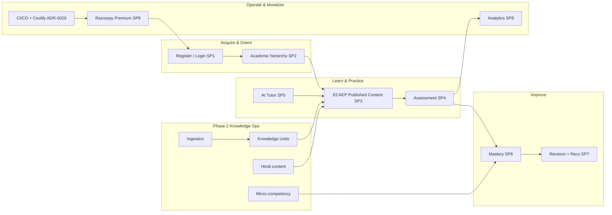

#### Advantages

- “Done” is tied to roadmap verification language (curl, browser click-through, pytest), not aspiration.
- Phase 2 is additive and ADR-governed.

#### Tradeoffs

- “Done” for SP9 commerce still depends on live Razorpay keys in real environments; without keys, honest 503/`PAYMENT_GATEWAY_NOT_CONFIGURED` is correct behavior, not a defect (ADR-0018).
- AI agents in environments without `ANTHROPIC_API_KEY` run in FallbackProvider mode (ADR-0014).

#### Implementation Notes

> **Implementation Note:** Treat root `README.md` status paragraph as stale until revised; this section and `docs/architecture/roadmap.md` are authoritative for delivery status.

#### Future Enhancements

- Public engineering changelog fed from ADR acceptances.
- Production SLO dashboards beyond admin analytics (see §11 assumptions).

#### References

- `docs/architecture/roadmap.md`
- `docs/decisions/ADR-0018-sprint9-commerce-admin-hardening-deploy.md`
- `docs/decisions/ADR-0019-multi-language-content.md` … `ADR-0029-cicd-pipeline.md`

---

### 7.4 Differentiating Thesis

#### Purpose

Articulate the competitive thesis in four interlocking capabilities that are real in the repository.

#### Background

Generic AI tutoring startups differentiate on model brand. TALOS differentiates on **system design**: Gateway discipline, editorial truth, knowledge structuring, and mastery/revision loops.

#### Problem

If differentiation is described as “full knowledge graph navigation” or “multi-provider AI already live,” the thesis becomes false (Conflict Register).

#### Solution — Four-Pillar Thesis

1. **AI Gateway with cost/latency observability and Claude wired now** — provider abstraction exists; second providers are future subclasses, not shipped integrations.
2. **ECAEP human-in-the-loop content** — Question Generator creates drafts through the same workflow as humans; Tutor retrieval reads published content.
3. **Knowledge Units (EKU)** — ingestion does not silently become student-facing assets; structured, gate-checked facts mediate generation (ADR-0024/0025/0028).
4. **Mastery + revision from real attempts** — arithmetic mastery levels and rule-based recommendations, not a Digital Twin (ADR-0015/0016; Digital Twin deferred).

#### Capability Map

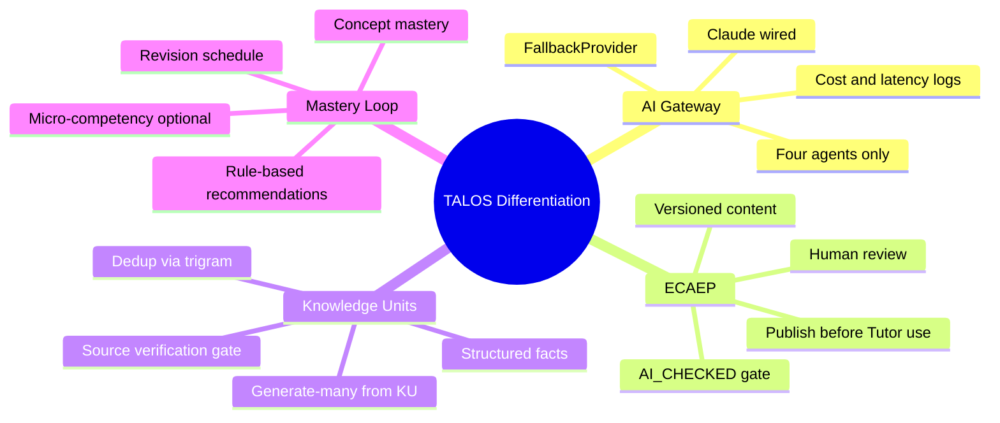

#### Advantages

- Thesis maps 1:1 to modules and ADRs.
- Hard for competitors to copy quickly without rebuilding editorial + KU discipline.

#### Tradeoffs

- Not a “magic personalization” story; personalization is mastery/revision rules, not a twin simulation.
- Content coverage speed constrained by licensing and review capacity.

#### Implementation Notes

> **Architecture Decision:** Do not market “RAG-powered tutor” until embeddings retrieval is actually implemented and ADR’d. Today’s Tutor grounds on published concept notes and concept metadata (and evolving KU wiring per ADR-0028), not vector search.

#### Future Enhancements

- When pgvector embeddings ship under a future ADR, revise this thesis pillar carefully — additive retrieval, not a rewrite of ECAEP.

#### References

- `docs/decisions/ADR-0004-ai-gateway.md`
- `docs/decisions/ADR-0009-ecaep-content-model.md`
- `docs/decisions/ADR-0024-knowledge-unit-foundation.md`
- `docs/decisions/ADR-0015-learning-mastery-scope.md`

---

### 7.5 Business Outcomes Targeted

#### Purpose

Connect platform capabilities to business outcomes without fabricating production metrics.

#### Background

SP8 analytics provide admin-facing assessment and AI usage/cost views. Broader growth accounting is not fully specified as warehouse-grade KPIs in-repo.

#### Problem

Boards ask for CAC, LTV, retention curves. Those numbers are not present as measured truths in the repository.

#### Solution — Outcome Families

| Outcome family | Platform mechanism | Evidence posture |
|---|---|---|
| Learner acquisition | Public/auth surfaces; NEET positioning | **Enterprise Assumption** for volume targets |
| Activation | First practice attempt + first tutor explain | Instrumentable via assessment/ai modules |
| Learning effectiveness | Mastery level movement; revision completion | Concept/micro-competency mastery tables |
| Content scale (legal) | Ingestion → KU → ECAEP drafts → publish | Phase 2 pipeline |
| AI margin control | `ai.ai_requests` cost estimates | Gateway logging (not billing-grade reconciliation) |
| Revenue | Razorpay Premium one-time purchase | Commerce orders as source of truth |
| Reliability | Coolify deploy + CI/CD + hardening | Deploy docs; SLOs as assumptions in §11 |

> **Enterprise Assumption:** Target Year-1 outcome ranges suitable for planning discussions — 50k–150k registered learners, 15–30% Day-7 activation (first scored attempt), 4–8% Premium conversion among monthly actives, and ≥20% relative improvement in mastery score on practiced concepts over 30 days for weekly actives. These are planning hypotheses, not measured production results.

#### Advantages / Tradeoffs

**Advantages.** Outcome families map to real modules.  
**Tradeoffs.** Financial outcomes remain assumptions until production cohorts exist.

#### Future Enhancements

- Promote assumptions to baselines after 90 days of production telemetry.

#### References

- `docs/decisions/ADR-0017-analytics-scope.md`
- `docs/decisions/ADR-0018-sprint9-commerce-admin-hardening-deploy.md`

---

### 7.6 Investment Thesis for Stakeholders

#### Purpose

Explain why continued investment is rational given what is already built and what is deliberately not built.

#### Background

Many edtech investments fund content acquisition wars. TALOS asks for capital to fund **licensing-clean content operations**, **AI Gateway usage**, **editorial staffing**, and **reliability** on a lean Coolify/Hetzner footprint — not a premature multi-cloud microservices estate.

#### Problem

Investors may compare TALOS to coaching unicorns on question count alone, ignoring legal and pedagogical quality.

#### Solution — Thesis Bullets

1. **De-risked architecture execution:** SP0–SP9 delivered on the frozen modular monolith; extraction to services remains a future refactor option (ADR-0001), not a current necessity.
2. **AI cost governance early:** Gateway logging prevents blind Anthropic spend; fallback mode enables testing without keys.
3. **Legal content posture:** ADR-0005 avoids catastrophic IP risk from coaching dumps.
4. **Defensible data loop:** Attempt → mastery → revision creates proprietary learner-state even without a Digital Twin.
5. **Phase 2 scale path:** Ingestion + Knowledge Units is the honest way to grow coverage from NCERT PDFs already in `StudyMaterial/`.
6. **India-fit monetization:** Razorpay one-time Premium matches local rails; subscriptions deferred (ADR-0018).
7. **Capital efficiency:** Coolify on Hetzner avoids early AWS/Azure complexity (ADR-0006).

> **Enterprise Assumption:** Fully loaded monthly infrastructure for MVP-scale (single VPS class, managed backups, observability extras) in the ₹25,000–₹80,000 OpEx band before AI inference; AI inference scales with active tutoring/generation usage and must be gated by product packaging. Diligence should replace this band with actual invoices.

#### Advantages

- Aligns capital with real bottlenecks (editorial + AI + reliability).
- Avoids funding a 12-agent rewrite.

#### Tradeoffs

- Less “platform multi-tenant SaaS” story until multi-tenancy is intentionally un-deferred.
- Content coverage remains a paced investment, not an overnight scrape.

#### Implementation Notes

> **Note:** Investment materials must include ADR-0007 non-goals to prevent post-funding scope thrash.

#### Future Enhancements

- Scenario model (base/upside/downside) in Volume 1 Part D with measured conversion inputs.

#### References

- `docs/decisions/ADR-0006-commerce-hosting.md`
- `docs/decisions/ADR-0007-mvp-scope-cut.md`

---

### 7.7 Risks at a Glance

#### Purpose

Surface the risks that can invalidate the thesis if ignored.

#### Risk Table

| ID | Risk | Severity | Likelihood | Mitigation in-repo / process |
|---|---|---|---|---|
| R1 | Scope re-expansion to BRD 280-table / 12-agent vision | High | Medium | ADR-0007 freeze; this blueprint’s non-goals |
| R2 | Unlicensed content pressure (“just import PW/Allen”) | High | Medium | ADR-0005; ECAEP; no bulk coaching import |
| R3 | AI cost overrun | High | Medium | Gateway logging; packaging limits; fallback for non-prod |
| R4 | Provider concentration (Claude only wired) | Medium | High | AIProvider interface ready for future OpenAI/Gemini classes — **not implemented yet** |
| R5 | Content throughput too slow for NEET calendar | High | Medium | Ingestion+KU+generate-many; still human publish gate |
| R6 | Status narrative drift (README vs roadmap) | Medium | High | Conflict Register; README fix owned by Eng Manager |
| R7 | Payment misconfiguration in production | High | Low–Med | No fake payment success path (ADR-0018); runbook |
| R8 | Security regression (auth/CSRF/headers) | High | Low–Med | SP1/SP9 hardening; CI scanning non-blocking initially (ADR-0029) |
| R9 | Overclaiming RAG/KG in sales | Medium | Medium | Conflict Register; training for GTM |
| R10 | Single-VPS hosting limits | Medium | Medium | ADR-0006 revisit cloud when earned |

#### Advantages of Explicit Risk List

Enables board monitoring without inventing a GRC platform.

#### Tradeoffs

Initial CI security scanners are non-blocking (ADR-0029) — risk acceptance must be conscious.

#### Future Enhancements

- Expand to full risk register in Volume 1 Chapter 25 companion.

#### References

- `docs/decisions/ADR-0005-content-licensing.md`
- `docs/decisions/ADR-0029-cicd-pipeline.md`
- `docs/deploy/RUNBOOK.md`

---

### 7.8 Recommendation / Decision Requested

#### Purpose

State the concrete decisions leadership should affirm.

#### Recommendations

1. **Affirm** TALOS modular-monolith + ECAEP + AI Gateway (Claude-wired) as the enduring v1 posture.
2. **Affirm** SP0–SP9 as complete and authorize Phase 2 continuation under ADRs 0019–0029 without reopening ADR-0007 deferrals wholesale.
3. **Direct** Engineering to remediate Conflict Register items (README status; `.cursor` knowledge-graph navigation wording; any prompt language implying OpenAI/Azure are live).
4. **Approve** investment emphasis on: editorial capacity, NCERT ingestion/KU quality, AI budget controls, and CI/CD gate tightening — not on Digital Twin, multi-tenant rewrite, or native mobile at this time.
5. **Require** that external claims about embeddings/RAG, full Knowledge Graph, or multi-provider AI be withheld until corresponding ADRs show implementation.

#### Decision Requested (checkbox form for wet-ink)

| Decision | Approve | Reject | Defer |
|---|---|---|---|
| Accept Volume 1 Part A v1.0.0 as internal control document | ☐ | ☐ | ☐ |
| Affirm ADR-0007 non-goals remain deferred | ☐ | ☐ | ☐ |
| Prioritize Phase 2 content/KU/CI over new agent types | ☐ | ☐ | ☐ |
| Authorize README + `.cursor` conflict remediation | ☐ | ☐ | ☐ |

#### References

- Conflict Register (end of Part A)
- `docs/architecture/roadmap.md`

---


# 8. Business Vision

### 8.0 Chapter Frame

#### Purpose

Define the long-horizon vision for Trinetra AI Learning OS (TALOS) while binding that vision to ADR-0007 constraints so vision never silently becomes unfunded scope.

#### Background

The BRD articulates an enterprise-scale learning OS: large ontology, Digital Twin, multi-tenant institutions, many AI agents, and expansive content graphs. ADR-0007 performed the cut the BRD itself postponed. Vision remains valuable as a north star; it is dangerous as an implicit backlog without sequencing.

#### Problem

Unconstrained vision creates perpetual WIP and destroys the meaning of “done” that SP0–SP9 achieved.

#### Solution

State an ambitious but constrained vision: TALOS becomes the trusted AI learning OS for high-stakes exams in India, beginning with NEET-UG, expanding exam coverage through the same academic and editorial substrate, and only adopting deferred capabilities when they are earned by evidence and ADR.

#### Architecture (vision alignment)

Vision capabilities must map to module boundaries already established (`identity`, `academic`, `cms`, `assessment`, `ai`, `learning`, `analytics`, `commerce`, `system`, `ingestion`, `knowledge`). New capabilities prefer additive schemas and Gateway agents over platform rewrites.

#### Advantages

- Preserves motivational narrative for talent and capital.
- Keeps engineering finish lines intact.

#### Tradeoffs

- Some BRD ideas remain years out; communicators must resist implying they are near-term.

#### Implementation Notes

> **Architecture Decision:** Vision statements in marketing must deep-link to ADR-0007 non-goals whenever Digital Twin, full Knowledge Graph, multi-tenancy, 12-agent orchestration, or native mobile are mentioned.

#### Future Enhancements

- Vision refresh workshop annually, outputting ADR amendments rather than slide-only promises.

#### References

- `docs/decisions/ADR-0007-mvp-scope-cut.md`
- `docs/decisions/ADR-0010-naming.md`

---

### 8.1 Vision Statement

**Vision.** Trinetra AI Learning OS (TALOS) will be the definitive AI-native learning operating system for students preparing for high-stakes competitive exams — starting with NEET-UG — where every explanation, question, and study plan is grounded in curriculum-true, editorially governed knowledge, and every practice attempt measurably improves mastery.

**Expanded vision prose.** In a decade, a learner should experience TALOS not as a PDF library with a chatbot, but as a coherent system: the academic map of their exam, published knowledge they can trust, assessments that diagnose precisely (including micro-competencies where tagged), AI tutors that cite sources rather than invent authority, revision that respects memory, and — when deliberately built later — richer graph relationships and retrieval. Institutions and parents may eventually receive portals, but web-first learner value precedes that expansion (native mobile deferred).

#### Purpose / Background / Problem / Solution (subsection)

**Purpose.** Freeze wording usable in diligence and recruiting.  
**Background.** Naming must say Trinetra AI Learning OS (TALOS), not “AI Learning OS.”  
**Problem.** Vision language often erases editorial gates.  
**Solution.** The vision statement itself includes “editorially governed knowledge.”

#### Advantages / Tradeoffs

Advantages: memorable, accurate, licensing-aligned. Tradeoffs: less sensational than “12 agents run your education.”

#### Implementation Notes

> **Note:** Do not append model brand names (Claude/OpenAI) into the vision statement; models are replaceable behind the Gateway.

#### Future Enhancements

- Localized vision sentences for Hindi marketing once content coverage justifies campaigns (UI may still be English per ADR-0019).

#### References

- ADR-0010, ADR-0005, ADR-0009

---

### 8.2 5–10 Year Horizon

#### Purpose

Provide a phased horizon that separates committed near-term capability from optional long-range bets.

#### Horizon Map

| Horizon | Timebox (planning) | Intent | Examples in / out |
|---|---|---|---|
| **H0 — Foundation Delivered** | Completed (SP0–SP9) | Ship core vertical loop | Auth, academic, ECAEP, assessment, 4 agents, mastery, revision, analytics, Razorpay, deploy |
| **H1 — Knowledge Scale** | Near-term Phase 2 | Scale licensing-clean content | Ingestion, KUs, Hindi content, micro-competency, CI/CD tightening, visual assets |
| **H2 — Depth & Retrieval** | Mid-term (future ADRs) | Improve grounding & personalization depth | pgvector embeddings/RAG **when ADR’d and built**; richer KU mastery; selective graph edges (prerequisites) without claiming full enterprise KG |
| **H3 — Platform Expansion** | 5+ years aspirational | Multi-exam + selective deferred BRD items | Other Indian exams via academic model; evaluate multi-tenancy, institution portals, additional agents — each via new ADR |
| **H4 — Long bets** | 7–10 years aspirational | Only if earned | Digital Twin, native mobile, voice tutor, live classes — all currently deferred |

> **Enterprise Assumption:** Calendar years attached to H2–H4 are planning constructs for strategy workshops, not committed delivery dates in the engineering roadmap file.

#### Advantages

- Prevents H4 items from leaking into H1 sprints.
- Clarifies that embeddings are a horizon capability, not a hidden present feature.

#### Tradeoffs

- Investors who want H4 narratives need education on sequencing.

#### Implementation Notes

> **Implementation Note:** Roadmap.md remains the near-term status authority; this horizon table is strategic framing only.

#### Future Enhancements

- Tie each horizon exit criterion to measurable content coverage and reliability objectives from §11.

#### References

- `docs/architecture/roadmap.md`
- `docs/decisions/ADR-0028-educational-knowledge-unit.md` (Phases E/F not built)

---

### 8.3 Platform vs Product Vertical

#### Purpose

Stop the organization from coupling NEET-specific assumptions into supposedly exam-agnostic core modules incorrectly — and stop treating TALOS as “only a NEET app” when raising platform capital.

#### Definitions

| Concept | Meaning | Examples |
|---|---|---|
| **Platform (TALOS)** | Reusable modules, workflows, and AI Gateway | Identity, ECAEP, Assessment engine patterns, Mastery math, Commerce provider integration pattern, Ingestion/KU pipeline shape |
| **Product vertical** | Exam-specific configuration, content, and GTM | NEET-UG hierarchy seed, NEET scoring (+4/−1), NCERT corpus in `StudyMaterial/`, India Razorpay packaging, Hindi NEET content |

#### Problem

If NEET scoring rules or NCERT structures are hardcoded as global truths without academic modeling, expansion dies. If everything is abstracted too early, NEET delivery slows.

#### Solution

- Keep academic hierarchy exam-scoped in data (ADR-0012).
- Keep content types generic in CMS (ADR-0009).
- Keep agents exam-aware via prompts + retrieved published content, not via a second platform.
- Expand to new exams by seeding academic data + content ops, not by forking the monolith.

#### Architecture

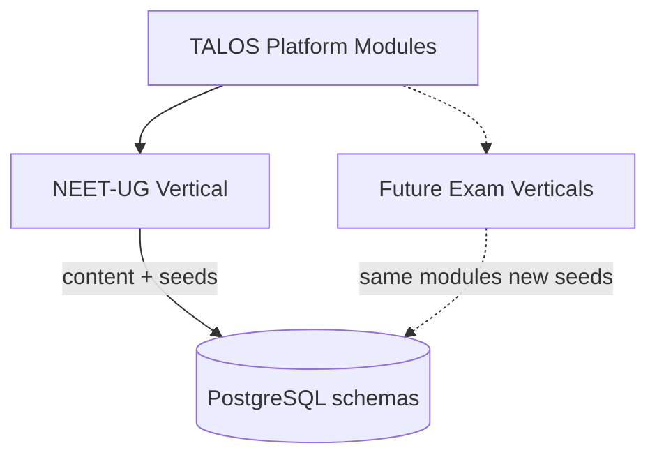

#### Advantages

- Capital narrative can include platform leverage.
- Engineering avoids microservice-per-exam temptation.

#### Tradeoffs

- Some NEET-specific UX copy will exist in the web app; discipline required to isolate strings and seeds.

#### Implementation Notes

> **Architecture Decision:** Multi-tenancy for coaching franchises is not required for multi-exam; multi-exam is data/content multiplicity inside one tenant posture until ADR-0007 multi-tenancy is intentionally reversed.

#### Future Enhancements

- Exam pack format (versioned seed + content bundle) documented in Volume 2.

#### References

- ADR-0012, ADR-0008, ADR-0007

---

### 8.4 Societal / Education System Impact

#### Purpose

Articulate educational impact without claiming unearned outcomes research.

#### Background

NEET preparation intensifies inequality when quality content and mentoring are gated by expensive coaching. TALOS cannot claim to “solve” that system alone.

#### Problem

Edtech vision decks overstate societal impact and understate content provenance ethics.

#### Solution — Impact Thesis (responsible)

TALOS aims to improve **access to curriculum-true practice and explanations** for learners who have a smartphone/web browser, by:

1. Anchoring learning to NCERT-aligned knowledge rather than opaque coaching PDFs.
2. Providing mastery visibility so students practice weak concepts instead of randomly consuming hours.
3. Using AI to explain and plan while keeping humans in the loop for question correctness.
4. Offering Hindi learner-facing content (ADR-0019) to reduce language friction even while UI remains English initially.

> **Enterprise Assumption:** Societal impact KPIs (e.g., improvement in NEET percentile attributable to TALOS) require controlled studies not present in the repository. Until then, impact claims must remain qualitative or labeled assumptive.

#### Advantages

- Ethically aligned with ADR-0005.
- Compatible with government-curriculum narratives.

#### Tradeoffs

- Will not satisfy stakeholders seeking “replace all coaching” hyperbole.

#### Future Enhancements

- Partner with independent researchers for learning-efficacy studies post-launch.

#### References

- ADR-0005, ADR-0019, ADR-0015

---

### 8.5 Vision Constraints from ADR-0007

#### Purpose

Make the MVP cut unavoidable reading for anyone quoting vision.

#### Deferred (not v1; not to be implied shipped)

From ADR-0007 and related later clarifications:

| Deferred capability | Notes |
|---|---|
| Knowledge Graph / Enterprise Domain Ontology | Full KG deferred; do not equate with Knowledge Units |
| BRD-scale 4-layer competency with ~21,000 micro-competencies | Superseded approach: ADR-0021 adds one practical micro-competency layer, handful per concept |
| Student Digital Twin | Deferred |
| Multi-tenancy | organizations reserved, not wired |
| 12-agent AI orchestrator | Four agents only in v1 |
| Multi-language content | **Partially un-deferred** by ADR-0019 (Hindi content); full UI i18n still out |
| Native mobile apps | Deferred; web-first / PWA-capable posture |
| Voice tutor, AI-generated video, live classes | Deferred |
| Parent/institution portals | Deferred |

#### Problem / Solution

**Problem.** Teams treat “deferred” as “unmentioned.”  
**Solution.** Vision materials must include this table or link here.

#### Advantages / Tradeoffs

Keeps finish lines real; disappoints maximalists.

#### Implementation Notes

> **Implementation Note:** ADR-0019/0021/0022+ are Phase 2 un-deferrals of selected items; they do not void the rest of ADR-0007.

#### Future Enhancements

- Explicit “un-deferral ADR” template whenever a deferred item is revived.

#### References

- `docs/decisions/ADR-0007-mvp-scope-cut.md`
- `docs/decisions/ADR-0019-multi-language-content.md`
- `docs/decisions/ADR-0021-micro-competency-layer.md`

---

# 9. Mission

### 9.0 Chapter Frame

#### Purpose

Translate vision into an actionable mission and map mission pillars to real backend modules.

#### Background

Mission without module mapping becomes poster poetry. TALOS already has concrete modules; mission must operationalize them.

#### Problem

Product teams optimize for content upload count or chatbot messages rather than mastery and editorial quality.

#### Solution

A mission statement centered on understanding → practice → revision → performance → decision-making, with an explicit mapping table to modules.

#### Advantages / Tradeoffs

Advantages: guides OKRs and sprint acceptance. Tradeoffs: less brand-fluffy language.

#### References

- Module tree under `apps/backend/app/modules/`
- ADRs 0011–0018, 0022–0028

---

### 9.1 Mission Statement

**Mission.** Help every NEET-UG aspirant on TALOS build durable conceptual understanding, practice with integrity-checked questions, revise what they forget, perform under exam-like conditions, and make better study decisions — using AI that is observable, source-aware, and human-supervised for assessment content.

#### Supporting clauses

1. **Understanding** — published concept notes, tutor explanations, KU-grounded generation.
2. **Practice** — assessment engine with transparent scoring.
3. **Revision** — schedule by mastery level; recommendations ranked due → weak → new.
4. **Performance** — mock tests and analytics for admins; learner dashboards for mastery.
5. **Decision-making** — study planner agent and recommendation widgets that use real weak-concept signals, not invented profiles.

---

### 9.2 Mission Pillars

| Pillar | Learner promise | System mechanism | Non-goal |
|---|---|---|---|
| **Understanding** | I can learn concepts with trusted explanations | ECAEP published notes; Tutor; KU-grounded assets | Uncited freeform hallucinations as product truth |
| **Practice** | I can practice NEET-style items | Assessment module; questions via ECAEP | Auto-published AI questions |
| **Revision** | I know what to revisit | SP7 revision schedule + recommendations | Full cognitive Digital Twin |
| **Performance** | I can simulate exam pressure | Timed mocks; scoring +4/−1 | Live proctored center networks |
| **Decision-making** | I know what to do next | Planner agent; mastery signals; admin analytics | 12-agent orchestration |

#### Purpose / Problem / Solution for pillars

**Purpose.** Create shared vocabulary across Product and Engineering.  
**Problem.** “Engagement” pillar would optimize wrong.  
**Solution.** Learning-science-aligned pillars tied to shipped mechanisms.

#### Advantages / Tradeoffs

Clear prioritization; may de-prioritize social/gamification features not in ADRs.

#### Implementation Notes

> **Note:** Evaluator agent supports understanding/practice quality via ECAEP AI_CHECKED, not learner-facing chat.

#### Future Enhancements

- Pillar-level product scorecards in analytics once event taxonomy expands beyond SP8.

---

### 9.3 Mission-to-Capability Mapping Table

| Mission pillar | Primary modules | Supporting modules | Key ADRs / docs |
|---|---|---|---|
| Understanding | `cms`, `ai` (Tutor), `knowledge` | `ingestion`, `academic` | ADR-0009, 0014, 0024–0028, ecaep.md |
| Practice | `assessment`, `cms` | `academic`, `ai` (Question Generator) | ADR-0013, 0004, 0009 |
| Revision | `learning` | `assessment`, `ai` (Planner) | ADR-0015, 0016 |
| Performance | `assessment`, `analytics` | `learning`, `commerce` (premium gating as configured) | ADR-0013, 0017, 0018 |
| Decision-making | `ai` (Planner), `learning` | `analytics`, `identity` (preferences/language) | ADR-0014, 0016, 0019 |
| Trust & access control (cross-cutting) | `identity`, `system` | all modules via RBAC | ADR-0003, 0011 |
| Sustainable operations (cross-cutting) | `commerce`, CI/CD/deploy | `ai` cost analytics | ADR-0006, 0018, 0029 |

#### Extended mapping narrative

**identity** — Ensures the right learner/author/reviewer/admin acts; sessions and permissions make ECAEP roles real.  
**academic** — Provides the exam map; without it, content and mastery have no spine.  
**cms** — Stores versioned learning artifacts; publish state is the trust boundary for Tutor.  
**assessment** — Converts published questions into attempts and scores; feeds mastery.  
**ai** — Gateway + four agents; never a side channel that bypasses ECAEP for questions.  
**learning** — Persists mastery; supports revision; Phase 2 micro-competency and KU mastery extend granularity.  
**analytics** — Admin visibility into assessment aggregates and AI spend.  
**commerce** — Monetizes Premium via Razorpay orders as source of truth.  
**system** — Cross-cutting platform concerns consistent with schema list in CLAUDE.md / ADR lineage.  
**ingestion** — Brings NCERT PDFs into controlled pipelines.  
**knowledge** — Knowledge Units / EKU hub between extraction and generation.

#### Advantages

Mission debates can be settled by pointing at modules.

#### Tradeoffs

Mapping will evolve as ADR-0028 remaining phases complete; update this table on ADR sync revisions.

#### Implementation Notes

> **Implementation Note:** New modules must earn a schema and folder under `app/modules/` with the standard shape `api/ services/ repositories/ models/ schemas/ tests/`.

#### Future Enhancements

- Auto-generate mapping from code owners file once CODEOWNERS covers modules.

#### References

- `CLAUDE.md` conventions
- ADRs listed in table

---

# 10. Corporate Strategy

### 10.0 Chapter Frame

#### Purpose

Describe corporate-level posture: how Trinetra chooses markets, builds moats, partners, and expands — consistent with frozen ADRs.

#### Background

Corporate strategy for TALOS is not “become a horizontal LLM wrapper.” It is product-led, AI-first, licensing-clean, India-first.

#### Problem

Partnership opportunities with coaching brands can look attractive and still violate ADR-0005 if they imply content ingestion without license.

#### Solution

Encode partnership and expansion rules that make illegal shortcuts corporate policy failures, not clever growth hacks.

---

### 10.1 Strategic Posture (Product-Led, AI-First, Licensing-Clean)

#### Definitions

| Posture element | Meaning for TALOS |
|---|---|
| **Product-led** | Learners experience value via practice/mastery loops before heavy sales motion; admin/editorial tools exist in same Next.js app |
| **AI-first** | AI Gateway and agents are core product surfaces, not optional widgets — with human gates for questions |
| **Licensing-clean** | NCERT-aligned / original / permissible PYQ only; no Aakash/Allen/PW/Unacademy dumps without signed license |

#### Problem / Solution / Architecture

Corporate OKRs must not reward “questions ingested” without license attestation metadata in editorial process.

#### Advantages

Legal durability; brand trust; AI grounding quality.

#### Tradeoffs

Slower top-of-funnel content bragging rights.

#### Implementation Notes

> **Architecture Decision:** Question Generator throughput is not a loophole for licensing — generated items still require human review and must not clone copyrighted stems.

#### Future Enhancements

- Content provenance fields exposed in admin coverage grids beyond current workflow states.

#### References

- ADR-0005, ADR-0004, ADR-0009

---

### 10.2 Geographic Focus (India NEET-UG First)

#### Purpose

Freeze GTM geography and exam focus.

#### Solution

- **Primary:** India, NEET-UG aspirants (Classes 11–12 and repeaters).
- **Payments:** Razorpay (UPI, cards, net banking; GST considerations per ADR-0006).
- **Hosting:** Coolify on Hetzner VPS for MVP — geography of hosting is cost/ops driven; product geography is India-first.
- **International:** Stripe/Apple/Google Play only if/when international expansion is real (ADR-0006).

> **Enterprise Assumption:** Initial paid acquisition experiments concentrate on Hindi- and English-speaking NEET markets in Tier-1/Tier-2 cities; exact city prioritization is a growth-team assumption pending campaign data.

#### Advantages

Fits stack and commerce choices.

#### Tradeoffs

Global brand storytelling deferred.

#### References

- ADR-0006

---

### 10.3 Moats

| Moat | Why it compounds | Repo reality |
|---|---|---|
| **Content quality gates (ECAEP)** | Competitors can generate text; fewer enforce versioned human review | SP3 done; Evaluator integrated |
| **Curriculum graph (academic hierarchy + micro-competencies)** | Structure enables mastery & generation targeting | SP2 + ADR-0021 |
| **Mastery & revision data** | Proprietary learner state from real attempts | SP6–SP7; not a Digital Twin |
| **AI cost control** | Unit economics visibility | `ai.ai_requests` logging |
| **Knowledge Units** | Reusable gated facts beat raw chunk RAG myths | ADR-0024–0028 |
| **Licensing posture** | Avoids takedown/extinction risk | ADR-0005 |

#### Non-moats (do not claim)

- “We have a full enterprise knowledge graph” — deferred.
- “We run twelve cooperating agents” — deferred.
- “We have RAG” — not implemented.
- “CQRS scale-out” — not implemented.

#### Advantages / Tradeoffs

Honest moats survive diligence; fake moats create legal/tech debt.

---

### 10.4 Partnership Strategy (Explicitly NO Unlicensed Coaching Content)

#### Rules

1. **Allowed:** Pedagogy advisors, SME author contracts, university outreach, payment/infra vendors, licensed content deals with written IP terms.
2. **Forbidden without signed license:** Ingesting or scraping Aakash, Allen, Physics Wallah, Unacademy, or similar copyrighted banks (ADR-0005).
3. **AI partnerships:** Model providers are Gateway adapters; Claude is current; future OpenAI/Azure OpenAI/Gemini require implementation work + config — not press-release reality.
4. **Coaching partnerships:** If pursued, prefer distribution/referral or originally authored co-branded content — never silent ingestion of their PDFs.

#### Problem / Solution

**Problem.** BD teams equate “partnership” with “content firehose.”  
**Solution.** Legal + Product must sign off on content provenance before Engineering builds importers.

#### References

- ADR-0005

---

### 10.5 Platform Expansion Path (Other Exams Later)

#### Purpose

Describe how TALOS expands beyond NEET without violating modular monolith or licensing posture.

#### Expansion sequence (strategic)

1. **Deepen NEET coverage** via ingestion/KU/ECAEP and Hindi content.
2. **Prove retention & Premium conversion** on NEET.
3. **Add adjacent exams** that reuse subjects/concepts where academic modeling fits (each exam is a new academic seed + content program).
4. **Evaluate multi-tenancy** only if B2B institution demand requires it (ADR-0007 currently deferred).
5. **Evaluate native mobile** only if web/PWA metrics show hard caps (deferred today).

#### Architecture note

Expansion is primarily **data and content operations**, not a new deployable per exam. Module extraction to microservices remains a last resort if a module earns independent scale (ADR-0001).

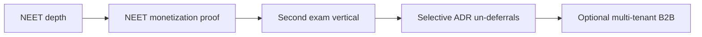

#### Advantages

Capital efficiency; shared AI Gateway benefits all exams.

#### Tradeoffs

Brand may look “NEET-only” longer than pure platform companies.

#### Implementation Notes

> **Implementation Note:** Do not create `apps/neet` and `apps/jee` frontends; keep single Next.js app unless ADR-0008 is explicitly superseded.

#### Future Enhancements

- Exam launch checklist (seeds, scoring rules, content coverage thresholds, payment SKUs).

#### References

- ADR-0001, ADR-0008, ADR-0012, ADR-0007

---


# 11. Business Objectives

### 11.0 Chapter Frame

#### Purpose

Define SMART objectives and near-term OKRs that connect TALOS capabilities to measurable business and learning outcomes, while clearly labeling repository-absent targets as **Enterprise Assumptions**.

#### Background

SP8 delivers admin analytics for assessment aggregates and AI usage/cost. Learner growth accounting, CAC/LTV, and formal SRE SLOs are not fully codified as production scorecards in the repository. Objectives must still be written for management discipline — with honesty about evidence posture.

#### Problem

Teams either (a) refuse to set targets because telemetry is incomplete, or (b) invent fake precision. Both fail enterprise planning.

#### Solution

Publish SMART objective tables with explicit assumption labels, plus OKR examples for the next two quarters that favor Phase 2 realities (content/KU/Hindi/CI) over deferred BRD epics.

#### Architecture (measurement alignment)

| Objective domain | Primary signal sources in system | Gap |
|---|---|---|
| Acquisition / activation | `identity` users; first `assessment` attempt | Marketing attribution not a first-class warehouse |
| Retention | Repeat attempts; revision completions | Cohort retention dashboards beyond SP8 needed |
| Mastery improvement | `learning.concept_mastery` / micro-competency mastery | Causal attribution studies external |
| Content throughput | ECAEP publish events; ingestion jobs; KU pass rates | Editorial staffing model external |
| AI cost | `ai.ai_requests` estimated cost | Not billing-grade vs Anthropic invoice |
| Premium conversion | `commerce.orders` PAID | Subscription metrics N/A (one-time only) |
| Reliability | Deploy runbooks, CI, uptime monitoring (ops) | Numeric SLOs below are assumptions |

#### Advantages

- Forces prioritization onto real modules.
- Prevents OKRs that demand Digital Twin or RAG prematurely.

#### Tradeoffs

- Some targets will be revised after first production quarter.

#### Implementation Notes

> **Implementation Note:** When an objective becomes measured in-product, remove the Enterprise Assumption label via an Editorial/ADR-sync revision — do not silently edit numbers without a revision row.

#### Future Enhancements

- Volume 1 Chapter 20 companion for funnel definitions.
- Wire product analytics events for activation funnel steps.

#### References

- ADR-0017, ADR-0018, ADR-0029, `docs/deploy/CI_CD.md`

---

### 11.1 SMART Objectives Table

| ID | Objective | Specific | Measurable | Achievable (posture) | Relevant pillar | Time-bound | Evidence posture |
|---|---|---|---|---|---|---|---|
| O1 | **Acquisition** | Grow registered NEET learners on TALOS web app | Monthly new registered users | Depends on GTM spend | Decision-making / access | Quarterly | **Enterprise Assumption:** +20–40% QoQ new registrations for first two post-launch quarters after public invite |
| O2 | **Activation** | Learners complete first scored practice attempt | % of new users with ≥1 submitted attempt within 7 days | Product UX already supports practice flow (SP4) | Practice | Rolling 7-day | **Enterprise Assumption:** 15–30% Day-7 activation |
| O3 | **Retention** | Learners return to practice or revision weekly | % W1 users active in W4 | Requires notification/email maturity beyond core ADRs | Revision | Monthly cohorts | **Enterprise Assumption:** 25–40% D30 retention among activated users |
| O4 | **Mastery improvement** | Improve mastery on practiced concepts | Median mastery_score delta on concepts with ≥5 attempts over 30 days | Mastery recompute exists (SP6) | Understanding / Practice | Monthly | **Enterprise Assumption:** +10 to +20 points median delta for weekly actives |
| O5 | **Content throughput** | Publish licensing-clean items via ECAEP | Published items/month; % from ingestion→KU path | Pipeline exists; humans gate publish | Understanding / Practice | Monthly | **Enterprise Assumption:** 300–800 published items/month at initial editorial staffing; raise only with headcount |
| O6 | **KU quality** | Knowledge Units pass gates | % KUs with validation_status=PASSED per ingestion job | Gates in ADR-0024 | Understanding | Per job / monthly | **Enterprise Assumption:** ≥70% pass rate on pilot-quality NCERT chapters after prompt tuning |
| O7 | **Hindi coverage** | Expand Hindi published content | % of prioritized concepts with Hindi published note or question set | ADR-0019 fallback behavior exists | Understanding | Quarterly | **Enterprise Assumption:** 30% of top-100 practiced concepts have Hindi assets within two quarters |
| O8 | **AI cost per active user** | Keep inference economically sustainable | Estimated AI cost / MAU from Gateway logs | Logging exists; packaging controls needed | All AI pillars | Monthly | **Enterprise Assumption:** Stay under ₹40–₹120 estimated AI cost per MAU depending on tutor aggressiveness; escalate if exceeded |
| O9 | **Premium conversion** | Convert engaged learners to Razorpay Premium | PAID orders / MAU | One-time purchase flow exists; needs live keys in prod | Performance / access | Monthly | **Enterprise Assumption:** 4–8% conversion of MAU after paywall packaging is finalized |
| O10 | **Reliability** | Keep production available and deployable | Uptime; failed deploy rate; rollback success | Coolify+CI exist; numeric SLO not in roadmap file | Cross-cutting | Monthly | **Enterprise Assumption (SLO placeholders):** 99.5% monthly availability target for web+API; ≤2 failed production deploys/month; rollback drill quarterly per `docs/deploy/ROLLBACK.md` |
| O11 | **Security hygiene** | Reduce vuln debt visibility lag | Time to triage high CI findings | ADR-0029 scanners start non-blocking | Trust | Monthly | **Enterprise Assumption:** Triage critical gitleaks/CodeQL findings within 5 business days; plan to promote selected scanners to blocking after cleanup |
| O12 | **Conflict hygiene** | Eliminate false status claims in repo docs | Conflict Register items closed | Process in this volume | Governance | 30 days from approval | Trackable in git PRs (README, `.cursor` wording) |

#### Notes on achievability

O5–O7 are the true strategic constraints: licensing-clean content does not scale by scrape. Corporate strategy (§10) forbids “solving” O5 by violating ADR-0005.

---

### 11.2 OKR Examples for Next Two Quarters

> **Enterprise Assumption:** Quarter labels below use a planning calendar Q1=Aug–Oct 2026 and Q2=Nov 2026–Jan 2027 for internal planning continuity with this document’s effective date. Adjust to the company’s fiscal calendar without changing KR substance.

#### Q1 OKRs (Illustrative)

**Objective A — Make Phase 2 content operations investor-evident and learner-useful**

| KR | Description | Target | Link |
|---|---|---|---|
| KR-A1 | NCERT chapters with successful ingestion jobs beyond pilot | ≥5 chapters across ≥2 subjects | ADR-0022+ |
| KR-A2 | Published items originating from KU-grounded generation (post-review) | ≥150 | ADR-0025, ECAEP |
| KR-A3 | Hindi published assets on priority concept list | ≥50 | ADR-0019 |
| KR-A4 | Micro-competencies defined on fully seeded concepts | ≥1 concept family complete beyond Ohm’s Law seed pattern | ADR-0021 |

**Objective B — Prove learning loop quality, not chatbot vanity**

| KR | Description | Target | Link |
|---|---|---|---|
| KR-B1 | Activated users completing ≥3 attempts in first 14 days | **Enterprise Assumption:** 10–20% of new users | Assessment |
| KR-B2 | Revision “Practice now” flow completion rate | **Enterprise Assumption:** ≥40% of clicks start an attempt | SP7 |
| KR-B3 | Median AI estimated cost per tutor session within budget band | Set numeric band after 2 weeks of prod logs | ADR-0014 |

**Objective C — Harden delivery credibility**

| KR | Description | Target | Link |
|---|---|---|---|
| KR-C1 | Close Conflict Register items CR-1..CR-3 | 100% | This volume |
| KR-C2 | Documented production deploy using Coolify runbook | ≥1 successful prod-like deploy | `docs/deploy/RUNBOOK.md` |
| KR-C3 | Promote at least one CI security check to blocking after cleanup | ≥1 | ADR-0029, `docs/deploy/CI_CD.md` |

#### Q2 OKRs (Illustrative)

**Objective D — Monetization readiness with honest payments**

| KR | Description | Target | Link |
|---|---|---|---|
| KR-D1 | Production Razorpay credentials configured; no fake success path | Live orders in prod | ADR-0018 |
| KR-D2 | Premium conversion among users with mastery activity | **Enterprise Assumption:** ≥5% of such MAU | Commerce |
| KR-D3 | GST/invoice operational checklist completed | Legal/finance sign-off | Ops (external) |

**Objective E — Platform depth without scope thrash**

| KR | Description | Target | Link |
|---|---|---|---|
| KR-E1 | Tutor cites published and/or KU `ncert_reference` paths in ≥X% sampled sessions | Sampling rubric owned by Product+QA | ADR-0028 wiring |
| KR-E2 | No new agent types introduced | 0 new agents unless ADR supersedes ADR-0004 | ADR-0004/0007 |
| KR-E3 | Decision on embeddings/RAG go/no-go memo | Written ADR draft accepted or explicitly deferred again | Future ADR |

---

### 11.3 Objective Dependencies and Anti-Goals

#### Dependency graph

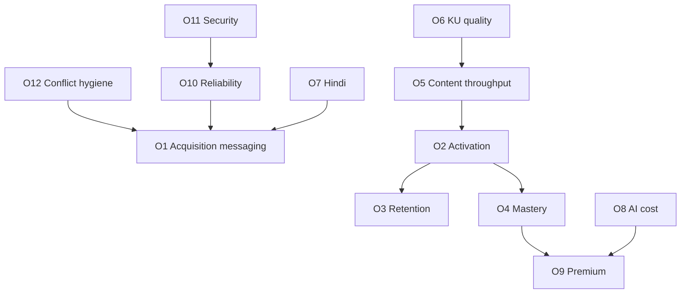

#### Anti-goals (explicit)

| Anti-goal | Why |
|---|---|
| OKR to “launch Digital Twin” | ADR-0007 deferred |
| OKR to “migrate to microservices” | ADR-0001 rejects for current scale |
| OKR to “ingest PW question bank” | ADR-0005 forbids without license |
| OKR to “enable Azure OpenAI in prod” without implementation ADR | Provider not wired |
| OKR to “ship CQRS read models” | Not in architecture |
| OKR to “100% UI Hindi i18n” | ADR-0019 explicitly excludes full UI i18n |

#### Advantages / Tradeoffs / Future Enhancements

**Advantages.** OKRs reinforce frozen decisions.  
**Tradeoffs.** Growth teams may push for anti-goals; CTO uses this section as shield.  
**Future Enhancements.** Attach owners and budget lines in Part D financial companion.

---

### 11.4 Implementation Notes for Objectives

> **Implementation Note:** AI cost objectives must use Gateway estimated costs with a disclaimer that rates are approximate (ADR-0014). Finance reconciliation is a separate process.

> **Implementation Note:** Premium status is derived from PAID orders, not a duplicated `is_premium` flag on users (ADR-0018). Metrics pipelines should respect that boundary.

> **Note:** Reliability SLOs above are placeholders for management; promoting them to contractual SLAs requires ops maturity beyond current MVP hosting ADR.

---

# 12. Product Strategy

### 12.0 Chapter Frame

#### Purpose

Specify product principles, jobs-to-be-done, capability alignment to SP0–SP9 and Phase 2 ADRs, build-vs-buy choices, and AI product principles — with diagrams suitable for DOCX conversion.

#### Background

Product strategy is already constrained by accepted ADRs. This chapter does not invent a parallel roadmap; it interprets the delivered and Phase 2 capability set for product managers and executives.

#### Problem

Without principles, AI features sprawl (mentor agents, voice, video) and content shortcuts appear.

#### Solution

Codify principles and JTBD that explain why the shipped loop is the product, and why Knowledge Units + ECAEP are the scaling strategy.

#### Architecture

Product surfaces live in one Next.js app (ADR-0008): public marketing/auth, student learning loop, admin/editorial. Backend capabilities are modular but singly deployed.

#### Advantages / Tradeoffs

Coherent product; fewer splashy demos that aren’t production paths.

#### References

- Roadmap; ADR-0004; ADR-0009; ADR-0019–0029

---

### 12.1 Product Principles

| # | Principle | Practical rule | Violations to reject |
|---|---|---|---|
| P1 | **Curriculum truth over content volume** | Every item maps to academic concept (or explicit chapter-level sheet) | Orphan question dumps |
| P2 | **Publish gate is sacred** | Student-facing content is PUBLISHED only | Tutor reading drafts; auto-publish AI MCQs |
| P3 | **AI accelerates authors, not replaces reviewers** | QGen → DRAFT via ECAEP | “AI says it’s fine” as publish authority |
| P4 | **Mastery from real attempts** | Scores and recommendations from attempt_answers | Shadow profiles / Digital Twin cosplay |
| P5 | **Observability before cleverness** | Gateway logs cost/latency; commerce fails closed | Fake payment success; silent AI provider switches |
| P6 | **One product surface** | Admin and student in one Next.js app | Premature `apps/admin` split |
| P7 | **Licensing-clean or no** | NCERT-aligned / original / licensed | Unlicensed coaching ingestion |
| P8 | **Earn complexity** | pgvector, multi-tenant, extra agents via ADR when earned | Speculative CQRS, speculative KG platform |
| P9 | **Name it TALOS** | Canonical naming always | “AI Learning OS” shorthand in new docs |
| P10 | **India-fit packaging** | Razorpay one-time Premium first | Early Stripe-only or complex subscriptions |

#### Purpose / Problem / Solution

These principles are the product translation of ADRs 0001–0010 and 0018.

#### Implementation Notes

> **Architecture Decision:** If a feature request violates P2 or P7, it requires an ADR amendment, not a “temporary” engineering exception.

---

### 12.2 Jobs-to-Be-Done

#### Learner JTBD

| Job | Situation | Motivation | Outcome | TALOS fulfillment |
|---|---|---|---|---|
| J1 | Preparing daily after school | Need conceptual clarity | Understand topic enough to solve MCQs | Published notes + Tutor |
| J2 | Unsure what to study today | Limited time | High-yield plan | Planner + recommendations |
| J3 | Forgetting previously learned | Exam months away | Retain weak concepts | Revision schedule |
| J4 | Want exam simulation | Near test date | Timed performance feedback | Mock tests + scoring |
| J5 | Prefers Hindi explanations | Language friction | Learn in Hindi when available | ADR-0019 content + fallback |
| J6 | Anxious about “wrong coaching PDFs” | Trust | Know sources are curriculum-aligned | KU ncert_reference + licensing policy |

#### Author / Reviewer JTBD

| Job | Outcome | TALOS fulfillment |
|---|---|---|---|
| J7 | Draft questions faster | More coverage | Question Generator → DRAFT |
| J8 | Review safely | Catch errors | Evaluator AI_CHECKED + human review |
| J9 | Ingest NCERT chapter | Structured knowledge + draft assets | Ingestion + KU + generate-many |
| J10 | See coverage gaps | Prioritize authoring | Coverage grid (SP3) |

#### Admin / Operator JTBD

| Job | Outcome | TALOS fulfillment |
|---|---|---|---|
| J11 | Manage roles/suspension | Secure access | Identity admin (SP9 fixes) |
| J12 | Watch AI spend | Control margins | AI analytics (SP8) |
| J13 | Deploy confidently | Low drama releases | Coolify runbook + CI/CD |

#### Non-jobs (explicitly not sold yet)

- Parent daily SMS twin reports (no parent portal).
- Franchise multi-tenant white-label (multi-tenancy deferred).
- Offline native app classrooms (native mobile deferred).

---

### 12.3 Capability Roadmap Alignment to SP0–SP9 and Phase 2 ADRs 0019–0029

#### SP0–SP9 capability alignment

| Sprint | Product capability unlocked | Principle reinforced |
|---|---|---|
| SP0 | Runnable platform foundation | P8 earn complexity |
| SP1 | Accounts, sessions, RBAC, CSRF | Trust |
| SP2 | NEET academic map | P1 curriculum truth |
| SP3 | ECAEP + question bank | P2 publish gate |
| SP4 | Practice & mocks | J3/J4 performance practice |
| SP5 | Four agents via Gateway | P3/P5 AI rules |
| SP6 | Mastery scores | P4 |
| SP7 | Revision & recommendations | J2/J3 |
| SP8 | Admin analytics | J12 |
| SP9 | Premium, hardening, deploy | P10, J13 |

#### Phase 2 ADR alignment

| ADR | Product narrative | JTBD |
|---|---|---|
| 0019 | Hindi learning content without waiting for full UI i18n | J5 |
| 0020 | Safer iteration under tests | J13 quality |
| 0021 | Finer diagnosis than whole-concept only | J3 precision |
| 0022 | Turn NCERT PDFs into pipeline jobs | J9 |
| 0023 | Many asset types from one extract | J7 scale |
| 0024 | Knowledge Units as gated truth objects | J6 trust |
| 0025 | Generation reads KUs | P1/P3 integrity |
| 0026 | Visuals from materials | Understanding |
| 0027 | Language processing support | J5 |
| 0028 | EKU formalization; selective graph/mastery upgrades; embeddings still future | J1/J6 |
| 0029 | CI/CD credibility | J13 |

#### Gap acknowledgment (product-facing)

| Expected by some users | Status | Product response |
|---|---|---|
| “ChatGPT-like any PDF brain” | Not the product | KU+ECAEP path instead |
| “Full knowledge graph explorer UI” | Deferred / limited edges only | Do not roadmap UI for full KG |
| “Azure OpenAI enterprise branding” | Not wired | Claude now; swappable later |
| “App Store app” | Deferred | Web-first |

---

### 12.4 Build vs Buy

| Capability | Decision | Rationale |
|---|---|---|
| Auth | **Build** custom JWT stack | ADR-0003; Auth.js conflicts with cookie/JWT design |
| AI orchestration Gateway | **Build** thin interface | ADR-0004 cheap insurance |
| LLM inference | **Buy** (Anthropic Claude) | Wired provider; not self-hosting models |
| Future OpenAI/Azure OpenAI | **Buy later** via new provider class | Not built now |
| CMS/ECAEP | **Build** | Core differentiator; two-table model ADR-0009 |
| Payments | **Buy** Razorpay | ADR-0006 India rails |
| Hosting orchestration | **Buy/use** Coolify on Hetzner | ADR-0006 |
| Observability SaaS | **Buy selectively** later | MVP can be lean; not mandated in ADRs |
| Vector DB SaaS | **Defer** | Embeddings/RAG not implemented; pgvector path is future in-Postgres option |
| Native mobile | **Defer / not buy yet** | ADR-0007 |
| Coaching content | **Do not buy/scrape illegally** | ADR-0005; licensed deals only |

#### Advantages

Clear spend categories for finance.

#### Tradeoffs

Building auth/CMS increases engineering ownership burden — accepted.

---

### 12.5 AI Product Principles

| # | AI product principle | Enforcement |
|---|---|---|
| A1 | **Human-in-the-loop for questions** | QGen creates ECAEP DRAFT only; never auto-publishes (ADR-0004/0014) |
| A2 | **Tutor cites published / KU sources only** | Retrieval limited to publishable knowledge paths; no draft leakage (ecaep.md; ADR-0028 evolution) |
| A3 | **Four agents until ADR says otherwise** | Tutor, Question Generator, Study Planner, Evaluator |
| A4 | **Fallback is labeled, not silent** | FallbackProvider deterministic responses without key |
| A5 | **Cost is a product feature** | Log tokens/cost/latency every call |
| A6 | **Prompt changes are version-sensitive** | Treat prompt edits as release-impacting for generation quality |
| A7 | **No fake financial AI** | Commerce does not follow AI fallback pattern (ADR-0018) |
| A8 | **Second providers are implementations, not announcements** | OpenAI/Azure OpenAI/Gemini require code + config + tests |
| A9 | **Generation consumes gated Knowledge Units** post-cutover | ADR-0025 |
| A10 | **Do not advertise RAG until built** | Embeddings phase not done (ADR-0028 Phase F open) |

#### Worked example — Question lifecycle

1. Ingestion extracts NCERT section.  
2. Structuring creates Knowledge Unit; source verification + dedup gates run.  
3. MCQ worker reads PASSED KU structured facts.  
4. CMS item created as DRAFT via workflow service.  
5. Submit → AI_CHECKED (Evaluator) → human IN_REVIEW → APPROVED → PUBLISHED.  
6. Assessment may serve question; Tutor may cite published notes/KU references.  
7. Attempt updates mastery; revision/recommendations adapt.

#### Advantages / Tradeoffs

Pedagogical safety and legal safety; slower “wow demos.”

---

### 12.6 Mermaid Product Strategy Roadmap

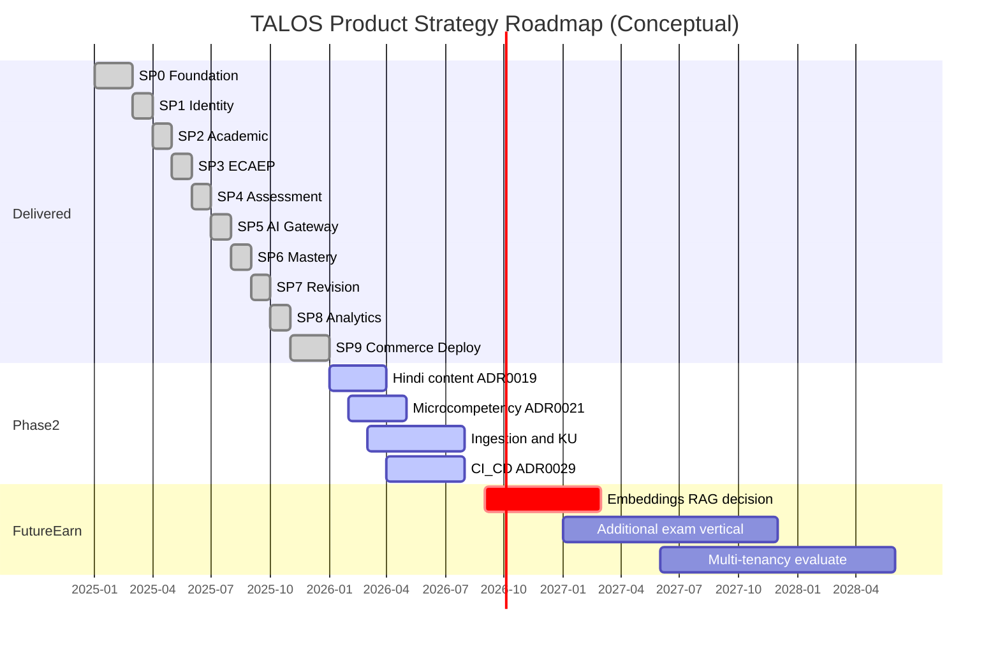

> **Note:** Gantt dates for historical SP0–SP9 are illustrative consolidation for strategy communication. Authoritative completion status is “done” in `docs/architecture/roadmap.md`, not the illustrative calendar bars.

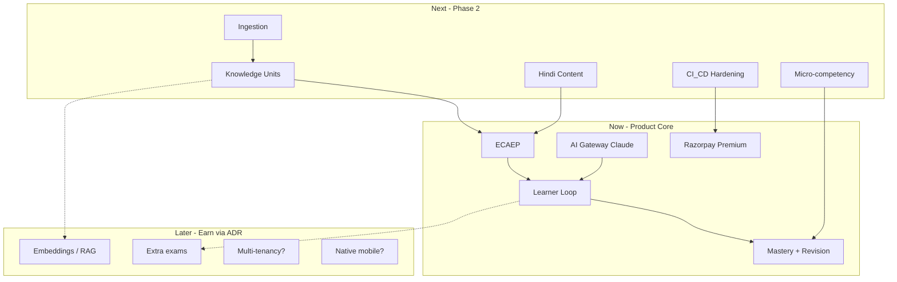

---

### 12.7 PlantUML Strategy Decomposition

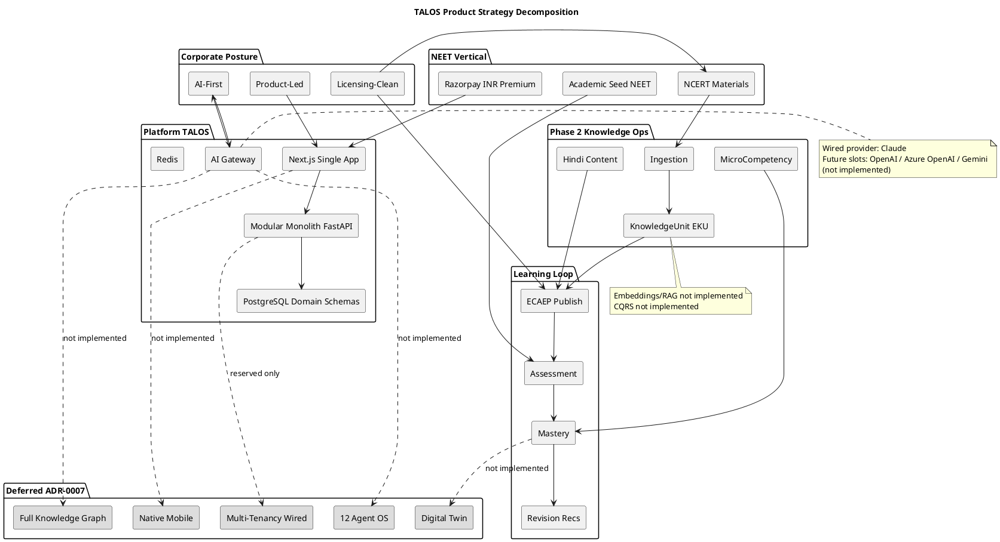

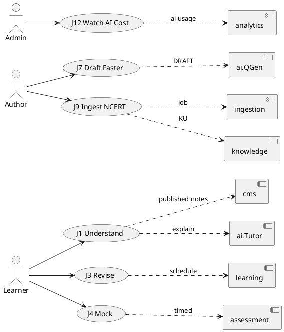

---

### 12.8 Product Strategy Advantages, Tradeoffs, Implementation Notes, Future Enhancements

#### Advantages

- Strategy is executable against existing code and ADRs.
- Reduces feature-factory behavior.
- Makes Phase 2 the obvious investment line.

#### Tradeoffs

- Competitors claiming “full KG + RAG + 12 agents” may win hype cycles temporarily.
- Hindi UI chrome remains English initially (ADR-0019), which must be explained in UX copy via fallback notices.

#### Implementation Notes

> **Implementation Note:** Product specs should cite ADR IDs in the “Constraints” section the same way engineering tasks do.

> **Implementation Note:** Any proposal introducing CQRS, microservices, Auth.js, or unlicensed imports is out of strategy unless ADR supersession occurs.

#### Future Enhancements

- Companion Chapters 13–20 for market sizing, personas, and pricing experiments.
- Formal product discovery cadence tied to mastery and content throughput objectives.

#### References

- `docs/architecture/roadmap.md`
- `docs/architecture/ecaep.md`
- `docs/decisions/ADR-0004-ai-gateway.md`
- `docs/decisions/ADR-0019-multi-language-content.md` through `ADR-0029-cicd-pipeline.md`

---


### 7.9 Executive Diligence Brief (Extended)

#### Purpose

Provide a diligence-ready narrative that an external technical advisor can cross-check against the repository in a single working day.

#### Background

SP0–SP9 completion and Phase 2 ADRs create a rare situation for an early education product: substantial vertical slice software exists before large GTM spend. Diligence should verify claims in code and ADRs, not in slide aesthetics.

#### Problem

Diligence checklists often assume microservices, multi-cloud, and multi-provider AI. Applying those checklists naively produces false negatives (“no Kubernetes multi-cluster”) and false positives (“AI platform complete”) if RAG/KG language is taken from stale prompts.

#### Solution — Diligence walkthrough

1. **Naming & identity of product:** Confirm ADR-0010 and that external one-pagers say Trinetra AI Learning OS (TALOS). Repository folder name “AI NEet Exam App” is acceptable as working title only.
2. **Architecture pattern:** Open `apps/backend/app/modules/` and confirm modular packages, not separate deployable services. Confirm single `apps/web`.
3. **Auth:** Trace register/login/refresh/logout/CSRF paths against ADR-0003; confirm cookies not localStorage tokens.
4. **AI:** Locate `AIProvider` / `ClaudeProvider` / `FallbackProvider`; confirm absence of production OpenAI/Azure client wiring.
5. **Content:** Walk ECAEP states in `docs/architecture/ecaep.md`; confirm Question Generator enters DRAFT.
6. **Mastery:** Confirm recompute on attempt submission (ADR-0015), not batch Digital Twin.
7. **Commerce:** Confirm Razorpay signature verification path and fail-closed without keys (ADR-0018).
8. **Hosting:** Read `docs/deploy/RUNBOOK.md` for Coolify/Hetzner.
9. **Phase 2:** Sample Knowledge Unit gates (ADR-0024) and CI workflows (ADR-0029).
10. **Conflicts:** Verify whether CR-1..CR-3 still open.

#### Architecture — Diligence evidence map

| Claim | Evidence artifact | Pass criterion |
|---|---|---|
| Modular monolith | `apps/backend` one app + modules | No service mesh required to run locally |
| Claude-only wired | AI provider package | Only Claude + Fallback active |
| ECAEP | cms workflow + ecaep.md | No skip-to-publish API for students |
| SP0–SP9 done | roadmap.md | All rows status done |
| No full KG | ADR-0007; no KG explorer product | KU ≠ KG |
| No CQRS | codebase patterns | Single write model request path |
| No RAG | no embedding retrieval path for Tutor as default | Do not market RAG |

#### Advantages

Shortens investor technical calls; reduces architecture re-litigation.

#### Tradeoffs

Requires maintaining this brief when ADRs change.

#### Implementation Notes

> **Implementation Note:** Attach git commit --trailer "Co-authored-by: Cursor <cursoragent@cursor.com>" hashes of key ADRs in diligence packets when cutting a release tag.

#### Future Enhancements

- Scripted “diligence bundle” zip generation from CI on tag.

#### References

- Chapters 1, 6, 7.3; Conflict Register; ADR index

---

### 7.10 Stakeholder FAQ (Executive)

| Question | Accurate answer |
|---|---|
| Is this microservices? | No. Modular monolith (ADR-0001). |
| Do you use Auth.js? | No. Custom JWT + refresh rotation + Argon2 + HTTP-only cookies + CSRF + RBAC (ADR-0003). |
| Which LLM runs in production wiring? | Claude via AI Gateway. Fallback without key. |
| Do you support OpenAI today? | No. Future provider slot only. |
| Azure OpenAI for enterprise sales? | Not implemented. Do not sell as available. |
| Is content from major coaching apps? | No, not without license (ADR-0005). |
| What is ECAEP? | Editorial workflow ensuring draft→review→publish with AI check. |
| What are Knowledge Units? | Gate-checked structured facts between NCERT extraction and asset generation. |
| Is that a knowledge graph? | No. Full KG deferred (ADR-0007). |
| Do you have RAG? | Not implemented. |
| Do you have CQRS? | Not implemented. |
| Payments? | Razorpay one-time Premium; no fake success fallback. |
| Hosting? | Coolify on Hetzner VPS for MVP. |
| Mobile app? | Native deferred; web-first. |
| Multi-tenant coaching franchises? | Not wired. |
| Are SP0–SP9 finished? | Yes per roadmap. README status line is stale (CR-3). |
| How many AI agents? | Four in v1. Twelve-agent OS deferred. |
| Hindi? | Learner content yes (ADR-0019); full UI i18n no. |
| Digital Twin? | Deferred. |
| pgvector? | Extension/planning exists in broader technical discussion; embeddings/RAG not productized. |

#### Purpose / Problem / Solution

**Purpose.** Normalize answers across CTO, Sales, and agents.  
**Problem.** FAQ drift recreates Conflict Register items.  
**Solution.** This table is normative for Part A; changes require revision.

---

### 7.11 Value Chain Economics Narrative

#### Purpose

Explain qualitatively how value accrues without fabricating audited financials.

#### Background

Coolify/Hetzner keeps infrastructure lean; Anthropic usage and editorial labor dominate variable cost as engagement grows.

#### Problem

Treating AI calls as free product magic destroys margin.

#### Solution

Product packaging must meter or gate high-cost agents (especially Tutor and generation bursts) using Gateway logs as the instrumentation spine. Premium via Razorpay funds sustained AI + editorial capacity.

> **Enterprise Assumption:** Contribution margin becomes healthy when (a) Premium conversion reaches mid-single digits of MAU, (b) tutor sessions per free user are rate-limited, and (c) generation is mostly admin-triggered batch, not unbounded learner-triggered generation.

#### Advantages / Tradeoffs

Aligns pricing to cost drivers; may reduce viral “unlimited tutor” positioning.

#### References

- ADR-0014, ADR-0018, §11 O8/O9

---

### 8.6 Vision Quality Attributes

#### Purpose

Express vision as quality attributes architects can test.

| Attribute | Vision aspiration | Current constraint |
|---|---|---|
| Curriculum fidelity | Explanations match NCERT-aligned facts | KU source verification gate; ECAEP |
| Pedagogical loop completeness | Understand→Practice→Revise→Perform | SP3–SP7 delivered |
| Trustworthiness | No silent draft leakage | Publish boundary |
| Operability | Small team can ship | Modular monolith + Coolify |
| Evolutivity | Add providers/exams without rewrite | Gateway + academic data model |
| Compliance posture | Licensing-clean | ADR-0005 |
| Honesty | Non-goals visible | ADR-0007 + Conflict Register |

#### Future Enhancements

- Add measurable thresholds per attribute into Chapter 11 as assumptions graduate to metrics.

---

### 8.7 Vision Anti-Patterns

| Anti-pattern | Why harmful | Corrective |
|---|---|---|
| “Rebuild as microservices before scale pain” | Cost without benefit | ADR-0001 |
| “Add ten agents for demo day” | Ops + cost + quality collapse | ADR-0004/0007 |
| “Import competitor PDFs overnight” | Legal extinction risk | ADR-0005 |
| “Announce multi-cloud RAG knowledge graph” | False advertising vs repo | Conflict Register |
| “Subscriptions + Apple + Stripe simultaneously” | Premature commerce complexity | ADR-0018/0006 |
| “Native apps before web retention proof” | Split surface too early | ADR-0007 |

---

### 8.8 Platform Narrative for Capital Formation

#### Purpose

Give fundraising language that remains true under code review.

**Acceptable narrative.** Trinetra has built TALOS, an AI-first learning OS, and completed the NEET vertical’s core loop through SP9, including editorialized content, assessment, mastery, revision, Claude-wired AI Gateway, Razorpay commerce, and Coolify deployment posture. Phase 2 invests in licensing-clean content scale via NCERT ingestion and Knowledge Units, Hindi learner content, finer micro-competency diagnosis, and CI/CD hardening.

**Unacceptable narrative.** “We operate a multi-agent knowledge-graph RAG platform on microservices with OpenAI and Azure, Digital Twin personalization, and full multi-tenant coaching OS.” That sentence violates multiple ADRs simultaneously.

> **Enterprise Assumption:** Seed/Series positioning emphasizes capital efficiency and truthful AI systems over TAM slide maximalism; TAM figures belong in Part B with assumption labels.

---

### 9.4 Mission Operating Cadence

#### Purpose

Connect mission pillars to weekly operating rituals.

| Ritual | Cadence | Pillar | Owner roles | Artifact |
|---|---|---|---|---|
| Editorial review board | Weekly | Understanding / Practice | Content Manager, Reviewers | ECAEP queue metrics |
| AI cost review | Weekly | Decision-making / margin | Eng Manager, CTO | `ai.ai_requests` aggregates |
| Mastery outcome review | Biweekly | Practice / Revision | Product, QA | Mastery delta samples |
| Ingestion quality review | Per major job | Understanding | Architect, SME | KU pass/fail rates |
| Conflict & docs hygiene | Monthly | Governance | Chief Architect | Conflict Register |
| Reliability drill | Quarterly | Performance (ops) | Eng Manager | Rollback drill notes |

#### Advantages

Mission becomes managerial, not poetic.

#### Tradeoffs

Ritual overhead; keep meetings short and metric-bound.

---

### 9.5 Mission Failure Modes

| Failure mode | Signal | Response |
|---|---|---|
| Publish gate bypass | Draft content visible to learners | Hotfix + incident review; restate P2 |
| Mastery theater | Recommendations ignore attempt data | Audit Planner/Rec code paths |
| Licensing breach attempt | Request to scrape coaching PDFs | Legal stop; ADR-0005 reminder |
| Agent sprawl | New agent PR without ADR | Reject until ADR-0004 amended |
| Status fiction | README/outdated decks | CR process |

---

### 9.6 Detailed Module Responsibility Statements

#### identity

Owns users, credentials (Argon2 hashes), sessions/refresh tokens, CSRF issuance patterns, roles/permissions, admin suspension semantics. Mission contribution: trusted access for learners and editorial actors.

#### academic

Owns exam hierarchy entities and Phase 2 micro-competencies. Mission contribution: curriculum spine for all learning objects.

#### cms

Owns content items/versions/reviews and workflow transitions. Mission contribution: understanding & practice trust boundary.

#### assessment

Owns practice/mock generation, attempts, scoring. Mission contribution: practice & performance pillars.

#### ai

Owns Gateway, providers, prompts, agents, request logs, study plans. Mission contribution: understanding, authoring acceleration, planning — never silent publish.

#### learning

Owns mastery projections and revision scheduling inputs. Mission contribution: revision & decision-making.

#### analytics

Owns admin aggregate views for assessment and AI cost. Mission contribution: operator decision-making.

#### commerce

Owns Razorpay orders and payment verification. Mission contribution: sustainable access to premium learning capacity.

#### system

Owns cross-cutting system schema concerns reserved in platform conventions.

#### ingestion

Owns jobs that read NCERT materials, split sections, match concepts, trigger generation pipelines.

#### knowledge

Owns Knowledge Units / EKU records, validation status, relationships used by generation and evolving tutor/mastery features.

---

### 10.6 Competitive Strategy Without Unlicensed Arms Races

#### Purpose

Explain how to compete when rivals boast larger questionable banks.

#### Solution themes

1. **Trust brand:** Curriculum-aligned + editorialized.
2. **Loop brand:** Mastery and revision beat infinite unscored quizzes.
3. **Ops brand:** AI cost visibility and fail-closed payments signal seriousness.
4. **Scale brand:** Ingestion+KU is the clean scaler.

> **Enterprise Assumption:** Share of search for “NEET AI tutor” can be bought; share of durable mastery improvement must be built. Budget tilts to content/engineering until activation OKRs stabilize.

#### Tradeoffs

Slower vanity metrics; stronger defensibility.

---

### 10.7 Corporate Policy Capsules

| Policy capsule | Statement |
|---|---|
| Content intake | No file enters learner view without ECAEP publish |
| Model providers | Only ADR-approved wired providers in production |
| Architecture changes | ADR before blueprint/marketing rewrite |
| Hosting changes | Revisit cloud when Coolify/Hetzner proven insufficient (ADR-0006) |
| Exam expansion | New exam = academic seed + content program, not new monolith fork |
| Partner content | Written license required before importer work |

---

### 10.8 Scenario Planning (Qualitative)

| Scenario | Trigger | Corporate response | Engineering response |
|---|---|---|---|
| S1 Content bottleneck | NEET calendar pressure | Hire SMEs; do not scrape | Scale ingestion jobs; keep gates |
| S2 AI cost spike | Viral tutor usage | Tighten free tier | Rate limits; monitor Gateway |
| S3 Provider outage | Anthropic disruption | Comms honesty | FallbackProvider degraded mode; prioritize second provider ADR if sustained |
| S4 Legal scare re content | Industry crackdowns | Audit provenance | Freeze risky imports; reinforce ADR-0005 |
| S5 Competitor KG hype | Marketing war | Publish honesty brief | Do not panic-build full KG |
| S6 Hosting limits | CPU/RAM ceiling | Approve cloud migration ADR | Extract only if module scale proven |

> **Enterprise Assumption:** S3 second-provider implementation, if triggered, budgets 2–4 engineering weeks for OpenAI or Azure OpenAI adapter plus config/secrets/tests — estimate only, not a commitment.

---

### 11.5 Metric Dictionary (Planning)

| Metric | Definition | Source system | Assumption? |
|---|---|---|---|
| Registered user | Account created and not deleted | identity | Measured capable |
| Activated user | ≥1 submitted attempt within 7 days of register | assessment | Measured capable |
| MAU | Users with ≥1 attempt or tutor call in 30 days | assessment/ai | Measured capable |
| Mastery delta | Change in mastery_score for concepts with ≥5 attempts | learning | Measured capable |
| Published item | content_items with PUBLISHED state | cms | Measured capable |
| KU pass rate | PASSED / (PASSED+FAILED) KUs in period | knowledge | Measured capable |
| AI cost est. | Sum estimated cost from ai_requests | ai | Approximate |
| Premium user | User with ≥1 PAID order | commerce | Measured capable |
| Availability | **Enterprise Assumption** until external uptime tool wired | ops | Assumption |

---

### 11.6 Quarterly Business Review Template Hooks

1. Conflict Register status  
2. Content throughput vs O5  
3. KU quality vs O6  
4. AI cost vs O8  
5. Activation/retention assumptions vs observed  
6. ADR amendments since last QBR  
7. Explicit reaffirmation of ADR-0007 non-goals  

---

### 11.7 Funding Use-of-Proceeds Alignment (**Enterprise Assumptions**)

| Use category | Planning allocation band | Maps to objectives |
|---|---|---|
| Editorial / SME capacity | 25–40% | O5, O7 |
| AI inference budget | 15–30% | O8, activation |
| Engineering (Phase 2 + reliability) | 25–35% | O6, O10, O11 |
| GTM experiments India | 10–20% | O1, O9 |
| Contingency / legal content review | 5–10% | O5 licensing |

These bands are **Enterprise Assumptions** for capital planning workshops, not approved budgets in-repo.

---

### 12.9 Surface Inventory (Product)

| Surface | Route group (conceptual) | Primary actors | Job clusters |
|---|---|---|---|
| Public / marketing | `(public)` | Prospects | Acquisition |
| Auth | `(auth)` | All users | Access |
| Student dashboard | `(student)` | Learners | J1–J6 |
| Practice / mocks | `(student)` | Learners | J2–J4 |
| Tutor / planner | `(student)` | Learners | J1–J2 |
| Settings / language | `(student)` | Learners | J5 |
| Author workspace | `(admin)` | Authors | J7–J9 |
| Reviewer queue | `(admin)` | Reviewers | J8 |
| Coverage / analytics | `(admin)` | Admins | J10–J12 |
| Commerce checkout | student+API | Learners | Premium |
| Ingestion triggers | admin/API | Operators | J9 |

---

### 12.10 Packaging Strategy Hypotheses

| Package | Hypothesis | Repo reality |
|---|---|---|
| Free | Enough practice + limited tutor to activate | Exact limits product-configurable; enforce via app policy |
| Premium (one-time) | Unlocks sustained AI + expanded mocks | Razorpay order PAID derivation |
| Future subscription | Recurring revenue | **Not in SP9**; requires new ADR |
| Future B2B seat packs | Institutions | Needs multi-tenancy un-deferral |

> **Enterprise Assumption:** Premium price points in INR should be tested in bands familiar to NEET aspirants (for example ₹999–₹4999 one-time) — experimental only.

---

### 12.11 Experiment Backlog (Product)

| Experiment | Hypothesis | Guardrail |
|---|---|---|
| Tutor rate limits on free tier | Improves AI margin without killing activation | Watch O2/O8 together |
| Hindi-first content push on weak chapters | Improves retention for Hindi preference users | Fallback notice clarity |
| KU-cited tutor answers | Increases trust scores in surveys | No draft leakage |
| Revision reminders (email/web push later) | Improves D30 | Privacy/consent |
| Coverage-driven authoring targets | Raises publish throughput | Do not relax review |

No experiment may violate P2/P7 principles.

---

### 12.12 Product Requirements Traceability Matrix (Sample)

| PR / capability theme | Mission pillar | ADR | Sprint/Phase | Objective IDs |
|---|---|---|---|---|
| JWT auth & RBAC | Trust | 0003/0011 | SP1 | O10/O11 |
| NEET hierarchy | Understanding | 0012 | SP2 | O5 |
| ECAEP | Understanding/Practice | 0009 | SP3 | O5 |
| Mocks + scoring | Performance | 0013 | SP4 | O2/O4 |
| AI Gateway agents | Understanding/Decisions | 0004/0014 | SP5 | O8 |
| Mastery | Practice/Revision | 0015 | SP6 | O4 |
| Revision/recs | Revision | 0016 | SP7 | O3 |
| Analytics | Decisions | 0017 | SP8 | O8 |
| Razorpay Premium | Sustainability | 0006/0018 | SP9 | O9 |
| Hindi content | Understanding | 0019 | Phase 2 | O7 |
| Micro-competency | Practice | 0021 | Phase 2 | O4 |
| Ingestion+KU | Understanding | 0022–0028 | Phase 2 | O5/O6 |
| CI/CD | Reliability | 0029 | Phase 2 | O10/O11 |

---

### 12.13 Product Strategy Deep Narrative

Trinetra’s product strategy rejects two common edtech failure modes. The first failure mode is the **content arms race**, where teams scrape or license ambiguously and drown learners in undifferentiated MCQs. ADR-0005 and ECAEP make that path a policy violation. The second failure mode is the **agent theme park**, where demos multiply personalities (mentor, twin, diagram orchestrator) without mastery instrumentation or cost control. ADR-0004 and ADR-0007 constrain TALOS to four agents and defer the rest.

Instead, TALOS concentrates product investment on a narrow, compounding loop. Academic structure makes every asset addressable. ECAEP makes every asset accountable. Assessment makes every claim about learning empirically testable. Mastery and revision convert attempts into guidance. The AI Gateway makes intelligence replaceable and measurable. Knowledge Units make generation accountable to source facts rather than raw PDF paste. Hindi content broadens access without pretending the entire UI is localized. CI/CD and Coolify make the loop shippable by a small team.

This is why Phase 2 is not a random feature pile. Multi-language content, micro-competency, ingestion, Knowledge Units, visual extraction, language processing, EKU formalization, and CI/CD each strengthen the same loop. Embeddings and full graph navigation remain earnable sequels, not silent scope.

For product managers writing PRDs, the default question is not “can a model generate this?” but “which published knowledge object and which mastery signal make this feature true tomorrow morning?” If the answer requires Digital Twin, multi-tenant franchises, or unlicensed banks, the PRD is out of strategy.

For executives, the default question is not “how do we match competitor question counts?” but “how fast can we ethically publish and how efficiently can we spend Anthropic tokens for measurable mastery movement?” Objectives in Chapter 11 exist to keep that question quantitative even when some targets remain Enterprise Assumptions.

---

### 12.14 Risks Specific to Product Strategy Execution

| Risk | Product symptom | Mitigation |
|---|---|---|
| Reviewer burnout | Queue growth, publish starvation | Staffing; limit QGen blast radius |
| Over-filtering KU gates | Too few PASSED units | Tune gates carefully; do not remove source verification |
| Under-filtering | Hallucinated facts in drafts | Keep gates + human review |
| Free-tier abuse of Tutor | Cost spike | Rate limits; Premium packaging |
| Mislabeled Hindi | English shown as Hindi | language_fallback flag UX (ADR-0019) |
| Admin/student UX confusion | Wrong tools exposed | Route groups + RBAC |

---

### 1.9 Document Production & Pandoc Profile (Extended Control)

#### Purpose

Ensure DOCX outputs preserve enterprise structure.

#### Recommended pandoc flags

- `--toc --toc-depth=3`
- `--number-sections` if desired for print
- filters for mermaid/plantuml pre-render
- retain tables and blockquotes

#### Classification marking

Every exported PDF/DOCX cover must show **Internal / Confidential**, Document ID **TALOS-VOL-01**, Version **1.0.0**, Date **2026-08-07**.

#### Advantages / Tradeoffs

Consistent artifacts; filter toolchain required for diagrams.

---

### 6.13 Onboarding Syllabus Using This Volume

| Day | Audience | Reading | Exercise |
|---|---|---|---|
| 1 | All eng/product | §7 + Conflict Register | List three non-goals |
| 2 | Backend | §9.3 + ADR-0001/0003/0004 | Trace one request through a module |
| 3 | Frontend | ADR-0008 + student/admin surfaces | Map route groups to JTBD |
| 4 | Content | ecaep.md + ADR-0005/0009 | Draft→publish dry run |
| 5 | AI | ADR-0014 + 0024/0025 | Explain why QGen cannot publish |
| 6 | Ops | deploy docs + ADR-0029 | Dry-run rollback reading |
| 7 | Leadership | §10–§12 + OKRs | Approve or amend Q1 OKRs |

---


### 7.12 Executive Capability Scorecard (As-Of 2026-08-07)

#### Purpose

Give leadership a single scorecard that distinguishes **delivered**, **Phase 2 in motion**, and **not built**, preventing average-out storytelling that hides gaps.

#### Scorecard

| Capability area | Maturity | Evidence basis | Executive read |
|---|---|---|---|
| Modular monolith runtime | Delivered | SP0 + module layout | Green |
| Identity/Auth/RBAC/CSRF | Delivered | SP1 verified | Green |
| Academic hierarchy NEET | Delivered | SP2 seeded | Green |
| ECAEP CMS | Delivered | SP3 workflow | Green |
| Assessment practice/mocks | Delivered | SP4 scoring | Green |
| AI Gateway + 4 agents | Delivered | SP5 + ADR-0014 | Green — Claude/Fallback only |
| Mastery + revision | Delivered | SP6–SP7 | Green — not Digital Twin |
| Admin analytics | Delivered | SP8 | Green — not full warehouse |
| Razorpay Premium | Delivered (integration) | SP9 / ADR-0018 | Amber until live keys+traffic |
| Coolify deploy posture | Delivered (packaging) | SP9 + runbook | Amber until prod drills habitual |
| Hindi content | Phase 2 | ADR-0019 | Amber — coverage dependent |
| Micro-competency | Phase 2 | ADR-0011/0021 lineage | Amber — seeded sparsely by design |
| Ingestion pipeline | Phase 2 | ADR-0022+ | Amber — expanding beyond pilot |
| Knowledge Units / EKU | Phase 2 | ADR-0024–0028 | Amber-Green for generation path; Tutor/graph/embeddings partial/future |
| CI/CD | Phase 2 | ADR-0029 | Amber — scanners initially non-blocking |
| Full Knowledge Graph | Not built | ADR-0007 | Red if claimed otherwise |
| Digital Twin | Not built | ADR-0007 | Red if claimed otherwise |
| Multi-tenancy wired | Not built | ADR-0007 | Red if claimed otherwise |
| 12-agent OS | Not built | ADR-0007 | Red if claimed otherwise |
| Native mobile | Not built | ADR-0007 | Red if claimed otherwise |
| Embeddings / RAG | Not built | ADR-0024/0028 | Red if marketed |
| CQRS | Not built | architecture truth | Red if marketed |
| OpenAI/Azure providers | Not built | ADR-0004 | Red if marketed |

#### Advantages

Forces precise board updates.

#### Tradeoffs

Amber items require narrative, not just color.

#### Implementation Notes

> **Note:** “Delivered” means roadmap/ADR verification posture, not proof of large-scale production load tests.

---

### 7.13 Communication Guardrails for External Decks

1. Always include non-goals slide derived from ADR-0007.  
2. Always name Claude as wired provider; list others as future.  
3. Always distinguish Knowledge Units from Knowledge Graph.  
4. Always say web-first.  
5. Always say Razorpay India-first.  
6. Never show microservice topology diagrams as current state.  
7. Never show CQRS command/query buses as current state.  
8. Never show vector RAG architecture as current state without a future watermark.  
9. Prefer module diagrams matching `app/modules/*`.  
10. Cite Document ID TALOS-VOL-01 when excerpts circulate.

---

### 8.9 Long-Horizon Capability Tree

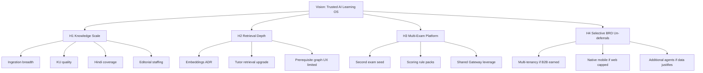

#### Narrative

H1 is the only horizon that should consume the majority of near-term capital. H2 is a set of ADR-gated technical bets. H3 is a GTM/content bet on platform leverage. H4 is optional and dangerous if pulled forward for storytelling.

---

### 8.10 Societal Impact Boundaries and Ethics

#### Purpose

Prevent impact-washing.

#### Ethical commitments aligned to repo

- Prefer curriculum-true knowledge over fear-based marketing.  
- Do not claim guaranteed NEET ranks.  
- Do not harvest unlicensed coaching IP to manufacture “completeness.”  
- Keep humans responsible for question correctness.  
- Be transparent when Hindi content falls back to English (ADR-0019).  
- Be transparent when AI is in fallback mode without keys.

> **Enterprise Assumption:** Independent efficacy studies, if funded, should pre-register outcomes (mastery deltas, timed mock improvements) rather than vanity time-on-app metrics.

---

### 9.7 Mission KPIs vs Vanity Metrics

| Prefer (mission-aligned) | Avoid (vanity) |
|---|---|
| Submitted attempts | Raw page views alone |
| Mastery level transitions | Chat messages sent without learning movement |
| Published items through ECAEP | “AI questions generated” counting drafts as live |
| KU PASSED rate | PDF files uploaded regardless of gate failures |
| Revision completions | Streaks that ignore weak concepts |
| AI cost per activated learner | “Unlimited AI” slogans |
| PAID orders | Soft-claimed premium without commerce truth |

---

### 9.8 Cross-Module Sequence Diagrams (Mission Critical Paths)

#### Path A — Learner practices and mastery updates

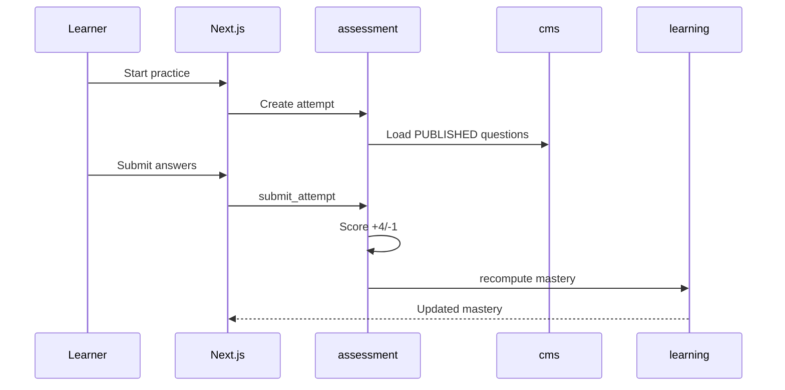

#### Path B — AI question generation remains editorialized

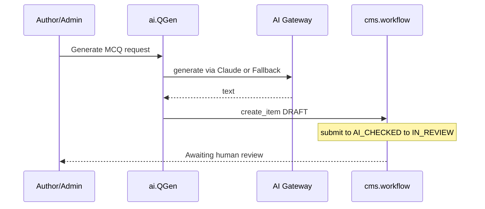

#### Path C — Ingestion to Knowledge Unit to draft assets

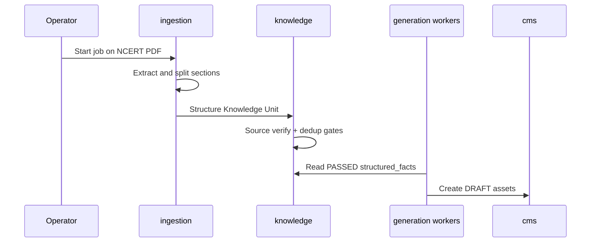

---

### 10.9 Partnership Playbooks

#### Playbook A — SME author contract

- SME produces original explanations/questions.  
- All items enter ECAEP.  
- No reuse of prior employer coaching sheets unless licensed.

#### Playbook B — Distribution partner (coaching center)

- Partner refers students to TALOS web.  
- Partner does not receive a right to upload third-party banks.  
- If co-branded content, originals only.

#### Playbook C — Model provider commercial relationship

- Anthropic today via SDK.  
- Future OpenAI/Azure OpenAI require engineering adapter + security review + ADR note.  
- Procurement cannot “enable by contract” without code.

#### Playbook D — Explicit rejection

- Any offer of “we’ll give you PW/Allen scrapes” is rejected under ADR-0005 and escalated to Security/Legal.

---

### 10.10 Geographic Expansion Gates

| Gate | Requirement before expansion beyond India NEET focus |
|---|---|
| G1 | Stable NEET activation & retention vs Chapter 11 assumptions |
| G2 | Premium economics not AI-negative |
| G3 | Content ops playbook repeatable on new chapters |
| G4 | Support burden quantified |
| G5 | New exam academic model designed without monolith fork |
| G6 | Payments/legal review for any new country |

Skipping gates reintroduces BRD overreach dynamics.

---

### 10.11 Moat Reinforcement Programs

| Program | Description | Horizon |
|---|---|---|
| Editorial excellence | Train reviewers on Evaluator reports + common NEET misconceptions | H1 |
| KU library growth | Increase PASSED units on high-traffic concepts | H1 |
| Mastery dataset ethics | Retain attempt-derived mastery as product data asset with privacy controls | H1–H2 |
| Gateway discipline | Prompt versioning + cost anomaly alerts | H1 |
| Selective retrieval | Only after embeddings ADR | H2 |

---

### 11.8 Objective Sensitivities and Leading Indicators

| Objective | Leading indicator | Lagging indicator | Sensitivity |
|---|---|---|---|
| O2 Activation | Time-to-first-attempt UX friction | Day-7 activation % | High to onboarding copy |
| O4 Mastery | Attempts per weak concept | 30-day mastery delta | High to recommendation quality |
| O5 Throughput | Reviewer hours | Publishes/month | High to staffing |
| O6 KU quality | Gate fail reasons taxonomy | Pass rate | High to PDF structure variance |
| O8 AI cost | Tutor calls per MAU | Cost/MAU | High to free tier policy |
| O9 Premium | Paywall impressions | PAID/MAU | High to price tests |
| O10 Reliability | CI flake rate | Availability assumption | High to deploy discipline |

---

### 11.9 Sample OKR Scoring Rubric

| Score | Meaning |
|---|---|
| 0.0 | Not started / blocked by conflict with ADR |
| 0.3 | Exploratory work only |
| 0.5 | Partial delivery, not learner-visible |
| 0.7 | Learner-visible but below target |
| 1.0 | Target met with evidence |
| >1.0 | Reserved; prefer raising next-quarter targets over ritual overscore |

OKRs that require deferred ADR-0007 items should be scored N/A and rewritten rather than marked failed.

---

### 11.10 Reliability Assumption Detail (**Enterprise Assumptions**)

| SLO placeholder | Proposed target | Measurement idea | Notes |
|---|---|---|---|
| API availability | 99.5% monthly | External uptime check on `/health` | Not wired as contractual |
| Error rate | <1% 5xx on authenticated APIs | Reverse proxy/app logs | Exclude controlled 503 payment-not-configured in staging without keys |
| Deploy success | ≥90% deploys healthy | Coolify + verification checklist | Use `docs/deploy/VERIFICATION_CHECKLIST.md` |
| Rollback RTO | ≤60 minutes | Drill | See ROLLBACK.md |
| Security triage | Critical secrets findings in 1 business day | gitleaks | ADR-0029 non-blocking initially |

---

### 12.15 Detailed Build-vs-Buy Decision Records (Product View)

#### Auth (Build)

Building auth keeps refresh rotation, CSRF, and RBAC in one module with educational roles. Buying Auth.js would fight cookie architecture (ADR-0003). Revisit only if a future enterprise IdP mandate appears — that would be a new ADR, possibly SSO additive, not a silent swap.

#### CMS (Build)

ECAEP is the product. A generic headless CMS would not understand AI_CHECKED transitions, Evaluator reports, or concept linkage without heavy customization costing more than the two-table model.

#### LLM (Buy)

TALOS is not a model company. Buying Claude inference is correct. Gateway ensures the buy decision is reversible.

#### Payments (Buy Razorpay)

India rails and GST practicality dominate. Abstracting multiple gateways before a second country is premature (ADR-0006/0018).

#### Vectors (Defer)

Buying a hosted vector DB now would encode RAG before Tutor grounding strategy finishes KU citation work. Revisit with ADR.

---

### 12.16 AI Agent Product Specs (v1 Boundaries)

#### Tutor

- **Job:** Explain concepts.  
- **Inputs:** Learner question + concept context + published notes / allowed references.  
- **Outputs:** Explanation text; should cite sources.  
- **Forbidden:** Reading DRAFT content; presenting fallback as human SME without label.

#### Question Generator

- **Job:** Accelerate authoring.  
- **Outputs:** DRAFT CMS items only.  
- **Forbidden:** Publishing; bypassing Evaluator/human review.

#### Study Planner

- **Job:** Propose plan from goals/dates and weak concepts from attempts.  
- **Forbidden:** Inventing a shadow Twin memory system.

#### Evaluator

- **Job:** AI check reports inside ECAEP.  
- **Forbidden:** Final publish authority.

---

### 12.17 Content Type Strategy

| Type | Learner use | Generation path | Review necessity |
|---|---|---|---|
| CONCEPT_NOTE | Understanding | Author or ingestion synthesis | Required |
| QUESTION | Practice/Performance | Author or QGen/ingestion | Required |
| FLASHCARD | Revision | Ingestion generate-many | Required |
| FORMULA_SHEET | Revision | Chapter-level generation | Required |
| DIAGRAM / VIDEO_REF | Understanding | Mostly human; visuals via ADR-0026 path | Required |

All types share one workflow (ADR-0009) — a deliberate product simplification versus 40-table CMS fantasies.

---

### 12.18 Go-to-Product Sequencing Rules

1. If a feature needs unpublished content, it is wrong.  
2. If a feature needs a new agent, write ADR first.  
3. If a feature needs unlicensed PDFs, stop.  
4. If a feature needs multi-tenant org switching, it is deferred.  
5. If a feature needs offline native shells, it is deferred.  
6. If a feature needs embeddings, write embeddings ADR and do not fake with random cosine on empty columns.  
7. If a feature needs CQRS, reject as unrequested complexity.  
8. Prefer improving KU pass quality over adding new learning gimmicks.

---

### 12.19 Product Strategy Appendix Tables for DOCX

#### RACI for major product changes

| Change type | Product | Architect | Eng Manager | Security | QA |
|---|---|---|---|---|---|
| New learner surface | A/R | C | R | C | C |
| New agent | C | A | R | C | C |
| Workflow change ECAEP | A | A | R | C | R |
| Payment packaging | A | C | R | C | C |
| Provider wiring | C | A | R | R | C |

#### Definition of Ready (Product)

- ADR constraints listed  
- JTBD identified  
- Module touch list identified  
- Non-goals listed  
- Telemetry plan listed  
- Licensing impact checked  

#### Definition of Done (Product)

- Matches ADR  
- ECAEP respected if content  
- Tests updated per module norms  
- Docs conflicts checked  
- Cost impact noted for AI paths  

---

### 2.5 Extended Version Narrative (Enterprise Memory)

Version 0.1 through 0.4 existed to stop architecture thrash: monolith, auth, commerce, hosting. Versions 0.5 through 0.7 existed to stop AI and status thrash: Claude-only honesty, SP completion, OKRs. Versions 0.8 through 1.0.0 existed to stop Phase 2 myth-making: Knowledge Units are real; full KG/RAG/CQRS are not. This progression should remain part of institutional memory so new leaders do not “discover” BRD maximalism as if it were unfinished mandatory work.

---

### 3.6 Dual Control: ADR Acceptance vs Blueprint Approval

ADR acceptance means engineering may build. Blueprint approval means executives may communicate. A capability can be ADR-accepted but not yet marketed (for example, experimental admin tools). A capability must not be marketed if ADR-deferred. Part A approval is communication control as much as technical summary.

---

### 4.9 Revision SLA

| Change class | Max time to update Volume 1 Part A |
|---|---|
| Editorial typo | 10 business days |
| ADR sync affecting §7/§12 | 5 business days |
| Conflict Register new item | 5 business days |
| Major posture reversal | Block external decks until major version ships |

---

### 5.6 TOC Governance

Chapter numbers 1–40 are reserved. Do not renumber casually; insert subsections (x.y) instead. Companion files must adopt the same headings for chapters 13–40 to keep cross-volume references stable.

---

### 6.14 Investor Reading Path (NDA)

1. Cover + §7 Executive Summary (including scorecard §7.12)  
2. Conflict Register  
3. §10 Moats and partnerships  
4. §11 Objectives with assumption labels  
5. §12.5 AI principles  
6. Pointers into ADR-0004, 0005, 0007, 0018, 0029 for deep dives  

Investors seeking microservice diagrams should be shown ADR-0001 rather than custom fiction.

---

### 7.14 Investment Objection Handling

| Objection | Response |
|---|---|
| “Too narrow vs BRD vision” | Vision constrained on purpose; SP0–SP9 done proves execution; Phase 2 scales cleanly |
| “No RAG” | Honest; KU gates may beat naive RAG on NCERT; embeddings earnable |
| “Only one LLM provider wired” | Interface exists; concentration risk accepted and documented |
| “Single VPS” | Cost control; migration criteria in ADR-0006 |
| “Content will be slow” | True without scrape; ingestion+KU is the plan; licensing is a feature |
| “No native app” | Web-first; metrics must demand mobile |
| “README says foundation in progress” | Known conflict CR-3; roadmap authoritative |

---


### 7.15 Comprehensive Platform Fact Base for Executives

#### Purpose

Consolidate immutable facts that must appear consistently in board updates, partner conversations, and hiring pitches.

#### Fact base

**Identity facts.** The platform’s canonical name is Trinetra AI Learning OS (TALOS). The first product vertical is the AI NEET Exam App targeting NEET-UG in India. Naming defects include any new document that uses “AI Learning OS” without Trinetra.

**Architecture facts.** The system is a modular monolith: one FastAPI application with internally bounded modules, and one Next.js application with route groups for public, auth, student, and admin experiences. Microservices are a non-goal at current scale. CQRS is not implemented. Multi-tenancy is not wired.

**Data facts.** PostgreSQL 17+ hosts domain schemas including identity, academic, cms, assessment, ai, analytics, commerce, system, and Phase 2 schemas such as learning, ingestion, and knowledge. Redis supports caching/session needs per stack decisions. Alembic migrations are mandatory for schema change.

**Security facts.** Authentication is custom JWT access tokens with rotating refresh tokens, Argon2 password hashing, HTTP-only secure cookies, CSRF protection, and RBAC. Auth.js is not used. Suspended users must not authenticate (SP9 hardening narrative).

**AI facts.** An AI Gateway abstracts providers. Claude is wired. FallbackProvider supports keyless environments with labeled deterministic responses. Four agents ship in v1. Cost and latency are logged per request with approximate cost estimates. OpenAI and Azure OpenAI are future slots only.

**Content facts.** Content is NCERT-aligned and/or originally authored, plus legally permissible reviewed previous-year questions where applicable. ECAEP enforces draft, AI check, review, approve, publish, archive. AI Tutor consumes published material pathways, not unchecked drafts. Unlicensed coaching banks are forbidden.

**Learning facts.** Mastery is computed from real attempts with concept-level persistence and topic rollups; micro-competencies refine granularity where tagged. Revision and recommendations are rule-based, not Twin-based.

**Commerce and hosting facts.** Razorpay provides one-time Premium purchases without a fake success path. Hosting for MVP is Coolify on a Hetzner VPS. CI/CD via GitHub Actions supports quality and image traceability; Coolify remains the deploy mechanism.

**Delivery facts.** SP0 through SP9 are done per roadmap. Phase 2 ADRs 0019–0029 cover Hindi content, tests, micro-competency, ingestion, generate-many, Knowledge Units, visuals, language processing, EKU formalization, and CI/CD.

#### Advantages

Reduces contradictory one-pagers.

#### Tradeoffs

Fact base must be revised on ADR sync quickly.

---

### 7.16 Board Update Skeleton (Reusable)

1. **Headline status:** SP0–SP9 complete; Phase 2 focus areas this month.  
2. **Learner loop metrics:** activation, attempts, mastery deltas (label assumptions if early).  
3. **Content ops:** publishes, KU pass rate, Hindi coverage.  
4. **AI economics:** estimated cost, top agent consumers, anomaly notes.  
5. **Revenue:** PAID orders, conversion.  
6. **Reliability/security:** deploys, incidents, CI findings triage.  
7. **Decisions needed:** ADR approvals, staffing, budget bands.  
8. **Non-goals reminder:** KG/Twin/12-agents/native/multi-tenant/RAG unless newly ADR’d.

---

### 8.11 Vision Storyboard for Internal All-Hands

**Frame 1 — The problem.** NEET aspirants drown in content of uneven provenance and weak feedback loops.  
**Frame 2 — The platform.** TALOS provides curriculum structure, editorial truth, assessment, mastery, and observable AI.  
**Frame 3 — The vertical.** NEET-UG proves the loop with India payments and NCERT-aligned knowledge.  
**Frame 4 — The scale path.** Ingestion and Knowledge Units grow coverage without illegal shortcuts.  
**Frame 5 — The discipline.** Deferred BRD epics remain deferred until earned.  
**Frame 6 — The ask.** Staff editorial capacity, protect publish gates, watch AI margins, close doc conflicts.

---

### 8.12 Relationship Between BRD Vision and TALOS Execution

The BRD remains useful as a brainstorm cemetery and opportunity catalog. It is not a contract. Whenever BRD language conflicts with an Accepted ADR, the ADR wins. Volume 1 exists partly to institutionalize that precedence so new contractors reading BRD.docx do not restart microservice or Auth.js debates.

| BRD theme | Execution posture |
|---|---|
| ~280 tables | Not target; MVP-scale schemas |
| 12+ agents | Four agents |
| Enterprise KG | Deferred; KU instead for now |
| Digital Twin | Deferred |
| Microservices | Rejected for now |
| Auth.js | Rejected |
| Multi-language | Partially un-deferred for content |
| Micro-competency enormous layer | Replaced by practical one-level ADR-0021 |

---

### 9.9 Mission-Aligned Hiring Profiles (**Enterprise Assumptions**)

| Role | Mission contribution | Near-term priority |
|---|---|---|
| SME Physics/Chem/Bio authors | Understanding/Practice content | High |
| Editorial reviewers | Publish quality | High |
| Full-stack engineers fluent in FastAPI/Next | Loop hardening + Phase 2 | High |
| AI platform engineer (Gateway/prompts/KU) | AI principles | High |
| SRE/DevOps (Coolify/CI) | Reliability | Medium-High |
| Growth marketer India NEET | Acquisition | Medium after activation baseline |
| Data analyst | Objectives instrumentation | Medium |
| Mobile engineers | Native deferred | Low until un-deferral |

---

### 9.10 Mission Narrative for Learners (Tone Guide)

Use empowering, precise language. Avoid fear marketing (“fail NEET forever”). Avoid implying AI guarantees ranks. Prefer “practice weak concepts,” “revise what’s due,” “explanations grounded in curriculum-aligned notes.” When Hindi is unavailable, say so via fallback notice patterns rather than silent English.

---

### 10.12 Strategic Control Points

| Control point | Owner | Cadence | Fail indicator |
|---|---|---|---|
| ADR freeze integrity | Chief Architect | Continuous | Feature merged contradicting ADR without amendment |
| Licensing intake | Product + Legal | Continuous | Unlicensed file in StudyMaterial processing path |
| AI margin | CTO + Eng Manager | Weekly | Cost/MAU above assumed band without packaging response |
| Roadmap honesty | Eng Manager | Monthly | README/deck status drift |
| Exam expansion readiness | Product | Quarterly | Second exam started without G1–G6 gates |

---

### 10.13 Platform Expansion Worked Example (Hypothetical Second Exam)

> **Enterprise Assumption:** Example uses a hypothetical second exam only to illustrate process — not a commitment to a specific exam brand or year.

1. Define academic seed differences (subjects, scoring).  
2. Estimate content coverage threshold for beta.  
3. Reuse ECAEP types and AI Gateway agents with new prompts/context.  
4. Do not fork `apps/web`; use exam switch in academic data.  
5. Keep Razorpay until geography changes.  
6. Write ADR for any scoring engine exceptions.  
7. Refuse to bootstrap via unlicensed banks.

---

### 11.11 Worked Numerical Planning Example (**Enterprise Assumptions**)

The following illustrative model is entirely assumptive and for planning workshops:

- Month M new registrations: 5,000  
- Day-7 activation 22% → 1,100 activated  
- MAU by month end: 3,000  
- Tutor calls: 1.5 per MAU → 4,500 calls  
- Estimated AI cost ₹8 per tutor call → ₹36,000 AI  
- Other AI (planning/generation admin): ₹12,000  
- Infra: ₹50,000  
- Editorial staff allocated: ₹300,000  
- Premium PAID 6% of MAU → 180 × ₹1,999 ≈ ₹359,820  

This toy model shows why editorial + AI dominate and why unlimited free tutor is dangerous. Replace every figure with actuals before board commitment.

---

### 11.12 Objective Ownership Matrix

| Objective | Accountable | Responsible | Consulted |
|---|---|---|---|
| O1 Acquisition | Head of Product | Growth | Eng |
| O2 Activation | Head of Product | Eng + Design | QA |
| O3 Retention | Head of Product | Eng | Content |
| O4 Mastery | Head of Product | Eng learning/assessment | Data |
| O5 Throughput | Head of Product | Content Manager | Architect |
| O6 KU quality | Chief Architect | AI/Ingestion eng | SME |
| O7 Hindi | Head of Product | Content | Eng |
| O8 AI cost | CTO | Eng Manager | Product |
| O9 Premium | Head of Product | Eng commerce | Finance |
| O10 Reliability | Eng Manager | DevOps/eng | QA |
| O11 Security | Security Owner | Eng | QA |
| O12 Conflict hygiene | Chief Architect | Eng Manager | Product |

---

### 12.20 End-to-End Product Journey Specifications

#### Journey 1 — New learner first week

Register → select preferences including language → browse academic hierarchy → read published concept note → ask Tutor → take practice → see mastery leave NOT_STARTED → receive recommendation → follow revision widget → optionally see Premium upgrade.

**Failure points to instrument:** drop before first attempt; tutor errors; empty content due to coverage gaps; confusing English fallback for Hindi preference.

#### Journey 2 — Author publishes AI-assisted question

Trigger generation from concept or ingestion → DRAFT created → submit → Evaluator report → reviewer requests changes or approves → publish → appears in assessment pools → learner attempts → mastery updates → analytics count.

**Failure points:** generator bypass attempts; reviewer backlog; duplicate stems; KU FAILED silently ignored.

#### Journey 3 — Operator ingests NCERT chapter

Select PDF → job checksum → extract → section split → concept match → KU structure/gates → generate assets as drafts → editorial triage → publish subset → coverage grid updates.

**Failure points:** bad matches inventing taxonomy (should skip); cost spikes; treating FAILED KUs as usable.

---

### 12.21 Product Telemetry Minimum Set

| Event / observation | Why |
|---|---|
| register_success | Acquisition |
| attempt_submitted | Activation/practice |
| mastery_level_changed | Learning outcomes |
| revision_practice_clicked | Revision loop |
| tutor_explain_called | AI usage |
| ai_request_cost_recorded | Margins (server-side already) |
| content_published | Throughput |
| ku_validation_finished | Knowledge quality |
| order_paid | Revenue |
| payment_gateway_not_configured | Ops honesty |

---

### 12.22 Competitive Messaging Matrix (Licensing-Clean)

| Competitor claim pattern | TALOS response angle |
|---|---|
| “Largest question bank” | “Editorially governed, curriculum-aligned bank” |
| “AI teacher replaces coaching” | “AI tutor + human-gated questions + mastery loop” |
| “Knowledge graph OS” | “Knowledge Units now; full KG deferred until earned” |
| “GPT-4/Azure powered” | “Claude-wired Gateway; multi-provider ready later” |
| “App for iOS/Android” | “Web-first excellence first” |

---

### 12.23 Strategy Compliance Checklist for PRDs

- [ ] Names TALOS correctly  
- [ ] Cites relevant ADRs  
- [ ] No microservice requirement  
- [ ] No Auth.js requirement  
- [ ] No unlicensed content  
- [ ] No auto-publish AI questions  
- [ ] No Digital Twin dependency  
- [ ] No full KG dependency  
- [ ] No RAG dependency unless ADR exists  
- [ ] No CQRS requirement  
- [ ] OpenAI/Azure mentioned only as future if at all  
- [ ] Metrics mapped to Chapter 11  
- [ ] Cost impact considered for AI  
- [ ] ECAEP touchpoints identified for content  

---

### 1.10 Distribution & Watermarking Guidance

Internal exports should carry footer text: `TALOS-VOL-01 v1.0.0 | Internal/Confidential | © Trinetra`. NDA investor excerpts should watermark pages and omit raw security runbook specifics when not required, while retaining architecture honesty sections and Conflict Register summaries.

---

### 6.15 How Architects Should Annotate This Volume

Architects may leave review comments as proposed Revision History entries, but normative changes to capabilities require ADRs. Blueprint annotations that attempt to “temporarily” authorize deferred work are invalid.

---

### 7.17 Residual Unknowns Explicitly Outside Part A

Part A does not settle final Premium INR price, final free-tier tutor caps, final second exam choice, final embeddings vendor choice, or final multi-cloud destination. Those are either Enterprise Assumptions for experimentation or future ADR subjects. Pretending Part A settles them would recreate BRD overclaim patterns.

---

### 12.24 Closing Strategy Statement

Trinetra AI Learning OS (TALOS) wins by being a disciplined learning operating system: modular, observable, licensing-clean, editorially serious, and AI-accelerated without being AI-unguarded. The AI NEET Exam App is the proving vertical. SP0–SP9 demonstrate that the proving vertical’s core loop can be built. Phase 2 demonstrates that ethical scale has a concrete engineering path through ingestion and Knowledge Units. Everything else in the maximal BRD remains optional until reality and ADRs say otherwise.

Leadership approving this Part A is not approving complacency; it is approving a finishable strategy. The next excellence gains come from content throughput quality, AI margin control, instrumentation of objectives, conflict remediation in README and `.cursor` packs, and steady Phase 2 execution — not from renaming the system into microservices or promising twelve agents on a slide.

---


### 7.18 Integrated Executive Risk-and-Opportunity Matrix

#### Purpose

Combine risks from §7.7 with opportunity upside so leadership decisions weigh both sides without reopening deferred scope.

| Theme | Opportunity if executed | Risk if mismanaged | Strategic response |
|---|---|---|---|
| ECAEP quality | Trust moat and safer AI grounding | Review bottlenecks slow coverage | Staff reviewers; keep gates |
| Knowledge Units | Ethical content scale + traceability | Gate tuning errors | Measure pass reasons; do not delete gates |
| AI Gateway | Provider optionality later; cost visibility now | Claude concentration; cost spikes | Keep interface clean; rate-limit productize |
| Mastery loop | Differentiated retention | Over-simple scoring criticized | Improve via micro-competency, not Twin theater |
| Razorpay Premium | India-fit monetization | Misconfigured keys / support load | Fail closed; runbook drills |
| Coolify/Hetzner | Capital efficiency | Scaling ceiling | ADR-0006 revisit criteria |
| Phase 2 Hindi | Broader access | Partial coverage UX confusion | Fallback honesty |
| Documentation honesty | Diligence credibility | CR-1..CR-3 lingering | Remediate post-approval |

#### Implementation Notes

> **Architecture Decision:** Opportunity framing must never be used to justify unlicensed content intake or auto-publish of AI questions.

#### Future Enhancements

- Convert matrix rows into quarterly KR owners in the QBR template (§11.6).

---

### 8.13 Vision Conformance Test Questions

Before any all-hands vision slide is approved, answer:

1. Does the slide use Trinetra AI Learning OS (TALOS)?  
2. Does it imply microservices? If yes, reject.  
3. Does it imply OpenAI/Azure are live? If yes, reject.  
4. Does it equate Knowledge Units with a full Knowledge Graph? If yes, rewrite.  
5. Does it promise Digital Twin, native apps, or twelve agents as near-term? If yes, move to deferred appendix.  
6. Does it acknowledge ECAEP human review for questions? If no, reject.  
7. Does it acknowledge SP0–SP9 completion accurately? If it says “foundation in progress,” reject (CR-3).  

---

### 9.11 Mission-to-OKR Quick Map

| Pillar | Primary OKR anchors |
|---|---|
| Understanding | KR-A2, KR-A3, KR-E1 |
| Practice | KR-B1, O4 |
| Revision | KR-B2, O3 |
| Performance | Mock participation metrics under O2/O4 |
| Decision-making | Planner usage + recommendation acceptance (instrument) |

---

### 10.14 Strategy One-Pager (Internal)

**Aspire:** Trusted AI learning OS for high-stakes exams.  
**Focus now:** NEET-UG India.  
**System:** Modular monolith + ECAEP + Claude Gateway + mastery loop.  
**Scale cleanly:** NCERT ingestion → Knowledge Units → human publish.  
**Make money:** Razorpay Premium, AI-aware packaging.  
**Do not:** scrape coaching banks; pretend RAG/KG/Twin/mobile/multi-tenant/12 agents are shipped.  
**Operate:** Coolify/Hetzner + CI/CD; ADR-first change.  

---

### 11.13 Assumption Register Snapshot

| Assumption ID | Statement | Review trigger |
|---|---|---|
| EA-01 | Day-7 activation 15–30% | 90 days prod data |
| EA-02 | Premium conversion 4–8% MAU | 90 days with live Razorpay |
| EA-03 | AI cost ₹40–₹120 / MAU sustainable band | Monthly cost review |
| EA-04 | 99.5% availability placeholder SLO | After uptime tooling |
| EA-05 | 300–800 publishes/month staffing band | Monthly content ops |
| EA-06 | Infra OpEx ₹25k–₹80k before AI | Invoice review |
| EA-07 | Second provider 2–4 eng weeks if needed | Provider outage scenario |

---

### 12.25 Final Part A Handoff Checklist to Companion Volumes

| Handoff topic | Goes to | Must preserve |
|---|---|---|
| Module internals & API envelope | Volume 2 | Modular monolith |
| Agent prompts & KU AI lifecycle | Volume 3 | Claude wired; no fake RAG |
| Schema & mastery math | Volume 4 | No CQRS fiction |
| Auth/CSRF/RBAC/payments security | Volume 5 | ADR-0003/0018 |
| Coolify/CI/rollback | Volume 6 | ADR-0029 + deploy docs |
| Market sizing & pricing tests | Volume 1 Part B | Enterprise Assumption labels |
| Org/operating model | Volume 1 Part C | ECAEP roles |

When companions are written, they should deep-link to Conflict Register closure PRs rather than re-describe conflicts as if unresolved if already fixed.

---

### 12.26 Exhaustive Non-Goals Restatement (Product Strategy Seal)

The following are **not** Part A commitments and must not be scheduled as stealth work:

1. Full Enterprise Knowledge Graph navigation product.  
2. Student Digital Twin.  
3. Wired multi-tenancy across organizations.  
4. Twelve-agent orchestration OS.  
5. Native iOS/Android application development program.  
6. Voice tutor, AI video course factory, live classes.  
7. Parent and institution portals as GA features.  
8. OpenAI/Azure OpenAI production providers without implementation ADRs.  
9. Embeddings/RAG marketing or architecture as current state.  
10. CQRS buses and microservice extraction without scale evidence.  
11. Auth.js migration.  
12. Unlicensed coaching content ingestion.  
13. Auto-publish paths for AI-generated questions.  
14. Subscription billing complexity beyond ADR-0018 one-time Premium without new ADR.  
15. Full UI i18n program beyond ADR-0019 content language scope.

This seal closes Part A’s strategic body before the Conflict Register tracks known documentation defects.

---


### 12.27 Part A Completeness Affirmation

#### Purpose

Affirm that Chapters 1–12 of Volume 1 Part A are intentionally complete for executive and product control use, with companion chapters 13–40 reserved for later files under the same numbering scheme.

#### Background

Enterprise blueprints often ship with “TBD” sections that undermine trust. This Part A avoids placeholders by either stating repository-backed facts or labeling non-repo figures as Enterprise Assumptions.

#### Problem

Readers may assume missing market chapters mean incomplete strategy. In reality, strategy constraints and delivery truth are fully specified here; market sizing belongs in Part B.

#### Solution

Treat Part A as the binding strategy-and-control volume. Use Part B+ for commercial depth. Use Volumes 2–6 for engineering depth. Use ADRs for normative change.

#### Architecture relevance

Documentation architecture mirrors software architecture: modular parts with hard boundaries, shared numbering, and a single source of truth for decisions (`docs/decisions/`).

#### Advantages

- No false TBD debt in Chapters 1–12.  
- Clear handoff edges to companions.  
- Diligence can proceed immediately on architecture honesty and delivery status.

#### Tradeoffs

- Market/financial readers must wait for Part B or accept assumption-labeled planning figures in §11.  
- Diagram rendering for DOCX requires an extra toolchain step.

#### Implementation Notes

> **Implementation Note:** When Part B is authored, do not duplicate Conflict Register; reference CR IDs and closure PRs.  
> **Note:** Word-count ambition supports print parity with architecture-center documents; substance remains ADR-grounded rather than padded with lorem ipsum.

#### Future Enhancements

- Automated link checker from this file to all ADR paths listed in References (Part A).  
- DOCX generation pipeline documented under Chapter 40 companion.

#### References

- Chapter 5 Table of Contents  
- Chapter 6 How to Use This Document  
- `docs/decisions/ADR-0001-modular-monolith.md` through `docs/decisions/ADR-0029-cicd-pipeline.md`  
- `docs/architecture/roadmap.md`  
- `docs/architecture/ecaep.md`

---

### 7.19 Summary Decision Card (Printable)

| Item | Statement |
|---|---|
| Platform | Trinetra AI Learning OS (TALOS) |
| Vertical | AI NEET Exam App (NEET-UG India) |
| Architecture | Modular monolith (FastAPI + Next.js) |
| AI | Gateway; Claude wired; others future |
| Content | NCERT-aligned/original; ECAEP; no unlicensed coaching banks |
| Learning | Mastery + revision from attempts; Twin deferred |
| Knowledge | Knowledge Units/EKU in Phase 2; full KG deferred; RAG not implemented |
| Commerce | Razorpay one-time Premium |
| Hosting | Coolify on Hetzner VPS |
| Delivery | SP0–SP9 done; Phase 2 ADRs 0019–0029 |
| Docs debt | CR-1 providers wording; CR-2 KG navigation; CR-3 README status |
| Decision | Approve Part A v1.0.0; fund Phase 2 discipline; remediate conflicts |

---

### 12.28 Extended Enterprise Narrative — Strategy Continuity

Trinetra AI Learning OS (TALOS) is intentionally boring in the ways that matter for enterprise credibility and intentionally ambitious in the ways that matter for learner outcomes. It is boring about architecture fashion: modular monolith, not microservices theater. It is boring about payments: Razorpay with fail-closed configuration, not simulated success. It is boring about content legality: NCERT-aligned and original authorship, not coaching scrapes. It is ambitious about the learning loop: published knowledge, assessed practice, mastery computation, revision scheduling, and AI assistance that can be observed, costed, and replaced behind a Gateway.

The AI NEET Exam App is the first product vertical precisely because NEET-UG provides a sharp curriculum spine, a national exam calendar, India payment rails, and a clear quality bar around NCERT. Platform expansion to other exams is a data-and-content operation on the same modules, not a rewrite. Multi-tenancy, native mobile, Digital Twin, twelve agents, and full Knowledge Graph navigation remain deferred until evidence and ADRs justify them.

Phase 2 is therefore not a random backlog. Hindi learner content widens access without pretending UI localization is finished. Micro-competencies refine diagnosis without inventing twenty-one thousand placeholder rows. Ingestion and Knowledge Units create the only honest path to content scale that still respects ECAEP. CI/CD makes delivery claims auditable. Embeddings and RAG remain future infrastructure decisions, not silent features.

Executives approving this Part A are approving continuity: keep shipping the loop, keep labeling assumptions, keep closing documentation conflicts, and keep refusing shortcuts that would trade short-term question counts for long-term legal and pedagogical failure.

#### Purpose

Seal Part A with continuity language usable in all-hands and diligence.

#### Background

Strategy documents fail when the closing section invents new scope. This section invents none.

#### Problem

Stakeholders forget constraints after long reading.

#### Solution

Restate the frozen posture in prose.

#### Advantages / Tradeoffs

Clarity versus repetition; repetition is acceptable in controlled documents.

#### Implementation Notes

> **Architecture Decision:** Any proposal that requires reversing ADR-0001, ADR-0003, ADR-0004 (Claude-wired), ADR-0005, or ADR-0007 wholesale must be a new major version of this blueprint, not a footnote.

#### Future Enhancements

- Translate this continuity narrative into a one-page board insert.

#### References

- ADR-0001, ADR-0004, ADR-0005, ADR-0007, ADR-0010, roadmap.md

---

### 11.14 Objective Review Cadence Detail

| Cadence | Forum | Inputs | Outputs |
|---|---|---|---|
| Weekly | AI cost + content ops standup | Gateway costs, KU pass rates, ECAEP queue | Tactical adjustments |
| Biweekly | Product learning review | Activation, mastery deltas | Backlog ordering |
| Monthly | Engineering reliability | Deploy outcomes, CI findings | Gate tightening plan |
| Quarterly | QBR | All O1–O12 + assumptions | OKR scores; ADR agenda |

> **Enterprise Assumption:** QBR score targets for early quarters emphasize learning instrumentation quality over aggressive revenue, until Premium conversion baselines stabilize under live Razorpay traffic.

---

### 10.15 Corporate Strategy Guardrail Tests

Before approving a partnership, campaign, or architecture initiative, answer:

1. Does it require unlicensed coaching content? If yes, stop.  
2. Does it require claiming OpenAI/Azure are live? If yes, stop.  
3. Does it require a microservice split? If yes, demand scale evidence + ADR.  
4. Does it require Digital Twin or twelve agents? If yes, defer.  
5. Does it weaken ECAEP publish gates? If yes, stop.  
6. Does it improve mastery, coverage, AI margin, or reliability? If no, deprioritize.

---

### 9.12 Mission Success Stories (Illustrative, Not Empirical)

> **Enterprise Assumption:** The following are illustrative learner stories for product communication workshops, not measured case studies.

**Story A — Understanding.** A Class 12 student opens Ohm's Law, reads a published concept note, asks the Tutor for a clarification that cites the note, then practices five questions and moves from LEARNING toward PRACTICING.

**Story B — Revision.** Two weeks later, revision scheduling surfaces the same concept as due; the student practices again and reaches MASTERED after sufficient attempts.

**Story C — Hindi access.** A learner with Hindi preference receives Hindi published items when available and a clear English fallback when not, rather than an empty page.

**Story D — Editorial integrity.** An AI-generated hard MCQ never reaches learners until a human reviewer approves it in ECAEP after Evaluator checks.

---

### 8.14 Vision Boundary Diagram Narrative

Vision without boundaries becomes BRD maximalism. Boundaries without vision become a practice app with a chatbot. TALOS holds both: a long horizon for a trusted learning OS, and a short horizon that finishes real loops. Knowledge Units are the bridge technology for ethical scale. They are not a marketing synonym for Knowledge Graph.

---

### 7.20 Executive Closing Checklist

- [ ] Platform named TALOS  
- [ ] Modular monolith stated  
- [ ] Claude wired; others future  
- [ ] ECAEP stated  
- [ ] SP0–SP9 done stated  
- [ ] Phase 2 named accurately  
- [ ] Deferred list includes KG, Twin, multi-tenant, 12 agents, native mobile  
- [ ] RAG/CQRS not claimed  
- [ ] Razorpay + Coolify/Hetzner stated  
- [ ] Enterprise Assumptions labeled  
- [ ] Conflict Register acknowledged  
- [ ] Decision requested table ready for signatures  

---


### 12.29 Traceability From Strategy To Repository Paths

| Strategy theme | Primary paths |
|---|---|
| Modular monolith | `apps/backend/app/modules/`, ADR-0001 |
| Single web app | `apps/web/`, ADR-0008 |
| Auth | `apps/backend/app/modules/identity/`, ADR-0003 |
| AI Gateway | `apps/backend/app/modules/ai/`, ADR-0004/0014 |
| ECAEP | `apps/backend/app/modules/cms/`, `docs/architecture/ecaep.md` |
| Assessment | `apps/backend/app/modules/assessment/`, ADR-0013 |
| Mastery/revision | `apps/backend/app/modules/learning/`, ADR-0015/0016 |
| Analytics | `apps/backend/app/modules/analytics/`, ADR-0017 |
| Commerce | `apps/backend/app/modules/commerce/`, ADR-0018 |
| Ingestion | `apps/backend/app/modules/ingestion/`, ADR-0022+ |
| Knowledge Units | `apps/backend/app/modules/knowledge/`, ADR-0024–0028 |
| Deploy/CI | `docs/deploy/*`, ADR-0029 |
| Roadmap truth | `docs/architecture/roadmap.md` |

#### Purpose

Make strategy falsifiable against the filesystem.

#### Problem

Strategy that cannot point to folders becomes slideware.

#### Solution

Path traceability table above.

#### Advantages / Tradeoffs

Advantages: auditability. Tradeoffs: paths may move with refactors — update on ADR sync.

#### Implementation Notes

> **Note:** Package layout under each module should remain `api/ services/ repositories/ models/ schemas/ tests/` per CLAUDE.md.

#### Future Enhancements

- CODEOWNERS mapping per module for review routing.

#### References

- `CLAUDE.md`
- ADR module-scope records 0011–0018, 0022–0029

---

### 7.21 Capability Maturity Commentary

Delivered capabilities (SP0–SP9) create a complete learner and operator loop. Phase 2 capabilities increase content scale and diagnosis granularity without changing the loop’s shape. Deferred capabilities would change the shape (Twin, multi-tenant, native, 12 agents, full KG) and therefore remain outside the default investment thesis. Embeddings/RAG would change retrieval mechanics inside the AI path; they are earnable but not present, and must not be implied by pgvector mentions alone.

> **Enterprise Assumption:** A formal capability maturity model (CMMI-like levels per module) can be introduced after two production quarters; until then, the executive Green/Amber/Red scorecard language in this Part A is sufficient.

---

### 6.16 Evidence Hierarchy Reminder

1. **Accepted ADR** — normative for architecture/product constraints.
2. **Roadmap status table** — normative for SP0–SP9 completion claims.
3. **Code + tests + deploy docs** — normative for “does it run”.
4. **This blueprint** — normative for executive narrative, assuming 1–3 agree.
5. **BRD.docx / old prompts** — non-normative ideation only.

---

### 11.15 Planning Bands Recap (All Enterprise Assumptions)

| Band | Planning range | Use |
|---|---|---|
| Day-7 activation | 15–30% | Product |
| D30 retention (activated) | 25–40% | Product |
| Premium conversion of MAU | 4–8% | GTM/Finance |
| Publishes/month | 300–800 | Content ops |
| KU pass rate | ≥70% on pilot-quality chapters | AI/Ingestion |
| AI cost per MAU | ₹40–₹120 | CTO |
| Availability placeholder | 99.5% monthly | Ops |
| Infra OpEx before AI | ₹25,000–₹80,000 / month | Finance |

These bands are not audited results. Replace with measured baselines after production telemetry matures.

---

### 8.15 Vision Continuity With Phase 2

Phase 2 does not rewrite the vision; it densifies the first vertical. Hindi content, micro-competency, ingestion, Knowledge Units, visual extraction, language processing, EKU formalization, and CI/CD are all mechanisms for making the vision true at greater coverage and higher operational confidence. They are not permission to reopen Digital Twin, multi-tenant franchises, or twelve-agent orchestration without new ADRs.

---

### 9.13 Mission Measurement Sketch

| Pillar | Near-term measurable proxy |
|---|---|
| Understanding | Published notes read + tutor explains on concepts with published notes |
| Practice | Submitted attempts / activated user / week |
| Revision | Revision practice starts / due items |
| Performance | Mock completions near exam windows |
| Decision-making | Recommendation accept rate; planner generations used |

Exact instrumentation may evolve; proxies must remain grounded in assessment, cms, learning, and ai modules.

---

### 10.16 Moat Erosion Watchlist

| Moat | Erosion signal | Response |
|---|---|---|
| ECAEP | Pressure to skip review for speed | Refuse; staff reviewers |
| Licensing-clean | Partner offers scrapes | Legal reject |
| AI cost control | Missing Gateway logs in new agents | Block merge |
| Mastery data | Features ignoring attempt truth | Redesign |
| KU discipline | Generation reading raw text again | Regress to ADR-0025 |

---


### 12.30 Part A Publication Record

| Field | Value |
|---|---|
| Document ID | TALOS-VOL-01 |
| Part | A — Front Matter & Strategy |
| Chapters | 1–12 + Conflict Register + References |
| Version | 1.0.0 |
| Date | 2026-08-07 |
| Classification | Internal / Confidential |
| Organization | Trinetra |
| Canonical name | Trinetra AI Learning OS (TALOS) |
| Vertical | AI NEET Exam App (NEET-UG) |
| Normative peers | docs/decisions/*, docs/architecture/roadmap.md, docs/architecture/ecaep.md, docs/deploy/* |

#### Purpose

Provide a machine- and human-readable publication stamp at the end of the strategy body.

#### Background

Controlled documents need an unambiguous stamp before conflict and reference sections.

#### Problem

Excerpts circulate without version identity.

#### Solution

Publication record table above.

#### Advantages / Tradeoffs / Future Enhancements

Advantages: excerpt hygiene. Tradeoffs: must update on version bump. Future: auto-stamp from CI tag.

#### References

- Chapter 1 Document Control
- Chapter 2 Version History

---

### 1.14 Classification Handling

Internal / Confidential materials may be shared with employees and NDA counterparties on a need-to-know basis. Do not post this blueprint to public repositories, public Notion pages, or unauthenticated investor data rooms. When producing redacted investor excerpts, retain architecture honesty (including non-goals) and remove only operational secrets from deploy runbooks if those were copied in.

#### Implementation Notes

> **Note:** This Markdown file contains no production secrets; still treat strategic and risk content as confidential.

---


### 12.31 Reader Certification Statement

By using this Part A for planning, hiring, fundraising, or engineering prioritization, readers acknowledge that Trinetra AI Learning OS (TALOS) is a modular monolith with Claude as the only wired AI provider today; that OpenAI and Azure OpenAI remain future provider slots; that ECAEP human review gates question publishing; that SP0 through SP9 are complete per the roadmap; that Phase 2 centers on Knowledge Units, ingestion, micro-competency, Hindi content, and CI/CD; and that full Knowledge Graph, Digital Twin, multi-tenancy, twelve-agent orchestration, native mobile, embeddings/RAG productization, and CQRS are not current delivered architecture. Market and financial figures labeled Enterprise Assumption are planning hypotheses pending measured production evidence.

---

# Conflict Register

### Purpose

Document known contradictions between repository artifacts and the frozen ADR/roadmap truth so executives and agents stop propagating errors.

### Background

Large vision docs and agent prompt packs predate or outlive ADR acceptance. Three conflicts are material as of 2026-08-07.

### Problem

Silent contradictions destroy diligence trust and cause agents to implement deferred or non-existent capabilities.

### Solution

Maintain this register until each conflict is closed by PR; Volume 1 approval explicitly authorizes remediation (see §7.8).

---

### CR-1 — Prompt/stack mentions of OpenAI / Azure OpenAI vs ADR-0004 Claude

| Field | Detail |
|---|---|
| **Conflict ID** | CR-1 |
| **Severity** | High (external messaging / agent behavior risk) |
| **ADR truth** | ADR-0004 / ADR-0014: AI Gateway abstraction with **Claude as the only wired provider**. OpenAI / Gemini (and similarly Azure OpenAI) are **future** `AIProvider` implementations — “a new class + a config change,” not current integrations. |
| **Conflicting artifacts** | Historical BRD/enterprise prompt language and any stack diagrams that list OpenAI/Azure OpenAI as if live; casual “multi-provider” marketing shorthand. Gateway code comments correctly speak of future subclasses — that must not be paraphrased as “supported today.” |
| **Correct statement** | “TALOS AI Gateway is production-wired to Claude, with a deterministic FallbackProvider when `ANTHROPIC_API_KEY` is unset. OpenAI, Azure OpenAI, and Gemini are planned provider slots only and are not implemented.” |
| **Remediation owner** | Chief Architect + Engineering Manager |
| **Remediation actions** | (1) Grep docs and `.cursor` packs for provider claims; (2) rewrite to “future slot”; (3) add CI markdown check optional; (4) train Product on wording. |
| **Status** | Open — documented in Volume 1 v1.0.0 |

#### Architecture note

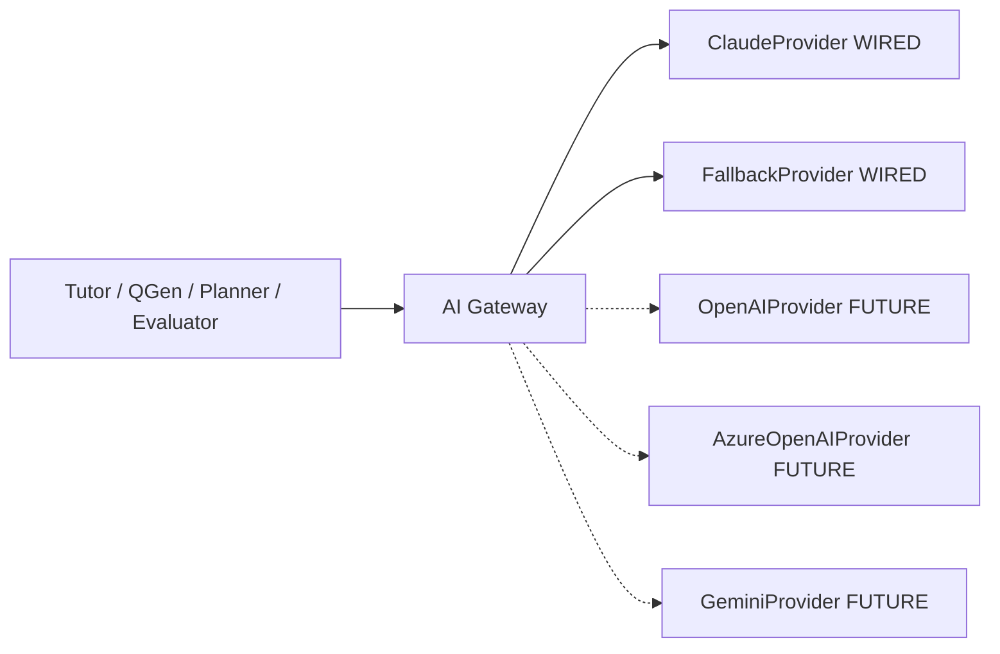

---

### CR-2 — “Knowledge graph navigation” in `.cursor` docs vs ADR-0007 deferral

| Field | Detail |
|---|---|
| **Conflict ID** | CR-2 |
| **Severity** | High |
| **ADR truth** | ADR-0007 defers **Knowledge Graph / Enterprise Domain Ontology**. Knowledge Units (ADR-0024–0028) are **not** a full enterprise KG. ADR-0028 may add limited `concept_prerequisites` edges and explicitly leaves broader graph/embeddings phases unbuilt. |
| **Conflicting artifacts** | `.cursor/00_AI_CONTEXT/project-context.md` references “Knowledge graph navigation” / exploration; other `.cursor/02_TECHNICAL/*` and glossary entries discuss Knowledge Graph as if present or near. |
| **Correct statement** | “Full Knowledge Graph navigation is deferred. TALOS uses academic hierarchy + Knowledge Units/EKU + optional prerequisite edges as they are implemented. Do not implement KG explorers or claim graph RAG unless a new ADR accepts that scope.” |
| **Remediation owner** | Chief Architect |
| **Remediation actions** | Update `.cursor` context packs; distinguish KU vs KG terminology in glossary; link ADR-0007/0028. |
| **Status** | Open — documented in Volume 1 v1.0.0 |

---

### CR-3 — Root README stale “Foundation in progress” vs roadmap SP0–SP9 done

| Field | Detail |
|---|---|
| **Conflict ID** | CR-3 |
| **Severity** | Medium-High (first file investors and new hires read) |
| **Roadmap truth** | `docs/architecture/roadmap.md` marks **SP0–SP9 all done** and states the originally scoped nine-sprint roadmap is closed; Phase 2 continues via later ADRs. |
| **Conflicting artifact** | Root `README.md` **Status** section: “Foundation (Sprint 0) in progress.” |
| **Correct statement** | “SP0–SP9 complete per `docs/architecture/roadmap.md`. Phase 2 in progress (Knowledge Units, ingestion, micro-competency, Hindi content, CI/CD — see ADR-0019+).” |
| **Remediation owner** | Engineering Manager |
| **Remediation actions** | Patch README Status; optionally list module schemas including `learning`, `ingestion`, `knowledge` if accurate to DB. |
| **Status** | Open — documented in Volume 1 v1.0.0 |

---

### Additional Watch Items (not full conflicts yet)

| ID | Topic | Guidance |
|---|---|---|
| W1 | pgvector extension presence vs embeddings | Do not claim RAG; activation and embedding columns are future work per ADR-0024/0028 |
| W2 | CQRS language in performance essays | CQRS is **not implemented**; modular monolith request/response remains |
| W3 | Microservices language in observability drafts | ADR-0001 forbids treating the system as microservices |
| W4 | Auth.js mentions in old BRD | ADR-0003 superseded with custom JWT |
| W5 | Subscriptions | ADR-0018 is one-time Premium only |

### Conflict Register Advantages / Tradeoffs / Future Enhancements

**Advantages.** Converts tribal knowledge into tracked work.  
**Tradeoffs.** Requires README/cursor PR follow-through after this document ships.  
**Future Enhancements.** Automate conflict detection; close rows with PR links in Revision History.

### References

- `README.md`
- `.cursor/00_AI_CONTEXT/project-context.md`
- `docs/decisions/ADR-0004-ai-gateway.md`
- `docs/decisions/ADR-0007-mvp-scope-cut.md`
- `docs/architecture/roadmap.md`

---

# References (Part A)

### Normative Architecture Decision Records

1. `docs/decisions/ADR-0001-modular-monolith.md`
2. `docs/decisions/ADR-0002-tech-stack.md`
3. `docs/decisions/ADR-0003-auth-strategy.md`
4. `docs/decisions/ADR-0004-ai-gateway.md`
5. `docs/decisions/ADR-0005-content-licensing.md`
6. `docs/decisions/ADR-0006-commerce-hosting.md`
7. `docs/decisions/ADR-0007-mvp-scope-cut.md`
8. `docs/decisions/ADR-0008-single-frontend-app.md`
9. `docs/decisions/ADR-0009-ecaep-content-model.md`
10. `docs/decisions/ADR-0010-naming.md`
11. `docs/decisions/ADR-0011-identity-schema-scope.md`
12. `docs/decisions/ADR-0012-academic-schema-scope.md`
13. `docs/decisions/ADR-0013-assessment-engine-scope.md`
14. `docs/decisions/ADR-0014-ai-gateway-implementation.md`
15. `docs/decisions/ADR-0015-learning-mastery-scope.md`
16. `docs/decisions/ADR-0016-recommendation-revision-scope.md`
17. `docs/decisions/ADR-0017-analytics-scope.md`
18. `docs/decisions/ADR-0018-sprint9-commerce-admin-hardening-deploy.md`
19. `docs/decisions/ADR-0019-multi-language-content.md`
20. `docs/decisions/ADR-0020-integration-test-infrastructure.md`
21. `docs/decisions/ADR-0021-micro-competency-layer.md`
22. `docs/decisions/ADR-0022-ingestion-pipeline-phase0.md`
23. `docs/decisions/ADR-0023-extract-once-generate-many.md`
24. `docs/decisions/ADR-0024-knowledge-unit-foundation.md`
25. `docs/decisions/ADR-0025-knowledge-unit-cutover.md`
26. `docs/decisions/ADR-0026-visual-asset-extraction.md`
27. `docs/decisions/ADR-0027-language-processing-service.md`
28. `docs/decisions/ADR-0028-educational-knowledge-unit.md`
29. `docs/decisions/ADR-0029-cicd-pipeline.md`

### Architecture & Operations

30. `docs/architecture/roadmap.md`
31. `docs/architecture/ecaep.md`
32. `docs/deploy/RUNBOOK.md`
33. `docs/deploy/CI_CD.md`
34. `docs/deploy/ROLLBACK.md`
35. `docs/deploy/VERIFICATION_CHECKLIST.md`
36. `docs/deploy/TEST_REPORT.md`
37. `CLAUDE.md`
38. `README.md` *(status currently stale — see CR-3)*

### Document Control

39. This file: `docs/blueprint/volume-01/01-front-matter-and-strategy.md`
40. Planned companions: Volume 1 Parts B–E (chapters 13–40) and Volumes 2–6 as described in Chapter 6

---

*End of Volume 1 Part A — Front Matter & Strategy (Chapters 1–12).*  
*Classification: Internal / Confidential — TALOS-VOL-01 v1.0.0 — 2026-08-07 — Trinetra*


\newpage

# Volume 1 — Part B: Market, Industry, Competitors, SWOT, Business Model & Stakeholders

**Product:** Trinetra AI Learning OS (TALOS)  
**First vertical:** NEET-UG (India) / AI NEET Exam App  
**Document class:** Enterprise blueprint — Market & Business (complete, not a summary)  
**Audience:** founders, product leadership, investors, content/ops leads, engineering leads  
**Related ADRs:** ADR-0004, ADR-0005, ADR-0006, ADR-0007, ADR-0009, ADR-0010, ADR-0014–0018, ADR-0022–0028  
**Status labels:**
- **Shipped** — implemented (SP0–SP9 and/or Phase 2 ingestion/KU as noted)
- **Enterprise Assumption** — market sizing, pricing benchmarks, share estimates, or competitive metrics not evidenced in this repository
- **Backlog / Deferred** — cut by ADR-0007 or not yet productized

> **Accuracy notice.** This document does **not** claim OpenAI, Azure OpenAI, or vector RAG as currently implemented. TALOS AI is Claude behind an `AIProvider` gateway (ADR-0004 / ADR-0014). Ingestion dedup uses Postgres `pg_trgm`, not a vector store (ADR-0022). Content is NCERT-aligned and originally authored only (ADR-0005). Commerce is a one-time Razorpay Premium purchase rail with no subscription product yet (ADR-0018). No feature paywall was enforced in SP9—boundaries remain a business decision.

---

# 13. Market Analysis

## 13.0 Chapter framing

### Purpose
Establish a decision-grade view of the Indian NEET-UG preparation market so TALOS can prioritize product bets, pricing experiments, channel investments, and content velocity without confusing **platform capability** with **coaching franchise scale**.

### Background
NEET-UG is India’s single largest undergraduate medical entrance pathway. The prep market mixes offline coaching empires, hybrid digital arms of the same brands, YouTube-native and app-native challengers, and AI-first tutors that arrived after generative models became consumer-visible. TALOS enters as an **AI-first learning OS** with NEET as the first vertical—not as a digitized city coaching brand.

### Problem
Most edtech narratives either inflate TAM with “all Indian K–12 online learning,” or under-specify that NEET demand is concentrated, seasonal, and content-IP-constrained. Without disciplined segmentation, teams overbuild live-class features or scrape competitor banks—both incompatible with TALOS frozen decisions.

### Solution
Segment by buyer, intensity, delivery mode, and content pedigree; size TAM/SAM/SOM only with labeled assumptions; map channels that move NEET students; keep NTA context informational rather than as a partnership claim.

### Advantages
- Aligns GTM with shipped capabilities: practice, mocks, Tutor, Planner, Evaluator, mastery, revision, analytics, Razorpay Premium rail, admin, ingestion/KU Phase 2.
- Protects against illegal content shortcuts (ADR-0005).
- Forces honesty about scale disadvantages vs Allen/Aakash/PW while clarifying AI + editorial workflow as the wedge.

### Tradeoffs
- NCERT-aligned / original-only content grows slower than banks that reuse coaching PDFs.
- One-time Premium (today) is simpler than subscriptions but weaker for LTV modeling until subscriptions are productized.
- Market numbers below are not from a purchased research report inside this repo.

### Implementation
Product and content OKRs should reference 13.2–13.6 when choosing syllabus coverage order, freemium boundaries, and YouTube vs paid spend. Finance should treat 13.4–13.5 as planning inputs requiring refresh before fundraising decks.

### Future
Refresh annually after each NEET cycle; add verticals (JEE, boards) only after NEET retention and content coverage prove the OS thesis.

### References
ADR-0005, ADR-0006, ADR-0007, ADR-0010, ADR-0018; `docs/architecture/roadmap.md`; NTA public notifications (external; informational).

---

## 13.1 NEET-UG market structure (India)

### Purpose
Describe how value, attention, and money flow around NEET-UG preparation.

### Background
NEET-UG is conducted under the National Testing Agency (NTA) framework for admission to MBBS/BDS and related undergraduate medical seats. The **exam** is a public instrument; the **prep industry** is a private ecosystem of coaching, books, apps, YouTube channels, test series, and AI tutors.

### Problem
Treating “NEET market” as one homogeneous pool leads to false comparisons—e.g., matching Allen’s classroom footprint with TALOS’s modular monolith web app.

### Solution — structural layers

| Layer | What it is | Who captures value | TALOS relevance |
|---|---|---|---|
| **Seat / exam layer** | NTA exam, counselling, seat matrix | Government / institutions | Environment only—not a customer |
| **Offline coaching layer** | Multi-year classroom programs, hostels, city brands | Allen, Aakash, local academies | Competitor for time and trust; not our delivery model |
| **Hybrid / digital brand layer** | Recorded + live + app + test series under big brands | Allen Digital, Aakash Digital, PW, Unacademy | Direct competitive set for digital spend |
| **Long-form free attention layer** | YouTube lectures, Telegram notes, Instagram reels | Creators + platforms | Primary acquisition channel assumption |
| **Assessment / analytics layer** | Mocks, rank predictors, adaptive practice | Embibe-class products, coaching test series | Core shipped TALOS surface |
| **AI tutor layer** | Chat explanations, doubt solving, plan generation | Newer AI apps + features inside big apps | TALOS primary differentiation bet |
| **Content IP layer** | Question banks, notes, video IP | Coaching houses, publishers, NCERT | ADR-0005 constraint + differentiator |

### Demand cohorts (qualitative)

1. **Class 11 starters** — 2-year runway; high lifetime content need; sensitive to “complete syllabus” claims.  
2. **Class 12 concurrent** — boards + NEET dual load; needs planning and efficient practice.  
3. **Droppers / repeaters** — high intensity, mock-heavy, rank-obsessed; pay for perceived edge.  
4. **Late switchers** — short runway; need triage (weak concepts) more than full video libraries.  
5. **Parent-funded buyers** — economic decision often made by parents; trust, safety, progress visibility matter.  
6. **Teacher / SME / content workers** — not end consumers, but supply-side stakeholders for ECAEP.

### Geographic and socio-economic structure (**Enterprise Assumption**)
- Demand density is highest in traditional coaching belts and metro/tier-1 cities, but smartphone-first learning has expanded tier-2/3 participation.  
- Price sensitivity rises sharply outside premium classroom packages; digital products compete from free YouTube to high five-figure / six-figure classroom SKUs.  
- English + Hindi medium dynamics matter for national scale; TALOS multi-language content remains backlog per ADR-0007 / ADR-0019 trajectory—not claimed as fully shipped student UX here.

### Household decision reality
NEET prep is often a **household project**: student labor, parent capital, sibling precedent, and coaching brand folklore. Digital tools enter as supplements first, replacements second. Multi-homing is normal—a student may watch PW, sit a local test series, and still need a mastery OS.

### Market structure implications for TALOS
- We are **not** competing on hostel + classroom + brand city presence.  
- We **are** competing on practice fidelity, mock realism, AI help that cites publishable content, mastery/revision loops, and clean editorial provenance.  
- Big coaching digitals win on content volume and brand; AI-native players win on UX novelty but often weaken on syllabus depth and exam-faithful assessment. TALOS aims at the intersection: **exam-faithful assessment OS + AI agents + NCERT-safe content factory**.

### Advantages
Clear competitor taxonomy (Chapter 15) and honest positioning vs franchise scale.

### Tradeoffs
Harder to sell “everything like Allen” in one sentence; must sell “learning OS for NEET” instead.

### Implementation
Keep academic hierarchy exam→subject→chapter→topic→concept (shipped SP2) as the spine of GTM messaging—students already think in chapters.

### Future
If boards or JEE verticals open, reuse the OS; do not redefine NEET market structure as generic K–12.

### References
NTA exam pattern public materials; ADR-0012; roadmap SP2–SP4.

---

## 13.2 Demand drivers

### Purpose
List forces that increase or decrease willingness to pay for NEET digital prep.

### Background
NEET prep demand is not purely “love of biology.” It is a high-stakes tournament market: scarce medical seats, social prestige, parent investment cycles, and fear of wasting a year.

### Problem
Feature roadmaps that ignore demand drivers ship nice AI demos that students abandon during mock season.

### Solution — driver catalog

| Driver | Direction | Mechanism | Product implication (TALOS) |
|---|---|---|---|
| Seat scarcity and career prestige | Up | Tournament pressure | Mock scoring fidelity (+4/−1), analytics honesty |
| Rising Class 11/12 digitization | Up digital share | Smartphone + cheap data | Web-first / PWA path (native apps deferred) |
| Coaching fee inflation offline | Up digital substitution | Parents seek cheaper alternatives | Clear freemium→Premium story |
| YouTube as default tutor | Up acquisition, down WTP for video | Free lectures normalize “learning free” | Monetize practice/AI/plans more than video libraries |
| Exam pattern stability (MCQ, PCB) | Up product reusability | Content compounds year to year | Invest in ECAEP + KU pipeline |
| Pattern / syllabus tweaks | Up content rewrite cost | Chapters added/removed | Versioned content + KU gates |
| AI expectation after ChatGPT era | Up AI feature demand | Students expect doubt chat | Tutor/Planner shipped; cite published content only |
| Trust crises in edtech brands | Up scrutiny | Refunds, brand failures | Conservative commerce (no fake payments), clear licensing |
| Parent anxiety / progress visibility | Up dashboard demand | “Is my child studying?” | Mastery + revision widgets shipped; parent portal deferred |
| Mentorship / peer culture | Up retention offline | Batches, hostels | Community not MVP; do not fake it |

### Seasonal demand shape (**Enterprise Assumption**)
- Interest and mock consumption rise through the academic year and spike pre-exam.  
- Post-result months shift to counselling content and next-cohort acquisition.  
- Droppers create a secondary peak after results.

### Prioritization heuristic
Score initiatives as `(DemandDriverFit × DifferentiatorFit × Feasibility) / EthicsRisk`. Under that rule: NCERT KU ingestion and mock polish score high; unlimited Tutor without caps scores poorly; scrape rival PDFs scores zero (forbidden); live class MVP and Digital Twin defer per ADR-0007.

### Advantages
Explains why assessment + mastery + revision are not optional “nice analytics.”

### Tradeoffs
Seasonality stresses infra and LLM cost simultaneously if Premium includes unbounded Tutor.

### Implementation
Capacity planning for Coolify/Hetzner and Anthropic token budgets should assume pre-exam spikes (**Enterprise Assumption** on magnitude).

### Future
Add driver tracking (search trends, app installs) once growth analytics mature beyond admin analytics.

### References
ADR-0013; ADR-0015; ADR-0016; ADR-0017.

---

## 13.3 Digital adoption curves

### Purpose
Describe how NEET learners move from offline-only → hybrid → digital-primary → AI-assisted.

### Background
Indian exam prep digitized in waves: recorded video (2015–2019), COVID acceleration (2020–2021), hybrid normalization (2022–2024), generative AI overlays (2023+).

### Problem
Assuming the entire market is “AI-ready” overstates near-term conversion; assuming nobody will pay for AI understates the wedge for late switchers and droppers.

### Solution — adoption stages

```text
Stage A  Offline classroom primary
    → Stage B  Classroom + YouTube + PDFs
    → Stage C  App/test-series primary, occasional classroom
    → Stage D  Adaptive practice + analytics primary
    → Stage E  AI tutor + planner inside daily loop
```

| Stage | Student behavior | What they pay for | TALOS fit |
|---|---|---|---|
| A | Physical batch | Fees, materials | Weak direct; brand education needed |
| B | Free video + local tuition | Selective test series | Strong acquisition via free practice |
| C | App daily | Subscription / one-time packs | Core SAM |
| D | Weak-area drills | Premium analytics / mocks | Shipped mastery/revision/mocks |
| E | Chat + plan + evaluate loop | AI-inclusive Premium | Shipped four agents |

### Adoption frictions
- **Trust:** “Will AI hallucinate NEET facts?” → Tutor must ground in published CMS content; Evaluator gates AI-authored drafts.  
- **Habit:** Students live in YouTube/WhatsApp → deep links and fast practice start matter more than portal complexity.  
- **Device:** Low-end Android browsers → Next.js web performance discipline.  
- **Language:** Hindi-first users may bounce from English-only UX (**Enterprise Assumption** on bounce magnitude; multi-language backlog).

### Onboarding implications by mental model

| Incoming mental model | First promise | First action | Avoid |
|---|---|---|---|
| YouTube learner | “Turn watching into scored practice” | Concept practice | Long AI essay |
| ChatGPT curious | “Tutor grounded in published NEET notes” | Ask Tutor on a studied concept | Unbounded free chat |
| Dropper | “Find weak concepts; schedule revision” | Mock or weak-concept drill | Class 11 tourist tour |
| Parent-created account | “Progress you can verify” | Mastery overview | Hype rank predictor |

### Advantages
Prevents over-building live class infrastructure for an AI-OS thesis.

### Tradeoffs
Slower brand recognition than YouTube teaching celebrities.

### Implementation
Ship “Practice now” from recommendations (SP7 flow) as the habit loop; measure activation as first scored attempt, not first registration.

### Future
PWA install prompts; later native apps only if web retention plateaus (ADR-0007).

### References
ADR-0007, ADR-0008, roadmap SP4–SP7.

---

## 13.4 TAM / SAM / SOM (assumptions labeled)

### Purpose
Provide planning ranges for strategy discussions—not audited market research.

### Background
No purchased TAM model lives in this repository. Figures below are **Enterprise Assumptions** for internal planning and must be labeled as such in any external deck.

### Problem
Unlabeled TAM figures become fake precision in investor conversations.

### Solution — definitional funnel

| Tier | Definition (TALOS-specific) | Assumption notes |
|---|---|---|
| **TAM** | Annual spend on NEET-UG preparation in India across offline + digital + books + test series | Entire prep economy, not “edtech only” |
| **SAM** | Digital / hybrid digital spend addressable by a web/app AI-practice platform (excludes pure hostel+classroom SKUs student will not replace) | Includes PW/Unacademy/Allen Digital/Aakash Digital-like budgets |
| **SOM** | Realistic 3–5 year capture for TALOS given NCERT-original content constraint, web-first delivery, India hosting, one vertical | Function of content coverage × retention × Premium conversion |

### Illustrative planning model (**Enterprise Assumption** — not repo fact)

> The following numbers are **illustrative planning assumptions** for strategy workshops. They are **not** measured in TALOS telemetry and **not** cited from an in-repo research file. Replace before fundraising.

| Metric | Low case | Base case | High case | Unit |
|---|---|---|---|---|
| NEET-interested learner universe (annual, multi-year funnel) | 2.5M | 3.5M | 5.0M | learners |
| Avg annual prep spend (blended offline+digital) | ₹25,000 | ₹45,000 | ₹80,000 | INR / learner / year |
| Implied TAM (learners × spend) | ₹62,500 Cr | ₹157,500 Cr | ₹400,000 Cr | INR / year |
| Digital-addressable share of spend | 15% | 25% | 40% | % |
| Implied SAM | ₹9,375 Cr | ₹39,375 Cr | ₹160,000 Cr | INR / year |
| TALOS 5-year SOM share of SAM | 0.05% | 0.20% | 0.50% | % |
| Implied SOM | ₹4.7 Cr | ₹78.8 Cr | ₹800 Cr | INR / year |

**Interpretation:** Use **base case** for product planning; never present high case without content-coverage proof. Offline classroom fees inflate TAM; TALOS should not claim it will absorb hostel economics.

### Alternate bottom-up SOM sketch (**Enterprise Assumption**)

| Funnel step | Base assumption | Notes |
|---|---|---|
| Year-3 registered users | 150,000 | Web + SEO + YouTube |
| MAU / registered | 35% | Seasonal |
| Premium conversion of MAU | 8% | One-time Premium today |
| Avg Premium price | ₹2,999 | Placeholder until priced |
| Year-3 Premium buyers | ~4,200 | 150k × 35% × 8% |
| Year-3 Premium revenue | ~₹1.26 Cr | Before GST/fees |
| Plus future subscriptions / packs | upside | Not shipped as product |

### Assumptions governance
1. Any external TAM/SAM/SOM figure must carry **Enterprise Assumption** or cite a dated research source outside this repo.  
2. SOM updates require coverage % and Premium conversion inputs.  
3. High-case TAM forbidden in student-facing marketing.  
4. Finance owns the assumptions register; Product owns funnel definitions.

### Advantages
Forces conversation about content coverage as the real SOM throttle (ADR-0005 consequence).

### Tradeoffs
Bottom-up and top-down will disagree; that disagreement is useful.

### Implementation
Finance maintains an assumptions register; engineering exposes funnel events when growth analytics mature.

### Future
Recompute SOM after: (1) Premium paywall boundaries decided, (2) syllabus coverage %, (3) real Razorpay conversion data.

### References
ADR-0005; ADR-0018; Section 17.4.

---

## 13.5 Pricing landscape assumptions

### Purpose
Locate TALOS Premium relative to market offers—without inventing competitors’ confidential ARPU.

### Background
NEET digital pricing spans free YouTube, low-rupee short packs, mid four-figure annual app subscriptions, and very high classroom programs (**Enterprise Assumption** ranges for orientation).

### Problem
Shipping Razorpay without a pricing thesis risks either (a) Premium priced like a toy or (b) priced like Allen without Allen’s content depth.

### Solution — landscape bands (**Enterprise Assumption**)

| Band | Typical offer | Price band (INR, indicative) | What buyer expects |
|---|---|---|---|
| Free attention | YouTube + PDFs | ₹0 | Lectures, motivation |
| Lite digital | Practice app freemium | ₹0–₹1,499 | Limited mocks / locked analytics |
| Mid digital | Full year app / test series | ₹3,000–₹15,000 | Coverage + mocks + doubt |
| Premium digital hybrid | Live + recorded brand programs | ₹15,000–₹60,000 | Teachers + schedule + community |
| Offline flagship | Classroom multi-year | ₹80,000–₹2,50,000+ | Brand, peers, discipline |

### TALOS pricing posture (product facts + assumptions)
- **Shipped:** one-time Razorpay Premium purchase rail; premium status = existence of PAID order (ADR-0018).  
- **Shipped gap:** no feature paywall enforced in SP9—boundaries are a business decision still to finalize.  
- **Assumption:** initial Premium targets **mid digital band** value narrative (AI + mocks + mastery) at a **lite-to-mid** price to learn willingness to pay.  
- **Not shipped:** subscriptions, dunning, plan upgrades (explicitly out of ADR-0018).

### Pricing hypotheses (**Enterprise Assumption**)

| SKU hypothesis | Price band INR | Positioning | Dependency |
|---|---|---|---|
| Premium one-time (MVP) | 1,999–4,999 | Mid-lite digital | Paywall definition |
| Premium Annual | 2,999–7,999 / year | Standard digital | Subscription engineering |
| Premium Monthly | 299–799 / month | Low commitment | Dunning/churn ops |
| AI Boost pack | 199–999 | Meter refill | Token metering product |
| Mock Pack | 499–1,999 | Dropper seasonal | Content depth |

### Advantages
Honest commerce rail (no fake payment success) builds trust before aggressive monetization.

### Tradeoffs
One-time purchase complicates recurring revenue storytelling until subscription phase.

### Implementation
When paywalling: prefer gating incremental AI tokens / advanced mocks / export—not gating basic practice that feeds mastery data quality.

### Future
ADR-0006 already contemplates Razorpay subscriptions when productized; model in Chapter 17.

### References
ADR-0006, ADR-0018; Section 17.2–17.5.

---

## 13.6 Channel landscape (YouTube, coaching, app stores, schools)

### Purpose
Identify where NEET students actually discover tools.

### Background
Acquisition is attention-arbitrage: coaching brands buy trust with decades of results marketing; YouTube creators buy trust with pedagogy personality; app stores buy distribution with ranking; schools are slower B2B motions.

### Problem
Building only product surfaces without channel strategy yields an excellent empty classroom.

### Solution — channel matrix

| Channel | Role | Cost shape | Fit for TALOS today | Risk |
|---|---|---|---|---|
| **YouTube** | Top-of-funnel teaching + SEO adjacent | Creator time / ads | High — explain concepts, CTA to practice on TALOS | Audience expects free continuation |
| **SEO / content site** | Chapter pages, PYQ explainers | Content labor | High — aligns with NCERT-original notes | Slow burn |
| **Coaching partnerships** | Batch distribution | BD + revenue share | Medium later — not MVP multi-tenant | IP and brand conflicts |
| **App stores** | Install distribution | ASO + UA | Low near-term — web-first (ADR-0007) | Native scope creep |
| **Schools / junior colleges** | B2B seats | Sales cycle | Low for MVP | Procurement; multi-tenancy deferred |
| **Telegram / WhatsApp** | Viral notes and doubt groups | Community ops | Medium — careful IP hygiene | Copyrighted PDF sharing culture |
| **Parent influencers** | Trust transfer | Campaigns | Medium | Overpromise backlash |
| **Performance ads** | Retargeting | CAC in INR | Medium once conversion measured | Premature before coverage |

### Channel economics sketches (**Enterprise Assumption**)

| Channel | Leading indicator | Lagging indicator | Budget rule |
|---|---|---|---|
| YouTube | CTR to practice deep link | Day-7 activated users | Pay for activated, not views |
| SEO | Indexed chapter pages | Organic signups with attempt | Invest continuously in notes |
| Paid UA | CPC | Premium CAC | Cap until conversion known |
| Coaching BD | Meetings | Seat pilots | After tenancy design only |
| Telegram | Group joins | Often IP-risk growth | Avoid piracy-dependent growth |

### Channel principles for ADR-0005
- Never grow by circulating Allen/Aakash/PW PDFs.  
- YouTube scripts should teach from NCERT-aligned explanations and TALOS-authored examples.  
- Community mods must remove copyrighted coaching material dumps.

### Advantages
Channels reinforce content legality story—rare among growth-hacked edtech.

### Tradeoffs
Slower virality than “full chapter PDF” Telegram culture.

### Implementation
Pair every YouTube video with a deep link into concept practice on TALOS (assessment generation already supports concept-scoped practice).

### Future
School pilots only after `organizations` multi-tenancy is intentionally designed (reserved table, not wired—ADR-0007).

### References
ADR-0005, ADR-0007, ADR-0008.

---

## 13.7 Regulatory / exam authority context (NTA) — informational

### Purpose
Clarify what NTA is to TALOS: **environment**, not customer, partner, or endorser.

### Background
NTA conducts NEET-UG and publishes information bulletins, syllabi references, and results processes. Coaching and edtech firms orbit that calendar.

### Problem
Product marketing sometimes implies official affiliation. That is legally and ethically dangerous.

### Solution — informational boundaries

| Topic | Guidance for TALOS |
|---|---|
| Syllabus alignment | Align academic hierarchy and content to publicly described NEET/NCERT-relevant scope |
| Exam pattern | Practice/mocks use publicly known marking ideas (e.g., +4/−1 style scoring as implemented in assessment) |
| Endorsement | **Never** claim NTA/MoE endorsement |
| Personal data | Treat student data under applicable Indian IT / DPDP-era expectations as product matures |
| Accessibility of PYQs | Use previous-year questions only where legally permissible and reviewed (ADR-0005) |
| Fairness / AI | AI generations are drafts under ECAEP—not auto-published answer keys pretending to be official |

> **Informational only.** This section is not legal advice. NTA policies and Indian edtech regulations evolve. Engage counsel for public claims, trademarks, and PYQ redistribution.

### Advantages
Keeps trust with parents and payment reviewers.

### Tradeoffs
Cannot market “official NEET partner” shortcuts.

### Implementation
UI copy review checklist: no crest misuse, no “NTA approved” badges, no fake rank predictors presented as official ranks.

### Future
If institutional partnerships emerge, treat them as separate contracts—not as NTA adjacency.

### References
ADR-0005; public NTA bulletins (external).

---

## 13.8 Mermaid market segmentation diagram

### Purpose
Visualize buyer segments vs product surfaces.

### Background
Segmentation must be memorable for GTM and content ops weekly planning.

### Problem
Slideware segmentation without a durable diagram drifts.

### Solution

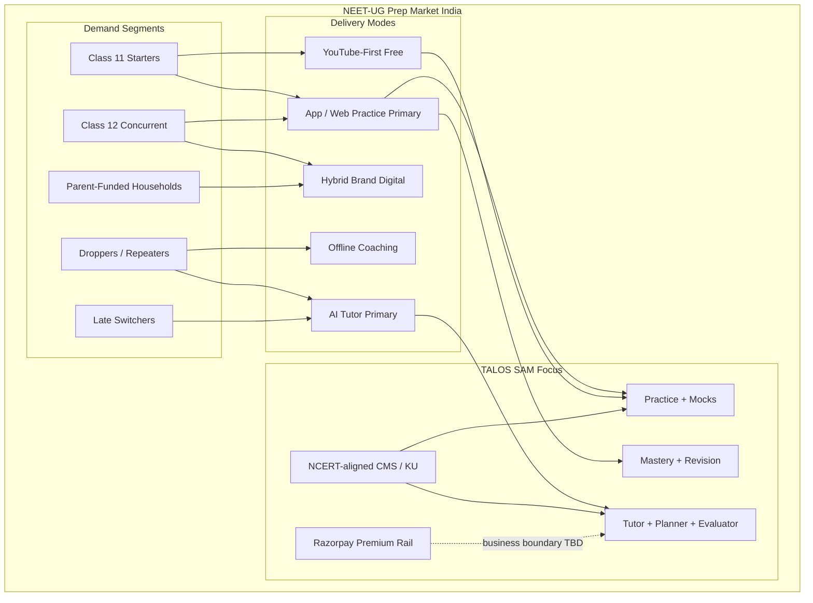

### Advantages
Makes explicit that offline coaching is adjacent, not the primary SAM.

### Tradeoffs
Simplifies multi-homing (students use many modes at once).

### Implementation
Use in onboarding for new PMs/content leads.

### Future
Add JEE/boards nodes only when vertical expansion is real.

### References
Sections 13.1–13.6; Chapter 15 positioning map.

---
# 14. Industry Analysis

## 14.0 Chapter framing

### Purpose
Analyze industry attractiveness and disruption using strategy tools adapted to NEET edtech—not generic SaaS.

### Background
NEET prep is a **content + pedagogy + assessment + brand trust** industry undergoing **AI cost-structure shock**.

### Problem
Classic Porter analysis that ignores content IP and exam calendar produces wrong “software margins” conclusions.

### Solution
Adapt Five Forces, map the value chain, name AI disruption vectors honestly, and list industry risks including model cost inflation and IP enforcement.

### Advantages
Clarifies why content licensing is strategy, not only legal.

### Tradeoffs
High substitute pressure caps early pricing power.

### Implementation
Quarterly re-score forces after NEET results and after major competitor launches.

### Future
If multi-vertical, re-run forces per exam vertical.

### References
ADR-0004, ADR-0005, ADR-0014; Chapters 13 and 15.

---

## 14.1 Porter's Five Forces adapted to edtech NEET

### Purpose
Estimate structural profit pressure on a digital NEET OS.

### Background
Porter’s forces must be reinterpreted: “suppliers” include LLM vendors and SMEs; “buyers” are students/parents with high willingness to multi-home; “substitutes” include free YouTube.

### Problem
Underestimating rivalry from brand coaching digitals leads to naive AI-only positioning.

### Solution

| Force | Intensity (**Enterprise Assumption**) | NEET-edtech specifics | TALOS implication |
|---|---|---|---|
| **Rivalry among existing competitors** | High | Allen Digital, Aakash Digital, PW, Unacademy, Vedantu, Doubtnut, Embibe, AI upstarts | Differentiate on provenance + OS loop, not video hours |
| **Threat of new entrants** | Medium–High | AI wrappers are easy to launch; trust and content depth are hard | ECAEP + KU + mastery data as moat materials |
| **Bargaining power of buyers** | High | Low switching costs across apps; free substitutes | Activation and habit loops; fair Premium |
| **Bargaining power of suppliers** | Medium–High | Anthropic (LLM), SMEs/authors, cloud/VPS, Razorpay, NCERT as normative syllabus source | Gateway abstraction; original content payroll; Hetzner cost control |
| **Threat of substitutes** | High | YouTube, Telegram PDFs, peer notes, offline tuition | Be the system of record for practice/mastery |

### Detailed force notes

**Rivalry:** Big brands compete on teacher celebrity, result ads, and massive banks. AI startups compete on chat UX. TALOS rivalry strategy is **not** celebrity acquisition in v1; it is **measurable mastery + clean content factory**.

**New entrants:** A weekend GPT wrapper can demo doubt-solving. It cannot legally ingest Allen sheets or instantly build ECAEP audit trails. Raise barriers via workflow + data + trust.

**Buyers:** Parents compare “result %” marketing. Until TALOS has outcomes data, sell **transparent practice analytics** and content honesty rather than miracle ranks.

**Suppliers:** LLM price/token changes hit AI-heavy UX. ADR-0004 cost tracking is a strategic instrument, not only observability. SME labor is the binding constraint under ADR-0005.

**LLM supplier power levers:** model quality gaps, rate limits, price per token, ToS constraints, outage risk. Mitigation: AI Gateway abstraction; cost logs; quotas; second provider only when wired—not marketed early.

**SME supplier power levers:** scarce NEET-skilled writers who will work under original-content rules; switching to coaching jobs; burnout from review queues. Mitigation: tooling (KU, QG assist), fair pay, WIP limits, public pride in provenance.

**Substitutes:** Free content wins attention; paid products must win **commitment devices** (plans, revision due dates, mock discipline).

### Advantages
Clarifies why content licensing is strategy, not only legal.

### Tradeoffs
High substitute pressure caps pricing power early.

### Implementation
Quarterly supplier review in ops meeting; quarterly force re-score after NEET results.

### Future
If licensing a publisher bank, that licensor becomes a new high-power supplier—ADR required.

### References
ADR-0004, ADR-0005, ADR-0014.

---

## 14.2 Value chain of exam prep

### Purpose
Show where margin and differentiation accrue.

### Background
Exam prep value chain differs from pure software: pedagogy and item quality dominate.

### Problem
Engineering-centric orgs optimize infra while leaving the item bank thin—fatal in NEET.

### Solution — chain stages

1. **Syllabus interpretation** — map exam → subjects → chapters → topics → concepts (TALOS shipped academic engine).  
2. **Source knowledge acquisition** — NCERT + original authoring + lawful PYQ (ADR-0005); Phase 2 ingestion from NCERT PDFs.  
3. **Knowledge structuring** — Knowledge Units, gates, structured facts (Phase 2 ADRs).  
4. **Asset generation** — notes, MCQs, flashcards, formula sheets (human + AI QG drafts).  
5. **Editorial control** — ECAEP submit → AI check → review → publish.  
6. **Assembly into assessments** — practice and mocks (SP4).  
7. **Delivery and tutoring** — attempts, Tutor, Planner.  
8. **Measurement** — scoring, mastery, revision, analytics.  
9. **Monetization** — Razorpay Premium.  
10. **Trust and outcomes marketing** — largely future; depends on longitudinal data.

| Stage | Cost driver | Differentiation potential | TALOS status |
|---|---|---|---|
| Syllabus map | SME + eng | Medium | Shipped |
| Source acquisition | Labor / licensing | High if lawful | ADR-0005 + ingestion Phase 2 |
| Structuring | Eng + SME | High | KU foundation / cutover path |
| Asset generation | AI tokens + SME | High | QG + workers; human review |
| Editorial | Reviewer labor | Very high | ECAEP shipped |
| Assessment assembly | Eng + content tags | High | Practice/mocks shipped |
| Tutoring / planning | LLM + grounding | High | Tutor/Planner shipped |
| Measurement | Eng | High | Mastery/revision/analytics |
| Monetization | Payment ops | Medium | One-time Premium rail |
| Outcomes brand | Time | Very high | Not yet a claim |

### Control points and SLAs (**Enterprise Assumption** on targets)

| Stage | Control point | Suggested focus | Metric |
|---|---|---|---|
| Ingestion | Job success / checksum skip | Pilot turnaround | Jobs completed |
| KU structuring | Gate pass rate | Track fail reasons weekly | % gate pass |
| Authoring | Draft quality checklist | Style guide adherence | Rework rate |
| AI check | Evaluator completion | Minutes not days | Time in AI_CHECKED |
| Human review | Queue WIP limit | Age of IN_REVIEW | Queue age |
| Publish | Coverage impact | Each publish maps to concept cell | Coverage grid delta |
| Tutoring | Grounding complaints | Review weekly | Incident count |

### Advantages
Explains investment priority: editorial throughput ≥ model demos.

### Tradeoffs
Slower top-of-funnel “10× question bank” claims.

### Implementation
Content ops KPIs: published items / week, review SLA, coverage grid completeness (SP3 coverage grid).

### Future
Extract-once-generate-many (ADR-0023) scales asset fan-out without re-extracting NCERT.

### References
`docs/architecture/ecaep.md`; ADR-0009; ADR-0022–0028.

---

## 14.3 Technology disruption (AI tutoring, generative MCQ, adaptive practice)

### Purpose
Separate real disruption from slideware.

### Background
Generative AI reduces marginal cost of **draft** explanations and **draft** MCQs. It does not remove the need for exam-faithful review.

### Problem
Competitors (and internal enthusiasts) may push auto-publish pipelines that create factual and legal risk.

### Solution — disruption vectors vs TALOS response

| Disruption | What changed | Naive response | TALOS response (actual architecture) |
|---|---|---|---|
| AI tutoring chat | Students expect instant doubt help | Unbounded chatbot | Tutor agent via Claude gateway; published-content orientation |
| Generative MCQ | Banks can expand faster | Auto-publish to students | Question Generator → ECAEP DRAFT → human review |
| Adaptive practice | Personalization expected | Black-box ML ranking | Rule-based recommendations + mastery levels (ADR-0016) |
| Study planning | Calendar automation | Generic to-do lists | Planner uses real weak concepts from attempts |
| Evaluation of content | QA bottleneck | Skip review | Evaluator agent inside editorial flow |
| Ingestion at scale | PDF → assets | Vector RAG everything | Born-digital extract, `pg_trgm` dedup; no vector RAG claimed now |
| Knowledge representation | Raw chunk brittle | Embeddings-only | Knowledge Unit structured facts path |

### Callout

> **Not currently implemented as product facts:** OpenAI/Azure OpenAI providers, embedding vector RAG retrieval stacks, SM-2 ML recommenders, Digital Twin, 12-agent orchestrator. Gateway can add providers later; that is not the same as shipped.

### Disruption counter-scenarios
| Rival move | Market perception risk | TALOS counter |
|---|---|---|
| Auto-publish AI bank | “They’re faster” | Emphasize review; quality over dump size |
| Vector RAG marketing | “They’re more advanced” | Explain KU + published grounding; add vectors only if earned |
| Celebrity teacher AI clone | “Real teacher voice” | Partner creators lawfully for acquisition; do not fake |
| Free unlimited tutor | “We’re generous” | Show sustainability; meter honestly |

### Advantages
Disruption adopted without discarding editorial truth.

### Tradeoffs
Higher unit cost per published item than unreviewed generation farms.

### Implementation
Keep `ai.ai_requests` cost logs as early warning for token inflation (ADR-0014/0017).

### Future
Second provider behind gateway if Claude price/performance warrants; pgvector only when earned (ADR-0022 escape hatch).

### References
ADR-0004, ADR-0007, ADR-0014, ADR-0022, ADR-0024.

---

## 14.4 Industry risks (regulation, content IP, model cost inflation)

### Purpose
Enumerate risks that can erase edtech margin or shut products down.

### Background
Edtech failures in India have included trust collapses, aggressive sales, and IP-gray content practices. AI adds new cost and hallucination risks.

### Problem
Teams track uptime but not IP or token burn as existential risks.

### Solution — risk register (industry-level)

| Risk | Likelihood (**Enterprise Assumption**) | Impact | Industry pattern | TALOS mitigation |
|---|---|---|---|---|
| Content copyright enforcement | Medium | Existential | Coaching PDF scrapers | ADR-0005 hard ban; original/NCERT path |
| AI hallucination in explanations | High without grounding | High reputational | Uncited chat tutors | Published-content grounding + Evaluator |
| Model cost inflation | Medium | High on AI-heavy SKUs | Token prices / usage spikes | Gateway metering; freemium AI caps later |
| Exam pattern / syllabus change | Medium | Medium–High rework | Periodic NTA updates | Versioned CMS + KU |
| Payment / consumer protection issues | Medium | High | Refund disputes | Honest Razorpay integration; no fake success |
| Data protection (DPDP-era) | Rising | High | Student minors data | Minimize data; future compliance program |
| Brand trust contagion | Medium | Medium | Sector scandals | Conservative claims; no fake ranks |
| Platform dependency (YouTube algo) | High | Medium acquisition | Algorithm shifts | SEO + product-led loops |
| Hosting single-VPS limits | Medium as scale grows | Medium | Coolify/Hetzner MVP | ADR-0006 revisit cloud when earned |
| Offline coaching price wars digital | High | Medium pricing power | Discount seasons | Differentiate OS value not video dumping |
| Pirate content culture temptation | High culturally | Existential if internalized | Telegram banks | Zero-tolerance culture + audits |

### Advantages
Risk-aware GTM avoids illegal growth hacks.

### Tradeoffs
Some viral channels are intentionally unused.

### Implementation
Add IP audit to content onboarding; add token budget alarms to ops runbooks.

### Future
Formal security/privacy program beyond SP9 headers/rate limits as user counts grow.

### References
ADR-0005, ADR-0006, ADR-0018, `docs/deploy/RUNBOOK.md`.

---

## 14.5 PlantUML industry value chain

### Purpose
Provide an engineering- and ops-readable value chain diagram.

### Background
Mermaid covers market segmentation; PlantUML captures industrial stage dependencies.

### Problem
Without a shared picture, content and AI teams optimize locally.

### Solution

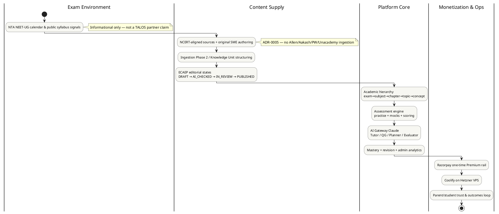

### Advantages
Connects legal constraint to revenue stage visually.

### Tradeoffs
Omits competitor chains for clarity.

### Implementation
Reuse in onboarding decks; keep ADR references in notes.

### Future
Extend with subscription billing stage when productized.

### References
Chapters 14.2–14.4; ADR-0005; ADR-0018.

---

# 15. Competitor Analysis

## 15.0 Chapter framing

### Purpose
Produce an honest, enterprise-depth competitive picture for TALOS without inventing market-share decimals or claiming features we do not ship.

### Background
The NEET digital competitive set mixes legacy coaching brands, YouTube-native giants, doubt apps, adaptive platforms, and post-LLM AI tutors. TALOS is an AI-first learning OS with NCERT-aligned / original content (ADR-0005) and a shipped modular monolith spanning identity through commerce plus Phase 2 ingestion/KU.

### Problem
Competitive decks often (a) invent share numbers, (b) equate brand awareness with product quality, or (c) imply TALOS already matches Allen’s content volume. All three destroy strategy quality.

### Solution
Taxonomize competitors, compare features on dimensions that matter to our architecture, map positioning, war-game responses, list unfair advantages and vulnerabilities, and restate why scraping competitor PDFs is forbidden.

### Advantages
Keeps GTM and content ops aligned to lawful differentiation.

### Tradeoffs
We will look “smaller” on content volume metrics for a long time—that is accepted.

### Implementation
Update this chapter after major competitor launches and after each NEET cycle.

### Future
Add quantitative share only when purchased research or first-party surveys exist.

### References
ADR-0005, ADR-0007, ADR-0010; Chapters 13–14.

---

## 15.1 Competitor taxonomy

### Purpose
Group rivals by business DNA so feature checklists are not apples-to-oranges.

### Background
A classroom franchise with an app is not the same species as a doubt-solving camera app or an AI chat wrapper.

### Problem
Treating all logos as equal “NEET apps” produces useless matrices.

### Solution — taxonomy

| Taxonomy class | Examples | Primary moat historically | Primary vulnerability | TALOS relationship |
|---|---|---|---|---|
| **A. Legacy coaching digital arms** | Allen Digital, Aakash Digital | Brand, teachers, offline funnel, proprietary sheets | Cost structure; digital UX debt; IP silo | Compete for digital wallet; do not copy content |
| **B. YouTube-native scale platforms** | Physics Wallah (PW) | Affordable brand, creator trust, massive reach | Breadth vs depth quality variance; platform complexity | Compete on practice OS + AI loop; respect IP |
| **C. Marketplace / platform coaching** | Unacademy NEET | Educator marketplace, live classes | Unit economics of live; educator churn | Different model; live classes deferred for us |
| **D. Conglomerate / ecosystem remnants** | BYJU’S / Aakash ecosystem dynamics | Distribution + capital historically | Trust & restructuring overhang (**Enterprise Assumption** on magnitude) | Trust-sensitive parents may seek cleaner alternatives |
| **E. Historical adaptive / school graph players** | Toppr (historical reference) | Adaptive narrative, school coverage | Consolidation / brand sunset lessons | Study post-mortems; do not romanticize |
| **F. Analytics / personalization specialists** | Embibe | Assessment analytics, personalization story | Content + brand distribution | Closest conceptual cousin on analytics; we ship simpler live aggregates first |
| **G. Doubt / visual solve apps** | Doubtnut | Instant doubt UX, vernacular reach | Depth of long-horizon mastery OS | Tutor overlaps; we emphasize grounded CMS + mastery |
| **H. Live tutoring brands** | Vedantu | Live pedagogy | Live cost; scheduling friction | Live not in TALOS MVP |
| **I. Newer AI tutors** | Various 2023–2026 AI NEET/JEE chat apps | Speed to demo AI | Hallucination, thin banks, unclear IP | Direct narrative competitors; beat on ECAEP + assessment fidelity |

### Competitor capsules (enterprise depth, qualitative)

#### Allen Digital
Allen’s identity is Kota-scale classroom excellence digitized. Strengths: brand recall among serious aspirants, structured modules, test series culture, parent trust in “results machinery.” Weaknesses for digital-native challengers: mobility of content UX, AI personalization narrative, and price accessibility. **Do not invent Allen’s digital MAU or share here.** TALOS posture: respect assessment seriousness; never claim classroom parity; win on always-on OS loops and lawful content.

#### Aakash Digital / BYJU’S–Aakash ecosystem remnants
Aakash carries deep NEET brand equity from long classroom heritage; digital packaging and parent-company turbulence have shaped recent perception (**Enterprise Assumption**: trust sensitivity varies by city and cohort). Strengths: syllabus completeness brand. Weaknesses: ecosystem complexity and trust recovery costs. TALOS posture: “clean, focused NEET learning OS” rather than anti-brand attacks.

#### Physics Wallah (PW)
PW rewrote affordability expectations and YouTube-first acquisition. Strengths: reach, community, aggressive digital product expansion, price disruption. Weaknesses: as product surface area grows, consistency and personalization quality become hard; proprietary content remains legally closed to us. TALOS posture: do not race PW on video library size; race on mastery instrumentation and AI agents tied to publishable items.

#### Unacademy NEET
Marketplace + live class DNA. Strengths: educator variety, live energy, platform habits. Weaknesses: live is expensive; asynchronous OS learners may churn from schedule friction. TALOS posture: asynchronous practice/AI plan first; live explicitly deferred (ADR-0007).

#### Toppr (historical)
Cautionary adaptive-history reference: adaptive narratives and broad exam coverage do not guarantee durable independent brand outcomes when capital and consolidation waves hit. TALOS lesson: ship thinner scope that works (ADR-0007) rather than ontology maximalism before students arrive.

#### Embibe
Mindshare around personalization and assessment analytics. Strengths: data-science storytelling, diagnostic framing. Weaknesses: consumer brand vs coaching giants; complexity can outrun student understanding. TALOS posture: start with honest mastery arithmetic and admin analytics; deepen adaptivity when earned.

#### Doubtnut
Strength in instant doubt resolution UX and vernacular accessibility. Weaknesses: translating doubts into longitudinal mastery and mock readiness. TALOS posture: Tutor helps, but recommendations/revision close the loop.

#### Vedantu
Live tutoring specialist energy. Strengths: human teacher presence. Weaknesses for our thesis: live does not match modular monolith MVP economics. TALOS posture: non-compete on live; compete on self-serve OS.

#### Newer AI tutors
Flood of chat wrappers. Strengths: marketing clarity (“ChatGPT for NEET”). Weaknesses: uncited answers, weak mock engines, muddy content provenance, possible IP shortcuts. TALOS posture: **structural** human review for generated MCQs; Claude-only gateway today; no vector-RAG cosplay claims.

### Extended taxonomy notes
**Multi-homing reality.** Students rarely use one product. TALOS should aim to become the **system of record for attempts and mastery**, not the only tab open.  
**Parent vs student buyers.** Classes A–D often sell to parents; G–I often delight students first. TALOS must eventually speak both languages.  
**Content pedigree as class splitter.** The deepest strategic split is not “has AI?” but “what is the legal and editorial origin of the item bank?”

### Advantages
Taxonomy prevents wrong feature races (e.g., building live classes to “beat Unacademy”).

### Tradeoffs
Fewer press-friendly “we vs them” charts with fake percentages.

### Implementation
Sales/marketing forbidden claims list: official partnerships, competitor PDF libraries, OpenAI-powered (unless/until true), guaranteed ranks.

### Future
Reclassify if a competitor genuinely open-sources or licenses content (unlikely).

### References
ADR-0005; ADR-0007; Section 15.6.

---

## 15.2 Feature comparison matrix (auth, practice, mocks, AI tutor, content pedigree, analytics, pricing model)

### Purpose
Compare what matters for an AI learning OS—not vanity feature counts.

### Background
TALOS shipped SP0–SP9 plus Phase 2 ingestion/KU work. Competitors’ exact private roadmaps are unknown; matrix uses **publicly typical capabilities** labeled where assumed.

### Problem
Binary checkmarks hide quality differences (e.g., “has AI” ≠ grounded Tutor + Evaluator in ECAEP).

### Solution

**Legend:** `S` = strong/typical, `P` = partial/uneven, `N` = weak/absent/typical gap, `T` = TALOS shipped today, `B` = TALOS backlog/deferred, `U` = unknown / do not assert.

| Dimension | TALOS | Allen Digital | Aakash Digital | PW | Unacademy NEET | Embibe | Doubtnut | Vedantu | Newer AI tutors |
|---|---|---|---|---|---|---|---|---|---|
| Auth (account, sessions) | T custom JWT cookies | S | S | S | S | S | S | S | P |
| Practice engine | T | S | S | S | S | S | P | P | P |
| Full-length mocks + exam-like scoring | T (+4/−1 style) | S | S | S | S | S | N/P | P | P |
| AI Tutor | T Claude gateway | P/S evolving | P/S evolving | P/S evolving | P | P | P (doubt) | P | S chat |
| AI Study Planner | T | P | P | P | P | P | N | P | P |
| AI Question Generator with human review gate | T via ECAEP | U | U | U | U | U | N | U | N/P often unreviewed |
| AI Evaluator in editorial flow | T | U | U | U | U | U | N | U | N |
| Content pedigree (NCERT-aligned / original commitment) | T ADR-0005 | Proprietary coaching IP | Proprietary | Proprietary | Proprietary / educator IP | Mixed/U | Mixed/U | Mixed | Often unclear |
| Mastery model | T concept stored + topic rollup | P/S | P/S | P/S | P | S narrative | N | P | P |
| Spaced revision | T fixed-interval by mastery | P | P | P | P | P/S | N | P | P |
| Student analytics depth | P (student mastery UI) + admin platform analytics T | S | S | S | S | S | P | P | P |
| Admin CMS / editorial workflow | T ECAEP | Internal | Internal | Internal | Internal | Internal | Limited | Internal | Often thin |
| Ingestion / knowledge structuring | T Phase 2 KU path | Internal tooling U | U | U | U | U | U | U | Rarely rigorous |
| Payments | T Razorpay one-time Premium rail | S | S | S | S | S | S | S | P |
| Subscription billing productized | B (future assumption) | S typical | S typical | S typical | S typical | S typical | P | S | P |
| Live classes | B deferred | S/P | S/P | S | S | P | N | S | N |
| Native mobile apps | B deferred (web-first) | S | S | S | S | S | S | S | P |
| Vector RAG claimed in TALOS | **Not implemented** | U | U | U | U | U | U | U | Often marketed |
| OpenAI/Azure OpenAI in TALOS | **Not implemented** | U | U | U | U | U | U | U | Common |

### Qualitative reading
- TALOS wins structurally on **editorial AI loop** (QG + Evaluator + ECAEP) and **explicit lawful content policy**.  
- TALOS loses today on **brand, content volume, live, native apps, marketplace teachers**.  
- “AI tutor” checkmarks among competitors are not equivalent to TALOS’s four-agent gateway with cost logs.

### Advantages
Stops engineering from building live class MVP to chase Unacademy checkmarks.

### Tradeoffs
Matrix will be attacked for lacking numeric share—by design.

### Implementation
Product reviews must cite this matrix when prioritizing Phase 2 vs vanity AI. Date-stamp revisions; treat cells as snapshot judgments.

### Future
Add columns for retention proxies once first-party data exists.

### References
Roadmap SP1–SP9; ADR-0014–0018; ADR-0022–0028.

---

## 15.3 Positioning map (content depth vs AI personalization) Mermaid

### Purpose
Show strategic space visually.

### Background
Two axes dominate buyer perception in 2026 NEET digital: **perceived content depth/brand pedigree** and **perceived AI personalization**.

### Problem
Without a map, teams oscillate between “more videos” and “more GPT.”

### Solution

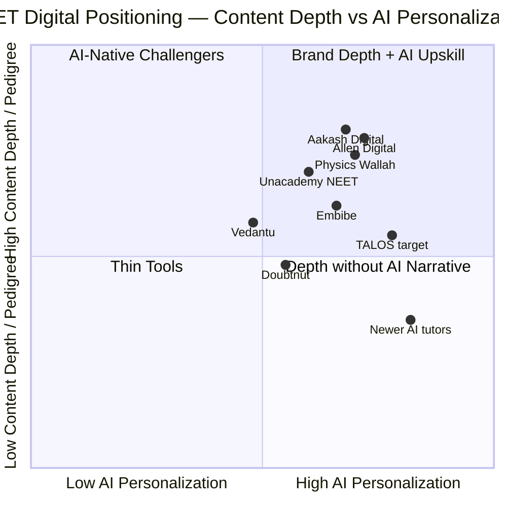

> **Enterprise Assumption:** Coordinates are illustrative strategic placements for workshop use, **not** measured market-share or audited feature scores. TALOS “target” reflects intent: raise content depth via ECAEP/KU/NCERT pipeline while keeping AI personalization high through Tutor/Planner/mastery/revision—not a claim that content depth already equals Allen.

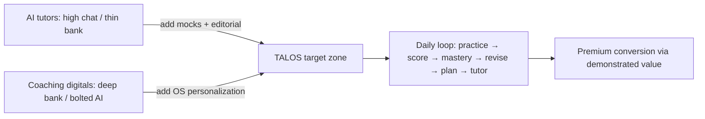

### Narrative position
- **Upper quadrants:** coaching digitals—depth and brand, AI bolted on unevenly.  
- **Right-lower:** AI tutors—chat wow, syllabus thin.  
- **TALOS vector:** move **up** (content coverage and pedigree) while staying **right** (AI OS loops), without illegal content shortcuts.

### Advantages
Explains dual investment: content factory AND agents.

### Tradeoffs
Map compresses multi-dimensional reality (price, live, vernacular).

### Implementation
Use in quarterly strategy reviews; update TALOS y-position as coverage grid fills.

### Future
Third axis later: price accessibility.

### References
Section 15.2; ADR-0005.

---

## 15.4 Competitive response scenarios

### Purpose
War-game how majors and AI upstarts may react as TALOS gains users.

### Background
Incumbents can outspend on ads and teachers; upstarts can out-hype on AI. TALOS must pre-commit to responses that preserve ADR-0005.

### Problem
Reactive roadmaps create scope thrash (live classes this month, RAG next month, native apps next).

### Solution — scenarios

| Scenario | Trigger | Likely competitor move | Bad TALOS reaction | Good TALOS reaction |
|---|---|---|---|---|
| **S1 Price dump** | PW-like discount season | Heavy discounting on annual packs | Race to ₹99 forever | Hold value metric (mastery outcomes); timed entry pricing experiments labeled as such |
| **S2 AI feature splash** | Incumbent launches “GPT tutor” | Marketing blitz | Panic-add OpenAI + vector DB | Improve grounding and Planner quality on Claude gateway; measure hallucination incidents |
| **S3 Content FUD** | Rivals question our bank size | “Incomplete syllabus” attacks | Scrape PDFs to fill gaps | Publish coverage grid honesty; accelerate KU→ECAEP throughput |
| **S4 Talent poach** | SME bidding war | Hire our reviewers | Overpay chaotically | Career path for authors/reviewers; tooling that multiplies SME output |
| **S5 Platform bundling** | YouTube/app super-bundle | Attention monopolies | Buy ineffective ads early | Product-led loops + SEO chapter pages |
| **S6 Legal gray lure** | Pirate Telegram growth | “Everyone uses those PDFs” | Ingest competitor sheets | Enforce ADR-0005; ban channels that require piracy |
| **S7 Outcomes arms race** | Rank claim ads | Unverifiable result marketing | Fake testimonials | Publish methodology for practice analytics; avoid guaranteed ranks |
| **S8 Live class pressure** | Unacademy/Vedantu narrative | “No teachers = incomplete” | Build live MVP prematurely | Double down on Planner + Tutor + mocks; partner carefully later |
| **S9 Infra scale dig** | Downtime during mock season | Public shaming | Silent fail | Load tests; Coolify playbooks; rate limits already started |
| **S10 Acquisition rumor** | Conglomerate consolidation | Fear/uncertainty | Distracted strategy | Stay modular monolith execution focused |
| **S11 Vernacular surge** | Hindi-first rival UX wins tier-2 | Localization marketing | Half-baked i18n crash project | Sequence language expansion per ADR-0019 trajectory with quality bars |
| **S12 Free AI unlimited** | Rival offers “unlimited tutor” | Loss-leader tokens | Match unlimited blindly | Metered AI in Premium design; show cost analytics internally |

### Playbooks (selected)

**S3 Content FUD:** Weekly internal metric—percent of concepts with at least N published questions; marketing only claims what coverage grid shows; AI QG increases drafts; reviewers remain bottleneck KPI.

**S2 AI splash:** Do not rewrite architecture for press. Ship prompt/version improvements, citation strictness, Evaluator tightness, cost dashboards. If a second provider is truly needed, add `AIProvider` implementation—do not market OpenAI before it exists.

**S6 Legal gray:** Zero-tolerance. Documented in hiring and vendor contracts. Existential, not aesthetic.

**S9 Infra dig:** Pre-exam load test; Redis rate limits already on auth routes; expand defensive posture to assessment submit/AI endpoints as usage grows.

### Advantages
Pre-commits culture to lawful competition.

### Tradeoffs
Some growth channels remain unused.

### Implementation
Scenario owners: Product (S2/S8/S12), Content (S3/S6/S11), Ops (S9), Founders (S1/S7/S10).

### Future
Add quantitative triggers when telemetry matures.

### References
ADR-0005; ADR-0007; Chapter 16 TOWS.

---

## 15.5 Our unfair advantages and vulnerabilities

### Purpose
State asymmetries without mythmaking.

### Background
“Unfair advantage” means something hard to copy quickly **even with money**—not a slogan.

### Problem
Teams either despair against Allen brand or hallucinate moats (“we have AI”).

### Solution

#### Advantages (grounded)

| Advantage | Why hard to copy quickly | Evidence in TALOS |
|---|---|---|
| **Lawful content doctrine baked into architecture** | Competitors optimized around proprietary banks | ADR-0005; no scrape pipeline |
| **ECAEP as productized workflow** | Many apps treat CMS as CRUD | SP3 + Evaluator |
| **Four-agent gateway with cost telemetry** | Bolt-on chat lacks planner/evaluator/QG discipline | ADR-0004/0014; SP5/SP8 |
| **Assessment→mastery→revision closed loop** | Doubt apps lack longitudinal OS | SP4–SP7 |
| **Modular monolith speed** | Microservices fashion slows early iteration | ADR-0001/0002 |
| **Honest commerce rail** | Fake-payment cultures create later nightmares | ADR-0018 |
| **Phase 2 KU direction** | Moves from raw PDF text to structured knowledge gates | ADR-0022–0028 |
| **Scope cut discipline** | Prevents BRD 280-table drowning | ADR-0007 |
| **Single frontend for student + admin** | No separate admin SPA tax | ADR-0008 |
| **India-first payments + hosting pragmatism** | Low burn while learning PMF | ADR-0006 |

#### Vulnerabilities (grounded)

| Vulnerability | Why it hurts | Mitigation |
|---|---|---|
| **Content volume lag** | Students equate bank size with legitimacy | Coverage grid; QG+review throughput; NCERT ingestion |
| **Brand nascent** | Parents buy familiar names | Outcomes transparency; YouTube pedagogy; avoid hype lies |
| **Web-first vs native habit** | Competitors own Play Store defaults | PWA quality; later native if earned |
| **No live community** | Loneliness vs batches | Future community carefully; not fake forums |
| **Single LLM vendor wired** | Anthropic dependency | Gateway abstraction ready; second provider when needed—not pretend OpenAI already live |
| **One-time Premium only** | Weaker LTV vs subscriptions | Future subscription assumptions (Ch. 17) |
| **Paywall boundaries undecided** | Monetization ambiguity | Business decision on free vs premium surfaces |
| **Single-VPS MVP hosting** | Scale/perf risk | ADR-0006 revisit criteria |
| **Admin analytics ≠ consumer BI** | Parents want child reports | Teacher/parent portals deferred—communicate honestly |
| **AI fallback mode if misconfigured** | Poor UX if empty API key in prod | Runbooks; key configuration discipline |
| **Rule-based recommendation ceiling** | Power users may want deeper adaptivity | Evolve only with data; do not fake ML |
| **SME bottleneck burnout** | Reviewers gate quality | Tooling, staffing, SLAs |

### Advantages of stating vulnerabilities
Investors and new leads trust the plan more.

### Tradeoffs
Cannot claim “complete NEET replacement of Kota” today.

### Implementation
Board/strategy updates must include vulnerability deltas, not only feature launches.

### Future
Convert brand vulnerability into case studies once cohorts finish a NEET cycle on TALOS.

### References
ADR-0001, 0005, 0006, 0007, 0018.

---

## 15.6 Why we will NOT scrape/ingest competitor PDFs (ADR-0005)

### Purpose
Make the legal-ethical-strategic prohibition operationally unmistakable.

### Background
Telegram, drive links, and “mega PDF” culture distribute copyrighted coaching material. Many startups quietly ingest it to fake coverage. ADR-0005 forbids this for Aakash, Allen, Physics Wallah, Unacademy, and similar closed material without signed license.

### Problem
Scraping looks like a growth shortcut and is actually an existential liability: injunctions, payment-rail risk, brand destruction, SME demoralization, poisoned generation loops.

### Solution — prohibition stack

1. **Policy:** Content from NCERT-derived original wording, in-house authoring, public scientific facts, official syllabus structure, PYQs only where legally permissible and reviewed.  
2. **Architecture:** No bulk-import pipeline for third-party coaching banks in v1; ingestion pilots target NCERT born-digital PDFs (ADR-0022).  
3. **Workflow:** Even AI-generated MCQs enter ECAEP as drafts—never a side door for pirated stems.  
4. **Culture:** Growth proposals that require competitor PDFs are rejected at intake.  
5. **Differentiation:** Lawful scarcity becomes the brand—“we built the bank” vs “we mirrored Kota sheets.”  
6. **Vendor control:** Freelancers delivering “ready question dumps” must provide provenance; unexplained dumps are rejected.  
7. **Student upload future:** If UGC ever appears, copyrighted coaching PDFs are disallowed inputs.

### Worked example (decision test)

| Proposal | Allowed? | Why |
|---|---|---|
| Ingest NCERT Class 12 Physics chapter PDF from `StudyMaterial/` | Yes, with pipeline controls | NCERT-aligned path; Phase 2 design |
| OCR an Allen module PDF bought by an employee | **No** | ADR-0005 explicit |
| Generate MCQs with QG from published KU facts, then review | Yes | ECAEP path |
| Import a Telegram “NEET 10k PW questions” pack | **No** | Competitor/unknown copyrighted material |
| License a publisher bank with signed contract + new ADR | Only if counsel + ADR amend | Process, not side door |

> **Non-negotiable.** If a vendor, intern, or partner suggests “just OCR Allen modules,” the answer is no. This is not a temporary MVP compromise; it is a frozen decision with legal and strategic teeth.

### Advantages
Sleep-at-night compliance; SME pride; unique positioning vs gray-market apps.

### Tradeoffs
Slower coverage; more payroll for authors/reviewers; harder early “50,000 questions” marketing.

### Implementation
Content ops checklists include provenance fields; ingestion allowlists; periodic audits of `StudyMaterial/` and CMS.

### Future
Signed licensing deals could reopen specific corpora—only with counsel and a new ADR amending 0005’s operational scope. Until then: zero.

### References
ADR-0005; ADR-0022; `docs/architecture/ecaep.md`; Section 14.4.

---
# 16. SWOT Analysis

## 16.0 Chapter framing

### Purpose
Integrate internal/external analysis into actionable strategies (SWOT → implications → TOWS).

### Background
SWOT without implications is poster art. TALOS needs actionable matrices tied to ADRs and shipped reality.

### Problem
Generic strengths like “AI” hide the real strength (gateway + ECAEP) and generic weaknesses like “competition” hide the binding constraint (lawful content velocity).

### Solution
Full SWOT, implications matrix, TOWS strategies mapped to owners.

### Advantages
Connects Chapters 13–15 to execution.

### Tradeoffs
Snapshots decay; revisit each quarter.

### Implementation
Strategy review ritual uses TOWS table as agenda.

### Future
Attach KPI targets to each TOWS theme after Premium paywall decisions.

### References
Chapters 13–15, 17–18.

---

## 16.1 Strengths

| ID | Strength | Notes |
|---|---|---|
| S1 | Modular monolith execution speed | FastAPI + Next.js single product surface |
| S2 | Custom JWT auth and RBAC foundation | SP1 shipped; admin role/status management |
| S3 | Academic hierarchy fidelity | exam→…→concept spine |
| S4 | ECAEP editorial state machine | Real review/publish audit trail |
| S5 | Assessment practice + mocks | Timed attempts, scoring model |
| S6 | Four AI agents behind Claude gateway | Tutor, QG, Planner, Evaluator + cost logs |
| S7 | Mastery + revision loop | Concept mastery persisted; rule-based recommendations |
| S8 | Admin analytics | Assessment + AI cost aggregates |
| S9 | Honest Razorpay Premium rail | No fake payment success path |
| S10 | ADR-0005 lawful content doctrine | Strategic + legal clarity |
| S11 | Phase 2 ingestion / KU trajectory | Path to scale content factory |
| S12 | Scope cut discipline (ADR-0007) | Avoids BRD fantasy scope |
| S13 | India-first pragmatic infra | Coolify/Hetzner + Razorpay |
| S14 | Traceable AI content direction | Knowledge Unit gates vs raw forever chunks |

---

## 16.2 Weaknesses

| ID | Weakness | Notes |
|---|---|---|
| W1 | Brand awareness near zero vs majors | Expected at stage |
| W2 | Content volume and syllabus completeness | Binding constraint from ADR-0005 |
| W3 | No live classes / community | Deferred |
| W4 | Web-first, no native apps | Deferred |
| W5 | Multi-language student UX incomplete vs need | Backlog trajectory |
| W6 | Paywall boundaries undecided | Premium rail without package design |
| W7 | One-time purchase only | Weaker SaaS narrative |
| W8 | Personalization is rule-based not ML | Deliberate simplicity |
| W9 | Single wired LLM provider | Claude only today |
| W10 | Hosting MVP scale limits | Hetzner/Coolify single-VPS model |
| W11 | Parent/teacher portals absent | Deferred |
| W12 | Outcomes proof not yet longitudinal | Need cohort cycles |
| W13 | Limited growth analytics / CRM | Beyond admin aggregates |
| W14 | SME hiring brand weaker than Kota institutes | Recruiting friction |

---

## 16.3 Opportunities

| ID | Opportunity | Notes |
|---|---|---|
| O1 | AI expectation wave among students | Tutor/Planner timing |
| O2 | Offline fee inflation → digital substitution | Pricing wedge |
| O3 | Trust gaps in conglomerate edtech narratives | Clean-brand opening (**Enterprise Assumption**) |
| O4 | NCERT-centric exam reality | Aligns with our doctrine |
| O5 | YouTube → practice funnel | Channel fit |
| O6 | Dropper segment intensity | Mock + revision heavy use |
| O7 | Future subscription SKUs on Razorpay | ADR-0006 capability foresight |
| O8 | KU extract-once-generate-many leverage | Content fan-out |
| O9 | School/college pilots later | After tenancy design |
| O10 | Adjacent verticals (JEE/boards) on same OS | After NEET proof |
| O11 | Parent anxiety for progress visibility | Future portal monetization |
| O12 | Creator partnerships with NCERT-safe scripts | Acquisition without IP theft |

---

## 16.4 Threats

| ID | Threat | Notes |
|---|---|---|
| T1 | Incumbent AI feature blitz + ads | Attention war |
| T2 | Free YouTube substitute power | Willingness to pay |
| T3 | LLM price/token inflation | Margin risk |
| T4 | Copyright enforcement climate | Hits gray rivals; we must stay clean |
| T5 | Syllabus/pattern changes | Rework cost |
| T6 | Pirate content culture normalizing IP cheating | Temptation internally |
| T7 | Payment / data regulation tightening | Compliance cost |
| T8 | Mock-season downtime reputational risk | Ops |
| T9 | Hallucination incident goes viral | Trust |
| T10 | Capital-rich copycats of “AI OS” narrative | Differentiation race |
| T11 | Payment chargebacks / UPI dispute spikes | Commerce ops |
| T12 | SME exodus to higher-paying coaching | Content velocity drop |

---

## 16.5 Actionable implications matrix

| SWOT element | Implication for product | Implication for content | Implication for GTM | Implication for finance/ops |
|---|---|---|---|---|
| S4–S7 | Keep OS loop polished before new agents | Feed published items Tutor can cite | Demo mastery journey, not chat toys | Meter AI costs |
| S10 / W2 | Never trade speed for scrape | Hire/train SMEs; KU pipeline | Market provenance | Budget SME labor as COGS |
| W6–W7 | Define freemium boundaries | Free items still need quality | Price experiments | Model subscription future |
| O1 / T9 | Grounding > flashy prompts | Evaluator strictness | Educate on cited help | Incident response |
| O5 / T2 | Fast practice CTA from content | Chapter pages | YouTube CTAs | CAC discipline |
| T3 / S6 | AI caps in Premium design | Prefer generate-many from KU | Do not promise unlimited forever blindly | Token budgets |
| T8 / W10 | Perf and rate limits | — | Status page honesty | Load tests, scaling criteria |
| O10 / W2 | Resist vertical sprawl | Finish NEET coverage | Message focus | Capital efficiency |
| O6 / S5 | Mock quality and cadence features | Dropper-focused packs | Segment messaging | Seasonal capacity |
| W11 / O11 | Do not fake parent app | — | Email progress experiments later | Scope control |
| T12 / S11 | Better author tooling | Reduce reviewer toil | Employer brand for SMEs | Compensate fairly |
| S9 / T11 | Keep verify signatures strict | — | Clear refund policy when monetizing | Razorpay ops runbooks |

---

## 16.6 TOWS strategies

### Purpose
Cross external and internal factors into strategies.

### Solution — TOWS table

|  | **Opportunities (O)** | **Threats (T)** |
|---|---|---|
| **Strengths (S)** | **SO — Attack** | **ST — Defend** |
| | **SO1** Use four agents + mastery loop to win AI-expectation students (O1) with demos rooted in real attempts. | **ST1** Against incumbent AI blitz (T1), publish architecture honesty: ECAEP gates vs unreviewed chat. |
| | **SO2** Convert offline fee anger (O2) into mid-price Premium once paywall defined. | **ST2** Against hallucination virality (T9), tighten Tutor grounding + Evaluator; incident runbook. |
| | **SO3** Exploit NCERT-centric reality (O4) with ingestion/KU (S11) as factory story. | **ST3** Against token inflation (T3), use cost analytics (S8) to shape AI quotas. |
| | **SO4** YouTube funnel (O5) into concept practice (S5). | **ST4** Against downtime (T8), harden Coolify deploy artifacts and rate limits. |
| | **SO5** Target droppers (O6) with mocks + revision (S5/S7). | **ST5** Against chargebacks (T11), preserve signature verify discipline (S9). |
| **Weaknesses (W)** | **WO — Build** | **WT — Avoid / Contain** |
| | **WO1** Close W2 content lag via O8 KU generate-many + SME hiring. | **WT1** Never “fix” W2 via T6 pirate culture—contain by ADR-0005 enforcement. |
| | **WO2** Resolve W6/W7 using O7 subscription future—design packages. | **WT2** Avoid live-class build (W3) as panicked response to Unacademy narrative. |
| | **WO3** Address W1 brand via O3 trust gap—clean messaging. | **WT3** Avoid multi-vertical expansion (O10 temptation) until W2/W12 improve. |
| | **WO4** Improve W8 personalization gradually using richer mastery data—not instant ML science project. | **WT4** Contain W10 scale risk before marketing spikes that create T8. |
| | **WO5** Use O12 creator partnerships to mitigate W1/W14 without IP theft. | **WT5** Contain T12 SME exodus with tooling + career paths. |

### Strategy narratives (selected)

**SO1 — “OS not chatbot” GTM:** Every acquisition campaign lands on a scored practice attempt within minutes; Tutor is second click, not first empty chat.

**WO1 — Content velocity program:** Staff authors/reviewers; QG draft SLAs; KU cutover so generation reads structured facts; coverage grid as company heartbeat metric.

**ST2 — Trust operations:** Log Tutor failures; forbid marketing claims of perfect accuracy.

**WT1 — IP firewall:** Hiring, vendor, and intern onboarding include ADR-0005; provenance checks.

**SO5 — Dropper wedge:** Messaging emphasizes mock discipline, weak-concept triage, revision due dates—not “2-year classroom replacement.”

**WO2 — Commerce maturity:** Keep one-time Premium as the shipped truth; design subscription packages on paper; implement only when paywall boundaries and retention justify dunning complexity.

### TOWS → 90-day theme mapping (**Enterprise Assumption** on sequencing)

| Theme | TOWS IDs | Primary owner | Success signal |
|---|---|---|---|
| Coverage heartbeat | WO1, SO3 | Content lead | Concepts-with-N-questions trend up |
| Activation OS | SO1, SO4 | Product | Time-to-first-scored-attempt down |
| Trust and AI safety | ST1, ST2 | AI + Content | Grounding incidents reviewed weekly |
| Monetization clarity | SO2, WO2 | Founders + Product | Written freemium boundary decision |
| Ops readiness | ST4, WT4 | Eng/Ops | Load test before campaigns |
| IP hygiene | WT1 | Content + Founders | Zero tolerance exceptions |

### Strength exploitation / weakness remediation cards

| Strength | 30-day exploit | Anti-pattern |
|---|---|---|
| S4 ECAEP | Publish coverage grid internally weekly | Bypass states “just this once” |
| S6 Agents | Improve Tutor citations on top concepts | Add eight new agents |
| S7 Mastery/Revision | Onboarding lands on weak-concept CTA | Hide mastery behind Premium early |
| S9 Honest commerce | Write public payment/trust FAQ | Add demo-mode fake paid |
| S10 ADR-0005 | Creator policy one-pager | Growth experiment with rival PDFs |
| S11 KU | Cutover plan communication | Parallel undocumented pipelines |

| Weakness | 90-day remediation | Resource |
|---|---|---|
| W2 Coverage | KU + SME surge on high-weight chapters | Content budget |
| W6 Paywall ambiguity | Decision workshop → written boundary | Founders + Product |
| W7 One-time only | Subscription design doc (build later) | Product + Eng estimate |
| W1 Brand | YouTube series tied to practice links | Creator time |
| W10 Scale | Load test mocks; scaling checklist | Ops |

### Advantages
TOWS converts SWOT into backlog themes.

### Tradeoffs
Still requires prioritization—table is not a schedule.

### Implementation
Map SO/WO/ST/WT IDs into roadmap epics quarterly.

### Future
Score each strategy with leading indicators (coverage %, Premium conversion, AI cost/user).

### References
Chapter 17 business model; Chapter 18 RACI.

---

# 17. Business Model

## 17.0 Chapter framing

### Purpose
Describe how TALOS creates, delivers, and captures value—distinguishing **shipped commerce mechanics** from **future subscription assumptions**.

### Background
ADR-0006 selects Razorpay and Coolify/Hetzner. ADR-0018 ships a one-time Premium purchase rail with no fake-payment fallback and explicitly does **not** paywall features in that sprint. Monetization packaging remains a business decision on top of working rails.

### Problem
Conflating “Razorpay integrated” with “business model proven” leads to false investor confidence and unclear freemium design.

### Solution
Full Business Model Canvas, revenue/cost/unit economics with labeled assumptions, freemium boundary recommendations, and revenue-flow diagram.

### Advantages
Keeps finance, product, and content aligned on what money actually buys.

### Tradeoffs
One-time Premium simplifies MVP but weakens classical SaaS cohort charts until subscriptions exist.

### Implementation
Use this chapter when setting Premium price, AI quotas, and SME hiring plans.

### Future
Amend with real Razorpay metrics after live keys and paywall decisions.

### References
ADR-0006, ADR-0018, ADR-0004/0014, ADR-0005.

---

## 17.1 Business Model Canvas (full table)

### Purpose
Single-page enterprise canvas adapted to TALOS.

### Background
Standard Osterwalder blocks, filled with product-true statements and labeled assumptions.

### Problem
Generic edtech canvases list “students + teachers + schools” without MVP constraints.

### Solution

| Block | TALOS content |
|---|---|
| **Customer Segments** | Primary: NEET-UG aspirants (Class 11/12, droppers). Economic buyers: parents in many households. Supply-side users: SME authors, reviewers, admins. Not MVP: schools as tenants, NTA as customer. |
| **Value Propositions** | AI-first learning OS for NEET: practice and mocks with exam-like scoring; Tutor/Planner/Evaluator agents; mastery and revision loops; NCERT-aligned / original content with editorial provenance; admin analytics; honest payments. Explicitly not: Kota classroom replacement, live batch community, official NTA affiliation. |
| **Channels** | Product web app (Next.js); YouTube/SEO (**Enterprise Assumption** primary acquisition); organic referrals; later schools/partners after tenancy. App stores deferred. |
| **Customer Relationships** | Self-serve asynchronous OS; AI Tutor assistance; dashboard recommendations; human support processes still lightweight at MVP; no parent portal yet. |
| **Revenue Streams** | **Today (shipped):** one-time Razorpay Premium purchase (status = PAID order exists). **Not shipped:** subscriptions, packs, institutional seats. **Enterprise Assumption future:** subscriptions, AI meter packs, mock packs, institutional licenses. |
| **Key Resources** | Published content items and KUs; academic hierarchy data; attempt/mastery data; AI Gateway + prompts; engineering codebase; SME/reviewer talent; Anthropic API access; Hetzner/Coolify deployment; Razorpay merchant account. |
| **Key Activities** | ECAEP publishing; ingestion/KU structuring; assessment delivery; AI agent operations; mastery recompute; analytics; payment verification; reliability/security hardening; coverage expansion. |
| **Key Partnerships** | Anthropic (LLM); Razorpay (payments); Hetzner/Coolify hosting; NCERT as normative syllabus/source context (not a commercial partnership claim); future licensed publishers only via signed deals; creator partners for acquisition (NCERT-safe). |
| **Cost Structure** | Engineering salaries; SME/author/reviewer labor; Anthropic tokens; VPS/infra; Razorpay fees; content tooling; compliance/legal; marketing experiments. See 17.3. |

### Canvas narrative
TALOS is a **product-led, content-constrained, AI-assisted assessment OS**. The scarce resource is lawful published content and reviewer time; the scalable resource is software loops; the volatile resource is LLM tokens.

### Advantages
Makes SME labor a first-class cost, not an afterthought beneath “AI magic.”

### Tradeoffs
Less glamorous than marketplace take-rate stories.

### Implementation
Print/canvas workshop annually; update revenue block when subscriptions ship.

### Future
Add segment-specific value props for droppers vs Class 11 when messaging splits.

### References
Chapters 13 and 15; ADR-0007 scope cut.

---

## 17.2 Revenue: one-time Razorpay Premium today (ADR-0018) + future subscription assumptions

### Purpose
Separate shipped revenue mechanics from planned monetization.

### Background
Sprint 9 implemented orders, HMAC signature verification, premium status derived from PAID orders, and honest failure when keys are missing. Recurring billing complexity was explicitly excluded.

### Problem
Teams may assume paywalls and subscriptions already exist because “commerce is done.”

### Solution

#### A. Shipped revenue mechanism

| Element | Status | Detail |
|---|---|---|
| Payment provider | Shipped design | Razorpay SDK direct (ADR-0006/0018) |
| Product type | Shipped | One-time Premium purchase |
| Entitlement model | Shipped | `commerce.orders` PAID row ⇒ premium; no duplicated `is_premium` on users |
| Paywalled features | **Not decided in SP9** | Rail exists; package design pending |
| Fake success path | Explicitly rejected | `PAYMENT_GATEWAY_NOT_CONFIGURED` without keys |
| Subscriptions | Not shipped | Future |

#### B. Future subscription assumptions (**Enterprise Assumption**)

| Assumption | Rationale | Risk if wrong |
|---|---|---|
| Razorpay subscriptions can be added without gateway abstraction rewrite | ADR-0006 anticipated subscriptions | Underestimated dunning/support load |
| Students prefer annual during Class 12 | Seasonality | Monthly churn higher than model |
| AI usage needs metering inside Premium | Token inflation | Margin collapse on power users |
| One-time Premium remains as legacy SKU | Grandfathering | Support complexity |
| GST invoicing required for parent trust | India norms | Ops overhead |

#### C. Entitlement source-of-truth policy
**Commerce module remains source of truth.** Caches allowed only with invalidation on verify; never identity-table duplication. Cross-module reads via service/API, not joined writes from CMS into identity.

#### D. Revenue recognition notes (informational)
One-time digital purchases and subscriptions have different recognition and refund profiles. Engage finance counsel when amounts matter; do not improvise accounting from this blueprint.

### Advantages
Clear “what is real today” vs “what we might sell.”

### Tradeoffs
Investor SaaS metrics incomplete until subscriptions/paywalls exist.

### Implementation
Decision record needed: which features require PAID status. Candidates: advanced mocks, Tutor daily quota, Planner horizon, export—not basic practice that feeds mastery learning.

### Future
Implement subscription only after freemium boundaries and support processes exist.

### References
ADR-0018; Section 17.5.

---

## 17.3 Cost structure (infra Hetzner/Coolify, LLM tokens Anthropic, content SME labor, engineering)

### Purpose
Enumerate major cost buckets for planning.

### Background
MVP hosting choice optimizes for low fixed infra cost. AI and content labor dominate variable/semi-variable costs as usage grows.

### Problem
Engineering-led orgs undercount SME labor; growth-led orgs undercount token burn.

### Solution — cost buckets

| Bucket | Nature | Drivers | TALOS notes |
|---|---|---|---|
| **Engineering** | Fixed/semi-fixed | Headcount, tools | Modular monolith keeps ops surface smaller |
| **SME author labor** | Semi-variable | Items authored | Binding constraint under ADR-0005 |
| **Reviewer / approver labor** | Semi-variable | Submissions | ECAEP quality gate |
| **Anthropic LLM tokens** | Variable | Tutor/Planner/QG/Evaluator calls | Tracked in `ai.ai_requests` estimates |
| **Infra (Hetzner VPS + Coolify)** | Fixed step-function | CPU/RAM/disk, backups | ADR-0006 MVP; scale when earned |
| **Postgres/Redis ops** | Inside infra mostly | Storage, connections | Compose prod artifacts exist |
| **Razorpay fees** | Variable % / transfer | GMV | India payment economics |
| **Marketing / creators** | Discretionary | CAC experiments | After activation works |
| **Legal / compliance** | Semi-fixed | IP, privacy, consumer | ADR-0005 reduces IP blowup risk |
| **Support** | Variable with users | Tickets | Grows with paywall |

### Illustrative monthly cost model at early scale (**Enterprise Assumption**)

| Bucket | Low | Base | High | Notes |
|---|---|---|---|---|
| Eng (fully loaded) | ₹4.0L | ₹8.0L | ₹15.0L | Stage dependent |
| Content SMEs + reviewers | ₹1.5L | ₹4.0L | ₹10.0L | Coverage push |
| Anthropic tokens | ₹10k | ₹75k | ₹4.0L | Usage and model mix |
| Hetzner/Coolify/etc. | ₹5k | ₹15k | ₹60k | Before multi-node |
| Razorpay fees | variable | variable | variable | % of GMV |
| Marketing | ₹0 | ₹50k | ₹3.0L | Only after retention |
| Legal/misc | ₹10k | ₹40k | ₹1.0L | — |

> Figures are **Enterprise Assumptions** for sensitivity analysis, not actual payroll in this repository.

### Cost strategy principles
1. Keep infra boring and cheap until product proves retention.  
2. Spend preferentially on SME/reviewer throughput—the constraint that unlocks SOM.  
3. Treat LLM spend as productized COGS with quotas, not infinite free snack.  
4. Delay paid UA until activation and coverage justify CAC.  
5. Never “save” content cost by scraping (false economy; legal COGS infinite).

### AI COGS playbook
1. Weekly: review cost by `agent_type`.  
2. If Tutor dominates: tighten prompts, prefer published notes, lower max tokens where safe.  
3. If QG dominates: throttle generation to reviewer capacity (WIP).  
4. If Evaluator dominates: sampling policy decision.  
5. Before marketing “unlimited”: simulate cost at 10× DAU.

| Agent | COGS character | Control |
|---|---|---|
| Tutor | User-driven variable | Quotas |
| Planner | Burst on regen | Rate limit regens |
| QG | Internal generation | WIP throttle |
| Evaluator | Editorial volume | Sampling policy |

### Advantages
Matches architecture economics (monolith + VPS + metered AI).

### Tradeoffs
Content-heavy COGS looks worse than pure SaaS on paper—and more honest.

### Implementation
Monthly review: AI cost analytics (shipped admin) + coverage output + infra invoices.

### Future
When multi-node cloud becomes necessary, revisit ADR-0006 with traffic evidence. Reconcile AI estimates vs Anthropic invoices monthly.

### References
ADR-0006; ADR-0014; ADR-0017; ADR-0005.

---

## 17.4 Unit economics assumptions

### Purpose
Provide a working unit economics sketch with explicit assumptions.

### Background
Without paywall boundaries and live payment data, unit economics are planning tools only.

### Problem
Unlabeled LTV/CAC slides become fiction.

### Solution

#### Definitions
- **Activated user:** registered user with at least one scored practice/mock attempt.  
- **Premium user:** user with ≥1 PAID Razorpay order (shipped definition).  
- **CAC:** sales and marketing cost / new Premium users in period (**Enterprise Assumption** until measured).  
- **COGS per active:** infra allocation + AI tokens + payment fees (+ content amortization policy).  

#### Illustrative unit model (**Enterprise Assumption**)

| Metric | Formula / assumption | Base planning value |
|---|---|---|
| Premium price | One-time | ₹2,999 |
| Razorpay + GST drag (simplified net) | fees + friction | Net ~₹2,600 to firm (**assumption**) |
| AI COGS / Premium user / year | metered Tutor/Planner | ₹400 |
| Infra alloc / Premium user / year | low at early scale | ₹100 |
| Content amortization / Premium user / year | SME cost / Premium users | ₹800 |
| Contribution after variable digests | — | ~₹1,300 |
| CAC blended | YouTube + light ads | ₹900 |
| Implied contribution after CAC | — | ~₹400 |
| Payback | one-time SKU | immediate-ish if CAC < net, but no recurring LTV |

**Interpretation:** One-time SKUs make classical LTV multiples awkward. Either (a) price higher, (b) add subscriptions, or (c) accept that content investment is platform CapEx-like paid back across years of users.

#### Sensitivity (**Enterprise Assumption**)

| Lever | Worsens economics if… | Improves if… |
|---|---|---|
| Unlimited Tutor | Power users burn tokens | Daily caps / Boost packs |
| Low coverage | Conversion fails; CAC wasted | Coverage heartbeat |
| High paid UA early | CAC explodes | Product-led + SEO |
| Reviewer understaffing | QG drafts pile up | Staff to WIP limits |
| Free Premium forever | No revenue | Clear boundaries |

#### Content COGS amortization thinking (**Enterprise Assumption** / accounting must validate)
Treat evergreen published items as assets with amortization over an exam cycle horizon for **internal decision dashboards**, even if statutory accounting differs. Decision dashboards should show: SME spend, items published, active learners touched, Premium contribution.

> All unit economics numbers in this section are **Enterprise Assumptions**. Replace with Razorpay exports + `ai.ai_requests` actuals + payroll allocations before board-level commitments.

### Advantages
Forces AI metering conversation before viral “unlimited” marketing.

### Tradeoffs
Cannot yet produce audited cohort LTV.

### Implementation
Instrumentation checklist: signup→attempt→premium events; AI cost per user; coverage.

### Future
Build cohort notebook once subscriptions exist.

### References
Section 13.4 SOM; ADR-0018.

---

## 17.5 Freemium vs premium boundaries

### Purpose
Recommend a boundary philosophy consistent with shipped systems and ADR-0018’s open paywall decision.

### Background
SP9 deliberately avoided silently paywalling features. That was correct engineering hygiene; product must still choose.

### Problem
If everything is free forever, token and SME costs have no revenue counterweight. If too much is gated, mastery data and habit loops never form.

### Solution — recommended boundary principles

| Principle | Rationale |
|---|---|
| **Free the habit loop** | Registration, limited practice, mastery visibility, basic recommendations should remain reachable |
| **Gate the scarce AI** | Tutor/Planner consumption is variable COGS |
| **Gate the prestige mocks** | Full NEET-length mocks and deep review can be Premium |
| **Never gate editorial integrity** | Paying users do not skip ECAEP for “instant AI questions” in the student bank |
| **Admin tools stay role-gated not payment-gated** | CMS/analytics use RBAC permissions |
| **Honesty in marketing** | State limits clearly; no dark patterns |

### Proposed boundary matrix (recommendation, not yet shipped law)

| Surface | Free | Premium (one-time today) | Notes |
|---|---|---|---|
| Register / login | Yes | — | Auth shipped |
| Concept notes (published) | Yes / partial | Full library | Depends on coverage strategy |
| Practice (short) | Limited attempts/day | Higher limits | Feeds mastery |
| Full mocks | 0–1 sample | Full access | Dropper value |
| Mastery dashboard | Yes | Yes + history exports later | Keep free for habit |
| Revision due list | Yes | Yes | Habit |
| Tutor | N prompts/day | Higher quota | Meter |
| Planner | Basic weekly | Full plan regen | Meter |
| Recommendations | Yes | Yes | Core loop |
| AI QG | Admin only | Admin only | Not a student pay feature |
| Evaluator | Editorial only | Editorial only | Not student SKU |
| Admin analytics | Permissioned | Permissioned | Not Premium |
| Commerce status | — | PAID order | Shipped |

### Pricing experiment protocol
1. Written hypothesis.  
2. Fixed experiment window.  
3. Grandfather rules stated.  
4. Measure activation, conversion, refunds, AI COGS.  
5. End with decision note.  
6. No geo-price discrimination experiments that look like scams.

### Advantages
Preserves learning data density while creating willingness-to-pay moments.

### Tradeoffs
Limits must be enforced in product code—work still to do.

### Implementation
When enforcing, derive Premium from commerce status endpoint already shipped; avoid duplicating flags on users.

### Future
Map the same matrix onto subscription tiers later without rewriting entitlement source of truth.

### References
ADR-0018; ADR-0015–0017; Section 17.2.

---

## 17.6 Mermaid revenue flow

### Purpose
Show money and entitlement flow end-to-end.

### Background
Commerce module owns orders; identity owns users; premium is derived.

### Problem
Ambiguity about where paywalls should read state.

### Solution

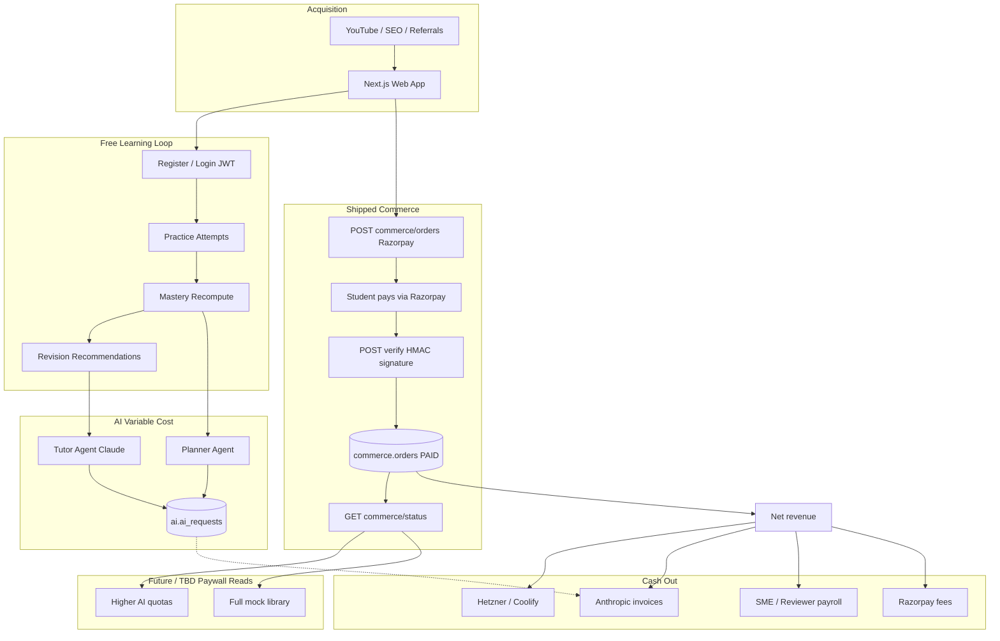

### Advantages
Clarifies that Premium gates should read commerce status, not invent parallel flags.

### Tradeoffs
Diagram omits GST invoicing detail.

### Implementation
Engineering entitlement checks call commerce status; finance reconciles Razorpay settlements vs `orders`.

### Future
Add subscription invoice objects when productized.

### References
ADR-0018; `commerce` module behavior described therein.

---

# 18. Stakeholder Analysis

## 18.0 Chapter framing

### Purpose
Identify who can affect or is affected by TALOS, and how to engage them.

### Background
NEET products fail socially when they delight only engineering or only marketers. Stakeholders include supply-side SMEs and environmental actors like NTA (not customers).

### Problem
Treating NTA as a partner or ignoring reviewer burnout both kill the system—differently.

### Solution
Stakeholder map, power/interest grid, engagement strategies, RACI for major decisions, PlantUML relationship diagram.

### Advantages
Makes ADR-0005 and ECAEP human, not only technical.

### Tradeoffs
Engagement plans require real calendar time.

### Implementation
Use RACI in product forums; revisit grid each major release.

### Future
Add school administrators when B2B tenancy becomes real.

### References
ECAEP roles; ADR-0005; ADR-0010.

---

## 18.1 Stakeholder map (students, parents, SMEs/authors, reviewers, admins, investors, NTA-as-environment, hosting)

### Purpose
Enumerate stakeholders with interests and success metrics.

### Background
TALOS roles already distinguish authors, reviewers, approvers, admins in ECAEP; identity RBAC gates admin analytics and user management.

### Problem
“Users” is not a stakeholder analysis.

### Solution

| Stakeholder | Type | Primary interest | Success metric (examples) | Tension |
|---|---|---|---|---|
| **Students** | Beneficiary / user | Rank readiness, clarity, speed | Attempts, mastery gains, mock scores | Want unlimited AI and complete bank now |
| **Parents** | Economic buyer | Trust, progress, fair price | Willingness to pay; perceived progress | Want portals and guarantees we may not ship yet |
| **SME authors** | Supply-side | Fair pay, good tools, pride in originality | Published items / week; revision cycles | Speed vs craft |
| **Reviewers / approvers** | Supply-side quality | Clear standards, sane WIP | Review SLA; defect escapes | Bottleneck stress |
| **Admins / ops** | Internal operators | Stability, permissions, analytics | Uptime; abuse control; AI cost | Under-tooled early |
| **Engineering** | Internal builders | Clean architecture, ADRs | Cycle time; incident rate | Scope pressure |
| **Product / founders** | Governance | PMF, ethics, runway | Retention; revenue; coverage | Hype vs truth |
| **Investors** | Capital (if/when) | Growth with defensible doctrine | Unit economics trajectory | May push gray content shortcuts—must refuse |
| **NTA** | Environment | Conduct exam; public info | N/A as customer | Mis-marketing risk if we imply affiliation |
| **Hosting / Coolify-Hetzner ops** | Vendor infrastructure | Stable tenants, paid invoices | Uptime | Single-VPS limits |
| **Anthropic** | Model vendor | Successful API usage within ToS | Latency/cost | Price changes |
| **Razorpay** | Payments vendor | Compliant merchants | Settlement success | Misconfiguration risk |
| **Creators / YouTube partners** | Channel partners | Audience fit, fair terms | Qualified signups | May want banned PDFs in community—police it |
| **Competitors** | Rival actors | Share of attention | — | Scenario planning Ch. 15 |
| **Society / aspirant fairness** | Normative | Reduce predatory practices | Trust | Against fake rank guarantees |

### Stakeholder personas (compressed)

**Ananya, Class 12 student:** Needs efficient weak-area practice between school and sleep; abandons apps with cluttered live-class upsells.

**Ramesh, parent:** Pays; fears wasting money after edtech headlines; asks “is this enough for NEET?”—needs honest coverage communication.

**Dr. Meela, part-time SME:** Writes NCERT-aligned notes nights/weekends; refuses to rubber-stamp AI nonsense; needs Evaluator to help, not replace her.

**Kabir, reviewer:** Clears IN_REVIEW queue; quality collapses if QG spam exceeds hours.

**Ops admin:** Watches AI cost spikes and suspended users; needs analytics.view and users.manage tools already seeded.

### Advantages
Surfaces supply-side stakeholders as first-class—critical under ADR-0005.

### Tradeoffs
More owners to schedule.

### Implementation
Include SME/reviewer reps in content councils.

### Future
Add counselling-phase content stakeholders post-exam if product expands.

### References
`docs/architecture/ecaep.md` roles.

---

## 18.2 Power/interest grid

### Purpose
Prioritize engagement energy.

### Background
Mendelow-style grids prevent treating all stakeholders equally.

### Problem
High-interest low-power SMEs get ignored until they quit; high-power low-interest vendors get ignored until invoices fail.

### Solution

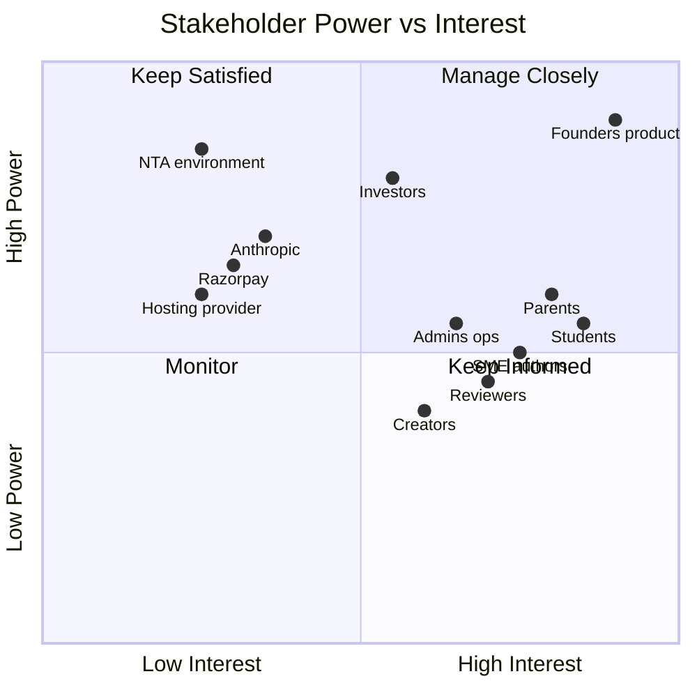

> **Enterprise Assumption:** Positions are facilitation aids, not sociological measurements.

### Grid interpretation

| Quadrant | Stakeholders | Engagement posture |
|---|---|---|
| **Manage closely** | Founders/product, students, parents, SMEs/reviewers, admins | Weekly rituals; roadmap transparency |
| **Keep satisfied** | Investors (if any), critical vendors with power | Clear reporting; no surprises on IP/risk |
| **Keep informed** | Creators, wider aspirant community | Content and release notes |
| **Monitor** | NTA-as-environment, broad public | Compliance watch; no fake partnership pursuit |

### Special note on NTA
High power as exam authority environment, low interest in any single edtech app. Engage by **compliance and humility**, not BD fantasies.

### Advantages
Protects reviewer attention as strategic.

### Tradeoffs
Investors may demand more power than grid suggests—governance must still defend ADR-0005.

### Implementation
Re-plot after fundraising or school pilots.

### Future
School principals enter “keep satisfied” when B2B exists.

### References
Section 18.3.

---

## 18.3 Engagement strategies

### Purpose
Translate grid into concrete practices.

### Background
Engagement fails when it is only marketing email.

### Problem
SMEs receive tasks but not voice; students receive features but not trust narratives; vendors receive silence until outage.

### Solution

| Stakeholder | Engagement strategy | Cadence | Owner | Do / Don’t |
|---|---|---|---|---|
| Students | In-product education; changelog; feedback on Tutor quality | Continuous + release | Product | Do: honest limits. Don’t: guaranteed ranks |
| Parents | Clear pricing pages; coverage honesty; safety messaging | Pre-pay moments | Founders/Marketing | Do: explain NCERT doctrine. Don’t: fake endorsements |
| SME authors | Editorial council; tooling roadmap; attribution pride | Biweekly | Content lead | Do: pay for quality. Don’t: treat as AI babysitters only |
| Reviewers | WIP limits; SLA dashboards; escalate AI spam | Weekly | Content lead | Do: protect queue. Don’t: unlimited QG firehose |
| Admins | Runbooks; analytics; permission hygiene | Weekly ops | Eng/Ops | Do: rehearse incident. Don’t: share prod keys in chat |
| Investors | Metrics: coverage, activation, AI COGS, revenue | Monthly | Founders | Do: label assumptions. Don’t: promise scrape-based growth |
| NTA (env) | Follow public bulletins; legal review of claims | Per cycle | Founders/Legal | Do: informational alignment. Don’t: claim partnership |
| Anthropic | Track model changes; ToS; cost | Ongoing | Eng AI | Do: gateway flexibility. Don’t: single-prompt bus factor |
| Razorpay | Settlement monitoring; webhook/verify discipline | Ongoing | Eng commerce | Do: real keys in prod. Don’t: fake success paths |
| Hosting | Backups, upgrades, capacity | Ongoing | Ops | Do: scale criteria. Don’t: ignore vertical limits forever |
| Creators | Briefs with ADR-0005 rules; affiliate experiments later | Campaign | Marketing | Do: NCERT-safe scripts. Don’t: attach pirated PDFs |

### Engagement rituals (recommended)

1. **Coverage Heartbeat (weekly):** students’ pain ↔ SME output.  
2. **AI Cost Clinic (weekly):** admin AI analytics review.  
3. **Trust Review (biweekly):** marketing claims checklist.  
4. **Incident GameDay (monthly):** auth/payment/AI outage tabletop.  
5. **NEET Calendar Sync (per bulletin):** syllabus/pattern deltas.

### Playbooks (compressed)

**Student trust:** First Tutor answer discloses published-notes grounding; first mock explains +4/−1; coverage gaps stated honestly; outages communicated; Premium unlocks stated only once defined.

**Parent trust:** Coverage transparency; human review for question bank; Razorpay honesty; “different product class than Kota empire,” not mudslinging.

**SME/reviewer care:** Queue age as early warning; throttle QG; quarantine items without provenance; WIP limits and fair pay.

**Investor communication:** Label TAM assumptions; moat = ECAEP + lawful content + OS loop; hard no on IP-gray growth; Claude gateway truth; subscriptions future not present.

**Vendor escalation:** Anthropic yellow=latency/cost spike, red=outage/ToS; Razorpay red=verify failures freeze entitlements; Hosting red=downtime → scale and communicate.

### Advantages
Operationalizes stakeholder map.

### Tradeoffs
Rituals consume calendar—keep them short.

### Implementation
Tie rituals to existing analytics rather than new bureaucracy where possible.

### Future
Student advisory panel once user base supports it.

### References
ADR-0017 analytics; deploy runbooks.

---

## 18.4 RACI for major product decisions

### Purpose
Clarify decision rights to prevent ADR drift and silent paywalling.

### Background
Frozen decisions live in `docs/decisions/`. Day-to-day choices still need RACI.

### Problem
Without RACI, engineering “just ships” monetization gates or marketers promise OpenAI features.

### Solution — RACI matrix

**Legend:** R = Responsible, A = Accountable, C = Consulted, I = Informed

| Decision | Founders | Product | Eng | Content Lead | Reviewers/SMEs | Ops | Investors |
|---|---|---|---|---|---|---|---|
| Amend ADR-0005 / license third-party bank | A | C | C | R | C | I | I |
| Freemium vs Premium boundaries | A | R | C | C | I | C | I |
| Premium price point | A | R | I | C | I | I | C |
| Introduce subscriptions | A | R | R | C | I | C | C |
| Add second LLM provider | A | C | R | C | I | C | I |
| Claim vector RAG / OpenAI in marketing | A | R | C | I | I | I | I |
| Auto-publish AI questions (forbidden default) | A | C | R enforce | R | C | I | I |
| Syllabus coverage prioritization | C | C | I | A/R | C | I | I |
| NEET vertical vs expand JEE | A | R | C | C | C | I | C |
| Live classes experiment | A | R | C | C | I | C | C |
| Native mobile apps | A | R | R | I | I | C | C |
| Multi-tenancy / schools | A | R | R | C | I | C | C |
| Production deploy / keys | C | I | R | I | I | A | I |
| Public rank/result guarantees | A | R | I | C | I | I | I |
| Data retention / privacy posture | A | C | R | I | I | C | I |
| Ingestion source allowlist | A | C | C | R | C | I | I |
| AI daily quotas | A | R | R | C | I | C | I |
| Fundraising narrative on TAM | A | C | I | I | I | I | C |

### Decision rules (normative)

1. **No silent ADR violations.** If code needs to violate a frozen decision, write a new ADR first.  
2. **Marketing cannot invent providers.** If OpenAI is not wired, copy cannot say it is.  
3. **Content lead owns provenance.** Engineering will not hardcode scrape importers.  
4. **Accountable founders on ethics cliffs.** IP, fake results, fake payments.  

### Advantages
Reduces cross-team collision.

### Tradeoffs
Can feel heavy for tiny teams—collapse roles but keep Accountable clear.

### Implementation
Attach RACI IDs to ADR templates and epic briefs.

### Future
Expand rows for school contracts when relevant.

### References
`docs/decisions/`; Chapter 15.6.

---

## 18.5 PlantUML stakeholder relationships

### Purpose
Show relational structure among stakeholders and system.

### Background
Power/interest is a prioritization lens; relationships show flows of value, content, money, and constraint.

### Problem
Orgs forget reviewers sit on the critical path between AI generation and students.

### Solution

```plantuml
@startuml TALOS_Stakeholder_Relationships
skinparam shadowing false
skinparam linetype ortho

actor Students
actor Parents
actor SMEAuthors as "SME Authors"
actor Reviewers
actor Admins
actor Founders
actor Investors
actor Creators

rectangle "Environment" {
  entity NTA as "NTA (Environment)"
}

rectangle "Vendors" {
  entity Anthropic
  entity Razorpay
  entity Hetzner as "Hetzner/Coolify"
}

rectangle "TALOS Platform" {
  component WebApp as "Next.js App"
  component API as "FastAPI Modular Monolith"
  component ECAEP
  component Assess as "Practice/Mocks"
  component AIGate as "AI Gateway (Claude)"
  component Mastery
  component Commerce
  component Analytics
}

Students --> WebApp : practice / tutor / plan
Parents --> Commerce : pay Premium
Parents ..> Students : sponsor / motivate
Creators --> Students : attention
Creators ..> WebApp : CTAs
SMEAuthors --> ECAEP : author drafts
Reviewers --> ECAEP : approve/reject
ECAEP --> Assess : published items
Assess --> Mastery : attempts
Mastery --> AIGate : weak signals for planner
AIGate --> Anthropic : tokens
Commerce --> Razorpay : orders/verify
API --> Hetzner : host
Admins --> Analytics : costs / attempts
Admins --> WebApp : user role/status
Founders --> ECAEP : ADR-0005 doctrine
Founders --> Investors : labeled metrics
NTA ..> Assess : exam pattern environment
Investors ..> Founders : capital / governance
SMEAuthors ..> Reviewers : queue load
AIGate --> ECAEP : QG drafts + Evaluator

note right of NTA
  Informational environment only.
  No partnership claim.
end note

note bottom of ECAEP
  Critical path for lawful content.
  Students only see PUBLISHED.
end note

@enduml
```

### Advantages
Makes money, content, and AI vendor flows visible together.

### Tradeoffs
Omits every internal engineering team swimlane for clarity.

### Implementation
Use in onboarding; pair with RACI when disputes arise.

### Future
Add school node when tenancy ships.

### References
Sections 18.1–18.4; ADR-0005; ADR-0018.

---

# Document close — Part B integration notes

## Cross-chapter synthesis

| Theme | Market (13) | Industry (14) | Competitors (15) | SWOT (16) | Business (17) | Stakeholders (18) |
|---|---|---|---|---|---|---|
| Lawful content | Channel hygiene | IP risk | ADR-0005 vs proprietary banks | W2/S10/WT1 | SME COGS | SME/reviewer RACI |
| AI OS loop | Demand for AI help | Disruption vectors | Vs chat wrappers | SO1/ST2 | Token metering | Anthropic engagement |
| Assessment fidelity | Tournament demand | Value chain stage | Vs doubt-only apps | S5/SO5 | Mock gating | Student success metrics |
| Monetization | Pricing landscape | Buyer power | Vs subscription norms | W6/W7/WO2 | Premium rail + future subs | Parents as buyers |
| Scope discipline | SAM focus digital OS | Avoid live vanity | Vs Unacademy live | WT2/WT3 | Freemium principles | Founders accountable |

## Shipped capability checklist (for readers skimming)

- Identity/auth JWT, RBAC, admin user management  
- Academic hierarchy for NEET  
- ECAEP CMS + question bank workflow  
- Practice and mocks with scoring  
- AI Gateway: Tutor, Question Generator, Study Planner, Evaluator (Claude; fallback without key)  
- Mastery + revision recommendations  
- Admin analytics (assessment + AI cost)  
- Razorpay one-time Premium rail (honest no-key behavior)  
- Hardening: auth rate limits, security headers  
- Deploy artifacts for Coolify/Hetzner  
- Phase 2 ingestion / Knowledge Unit direction (NCERT-oriented; not vector RAG; not OpenAI)

## Explicit non-claims

- Not OpenAI / Azure OpenAI powered (today)  
- Not vector RAG implemented (today)  
- Not multi-tenant schools product  
- Not live classes / Digital Twin / 12-agent OS  
- Not NTA-affiliated  
- Not a scrape of Allen/Aakash/PW/Unacademy banks  
- Market shares and TAM figures herein are **Enterprise Assumptions** unless replaced with research

## Integrated scenario workbook (**Enterprise Assumption**)

| Scenario | Narrative | Primary TOWS |
|---|---|---|
| Alpha — Coverage compounds | Content velocity works; Premium launches; AI quotas hold | SO1 SO4 WO1 |
| Beta — AI hype trap | Oversell Tutor; token burn; grounding incidents | ST2 ST3 |
| Gamma — Incumbent pressure | Major brand AI ads; CAC rises | SO1 WT2 |
| Delta — Temptation | Telegram bank import proposed | WT1 |
| Epsilon — Scale bruise | Mock season outage | ST4 WT4 |

Rehearse Delta and Epsilon explicitly—they are culture-defining.

## Maintenance

| Trigger | Update sections |
|---|---|
| NEET bulletin / syllabus change | 13.7, 14.4, content prioritization |
| New competitor AI launch | 15.2–15.4 |
| Premium paywall decision | 17.2, 17.5, 17.6 |
| Subscriptions shipped | 17 entire; 13.5 |
| Second LLM provider wired | 14.3, 15.2, non-claims |
| Fundraising | 13.4 assumptions refresh; investor engagement |

## Glossary

| Term | Meaning in this blueprint |
|---|---|
| TALOS | Trinetra AI Learning OS |
| NEET-UG | Undergraduate medical entrance exam context |
| ECAEP | Editorial content workflow (draft→…→published) |
| KU | Knowledge Unit (Phase 2 structured knowledge) |
| Premium | Entitlement derived from PAID Razorpay order |
| Enterprise Assumption | Figure/claim not evidenced in-repo |
| Shipped | Implemented in current product trajectory described by ADRs/roadmap |
| Gateway | `AIProvider` abstraction; Claude wired |
| Coverage grid | Concept×content completeness view from CMS era |
| Multi-homing | Students using multiple apps/channels simultaneously |
| SOM | Share/slice of market used for planning, assumption-heavy |

## References (Part B master list)

1. ADR-0001 Modular monolith  
2. ADR-0002 Tech stack  
3. ADR-0003 Auth strategy  
4. ADR-0004 AI Gateway  
5. ADR-0005 Content licensing (NCERT-aligned / original only)  
6. ADR-0006 Commerce and hosting  
7. ADR-0007 MVP scope cut  
8. ADR-0008 Single frontend  
9. ADR-0009 ECAEP content model  
10. ADR-0010 Naming — Trinetra AI Learning OS (TALOS)  
11. ADR-0014 AI Gateway implementation  
12. ADR-0015 Learning/mastery scope  
13. ADR-0016 Recommendation + revision scope  
14. ADR-0017 Analytics scope  
15. ADR-0018 Commerce, admin, hardening, deploy  
16. ADR-0022–0028 Ingestion and Knowledge Unit Phase 2 series  
17. `docs/architecture/roadmap.md`  
18. `docs/architecture/ecaep.md`  
19. `docs/deploy/RUNBOOK.md`  
20. External informational: NTA NEET public bulletins (not reproduced here)


---

# Appendix A — Extended operating narratives (enterprise depth)

This appendix does not renumber Chapters 13–18. It deepens decision logic already framed there so leadership can operate without inventing parallel strategy docs. All market figures remain **Enterprise Assumption** unless stated as shipped product fact.

## A.1 Market operating model (extends Chapter 13)

### A.1.1 Segment prioritization scorecard

| Segment | Content need | AI need | WTP (**Enterprise Assumption**) | Fit to shipped OS | Priority year-1 |
|---|---|---|---|---|---|
| Class 11 starters | Very high | Medium | Medium | High if coverage grows | Medium |
| Class 12 concurrent | High | High (planner) | Medium–High | High | High |
| Droppers | High mocks | High triage | High | Very high | **Highest** |
| Late switchers | Focused triage | Very high | Medium | High | High |
| Parent-only buyers | Progress proof | Low direct | Medium | Medium until portal | Support via student UX |

**Rule:** Do not open JEE/boards while dropper + Class 12 loops are under-served on coverage.

### A.1.2 Activation definition (product-standard)

| Funnel stage | Definition | Why it matters |
|---|---|---|
| Registered | Account created | Vanity if no attempt |
| Activated | At least one scored practice or mock attempt | True product use |
| Habituated | Attempts in at least 3 of last 7 active study days (**Enterprise Assumption** threshold) | Retention proxy |
| Premium | PAID Razorpay order exists | Shipped entitlement |
| Advocating | Refers peer or posts score honestly | Growth quality |

Marketing must report **Activated**, not only Registered.

### A.1.3 Coverage as market strategy

Under ADR-0005, coverage is not a content ops side quest—it is the SOM throttle. Publish a weekly internal coverage heartbeat:

1. Concepts with zero published questions
2. Concepts with 1–4 questions
3. Concepts with at least 5 questions
4. Chapters below threshold for mock generation quality
5. Reviewer queue age

GTM claims may only reference rows that meet the agreed threshold. This is how TALOS avoids both scrape temptation and empty marketing.

### A.1.4 Channel system of record

| Event | Capture | Owner |
|---|---|---|
| YouTube CTA click | UTM to signup | Growth |
| First practice start | Product analytics (future growth stack) | Product |
| First scored attempt | Assessment events | Eng |
| Premium checkout start | Commerce order CREATED | Eng |
| Premium PAID | Commerce verify | Eng |
| Tutor prompt | `ai.ai_requests` | Eng AI |

Until a dedicated growth warehouse exists, use admin analytics plus commerce tables plus manual channel logs. Do not invent vanity dashboards that ignore attempts.

### A.1.5 Pricing landscape decision tree

```text
IF coverage_grid_ready_for_promised_SKU == false
  THEN do not raise Premium price; accelerate content
ELSE IF AI_COGS_per_active trending above plan
  THEN introduce Tutor quotas before price cuts
ELSE IF conversion_of_activated < target (Enterprise Assumption)
  THEN test value messaging and free mock sample, not scrape
ELSE IF retention_after_premium strong
  THEN design subscription SKU on paper → ADR → build
```

### A.1.6 NTA-environment checklist for releases

- No NTA logo or crest
- No official or approved-by-NTA language
- Syllabus references cite public materials carefully
- PYQ usage reviewed for legal posture
- Rank predictors (if any future) labeled unofficial

### A.1.7 Household journey detail

NEET purchase decisions often move through awareness (YouTube or WhatsApp), trial (free practice), habit test (two school weeks), parent pitch (mastery or mock screenshot), payment (UPI via Razorpay), and justification loop (weekly proof). Freemium design should preserve a parent-showable mastery snapshot even when AI quotas are gated.

### A.1.8 Regional posture (**Enterprise Assumption**)

Demand density differs across coaching belts, metros, and tier-2/3 smartphone learners. TALOS web-first posture favors national reach without city centers, but vernacular friction remains real. Language expansion follows ADR-0019 trajectory with quality bars—not a panicked half-translation.

## A.2 Industry operating model (extends Chapter 14)

### A.2.1 Force monitoring cadence

| Force | Leading indicator | Review |
|---|---|---|
| Rivalry | Major AI feature launches | Monthly |
| New entrants | New AI NEET app noise | Monthly |
| Buyer power | Refund or chargeback anecdotes; price sensitivity | Quarterly |
| Supplier power | Anthropic pricing; SME wage pressure | Quarterly |
| Substitutes | YouTube NEET attention proxies (**Enterprise Assumption**) | Quarterly |

### A.2.2 Value chain bottleneck math (**Enterprise Assumption**)

Suppose Question Generator can draft 200 MCQs per week but reviewers can clear 60 per week. Published throughput is 60—not 200. Any dashboard celebrating AI generated without human published is lying to the company. WIP policy: generation backlog may not exceed a multiple of reviewer weekly capacity.

### A.2.3 Disruption adoption checklist

Before adopting a hyped technique (embeddings, second model, auto-publish):

1. What ADR does it change?
2. What student-visible quality metric improves?
3. What new failure mode appears (hallucination, IP, cost)?
4. Can we ship a thin slice without renaming the product story?
5. Are we claiming it in marketing before it is true?

Vector RAG and OpenAI remain **not shipped**. They may become future adapters; they are not present facts.

### A.2.4 Risk ownership

IP risk and hallucination risk are reputation-existential. Token inflation is margin-existential. Single-VPS limits are seasonal-existential. Owners: Content and Founders for IP; AI and Product for hallucination; Finance and AI for tokens; Ops for infra.

### A.2.5 Control-point SLA starter set (**Enterprise Assumption**)

| Control point | Starter focus |
|---|---|
| Ingestion jobs | Pilot files complete without silent skip bugs |
| KU gates | Fail reasons reviewed weekly |
| IN_REVIEW age | Keep queue age visible; throttle QG if rising |
| Tutor grounding incidents | 100 percent weekly review of reported issues |
| AI cost by agent | Alert when Tutor share spikes abnormally |

## A.3 Competitor operating model (extends Chapter 15)

### A.3.1 Approved competitive narrative (short form)

TALOS is building a lawful, AI-assisted learning OS for NEET practice and mastery. We do not claim to be Allen. We do not claim unlimited auto-generated banks. We do claim editorial workflow, assessment fidelity, and agents that respect publish gates.

### A.3.2 Tear-down ethics

Competitive teardowns use only publicly accessible surfaces and fair-use judgment. No shared logins, no scraping private banks, no redistributing rival PDFs internally for research. Research notes stay in a controlled folder with provenance.

### A.3.3 Response card library

**When a rival launches GPT tutor:** Acknowledge that AI help matters; privately run grounding eval on our Tutor; do not announce OpenAI.

**When a rival dumps tens of thousands of questions overnight:** Ask whether items are reviewed; publish our coverage honesty; accelerate KU to ECAEP, not Telegram imports.

**When parents ask why not PW:** Multi-homing is fine; TALOS aims to be the mastery and mock discipline layer; price and trust clarity; no mudslinging.

**When growth proposes pirate PDF pack:** Escalate to founders; document refusal; if repeated, personnel process.

### A.3.4 Feature matrix maintenance

Date-stamp each matrix revision. Cells marked U stay U until hands-on evidence exists. Never fill U with hope.

### A.3.5 Positioning vector reminder

TALOS moves up on content depth through NCERT-aligned authorship and KU factories, and stays right on AI personalization through Tutor, Planner, mastery, and revision—without illegal shortcuts that falsely inflate the y-axis.

## A.4 SWOT execution calendar (extends Chapter 16)

### Quarterly ritual

1. Re-score S/W/O/T rows that changed.
2. Pick at most three TOWS themes for the quarter.
3. Assign owners and KPIs.
4. Explicitly list anti-patterns (live class panic, scrape, unlimited AI).
5. Review Delta and Epsilon scenario readiness.

### Example quarter pack (illustrative)

| Theme | KPI | Owner |
|---|---|---|
| WO1 Coverage | Concepts reaching at least 5 questions | Content |
| SO1 Activation | Median time-to-first-scored-attempt | Product |
| ST3 Token control | AI cost per DAU alert threshold | Eng AI + Finance |

### Anti-pattern register

| Anti-pattern | Why it appears | Hard stop |
|---|---|---|
| Scrape to fix W2 | Coverage panic | ADR-0005 |
| Live MVP to answer Unacademy | Narrative panic | ADR-0007 |
| Unlimited Tutor ads | Growth panic | COGS math |
| OpenAI in copy | Competitor splash panic | Stack truth |
| Guaranteed ranks | Parent pressure | Ethics + RACI |

## A.5 Business model runbooks (extends Chapter 17)

### A.5.1 Go-live commerce checklist

- Razorpay keys set in prod
- No fake success path present (ADR-0018)
- Verify signature unit tests green
- Freemium boundary decision written
- Premium price published
- Refund policy drafted
- Support contact path exists
- Entitlement reads commerce status only

### A.5.2 Paywall enforcement design notes

When implementing gates:

1. Server-side enforcement mandatory; client checks are UX only.
2. Free practice must remain sufficient to produce mastery signal.
3. Tutor and Planner quotas decrement on successful gateway calls, not on page views.
4. Admin and CMS routes remain permission-gated, never payment-gated.
5. Soft-limit messaging should explain upgrade value without dark patterns.

### A.5.3 Subscription future design constraints (**Enterprise Assumption**)

When subscriptions arrive:

- Keep PAID one-time users grandfathered with written rules.
- Prefer annual SKU for Class 12; monthly for explorers.
- Meter AI inside all paid tiers.
- Do not build a second entitlement database.
- Dunning and failed-payment UX need support staffing before launch.

### A.5.4 Unit economics review agenda

Monthly forty-five minutes:

1. GMV and PAID count (Razorpay and orders)
2. AI cost by agent
3. SME and reviewer spend vs publishes
4. Infra invoice
5. CAC experiments if any
6. Coverage heartbeat
7. Decisions on price, quota, hiring

### A.5.5 Content amortization for decisions (**Enterprise Assumption**)

For internal decision dashboards, treat evergreen published items as multi-period assets across an exam cycle even if statutory accounting differs. This prevents underinvestment in the real moat.

## A.6 Stakeholder operating system (extends Chapter 18)

### A.6.1 Meeting map

| Meeting | Attendees | Output |
|---|---|---|
| Coverage Heartbeat | Content, Product, Founder | Priority chapter list |
| AI Cost Clinic | Eng AI, Finance, Product | Quota and prompt actions |
| Trust Review | Founders, Marketing, Content | Claim approvals or rejections |
| Incident GameDay | Ops, Eng, Founders | Updated runbooks |
| Editorial Council | SMEs, Reviewers, Content lead | Style and provenance decisions |

### A.6.2 RACI escalation examples

- Marketer drafts Powered by OpenAI: Product R fixes copy; Founders A reject; Eng C confirms stack.
- Growth wants Allen PDF ingest: Content R refuses; Founders A uphold ADR-0005; Eng I ensures no importer merged.
- Ops wants hand-edit prod schema: Eng R refuses; Ops must use Alembic path.

### A.6.3 Investor FAQ (truthful)

**What is shipped?** SP0–SP9 learning OS plus Phase 2 ingestion and KU direction.  
**Who is the AI provider?** Anthropic Claude via gateway.  
**Do you use RAG?** Not as a shipped vector RAG system.  
**How do you get content?** NCERT-aligned and original via ECAEP; no rival coaching scrapes.  
**How do you make money today?** One-time Razorpay Premium rail; paywall packaging to be decided.  
**What is the biggest risk?** Lawful coverage velocity and trust—not missing a twelfth agent.

### A.6.4 Parent and student message architecture

| Audience | Primary message | Proof artifact |
|---|---|---|
| Student | Practice, see weak concepts, revise on time | Mastery + revision cards |
| Parent | Honest progress and lawful content | Coverage honesty + commerce trust |
| SME | Your authorship is the product | Provenance + tooling |
| Investor | OS moat with labeled assumptions | Coverage, activation, AI COGS |

## A.7 Twelve-month planning sketch (**Enterprise Assumption**)

| Quarter | Product focus | Content focus | GTM focus | Commerce focus |
|---|---|---|---|---|
| Q1 | Activation polish; Tutor grounding | High-weight chapter surge | YouTube to practice CTAs | Define freemium boundary |
| Q2 | Mock cadence; revision UX | KU cutover leverage | SEO chapter pages | Launch Premium price and gates |
| Q3 | Perf for mock season | Dropper packs | Parent trust pages | Measure conversion and COGS |
| Q4 | Subscription design decision | Fill remaining gaps | Case studies if earned | Keep or iterate SKUs |

This sketch is not a commitment; it is a planning scaffold subordinate to coverage reality and ADR discipline.

## A.8 Decision log template (copy per major choice)

| Field | Entry |
|---|---|
| Date | |
| Decision | |
| Related ADR | |
| Options considered | |
| Chosen option | |
| Enterprise Assumptions used | |
| Owner (A) | |
| Revisit trigger | |
| Explicit non-claims | |

## A.9 Scenario rehearsal scripts

### Delta — Temptation (IP)

Facilitator proposes importing a Telegram NEET pack to hit a coverage OKR. Expected outcome: refusal citing ADR-0005; written incident note; no silent exception.

### Epsilon — Scale bruise

Simulate mock-season 5xx errors. Expected outcome: status communication draft, rate-limit review, vertical scale checklist, postmortem owner assigned within twenty-four hours.

### Beta — AI hype trap

Marketing drafts unlimited Tutor for launch week. Expected outcome: quota design forced before campaign; AI Cost Clinic numbers attached.

## A.10 Closing affirmation

Trinetra AI Learning OS (TALOS) will compete in the NEET-UG digital market as a trustworthy learning OS, not as a pirate content aggregator and not as a live-class clone. Chapters 13–18 and this appendix exist so that growth pressure, AI hype, and incumbent marketing cannot casually overwrite frozen decisions—especially ADR-0005 (content licensing), ADR-0004 and ADR-0014 (Claude gateway), and ADR-0018 (honest Razorpay Premium).

*End of Appendix A.*

---

# Appendix B — Worked examples and claim hygiene

## B.1 Worked example: dropper weekly loop on TALOS

A dropper targeting the next NEET cycle logs in on Monday, opens recommendations, sees two concepts due for revision and one weak concept, starts concept-scoped practice from the dashboard CTA, submits a scored attempt, watches mastery recompute, asks Tutor a clarifying question grounded in published notes, and regenerates a Planner week only if the weak-concept list changed materially. On weekend they attempt a timed mock using +4/-1 scoring. This loop uses shipped SP4-SP7 surfaces and does not require live classes, native apps, or vector RAG.

## B.2 Worked example: content item from NCERT PDF to student

Ops triggers ingestion for an allowlisted NCERT chapter PDF. The pipeline extracts text, structures Knowledge Unit candidates, and generation workers propose MCQ or note drafts. Drafts enter ECAEP as DRAFT, pass AI Evaluator check, enter human IN_REVIEW, and only PUBLISHED items become visible to Tutor retrieval and assessment assembly. At no point is an Allen or PW PDF an input. This is ADR-0005 plus Phase 2 architecture in narrative form.

## B.3 Worked example: Premium purchase without fake success

Student opens checkout. If Razorpay keys are missing, order creation returns PAYMENT_GATEWAY_NOT_CONFIGURED and UI shows an honest notice. If keys exist, order is created, student pays, verify endpoint checks HMAC signature, order becomes PAID, and GET commerce/status reports premium. No identity.is_premium column is written. Future paywalls read this status.

## B.4 Claim hygiene table for external decks

| Claim type | Allowed if | Forbidden if |
|---|---|---|
| TAM/SAM/SOM | Labeled Enterprise Assumption or cited research | Presented as measured TALOS fact |
| Competitor share | Cited source or omitted | Invented percentages |
| AI provider | Claude / Anthropic via gateway | OpenAI or Azure OpenAI as current |
| Retrieval | Published CMS / KU grounding | Vector RAG as shipped |
| Content | NCERT-aligned / original / ECAEP | Built from rival coaching PDFs |
| Commerce | One-time Razorpay Premium rail | Subscriptions as already shipped |
| NTA | Informational alignment | Partnership or endorsement |
| Outcomes | Methodology for practice analytics | Guaranteed NEET ranks |

## B.5 Purpose pattern reminder

Major sections in Chapters 13-18 follow Purpose, Background, Problem, Solution, Advantages, Tradeoffs, Implementation, Future, and References so maintainers can update one concern without rewriting the entire volume. Appendix A and Appendix B are operational deepenings, not replacements for those chapters.

## B.6 Final non-claims (repeat for scanners)

TALOS today is not an OpenAI product, not an Azure OpenAI product, not a vector-RAG product, not a live-class marketplace, not a multi-tenant school SIS, not an NTA partner, and not a scraper of Allen, Aakash, Physics Wallah, or Unacademy materials. It is Trinetra AI Learning OS with NEET-UG as first vertical, Claude behind an AI Gateway, ECAEP-governed content, assessment-mastery-revision loops, admin analytics, Razorpay one-time Premium plumbing, Coolify/Hetzner deploy posture, and Phase 2 ingestion/KU work aimed at lawful scale.

## B.7 Document control

| Field | Value |
|---|---|
| Document | Volume 1 Part B — Market and Business |
| Product name | Trinetra AI Learning OS (TALOS) |
| Vertical | NEET-UG first |
| Classification | Enterprise blueprint |
| Assumption policy | Market sizing and competitor share figures labeled Enterprise Assumption unless evidenced in-repo |
| Review cadence | After each NEET cycle and after major commerce or AI provider changes |
| Related roadmap | SP0 through SP9 done; Phase 2 ingestion and Knowledge Unit series in progress per ADRs |
| Canonical naming | Always Trinetra AI Learning OS (TALOS), never AI Learning OS alone (ADR-0010) |

Maintainers should prefer amending this file with dated subsections over creating conflicting slide-only strategies. When an ADR changes a frozen decision referenced here, update the affected chapter in the same pull request whenever practical.

*End of Appendix B.*


---

*End of Volume 1 — Part B: Market, Industry, Competitors, SWOT, Business Model & Stakeholders.*

\newpage

# Volume 1 — Part C: Product Design

| Field | Value |
|---|---|
| Document ID | TALOS-VOL-01-PART-C |
| Part | C — Product Design (Chapters 19–23, complete) |
| Parent volume | TALOS-VOL-01 — Executive & Product Blueprint |
| Platform name | Trinetra AI Learning OS (TALOS) |
| Product vertical | AI NEET Exam App (NEET-UG) |
| Version | 1.0.0 |
| Status | Approved for Engineering Use |
| Classification | Internal — Confidential |
| Effective date | 2026-08-07 |
| Repository path | `docs/blueprint/volume-01/03-product-design.md` |
| Authority | Architecture Decision Records (`docs/decisions/`) |
| Related ADRs | ADR-0001, ADR-0003, ADR-0004, ADR-0007, ADR-0008, ADR-0009, ADR-0010, ADR-0011, ADR-0013, ADR-0015, ADR-0016, ADR-0021, ADR-0023, ADR-0024, ADR-0028 |
| Related architecture | `docs/architecture/ecaep.md`, `docs/architecture/roadmap.md` |
| Frontend evidence | `apps/web/src/app/**` |
| Backend evidence | `apps/backend/app/modules/**`, `apps/backend/app/modules/identity/seed.py` |
| Audience | CTO, Chief Architect, Product, Engineering Managers, QA, AI Engineering, Content Ops |
| Language | Professional technical English (UTF-8) |

> **Canonical naming (ADR-0010).** The platform name is **Trinetra AI Learning OS (TALOS)**. “AI NEET Exam App” denotes the first exam vertical. This Part C document uses both deliberately: platform capabilities are attributed to TALOS; NEET-specific learner journeys are attributed to the vertical.

> **Document composition.** This file is the complete Part C deliverable: product surface map plus Chapters 19–23 (Personas, Journey, Problem, Solution, Value Proposition).

---

## Assumption Labels Legend

Every claim in Part C is tagged so readers can separate shipped code from planning language. Labels appear inline as bracketed tokens.

| Label | Meaning | How to treat it |
|---|---|---|
| **[SHIPPED]** | Implemented in `apps/` and covered by accepted ADRs and/or tests. Safe to plan UX, QA, and ops against. | Treat as current product truth. |
| **[IN SCOPE MVP]** | Explicitly inside the MVP delivery boundary (ADR-0007 and roadmap SP0–SP9). May be partially or fully shipped; if status is ambiguous, cross-check the route table and ADR. | Prioritize delivery and acceptance criteria. |
| **[ASSUMPTION]** | Product or operational inference that is not itself an ADR decision, or a UX convention that is not yet promoted to an ADR. Must not silently override ADRs. | Challengeable; escalate to Product + Architect before treating as freeze. |
| **[FUTURE]** | Acknowledged backlog beyond current MVP cut. Documented so teams do not accidentally half-build it. | Do not schedule into MVP sprints without a new ADR. |
| **[OUT OF SCOPE MVP]** | Explicitly excluded from MVP (often by ADR-0007). Mentioned only to prevent scope creep. | Reject feature requests that pull this into MVP without ADR amendment. |

**Conflict rule.** If prose in this document conflicts with an Accepted ADR or with repository evidence under `apps/`, the ADR and repository win. Update this document via PR; do not “paper over” gaps by claiming deferred work as shipped.

**Labeling examples:** concept mastery persistence is **[SHIPPED]** (ADR-0015); micro-competency as a first-class syllabus layer is **[FUTURE]** / Phase 2 (ADR-0021); Knowledge Graph, Digital Twin, native mobile, and multi-tenant institute portals are **[OUT OF SCOPE MVP]** / **[FUTURE]** — never shipped claims.

---

## Product Surface Map (Repository-Grounded)

Inventory of real product surfaces referenced by personas. Routes: `apps/web/src/app/**`. Modules: `apps/backend/app/modules/**`. Domain rules: ADRs and `docs/architecture/ecaep.md`.

### Auth and public surfaces **[SHIPPED]**

| Route | Surface | Primary actors | Notes |
|---|---|---|---|
| `/` | Public marketing / entry | Anonymous | `(public)/page.tsx` |
| `/login` | Sign-in | Anonymous → authenticated | JWT access + rotating refresh; HTTP-only cookies (ADR-0003) |
| `/register` | Self-registration | Prospective student | Default role **STUDENT** on register |
| `/verify-email` | Email verification | Registered user | Gate before full activation **[ASSUMPTION]** on product UX copy; identity flow shipped |
| `/forgot-password` | Password recovery request | Anonymous | |
| `/reset-password` | Password reset completion | Anonymous with token | |

### Student surfaces **[SHIPPED]** / **[IN SCOPE MVP]**

| Route | Surface | Learning job |
|---|---|---|
| `/student/dashboard` | Learner home | Mastery overview, recommendations entry, session orientation |
| `/student/subjects` | Subject list | Enter NEET academic tree |
| `/student/subjects/[subjectId]` | Subject detail | Chapters under subject |
| `/student/chapters/[chapterId]` | Chapter detail | Topics under chapter |
| `/student/topics/[topicId]` | Topic detail | Concepts + topic mastery rollup (computed on read) |
| `/student/concepts/[conceptId]` | Concept detail | Notes, practice entry, concept mastery |
| `/student/practice` | Practice generation / start | Untimed PRACTICE assessments |
| `/student/mock-tests` | Mock generation / start | Timed MOCK with NEET marking |
| `/student/attempts` | Attempt history | List prior attempts |
| `/student/attempts/[attemptId]` | Attempt review | Score, answers, post-submit state |
| `/student/study-plan` | Study plan | Planner agent outputs / plan surface |
| `/student/flashcards` | Flashcard practice | PUBLISHED FLASHCARD content |
| `/student/questions` | Question browser | Published question discovery |
| `/student/questions/[id]` | Question detail | Single-item review |
| `/student/settings` | Account settings | Preferences, security-adjacent controls |
| `/student/profile` | Profile | Identity profile fields |

### Admin surfaces **[SHIPPED]**

Admin UX is a route group inside the **same** Next.js app (ADR-0008). There is no separate admin SPA.

| Route | Surface | Ops job |
|---|---|---|
| `/admin` | Admin home | Ops dashboard entry |
| `/admin/content` | Content inventory | ECAEP item list / editorial queue |
| `/admin/content/new` | Create content | Start CONCEPT_NOTE / QUESTION / FLASHCARD / … draft |
| `/admin/content/[itemId]` | Content detail | Versioning, review decisions, publish/archive |
| `/admin/coverage` | Coverage grid | Syllabus × content completeness signal |
| `/admin/knowledge-units` | Knowledge Unit list | Gate-checked structured facts |
| `/admin/knowledge-units/[unitId]` | Knowledge Unit detail | Inspect structured_facts, validation status |
| `/admin/ingestion` | Ingestion jobs | PDF / source ingestion pipeline |
| `/admin/ingestion/[jobId]` | Ingestion job detail | Section extraction progress / errors |
| `/admin/visual-assets` | Visual asset review | Approve/reject detected diagrams/images |
| `/admin/ai-review` | AI review queue | Evaluator reports on submitted content |
| `/admin/search` | Search console | Admin search / reindex controls |
| `/admin/analytics` | Analytics | Platform aggregates (ADR-0017 scope) |
| `/admin/users` | Users & roles | Accounts, roles, permissions |
| `/admin/audit-logs` | Audit logs | Privileged action trail |

**Admin UX gate **[SHIPPED]** / **[ASSUMPTION]** on role elevation policy.**  
`apps/web/src/app/admin/layout.tsx` admits only `SUPER_ADMIN`, `ADMIN`, and `CONTENT_MANAGER` into the admin portal UI. Every admin API still enforces `require_permission` server-side. The seeded **TEACHER** role holds authoring permissions (`content.create`, `content.edit_own_draft`, `content.submit_for_review`, plus question create/read) but is **not** in the admin UX gate. Product implication: SME authors who need the `/admin/content*` screens today must be elevated to **CONTENT_MANAGER** (or ADMIN/SUPER_ADMIN), or a future ADR must extend the UX gate / provide a dedicated author shell. This elevation practice is an **[ASSUMPTION]** about operating the MVP, not a silent claim that TEACHER equals CONTENT_MANAGER.

### Backend modules **[SHIPPED]** (ADR-0001)

| Module | Responsibility |
|---|---|
| `identity` | Users, JWT auth, RBAC |
| `academic` | Exam → Subject → Chapter → Topic → Concept |
| `cms` | ECAEP items, versions, reviews, search |
| `assessment` | PRACTICE + MOCK, attempts, scoring |
| `ai` | AI Gateway + v1 agents (Claude wired) |
| `learning` | Concept mastery, `next_review_at`, recommendations |
| `analytics` | Admin aggregates |
| `commerce` | Razorpay / Premium entitlements |
| `system` | Admin dashboard, audit-log APIs |
| `ingestion` | Source PDF / job pipeline |
| `knowledge` | Knowledge Units, structured facts, gates |

Schemas follow domain boundaries; Alembic-only migrations; API envelope `{ success, data, meta, errors, traceId, timestamp }`.

### Domain rules referenced by personas

**Academic hierarchy **[SHIPPED]**:** `Exam (NEET-UG) → Subject → Chapter → Topic → Concept`. Concept prerequisites add learning-order edges without an enterprise Knowledge Graph (**[OUT OF SCOPE MVP]**). Micro-competency under Concept is **[FUTURE]** / Phase 2 (ADR-0021)—not required in MVP navigation.

**Assessment **[SHIPPED]** (ADR-0013):** **PRACTICE** (`/student/practice`, untimed, no negative marking) and **MOCK** (`/student/mock-tests`, timed, NEET **+4 / −1**). Both generated on demand from `PUBLISHED` questions for concept/chapter/subject (or full-syllabus for mocks). No separate test-definition CRUD that bypasses ECAEP. Adaptive / scheduled packs deferred.

**AI agents v1 **[SHIPPED]** / **[IN SCOPE MVP]**:** Tutor, Question Generator, Study Planner, Evaluator only. Tutor/Planner consume `ai.use` (STUDENT). Evaluator feeds `/admin/ai-review` and ECAEP AI check. Claude is the only wired provider via AI Gateway. Mentor, Digital Twin, Diagram Agent, and 12-agent orchestrator are **not** v1.

**ECAEP **[SHIPPED]**:** `DRAFT → AI_CHECKED → IN_REVIEW → APPROVED → PUBLISHED → ARCHIVED`, with `IN_REVIEW → CHANGES_REQUESTED → DRAFT`. Types: `CONCEPT_NOTE`, `QUESTION`, `FLASHCARD`, `DIAGRAM`, `VIDEO_REF`, `FORMULA_SHEET`. Tutor retrieval reads only `PUBLISHED`. No skip-review CRUD for student-facing bank items.

**Mastery & recommendations **[SHIPPED]** (ADR-0015/0016):** Concept mastery persisted in `learning.concept_mastery`; topic mastery rollup computed on read; recompute synchronous on attempt submit; `next_review_at` drives revision; recommendation order **due → weak → new**. Arithmetic mastery—not a Digital Twin (**[OUT OF SCOPE MVP]**).

**Knowledge Units **[SHIPPED]** foundation (ADR-0023/0024/0028):** Versioned structured facts with mechanical gate checks; generation discipline targets **PASSED** KUs (extract-once-generate-many). Full RAG/embeddings product is not a shipped claim.

**RBAC seed **[SHIPPED]**:** `SUPER_ADMIN` (bypass; immutable editor), `ADMIN` (ops: users, analytics, audit, force-edit, search admin), `CONTENT_MANAGER` (editorial + KU/visual), `TEACHER` (create/submit; `reports.view` reserved; **not** admin UX gate), `STUDENT` (`questions.read`, `ai.use`), `SUPPORT` (`reports.view`).

**Explicit non-claims:** Knowledge Graph, Digital Twin, native mobile, multi-tenancy / institute portals are **[OUT OF SCOPE MVP]** / **[FUTURE]** (ADR-0007).

```mermaid
flowchart LR
  Auth["Auth: / · login · register · verify · forgot/reset"] --> Student["Student: dashboard · hierarchy · practice · mocks · attempts · plan · flashcards · questions · settings/profile"]
  Auth --> Admin["Admin: home · content · coverage · KU · ingestion · visuals · ai-review · search · analytics · users · audit"]
  Student --> API["Modules: identity · academic · cms · assessment · ai · learning · analytics · commerce · system · ingestion · knowledge"]
  Admin --> API
```

---

# 19. User Personas

## 19.1 Purpose

Chapter 19 defines human archetypes that drive requirements, IA, RBAC, content ops staffing, and acceptance metrics for TALOS / AI NEET Exam App. Personas are implementation-ready: each maps to **real routes**, **seeded roles/permissions**, and **measurable success criteria**—not marketing mood boards.

## 19.2 Background

TALOS is a modular monolith with a **single Next.js frontend** (ADR-0008) hosting learner and operator routes. NEET-first academic tree; content only via ECAEP; attempts recompute mastery; four v1 AI agents; six seeded roles. Personas must distinguish: (1) learners in `/student/**`; (2) operators in `/admin/**` under the UX role gate; (3) sponsors who pay without portals; (4) future institute roles kept **[OUT OF SCOPE MVP]** so `tenant_id` is not invented mid-flight. Collapsing these into one “user” causes admin chrome in student UX and weak permission checks on editorial APIs.

## 19.3 Problem

Without disciplined personas, teams chase BRD fantasies (Knowledge Graph, Digital Twin, institute LMS, native apps) and under-build the Class 12 loop: **dashboard → due revision → practice → mock → attempt review → Tutor → return**. Underspecified Author/Reviewer roles collapse bank quality; conflating Admin with Content Manager weakens security; invisible parent sponsors surface later as unexplained churn.

## 19.4 Solution — Persona Set Overview

Eight personas are normative for Volume 1 Part C:

| ID | Persona | MVP posture | Primary habitat |
|---|---|---|---|
| P-01 | Aarav — Class 12 first-attempt aspirant | **[IN SCOPE MVP]** | `/student/**` |
| P-02 | Meera — Dropper / repeater | **[IN SCOPE MVP]** | `/student/**` |
| P-03 | Kabir — Class 11 early starter | **[IN SCOPE MVP]** | `/student/**` |
| P-04 | Sunita — Parent sponsor | **[IN SCOPE MVP]** influence / **[OUT OF SCOPE MVP]** portal | Indirect via student surfaces + commerce |
| P-05 | Dr. Iyer — SME Content Author | **[IN SCOPE MVP]** ops | `/admin/content*` (via elevation **[ASSUMPTION]**) |
| P-06 | Nadia — Content Reviewer / Approver | **[IN SCOPE MVP]** ops | `/admin/content*`, `/admin/ai-review`, `/admin/coverage` |
| P-07 | Rohan — Platform Admin / Super Admin | **[IN SCOPE MVP]** ops | Full `/admin/**` |
| P-08 | Priya — Institute coordinator | **[OUT OF SCOPE MVP]** / **[FUTURE]** | Not built |

### 19.4.1 Persona landscape diagram

```mermaid
flowchart TB
  subgraph Learners["Learner personas — STUDENT role"]
    P01[P-01 Aarav<br/>Class 12 first attempt]
    P02[P-02 Meera<br/>Dropper / repeater]
    P03[P-03 Kabir<br/>Class 11 early starter]
  end

  subgraph Sponsors["Commercial influence — no distinct RBAC"]
    P04[P-04 Sunita<br/>Parent sponsor]
  end

  subgraph Operators["Operator personas — admin UX gate"]
    P05[P-05 Dr. Iyer<br/>SME Author]
    P06[P-06 Nadia<br/>Reviewer / Approver]
    P07[P-07 Rohan<br/>Admin / Super Admin]
  end

  subgraph Future["Explicitly excluded from MVP"]
    P08[P-08 Priya<br/>Institute coordinator]
  end

  P04 -->|funds Premium for| P01
  P04 -->|funds Premium for| P02
  P05 -->|DRAFT → submit| ECAEP[ECAEP pipeline]
  P06 -->|review / approve / publish| ECAEP
  ECAEP -->|PUBLISHED bank| Learners
  P07 -->|RBAC · audit · analytics · break-glass| Operators
  P08 -.->|blocked until tenancy ADR| X[No tenant portal]
```

### 19.4.2 Admin UX gate vs seeded TEACHER role **[ASSUMPTION]**

| Role | Seeded content perms | In `ADMIN_ROLES` UX gate? | Practical MVP operating model |
|---|---|---|---|
| `CONTENT_MANAGER` | Create through archive (+ KU/visual) | Yes | Preferred role for authors who need `/admin` UI |
| `ADMIN` / `SUPER_ADMIN` | Broad / bypass | Yes | Ops + break-glass |
| `TEACHER` | create / edit_own_draft / submit_for_review (+ questions.create) | **No** | API-capable author without admin shell unless elevated |

**Normative note for this blueprint:** When staffing SME authors against the current UI, elevate trusted authors to `CONTENT_MANAGER` rather than pretending `TEACHER` has an author workspace. A future ADR may introduce a teacher/author shell or add `TEACHER` to the gate with a reduced nav. Until then, elevation is the supported path. `TEACHER.reports.view` must **not** be reinterpreted as `analytics.view` (admin analytics).

---

## 19.5 Persona Catalog (Detailed)

### Persona P-01 — Aarav Sharma, Class 12 NEET Aspirant (First Attempt)

**Status:** **[IN SCOPE MVP]** — primary acquisition and delivery persona (P0).

#### Demographics

| Attribute | Detail |
|---|---|
| Age | 17 |
| Education stage | Class 12, CBSE/State board dual load + NEET |
| Geography | Tier-1 / Tier-2 India urban or semi-urban |
| Household | Middle-income; education is the largest discretionary spend after housing |
| Attempt posture | First NEET-UG attempt in the upcoming cycle |
| Language | Comfortable in English UI; may think in Hindi/regional language while studying Biology NCERT |
| Device mix | Android phone primary; Windows/Chromebook secondary for longer mocks |

#### Psychographics

Aarav is outcome-obsessed and time-poor. He distrusts “finish the entire internet” advice and responds to systems that tell him the **next concrete action**. He oscillates between confidence after a good Physics numerical streak and anxiety after a Biology factual miss. He will abandon products that feel like content dumps without a revision loop. He cares about NCERT alignment more than brand prestige once he has been burned by unlicensed PDF spam in Telegram groups.

#### Day-in-the-life (school day)

06:30 — Flashcards on phone (`/student/flashcards`). School occupies the day.  
16:00 — `/student/dashboard`; clears **due** items first (due → weak → new).  
16:45 — Weak concept at `/student/concepts/[conceptId]`; reads PUBLISHED note; starts concept-scoped `/student/practice`.  
18:00 — Submits; reviews `/student/attempts/[attemptId]`; asks **Tutor** for grounded explanation.  
20:30 — Twice weekly timed `/student/mock-tests` under +4/−1.  
22:00 — `/student/study-plan` for tomorrow; sleep.

#### Tech fluency

High mobile-web fluency. Expects instant feedback and clear timers. Rejects admin-like chrome and “knowledge graph” configuration. Will follow WhatsApp deep links from parents.

#### Quote

> “Tell me what to revise today, not what exists in the universe.”

#### Goals

Raise Physics numerical accuracy and finish Biology NCERT without panic; improve mock percentile under +4/−1; move weak concepts into `PRACTICING`/`MASTERED` (three-attempt floor before MASTERED — ADR-0015); sustain a daily loop instead of binge-and-crash.

#### Pains

Forgets weak topics after school-exam weeks; YouTube stimulation without retention; “syllabus unfinished” anxiety without a trusted coverage signal; −1 shock on guessed mocks; distrust of leak-like content (ADR-0005).

#### Jobs-to-be-done

| Job | System surface |
|---|---|
| Know what to do today | `/student/dashboard`, recommendations (due → weak → new) |
| Repair one concept quickly | `/student/concepts/[conceptId]`, `/student/practice` |
| Simulate exam pressure | `/student/mock-tests`, `/student/attempts/[attemptId]` |
| Remember formulas / facts | `/student/flashcards` |
| Get an explanation without leaving the loop | Tutor agent (`ai.use`) |
| See whether the plan is realistic | `/student/study-plan` |

#### Success metrics (product)

| Metric | Definition |
|---|---|
| Weekly Learning Loops Completed (persona contribution) | Practice/mock submit → mastery recompute → recommendation open |
| Due clearance rate | Due concepts cleared within 48 hours of `next_review_at` |
| Mock completion rate | Started mocks submitted before abandon |
| Mastery band movement | Share of attempted concepts leaving `LEARNING` |
| D7 retention | Returns in 7-day window after activation |

#### RBAC / permissions

| Item | Value |
|---|---|
| Role | `STUDENT` (default on `/register`) |
| Permissions | `questions.read`, `ai.use` |
| Admin portal | Denied by UX gate and by missing admin permissions |
| CMS write | None |

#### Feature priorities mapped to real screens

**P0:** `/student/dashboard` (due→weak→new), `/student/practice` + `/student/concepts/[conceptId]`, `/student/mock-tests` + `/student/attempts/[attemptId]`, Tutor via AI Gateway. **P1:** `/student/study-plan`, `/student/flashcards`. **P2:** `/student/profile`, `/student/settings`.

---

### Persona P-02 — Meera Nair, Dropper / Repeater

**Status:** **[IN SCOPE MVP]** — P0 learner persona with distinct psychology from first-timers.

#### Demographics

| Attribute | Detail |
|---|---|
| Age | 18–20 |
| Education stage | Post-Class 12 dedicated repeater year |
| Geography | Often relocated to a coaching city or studying from home with full-day schedule |
| Prior outcome | Missed target percentile/rank previous cycle |
| Financial posture | Family has already spent heavily; ROI scrutiny is higher |
| Device mix | Phone + laptop; longer sitting hours than Class 12 peers |

#### Psychographics

Meera is strategic, slightly cynical, and allergic to “start from page one of NCERT again.” She needs **selective gap closure**, exam stamina, and honest weakness detection. Shame and identity stress are real: products that infantilize her or hide prior-year failure modes lose trust. She will exploit practice mode to avoid negative marking if mocks feel punitive without insight—so attempt review quality matters as much as the score.

#### Day-in-the-life

Morning self-study, then TALOS. Twice-weekly full or part-syllabus `/student/mock-tests` with sacred +4/−1 marking. Midday attempt autopsy on `/student/attempts/[attemptId]` (careless vs knowledge gap). Afternoon dashboard weak list — skips MASTERED concepts. Tutor only for stubborn misses. Sunday: reshape `/student/study-plan` after the mock.

#### Tech fluency

High. Benchmarks against last year’s tools. Verifies mastery reflects real attempts, not vanity self-reports. Sensitive to timer honesty and scoring correctness.

#### Quote

> “Don’t make me relearn what I already own. Show me the leaks.”

#### Goals

Close selective weak concepts without syllabus theater; build three-hour stamina and marking discipline; trend mock scores upward; avoid shame-inducing empty dashboards.

#### Pains

Platforms that restart her at Class 11 defaults; diagnostics that cannot separate careless errors from concept holes; parents asking for “% completed” instead of mastery quality; fear of hallucinated Tutor answers beyond the authored bank.

#### Jobs-to-be-done

| Job | System surface |
|---|---|
| Diagnose leaks | `/student/mock-tests`, `/student/attempts`, mastery on topics/concepts |
| Drill only weak/due | `/student/dashboard` recommendations |
| Deep repair | `/student/concepts/[conceptId]`, Tutor |
| Plan remaining months | `/student/study-plan` |
| Track trajectory | `/student/attempts`, dashboard subject rollups |

#### Success metrics

| Metric | Definition |
|---|---|
| Weak-concept conversion | Weak → higher mastery band over 14 days |
| Mock score trend | Rolling average on MOCK attempts |
| Guessing penalty awareness | Reduction in wrong answers under −1 vs early baseline **[ASSUMPTION]** analytics interpretation |
| Overdue revision backlog | Count of `next_review_at` past due |

#### RBAC / permissions

Same as P-01: `STUDENT` with `questions.read`, `ai.use`. No admin access. Commerce entitlement may differ if Premium SKUs gate some assessment volume **[IN SCOPE MVP]** via `commerce` module.

#### Feature priorities mapped to real screens

**P0:** `/student/dashboard` (weak-first), `/student/mock-tests`, `/student/attempts/**`, `/student/topics/[topicId]` rollups. **P1:** `/student/study-plan`, `/student/questions`. **P2:** `/student/settings`.

---

### Persona P-03 — Kabir Joshi, Class 11 Early Starter

**Status:** **[IN SCOPE MVP]** — P1 learner persona (important for LTV; must not warp UX toward only Class 12 intensity).

#### Demographics

| Attribute | Detail |
|---|---|
| Age | 15–16 |
| Education stage | Class 11; NEET intention declared early |
| Geography | Often smaller city with fewer offline mentors |
| Parental involvement | High; schedule still school-primary |
| Attempt posture | 18–24 months runway |
| Device mix | Shared family laptop + personal phone |

#### Psychographics

Kabir is curious but overwhelm-prone. Class 12-oriented banks feel like a firehose. He needs chapter-scoped practice, gentle planner defaults, and early wins on foundational concepts. Gamified noise fails if it distracts from NCERT. He benefits from flashcards and short PRACTICE sets more than frequent full mocks.

#### Day-in-the-life

Shorter NEET block (45–75 minutes). Path: `/student/subjects` → chapter → topic → concept. Practice stays chapter/topic scoped; mocks are occasional but still correctly scored. Flashcards before sleep. Study plan favors consistency over weekend heroics.

#### Tech fluency

Medium-high. Needs clear empty states and hierarchy breadcrumbs. Must never need to understand ECAEP or Knowledge Units.

#### Quote

> “I have time — don’t burn me out pretending the exam is tomorrow.”

#### Goals

Build Class 11 foundations with visible mastery; stay consistent without burnout; enter Class 12 with fewer Physics/Chemistry holes; keep parents calm via simple dashboard progress.

#### Pains

Full-syllabus mocks too early; hierarchy mismatch vs coaching PDF names; social fear of falling behind Class 12 batches; shared-device login/verify friction.

#### Jobs-to-be-done

| Job | System surface |
|---|---|
| Browse hierarchy safely | `/student/subjects` … `/student/concepts/[conceptId]` |
| Short practice | `/student/practice` |
| Memory maintenance | `/student/flashcards` |
| Light planning | `/student/study-plan` |
| Occasional simulation | `/student/mock-tests` |

#### Success metrics

| Metric | Definition |
|---|---|
| Consistency | Weeks with ≥3 learning loops |
| Early mastery | Class 11 concept MASTERED count |
| Scoped practice ratio | Practice attempts with chapter/topic scope vs full-syllabus |
| Activation depth | Reached concept page within first session |

#### RBAC / permissions

`STUDENT`; identical permission codes to P-01/P-02. Differentiation is UX defaults and content difficulty distribution, not a separate role. **[ASSUMPTION]**: product may later add onboarding flags for “Class 11 track” without new RBAC.

#### Feature priorities mapped to real screens

**P0:** `/student/subjects`…`/student/concepts/[conceptId]`, `/student/practice`, `/student/flashcards`. **P1:** `/student/study-plan`, calm `/student/dashboard`. **P2:** occasional `/student/mock-tests`, `/student/profile`.

---

### Persona P-04 — Sunita Sharma, Parent Sponsor

**Status:** Influence **[IN SCOPE MVP]** via student-visible progress and commerce; dedicated parent portal **[OUT OF SCOPE MVP]** (ADR-0007).

#### Demographics

| Attribute | Detail |
|---|---|
| Age | 40–50 |
| Relation | Parent/guardian funding Aarav or Meera |
| Occupation | Salaried professional / small business |
| Geography | Same household as learner |
| Payment instrument | UPI / cards via Razorpay checkout |
| Language | Prefers simple Hindi/English progress explanations |

#### Psychographics

Sunita buys outcomes and safety, not features. She fears scammy content, unmarked coaching piracy, and “hours watched” vanity metrics. She wants to know: Is my child practicing? Are mocks happening? Is the material legitimate? She will not learn ECAEP states, but she will ask her child to show the dashboard on Sundays.

#### Day-in-the-life

No parent account in MVP. Sunday: reviews `/student/dashboard` and `/student/attempts` over the child’s shoulder. Assists Razorpay/UPI when Premium is needed. Escalates login/payment breaks via SUPPORT (read-oriented; playbooks are **[ASSUMPTION]**).

#### Tech fluency

Medium. Comfortable with UPI and WhatsApp. Needs large, obvious progress cues when viewing the student dashboard.

#### Quote

> “I don’t need another login. I need to know the money is buying real practice — and safe content.”

#### Goals

Verify studying (attempts, mocks, revision); avoid pirated-material risk; complete Premium with clear payment errors; keep the child off empty content scrolling.

#### Pains

Opaque “hours watched” metrics elsewhere; rank-prediction nonsense; no parent portal (must use the child’s screen); unclear commerce states after Razorpay redirects.

#### Jobs-to-be-done

| Job | System surface |
|---|---|
| Inspect progress with child | `/student/dashboard`, `/student/attempts` |
| Fund Premium | Commerce / Razorpay (student session) |
| Trust content provenance | Brand + ADR-0005 policy reflected in product—not a parent screen |
| Recover access issues | `/login`, `/forgot-password`, SUPPORT process |

#### Success metrics

| Metric | Definition |
|---|---|
| Checkout completion | Razorpay verify → PAID entitlement |
| Sponsorship continuity | Renewal / continued funding **[ASSUMPTION]** commercial metric |
| Trust proxies | Low chargebacks; low “is this pirated?” complaints |
| Shared-session progress views | Qualitative research / support notes |

#### RBAC / permissions

No distinct `PARENT` role in MVP seed. Sunita is not a first-class identity. She must not be given `users.manage` or admin analytics. Any future parent portal requires an ADR and is **[FUTURE]**.

#### Feature priorities mapped to real screens

**P0:** over-the-shoulder `/student/dashboard` + `/student/attempts`; Razorpay Premium from student session. **P1:** `/student/profile`. **P2:** `/forgot-password`, `/reset-password`. **Non-goal:** parent portal / multi-child views (**[OUT OF SCOPE MVP]**).

---

### Persona P-05 — Dr. Lakshmi Iyer, SME Content Author

**Status:** **[IN SCOPE MVP]** internal P0. Operational role mapping interacts with the admin UX gate **[ASSUMPTION]**.

#### Demographics

| Attribute | Detail |
|---|---|
| Age | 32–55 |
| Background | Subject matter expert (Biology/Physics/Chemistry), ex-faculty or medical/academic professional |
| Employment | Contracted or employed content author for TALOS |
| Geography | Remote-friendly; India-based |
| Work rhythm | Batch authoring sessions; async review cycles |

#### Psychographics

Dr. Iyer values scientific accuracy, NCERT alignment, and clean editorial feedback. She is wary of AI drafts that sound fluent but invent mechanisms. She wants a fast DRAFT → submit path, clear CHANGES_REQUESTED comments, and minimal platform chrome unrelated to content. She understands concepts and questions; she should not need to understand Coolify.

#### Day-in-the-life

Logs into admin as elevated `CONTENT_MANAGER` **[ASSUMPTION]**. Uses `/admin/coverage` to pick thin QUESTION cells; authors at `/admin/content/new`; grounds facts in `/admin/knowledge-units/[unitId]` and ingestion context; submits into ECAEP; revises `CHANGES_REQUESTED` on `/admin/content/[itemId]`.

#### Tech fluency

Medium for enterprise tools; high for subject tools. Needs excellent forms, version history, and readable AI check reports. Will not debug Docker.

#### Quote

> “AI can draft. I will not publish a clever lie.”

#### Goals

Author accurate CONCEPT_NOTE / QUESTION / FLASHCARD items quickly; minimize rework from unclear reviews; keep the bank NCERT-aligned and license-clean; use Knowledge Units as grounding, not bureaucracy.

#### Pains

Vague “fix this” reviews; hallucinated AI stems/options; TEACHER blocked from `/admin` UX gate; coverage pressure without enough PASSED KUs upstream.

#### Jobs-to-be-done

| Job | System surface |
|---|---|
| Create drafts | `/admin/content/new` |
| Edit & version | `/admin/content/[itemId]` |
| Consult KU facts | `/admin/knowledge-units`, `/admin/knowledge-units/[unitId]` |
| Use ingestion context | `/admin/ingestion`, `/admin/ingestion/[jobId]` |
| Find syllabus holes | `/admin/coverage` |
| Submit for AI + human review | ECAEP transitions on content detail |

#### Success metrics

| Metric | Definition |
|---|---|
| Draft → submit cycle time | Median hours |
| Acceptance rate | Share of submissions approved without CHANGES_REQUESTED |
| Rework depth | Mean review rounds per item |
| Coverage contribution | New PUBLISHED items on previously empty concept cells |

#### RBAC / permissions

| Mode | Role | Permissions used |
|---|---|---|
| Seed-pure TEACHER | `TEACHER` | `questions.read/create`, `content.create`, `content.edit_own_draft`, `content.submit_for_review`, `reports.view` (reserved) |
| MVP UI-practical author **[ASSUMPTION]** | `CONTENT_MANAGER` | Above plus `content.review/approve/publish/archive`, `knowledge.manage`, `visual_assets.review` |

Authors should still follow SoD where possible: the same human should not rubber-stamp their own work end-to-end without a second reviewer when staffing allows. **[ASSUMPTION]** operational policy.

#### Feature priorities mapped to real screens

**P0:** `/admin/content`, `/admin/content/new`, `/admin/content/[itemId]` (submit/revise), `/admin/coverage`. **P1:** `/admin/knowledge-units/**`, `/admin/ingestion/**`. **P2:** `/admin/visual-assets`. **Non-goal:** other-learner admin analytics via TEACHER.

---

### Persona P-06 — Nadia Rahman, Content Reviewer / Approver

**Status:** **[IN SCOPE MVP]** internal P0. Typically `CONTENT_MANAGER` (approve/publish) or ADMIN for escalation.

#### Demographics

| Attribute | Detail |
|---|---|
| Age | 28–45 |
| Background | Senior SME / editorial lead; may be ex-author promoted to quality gate |
| Employment | Core content ops |
| Work rhythm | Queue-driven SLA days; bursty near syllabus releases |

#### Psychographics

Nadia’s identity is quality ownership. She treats PUBLISHED as a contract with students and parents. She uses AI Evaluator reports as assistants, not authorities. She cares about gate discipline on Knowledge Units and will block generation that skips PASSED status when policy says so. She watches defect escape rate like an SRE watches error budgets.

#### Day-in-the-life

Works `/admin/ai-review` and `IN_REVIEW` queues; decides on `/admin/content/[itemId]` against KU facts and NCERT; publishes APPROVED batches; uses `/admin/coverage` to rebalance authors when mock pools are thin; spot-checks `/admin/visual-assets`; hunts duplicates via `/admin/search`.

#### Tech fluency

High editorial-tool fluency. Comfortable with queues, states, and audit trails.

#### Quote

> “If it is wrong in PUBLISHED, we didn’t miss a typo — we missed a duty.”

#### Goals

Protect bank quality and NCERT alignment; enforce ECAEP with no skip-to-publish; keep review SLAs compatible with author throughput; ensure mocks have enough PUBLISHED depth.

#### Pains

Fluent-but-wrong AI drafts; incomplete KU grounding; authors arguing in chat instead of version comments; pressure to publish for coverage optics.

#### Jobs-to-be-done

| Job | System surface |
|---|---|
| Review queue | `/admin/content`, `/admin/ai-review` |
| Decide approve / changes | `/admin/content/[itemId]` |
| Publish / archive | Content detail |
| Coverage governance | `/admin/coverage` |
| Visual QA | `/admin/visual-assets` |
| Duplicate hunt | `/admin/search` |

#### Success metrics

| Metric | Definition |
|---|---|
| Defect escape rate | Post-publish corrections / publishes |
| Review SLA | Time in `IN_REVIEW` |
| CHANGES_REQUESTED specificity | Qualitative audit of comment usefulness |
| Publish correctness | Zero student-visible DRAFT leakage |

#### RBAC / permissions

Primary: `CONTENT_MANAGER` with `content.review`, `content.approve`, `content.publish`, `content.archive`, `knowledge.manage`, `visual_assets.review`, question read/create/update as seeded.  
Escalation: `ADMIN` / `SUPER_ADMIN` for `content.force_edit_published` break-glass.

#### Feature priorities mapped to real screens

**P0:** `/admin/content/[itemId]`, `/admin/ai-review`, publish controls, `/admin/coverage`. **P1:** `/admin/knowledge-units/**`, `/admin/visual-assets`. **P2:** `/admin/search`.

---

### Persona P-07 — Rohan Desai, Platform Admin / Super Admin

**Status:** **[IN SCOPE MVP]** internal P0 for security, identity, analytics, and break-glass ops.

#### Demographics

| Attribute | Detail |
|---|---|
| Age | 27–40 |
| Background | Founding engineer / ops lead / IT admin hybrid in early team |
| Employment | Core platform team |
| On-call posture | Owns Coolify/Hetzner incidents with DevOps; owns identity incidents alone |

#### Psychographics

Rohan optimizes for least privilege, auditability, and reversible actions. He treats `SUPER_ADMIN` as break-glass, not a daily driver, when staffing allows. He cares that suspended users cannot authenticate, that Razorpay verify cannot be spoofed, that ingestion cannot become an arbitrary file oracle, and that analytics do not leak into student roles. He resists building institute tenancy “just for one pilot school.”

#### Day-in-the-life

Starts at `/admin`; manages grants/suspensions on `/admin/users` (including author elevation to CONTENT_MANAGER); verifies `/admin/audit-logs` after privileged changes; triages `/admin/ingestion` and stuck KUs; reads `/admin/analytics` (PRACTICE vs MOCK, AI cost proxies); rare `force_edit_published` with audit. Identity/CSRF/RBAC incidents outrank content polish.

#### Tech fluency

Very high. Reads ADRs; comfortable with API envelopes, permission codes, and CI. Expects search reindex to remain ADMIN-scoped per seed.

#### Quote

> “If it isn’t audited, it didn’t happen — and if TEACHER can see admin analytics, we shipped a bug.”

#### Goals

Secure auth/RBAC/suspensions/CSRF; assign roles without mutating SUPER_ADMIN maps; ship actionable analytics (ADR-0017); keep multi-tenancy and second frontends out of the codebase.

#### Pains

TEACHER vs CONTENT_MANAGER vs SUPPORT confusion; AI cost spikes from abusive `ai.use`; silent ingestion/KU failures; pressure for institute features without ADR.

#### Jobs-to-be-done

| Job | System surface |
|---|---|
| Manage users/roles | `/admin/users` |
| Inspect audit trail | `/admin/audit-logs` |
| Read analytics | `/admin/analytics` |
| Oversee ingestion/KU | `/admin/ingestion/**`, `/admin/knowledge-units/**` |
| Search ops | `/admin/search` |
| Break-glass content | `/admin/content/[itemId]` with force permission |

#### Success metrics

| Metric | Definition |
|---|---|
| Critical auth regressions | Count of Sev-1 identity bugs |
| Suspended-user effectiveness | Suspended cannot obtain sessions |
| Privileged action audit coverage | Mutating admin actions present in audit log |
| Time-to-revoke | Minutes to suspend compromised account |

#### RBAC / permissions

| Role | Permissions (seed summary) |
|---|---|
| `ADMIN` | questions.*, users.manage, reports.view, analytics.view, full content.* including force_edit_published, knowledge.manage, visual_assets.review, search.admin, audit.view |
| `SUPER_ADMIN` | Bypass fine-grained checks; permission editor immutable |

Rohan uses ADMIN daily; SUPER_ADMIN for recovery. He does not grant students `analytics.view`.

#### Feature priorities mapped to real screens

**P0:** `/admin`, `/admin/users`, `/admin/audit-logs`, `/admin/analytics`. **P1:** `/admin/ingestion/**`, `/admin/search`, `/admin/knowledge-units/**`. **P2:** `/admin/coverage`, `/admin/ai-review`.

---

### Persona P-08 — Priya Menon, Future Institute Coordinator

**Status:** **[OUT OF SCOPE MVP]** / **[FUTURE]** — documented to prevent accidental half-building of tenancy.

#### Demographics

| Attribute | Detail |
|---|---|
| Age | 30–50 |
| Role title | Academic coordinator / center head at a coaching institute or school NEET cell |
| Org size | 50–2000 aspirants across batches |
| Geography | Coaching hubs (Kota, Hyderabad, Delhi-NCR, etc.) or school chains |
| Buying center | Institute procurement + teachers |

#### Psychographics

Priya wants cohort dashboards, seat licenses, teacher assignments, and white-label reporting. These desires map to **multi-tenancy**, organization-scoped RBAC, and reporting products that TALOS has explicitly deferred. Capturing her requirements is useful for Phase 2 sequencing; implementing a thin slice now would violate ADR-0007 and corrupt the modular monolith with fake `tenant_id` columns.

#### Day-in-the-life (future vision — not productized)

Would assign teachers to batches, monitor section completion, export parent CSVs, and manage seats. None of these screens exist in MVP.

#### Tech fluency

Medium; accustomed to LMS portals. Expects org switchers—must not be prototyped inside student settings.

#### Quote

> “Give me my batch’s weak chapters — not a consumer app I can’t administer.”

#### Goals (future)

Org-scoped users; cohort analytics (not personal student dashboards); teacher workspace that is not SUPER_ADMIN; seat licensing beyond individual Razorpay Premium.

#### Pains (if wrongly pulled into MVP)

`organization_id` bolted onto random tables; `TEACHER.reports.view` overloaded into admin analytics; batch switchers confusing Aarav.

#### Jobs-to-be-done (deferred)

| Job | MVP treatment |
|---|---|
| Institute roster / seats | **[OUT OF SCOPE MVP]** — manual ADMIN user create is ops stopgap, not product |
| Cohort reports | **[FUTURE]** — do not overload `/admin/analytics` |
| Assign TEACHER to students | **[FUTURE]** — tenancy ADR required |
| White-label | **[OUT OF SCOPE MVP]** |

#### Success metrics

Not measured in MVP. Revisit only after a tenancy ADR wires `organizations` deliberately.

#### RBAC / permissions

No institute-admin role in seed. Do not invent `INSTITUTE_ADMIN` without ADR. `TEACHER` is an individual permission bundle, not a tenant role.

#### Feature priorities mapped to real screens

| Priority | Feature | Screen |
|---|---|---|
| None in MVP | Institute portal | Does not exist |
| Explicit block | Multi-tenant admin / native campus apps | **[OUT OF SCOPE MVP]** |
| Safe adjacent | Teachers elevated to CONTENT_MANAGER for authoring | `/admin/content*` under current gate |

---

## 19.6 Permission Matrix (Seeded Reality)

The following matrix is normative for persona → capability mapping. It reflects `apps/backend/app/modules/identity/seed.py` plus the admin UX gate in `apps/web/src/app/admin/layout.tsx`.

### 19.6.1 Role × capability matrix

| Capability | SUPER_ADMIN | ADMIN | CONTENT_MANAGER | TEACHER | STUDENT | SUPPORT |
|---|:---:|:---:|:---:|:---:|:---:|:---:|
| Admin UX gate (`/admin/**` shell) | Yes | Yes | Yes | **No** | No | No |
| Permission check bypass | Yes | No | No | No | No | No |
| `users.manage` | Yes* | Yes | No | No | No | No |
| `analytics.view` | Yes* | Yes | No | No | No | No |
| `audit.view` | Yes* | Yes | No | No | No | No |
| `search.admin` | Yes* | Yes | No | No | No | No |
| `content.create` / `edit_own_draft` / `submit_for_review` | Yes* | Yes | Yes | Yes | No | No |
| `content.review` / `approve` / `publish` / `archive` | Yes* | Yes | Yes | No | No | No |
| `content.force_edit_published` | Yes* | Yes | No | No | No | No |
| `knowledge.manage` | Yes* | Yes | Yes | No | No | No |
| `visual_assets.review` | Yes* | Yes | Yes | No | No | No |
| `questions.read` | Yes* | Yes | Yes | Yes | Yes | No |
| `questions.create` | Yes* | Yes | Yes | Yes | No | No |
| `questions.update` / `delete` | Yes* | Yes | update only / no delete† | No | No | No |
| `ai.use` | Yes* | No‡ | No‡ | No‡ | Yes | No |
| `reports.view` | Yes* | Yes | No | Yes | No | Yes |
| Student learning surfaces | Yes (not primary) | Rare | Rare | Rare | **Primary** | No |

\* SUPER_ADMIN bypasses checks; seed also attaches the full permission catalog.  
† Per seed: CONTENT_MANAGER has `questions.update` but not `questions.delete`.  
‡ `ai.use` is seeded to STUDENT (and SUPER_ADMIN via full catalog). Operator use of student Tutor is not the primary design.

### 19.6.2 Persona × role mapping table

| Persona | Primary role | Notes |
|---|---|---|
| P-01 Aarav | STUDENT | Self-register default |
| P-02 Meera | STUDENT | Same role; different UX emphasis |
| P-03 Kabir | STUDENT | Same role; hierarchy-first UX |
| P-04 Sunita | None | No parent role; commerce via student |
| P-05 Dr. Iyer | TEACHER seed / CONTENT_MANAGER in UI **[ASSUMPTION]** | Elevation required for `/admin` shell today |
| P-06 Nadia | CONTENT_MANAGER | Approver path; ADMIN for force-edit escalation |
| P-07 Rohan | ADMIN or SUPER_ADMIN | Prefer ADMIN daily |
| P-08 Priya | N/A | **[OUT OF SCOPE MVP]** |

### 19.6.3 Persona × screen priority (summary)

Learners (P-01/P-02/P-03): P0 on `/student/dashboard`, hierarchy, `/student/practice`, `/student/attempts/**`; mocks P0 for P-01/P-02 and P2 for P-03; flashcards P0 for P-03 / P1 for P-01; study-plan P1 across learners. Parent (P-04): over-the-shoulder P0 on dashboard/attempts only (no independent authz). Author (P-05): P0 content + coverage; P1 KU/ingestion. Reviewer (P-06): P0 content detail, ai-review, coverage, publish; P1 KU/visuals. Admin (P-07): P0 users, audit-logs, analytics, admin home; P1 ingestion/search/KU. Institute (P-08): no MVP screens.

### 19.6.4 Permission matrix diagram

```mermaid
flowchart LR
  subgraph Gate["Admin UX gate"]
    SA[SUPER_ADMIN]
    AD[ADMIN]
    CM[CONTENT_MANAGER]
  end

  subgraph NoGate["Seeded but not in admin shell"]
    TE[TEACHER]
    ST[STUDENT]
    SU[SUPPORT]
  end

  Gate --> AdminUI["/admin/** UI"]
  TE -.->|API authoring perms only| APIonly[No admin nav]
  ST --> StudentUI["/student/**"]
  CM --> ECAEP[ECAEP review/publish]
  TE -->|elevate ASSUMPTION| CM
  AD --> Users["/admin/users"]
  AD --> Audit["/admin/audit-logs"]
  AD --> Analytics["/admin/analytics"]
  SA --> Bypass[Permission bypass]
```

---

## 19.7 Cross-Persona Learning & Content Loop

Personas are coupled through one closed loop. This loop is the product spine; personas exist to keep each stage staffed and prioritized.

```mermaid
sequenceDiagram
  participant Author as P-05 Author
  participant Reviewer as P-06 Reviewer
  participant CMS as cms + knowledge
  participant Student as P-01/02/03
  participant Assess as assessment
  participant Learn as learning
  participant AI as ai agents

  Author->>CMS: DRAFT content / KU-grounded facts
  Author->>CMS: submit → AI_CHECKED
  Reviewer->>CMS: IN_REVIEW → APPROVED → PUBLISHED
  Student->>Assess: PRACTICE or MOCK from PUBLISHED pool
  Assess->>Learn: submit → mastery recompute + next_review_at
  Learn->>Student: recommendations due → weak → new
  Student->>AI: Tutor on misses; Planner on /student/study-plan
  Note over Reviewer,CMS: Evaluator assists AI_CHECKED / ai-review queue
```

**Implications:** thin author/reviewer throughput shrinks mock pools (ADR-0013); weak mastery/recommendations churn P-02 despite content volume; role mis-assignment surfaces as RBAC bugs; partial P-08 builds create tenancy debt.

---

## 19.8 Persona Priority Matrix (Acquisition vs Delivery)

| Persona | Acquisition priority | Delivery priority | Rationale |
|---|---|---|---|
| P-01 Aarav | P0 | P0 | Core NEET vertical user |
| P-02 Meera | P0 | P0 | High willingness to pay; ruthless UX bar |
| P-03 Kabir | P1 | P1 | LTV / early funnel; protect from Class 12-only defaults |
| P-04 Sunita | P1 | P1 (via student UX + commerce) | Pays; no portal |
| P-05 Dr. Iyer | Internal P0 | P0 | Without authors, bank dies |
| P-06 Nadia | Internal P0 | P0 | Without reviewers, PUBLISHED trust dies |
| P-07 Rohan | Internal P0 | P0 | Without admin, security/ops die |
| P-08 Priya | Future | None in MVP | Tenancy deferred |

---

## 19.9 Advantages

Route-true and RBAC-true personas prevent drift from `apps/web` and TEACHER/analytics conflation; the Author vs Reviewer split preserves SoD language; P-08 acts as a tenancy firewall; the parent influence persona covers commerce without inventing an unbuilt portal.

## 19.10 Tradeoffs

Parent and institute needs wait (support tickets will ask). Elevating authors to CONTENT_MANAGER **[ASSUMPTION]** widens publish power if SoD staffing is thin. Three learner personas share one RBAC role—differentiation is UX/content policy. Route renames must update this chapter in the same PR.

## 19.11 Future Enhancements **[FUTURE]**

Dedicated `TEACHER` author shell (ADR + UX gate change); Class 11 onboarding track flag (still STUDENT); parent digest without full portal (privacy review); institute coordinator only after tenancy ADR; micro-competency messaging when ADR-0021 Phase 2 ships—still not a Digital Twin.

## 19.12 References

ADR-0001, ADR-0003, ADR-0004/0014, ADR-0005, ADR-0007, ADR-0008, ADR-0009 / `docs/architecture/ecaep.md`, ADR-0010, ADR-0011, ADR-0013, ADR-0015, ADR-0016, ADR-0017, ADR-0021, ADR-0023, ADR-0024/0028; `apps/backend/app/modules/identity/seed.py`; `apps/web/src/app/admin/layout.tsx`; `apps/web/src/app/student/**`; `apps/web/src/app/(auth)/**`.

---

## Appendix 19-A — Persona One-Line Roster

| ID | One-line |
|---|---|
| P-01 | First-attempt Class 12 aspirant living in due→weak→new daily loops. |
| P-02 | Repeater optimizing selective weakness and mock stamina under +4/−1. |
| P-03 | Class 11 early starter needing hierarchy-scoped practice without burnout. |
| P-04 | Paying parent who inspects student progress and funds Razorpay Premium. |
| P-05 | SME author shipping ECAEP drafts grounded in PASSED Knowledge Units. |
| P-06 | Reviewer/approver defending PUBLISHED quality and coverage honesty. |
| P-07 | Platform admin owning RBAC, audit, analytics, and break-glass. |
| P-08 | Future institute coordinator blocked until tenancy is a real ADR. |

## Appendix 19-B — Anti-Persona Guardrails

| Anti-persona | Why rejected |
|---|---|
| “Knowledge Graph Analyst” | Enterprise KG **[OUT OF SCOPE MVP]** |
| “Digital Twin Coach” | Digital Twin **[OUT OF SCOPE MVP]** |
| “Native App Power User” | Native mobile **[OUT OF SCOPE MVP]** |
| “Tenant Superuser for 40 campuses” | Multi-tenancy **[OUT OF SCOPE MVP]** |
| “Author who bypasses ECAEP” | Violates ADR-0009 / content licensing posture |
| “Student admin hybrid” | Violates RBAC and admin UX gate |

## Appendix 19-C — Traceability Checklist for New Features

Before accepting a feature into MVP: (1) primary persona among P-01–P-07; (2) real host route named; (3) permission code or student-auth only; (4) depends on PUBLISHED / PASSED KU / shipped mastery as needed; (5) no silent tenancy/KG/Digital Twin/native scope; (6) if authors need UI, confirm admin UX gate or document elevation **[ASSUMPTION]**.

---

*End of Part 1 (Volume 1 Part C). Continue with Chapters 20–23 in the subsequent Part C file. This file intentionally stops after Chapter 19 and its persona appendices.*

# 20. Customer Journey

| Field | Value |
|---|---|
| Document ID | TALOS-VOL-01-PART-C |
| Document section | Chapter 20 — Customer Journey |
| Parent volume | TALOS-VOL-01 — Executive & Product Blueprint |
| Platform name | Trinetra AI Learning OS (TALOS) |
| Product vertical | AI NEET Exam App (NEET-UG) |
| Version | 1.0.0 |
| Status | Approved for Engineering Use |
| Classification | Internal — Confidential |
| Effective date | 2026-08-07 |
| Repository path | `docs/blueprint/volume-01/03-product-design.md` |
| Continues from | `docs/blueprint/volume-01/03-product-design.md` (surface map + Chapter 19 Personas) |
| Authority | Architecture Decision Records (`docs/decisions/`) |
| Related ADRs | ADR-0003, ADR-0006, ADR-0007, ADR-0008, ADR-0009, ADR-0013, ADR-0014, ADR-0015, ADR-0016, ADR-0018, ADR-0023, ADR-0024, ADR-0025, ADR-0028 |
| Related architecture | `docs/architecture/ecaep.md`, `docs/architecture/roadmap.md` |
| Diagram companions | `diagrams/student-journey.mmd`, `diagrams/ecaep-state.mmd`, `diagrams/learning-loop.mmd` |
| Audience | CTO, Chief Architect, Product, Engineering Managers, QA, AI Engineering, Content Ops, Support |
| Language | Professional technical English (UTF-8) |

> **Canonical naming (ADR-0010).** The platform name is **Trinetra AI Learning OS (TALOS)**. “AI NEET Exam App” denotes the first exam vertical.

> **Conflict rule.** If prose conflicts with an Accepted ADR or with repository evidence under `apps/`, the ADR and repository win. Labels: **[SHIPPED]**, **[IN SCOPE MVP]**, **[ASSUMPTION]**, **[FUTURE]**, **[OUT OF SCOPE MVP]** — same legend as the Assumption Labels section.

> **Explicit non-claims.** Knowledge Graph, Digital Twin, native mobile applications, and multi-tenant institute portals are **[OUT OF SCOPE MVP]** / **[FUTURE]** and are never described as shipped capabilities in this chapter.

---

## 20.0 Purpose and reading guide

Chapter 20 specifies the end-to-end journeys that convert anonymous attention into a retained NEET learner, and that convert licensed NCERT-aligned source material into a trustworthy `PUBLISHED` bank. Every stage names a real Next.js route under `apps/web/src/app/**`, a real backend module under `apps/backend/app/modules/**`, and an observable metric. The chapter is normative for activation engineering, content-ops staffing, Support playbooks, and acceptance tests: if a journey step cannot be demonstrated on a named surface, it is not yet product truth.

Journey design for TALOS is deliberately loop-shaped rather than funnel-only. Acquisition stages (Discover → Register → Activate) feed a learning loop (Practice → Mock → Tutor → Revise) that can run for weeks on free entitlements before a Premium conversion event. Retention is not a separate “loyalty product”; it is the quality of recommendations (`due → weak → new`) and the honesty of failure states (payment, suspension, coverage gaps, Knowledge Unit gates, AI provider outages). Parent sponsors (persona P-04) influence commerce without a parent portal **[OUT OF SCOPE MVP]**. Institute cohort journeys (persona P-08) are excluded so `tenant_id` is not invented mid-flight **[OUT OF SCOPE MVP]**.

---

## 20.1 Discovery → Register → Activate → Practice → Mock → Tutor → Revise → Convert Premium → Retain

This section narrates each stage with routes, modules, emotional posture, and exit criteria. Personas referenced (P-01 Aarav, P-02 Meera, P-03 Kabir, P-04 Sunita) are defined in Chapter 19.

### 20.1.1 Discovery

**Stage intent.** Convert anonymous curiosity into a registration intent without overselling enterprise BRD fantasies.

**Primary surface **[SHIPPED]**:** `/` (`(public)/page.tsx`). Secondary discovery channels (SEO landing variants, paid ads, WhatsApp referral links) are **[ASSUMPTION]** marketing overlays that should still terminate on `/` or `/register`.

**System touchpoints.** Public marketing content in the Next.js app; no authenticated API calls required. Brand and vertical naming must stay consistent with ADR-0010: Trinetra AI Learning OS (TALOS) as platform, AI NEET Exam App as the NEET-UG product.

**Narrative.** Aarav (P-01) or a parent searching for “NEET practice with NCERT grounding” lands on `/`. The first viewport must communicate one composition: brand, one headline about mastery-driven NEET practice, one supporting sentence about PUBLISHED / reviewed content and AI Tutor bounded by authored bank, and a clear CTA to `/register` (and secondary CTA to `/login`). Discovery must not promise Knowledge Graph diagnostics, Digital Twin coaching, native apps, or institute dashboards. Those promises create support debt and architectural pressure against ADR-0007.

**Exit criteria.** User navigates to `/register` or `/login`. Metric: visit → register click-through.

**Emotion.** Curious, skeptical of coaching-platform marketing noise.

**Opportunity.** Differentiate on honesty: reviewed content workflow, concept mastery (not vanity hours), NEET-realistic mocks with **+4 / −1**, Tutor grounded in `PUBLISHED` / PASSED Knowledge Units.

### 20.1.2 Register

**Stage intent.** Create an identity with default **STUDENT** role and JWT session cookies without Auth.js (ADR-0003).

**Primary surfaces **[SHIPPED]**:** `/register` → success path toward `/verify-email` and/or `/login`. Password recovery siblings: `/forgot-password`, `/reset-password`.

**Modules.** `identity` — registration, Argon2 hashing, access + rotating refresh tokens in HTTP-only cookies, rate limiting on `/auth/register` **[SHIPPED]** (ADR-0018 hardening).

**Narrative.** The prospective student submits email and password on `/register`. On success, the account exists with role **STUDENT** and permissions including `questions.read` and `ai.use`. No admin chrome is exposed. Self-service must never allow role self-elevation or self-reactivation after suspension (ADR-0018). Kabir (P-03) may register early in Class 11; Meera (P-02) may register after a prior-year attempt with higher mock expectations—the registration form itself does not branch by persona; personalization begins after activation via mastery and recommendations.

**Exit criteria.** User record created; credentials usable for login (subject to email verification UX policy). Metric: register success rate; abandonment on validation errors.

**Emotion.** Hopeful, impatient with friction.

**Opportunity.** Minimal fields; clear password rules; no coaching-center CRM questionnaire. Email verification reliability is an activation gate **[ASSUMPTION]** on product copy strictness even though the verify route is **[SHIPPED]**.

### 20.1.3 Activate (email verify + first curriculum orientation)

**Stage intent.** Move from “account exists” to “student can see the NEET academic tree and understand where to start.”

**Primary surfaces **[SHIPPED]**:** `/verify-email`; then `/login`; then `/student/dashboard`; then hierarchy entry at `/student/subjects` → `/student/subjects/[subjectId]` → `/student/chapters/[chapterId]` → `/student/topics/[topicId]` → `/student/concepts/[conceptId]`.

**Modules.** `identity` (verification + auth), `academic` (Exam → Subject → Chapter → Topic → Concept), `learning` (empty or seed mastery state; recommendations may surface `new_concept` when no history exists).

**Narrative.** After verify/login, the student lands on `/student/dashboard`. Activation is complete only when they open at least one subject and one concept—proving the seeded NEET-UG tree is visible and navigable. Topic mastery rollups compute on read; concept mastery rows appear after attempts. Empty recommendation states for brand-new accounts should prefer honest “start with a chapter” guidance over fake progress **[ASSUMPTION]** on UX copy. Profile/settings (`/student/profile`, `/student/settings`) are available but are not activation-critical.

**Exit criteria.** First curriculum view (subject or concept opened). Metric: time-to-first-curriculum-view; verify completion rate.

**Emotion.** Oriented if the tree is clear; overwhelmed if Class 12 depth hits Class 11 starters without chapter scoping.

**Opportunity.** Chapter-scoped practice CTAs for P-03; dashboard “start here” for P-01; avoid requiring ECAEP or Knowledge Unit literacy from learners.

### 20.1.4 Practice

**Stage intent.** Generate an untimed **PRACTICE** assessment from `PUBLISHED` questions, start an attempt, answer, submit, and receive score + mastery update.

**Primary surfaces **[SHIPPED]**:** `/student/practice` (generate/start); `/student/attempts/[attemptId]` (in-progress / review); optional entry from `/student/concepts/[conceptId]` or hierarchy; history at `/student/attempts`; discovery of bank items at `/student/questions` and `/student/questions/[id]`.

**Modules.** `assessment` (generate PRACTICE, start attempt, submit, score), `cms` (question pool filtered to `PUBLISHED`), `learning` (synchronous mastery recompute + `next_review_at`), `academic` (scope resolution).

**Domain rules **[SHIPPED]** (ADR-0013):** PRACTICE defaults to ~10 questions, untimed (`duration_minutes = null`), marks +1 correct, **no negative marking**. Generation is on-demand for concept/chapter/subject scope—not a separate test-definition CRUD that bypasses ECAEP. Adaptive packs are deferred.

**Narrative.** From dashboard recommendations or a concept page, the student opens `/student/practice`, chooses scope, and generates a PRACTICE set. The API selects `PUBLISHED` questions only. An attempt starts (`IN_PROGRESS`), answers are recorded, submit scores the attempt, and `learning` persists concept mastery (`LEARNING` / `PRACTICING` / `MASTERED` bands per ADR-0015) and schedules `next_review_at`. Topic mastery is recomputed on subsequent topic page reads, not as a separately persisted twin of concept rows. Flashcards at `/student/flashcards` are a parallel light practice surface over `PUBLISHED` FLASHCARD items—not a substitute for MCQ PRACTICE.

**Exit criteria.** First PRACTICE attempt submitted. Metric: generate → start → submit conversion; time-to-first-submit.

**Emotion.** Engaged when generation is fast and explanations exist; frustrated if scope has no published questions (see §20.6.3).

**Opportunity.** Tight empty-state messaging linked to coverage honesty; post-submit deep-link to concept note and optional Tutor.

### 20.1.5 Mock

**Stage intent.** Deliver exam-realistic timed **MOCK** assessments with NEET marking **+4 / −1**, including full-syllabus 180-minute sittings when the bank allows.

**Primary surfaces **[SHIPPED]**:** `/student/mock-tests`; attempt runtime/review at `/student/attempts/[attemptId]`; history at `/student/attempts`.

**Modules.** `assessment` (`generate_mock`, `generate_full_mock`), `cms` (published pool), `learning` (mastery recompute on submit), `academic` (subject quotas for full mock).

**Domain rules **[SHIPPED]** (ADR-0013):** Scoped mocks use marks 4 / negative 1; duration scales with question count (pace ~1 minute/question, minimum 10). Full NEET-pattern mock: up to per-subject question quotas, fixed **180 minutes**, with a per-subject coverage report so the UI can show honest shrinkage when a subject’s published pool is thin—not a silent fake full paper. If zero published questions exist anywhere, generation fails with `NO_QUESTIONS_AVAILABLE` (422).

**Narrative.** Meera (P-02) treats mocks as sacred twice-weekly events. She starts from `/student/mock-tests`, reviews coverage honesty if a full mock is undersupplied in Biology, sits the timer, submits, and performs attempt autopsy on `/student/attempts/[attemptId]`—separating careless errors from concept holes. Aarav uses shorter scoped mocks earlier; Kabir should be steered toward chapter practice before frequent full mocks **[ASSUMPTION]** on planner defaults.

**Exit criteria.** Mock attempt completed (submitted or timer-enforced). Metric: mock completion rate; score trend; coverage-report acknowledgment when degraded.

**Emotion.** Stressed, performance-focused; trust collapses if marking or timer is dishonest.

**Opportunity.** Post-mock recommendation refresh emphasizing newly weak concepts; study-plan reshape on `/student/study-plan`.

### 20.1.6 Tutor

**Stage intent.** Provide AI Tutor explanations bounded by authored knowledge—not unbounded chat that invents NEET facts.

**Primary surfaces **[SHIPPED]** / **[IN SCOPE MVP]**:** Tutor invocation from learner AI surfaces tied to concepts/questions/attempts (student AI use requires `ai.use`); concept context at `/student/concepts/[conceptId]`; question detail at `/student/questions/[id]`; attempt review at `/student/attempts/[attemptId]`. Study Planner sibling surface: `/student/study-plan`.

**Modules.** `ai` (AI Gateway, Tutor agent, Claude as sole wired provider; FallbackProvider when no API key), `cms` (Tutor retrieval reads **`PUBLISHED` only**), `knowledge` (PASSED Knowledge Units as grounding per ADR-0023/0025/0028), `learning` (weak areas may inform prompts).

**Narrative.** After a miss on attempt review, the student asks Tutor why option B is wrong. The gateway generates via Claude when configured; when `ANTHROPIC_API_KEY` is absent, FallbackProvider returns a clearly labeled deterministic placeholder—not a hallucinated scientific explanation presented as truth (ADR-0014). Tutor must not read `DRAFT` / `IN_REVIEW` content. This is not a Mentor agent, Digital Twin, or 12-agent orchestrator **[OUT OF SCOPE MVP]**.

**Exit criteria.** Tutor response received (live or labeled fallback). Metric: Tutor session starts after miss; helpfulness proxy (re-practice of same concept within 48h **[ASSUMPTION]**).

**Emotion.** Relieved when grounded; distrustful if fluent but wrong.

**Opportunity.** Cite concept notes / KU-grounded facts in UX; escalate content defects to ops via Support rather than letting students “fix” the bank.

### 20.1.7 Revise

**Stage intent.** Clear due revisions and attack weak concepts before chasing novelty—recommendation order is normative: **due → weak → new** (ADR-0016).

**Primary surfaces **[SHIPPED]**:** `/student/dashboard` (recommendations entry); due revision API-backed lists; concept pages `/student/concepts/[conceptId]`; PRACTICE regeneration; `/student/flashcards`; `/student/study-plan` for planner-shaped schedules.

**Modules.** `learning` (`next_review_at`, `get_due_for_revision`, `get_recommendations`, concept mastery persistence), `assessment` (practice loops), `academic` (navigation), `ai` (Study Planner).

**Domain rules **[SHIPPED]**:** Concept mastery is persisted in `learning.concept_mastery`. Topic mastery is a read-time rollup. Review intervals by band include LEARNING ≈ 1 day, PRACTICING ≈ 3 days, MASTERED ≈ 7 days (implementation constants in mastery service). MASTERED requires the three-attempt floor rule per ADR-0015. Recommendations fill slots: overdue first, then `PRACTICING` weak concepts, then new concepts with no mastery row.

**Narrative.** Morning session: dashboard shows three due concepts. Student clears them via short PRACTICE or flashcards, watches `next_review_at` move outward, then optionally opens a weak Physics numerical. Novelty (`new_concept`) only appears after due/weak slots are filled or exhausted. This arithmetic mastery loop is the retention engine—not a Digital Twin simulation.

**Exit criteria.** Due item opened and acted on (practice/flashcard/tutor+practice). Metric: due clearance within 48 hours; overdue backlog size.

**Emotion.** In control when the list is short and truthful; anxious when backlog snowballs after mock week.

**Opportunity.** Sunday parent over-the-shoulder review (P-04) uses the same dashboard—no separate parent metrics product in MVP.

### 20.1.8 Convert Premium

**Stage intent.** Complete an honest Razorpay one-time Premium purchase that marks `commerce.orders` as `PAID` only after signature verification—never via a fake success path.

**Primary surfaces **[SHIPPED]**:** Commerce APIs (`POST /api/v1/commerce/orders`, `POST /api/v1/commerce/orders/{id}/verify`, `GET /api/v1/commerce/status`) invoked from student session UX **[ASSUMPTION]** on exact checkout chrome placement (settings/dashboard upgrade CTA). Parent P-04 may operate UPI on the student’s device; there is no parent commerce portal **[OUT OF SCOPE MVP]**.

**Modules.** `commerce` (orders CREATED/PAID/FAILED, Razorpay order create, HMAC-SHA256 signature verify), `identity` (authenticated student only).

**Domain rules **[SHIPPED]** (ADR-0006 / ADR-0018):** Fixed-price Premium (implementation: ₹499.00). One-time purchase; no subscriptions/dunning in MVP. Premium status = existence of a `PAID` order for `user_id` (derived; not a duplicated `is_premium` column on users). If Razorpay keys are missing, order creation returns **503** `PAYMENT_GATEWAY_NOT_CONFIGURED`—**no fake PAID**. Invalid signatures mark order `FAILED` and return 400 `INVALID_SIGNATURE`. Gateway API failures can yield 502 with order `FAILED`.

**Product gating note.** ADR-0018 explicitly ships the payment rail without baking a silent paywall matrix. Which learner features become Premium-gated is a business decision **[ASSUMPTION]** / **[IN SCOPE MVP]** product configuration—not a claim that practice/mocks are currently hard-gated in code. Journey design still includes Convert as a stage because the rail, status endpoint, and honest failure UX are shipped and parent-funded conversion is a core commercial path.

**Narrative.** After value is proven (practice loop + mock realism), the student or parent initiates checkout. Razorpay collects payment; the client posts `razorpay_payment_id` + `razorpay_signature` to verify; only then does `GET /commerce/status` report `is_premium: true`. If keys are unset in an environment, the UI must show an actionable “payment isn’t configured” state—not a demo unlock.

**Exit criteria.** Order status `PAID` after verified signature. Metric: checkout start → PAID rate; verify failure rate; 503 rate in misconfigured envs (ops metric).

**Emotion.** Cautious with money; intolerant of ambiguous “are we Premium?” states.

**Opportunity.** Receipt clarity; Support playbook for FAILED vs CREATED; never imply Premium after client-only success without server verify.

### 20.1.9 Retain

**Stage intent.** Produce D1/D7/D30 return visits driven by due revision and mock cadence—not notifications spam or gamification theatre.

**Primary surfaces **[SHIPPED]**:** `/student/dashboard`, `/student/study-plan`, `/student/practice`, `/student/mock-tests`, `/student/flashcards`, hierarchy, attempts history.

**Modules.** `learning` (recommendations quality), `assessment` (habit loops), `ai` (planner), `analytics` (ops aggregates—not student vanity hours), `commerce` (Premium status stability).

**Narrative.** Retention is the same loop as §20.1.4–20.1.7 with increasing mock frequency for P-01/P-02 and foundation emphasis for P-03. Push notification platforms, native mobile retain hooks, and multi-child parent digests are **[FUTURE]** / **[OUT OF SCOPE MVP]**. Email lifecycle campaigns are **[ASSUMPTION]** marketing ops outside the modular monolith core.

**Exit criteria.** Return visit with at least one learning action (open due item, start practice/mock, flashcard session, or planner open). Metrics: D1/D7 retention; weekly learning loops completed (submit → mastery recompute → recommendation open); mock cadence adherence.

**Emotion.** Habitual when recommendations feel fair; churn risk when coverage gaps block mocks or Tutor falls back too often in production.

**Opportunity.** Treat content coverage and KU PASSED rates as retention infrastructure, not only editorial KPIs.

### 20.1.10 Stage summary chain

```
Discover (/) → Register (/register) → Activate (/verify-email → /student/dashboard → /student/subjects→…→concepts)
  → Practice (/student/practice → /student/attempts/[id])
  → Mock (/student/mock-tests → attempts)
  → Tutor (ai.use + PUBLISHED/PASSED grounding)
  → Revise (dashboard due→weak→new + next_review_at)
  → Convert Premium (commerce Razorpay verify → PAID)
  → Retain (loop re-entry)
```

Cross-cutting: identity session cookies on all authenticated stages; suspended users fail at login (§20.6.2); content ops journey in §20.4 feeds the published bank that makes Practice/Mock/Tutor possible.

---

## 20.2 Journey map tables

### 20.2.1 Student journey map (detailed)

| Stage | User actions | Touchpoints (routes / APIs / modules) | Emotion | Opportunity | Primary metrics |
|---|---|---|---|---|---|
| Discover | Lands on marketing entry; evaluates trust vs coaching ads | `/` public page; brand/value CTA | Curious, skeptical | Honest NEET + mastery positioning; no KG/Twin/native claims | Visit→register CTR; bounce rate |
| Register | Creates STUDENT account; handles validation errors | `/register`; `identity` register; rate limit | Hopeful, impatient | Minimal fields; Argon2 + cookie session clarity | Register success; validation fail rate |
| Verify | Completes email verification | `/verify-email`; identity mail token flow | Impatient | Reliable delivery; clear resend **[ASSUMPTION]** UX | Verify completion %; time-to-verify |
| Activate | Logs in; opens dashboard; browses subjects→concepts | `/login`; `/student/dashboard`; `/student/subjects` … `/student/concepts/[conceptId]`; `academic`, `learning` | Oriented or overwhelmed | First-run chapter CTA; empty-state honesty | Time-to-first-curriculum-view; first concept open |
| Practice | Generates PRACTICE; answers; submits | `/student/practice`; `/student/attempts/[attemptId]`; `assessment`, `cms`, `learning` | Engaged | Fast generation; clear +1/no-negative scoring | First attempt start; submit success; gen latency |
| Feedback / autopsy | Reviews score, wrong items, concept links | `/student/attempts/[attemptId]`; `/student/questions/[id]`; concept pages | Charged, reflective | Careless vs knowledge-gap framing **[ASSUMPTION]** copy | Post-submit concept opens; re-practice rate |
| Mock | Starts timed MOCK / full 180-min mock; finishes under +4/−1 | `/student/mock-tests`; attempts; `assessment.generate_mock` / `generate_full_mock` | Stressed | Coverage report honesty; timer integrity | Mock completion; score trend; coverage ack |
| Tutor | Asks explanation on miss / concept doubt | Tutor via `ai` + `ai.use`; PUBLISHED cms; PASSED KU | Relieved if grounded | Source-bound answers; labeled fallback | Tutor starts after miss; fallback ratio (prod) |
| Revise | Clears due; drills weak; then new | `/student/dashboard` recommendations; flashcards; practice; `learning` | In control | Enforce due→weak→new; surface `next_review_at` | Due clearance ≤48h; overdue backlog |
| Study plan | Adjusts plan after mocks / weekly review | `/student/study-plan`; Study Planner agent | Deliberate | Planner uses mastery signals, not vanity | Plan open D7; plan→practice conversion |
| Convert Premium | Pays via Razorpay; waits for server verify | Commerce order/create/verify/status; student session; parent assists on device | Cautious | 503 honesty; signature verify; no fake PAID | CREATED→PAID; verify fail; 503 misconfig |
| Retain | Returns D1/D7; repeats loop | Dashboard + practice/mock/revise loop | Habitual | Recommendation quality; coverage depth | D1/D7 retention; weekly loops |

### 20.2.2 Module × stage responsibility matrix

| Stage | identity | academic | cms | assessment | ai | learning | commerce | ingestion | knowledge |
|---|---|---|---|---|---|---|---|---|---|
| Discover | — | — | — | — | — | — | — | — | — |
| Register / Verify | Primary | — | — | — | — | — | — | — | — |
| Activate | Auth | Primary tree | PUBLISHED notes visible | — | — | Recs seed | — | — | — |
| Practice | Auth | Scope | PUBLISHED questions | Primary | Optional explain | Mastery write | — | — | Optional ground |
| Mock | Auth | Subjects/quota | PUBLISHED pool | Primary | Optional | Mastery write | — | — | — |
| Tutor | Auth + `ai.use` | Concept ctx | PUBLISHED only | Attempt ctx | Primary | Weak signals | — | — | PASSED KU |
| Revise | Auth | Nav | Flashcards/notes | Practice regen | Planner | Primary | — | — | — |
| Convert | Auth | — | — | — | — | — | Primary | — | — |
| Retain | Auth | Tree | Bank depth | Loops | Planner/Tutor | Recs | Status | Ops indirect | Ops indirect |

### 20.2.3 Persona emphasis on the same spine

| Persona | Stages weighted | Notes |
|---|---|---|
| P-01 Aarav | Activate → Practice → Mock → Revise → Retain | Daily loop; mocks ramp mid-year |
| P-02 Meera | Mock → Feedback → Revise → Tutor → Retain | Selective weakness; +4/−1 sacred |
| P-03 Kabir | Activate → Practice → Flashcards → Revise | Defer full mocks; chapter scope |
| P-04 Sunita | Discover influence → Convert → Retain inspection | Over-shoulder dashboard/attempts; Razorpay assist; no portal |

### 20.2.4 Funnel metrics (activation) vs loop metrics (learning)

| Class | Metric | Definition |
|---|---|---|
| Funnel | Visit→Register | `/` sessions that hit `/register` submit success |
| Funnel | Register→Verified | Accounts completing `/verify-email` |
| Funnel | Verified→Activated | Verified users with ≥1 curriculum route view |
| Funnel | Activated→First Practice Submit | Activated users with ≥1 PRACTICE submit |
| Loop | Learning Loop Completed | Practice/mock submit → mastery recompute → recommendation open within session or next session |
| Loop | Due Clearance Rate | Share of due concepts acted on within 48h of `next_review_at` |
| Loop | Mock Completion Rate | Started MOCK attempts reaching submitted terminal state |
| Commercial | PAID Conversion | Users with ≥1 `PAID` order / activated users (windowed) |
| Quality | PUBLISHED depth | Questions per concept/subject available to generators |
| Trust | Fallback ratio | Tutor/planner responses with `is_fallback=true` in production (should be ~0) |

---

## 20.3 Mermaid journey flowchart

### 20.3.1 End-to-end student journey flowchart

```mermaid
flowchart TB
  D["Discover /"] --> R["Register /register"]
  R --> V["Verify /verify-email"]
  V --> L["Login /login"]
  L --> A["Activate /student/dashboard"]
  A --> S["Subjects → Chapters → Topics → Concepts"]
  S --> P["Practice /student/practice"]
  P --> AP["Attempt /student/attempts/id"]
  AP --> M{"Ready for mock?"}
  M -->|No| RV["Revise due→weak→new"]
  M -->|Yes| MK["Mock /student/mock-tests"]
  MK --> AP
  AP --> T{"Need explanation?"}
  T -->|Yes| TU["Tutor ai.use · PUBLISHED/PASSED"]
  T -->|No| RV
  TU --> RV
  RV --> FC["Flashcards / study-plan optional"]
  FC --> A
  RV --> PREM{"Convert Premium?"}
  PREM -->|Checkout| RZ["commerce Razorpay"]
  RZ -->|signature OK| PAID["Order PAID"]
  RZ -->|keys missing| E503["503 no fake Premium"]
  RZ -->|bad signature| FAIL["Order FAILED"]
  PAID --> A
  PREM -->|Later| A
```

### 20.3.2 Learner lifecycle state diagram

```mermaid
stateDiagram-v2
  [*] --> Anonymous: land on /
  Anonymous --> Registered: POST register
  Registered --> PendingVerify: await email
  PendingVerify --> ActiveLearner: verify + login
  ActiveLearner --> Practicing: generate PRACTICE + attempt
  Practicing --> ActiveLearner: submit → mastery + next_review_at
  ActiveLearner --> Mocking: generate MOCK / full 180m
  Mocking --> ActiveLearner: submit +4/−1 → mastery
  ActiveLearner --> Tutoring: Tutor turn
  Tutoring --> ActiveLearner: return to concept/practice
  ActiveLearner --> Revising: due/weak clearance
  Revising --> ActiveLearner: recommendations refresh
  ActiveLearner --> PremiumCheckout: create order
  PremiumCheckout --> PremiumMember: verify signature → PAID
  PremiumCheckout --> ActiveLearner: abandon / FAILED / 503
  PremiumMember --> ActiveLearner: retain loop same surfaces
  ActiveLearner --> Suspended: admin suspend
  Suspended --> [*]: login rejected ACCOUNT_SUSPENDED
  note right of ActiveLearner
    Recommendations: due → weak → new
    Concept mastery persisted
    Topic mastery on read
  end note
  note right of PremiumMember
    is_premium derived from PAID orders
    Paywall matrix ASSUMPTION
  end note
```

### 20.3.3 Learning loop detail (companion to `diagrams/learning-loop.mmd`)

```mermaid
flowchart LR
  Dash["/student/dashboard\nrecs due→weak→new"] --> Scope["Pick concept/chapter/subject"]
  Scope --> Gen["assessment generate PRACTICE/MOCK"]
  Gen --> Att["start attempt IN_PROGRESS"]
  Att --> Ans["answer items"]
  Ans --> Sub["submit"]
  Sub --> Score["score rules by type"]
  Score --> Mast["learning recompute concept mastery"]
  Mast --> NR["persist next_review_at"]
  NR --> Rev["attempt review UI"]
  Rev --> Tut["optional Tutor"]
  Tut --> Dash
  Rev --> Dash
```

---

## 20.4 Admin / content journey

Content operations are a first-class customer journey for TALOS because learner Practice/Mock/Tutor quality is gated by editorial throughput. Operators work inside the **same** Next.js app under `/admin/**` (ADR-0008). Admin UX gate admits `SUPER_ADMIN`, `ADMIN`, and `CONTENT_MANAGER` **[SHIPPED]**; SME **TEACHER** authors need elevation to use `/admin/content*` today **[ASSUMPTION]** (see Part 1).

### 20.4.1 Narrative: ingest PDF → sections → KU → generate assets → ECAEP review → publish

**1. Ingest PDF **[SHIPPED]**.** An elevated operator opens `/admin/ingestion`, creates a job, uploads an NCERT-aligned (or originally authored licensed) PDF. Job detail lives at `/admin/ingestion/[jobId]`. Module: `ingestion`. Exit: sections extracted; failures visible on job detail—not silent success.

**2. Sections & visuals **[SHIPPED]**.** Extraction yields structured sections; detected diagrams/images appear for human decision on `/admin/visual-assets`. Visual approve/reject prevents junk assets from becoming student-facing diagrams without review.

**3. Knowledge Units **[SHIPPED]** foundation (ADR-0023/0024/0028).** Sections structure into Knowledge Units listed at `/admin/knowledge-units` and inspected at `/admin/knowledge-units/[unitId]`. Mechanical gates set `PASSED` or `FAILED`. Generation discipline targets **PASSED** units (extract-once-generate-many). A `FAILED` unit must not be treated as grounding truth for Question Generator / notes pipelines (ADR-0025 cutover rules). This is structured educational knowledge—not an enterprise Knowledge Graph **[OUT OF SCOPE MVP]**.

**4. Generate assets **[SHIPPED]** / **[IN SCOPE MVP]**.** From PASSED KUs and authoring tools, the system/authors produce draft `CONCEPT_NOTE`, `QUESTION`, `FLASHCARD`, `DIAGRAM`, `VIDEO_REF`, `FORMULA_SHEET` items. Authors use `/admin/content/new` and edit on `/admin/content/[itemId]`. Question Generator and Evaluator agents run through `ai` module; Claude wired; fallback labeled when unconfigured.

**5. ECAEP review **[SHIPPED]** (`docs/architecture/ecaep.md`, ADR-0009).** Workflow states:

`DRAFT → AI_CHECKED → IN_REVIEW → APPROVED → PUBLISHED → ARCHIVED`

with `IN_REVIEW → CHANGES_REQUESTED → DRAFT` (revise), and `PUBLISHED → DRAFT` on edit (new version; prior remains live until new publish). AI check reports feed `/admin/ai-review`. Human reviewer/approver decisions record on content versions. Break-glass `force_edit_published` is admin-only and auditable.

**6. Publish & cover **[SHIPPED]**.** Approver publishes; items become eligible for student PRACTICE/MOCK pools and Tutor retrieval. Coverage grid `/admin/coverage` shows syllabus × content completeness so Nadia (P-06) can rebalance authors. Search console `/admin/search` supports duplicate hunts. Analytics `/admin/analytics` observes PRACTICE vs MOCK and AI cost proxies. Users `/admin/users` and audit `/admin/audit-logs` support Rohan (P-07) when accounts or privileges change.

**7. Archive **[SHIPPED]**.** Defective or superseded published items move to `ARCHIVED` and leave student pools.

### 20.4.2 ECAEP state diagram

```mermaid
stateDiagram-v2
  [*] --> DRAFT: create / revise
  DRAFT --> AI_CHECKED: submit
  AI_CHECKED --> IN_REVIEW: auto after AI check
  IN_REVIEW --> APPROVED: approve
  IN_REVIEW --> CHANGES_REQUESTED: request_changes
  CHANGES_REQUESTED --> DRAFT: revise
  APPROVED --> PUBLISHED: publish
  PUBLISHED --> DRAFT: edit new version prior stays live
  PUBLISHED --> ARCHIVED: archive
  ARCHIVED --> [*]
  note right of AI_CHECKED
    ai_check_report on cms.content_versions
    queue visibility /admin/ai-review
  end note
  note right of PUBLISHED
    Student generators + Tutor read PUBLISHED only
  end note
```

### 20.4.3 Ops journey mermaid

```mermaid
flowchart TB
  PDF["NCERT-aligned / licensed PDF"] --> ING["/admin/ingestion (+ /admin/ingestion/jobId)"]
  ING --> SEC["Sections extracted"]
  ING --> VA["/admin/visual-assets review"]
  SEC --> KU["/admin/knowledge-units"]
  KU -->|PASSED| GEN["Generate notes/MCQ/flashcards"]
  KU -->|FAILED| FIX["Fix source / restructure · no gen ground"]
  GEN --> NEW["/admin/content/new → DRAFT"]
  NEW --> SUB["submit → AI_CHECKED → IN_REVIEW"]
  SUB --> AIR["/admin/ai-review + human review"]
  AIR -->|CHANGES_REQUESTED| NEW
  AIR -->|APPROVED| PUB["publish → PUBLISHED"]
  PUB --> COV["/admin/coverage signal"]
  PUB --> STU["Student Practice / Mock / Tutor"]
  PUB --> ARC["ARCHIVED when retired"]
```

### 20.4.4 Ops journey map table

| Stage | Actor (persona) | Surfaces | Modules | Actions | Emotion / risk | Exit criteria | Metrics |
|---|---|---|---|---|---|---|---|
| Ingest | P-07 / elevated CM | `/admin/ingestion`, `/admin/ingestion/[jobId]` | `ingestion` | Upload PDF; monitor job | Anxiety on parse fail | Sections extracted or failed visibly | Job success %; time-to-sections |
| Visual triage | P-06 / CM | `/admin/visual-assets` | `ingestion` / assets | Approve/reject visuals | Quality ownership | Pending queue cleared | Approve/reject SLA |
| KU structure | System + P-05/P-06 | `/admin/knowledge-units`, `/[unitId]` | `knowledge`, `ai` | Gate check PASSED/FAILED | Distrust of fluent AI structure | Unit PASSED or FAILED with reason | PASSED rate; FAILED reopen time |
| Author drafts | P-05 (elevated) | `/admin/content`, `/new`, `/[itemId]` | `cms`, `ai`, `knowledge` | Create DRAFT grounded in PASSED KU | Focused SME flow | Draft ready to submit | Drafts/author/week |
| AI check | System + P-06 | `/admin/ai-review` | `ai`, `cms` | Evaluator/AI check report | Skeptical of AI authority | State `AI_CHECKED` → `IN_REVIEW` | AI check latency; false-pass escapes |
| Human review | P-06 | `/admin/content/[itemId]` | `cms` | Approve or CHANGES_REQUESTED | Duty-bound | `APPROVED` or back to DRAFT | Review SLA; CHANGES specificity |
| Publish | P-06 / CM | content detail | `cms` | Publish | Contract with students | `PUBLISHED` live | Publish volume; defect escape |
| Coverage steer | P-06 | `/admin/coverage`, `/admin/search` | `cms`, `academic` | Rebalance thin cells | Anticipatory | Thin mock pools reduced | Empty concept cells; questions/subject |
| Archive / break-glass | P-07 | content detail; audit | `cms`, `system` | Archive; rare force-edit | Caution | `ARCHIVED` or audited force-edit | Force-edit count; audit completeness |
| User safety | P-07 | `/admin/users`, `/admin/audit-logs` | `identity`, `system` | Suspend/activate; role grants | Incident calm | Suspended cannot login | Time-to-revoke |

### 20.4.5 SoD and elevation notes

Separation of duties language: authors submit; reviewers approve/publish. MVP staffing may combine roles in one `CONTENT_MANAGER` human—that is an operating **[ASSUMPTION]**, not a collapse of permission codes. `TEACHER` retains create/submit permissions but remains outside admin UX gate until an ADR extends the shell. Analytics and audit stay off student roles.

---

## 20.5 PlantUML sequence for student practice attempt lifecycle

### 20.5.1 PRACTICE lifecycle (dashboard → generate → attempt → mastery → optional Tutor)

Scoring note: PRACTICE uses **+1 / 0 negative**, untimed. Mastery recompute is synchronous on submit (ADR-0015). Recommendations on the next dashboard fetch follow **due → weak → new**.

```plantuml
@startuml
title TALOS PRACTICE attempt lifecycle
actor Student
participant "Next.js\n/student/*" as Web
participant "API envelope\nFastAPI" as API
participant "assessment" as Assess
participant "cms\nPUBLISHED pool" as CMS
participant "learning" as Learn
participant "ai Tutor" as Tutor
database "PostgreSQL" as DB

Student -> Web: Open /student/dashboard
Web -> API: GET learning/recommendations
API -> Learn: due → weak → new
Learn -> DB: concept_mastery + concepts
Learn --> API: recommendation list
API --> Web: success envelope
Student -> Web: Choose due/weak concept CTA

Student -> Web: /student/practice generate PRACTICE
Web -> API: POST generate PRACTICE (scope)
API -> Assess: generate_practice(scope)
Assess -> CMS: select PUBLISHED questions
alt no PUBLISHED questions in scope
  Assess --> API: 422 NO_QUESTIONS_AVAILABLE
  API --> Web: honest empty / coverage message
else questions available
  Assess -> DB: persist assessment + items\n(+1 marks, neg=0, untimed)
  Assess --> API: assessmentId
  API --> Web: assessment payload
end

Student -> Web: Start attempt
Web -> API: POST start attempt
API -> Assess: start_attempt
Assess -> DB: attempt IN_PROGRESS + started_at
Assess --> API: attemptId
API --> Web: navigate /student/attempts/{id}

loop each question
  Student -> Web: Select option / answer
  Web -> API: save answer (attempt APIs)
  API -> Assess: persist answer row
end

Student -> Web: Submit attempt
Web -> API: POST submit
API -> Assess: score (correct×1 − incorrect×0)
Assess -> Learn: recompute concept mastery
Learn -> DB: mastery_level/score + next_review_at
Assess -> DB: attempt submitted + score
API --> Web: results payload
Web --> Student: /student/attempts/{id} review

opt Student requests explanation
  Student -> Web: Tutor on missed item / concept
  Web -> API: Tutor generate (ai.use)
  API -> Tutor: AIGateway (Claude or FallbackProvider)
  Tutor -> CMS: retrieve PUBLISHED only
  Tutor -> DB: PASSED Knowledge Units when available
  Tutor --> API: explanation (or labeled fallback)
  API --> Web: render answer
end

Student -> Web: Return /student/dashboard
Web -> API: GET recommendations
API -> Learn: refresh due → weak → new
Learn --> Web: updated queue
@enduml
```

### 20.5.2 MOCK delta sequence (+4 / −1, full 180 minutes)

```plantuml
@startuml
title TALOS MOCK delta — NEET +4/−1 · full 180 min
actor Student
participant "Web\n/student/mock-tests" as Web
participant API
participant Assess
participant Learn
database DB

Student -> Web: Start full NEET mock
Web -> API: POST generate_full_mock
API -> Assess: per-subject quota from PUBLISHED
Assess -> DB: load subjects + published IDs
alt zero questions globally
  Assess --> API: 422 NO_QUESTIONS_AVAILABLE
else partial/full coverage
  Assess -> DB: MOCK assessment\nmarks=4 neg=1 duration=180
  Assess --> API: assessment + coverage[]
  API --> Web: show coverage honesty
end

Student -> Web: Start attempt (timer 180m)
Web -> API: start_attempt
API -> Assess: IN_PROGRESS
Student -> Web: Answer under timer
Web -> API: save answers
Student -> Web: Submit (or time enforcement)
Web -> API: submit
API -> Assess: score = correct×4 − incorrect×1
Assess -> Learn: mastery recompute + next_review_at
API --> Web: results on /student/attempts/{id}
note right of Assess
  Scoped mocks also use +4/−1;
  duration ≈ max(10, question_count)
  unless full mock fixed 180.
end note
@enduml
```

### 20.5.3 Sequence acceptance checkpoints

| Checkpoint | Expected evidence |
|---|---|
| Recommendations precede practice | Dashboard fetch returns reason codes `due_for_revision` / `weak_concept` / `new_concept` |
| PRACTICE pool purity | Only `PUBLISHED` questions selected |
| PRACTICE scoring | No negative marks applied |
| MOCK scoring | +4 / −1; full mock duration 180 |
| Mastery write path | Concept row updated before results response returns |
| `next_review_at` | Non-null for levels that schedule reviews |
| Tutor optional | Failure of Tutor must not roll back score/mastery |
| Topic mastery | Visible on `/student/topics/[topicId]` via on-read rollup |

---

## 20.6 Failure journeys

Failure journeys are product features. TALOS prefers explicit degradation over silent success—especially in commerce, auth suspension, coverage, Knowledge Unit gates, and AI provider paths.

### 20.6.1 Payment fail honest (503 / no fake Premium) with Razorpay signature verify

**Trigger A — gateway not configured **[SHIPPED]**.** `RAZORPAY_KEY_ID` / `RAZORPAY_KEY_SECRET` missing. `CommerceService.create_order` raises `PAYMENT_GATEWAY_NOT_CONFIGURED` with **HTTP 503**. No order is marked `PAID`. UI must show an actionable configuration/support message, not a demo Premium unlock. This deliberately diverges from AI FallbackProvider philosophy (ADR-0018): payments must never learn a fake-success path.

**Trigger B — Razorpay API error **[SHIPPED]**.** Order may be set `FAILED`; client sees **502** `PAYMENT_GATEWAY_ERROR`.

**Trigger C — signature invalid **[SHIPPED]**.** Client posts `razorpay_payment_id` + `razorpay_signature` to verify. `verify_payment_signature` computes HMAC-SHA256 over `{order_id}|{payment_id}` and `hmac.compare_digest` against the secret. On mismatch: order `FAILED`, **400** `INVALID_SIGNATURE`. Premium status remains false.

**Trigger D — success path **[SHIPPED]**.** Valid signature → `PAID`; `GET /commerce/status` → `is_premium: true`.

**Surfaces.** Student checkout UX (session); Support uses `/admin/users` + order investigation via APIs/audit as available; parent assists on-device without a parent portal.

**UX requirements.** Distinguish CREATED (abandoned), FAILED (verify/gateway), PAID (entitled), and 503 (not configured). Never show Premium badges from client-only Razorpay success callbacks without server verify.

**Metrics.** 503 rate by environment; verify failure rate; time-to-PAID; Support tickets tagged `commerce`.

### 20.6.2 Suspended user

**Trigger **[SHIPPED]**.** Admin sets status suspended via `/admin/users` (PATCH / bulk suspend). `AuthService.authenticate` rejects non-`active` status with `ACCOUNT_SUSPENDED` before password verification success path issues tokens. `get_current_user` also enforces active status on subsequent requests. Self-service `/users/me` cannot reactivate.

**Learner UX.** `/login` shows a clear account-suspended message—not a generic invalid-password hint that encourages brute force. Suspended users must not access `/student/**` or `/admin/**`.

**Ops UX.** Rohan confirms action in `/admin/audit-logs`; Support playbooks **[ASSUMPTION]** define appeal/reactivation policy.

**Metrics.** Time-to-revoke; suspended login attempt count; false-suspend incidents.

### 20.6.3 Content gaps (no PUBLISHED questions for scope)

**Trigger **[SHIPPED]**.** PRACTICE/MOCK generation finds zero published questions for the requested scope (or globally for full mock). Assessment returns **422** `NO_QUESTIONS_AVAILABLE` (full mock) or equivalent generation failure for empty scoped pools.

**Learner UX.** `/student/practice` and `/student/mock-tests` must render an honest empty state: explain that content is still under editorial publish, offer navigation to a different chapter/subject with coverage, optional flashcards/notes if those exist, and must **not** create a fake scored attempt. Full mock coverage arrays should be shown when the paper is partially thin so students know which subjects are under-represented.

**Ops UX.** Nadia uses `/admin/coverage` and `/admin/content` to prioritize QUESTION publishes; authors ground in PASSED KUs; ECAEP must still pass—coverage pressure never justifies skip-review publish.

**Metrics.** 422 generation rate by scope; empty concept cells; student abandon after empty state; publish throughput on thin subjects.

### 20.6.4 KU gate FAILED

**Trigger **[SHIPPED]**.** Knowledge Unit fails mechanical validation → `validation_status=FAILED` (ADR-0024). Cutover rules (ADR-0025) exclude FAILED units from generation grounding; Tutor/notes pipelines prefer PASSED units.

**Ops UX.** `/admin/knowledge-units/[unitId]` shows failure; operator fixes source section / restructures; does not hand-wave FAILED into PUBLISHED questions. Generation that would proceed with zero PASSED units must degrade honestly (skip or fail the asset), not invent facts.

**Learner UX.** Indirect: fewer or no new drafts until PASSED; existing `PUBLISHED` content remains. Students should never see raw FAILED KU payloads.

**Metrics.** PASSED rate; FAILED age; blocked generation events; defect escapes traced to skipped gates (target: zero).

### 20.6.5 AI provider failure

**Trigger classes.**

1. **No API key / FallbackProvider **[SHIPPED]** (ADR-0014).** Gateway returns deterministic labeled placeholder (`is_fallback=true`). Agents still run end-to-end for integration continuity in dev.
2. **Upstream provider error / timeout **[ASSUMPTION]** on exact production incident UX.** Gateway should fail soft for the AI turn without corrupting assessment scores or mastery writes already committed.
3. **Evaluator/AI check unavailable during ECAEP submit **[ASSUMPTION]** on retry policy details.** Editorial queue must not auto-publish; human path remains authoritative.

**Learner UX.** Tutor/Planner responses visibly indicate fallback/degraded mode when applicable; never present fallback text as NCERT truth. Practice/mock submit paths remain usable offline from AI.

**Ops UX.** `/admin/ai-review` may stall; Nadia continues human review; Rohan watches AI cost/error proxies on `/admin/analytics`.

**Metrics.** Fallback ratio in production (~0 target); Tutor error rate; ECAEP AI-check latency; assessment submit success unrelated to AI uptime.

### 20.6.6 Failure journey summary table

| Failure | Honest system behavior | Student / admin surfaces | Must not happen | Metric |
|---|---|---|---|---|
| Razorpay keys missing | 503 `PAYMENT_GATEWAY_NOT_CONFIGURED` | Student checkout; ops env config | Fake PAID / demo Premium | 503 count |
| Invalid payment signature | 400 `INVALID_SIGNATURE`; order FAILED | Checkout verify | Entitlement without verify | Verify fail % |
| Razorpay API error | 502; order FAILED possible | Checkout | Silent CREATED-as-paid | Gateway error % |
| Suspended user | `ACCOUNT_SUSPENDED` at login | `/login`; `/admin/users` | Token issue to suspended | Suspended login attempts |
| No PUBLISHED questions | 422 / graceful gen fail + coverage report | `/student/practice`, `/mock-tests`; `/admin/coverage` | Empty success attempt | Gen-fail by scope |
| KU FAILED | Block grounding; fix-forward | `/admin/knowledge-units/[unitId]` | Gen from FAILED as truth | FAILED backlog age |
| AI key missing | Labeled FallbackProvider | Tutor/planner/evaluator paths | Unlabeled fake science | Fallback ratio |
| AI upstream fail | Soft-fail AI turn **[ASSUMPTION]** UX | Tutor; ai-review | Roll back mastery/score | AI error vs submit OK |

### 20.6.7 Cross-cutting non-goals in failure design

Do not “solve” these failures by introducing multi-tenant failover portals, native offline app packs, Knowledge Graph repair wizards, or Digital Twin recovery coaches in MVP. The correct mitigations are: configure Razorpay, unsuspend or support-appeal, publish through ECAEP, fix KU gates, and restore Anthropic configuration—executed on the surfaces already listed.

---

## 20.7 Design implications for engineering and ops

1. **Activation is curriculum-visible, not profile-complete.** Success is first subject/concept open plus first PRACTICE submit—not avatar uploads.
2. **Assessment honesty is retention.** PRACTICE and MOCK scoring rules diverge (+1/0 vs +4/−1; untimed vs timed/180). Tests and UX copy must not conflate them.
3. **Mastery is concept-persisted, topic-on-read.** Recommendation engineering depends on `next_review_at` and due→weak→new; do not invent a twin model.
4. **Commerce is fail-closed.** AI may fallback; payments must not.
5. **Content ops latency is a student-facing SLO.** Empty banks surface as 422 journeys; staff `/admin/coverage` as a product reliability function.
6. **Admin UX gate ≠ permission model.** Elevation ASSUMPTION for authors must stay explicit until an ADR changes the shell.
7. **Parent and institute journeys stay constrained.** Over-shoulder + Razorpay assist only; no parent portal; no tenant portals.

---

## 20.8 References

| Reference | Use in Chapter 20 |
|---|---|
| ADR-0003 | JWT cookies, register/login session |
| ADR-0006 / ADR-0018 | Razorpay Premium, 503 no-fake-pay, signature verify, suspend login fix |
| ADR-0007 | MVP exclusions (KG, Twin, native, multi-tenancy) |
| ADR-0008 | Single Next.js app; `/admin` + `/student` |
| ADR-0009 / `docs/architecture/ecaep.md` | ECAEP states and publish rules |
| ADR-0013 | PRACTICE vs MOCK generation and marking |
| ADR-0014 | AI Gateway + FallbackProvider |
| ADR-0015 / ADR-0016 | Mastery recompute; `next_review_at`; due→weak→new |
| ADR-0023 / 0024 / 0025 / 0028 | Knowledge Units, gates, PASSED grounding |
| `diagrams/student-journey.mmd` | Companion flowchart |
| `diagrams/ecaep-state.mmd` | Companion ECAEP state machine |
| `apps/web/src/app/**` | Route evidence |
| `apps/backend/app/modules/**` | Module evidence |
| Volume 1 Chapter 19 | Personas consuming these journeys |

---

*End of Chapter 20 — Customer Journey (Volume 1 Part C). 
# 21. Problem Statement

> **Document continuity.** This file continues Volume 1 Part C for **Trinetra AI Learning OS (TALOS)** after Chapter 19 (Personas) and Chapter 20 (Customer Journey). Claims use the Part C label legend: **[SHIPPED]**, **[IN SCOPE MVP]**, **[ASSUMPTION]**, **[FUTURE]**, **[OUT OF SCOPE MVP]**. Conflict order: running code under `apps/` → accepted ADRs → deploy docs → this narrative.

## Canonical problem paragraph

NEET preparation fails students when effort scales without a trustworthy learning state: aspirants grind volume, coaching PDFs, and chatbots, yet cannot answer three operational questions with confidence—*what should I revise tonight, why was I wrong, and is my score trend real?* Content operations fail platforms when quality, licensing (ADR-0005), and throughput are treated as afterthoughts: AI drafts ship without editorial gates, diagrams rot in folders, and search cannot find the single approved item. Platforms fail themselves when they buy short-term demo magic—vendor-locked LLM calls, fake payment success paths, microservice sprawl before product-market fit—and then cannot operate, audit, or afford the system they promised. **Trinetra AI Learning OS (TALOS)** exists to close that triangle: a governed learning loop on a modular monolith, where published content and PASSED Knowledge Units feed practice and mocks, mastery and revision are derived from real attempts, four AI agents assist inside an AI Gateway, and commerce and identity remain fail-closed. Everything that looks like a “bigger problem” but is not load-bearing for that loop—enterprise Knowledge Graph, Digital Twin, twelve agents, native apps, multi-tenancy, perfect SM-2, parent portals, live classes—is deferred by ADR-0007 and must not be smuggled into MVP claims.

## Five Whys

### Five Whys — student outcomes

1. **Why do ranks stagnate despite hard work?** Because practice is high-volume but untargeted relative to concept weaknesses and due revision.
2. **Why is practice untargeted?** Because progress signals are coarse (hours, questions attempted, streak badges) rather than concept mastery derived from scored answers.
3. **Why are progress signals coarse?** Because most systems do not persist a first-class learning state keyed to syllabus concepts and recomputed from attempt answers.
4. **Why don’t they persist that state?** Because question banks and chat wrappers optimize distribution and engagement, not durable mastery telemetry with revision scheduling.
5. **Why does TALOS exist at this hinge?** To make concept mastery and due→weak→new recommendations first-class **[SHIPPED]** (ADR-0015, ADR-0016), bind practice/mocks to `PUBLISHED` items **[SHIPPED]** (ADR-0013, ADR-0009), and ground Tutor explanations in editorial/KU trust envelopes **[SHIPPED]** / **[IN SCOPE MVP]** (ADR-0004, ADR-0024–0028)—without claiming deferred BRD megascope as present.

### Five Whys — content truth

1. **Why do AI learning apps lose parental and student trust?** Because fluent wrong answers ship into the learner library.
2. **Why do wrong answers ship?** Because generation is coupled to visibility—drafts become “content” without a hard publish privilege.
3. **Why is generation coupled to visibility?** Because products skip an editorial state machine and treat CRUD as the content path.
4. **Why is that fatal for NEET?** Because factual errors and licensing violations are not UX bugs; they are academic and legal liabilities measured in years and litigation risk.
5. **Why Knowledge Units and ECAEP together?** Because extract-once-generate-many needs a gate-checked substrate (PASSED KUs) **[SHIPPED]** foundation, and student-visible items still require human ECAEP authority (`DRAFT → … → PUBLISHED`) **[SHIPPED]** (ADR-0009, ADR-0023)—raw PDF text and unsupervised LLM output are not authorities.

### Five Whys — platform operability

1. **Why do early AI products implode operationally?** Because cost, auth, payments, and deploy topology are improvised after the demo.
2. **Why improvised?** Because teams optimize for “agent count” and chart theater instead of one operable deployable with module boundaries.
3. **Why does that matter now?** Because Coolify/Hetzner MVP hosting and Razorpay one-time commerce **[SHIPPED]** / **[IN SCOPE MVP]** require honest failure modes, not microservice ceremony.
4. **Why resist microservices and twelve agents?** Because one team cannot afford distributed failure domains and agent orchestration debt before retention is proven (ADR-0001, ADR-0004, ADR-0007).
5. **Why an AI Gateway with a single wired provider?** Because vendor lock-in and cost surprise are prevented by interface + metering now (~cheap insurance), while Claude remains the only wired implementation **[SHIPPED]** (ADR-0004).

---

### 21.1 Student problems (volume without mastery, weak revision, low-quality explanations, opaque progress)

Student problems are not “lack of content.” India’s aspirants already drown in content. The failure mode is **effort without a closed loop**: attempt → scored truth → concept state → next action → grounded help → return. TALOS frames four interlocking student problems; each expands into scenarios grounded in shipped surfaces (`/student/dashboard`, hierarchy routes, `/student/practice`, `/student/mock-tests`, `/student/attempts/[attemptId]`, `/student/study-plan`, Tutor flows).

#### 21.1.1 Volume without mastery

**Problem statement.** Completing hundreds of questions feels productive and photographs well for parents, yet does not identify which ~50 concepts require deliberate practice this week. Volume metrics become vanity when they are not bound to concept-level correctness floors.

**What “wrong solutions” look like in the market.** Random PDF packs; Telegram dumps; untimed quiz apps that celebrate streaks; coaching apps that report “questions solved” without a persisted mastery model; generic LLM chats that never score answers against a bank.

**TALOS contrast **[SHIPPED]**.** Concept mastery lives in `learning.concept_mastery` and recomputes synchronously on attempt submit (ADR-0015). Levels are arithmetic functions of attempts and correctness: `NOT_STARTED` → `LEARNING` (<3 attempts) → `PRACTICING` / `MASTERED` (≥3 attempts, score threshold). Dashboard overview exposes concepts attempted vs mastered—not only raw volume. Practice generation is scopeable to CONCEPT so recommendations can force targeted work.

**Scenario A — “I did 400 questions this week.”**  
Aarav (P-01) completes mixed chapter packs from three sources. Attempt volume is high; syllabus coverage is thin; zero due revisions completed. In a naive product he sees a green streak. In TALOS terms, many concepts remain `LEARNING` because the three-attempt floor prevents one lucky quiz from flipping `MASTERED`. The intervention is not more volume: dashboard recommendations prioritize `due_for_revision` and `weak_concept` before `new_concept`, and **Practice now** starts CONCEPT-scoped PRACTICE from the weak item.

**Scenario B — “I finished the chapter PDF, so I’m done.”**  
Kabir (P-03) confuses consumption with competence. Concept notes and flashcards help orientation **[SHIPPED]** surfaces, but mastery only moves when scored `attempt_answers` exist. Product honesty requires that reading PUBLISHED notes does not mint mastery rows—an explicit non-feature that prevents opaque progress theater.

#### 21.1.2 Weak revision systems

**Problem statement.** Students forget on NEET-relevant timescales. Notebooks, chat history, and “mark for review” checkboxes do not schedule retrieval practice by concept state. Without `next_review_at`, revision collapses into anxiety-driven random revisit or total neglect of Class 11 carry-forward.

**TALOS contrast **[SHIPPED]** (ADR-0016).** Fixed intervals keyed on `mastery_level`: LEARNING → +1 day, PRACTICING → +3 days, MASTERED → +7 days; NOT_STARTED has no schedule. Recommendations fill a short list in strict order: due → weak → new (curriculum `display_order`). Dashboard widgets only—no dedicated revision micro-app, no push/SMS reminders in MVP (**[OUT OF SCOPE MVP]** / **[FUTURE]**).

**Scenario C — “I revise whatever I feel scared about.”**  
Meera (P-02) re-reads Organic mechanisms she already scores well on, while due PRACTICING concepts in Electrostatics silently age. TALOS surfaces overdue items first. The product still requires student discipline; it does not pretend a Digital Twin will coerce behavior (**[OUT OF SCOPE MVP]**).

**Scenario D — “Spaced repetition apps don’t know my NEET tree.”**  
Generic flashcard SRS tools optimize card ease factors (true SM-2) but lack Exam→Subject→Chapter→Topic→Concept structure and MOCK transfer. TALOS deliberately ships simpler intervals **[SHIPPED]** and defers SM-2 perfection (**[FUTURE]**) so revision remains explainable and tied to assessment truth.

#### 21.1.3 Low-quality / low-trust explanations

**Problem statement.** When students miss a question, they need a correction path that stays on syllabus facts. Generic chatbot explanations are fluent, citation-free, and occasionally wrong at the mechanism level—especially dangerous in Physics and Physical Chemistry. “AI tutor” without retrieval constraints is a trust liability, not a feature.

**TALOS contrast **[SHIPPED]** / **[IN SCOPE MVP]**.** Tutor is one of four v1 agents behind the AI Gateway (ADR-0004). Learner-facing assistance is expected to ground on PUBLISHED library material and PASSED Knowledge Units as the trust substrate (ADR-0024–0028); FAILED KUs and unpublished drafts must not become silent authorities. Question Generator never auto-publishes—drafts enter ECAEP. Full RAG/embeddings productization remains **[FUTURE]**; do not claim vector retrieval as the MVP Tutor story beyond what code and ADRs evidence.

**Scenario E — “The AI explained the wrong Faraday direction.”**  
A chat wrapper invents a confident mnemonic. In TALOS, the failure to investigate is whether retrieval included non-PASSED units or unpublished drafts. Ops response is editorial: fix KU / note, re-review, republish—not “prompt harder” as the only control.

**Scenario F — “Explanation was correct but useless for NEET timing.”**  
Students also suffer verbose lectures. Study Planner and attempt review UX must prefer actionable next practice over essay dumps **[ASSUMPTION]** on UX copy quality; Planner remains plan-shaped output from target score + exam date, not a substitute teacher (**[SHIPPED]** agent scope).

#### 21.1.4 Opaque progress and exam-simulation gaps

**Problem statement.** “Time spent,” video completion, and untimed accuracy inflate confidence. Parents ask for % completed; coaching brands sell rank predictors; students never practice +4/−1 psychology until the real exam. Opaque progress is both a UX and ethics problem.

**TALOS contrast **[SHIPPED]**.** PRACTICE is untimed with no negative marking (learning mode). MOCK is timed with NEET +4/−1 (transfer mode) (ADR-0013). Attempt history and review at `/student/attempts` and `/student/attempts/[attemptId]` expose scored outcomes. Topic rollups are computed on read from concept rows. Analytics for operators live under `/admin/analytics` (ADR-0017 scope)—not a student-facing fantasy rank oracle.

**Scenario G — “Mock score oscillates wildly.”**  
Meera guesses under time; Chemistry accuracy looks fine in untimed PRACTICE but collapses under −1. TALOS framing: PRACTICE teaches; MOCK transfers. Review must show incorrect_count impact on score formula. Follow-up recommendations push weak concepts rather than another full-syllabus mock immediately **[ASSUMPTION]** on coaching pedagogy; the mechanism (weak_concept ranking) is **[SHIPPED]**.

**Scenario H — “Parent sees hours, not mastery.”**  
Sunita (P-04) has no parent portal (**[OUT OF SCOPE MVP]**). Over-the-shoulder dashboard and attempts are the MVP trust surfaces. If the UI foregrounds vanity volume over mastery overview, the product recreates the market’s opacity problem even with correct backend tables—an acceptance concern for Product, not an excuse to build a portal early.

#### 21.1.5 Student problem → shipped intervention map

| Student failure | Observable signal | Primary intervention surfaces | Owning modules |
|---|---|---|---|
| Volume without mastery | High attempts, low `MASTERED` count | `/student/dashboard`, CONCEPT PRACTICE | `learning`, `assessment`, `academic` |
| Weak revision | Overdue `next_review_at`, ignored | Dashboard due list → Practice now | `learning`, `assessment` |
| Bad explanations | Distrust after Tutor/chat | Tutor + PUBLISHED/KU grounding; report via ops | `ai`, `knowledge`, `cms` |
| Opaque progress | Streak/hours theater | Mastery overview, attempt review | `learning`, `assessment` |
| Exam psychology gap | Untimed-only prep | `/student/mock-tests`, timed +4/−1 | `assessment` |
| “What next?” paralysis | Empty plan / random browsing | Recommendations + `/student/study-plan` | `learning`, `ai`, `academic` |

---

### 21.2 Content ops problems (quality, licensing ADR-0005, throughput, visuals, search)

Content operations are the supply chain for the learning loop. If the supply chain lies, student features amplify the lie at machine speed.

#### 21.2.1 Quality variance and missing publish authority

**Problem.** AI draft quality varies by concept difficulty, prompt drift, and author fatigue. Without ECAEP, “generate 200 MCQs overnight” becomes a brand-death event. Without AI-assisted review queues, human reviewers drown and then rubber-stamp.

**TALOS contrast **[SHIPPED]**.** Polymorphic content items/versions under cms; states `DRAFT → AI_CHECKED → IN_REVIEW → APPROVED → PUBLISHED → ARCHIVED` with `CHANGES_REQUESTED` loops (`docs/architecture/ecaep.md`, ADR-0009). Evaluator feeds `/admin/ai-review`. Permissions separate create/submit from approve/publish. No skip-review CRUD for student-facing bank items.

**Scenario I — “We published 200 AI MCQs overnight.”**  
Leadership celebrates coverage. Nadia (P-06) finds ambiguous stems and two factual errors in Botany. Counter-requirement: QG writes drafts only; publish remains a human privilege. Coverage grid (`/admin/coverage`) must not treat DRAFT as student-ready.

#### 21.2.2 Licensing landmines (ADR-0005)

**Problem.** Coaching-PDF culture normalizes illegal bulk ingestion. Aakash/Allen/PW/Unacademy dumps look like a shortcut to bank size and a lawsuit. NCERT-aligned and original authorship is slower and morally clearer.

**TALOS contrast **[SHIPPED]** policy / process.** Phase 1 content from NCERT-derived original wording, in-house authorship, public scientific facts, official syllabus structure, and previous-year questions only where legally permissible and reviewed. Explicit non-ingestion of copyrighted coaching corpora without signed license (ADR-0005). Ingestion pipeline exists to accelerate licensed/original sources—not to launder piracy.

**Scenario J — “Someone dropped a PW PDF into ingestion.”**  
Ops must fail closed socially and technically: reject the source, document the incident in audit-minded practice **[ASSUMPTION]** on incident SOP detail, and refuse to treat extracted text as publishable. Throughput pain is accepted; legal exposure is not.

#### 21.2.3 Throughput without silent falsehood

**Problem.** Hand-authoring every MCQ from zero cannot fill NEET breadth before cohort launch. Pure AI generation without intermediate representation cannot scale truth. Teams oscillate between “too slow” and “too fake.”

**TALOS contrast **[SHIPPED]** foundation.** Ingestion jobs (`/admin/ingestion`), Knowledge Units with structured facts and mechanical gates (`/admin/knowledge-units`), extract-once-generate-many discipline (ADR-0023), and ECAEP for human authority. Generation should prefer PASSED KUs; FAILED units retain validation_detail and skip trusted generation paths.

**Scenario K — “Ingestion succeeded but students see nothing.”**  
Job completes; drafts sit in `DRAFT`/`IN_REVIEW`; or KUs are `FAILED`. Students correctly see empty PRACTICE scopes rather than fabricated items **[SHIPPED]** honest-empty posture. Admin KPIs and coverage must make the bottleneck visible—reviewer queue depth is a product metric, not a shame metric.

#### 21.2.4 Visuals and search as first-class ops problems

**Problem.** Diagram-heavy chapters (morphology, ray optics, organic mechanisms) look broken when images are missing, unlicensed, or unreviewed. Search failure wastes reviewer time and duplicates items.

**TALOS contrast **[SHIPPED]**.** `/admin/visual-assets` for detected visual review (ADR-0026 lineage); `/admin/search` for admin search/reindex controls; coverage grid for syllabus×content holes. These are not “nice admin extras”; they are throughput and quality controls.

**Scenario L — “Cladogram missing; students invent the tree.”**  
Visual pending review blocks a trustworthy DIAGRAM item. Counter: pending visuals KPI on admin home + reviewer pass on `/admin/visual-assets` before publish pressure.

**Scenario M — “Duplicate MCQ with different wording.”**  
Without search, reviewers approve near-duplicates; mock pools skew. `/admin/search` is the operational hunting ground; dedup gates on KUs address structured-fact collision upstream **[SHIPPED]** / **[IN SCOPE MVP]** per knowledge ADRs.

#### 21.2.5 Content ops problem summary table

| Ops failure | Risk | Primary surfaces | Modules |
|---|---|---|---|
| Quality escape | Rank harm, churn, reputation | `/admin/content*`, `/admin/ai-review` | `cms`, `ai` |
| Licensing breach | Legal, ethical | Ingestion intake policy + human process | `ingestion`, policy ADR-0005 |
| Throughput stall | Empty student scopes | `/admin/coverage`, ingestion, KU gates | `ingestion`, `knowledge`, `cms` |
| Visual debt | Broken comprehension | `/admin/visual-assets` | `ingestion` / visual pipeline, `cms` |
| Findability failure | Duplicates, slow review | `/admin/search` | `cms`, `system` |
| Audit absence | Unaccountable publish | `/admin/audit-logs`, version history | `system`, `cms` |

---

### 21.3 Platform problems (vendor lock-in, cost, trust, fake commerce, microservice temptation)

Platform problems destroy products that already have decent pedagogy ideas. TALOS treats them as first-class product risks, not “infra later.”

#### 21.3.1 Vendor lock-in and cost surprise

**Problem.** Scattering Anthropic SDK calls across routers makes provider swaps archaeological and prevents unified metering. A viral week without gateway cost controls becomes a finance incident.

**TALOS contrast **[SHIPPED]**.** AI Gateway abstraction with Claude as the only wired provider (ADR-0004). Agents call the gateway; cost tracking and prompt versioning belong at the gateway boundary. Fallback/error paths must surface retryable failures rather than pseudo-success explanations.

**Scenario N — “Provider outage on exam week.”**  
If SDK calls are scattered, Tutor, QG, Planner, and Evaluator fail inconsistently. Gateway centralization makes failure handling and logging coherent. Product shows honest errors; practice/mocks that do not require live LLM remain usable **[ASSUMPTION]** on degradation UX copy—assessment core must not hard-depend on Tutor availability.

#### 21.3.2 Trust: auth, RBAC, audit

**Problem.** Naive JWT-in-localStorage, missing CSRF posture on cookie clients, and role soup (“everyone is admin”) destroy trust faster than wrong MCQs. Suspended users who still call APIs are a security defect.

**TALOS contrast **[SHIPPED]**.** Custom JWT access + rotating refresh in HTTP-only cookies; Argon2 password hashing (ADR-0003); RBAC with seeded roles including SUPER_ADMIN break-glass; admin UX gate for SUPER_ADMIN/ADMIN/CONTENT_MANAGER; server-side `require_permission` on APIs; audit logs at `/admin/audit-logs`; users management at `/admin/users`.

**Scenario O — “Someone grants themselves publish rights.”**  
Counter: immutable privilege patterns for SUPER_ADMIN editor constraints as seeded; audit entries on sensitive actions; publish permissions not default on STUDENT. TEACHER≠admin UX gate remains an operating **[ASSUMPTION]** elevation practice for SME authors needing `/admin/content*`.

#### 21.3.3 Fake commerce

**Problem.** Demo modes that mark Premium active without payment verification train engineers and salespeople to lie. Entitlements that unlock on client assertion are fraud.

**TALOS contrast **[SHIPPED]** / **[IN SCOPE MVP]**.** Razorpay orders with verify-payment signature / HMAC posture; entitlement only after successful verification (ADR-0006 commerce decision; SP9 hardening narrative). One-time purchase framing for MVP; subscriptions remain **[FUTURE]** even if Razorpay supports them commercially. Fail closed when verification fails.

**Scenario P — “Premium unlock without pay.”**  
Any path that sets entitlement on order-create alone is a P0 defect. Checkout UX may be awkward; honesty is non-negotiable.

#### 21.3.4 Microservice temptation and BRD gravity

**Problem.** BRD-scale vision (~280 tables, 12 agents, institute tenancy) tempts teams to split deployables early. Microservice overhead (discovery, distributed transactions, versioned contracts between identity and assessment) has no payoff for one team on one VPS.

**TALOS contrast **[SHIPPED]**.** Modular monolith: one FastAPI app, one Next.js app (ADR-0001, ADR-0008). Module packages preserve extraction seams without network hops. Coolify on Hetzner is the MVP hosting target (ADR-0006). CI/CD and deploy docs exist (ADR-0029 lineage); first live remote use may still be a dry-run caution per Volume 1 honesty notes **[ASSUMPTION]** on execution evidence.

**Scenario Q — “Let’s extract Assessment as its own service before launch.”**  
Reject unless an ADR revisits ADR-0001 with scaling evidence. Latency bugs inside one process are cheaper than partial outages across five.

#### 21.3.5 Platform problem summary

| Platform failure | Symptom | TALOS control |
|---|---|---|
| Vendor lock-in | Provider SDK sprawl | AI Gateway interface |
| Cost surprise | Unmetered tokens | Gateway metering / rate limits |
| Auth distrust | XSS-token theft, CSRF gaps | HTTP-only cookies, CSRF-aware client |
| Privilege chaos | Accidental publish | RBAC + admin UX gate + audit |
| Fake commerce | Entitlement without pay | Razorpay verify fail-closed |
| Microservice sprawl | Ops paralysis | Modular monolith freeze |
| Scope fraud | Selling KG/Twin now | ADR-0007 non-goals |

---

### 21.4 Problem framing (Jobs / JTBD) for student, author, reviewer, admin, parent

Jobs-to-be-done framing converts complaints into hireable jobs. Personas (Chapter 19) supply archetypes; this section states the job stories that Chapter 22’s solution must serve—and that deferred non-goals must not pretend to serve.

#### 21.4.1 Job stories

**Student (P-01 / P-02 / P-03).**  
When I am preparing for NEET under time pressure, I need a system that tells me what to practice and revise next based on my concept mastery and due schedule, so I can improve score efficiently without trusting random PDFs or ungrounded chat.

Secondary student jobs: simulate exam marking psychology; understand why an answer is wrong; keep a weekly plan aligned to exam date and target score; browse subjects when orientation matters more than optimization (especially Class 11).

**Author (P-05).**  
When I must fill syllabus coverage with defensible items, I need AI-accelerated drafting grounded in licensed/original sources and Knowledge Units, so I can produce volume without becoming the sole bottleneck—and without being forced to auto-publish.

**Reviewer (P-06).**  
When AI and humans submit drafts, I need Evaluator signals, KU facts, coverage context, and a real state machine, so I can approve only what I would defend to a parent—and request changes without losing version history.

**Admin (P-07).**  
When the platform is live with real money and real content, I need RBAC, audit, analytics aggregates, search/reindex, and honest commerce controls, so I can operate break-glass safely without turning every SME into SUPER_ADMIN.

**Parent (P-04).**  
When I fund preparation and fear wasted years, I need credible progress I can see on my child’s screen and payments that either succeed or fail honestly, so I can trust the product without requiring a separate parent portal in MVP.

#### 21.4.2 JTBD force diagram

```mermaid
flowchart TB
  subgraph Jobs["Jobs to be done"]
    JS[Student: next best practice + grounded help + real mocks]
    JA[Author: draft at speed with provenance]
    JR[Reviewer: gate quality before publish]
    JAd[Admin: operate identity, money, audit]
    JP[Parent: credible progress + honest pay]
  end

  subgraph Pressures["Market pressures that create the jobs"]
    V[Volume culture without mastery]
    L[Licensing and PDF piracy norms]
    AIbad[Fluent but ungrounded AI]
    Ops[Demo-ware platforms]
  end

  subgraph Hires["What TALOS is hired to do"]
    H1[Mastery + due/weak/new loop]
    H2[ECAEP + KU gates + ingestion]
    H3[AI Gateway + four agents]
    H4[Modular monolith + Razorpay fail-closed]
  end

  V --> JS
  AIbad --> JS
  L --> JA
  AIbad --> JR
  Ops --> JAd
  V --> JP
  AIbad --> JP

  JS --> H1
  JS --> H3
  JA --> H2
  JR --> H2
  JAd --> H4
  JP --> H1
  JP --> H4
```

#### 21.4.3 Job → outcome → evidence

| Actor | Job | Successful outcome | Evidence in product |
|---|---|---|---|
| Student | Decide next work | Due/weak/new list actionable | `/student/dashboard` recommendations **[SHIPPED]** |
| Student | Learn from misses | Grounded explanation + targeted retry | Attempt review + Tutor **[SHIPPED]** |
| Student | Transfer to exam | Timed +4/−1 mock completed | `/student/mock-tests` **[SHIPPED]** |
| Author | Fill holes | DRAFT items from KU/ingestion | `/admin/coverage`, content new **[SHIPPED]** |
| Reviewer | Prevent escape | Only PUBLISHED reaches students | ECAEP transitions **[SHIPPED]** |
| Admin | Keep system honest | Permissions, audit, verify pay | `/admin/users`, audit, commerce **[SHIPPED]** |
| Parent | Trust spend | Sees mastery/attempts; pay verifies | Over-shoulder student UX; Razorpay **[SHIPPED]** / portal **[OUT OF SCOPE MVP]** |

#### 21.4.4 Anti-jobs (do not hire TALOS for these in MVP)

- Replace classroom teachers or full coaching ecosystems.
- Provide institute multi-tenant LMS administration (P-08).
- Host a parent multi-child control center.
- Deliver enterprise Knowledge Graph reasoning demos as if they power daily practice.
- Run live classes or voice tutors.
- Guarantee rank prediction.

These anti-jobs are emotionally popular and strategically corrosive if sold early.

---

### 21.5 Non-goals that look like problems but are deferred

The BRD and investor conversations constantly reframe deferred capabilities as urgent “problems.” ADR-0007 performed the cut. This section is the product firewall: **acknowledge the pain, refuse the premature build, name the ADR.**

| Apparent problem | Why it feels urgent | Why deferred in MVP | Binding authority | What we ship instead |
|---|---|---|---|---|
| Full **Knowledge Graph** / enterprise ontology | “Personalization needs graph traversal” | Not load-bearing for practice→mastery loop; enormous modeling cost | ADR-0007 | Concept hierarchy + prerequisites edges; KU hub (ADR-0028) |
| **Student Digital Twin** | “Holistic learner model” | Speculative entity; mastery tables already capture assessed state | ADR-0007 | `concept_mastery` + recommendations |
| **Native mobile apps** | Store presence, push UX | Web-first validation; dual native cost before retention | ADR-0007 | Responsive Next.js web **[SHIPPED]**; PWA-capable posture **[ASSUMPTION]** on packaging |
| **Multi-tenancy** / institute portals | B2B sales stories | `organizations` reserved; `tenant_id` not threaded | ADR-0007, CLAUDE.md freeze | Single-tenant MVP ops; P-08 out of scope |
| **12-agent orchestrator** (Mentor, Diagram Agent, …) | Pitch differentiation | Four agents cover explain/draft/plan/evaluate | ADR-0004, ADR-0007 | Tutor, QG, Planner, Evaluator only |
| **Micro-competency** layer (~21k nodes) | Fine-grained pedagogy | Concept mastery is the v1 grain | ADR-0007, ADR-0021 Phase 2 | Concept → mastery score model |
| **SM-2 perfection** (ease factors, item history) | SRS purists | Complexity vs explainability; needs retention proof | ADR-0016 | Fixed intervals by mastery_level |
| **Push / SMS / email reminders** for revision | Habit formation | Ops/cost/privacy; dashboard-first | ADR-0016 backlog notes | Dashboard due widgets; email used for identity flows (verify/reset) via mail stack |
| **Parent portal** | Sponsor UX | No PARENT role; identity complexity | ADR-0007 | Over-shoulder student dashboard/attempts |
| **Adaptive engine** (IRT/ML item selection) | “True adaptive testing” | On-demand published-pool generation suffices | ADR-0013 deferrals | Scope-based PRACTICE/MOCK generation |
| **Live classes** / cohort video | Coaching parity | Different product; ops heavy | ADR-0007 | Asynchronous learning loop only |
| **Vector RAG as default Tutor** | AI fashion | Embeddings not yet justified as product truth | ADR-0028 honesty / FUTURE | KU + PUBLISHED grounding path; pgvector readiness ≠ shipped RAG product |
| **Subscriptions billing** | SaaS familiarity | MVP one-time Razorpay path first | ADR-0006 / commerce freeze | One-time Premium purchase **[IN SCOPE MVP]** / **[SHIPPED]** path |
| **Multi-exam packaging** beyond NEET vertical | Platform story | NEET-UG first vertical | Product freeze | Exam-agnostic core, NEET seed |

**Non-goal workshop rule **[ASSUMPTION]** facilitation practice.** For each BRD-featured ask: (1) Does it unblock first paid cohort outcomes? (2) Is it in ADR-0007 deferred set? (3) Can GTM demo it without shipping? If (3) is yes and (1) is no, it is a integrity hazard—fence it.

---

## Module ownership of the problem space

Problems are meaningless without engineering owners. The following RACI-style ownership binds Chapters 21–22 to repository modules. R = Responsible (builds/fixes), A = Accountable (ADR/module steward), C = Consulted, I = Informed.

| Problem theme | Primary module(s) | R | A | C | I | Student/Admin screens |
|---|---|---|---|---|---|---|
| Auth / session / RBAC trust | `identity` | Identity eng | Architect | Security | Support | `/login`, `/register`, `/admin/users` |
| Syllabus navigation gaps | `academic` | Academic eng | Architect | Product | Authors | `/student/subjects` … `/concepts/[id]` |
| Editorial quality & publish | `cms` | CMS eng | Content lead | Reviewers | Students | `/admin/content*`, student library reads |
| Licensing intake & PDF pipeline | `ingestion` | Ingestion eng | Content lead | Legal **[ASSUMPTION]** | Admins | `/admin/ingestion*` |
| Structured fact gates | `knowledge` | Knowledge eng | Architect | Authors | AI eng | `/admin/knowledge-units*` |
| Practice/mock honesty | `assessment` | Assessment eng | Architect | Product | Students | `/student/practice`, `/mock-tests`, `/attempts*` |
| Mastery & revision | `learning` | Learning eng | Architect | Product | Parents (indirect) | `/student/dashboard` |
| Agent assistance & cost | `ai` | AI eng | Architect | Content | Finance | Tutor/Planner UX; `/admin/ai-review` |
| Ops aggregates | `analytics` | Analytics eng | Architect | Admin | Leadership | `/admin/analytics` |
| Payments integrity | `commerce` | Commerce eng | Architect | Finance | Students/Parents | Checkout / Premium entitlement surfaces |
| Audit & admin home | `system` | Platform eng | Architect | Admin | Security | `/admin`, `/admin/audit-logs` |
| Search findability | `cms` (+ system tools) | CMS eng | Architect | Reviewers | Authors | `/admin/search` |
| Visual review | ingestion/visual + `cms` | Ingestion eng | Content lead | Reviewers | Authors | `/admin/visual-assets` |

RACI labels for cross-team consults are **[ASSUMPTION]** organizational conventions; module boundaries and routes are **[SHIPPED]**.

### Problem → outcome tree

```mermaid
flowchart TB
  P[Core problem: prep without trustworthy mastery loops]
  P --> O1[Outcome: student always has next best practice]
  P --> O2[Outcome: explanations are grounded]
  P --> O3[Outcome: content scales without silent falsehood]
  P --> O4[Outcome: platform remains operable and solvent]
  O1 --> M1[Mastery + recommendations]
  O2 --> M2[Tutor + PASSED KU + PUBLISHED library]
  O3 --> M3[Ingestion + KU gates + ECAEP]
  O4 --> M4[RBAC + audit + Gateway cost + Razorpay]
```

## 21.6 Solution link

Chapter 21 delimits the pain. Chapter 22 states the solution thesis and capability/C4 architecture that respond to these problems without absorbing deferred non-goals. Value messaging continues in Chapter 23 (not in this file). Functional requirements and scope catalogs continue in Part D (Chapters 24–30).

---

# 22. Solution Overview

## 22.1 Solution thesis

**TALOS delivers a governed learning loop for the NEET vertical:** licensing-clean sources and originally authored material enter through ingestion and Knowledge Unit gates; human ECAEP authority publishes learner-visible items; students practice and mock from the `PUBLISHED` pool; attempt submission recomputes concept mastery and revision dates; recommendations and the Study Planner shape what to do next; Tutor explanations assist inside an AI Gateway trust envelope; operators manage coverage, visuals, search, users, analytics, and audit from the same Next.js app; Razorpay commerce remains fail-closed—all as one modular monolith on PostgreSQL and Redis, with Claude as the only wired model provider.

Falsifiable MVP claims (product integrity tests):

1. Cohorts with published content can move concepts out of `NOT_STARTED` via real attempts—not dashboard cosmetics.
2. Question Generator cannot become a silent publisher; reviewer queues are visible.
3. Tutor pathways do not treat FAILED KUs / unpublished drafts as authorities when cutover rules apply.
4. Payment verification failures never grant Premium.
5. GTM and Volume narrative never sell Knowledge Graph, Digital Twin, twelve agents, native apps, or multi-tenancy as shipped.

**Thesis corollary — what we refuse.** We refuse content CRUD that skips ECAEP; refuse mastery claims not derived from attempts; refuse scattered provider SDKs; refuse microservice splits without ADR; refuse parent/institute portals as MVP distractions; refuse “AI OS” branding that implies unbuilt orchestrators. Naming remains **Trinetra AI Learning OS (TALOS)** (ADR-0010), with “AI NEET Exam App” as the first vertical label.

---

## 22.2 Capability architecture aligned to modules (mapped to real screens)

Capabilities are organizational nouns; modules are code nouns; screens are evidence. This map is the executive decoder ring from problem → solution surface.

| Capability | Module | PostgreSQL schema (domain) | Real screens / routes | Problem themes addressed |
|---|---|---|---|---|
| Authenticate & authorize | `identity` | `identity` | `/login`, `/register`, `/verify-email`, `/forgot-password`, `/reset-password`, `/student/settings`, `/student/profile`, `/admin/users` | Trust, suspended-user control, RBAC |
| Navigate NEET curriculum | `academic` | `academic` | `/student/subjects`, `/student/subjects/[subjectId]`, `/student/chapters/[chapterId]`, `/student/topics/[topicId]`, `/student/concepts/[conceptId]` | Orientation, new_concept ordering |
| Author & publish learning objects | `cms` | `cms` | `/admin/content`, `/admin/content/new`, `/admin/content/[itemId]`; student `/student/questions`, `/student/flashcards`, concept notes on concept pages | Quality, ECAEP, bank purity |
| Assess (PRACTICE / MOCK) | `assessment` | `assessment` | `/student/practice`, `/student/mock-tests`, `/student/attempts`, `/student/attempts/[attemptId]` | Volume→signal, exam psychology |
| AI assist (4 agents) | `ai` | `ai` | Tutor on attempt/concept flows; `/student/study-plan`; `/admin/ai-review`; QG from author tooling | Explanations, draft throughput, plan |
| Mastery, revision, recommendations | `learning` | `learning` | `/student/dashboard` (overview, due/weak/new, Practice now) | Volume without mastery, weak revision, opaque progress |
| Operator insights | `analytics` | `analytics` | `/admin/analytics`, aggregates on `/admin` | Ops visibility (not student rank oracle) |
| Monetize honestly | `commerce` | `commerce` | Premium/checkout surfaces in web app (student session) | Fake commerce, parent payment trust |
| Operate & audit | `system` | `system` | `/admin`, `/admin/audit-logs`, search admin affordances | Privilege chaos, operability |
| Ingest sources | `ingestion` | `ingestion` | `/admin/ingestion`, `/admin/ingestion/[jobId]`; feeds visuals pipeline | Throughput, licensing intake discipline |
| Gate structured knowledge | `knowledge` | `knowledge` | `/admin/knowledge-units`, `/admin/knowledge-units/[unitId]` | Grounding substrate, anti-hallucination ops |
| Coverage & visuals & search (cross-cutting UX) | `cms` + `ingestion` + `knowledge` + `system` | multi | `/admin/coverage`, `/admin/visual-assets`, `/admin/search` | Holes, diagrams, duplicates |

### 22.2.1 Capability graph (module-aligned)

```mermaid
flowchart LR
  subgraph LearnerCapabilities["Learner-facing capabilities"]
    Nav[academic navigation]
    Consume[cms published consume]
    Assess[assessment PRACTICE/MOCK]
    Master[learning mastery/recs]
    Assist[ai Tutor/Planner]
  end

  subgraph OpsCapabilities["Ops capabilities"]
    Ingest[ingestion jobs]
    KU[knowledge gates]
    Edit[cms ECAEP]
    Visual[visual asset review]
    Search[admin search]
    Anal[analytics]
    Id[identity RBAC]
    Pay[commerce Razorpay]
    Sys[system audit/dashboard]
  end

  Ingest --> KU
  KU --> Edit
  Edit --> Consume
  Consume --> Assess
  Assess --> Master
  Master --> Assist
  Nav --> Consume
  Id --> LearnerCapabilities
  Id --> OpsCapabilities
  Pay --> Id
  Edit --> Visual
  Edit --> Search
  Anal --> Sys
```

### 22.2.2 Screen-level learning loop (solution behavior)

1. Authenticate (`identity`) → land on `/student/dashboard`.
2. Read recommendations (`learning`): due → weak → new.
3. Navigate hierarchy if browsing (`academic`) to a concept page.
4. Consume PUBLISHED notes/flashcards/questions (`cms`).
5. Generate PRACTICE or MOCK (`assessment`) from published pool only.
6. Submit attempt → score → recompute mastery + `next_review_at` (`assessment` → `learning`).
7. Optionally request Tutor explanation (`ai`) against trust envelope.
8. Optionally regenerate study plan (`ai`) when goals change.
9. Weekend/transfer: MOCK with +4/−1; review attempt breakdown.
10. Ops continuously refill library via ingestion → KU → ECAEP → publish; monitor `/admin/coverage`.

This loop is the solution’s spine. Features that do not strengthen a node on this spine are suspect for MVP scheduling.

### 22.2.3 Agent-to-capability binding

| Agent | Capability contribution | Writes student-visible bank content? | Human gate |
|---|---|---|---|
| Tutor | Explanation assistance | No (ephemeral) | Grounding constraints |
| Question Generator | Draft throughput | Only as DRAFT items | ECAEP mandatory |
| Study Planner | Plan shaping | Plan records, not syllabus facts | User accepts/regenerates |
| Evaluator | Reviewer assistance | No direct publish | Reviewer decides |

### 22.2.4 Cross-cutting platform qualities (solution non-functionals in brief)

| Quality | Approach in TALOS |
|---|---|
| Security | Argon2, HTTP-only JWT cookies, RBAC, CSRF-aware web client |
| Auditability | Audit logs; content versions; reviews; KU validation_detail |
| Cost control | AI Gateway metering; rate limits via Redis as used |
| Deployability | Docker Compose; Coolify/Hetzner target; deploy runbooks |
| Evolves without rewrite | Modular monolith boundaries; `AIProvider` interface |
| Honest emptiness | Errors when no PUBLISHED questions in scope—no fabricated banks |
| API consistency | Envelope `{ success, data, meta, errors, traceId, timestamp }` |

---

## 22.3 C4 Context

Level 1 context shows people and external systems that interact with TALOS. Parent is an influence actor without a distinct MVP account. Email/Mailpit represents the identity mail path (verification and password reset); Mailpit is the local/dev capture stand-in, production mail is the configured provider **[ASSUMPTION]** on exact production MTA brand. Anthropic and Razorpay are the only mandatory commercial externals for the AI and payments stories.

```mermaid
flowchart TB
  subgraph People["People"]
    student[NEET Student]
    author[Content Author / SME]
    reviewer[Reviewer / Approver]
    admin[Platform Admin]
    parent[Parent Sponsor]
  end

  talos["Trinetra AI Learning OS (TALOS)<br/>Modular monolith: Next.js + FastAPI + Postgres + Redis"]

  subgraph Externals["External systems"]
    anthropic[Anthropic Claude API]
    razorpay[Razorpay]
    email["Email delivery / Mailpit<br/>verify + password reset"]
    pg[(PostgreSQL 17+)]
    redis[(Redis)]
  end

  student -->|HTTPS cookie JWT sessions| talos
  author -->|HTTPS admin/CMS routes| talos
  reviewer -->|ECAEP review actions| talos
  admin -->|Admin APIs and dashboard| talos
  parent -.->|Over-shoulder trust + payment help<br/>no parent portal MVP| student

  talos -->|AI Gateway provider calls| anthropic
  talos -->|Create order / verify payment HMAC| razorpay
  talos -->|Transactional email| email
  talos --> pg
  talos --> redis
```

**Context notes (normative).**

- **Student** practices, mocks, views mastery, uses Tutor/Planner—primary revenue and outcome actor.
- **Author / Reviewer** are often elevated to CONTENT_MANAGER for `/admin/**` UX **[ASSUMPTION]** operating practice; APIs still permission-checked.
- **Admin** includes ADMIN and SUPER_ADMIN break-glass patterns.
- **Parent** does not call TALOS as a first-class principal in MVP; dashed relationship prevents false portal claims.
- **Anthropic** is the only wired LLM provider behind the Gateway; additional providers are future classes, not context peers today.
- **Razorpay** is India-first one-time commerce for MVP; subscription productization is **[FUTURE]**.
- **PostgreSQL / Redis** appear at context level because operational ownership (backups, memory, failover) is enterprise-visible even though they deploy beside the app; finer deployment nesting appears in §22.4.
- NCERT-aligned source material is a content policy input via authors/ingestion, not a live HTTP dependency—policy ADR-0005 remains human-enforced at intake.

---

## 22.4 C4 Container

Level 2 containers describe the runnable pieces operators deploy and the externals they call. Coolify/Hetzner hosts the compose boundary in the target topology; local dev mirrors web/api/postgres/redis/mailpit.

```mermaid
flowchart TB
  subgraph Clients["Client"]
    browser[Browser<br/>Student / Author / Reviewer / Admin]
  end

  subgraph TALOS["TALOS deployable boundary<br/>Coolify / Docker Compose on Hetzner VPS"]
    web["Web App<br/>Next.js 15 · TypeScript · Tailwind · shadcn/ui<br/>Route groups: student + admin + public auth"]
    api["API App<br/>FastAPI · SQLAlchemy 2 async · Pydantic v2 · Alembic<br/>Modules: identity · academic · cms · assessment · ai · learning · analytics · commerce · system · ingestion · knowledge"]
    pg[("PostgreSQL 17+<br/>schemas: identity academic cms assessment ai analytics commerce system knowledge learning ingestion")]
    redis[("Redis<br/>rate limits · short-lived caches · session helpers as used")]
    mailpit["Mailpit / Email sidecar<br/>dev capture · SMTP to provider in prod"]
  end

  anthropic[Anthropic Claude API]
  razorpay[Razorpay]

  browser -->|HTTPS| web
  web -->|JSON envelope · HTTP-only cookies · CSRF-aware| api
  api --> pg
  api --> redis
  api -->|AI Gateway → ClaudeProvider / FallbackProvider| anthropic
  api -->|Orders + payment signature verification| razorpay
  api -->|Verification and password-reset mail| mailpit
```

**Container responsibilities.**

| Container | Responsibility | Non-responsibility |
|---|---|---|
| **Web (Next.js)** | UI for public auth, student learning loop, admin ops; cookie session client | Business invariants, scoring, publish authority |
| **API (FastAPI modular monolith)** | All domain modules, RBAC, ECAEP transitions, mastery recompute, Gateway, Razorpay verify | Long-term analytics warehouse **[FUTURE]**; microservice mesh |
| **PostgreSQL** | System of record across domain schemas; Alembic migrations only | Client-side offline store |
| **Redis** | Rate limits / ephemeral helpers as modules use | Durable mastery source of truth (Postgres owns mastery) |
| **Mailpit / Email** | Deliver or capture identity mail | Marketing automation platform |
| **Anthropic** | Model inference for agents via Gateway | Content publish authority |
| **Razorpay** | Payment rails | Entitlement logic (API decides after verify) |

**Container interaction example — practice submit (solution-critical path).** Browser → Web attempt UI → API `submit` with JWT cookie → optional Redis rate limit → Postgres load attempt/answers/rules → score → update aggregates → `MasteryService` recompute → set `next_review_at` → success envelope → Web renders score breakdown. Analytics aggregates may be read later on `/admin/analytics`; they are not required to complete the student submit path.

**Deploy topology note.** Named volumes for postgres/redis data and ingestion/visual asset files sit beside containers in compose (**[SHIPPED]** / documented deploy posture). GHCR/git SHA image traceability and Coolify git-pull deploy are operational concerns documented under deploy ADRs/docs; treat first production wiring as verification-gated **[ASSUMPTION]** until evidenced in your environment.

**Accuracy boundary for readers.** Sections 22.1–22.4 describe the solution shape that exists to answer Chapter 21. End-to-end learning-loop narratives, trust-loop diagrams, solution principles decision tests, and value proposition messaging continue in §22.5+ and Chapter 23 (not included in this file). Engineering deep dives belong in Volume 2; content SOPs in Volume 3; AI workbook in Volume 4.

---

*End of file: Chapter 21 complete; Chapter 22 through §22.4. Do not treat deferred ADR-0007 items as delivered. Repository and ADRs win on conflict.*

## 22.5 End-to-end learning loop diagram

Section 22.4 established the container topology (Next.js web, FastAPI modular monolith, PostgreSQL, Redis, Claude via AI Gateway, Razorpay). This section closes the product thesis: TALOS is valuable only when those containers execute a **governed learning loop** that a student can feel as “what should I do next?” and that operators can defend as “why did this item reach a learner?”

The loop is **[SHIPPED]** end-to-end for the NEET vertical. It does not require a Knowledge Graph, Digital Twin, push-notification fabric, or ML recommender **[OUT OF SCOPE MVP]** / **[FUTURE]**. It requires published questions, persisted concept mastery, fixed revision intervals, and rule-based recommendations (ADR-0013, ADR-0015, ADR-0016).

### 22.5.1 Closed-loop Mermaid (normative)

```mermaid
flowchart TD
  A[Student opens /student/dashboard] --> B{Recommendation ranking}
  B -->|due_for_revision| C[CONCEPT PRACTICE CTA]
  B -->|weak_concept| C
  B -->|new_concept| D[Syllabus-ordered concept]
  D --> C
  C --> E[POST practice assessment<br/>scope_type=CONCEPT]
  E --> F[/student/attempts/id<br/>answer + submit]
  F --> G[AssessmentService score]
  G --> H{Assessment type}
  H -->|PRACTICE| I[Score: +correct, neg marks = 0]
  H -->|MOCK| J[Score: +4 / −1, timed]
  I --> K[Persist attempt_answers]
  J --> K
  K --> L[MasteryService recompute<br/>concept_mastery]
  L --> M[Set mastery_level + next_review_at]
  M --> N[Refresh recommendations<br/>due → weak → new]
  N --> O[Optional Tutor explain<br/>PUBLISHED / PASSED KU only]
  O --> A
  M --> P[Optional /student/study-plan regenerate]
  P --> A
  M --> Q[Optional /student/flashcards]
  Q --> A
  G --> R[/admin/analytics aggregates<br/>ops visibility]
```

Companion asset: `docs/blueprint/volume-01/diagrams/learning-loop.mmd` (same semantics; prefer this section when assembling Part C).

### 22.5.2 Mastery levels and revision intervals **[SHIPPED]**

Concept mastery is arithmetic from real `attempt_answers`, recomputed synchronously on submit (ADR-0015). Topic/subject rollups are computed on read for display; they are not a second persisted twin.

| `mastery_level` | Entry condition | Meaning for the learner | `next_review_at` interval (ADR-0016) |
|---|---|---|---|
| `NOT_STARTED` | No `concept_mastery` row, or `attempts_count == 0` | Never practiced in TALOS | No schedule (nothing to revise) |
| `LEARNING` | `attempts_count < 3` | Early signal only; lucky/unlucky guesses must not crown mastery | **1 day** |
| `PRACTICING` | `attempts_count ≥ 3` and score &lt; 80% | Attempt floor met; not yet reliable | **3 days** |
| `MASTERED` | `attempts_count ≥ 3` and score ≥ 80% | Sustained correctness at concept grain | **7 days** |

Score formula: `mastery_score = round(100 * correct_count / attempts_count)`. Levels are a pure function of `(attempts_count, correct_count)`—not an AI agent, not decay curves, not SM-2 ease factors **[FUTURE]**.

**Product rule.** Dashboard and GTM copy must never equate “questions attempted” with mastery. Volume is input; level transitions are outcome.

### 22.5.3 Recommendation ranking — due → weak → new **[SHIPPED]**

`GET /api/v1/learning/recommendations` fills a fixed-size list (default 5) in strict priority (ADR-0016):

1. **`due_for_revision`** — `next_review_at <= now()`, most overdue first.
2. **`weak_concept`** — `mastery_level = PRACTICING`, lowest score first.
3. **`new_concept`** — no mastery row, ordered by subject → chapter → topic → concept `display_order`.

Dashboard cards expose each item with a **Practice now** action that generates a CONCEPT-scoped PRACTICE assessment and opens `/student/attempts/[attemptId]`. There is no separate `/student/revision` page in MVP—the dashboard is the revision surface. No email/SMS/push when items become due **[FUTURE]** notification channel.

### 22.5.4 Surface binding of the loop

| Loop step | Student / admin surface | Module |
|---|---|---|
| Orient + pick next work | `/student/dashboard` | learning |
| Browse hierarchy | `/student/subjects` → chapters → topics → concepts | academic |
| Consume approved material | concept notes, `/student/questions`, `/student/flashcards` | cms |
| PRACTICE | `/student/practice` | assessment |
| MOCK (+4/−1, timed) | `/student/mock-tests` | assessment |
| Attempt + review | `/student/attempts`, `/student/attempts/[attemptId]` | assessment + learning |
| Grounded help | Tutor explain on attempt/concept | ai (+ knowledge/cms grounding) |
| Weekly shaping | `/student/study-plan` | ai |
| Coverage honesty | `/admin/coverage` | cms / academic ops |
| Trust substrate | `/admin/knowledge-units`, `/admin/ingestion` | knowledge, ingestion |
| Editorial publish | `/admin/content*`, `/admin/ai-review` | cms, ai |

### 22.5.5 Worked example — Ananya closes one loop **[SHIPPED]** mechanisms only

**Student:** Ananya (Class 12 first-attempt persona) is weak on “Electrostatics — Gauss’s law applications.”

1. Dashboard recommendation reason=`weak_concept`, concept = Gauss applications.
2. She clicks **Practice now** → `POST /assessments/practice` with `scope_type=CONCEPT`.
3. AssessmentService samples up to the default PRACTICE size (~10) from `PUBLISHED` questions for that concept. If the pool is empty, the API returns an honest error envelope—no fabricated items.
4. Attempt UI at `/student/attempts/{id}` captures answers; she submits.
5. PRACTICE score applies no negative marking.
6. MasteryService recomputes: suppose `attempts_count` becomes 4 and accuracy 50% → `PRACTICING`, `next_review_at = now + 3 days`.
7. Recommendation list reshuffles; the concept may remain as weak until due, or surface as due after the interval.
8. On a miss, she opens Tutor explain; TutorService reads **PASSED** Knowledge Units / `PUBLISHED` notes for the concept—not raw PDF text as authority under KU cutover rules.
9. Three days later the concept appears in the due queue; she practices again; accuracy 85% with attempts ≥ 3 → `MASTERED`, `next_review_at = now + 7 days`.
10. Weekend MOCK from `/student/mock-tests` includes electrostatics items under NEET **+4 / −1**; transfer is validated against topic breakdown, which feeds the weak queue again if needed.

No Digital Twin, no KG traversal, no adaptive pack scheduler—only shipped mechanisms.

### 22.5.6 PRACTICE vs MOCK in the loop **[SHIPPED]**

| Dimension | PRACTICE | MOCK |
|---|---|---|
| Route | `/student/practice` | `/student/mock-tests` |
| Timing | Untimed | Timed (full mock design target 180 minutes when FULL scope) |
| Marking | No negative marking | NEET **+4 / −1** |
| Pedagogical job | Learn and diagnose | Transfer under pressure |
| Pool | `PUBLISHED` questions for scope | Same honesty rule; size follows pool reality |
| Aftercare | Mastery + recommendations | Score + topic breakdown → weak/due push |

Calling every short quiz a “NEET mock” is a messaging violation. Exam realism is reserved for MOCK.

### 22.5.7 Failure-aware loop behaviors

| Failure | Loop behavior |
|---|---|
| Zero published questions for scope | Honest empty / AppError; no synthetic bank |
| LLM timeout on Tutor | Error envelope; no pseudo-explanation success |
| Student suspended mid-loop | Subsequent authenticated calls blocked; admin activate restores |
| Partial attempt abandon | No mastery recompute until submit; history remains truthful |
| Thin catalog for FULL mock | Shorter mock than marketing ideal; coverage work is the fix, not padding |

---

## 22.6 How Knowledge Units + ECAEP + Tutor form the trust loop

The learning loop in §22.5 is worthless if the corpus is untrusted. TALOS therefore runs a second loop—the **trust loop**—that decides what may ever enter student-facing retrieval and assessment pools. Three artifacts bind it: **Knowledge Units (KUs)**, **ECAEP**, and **Tutor** (with Question Generator feeding drafts only).

### 22.6.1 Trust-loop Mermaid

```mermaid
flowchart LR
  SRC[Licensed / NCERT-aligned source<br/>ADR-0005] --> ING[/admin/ingestion job]
  ING --> SEC[Sections matched to concepts]
  SEC --> KU[Knowledge Units<br/>structured_facts]
  KU --> GATES{Mechanical gates}
  GATES -->|PASSED| GEN[Asset generation<br/>MCQ / note / flashcard drafts]
  GATES -->|FAILED| FAIL[Retain KU + validation_detail<br/>skip trusted generation]
  GEN --> DRAFT[cms content DRAFT]
  DRAFT --> ECAEP[ECAEP workflow]
  ECAEP --> PUB[PUBLISHED]
  PUB --> POOL[Practice / Mock pool]
  PUB --> TUTOR[Tutor retrieval]
  KU -->|PASSED facts| TUTOR
  TUTOR --> STU[Student explanation UX]
  POOL --> ATT[Attempts → mastery]
  FAIL -.->|ops inspect| ADMIN[/admin/knowledge-units]
  ECAEP --> AIR[/admin/ai-review Evaluator]
  AIR --> ECAEP
```

PlantUML companion (ops sequence view):

```plantuml
@startuml trust_loop_ku_ecaep_tutor
skinparam shadowing false
actor Author
actor Reviewer
participant "Ingestion" as Ing
participant "Knowledge" as Know
participant "CMS / ECAEP" as Cms
participant "AI Gateway" as Gw
participant "Tutor" as Tutor
actor Student

Author -> Ing: Upload licensed PDF /job
Ing -> Know: Structure Knowledge Units
Know -> Know: Source verify + dedup gates
alt KU PASSED
  Know -> Gw: Generate draft assets
  Gw --> Cms: DRAFT QUESTION / NOTE / FLASHCARD
  Author -> Cms: Edit + submit
  Cms -> Gw: Evaluator / AI check
  Cms --> Reviewer: IN_REVIEW
  Reviewer -> Cms: approve / request_changes
  Cms -> Cms: APPROVED → PUBLISHED
else KU FAILED
  Know --> Author: validation_detail visible
  note right: No trusted generation path
end

Student -> Tutor: Explain miss
Tutor -> Cms: Read PUBLISHED only
Tutor -> Know: Read PASSED KU facts
Tutor -> Gw: Completions
Gw --> Tutor: Grounded explanation
Tutor --> Student: Actionable correction
@enduml
```

### 22.6.2 ECAEP states (normative) **[SHIPPED]**

From `docs/architecture/ecaep.md` / ADR-0009:

`DRAFT → AI_CHECKED → IN_REVIEW → APPROVED → PUBLISHED → ARCHIVED`, with `IN_REVIEW → CHANGES_REQUESTED → DRAFT`. Published edit opens a new version; prior published version stays live until the new one publishes. Types: `CONCEPT_NOTE`, `QUESTION`, `FLASHCARD`, `DIAGRAM`, `VIDEO_REF`, `FORMULA_SHEET`.

**Hard rule:** There is no student-facing CRUD path that skips review. Question Generator never auto-publishes.

### 22.6.3 Trust-loop rules (decision-grade)

| # | Rule | Enforcement surface |
|---|---|---|
| T1 | Learner assessment pools include only `PUBLISHED` questions | `published_question_ids_for_scope` / assessment generation |
| T2 | Tutor retrieval reads `PUBLISHED` content; under KU cutover, does not treat raw PDF text as authoritative when PASSED KUs apply | TutorService + KnowledgeService |
| T3 | Generation for trusted assets prefers **PASSED** KUs (extract-once-generate-many, ADR-0023/0024/0028) | ingestion → knowledge → cms drafts |
| T4 | `FAILED` KUs remain inspectable with `validation_detail`; they do not silently become student truth | `/admin/knowledge-units/[unitId]` |
| T5 | Evaluator assists reviewers; humans decide approve/publish | `/admin/ai-review`, ECAEP permissions |
| T6 | Licensing freeze (ADR-0005): no Aakash/Allen/PW/Unacademy ingestion without explicit license | Ops policy + author training |
| T7 | Visual assets require review before they are trusted UI | `/admin/visual-assets` |
| T8 | Audit trail on sensitive editorial and admin actions | `/admin/audit-logs`, `content_reviews` |

### 22.6.4 Worked example — Plant Kingdom trust path

**Author:** Dr. Mehta ingests a licensed chapter PDF on Plant Kingdom at `/admin/ingestion`.

1. Extraction yields sections; matching binds them to Botany concepts in the academic hierarchy.
2. Structuring creates Knowledge Units with `structured_facts`.
3. One speculative fact fails source verification → KU `FAILED` with `validation_detail`. Others `PASSED`.
4. Generation workers create draft MCQs/flashcards/notes only on the PASSED path.
5. A cladogram image lands in `/admin/visual-assets` for review.
6. Author edits ambiguous stems; submit → `AI_CHECKED` → `IN_REVIEW`.
7. Reviewer requests changes on one item; approves others → `APPROVED` → `PUBLISHED`.
8. `/admin/coverage` cell for that chapter improves.
9. Students can generate PRACTICE for those concepts; Tutor can ground on new PASSED KUs.

Until step 7 publishes, the learning loop correctly shows thin or empty pools—**honest emptiness beats fake fullness**.

### 22.6.5 Why Tutor sits inside the trust loop

Tutor is not a general chat product. Its job is to convert a miss into a next correct attempt under syllabus constraints. If Tutor cites unpublished drafts or FAILED KUs, the trust loop collapses even when ECAEP is perfect for the bank. Therefore Tutor is a **consumer of publish authority**, not a bypass around it. Embeddings/RAG productization remains **[FUTURE]**; current grounding is structured KU facts + published library pathways (ADR-0028 discloses remaining gaps honestly—do not market “full RAG”).

---

## 22.7 Solution principles

Principles below are binding for engineering PRs, content ops SOPs, and GTM copy. Each principle includes a **decision test**. Failing a test means reject the change or relabel the claim.

### 22.7.1 Principle catalog

| ID | Principle | Status | Decision test |
|---|---|---|---|
| SP-01 | **Human-in-loop Question Generator** — AI drafts; humans publish | **[SHIPPED]** | Can an agent auto-publish questions? If yes → reject. |
| SP-02 | **Published-only / PASSED-KU retrieval** for learner-facing AI and banks | **[SHIPPED]** | Can a student see or be tutored from non-`PUBLISHED` / non-PASSED authority? If yes → reject. |
| SP-03 | **No fake payments** — entitlements only after Razorpay signature verify | **[SHIPPED]** | Can Premium activate without verified payment? If yes → reject. |
| SP-04 | **Mastery from attempts** — arithmetic on `attempt_answers` | **[SHIPPED]** | Is a progress claim not derived from mastery/attempts? Relabel or reject. |
| SP-05 | **Honest empty states** — thin catalogs fail closed | **[SHIPPED]** | On zero published questions, do we fabricate? If yes → reject. |
| SP-06 | **AI Gateway abstraction** — Claude wired now; no scattered SDKs | **[SHIPPED]** | New agent call bypasses Gateway? If yes → reject. |
| SP-07 | **Modular monolith** — one FastAPI, one Next.js | **[SHIPPED]** ADR-0001/0008 | Does the change introduce a microservice or second admin SPA? If yes → require new ADR. |
| SP-08 | **Licensing freeze** — NCERT-aligned + originally authored; no unlicensed competitor corpus | **[SHIPPED]** policy ADR-0005 | Does intake include Allen/Aakash/PW/Unacademy without license? If yes → reject. |
| SP-09 | **RBAC + audit** — permissions server-side; break-glass explicit | **[SHIPPED]** | Can publish/suspend/force-edit occur without permission + audit path? If yes → reject. |
| SP-10 | **Don’t sell deferred BRD** — KG, Digital Twin, 12 agents, native, multi-tenancy are not MVP | **[OUT OF SCOPE MVP]** / **[FUTURE]** | Does copy claim them shipped? If yes → reject. |

### 22.7.2 Principles as PlantUML component constraints

```plantuml
@startuml solution_principles
skinparam componentStyle rectangle
package "Student experience" {
  [Dashboard] --> [Practice/Mock]
  [Practice/Mock] --> [Mastery]
  [Mastery] --> [Recommendations]
  [Tutor] --> [Published Library]
  [Tutor] --> [PASSED KUs]
}
package "Ops experience" {
  [Ingestion] --> [Knowledge Units]
  [Knowledge Units] --> [Draft Assets]
  [Draft Assets] --> [ECAEP]
  [ECAEP] --> [Published Library]
  [Evaluator] ..> [ECAEP] : advise only
}
package "Platform constraints" {
  [AI Gateway] --> [Claude]
  [Identity RBAC] --> [ECAEP]
  [Identity RBAC] --> [Admin]
  [Razorpay Verify] --> [Premium Entitlement]
  [Audit Log] ..> [Admin]
}
[Practice/Mock] ..> [Published Library] : SP-02/SP-05
[Draft Assets] ..> [ECAEP] : SP-01
[Razorpay Verify] ..> [Premium Entitlement] : SP-03
[Mastery] ..> [Practice/Mock] : SP-04 attempts
note bottom of [AI Gateway]
  SP-06: all agents
end note
note as N1
  SP-07 Modular monolith
  SP-08 Licensing freeze
  SP-09 RBAC + audit
  SP-10 No deferred BRD sales
end note
@enduml
```

### 22.7.3 Mapping principles to code / doc touchpoints

| Principle | Touchpoint |
|---|---|
| SP-01 Human-in-loop QG | `ai` generate-question endpoints + cms workflow states |
| SP-02 Published-only | assessment published-pool queries; Tutor retrieval filters |
| SP-03 No fake payments | `verify_payment_signature` / commerce verify route |
| SP-04 Mastery from attempts | `AssessmentService.submit_attempt` → `MasteryService` |
| SP-05 Honest empty | AppError / empty UX when pool empty |
| SP-06 Gateway | `AIGateway` / provider interface (ADR-0004/0014) |
| SP-07 Monolith | module layout under `apps/backend/app/modules/*` |
| SP-08 Licensing | ADR-0005 + author intake checklist |
| SP-09 RBAC | `require_permission`, identity seed, admin UX gate |
| SP-10 Scope honesty | ADR-0007; GTM review checklist in Chapter 23 |

### 22.7.4 Agent responsibility matrix (v1 only) **[SHIPPED]** / **[IN SCOPE MVP]**

Four agents only. Mentor, Digital Twin, Diagram Agent, and 12-agent orchestrator are **not** v1 (ADR-0004, ADR-0007).

| Agent | Primary job | Writes student-visible bank content? | Human gate? | Primary surfaces |
|---|---|---|---|---|
| **Tutor** | Explain concepts/questions; correct misconceptions | No (ephemeral explanation) | Grounding constraints (PUBLISHED / PASSED KU) | Attempt review, concept help |
| **Question Generator** | Draft MCQs and related items | Only as **DRAFT** | ECAEP mandatory before publish | Author tools → `/admin/content*` |
| **Study Planner** | Plan from target score + exam date | Plan records, not syllabus facts | User accepts/regenerates | `/student/study-plan` |
| **Evaluator** | Quality review assistance / AI check signals | No direct publish | Reviewer decides | `/admin/ai-review`, ECAEP AI_CHECKED |

```mermaid
flowchart LR
  U[Student] --> T[Tutor]
  U --> SP[Study Planner]
  A[Author] --> QG[Question Generator]
  QG --> ECAEP[ECAEP states]
  ECAEP --> EV[Evaluator signals]
  EV --> H[Human reviewer]
  H --> Pub[PUBLISHED]
  T --> GW[AI Gateway]
  SP --> GW
  QG --> GW
  EV --> GW
  GW --> Claude[Claude provider]
  Pub --> Pool[Practice/Mock pool]
  Pub --> T
```

### 22.7.5 Advantages, tradeoffs, and future fence

**Advantages.** Cohesive loop already coded across student and admin route groups; trust and learning share one monolith; falsifiable mastery; honest commerce and empty states protect brand under thin catalogs.

**Tradeoffs.** Coverage limits “product magic”; fixed 1/3/7 intervals are simpler than SM-2; Tutor grounding maturity tracks KU/publish depth; TEACHER seed vs admin UX gate requires elevation **[ASSUMPTION]** for SME portal access today.

**Future (do not imply shipped):** embeddings retrieval ADR; true SM-2; micro-competency layer (ADR-0021 Phase 2); multi-exam packaging; notification channel; parent portal; institute tenancy; native apps; Knowledge Graph; Digital Twin.

### 22.7.6 Solution overview references

- ADRs: 0001, 0003, 0004, 0005, 0006, 0007, 0008, 0009, 0010, 0013, 0014, 0015, 0016, 0023–0028
- Architecture: `docs/architecture/ecaep.md`, `docs/architecture/roadmap.md`
- Diagrams: `diagrams/learning-loop.mmd`, `c4-context.mmd`, `c4-container.mmd`, `ecaep-state.mmd`

---

# 23. Value Proposition

## 23.1 Value prop canvas

Chapter 22 defines what TALOS *is*. Chapter 23 defines why each audience should care—and what we are forbidden to claim. Value propositions are evidence-backed: every gain maps to a shipped surface, module, or ADR. Where pricing SKU boundaries may still evolve, statements stay principle-based **[ASSUMPTION]** on exact commercial packaging.

### 23.1.1 Student canvas (full)

**Customer profile — jobs**

| Job type | Jobs |
|---|---|
| Functional | Cover NEET syllabus with deliberate practice; simulate exam pressure; correct misconceptions quickly; revise without a personal tutor’s spreadsheet |
| Emotional | Reduce panic via visibility; feel that effort compounds; trust the app will not gaslight progress |
| Social | Show parents credible evidence of work; hold own with peers who use big coaching brands |

**Pains:** wasted hours; rank anxiety; conflicting materials; shame after bad mocks; suspicion of pirated PDFs; dual load of Class 12 boards + NEET; thin long-tail concepts.

**Gains sought:** clear next action; mastery levels that mean something (attempt floor); stabler mock performance; explanations tied to real knowledge units/notes; PRACTICE vs MOCK honesty.

**Value map — pain relievers [SHIPPED]**

- Concept mastery persistence + dashboard overview
- due → weak → new ranking
- PRACTICE (neg=0) vs MOCK (+4/−1) separation
- ECAEP + KU gates behind the library
- Honest empty scopes when coverage is thin

**Value map — gain creators [SHIPPED]**

- One-click Practice now from dashboard recommendations
- Attempt review with score and breakdown
- Study Planner on `/student/study-plan`
- Flashcards for rote fragments
- Tutor grounded explanations under trust rules
- Score/attempt history for selective repeaters

**Products & services:** full student route set; four AI agents; admin-operated content factory feeding the student library; Razorpay Premium when unlock is required.

### 23.1.2 Parent canvas (influence buyer; no parent login in MVP)

| Element | Content |
|---|---|
| Jobs | Fund preparation wisely; see whether practice becomes competence; avoid shady payments and pirated content |
| Pains | Opaque coaching dashboards; fear of AI nonsense; UPI/payment anxiety; “is this Allen PDF?” |
| Gains | Visible mastery bars and mock trends on the student’s account; human-approved content posture; payments that succeed or fail honestly |
| Relievers | Student-visible progress; ECAEP narrative in plain language (“humans approve before students see”); commerce verify |
| Non-offer | Dedicated parent portal, digests, or `PARENT` role — **[FUTURE]** / **[OUT OF SCOPE MVP]** |

### 23.1.3 Content ops canvas (author + reviewer)

| Jobs | Pains | Gains / creators |
|---|---|---|
| Fill coverage cells | Manual MCQ burnout | QG draft acceleration into DRAFT |
| Keep quality | Silent hallucinations | Gates + ECAEP + Evaluator assist |
| Prove provenance | “Where did this come from?” | Ingestion job + KU + versions |
| Manage visuals | Lost diagrams | `/admin/visual-assets` |
| Defend publish | Pressure to ship overnight banks | Permissions + AI review queue + audit |

### 23.1.4 Platform admin canvas (brief)

Jobs: keep RBAC correct, costs visible, fraud suspended, search/index healthy, deploy path operable. Gains: `/admin` KPIs, `/admin/analytics`, `/admin/audit-logs`, `/admin/users`, Gateway metering. Pain avoided: microservice sprawl and fake “green” payment states.

---

## 23.2 Messaging pillars

### Pillar 1 — Mastery over volume
**Claim:** We measure learning at concept grain from real answers.  
**Support:** ADR-0015; `/student/dashboard`; mastery bars; attempt floor.  
**Anti-claim:** We do not sell “questions attempted” as mastery.

### Pillar 2 — Exam-real assessment
**Claim:** Learning mode and exam mode are different.  
**Support:** PRACTICE neg=0; MOCK +4/−1; timed mocks; `/student/mock-tests`.  
**Anti-claim:** We do not call every quiz a “NEET mock.”

### Pillar 3 — Grounded AI assistance
**Claim:** AI helps inside a trust envelope.  
**Support:** AI Gateway; Tutor grounding; human QG; Evaluator.  
**Anti-claim:** We do not offer an unsupervised AI teacher or auto-publish.

### Pillar 4 — Editorial integrity
**Claim:** Publish is a privilege, not a skippable button.  
**Support:** ECAEP states; permissions; `/admin/ai-review`; audit.  
**Anti-claim:** We do not CRUD-publish past review; we do not ingest unlicensed competitor corpora.

### Pillar 5 — Operable learning OS
**Claim:** This is runnable software, not a demo notebook.  
**Support:** RBAC, ingestion, coverage, analytics, Razorpay, Coolify deploy docs, modular monolith.  
**Anti-claim:** We do not pretend institute multi-tenant ERP, native apps, Knowledge Graph, or Digital Twin are included.

### Forbidden messaging (enforce in PR + GTM review)

| Forbidden phrase / implication | Why |
|---|---|
| “Enterprise Knowledge Graph shipped” | ADR-0007 deferred; KUs ≠ KG |
| “Student Digital Twin” | Not built |
| “12 AI agents” / “AI OS orchestrator live” | Four agents only |
| “Fully autonomous AI teacher” | Violates SP-01/SP-02 |
| “Native iOS/Android app” | Web-first MVP |
| “Multi-tenant institute portal” | Tenancy not wired |
| “Guaranteed rank / percentile” | Unprovable; compliance risk |
| “Contains Allen/Aakash/PW material” | Licensing freeze |
| “Payment successful” without verify | Commerce integrity |
| “Full NEET mock” when pool is thin without disclosure | Honesty / SP-05 |

---

## 23.3 Proof points from shipped capabilities

| Claim | Proof surface / module | ADR / doc |
|---|---|---|
| Full auth hardening (JWT cookies, refresh, Argon2) | `/login`, `/register`, identity module | ADR-0003, ADR-0011 |
| Single frontend for student + admin | `apps/web` route groups | ADR-0008 |
| Editorial workflow with real states | `/admin/content*`, cms module | ADR-0009, ecaep.md |
| Four agents via Gateway | ai module; Tutor/QG/Planner/Evaluator | ADR-0004, ADR-0014 |
| PRACTICE + MOCK generation from published pool | `/student/practice`, `/student/mock-tests`, assessment | ADR-0013 |
| NEET marking on mocks | MOCK +4/−1 | ADR-0013 |
| Concept mastery + revision intervals | learning module; dashboard | ADR-0015, ADR-0016 |
| Recommendations due→weak→new | dashboard Practice now | ADR-0016 |
| KU foundation + gates | `/admin/knowledge-units`, knowledge module | ADR-0023–0028 |
| Ingestion pipeline | `/admin/ingestion` | ADR-0022+ |
| Visual asset review | `/admin/visual-assets` | ADR-0026 |
| Honest payments | commerce verify | ADR-0006, ADR-0018 |
| Live admin aggregates | `/admin/analytics` | ADR-0017 |
| Auditability | `/admin/audit-logs` | system module |
| Licensing posture | ops + author process | ADR-0005 |
| Scope discipline (what we cut) | investor/GTM fence | ADR-0007 |
| Naming consistency | external communications | ADR-0010 |

**Proof pack checklist for demos:** dashboard with revision + recommendations; attempt page with score badge; admin home KPIs; ECAEP state diagram; KU PASSED/FAILED example; ADR index; Razorpay verify evidence; RBAC permission list.

---

## 23.4 Investor narrative vs student narrative vs parent narrative

### Investor narrative (≈2 minutes)

Trinetra AI Learning OS (TALOS) is building **trusted AI learning infrastructure**, with NEET as the proving vertical. The BRD describes an enormous end-state—graphs, twins, twelve agents, institute tenancy. We deliberately freeze a modular monolith MVP that proves the money-and-trust loop: students practice published questions, mastery updates, revision schedules, grounded tutoring, and ops can ingest → gate → review → publish at scale. Revenue via Razorpay; model access via an AI Gateway with Claude first. The moat is not “we called an LLM.” The moat is **editorial + knowledge gating + mastery telemetry** in one operable product. Phase 2 earns the right to micro-competencies and richer personalization after retention is real. Deferred megascope is a feature of judgment, not a gap in ambition.

### Student narrative (hero-adjacent; not final UI copy)

Know what to revise tonight. Practice concepts until they stick. Take mocks with real NEET marking. Ask a Tutor that stays on syllabus knowledge. Track mastery that does not lie.

### Parent narrative

You can see whether practice is turning into mastery. Content is reviewed before it reaches your child. Payment either works for real or fails honestly. No science-fiction features required to justify the fee.

### Author / reviewer narrative

Upload licensed sources, structure knowledge, generate drafts, and ship through a real editorial workflow. AI speeds drafting; you keep accountability. Reviewers treat Evaluator output as a junior red pen—helpful, not sovereign.

### Narrative fit matrix

| Audience | Primary pillar | Must hear | Must never hear |
|---|---|---|---|
| Student | Mastery + exam-real | due→weak→new; PRACTICE vs MOCK | Guaranteed rank; Digital Twin |
| Parent | Editorial integrity + honest commerce | Humans approve; visible progress | Parent app “included” |
| Investor | Operable OS + scope discipline | Shipped loop + ADR cuts | 280-table fantasy as MVP |
| Author | Editorial integrity + KU | Draft acceleration; publish authority | Auto-publish AI banks |
| Institute coordinator | N/A in MVP | “Not yet; consumer + ops first” | Multi-tenant sold as live |

---

## 23.5 Competitive differentiation summary table

| Dimension | Typical coaching app | Marketplace test series | Generic GPT wrapper | TALOS |
|---|---|---|---|---|
| NEET-native hierarchy | Strong | Medium | Weak | Strong **[SHIPPED]** |
| Concept mastery store | Rare | Rare | No | Yes **[SHIPPED]** |
| Rule-based revision intervals | Sometimes | Rare | No | Yes 1/3/7 **[SHIPPED]** |
| Human editorial workflow | Varies | Varies | No | ECAEP **[SHIPPED]** |
| KU intermediate representation | No | No | No | Yes **[SHIPPED]** foundation |
| On-demand assessment from published pool | Sometimes | Authored packs | No | Yes **[SHIPPED]** |
| AI Gateway / provider abstraction | Rare | Rare | N/A | Yes **[SHIPPED]** |
| Honest gap behavior | Often poor | Pack-based | N/A | Explicit errors **[SHIPPED]** |
| Four governed agents | Pitch / chat | Rare | Chat only | Tutor, QG, Planner, Evaluator **[SHIPPED]** |
| **Knowledge Graph / ontology** | Pitch | Pitch | Pitch | **Does NOT ship** **[OUT OF SCOPE MVP]** |
| **Student Digital Twin** | Pitch | Pitch | Pitch | **Does NOT ship** **[OUT OF SCOPE MVP]** |
| **Native mobile apps** | Often yes | Sometimes | No | **Does NOT ship** (web-first) **[FUTURE]** |
| **Multi-tenancy / institute portals** | Often yes | Sometimes | No | **Does NOT ship** (org table reserved only) **[OUT OF SCOPE MVP]** |
| **12-agent orchestrator** | Pitch | Pitch | Pitch | **Does NOT ship** (4 agents only) |

### Positioning essays (short)

- **Versus question banks:** banks distribute items; TALOS runs a loop that remembers competence and schedules return.
- **Versus coaching ecosystems:** TALOS does not replace teachers/peers in MVP; it replaces the dishonest digital layer (ungrounded AI + untracked practice). Institute replacement is **[FUTURE]**.
- **Versus generic LLM apps:** conversation without attempts is entertainment; attempts without grounding are cruelty; TALOS binds both on an editorial corpus.
- **Versus AI edtech pitch decks:** decks claim graphs and twins; TALOS claims KUs, ECAEP, mastery tables, four agents—and can show the routes. Differentiation is **demoable truth**.

---

## 23.6 Objection handling

| Objection | Reply |
|---|---|
| “Show me your knowledge graph.” | We ship Knowledge Units with mechanical gates; full KG is Phase 2 / ADR-0007. |
| “Do you have a parent app?” | Parents use visible student progress; dedicated portal is deferred. |
| “Is it multi-tenant for my coaching center?” | Not in MVP; consumer learners + internal ops first. |
| “Is the AI automatic for questions?” | Drafts yes; publish never without humans (ECAEP). |
| “Why is my full mock short?” | Mock size follows the published pool—coverage is the work, not padding. |
| “Native app?” | Web-first MVP; native is future. |
| “Will this guarantee my rank?” | No product can; we guarantee a truthful practice/mastery loop. |
| “Is content from big coaching PDFs?” | No—NCERT-aligned and originally authored under licensing freeze. |
| “Why only four agents?” | Load-bearing for the loop; twelve-agent orchestrator deferred on purpose. |
| “Where is the Digital Twin?” | Mastery is arithmetic from attempts—not a twin. Twin is explicitly cut. |

---

## 23.7 Value metrics

Metrics below are product-truthful. Prefer these in investor updates and ops reviews over vanity chat counts.

| Metric | Definition | Why it matters |
|---|---|---|
| Activation to first PRACTICE | Register/verify → first submitted PRACTICE | Proves loop entry |
| Concepts leaving `NOT_STARTED` | Count of concepts with attempts &gt; 0 | Real engagement |
| `MASTERED` concepts / week | Level transitions to MASTERED | Outcome over volume |
| Due revision completion rate | Due items practiced within window | Habit health |
| Recommendation acceptance | Practice now clicks / impressions **[ASSUMPTION]** eventing detail | Ranking usefulness |
| MOCK submit rate | Started mocks that submit | Exam-mode seriousness |
| Tutor helpfulness proxy | Post-Tutor retry accuracy lift **[ASSUMPTION]** analytics interpretation | Grounding quality |
| Publish throughput | Items reaching PUBLISHED / week | Content factory health |
| Median time-in-review | IN_REVIEW duration | Ops bottleneck |
| KU PASSED rate | PASSED / (PASSED+FAILED) | Structuring quality |
| Coverage cell fill | Published depth vs syllabus cells | Mock realism ceiling |
| Payment verify success | Verified / initiated checkouts | Commerce integrity |
| AI Gateway cost / active learner | Metered spend | Solvency |
| Consistency | Weeks with ≥3 learning loops closed | Retention spine |

**North star metric (Part C close):**  
**Weekly learning loops closed per active student** — a loop closed means: recommendation or intentional practice → submitted attempt → mastery recompute → student returns to a due/weak/new next action within the week. Secondary north-star for ops: **PUBLISHED questions per priority coverage cell**. Vanity north-stars (raw chat messages, raw questions generated as drafts) are explicitly demoted.

---

## 23.8 One-page pitch

**Trinetra AI Learning OS (TALOS) — AI NEET Exam App**

TALOS is an AI-first learning platform that helps NEET aspirants improve through a closed loop of **published practice**, **concept mastery**, **scheduled revision**, and **grounded tutoring**, operated by a **human-controlled content system**.

- Students practice on `/student/practice` and mock on `/student/mock-tests` with real NEET **+4 / −1** marking.
- Every submitted attempt updates `concept_mastery` (`NOT_STARTED` → `LEARNING` → `PRACTICING` → `MASTERED`) and sets revision for **1 / 3 / 7** days.
- The dashboard ranks work **due → weak → new** so “what should I do tonight?” is answered by data, not vibes.
- Content enters via licensed ingestion and Knowledge Units, then ECAEP (`DRAFT` … `PUBLISHED`); Tutor and the question pool never outrank publish authority.
- Four agents (Tutor, Question Generator, Study Planner, Evaluator) run through an AI Gateway (Claude wired).
- Architecture: modular monolith (FastAPI + Next.js), PostgreSQL, Redis, Razorpay, RBAC, audit.
- Intentionally **not** in MVP: Knowledge Graph, Digital Twin, native apps, multi-tenancy, 12-agent orchestrator.

**Ask (internal):** ship coverage + retention on the loop we already built; do not reopen ADR freezes for pitch-deck features.

---

## 23.9 Battlecards (field use)

### vs Generic GPT study chat
| | Them | TALOS |
|---|---|---|
| Strength | Fluent answers anytime | Assessed learning + editorial corpus |
| Attack | “Ungrounded fluency harms NEET” | Show Tutor grounding + ECAEP |
| Landmine | Hallucinated mechanisms | Keep FAILED KUs out of Tutor |

### vs Pure question bank / test series
| | Them | TALOS |
|---|---|---|
| Strength | Large static packs | On-demand PRACTICE/MOCK + mastery memory |
| Attack | “Packs don’t remember you” | Show due→weak→new |
| Landmine | Thin published pool | Never fabricate; sell coverage roadmap |

### vs Big coaching digital add-ons
| | Them | TALOS |
|---|---|---|
| Strength | Brand, teachers, peers | Trustworthy AI + mastery OS wedge |
| Attack | “Don’t replace coaching; replace dishonest AI layers” | Parent trust narrative |
| Landmine | Selling institute OS today | Tenancy is deferred—say so |

### vs “AI edtech” deck with KG/Twin
| | Them | TALOS |
|---|---|---|
| Strength | Vision theater | Demoable routes + ADRs |
| Attack | “Show the graph in production” | Show KU PASSED/FAILED + mastery tables |
| Landmine | Sliding into their vocabulary | Use TALOS names; never claim KG/Twin shipped |

---

## 23.10 Pricing value story **[ASSUMPTION]** on SKU edges

Bind price to access that exists: full practice/mock generation on the published catalog; Tutor + Planner under fair rate limits; continuity of mastery/revision data; Premium entitlements only after verified payment. Do **not** bind price to deferred features (KG, twin, native exclusives, institute seats).

---

## 23.11 Part C quality checklist

Use before merging Part C assemblies or externalizing excerpts:

- [ ] Every persona (Ch. 19) maps to real routes in `apps/web`
- [ ] Every journey stage (Ch. 20) names touchpoints that exist
- [ ] Problem section (Ch. 21) includes deferred non-goals
- [ ] Solution diagrams include web, API, PostgreSQL, Redis, email, Anthropic, Razorpay
- [ ] Learning loop states mastery levels + 1/3/7 intervals + due→weak→new
- [ ] Trust loop states KU + ECAEP + Tutor rules
- [ ] Solution principles include decision tests SP-01…SP-10
- [ ] Value props include investor / student / parent / author variants
- [ ] Competitive table includes explicit **does-not-ship** rows (KG, Twin, native, multi-tenancy)
- [ ] Claims labeled `[SHIPPED]` / `[ASSUMPTION]` / `[FUTURE]` / `[OUT OF SCOPE MVP]` as needed
- [ ] No KG / Twin / native / multi-tenant / 12-agent / auto-publish / fake-payment claims
- [ ] Naming is **Trinetra AI Learning OS (TALOS)** (ADR-0010)
- [ ] Conflict order honored: `apps/` → ADRs → deploy docs → this narrative

---

## 23.12 ADR traceability (Chapters 22–23)

| Topic | ADR(s) |
|---|---|
| Modular monolith / stack | ADR-0001, ADR-0002 |
| Auth / identity | ADR-0003, ADR-0011 |
| AI Gateway + agents | ADR-0004, ADR-0014 |
| Licensing | ADR-0005 |
| Commerce / hosting | ADR-0006, ADR-0018 |
| MVP cuts | ADR-0007 |
| Single frontend | ADR-0008 |
| ECAEP | ADR-0009 |
| Naming | ADR-0010 |
| Assessment PRACTICE/MOCK | ADR-0013 |
| Mastery | ADR-0015 |
| Recommendations / revision | ADR-0016 |
| Analytics scope | ADR-0017 |
| Micro-competency fence | ADR-0021 |
| Ingestion / KU / EKU | ADR-0022–0028 |
| CI/CD | ADR-0029 |

---

## 23.13 Glossary (Part C close)

| Term | Definition |
|---|---|
| TALOS | Trinetra AI Learning OS — platform name (ADR-0010) |
| AI NEET Exam App | First exam vertical on TALOS |
| ECAEP | Editorial content workflow; publish authority state machine |
| Knowledge Unit (KU) | Versioned structured facts with mechanical gates; substrate for trusted generation |
| PASSED / FAILED | KU gate outcomes; FAILED retains validation_detail |
| PRACTICE | Untimed assessment; no negative marking |
| MOCK | Timed assessment; NEET +4 / −1 |
| mastery_level | `NOT_STARTED` / `LEARNING` / `PRACTICING` / `MASTERED` |
| next_review_at | Revision timestamp from fixed intervals 1/3/7 days |
| due → weak → new | Recommendation priority order |
| AI Gateway | Provider-abstracted LLM access; Claude wired |
| Envelope response | `{ success, data, meta, errors, traceId, timestamp }` |
| Coverage | Admin grid of published depth vs syllabus cells |
| Grounding | Constraining model outputs to trusted substrates |
| Admin UX gate | Next.js admin layout role allow-list (SUPER_ADMIN / ADMIN / CONTENT_MANAGER) |
| Force edit published | Break-glass permissioned hot fix |
| Coolify | MVP hosting orchestrator on Hetzner |

---

## 23.14 Non-claims register

| Non-claim | Status |
|---|---|
| Knowledge Graph shipped | FORBIDDEN in MVP messaging |
| Digital Twin shipped | FORBIDDEN |
| Native iOS/Android shipped | FORBIDDEN |
| Multi-tenancy / institute portal shipped | FORBIDDEN |
| 12-agent orchestrator shipped | FORBIDDEN |
| Micro-competency layer shipped as MVP hierarchy | FORBIDDEN (Phase 2 / ADR-0021) |
| Auto-publish AI questions | FORBIDDEN |
| Fake payment success | FORBIDDEN |
| Fabricated mock/practice items when pool empty | FORBIDDEN |
| Guaranteed NEET rank/percentile | FORBIDDEN |
| Unlicensed competitor PDF corpus | FORBIDDEN |
| Parent portal included | FORBIDDEN (influence via student UX only) |
| Full embeddings/RAG product complete | FORBIDDEN as unqualified shipped claim |

---

## 23.15 Value proposition references

- Chapters 7, 15, 19–22 (personas, journey, problem, solution)
- ADR-0010 for external naming
- ADR-0007 for scope fence
- Proof table in §23.3; battlecards in §23.9

---

## Part C closing statement

Part C of Volume 1 has moved from **who the product is for** (personas), through **how they move** (journeys), **what hurts** (problem framing), **what we built** (solution overview and principles), to **why it matters and what we refuse to pretend** (value proposition). Trinetra AI Learning OS (TALOS), in its AI NEET Exam App vertical, stands on a single operable promise: a governed learning loop—published practice, concept mastery, due→weak→new revision, and grounded AI—fed by Knowledge Units and ECAEP, secured by RBAC and honest commerce, and constrained by ADRs that keep Knowledge Graph theater, Digital Twins, native-app fantasies, and multi-tenant ERP out of the MVP storyline. Engineering, content ops, product, and GTM should treat Chapters 19–23 as the shared script: ship coverage and retention on what is real; label assumptions; defer the rest with pride. Continue with Part D (Chapters 24–30) for functional requirements, NFRs, business rules, and formal scope boundaries that freeze this narrative into acceptance criteria.

*End of Volume 1 Part C — Product Design (Chapters 19–23).*

\newpage

# Volume 1 Part D — Requirements, Business Rules, Scope, Assumptions, and Constraints

**Document ID:** TALOS-VOL-01-D  
**Parent volume:** TALOS-VOL-01 — Executive & Product Blueprint  
**Canonical platform name:** Trinetra AI Learning OS (TALOS)  
**Product vertical:** AI NEET Exam App (NEET-UG)  
**Version:** 1.0.0  
**Classification:** Internal — Confidential  
**Date:** 2026-08-07  
**Authority:** Architecture Decision Records under `docs/decisions/` are binding. This Part D interprets requirements for product, engineering, QA, and governance; it does not silently override ADRs.

---

## Document control

| Field | Value |
|---|---|
| File path | `docs/blueprint/volume-01/04-requirements-and-scope.md` |
| Chapters | 24–30 |
| Audience | CTO, architects, product managers, engineering leads, QA, DevOps/SRE, AI engineers, compliance reviewers, investors |
| Evidence basis | Repository ADRs (ADR-0001–ADR-0029), `docs/architecture/roadmap.md`, `docs/architecture/ecaep.md`, `docs/deploy/*`, `apps/backend`, `apps/web` |
| Unmeasured claims | Labeled **Enterprise Assumption** |

### Revision history

| Version | Date | Author | Summary |
|---|---|---|---|
| 1.0.0 | 2026-08-07 | TALOS Architecture Office | Initial complete Part D from frozen ADRs and shipped SP0–SP9 + Phase 2 |

### Related documents

| Document | Role |
|---|---|
| `docs/blueprint/volume-01/README.md` | Volume layout and conflict register |
| `docs/architecture/roadmap.md` | Sprint status SP0–SP9 |
| `docs/architecture/ecaep.md` | Content editorial workflow |
| `docs/decisions/ADR-0001` … `ADR-0029` | Frozen decisions |
| `docs/deploy/RUNBOOK.md` | Operability |

---

## How to read this Part

1. **Functional Requirements (Ch. 24)** define *what* the system must do, organized by domain, each with a stable FR-ID, MoSCoW priority, acceptance criteria, ADR/sprint source, and status (`Shipped` / `Partial` / `Planned`).
2. **Non-Functional Requirements (Ch. 25)** define quality attributes; latency and SLO numbers that have not been load-tested in this repository are explicitly marked assumptions.
3. **Business Rules (Ch. 26)** are invariant policies enforced in code or process; they include state machines for ECAEP and commerce orders.
4. **Product Scope (Ch. 27)** inventories what is in the current production target.
5. **Out of Scope (Ch. 28)** lists deferred items with value-vs-cost rationale (primarily ADR-0007 and later deferrals).
6. **Assumptions (Ch. 29)** and **Constraints (Ch. 30)** bound planning.

### Status legend

| Status | Meaning |
|---|---|
| **Shipped** | Implemented, verified per roadmap/ADR acceptance evidence (unit tests, integration tests, curl, and/or browser click-through as cited in ADRs) |
| **Partial** | Core path exists; named gaps remain (documented in ADR self-reviews or roadmap notes) |
| **Planned** | Accepted direction exists in an ADR or roadmap backlog; not yet production-complete |

### MoSCoW legend

| Priority | Meaning for TALOS |
|---|---|
| **Must** | Required for production target / ADR freeze |
| **Should** | Strongly expected in current production target; gap is a known defect or near-term follow-up |
| **Could** | Valuable; may ship when capacity allows without blocking MVP validation |
| **Won't** | Explicitly out of current target (see Ch. 28) |

### Cross-cutting technical invariants (apply to all FRs)

These are not duplicated on every FR but are mandatory for every API-facing capability:

1. **API envelope.** Every HTTP API response uses `{ success, data, meta, errors, traceId, timestamp }` via `app/shared/responses.py` (`envelope()`).
2. **Auth cookies.** Access JWT (~15 minutes) plus rotating opaque refresh tokens in HTTP-only cookies; CSRF double-submit on state-changing routes (`verify_csrf`).
3. **RBAC.** Permission codes gate privileged routes; `SUPER_ADMIN` bypasses permission checks entirely; suspended (`status` not `active`) users cannot authenticate.
4. **Soft delete & audit columns.** Tables follow `id UUID`, `created_at`/`updated_at`, `created_by`/`updated_by`, `deleted_at`, `version` where the shared model pattern applies.
5. **PostgreSQL schemas.** Domain data lives in `identity`, `academic`, `cms`, `assessment`, `ai`, `analytics` (empty reserved), `commerce`, `system`, `learning`, `ingestion`, `knowledge`.
6. **No silent payment success.** Commerce never fabricates PAID without HMAC verification (ADR-0018).
7. **ECAEP gate.** Student-visible learning content of CMS types must pass editorial publish; QG never auto-publishes.

---

## 24. Functional Requirements

This chapter is the authoritative functional requirements catalog for TALOS / AI NEET Exam App as evidenced by the repository. Requirements are grouped by domain. Each requirement has a stable identifier of the form `FR-<DOMAIN>-<NNN>`.

### 24.0 Requirements overview by domain

| Section | Domain | FR-ID prefix | Primary module | Primary UI surfaces |
|---|---|---|---|---|
| 24.1 | Identity & Auth | FR-ID-* | `identity` | `/(auth)/*`, `/admin/users` |
| 24.2 | Academic hierarchy | FR-AC-* | `academic` | `/student/subjects/**` |
| 24.3 | CMS / ECAEP | FR-CMS-* | `cms` | `/admin/content/**`, `/admin/coverage` |
| 24.4 | Assessment | FR-AS-* | `assessment` | `/student/practice`, `/student/mock-tests`, `/student/attempts/**` |
| 24.5 | AI agents | FR-AI-* | `ai` | `/student/study-plan`, explain flows, admin QG |
| 24.6 | Learning / mastery / revision / recommendations | FR-LRN-* | `learning` | `/student/dashboard`, concept/topic pages |
| 24.7 | Analytics (admin) | FR-AN-* | `analytics` | `/admin/analytics` |
| 24.8 | Commerce | FR-COM-* | `commerce` | Premium status / checkout surfaces |
| 24.9 | System / audit / admin users | FR-SYS-* | `system`, `identity` | `/admin`, `/admin/audit-logs`, `/admin/users` |
| 24.10 | Ingestion pipeline | FR-ING-* | `ingestion` | `/admin/ingestion/**`, `/admin/visual-assets` |
| 24.11 | Knowledge Units | FR-KU-* | `knowledge` | `/admin/knowledge-units/**` |
| 24.12 | Search | FR-SRCH-* | `cms` (search) | `/admin/search` |
| 24.13 | Student learning UX | FR-UX-* | `learning`, `cms`, `ai` | bookmarks, notes, flashcards, explain |

### 24.0.1 Sprint → capability mapping (production target)

| Sprint | Status (roadmap) | Capability cluster |
|---|---|---|
| SP0 | Done | Foundation: Docker, Postgres, Redis, FastAPI, Next.js |
| SP1 | Done | Identity, JWT, RBAC, CSRF, sessions |
| SP2 | Done | Exam→Subject→Chapter→Topic→Concept (+ later micro-competencies) |
| SP3 | Done | ECAEP content model + question bank |
| SP4 | Done | Practice + mock assessment, +4/−1 scoring |
| SP5 | Done | AI Gateway + Tutor, QG, Planner, Evaluator |
| SP6 | Done | Concept mastery + topic rollup |
| SP7 | Done | Revision schedule + rule-based recommendations |
| SP8 | Done | Admin analytics (live aggregation) |
| SP9 | Done | Razorpay commerce, admin user mgmt, rate limits, security headers, Coolify artifacts |
| Phase 2 | Partial/Shipped per ADR | Hindi content (ADR-0019), micro-competencies (ADR-0021), ingestion (ADR-0022+), KU lifecycle (ADR-0024–0028), CI/CD (ADR-0029), integration tests (ADR-0020) |

### 24.1 Identity & Auth

Identity is the security boundary for the modular monolith. Auth is custom JWT owned by FastAPI (ADR-0003), not Auth.js. Schema consolidation is per ADR-0011.

#### FR-ID-001 — User self-registration

**Description.** A prospective student SHALL be able to register with email, password, and profile fields required by `identity.users`, receiving the default STUDENT role.

**Actors.** Anonymous visitor → Student

**Priority (MoSCoW).** Must

**Acceptance criteria.**

1. POST registration creates a user row with hashed password (Argon2).
2. Default role assignment is STUDENT.
3. Duplicate email is rejected with a structured envelope error.
4. Rate limiting applies to `/auth/register` (SP9).

**Source.** ADR-0003, ADR-0011, SP1, ADR-0018

**Status.** Shipped

---

#### FR-ID-002 — Login with access JWT and refresh cookie

**Description.** An active user SHALL authenticate with email/password and receive a short-lived JWT access token (~15 minutes) plus an opaque rotating refresh token in an HTTP-only cookie.

**Actors.** Student, Teacher, Content Manager, Admin, Super Admin, Support

**Priority (MoSCoW).** Must

**Acceptance criteria.**

1. Successful login sets Secure, HTTP-only, SameSite cookies as configured; tokens are never written to localStorage by the official web client.
2. Access token lifetime is on the order of 10–15 minutes per ADR-0003.
3. Login writes `identity.login_history`.
4. Rate limiting applies to `/auth/login`.

**Source.** ADR-0003, SP1, ADR-0018

**Status.** Shipped

---

#### FR-ID-003 — Refresh token rotation

**Description.** The system SHALL rotate the refresh token on every successful refresh and persist a hashed refresh token at rest, revocable on logout.

**Actors.** Authenticated user

**Priority (MoSCoW).** Must

**Acceptance criteria.**

1. POST `/auth/refresh` issues a new refresh token and invalidates/rotates the prior one.
2. Refresh tokens are stored hashed, not plaintext.
3. Refresh token metadata may include device label, IP, user agent, last-used (session-as-refresh-token model, ADR-0011).
4. Rate limiting applies to `/auth/refresh`.

**Source.** ADR-0003, ADR-0011, SP1

**Status.** Shipped

---

#### FR-ID-004 — Logout and session revocation

**Description.** An authenticated user SHALL be able to logout, revoking the current refresh session so subsequent refresh attempts fail.

**Actors.** Authenticated user

**Priority (MoSCoW).** Must

**Acceptance criteria.**

1. Logout clears auth cookies on the client path and revokes server-side refresh token.
2. Subsequent refresh with the old token fails with envelope error.

**Source.** ADR-0003, SP1

**Status.** Shipped

---

#### FR-ID-005 — CSRF double-submit protection

**Description.** State-changing authenticated requests SHALL require CSRF verification using the double-submit cookie pattern (`verify_csrf` dependency).

**Actors.** Authenticated user; web client

**Priority (MoSCoW).** Must

**Acceptance criteria.**

1. Mutating routes that declare `Depends(verify_csrf)` reject missing/mismatched CSRF tokens.
2. Safe methods (GET) are not CSRF-gated.

**Source.** SP1; identity dependencies

**Status.** Shipped

---

#### FR-ID-006 — RBAC permission enforcement

**Description.** Privileged API routes SHALL require named permission codes (e.g., `users.manage`, `content.publish`, `analytics.view`) via `require_permission`.

**Actors.** All authenticated roles

**Priority (MoSCoW).** Must

**Acceptance criteria.**

1. A caller lacking the required permission receives a structured 403 envelope error.
2. Permission codes are seeded as listed in `identity/seed.py`.
3. Role–permission mappings are editable for non–SUPER_ADMIN roles by authorized admins.

**Source.** ADR-0011, SP1; `identity/seed.py`

**Status.** Shipped

---

#### FR-ID-007 — SUPER_ADMIN permission bypass

**Description.** A user with role SUPER_ADMIN SHALL bypass fine-grained permission checks. SUPER_ADMIN role permissions SHALL NOT be editable via the role permission editor.

**Actors.** Super Admin

**Priority (MoSCoW).** Must

**Acceptance criteria.**

1. Permission middleware treats SUPER_ADMIN as full access.
2. Attempting to PATCH SUPER_ADMIN permissions returns ROLE_IMMUTABLE (or equivalent) error.

**Source.** SP1; roles_router immutability; seed description

**Status.** Shipped

---

#### FR-ID-008 — Suspended user login denial

**Description.** Users whose `status` is not `active` SHALL NOT obtain new credentials on login; the system SHALL reject with ACCOUNT_SUSPENDED (or equivalent) before password verification completes the auth path.

**Actors.** Suspended user; Admin (setter)

**Priority (MoSCoW).** Must

**Acceptance criteria.**

1. Login for non-active status fails with ACCOUNT_SUSPENDED.
2. Fix covers the SP9-found gap where suspended users could still log in and only fail later on `get_current_user`.
3. Admin can set status via AdminUserUpdateRequest on PATCH `/users/{id}` with `users.manage`.

**Source.** ADR-0018

**Status.** Shipped

---

#### FR-ID-009 — Brute-force lockout awareness

**Description.** Authentication SHALL honor `locked_until` (brute-force lockout) in addition to status checks.

**Actors.** Attacker / locked user

**Priority (MoSCoW).** Must

**Acceptance criteria.**

1. When `locked_until` is in the future, login is rejected.
2. Check is co-located with status check in authenticate path.

**Source.** ADR-0018; SP1 AuthService

**Status.** Shipped

---

#### FR-ID-010 — Current user profile read/update

**Description.** An authenticated user SHALL read and update their own profile fields via `/users/me` without the ability to escalate roles or reactivate a suspended account through the self-service schema.

**Actors.** Authenticated user

**Priority (MoSCoW).** Must

**Acceptance criteria.**

1. GET `/users/me` returns profile including roles and preferred_language (ADR-0019).
2. PATCH `/users/me` uses the narrow self-service schema (not AdminUserUpdateRequest).
3. CSRF applies to PATCH.

**Source.** ADR-0011, ADR-0018, ADR-0019

**Status.** Shipped

---

#### FR-ID-011 — Admin user listing and detail

**Description.** An administrator with `users.manage` SHALL list users (paginated) and retrieve a user by id.

**Actors.** Admin, Super Admin

**Priority (MoSCoW).** Must

**Acceptance criteria.**

1. GET `/users` returns envelope with meta total/limit/offset.
2. Unauthorized callers are denied.

**Source.** SP1; ADR-0018

**Status.** Shipped

---

#### FR-ID-012 — Admin role and status management

**Description.** An administrator with `users.manage` SHALL update another user's status and role_codes via AdminUserUpdateRequest; RoleRepository.replace_roles performs full diff-and-sync.

**Actors.** Admin, Super Admin

**Priority (MoSCoW).** Must

**Acceptance criteria.**

1. UI `/admin/users` exposes role multi-select and status toggle.
2. Self-service path cannot grant roles.
3. replace_roles adds missing and removes extra roles atomically in one call.

**Source.** ADR-0018

**Status.** Shipped

---

#### FR-ID-013 — Role and permission catalog management

**Description.** Authorized admins SHALL list roles, list all permission codes, create/patch roles, and replace a role's permissions (except SUPER_ADMIN).

**Actors.** Admin, Super Admin

**Priority (MoSCoW).** Must

**Acceptance criteria.**

1. GET permissions returns catalog for Admin Portal Module 9 checklist UI.
2. Audit log records role.update_permissions actions where wired.

**Source.** SP1; Admin Portal extensions; roles_router

**Status.** Shipped

---

#### FR-ID-014 — Password hashing with Argon2

**Description.** Passwords SHALL be hashed with Argon2; plaintext passwords SHALL never be stored.

**Actors.** System

**Priority (MoSCoW).** Must

**Acceptance criteria.**

1. Registration and password change store Argon2 hashes only.
2. Verification uses constant-time compare against Argon2 hash.

**Source.** ADR-0003

**Status.** Shipped

---

#### FR-ID-015 — Email verification and password reset token fields

**Description.** The identity schema SHALL support email verification and password reset via hashed single-use tokens and expiry columns on `identity.users` (no separate token tables).

**Actors.** Student; System

**Priority (MoSCoW).** Should

**Acceptance criteria.**

1. UI routes exist for verify-email, forgot-password, reset-password.
2. Tokens are stored hashed with expiry.
3. Outbound email delivery may be limited in local/dev environments (see ASSUM-ID).

**Source.** ADR-0011; SP1 UI routes

**Status.** Partial

---

#### FR-ID-016 — Preferred language preference

**Description.** A user SHALL set `preferred_language` (e.g., `en`, `hi`) used as the default content language filter; UI chrome remains English (ADR-0019).

**Actors.** Student

**Priority (MoSCoW).** Must

**Acceptance criteria.**

1. preferred_language is returned on UserResponse and editable in Settings.
2. Changing preference affects default CMS published content language filter.

**Source.** ADR-0019

**Status.** Shipped

---

#### FR-ID-017 — API response envelope consistency for identity errors

**Description.** All identity API failures SHALL return the standard envelope with success=false, errors[], and traceId.

**Actors.** All clients

**Priority (MoSCoW).** Must

**Acceptance criteria.**

1. Clients can correlate failures using traceId.
2. Error codes such as ACCOUNT_SUSPENDED, ROLE_IMMUTABLE appear in errors.

**Source.** Shared responses; CLAUDE.md conventions

**Status.** Shipped

---

#### FR-ID-018 — Seeded roles and permissions baseline

**Description.** On environment bootstrap, seed_identity SHALL ensure roles SUPER_ADMIN, ADMIN, CONTENT_MANAGER, TEACHER, STUDENT, SUPPORT and the permission catalog exist idempotently.

**Actors.** System / DevOps

**Priority (MoSCoW).** Must

**Acceptance criteria.**

1. Re-running seed does not duplicate roles/permissions.
2. Integration tests seed once per session (ADR-0020).

**Source.** ADR-0011, ADR-0020; seed.py

**Status.** Shipped

---

#### 24.1.A Identity domain notes

**Deferred identity tables (ADR-0011):** `devices`, `password_history`, `preferences`, `addresses` are not requirements of the current production target. Session listing uses refresh token metadata.

**Auth.js prohibition (ADR-0003):** Introducing Auth.js as a second session authority is out of scope and would conflict with backend-issued JWT + rotating refresh design.

### 24.2 Academic hierarchy

Academic Engine models NEET curriculum as Exam → Subject → Chapter → Topic → Concept (ADR-0012), with an optional Micro-Competency layer under Concept (ADR-0021). Hierarchy names remain English-only (ADR-0019).

#### FR-AC-001 — Five-level hierarchy persistence

**Description.** The system SHALL persist `academic.exams`, `subjects`, `chapters`, `topics`, `concepts` with display ordering and soft-delete/audit conventions.

**Actors.** System; Content Manager; Admin

**Priority (MoSCoW).** Must

**Acceptance criteria.**

1. NEET exam seed includes 4 subjects and chapters per SP2 roadmap evidence.
2. Concept carries free-text `ncert_reference`.
3. No separate Unit or Subtopic tables in v1.

**Source.** ADR-0012, SP2

**Status.** Shipped

---

#### FR-AC-002 — Student browse subjects

**Description.** A student SHALL browse subjects and drill into chapters, topics, and concepts via student UI routes.

**Actors.** Student

**Priority (MoSCoW).** Must

**Acceptance criteria.**

1. Routes `/student/subjects`, `/student/subjects/[subjectId]`, `/student/chapters/[chapterId]`, `/student/topics/[topicId]`, `/student/concepts/[conceptId]` exist and load hierarchy data.
2. Unauthorized anonymous access is redirected/denied per app auth gates.

**Source.** SP2; web App Router pages

**Status.** Shipped

---

#### FR-AC-003 — Seeded NEET curriculum completeness for pilot chapter

**Description.** The system SHALL seed at least one fully fleshed chapter per subject for verification (roadmap: Current Electricity / Ohm's Law lineage used across CMS, Hindi, ingestion pilots).

**Actors.** System

**Priority (MoSCoW).** Must

**Acceptance criteria.**

1. Pilot chapter includes topics and concepts used by ECAEP and ingestion ground truth.
2. Seed is idempotent for integration tests.

**Source.** SP2; ADR-0009/0019/0022 precedents

**Status.** Shipped

---

#### FR-AC-004 — Micro-competency authoring under concept

**Description.** Authorized authors SHALL create a small set of micro-competencies (code, name, display_order) under a concept; QUESTIONS may optionally tag exactly one micro_competency_id.

**Actors.** Content Manager, Teacher (content.create), Admin

**Priority (MoSCoW).** Should

**Acceptance criteria.**

1. Nullable micro_competency_id on content items; existing questions remain valid untagged.
2. Admin content form shows optional micro-competency dropdown when concept has any.
3. Seed includes 2–4 micro-competencies for Ohm's Law pilot.

**Source.** ADR-0021

**Status.** Shipped

---

#### FR-AC-005 — Concept prerequisites edges (schema)

**Description.** The system SHALL provide `academic.concept_prerequisites` as a directed edge table (concept requires prerequisite_concept) for future Concept Graph consumption.

**Actors.** Admin / Content Manager (authoring TBD)

**Priority (MoSCoW).** Could

**Acceptance criteria.**

1. Table exists with unique (concept_id, prerequisite_concept_id).
2. No cycle detection required until real edges are authored (ADR-0028).
3. Phase E authoring/consumption remains blocked pending ADR follow-up.

**Source.** ADR-0028

**Status.** Partial

---

#### FR-AC-006 — Academic hierarchy English-only labels

**Description.** Subject/Chapter/Topic/Concept name fields SHALL remain single-language English strings; translation of hierarchy labels is out of scope for ADR-0019.

**Actors.** All users

**Priority (MoSCoW).** Must

**Acceptance criteria.**

1. No translations table for hierarchy names in current target.
2. Hindi applies to CMS content bodies, not breadcrumb curriculum names.

**Source.** ADR-0019

**Status.** Shipped

---

#### FR-AC-007 — Read APIs for hierarchy navigation

**Description.** Authenticated students SHALL retrieve hierarchy nodes needed for navigation and mastery rollups without requiring content-author permissions.

**Actors.** Student

**Priority (MoSCoW).** Must

**Acceptance criteria.**

1. Hierarchy GETs succeed for STUDENT role.
2. Responses use the standard envelope.

**Source.** SP2

**Status.** Shipped

---

#### FR-AC-008 — Display order curriculum sequencing

**Description.** Recommendations for new concepts SHALL follow curriculum display_order (subject→chapter→topic→concept) when ranking new_concept recommendations.

**Actors.** Student; System

**Priority (MoSCoW).** Must

**Acceptance criteria.**

1. display_order fields exist and seed sets them.
2. SP7 recommendation engine uses curriculum order for new concepts.

**Source.** ADR-0016, ADR-0012

**Status.** Shipped

---
### 24.3 CMS / ECAEP

ECAEP (Editorial Content Authoring & Editorial Platform) is the only path for student-visible CMS content. Content types: CONCEPT_NOTE, QUESTION, FLASHCARD, DIAGRAM, VIDEO_REF, FORMULA_SHEET (ADR-0009). Two-table polymorphic model: `cms.content_items` + `cms.content_versions` + `cms.content_reviews`.

#### FR-CMS-001 — Create content draft

**Description.** An author with `content.create` SHALL create a content item of a supported type with a type-specific JSONB body, language, concept association (nullable for chapter-scoped formula sheets), and initial DRAFT version.

**Actors.** Teacher, Content Manager, Admin, Super Admin

**Priority (MoSCoW).** Must

**Acceptance criteria.**

1. Create returns item+version identifiers in envelope data.
2. Unsupported content_type is rejected.
3. Language dropdown supports en/hi for human authoring (ADR-0019).

**Source.** ADR-0009, ADR-0019, SP3

**Status.** Shipped

---

#### FR-CMS-002 — Edit own draft / changes-requested

**Description.** An author with `content.edit_own_draft` SHALL edit their draft or changes-requested version body and metadata without publishing.

**Actors.** Author

**Priority (MoSCoW).** Must

**Acceptance criteria.**

1. Edits create or update version state without making content student-visible.
2. Permission boundaries prevent unrelated users from editing others' drafts (except break-glass).

**Source.** ADR-0009, ecaep.md

**Status.** Shipped

---

#### FR-CMS-003 — Submit for AI check and review

**Description.** An author with `content.submit_for_review` SHALL submit a draft, transitioning DRAFT → AI_CHECKED → IN_REVIEW (AI check auto-advances).

**Actors.** Author

**Priority (MoSCoW).** Must

**Acceptance criteria.**

1. Evaluator agent populates ai_check_report (ADR-0014 replaces stub).
2. Item becomes visible to reviewers with content.review.

**Source.** ADR-0009, ADR-0014, SP3/SP5

**Status.** Shipped

---

#### FR-CMS-004 — Review decision

**Description.** A reviewer with `content.review` SHALL approve or request changes with a comment recorded in `cms.content_reviews`.

**Actors.** Content Manager, Admin

**Priority (MoSCoW).** Must

**Acceptance criteria.**

1. Approve moves to APPROVED (or equivalent next state per workflow).
2. request_changes moves to CHANGES_REQUESTED; author can revise to DRAFT.
3. Audit trail retains reviewer_id, decision, comment, reviewed_at.

**Source.** ADR-0009, ecaep.md

**Status.** Shipped

---

#### FR-CMS-005 — Approve and publish gates

**Description.** Approvers with `content.approve` and publishers with `content.publish` SHALL advance APPROVED → PUBLISHED; only PUBLISHED content is student-visible for that item.

**Actors.** Content Manager, Admin

**Priority (MoSCoW).** Must

**Acceptance criteria.**

1. Students cannot read non-PUBLISHED items via published endpoints.
2. AI Tutor retrieval only reads PUBLISHED content (ecaep.md definition of done).

**Source.** ADR-0009; ecaep.md

**Status.** Shipped

---

#### FR-CMS-006 — Archive published content

**Description.** A user with `content.archive` SHALL archive PUBLISHED content to ARCHIVED, removing it from student published surfaces.

**Actors.** Content Manager, Admin

**Priority (MoSCoW).** Must

**Acceptance criteria.**

1. ARCHIVED items do not appear in student published lists.
2. Historical versions remain for audit.

**Source.** ADR-0009

**Status.** Shipped

---

#### FR-CMS-007 — Force-edit published (break-glass)

**Description.** An admin with `content.force_edit_published` SHALL hot-fix published content when operationally required, bypassing the normal review pipeline, with auditability.

**Actors.** Admin, Super Admin

**Priority (MoSCoW).** Should

**Acceptance criteria.**

1. Permission is seeded and granted to ADMIN/SUPER_ADMIN.
2. Use is exceptional; normal path remains ECAEP.

**Source.** ecaep.md; seed permissions

**Status.** Shipped

---

#### FR-CMS-008 — Content type body schemas

**Description.** Each content_type SHALL validate against its Pydantic body schema (concept note, question MCQ fields, flashcard front/back, diagram image_url, video_ref, formula sheet).

**Actors.** Author; System

**Priority (MoSCoW).** Must

**Acceptance criteria.**

1. Invalid bodies are rejected at API boundary.
2. QUESTION body includes explanation and optional pyq_year field (population of PYQ years deferred without dataset — ADR-0023).

**Source.** ADR-0009, ADR-0023

**Status.** Shipped

---

#### FR-CMS-009 — Coverage grid

**Description.** Admins SHALL view a coverage grid showing content coverage across the academic hierarchy to guide authoring priorities.

**Actors.** Admin, Content Manager

**Priority (MoSCoW).** Must

**Acceptance criteria.**

1. UI `/admin/coverage` is available.
2. Grid reflects published vs missing coverage for seeded curriculum.

**Source.** SP3 roadmap; ADR-0009 consequences

**Status.** Shipped

---

#### FR-CMS-010 — Language-aware published content fetch

**Description.** GET published content for a concept SHALL accept optional language query param; when omitted, default to caller's preferred_language; if no content exists in requested language, fall back to English with language_fallback=true.

**Actors.** Student

**Priority (MoSCoW).** Must

**Acceptance criteria.**

1. Hindi content for seeded Ohm's Law concept is available when preferred_language=hi.
2. Fallback notice is representable to the UI.
3. UI remains English.

**Source.** ADR-0019

**Status.** Shipped

---

#### FR-CMS-011 — Version history

**Description.** The system SHALL retain content_versions with version_no, body, workflow_state, ai_check_report, change_summary, authored_by/at.

**Actors.** Author, Reviewer, Auditor

**Priority (MoSCoW).** Must

**Acceptance criteria.**

1. Publishing a new edit creates a new version; prior published remains live until new publish per ecaep.md.
2. Reviews attach to versions.

**Source.** ADR-0009, ecaep.md

**Status.** Shipped

---

#### FR-CMS-012 — Admin content list and detail UI

**Description.** Authorized users SHALL manage content via `/admin/content`, `/admin/content/new`, `/admin/content/[itemId]`.

**Actors.** Content roles

**Priority (MoSCoW).** Must

**Acceptance criteria.**

1. Create, open, and advance workflow from UI verified in SP3 click-through.
2. CSRF on mutations.

**Source.** SP3

**Status.** Shipped

---

#### FR-CMS-013 — Content–Knowledge Unit traceability

**Description.** Ingestion-generated content versions SHALL link to contributing Knowledge Units via `knowledge_unit_id` and/or `cms.content_version_knowledge_units` join table.

**Actors.** System; Admin

**Priority (MoSCoW).** Must

**Acceptance criteria.**

1. MCQ/Flashcard 1:1 linkage and Note/Sheet N:1 join table behave per ADR-0025.
2. Pre-ingestion seeded questions may lack KU links (no backfill).

**Source.** ADR-0025, ADR-0028

**Status.** Shipped

---

#### FR-CMS-014 — Licensing-safe authoring only

**Description.** Authors SHALL NOT ingest or publish unlicensed coaching-institute material (Aakash/Allen/PW/Unacademy etc.) without signed license; platform policy is NCERT-aligned + original (ADR-0005).

**Actors.** Author; Admin; Legal

**Priority (MoSCoW).** Must

**Acceptance criteria.**

1. No bulk third-party question-bank import feature in v1.
2. Ingestion pilot limited to NCERT PDFs in StudyMaterial.

**Source.** ADR-0005, ADR-0022

**Status.** Shipped

---

#### FR-CMS-015 — AI review console

**Description.** Admins SHALL access `/admin/ai-review` to inspect AI check / evaluator outcomes in the editorial loop.

**Actors.** Admin, Content Manager

**Priority (MoSCoW).** Should

**Acceptance criteria.**

1. Page exists in web app.
2. Surfaces ai_check_report information for in-review items.

**Source.** SP5/Admin Portal

**Status.** Shipped

---

#### 24.3.A ECAEP workflow (normative summary)

```
DRAFT --submit--> AI_CHECKED --(auto)--> IN_REVIEW
IN_REVIEW --approve--> APPROVED --publish--> PUBLISHED
IN_REVIEW --request_changes--> CHANGES_REQUESTED --revise--> DRAFT
PUBLISHED --edit--> DRAFT (new version; old stays live until published)
PUBLISHED --archive--> ARCHIVED
```

Full state machine diagrams appear in Chapter 26.

### 24.4 Assessment

Assessments are generated on demand from PUBLISHED questions (ADR-0013). Types: PRACTICE (untimed, no negative marking) and MOCK (timed, NEET +4/−1).

#### FR-AS-001 — Generate practice assessment

**Description.** A student SHALL create a PRACTICE assessment scoped to concept/chapter/subject from currently PUBLISHED questions.

**Actors.** Student

**Priority (MoSCoW).** Must

**Acceptance criteria.**

1. POST `/api/v1/assessments/practice` succeeds when published pool non-empty.
2. Practice is untimed and does not apply −1 negative marking.
3. Empty pool returns a clear envelope error (not a fake quiz).

**Source.** ADR-0013, SP4

**Status.** Shipped

---

#### FR-AS-002 — Generate mock assessment

**Description.** A student SHALL create a MOCK assessment (timed, NEET marking +4/−1) scoped to concept/chapter/subject or full syllabus from PUBLISHED questions.

**Actors.** Student

**Priority (MoSCoW).** Must

**Acceptance criteria.**

1. POST `/api/v1/assessments/mock` creates timed attempt.
2. Scoring uses +4 correct, −1 incorrect, 0 unanswered (NEET-style).
3. Mock size equals available published pool for scope (not forced 180 if bank smaller).

**Source.** ADR-0013, SP4

**Status.** Shipped

---

#### FR-AS-003 — Start and submit attempt

**Description.** A student SHALL start an attempt, answer questions, and submit; server scores and persists attempt_answers with is_correct.

**Actors.** Student

**Priority (MoSCoW).** Must

**Acceptance criteria.**

1. UI flows on `/student/practice`, `/student/mock-tests`, `/student/attempts/**` work end-to-end.
2. Submit triggers mastery recompute hooks (SP6+).

**Source.** SP4, ADR-0015

**Status.** Shipped

---

#### FR-AS-004 — Client timer with submit-on-expiry for mocks

**Description.** Mock UI SHALL auto-submit on timer expiry; for v1 the server trusts submitted_at (server-side hard enforcement deferred).

**Actors.** Student; System

**Priority (MoSCoW).** Should

**Acceptance criteria.**

1. Client timer behavior verified in SP4 browser click-through.
2. Known limitation documented in ADR-0013 for competitive contexts.

**Source.** ADR-0013

**Status.** Partial

---

#### FR-AS-005 — Published-only question selection

**Description.** Assessment generation SHALL never select non-PUBLISHED questions, preserving ECAEP as sole editorial truth.

**Actors.** System

**Priority (MoSCoW).** Must

**Acceptance criteria.**

1. Draft/in-review questions never appear in student assessments.
2. QG drafts require human publish before they can enter pools.

**Source.** ADR-0013, ADR-0004

**Status.** Shipped

---

#### FR-AS-006 — Attempt history

**Description.** A student SHALL list past attempts and open attempt detail for review.

**Actors.** Student

**Priority (MoSCoW).** Must

**Acceptance criteria.**

1. `/student/attempts` and `/student/attempts/[attemptId]` render results.
2. Scores and per-question correctness visible after submit.

**Source.** SP4

**Status.** Shipped

---

#### FR-AS-007 — Practice-now from recommendations

**Description.** Dashboard recommendation/revision cards SHALL generate a CONCEPT-scoped practice assessment and navigate into the attempt (reuse SP4 flow).

**Actors.** Student

**Priority (MoSCoW).** Must

**Acceptance criteria.**

1. Practice now button completes generate→start→navigate path (SP7 verification).

**Source.** ADR-0016, SP7

**Status.** Shipped

---

#### FR-AS-008 — No separate assessment authoring CMS

**Description.** The product SHALL NOT provide a separate CRUD authoring lifecycle for assessment definitions (Create→Publish→Assign); assessments are selection sets over published questions.

**Actors.** Product / Engineering

**Priority (MoSCoW).** Must

**Acceptance criteria.**

1. No assessment-definition ECAEP parallel exists.
2. Deferred adaptive/weekly/daily types remain out of scope until prerequisites exist.

**Source.** ADR-0013

**Status.** Shipped

---
### 24.5 AI agents

AI Gateway abstraction with Claude as the only wired provider; FallbackProvider when ANTHROPIC_API_KEY is empty (ADR-0004, ADR-0014). Four v1 agents: Tutor, Question Generator, Study Planner, Evaluator. Cost/latency logged to `ai.ai_requests`.

#### FR-AI-001 — AI Gateway provider abstraction

**Description.** All model calls SHALL go through AIProvider.generate(...); ClaudeProvider when key present; FallbackProvider deterministic labeled responses when key empty.

**Actors.** System; all agents

**Priority (MoSCoW).** Must

**Acceptance criteria.**

1. Adding a second provider is a new class + config, not architecture rewrite.
2. Fallback responses are clearly labeled as non-live.

**Source.** ADR-0004, ADR-0014

**Status.** Shipped

---

#### FR-AI-002 — Request cost and latency logging

**Description.** Every gateway call SHALL write `ai.ai_requests` with agent type, model, token counts, estimated cost, latency, success/failure.

**Actors.** System; Admin (analytics consumer)

**Priority (MoSCoW).** Must

**Acceptance criteria.**

1. Estimated cost uses hardcoded per-token rates (not billing-grade).
2. Analytics SP8 aggregates these rows.

**Source.** ADR-0004, ADR-0014, ADR-0017

**Status.** Shipped

---

#### FR-AI-003 — Tutor explain concept

**Description.** A student with `ai.use` SHALL request Tutor explanations grounded in concept summary, ncert_reference, and PUBLISHED CONCEPT_NOTE content; Phase B also cites PASSED Knowledge Units when available (ADR-0028).

**Actors.** Student

**Priority (MoSCoW).** Must

**Acceptance criteria.**

1. Tutor does not surface DRAFT content.
2. Works in fallback mode without API key.
3. KU citation path Partial/Shipped per ADR-0028 phase status in codebase.

**Source.** ADR-0004, ADR-0014, ADR-0028, ecaep.md

**Status.** Partial

---

#### FR-AI-004 — Tutor / explain question

**Description.** A student SHALL request an explanation for a specific question via AI explain endpoints used by student question UX.

**Actors.** Student

**Priority (MoSCoW).** Must

**Acceptance criteria.**

1. Explain path covered by ai tests (`test_explain_question.py`).
2. Requires authentication and ai.use.

**Source.** SP5; learning UX

**Status.** Shipped

---

#### FR-AI-005 — Question Generator creates DRAFT only

**Description.** Question Generator SHALL create DRAFT content items via ContentWorkflowService.create_item and SHALL NEVER auto-publish.

**Actors.** Admin / Content roles with ai.use + content permissions

**Priority (MoSCoW).** Must

**Acceptance criteria.**

1. Generated items enter ECAEP at DRAFT.
2. Human review/publish required before student visibility.
3. QG remains English-only for generation in ADR-0019 scope.

**Source.** ADR-0004, ADR-0014, ADR-0019

**Status.** Shipped

---

#### FR-AI-006 — Study Planner from real weakness signal

**Description.** Study Planner SHALL produce daily/weekly plans from target score + exam date using real weak concepts from attempt_answers (is_correct=false), not invented memory tables.

**Actors.** Student

**Priority (MoSCoW).** Must

**Acceptance criteria.**

1. `/student/study-plan` UI exists.
2. No separate Digital Twin / AI memory table (ADR-0007).

**Source.** ADR-0004, ADR-0014

**Status.** Shipped

---

#### FR-AI-007 — Evaluator in ECAEP AI check

**Description.** Evaluator SHALL power run_ai_check with real agent output shape replacing the SP3 stub, without changing ECAEP external workflow.

**Actors.** System; Reviewer

**Priority (MoSCoW).** Must

**Acceptance criteria.**

1. ai_check_report populated on submit path.
2. Fallback mode still returns usable report structure.

**Source.** ADR-0014

**Status.** Shipped

---

#### FR-AI-008 — Agent permission gate

**Description.** Student AI features SHALL require `ai.use` permission (seeded to STUDENT).

**Actors.** Student

**Priority (MoSCoW).** Must

**Acceptance criteria.**

1. Users without ai.use cannot invoke agent endpoints.

**Source.** seed.py; SP5

**Status.** Shipped

---

#### FR-AI-009 — No twelve-agent orchestrator

**Description.** The system SHALL NOT implement Mentor, Diagram Agent, Digital Twin agent, or 12-agent orchestrator in the current production target.

**Actors.** Product

**Priority (MoSCoW).** Won't (current target)

**Acceptance criteria.**

1. Only four agents exist as services.
2. See Chapter 28.

**Source.** ADR-0004, ADR-0007

**Status.** Shipped

---
### 24.6 Learning / mastery / revision / recommendations

Learning schema holds concept mastery (persisted), micro-competency mastery, knowledge_unit_mastery, and revision timestamps. Topic mastery is computed on read (ADR-0015, ADR-0021, ADR-0028).

#### FR-LRN-001 — Concept mastery persistence

**Description.** On attempt submission, the system SHALL recompute learning.concept_mastery for touched concepts as full re-aggregation from attempt_answers.

**Actors.** Student; System

**Priority (MoSCoW).** Must

**Acceptance criteria.**

1. mastery_score = round(100 * correct_count / attempts_count).
2. Levels: NOT_STARTED, LEARNING (<3 attempts), MASTERED (>=80), else PRACTICING.
3. Idempotent recompute from source of truth.

**Source.** ADR-0015, SP6

**Status.** Shipped

---

#### FR-LRN-002 — Topic mastery rollup on read

**Description.** GET topic mastery SHALL average stored concept rows under the topic; no separate topic mastery table.

**Actors.** Student

**Priority (MoSCoW).** Must

**Acceptance criteria.**

1. Topic endpoint returns average + per-concept breakdown.
2. Dashboard subject rollups extend the same idea for display.

**Source.** ADR-0015

**Status.** Shipped

---

#### FR-LRN-003 — Mastery overview API

**Description.** Student SHALL retrieve mastery overview (per-subject totals/attempted/mastered/average) for dashboard.

**Actors.** Student

**Priority (MoSCoW).** Must

**Acceptance criteria.**

1. GET `/api/v1/learning/mastery/overview` (or equivalent path) authorized for current user only.
2. No admin cross-student mastery in SP6 scope.

**Source.** ADR-0015

**Status.** Shipped

---

#### FR-LRN-004 — Micro-competency mastery

**Description.** When questions are tagged with micro_competency_id, submission SHALL recompute micro_competency_mastery; concept mastery averages micro scores when any exist, else falls back to concept-level aggregate.

**Actors.** Student; System

**Priority (MoSCoW).** Should

**Acceptance criteria.**

1. Untagged concepts unchanged from ADR-0015 behavior.
2. Concept detail UI shows per-micro breakdown when data exists.

**Source.** ADR-0021

**Status.** Shipped

---

#### FR-LRN-005 — Knowledge unit mastery (questions)

**Description.** Answering a QUESTION SHALL update learning.knowledge_unit_mastery for contributing units via content_version_knowledge_units (ADR-0028 Phase D).

**Actors.** Student; System

**Priority (MoSCoW).** Should

**Acceptance criteria.**

1. Shape mirrors ConceptMastery.
2. Applies to questions only; notes/sheets out of scope for attempts.

**Source.** ADR-0028

**Status.** Partial

---

#### FR-LRN-006 — Fixed-interval revision schedule

**Description.** next_review_at SHALL be set from mastery_level: LEARNING 1d, PRACTICING 3d, MASTERED 7d, NOT_STARTED none — not SM-2.

**Actors.** Student; System

**Priority (MoSCoW).** Must

**Acceptance criteria.**

1. Updated on mastery recompute.
2. GET revision due returns overdue concepts capped (e.g., 10).

**Source.** ADR-0016, SP7

**Status.** Shipped

---

#### FR-LRN-007 — Rule-based recommendations

**Description.** GET recommendations SHALL return up to 5 items ranked: due_for_revision → weak_concept → new_concept, each tagged with reason.

**Actors.** Student

**Priority (MoSCoW).** Must

**Acceptance criteria.**

1. No ML/collaborative filtering.
2. Dashboard widgets only; no dedicated `/student/revision` page required.

**Source.** ADR-0016

**Status.** Shipped

---

#### FR-LRN-008 — No outbound revision reminders

**Description.** The system SHALL NOT send email/SMS/push when items become due in the current target.

**Actors.** Product

**Priority (MoSCoW).** Won't (current target)

**Acceptance criteria.**

1. No notification channel wired; ADR-0016 explicit.

**Source.** ADR-0016

**Status.** Shipped

---

#### FR-LRN-009 — Student dashboard mastery widgets

**Description.** Dashboard SHALL show mastery overview plus revision and recommendation cards with Practice now actions.

**Actors.** Student

**Priority (MoSCoW).** Must

**Acceptance criteria.**

1. `/student/dashboard` verified SP6/SP7 click-through.

**Source.** SP6, SP7

**Status.** Shipped

---
### 24.7 Analytics (admin)

Analytics module performs live aggregation; `analytics` schema remains empty reserved (ADR-0017). Gated by `analytics.view`.

#### FR-AN-001 — Assessment analytics overview

**Description.** Admin with analytics.view SHALL see total submitted attempts, breakdown by PRACTICE vs MOCK, overall average score %, 14-day daily trend, and 10 weakest concepts platform-wide.

**Actors.** Admin, Super Admin

**Priority (MoSCoW).** Must

**Acceptance criteria.**

1. Computed live from assessment tables; no new analytics tables.
2. UI `/admin/analytics`.
3. STUDENT cannot access.

**Source.** ADR-0017, SP8

**Status.** Shipped

---

#### FR-AN-002 — AI usage analytics

**Description.** Admin SHALL see total AI requests, estimated cost, fallback rate, and per-agent_type breakdown (count, cost, avg latency, success rate).

**Actors.** Admin, Super Admin

**Priority (MoSCoW).** Must

**Acceptance criteria.**

1. Aggregates `ai.ai_requests` only.
2. Permission boundary verified in SP8 curl tests.

**Source.** ADR-0017, SP8

**Status.** Shipped

---

#### FR-AN-003 — No CSV export / custom date ranges

**Description.** Current target SHALL NOT include CSV export or arbitrary reporting windows (fixed 14-day trend).

**Actors.** Product

**Priority (MoSCoW).** Won't (current target)

**Acceptance criteria.**

1. Documented as BRD backlog in ADR-0017.

**Source.** ADR-0017

**Status.** Shipped

---

#### FR-AN-004 — Teacher reports.view unused for admin analytics

**Description.** TEACHER `reports.view` SHALL remain a distinct future per-student reporting permission and SHALL NOT unlock admin analytics.view endpoints.

**Actors.** Teacher; Admin

**Priority (MoSCoW).** Must

**Acceptance criteria.**

1. analytics.view required for `/admin/analytics` data APIs.

**Source.** ADR-0017

**Status.** Shipped

---
### 24.8 Commerce

One-time Razorpay Premium purchase; premium = existence of PAID order; no fake success; 503/error without live keys (ADR-0006, ADR-0018).

#### FR-COM-001 — Create Razorpay order

**Description.** An authenticated user SHALL create a commerce order that calls real Razorpay orders.create when keys configured; otherwise receive PAYMENT_GATEWAY_NOT_CONFIGURED without creating a paid entitlement.

**Actors.** Student

**Priority (MoSCoW).** Must

**Acceptance criteria.**

1. POST `/api/v1/commerce/orders` uses RazorpayProvider SDK wrapper.
2. Without keys: clear error, no PAID row, frontend honest notice.
3. Order status starts CREATED.

**Source.** ADR-0018

**Status.** Shipped

---

#### FR-COM-002 — HMAC payment verification

**Description.** Verify endpoint SHALL validate Razorpay signature via HMAC-SHA256 pure function and mark order PAID only on success.

**Actors.** Student; System

**Priority (MoSCoW).** Must

**Acceptance criteria.**

1. verify_payment_signature unit-tested with fixture secret.
2. Invalid signature does not mark PAID.
3. Stores razorpay_payment_id and signature fields.

**Source.** ADR-0018

**Status.** Shipped

---

#### FR-COM-003 — Premium status derived from PAID orders

**Description.** GET `/api/v1/commerce/status` SHALL report premium true iff a PAID order exists for the user; no duplicated is_premium flag on identity.users.

**Actors.** Student; System

**Priority (MoSCoW).** Must

**Acceptance criteria.**

1. Commerce module does not write identity tables.
2. Status recomputed live.

**Source.** ADR-0018

**Status.** Shipped

---

#### FR-COM-004 — One-time purchase only

**Description.** Current target SHALL support one-time Premium purchase only — no subscriptions, dunning, or plan upgrades.

**Actors.** Product

**Priority (MoSCoW).** Must

**Acceptance criteria.**

1. No recurring billing entities in schema.

**Source.** ADR-0018, ADR-0006

**Status.** Shipped

---

#### FR-COM-005 — No paywall binding in SP9

**Description.** SP9 SHALL ship payment rail without silently paywalling features; free vs premium product packaging is a subsequent business decision.

**Actors.** Product

**Priority (MoSCoW).** Should

**Acceptance criteria.**

1. Entitlement status available for future gates.
2. No accidental feature lock without explicit product decision.

**Source.** ADR-0018

**Status.** Shipped

---

#### FR-COM-006 — Order states

**Description.** Orders SHALL use status values CREATED / PAID / FAILED as source of truth for payment lifecycle.

**Actors.** System

**Priority (MoSCoW).** Must

**Acceptance criteria.**

1. State transitions reflected after create/verify failure paths.

**Source.** ADR-0018

**Status.** Shipped

---
### 24.9 System / audit / admin users

Cross-cutting system concerns: audit logs, admin dashboard, health, hardening middleware, deploy operability.

#### FR-SYS-001 — Audit log recording

**Description.** Significant admin actions (e.g., role permission updates, user admin changes where wired) SHALL write `system.audit_logs` queryable by users with `audit.view`.

**Actors.** Admin; Super Admin

**Priority (MoSCoW).** Must

**Acceptance criteria.**

1. UI `/admin/audit-logs` exists.
2. Permission audit.view seeded to ADMIN/SUPER_ADMIN.

**Source.** ADR-0011; Admin Portal

**Status.** Shipped

---

#### FR-SYS-002 — Admin home dashboard

**Description.** Admins SHALL access `/admin` operational home aggregating entry points to content, users, analytics, ingestion, knowledge units.

**Actors.** Admin

**Priority (MoSCoW).** Should

**Acceptance criteria.**

1. Page exists and links to major admin modules.

**Source.** Admin Portal

**Status.** Shipped

---

#### FR-SYS-003 — Health and readiness endpoints

**Description.** Deployed backend SHALL expose `/health` and `/ready` for Coolify/load balancer probes as documented in runbook.

**Actors.** DevOps

**Priority (MoSCoW).** Must

**Acceptance criteria.**

1. Runbook defines post-deploy verification using these endpoints.

**Source.** ADR-0018; docs/deploy/RUNBOOK.md

**Status.** Shipped

---

#### FR-SYS-004 — Rate limiting on auth routes

**Description.** Fixed-window Redis rate limiting SHALL protect `/auth/login`, `/auth/register`, `/auth/refresh` keyed by client IP + path.

**Actors.** System; Attacker

**Priority (MoSCoW).** Must

**Acceptance criteria.**

1. Implemented without slowapi dependency (INCR+EXPIRE pattern).
2. Excess requests receive rate-limit error responses.

**Source.** ADR-0018

**Status.** Shipped

---

#### FR-SYS-005 — Security headers middleware

**Description.** Every response SHALL include X-Content-Type-Options: nosniff, X-Frame-Options: DENY, Referrer-Policy: strict-origin-when-cross-origin, and Permissions-Policy disabling camera/mic/geolocation.

**Actors.** System

**Priority (MoSCoW).** Must

**Acceptance criteria.**

1. Plain ASGI middleware (not BaseHTTPMiddleware) for asyncpg loop safety (ADR-0020).

**Source.** ADR-0018, ADR-0020

**Status.** Shipped

---

#### FR-SYS-006 — Request context / traceId propagation

**Description.** RequestContextMiddleware SHALL associate a traceId available to the response envelope for correlation.

**Actors.** System; Support

**Priority (MoSCoW).** Must

**Acceptance criteria.**

1. Envelope always includes traceId field (nullable only if middleware not engaged — production path sets it).

**Source.** Shared middleware; responses.py

**Status.** Shipped

---

#### FR-SYS-007 — Production compose and non-root container

**Description.** Repository SHALL provide docker-compose.prod.yml without bind mounts/reload, restart policies, env-only secrets, and backend Dockerfile running as non-root.

**Actors.** DevOps

**Priority (MoSCoW).** Must

**Acceptance criteria.**

1. Artifacts under infrastructure/docker per ADR-0018.
2. Actual VPS deploy may be pending environment (runbook honesty).

**Source.** ADR-0018, ADR-0006

**Status.** Shipped

---

#### FR-SYS-008 — CI/CD pipeline

**Description.** GitHub Actions SHALL lint/test/scan per ADR-0029 without redesigning business logic.

**Actors.** Engineering

**Priority (MoSCoW).** Should

**Acceptance criteria.**

1. Workflows exist under .github/workflows.
2. Ruff config documents FastAPI/SQLAlchemy ignores.

**Source.** ADR-0029

**Status.** Shipped

---
### 24.10 Ingestion pipeline

On-demand NCERT PDF ingestion: extract → section split → concept match → structure Knowledge Units → generate many assets as DRAFT via ECAEP (ADR-0022–0027). No OCR watcher in current target.

#### FR-ING-001 — Create and run ingestion job

**Description.** Authorized admin SHALL trigger an ingestion job for a StudyMaterial PDF; job records sha256 checksum and is no-op if unchanged file reprocessed.

**Actors.** Admin

**Priority (MoSCoW).** Must

**Acceptance criteria.**

1. ingestion schema job row created.
2. UI `/admin/ingestion` and detail `/admin/ingestion/[jobId]`.

**Source.** ADR-0022

**Status.** Shipped

---

#### FR-ING-002 — PDF text extraction with PyMuPDF

**Description.** Pipeline SHALL extract born-digital PDF text page-by-page without OCR for the pilot path.

**Actors.** System

**Priority (MoSCoW).** Must

**Acceptance criteria.**

1. Pilot file Current Electricity chapter processable.
2. OCR deferred until scanned material appears.

**Source.** ADR-0022

**Status.** Shipped

---

#### FR-ING-003 — Section splitting by NCERT headings

**Description.** Pipeline SHALL split sections using NCERT heading regex (e.g., `N.M  HEADING`).

**Actors.** System

**Priority (MoSCoW).** Must

**Acceptance criteria.**

1. Sections stored as ingestion_sections with raw_text normalized (ADR-0027).

**Source.** ADR-0022, ADR-0027

**Status.** Shipped

---

#### FR-ING-004 — Concept matching without silent taxonomy invention

**Description.** Sections SHALL match existing seeded concepts by name; unmatched sections recorded/skipped for generation rather than inventing new concepts silently.

**Actors.** System

**Priority (MoSCoW).** Must

**Acceptance criteria.**

1. No automatic creation of academic.concepts in Phase 0 pipeline.

**Source.** ADR-0022

**Status.** Shipped

---

#### FR-ING-005 — Extract once, generate many assets

**Description.** For PASSED Knowledge Units, pipeline SHALL generate MCQs (easy+hard), flashcards, concept notes (per concept), and formula/revision sheet (per chapter) as DRAFT CMS items.

**Actors.** System; Reviewer

**Priority (MoSCoW).** Must

**Acceptance criteria.**

1. All outputs enter ECAEP DRAFT.
2. Dedup via pg_trgm similarity threshold (~0.6) drops near-duplicate stems.
3. Skipped generation counted when no PASSED KU (ADR-0025).

**Source.** ADR-0023, ADR-0025

**Status.** Shipped

---

#### FR-ING-006 — Language detection for ingested text

**Description.** LanguageService SHALL mechanically detect en/hi/mixed via Devanagari vs Latin ratios and pass language into create_item instead of hardcoding en.

**Actors.** System

**Priority (MoSCoW).** Should

**Acceptance criteria.**

1. normalize_unicode on store; clean_text at structuring use-time.
2. No ML language ID dependency.

**Source.** ADR-0027

**Status.** Shipped

---

#### FR-ING-007 — Visual asset detection

**Description.** Pipeline SHALL detect/store visual_assets (bounding boxes, rendered crops metadata) in ingestion.visual_assets and expose admin review UI.

**Actors.** Admin

**Priority (MoSCoW).** Should

**Acceptance criteria.**

1. `/admin/visual-assets` page exists.
2. visual_assets.review permission gates approve/reject.
3. knowledge_unit_id population Partial per ADR-0026/0028.

**Source.** ADR-0026, ADR-0028

**Status.** Partial

---

#### FR-ING-008 — Licensing boundary for StudyMaterial

**Description.** Ingestion SHALL target licensed/safe NCERT materials in StudyMaterial; shall not provide importers for copyrighted coaching PDFs.

**Actors.** Admin; Legal

**Priority (MoSCoW).** Must

**Acceptance criteria.**

1. ADR-0005 policy enforced by product scope, not a open crawl importer.

**Source.** ADR-0005, ADR-0022

**Status.** Shipped

---

#### FR-ING-009 — Job listing and observability counters

**Description.** Admins SHALL list jobs with counters for created/rejected KUs, dedup drops, generation skips.

**Actors.** Admin

**Priority (MoSCoW).** Must

**Acceptance criteria.**

1. Job detail shows stage outcomes for auditability.

**Source.** ADR-0022, ADR-0024, ADR-0025

**Status.** Shipped

---
### 24.11 Knowledge Units

Educational Knowledge Unit (EKU) is the conceptual name for `knowledge.knowledge_units` (ADR-0028). Units are versioned, gate-checked, and are the sole grounding input for ingestion generation after cutover (ADR-0024/0025).

#### FR-KU-001 — Structure section into Knowledge Unit

**Description.** After concept match, structuring stage SHALL produce KnowledgeUnit with structured_facts JSONB, summary, content_hash, validation_status, optional ncert_reference.

**Actors.** System

**Priority (MoSCoW).** Must

**Acceptance criteria.**

1. AI structuring call logged via gateway.
2. FAILED units retained, not counted as created.

**Source.** ADR-0024, ADR-0028

**Status.** Shipped

---

#### FR-KU-002 — Source verification gate

**Description.** Each structured fact SHALL pass mechanical keyword/span overlap against section raw text before PASSED status.

**Actors.** System

**Priority (MoSCoW).** Must

**Acceptance criteria.**

1. Failures set validation_status=FAILED.
2. Gate is mechanical, not model self-assertion.

**Source.** ADR-0024; grounding_check

**Status.** Shipped

---

#### FR-KU-003 — Duplicate KU detection

**Description.** New units SHALL be compared with pg_trgm similarity against existing units for the same concept; duplicates fail validation.

**Actors.** System

**Priority (MoSCoW).** Must

**Acceptance criteria.**

1. Same-concept scope only.

**Source.** ADR-0024

**Status.** Shipped

---

#### FR-KU-004 — Generation consumes PASSED units only

**Description.** MCQ/Flashcard/Note/Sheet workers SHALL read structured_facts from PASSED units and SHALL NOT fall back to raw_text.

**Actors.** System

**Priority (MoSCoW).** Must

**Acceptance criteria.**

1. Missing PASSED unit skips generation and increments skip counter.

**Source.** ADR-0025

**Status.** Shipped

---

#### FR-KU-005 — Admin Knowledge Unit browser

**Description.** Users with knowledge.manage SHALL list and open Knowledge Units at `/admin/knowledge-units` and detail pages.

**Actors.** Admin, Content Manager

**Priority (MoSCoW).** Must

**Acceptance criteria.**

1. UI routes exist.
2. Shows validation status and facts.

**Source.** ADR-0024+; Admin Portal

**Status.** Shipped

---

#### FR-KU-006 — No speculative embedding column

**Description.** Current target SHALL NOT add a placeholder embedding/vector column until pgvector is intentionally enabled (M3 future).

**Actors.** Architecture

**Priority (MoSCoW).** Must

**Acceptance criteria.**

1. No fake vector column in knowledge_units today (ADR-0024).

**Source.** ADR-0024, ADR-0028 Phase F deferred

**Status.** Shipped

---

#### FR-KU-007 — Supersession linkage

**Description.** KnowledgeUnit SHALL support superseded_by self-FK for version lineage when facts are regenerated.

**Actors.** System

**Priority (MoSCoW).** Should

**Acceptance criteria.**

1. Column exists per ADR-0024 field list.

**Source.** ADR-0024

**Status.** Shipped

---

#### FR-KU-008 — Tutor reads PASSED KU (phase)

**Description.** TutorService SHALL prefer citing PASSED Knowledge Units for a concept when Phase B wiring is present, alongside published notes.

**Actors.** Student; System

**Priority (MoSCoW).** Should

**Acceptance criteria.**

1. Never cites FAILED units.
2. Status Partial until fully verified in all environments.

**Source.** ADR-0028 Phase B

**Status.** Partial

---
### 24.12 Search

Admin search console and reindexing capabilities gated by `search.admin`. Student search may be limited relative to admin console.

#### FR-SRCH-001 — Admin search console

**Description.** Users with search.admin SHALL use `/admin/search` to query content/operations search and trigger reindexing as implemented by cms search_service.

**Actors.** Admin

**Priority (MoSCoW).** Should

**Acceptance criteria.**

1. Router search_router exposes admin operations.
2. Unauthorized users denied.

**Source.** Admin Portal; cms search module

**Status.** Shipped

---

#### FR-SRCH-002 — Trigram similarity utilities

**Description.** Platform SHALL use Postgres pg_trgm for dedup/similarity in ingestion and KU duplicate detection (not semantic RAG).

**Actors.** System

**Priority (MoSCoW).** Must

**Acceptance criteria.**

1. pg_trgm available since foundation migrations.
2. Not a substitute for embeddings/RAG (out of scope).

**Source.** ADR-0001 era enablement; ADR-0022/0024

**Status.** Shipped

---

#### FR-SRCH-003 — No vector RAG retrieval in current target

**Description.** Student Tutor SHALL NOT depend on pgvector ANN retrieval; grounding is structured KU + published CMS content.

**Actors.** System

**Priority (MoSCoW).** Must

**Acceptance criteria.**

1. Embeddings reserved/future per ADR-0024/0028.

**Source.** ADR-0024, ADR-0028

**Status.** Shipped

---
### 24.13 Student learning UX (bookmarks, notes, flashcards, explain)

Student-facing learning interactions beyond assessments: question bank browsing, bookmarks, notes, flashcards, and AI explain.

#### FR-UX-001 — Browse published questions

**Description.** A student SHALL browse published questions at `/student/questions` and open `/student/questions/[id]` for detail.

**Actors.** Student

**Priority (MoSCoW).** Must

**Acceptance criteria.**

1. Only published content visible.
2. Language preference influences content where applicable.

**Source.** SP3/SP4 student UX

**Status.** Shipped

---

#### FR-UX-002 — Bookmark questions

**Description.** A student SHALL bookmark/unbookmark questions; bookmarks persist in learning.question_bookmarks.

**Actors.** Student

**Priority (MoSCoW).** Must

**Acceptance criteria.**

1. API via question_interaction_router.
2. Bookmarks are per-user.

**Source.** learning module models

**Status.** Shipped

---

#### FR-UX-003 — Personal question notes

**Description.** A student SHALL create/update personal notes on questions stored in learning.question_notes.

**Actors.** Student

**Priority (MoSCoW).** Must

**Acceptance criteria.**

1. Notes private to the user.
2. CSRF on mutations.

**Source.** learning module

**Status.** Shipped

---

#### FR-UX-004 — Flashcard study surface

**Description.** A student SHALL study published FLASHCARD content via `/student/flashcards`.

**Actors.** Student

**Priority (MoSCoW).** Must

**Acceptance criteria.**

1. Only PUBLISHED flashcards shown.
2. Ingestion-generated flashcards appear after human publish.

**Source.** ADR-0009, ADR-0023; web page

**Status.** Shipped

---

#### FR-UX-005 — Explain this question

**Description.** From question detail, a student SHALL invoke AI explain to receive a tutoring explanation.

**Actors.** Student

**Priority (MoSCoW).** Must

**Acceptance criteria.**

1. Requires ai.use.
2. Fallback mode still returns a labeled explanation.

**Source.** SP5; FR-AI-004

**Status.** Shipped

---

#### FR-UX-006 — Profile and settings pages

**Description.** Student SHALL access `/student/profile` and `/student/settings` including preferred_language editing.

**Actors.** Student

**Priority (MoSCoW).** Must

**Acceptance criteria.**

1. Settings no longer a dead placeholder for language (ADR-0019).

**Source.** ADR-0019

**Status.** Shipped

---

#### FR-UX-007 — Concept page mastery + content

**Description.** Concept page SHALL show mastery card, optional micro-competency breakdown, and published learning content for the concept.

**Actors.** Student

**Priority (MoSCoW).** Must

**Acceptance criteria.**

1. `/student/concepts/[conceptId]` integrates academic + learning + cms reads.

**Source.** SP6, ADR-0021, ADR-0019

**Status.** Shipped

---

#### FR-UX-008 — English UI chrome

**Description.** All navigation labels, buttons, and system chrome SHALL remain English even when content language is Hindi.

**Actors.** Student

**Priority (MoSCoW).** Must

**Acceptance criteria.**

1. No UI i18n framework required in current target.

**Source.** ADR-0019

**Status.** Shipped

---

#### FR-UX-009 — Content report (student feedback)

**Description.** Where implemented, students MAY report content issues via cms content_report model for editorial follow-up.

**Actors.** Student; Content Manager

**Priority (MoSCoW).** Could

**Acceptance criteria.**

1. Model exists under cms; operational process may be lightweight.

**Source.** cms/models/content_report.py

**Status.** Partial

---
### 24.14 Requirements traceability matrix (FR → Module → UI route → ADR)

The following matrix is the primary RTM for Part D. It is not exhaustive of every FR row above; it covers the load-bearing production capabilities. Full FR list in §§24.1–24.13 remains authoritative for acceptance criteria.

| FR-ID | Capability (short) | Module | Primary UI route(s) | ADR / Sprint | Status |
|---|---|---|---|---|---|
| FR-ID-001 | Register | identity | `/(auth)/register` | ADR-0003, SP1 | Shipped |
| FR-ID-002 | Login JWT+refresh | identity | `/(auth)/login` | ADR-0003, SP1 | Shipped |
| FR-ID-003 | Refresh rotation | identity | (client silent refresh) | ADR-0003 | Shipped |
| FR-ID-004 | Logout revoke | identity | logout control | ADR-0003 | Shipped |
| FR-ID-005 | CSRF double-submit | identity | all mutating pages | SP1 | Shipped |
| FR-ID-006 | RBAC permissions | identity | admin gated pages | ADR-0011 | Shipped |
| FR-ID-007 | SUPER_ADMIN bypass | identity | `/admin/**` | SP1 | Shipped |
| FR-ID-008 | Suspended denial | identity | login + `/admin/users` | ADR-0018 | Shipped |
| FR-ID-012 | Admin roles/status | identity | `/admin/users` | ADR-0018 | Shipped |
| FR-ID-016 | preferred_language | identity | `/student/settings` | ADR-0019 | Shipped |
| FR-AC-001 | Hierarchy 5-level | academic | `/student/subjects/**` | ADR-0012, SP2 | Shipped |
| FR-AC-004 | Micro-competencies | academic | admin content form; concept page | ADR-0021 | Shipped |
| FR-AC-005 | Prerequisites edges | academic | (admin TBD) | ADR-0028 | Partial |
| FR-CMS-001 | Create draft | cms | `/admin/content/new` | ADR-0009, SP3 | Shipped |
| FR-CMS-003 | Submit+AI check | cms | `/admin/content/[itemId]` | ADR-0009, ADR-0014 | Shipped |
| FR-CMS-005 | Publish | cms | `/admin/content/[itemId]` | ADR-0009 | Shipped |
| FR-CMS-009 | Coverage grid | cms | `/admin/coverage` | SP3 | Shipped |
| FR-CMS-010 | Language fallback | cms | concept content views | ADR-0019 | Shipped |
| FR-CMS-013 | KU traceability | cms/knowledge | `/admin/knowledge-units` | ADR-0025 | Shipped |
| FR-AS-001 | Practice generate | assessment | `/student/practice` | ADR-0013, SP4 | Shipped |
| FR-AS-002 | Mock +4/−1 | assessment | `/student/mock-tests` | ADR-0013, SP4 | Shipped |
| FR-AS-006 | Attempt history | assessment | `/student/attempts/**` | SP4 | Shipped |
| FR-AI-001 | Gateway+fallback | ai | (all AI UX) | ADR-0014 | Shipped |
| FR-AI-003 | Tutor grounded | ai | concept / explain | ADR-0014, ADR-0028 | Partial |
| FR-AI-005 | QG draft-only | ai/cms | admin generate | ADR-0004 | Shipped |
| FR-AI-006 | Study planner | ai | `/student/study-plan` | ADR-0014 | Shipped |
| FR-LRN-001 | Concept mastery | learning | dashboard, concept | ADR-0015, SP6 | Shipped |
| FR-LRN-006 | Revision schedule | learning | `/student/dashboard` | ADR-0016, SP7 | Shipped |
| FR-LRN-007 | Recommendations | learning | `/student/dashboard` | ADR-0016, SP7 | Shipped |
| FR-AN-001 | Assessment analytics | analytics | `/admin/analytics` | ADR-0017, SP8 | Shipped |
| FR-AN-002 | AI cost analytics | analytics | `/admin/analytics` | ADR-0017, SP8 | Shipped |
| FR-COM-001 | Create order | commerce | checkout/premium UI | ADR-0018 | Shipped |
| FR-COM-002 | HMAC verify | commerce | verify callback | ADR-0018 | Shipped |
| FR-COM-003 | Premium=PAID | commerce | status endpoint | ADR-0018 | Shipped |
| FR-SYS-001 | Audit logs | system | `/admin/audit-logs` | ADR-0011 | Shipped |
| FR-SYS-004 | Auth rate limit | system/identity | auth routes | ADR-0018 | Shipped |
| FR-SYS-005 | Security headers | system | all responses | ADR-0018 | Shipped |
| FR-SYS-008 | CI/CD | repo | GitHub Actions | ADR-0029 | Shipped |
| FR-ING-001 | Ingestion jobs | ingestion | `/admin/ingestion/**` | ADR-0022 | Shipped |
| FR-ING-005 | Generate many DRAFT | ingestion/cms | after job + ECAEP | ADR-0023 | Shipped |
| FR-ING-006 | LanguageService | ingestion | pipeline | ADR-0027 | Shipped |
| FR-ING-007 | Visual assets | ingestion | `/admin/visual-assets` | ADR-0026 | Partial |
| FR-KU-002 | Source verification | knowledge | grounding | ADR-0024 | Shipped |
| FR-KU-004 | PASSED-only gen | knowledge/ingestion | pipeline | ADR-0025 | Shipped |
| FR-KU-005 | KU admin UI | knowledge | `/admin/knowledge-units/**` | ADR-0024+ | Shipped |
| FR-SRCH-001 | Search console | cms | `/admin/search` | Admin Portal | Shipped |
| FR-UX-002 | Bookmarks | learning | question pages | learning module | Shipped |
| FR-UX-003 | Notes | learning | question pages | learning module | Shipped |
| FR-UX-004 | Flashcards | cms/learning | `/student/flashcards` | ADR-0023 | Shipped |
| FR-UX-005 | Explain question | ai | question detail | SP5 | Shipped |

#### 24.14.1 Traceability — schema map

```mermaid
flowchart LR
  subgraph Identity
    FRID[FR-ID-*]
  end
  subgraph Academic
    FRAC[FR-AC-*]
  end
  subgraph CMS
    FRCMS[FR-CMS-*]
  end
  subgraph Assessment
    FRAS[FR-AS-*]
  end
  subgraph AI
    FRAI[FR-AI-*]
  end
  subgraph Learning
    FRLRN[FR-LRN-*]
  end
  subgraph Commerce
    FRCOM[FR-COM-*]
  end
  subgraph Ingestion
    FRING[FR-ING-*]
  end
  subgraph Knowledge
    FRKU[FR-KU-*]
  end
  FRID --> identity[(identity)]
  FRAC --> academic[(academic)]
  FRCMS --> cms[(cms)]
  FRAS --> assessment[(assessment)]
  FRAI --> ai[(ai)]
  FRLRN --> learning[(learning)]
  FRCOM --> commerce[(commerce)]
  FRING --> ingestion[(ingestion)]
  FRKU --> knowledge[(knowledge)]
  analyticsEmpty[(analytics empty reserved)]
  systemSchema[(system)]
```

#### 24.14.2 FR count summary

| Domain | Count (this catalog) | Dominant status |
|---|---|---|
| Identity & Auth | 18 | Shipped |
| Academic | 8 | Shipped / Partial |
| CMS / ECAEP | 15 | Shipped |
| Assessment | 8 | Shipped / Partial |
| AI agents | 9 | Shipped / Partial |
| Learning | 9 | Shipped / Partial |
| Analytics | 4 | Shipped |
| Commerce | 6 | Shipped |
| System | 8 | Shipped |
| Ingestion | 9 | Shipped / Partial |
| Knowledge Units | 8 | Shipped / Partial |
| Search | 3 | Shipped |
| Student UX | 9 | Shipped / Partial |
| **Total** | **114** | |

## 25. Non-functional Requirements

NFR identifiers use `NFR-<AREA>-<NNN>`. Latency budgets and availability SLOs that have not been load-tested against production-like traffic in this repository are labeled **Enterprise Assumption**. They guide capacity planning; they are not certified measurements.

### 25.0 NFR quality model mapping

| ISO/IEC 25010-ish concern | TALOS NFR sections | Primary evidence in repo |
|---|---|---|
| Performance efficiency | 25.1 | Manual curl timings in sprint notes; no formal k6 suite yet |
| Compatibility / scalability | 25.2 | Modular monolith + single VPS compose |
| Reliability | 25.3 | Health/ready probes; Coolify restart policies |
| Security | 25.4 | JWT/CSRF/RBAC/rate limits/headers; ADR-0003/0018 |
| Privacy protection | 25.5 | Cookie auth; DPDP posture as assumption |
| Accessibility | 25.6 | WCAG orientation; shadcn/ui baseline |
| Maintainability | 25.8 | Module shape; Alembic; ADRs |
| Operability | 25.7, 25.10 | traceId envelope; docs/deploy/* |

### 25.1 Performance / latency budgets

#### NFR-PERF-001 — Interactive read API latency budget

**Description.** Authenticated read APIs for hierarchy navigation, mastery overview, published content lists, and attempt history SHOULD complete quickly enough for student UX under MVP concurrency.

**Measurement / verification.** Synthetic curl/browser checks during sprint verification; future k6/Locust suites.

**Priority (MoSCoW).** Should

**Source.** Enterprise capacity planning; SP1–SP8 verification practice

**Status.** Partial

**Enterprise Assumption.** p95 ≤ 300 ms for simple reads on CX22-class VPS with warm Postgres, excluding AI generation calls. Not load-tested in-repo.

---

#### NFR-PERF-002 — Auth endpoint latency under rate limit

**Description.** Login/register/refresh SHOULD remain usable for legitimate users while rate limiting rejects abusive bursts.

**Measurement / verification.** Redis fixed-window counters; observe 429/error rates in logs.

**Priority (MoSCoW).** Must

**Source.** ADR-0018

**Status.** Shipped

**Enterprise Assumption.** Rate-limit window sizing is operationally tunable; exact numeric thresholds are environment config, not a frozen ADR constant.

---

#### NFR-PERF-003 — Assessment submit + mastery recompute budget

**Description.** Attempt submission including scoring and synchronous mastery recompute SHOULD complete within an interactive wait bound for typical mock sizes at current content volumes.

**Measurement / verification.** SP6 design note: recompute bounded by question count in the attempt.

**Priority (MoSCoW).** Should

**Source.** ADR-0015

**Status.** Shipped

**Enterprise Assumption.** p95 ≤ 1.5 s for ≤50-question attempts on MVP hardware. Unmeasured formally.

---

#### NFR-PERF-004 — AI generation latency exemption

**Description.** AI Gateway calls (Tutor, QG, Planner, Evaluator, ingestion structuring/generation) are exempt from interactive read budgets; UX MUST show pending/fallback states.

**Measurement / verification.** ai.ai_requests.latency_ms aggregated in admin analytics.

**Priority (MoSCoW).** Must

**Source.** ADR-0014, ADR-0017

**Status.** Shipped

---

#### NFR-PERF-005 — Ingestion job batch latency

**Description.** Ingestion of one NCERT chapter is a batch job; completion time is dominated by multiple AI calls per section and is not an interactive SLA.

**Measurement / verification.** Job detail timestamps and counters in admin ingestion UI.

**Priority (MoSCoW).** Should

**Source.** ADR-0022–0025

**Status.** Shipped

**Enterprise Assumption.** Pilot chapter expected on the order of minutes when live Claude keys are configured; fallback mode is faster but not production-quality content.

---

#### NFR-PERF-006 — Analytics live aggregation cost

**Description.** Admin analytics overview MUST remain acceptable at MVP data volumes using live SQL aggregation without materialized rollups.

**Measurement / verification.** Page load of `/admin/analytics`; query plans if degraded.

**Priority (MoSCoW).** Should

**Source.** ADR-0017

**Status.** Shipped

**Enterprise Assumption.** If scans become slow at scale, then (and only then) populate reserved analytics schema with rollups.

---

#### NFR-PERF-007 — Frontend first-contentful experience

**Description.** Next.js App Router student pages SHOULD deliver usable first paint on broadband mobile without requiring AI calls for shell chrome.

**Measurement / verification.** Lighthouse/Web Vitals in future release engineering; currently browser click-through verification.

**Priority (MoSCoW).** Should

**Source.** ADR-0002, ADR-0008

**Status.** Partial

**Enterprise Assumption.** LCP ≤ 2.5 s on mid-tier Android for dashboard shell is an aspiration, not measured in CI.

---

### 25.2 Scalability

#### NFR-SCALE-001 — Vertical scale on single VPS first

**Description.** MVP scalability strategy is vertical scaling of a single Hetzner VPS running Postgres, Redis, API, and web via Coolify — not horizontal microservice fan-out.

**Measurement / verification.** Infrastructure compose topology; ADR-0006.

**Priority (MoSCoW).** Must

**Source.** ADR-0001, ADR-0006

**Status.** Shipped

**Enterprise Assumption.** CX22 (2 vCPU / 4GB) is the documented minimum starting point in RUNBOOK.md.

---

#### NFR-SCALE-002 — Modular monolith extraction readiness

**Description.** Module boundaries (api/services/repositories/models) MUST remain hard enough that a future extraction of a hot module is a refactor, not a rewrite.

**Measurement / verification.** Architecture review / dependency direction checks in code review.

**Priority (MoSCoW).** Must

**Source.** ADR-0001

**Status.** Shipped

---

#### NFR-SCALE-003 — Stateless app containers

**Description.** API and web containers SHOULD be replaceable; durable state lives in Postgres (and Redis for ephemeral rate limits/sessions support).

**Measurement / verification.** Prod compose has no bind-mounted writable app state for business data.

**Priority (MoSCoW).** Must

**Source.** ADR-0018

**Status.** Shipped

---

#### NFR-SCALE-004 — Content volume growth bound

**Description.** System MUST remain correct as ECAEP content grows; assessment pool size tracks published questions. Editorial capacity — not software — is the limiting factor for syllabus coverage (ADR-0005).

**Measurement / verification.** Coverage grid; published question counts.

**Priority (MoSCoW).** Must

**Source.** ADR-0005, ADR-0013

**Status.** Shipped

---

#### NFR-SCALE-005 — Defer premature distributed patterns

**Description.** CQRS, event-sourced buses, and per-domain microservices MUST NOT be introduced for scale theater before a concrete bottleneck is measured.

**Measurement / verification.** Architecture freeze / ADR process.

**Priority (MoSCoW).** Must

**Source.** ADR-0001, ADR-0007

**Status.** Shipped

---

### 25.3 Availability / SLOs

#### NFR-AVL-001 — MVP availability target

**Description.** Production MVP SHOULD target high business-hours availability for student practice; maintenance windows are acceptable for a single-VPS topology.

**Measurement / verification.** Uptime monitoring to be attached post first real Coolify deploy.

**Priority (MoSCoW).** Should

**Source.** ADR-0006; docs/deploy

**Status.** Planned

**Enterprise Assumption.** 99.0% monthly availability excluding planned maintenance is the planning target until multi-node HA is justified.

---

#### NFR-AVL-002 — Health and readiness probes

**Description.** Orchestrator MUST be able to distinguish liveness (`/health`) from readiness (`/ready`, including DB connectivity expectations as implemented).

**Measurement / verification.** RUNBOOK post-deploy checklist.

**Priority (MoSCoW).** Must

**Source.** ADR-0018; RUNBOOK.md

**Status.** Shipped

---

#### NFR-AVL-003 — Restart policy

**Description.** Prod compose services MUST use `restart: unless-stopped` (or equivalent Coolify restart behavior).

**Measurement / verification.** docker-compose.prod.yml review.

**Priority (MoSCoW).** Must

**Source.** ADR-0018

**Status.** Shipped

---

#### NFR-AVL-004 — Graceful degradation for AI

**Description.** When Anthropic is unavailable or key missing, AI features MUST degrade to FallbackProvider rather than taking down the whole API process.

**Measurement / verification.** Agent tests in fallback mode; ai analytics fallback rate.

**Priority (MoSCoW).** Must

**Source.** ADR-0014

**Status.** Shipped

---

#### NFR-AVL-005 — Honest degradation for payments

**Description.** When Razorpay keys are missing, commerce MUST fail closed (no order / no fake PAID), while non-commerce features remain available.

**Measurement / verification.** PAYMENT_GATEWAY_NOT_CONFIGURED path tests.

**Priority (MoSCoW).** Must

**Source.** ADR-0018

**Status.** Shipped

---

#### NFR-AVL-006 — Backup and restore posture

**Description.** Operators SHOULD maintain Postgres backups before risky migrations; restore drills are operational process.

**Measurement / verification.** docs/deploy/ROLLBACK.md guidance.

**Priority (MoSCoW).** Should

**Source.** docs/deploy/ROLLBACK.md

**Status.** Partial

**Enterprise Assumption.** Managed backup frequency (e.g., daily) is an ops assumption until a provider policy is contracted.

---

### 25.4 Security (OWASP orientation, Zero Trust principles in a modular monolith)

TALOS applies Zero Trust *principles* inside one deployable: never trust the client, authenticate every request, authorize every sensitive action, minimize token lifetime, and assume breach isolation via module boundaries and least-privilege DB roles where configured. This is not a claim of a full Zero Trust network product.

#### NFR-SEC-001 — OWASP A01 Broken Access Control

**Description.** Every privileged route MUST enforce permission checks (or SUPER_ADMIN bypass). Students MUST NOT access admin analytics, ingestion, or user management APIs.

**Measurement / verification.** Integration tests and SP8 permission boundary curl checks; continue expanding ADR-0020 coverage.

**Priority (MoSCoW).** Must

**Source.** ADR-0011, ADR-0017, ADR-0020

**Status.** Shipped

---

#### NFR-SEC-002 — OWASP A02 Cryptographic failures

**Description.** Passwords MUST be Argon2-hashed; refresh tokens hashed at rest; TLS termination expected at Coolify/Traefik edge in production.

**Measurement / verification.** Code review of AuthService; prod env requires HTTPS.

**Priority (MoSCoW).** Must

**Source.** ADR-0003, ADR-0006

**Status.** Shipped

**Enterprise Assumption.** Edge TLS is operational; app cookies assume Secure in production configuration.

---

#### NFR-SEC-003 — OWASP A03 Injection

**Description.** ORM parameterization via SQLAlchemy MUST be the default data access path; raw SQL requires review.

**Measurement / verification.** Code conventions; Ruff/CI.

**Priority (MoSCoW).** Must

**Source.** ADR-0002

**Status.** Shipped

---

#### NFR-SEC-004 — CSRF on cookie session mutations

**Description.** Browser clients using cookie auth MUST send CSRF double-submit tokens on mutating requests.

**Measurement / verification.** verify_csrf dependency on routers.

**Priority (MoSCoW).** Must

**Source.** SP1

**Status.** Shipped

---

#### NFR-SEC-005 — Security headers

**Description.** Responses MUST include nosniff, DENY framing, strict-origin-when-cross-origin referrer policy, and restrictive Permissions-Policy.

**Measurement / verification.** Middleware unit/integration coverage; manual header inspection.

**Priority (MoSCoW).** Must

**Source.** ADR-0018, ADR-0020

**Status.** Shipped

---

#### NFR-SEC-006 — Auth rate limiting

**Description.** Login/register/refresh MUST be rate-limited via Redis fixed windows keyed by IP+path.

**Measurement / verification.** Burst tests; 429 responses.

**Priority (MoSCoW).** Must

**Source.** ADR-0018

**Status.** Shipped

---

#### NFR-SEC-007 — Suspended and locked accounts

**Description.** Non-active status and locked_until MUST block authentication issuance.

**Measurement / verification.** Regression tests for ACCOUNT_SUSPENDED; ADR-0018 bugfix.

**Priority (MoSCoW).** Must

**Source.** ADR-0018

**Status.** Shipped

---

#### NFR-SEC-008 — Secrets management

**Description.** Production MUST supply secrets via environment (Coolify), never bake production credentials into images or commit `.env` secrets.

**Measurement / verification.** `.env.production.example` vs real Coolify panel; git hygiene.

**Priority (MoSCoW).** Must

**Source.** ADR-0018; RUNBOOK

**Status.** Shipped

---

#### NFR-SEC-009 — Payment signature integrity

**Description.** Order PAID transition MUST require HMAC verification with server-side secret; no client-asserted success.

**Measurement / verification.** Unit tests for verify_payment_signature.

**Priority (MoSCoW).** Must

**Source.** ADR-0018

**Status.** Shipped

---

#### NFR-SEC-010 — Non-root containers

**Description.** Backend production image MUST run as non-root user.

**Measurement / verification.** Dockerfile USER directive review.

**Priority (MoSCoW).** Must

**Source.** ADR-0018

**Status.** Shipped

---

#### NFR-SEC-011 — Dependency scanning in CI

**Description.** CI SHOULD run dependency review / CodeQL workflows as introduced under `.github/workflows`.

**Measurement / verification.** GitHub Actions results.

**Priority (MoSCoW).** Should

**Source.** ADR-0029; .github/workflows

**Status.** Shipped

---

#### NFR-SEC-012 — SUPER_ADMIN immutability

**Description.** SUPER_ADMIN permission set MUST NOT be editable through the role editor API.

**Measurement / verification.** ROLE_IMMUTABLE error path.

**Priority (MoSCoW).** Must

**Source.** roles_router

**Status.** Shipped

---

### 25.5 Privacy / data protection (India DPDP Act awareness)

TALOS processes personal data of students (identity, learning activity, payment references). Full legal certification is outside engineering ADRs; the following NFRs define the engineering compliance *posture*.

#### NFR-PRIV-001 — Data minimization in identity schema

**Description.** Identity stores profile fields needed for learning UX; deferred tables (addresses, etc.) MUST NOT be created until a feature requires them.

**Measurement / verification.** ADR-0011 schema inventory.

**Priority (MoSCoW).** Must

**Source.** ADR-0011

**Status.** Shipped

---

#### NFR-PRIV-002 — Purpose limitation for AI logs

**Description.** ai.ai_requests logs operational metrics (tokens, cost, latency, agent type). Prompts/PII retention policy SHOULD be reviewed before long-term production retention.

**Measurement / verification.** Table columns review; ops retention job (future).

**Priority (MoSCoW).** Should

**Source.** ADR-0014

**Status.** Partial

**Enterprise Assumption.** DPDP-aligned retention schedules are an Enterprise Assumption pending counsel review.

---

#### NFR-PRIV-003 — Cookie-based session storage

**Description.** Auth tokens MUST NOT be stored in localStorage by the official web app; HTTP-only cookies reduce XSS token theft surface.

**Measurement / verification.** Frontend auth client review.

**Priority (MoSCoW).** Must

**Source.** ADR-0003

**Status.** Shipped

---

#### NFR-PRIV-004 — Admin access auditing

**Description.** Privileged admin mutations SHOULD be attributable via system.audit_logs.

**Measurement / verification.** `/admin/audit-logs` and audit.view permission.

**Priority (MoSCoW).** Must

**Source.** ADR-0011; Admin Portal

**Status.** Shipped

---

#### NFR-PRIV-005 — Payment data minimization

**Description.** Commerce stores Razorpay order/payment identifiers and signature material needed for verification — not full card PANs (cards handled by Razorpay).

**Measurement / verification.** commerce.orders column review.

**Priority (MoSCoW).** Must

**Source.** ADR-0006, ADR-0018

**Status.** Shipped

---

#### NFR-PRIV-006 — DPDP rights request process

**Description.** Organization SHOULD maintain a process for access/erasure requests affecting identity and learning data.

**Measurement / verification.** Runbook/process docs (governance volume).

**Priority (MoSCoW).** Should

**Source.** Enterprise compliance posture

**Status.** Planned

**Enterprise Assumption.** Engineering soft-delete supports erasure workflows but is not automatic legal deletion.

---

### 25.6 Accessibility (WCAG orientation)

#### NFR-A11Y-001 — WCAG 2.2 Level AA orientation

**Description.** Student-facing UI SHOULD pursue WCAG 2.2 AA for core flows (login, practice, dashboard) using semantic HTML and shadcn/ui accessible primitives.

**Measurement / verification.** Manual keyboard navigation; future axe CI.

**Priority (MoSCoW).** Should

**Source.** ADR-0002 frontend stack

**Status.** Partial

**Enterprise Assumption.** Formal audit not completed in-repo; orientation is the requirement, not a certification claim.

---

#### NFR-A11Y-002 — Keyboard operable primary flows

**Description.** Login, registration, and attempt answering SHOULD be operable via keyboard.

**Measurement / verification.** Manual QA checklist.

**Priority (MoSCoW).** Should

**Source.** Product UX standard

**Status.** Partial

---

#### NFR-A11Y-003 — Language of UI vs content

**Description.** UI chrome remains English; when Hindi content is shown, page language handling SHOULD not mis-declare Hindi UI strings that do not exist.

**Measurement / verification.** ADR-0019 UX notes / fallback banner.

**Priority (MoSCoW).** Must

**Source.** ADR-0019

**Status.** Shipped

---

#### NFR-A11Y-004 — Motion and timing

**Description.** Mock timers MUST expose remaining time clearly; avoid seizure-inducing animation patterns in marketing or app chrome.

**Measurement / verification.** UI review.

**Priority (MoSCoW).** Should

**Source.** SP4 UX

**Status.** Partial

---

### 25.7 Observability (traceId envelope)

#### NFR-OBS-001 — Uniform response envelope

**Description.** All API responses MUST include success, data, meta, errors, traceId, timestamp.

**Measurement / verification.** envelope() in shared/responses.py; client typing.

**Priority (MoSCoW).** Must

**Source.** CLAUDE.md; responses.py

**Status.** Shipped

---

#### NFR-OBS-002 — traceId correlation

**Description.** Support and developers MUST be able to correlate a user-visible failure to server logs using traceId from the envelope.

**Measurement / verification.** RequestContextMiddleware + structured logging fields.

**Priority (MoSCoW).** Must

**Source.** SP0/SP1 middleware

**Status.** Shipped

---

#### NFR-OBS-003 — AI request telemetry

**Description.** Each AI call MUST log agent, model, tokens, estimated cost, latency, success to ai.ai_requests.

**Measurement / verification.** Admin AI analytics; SQL checks.

**Priority (MoSCoW).** Must

**Source.** ADR-0014, ADR-0017

**Status.** Shipped

---

#### NFR-OBS-004 — Ingestion job counters

**Description.** Ingestion jobs MUST expose counters for KU created/rejected, dedup drops, generation skips.

**Measurement / verification.** Admin job detail UI.

**Priority (MoSCoW).** Must

**Source.** ADR-0024, ADR-0025

**Status.** Shipped

---

#### NFR-OBS-005 — Audit trail for admin mutations

**Description.** Security-sensitive admin actions SHOULD write audit log rows.

**Measurement / verification.** audit.view UI.

**Priority (MoSCoW).** Must

**Source.** system audit service

**Status.** Shipped

---

#### NFR-OBS-006 — No full distributed tracing mandate yet

**Description.** OpenTelemetry mesh across microservices is out of scope while architecture remains a modular monolith; traceId + structured logs are the MVP standard.

**Measurement / verification.** Architecture decision.

**Priority (MoSCoW).** Must

**Source.** ADR-0001

**Status.** Shipped

---

### 25.8 Maintainability / Clean Architecture

#### NFR-MAINT-001 — Module internal shape

**Description.** Backend modules MUST follow api/services/repositories/models/schemas/tests structure consistent with identity as template.

**Measurement / verification.** Directory review for each module under apps/backend/app/modules.

**Priority (MoSCoW).** Must

**Source.** CLAUDE.md; ADR-0001

**Status.** Shipped

---

#### NFR-MAINT-002 — Alembic-only schema change

**Description.** Schema changes MUST ship as Alembic migrations; no hand-editing deployed schemas.

**Measurement / verification.** Migration files in repo; deploy runbook step.

**Priority (MoSCoW).** Must

**Source.** CLAUDE.md

**Status.** Shipped

---

#### NFR-MAINT-003 — ADR discipline

**Description.** Frozen decisions MUST be recorded as ADRs; agents and engineers MUST NOT re-litigate without a new ADR.

**Measurement / verification.** docs/decisions presence; conflict register in Volume 1 README.

**Priority (MoSCoW).** Must

**Source.** ADR-0001–0029; Volume README

**Status.** Shipped

---

#### NFR-MAINT-004 — Integration test infrastructure

**Description.** Backend MUST provide trinetra_test_db + SAVEPOINT isolation per ADR-0020 for regression-prone flows.

**Measurement / verification.** pytest suite green against test DB.

**Priority (MoSCoW).** Must

**Source.** ADR-0020

**Status.** Shipped

---

#### NFR-MAINT-005 — CI lint/test gates

**Description.** PRs SHOULD pass Ruff/tests configured in ADR-0029 workflows.

**Measurement / verification.** GitHub Actions.

**Priority (MoSCoW).** Should

**Source.** ADR-0029

**Status.** Shipped

---

#### NFR-MAINT-006 — Single frontend app

**Description.** Admin and student UX MUST live in one Next.js app (ADR-0008), not a separate admin SPA deployable.

**Measurement / verification.** apps/web route tree.

**Priority (MoSCoW).** Must

**Source.** ADR-0008

**Status.** Shipped

---

#### NFR-MAINT-007 — Pydantic body schemas for CMS types

**Description.** New content types MUST add a Pydantic JSONB body schema rather than a new table family (ADR-0009).

**Measurement / verification.** cms schemas review.

**Priority (MoSCoW).** Must

**Source.** ADR-0009

**Status.** Shipped

---

### 25.9 AI safety / grounding / cost controls

#### NFR-AI-001 — Grounding via ECAEP + Knowledge Units

**Description.** Student-visible generated learning assets MUST originate from ECAEP publish gates; ingestion generation MUST consume PASSED Knowledge Units, not raw unchecked PDF text after cutover.

**Measurement / verification.** ADR-0025 behavior; Tutor published-only reads.

**Priority (MoSCoW).** Must

**Source.** ADR-0009, ADR-0024, ADR-0025, ecaep.md

**Status.** Shipped

---

#### NFR-AI-002 — Mechanical source verification

**Description.** KU structured_facts MUST pass grounding_check overlap against source text before PASSED.

**Measurement / verification.** knowledge tests test_grounding_check.

**Priority (MoSCoW).** Must

**Source.** ADR-0024

**Status.** Shipped

---

#### NFR-AI-003 — QG never auto-publishes

**Description.** Question Generator MUST create DRAFT items only.

**Measurement / verification.** Service path through ContentWorkflowService.create_item.

**Priority (MoSCoW).** Must

**Source.** ADR-0004, ADR-0014

**Status.** Shipped

---

#### NFR-AI-004 — Cost visibility

**Description.** Estimated AI cost MUST be queryable by admins; rates are approximate.

**Measurement / verification.** analytics AI panel.

**Priority (MoSCoW).** Must

**Source.** ADR-0014, ADR-0017

**Status.** Shipped

---

#### NFR-AI-005 — Fallback labeling

**Description.** FallbackProvider outputs MUST be clearly labeled so operators/students do not mistake them for live model answers in verification contexts.

**Measurement / verification.** Fallback string conventions in provider.

**Priority (MoSCoW).** Must

**Source.** ADR-0014

**Status.** Shipped

---

#### NFR-AI-006 — No hallucinated PYQ years

**Description.** Ingestion/QG MUST NOT invent previous-year exam attributions without a grounded dataset.

**Measurement / verification.** ADR-0023 explicit deferral.

**Priority (MoSCoW).** Must

**Source.** ADR-0023

**Status.** Shipped

---

#### NFR-AI-007 — Provider abstraction anti-lock-in

**Description.** Claude is the only wired provider; interface MUST allow adding OpenAI/Gemini later without redesign.

**Measurement / verification.** AIProvider ABC review.

**Priority (MoSCoW).** Must

**Source.** ADR-0004

**Status.** Shipped

---

#### NFR-AI-008 — Hindi AI generation caution

**Description.** AI QG remains English-only until live-key verification of Hindi quality is possible; Hindi content is human-authored through ECAEP in ADR-0019.

**Measurement / verification.** QG language behavior; admin language dropdown for humans.

**Priority (MoSCoW).** Must

**Source.** ADR-0019

**Status.** Shipped

---

### 25.10 Operability (Coolify, runbooks under docs/deploy/)

Operability artifacts exist even when a live VPS has not been exercised from the authoring environment. RUNBOOK.md states this honesty explicitly.

#### NFR-OPS-001 — Deploy runbook completeness

**Description.** Repository MUST contain RUNBOOK with prerequisites, Coolify steps, env vars, Alembic migration step, and post-deploy health checks.

**Measurement / verification.** docs/deploy/RUNBOOK.md present and reviewed.

**Priority (MoSCoW).** Must

**Source.** ADR-0018, ADR-0006

**Status.** Shipped

---

#### NFR-OPS-002 — Rollback guidance

**Description.** Operators SHOULD follow docs/deploy/ROLLBACK.md for failed releases.

**Measurement / verification.** Document presence.

**Priority (MoSCoW).** Should

**Source.** docs/deploy/ROLLBACK.md

**Status.** Shipped

---

#### NFR-OPS-003 — Verification checklist

**Description.** Release verification SHOULD use docs/deploy/VERIFICATION_CHECKLIST.md and TEST_REPORT patterns.

**Measurement / verification.** Checklist execution records.

**Priority (MoSCoW).** Should

**Source.** docs/deploy/*

**Status.** Shipped

---

#### NFR-OPS-004 — CI/CD documentation

**Description.** docs/deploy/CI_CD.md and ADR-0029 MUST describe pipeline expectations.

**Measurement / verification.** Doc + workflow alignment.

**Priority (MoSCoW).** Must

**Source.** ADR-0029

**Status.** Shipped

---

#### NFR-OPS-005 — Prod compose parity

**Description.** docker-compose.prod.yml MUST omit dev bind mounts and baked credentials.

**Measurement / verification.** Compose file review.

**Priority (MoSCoW).** Must

**Source.** ADR-0018

**Status.** Shipped

---

#### NFR-OPS-006 — Test database bootstrap docs

**Description.** database/setup.md (or equivalent) MUST document trinetra_test_db creation for integration tests.

**Measurement / verification.** ADR-0020 consequences section.

**Priority (MoSCoW).** Must

**Source.** ADR-0020

**Status.** Shipped

---

#### NFR-OPS-007 — Single-VPS operational simplicity

**Description.** Operational complexity MUST remain compatible with a small team running Coolify; introducing Kubernetes is out of MVP ops scope.

**Measurement / verification.** Hosting ADR.

**Priority (MoSCoW).** Must

**Source.** ADR-0006

**Status.** Shipped

---

### 25.11 NFR traceability matrix (summary)

| NFR ID | Category | Priority | Status | Primary ADR/Doc |
|---|---|---|---|---|
| NFR-PERF-001..007 | Performance | Should/Must | Partial/Shipped | ADR-0015/0014; assumptions |
| NFR-SCALE-001..005 | Scalability | Must | Shipped | ADR-0001/0006 |
| NFR-AVL-001..006 | Availability | Should/Must | Mixed | RUNBOOK; ADR-0014/0018 |
| NFR-SEC-001..012 | Security | Must/Should | Shipped | ADR-0003/0018/0020/0029 |
| NFR-PRIV-001..006 | Privacy | Must/Should | Mixed | ADR-0011; DPDP posture |
| NFR-A11Y-001..004 | Accessibility | Should/Must | Partial | ADR-0019; WCAG orientation |
| NFR-OBS-001..006 | Observability | Must | Shipped | envelope; ai_requests |
| NFR-MAINT-001..007 | Maintainability | Must/Should | Shipped | CLAUDE.md; ADR-0020/0029 |
| NFR-AI-001..008 | AI safety | Must | Shipped | ADR-0004/0014/0024/0025 |
| NFR-OPS-001..007 | Operability | Must/Should | Shipped | docs/deploy/* |
## 26. Business Rules

Business rules (BR-IDs) are normative policies. When code and this catalog disagree, fix the defect or amend via ADR — do not silently diverge.

### 26.1 Business rules catalog

#### BR-ID-001 — Argon2 password hashing

**Rule.** User passwords must be hashed with Argon2 before persistence; plaintext passwords must never be stored or logged.

**Rationale.** Industry baseline and ADR-0003 frozen auth strategy.

**Enforcement.** AuthService hashing on register/password change; verification on login.

**Exceptions.** None.

**Source.** ADR-0003

---

#### BR-ID-002 — Access token short lifetime

**Rule.** JWT access tokens are short-lived (~10–15 minutes).

**Rationale.** Limits replay window if an access token is exfiltrated.

**Enforcement.** Token issuance configuration in identity module.

**Exceptions.** None.

**Source.** ADR-0003

---

#### BR-ID-003 — Refresh token rotation

**Rule.** Each successful refresh rotates the opaque refresh token; prior token becomes invalid; tokens stored hashed at rest.

**Rationale.** Detects reuse and reduces long-lived bearer risk.

**Enforcement.** Refresh endpoint + refresh_tokens repository.

**Exceptions.** None.

**Source.** ADR-0003, ADR-0011

---

#### BR-ID-004 — HTTP-only cookie transport

**Rule.** Official clients store auth tokens in HTTP-only Secure SameSite cookies, not localStorage.

**Rationale.** Mitigates XSS token theft.

**Enforcement.** Auth API Set-Cookie + web auth client.

**Exceptions.** None.

**Source.** ADR-0003

---

#### BR-ID-005 — CSRF double-submit on mutations

**Rule.** Cookie-authenticated state-changing requests require CSRF validation.

**Rationale.** Mitigates cross-site request forgery against cookie sessions.

**Enforcement.** verify_csrf dependency.

**Exceptions.** None.

**Source.** SP1

---

#### BR-ID-006 — RBAC permission checks

**Rule.** Privileged operations require named permission codes unless caller is SUPER_ADMIN.

**Rationale.** Least privilege for admin/content operations.

**Enforcement.** require_permission dependency; seed catalog.

**Exceptions.** None.

**Source.** ADR-0011; seed.py

---

#### BR-ID-007 — SUPER_ADMIN bypass and immutability

**Rule.** SUPER_ADMIN bypasses permission checks; its permission mapping cannot be edited via API.

**Rationale.** Break-glass role must remain fully privileged and non-self-damaging.

**Enforcement.** Authz middleware + ROLE_IMMUTABLE on permission PATCH.

**Exceptions.** None.

**Source.** roles_router; seed

---

#### BR-ID-008 — Suspended users cannot login

**Rule.** If user.status is not active, authenticate must fail with ACCOUNT_SUSPENDED (checked with lockout).

**Rationale.** Admin suspension must be immediately effective at credential issuance.

**Enforcement.** AuthService.authenticate per ADR-0018 fix.

**Exceptions.** None.

**Source.** ADR-0018

---

#### BR-ID-009 — ECAEP before student-visible publish

**Rule.** CMS learning content types become student-visible only after PUBLISHED workflow state (or equivalent published current version).

**Rationale.** Quality, licensing, and pedagogical review gate.

**Enforcement.** ContentWorkflowService transitions; published read APIs filter status.

**Exceptions.** None.

**Source.** ADR-0009; ecaep.md

---

#### BR-ID-010 — Question Generator never auto-publishes

**Rule.** QG outputs must be DRAFT content items entering the same human review pipeline.

**Rationale.** Prevents unchecked model errors from reaching students.

**Enforcement.** QG calls create_item only; no publish call in agent.

**Exceptions.** None.

**Source.** ADR-0004, ADR-0014

---

#### BR-ID-011 — Tutor reads PUBLISHED / PASSED KU only

**Rule.** Tutor grounding inputs are published CMS notes/questions as applicable and PASSED Knowledge Units — never DRAFT CMS or FAILED KUs.

**Rationale.** Hallucination and unreviewed content control.

**Enforcement.** TutorService retrieval filters; KU validation_status.

**Exceptions.** None.

**Source.** ecaep.md; ADR-0024/0025/0028

---

#### BR-ID-012 — NEET-style mock scoring

**Rule.** MOCK assessments score +4 for correct, −1 for incorrect, 0 for unanswered. PRACTICE does not apply negative marking.

**Rationale.** Aligns with NEET UG marking scheme for mocks; practice is formative.

**Enforcement.** AssessmentService scoring on submit.

**Exceptions.** None.

**Source.** ADR-0013, SP4

---

#### BR-ID-013 — Assessments use published questions only

**Rule.** Generated PRACTICE/MOCK selections may only include PUBLISHED questions.

**Rationale.** Editorial truth remains ECAEP.

**Enforcement.** Assessment generation queries.

**Exceptions.** None.

**Source.** ADR-0013

---

#### BR-ID-014 — Premium entitlement equals PAID order

**Rule.** A user is premium iff at least one commerce.orders row exists with status PAID for that user_id. No duplicated is_premium flag on users.

**Rationale.** Single source of truth; clean module write boundaries.

**Enforcement.** GET commerce/status computation.

**Exceptions.** None.

**Source.** ADR-0018

---

#### BR-ID-015 — No fake payment success

**Rule.** Absence of Razorpay keys must not create PAID orders or simulate checkout success.

**Rationale.** Financial flows must not train a fake-success path into the codebase.

**Enforcement.** Order create guard returning PAYMENT_GATEWAY_NOT_CONFIGURED.

**Exceptions.** None.

**Source.** ADR-0018

---

#### BR-ID-016 — HMAC verification required for PAID

**Rule.** Order status becomes PAID only after verify_payment_signature succeeds.

**Rationale.** Prevents client-side spoofing of payment completion.

**Enforcement.** Verify endpoint + pure HMAC function.

**Exceptions.** None.

**Source.** ADR-0018

---

#### BR-ID-017 — Soft delete convention

**Rule.** Domain rows use deleted_at soft delete where the shared pattern applies; hard deletes are exceptional.

**Rationale.** Auditability and recovery.

**Enforcement.** Repository queries filter deleted_at unless explicitly including deleted.

**Exceptions.** None.

**Source.** CLAUDE.md table pattern

---

#### BR-ID-018 — Optimistic versioning

**Rule.** Entities carrying version INT participate in optimistic concurrency where implemented.

**Rationale.** Prevents silent overwrites.

**Enforcement.** Model mixin / update paths.

**Exceptions.** None.

**Source.** CLAUDE.md

---

#### BR-ID-019 — Licensing — no unlicensed coaching material

**Rule.** Do not ingest or publish Aakash/Allen/PW/Unacademy or other copyrighted coaching material without signed license. NCERT-aligned original wording, in-house authorship, and permitted PYQ use only.

**Rationale.** Legal exposure control.

**Enforcement.** Product scope; ingestion limited to StudyMaterial NCERT PDFs; no coaching bank importer.

**Exceptions.** None.

**Source.** ADR-0005, ADR-0022

---

#### BR-ID-020 — Content language vs UI language

**Rule.** Content items may be en/hi; UI chrome remains English; hierarchy names remain English; missing translations fall back to English with language_fallback flag.

**Rationale.** Delivers Hindi learning value without full UI i18n cost.

**Enforcement.** CMS published endpoints + Settings preferred_language.

**Exceptions.** None.

**Source.** ADR-0019

---

#### BR-ID-021 — Mastery level thresholds

**Rule.** NOT_STARTED if attempts_count==0; LEARNING if attempts_count<3; MASTERED if score>=80; else PRACTICING.

**Rationale.** Prevents single-guess mastery flips.

**Enforcement.** MasteryService pure functions.

**Exceptions.** None.

**Source.** ADR-0015

---

#### BR-ID-022 — Revision intervals by mastery level

**Rule.** LEARNING→1 day; PRACTICING→3 days; MASTERED→7 days; NOT_STARTED→no schedule.

**Rationale.** Simple spaced resurfacing without SM-2 complexity.

**Enforcement.** next_review_at on recompute.

**Exceptions.** None.

**Source.** ADR-0016

---

#### BR-ID-023 — Recommendation ranking order

**Rule.** due_for_revision, then weak_concept, then new_concept in curriculum order; default cap 5.

**Rationale.** Deterministic, explainable recommendations.

**Enforcement.** get_recommendations service.

**Exceptions.** None.

**Source.** ADR-0016

---

#### BR-ID-024 — No KU, no ingestion generation

**Rule.** After ADR-0025 cutover, if a section lacks a PASSED Knowledge Unit, generators skip that section/concept/chapter asset rather than reading raw_text.

**Rationale.** Enforces AI Content Lifecycle grounding.

**Enforcement.** ingestion_pipeline_service skip counters.

**Exceptions.** None.

**Source.** ADR-0025

---

#### BR-ID-025 — Idempotent ingestion by checksum

**Rule.** Re-running ingestion on an unchanged file (same sha256) is a no-op.

**Rationale.** Prevents duplicate DRAFT floods.

**Enforcement.** IngestionJob checksum check.

**Exceptions.** None.

**Source.** ADR-0022

---

#### BR-ID-026 — Dedup threshold for generated stems

**Rule.** Generated question stems exceeding trigram similarity threshold (~0.6) against existing published stems for the same concept are dropped.

**Rationale.** Reduces near-duplicate questions.

**Enforcement.** ingestion_repository similarity query.

**Exceptions.** None.

**Source.** ADR-0022

---

#### BR-ID-027 — One-time commerce only in current target

**Rule.** No subscriptions/recurring billing objects in current production target.

**Rationale.** Avoids dunning complexity before packaging decisions.

**Enforcement.** Schema and API surface limited to one-time orders.

**Exceptions.** None.

**Source.** ADR-0018

---

#### BR-ID-028 — Analytics schema remains empty until needed

**Rule.** Admin analytics must aggregate live; do not invent rollup tables before scale pain.

**Rationale.** Avoid duplicate truth.

**Enforcement.** analytics module has no models.

**Exceptions.** None.

**Source.** ADR-0017

---

#### BR-ID-029 — Canonical product naming

**Rule.** Product references must use Trinetra AI Learning OS (TALOS); NEET is the first vertical. 'AI Learning OS' alone is a naming defect.

**Rationale.** Brand consistency (ADR-0010).

**Enforcement.** Docs/code review.

**Exceptions.** None.

**Source.** ADR-0010

---

#### BR-ID-030 — Integration tests use dedicated DB + SAVEPOINT

**Rule.** Automated integration tests run against trinetra_test_db with SAVEPOINT isolation; never target the shared dev database.

**Rationale.** Prevents data leakage and false confidence.

**Enforcement.** conftest.py env override + transaction pattern.

**Exceptions.** None.

**Source.** ADR-0020

---

### 26.2 ECAEP state machine (Mermaid)

```mermaid
stateDiagram-v2
    [*] --> DRAFT: create_item
    DRAFT --> AI_CHECKED: submit_for_review
    AI_CHECKED --> IN_REVIEW: auto_after_ai_check
    IN_REVIEW --> APPROVED: approve
    IN_REVIEW --> CHANGES_REQUESTED: request_changes
    CHANGES_REQUESTED --> DRAFT: revise
    APPROVED --> PUBLISHED: publish
    PUBLISHED --> DRAFT: edit_new_version
    PUBLISHED --> ARCHIVED: archive
    ARCHIVED --> [*]
```

Notes:

- AI_CHECKED is typically transient; Evaluator report is stored on the version.
- Editing PUBLISHED creates a new DRAFT version; prior published version remains live until the new version is published (`docs/architecture/ecaep.md`).
- `force_edit_published` is a break-glass permission, not a separate happy-path state.

### 26.3 ECAEP state machine (PlantUML)

```plantuml
@startuml ECAEP_Workflow
skinparam backgroundColor #FEFEFE
[*] --> DRAFT
DRAFT --> AI_CHECKED : submit
AI_CHECKED --> IN_REVIEW : auto
IN_REVIEW --> APPROVED : approve
IN_REVIEW --> CHANGES_REQUESTED : request_changes
CHANGES_REQUESTED --> DRAFT : revise
APPROVED --> PUBLISHED : publish
PUBLISHED --> DRAFT : edit (new version)
PUBLISHED --> ARCHIVED : archive
ARCHIVED --> [*]
note right of PUBLISHED
  Student-visible only here
  Tutor reads PUBLISHED
end note
note left of DRAFT
  QG + ingestion land here
  Never auto-publish
end note
@enduml
```

### 26.4 Commerce order payment state machine (Mermaid)

```mermaid
stateDiagram-v2
    [*] --> CREATED: create_order_with_razorpay
    [*] --> GatewayUnavailable: missing_keys
    GatewayUnavailable --> [*]: PAYMENT_GATEWAY_NOT_CONFIGURED
    CREATED --> PAID: verify_hmac_ok
    CREATED --> FAILED: verify_hmac_fail_or_payment_fail
    PAID --> [*]
    FAILED --> [*]
```

### 26.5 Commerce order payment state machine (PlantUML)

```plantuml
@startuml Commerce_Order
[*] --> CREATED : POST /commerce/orders\n(keys configured)
[*] --> Error : keys missing\nPAYMENT_GATEWAY_NOT_CONFIGURED
CREATED --> PAID : POST .../verify\nHMAC valid
CREATED --> FAILED : verify invalid / payment failed
PAID --> [*] : premium entitlement true
FAILED --> [*]
Error --> [*]
note right of PAID
  Premium iff PAID order exists
  No is_premium on users
end note
@enduml
```

### 26.6 Mastery level state machine (Mermaid)

```mermaid
stateDiagram-v2
    [*] --> NOT_STARTED
    NOT_STARTED --> LEARNING: first_attempt
    LEARNING --> PRACTICING: attempts_ge_3_and_score_lt_80
    LEARNING --> MASTERED: attempts_ge_3_and_score_ge_80
    PRACTICING --> MASTERED: score_ge_80
    MASTERED --> PRACTICING: score_falls_below_80_on_recompute
```

### 26.7 Knowledge Unit validation (Mermaid)

```mermaid
stateDiagram-v2
    [*] --> Structuring: AI_structure_section
    Structuring --> PASSED: source_verify_ok_and_not_duplicate
    Structuring --> FAILED: source_verify_fail_or_duplicate
    PASSED --> Generation: workers_read_structured_facts
    FAILED --> [*]: retained_for_audit_no_generation
```

### 26.8 Business rules → FR/NFR traceability

| BR-ID | Related FR-IDs | Related NFR-IDs |
|---|---|---|
| BR-ID-001..005 | FR-ID-002..005,014 | NFR-SEC-002,004 |
| BR-ID-006..008 | FR-ID-006..008,012 | NFR-SEC-001,007,012 |
| BR-ID-009..011 | FR-CMS-*, FR-AI-003/005, FR-KU-* | NFR-AI-001..003 |
| BR-ID-012..013 | FR-AS-* | NFR-PERF-003 |
| BR-ID-014..016 | FR-COM-* | NFR-SEC-009; NFR-AVL-005 |
| BR-ID-017..018 | (cross-cutting) | NFR-MAINT-002 |
| BR-ID-019 | FR-CMS-014, FR-ING-008 | NFR-PRIV / legal |
| BR-ID-020 | FR-ID-016, FR-CMS-010, FR-UX-008 | NFR-A11Y-003 |
| BR-ID-021..023 | FR-LRN-* | — |
| BR-ID-024..026 | FR-ING-*, FR-KU-* | NFR-AI-001,002 |
| BR-ID-027..028 | FR-COM-004, FR-AN-* | NFR-SCALE-005 |
| BR-ID-029 | (naming) | — |
| BR-ID-030 | (QA) | NFR-MAINT-004 |
## 27. Product Scope

### 27.1 Scope statement

**In scope for the current production target** is the union of:

1. **SP0–SP9** as marked **done** in `docs/architecture/roadmap.md`, and  
2. **Phase 2 shipped ADR slices** that have been accepted and implemented: multi-language content Hindi (ADR-0019), integration test infrastructure (ADR-0020), micro-competency layer (ADR-0021), ingestion pipeline Phase 0 + generate-many (ADR-0022/0023), Knowledge Unit foundation and cutover (ADR-0024/0025), visual assets (ADR-0026), LanguageService (ADR-0027), Educational Knowledge Unit formalization phases that are implemented per ADR-0028 self-review, and CI/CD (ADR-0029).

This is the finish line for “AI-first NEET platform with real students” validation on a Coolify/Hetzner MVP — not the BRD’s 280-table enterprise vision.

### 27.2 Capability inventory table

| Capability | Domain | Status | Primary evidence |
|---|---|---|---|
| Dockerized FastAPI + Next.js foundation | Platform | Shipped | SP0 |
| Postgres 17+ schemas reserved/used | Data | Shipped | migrations; CLAUDE.md |
| Redis connected | Platform | Shipped | rate limits; SP0 |
| Register/login/refresh/logout | Identity | Shipped | SP1 |
| CSRF double-submit | Identity | Shipped | SP1 |
| RBAC + SUPER_ADMIN | Identity | Shipped | seed.py |
| Suspended login denial | Identity | Shipped | ADR-0018 |
| Admin user role/status UI | Identity | Shipped | `/admin/users` |
| NEET academic hierarchy | Academic | Shipped | SP2 |
| Micro-competencies under concept | Academic | Shipped | ADR-0021 |
| Concept prerequisites table | Academic | Partial | ADR-0028 Phase E blocked |
| ECAEP workflow end-to-end | CMS | Shipped | SP3 |
| Six content types | CMS | Shipped | ADR-0009 |
| Coverage grid | CMS | Shipped | `/admin/coverage` |
| Hindi content + EN fallback | CMS/Identity | Shipped | ADR-0019 |
| Practice assessments | Assessment | Shipped | SP4 |
| Mock +4/−1 scoring | Assessment | Shipped | SP4 |
| AI Gateway + Claude/Fallback | AI | Shipped | ADR-0014 |
| Tutor / QG / Planner / Evaluator | AI | Shipped | SP5 |
| Concept + topic mastery | Learning | Shipped | SP6 |
| Micro-competency mastery | Learning | Shipped | ADR-0021 |
| KU mastery | Learning | Partial | ADR-0028 Phase D |
| Revision due + recommendations | Learning | Shipped | SP7 |
| Admin assessment + AI analytics | Analytics | Shipped | SP8 (schema empty) |
| Razorpay one-time + HMAC | Commerce | Shipped | ADR-0018 |
| Premium status API | Commerce | Shipped | ADR-0018 |
| Rate limits + security headers | System | Shipped | ADR-0018 |
| Audit logs UI | System | Shipped | `/admin/audit-logs` |
| Coolify prod compose + runbook | Ops | Shipped | docs/deploy |
| CI/CD GitHub Actions | Ops | Shipped | ADR-0029 |
| NCERT PDF ingestion pilot | Ingestion | Shipped | ADR-0022+ |
| Visual assets admin | Ingestion | Partial | ADR-0026 |
| Knowledge Units + gates | Knowledge | Shipped | ADR-0024/0025 |
| Admin search console | Search | Shipped | `/admin/search` |
| Bookmarks / notes / flashcards / explain | Student UX | Shipped | learning + web routes |
| Integration tests SAVEPOINT | QA | Shipped | ADR-0020 |
| Organizations table reserved | Tenancy | Reserved only | ADR-0007 — not wired |

### 27.3 Module boundary diagram (PlantUML)

```plantuml
@startuml TALOS_Module_Boundaries
skinparam packageStyle rectangle
skinparam backgroundColor #FFFFFF

package "apps/web (Next.js 15)" {
  [Student UX] as WEB_S
  [Admin UX] as WEB_A
  [Auth UX] as WEB_AUTH
}

package "apps/backend (FastAPI modular monolith)" {
  package "identity" as M_ID
  package "academic" as M_AC
  package "cms" as M_CMS
  package "assessment" as M_AS
  package "ai" as M_AI
  package "learning" as M_LRN
  package "analytics" as M_AN
  package "commerce" as M_COM
  package "system" as M_SYS
  package "ingestion" as M_ING
  package "knowledge" as M_KU
}

database "PostgreSQL" {
  rectangle identity
  rectangle academic
  rectangle cms
  rectangle assessment
  rectangle ai
  rectangle analytics
  rectangle commerce
  rectangle system
  rectangle learning
  rectangle ingestion
  rectangle knowledge
}

database "Redis" as REDIS

WEB_AUTH --> M_ID
WEB_S --> M_AC
WEB_S --> M_CMS
WEB_S --> M_AS
WEB_S --> M_AI
WEB_S --> M_LRN
WEB_S --> M_COM
WEB_A --> M_CMS
WEB_A --> M_AN
WEB_A --> M_SYS
WEB_A --> M_ING
WEB_A --> M_KU
WEB_A --> M_ID

M_ID --> identity
M_AC --> academic
M_CMS --> cms
M_AS --> assessment
M_AI --> ai
M_LRN --> learning
M_AN ..> assessment : read aggregate
M_AN ..> ai : read aggregate
M_AN --> analytics : reserved empty
M_COM --> commerce
M_SYS --> system
M_ING --> ingestion
M_KU --> knowledge
M_ING --> M_KU : structure
M_ING --> M_CMS : DRAFT create
M_AI --> M_CMS : QG DRAFT / Evaluator
M_AS --> M_LRN : recompute mastery
M_ID --> REDIS : rate limit
@enduml
```

### 27.4 Module boundary diagram (Mermaid)

```mermaid
flowchart TB
  subgraph Web["apps/web Next.js"]
    AuthPages[Auth pages]
    StudentPages[Student pages]
    AdminPages[Admin pages]
  end
  subgraph API["apps/backend FastAPI"]
    identity
    academic
    cms
    assessment
    ai
    learning
    analytics
    commerce
    system
    ingestion
    knowledge
  end
  AuthPages --> identity
  StudentPages --> academic
  StudentPages --> cms
  StudentPages --> assessment
  StudentPages --> ai
  StudentPages --> learning
  StudentPages --> commerce
  AdminPages --> cms
  AdminPages --> analytics
  AdminPages --> system
  AdminPages --> ingestion
  AdminPages --> knowledge
  AdminPages --> identity
  ingestion --> knowledge
  ingestion --> cms
  ai --> cms
  assessment --> learning
```

### 27.5 API envelope (normative)

```json
{
  "success": true,
  "data": {},
  "meta": {},
  "errors": [],
  "traceId": "uuid-or-request-id",
  "timestamp": "2026-08-07T00:00:00+00:00"
}
```

Implemented by `app/shared/responses.py` `envelope()`.

### 27.6 PostgreSQL schema inventory (in-scope)

| Schema | Role in production target | Notes |
|---|---|---|
| identity | Users, roles, permissions, refresh tokens, login history | ADR-0011 |
| academic | Exam…concept, micro_competencies, concept_prerequisites | ADR-0012/0021/0028 |
| cms | content_items/versions/reviews, KU join, reports | ADR-0009/0025 |
| assessment | assessments, attempts, attempt_answers | ADR-0013 |
| ai | ai_requests, study plans as implemented | ADR-0014 |
| analytics | **Empty reserved** | ADR-0017 |
| commerce | orders | ADR-0018 |
| system | audit_logs | ADR-0011 |
| learning | concept/micro/KU mastery, bookmarks, notes | ADR-0015+ |
| ingestion | jobs, sections, visual_assets | ADR-0022/0026 |
| knowledge | knowledge_units | ADR-0024 |

### 27.7 UI route inventory (in-scope)

**Public/Auth:** `/`, `/login`, `/register`, `/forgot-password`, `/reset-password`, `/verify-email`  

**Student:** `/student/dashboard`, `/student/subjects/**`, `/student/chapters/[chapterId]`, `/student/topics/[topicId]`, `/student/concepts/[conceptId]`, `/student/practice`, `/student/mock-tests`, `/student/attempts/**`, `/student/study-plan`, `/student/questions/**`, `/student/flashcards`, `/student/profile`, `/student/settings`  

**Admin:** `/admin`, `/admin/users`, `/admin/content/**`, `/admin/coverage`, `/admin/analytics`, `/admin/audit-logs`, `/admin/search`, `/admin/ai-review`, `/admin/ingestion/**`, `/admin/knowledge-units/**`, `/admin/visual-assets`

### 27.8 Roles in scope

| Role | Intent |
|---|---|
| SUPER_ADMIN | Full bypass |
| ADMIN | Operational administration |
| CONTENT_MANAGER | Editorial leadership |
| TEACHER | Create/submit content; reports.view reserved |
| STUDENT | Default learner |
| SUPPORT | Read-oriented support |

## 28. Out of Scope

### 28.1 Explicit out-of-scope register

Items below are **not** part of the current production target. Many remain desirable Phase 2/3 backlog. Inclusion requires a new or amended ADR plus capacity.

| OOS-ID | Item | Source | Value if built | Cost / why deferred |
|---|---|---|---|---|
| OOS-001 | Enterprise Knowledge Graph / Domain Ontology | ADR-0007 | High long-term personalization value | Very high modeling + tooling cost before product-market fit; not load-bearing for MVP validation |
| OOS-002 | Full 4-layer competency model (~21k micro-competencies) | ADR-0007; ADR-0021 scopes one thin layer instead | Fine-grained pedagogy | Authoring impossibility at MVP; ADR-0021 ships handful-per-concept instead |
| OOS-003 | Student Digital Twin | ADR-0007 | Deep longitudinal learner model | Requires KG + rich telemetry + research investment disproportionate to MVP |
| OOS-004 | Multi-tenancy wiring (tenant_id everywhere) | ADR-0007; organizations table reserved only | B2B institutes later | Cross-cutting cost now with zero current tenants |
| OOS-005 | 12-agent AI orchestrator (Mentor, Diagram Agent, etc.) | ADR-0004, ADR-0007 | Broader AI OS narrative | Four agents suffice for Tutor/QG/Plan/Evaluate loop; orchestration complexity unjustified |
| OOS-006 | Full UI internationalization | ADR-0019 explicitly excludes | Broader accessibility/market | Translation-key system across all chrome; Hindi content delivers primary learning value cheaper |
| OOS-007 | Native mobile apps (iOS/Android) | ADR-0007 | Distribution | Web-first/PWA-capable path; dual native stacks multiply cost |
| OOS-008 | Voice tutor | ADR-0007 | Engagement | ASR/TTS pipeline + UX; not needed to validate core learning loop |
| OOS-009 | AI-generated video | ADR-0007 | Media richness | Generation + storage + moderation cost extreme vs notes/questions |
| OOS-010 | Live classes | ADR-0007 | Coaching substitute features | Realtime infra + ops; different product |
| OOS-011 | Parent / institution portals | ADR-0007 | B2B/B2F oversight | Needs tenancy + reporting product; TEACHER reports.view intentionally unused |
| OOS-012 | Embeddings / RAG with pgvector | ADR-0024/0028 Phase F deferred; extension reserved conceptually | Semantic retrieval at scale | pg_trgm + KU grounding adequate now; vector ops need extension+ops maturity |
| OOS-013 | 24/7 OCR file watcher over StudyMaterial | ADR-0022 deferral | Unattended ingestion | Pilot PDFs are born-digital; watcher before quality proof is waste |
| OOS-014 | DOCX/PPTX/ZIP/RAR ingestion | ADR-0022 | Broader corpus | PDF pilot first; format explosion before loop works |
| OOS-015 | CQRS / event sourcing | Not implemented; architecture freeze | Extreme write-scale patterns | No evidenced bottleneck; complexity tax |
| OOS-016 | Microservices split | ADR-0001 forbids for current scale | Independent deploy scaling | One team/one deploy; network overhead without payoff |
| OOS-017 | Auth.js as auth system | ADR-0003 | Ecosystem convenience | Conflicts with backend-issued JWT + rotating refresh design |
| OOS-018 | Fake payment sandbox success path in app code | ADR-0018 deliberate break from AI fallback pattern | Dev convenience | Trains dangerous fake-success into financial flow |
| OOS-019 | Stripe / Apple / Google Play billing | ADR-0006 | International expansion | India-first Razorpay sufficient until expansion is real |
| OOS-020 | Subscriptions / dunning / plan upgrades | ADR-0018 | Recurring revenue mechanics | One-time Premium rail first; packaging undecided |
| OOS-021 | Paywalling features silently in SP9 | ADR-0018 | Monetization | Business packaging decision deferred; rail shipped honestly |
| OOS-022 | Adaptive tests / weekly-daily scheduled tests | ADR-0013 deferrals | Personalization of assessment | Needs richer scheduling product; mocks/practice first |
| OOS-023 | Server-side hard time-limit enforcement | ADR-0013 | Anti-cheat for competitive exams | Client timer sufficient for formative MVP; revisit if graded stakes rise |
| OOS-024 | SM-2 / ML recommendations / push reminders | ADR-0016 | Optimal spacing | Fixed intervals + dashboard cards validate behavior cheaper |
| OOS-025 | Analytics CSV export / arbitrary date ranges | ADR-0017 | BI comfort | Live overview enough; BI tool territory later |
| OOS-026 | Materialized analytics schema population | ADR-0017 | Scale | Empty reserved until live aggregates hurt |
| OOS-027 | Mind maps / concept maps as generated DIAGRAM images | ADR-0023 | Visual learning | DIAGRAM requires image_url; text pipeline cannot honestly fill it |
| OOS-028 | PYQ year fabrication / mapping without dataset | ADR-0023 | Exam authenticity marketing | Would violate no-hallucinated-info bar |
| OOS-029 | Standalone Explanation entity | ADR-0028 deferred | Queryable explanations corpus | No second consumer; question body + KU summary suffice |
| OOS-030 | devices / password_history / preferences / addresses tables | ADR-0011 deferred | Account sophistication | Not load-bearing; additive later |
| OOS-031 | Unit / Subtopic academic layers | ADR-0012 deferred | Curriculum org fidelity | Five levels enough; additive migration later |
| OOS-032 | Separate admin frontend application | ADR-0008 | Team separation | One Next.js app reduces deploy/auth duplication |
| OOS-033 | AWS/Azure/GCP as primary MVP hosting | ADR-0006 | Cloud pedigree | Coolify+Hetzner lowest cost until scale forces move |
| OOS-034 | Payment gateway abstraction layer | ADR-0006 | Multi-PSP | Yagni until second gateway is real |
| OOS-035 | Concept Graph authoring UX (Phase E) | ADR-0028 open question | Prerequisite guidance | Blocked on who authors edges; table may exist without productization |

### 28.2 Out-of-scope principles

1. **Finish line over vision inflation** — ADR-0007 exists so MVP can end.
2. **No placeholder columns for unearned capabilities** — e.g., no fake embedding column (ADR-0024).
3. **No fake success in money paths** — even if AI fallback is allowed (ADR-0018).
4. **Additive reopenings only** — Unit/Subtopic/devices/pgvector are migrations when earned, not redesigns.
5. **Naming freeze** — do not reintroduce Auth.js, microservices, or 'AI Learning OS' branding as current scope.

### 28.3 Relationship to BRD

BRD.docx remains a **backlog/vision** artifact (~enterprise scale). Part D scope is the phased plan + accepted Phase 2 ADRs. When BRD and ADRs conflict, ADRs win (Volume 1 README conflict register).

### 28.4 Mermaid — in-scope vs out-of-scope map

```mermaid
flowchart LR
  subgraph IN[In scope production target]
    SP[SP0-SP9]
    P2[Phase2 ADRs 0019-0029 shipped slices]
  end
  subgraph OUT[Out of scope]
    KG[Knowledge Graph]
    DT[Digital Twin]
    MS[Microservices]
    RAG[pgvector RAG]
    NAT[Native apps]
    A12[12 agents]
  end
  IN -.->|future ADR required| OUT
```
## 29. Assumptions

Assumptions are numbered `ASSUM-ID-###`. They are believed true for planning; each lists impact if false and how to validate.

#### ASSUM-ID-001 — Market — NEET-UG primary

**Statement.** The first revenue-relevant vertical is NEET-UG aspirants in India preparing with NCERT-aligned materials.

**Impact if wrong.** Curriculum model and content ops misaligned to actual buyers.

**Validation approach.** Enrollment interviews; early cohort analytics.

---

#### ASSUM-ID-002 — Market — web-first acceptable

**Statement.** Students will use a responsive web app (PWA-capable) without a native app at MVP.

**Impact if wrong.** Acquisition suffers on mobile; need native sooner.

**Validation approach.** Device mix analytics post-launch.

---

#### ASSUM-ID-003 — Users — Hindi content demand

**Statement.** A meaningful segment prefers Hindi explanations/questions while accepting English UI chrome.

**Impact if wrong.** Hindi authoring investment underused; or conversely UI i18n becomes urgent.

**Validation approach.** preferred_language distribution; content engagement by language.

---

#### ASSUM-ID-004 — Users — self-serve learners

**Statement.** MVP users are individual students, not institute-managed cohorts requiring tenancy.

**Impact if wrong.** B2B features forced early (OOS-004).

**Validation approach.** Sales pipeline monitoring.

---

#### ASSUM-ID-005 — Infra — single VPS sufficiency

**Statement.** Early traffic fits one Hetzner VPS running Postgres+Redis+API+Web.

**Impact if wrong.** Need read replicas/split hosts earlier than planned.

**Validation approach.** CPU/RAM/IO monitoring after Coolify deploy.

---

#### ASSUM-ID-006 — Infra — Coolify + Traefik adequacy

**Statement.** Coolify can provide TLS termination and deploy orchestration for MVP without in-repo Nginx configs.

**Impact if wrong.** Custom ingress work required.

**Validation approach.** First production deploy dry-run per RUNBOOK.

---

#### ASSUM-ID-007 — AI — Anthropic Claude availability

**Statement.** Claude API remains available and affordable for Tutor/QG/Planner/Evaluator + ingestion structuring.

**Impact if wrong.** Must switch providers via AIProvider; cost spikes.

**Validation approach.** ai.ai_requests cost dashboards; vendor status.

---

#### ASSUM-ID-008 — AI — fallback acceptable for non-prod verification

**Statement.** FallbackProvider is sufficient for automated/manual verification when keys absent; production teaching requires live keys.

**Impact if wrong.** Teams mistake fallback quality for production quality.

**Validation approach.** Operational checklist requiring live key in prod.

---

#### ASSUM-ID-009 — Content — SME / editorial capacity

**Statement.** Human reviewers exist to run ECAEP at a rate that covers pilot chapters, and can expand coverage over time.

**Impact if wrong.** Empty assessment pools; poor syllabus coverage.

**Validation approach.** Coverage grid trend; reviewer throughput metrics.

---

#### ASSUM-ID-010 — Content — NCERT PDF quality

**Statement.** StudyMaterial NEET NCERT PDFs remain born-digital extractable via PyMuPDF for the pilot set.

**Impact if wrong.** OCR program pulled into critical path.

**Validation approach.** Spot-check extraction quality per new book.

---

#### ASSUM-ID-011 — Legal — NCERT-aligned original wording posture

**Statement.** Original explanations grounded in NCERT topics plus permitted facts are acceptable under counsel guidance; coaching scrapes are not.

**Impact if wrong.** Takedown or injunction risk.

**Validation approach.** Periodic counsel review; licensing checklist.

---

#### ASSUM-ID-012 — Legal — Razorpay merchant account

**Statement.** Organization can obtain live/test Razorpay keys for real checkout verification.

**Impact if wrong.** Commerce remains 503 in production.

**Validation approach.** Merchant onboarding checklist.

---

#### ASSUM-ID-013 — Legal — DPDP operationalization

**Statement.** Organization will adopt privacy policies and rights-request processes aligned to DPDP Act expectations for an edtech MVP.

**Impact if wrong.** Compliance gap vs public claims.

**Validation approach.** Governance Volume / counsel.

---

#### ASSUM-ID-014 — Exam pattern stability

**Statement.** NEET marking (+4/−1) and MCQ-centric practice remain stable enough that scoring rules need not change weekly.

**Impact if wrong.** Scoring engine changes; student trust issues.

**Validation approach.** Monitor NTA notifications each cycle.

---

#### ASSUM-ID-015 — Exam — syllabus mapping via five levels

**Statement.** Exam→Subject→Chapter→Topic→Concept is sufficient granularity for MVP pedagogy with optional micro-competencies.

**Impact if wrong.** Need Unit/Subtopic sooner.

**Validation approach.** Author feedback; coverage usability.

---

#### ASSUM-ID-016 — Security — cookie SameSite strategy sufficient with CSRF

**Statement.** Double-submit CSRF + SameSite cookies adequately protect MVP browser clients.

**Impact if wrong.** Additional origin controls needed.

**Validation approach.** Security review / pen test later.

---

#### ASSUM-ID-017 — QA — integration DB available in CI

**Statement.** CI can provision or reach trinetra_test_db (or equivalent service container) to run ADR-0020 tests.

**Impact if wrong.** CI limited to unit tests only.

**Validation approach.** ADR-0029 workflow evolution.

---

#### ASSUM-ID-018 — Commerce — packaging undecided

**Statement.** Shipping the payment rail without feature paywalls is acceptable until product defines Premium benefits.

**Impact if wrong.** Revenue delay; or accidental free forever expectations.

**Validation approach.** Product decision workshop post-SP9.

---

#### ASSUM-ID-019 — Analytics — live SQL remains cheap

**Statement.** MVP attempt and ai_requests volumes allow live aggregation without rollups.

**Impact if wrong.** Admin dashboard latency regressions.

**Validation approach.** Slow-query monitoring.

---

#### ASSUM-ID-020 — Organizational — small team owns monolith

**Statement.** A single engineering team can own the modular monolith without needing service ownership boundaries.

**Impact if wrong.** Coordination pain pushes premature split.

**Validation approach.** Team topology review quarterly.

---

#### ASSUM-ID-021 — Naming — TALOS brand persistence

**Statement.** Trinetra AI Learning OS (TALOS) remains the external/internal canonical name.

**Impact if wrong.** Brand confusion with BRD 'AI Learning OS' phrasing.

**Validation approach.** Editorial lint in docs.

---

#### ASSUM-ID-022 — Students accept English UI with Hindi content

**Statement.** Fallback banner and English chrome do not block Hindi-preferring students from learning value.

**Impact if wrong.** Churn; demand for UI i18n.

**Validation approach.** Usability tests with Hindi-preferring cohort.

---

#### ASSUM-ID-023 — Mock pool size honesty

**Statement.** Stakeholders accept that early mocks are as large as the published bank, not always 180 questions.

**Impact if wrong.** Perceived product bug reports.

**Validation approach.** Coverage communication in UX copy.

---

#### ASSUM-ID-024 — Estimated AI costs vs invoices

**Statement.** Hardcoded token rates are good enough for ops visibility, not finance reconciliation.

**Impact if wrong.** Finance misunderstands dashboards as invoices.

**Validation approach.** Label UI as estimated; reconcile in finance tools.

---

#### ASSUM-ID-025 — No outbound email provider in MVP core

**Statement.** Verification/reset flows may be limited until an email provider is configured; core learning loop still testable.

**Impact if wrong.** Onboarding friction in production.

**Validation approach.** Provider selection (ASSUM follow-up).

---

### 29.1 Assumptions traceability to risk themes

| Theme | ASSUM-IDs |
|---|---|
| Market fit | 001–004, 022–023 |
| Infrastructure | 005–006, 017 |
| AI vendor | 007–008, 024 |
| Content/legal | 009–013, 019 |
| Exam rules | 014–015 |
| Security/privacy | 013, 016 |
| Org/process | 018, 020–021, 025 |
## 30. Constraints

Constraints (`CONSTR-ID-###`) are binding limits. Unlike assumptions, constraints are chosen or externally imposed rules that planning must respect unless an ADR explicitly changes them.

### 30.1 Technical constraints

#### CONSTR-ID-001 — Technical — Modular monolith

**Constraint.** One FastAPI deployable; domain modules are internal packages with hard boundaries, not separately deployable microservices.

**Origin.** ADR-0001

**Flexibility.** Revisit only via new ADR if a module truly requires independent scale the monolith cannot provide.

---

#### CONSTR-ID-002 — Technical — Core stack freeze

**Constraint.** Frontend Next.js 15 + TypeScript + Tailwind + shadcn/ui; backend FastAPI + SQLAlchemy 2.x async + Alembic + Pydantic v2; PostgreSQL 17+; Redis.

**Origin.** ADR-0002

**Flexibility.** Additional datastore technologies require a new ADR (e.g., true graph DB, pgvector enablement).

---

#### CONSTR-ID-003 — Technical — Custom JWT authentication

**Constraint.** Auth.js is forbidden as session authority. Argon2 password hashing, short-lived JWT access (~10-15 minutes), rotating opaque refresh tokens in HTTP-only cookies, CSRF double-submit on mutations.

**Origin.** ADR-0003

**Flexibility.** None without a superseding ADR.

---

#### CONSTR-ID-004 — Technical — AI Gateway with Claude-only wire-up

**Constraint.** All model invocations go through AIProvider; only ClaudeProvider and FallbackProvider are wired in the current target.

**Origin.** ADR-0004, ADR-0014

**Flexibility.** Additional providers may be added as new classes behind the same interface.

---

#### CONSTR-ID-005 — Technical — Four v1 agents maximum

**Constraint.** Only Tutor, Question Generator, Study Planner, and Evaluator are in scope. Mentor, Diagram Agent, Digital Twin agent, and twelve-agent orchestration are excluded.

**Origin.** ADR-0004, ADR-0007

**Flexibility.** New agents require ADR acceptance and capacity.

---

#### CONSTR-ID-006 — Technical — Uniform API envelope

**Constraint.** Every API response uses shape { success, data, meta, errors, traceId, timestamp } via shared envelope().

**Origin.** CLAUDE.md; apps/backend/app/shared/responses.py

**Flexibility.** None.

---

#### CONSTR-ID-007 — Technical — PostgreSQL schema-per-domain

**Constraint.** Domain data lives in identity, academic, cms, assessment, ai, analytics (empty reserved), commerce, system, learning, ingestion, knowledge.

**Origin.** CLAUDE.md; ADR-0015/0017/0022/0024 extensions

**Flexibility.** New schemas require migration plus written rationale.

---

#### CONSTR-ID-008 — Technical — Standard table pattern

**Constraint.** Tables follow id UUID PK, created_at/updated_at, created_by/updated_by, deleted_at soft delete, version INT where the shared pattern applies.

**Origin.** CLAUDE.md

**Flexibility.** Documented exceptions only (e.g., pure join tables).

---

#### CONSTR-ID-009 — Technical — ECAEP two-table CMS

**Constraint.** Content uses polymorphic content_items + content_versions (+ reviews). Content types limited to CONCEPT_NOTE, QUESTION, FLASHCARD, DIAGRAM, VIDEO_REF, FORMULA_SHEET unless extended via Pydantic body schema.

**Origin.** ADR-0009

**Flexibility.** Seventh type is a schema addition, not a forty-table CMS redesign.

---

#### CONSTR-ID-010 — Technical — Single frontend application

**Constraint.** Student and admin experiences ship in one Next.js app (ADR-0008).

**Origin.** ADR-0008

**Flexibility.** None without ADR.

---

#### CONSTR-ID-011 — Technical — Integration test database isolation

**Constraint.** Integration tests use dedicated trinetra_test_db with SAVEPOINT-based per-test isolation; they must not target the shared development database.

**Origin.** ADR-0020

**Flexibility.** CI must provide an equivalent Postgres database.

---

#### CONSTR-ID-012 — Technical — Knowledge Unit grounding after cutover

**Constraint.** Ingestion generation workers consume PASSED KnowledgeUnit.structured_facts only; raw_text fallback is forbidden.

**Origin.** ADR-0025

**Flexibility.** None.

---

#### CONSTR-ID-013 — Technical — Alembic-only DDL

**Constraint.** Deployed schema changes happen only through Alembic migrations.

**Origin.** CLAUDE.md

**Flexibility.** Emergency hotfixes still must be captured as migrations afterward.

---

#### CONSTR-ID-014 — Technical — Module internal shape

**Constraint.** Backend modules follow api/services/repositories/models/schemas/tests patterned on identity.

**Origin.** CLAUDE.md; ADR-0001

**Flexibility.** Analytics may omit models when purely aggregative (ADR-0017).

---

#### CONSTR-ID-015 — Technical — No speculative embedding column

**Constraint.** Do not add placeholder vector/embedding columns until pgvector is intentionally enabled.

**Origin.** ADR-0024, ADR-0028 Phase F

**Flexibility.** Enable via dedicated ADR when RAG is earned.

---

### 30.2 Legal and licensing constraints

#### CONSTR-ID-016 — Legal — Content licensing boundary

**Constraint.** Phase 1 content is NCERT-aligned original wording, in-house authorship, publicly available scientific facts, official syllabus structure, and previous-year questions only where legally permissible. Unlicensed Aakash/Allen/PW/Unacademy (or similar) material must not be ingested or published.

**Origin.** ADR-0005

**Flexibility.** Signed license plus explicit product decision required to expand sources.

---

#### CONSTR-ID-017 — Legal — Payment path honesty

**Constraint.** Application code must not implement a fake payment success path. Without Razorpay keys, order creation fails closed.

**Origin.** ADR-0018

**Flexibility.** Use Razorpay test-mode keys for realistic checkout tests.

---

#### CONSTR-ID-018 — Legal — Privacy engineering baseline

**Constraint.** Personal data processing must support access-control, minimization, and auditability consistent with an India DPDP-aware posture, even before formal certification.

**Origin.** NFR-PRIV; enterprise compliance

**Flexibility.** Counsel may tighten retention and rights workflows.

---

#### CONSTR-ID-019 — Legal — No fabricated exam attribution

**Constraint.** Systems must not invent PYQ years or exam paper attributions without grounded source datasets.

**Origin.** ADR-0023

**Flexibility.** Import a real PYQ corpus under licensing review before enabling mapping features.

---

### 30.3 Budget and operations constraints

#### CONSTR-ID-020 — Ops — Single VPS MVP hosting

**Constraint.** MVP hosting is Coolify on a Hetzner VPS (documented minimum CX22-class). Kubernetes is out of MVP ops scope.

**Origin.** ADR-0006; docs/deploy/RUNBOOK.md

**Flexibility.** Revisit AWS/Azure/GCP when single-VPS genuinely cannot scale.

---

#### CONSTR-ID-021 — Ops — India-first payments

**Constraint.** Razorpay is the payment provider; Stripe/Apple/Google Play are out until international expansion is real.

**Origin.** ADR-0006

**Flexibility.** Second gateway only when expansion is concrete; then consider abstraction.

---

#### CONSTR-ID-022 — Ops — One-time commerce only

**Constraint.** Current target supports one-time Premium purchase only; subscriptions/dunning are excluded.

**Origin.** ADR-0018

**Flexibility.** Future subscription ADR required.

---

#### CONSTR-ID-023 — Ops — Runbook honesty

**Constraint.** Deploy docs may describe correct procedures without claiming a live VPS was exercised from the authoring environment.

**Origin.** ADR-0018; RUNBOOK disclaimer

**Flexibility.** First real deploy is an operational milestone, not a code milestone alone.

---

#### CONSTR-ID-024 — Ops — Secrets via environment

**Constraint.** Production secrets come from Coolify/environment panels; images must not bake production credentials.

**Origin.** ADR-0018

**Flexibility.** None.

---

#### CONSTR-ID-025 — Ops — Non-root containers

**Constraint.** Backend production container runs as non-root.

**Origin.** ADR-0018

**Flexibility.** None.

---

### 30.4 Organizational constraints

#### CONSTR-ID-026 — Organizational — Small-team ownership

**Constraint.** Architecture assumes one product/engineering team can own the modular monolith end-to-end.

**Origin.** ADR-0001 rationale

**Flexibility.** Team topology changes may motivate module extraction ADRs later.

---

#### CONSTR-ID-027 — Organizational — Editorial bottleneck accepted

**Constraint.** Syllabus coverage growth is gated by human ECAEP throughput (and reviewed AI drafts), not by an unlicensed bulk import.

**Origin.** ADR-0005 consequences

**Flexibility.** Hire/process scale; not a silent pipeline around review.

---

#### CONSTR-ID-028 — Organizational — Naming freeze

**Constraint.** Canonical name is Trinetra AI Learning OS (TALOS); NEET is the first vertical. Repository/db identifiers use trinetra_*.

**Origin.** ADR-0010

**Flexibility.** None; branding changes need executive + ADR process.

---

#### CONSTR-ID-029 — Organizational — Single admin surface

**Constraint.** No separate admin frontend hiring/deploy track in MVP.

**Origin.** ADR-0008

**Flexibility.** None without ADR.

---

### 30.5 Regulatory and exam constraints

#### CONSTR-ID-030 — Regulatory — NEET scoring semantics for mocks

**Constraint.** Mock scoring implements +4 / -1 / 0 unanswered NEET-style rules. Practice remains formative without negative marking.

**Origin.** ADR-0013; NTA pattern assumption

**Flexibility.** If NTA changes marking, scoring ADR amendment required.

---

#### CONSTR-ID-031 — Regulatory — Not an official exam platform

**Constraint.** TALOS is a learning/practice platform, not an NTA delivery system; anti-cheat server timers are not MVP-hard requirements.

**Origin.** ADR-0013 deferral notes

**Flexibility.** Raise enforcement if offering graded competitive stakes.

---

#### CONSTR-ID-032 — Regulatory — Accessibility orientation

**Constraint.** Pursue WCAG 2.2 AA orientation for core student flows; do not claim formal certification without audit.

**Origin.** NFR-A11Y

**Flexibility.** Formal audit can raise the bar to certified conformance.

---

### 30.6 Architecture freeze / ADR freeze principles

The following principles are treated as constraints for agents and engineers working in this repository (see CLAUDE.md, Volume 1 README conflict register, and accepted ADRs):

#### CONSTR-ID-033 — Freeze — Do not re-litigate accepted ADRs

**Constraint.** Accepted ADRs in docs/decisions/ are binding. Conflicting prompt text, BRD excerpts, or informal docs yield to ADRs unless a new ADR is accepted.

**Origin.** Volume 1 README; CLAUDE.md frozen decisions

**Flexibility.** Supersede via new ADR with status Accepted.

---

#### CONSTR-ID-034 — Freeze — No microservices by stealth

**Constraint.** Do not introduce service discovery, inter-service RPC meshes, or split deployables under the guise of cleanup.

**Origin.** ADR-0001

**Flexibility.** Explicit extraction ADR only.

---

#### CONSTR-ID-035 — Freeze — No Auth.js reintroduction

**Constraint.** Do not add Auth.js as a parallel session issuer.

**Origin.** ADR-0003

**Flexibility.** Superseding auth ADR only.

---

#### CONSTR-ID-036 — Freeze — No scope revival of ADR-0007 cuts without Phase decision

**Constraint.** Knowledge Graph, Digital Twin, multi-tenancy wiring, twelve agents, native apps, voice tutor, live classes, parent portals remain out until explicitly scheduled.

**Origin.** ADR-0007

**Flexibility.** Phase 2+ ADR per item (as done for Hindi, micro-competencies, ingestion, KU).

---

#### CONSTR-ID-037 — Freeze — Prefer mechanical gates over model self-assertion

**Constraint.** Quality gates that decide PASSED/FAILED for Knowledge Units must include mechanical checks (source overlap, dedup), not only LLM self-scores.

**Origin.** ADR-0024 grounding philosophy

**Flexibility.** Additional gates may be added; mechanical baseline remains.

---

#### CONSTR-ID-038 — Freeze — Honest degraded modes

**Constraint.** AI may fall back with labels; payments must not. Analytics may be live-aggregated; do not fake dashboards.

**Origin.** ADR-0014 vs ADR-0018 contrast

**Flexibility.** None.

---

#### CONSTR-ID-039 — Freeze — Multi-language means content, not chrome

**Constraint.** Do not expand ADR-0019 into full UI i18n without a dedicated ADR.

**Origin.** ADR-0019

**Flexibility.** UI i18n ADR if product prioritizes it.

---

#### CONSTR-ID-040 — Freeze — organizations reserved, tenant_id not threaded

**Constraint.** Multi-tenancy remains an unwired reservation.

**Origin.** ADR-0007; CLAUDE.md

**Flexibility.** Tenancy ADR before threading tenant_id.

---

### 30.7 Constraints summary matrix

| Group | CONSTR-ID range | Binding artifacts |
|---|---|---|
| Technical | 001–015 | ADR-0001–0004, 0008–0009, 0014, 0020, 0025; CLAUDE.md |
| Legal/licensing | 016–019 | ADR-0005, 0018, 0023 |
| Budget/ops | 020–025 | ADR-0006, 0018; docs/deploy |
| Organizational | 026–029 | ADR-0001, 0005, 0008, 0010 |
| Regulatory/exam | 030–032 | ADR-0013; NFR-A11Y |
| Architecture freeze | 033–040 | ADR set + Volume README conflict register |

### 30.8 Constraint interaction diagram (Mermaid)

```mermaid
flowchart TB
  ADR[Accepted ADRs] --> TECH[Technical constraints]
  ADR --> LEGAL[Legal constraints]
  ADR --> OPS[Ops constraints]
  FREEZE[Architecture freeze principles] --> SCOPE[In-scope Ch.27]
  FREEZE --> OOS[Out-of-scope Ch.28]
  TECH --> FR[Functional requirements]
  LEGAL --> BR[Business rules]
  OPS --> NFR[Non-functional requirements]
  ASSUM[Assumptions Ch.29] -.->|may be falsified| PLAN[Roadmap adjustments]
  CONSTR[Constraints Ch.30] -->|bind| PLAN
```

---

## Part D closing statement

Chapters 24–30 define what TALOS / AI NEET Exam App **must do**, **how well**, **under which rules**, **within which scope**, **given which assumptions**, and **inside which constraints**. They are grounded in repository ADRs and shipped sprint evidence. Where measurement does not yet exist, Enterprise Assumptions are labeled rather than implied. Implementation changes that would violate this Part D require either a defect fix toward the rule or an accepted ADR that updates the rule.

## Annex D-A — Detailed FR verification crosswalk (SP0–SP9)

This annex maps sprint verification evidence claimed in `docs/architecture/roadmap.md` to requirement clusters. It is used by QA for release readiness and by auditors for traceability completeness.

### D-A.1 Foundation and identity

| Verification theme | Roadmap claim | FR / NFR / BR anchors | Suggested automated regression |
|---|---|---|---|
| Apps boot against real Postgres/Redis | SP0 done | NFR-OPS-005, NFR-AVL-002 | Compose smoke; /health /ready |
| Register/login/refresh/logout/CSRF/permissions | SP1 done | FR-ID-001–007, BR-ID-001–006 | ADR-0020 auth integration tests |
| Suspended user cannot login | SP9 fix | FR-ID-008, BR-ID-008, NFR-SEC-007 | Dedicated auth status test |

### D-A.2 Academic and CMS

| Verification theme | Roadmap claim | Anchors | Suggested regression |
|---|---|---|---|
| NEET hierarchy seeded | SP2 done | FR-AC-001–003 | seed_academic idempotency |
| ECAEP draft→publish→archive | SP3 done | FR-CMS-001–006, BR-ID-009 | Workflow transition tests |
| Coverage grid live | SP3 done | FR-CMS-009 | Admin page smoke |

### D-A.3 Assessment and learning

| Verification theme | Roadmap claim | Anchors | Suggested regression |
|---|---|---|---|
| Practice + mock +4/−1 | SP4 done | FR-AS-001–002, BR-ID-012 | Scoring unit + submit integration |
| Mastery recompute on submit | SP6 done | FR-LRN-001–003, BR-ID-021 | Mastery recompute tests |
| Revision + recommendations + Practice now | SP7 done | FR-LRN-006–007, FR-AS-007 | Recommendation ordering tests |

### D-A.4 AI, analytics, commerce, hardening

| Verification theme | Roadmap claim | Anchors | Suggested regression |
|---|---|---|---|
| Four agents + fallback | SP5 done | FR-AI-001–007, NFR-AI-005 | Agent service tests without key |
| Admin analytics permission boundary | SP8 done | FR-AN-001–002, NFR-SEC-001 | 403 for student token |
| Razorpay real order + HMAC; 503 without keys | SP9 done | FR-COM-001–003, BR-ID-014–016 | verify_payment_signature unit tests |
| Rate limit + security headers | SP9 done | FR-SYS-004–005, NFR-SEC-005–006 | Middleware header assertions |

### D-A.5 Phase 2 annex

| ADR | Theme | FR anchors | Notes |
|---|---|---|---|
| ADR-0019 | Hindi content | FR-CMS-010, FR-ID-016, FR-UX-008 | UI English constraint |
| ADR-0020 | Integration tests | BR-ID-030, NFR-MAINT-004 | trinetra_test_db |
| ADR-0021 | Micro-competencies | FR-AC-004, FR-LRN-004 | Optional tagging |
| ADR-0022–0027 | Ingestion + language + visuals | FR-ING-*, FR-KU-* | Pilot chapter path |
| ADR-0024–0028 | Knowledge Units / EKU | FR-KU-*, BR-ID-011/024 | Phase E/F still limited |
| ADR-0029 | CI/CD | FR-SYS-008, NFR-MAINT-005 | Workflows under .github |


## Annex D-B — Data classification and retention orientation

| Data class | Examples | Schemas/tables | Retention orientation (Enterprise Assumption) | Access |
|---|---|---|---|---|
| Account credentials | password hash, refresh token hashes | identity.users, refresh_tokens | Retain while account active; rotate/revoke on logout | identity services only |
| Profile | name, phone, preferred_language | identity.users | Account lifetime | self + users.manage |
| Learning telemetry | attempts, mastery | assessment.*, learning.* | Long-lived for pedagogy; export/erase process TBD | self; analytics.view aggregates |
| Content corpus | notes, questions | cms.* | Business content asset; versions retained for audit | content.* permissions |
| AI ops telemetry | tokens, cost, latency | ai.ai_requests | Ops retention window TBD | analytics.view |
| Payment references | razorpay ids, signatures | commerce.orders | Financial retention norms TBD with counsel | self status; admin ops |
| Audit | admin actions | system.audit_logs | Security retention longer than routine logs | audit.view |
| Ingestion raw | section text, visuals | ingestion.* | Source audit/citation | knowledge.manage / visual_assets.review |

This table is an engineering orientation, not a legal schedule. DPDP-aligned schedules are ASSUM/NFR items pending counsel.


## Annex D-C — Permission catalog (normative seed)

Seeded permissions from `apps/backend/app/modules/identity/seed.py` (authoritative at generation time of this document):

| Permission code | Description | Typical roles |
|---|---|---|
| questions.read | View questions | STUDENT, TEACHER, CONTENT_MANAGER, ADMIN, SUPER_ADMIN |
| questions.create | Create questions | TEACHER, CONTENT_MANAGER, ADMIN, SUPER_ADMIN |
| questions.update | Edit questions | CONTENT_MANAGER, ADMIN, SUPER_ADMIN |
| questions.delete | Delete questions | ADMIN, SUPER_ADMIN |
| users.manage | Manage users/roles | ADMIN, SUPER_ADMIN |
| reports.view | Student/performance reports | TEACHER, SUPPORT, ADMIN, SUPER_ADMIN |
| analytics.view | Analytics dashboards | ADMIN, SUPER_ADMIN |
| ai.use | Use AI agents | STUDENT, SUPER_ADMIN (and others if granted) |
| content.create | Create content drafts | TEACHER, CONTENT_MANAGER, ADMIN, SUPER_ADMIN |
| content.edit_own_draft | Edit own drafts | TEACHER, CONTENT_MANAGER, ADMIN, SUPER_ADMIN |
| content.submit_for_review | Submit for review | TEACHER, CONTENT_MANAGER, ADMIN, SUPER_ADMIN |
| content.review | Review submitted content | CONTENT_MANAGER, ADMIN, SUPER_ADMIN |
| content.approve | Approve content | CONTENT_MANAGER, ADMIN, SUPER_ADMIN |
| content.publish | Publish content | CONTENT_MANAGER, ADMIN, SUPER_ADMIN |
| content.archive | Archive content | CONTENT_MANAGER, ADMIN, SUPER_ADMIN |
| content.force_edit_published | Break-glass publish edit | ADMIN, SUPER_ADMIN |
| knowledge.manage | Manage Knowledge Units | CONTENT_MANAGER, ADMIN, SUPER_ADMIN |
| visual_assets.review | Approve/reject visuals | CONTENT_MANAGER, ADMIN, SUPER_ADMIN |
| search.admin | Search console / reindex | ADMIN, SUPER_ADMIN |
| audit.view | View audit log | ADMIN, SUPER_ADMIN |

SUPER_ADMIN bypasses checks regardless of the mapping list.


## Annex D-D — Glossary of requirement identifiers

| Prefix | Meaning |
|---|---|
| FR-ID- | Functional requirement — Identity |
| FR-AC- | Functional requirement — Academic |
| FR-CMS- | Functional requirement — CMS/ECAEP |
| FR-AS- | Functional requirement — Assessment |
| FR-AI- | Functional requirement — AI agents |
| FR-LRN- | Functional requirement — Learning/mastery/revision |
| FR-AN- | Functional requirement — Analytics |
| FR-COM- | Functional requirement — Commerce |
| FR-SYS- | Functional requirement — System/admin/ops |
| FR-ING- | Functional requirement — Ingestion |
| FR-KU- | Functional requirement — Knowledge Units |
| FR-SRCH- | Functional requirement — Search |
| FR-UX- | Functional requirement — Student learning UX |
| NFR-PERF- | Non-functional — Performance |
| NFR-SCALE- | Non-functional — Scalability |
| NFR-AVL- | Non-functional — Availability |
| NFR-SEC- | Non-functional — Security |
| NFR-PRIV- | Non-functional — Privacy |
| NFR-A11Y- | Non-functional — Accessibility |
| NFR-OBS- | Non-functional — Observability |
| NFR-MAINT- | Non-functional — Maintainability |
| NFR-AI- | Non-functional — AI safety/cost |
| NFR-OPS- | Non-functional — Operability |
| BR-ID- | Business rule |
| OOS- | Out-of-scope item |
| ASSUM-ID- | Assumption |
| CONSTR-ID- | Constraint |


## Annex D-E — End-to-end scenario traceability

### Scenario S1 — Student practices Ohm's Law in Hindi preference

1. Student sets preferred_language=hi (FR-ID-016, BR-ID-020).
2. Opens concept page (FR-AC-002, FR-UX-007).
3. Reads published CONCEPT_NOTE with language fallback rules (FR-CMS-010).
4. Starts CONCEPT-scoped practice (FR-AS-001, BR-ID-013).
5. Submits answers; mastery recomputes (FR-LRN-001, BR-ID-021).
6. Dashboard shows revision/recommendation cards (FR-LRN-006/007).
7. Invokes explain on a question (FR-UX-005, FR-AI-004) using published/PASSED grounding (BR-ID-011).

### Scenario S2 — Author publishes AI-generated MCQ from ingestion

1. Admin triggers ingestion job on NCERT PDF (FR-ING-001, BR-ID-025).
2. Pipeline extracts, splits, matches concepts (FR-ING-002–004).
3. Knowledge structuring gates facts (FR-KU-001–003, BR-ID-037 via CONSTR).
4. Generation creates DRAFT QUESTION/FLASHCARD/NOTE/SHEET (FR-ING-005, BR-ID-024).
5. Reviewer runs ECAEP approve/publish (FR-CMS-003–005, BR-ID-009).
6. Student assessments may now select the question (FR-AS-005).

### Scenario S3 — Premium purchase attempt without keys

1. Student calls create order (FR-COM-001).
2. System returns PAYMENT_GATEWAY_NOT_CONFIGURED; no PAID row (BR-ID-015, NFR-AVL-005).
3. Frontend shows honest unavailable state (ADR-0018).
4. Non-commerce learning features remain available.

### Scenario S4 — Admin suspends abuser

1. Admin sets status suspended on /admin/users (FR-ID-012).
2. Suspended user login fails ACCOUNT_SUSPENDED (FR-ID-008, BR-ID-008).
3. Audit log records privileged action when wired (FR-SYS-001).

### Scenario S5 — Mock test NEET marking

1. Student generates mock (FR-AS-002).
2. Answers mix of correct/incorrect/blank.
3. Score applies +4/−1/0 (BR-ID-012).
4. Attempt appears in history (FR-AS-006); analytics totals update for admins (FR-AN-001).


## Annex D-F — Operability crosswalk to docs/deploy

| Deploy document | NFR / FR anchors | Operator actions |
|---|---|---|
| `docs/deploy/RUNBOOK.md` | NFR-OPS-001, NFR-AVL-002, FR-SYS-003, FR-SYS-007 | Provision VPS, install Coolify, set env, migrate, verify /health /ready |
| `docs/deploy/ROLLBACK.md` | NFR-OPS-002, NFR-AVL-006 | Revert release; restore DB if needed |
| `docs/deploy/VERIFICATION_CHECKLIST.md` | NFR-OPS-003; Annex D-A | Execute smoke across auth, ECAEP, assessment, AI fallback, commerce guard |
| `docs/deploy/CI_CD.md` | NFR-OPS-004, FR-SYS-008, ADR-0029 | Interpret pipeline failures; do not skip gates casually |
| `docs/deploy/TEST_REPORT.md` | QA evidence pattern | Record results against FR acceptance criteria |

### D-F.1 Required production secrets (orientation)

Operators must supply real values for JWT secrets, database URLs, Redis URLs, and optionally ANTHROPIC_API_KEY and RAZORPAY_KEY_ID/SECRET. Missing AI key degrades AI; missing Razorpay keys disable purchase without faking success. Cookie Secure flags and public URLs must match the HTTPS edge provided by Coolify/Traefik.

### D-F.2 Migration discipline at deploy

Alembic upgrade head is mandatory after schema-changing releases (CONSTR-ID-013). Hand SQL on production is a process violation even if urgently tempting. Integration test DB migrations follow the same Alembic history (ADR-0020).


## Annex D-G — Security control mapping (OWASP Top 10 orientation)

| OWASP theme | TALOS controls | Requirement IDs |
|---|---|---|
| Broken access control | RBAC permissions; SUPER_ADMIN bypass explicit; admin route gates | NFR-SEC-001, FR-ID-006/007, FR-AN-004 |
| Cryptographic failures | Argon2; hashed refresh; TLS at edge | NFR-SEC-002, BR-ID-001/003 |
| Injection | SQLAlchemy parameterized ORM | NFR-SEC-003 |
| Insecure design | ECAEP gates; no fake payments; KU mechanical gates | BR-ID-009/015/024, NFR-AI-002 |
| Security misconfiguration | Security headers; non-root; no baked prod secrets | NFR-SEC-005/008/010 |
| Vulnerable components | CI dependency review / CodeQL workflows | NFR-SEC-011, ADR-0029 |
| Auth failures | Short JWT, rotation, lockout, suspended denial, rate limits | FR-ID-002/003/008/009, NFR-SEC-006/007 |
| Integrity failures | HMAC payment verify; CSRF | BR-ID-005/016, NFR-SEC-004/009 |
| Logging/monitoring failures | traceId envelope; audit logs; ai_requests | NFR-OBS-001–005 |
| SSRF (orientation) | Limited outbound: Anthropic, Razorpay; no open URL fetchers in student paths | Architecture review practice |


## Annex D-H — Content type body expectations

| content_type | Body intent | Student visibility rule | Typical producers |
|---|---|---|---|
| CONCEPT_NOTE | Structured explanation sections/summary | PUBLISHED only | Human authors; ingestion per concept |
| QUESTION | MCQ stem, options, correct key, explanation, difficulty, optional micro_competency_id, optional pyq_year | PUBLISHED only | Human; QG DRAFT; ingestion MCQ |
| FLASHCARD | front/back | PUBLISHED only | Human; ingestion |
| DIAGRAM | image_url required | PUBLISHED only | Human/asset pipeline; not text-only ingestion |
| VIDEO_REF | reference metadata to external/hosted video | PUBLISHED only | Human |
| FORMULA_SHEET | formulas list; may be chapter-scoped with null concept_id | PUBLISHED only | Human; ingestion revision sheet |

All pass through ECAEP. DIAGRAM cannot be honestly auto-generated by the text-only ingestion path (OOS-027).


## Annex D-I — Mastery and recommendation algorithms (normative summary)

### Mastery score

```
mastery_score = round(100 * correct_count / attempts_count)  # attempts_count > 0
```

### Mastery level

```
if attempts_count == 0: NOT_STARTED
elif attempts_count < 3: LEARNING
elif mastery_score >= 80: MASTERED
else: PRACTICING
```

### Revision interval

| Level | next_review_at offset |
|---|---|
| LEARNING | +1 day |
| PRACTICING | +3 days |
| MASTERED | +7 days |
| NOT_STARTED | none |

### Recommendation fill order

1. due_for_revision (`next_review_at <= now`), most overdue first  
2. weak_concept (`PRACTICING`), lowest score first  
3. new_concept (no mastery row), curriculum display_order  

Default list size: 5. Revision due list cap: 10.

These are business rules BR-ID-021–023 and FRs FR-LRN-001/006/007.


## Annex D-J — PlantUML deployment view (MVP)

```plantuml
@startuml TALOS_MVP_Deploy
node "Hetzner VPS" {
  component "Coolify + Traefik" as EDGE
  component "web container\nNext.js" as WEB
  component "api container\nFastAPI non-root" as API
  database "Postgres 17+\ntrinetra_db" as PG
  database "Redis" as RD
}
actor Student
actor Admin
cloud "Anthropic Claude API" as CLAUDE
cloud "Razorpay" as RZP

Student --> EDGE
Admin --> EDGE
EDGE --> WEB
EDGE --> API
API --> PG
API --> RD
API --> CLAUDE
API --> RZP
@enduml
```

Constraints: CONSTR-ID-020–025; NFR-SCALE-001; ADR-0006.


## Annex D-K — Requirements quality checklist (for future change control)

When adding a new FR/NFR/BR:

1. **Identifier stability** — never reuse IDs; obsolete with status Retired if needed.
2. **ADR citation** — every Must requirement cites an ADR, sprint, or CLAUDE.md invariant.
3. **Acceptance criteria testability** — prefer given/when/then that QA can automate or click-through.
4. **MoSCoW honesty** — Won't items belong in Chapter 28, not as Must FRs.
5. **Status accuracy** — Shipped requires repository evidence; Partial needs named gap; Planned needs ADR/roadmap hook.
6. **Envelope & auth invariants** — API FRs inherit cross-cutting invariants in Chapter 24 intro; do not re-specify unless specializing.
7. **No silent BRD inflation** — if BRD asks for 280 tables, map to OOS or a new ADR, do not quietly add Must FRs.
8. **Enterprise Assumptions labeled** — unmeasured SLOs cannot be stated as certified.
9. **Update RTM** — Chapter 24.14 and Annex D-A when adding load-bearing capabilities.
10. **Update state machines** — Chapter 26 if workflow states change.


## Annex D-L — Sample error envelope (normative example)

```json
{
  "success": false,
  "data": null,
  "meta": {},
  "errors": [
    {
      "code": "ACCOUNT_SUSPENDED",
      "message": "Account is suspended"
    }
  ],
  "traceId": "9f3c2e1a-b7d4-4c0f-9a11-55aa77bb00cc",
  "timestamp": "2026-08-07T02:30:00+00:00"
}
```

Related: FR-ID-008, FR-ID-017, NFR-OBS-001, BR-ID-008.

Additional illustrative codes used across the system include `PAYMENT_GATEWAY_NOT_CONFIGURED`, `ROLE_IMMUTABLE`, permission denied equivalents, and validation errors from Pydantic bodies. Clients must branch on `errors[].code` rather than free-text matching alone.


## Annex D-M — Domain narrative elaborations

### D-M — Identity

Identity is the root of Zero Trust principles inside the monolith. Every subsequent module that mutates state depends on get_current_user and, where needed, require_permission and verify_csrf. The consolidation choices in ADR-0011 (profile fields on users, refresh token as session, login_history retained, devices deferred) keep the hot path join-light. The SP9 suspension bug fix is emblematic of requirement discipline: status checks must occur at authentication time, not only on later dependency injection. Rate limiting on login/register/refresh acknowledges credential stuffing as a first-class risk even before a WAF exists. SUPER_ADMIN immutability prevents an admin UI footgun from locking the break-glass role out of itself. These rules are not optional polish; they are CONSTR and BR items.


### D-M — Academic and CMS

Academic hierarchy is intentionally shallower than the BRD seven-plus-level fantasy. Five levels plus optional micro-competencies deliver addressable pedagogy without authoring paralysis. CMS ECAEP is the ethical and quality center of the product: without it, AI generation would be an unbounded hallucination faucet into student feeds. The six content types cover the learning objects NEET students actually use daily. Hindi content support proves Phase 2 can expand ADR-0007 cuts carefully—content only, UI English, hierarchy English, fallback explicit. Coverage grid turns empty mock pools into a visible content operations signal rather than an engineering mystery.


### D-M — Assessment and Learning

Assessment generation on demand avoids a second authoring bureaucracy. NEET +4/−1 on mocks creates authentic pressure; practice without negative marking creates safe reps. Mastery arithmetic is deliberately simple and reconstructable from attempt_answers, enabling trust and repair. Revision intervals are not SM-2, and the document says so—preventing future readers from assuming a spaced-repetition research stack that does not exist. Recommendations are explainable: due, weak, new. That explainability is a product requirement as much as an algorithm choice.


### D-M — AI, Knowledge, Ingestion

The AI Gateway exists so Claude is a detail, not an architecture. Fallback keeps CI and sandbox verification alive; payment code deliberately refuses the same pattern. Knowledge Units insert a durable, gate-checked semantic layer between PDF extraction and asset generation—the AI Content Lifecycle’s non-negotiable. Mechanical grounding_check is the difference between “the model said so” and “the fact overlaps the source.” Ingestion’s checksum idempotency and trigram dedup are business rules against DRAFT spam. LanguageService prevents silent English assumptions when Hindi PDFs appear. Visual assets acknowledge that NEET is not text-only, without pretending a full document-intelligence platform was built.


### D-M — Commerce, Analytics, Ops

Commerce is a rail, not a silent paywall. Premium equals PAID order existence—derived, not duplicated. Analytics refuses early materialization. Ops docs refuse to pretend a VPS was deployed when it was not. CI/CD introduces honesty about lint debt rather than fake green. Together these choices define an enterprise posture: ambitious in product, conservative in self-deception.


## Annex D-N — Compact FR index

| FR-ID | Title keyword | Priority | Status |
|---|---|---|---|
| FR-ID-001 | Register | Must | Shipped |
| FR-ID-002 | Login | Must | Shipped |
| FR-ID-003 | Refresh rotation | Must | Shipped |
| FR-ID-004 | Logout | Must | Shipped |
| FR-ID-005 | CSRF | Must | Shipped |
| FR-ID-006 | RBAC | Must | Shipped |
| FR-ID-007 | SUPER_ADMIN | Must | Shipped |
| FR-ID-008 | Suspended denial | Must | Shipped |
| FR-ID-009 | Lockout | Must | Shipped |
| FR-ID-010 | Profile me | Must | Shipped |
| FR-ID-011 | Admin user list | Must | Shipped |
| FR-ID-012 | Admin role/status | Must | Shipped |
| FR-ID-013 | Role catalog | Must | Shipped |
| FR-ID-014 | Argon2 | Must | Shipped |
| FR-ID-015 | Email/reset tokens | Should | Partial |
| FR-ID-016 | preferred_language | Must | Shipped |
| FR-ID-017 | Envelope errors | Must | Shipped |
| FR-ID-018 | Seed roles | Must | Shipped |
| FR-AC-001 | Five-level hierarchy | Must | Shipped |
| FR-AC-002 | Student browse | Must | Shipped |
| FR-AC-003 | Pilot seed | Must | Shipped |
| FR-AC-004 | Micro-competencies | Should | Shipped |
| FR-AC-005 | Prerequisites | Could | Partial |
| FR-AC-006 | English hierarchy | Must | Shipped |
| FR-AC-007 | Hierarchy read APIs | Must | Shipped |
| FR-AC-008 | Display order | Must | Shipped |
| FR-CMS-001 | Create draft | Must | Shipped |
| FR-CMS-002 | Edit draft | Must | Shipped |
| FR-CMS-003 | Submit/AI check | Must | Shipped |
| FR-CMS-004 | Review | Must | Shipped |
| FR-CMS-005 | Publish | Must | Shipped |
| FR-CMS-006 | Archive | Must | Shipped |
| FR-CMS-007 | Force edit | Should | Shipped |
| FR-CMS-008 | Body schemas | Must | Shipped |
| FR-CMS-009 | Coverage | Must | Shipped |
| FR-CMS-010 | Language fallback | Must | Shipped |
| FR-CMS-011 | Versions | Must | Shipped |
| FR-CMS-012 | Admin content UI | Must | Shipped |
| FR-CMS-013 | KU traceability | Must | Shipped |
| FR-CMS-014 | Licensing-safe | Must | Shipped |
| FR-CMS-015 | AI review console | Should | Shipped |
| FR-AS-001 | Practice | Must | Shipped |
| FR-AS-002 | Mock scoring | Must | Shipped |
| FR-AS-003 | Attempt submit | Must | Shipped |
| FR-AS-004 | Client timer | Should | Partial |
| FR-AS-005 | Published-only pool | Must | Shipped |
| FR-AS-006 | Attempt history | Must | Shipped |
| FR-AS-007 | Practice now | Must | Shipped |
| FR-AS-008 | No assessment CMS | Must | Shipped |
| FR-AI-001 | Gateway | Must | Shipped |
| FR-AI-002 | Cost logging | Must | Shipped |
| FR-AI-003 | Tutor concept | Must | Partial |
| FR-AI-004 | Explain question | Must | Shipped |
| FR-AI-005 | QG draft-only | Must | Shipped |
| FR-AI-006 | Planner | Must | Shipped |
| FR-AI-007 | Evaluator | Must | Shipped |
| FR-AI-008 | ai.use gate | Must | Shipped |
| FR-AI-009 | No 12 agents | Won't | Shipped |
| FR-LRN-001 | Concept mastery | Must | Shipped |
| FR-LRN-002 | Topic rollup | Must | Shipped |
| FR-LRN-003 | Overview API | Must | Shipped |
| FR-LRN-004 | Micro mastery | Should | Shipped |
| FR-LRN-005 | KU mastery | Should | Partial |
| FR-LRN-006 | Revision schedule | Must | Shipped |
| FR-LRN-007 | Recommendations | Must | Shipped |
| FR-LRN-008 | No reminders | Won't | Shipped |
| FR-LRN-009 | Dashboard widgets | Must | Shipped |
| FR-AN-001 | Assessment analytics | Must | Shipped |
| FR-AN-002 | AI analytics | Must | Shipped |
| FR-AN-003 | No CSV | Won't | Shipped |
| FR-AN-004 | reports.view unused | Must | Shipped |
| FR-COM-001 | Create order | Must | Shipped |
| FR-COM-002 | HMAC verify | Must | Shipped |
| FR-COM-003 | Premium status | Must | Shipped |
| FR-COM-004 | One-time only | Must | Shipped |
| FR-COM-005 | No silent paywall | Should | Shipped |
| FR-COM-006 | Order states | Must | Shipped |
| FR-SYS-001 | Audit logs | Must | Shipped |
| FR-SYS-002 | Admin home | Should | Shipped |
| FR-SYS-003 | Health/ready | Must | Shipped |
| FR-SYS-004 | Rate limit | Must | Shipped |
| FR-SYS-005 | Security headers | Must | Shipped |
| FR-SYS-006 | traceId | Must | Shipped |
| FR-SYS-007 | Prod compose | Must | Shipped |
| FR-SYS-008 | CI/CD | Should | Shipped |
| FR-ING-001 | Ingestion jobs | Must | Shipped |
| FR-ING-002 | PDF extract | Must | Shipped |
| FR-ING-003 | Section split | Must | Shipped |
| FR-ING-004 | Concept match | Must | Shipped |
| FR-ING-005 | Generate many | Must | Shipped |
| FR-ING-006 | Language detect | Should | Shipped |
| FR-ING-007 | Visual assets | Should | Partial |
| FR-ING-008 | Licensing boundary | Must | Shipped |
| FR-ING-009 | Job counters | Must | Shipped |
| FR-KU-001 | Structure KU | Must | Shipped |
| FR-KU-002 | Source verify | Must | Shipped |
| FR-KU-003 | Dedup KU | Must | Shipped |
| FR-KU-004 | PASSED-only gen | Must | Shipped |
| FR-KU-005 | KU admin UI | Must | Shipped |
| FR-KU-006 | No embedding col | Must | Shipped |
| FR-KU-007 | Supersession | Should | Shipped |
| FR-KU-008 | Tutor KU cite | Should | Partial |
| FR-SRCH-001 | Search console | Should | Shipped |
| FR-SRCH-002 | pg_trgm | Must | Shipped |
| FR-SRCH-003 | No RAG yet | Must | Shipped |
| FR-UX-001 | Browse questions | Must | Shipped |
| FR-UX-002 | Bookmarks | Must | Shipped |
| FR-UX-003 | Notes | Must | Shipped |
| FR-UX-004 | Flashcards | Must | Shipped |
| FR-UX-005 | Explain | Must | Shipped |
| FR-UX-006 | Profile/settings | Must | Shipped |
| FR-UX-007 | Concept page | Must | Shipped |
| FR-UX-008 | English UI | Must | Shipped |
| FR-UX-009 | Content report | Could | Partial |


## Annex D-O — Document approval block

| Role | Name | Signature | Date |
|---|---|---|---|
| Product Owner | _TBD_ | | |
| Engineering Lead | _TBD_ | | |
| Architecture Authority | _TBD_ | | |
| QA Lead | _TBD_ | | |
| Security Reviewer | _TBD_ | | |

**Approval meaning.** Signatories affirm that Chapters 24–30 accurately reflect the frozen ADRs and shipped production target for TALOS / AI NEET Exam App as of the document date, and that Enterprise Assumptions are understood as unlabeled-measurement items rather than contractual SLOs.

---

*End of Volume 1 Part D — `docs/blueprint/volume-01/04-requirements-and-scope.md`*


## Annex D-P — Non-functional requirements compact index

| NFR-ID | Title keyword | Priority | Status |
|---|---|---|---|
| NFR-PERF-001 | Read API latency | Should | Partial |
| NFR-PERF-002 | Auth under rate limit | Must | Shipped |
| NFR-PERF-003 | Submit+mastery budget | Should | Shipped |
| NFR-PERF-004 | AI latency exemption | Must | Shipped |
| NFR-PERF-005 | Ingestion batch | Should | Shipped |
| NFR-PERF-006 | Analytics live cost | Should | Shipped |
| NFR-PERF-007 | Frontend FCP | Should | Partial |
| NFR-SCALE-001 | Single VPS first | Must | Shipped |
| NFR-SCALE-002 | Extraction readiness | Must | Shipped |
| NFR-SCALE-003 | Stateless containers | Must | Shipped |
| NFR-SCALE-004 | Content growth bound | Must | Shipped |
| NFR-SCALE-005 | No distributed theater | Must | Shipped |
| NFR-AVL-001 | MVP availability | Should | Planned |
| NFR-AVL-002 | Health/ready | Must | Shipped |
| NFR-AVL-003 | Restart policy | Must | Shipped |
| NFR-AVL-004 | AI degrade | Must | Shipped |
| NFR-AVL-005 | Payment fail-closed | Must | Shipped |
| NFR-AVL-006 | Backup posture | Should | Partial |
| NFR-SEC-001 | Access control | Must | Shipped |
| NFR-SEC-002 | Crypto | Must | Shipped |
| NFR-SEC-003 | Injection | Must | Shipped |
| NFR-SEC-004 | CSRF | Must | Shipped |
| NFR-SEC-005 | Headers | Must | Shipped |
| NFR-SEC-006 | Rate limit | Must | Shipped |
| NFR-SEC-007 | Suspended/locked | Must | Shipped |
| NFR-SEC-008 | Secrets | Must | Shipped |
| NFR-SEC-009 | Payment HMAC | Must | Shipped |
| NFR-SEC-010 | Non-root | Must | Shipped |
| NFR-SEC-011 | Dep scanning | Should | Shipped |
| NFR-SEC-012 | SUPER_ADMIN immutable | Must | Shipped |
| NFR-PRIV-001 | Minimization | Must | Shipped |
| NFR-PRIV-002 | AI log purpose | Should | Partial |
| NFR-PRIV-003 | HTTP-only cookies | Must | Shipped |
| NFR-PRIV-004 | Admin audit | Must | Shipped |
| NFR-PRIV-005 | Payment minimization | Must | Shipped |
| NFR-PRIV-006 | DPDP process | Should | Planned |
| NFR-A11Y-001 | WCAG orientation | Should | Partial |
| NFR-A11Y-002 | Keyboard | Should | Partial |
| NFR-A11Y-003 | Lang content vs UI | Must | Shipped |
| NFR-A11Y-004 | Motion/timing | Should | Partial |
| NFR-OBS-001 | Envelope | Must | Shipped |
| NFR-OBS-002 | traceId | Must | Shipped |
| NFR-OBS-003 | AI telemetry | Must | Shipped |
| NFR-OBS-004 | Ingestion counters | Must | Shipped |
| NFR-OBS-005 | Audit trail | Must | Shipped |
| NFR-OBS-006 | No OTel mesh mandate | Must | Shipped |
| NFR-MAINT-001 | Module shape | Must | Shipped |
| NFR-MAINT-002 | Alembic only | Must | Shipped |
| NFR-MAINT-003 | ADR discipline | Must | Shipped |
| NFR-MAINT-004 | Integration tests | Must | Shipped |
| NFR-MAINT-005 | CI gates | Should | Shipped |
| NFR-MAINT-006 | Single frontend | Must | Shipped |
| NFR-MAINT-007 | Pydantic CMS bodies | Must | Shipped |
| NFR-AI-001 | Grounding | Must | Shipped |
| NFR-AI-002 | Mechanical verify | Must | Shipped |
| NFR-AI-003 | QG no autopublish | Must | Shipped |
| NFR-AI-004 | Cost visibility | Must | Shipped |
| NFR-AI-005 | Fallback labels | Must | Shipped |
| NFR-AI-006 | No fake PYQ | Must | Shipped |
| NFR-AI-007 | Provider abstraction | Must | Shipped |
| NFR-AI-008 | Hindi AI caution | Must | Shipped |
| NFR-OPS-001 | Runbook | Must | Shipped |
| NFR-OPS-002 | Rollback | Should | Shipped |
| NFR-OPS-003 | Verification checklist | Should | Shipped |
| NFR-OPS-004 | CI/CD docs | Must | Shipped |
| NFR-OPS-005 | Prod compose | Must | Shipped |
| NFR-OPS-006 | Test DB docs | Must | Shipped |
| NFR-OPS-007 | Ops simplicity | Must | Shipped |

## Annex D-Q — Business rules compact index

| BR-ID | Title keyword |
|---|---|
| BR-ID-001 | Argon2 |
| BR-ID-002 | Access TTL |
| BR-ID-003 | Refresh rotation |
| BR-ID-004 | HTTP-only cookies |
| BR-ID-005 | CSRF |
| BR-ID-006 | RBAC |
| BR-ID-007 | SUPER_ADMIN |
| BR-ID-008 | Suspended denial |
| BR-ID-009 | ECAEP publish gate |
| BR-ID-010 | QG no autopublish |
| BR-ID-011 | Tutor PUBLISHED/PASSED |
| BR-ID-012 | NEET scoring |
| BR-ID-013 | Published questions only |
| BR-ID-014 | Premium equals PAID |
| BR-ID-015 | No fake payment |
| BR-ID-016 | HMAC required |
| BR-ID-017 | Soft delete |
| BR-ID-018 | Versioning |
| BR-ID-019 | Licensing |
| BR-ID-020 | Language rules |
| BR-ID-021 | Mastery thresholds |
| BR-ID-022 | Revision intervals |
| BR-ID-023 | Recommendation order |
| BR-ID-024 | No KU no generation |
| BR-ID-025 | Checksum idempotency |
| BR-ID-026 | Stem dedup |
| BR-ID-027 | One-time commerce |
| BR-ID-028 | Analytics empty schema |
| BR-ID-029 | Naming TALOS |
| BR-ID-030 | Test DB SAVEPOINT |

## Annex D-R — Interface contracts summary for QA

### Auth cookies (conceptual)

| Cookie purpose | Attributes (prod orientation) | Notes |
|---|---|---|
| Access JWT | HTTP-only, Secure, SameSite as configured | Short TTL approximately 15 minutes |
| Refresh opaque | HTTP-only, Secure, SameSite as configured | Rotated on every refresh |
| CSRF | Readable by JavaScript for double-submit | Required on mutating requests |

### Commerce endpoints

| Method | Path | Success condition |
|---|---|---|
| POST | /api/v1/commerce/orders | Razorpay order created, or clear not-configured error with no PAID row |
| POST | /api/v1/commerce/orders/{id}/verify | HMAC valid transitions order to PAID |
| GET | /api/v1/commerce/status | premium boolean derived from PAID order existence |

### Learning endpoints (orientation)

| Method | Path | Notes |
|---|---|---|
| GET | /api/v1/learning/mastery/concepts/{id} | Per ADR-0015 |
| GET | /api/v1/learning/mastery/topics/{id} | Topic rollup computed on read |
| GET | /api/v1/learning/mastery/overview | Student dashboard aggregate |
| GET | /api/v1/learning/revision/due | Most overdue first, capped |
| GET | /api/v1/learning/recommendations | Ranked due, weak, new; default five items |

Exact path mounts should be confirmed against the running OpenAPI schema if prefixes differ slightly; behavioral contracts above are ADR-normative.

## Annex D-S — Risk of requirement drift (controls)

Requirement drift occurs when code evolves without updating ADRs or this Part D. Controls that reduce drift:

1. Pull request templates ask for ADR references when behavior changes.
2. CODEOWNERS coverage for `docs/decisions/` and `docs/blueprint/`.
3. CI must not casually skip quality gates introduced in ADR-0029.
4. Release checklists re-validate Annex D-A and scenarios S1 through S5.
5. The Volume 1 README conflict register resolves prompt-versus-ADR disputes.
6. CLAUDE.md restates frozen decisions at the start of engineering sessions.
7. Integration tests lock auth, scoring, payment guard rails, and workflow edges.
8. BRD lines remain backlog until an ADR explicitly accepts them into scope.
9. MoSCoW Won't items stay in Chapter 28 rather than being reintroduced as Must FRs without debate.
10. Partial statuses must name the remaining gap so Partial does not silently mean Done.

## Annex D-T — Stakeholder views of Part D

| Stakeholder | Primary chapters | Use |
|---|---|---|
| CTO | 27, 28, 30 | Scope freeze and architecture constraints |
| Product Manager | 24, 27, 28, 29 | Prioritization, MoSCoW, assumptions |
| Engineering Lead | 24, 25, 26, 30 | Build and test against stable IDs |
| QA Lead | 24 acceptance criteria, Annex D-A/E/N | Test design and evidence |
| DevOps / SRE | 25.10, 30.3, Annex D-F | Deploy and operate |
| AI Engineer | 24.5, 24.10, 24.11, 25.9, AI business rules | Grounding and cost controls |
| Security Reviewer | 25.4, 25.5, Annex D-G | Control mapping |
| Investor / Advisor | 27, 28, 29 | What is real versus deferred |

## Annex D-U — Sprint evidence to requirement density

The originally scoped nine sprints close a coherent vertical slice: foundation, identity, curriculum, editorial content, assessment, AI assistance, mastery, revision, analytics, and commerce/hardening. Phase 2 ADRs then add language, tests, finer pedagogy, ingestion, knowledge units, and CI without reopening microservices or Auth.js. The density of Must requirements in Identity, CMS, Assessment, and Commerce reflects where defects are most expensive: credential issuance, student-visible content, scoring fairness, and money. Partial requirements cluster where ADR phases intentionally split work (Tutor KU citation, visual asset linkage, concept prerequisites authoring, email delivery). Planned NFRs cluster where production traffic has not yet been observed (availability SLO certification, formal accessibility audit, DPDP process operationalization).

## Annex D-V — Consistency checks performed while authoring Part D

1. API envelope fields match `app/shared/responses.py`.
2. Auth model matches ADR-0003 and SP9 suspension fix in ADR-0018.
3. Postgres schema list includes learning, ingestion, and knowledge additions beyond the earliest ADR-0001 list.
4. ECAEP content types match `docs/architecture/ecaep.md`.
5. Scoring rules match ADR-0013.
6. Razorpay fail-closed behavior matches ADR-0018.
7. Hindi-versus-UI rules match ADR-0019.
8. Integration test infrastructure matches ADR-0020.
9. Out-of-scope list is centered on ADR-0007 plus later explicit deferrals.
10. UI routes cited exist under `apps/web/src/app/`.
11. Permission codes cited exist in `identity/seed.py`.
12. Module folders cited exist under `apps/backend/app/modules/`.

## Annex D-W — Change request template (requirements)

```text
CR-ID:
Title:
Requester:
Date:
Type: FR | NFR | BR | Scope | Assumption | Constraint
MoSCoW proposed:
Related ADR (existing or new draft):
Modules affected:
UI routes affected:
Acceptance criteria:
Why not already covered by ADR-0007 out-of-scope:
Migration / data impact:
Security / privacy impact:
AI grounding impact:
Rollback plan:
```

Use this template before expanding production target scope. If the change conflicts with an Accepted ADR, the ADR update is the first deliverable, not the last.

## Annex D-X — Long-form rationale for selected freezes

### Why modular monolith remains a constraint

At the team size and traffic expectations of an MVP NEET learning product, the operational tax of microservices (deployment matrices, distributed failure modes, duplicate authz, network latency between what could be in-process calls) exceeds the benefit. Module packages already preserve future extraction seams. Therefore CONSTR-ID-001 is not a temporary preference; it is the architecture that makes SP0 through SP9 shippable by one team.

### Why payments refuse AI-style fallback

FallbackProvider for AI is safe because outputs are clearly labeled and non-financial. A fake PAID transition would create entitlement confusion, corrupt commerce analytics, and teach future contributors that success can be stubbed in money paths. ADR-0018’s fail-closed rule is therefore both a business rule and a cultural constraint.

### Why ECAEP sits in front of every student-visible asset

Without a publish gate, ingestion and QG would optimize for volume over trust. NEET students make high-stakes decisions from explanations and MCQs; unreviewed model text is an unacceptable default. Knowledge Units strengthen that gate by ensuring generation inputs themselves were mechanically checked against source text.

### Why Hindi content without UI i18n is the correct Phase 2 cut

The learning object is the explanation and the question, not the word “Dashboard” on a button. ADR-0019 captures that economic truth. Full UI i18n remains valuable later; it is not what “multi-language content” required to become real.

## Annex D-Y — Production target definition of done (requirements view)

The current production target is considered requirements-complete for MVP validation when all of the following are true:

1. Every Must FR in Identity, CMS publish path, Assessment scoring, Commerce fail-closed behavior, and Security hardening is Shipped with automated or recorded manual evidence.
2. Every Must BR in Chapter 26 is enforced in code or explicitly operationalized.
3. No Must NFR marked Shipped relies on an unlabeled fantasy measurement; Partial and Planned items remain labeled.
4. Out-of-scope items in Chapter 28 have not been partially implemented under other names (especially Auth.js, fake payments, microservices, and unlicensed corpus importers).
5. Coolify deploy artifacts and runbooks exist even if the first live VPS cutover remains an operations milestone.
6. Integration tests against trinetra_test_db cover at least auth boundaries, payment signature verification, and one ECAEP transition path, with coverage expanding thereafter.
7. Knowledge Unit cutover remains honored: generation does not silently revert to raw text.
8. Hindi content path works for the seeded concept with English fallback signaling.
9. Product naming in release notes uses Trinetra AI Learning OS (TALOS).
10. Any new scope beyond this Part D has an Accepted ADR and updated RTM rows.

This definition of done is a requirements governance artifact. It complements but does not replace the deploy verification checklist in docs/deploy/.

## Annex D-Z — Reader navigation map

| If you need... | Go to... |
|---|---|
| What the system must do by domain | Chapter 24 |
| Latency, security, privacy, AI safety, ops quality | Chapter 25 |
| Invariant policies and state machines | Chapter 26 |
| What is included now | Chapter 27 |
| What is explicitly deferred and why | Chapter 28 |
| Planning beliefs that might be wrong | Chapter 29 |
| Hard limits and architecture freeze | Chapter 30 |
| Sprint verification mapping | Annex D-A |
| Scenario traces | Annex D-E |
| Compact FR/NFR/BR indexes | Annex D-N, D-P, D-Q |
| Permission catalog | Annex D-C |
| OWASP control map | Annex D-G |

---

# Enterprise Deep Dive — Chapters 24–30 Expansion

> **Repository truth:** Claude via AI Gateway (not OpenAI); modular monolith; Razorpay; ECAEP; KU shipped; RAG/embeddings/CQRS/KG **not** shipped. Unmeasured targets labeled **Enterprise Assumption**.

---

## 24.15 Full FR Catalog Tables with Acceptance Criteria (Compact Form)

The narrative FR entries in §§24.1–24.13 remain authoritative. This section restates **every FR-ID** in compact tables for QA import, each with MoSCoW, status, and one-line acceptance gist. Use these tables for traceability audits; use narrative sections for full multi-criteria acceptance.

### 24.15.1 Identity & Auth (FR-ID-*)

| FR-ID | MoSCoW | Status | Acceptance gist (must all pass in narrative AC) | UI / API surface |
|---|---|---|---|---|
| FR-ID-001 | Must | Shipped | Register creates Argon2 user + STUDENT; duplicate email envelope error; rate limited | `/(auth)/register` |
| FR-ID-002 | Must | Shipped | Login sets HTTP-only cookies; ~15m access JWT; login_history written | `/(auth)/login` |
| FR-ID-003 | Must | Shipped | Refresh rotates opaque token; hashed at rest; rate limited | `/auth/refresh` |
| FR-ID-004 | Must | Shipped | Logout revokes refresh; old refresh fails | logout control |
| FR-ID-005 | Must | Shipped | CSRF double-submit on mutating routes | all mutating pages |
| FR-ID-006 | Must | Shipped | Permission codes gate privileged routes | `/admin/**` |
| FR-ID-007 | Must | Shipped | SUPER_ADMIN bypasses permission checks | `/admin/**` |
| FR-ID-008 | Must | Shipped | Suspended users cannot authenticate | login + `/admin/users` |
| FR-ID-009 | Should | Shipped | Brute-force / lockout awareness per identity design | auth routes |
| FR-ID-010 | Must | Shipped | Self profile read/update within schema rules | `/student/settings` |
| FR-ID-011 | Must | Shipped | Admin list/detail users with permission | `/admin/users` |
| FR-ID-012 | Must | Shipped | Admin role/status management; audit-friendly | `/admin/users` |
| FR-ID-013 | Should | Shipped | Role/permission catalog manageable by privileged roles | admin identity APIs |
| FR-ID-014 | Must | Shipped | Passwords hashed with Argon2 only | register/password flows |
| FR-ID-015 | Could | Partial | Email verify / reset token fields exist; full mailer UX may lag | identity fields |
| FR-ID-016 | Must | Shipped | `preferred_language` stored; content fetch respects ADR-0019 | settings |
| FR-ID-017 | Must | Shipped | Identity errors use envelope `{success,data,meta,errors,traceId,timestamp}` | all identity APIs |
| FR-ID-018 | Must | Shipped | Seeded roles/permissions baseline from seed.py | boot/seed |

### 24.15.2 Academic (FR-AC-*)

| FR-ID | MoSCoW | Status | Acceptance gist | UI |
|---|---|---|---|---|
| FR-AC-001 | Must | Shipped | Exam→Subject→Chapter→Topic→Concept persisted | `/student/subjects/**` |
| FR-AC-002 | Must | Shipped | Students browse hierarchy for NEET | subjects UI |
| FR-AC-003 | Must | Shipped | Pilot chapter seed complete/idempotent | seed_academic |
| FR-AC-004 | Should | Shipped | Micro-competencies under concept (ADR-0021) | admin + concept |
| FR-AC-005 | Could | Partial | Prerequisite edges schema; admin UX may lag | academic |
| FR-AC-006 | Must | Shipped | Hierarchy labels English-only | all academic UI |
| FR-AC-007 | Must | Shipped | Read APIs for navigation | student browse |
| FR-AC-008 | Should | Shipped | Display order sequencing honored | browse order |

### 24.15.3 CMS / ECAEP (FR-CMS-*)

| FR-ID | MoSCoW | Status | Acceptance gist | UI |
|---|---|---|---|---|
| FR-CMS-001 | Must | Shipped | Create DRAFT content | `/admin/content/new` |
| FR-CMS-002 | Must | Shipped | Edit own draft / changes-requested | content detail |
| FR-CMS-003 | Must | Shipped | Submit triggers AI check path | content detail |
| FR-CMS-004 | Must | Shipped | Review decision transitions legal states only | content detail |
| FR-CMS-005 | Must | Shipped | Approve/publish gates; no skip | content detail |
| FR-CMS-006 | Must | Shipped | Archive published | content detail |
| FR-CMS-007 | Should | Shipped | Force-edit published break-glass + permission | content detail |
| FR-CMS-008 | Must | Shipped | Body schemas per content type | forms |
| FR-CMS-009 | Must | Shipped | Coverage grid live | `/admin/coverage` |
| FR-CMS-010 | Must | Shipped | Language-aware published fetch + fallback | student content |
| FR-CMS-011 | Should | Shipped | Version history retained | admin |
| FR-CMS-012 | Must | Shipped | Admin list/detail UI | `/admin/content/**` |
| FR-CMS-013 | Should | Shipped | Content↔KU traceability | KU admin |
| FR-CMS-014 | Must | Shipped | Licensing-safe authoring only (ADR-0005) | all authoring |
| FR-CMS-015 | Should | Shipped | AI review console surfaces evaluator output | admin |

### 24.15.4 Assessment (FR-AS-*)

| FR-ID | MoSCoW | Status | Acceptance gist | UI |
|---|---|---|---|---|
| FR-AS-001 | Must | Shipped | Generate practice from published questions | `/student/practice` |
| FR-AS-002 | Must | Shipped | Mock generation with +4/−1 scoring model | `/student/mock-tests` |
| FR-AS-003 | Must | Shipped | Start/submit attempt persists answers/scores | attempts |
| FR-AS-004 | Must | Shipped | Client timer; submit-on-expiry for mocks | mock UI |
| FR-AS-005 | Must | Shipped | Published-only question selection | generate APIs |
| FR-AS-006 | Must | Shipped | Attempt history visible to student | `/student/attempts/**` |
| FR-AS-007 | Should | Shipped | Practice-now from recommendations | dashboard CTA |
| FR-AS-008 | Must | Shipped | No separate assessment authoring CMS | architecture |

### 24.15.5 AI agents (FR-AI-*)

| FR-ID | MoSCoW | Status | Acceptance gist | UI |
|---|---|---|---|---|
| FR-AI-001 | Must | Shipped | Gateway provider abstraction; Claude wired | all AI |
| FR-AI-002 | Must | Shipped | Cost/latency logged per request | admin analytics |
| FR-AI-003 | Must | Partial | Tutor explain concept; KU grounding path per ADR-0028 gaps | concept/explain |
| FR-AI-004 | Must | Shipped | Explain question path | question detail |
| FR-AI-005 | Must | Shipped | QG creates DRAFT only — never auto-publish | admin generate |
| FR-AI-006 | Must | Shipped | Planner uses real weakness signals | `/student/study-plan` |
| FR-AI-007 | Must | Shipped | Evaluator used in ECAEP AI check | submit-for-review |
| FR-AI-008 | Must | Shipped | `ai.use` permission gate | AI routes |
| FR-AI-009 | Must | Shipped | No 12-agent orchestrator | ADR-0004/0007 |

### 24.15.6 Learning (FR-LRN-*)

| FR-ID | MoSCoW | Status | Acceptance gist | UI |
|---|---|---|---|---|
| FR-LRN-001 | Must | Shipped | Concept mastery persistence on submit | dashboard/concept |
| FR-LRN-002 | Must | Shipped | Topic mastery rollup on read | dashboard |
| FR-LRN-003 | Must | Shipped | Mastery overview API | dashboard |
| FR-LRN-004 | Should | Shipped | Micro-competency mastery when tagged | concept |
| FR-LRN-005 | Should | Partial | KU mastery for questions path | learning/KU |
| FR-LRN-006 | Must | Shipped | Fixed-interval revision schedule | dashboard |
| FR-LRN-007 | Must | Shipped | Rule-based recommendations due→weak→new | dashboard |
| FR-LRN-008 | Must | Shipped | No outbound revision reminders (email/SMS) | — |
| FR-LRN-009 | Should | Shipped | Dashboard mastery widgets | `/student/dashboard` |

### 24.15.7 Analytics / Commerce / System / Ingestion / KU / Search / UX

| FR-ID | MoSCoW | Status | Acceptance gist | UI |
|---|---|---|---|---|
| FR-AN-001 | Must | Shipped | Assessment analytics overview permissioned | `/admin/analytics` |
| FR-AN-002 | Must | Shipped | AI usage/cost analytics | `/admin/analytics` |
| FR-AN-003 | Won't/Now | Shipped-as-gap | No CSV export / custom ranges in current target | analytics |
| FR-AN-004 | Should | Shipped | Teacher `reports.view` not confused with admin analytics | RBAC |
| FR-COM-001 | Must | Shipped | Create Razorpay order when keys present | checkout |
| FR-COM-002 | Must | Shipped | HMAC verification before PAID | verify |
| FR-COM-003 | Must | Shipped | Premium ≡ PAID order exists | status |
| FR-COM-004 | Must | Shipped | One-time purchase only (no sub SKU) | commerce |
| FR-COM-005 | Should | Shipped | Paywall binding configurable / SP9 honesty | product config |
| FR-COM-006 | Must | Shipped | Order state machine enforced | commerce |
| FR-SYS-001 | Must | Shipped | Audit log recording for admin actions | `/admin/audit-logs` |
| FR-SYS-002 | Should | Shipped | Admin home dashboard | `/admin` |
| FR-SYS-003 | Must | Shipped | `/health` `/ready` | ops |
| FR-SYS-004 | Must | Shipped | Auth route rate limits | auth |
| FR-SYS-005 | Must | Shipped | Security headers middleware | all HTTP |
| FR-SYS-006 | Must | Shipped | traceId propagation in envelope | all APIs |
| FR-SYS-007 | Must | Shipped | Prod compose non-root containers | deploy |
| FR-SYS-008 | Must | Shipped | CI/CD workflows (ADR-0029) | GitHub Actions |
| FR-ING-001 | Must | Shipped | Create/run ingestion job | `/admin/ingestion/**` |
| FR-ING-002 | Must | Shipped | PDF text extract PyMuPDF | pipeline |
| FR-ING-003 | Must | Shipped | Section split by NCERT headings | pipeline |
| FR-ING-004 | Must | Shipped | Concept match without silent taxonomy invention | pipeline |
| FR-ING-005 | Must | Shipped | Extract once, generate many DRAFT assets | pipeline+ECAEP |
| FR-ING-006 | Must | Shipped | Language detection | pipeline |
| FR-ING-007 | Should | Partial | Visual asset detection + review | `/admin/visual-assets` |
| FR-ING-008 | Must | Shipped | StudyMaterial licensing boundary | ingestion |
| FR-ING-009 | Should | Shipped | Job listing + counters | ingestion admin |
| FR-KU-001 | Must | Shipped | Structure section → KU | knowledge |
| FR-KU-002 | Must | Shipped | Source verification gate | grounding |
| FR-KU-003 | Should | Shipped | Duplicate KU detection | knowledge |
| FR-KU-004 | Must | Shipped | Generation consumes PASSED only | pipeline |
| FR-KU-005 | Must | Shipped | Admin KU browser | `/admin/knowledge-units/**` |
| FR-KU-006 | Must | Shipped | No speculative embedding column | schema |
| FR-KU-007 | Should | Shipped | Supersession linkage | knowledge |
| FR-KU-008 | Should | Partial | Tutor reads PASSED KU (phase) | tutor |
| FR-SRCH-001 | Should | Shipped | Admin search console | `/admin/search` |
| FR-SRCH-002 | Should | Shipped | Trigram similarity utilities | search |
| FR-SRCH-003 | Must | Shipped | No vector RAG in current target | architecture |
| FR-UX-001 | Must | Shipped | Browse published questions | question UX |
| FR-UX-002 | Should | Shipped | Bookmark questions | question UX |
| FR-UX-003 | Should | Shipped | Personal notes | question UX |
| FR-UX-004 | Should | Shipped | Flashcards | `/student/flashcards` |
| FR-UX-005 | Must | Shipped | Explain this question | question detail |
| FR-UX-006 | Must | Shipped | Profile/settings pages | settings |
| FR-UX-007 | Must | Shipped | Concept page mastery + content | concept page |
| FR-UX-008 | Must | Shipped | English UI chrome | all UI |
| FR-UX-009 | Could | Shipped | Content report feedback | report control |

---

## 24.16 Complete FR → UI → ADR Traceability Matrix

Extends §24.14 to cover the full FR catalog in audit form.

| FR-ID | Module | Primary UI | ADR / Sprint | NFR/BR links |
|---|---|---|---|---|
| FR-ID-001…018 | identity | `/(auth)/*`, `/admin/users`, settings | ADR-0003, 0011, 0018, 0019; SP1/SP9 | NFR-SEC-*; BR-ID-001–008 |
| FR-AC-001…008 | academic | `/student/subjects/**` | ADR-0012, 0021, 0028; SP2 | BR hierarchy rules |
| FR-CMS-001…015 | cms | `/admin/content/**`, coverage | ADR-0005, 0009, 0014, 0019, 0025; SP3 | BR-ID-009; ECAEP SM |
| FR-AS-001…008 | assessment | practice, mocks, attempts | ADR-0013; SP4 | BR scoring +4/−1 |
| FR-AI-001…009 | ai | study-plan, explain, admin QG | ADR-0004, 0014, 0028; SP5 | NFR-AI-*; BR draft-only |
| FR-LRN-001…009 | learning | dashboard, concept | ADR-0015, 0016, 0021; SP6–7 | BR mastery/recommend |
| FR-AN-001…004 | analytics | `/admin/analytics` | ADR-0017; SP8 | NFR-SEC permission |
| FR-COM-001…006 | commerce | premium/checkout | ADR-0018; SP9 | BR-ID-014–016 |
| FR-SYS-001…008 | system | admin, health, CI | ADR-0011, 0018, 0029 | NFR-OPS/SEC |
| FR-ING-001…009 | ingestion | `/admin/ingestion/**`, visuals | ADR-0022–0027 | BR licensing |
| FR-KU-001…008 | knowledge | `/admin/knowledge-units/**` | ADR-0024–0028 | BR-ID-011/024 |
| FR-SRCH-001…003 | cms/search | `/admin/search` | Admin portal ADRs | FR-SRCH-003 forbids RAG |
| FR-UX-001…009 | learning/cms/ai | student learning UX | SP4–7, ADR-0019/0023 | UI English constraint |

```mermaid
flowchart LR
  FR[FR catalog] --> UI[Next.js routes]
  FR --> MOD[Backend modules]
  FR --> ADR[Accepted ADRs]
  FR --> BR[Business rules]
  FR --> NFR[NFR measurement]
  UI --> QA[QA click-through]
  MOD --> IT[Integration tests ADR-0020]
  ADR --> Freeze[Architecture freeze]
```

---

## 25.12 NFR Measurement Methods Catalog

Each NFR class below defines **metric**, **method**, **tooling**, **cadence**, and **Enterprise Assumption** where load tests are not yet repository-evidenced.

### 25.12.1 Performance (NFR-PERF-*)

| Metric | Method | Tooling | Cadence | Assumption label |
|---|---|---|---|---|
| API p95 latency (non-AI) | Synthetic probe against staging/prod | k6/hey or pytest timings | Weekly post-deploy | Numeric budgets **Enterprise Assumption** until load test ADR evidence |
| API p95 latency (AI Tutor) | Gateway log percentiles from `ai.ai_requests` | SQL on ai schema + admin analytics | Daily in ops | Model latency external |
| TTFB web | Lighthouse CI on critical routes | GitHub Action optional | Per release | — |
| Practice generate time | Integration timer | pytest | On PR for assessment | — |

**Method note:** Never cite a latency SLO as “met” without a named run artifact. Prefer “instrumented” vs “load-tested.”

### 25.12.2 Scalability (NFR-SCALE-*)

| Metric | Method | Tooling | Cadence |
|---|---|---|---|
| Concurrent WAU headroom | Vertical scale experiment on VPS | Coolify metrics / node stats | Before paid campaigns |
| DB connection saturation | Postgres stats | `pg_stat_activity` | Weekly |
| Redis pressure | Memory/eviction stats | Redis INFO | Weekly |
| Alembic migration duration | Timed migrate on staging clone | Alembic | Each migration |

**Forbidden shortcut:** Claiming horizontal microservice scale. Scale story is vertical monolith + Postgres/Redis tuning (ADR-0001/0006).

### 25.12.3 Availability (NFR-AVL-*)

| Metric | Method | Tooling | Cadence |
|---|---|---|---|
| `/health` success | External uptime check | Uptime robot / Coolify | Continuous when prod live |
| `/ready` dependency readiness | Ready fails if DB/Redis down | App endpoints | Continuous |
| Deploy success rate | Checklist completion | `docs/deploy` | Per deploy |
| Rollback drill | Game day | RUNBOOK | Quarterly |

### 25.12.4 Security (NFR-SEC-*)

| Metric | Method | Tooling | Cadence |
|---|---|---|---|
| CSRF coverage | Route audit + tests | pytest; manual | Each auth/commerce change |
| Cookie flags | Browser/devtools inspection | Manual + e2e | Each auth change |
| Suspended login denial | Integration test | ADR-0020 suite | CI |
| HMAC verify | Unit tests for signatures | pytest | CI |
| Secret leakage | gitleaks/Trivy/npm audit | GitHub workflows | Per PR |
| Rate limit efficacy | Burst scripts on `/auth/login` | custom | Pre-prod |

### 25.12.5 Privacy (NFR-PRIV-*)

| Metric | Method | Tooling | Cadence |
|---|---|---|---|
| PII minimization review | Design review checklist | ADR/privacy notes | Quarterly |
| Admin export control | Permission tests | RBAC tests | Per change |
| Retention policy readiness | Gap register vs DPDP | Counsel + Product | Quarterly |

Legal interpretation remains counsel-owned; engineering measures access control and minimization.

### 25.12.6 Accessibility (NFR-A11Y-*)

| Metric | Method | Tooling | Cadence |
|---|---|---|---|
| Critical path keyboard | Manual QA script | Browser | Per UX release |
| Contrast on learning UI | axe/Lighthouse | CI optional | Per UX release |
| Labeling on practice forms | Review | Story/PR checklist | Per form change |

Targets are WCAG orientation, not certification claim.

### 25.12.7 Observability (NFR-OBS-*)

| Metric | Method | Tooling | Cadence |
|---|---|---|---|
| Envelope `traceId` present | Contract tests | pytest | CI |
| AI cost visibility | Admin analytics panels | `/admin/analytics` | Daily ops |
| Audit log completeness | Sample admin actions | `/admin/audit-logs` | Weekly |

### 25.12.8 Maintainability (NFR-MAINT-*)

| Metric | Method | Tooling | Cadence |
|---|---|---|---|
| Module boundary violations | PR review against ADR-0001 | CODEOWNERS/review | Per PR |
| Test suite green | CI | GitHub Actions | Per PR |
| Prompt file review | Diff requires Content/Eng | CODEOWNERS | Per prompt PR |

### 25.12.9 AI safety/cost (NFR-AI-*)

| Metric | Method | Tooling | Cadence |
|---|---|---|---|
| Cost / WAU | SQL on `ai.ai_requests` | analytics | Daily |
| Fallback activation | Log/alert when FallbackProvider serves | ops | Continuous |
| Grounding sample audit | Human sample of Tutor/KU outputs | Content | Weekly |
| Draft-only QG | Attempt publish without review must fail | workflow tests | CI |
| Agent count == 4 | Architecture test / grep agents | review | Monthly |

### 25.12.10 Operability (NFR-OPS-*)

| Metric | Method | Tooling | Cadence |
|---|---|---|---|
| Coolify dry-run complete | Checklist signed | `docs/deploy` | Until RISK-020 closed, every attempt |
| Image env correctness | Smoke `NEXT_PUBLIC_API_URL` | VERIFICATION_CHECKLIST | Per deploy |
| Volume backup verify | Restore drill | ops | Quarterly |
| Non-root container | Image config audit | compose/Dockerfile | Per release |

```plantuml
@startuml
rectangle "NFR measurement loop" {
  [Define metric] --> [Instrument]
  [Instrument] --> [Collect]
  [Collect] --> [Compare to budget]
  [Compare to budget] --> [Decide: ship / mitigate / ADR]
}
note right of [Compare to budget]
  If budget is Enterprise Assumption,
  label status "unvalidated" not "green".
end note
@enduml
```

---

## 26.9 Business Rule Decision Tables

### 26.9.1 ECAEP transition decision table

| Current state | Event | Actor permission | Guard | Next state | Else |
|---|---|---|---|---|---|
| DRAFT | submit | content.submit_for_review | body schema valid | AI_CHECKED path → IN_REVIEW | stay DRAFT + errors |
| IN_REVIEW | approve | content.approve | — | APPROVED | stay / changes-requested |
| APPROVED | publish | content.publish | — | PUBLISHED | stay |
| PUBLISHED | archive | content.archive | — | ARCHIVED | stay |
| PUBLISHED | force_edit | content.force_edit_published | break-glass | editable path per rules | deny |
| ANY | auto_publish_from_QG | system | — | **Forbidden** | remain DRAFT |

### 26.9.2 Commerce payment decision table

| Condition | Result | Envelope / UX |
|---|---|---|---|
| Razorpay keys missing | No order / 503 honesty | Fail closed |
| Order create OK | PENDING order | Client checkout |
| Signature valid | PAID | Premium true |
| Signature invalid | Reject | No entitlement |
| Replay old signature | Reject | No entitlement |
| Subscription SKU requested | Out of scope | Requires ADR |

### 26.9.3 AI agent invocation decision table

| Agent | Permission | Grounding expectation | Output persistence | Publish? |
|---|---|---|---|---|---|
| Tutor | ai.use | Prefer PASSED KU when path complete | logs in ai_requests | N/A |
| QG | content/ai perms | From PASSED KU when generating from KU | DRAFT cms item | No |
| Planner | ai.use | Uses mastery/weakness | plan payload | N/A |
| Evaluator | system/content path | Rubric on submission | AI check result | No |

### 26.9.4 Mastery update decision table

| Event | Concept mastery | Topic rollup | Recommendations |
|---|---|---|---|
| Practice submit graded | Recompute | On read/recompute path | May change weak set |
| Mock submit | Recompute per rules | Same | Same |
| Browse only | No write | No | No |
| Admin edits question | No student mastery wipe | — | — |

### 26.9.5 Licensing decision table (ingestion)

| Source type | License evidence | Allow ingestion? | Allow publish to students? |
|---|---|---|---|---|
| NCERT-aligned original | Author attestation | Yes | After ECAEP |
| Licensed third party | Written license | Yes | After ECAEP |
| Aakash/Allen/PW/Unacademy scrape | None | **No** | **No** |
| Random Telegram PDF pack | Unknown | **No** | **No** |
| Student-uploaded pirated pack | Unknown | **No** | **No** |

### 26.9.6 Decision table — “Is RAG in scope?”

| Question | Answer | ADR |
|---|---|---|
| Vector embeddings column? | No | FR-KU-006 / deferrals |
| Retrieval-augmented Tutor via vector DB? | Not shipped | ADR future |
| Structured KU facts + grounding check? | Yes (shipped path) | ADR-0024+ |
| CQRS/event sourced read models? | No | Architecture freeze |
| Knowledge graph product UX? | No | Deferred |

---

## 27.x Scope Rationale Essay — Why This Production Target Exists

### 27.x.1 Essay: The learning loop is the product

TALOS’s production target is not a catalog of BRD fantasies (280 tables, 12 agents, full KG). It is the **smallest closed loop** that can prove mastery-visible NEET practice under governance: identity → academic browse → published content → practice/mock → mastery → recommendation/revision → metered Claude tutoring → Razorpay Premium honesty → admin analytics/ops. Each shipped sprint SP0–SP9 exists because removing it breaks either trust, measurement, or operability.

### 27.x.2 Essay: Why ECAEP is in scope though “slow”

Market competitors can dump MCQs faster. They also dump liability and distrust. ECAEP is in scope because the brand thesis is **trust-and-mastery**. Without it, FR-AI-005’s draft-only rule is theater. Content velocity must come from KU reuse and SME staffing, not from deleting states.

### 27.x.3 Essay: Why KU is in scope but embeddings are not

Knowledge Units industrialise “extract once, generate many” with source verification. Embeddings/RAG optimize a different problem (soft retrieval) and invite false “AI brain” narratives before grounding UX is finished. Scope includes KU; scope excludes pretending vectors shipped.

### 27.x.4 Essay: Why one Next.js app includes admin

ADR-0008 rejects a second admin SPA. Admin routes under the same Next.js app reduce SSO/cookie drift and keep the modular monolith honest. Scope therefore includes `/admin/**` in the web app, not a separate frontend program.

### 27.x.5 Scope inventory cross-check table

| In-scope cluster | Why economically | Why technically frozen |
|---|---|---|
| Custom JWT auth | Control cookies/CSRF | ADR-0003 |
| Modular monolith | Speed + coherence | ADR-0001 |
| Four agents | Quality management | ADR-0004 |
| Razorpay one-time | India payments + honesty | ADR-0018 |
| Coolify/Hetzner | MVP hosting | ADR-0006 |
| Hindi content | Cluster B demand | ADR-0019 |
| Ingestion+KU | Coverage industrialisation | ADR-0022–0028 |

---

## 28.x Out-of-Scope Rationale Essays

### 28.x.1 Essay: Native apps deferred

Native apps multiply release trains, push-notification scope, and store review risk. Web-responsive delivery validates the loop first (ADR-0007). Out-of-scope is not “never”; it is “not before retention economics clear.”

### 28.x.2 Essay: Live classes out

Live classes are a different company shape (instructors, CDN, schedules, refunds). Including them would destroy SOM focus and SME editorial capacity. Companion positioning is the strategic alternative.

### 28.x.3 Essay: Multi-tenancy out

`organizations` table may be reserved, but `tenant_id` must not thread APIs. Institute sales narratives that require tenancy need an ADR and schema program; sneaking it in breaks identity and commerce assumptions.

### 28.x.4 Essay: Auto-publish AI out

Auto-publish maximizes demo wow and maximizes RISK-012. It is structurally out because it violates ECAEP and FR-AI-005.

### 28.x.5 Essay: OpenAI-as-primary out (unless adapter)

Hard-wiring OpenAI SDKs into agents would lie relative to repository truth and bypass Gateway discipline. A future second **adapter** behind the Gateway can exist without renaming the product an “OpenAI app.”

### 28.x.6 Essay: RAG/KG/CQRS out

These patterns are absent from shipped architecture. Documenting them as FUTURE prevents blueprint readers from filing bugs against nonexistent services. Value/cost: high complexity, unclear gain before KU grounding completes.

### 28.x.7 OOS decision matrix

| OOS item | Value if done early | Cost/risk if done early | Revisit trigger |
|---|---|---|---|
| Native apps | Distribution | Split eng capacity | D30 retention + WAU threshold |
| Live class | ARPU | Company reshape | Strategic pivot ADR |
| Subscriptions | LTV | Billing ops + ADR | PX experiments + ops readiness |
| Embeddings/RAG | Fancy Tutor | Ops + false confidence | KU Tutor path complete + eval harness |
| KG UX | Differentiation narrative | Speculative schema | Prerequisites + pedagogy research |
| Microservices | Illusory scale | Freeze violation | Never for MVP vanity |
| Auth.js | Familiarity | Dual auth mess | Never while ADR-0003 stands |
| Coaching PDF ingest | Coverage speed | Existential IP risk | Only with explicit license |

---

## 29.x Assumption Invalidation Tests

Each assumption has a **test**, **evidence**, **owner**, and **action if falsified**. This converts Chapter 29 from static list to operable science.

| ASSUM theme | Invalidation test | Evidence artifact | Owner | If falsified |
|---|---|---|---|---|
| Self-paced digital SOM exists | Pilot: organic signups achieve D7 practice above floor | Funnel dashboard | Product | Pivot messaging or freeze GTM |
| Parents pay one-time Premium after freemium proof | PX cohort PAID rate ≥ floor | commerce.orders | Product | Adjust freemium or consider sub ADR |
| Claude cost manageable under meters | Cost/WAU ≤ budget for 4 weeks | ai.ai_requests | Eng | Tighten meters; second adapter plan |
| ECAEP throughput feasible | IN_REVIEW p90 ≤ target with staffed SMEs | Queue metrics | Content | Pause QG; hire/review tooling |
| NCERT-aligned corpus sufficient for trust | Parent interviews / ticket codes | Research notes | Product | Strengthen citations; messaging |
| Web-only acceptable vs native | Mobile web retention ≈ peer web products | Analytics | Product | Native ADR when data demands |
| Fail-closed payments increase trust | Support qualitative + conversion | Tickets + PAID rate | Product | Improve status UX (not fake success) |
| Rule-based recommendations “good enough” | CTR diversity + qualitative | learning metrics | Eng/Product | Tune rules; still no fake ML |
| Coolify path viable | Signed dry-run | deploy checklist | Ops | Fix blockers before claiming prod |
| Hindi content without UI i18n acceptable | Ticket rate on language confusion | Support | Product | UI i18n ADR if systemic |
| No RAG required for Tutor usefulness | Blind sample ratings with KU path | Content audit | AI Eng | Only then consider retrieval ADR |
| Single VPS suffices initially | Error rate under load probe | ops metrics | Ops | Vertical scale; still no microservices |

### 29.x.1 Invalidation test protocol

1. Write the assumption ID and numeric floor **before** the pilot week.  
2. Collect evidence in git-friendly form (dashboard export, test log, checklist).  
3. In weekly forum, mark assumption **holds / weak / falsified**.  
4. Falsified assumptions generate either a product change or an ADR — not silent slide edits.

```mermaid
stateDiagram-v2
  [*] --> Stated
  Stated --> Instrumenting
  Instrumenting --> Holds
  Instrumenting --> Weak
  Instrumenting --> Falsified
  Weak --> Instrumenting: tighten test
  Falsified --> ADR_or_Pivot
  Holds --> Instrumenting: quarterly retest
```

---

## 30.x Constraint Matrices (Expanded)

### 30.x.1 Constraint × FR impact matrix

| Constraint | Blocks these FR changes | Allows |
|---|---|---|
| Modular monolith | New deployable services as default | New modules under `app/modules/*` |
| Custom JWT | Auth.js migration PRs | Cookie/CSRF hardening |
| Claude Gateway | Hard-coded OpenAI agents | New provider **adapter** |
| ECAEP | Auto-publish features | Better review UX |
| ADR-0005 IP | Coaching scrape ingestion | Licensed/original sources |
| Razorpay one-time | Silent subscription billing | PX within one-time + future ADR |
| No embeddings column | Vector schema PRs | KU structured fields |
| English UI | Full i18n chrome | Hindi content |
| Alembic-only | Hand prod DDL | Migrations |
| No tenant_id | Multi-tenant filters | Reserved organizations table only |

### 30.x.2 Constraint × NFR conflict matrix

| If we push NFR… | Constraint tension | Resolution |
|---|---|---|
| Extreme AI p95 | Model provider limits | Meter + UX honesty; not fake local LLM claims |
| Horizontal scale | Monolith freeze | Vertical + DB tuning first |
| Perfect offline | Web-first | Out of scope offline mode |
| Instant content velocity | ECAEP | KU reuse + SME capacity |
| Multi-region active-active | Single VPS MVP | Future ops ADR |

### 30.x.3 Constraint flexibility classes

| Class | Meaning | Example |
|---|---|---|
| Hard freeze | Needs ADR + CTO/Architect | Microservices, Auth.js, auto-publish |
| Soft freeze | Product+Architect | Paywall thresholds, meters |
| Config | Eng with Product inform | Rate limit numbers |
| Experimental | Time-boxed PX | Price points one-time |

### 30.x.4 Constraint traceability to ADRs

| CONSTR group | ADR anchors | Test of adherence |
|---|---|---|
| Technical | 0001–0004, 0008–0009, 0014 | Module review + agent count |
| Legal/IP | 0005, 0018, 0023 | Ingestion license checklist |
| Budget/ops | 0006, 0018; deploy docs | Cost/WAU + dry-run |
| Org/naming | 0008, 0010 | Single web app; TALOS name |
| Exam/regulatory | 0013; DPDP lens | Scoring tests; privacy reviews |
| Freeze extras | 0007 deferrals | OOS list stable |

---

## 24.17 FR Verification Methods Matrix

| Domain | Unit tests | Integration (ADR-0020) | Browser click-through | Admin analytics corroboration |
|---|---|---|---|---|
| Identity | hash/JWT/CSRF | register/login/refresh/logout | auth pages | — |
| Academic | hierarchy queries | seed idempotency | browse subjects | — |
| CMS | transitions | submit/review/publish | content UI | coverage |
| Assessment | +4/−1 scoring | generate/submit | practice/mock | assessment analytics |
| AI | gateway mocks | agent without key / fallback | explain/plan | AI cost panels |
| Learning | mastery recompute | submit→mastery | dashboard | — |
| Commerce | HMAC vectors | order+verify | checkout | — |
| Ingestion/KU | structure/ground | job run on fixture PDF | admin ingestion/KU | counters |

---

## 25.13 NFR-to-Risk Bridge

| NFR class | Primary RISK-IDs | Measurement feeds mitigation? |
|---|---|---|
| PERF/AI latency | 010, 011 | Yes — meters/fallback |
| SEC | 015–019 | Yes — tests/scanning |
| OPS | 020–024, 038 | Yes — dry-runs |
| AI safety | 012–014, 037 | Yes — audits/queues |
| PRIV | 025 | Yes — gap register |
| MAINT | 028, 032–035 | Yes — reviews |

---

## 26.10 BR Conflict Resolution

When two business rules appear to conflict, apply:

1. **Safety/IP/payment integrity** over convenience.  
2. **Accepted ADR** over blueprint narrative.  
3. **Fail closed** over fail open for commerce and auth.  
4. **Human publish** over AI speed.  
5. File ADR if product seeks permanent exception.

Example: Growth wants to skip IN_REVIEW for “trusted SME.” Rule: still no skip unless ADR changes ECAEP; use staffing, not gate deletion.

---

## 27–30 Synthesis — Requirements Governance Loop

```mermaid
flowchart TB
  FR[Ch24 FR] --> QA[QA acceptance]
  NFR[Ch25 NFR] --> MEAS[Measurement methods]
  BR[Ch26 BR] --> DEC[Decision tables]
  SCOPE[Ch27 Scope] --> BUILD[Sprint planning]
  OOS[Ch28 OOS] --> ADR[Defer / future ADR]
  ASSUM[Ch29 Assumptions] --> TEST[Invalidation tests]
  CONSTR[Ch30 Constraints] --> FREEZE[Architecture freeze]
  QA --> REL[Release]
  MEAS --> REL
  DEC --> REL
  TEST -->|falsified| ADR
  FREEZE --> BUILD
```

Part D remains the requirements spine for TALOS / AI NEET Exam App: full FR tables with acceptance gists, NFR measurement methods that refuse unearned green status, BR decision tables that encode ECAEP/commerce/AI/licensing, scope and out-of-scope essays that explain the wedge, assumption invalidation tests that make planning falsifiable, and constraint matrices that tie freezes to ADRs and FR impact.

\newpage

---

title: "TALOS Volume 1 — Part 5: Risk, Metrics, Governance and Appendices"

subtitle: "Chapters 31–40"

product: "Trinetra AI Learning OS (TALOS)"

---


# Part 5 — Risk, Metrics, Governance and Closing Matter


Chapters 31–40 close Volume 1 of the Trinetra AI Learning OS (TALOS) Executive and Product Blueprint. They convert earlier product and architecture narrative into operable risk, KPI, success, roadmap, release, and governance controls, then provide appendices, glossary, and references grounded in the real repository. Companion diagrams live under `docs/blueprint/volume-01/diagrams/`.

# 31. Risks

This chapter is the Volume 1 **risk register** for Trinetra AI Learning OS (TALOS). It is written for executives, product, engineering, content, security, and ops — not as a vague SWOT slide. Each row uses a stable **RISK-ID**, a **category**, a concrete **description**, qualitative **likelihood** and **impact** (L/M/H), a numeric **score** (1–9), an **owner**, and a **status**. Categories used: product, market, content IP, AI cost/quality, security, ops/deploy, regulatory, team, architecture freeze violations. Scores are Likelihood × Impact with L=1, M=2, H=3. They are comparable within TALOS, not calibrated probabilities. The register deliberately includes risks that are already Mitigated — institutional memory matters when regressions recur (e.g., suspended user login). Honesty constraints from deploy docs carry into risk: CI/CD and Coolify are real artifacts, but production execution may still be pending a git remote — that fact is RISK-020, not a footnote.

## 31.0 Scoring method and review cadence

Critical (9): weekly owner update; High (6–8): biweekly; Medium (3–5): monthly; Low (1–2): quarterly or on trigger. Any architecture freeze violation at M/H impact escalates to Product Owner within 48 hours of discovery. Risk reviews consume leading indicators from Chapter 32 and KPIs from Chapter 33 — they are not theatrical risk theater disconnected from metrics. When a risk is retired, mark status Retired and keep the RISK-ID permanently reserved.

## 31.1 Master risk register

| RISK-ID | Category | Description | Likelihood | Impact | Score | Owner | Status |
|---|---|---|---|---|---|---|---|
| RISK-001 | product | Students churn before mastery loop proves value — practice → score → mastery → recommend is correct but sparse content makes the first session feel empty. | H | H | 9 (Critical) | Product Owner | Open |
| RISK-002 | product | Mock-test UX diverges from real NEET timing/psychology; students distrust scores as exam proxies. | M | H | 6 (High) | Product Owner | Monitoring |
| RISK-003 | product | Recommendation ranking (due → weak → new) feels repetitive without enough tagged micro-competencies. | M | M | 4 (Medium) | Engineering | Open |
| RISK-004 | market | Coaching-platform incumbents (brand + distribution) outspend TALOS on acquisition before product-market fit. | H | H | 9 (Critical) | Product Owner | Open |
| RISK-005 | market | NEET pattern/notification changes by NTA reduce perceived relevance of current syllabus seeding. | L | H | 3 (Low) | Product Owner | Watch |
| RISK-006 | market | Price sensitivity for one-time Razorpay SKU vs free YouTube/Telegram content packs. | H | M | 6 (High) | Product Owner | Open |
| RISK-007 | content IP | Inadvertent ingestion of Aakash/Allen/PW/Unacademy material violates ADR-0005 licensing freeze. | M | H | 6 (High) | Content SME | Mitigated |
| RISK-008 | content IP | NCERT citation drift — KnowledgeUnit.ncert_reference denormalized incorrectly after restructure. | M | M | 4 (Medium) | Engineering | Open |
| RISK-009 | content IP | Visual assets extracted from study PDFs include third-party watermarks or copyrighted figures. | M | H | 6 (High) | Content SME | Open |
| RISK-010 | AI cost/quality | Claude API spend spikes under Tutor + generation without per-user/day budgets. | H | H | 9 (Critical) | Engineering | Open |
| RISK-011 | AI cost/quality | FallbackProvider masks outages in staging; production ships with missing ANTHROPIC key unnoticed. | M | H | 6 (High) | Ops Owner | Mitigated |
| RISK-012 | AI cost/quality | Hallucinated MCQ explanations pass AI_CHECKED but fail human review at scale, backlog grows. | H | H | 9 (Critical) | Content SME | Open |
| RISK-013 | AI cost/quality | Prompt drift — unreviewed edits to apps/backend/app/modules/*/prompts change pedagogy silently. | M | H | 6 (High) | Engineering | Open |
| RISK-014 | AI cost/quality | Grounding check false negatives allow ungrounded structured_facts into PASSED KnowledgeUnits. | M | H | 6 (High) | Engineering | Open |
| RISK-015 | security | Refresh-token theft via XSS if any future change stores tokens outside HTTP-only cookies. | L | H | 3 (Low) | Security | Mitigated |
| RISK-016 | security | CSRF bypass on state-changing routes if SameSite/cookie flags regress. | M | H | 6 (High) | Security | Monitoring |
| RISK-017 | security | Suspended users regain access if admin status checks regress (fixed once in SP9; can recur). | M | H | 6 (High) | Engineering | Mitigated |
| RISK-018 | security | Razorpay HMAC verification skipped or weakened introduces fake entitlements. | L | H | 3 (Low) | Engineering | Mitigated |
| RISK-019 | security | Secrets committed to git or leaked via Actions logs (gitleaks currently non-blocking). | M | H | 6 (High) | Ops Owner | Open |
| RISK-020 | ops/deploy | No Git remote yet — CI/CD and Coolify paths are documented but unexercised in production. | H | H | 9 (Critical) | Ops Owner | Open |
| RISK-021 | ops/deploy | First Coolify deploy fails TLS/DNS; team lacks dry-run discipline from RUNBOOK.md. | M | H | 6 (High) | Ops Owner | Open |
| RISK-022 | ops/deploy | Alembic migration applied forward; bad app code rolled back leaving schema/app mismatch. | M | H | 6 (High) | Engineering | Open |
| RISK-023 | ops/deploy | Named volume loss (manual docker volume rm) destroys study_material_data / visual_assets_data. | L | H | 3 (Low) | Ops Owner | Watch |
| RISK-024 | ops/deploy | Trivy/CodeQL/npm audit left non-blocking; known CVEs accumulate past triage window. | M | M | 4 (Medium) | Security | Open |
| RISK-025 | regulatory | India DPDP obligations for student PII (email, auth logs) under-specified in ops runbooks. | M | H | 6 (High) | Product Owner | Open |
| RISK-026 | regulatory | Payment data handling assumptions wrong if Razorpay integration expands beyond one-time SKU. | L | H | 3 (Low) | Engineering | Watch |
| RISK-027 | regulatory | Claims of 'guaranteed NEET rank' in marketing create unfair-trade / advertising risk. | M | H | 6 (High) | Product Owner | Open |
| RISK-028 | team | Single-threaded knowledge of modular monolith boundaries; bus factor on identity/AI gateway. | H | H | 9 (Critical) | Engineering | Open |
| RISK-029 | team | Content SME capacity insufficient to clear ECAEP IN_REVIEW queue as generation scales. | H | H | 9 (Critical) | Content SME | Open |
| RISK-030 | team | Architecture freeze fatigue — pressure to 'just add microservices' or Auth.js mid-flight. | M | M | 4 (Medium) | Product Owner | Monitoring |
| RISK-031 | architecture freeze violations | Silent introduction of second frontend app or admin SPA contrary to ADR-0008. | L | H | 3 (Low) | Engineering | Mitigated |
| RISK-032 | architecture freeze violations | Cross-module ORM joins / shared tables bypassing repository boundaries (ADR-0001). | M | H | 6 (High) | Engineering | Open |
| RISK-033 | architecture freeze violations | Hand-edited production schema instead of Alembic (CLAUDE.md / ADR convention). | L | H | 3 (Low) | Ops Owner | Mitigated |
| RISK-034 | architecture freeze violations | New AI agent beyond Tutor/QG/Planner/Evaluator without ADR (violates ADR-0004/0007). | M | M | 4 (Medium) | Product Owner | Watch |
| RISK-035 | architecture freeze violations | tenant_id threaded through APIs before multi-tenancy ADR (explicitly forbidden for MVP). | L | M | 2 (Low) | Engineering | Mitigated |
| RISK-036 | product | Hindi content (ADR-0019) partial coverage confuses bilingual students when UI remains English-only. | M | M | 4 (Medium) | Product Owner | Open |
| RISK-037 | AI cost/quality | Ingestion 'extract once generate many' produces low-diversity MCQs for a chapter. | M | M | 4 (Medium) | Engineering | Open |
| RISK-038 | ops/deploy | NEXT_PUBLIC_API_URL baked wrong into web image; cookies/API host mismatch in prod. | M | H | 6 (High) | Ops Owner | Open |
| RISK-039 | content IP | force_edit_published overused, weakening ECAEP audit trail trust. | L | M | 2 (Low) | Content SME | Watch |
| RISK-040 | market | Phase 2 Knowledge Unit mastery not yet visible enough in student UI to differentiate vs generic quiz apps. | H | M | 6 (High) | Product Owner | Open |

### 31.1 Per-risk detection pointers (unique)

The master register above is authoritative for scores and owners. Category intro paragraphs and identical “Detection” boilerplate previously repeated under every RISK-ID have been removed. Use this table for **risk-specific** leading indicators; Chapter 32 holds mitigation/contingency plans.

| RISK-ID | Specific leading indicator | Primary control artifact |
|---|---|---|
| RISK-001 | D1 activation: practice started + mastery row written within 24h of register | Student funnel; pilot-chapter coverage |
| RISK-002 | Mock completion rate; post-mock score-trust survey item | Mock timer UX; +4/−1 tests (ADR-0013) |
| RISK-003 | Recommendation click-through diversity (unique concepts/week) | Micro-competency tagging (ADR-0021) |
| RISK-004 | Organic vs paid mix; CAC vs 30-day retained WAU | ECAEP+KU positioning; no coaching parity chase |
| RISK-005 | NTA notification watchlog entries | Syllabus SOP; academic seed via Alembic |
| RISK-006 | Checkout start→PAID conversion; refund/chargeback rate | Freemium value; honest 503 without Razorpay keys |
| RISK-007 | Ingestion source license checklist failures | ADR-0005; StudyMaterial licensing gate |
| RISK-008 | KU `ncert_reference` mismatch audits | Grounding check; structure_section validation |
| RISK-009 | `visual_assets.review` reject rate for watermark/third-party | Visual asset review UI (ADR-0026) |
| RISK-010 | AI cost / WAU; p95 tokens/request by agent | Gateway logs; admin AI analytics; budgets |
| RISK-011 | Staging/prod “FallbackProvider active” when key expected | Deploy secrets checklist; RUNBOOK |
| RISK-012 | ECAEP AI_CHECKED→IN_REVIEW reject rate; reviewer hours/item | Evaluator prompts; human approve/publish |
| RISK-013 | Unreviewed prompt-file diffs in PRs | Prompt files as production code; CODEOWNERS |
| RISK-014 | Grounding false-negative sample audits | Source verification gate (ADR-0024) |
| RISK-015 | CSP/XSS findings; token storage audits | HTTP-only cookies only (ADR-0003) |
| RISK-016 | CSRF middleware regression tests | `verify_csrf` on mutating routes |
| RISK-017 | Suspended-user login integration test | SP9 status check; auth tests |
| RISK-018 | `verify_payment_signature` unit tests; no PAID without HMAC | ADR-0018 commerce |
| RISK-019 | gitleaks/Trivy findings aging past SLA | Make secret scan blocking when ready |
| RISK-020 | First successful Coolify dry-run checklist signed | `docs/deploy/*`; git remote |
| RISK-021 | TLS/DNS dry-run failures | RUNBOOK DNS/TLS section |
| RISK-022 | Migration+app version skew incidents | Alembic-only; rollback SOP |
| RISK-023 | Volume backup verification | Docker volume backup policy |
| RISK-024 | Open CVE age beyond triage window | Dependency review workflow |
| RISK-025 | DPDP gap-register open items | Privacy program; counsel |
| RISK-026 | Commerce SKU expansion without ADR | ADR-0018 freeze until new ADR |
| RISK-027 | Marketing claim review rejects | No guaranteed-rank claims |
| RISK-028 | Bus-factor map; docs coverage on identity/AI gateway | Module template; pairing |
| RISK-029 | IN_REVIEW queue age p50/p90 | SME capacity plan; ECAEP UX |
| RISK-030 | ADR exception request volume | Freeze RACI; Product Owner |
| RISK-031 | Second frontend app proposals in PRs | ADR-0008; CODEOWNERS |
| RISK-032 | Cross-module join code-review findings | Repository boundaries (ADR-0001) |
| RISK-033 | Manual schema change incidents | Alembic-only policy |
| RISK-034 | Agent count >4 proposals | ADR-0004 / ADR-0007 |
| RISK-035 | `tenant_id` column/API proposals | Multi-tenancy deferral |
| RISK-036 | Hindi content coverage % vs English; support tickets | ADR-0019; UI remains English |
| RISK-037 | MCQ diversity metrics per chapter post-ingestion | Prompt + review sampling |
| RISK-038 | `NEXT_PUBLIC_API_URL` mismatch smoke | Image build-args checklist |
| RISK-039 | `force_edit_published` usage count | Audit log; break-glass policy |
| RISK-040 | Student UI surfaces showing KU mastery | Close ADR-0028 UX gaps without embeddings |

## 31.2 Portfolio view

Critical cluster today: product activation (RISK-001), market distribution (RISK-004), AI cost and quality (RISK-010/012), unexercised deploy path (RISK-020), and team/content capacity (RISK-028/029). Security has strong mitigations from SP1/SP9 but must not become complacent — CSRF and secret scanning remain active concerns. Architecture freeze violations score lower on likelihood because culture and ADRs exist, yet impact remains high if they land. Content IP risks are existential for brand trust; ADR-0005 is both ethics and strategy.

## 31.3 Risk interactions

RISK-001 amplifies RISK-004: poor activation makes paid acquisition wasteful. RISK-012 amplifies RISK-029: bad AI drafts consume scarce reviewer hours. RISK-020 blocks empirical validation of RISK-021/022/038. RISK-010 and WLLC efficiency KPIs are coupled. RISK-040 depends on closing ADR-0028 disclosed gaps without leaping into FUTURE embeddings.

**Register maintenance note.** Owners update status and score rationale in the same weekly product forum that reviews WLLC. Do not maintain a parallel secret spreadsheet that diverges from this RISK-ID set; export from git if executives need slides. New risks get the next RISK-ID and must name a category from the closed list unless Product Owner expands the taxonomy via blueprint amendment. Linked ADRs and module paths should appear in mitigation notes when controls are code-backed.

# 32. Mitigation

This chapter converts the highest-scoring and strategically important risks into actionable mitigation plans. Each plan has four fields: **mitigation** (reduce likelihood/impact now), **contingency** (what we do if the risk materializes), **residual risk** (what remains after mitigation), and **leading indicators** (what we watch before the lagging metric breaks). Mitigations must respect the architecture freeze: no microservices, no Auth.js, no second admin app, no auto-publish of AI content, no unlicensed coaching material.

## 32.1 Top-risk mitigation plans

### RISK-001 — product

**Risk restatement.** Students churn before mastery loop proves value — practice → score → mastery → recommend is correct but sparse content makes the first session feel empty. Score 9 (Critical); owner Product Owner.

- **Mitigation:** Seed one chapter completely (Ohm's Law precedent) per subject before broad marketing; instrument time-to-first-correct and second-session return.

- **Contingency:** If D7 retention < threshold, pause paid acquisition and run content blitz on top-20 weak concepts from analytics.

- **Residual risk:** Some students still bounce when syllabus coverage is uneven across Physics/Chem/Bio.

- **Leading indicators:** D1→D7 return rate; practice starts per new user; empty-state impressions on concept pages.

**Control mapping.** Prefer controls already in-repo: ECAEP (`docs/architecture/ecaep.md`), AI Gateway + FallbackProvider (ADR-0004/0014), Razorpay HMAC (ADR-0018), Coolify rollback (`docs/deploy/ROLLBACK.md`), integration tests (ADR-0020), grounding check (knowledge module), rate limits and security headers (SP9). New controls require an ADR if they change frozen architecture, auth, content licensing, or deploy topology.

### RISK-004 — market

**Risk restatement.** Coaching-platform incumbents (brand + distribution) outspend TALOS on acquisition before product-market fit. Score 9 (Critical); owner Product Owner.

- **Mitigation:** Compete on AI-grounded mastery loop + NCERT fidelity, not ad share; partner with individual teachers for distribution.

- **Contingency:** Narrow to one board city / cohort for density; delay national brand spend.

- **Residual risk:** Brand awareness remains lower than coaching apps for 12–18 months.

- **Leading indicators:** Organic signup share; teacher-referred cohorts; CAC vs LTV once SKU converts.

**Control mapping.** Prefer controls already in-repo: ECAEP (`docs/architecture/ecaep.md`), AI Gateway + FallbackProvider (ADR-0004/0014), Razorpay HMAC (ADR-0018), Coolify rollback (`docs/deploy/ROLLBACK.md`), integration tests (ADR-0020), grounding check (knowledge module), rate limits and security headers (SP9). New controls require an ADR if they change frozen architecture, auth, content licensing, or deploy topology.

### RISK-010 — AI cost/quality

**Risk restatement.** Claude API spend spikes under Tutor + generation without per-user/day budgets. Score 9 (Critical); owner Engineering.

- **Mitigation:** Per-route rate limits; log cost/latency in AI module analytics; prefer cached published notes before Tutor calls; budget alerts.

- **Contingency:** Force FallbackProvider for non-critical paths; disable generation workers temporarily.

- **Residual risk:** Tutor quality drops in fallback; generation backlog grows.

- **Leading indicators:** Daily AI spend; p95 Tutor latency; fallback invocation rate; tokens per successful explain.

**Control mapping.** Prefer controls already in-repo: ECAEP (`docs/architecture/ecaep.md`), AI Gateway + FallbackProvider (ADR-0004/0014), Razorpay HMAC (ADR-0018), Coolify rollback (`docs/deploy/ROLLBACK.md`), integration tests (ADR-0020), grounding check (knowledge module), rate limits and security headers (SP9). New controls require an ADR if they change frozen architecture, auth, content licensing, or deploy topology.

### RISK-012 — AI cost/quality

**Risk restatement.** Hallucinated MCQ explanations pass AI_CHECKED but fail human review at scale, backlog grows. Score 9 (Critical); owner Content SME.

- **Mitigation:** ECAEP never auto-publishes; Evaluator agent + human reviewer; grounding check on KU structured_facts.

- **Contingency:** Throttle generation; raise reviewer headcount; quarantine batches with high request_changes rate.

- **Residual risk:** Human review remains the bottleneck; some subtle errors still publish.

- **Leading indicators:** IN_REVIEW queue age; request_changes ratio; post-publish content_report count.

**Control mapping.** Prefer controls already in-repo: ECAEP (`docs/architecture/ecaep.md`), AI Gateway + FallbackProvider (ADR-0004/0014), Razorpay HMAC (ADR-0018), Coolify rollback (`docs/deploy/ROLLBACK.md`), integration tests (ADR-0020), grounding check (knowledge module), rate limits and security headers (SP9). New controls require an ADR if they change frozen architecture, auth, content licensing, or deploy topology.

### RISK-020 — ops/deploy

**Risk restatement.** No Git remote yet — CI/CD and Coolify paths are documented but unexercised in production. Score 9 (Critical); owner Ops Owner.

- **Mitigation:** Treat first GitHub push + Coolify deploy as dry run per CI_CD.md and RUNBOOK.md; complete VERIFICATION_CHECKLIST.

- **Contingency:** Manual Coolify redeploy from last known-good commit; keep GHCR tags for reference.

- **Residual risk:** Until first successful prod deploy, release risk stays theoretical-high.

- **Leading indicators:** Remote configured; first green deploy.yml; /health /ready green; login round-trip.

**Control mapping.** Prefer controls already in-repo: ECAEP (`docs/architecture/ecaep.md`), AI Gateway + FallbackProvider (ADR-0004/0014), Razorpay HMAC (ADR-0018), Coolify rollback (`docs/deploy/ROLLBACK.md`), integration tests (ADR-0020), grounding check (knowledge module), rate limits and security headers (SP9). New controls require an ADR if they change frozen architecture, auth, content licensing, or deploy topology.

### RISK-028 — team

**Risk restatement.** Single-threaded knowledge of modular monolith boundaries; bus factor on identity/AI gateway. Score 9 (Critical); owner Engineering.

- **Mitigation:** Document module templates from identity/; pair on AI gateway and auth; keep ADRs as onboarding.

- **Contingency:** Freeze non-critical features if key owner unavailable; hire contractor with modular-monolith experience.

- **Residual risk:** Deep auth/cookie edge cases still concentrated.

- **Leading indicators:** PRs touching >1 module with second reviewer; runbook drill completion.

**Control mapping.** Prefer controls already in-repo: ECAEP (`docs/architecture/ecaep.md`), AI Gateway + FallbackProvider (ADR-0004/0014), Razorpay HMAC (ADR-0018), Coolify rollback (`docs/deploy/ROLLBACK.md`), integration tests (ADR-0020), grounding check (knowledge module), rate limits and security headers (SP9). New controls require an ADR if they change frozen architecture, auth, content licensing, or deploy topology.

### RISK-029 — team

**Risk restatement.** Content SME capacity insufficient to clear ECAEP IN_REVIEW queue as generation scales. Score 9 (Critical); owner Content SME.

- **Mitigation:** Extract-once-generate-many with human review SLA; micro-competency tagging optional; prioritize PUBLISHED coverage grid gaps.

- **Contingency:** Pause AI generation; authors write CONCEPT_NOTE only for top traffic concepts.

- **Residual risk:** Coverage remains sparse outside seeded chapters.

- **Leading indicators:** Reviewer hours/week; median time DRAFT→PUBLISHED; coverage % by subject.

**Control mapping.** Prefer controls already in-repo: ECAEP (`docs/architecture/ecaep.md`), AI Gateway + FallbackProvider (ADR-0004/0014), Razorpay HMAC (ADR-0018), Coolify rollback (`docs/deploy/ROLLBACK.md`), integration tests (ADR-0020), grounding check (knowledge module), rate limits and security headers (SP9). New controls require an ADR if they change frozen architecture, auth, content licensing, or deploy topology.

### RISK-007 — content IP

**Risk restatement.** Inadvertent ingestion of Aakash/Allen/PW/Unacademy material violates ADR-0005 licensing freeze. Score 6 (High); owner Content SME.

- **Mitigation:** ADR-0005 checklist in ingestion job intake; reject known coaching watermarks; legal review for external PDFs.

- **Contingency:** Quarantine job; delete derived content_versions; audit trail in system.audit_logs.

- **Residual risk:** Borderline 'notes' PDFs still require human judgment.

- **Leading indicators:** Ingestion jobs rejected for license; spot-check sample of PUBLISHED sources monthly.

**Control mapping.** Prefer controls already in-repo: ECAEP (`docs/architecture/ecaep.md`), AI Gateway + FallbackProvider (ADR-0004/0014), Razorpay HMAC (ADR-0018), Coolify rollback (`docs/deploy/ROLLBACK.md`), integration tests (ADR-0020), grounding check (knowledge module), rate limits and security headers (SP9). New controls require an ADR if they change frozen architecture, auth, content licensing, or deploy topology.

### RISK-022 — ops/deploy

**Risk restatement.** Alembic migration applied forward; bad app code rolled back leaving schema/app mismatch. Score 6 (High); owner Engineering.

- **Mitigation:** Additive-only migrations by convention; expand/contract pattern; never auto-downgrade in CI.

- **Contingency:** Manual alembic downgrade with explicit review; or forward-fix migration.

- **Residual risk:** Rare destructive migration still needs human courage and backups.

- **Leading indicators:** Migration PRs with expand/contract notes; backup timestamp before prod migrate.

**Control mapping.** Prefer controls already in-repo: ECAEP (`docs/architecture/ecaep.md`), AI Gateway + FallbackProvider (ADR-0004/0014), Razorpay HMAC (ADR-0018), Coolify rollback (`docs/deploy/ROLLBACK.md`), integration tests (ADR-0020), grounding check (knowledge module), rate limits and security headers (SP9). New controls require an ADR if they change frozen architecture, auth, content licensing, or deploy topology.

### RISK-025 — regulatory

**Risk restatement.** India DPDP obligations for student PII (email, auth logs) under-specified in ops runbooks. Score 6 (High); owner Product Owner.

- **Mitigation:** Minimize PII; document retention for auth/audit; cookie/consent copy; access control on admin exports.

- **Contingency:** Legal counsel review before scaling user base; data subject request runbook.

- **Residual risk:** Full DPDP program still out of band for MVP ops maturity.

- **Leading indicators:** Open DPDP checklist items; time-to-fulfill access/delete request (tabletop).

**Control mapping.** Prefer controls already in-repo: ECAEP (`docs/architecture/ecaep.md`), AI Gateway + FallbackProvider (ADR-0004/0014), Razorpay HMAC (ADR-0018), Coolify rollback (`docs/deploy/ROLLBACK.md`), integration tests (ADR-0020), grounding check (knowledge module), rate limits and security headers (SP9). New controls require an ADR if they change frozen architecture, auth, content licensing, or deploy topology.

### RISK-016 — security

**Risk restatement.** CSRF bypass on state-changing routes if SameSite/cookie flags regress. Score 6 (High); owner Security.

- **Mitigation:** CSRF token middleware + SameSite cookies; regression tests on state-changing routes.

- **Contingency:** Disable vulnerable routes; rotate secrets; force re-login.

- **Residual risk:** New cross-origin admin tooling could reintroduce risk.

- **Leading indicators:** CSRF failure rate; security.yml findings; penetration test notes.

**Control mapping.** Prefer controls already in-repo: ECAEP (`docs/architecture/ecaep.md`), AI Gateway + FallbackProvider (ADR-0004/0014), Razorpay HMAC (ADR-0018), Coolify rollback (`docs/deploy/ROLLBACK.md`), integration tests (ADR-0020), grounding check (knowledge module), rate limits and security headers (SP9). New controls require an ADR if they change frozen architecture, auth, content licensing, or deploy topology.

### RISK-040 — market

**Risk restatement.** Phase 2 Knowledge Unit mastery not yet visible enough in student UI to differentiate vs generic quiz apps. Score 6 (High); owner Product Owner.

- **Mitigation:** Surface knowledge_unit_mastery and micro-competency breakdown on concept pages (ADR-0021/0028).

- **Contingency:** Marketing focuses on mastery clarity vs question count.

- **Residual risk:** Differentiation still incomplete until Tutor reads KUs (gap disclosed in ADR-0028).

- **Leading indicators:** KU-linked attempts %; concept pages showing micro breakdown; qualitative interviews.

**Control mapping.** Prefer controls already in-repo: ECAEP (`docs/architecture/ecaep.md`), AI Gateway + FallbackProvider (ADR-0004/0014), Razorpay HMAC (ADR-0018), Coolify rollback (`docs/deploy/ROLLBACK.md`), integration tests (ADR-0020), grounding check (knowledge module), rate limits and security headers (SP9). New controls require an ADR if they change frozen architecture, auth, content licensing, or deploy topology.

## 32.2 Cross-cutting mitigation themes

**Content before channels.** Acquisition spend without PUBLISHED coverage is the fastest way to burn RISK-001 and RISK-004 simultaneously. **Humans in the loop.** AI generation is a draft factory, not a publish button — this is both a quality and an IP control. **Dry-run ops.** CI/CD and Coolify are complete as code/docs but unproven on a live remote; RISK-020 dominates until the first verified deploy. **Additive schema.** Migration discipline is the primary control for RISK-022; expand/contract beats clever downgrades. **Prompt change control.** Treat prompt files like production code: PR, review, and note expected cost/quality impact (Chapter 37).

## 32.3 Risk heatmap (categorical)

```mermaid
heatmap
  title TALOS Risk Heatmap by Category (max score in category)
  axis x Likelihood --> L M H
  axis y Category
```

> Note: Mermaid `heatmap` support varies by renderer. Use the categorical matrix below as the normative view; the fenced block is illustrative for toolchains that support it.

| Category | L×L | L×M | L×H | M×L | M×M | M×H | H×L | H×M | H×H |
|---|---|---|---|---|---|---|---|---|---|
| product | | | | | RISK-003,036 | RISK-002 | | RISK-040 | RISK-001 |
| market | | | RISK-005 | | | RISK-006 | | | RISK-004 |
| content IP | | RISK-039 | | | RISK-008 | RISK-007,009 | | | |
| AI cost/quality | | | | | RISK-037 | RISK-011,013,014 | | | RISK-010,012 |
| security | | | RISK-015,018 | | | RISK-016,017,019 | | | |
| ops/deploy | | | RISK-023 | | RISK-024 | RISK-021,022,038 | | | RISK-020 |
| regulatory | | | RISK-026 | | | RISK-025,027 | | | |
| team | | | | | RISK-030 | | | | RISK-028,029 |
| architecture freeze violations | | RISK-035 | RISK-031,033 | | RISK-034 | RISK-032 | | | |

```mermaid
quadrantChart
    title Residual risk attention (qualitative)
    x-axis Low likelihood --> High likelihood
    y-axis Low impact --> High impact
    quadrant-1 Monitor
    quadrant-2 Act now
    quadrant-3 Accept / Watch
    quadrant-4 Mitigate hard
    RISK-001: [0.82, 0.88]
    RISK-004: [0.80, 0.85]
    RISK-010: [0.78, 0.90]
    RISK-012: [0.75, 0.86]
    RISK-020: [0.85, 0.88]
    RISK-028: [0.72, 0.80]
    RISK-029: [0.74, 0.82]
    RISK-007: [0.45, 0.85]
    RISK-022: [0.48, 0.82]
    RISK-025: [0.50, 0.80]
```

Heatmap usage: at each risk review, move RISK-IDs between cells when likelihood/impact assessments change — never edit scores silently in the register without a note in the assumption log (Appendix I). QuadrantChart positions are qualitative aids for executive attention, not precise probabilities.

# 33. KPIs

TALOS measures success as a tree: one **north-star** outcome, supported by **input** KPIs (levers the team controls) and **output** KPIs (results that prove the lever worked). Vanity metrics (raw page views, total AI tokens alone) are reported only as cost/ops diagnostics, never as product success. Where a warehouse is not yet built, **data source** points at the modular monolith module and primary tables — live aggregation as in ADR-0017, not a parallel analytics DB.

## 33.1 North-star

**North-star KPI — Weekly Learning Loops Completed (WLLC):** count of distinct users who, in a rolling 7-day window, complete at least one scored attempt that triggers mastery recompute and who subsequently open a recommendation or revision item. This encodes the closed loop in `diagrams/learning-loop.mmd`: practice → score → mastery → recommend/revise. WLLC is preferred over raw GMV or raw question count because commerce without learning is a content shop, and questions without mastery recompute are a quiz toy.

## 33.2 KPI tree

```mermaid
flowchart TB
  NS[North-star: Weekly Learning Loops Completed]
  NS --> P[Product outputs]
  NS --> C[Content outputs]
  NS --> A[AI outputs]
  NS --> E[Engineering outputs]
  NS --> B[Business outputs]
  P --> P1[D7 retention]
  P --> P2[Attempt completion rate]
  P --> P3[Mock completion rate]
  C --> C1[PUBLISHED coverage %]
  C --> C2[Median DRAFT to PUBLISHED hours]
  C --> C3[request_changes ratio]
  A --> A1[Tutor useful-feedback rate]
  A --> A2[AI cost per WLLC]
  A --> A3[Fallback rate]
  E --> E1[CI green rate]
  E --> E2[p95 API latency]
  E --> E3[Change fail rate]
  B --> B1[Paid conversion]
  B --> B2[Refund rate]
  B --> B3[CAC proxy]
```

## 33.3 Product KPIs

| KPI | Definition | Formula | Cadence | Data source |
|---|---|---|---|---|
| WLLC | Users completing loop in 7d | COUNT DISTINCT user_id meeting loop criteria | Weekly | `assessment` attempts + `learning` mastery + recommendation/revision events |
| D1 / D7 retention | Users returning after signup | users_active_on_day_n / users_signed_up | Weekly | `identity.users` + attempt activity |
| Attempt completion rate | Started attempts that submit | submitted / started | Weekly | `assessment` attempt tables |
| Mean score (practice) | Avg % on practice | mean(score/max) | Weekly | assessment scoring |
| Mock completion rate | Mocks submitted before timeout abandon | completed_mocks / started_mocks | Weekly | assessment mocks |
| Mastery uplift (proxy) | Δ mastery_score over 14d for active users | mean(score_t14 - score_t0) | Biweekly | `learning.concept_mastery` / micro / KU mastery |
| Recommendation CTR | Click-through on due/weak/new | clicks / impressions | Weekly | learning recommendation surfaces |
| Time-to-first-attempt | Minutes from register to first submit | median(timestamp_submit - created_at) | Weekly | identity + assessment |

Product KPIs intentionally ignore marketing site bounce until a separate growth surface exists; the Next.js app is the product. Mastery uplift is a **proxy**, not a causal claim of NEET rank improvement — see Chapter 34 academic efficacy language.

## 33.4 Content KPIs

| KPI | Definition | Formula | Cadence | Data source |
|---|---|---|---|---|
| PUBLISHED coverage % | Concepts with ≥1 PUBLISHED CONCEPT_NOTE or QUESTION set | concepts_with_published / concepts_in_scope | Weekly | `cms.content_items` + `academic.concepts` + coverage grid |
| Queue age | Median hours in IN_REVIEW | median(now - entered_in_review) | Daily | `cms.content_versions.workflow_state` |
| DRAFT→PUBLISHED lead time | Median hours end-to-end | median(published_at - created_at) | Weekly | content_versions + reviews |
| request_changes ratio | Reviews asking changes | request_changes / decisions | Weekly | `cms.content_reviews` |
| AI-origin share | Versions from ingestion/generation | ai_drafted / all_new_versions | Weekly | CMS + ingestion job linkage |
| KU pass rate | KnowledgeUnits reaching PASSED | passed / structured | Weekly | `knowledge.knowledge_units` |
| License reject rate | Ingestion rejected for IP | rejected_license / jobs | Monthly | `ingestion` jobs + audit |
| Micro-competency tag rate | Questions with micro_competency_id | tagged_questions / questions | Monthly | `cms.content_items` |

Content KPIs enforce ECAEP: speed metrics must never incentivize skipping IN_REVIEW. If lead time improves while request_changes and content_report rise, quality is degrading — treat as a paired metric.

## 33.5 AI KPIs

| KPI | Definition | Formula | Cadence | Data source |
|---|---|---|---|---|
| AI cost per day | Provider spend proxy | sum(cost_units) | Daily | `ai` usage/cost analytics (SP8) |
| AI cost per WLLC | Efficiency | week_cost / WLLC | Weekly | ai analytics + product WLLC |
| Tutor p95 latency | Explain endpoint | p95(duration_ms) | Daily | AI gateway logs |
| Fallback rate | FallbackProvider share | fallback_calls / all_calls | Daily | AI gateway |
| Evaluator catch rate | AI check flags later confirmed by human | confirmed_flags / ai_flags | Monthly | `ai_check_report` + reviews |
| Grounding failure rate | KU structuring fails grounding | failed_ground / attempts | Weekly | knowledge grounding_check |
| Tokens per explain | Usage intensity | tokens / explain_calls | Daily | AI gateway |
| Generation accept ratio | Generated drafts that reach PUBLISHED | published_from_gen / generated | Monthly | ingestion/CMS |

Claude is the only wired provider (ADR-0004); cost KPIs assume Anthropic pricing dimensions as logged by the gateway. FallbackProvider success is availability, not quality — a high fallback rate is an ops incident even if HTTP 200s continue.

## 33.6 Engineering KPIs

| KPI | Definition | Formula | Cadence | Data source |
|---|---|---|---|---|
| CI green rate | main pipeline success | green / runs | Weekly | `.github/workflows/ci.yml` |
| Change fail rate | Deploys needing rollback | rollbacks / deploys | Monthly | deploy.yml + Coolify history |
| MTTR | Time to restore | median(recover - detect) | Monthly | incident notes |
| p95 API latency | Envelope endpoints | p95(latency) | Daily | API metrics / gateway logs |
| Test coverage (backend) | pytest-cov | cov % | Per CI | ADR-0020 CI job |
| Lint debt | Non-blocking ASYNC / format debt | count findings | Weekly | CI informational jobs |
| Security debt age | Open CVEs/secrets >30d | count | Weekly | security.yml + TEST_REPORT.md |
| Migration safety | Prod migrates with backup note | checklist compliance % | Per release | RUNBOOK / release notes |

Engineering KPIs respect ADR-0029: security scans start informational; the KPI is time-to-baseline-harden, not fake zero findings on day one.

## 33.7 Business KPIs

| KPI | Definition | Formula | Cadence | Data source |
|---|---|---|---|---|
| Paid conversion | Free→paid | payers / signup_cohort | Weekly | `commerce` + identity |
| Successful payment rate | HMAC-verified captures | verified / orders_created | Weekly | commerce / Razorpay |
| Refund / chargeback rate | Reversals | refunds / successful_payments | Monthly | Razorpay dashboard + commerce |
| Revenue | Recognized one-time | sum(amount) | Weekly | commerce |
| CAC proxy | Spend / new payers | ad_spend / new_payers | Monthly | manual finance + commerce |
| Support load | Tickets / WAU | tickets / WAU | Weekly | support tool |
| Entitlement misuse | Access without pay | gated_403 / gated_attempts | Weekly | commerce entitlements + assessment |

Commerce is one-time Razorpay purchase in SP9/ADR-0018 — **subscriptions are FUTURE** and must not appear as committed Volume 1 KPIs. Never invent a fake-payment success path; honest 503 without live keys is the correct degraded mode.

## 33.8 Input vs output notes

**Inputs (examples):** reviewer hours, PUBLISHED notes created, prompt revisions shipped, CI flaky tests fixed, ingestion jobs completed for licensed PDFs. **Outputs (examples):** WLLC, D7 retention, mastery uplift proxy, paid conversion, change fail rate. Teams may only 'own' inputs; outputs are shared. Gaming an input (e.g., publishing low-quality notes to raise coverage %) is a governance violation under Chapter 37.

## 33.9 Instrumentation principles

Prefer live aggregation from OLTP tables for MVP analytics (ADR-0017) over a premature warehouse. Every new KPI must declare: owner, decision it informs, and the counterfactual (what you would do if it moves 20% against you). traceId from `apps/backend/app/shared/responses.py` and middleware must be retained in logs to debug KPI anomalies that are actually incident symptoms. Do not A/B test exam-scoring rules casually; NEET +4/−1 is a product invariant for mocks unless an ADR changes it. Student-facing dashboards show learning metrics; cost and security metrics stay admin-only.

## 33.10 Anti-metrics

Explicitly **not** north-star candidates: total registered users without activity; total AI tokens; total questions generated; number of microservices; number of ADRs. These can rise while WLLC falls. Leadership review decks must pair any growth metric with a retention or loop metric.

# 34. Success Metrics

Success metrics answer four different questions: Did we launch safely? Did Phase 2 (ADRs 0019–0029) actually land? Are students learning in ways we can defensibly proxy? Are we fit to operate? They complement KPIs (Chapter 33) by setting **threshold-based** outcomes and a Definition of Done for this Volume 1 strategy document itself.

## 34.1 Launch success

| Gate | Threshold | Evidence |
|---|---|---|
| Deploy path real | Git remote configured; first `deploy.yml` + Coolify webhook succeeds | Actions run + Coolify deploy log |
| Health | `/health` and `/ready` green on prod domain | VERIFICATION_CHECKLIST.md |
| Auth round-trip | Register/login/refresh/logout/CSRF in prod | Checklist + traceId sample |
| Commerce honest mode | With keys: order+HMAC; without keys: 503 not fake success | ADR-0018 behavior |
| Security baseline | gitleaks/CodeQL/pip-audit/npm audit triage started | docs/deploy/TEST_REPORT.md |
| Content floor | At least one fully seeded chapter path practice→mastery→revise | SP2–SP7 verification precedent |
| No freeze break | No second app, no Auth.js, no unlicensed content | ADR audit |

Launch success is **operational**, not marketing. A loud launch with red /ready is a failure even if signups spike.

## 34.2 Phase 2 success (ADRs 0019–0029)

| ADR cluster | Success looks like | Not success |
|---|---|---|
| 0019 Multi-language | Hindi content bodies serve with language fallback; UI remains English | Full UI i18n sneak-in |
| 0020 Integration tests | `trinetra_test_db`, transactional tests in CI | Tests only against dev DB |
| 0021 Micro-competencies | Optional tags; mastery rollup with fallback | Fabricating ~21k rows |
| 0022–0027 Ingestion | One real chapter pipeline; visuals; LanguageService | Unlicensed PDF bulk dump |
| 0024–0028 Knowledge Units | EKU hub; generation reads structured_facts; KU mastery table | Parallel 'EKU' table rewrite |
| 0028 deferred | Concept graph edges limited; embeddings **not** built | Silent RAG platform |
| 0029 CI/CD | Workflows valid; deploy webhook optional no-op if unset | Claiming prod CI proof without remote |

Phase 2 success is measured against the ADRs' own acceptance criteria and self-reviews — especially ADR-0028's honesty about Tutor-not-yet-on-KU and embeddings deferred.

## 34.3 Academic efficacy proxies

TALOS does **not** claim causal NEET rank improvement in Volume 1. We track proxies that are necessary but not sufficient for academic efficacy. **Assumptions (explicit):** (1) Higher concept/micro/KU mastery_score correlates with fewer careless errors on similar items; (2) spaced revision completion correlates with longer retention than massed practice; (3) grounded Tutor explanations reduce repeated wrong answers on the same concept within 7 days. **Proxy metrics:** mastery uplift (14-day), repeat-error rate on same concept, revision-due completion rate, fraction of attempts on weak vs random concepts. **Assumed effect sizes for planning (not commitments):** +0.05 to +0.15 mean mastery_score over 14 days for users with ≥20 scored answers; 10–20% relative reduction in repeat errors when Tutor used after a wrong answer — revisit after first cohort analysis. Any public marketing claim stronger than these proxies requires Product Owner + Content SME approval and a methods note.

## 34.4 Operational success

| Area | Success | Signal |
|---|---|---|
| Reliability | Change fail rate < agreed threshold after first 10 deploys | Rollback rarity |
| Performance | p95 API within budget on CX22-class VPS | latency KPI |
| Cost | AI cost per WLLC stable or falling | ai analytics |
| Security | Blocking gates enabled after baseline triage | ADR-0029 follow-through |
| Content ops | IN_REVIEW median age under SLA | CMS KPIs |
| Docs | Runbooks match reality after first deploy | RUNBOOK amendments |

## 34.5 Definition of Done — Volume 1 strategy complete

Volume 1 strategy is **complete** when all of the following are true:

1. Chapters 1–40 exist as enterprise narrative in `VOLUME_01_EXECUTIVE_PRODUCT_BLUEPRINT.md` (or assembled equivalently) with no TBD stubs for committed scope.
2. Diagram assets in `diagrams/` render and match ADR/code names.
3. Risk register RISK-001+ is populated with owners and statuses.
4. KPI tree names north-star WLLC and module/table sources where known.
5. Roadmap clearly separates Delivered (SP0–SP9), Phase 2 (0019–0029), and FUTURE (embeddings/RAG, multi-exam, subscriptions, full KG).
6. Release strategy cites `docs/deploy/CI_CD.md`, `ROLLBACK.md`, `RUNBOOK.md`, ADR-0029 without inventing a different deploy topology.
7. Governance defines architecture freeze, ADR process, RACI, ECAEP, prompt change control, and blueprint doc governance.
8. Appendices A–J and Glossary (≥50 terms) and References use real repo paths and real external standards (no fake URLs).
9. Accuracy notes list known conflicts (e.g., Tutor vs KU gap in ADR-0028; CI not yet executed without remote).
10. Product Owner accepts this volume as the executive baseline for Volume 2+ work.

Completing Volume 1 documentation is **not** the same as production launch success (34.1). Both matter; neither substitutes for the other.

# 35. Roadmap

This roadmap is the executive narrative of what the repository already delivered, what Phase 2 ADRs added, and what remains explicitly FUTURE. It aligns to `docs/architecture/roadmap.md` and ADRs 0001–0029. It does not reopen ADR-0007 cuts.

## 35.1 Delivered SP0–SP9 (detailed narrative)

### SP0 — Foundation

Repository layout, Dockerized PostgreSQL and Redis, FastAPI app skeleton, Next.js 15 app, shared response envelope, middleware for traceId, Alembic baseline, and local developer paths. Verified against real Postgres (roadmap notes Postgres 18 in verification) + Redis with both apps running. Established PostgreSQL schema namespaces and module template expectations under `apps/backend/app/modules/`.

### SP1 — Identity

Custom JWT access + rotating refresh tokens, Argon2 password hashing, HTTP-only cookies, CSRF, RBAC roles/permissions, register/login/refresh/logout. Not Auth.js (ADR-0003). Admin-capable role assignment foundations used later in SP9. Verified via curl and browser click-through.

### SP2 — Academic Engine

Five-level hierarchy: Exam → Subject → Chapter → Topic → Concept (ADR-0012), not the BRD's deeper sprawl. NEET seeded with 4 subjects, 30 chapters, and fully fleshed examples (Ohm's Law path used repeatedly in later ADRs).

### SP3 — CMS + Question Bank (ECAEP)

Two-table content model + reviews (ADR-0009): content_items, content_versions, content_reviews. Workflow draft→submit→AI_CHECKED→IN_REVIEW→APPROVED→PUBLISHED→ARCHIVED with request_changes loop. Coverage grid live; AI Tutor reads PUBLISHED only.

### SP4 — Assessment Engine

On-demand practice and mock generation (ADR-0013), timed attempts, NEET-like +4/−1 scoring. Attempts feed learning — assessment is not a separate authored CMS tree of 'exam papers' for MVP.

### SP5 — AI Gateway + four agents

Provider abstraction, Claude wired, FallbackProvider when no API key, cost/latency logging. Agents: Tutor, Question Generator, Study Planner, Evaluator — only these four (ADR-0004/0014).

### SP6 — Learning / Mastery

Concept-level mastery persisted; topic rollup computed; recompute on attempt submission (ADR-0015). Dashboard, topic list, concept page verified end-to-end.

### SP7 — Recommendation + Revision

Rule-based ranking due → weak → new; fixed-interval revision by mastery_level (ADR-0016). Dashboard widgets including practice-now generate→start→navigate flow.

### SP8 — Analytics

Admin-only live aggregates for assessments and AI usage/cost; no new analytics schema (ADR-0017). Permission boundaries verified.

### SP9 — Commerce, Admin, Hardening, Deploy

Razorpay one-time purchase with HMAC verification; honest 503 without keys; admin role/status (including suspended login fix); rate limits; security headers; Coolify-ready compose; Dockerfiles; runbook (ADR-0018/0006). Closes original SP0–SP9 roadmap.

## 35.2 Phase 2 delivered / partial (ADRs 0019–0029)

| ADR | Title (short) | State |
|---|---|---|
| 0019 | Multi-language content (Hindi bodies, not UI) | Delivered per ADR |
| 0020 | Integration test infrastructure | Delivered; used by CI |
| 0021 | Micro-competency layer (one level) | Delivered; optional tagging |
| 0022 | Ingestion pipeline Phase 0 | Delivered for scoped chapter |
| 0023 | Extract once, generate many | Delivered scoped asset types |
| 0024 | Knowledge Unit foundation | Delivered |
| 0025 | Knowledge Unit cutover | Delivered for generation path |
| 0026 | Visual asset extraction | Schema + services; some wiring gaps disclosed |
| 0027 | LanguageService | Delivered mechanical NLP helpers |
| 0028 | EKU formalization | Phases A–D done; E graph partial; F embeddings **not** built; Tutor-on-KU gap disclosed |
| 0029 | CI/CD pipeline | Workflows in repo; **not executed** until git remote exists |

Phase 2 is not a blank check to build the BRD's 280-table vision. Each ADR states cuts and non-goals; Volume 1 treats those as binding.

## 35.3 Forward roadmap — NOW / NEXT / LATER

### NOW

First production dry-run: configure git remote, secrets, Coolify, `NEXT_PUBLIC_API_URL`; execute VERIFICATION_CHECKLIST; triage security.yml baselines to decide which gates become blocking. Content coverage expansion under ADR-0005; clear ECAEP queues; increase micro-competency tags on high-traffic concepts. Close disclosed gaps that are already in-scope: e.g., populate VisualAsset.knowledge_unit_id where ADR-0028 describes service wiring; improve student visibility of KU/micro mastery.

### NEXT

Wire AI Tutor retrieval toward KnowledgeUnit structured facts (ADR-0028 gap) behind evaluation harness. Harden CI informational jobs to blocking after triage; consider ruff format adoption as explicit decision. Expand ingestion to more licensed chapters; strengthen grounding check metrics. DPDP-oriented retention/ops checklist completion (Chapter 32 RISK-025).

### LATER (FUTURE — not committed)

**Embeddings / RAG** (ADR-0028 Phase F) — vector index, retrieval-augmented tutoring. Requires dedicated ADR and cost model. **Multi-exam** beyond NEET — academic hierarchy can extend by data, but product packaging, content ops, and marketing are new scope. **Subscriptions** — commerce today is one-time Razorpay; recurring billing is a new ADR (payment webhooks, entitlement periods, dunning). **Full knowledge graph** — enterprise ontology / 12-agent OS / Digital Twin remain ADR-0007 backlog. **Native mobile apps**, voice tutor, live classes, parent/institution portals — deferred. These FUTURE items may appear on diagrams only with clear FUTURE labels.

## 35.4 Mermaid roadmap timeline

```mermaid
timeline
    title TALOS Delivery Timeline (executive)
    section Foundation
        SP0 Foundation : Docker Postgres Redis FastAPI Next.js
        SP1 Identity : JWT Argon2 RBAC CSRF
        SP2 Academic : NEET hierarchy seeded
    section Learning core
        SP3 ECAEP CMS : Draft to Published
        SP4 Assessment : Practice Mocks +4/-1
        SP5 AI Gateway : 4 agents + Fallback
        SP6 Mastery : Concept topic rollup
        SP7 Reco Revision : due weak new
        SP8 Analytics : Admin live aggregates
        SP9 Commerce Deploy : Razorpay Coolify harden
    section Phase 2
        ADR 0019-0021 : i18n content tests micro-competency
        ADR 0022-0027 : Ingestion visuals language
        ADR 0024-0028 : Knowledge Unit EKU
        ADR 0029 : CI/CD GHCR Coolify webhook
    section FUTURE
        Embeddings RAG : not built
        Multi-exam : not built
        Subscriptions : not built
        Full KG : not built
```

## 35.5 Dependencies and critical path

**Critical path to student value:** Identity → Academic concepts → PUBLISHED questions/notes → Assessment attempts → Mastery recompute → Recommendation/Revision. AI Tutor is high value but not on the critical path to first scored attempt; FallbackProvider proves the path without keys. **Critical path to revenue:** Identity → Commerce entitlements → gated assessment/content access → Razorpay verify — requires live keys and legal/compliance comfort. **Critical path to safe scale:** Git remote → CI green → Coolify deploy → verification → security gate hardening → content reviewer capacity. **Dependency graph (modules):** identity and academic undergird cms; cms+knowledge feed assessment/ai; assessment feeds learning; system observes; commerce gates. See `diagrams/module-dependencies.puml`.

Blocking external dependencies: Anthropic API availability/pricing; Razorpay account; Hetzner VPS + domain DNS; GitHub for Actions; licensed source PDFs for ingestion. Internal blockers: reviewer hours (RISK-029), freeze violations (RISK-031–035), unexercised deploy (RISK-020).

**Addendum — SP0.** Foundation also fixed naming (`trinetra_*` DB roles) and rejected polyrepo sprawl. Verification culture (curl + browser click-through + pytest) is part of the Definition of Done for sprints, not optional polish.

**Addendum — SP1.** Session revocation and permission checks are the backbone of admin analytics and CMS roles. Verification culture (curl + browser click-through + pytest) is part of the Definition of Done for sprints, not optional polish.

**Addendum — SP2.** Hierarchy depth freeze prevents a rewrite when micro-competencies arrive as one optional child level. Verification culture (curl + browser click-through + pytest) is part of the Definition of Done for sprints, not optional polish.

**Addendum — SP3.** ECAEP is the only write-path for learner-visible content — no CRUD escape hatch. Verification culture (curl + browser click-through + pytest) is part of the Definition of Done for sprints, not optional polish.

**Addendum — SP4.** Generated assessments keep CMS as source of truth for items, not duplicate banks. Verification culture (curl + browser click-through + pytest) is part of the Definition of Done for sprints, not optional polish.

**Addendum — SP5.** Gateway cost logging anticipates RISK-010 before product scale. Verification culture (curl + browser click-through + pytest) is part of the Definition of Done for sprints, not optional polish.

**Addendum — SP6.** Mastery derived from real attempts avoids self-reported progress theater. Verification culture (curl + browser click-through + pytest) is part of the Definition of Done for sprints, not optional polish.

**Addendum — SP7.** Rule-based reco defers ML ranking until data exists — intentional. Verification culture (curl + browser click-through + pytest) is part of the Definition of Done for sprints, not optional polish.

**Addendum — SP8.** Admin-only analytics reduces premature student comparison features. Verification culture (curl + browser click-through + pytest) is part of the Definition of Done for sprints, not optional polish.

**Addendum — SP9.** Deploy docs are first-class deliverables, not afterthought wiki pages. Verification culture (curl + browser click-through + pytest) is part of the Definition of Done for sprints, not optional polish.

# 36. Release Strategy

Release strategy for TALOS follows ADR-0029 and the deploy documentation set under `docs/deploy/`. Nothing in those docs claims a completed production cutover until a git remote and Coolify instance exist — Volume 1 preserves that honesty.

## 36.1 Environment strategy

| Environment | Purpose | Data | Deploy |
|---|---|---|---|
| Local docker | Dev | Disposable / seeds | docker compose |
| CI ephemeral | PR/main checks | `trinetra_test_db` containers | GitHub Actions services |
| Production | Students/authors | Real PII + content | Coolify on Hetzner per RUNBOOK.md |

Staging may be added later as a Coolify resource; it is not required to claim SP9 complete. If added, it must use separate secrets, DB, and Razorpay test keys.

## 36.2 CI/CD (ADR-0029 / docs/deploy/CI_CD.md)

**ci.yml** (blocking): backend ruff (curated), pytest with Postgres 17 + Redis 7 + alembic upgrade head, frontend eslint+tsc, vitest, docker build (Trivy informational nuances per doc). **security.yml** (informational initially): CodeQL, gitleaks, pip-audit, npm audit — tighten after baseline triage documented in TEST_REPORT.md. **deploy.yml**: build/push GHCR images for backend/web; call Coolify deploy webhook; supports `workflow_dispatch` with `ref` for rollback rebuilds. **dependabot.yml**: weekly pip/npm/actions/docker base updates. Coolify continues to **pull git and build its own images**; GHCR is for traceability, CVE history, and rollback reference — not the Coolify runtime pull source.

## 36.3 Coolify webhook deploy

Secret `COOLIFY_DEPLOY_WEBHOOK_URL` optional — deploy step warns and no-ops if unset. `COOLIFY_API_TOKEN` only if webhook requires auth. Variable `NEXT_PUBLIC_API_URL` must be set before first real web image build (baked at build time). Compose path: `infrastructure/docker/docker-compose.prod.yml` as in RUNBOOK.md.

## 36.4 Rollback (docs/deploy/ROLLBACK.md)

**Path A:** Redeploy last known-good ref via Actions workflow_dispatch or Coolify UI — application only, not DB. **Path B:** `git revert` bad commit and push — CI + deploy restore state; prefer over force-push. **DB:** never auto-rollback; `alembic downgrade` is manual, rare, reviewed; migrations additive-only by convention. **Volumes:** postgres_data, redis_data, study_material_data, visual_assets_data persist across redeploys. Verify with /health, /ready, login round-trip, and VERIFICATION_CHECKLIST.md.

## 36.5 Feature readiness

A feature is release-ready when: module tests pass; permissions enforced; envelope errors sane; no architecture-freeze breach; feature flag or entitlement decisions documented; admin/analytics impact noted; prompts versioned if AI-touching; content dependencies PUBLISHED if student-visible. AI features must degrade via FallbackProvider rather than 500 loops.

## 36.6 Content release vs code release

**Code release:** git → CI → Coolify; rollback via Path A/B. **Content release:** ECAEP publish action moves workflow_state to PUBLISHED; can proceed without code deploy; rollback is archive or publish a corrected version — not Coolify redeploy. Never couple 'hotfix code' with 'bulk publish' in the same change window without dual approval (Eng + Content). Ingestion jobs that generate drafts still require human ECAEP completion before learners see content.

## 36.7 Hotfix policy

Hotfix = production defect with active user harm (auth break, payment verify break, data leak, scoring wrong sign). Steps: acknowledge incident; patch on branch; expedited review (still two-person if possible); CI must pass blocking jobs — skipping hooks requires Product Owner explicit written exception; deploy; verify; postmortem within 72h; ADR if freeze pressure appeared. No hotfix may introduce a new AI agent, second app, or schema hand-edit.

## 36.8 PlantUML release flow

See normative diagram file `diagrams/release-flow.puml`. Inline summary:

```plantuml
@startuml
start
:Push to main;
:CI blocking jobs;
if (pass?) then (yes)
  :security.yml informational;
  :deploy.yml GHCR + Coolify webhook;
  :Coolify git pull build;
  :Verify health ready login;
  if (ok?) then (yes)
    stop
  else (no)
    :Rollback Path A or B;
    stop
  endif
else (no)
  :Fix forward;
  stop
endif
@enduml
```

Release communication: short notes listing migrations, entitlement changes, prompt changes, and content freezes. Students do not need SHA lists; operators do.

**Release practice note 1.** Keep production secrets only in Coolify/GitHub Actions secret stores — never in git. Document variable *names* in RUNBOOK/CI_CD only. After each of the first five production deploys, update RUNBOOK with any command that differed from the page — docs drift is an ops defect. Prefer small batch deploys; schema expand on Tuesday, hard cutover later, matches additive migration culture.

**Release practice note 2.** Keep production secrets only in Coolify/GitHub Actions secret stores — never in git. Document variable *names* in RUNBOOK/CI_CD only. After each of the first five production deploys, update RUNBOOK with any command that differed from the page — docs drift is an ops defect. Prefer small batch deploys; schema expand on Tuesday, hard cutover later, matches additive migration culture.

**Release practice note 3.** Keep production secrets only in Coolify/GitHub Actions secret stores — never in git. Document variable *names* in RUNBOOK/CI_CD only. After each of the first five production deploys, update RUNBOOK with any command that differed from the page — docs drift is an ops defect. Prefer small batch deploys; schema expand on Tuesday, hard cutover later, matches additive migration culture.

**Release practice note 4.** Keep production secrets only in Coolify/GitHub Actions secret stores — never in git. Document variable *names* in RUNBOOK/CI_CD only. After each of the first five production deploys, update RUNBOOK with any command that differed from the page — docs drift is an ops defect. Prefer small batch deploys; schema expand on Tuesday, hard cutover later, matches additive migration culture.

**Release practice note 5.** Keep production secrets only in Coolify/GitHub Actions secret stores — never in git. Document variable *names* in RUNBOOK/CI_CD only. After each of the first five production deploys, update RUNBOOK with any command that differed from the page — docs drift is an ops defect. Prefer small batch deploys; schema expand on Tuesday, hard cutover later, matches additive migration culture.

**Release practice note 6.** Keep production secrets only in Coolify/GitHub Actions secret stores — never in git. Document variable *names* in RUNBOOK/CI_CD only. After each of the first five production deploys, update RUNBOOK with any command that differed from the page — docs drift is an ops defect. Prefer small batch deploys; schema expand on Tuesday, hard cutover later, matches additive migration culture.

**Release practice note 7.** Keep production secrets only in Coolify/GitHub Actions secret stores — never in git. Document variable *names* in RUNBOOK/CI_CD only. After each of the first five production deploys, update RUNBOOK with any command that differed from the page — docs drift is an ops defect. Prefer small batch deploys; schema expand on Tuesday, hard cutover later, matches additive migration culture.

# 37. Governance

Governance makes the frozen decisions enforceable without requiring heroics. TALOS is a modular monolith with strong content and AI controls; governance focuses on preventing silent reversals of ADRs 0001–0010 and uncontrolled expansion past ADR-0007.

## 37.1 Architecture freeze rules

| Rule | Source | Allowed exception path |
|---|---|---|
| One FastAPI app, module packages only | ADR-0001 | New ADR + extraction plan |
| Stack: Next15/TS/Tailwind/shadcn + FastAPI/SQLAlchemy/Alembic/Pydantic + PG + Redis | ADR-0002 | New ADR |
| Custom JWT/Argon2/HTTP-only cookies — not Auth.js | ADR-0003 | New ADR |
| AI Gateway; Claude only; four agents | ADR-0004 | New ADR per provider/agent |
| NCERT-aligned + original content only | ADR-0005 | Legal + ADR |
| Razorpay + Coolify/Hetzner MVP hosting | ADR-0006 | New ADR |
| BRD mega-scope stays cut | ADR-0007 | Explicit Phase ADR |
| Single Next.js route-grouped app | ADR-0008 | New ADR |
| ECAEP two-table model + workflow | ADR-0009 | New ADR |
| Name: Trinetra AI Learning OS (TALOS) | ADR-0010 | None for casual rename |
| No tenant_id threading in MVP | CLAUDE.md / ADR-0007 | Multi-tenant ADR |
| Alembic-only schema change | CLAUDE.md | Emergency with post-facto migration — still forbidden as habit |
| API envelope shape | shared/responses.py | Versioned API ADR |

## 37.2 ADR process

New durable decision → draft `docs/decisions/ADR-XXXX-...md` with Status/Context/Decision/Consequences. Number sequentially; never reuse IDs. Accepted ADRs are frozen decisions; Superseded ADRs remain in tree with pointer. Implementation PRs cite ADR IDs. If code and ADR diverge, either fix code or amend ADR in the same change set — silent drift is a defect.

## 37.3 RACI (executive)

| Decision / activity | Product Owner | Engineering | Content SME | Reviewer | Security | Ops |
|---|---|---|---|---|---|---|
| Scope / Phase cuts | A | C | C | I | I | I |
| ADR accept | A | R | C | I | C | C |
| Module code change | C | R/A | I | I | C | I |
| ECAEP publish | I | I | C | R | I | I |
| force_edit_published | A | C | C | I | C | I |
| Prompt change | C | R | C | I | C | I |
| Prod deploy | C | R | I | I | C | A |
| Rollback | C | R | I | I | C | A |
| Security gate tighten | C | R | I | I | A | C |
| Licensing accept of PDF | A | I | R | C | I | I |
| KPI target change | A | C | C | I | I | I |
| Blueprint volume edit | A | R | C | I | I | C |

## 37.4 Change advisory

Lightweight CAB for MVP: Product Owner + Engineering lead + Ops owner for changes that touch auth, payments, migrations, or deploy topology. Content-only publishes do not need CAB; they need ECAEP roles. Emergency hotfixes notify CAB concurrently, not after silence.

## 37.5 Security review gates

Required before enabling blocking status on security.yml jobs: triage TEST_REPORT.md baselines. Required on PRs touching auth cookies, CSRF, RBAC, Razorpay verify, file ingestion paths, admin impersonation (if ever), or raw SQL. Align controls to OWASP ASVS mindset (Appendix References) without claiming full certification. gitleaks findings are stop-ship once blocking; until then, manual review of high confidence hits is still expected.

## 37.6 Content governance (ECAEP)

All learner-visible content passes ECAEP states in `docs/architecture/ecaep.md`. Roles: Author → Reviewer → Approver → Admin break-glass. AI check is mandatory on submit path; humans decide approve/publish. Archived content must not be served as PUBLISHED to Tutor retrieval. content_report paths feed quality loops (CMS).

## 37.7 AI prompt change control

Prompt files under `apps/backend/app/modules/*/prompts/` are production artifacts. Changes require: PR description of pedagogy intent; expected cost impact; sample inputs/outputs; Content SME comment for Tutor/QG/Evaluator; regression tests where JSON schemas exist. No direct prod edit on server. Evaluator and grounding thresholds changes are prompt-adjacent policy — same review bar.

## 37.8 Documentation governance — blueprint series

Volume 1 lives under `docs/blueprint/volume-01/`. Normative conflict order: running code → Accepted ADR → deploy docs → Volume narrative → diagrams. Edits to Volume 1 that change commitments need Product Owner ack. Companion volumes (planned): engineering deep-dive, content ops handbook, AI systems workbook — must not contradict Volume 1 freezes; they deepen. Pandoc DOCX builds are conveniences; git Markdown is source. Diagram changes accompany narrative changes in the same PR when behavior names change.

## 37.9 Audit and traceability

system.audit_logs + request traceId provide forensic spine. Commerce payments retain Razorpay references; do not store card PAN. Admin actions on roles/status must be auditable (SP9).

**Governance addendum.** Naming bugs ('AI Learning OS' without Trinetra) are doc defects under ADR-0010. Record exceptions in the assumption log (Appendix I) with expiry dates.

**Governance addendum.** Multi-tenancy curiosity is redirected to reserved organizations table — no API surface. Record exceptions in the assumption log (Appendix I) with expiry dates.

**Governance addendum.** New PostgreSQL schemas require ADR if outside established list. Record exceptions in the assumption log (Appendix I) with expiry dates.

**Governance addendum.** Public NEET rank guarantees are banned in official materials (RISK-027). Record exceptions in the assumption log (Appendix I) with expiry dates.

**Governance addendum.** Student Digital Twin vocabulary is FUTURE and must not appear as shipped. Record exceptions in the assumption log (Appendix I) with expiry dates.

# 38. Appendices

## Appendix A — Document map of repo

| Path | Role |
|---|---|
| `CLAUDE.md` | Frozen decisions entrypoint |
| `docs/decisions/ADR-*.md` | Architecture Decision Records 0001–0029 |
| `docs/architecture/roadmap.md` | SP0–SP9 status |
| `docs/architecture/ecaep.md` | Content workflow |
| `docs/deploy/CI_CD.md` | GitHub Actions pipelines |
| `docs/deploy/RUNBOOK.md` | Coolify/Hetzner deploy |
| `docs/deploy/ROLLBACK.md` | Rollback paths |
| `docs/deploy/VERIFICATION_CHECKLIST.md` | Post-deploy checks |
| `docs/deploy/TEST_REPORT.md` | Security/CI baseline notes |
| `docs/blueprint/volume-01/` | This executive blueprint |
| `apps/backend/` | FastAPI modular monolith |
| `apps/web/` | Next.js 15 app |
| `infrastructure/docker/` | Compose / prod docker |
| `.github/workflows/` | ci / security / deploy |

## Appendix B — ADR index 0001–0029 (one-liners)

| ADR | One-liner |
|---|---|
| 0001 | Modular monolith, not microservices |
| 0002 | Next.js 15 + FastAPI + PG 17+ + Redis stack |
| 0003 | Custom JWT + Argon2 + HTTP-only cookies, not Auth.js |
| 0004 | AI Gateway day one; Claude only; four agents |
| 0005 | NCERT-aligned + original content only |
| 0006 | Razorpay payments; Coolify on Hetzner hosting |
| 0007 | MVP scope cut — KG, digital twin, 12 agents, multi-tenant deferred |
| 0008 | Single Next.js app, route-grouped |
| 0009 | ECAEP two-table content model + reviews |
| 0010 | Canonical name Trinetra AI Learning OS (TALOS) |
| 0011 | Consolidated identity schema (not BRD 13-table spread) |
| 0012 | Academic 5-level hierarchy, not 7+ |
| 0013 | Assessment generated on demand |
| 0014 | AI Gateway implementation + FallbackProvider |
| 0015 | Learning/mastery 2-level from real attempts |
| 0016 | Rule-based recommendation + spaced revision |
| 0017 | Analytics live aggregation, admin-only, no new schema |
| 0018 | SP9 commerce/admin/hardening/deploy scope |
| 0019 | Multi-language content Hindi bodies, not UI |
| 0020 | Integration test DB + transactional isolation |
| 0021 | Micro-competency one level under Concept |
| 0022 | Ingestion pipeline Phase 0 one real chapter |
| 0023 | Extract once, generate many — scoped assets |
| 0024 | Knowledge Unit foundation |
| 0025 | Knowledge Unit cutover into generation |
| 0026 | Visual asset extraction first-class |
| 0027 | LanguageService mechanical text processing |
| 0028 | EKU = KnowledgeUnit canonical hub; embeddings FUTURE |
| 0029 | CI/CD pipeline GHCR + Coolify webhook |

## Appendix C — Module inventory

| Module | Path | Responsibility |
|---|---|---|
| identity | `apps/backend/app/modules/identity/` | Users, auth, RBAC, sessions |
| academic | `apps/backend/app/modules/academic/` | Exam…Concept hierarchy, micro-competencies, prerequisites |
| cms | `apps/backend/app/modules/cms/` | ECAEP items/versions/reviews/search |
| ingestion | `apps/backend/app/modules/ingestion/` | Study material jobs, visuals, language |
| knowledge | `apps/backend/app/modules/knowledge/` | KnowledgeUnit EKU, structuring, grounding, rendering |
| assessment | `apps/backend/app/modules/assessment/` | Practice, mocks, attempts, scoring |
| ai | `apps/backend/app/modules/ai/` | Gateway, agents, prompts, usage |
| learning | `apps/backend/app/modules/learning/` | Mastery, recommendations, revision, bookmarks/notes |
| commerce | `apps/backend/app/modules/commerce/` | Razorpay orders, verification, entitlements |
| system | `apps/backend/app/modules/system/` | Audit, admin dashboard aggregations |

Each module follows `api/ services/ repositories/ models/ schemas/ tests/` as applicable. Frontend consumes via route groups in `apps/web` — not a separate admin deployable.

## Appendix D — API envelope specification

Implemented by `envelope()` in `apps/backend/app/shared/responses.py`. Every success or error response uses:

```json
{
  "success": true,
  "data": {},
  "meta": {},
  "errors": [],
  "traceId": "uuid-string-or-null",
  "timestamp": "2026-08-07T00:00:00+00:00"
}
```

`traceId` is also emitted as `X-Trace-Id` by middleware. `meta` commonly carries pagination `{ total, limit, offset }`. `errors` is a list of structured error objects on failure; `success` is false. Datetimes/UUIDs are JSON-encoded via FastAPI `jsonable_encoder`.

## Appendix E — ECAEP state machine

Normative diagram: `diagrams/ecaep-state.mmd`. States: DRAFT, AI_CHECKED, IN_REVIEW, CHANGES_REQUESTED, APPROVED, PUBLISHED, ARCHIVED. Tables: `cms.content_items`, `cms.content_versions`, `cms.content_reviews`. content_type values include CONCEPT_NOTE, QUESTION, FLASHCARD, DIAGRAM, VIDEO_REF, FORMULA_SHEET (ADR-0009).

## Appendix F — Academic hierarchy

```
Exam
 └── Subject
      └── Chapter
           └── Topic
                └── Concept
                     └── MicroCompetency (optional, ADR-0021)
```

NEET is the first Exam row. Concept prerequisites (`academic.concept_prerequisites`) add edges without becoming a full enterprise KG (ADR-0028). Mastery attaches at concept, micro-competency, and knowledge unit levels as implemented.

## Appendix G — Deploy doc index

| Doc | Use when |
|---|---|
| `docs/deploy/RUNBOOK.md` | First provision + Coolify setup |
| `docs/deploy/CI_CD.md` | Understanding Actions jobs/secrets |
| `docs/deploy/ROLLBACK.md` | Prod bad deploy |
| `docs/deploy/VERIFICATION_CHECKLIST.md` | After every deploy |
| `docs/deploy/TEST_REPORT.md` | Security/CI baseline triage |
| ADR-0029 | Decision record for pipeline |

## Appendix H — Requirement ID index method

Requirements cited in blueprint series use IDs `REQ-V1-###` for Volume 1 commitments and `REQ-FUT-###` for FUTURE. Method: (1) phrase as testable shall/should; (2) link ADR or module; (3) map to KPI or risk; (4) never reuse IDs; (5) mark Superseded with pointer. This volume establishes the method; detailed REQ enumeration may continue in Volume 2 engineering specs without breaking IDs minted here.

## Appendix I — Assumption log method

Assumptions use `ASM-V1-###` with fields: statement, evidence, expiry review date, owner, status (Active/Validated/Invalidated). Examples already in play: CI not yet run against GitHub remote; Coolify not yet dry-run; Tutor not fully KU-powered; embeddings not built; mastery uplift effect sizes in Ch.34 are planning priors. Invalidated assumptions must update risks/KPIs in the same PR when possible.

## Appendix J — Org capability map (draw.io)

Editable asset: `diagrams/org-capability-map.drawio`. Inline valid draw.io XML snippet (abbreviated cells; full file on disk):

```xml
<mxfile host="app.diagrams.net" agent="TALOS Volume 1" version="22.1.0" type="device">
  <diagram id="talos-org-capability" name="Org Capability Map">
    <mxGraphModel dx="1200" dy="800" grid="1" gridSize="10" page="1" pageWidth="1600" pageHeight="1100">
      <root>
        <mxCell id="0"/>
        <mxCell id="1" parent="0"/>
        <mxCell id="title" value="TALOS Org × Capability Map (Volume 1)" style="text;html=1;fontSize=18;fontStyle=1" vertex="1" parent="1">
          <mxGeometry x="40" y="20" width="520" height="30" as="geometry"/>
        </mxCell>
        <mxCell id="r2" value="Engineering" style="rounded=0;whiteSpace=wrap;html=1;fillColor=#fff2cc;strokeColor=#d6b656" vertex="1" parent="1">
          <mxGeometry x="40" y="230" width="120" height="50" as="geometry"/>
        </mxCell>
        <mxCell id="c6" value="AI Gateway" style="rounded=0;whiteSpace=wrap;html=1;fillColor=#dae8fc;strokeColor=#6c8ebf" vertex="1" parent="1">
          <mxGeometry x="730" y="100" width="100" height="36" as="geometry"/>
        </mxCell>
        <mxCell id="a26" value="R" style="rounded=0;whiteSpace=wrap;html=1;fillColor=#f8cecc;strokeColor=#b85450" vertex="1" parent="1">
          <mxGeometry x="730" y="230" width="100" height="50" as="geometry"/>
        </mxCell>
      </root>
    </mxGraphModel>
  </diagram>
</mxfile>
```

RACI cell lettering matches Chapter 37 and `diagrams/stakeholder-map.puml`. Open the `.drawio` file for the full matrix including FUTURE caption.

# 39. Glossary

Terms below are normative for Volume 1. If UI copy disagrees, fix the UI or amend via ADR — do not fork vocabulary silently.

**TALOS.** Trinetra AI Learning OS — canonical product name (ADR-0010).

Usage note for *TALOS*: prefer this definition in ADRs, blueprint volumes, admin UI microcopy, and onboarding docs. Do not invent synonyms that collide with deferred BRD vocabulary (e.g., calling mastery a 'Digital Twin').

**Trinetra AI Learning OS.** Full product name; never shorten to 'AI Learning OS' alone.

Usage note for *Trinetra AI Learning OS*: prefer this definition in ADRs, blueprint volumes, admin UI microcopy, and onboarding docs. Do not invent synonyms that collide with deferred BRD vocabulary (e.g., calling mastery a 'Digital Twin').

**ECAEP.** Content Authoring & Editorial Platform workflow governing draft→publish.

Usage note for *ECAEP*: prefer this definition in ADRs, blueprint volumes, admin UI microcopy, and onboarding docs. Do not invent synonyms that collide with deferred BRD vocabulary (e.g., calling mastery a 'Digital Twin').

**Knowledge Unit.** Structured fact hub in `knowledge.knowledge_units`; conceptual EKU.

Usage note for *Knowledge Unit*: prefer this definition in ADRs, blueprint volumes, admin UI microcopy, and onboarding docs. Do not invent synonyms that collide with deferred BRD vocabulary (e.g., calling mastery a 'Digital Twin').

**EKU.** Educational Knowledge Unit — documentation name for KnowledgeUnit (ADR-0028).

Usage note for *EKU*: prefer this definition in ADRs, blueprint volumes, admin UI microcopy, and onboarding docs. Do not invent synonyms that collide with deferred BRD vocabulary (e.g., calling mastery a 'Digital Twin').

**structured_facts.** JSON facts on a KnowledgeUnit used by generation workers.

Usage note for *structured_facts*: prefer this definition in ADRs, blueprint volumes, admin UI microcopy, and onboarding docs. Do not invent synonyms that collide with deferred BRD vocabulary (e.g., calling mastery a 'Digital Twin').

**grounding check.** Validation that structured facts remain faithful to source section text.

Usage note for *grounding check*: prefer this definition in ADRs, blueprint volumes, admin UI microcopy, and onboarding docs. Do not invent synonyms that collide with deferred BRD vocabulary (e.g., calling mastery a 'Digital Twin').

**mastery.** Derived score/level from real attempts at concept/micro/KU grains.

Usage note for *mastery*: prefer this definition in ADRs, blueprint volumes, admin UI microcopy, and onboarding docs. Do not invent synonyms that collide with deferred BRD vocabulary (e.g., calling mastery a 'Digital Twin').

**mastery_score.** Numeric mastery in learning tables, recomputed on submission.

Usage note for *mastery_score*: prefer this definition in ADRs, blueprint volumes, admin UI microcopy, and onboarding docs. Do not invent synonyms that collide with deferred BRD vocabulary (e.g., calling mastery a 'Digital Twin').

**mastery_level.** Discrete band used for revision intervals.

Usage note for *mastery_level*: prefer this definition in ADRs, blueprint volumes, admin UI microcopy, and onboarding docs. Do not invent synonyms that collide with deferred BRD vocabulary (e.g., calling mastery a 'Digital Twin').

**micro-competency.** Optional skill row under Concept (ADR-0021), not a 21k dump.

Usage note for *micro-competency*: prefer this definition in ADRs, blueprint volumes, admin UI microcopy, and onboarding docs. Do not invent synonyms that collide with deferred BRD vocabulary (e.g., calling mastery a 'Digital Twin').

**AI Gateway.** Provider abstraction for all model calls; cost/latency logged.

Usage note for *AI Gateway*: prefer this definition in ADRs, blueprint volumes, admin UI microcopy, and onboarding docs. Do not invent synonyms that collide with deferred BRD vocabulary (e.g., calling mastery a 'Digital Twin').

**FallbackProvider.** Non-Claude provider path used when API key missing/unavailable.

Usage note for *FallbackProvider*: prefer this definition in ADRs, blueprint volumes, admin UI microcopy, and onboarding docs. Do not invent synonyms that collide with deferred BRD vocabulary (e.g., calling mastery a 'Digital Twin').

**ClaudeProvider.** Anthropic Claude implementation behind the gateway.

Usage note for *ClaudeProvider*: prefer this definition in ADRs, blueprint volumes, admin UI microcopy, and onboarding docs. Do not invent synonyms that collide with deferred BRD vocabulary (e.g., calling mastery a 'Digital Twin').

**Tutor.** AI agent that explains concepts; v1 reads published notes/concept fields.

Usage note for *Tutor*: prefer this definition in ADRs, blueprint volumes, admin UI microcopy, and onboarding docs. Do not invent synonyms that collide with deferred BRD vocabulary (e.g., calling mastery a 'Digital Twin').

**Question Generator.** AI agent drafting MCQs for human ECAEP review.

Usage note for *Question Generator*: prefer this definition in ADRs, blueprint volumes, admin UI microcopy, and onboarding docs. Do not invent synonyms that collide with deferred BRD vocabulary (e.g., calling mastery a 'Digital Twin').

**Study Planner.** AI agent producing plan from goals/dates.

Usage note for *Study Planner*: prefer this definition in ADRs, blueprint volumes, admin UI microcopy, and onboarding docs. Do not invent synonyms that collide with deferred BRD vocabulary (e.g., calling mastery a 'Digital Twin').

**Evaluator.** AI agent assisting content quality checks pre-review.

Usage note for *Evaluator*: prefer this definition in ADRs, blueprint volumes, admin UI microcopy, and onboarding docs. Do not invent synonyms that collide with deferred BRD vocabulary (e.g., calling mastery a 'Digital Twin').

**RBAC.** Role-based access control via identity roles/permissions.

Usage note for *RBAC*: prefer this definition in ADRs, blueprint volumes, admin UI microcopy, and onboarding docs. Do not invent synonyms that collide with deferred BRD vocabulary (e.g., calling mastery a 'Digital Twin').

**CSRF.** Cross-site request forgery protections on cookie-authenticated mutations.

Usage note for *CSRF*: prefer this definition in ADRs, blueprint volumes, admin UI microcopy, and onboarding docs. Do not invent synonyms that collide with deferred BRD vocabulary (e.g., calling mastery a 'Digital Twin').

**Argon2.** Password hashing algorithm for identity credentials.

Usage note for *Argon2*: prefer this definition in ADRs, blueprint volumes, admin UI microcopy, and onboarding docs. Do not invent synonyms that collide with deferred BRD vocabulary (e.g., calling mastery a 'Digital Twin').

**JWT.** JSON Web Token short-lived access token pattern used by TALOS.

Usage note for *JWT*: prefer this definition in ADRs, blueprint volumes, admin UI microcopy, and onboarding docs. Do not invent synonyms that collide with deferred BRD vocabulary (e.g., calling mastery a 'Digital Twin').

**refresh token.** Opaque, rotated, hashed-at-rest session continuator.

Usage note for *refresh token*: prefer this definition in ADRs, blueprint volumes, admin UI microcopy, and onboarding docs. Do not invent synonyms that collide with deferred BRD vocabulary (e.g., calling mastery a 'Digital Twin').

**HTTP-only cookie.** Cookie not readable by JavaScript; stores auth tokens.

Usage note for *HTTP-only cookie*: prefer this definition in ADRs, blueprint volumes, admin UI microcopy, and onboarding docs. Do not invent synonyms that collide with deferred BRD vocabulary (e.g., calling mastery a 'Digital Twin').

**modular monolith.** One deployable with hard module boundaries (ADR-0001).

Usage note for *modular monolith*: prefer this definition in ADRs, blueprint volumes, admin UI microcopy, and onboarding docs. Do not invent synonyms that collide with deferred BRD vocabulary (e.g., calling mastery a 'Digital Twin').

**Alembic.** Migration tool; sole prod schema change mechanism.

Usage note for *Alembic*: prefer this definition in ADRs, blueprint volumes, admin UI microcopy, and onboarding docs. Do not invent synonyms that collide with deferred BRD vocabulary (e.g., calling mastery a 'Digital Twin').

**API envelope.** Uniform JSON shape success/data/meta/errors/traceId/timestamp.

Usage note for *API envelope*: prefer this definition in ADRs, blueprint volumes, admin UI microcopy, and onboarding docs. Do not invent synonyms that collide with deferred BRD vocabulary (e.g., calling mastery a 'Digital Twin').

**traceId.** Per-request correlation id from middleware / envelope.

Usage note for *traceId*: prefer this definition in ADRs, blueprint volumes, admin UI microcopy, and onboarding docs. Do not invent synonyms that collide with deferred BRD vocabulary (e.g., calling mastery a 'Digital Twin').

**PUBLISHED.** ECAEP state visible to learners and Tutor retrieval.

Usage note for *PUBLISHED*: prefer this definition in ADRs, blueprint volumes, admin UI microcopy, and onboarding docs. Do not invent synonyms that collide with deferred BRD vocabulary (e.g., calling mastery a 'Digital Twin').

**IN_REVIEW.** ECAEP state awaiting human reviewer decision.

Usage note for *IN_REVIEW*: prefer this definition in ADRs, blueprint volumes, admin UI microcopy, and onboarding docs. Do not invent synonyms that collide with deferred BRD vocabulary (e.g., calling mastery a 'Digital Twin').

**content_version.** Immutable-ish version row holding body + workflow_state.

Usage note for *content_version*: prefer this definition in ADRs, blueprint volumes, admin UI microcopy, and onboarding docs. Do not invent synonyms that collide with deferred BRD vocabulary (e.g., calling mastery a 'Digital Twin').

**coverage grid.** CMS view of syllabus coverage by published content.

Usage note for *coverage grid*: prefer this definition in ADRs, blueprint volumes, admin UI microcopy, and onboarding docs. Do not invent synonyms that collide with deferred BRD vocabulary (e.g., calling mastery a 'Digital Twin').

**ingestion job.** Pipeline run extracting study material into sections/assets/KUs.

Usage note for *ingestion job*: prefer this definition in ADRs, blueprint volumes, admin UI microcopy, and onboarding docs. Do not invent synonyms that collide with deferred BRD vocabulary (e.g., calling mastery a 'Digital Twin').

**VisualAsset.** Diagram/figure/table artifact from ingestion (ADR-0026).

Usage note for *VisualAsset*: prefer this definition in ADRs, blueprint volumes, admin UI microcopy, and onboarding docs. Do not invent synonyms that collide with deferred BRD vocabulary (e.g., calling mastery a 'Digital Twin').

**LanguageService.** Mechanical language detection/normalization (ADR-0027).

Usage note for *LanguageService*: prefer this definition in ADRs, blueprint volumes, admin UI microcopy, and onboarding docs. Do not invent synonyms that collide with deferred BRD vocabulary (e.g., calling mastery a 'Digital Twin').

**extract once, generate many.** ADR-0023 pattern for deriving multiple asset types.

Usage note for *extract once, generate many*: prefer this definition in ADRs, blueprint volumes, admin UI microcopy, and onboarding docs. Do not invent synonyms that collide with deferred BRD vocabulary (e.g., calling mastery a 'Digital Twin').

**NEET.** National Eligibility cum Entrance Test — first exam product focus.

Usage note for *NEET*: prefer this definition in ADRs, blueprint volumes, admin UI microcopy, and onboarding docs. Do not invent synonyms that collide with deferred BRD vocabulary (e.g., calling mastery a 'Digital Twin').

**NTA.** National Testing Agency — organizes NEET; informational external actor.

Usage note for *NTA*: prefer this definition in ADRs, blueprint volumes, admin UI microcopy, and onboarding docs. Do not invent synonyms that collide with deferred BRD vocabulary (e.g., calling mastery a 'Digital Twin').

**NCERT.** Curriculum-aligned source standard for content licensing policy.

Usage note for *NCERT*: prefer this definition in ADRs, blueprint volumes, admin UI microcopy, and onboarding docs. Do not invent synonyms that collide with deferred BRD vocabulary (e.g., calling mastery a 'Digital Twin').

**Razorpay.** Payment gateway for one-time purchases.

Usage note for *Razorpay*: prefer this definition in ADRs, blueprint volumes, admin UI microcopy, and onboarding docs. Do not invent synonyms that collide with deferred BRD vocabulary (e.g., calling mastery a 'Digital Twin').

**Coolify.** Self-hosted PaaS deploying Docker Compose on VPS.

Usage note for *Coolify*: prefer this definition in ADRs, blueprint volumes, admin UI microcopy, and onboarding docs. Do not invent synonyms that collide with deferred BRD vocabulary (e.g., calling mastery a 'Digital Twin').

**Hetzner.** VPS provider chosen for MVP hosting.

Usage note for *Hetzner*: prefer this definition in ADRs, blueprint volumes, admin UI microcopy, and onboarding docs. Do not invent synonyms that collide with deferred BRD vocabulary (e.g., calling mastery a 'Digital Twin').

**GHCR.** GitHub Container Registry for built images/traceability.

Usage note for *GHCR*: prefer this definition in ADRs, blueprint volumes, admin UI microcopy, and onboarding docs. Do not invent synonyms that collide with deferred BRD vocabulary (e.g., calling mastery a 'Digital Twin').

**WLLC.** Weekly Learning Loops Completed — Volume 1 north-star KPI.

Usage note for *WLLC*: prefer this definition in ADRs, blueprint volumes, admin UI microcopy, and onboarding docs. Do not invent synonyms that collide with deferred BRD vocabulary (e.g., calling mastery a 'Digital Twin').

**+4/−1.** NEET-like scoring: +4 correct, −1 incorrect.

Usage note for *+4/−1*: prefer this definition in ADRs, blueprint volumes, admin UI microcopy, and onboarding docs. Do not invent synonyms that collide with deferred BRD vocabulary (e.g., calling mastery a 'Digital Twin').

**spaced revision.** Fixed-interval revisit scheduling by mastery_level.

Usage note for *spaced revision*: prefer this definition in ADRs, blueprint volumes, admin UI microcopy, and onboarding docs. Do not invent synonyms that collide with deferred BRD vocabulary (e.g., calling mastery a 'Digital Twin').

**recommendation ranking.** Rule order due → weak → new (ADR-0016).

Usage note for *recommendation ranking*: prefer this definition in ADRs, blueprint volumes, admin UI microcopy, and onboarding docs. Do not invent synonyms that collide with deferred BRD vocabulary (e.g., calling mastery a 'Digital Twin').

**architecture freeze.** Set of ADRs that must not be silently reversed.

Usage note for *architecture freeze*: prefer this definition in ADRs, blueprint volumes, admin UI microcopy, and onboarding docs. Do not invent synonyms that collide with deferred BRD vocabulary (e.g., calling mastery a 'Digital Twin').

**ADR.** Architecture Decision Record in docs/decisions/.

Usage note for *ADR*: prefer this definition in ADRs, blueprint volumes, admin UI microcopy, and onboarding docs. Do not invent synonyms that collide with deferred BRD vocabulary (e.g., calling mastery a 'Digital Twin').

**soft delete.** deleted_at pattern on tables rather than hard removal.

Usage note for *soft delete*: prefer this definition in ADRs, blueprint volumes, admin UI microcopy, and onboarding docs. Do not invent synonyms that collide with deferred BRD vocabulary (e.g., calling mastery a 'Digital Twin').

**organizations table.** Reserved multi-tenant placeholder not wired in MVP.

Usage note for *organizations table*: prefer this definition in ADRs, blueprint volumes, admin UI microcopy, and onboarding docs. Do not invent synonyms that collide with deferred BRD vocabulary (e.g., calling mastery a 'Digital Twin').

**Pydantic v2.** Validation/schema library for API bodies.

Usage note for *Pydantic v2*: prefer this definition in ADRs, blueprint volumes, admin UI microcopy, and onboarding docs. Do not invent synonyms that collide with deferred BRD vocabulary (e.g., calling mastery a 'Digital Twin').

**SQLAlchemy 2.x async.** ORM style used by backend repositories.

Usage note for *SQLAlchemy 2.x async*: prefer this definition in ADRs, blueprint volumes, admin UI microcopy, and onboarding docs. Do not invent synonyms that collide with deferred BRD vocabulary (e.g., calling mastery a 'Digital Twin').

**shadcn/ui.** Frontend component system on Tailwind.

Usage note for *shadcn/ui*: prefer this definition in ADRs, blueprint volumes, admin UI microcopy, and onboarding docs. Do not invent synonyms that collide with deferred BRD vocabulary (e.g., calling mastery a 'Digital Twin').

**vitest.** Frontend unit test runner in CI.

Usage note for *vitest*: prefer this definition in ADRs, blueprint volumes, admin UI microcopy, and onboarding docs. Do not invent synonyms that collide with deferred BRD vocabulary (e.g., calling mastery a 'Digital Twin').

**ruff.** Python linter used in CI.

Usage note for *ruff*: prefer this definition in ADRs, blueprint volumes, admin UI microcopy, and onboarding docs. Do not invent synonyms that collide with deferred BRD vocabulary (e.g., calling mastery a 'Digital Twin').

**ASVS.** OWASP Application Security Verification Standard — reference mindset.

Usage note for *ASVS*: prefer this definition in ADRs, blueprint volumes, admin UI microcopy, and onboarding docs. Do not invent synonyms that collide with deferred BRD vocabulary (e.g., calling mastery a 'Digital Twin').

**DPDP.** India Digital Personal Data Protection regime — high-level compliance lens.

Usage note for *DPDP*: prefer this definition in ADRs, blueprint volumes, admin UI microcopy, and onboarding docs. Do not invent synonyms that collide with deferred BRD vocabulary (e.g., calling mastery a 'Digital Twin').

**C4 model.** Context/Container/Component/Code architecture views.

Usage note for *C4 model*: prefer this definition in ADRs, blueprint volumes, admin UI microcopy, and onboarding docs. Do not invent synonyms that collide with deferred BRD vocabulary (e.g., calling mastery a 'Digital Twin').

**12-factor.** App design principles for SaaS/deploy hygiene.

Usage note for *12-factor*: prefer this definition in ADRs, blueprint volumes, admin UI microcopy, and onboarding docs. Do not invent synonyms that collide with deferred BRD vocabulary (e.g., calling mastery a 'Digital Twin').

**force_edit_published.** Admin break-glass on PUBLISHED content.

Usage note for *force_edit_published*: prefer this definition in ADRs, blueprint volumes, admin UI microcopy, and onboarding docs. Do not invent synonyms that collide with deferred BRD vocabulary (e.g., calling mastery a 'Digital Twin').

**concept prerequisites.** Directed edges between concepts; not full KG.

Usage note for *concept prerequisites*: prefer this definition in ADRs, blueprint volumes, admin UI microcopy, and onboarding docs. Do not invent synonyms that collide with deferred BRD vocabulary (e.g., calling mastery a 'Digital Twin').

**entitlement.** Commerce-granted access right after payment verify.

Usage note for *entitlement*: prefer this definition in ADRs, blueprint volumes, admin UI microcopy, and onboarding docs. Do not invent synonyms that collide with deferred BRD vocabulary (e.g., calling mastery a 'Digital Twin').

Glossary count: 63 terms. Add new terms only when an ADR introduces durable vocabulary.

# 40. References

## 40.1 In-repository paths (authoritative)

- `CLAUDE.md`
- `docs/decisions/ADR-0001-modular-monolith.md` … `docs/decisions/ADR-0029-cicd-pipeline.md`
- `docs/architecture/roadmap.md`
- `docs/architecture/ecaep.md`
- `docs/deploy/CI_CD.md`
- `docs/deploy/RUNBOOK.md`
- `docs/deploy/ROLLBACK.md`
- `docs/deploy/VERIFICATION_CHECKLIST.md`
- `docs/deploy/TEST_REPORT.md`
- `apps/backend/app/shared/responses.py`
- `apps/backend/app/core/middleware.py`
- `apps/backend/app/modules/*/`
- `apps/web/` (see `apps/web/AGENTS.md` for Next.js guidance)
- `infrastructure/docker/docker-compose.prod.yml`
- `.github/workflows/` (ci / security / deploy as documented)
- `docs/blueprint/volume-01/` (this volume)
- `BRD.docx` and `Trinetra AI Learning OS (TALOS).docx` — vision/backlog, not build spec

## 40.2 External standards and informational sources

- OWASP ASVS: https://owasp.org/www-project-application-security-verification-standard/
- C4 model: https://c4model.com/
- Twelve-Factor App: https://12factor.net/
- India Digital Personal Data Protection Act, 2023 (MeitY): https://www.meity.gov.in/
- NTA NEET informational portal: https://neet.nta.nic.in/
- Anthropic API docs: https://docs.anthropic.com/
- Razorpay docs: https://razorpay.com/docs/
- Coolify docs: https://coolify.io/docs
- Mermaid docs: https://mermaid.js.org/
- PlantUML: https://plantuml.com/
- draw.io / diagrams.net: https://www.diagrams.net/
- Pandoc User's Guide: https://pandoc.org/MANUAL.html
- PostgreSQL documentation: https://www.postgresql.org/docs/
- FastAPI documentation: https://fastapi.tiangolo.com/
- Next.js documentation: https://nextjs.org/docs
- SQLAlchemy 2.0 documentation: https://docs.sqlalchemy.org/
- Alembic documentation: https://alembic.sqlalchemy.org/
- Pydantic v2 documentation: https://docs.pydantic.dev/
- GitHub Actions documentation: https://docs.github.com/actions
- OAuth 2.0 / JWT BCP informational reading: https://datatracker.ietf.org/doc/html/rfc8725
- Argon2 IETF: https://www.rfc-editor.org/rfc/rfc9106

No fake or placeholder URLs are included. Where Indian regulatory interpretation is required, counsel — not this blueprint — is authoritative; Volume 1 only points at the official MeitY surface and names DPDP as a risk/governance lens. NTA/NEET links are informational for exam calendar context; TALOS is not affiliated with NTA.

## 40.3 How to cite inside PRs

Prefer path citations (`docs/decisions/ADR-0028-...`) over brittle page numbers from generated DOCX. When DOCX is required for executives, regenerate from Markdown via the pandoc command in `README.md` so citations stay tied to git history.

**Reference note — ASVS.** Use as a checklist mindset for auth, session, and input validation reviews — not a claim of certification.

**Reference note — C4.** Context and container diagrams in diagrams/ follow C4 naming; component-level diagrams may appear in Volume 2.

**Reference note — 12-factor.** Secrets in env, disposability of app containers, and backing services (PG/Redis) match Coolify deploy style.

**Reference note — DPDP.** High-level: minimize PII, control admin access, plan retention — detailed legal register is out of band.

**Reference note — NEET/NTA.** Syllabus alignment is product strategy; exam conduct rules remain NTA's.

# Document control

Part file: `docs/blueprint/volume-01/05-risk-metrics-governance.md`. Assemble into the master volume via `VOLUME_01_EXECUTIVE_PRODUCT_BLUEPRINT.md`. Conflict order: running code → Accepted ADR → deploy docs → this narrative → diagrams.
